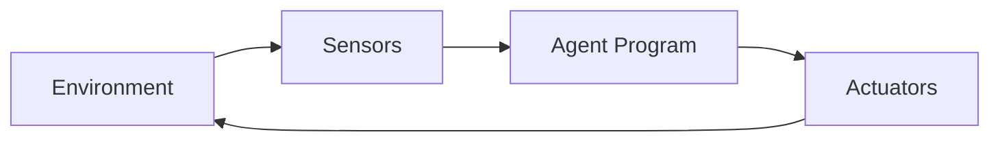
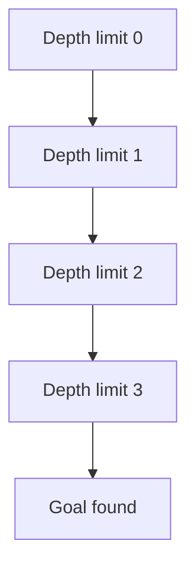
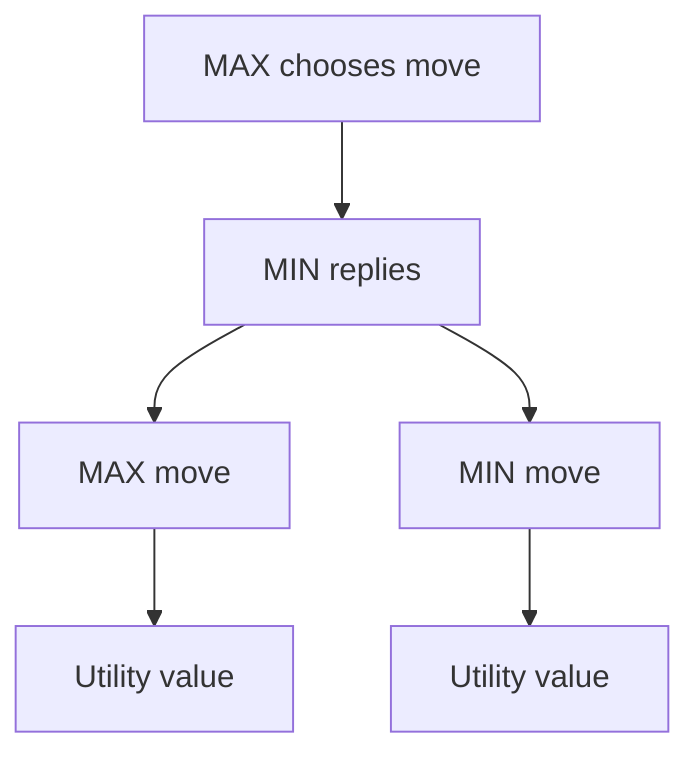
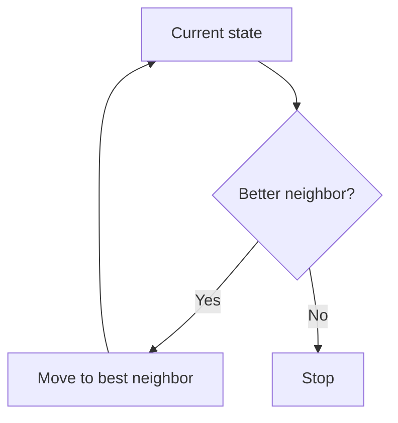
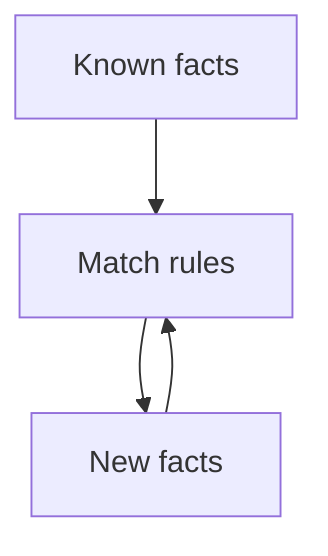
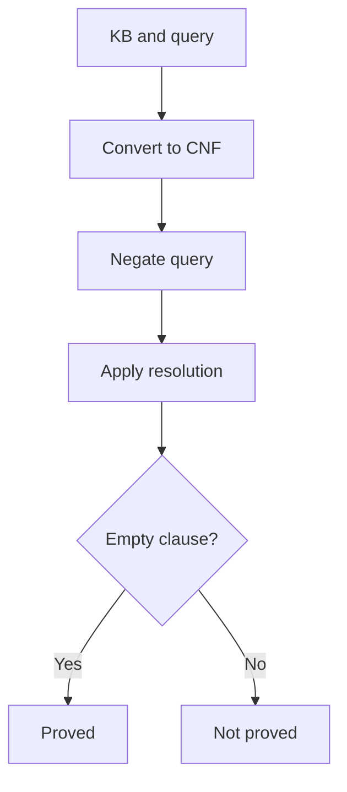
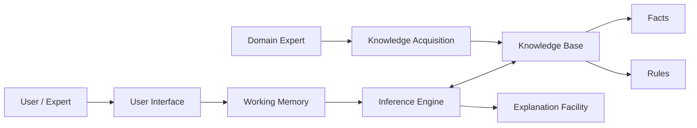
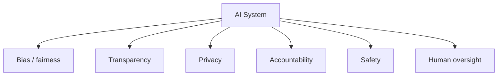

# Artificial Intelligence – Detailed Module-wise Notes

These notes are organized from the six solved question-bank files in the repository and expanded into study-friendly theory.

---

## Module 1: Introduction to Artificial Intelligence & Intelligent Agents

### 1.1 Artificial Intelligence: meaning and scope
Artificial Intelligence (AI) is the branch of computer science that builds systems capable of performing tasks that normally require human intelligence. These tasks include:
- learning from data and experience,
- reasoning and drawing conclusions,
- solving problems,
- understanding language,
- perceiving the environment,
- making decisions and planning actions.

AI is not limited to one technique. It is an umbrella field that includes search, knowledge representation, machine learning, natural language processing, computer vision, robotics, and expert systems.

### 1.2 Characteristics of AI problems
An AI problem is usually one where:
- the state space is large,
- the solution is not obvious,
- brute-force methods are inefficient,
- reasoning, search, or learning is needed,
- there may be uncertainty or incomplete information.

Common examples include:
- route finding,
- 8-puzzle,
- game playing,
- medical diagnosis,
- planning in robotics.

### 1.3 Problem formulation in AI
Problem formulation means converting a real-world task into a formal model that an AI system can solve.

Key components:
- **Initial state**: where the problem starts
- **Actions / operators**: all legal moves
- **Transition model**: result of each action
- **Goal test**: checks whether the target is reached
- **Path cost**: numerical cost of a path

#### Why it matters
A badly formulated problem leads to inefficient or incorrect search. A good formulation makes the state space explicit and computable.


### 1.4 Search as a problem-solving technique
Search is the core problem-solving strategy in AI. The agent explores possible states and action sequences until it finds a path from the initial state to the goal state.

Important terms:
- **State space**: all possible states
- **Search tree**: tree created during expansion
- **Frontier**: nodes generated but not yet expanded
- **Explored set**: states already visited

Search may be:
- **Uninformed**: no extra guidance
- **Informed**: guided by heuristics

### 1.5 Intelligent agents
An intelligent agent perceives its environment through sensors and acts through actuators to achieve goals. A rational agent chooses actions that maximize expected performance based on its percept history and knowledge.

#### Agent loop


### 1.6 Structure of an intelligent agent
An agent usually contains:
- **Sensors**: input from the environment
- **Actuators**: output actions
- **Agent program**: decision-making logic
- **Internal state / memory**: world model
- **Knowledge base**: facts and rules, in knowledge-based agents
- **Performance measure**: criterion for success

### 1.7 Types of intelligent agents
1. **Simple reflex agent**  
   Uses condition-action rules only. No memory. Works well in fully observable environments.

2. **Model-based reflex agent**  
   Maintains internal state to deal with partial observability.

3. **Goal-based agent**  
   Uses goal information and planning to choose actions.

4. **Utility-based agent**  
   Uses a utility function to choose the most desirable action when there are trade-offs.

5. **Learning agent**  
   Improves through experience. It is the most adaptive type.

### 1.8 PEAS representation
PEAS stands for:
- **P**erformance measure
- **E**nvironment
- **A**ctuators
- **S**ensors

It is used to define an agent’s task environment clearly.

Example for an autonomous taxi:
- Performance: safety, legality, comfort, speed
- Environment: roads, traffic, passengers, weather
- Actuators: steering, brake, accelerator
- Sensors: cameras, GPS, radar, LiDAR

### 1.9 Properties of environments
AI environments differ in important ways:
- **Fully observable / partially observable**
- **Deterministic / stochastic**
- **Episodic / sequential**
- **Static / dynamic**
- **Discrete / continuous**
- **Single-agent / multi-agent**

The hardest real-world environments are usually partially observable, dynamic, stochastic, sequential, continuous, and multi-agent.

### 1.10 Applications of AI
Common AI applications include:
- healthcare diagnosis,
- virtual assistants,
- autonomous vehicles,
- recommendation systems,
- fraud detection,
- industrial automation,
- robotics,
- language translation.

---

## Module 2: Uninformed Search & Adversarial Search

### 2.1 Uninformed search
Uninformed search explores the state space without extra information about the goal. It uses only the problem definition.

The main goal is to systematically search for a solution when no heuristic is available.

### 2.2 Breadth First Search (BFS)
BFS expands the shallowest nodes first. It uses a FIFO queue.

Properties:
- **Complete**: yes, if branching factor is finite
- **Optimal**: yes for equal step costs
- **Time**: exponential
- **Space**: exponential

Best when:
- the solution is shallow,
- optimality matters,
- memory is not a major constraint.

### 2.3 Depth First Search (DFS)
DFS explores one branch deeply before backtracking. It uses a stack or recursion.

Properties:
- **Complete**: not always
- **Optimal**: no
- **Time**: exponential
- **Space**: low compared to BFS

Best when:
- memory is limited,
- solutions may be deep,
- any solution is acceptable.

### 2.4 Depth Limited Search (DLS)
DLS is DFS with a depth cutoff. It avoids infinite descent in very deep or infinite search spaces.

Useful when:
- the approximate depth is known,
- the search tree can be infinite.

### 2.5 Iterative Deepening Search (IDS)
IDS combines DFS’s memory efficiency with BFS’s completeness by increasing the depth limit gradually.

Why it is useful:
- complete,
- optimal for unit costs,
- low memory,
- suitable when solution depth is unknown.



### 2.6 Uniform Cost Search (UCS)
UCS expands the node with the lowest path cost first. It is useful when step costs are unequal.

Properties:
- complete if step costs are positive,
- optimal,
- more expensive than BFS in practice when costs vary greatly.

### 2.7 Bidirectional search
Bidirectional search runs two searches simultaneously:
- one forward from the start,
- one backward from the goal.

It can reduce time dramatically when the goal can be worked backward from and the branching factor is manageable.

### 2.8 Comparing uninformed search strategies
A practical rule:
- **BFS**: shallow, optimal, memory-heavy
- **DFS**: memory-light, not optimal
- **DLS**: depth-bounded search
- **IDS**: best general-purpose choice for unknown depth
- **UCS**: best for variable step costs
- **Bidirectional**: best when both directions are feasible

### 2.9 Game playing environments
Game-playing problems are adversarial search problems because one player tries to maximize reward while the opponent tries to minimize it.

Common features:
- competitive multi-agent setting,
- sequential moves,
- discrete states,
- often deterministic,
- usually fully observable.

Examples:
- tic-tac-toe,
- chess,
- checkers,
- connect four.

### 2.10 Minimax algorithm
Minimax is used for two-player, zero-sum games.

Idea:
- MAX tries to maximize utility
- MIN tries to minimize utility

The algorithm assumes optimal play from both sides and chooses the move that gives the best worst-case outcome.



### 2.11 Alpha-beta pruning
Alpha-beta pruning improves minimax by cutting off branches that cannot affect the final decision.

- **Alpha (α)**: best value MAX can guarantee so far
- **Beta (β)**: best value MIN can guarantee so far

If β ≤ α, further search is unnecessary in that branch.

Advantages:
- same result as minimax,
- fewer nodes expanded,
- much faster with good move ordering.

### 2.12 Evaluation functions in games
When the full game tree is too large, evaluation functions estimate the desirability of a position.

A good evaluation function should:
- be fast to compute,
- correlate with winning chances,
- capture important features of the game.

---

## Module 3: Informed Search, Heuristics & Constraint Satisfaction

### 3.1 Informed search
Informed search uses domain knowledge to guide search more efficiently than blind search. This knowledge is usually embedded in a heuristic function.

### 3.2 Heuristic function
A heuristic function `h(n)` estimates the cost from node `n` to a goal.

A good heuristic is:
- non-negative,
- zero at the goal,
- informative,
- cheap to compute.

Important properties:
- **Admissible**: never overestimates the true cost
- **Consistent / monotonic**: obeys triangle inequality-like behavior

### 3.3 Greedy Best-First Search
Greedy best-first search chooses the node that appears closest to the goal.

Evaluation:
- `f(n) = h(n)`

Strength:
- often fast

Weakness:
- can get trapped,
- not guaranteed optimal.

### 3.4 A* search
A* uses both the path cost so far and the estimated remaining cost.

Evaluation:
- `f(n) = g(n) + h(n)`

Where:
- `g(n)` = cost from start to `n`
- `h(n)` = estimated cost from `n` to goal

If the heuristic is admissible, A* is optimal. If it is also consistent, A* is efficient in graph search.

```mermaid
flowchart LR
    Start[Start node] --> G[g(n): cost so far]
    G --> H[h(n): estimated remaining cost]
    H --> F[f(n)=g(n)+h(n)]
    F --> Choice[Expand node with smallest f]
```

### 3.5 Heuristic quality
Better heuristics reduce node expansion. A heuristic that dominates another is usually preferred because it gives more accurate guidance without sacrificing admissibility.

### 3.6 Local search
Local search keeps only the current state and tries to improve it by moving to neighboring states.

It is useful when:
- the full path is not important,
- only the final configuration matters,
- the state space is huge.

Examples:
- optimization,
- scheduling,
- routing variants,
- constraint-based problems.

### 3.7 Hill climbing
Hill climbing repeatedly moves to the best neighbor according to an objective function.

Variants:
- simple hill climbing,
- steepest-ascent hill climbing,
- stochastic hill climbing.

#### Limitations
- **Local maxima**
- **Plateaus**
- **Ridges**



### 3.8 Simulated annealing
Simulated annealing improves hill climbing by occasionally accepting worse moves.

Idea:
- explore widely at high temperature,
- gradually reduce randomness,
- settle near a good solution.

This helps escape local maxima and explore more of the search space.

### 3.9 Constraint Satisfaction Problems (CSP)
A CSP consists of:
- variables,
- domains,
- constraints.

The goal is to assign values to all variables such that all constraints are satisfied.

Examples:
- map coloring,
- scheduling,
- Sudoku,
- cryptarithmetic.

### 3.10 Backtracking search for CSP
Backtracking assigns values one by one and reverses when a conflict occurs.

To improve performance:
- use **MRV** (minimum remaining values),
- use **degree heuristic**,
- use **least constraining value**,
- use **forward checking**,
- use **arc consistency**.

### 3.11 Forward checking
Forward checking removes values from future variable domains after each assignment. It detects failure early and reduces wasted search.

### 3.12 Arc consistency
Arc consistency ensures that for every value of one variable, there is a compatible value in the neighboring variable’s domain.

The AC-3 algorithm is a standard method for enforcing arc consistency.

---

## Module 4: Knowledge Representation & Logical Reasoning

### 4.1 Knowledge representation
Knowledge representation (KR) is the process of encoding information about the world so that an AI system can reason with it.

Common KR methods:
- propositional logic,
- first-order logic,
- semantic networks,
- frames,
- rules,
- ontologies.

### 4.2 Knowledge-based agents
A knowledge-based agent stores facts and rules in a knowledge base and uses inference to decide what to do.

It typically contains:
- knowledge base,
- inference engine,
- percept handling,
- action selection.


### 4.3 Propositional logic
Propositional logic uses propositions that are either true or false.

Limitation:
- cannot express variables, relationships, or general statements.

### 4.4 First-order predicate logic (FOPL/FOL)
FOPL extends propositional logic using:
- predicates,
- variables,
- quantifiers,
- functions.

It can express:
- “All humans are mortal”
- “There exists a student who solved the problem”
- relationships like parent, sibling, ancestor

### 4.5 Propositional logic vs predicate logic
Propositional logic is simpler but less expressive. Predicate logic is more expressive and is used when the domain contains objects and relations.

### 4.6 Forward chaining
Forward chaining is data-driven reasoning:
- start with known facts,
- apply rules whose premises match the facts,
- generate new facts,
- continue until the goal is reached or no new facts appear.

Best for:
- monitoring systems,
- alert systems,
- production systems,
- multiple-query environments.



### 4.7 Backward chaining
Backward chaining is goal-driven reasoning:
- start with a goal,
- find rules that can prove it,
- recursively prove subgoals,
- stop when facts are found.

Best for:
- diagnosis,
- query answering,
- logic programming,
- PROLOG.

### 4.8 Resolution
Resolution is a single inference rule used in automated theorem proving.

Main steps:
1. convert statements to CNF,
2. negate the goal,
3. add it to the knowledge base,
4. resolve clauses repeatedly,
5. derive the empty clause to prove the goal.



### 4.9 Logical consistency
A knowledge base is consistent if it does not contain contradictions.

Why it matters:
- contradictions can make reasoning unreliable,
- in classical logic, contradictions can lead to explosion,
- inconsistent KBs can produce absurd conclusions.

### 4.10 Wumpus World
Wumpus World is a classic environment used to demonstrate KR and logical inference.

It includes:
- pits,
- a Wumpus,
- gold,
- sensors such as breeze, stench, glitter, bump, scream.

It is important because the agent must reason from partial observations.

### 4.11 PROLOG
PROLOG is a logic programming language based on facts, rules, and backward chaining.

Basic structure:
- facts: atomic truths
- rules: logic relations
- queries: questions asked to the system

Useful for:
- family relations,
- symbolic reasoning,
- knowledge-based systems.

### 4.12 Common uses of logical reasoning
Logical reasoning supports:
- theorem proving,
- diagnosis,
- planning,
- expert systems,
- explanation and verification.

---

## Module 5: Generative AI, Transformers & Large Language Models

### 5.1 Generative AI
Generative AI systems create new content by learning patterns from data.

They can generate:
- text,
- code,
- images,
- audio,
- video.

Examples:
- GPT models,
- image generators,
- code assistants.

### 5.2 Transformer architecture
The Transformer is a sequence model built around attention rather than recurrence.

It has:
- encoder,
- decoder,
- self-attention,
- feed-forward layers,
- positional encoding,
- residual connections,
- layer normalization.


### 5.3 Why Transformers are important
Transformers:
- process tokens in parallel,
- capture long-range dependencies,
- scale well,
- work better than traditional RNNs on many tasks.

### 5.4 Self-attention
Self-attention lets each token attend to every other token in the sequence.

Core formula:
- `Q = XWQ`
- `K = XWK`
- `V = XWV`
- `Attention(Q, K, V) = softmax(QK^T / sqrt(dk)) V`

Meaning:
- query asks what to look for,
- key identifies matching content,
- value carries the information to combine.

### 5.5 Multi-head attention
Multi-head attention runs several attention operations in parallel.

Why it helps:
- different heads capture different relationships,
- one head may capture syntax,
- another may capture semantics,
- another may capture coreference.

### 5.6 Positional encoding
Because attention alone does not know token order, positional encodings inject sequence information.

They allow the model to distinguish:
- “dog bites man”
- “man bites dog”

### 5.7 Encoder-decoder architecture
Used in translation, summarization, and other sequence-to-sequence tasks.

- **Encoder**: reads and understands input
- **Decoder**: generates output step by step

### 5.8 BERT
BERT is an encoder-only Transformer model.

It is trained using bidirectional context, which makes it strong for understanding tasks like:
- classification,
- question answering,
- named entity recognition.

### 5.9 GPT
GPT is a decoder-only, autoregressive model.

It predicts the next token from previous tokens, making it especially strong at:
- text generation,
- conversation,
- completion,
- creative writing,
- code generation.

### 5.10 Transformer vs RNN
Transformers generally outperform RNNs because:
- they train in parallel,
- they handle long dependencies better,
- they scale better.

RNNs still help when:
- streaming input is needed,
- memory usage must stay low,
- incremental processing is important.

### 5.11 Choosing the right Transformer family
- **Encoder-only**: understanding tasks
- **Decoder-only**: generation tasks
- **Encoder-decoder**: transformation tasks

---

## Module 6: Expert Systems, AI Applications & Ethics

### 6.1 Expert systems
An expert system mimics a human expert’s decision-making in a narrow domain.

Main components:
- **Knowledge base**: facts and rules
- **Inference engine**: reasoning mechanism
- **User interface**: interaction with users
- **Explanation facility**: explains conclusions
- **Knowledge acquisition module**: collects knowledge from experts



### 6.2 Domain knowledge
Domain knowledge is specialized knowledge about a particular field.

It may include:
- facts,
- heuristics,
- procedures,
- diagnostic rules.

Expert systems are powerful only within their target domain.

### 6.3 Explanation facility
The explanation facility tells the user:
- why a question was asked,
- how a conclusion was reached,
- which rules fired.

This is vital in medical, legal, and safety-critical systems.

### 6.4 Knowledge acquisition
Knowledge acquisition is the process of collecting, organizing, and validating expert knowledge.

This is often one of the hardest parts of building expert systems because expert knowledge is:
- implicit,
- incomplete,
- inconsistent,
- difficult to formalize.

### 6.5 Forward and backward chaining in expert systems
Expert systems may use:
- **forward chaining** for data-driven monitoring,
- **backward chaining** for goal-directed diagnosis.

### 6.6 Medical diagnosis expert system
A medical expert system can:
- collect symptoms,
- match them against rules,
- infer possible diseases,
- recommend tests or treatment,
- provide explanations.

Important features:
- high accuracy,
- safety,
- traceability,
- support for physicians rather than replacement of physicians.

### 6.7 AI applications across industries
AI is used in:
- healthcare,
- finance,
- education,
- manufacturing,
- transportation,
- retail,
- security,
- entertainment,
- agriculture.

#### In healthcare
- image analysis,
- diagnosis,
- drug discovery,
- monitoring,
- robotic assistance.

#### In finance
- fraud detection,
- credit scoring,
- trading,
- risk analysis.

#### In transport
- navigation,
- autonomous vehicles,
- traffic prediction.

### 6.8 Ethical considerations in AI
Ethical AI is essential because AI systems can affect human lives at scale.

Key issues:
1. **Fairness**  
   AI must avoid discrimination and bias.

2. **Transparency and explainability**  
   Users should understand why a decision was made.

3. **Privacy**  
   AI often depends on large amounts of data, which must be protected.

4. **Accountability**  
   There must be clear responsibility for AI decisions and failures.

5. **Safety and reliability**  
   Systems should behave predictably and fail safely.

6. **Human oversight**  
   High-risk decisions should not be fully automated without review.

7. **Employment impact**  
   Automation may replace some tasks, so reskilling and policy support matter.



### 6.9 Responsible AI development
Good AI development requires:
- diverse training data,
- regular audits,
- explainable outputs,
- human-in-the-loop review,
- bias testing,
- privacy safeguards,
- domain expert validation.

### 6.10 Industry significance of AI
AI matters in industry because it can:
- automate repetitive work,
- improve decision quality,
- reduce costs,
- increase speed,
- handle large-scale data,
- support predictive and adaptive systems.

---

## Quick Revision Table

| Module | Core Focus |
|---|---|
| 1 | AI basics, agents, PEAS, problem formulation |
| 2 | Uninformed search, minimax, alpha-beta pruning |
| 3 | Heuristics, A*, local search, CSP |
| 4 | Knowledge representation, logic, chaining, resolution, PROLOG |
| 5 | Generative AI, Transformers, attention, GPT, BERT |
| 6 | Expert systems, AI applications, ethics |

---

## Exam Writing Tips
- Start with a clear definition.
- Add the main components or steps.
- Mention advantages, limitations, and applications.
- Use one neat diagram for 5-mark and 10-mark answers when possible.
- For search and logic topics, always mention the algorithm flow and one example.
- For Transformer and expert-system questions, include architecture diagrams.
