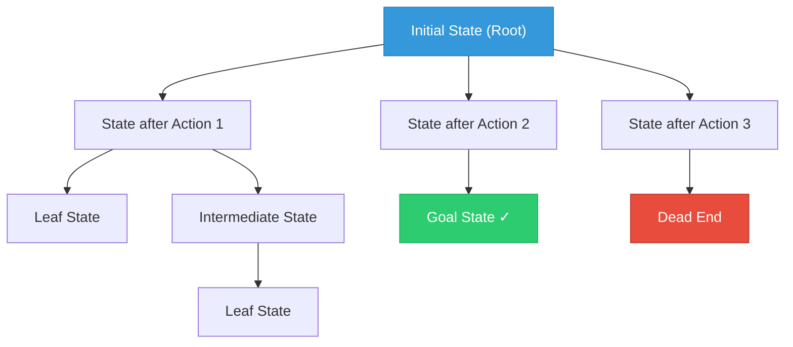
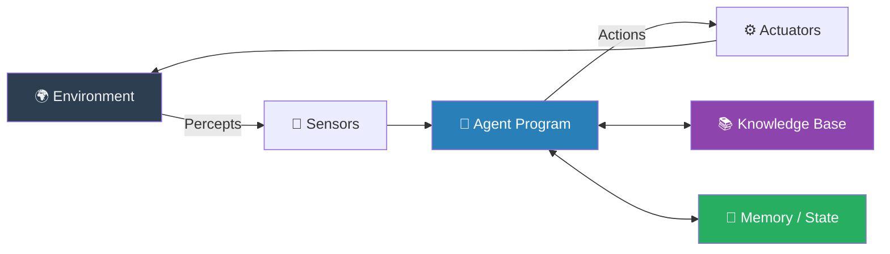
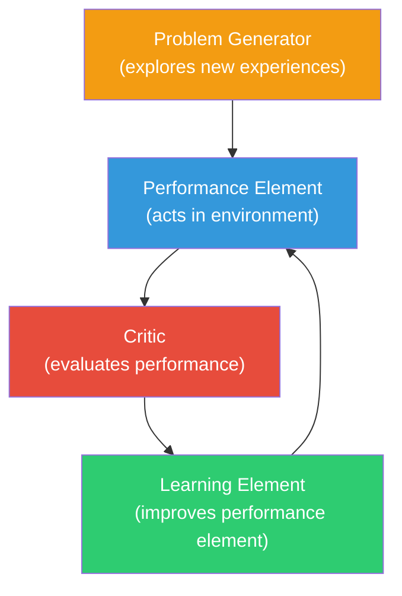

# Module 1: Introduction to Artificial Intelligence & Intelligent Agents

---

## 2 Mark Questions

---

**1. Define Artificial Intelligence.** (2 Marks)

Artificial Intelligence (AI) is the branch of computer science focused on building machines and systems that can perform tasks which typically require human intelligence. These tasks include learning, reasoning, problem-solving, perception, language understanding, and decision-making. AI systems simulate cognitive functions by processing data and making intelligent decisions autonomously.

---

**2. State any two applications of Artificial Intelligence.** (2 Marks)

1. **Healthcare Diagnostics:** AI systems like IBM Watson Health analyze medical images, patient records, and symptoms to assist doctors in diagnosing diseases such as cancer with high accuracy.
2. **Virtual Assistants:** AI-powered assistants like Google Assistant, Siri, and Alexa use natural language processing to understand and respond to user queries, schedule tasks, and control smart devices.

---

**3. Define an AI problem.** (2 Marks)

An AI problem is a well-defined task or situation that requires an intelligent system to find a solution through reasoning, search, or learning. It is characterized by an initial state, a goal state, possible actions, and constraints. An AI problem is typically too complex for straightforward algorithmic solutions and requires intelligent techniques such as heuristics, search strategies, or knowledge representation.

---

**4. Clarify the meaning of problem formulation in AI.** (2 Marks)

Problem formulation in AI is the process of defining and structuring a problem so that it can be solved by an AI system. It involves identifying the initial state (the starting condition), goal state (desired outcome), action space (set of permissible moves), transition model (result of each action), and path cost (cost associated with reaching the goal). Proper formulation converts a real-world problem into a computable model.

---

**5. List any two AI techniques used for problem solving.** (2 Marks)

1. **Search Algorithms:** Techniques like BFS, DFS, and A* explore a problem's state space to find a path from the initial state to the goal state.
2. **Knowledge Representation & Reasoning:** Using logic, rules, and ontologies to encode domain knowledge, enabling systems to infer new facts and make decisions intelligently.

---

**6. Define an intelligent agent.** (2 Marks)

An intelligent agent is any entity that perceives its environment through sensors and acts upon it using actuators to achieve specific goals. It operates autonomously, can learn from experience, and selects actions to maximize its performance measure. An intelligent agent is characterized by its ability to perceive, reason, and act rationally in a given environment.

---

**7. Define an agent environment.** (2 Marks)

An agent environment is the external world in which an intelligent agent operates and interacts. It provides the percepts (inputs) that the agent receives through its sensors and is affected by the actions the agent takes. Environments can be classified as observable or partially observable, static or dynamic, discrete or continuous, deterministic or stochastic, and single-agent or multi-agent.

---

## 5 Mark Questions

---

**8. Explain AI problems with suitable examples.** (5 Marks)

AI problems are tasks that require intelligent reasoning, planning, or decision-making and cannot be solved with simple, fixed algorithms. They are characterized by large, complex state spaces and the need for intelligent navigation.

**Key Characteristics of AI Problems:**
- **Well-defined goal:** A clear desired outcome exists.
- **Complex state space:** The number of possible configurations is enormous.
- **Need for search or reasoning:** The agent must explore or infer to find a solution.

**Examples:**

1. **The 8-Puzzle Problem:** An agent must slide tiles on a 3×3 grid to reach a goal configuration. The state space is 9!/2 = 181,440 states. The AI must use search strategies like A* to find the optimal sequence of moves.

2. **Route Planning (GPS Navigation):** Given a map with cities and distances, the AI must find the shortest or fastest path from a source to a destination. This is an AI problem because the solution space (all possible routes) is vast, and intelligent heuristics are needed.

3. **Game Playing (Chess):** The AI must choose optimal moves against an opponent. The state space is astronomically large (~10^120 positions), requiring adversarial search techniques like Minimax with Alpha-Beta pruning.

4. **Medical Diagnosis:** Given patient symptoms, the AI must identify the most likely disease. This requires reasoning over a knowledge base of medical facts, which is a classic AI problem.

These examples show that AI problems share a common trait: they involve navigating complexity with intelligence rather than brute-force computation.

---

**9. Explain problem formulation in Artificial Intelligence.** (5 Marks)

Problem formulation is the foundational step in AI problem solving. Before an AI agent can search for a solution, the problem must be rigorously defined in a way the computer can understand and process.

**Components of Problem Formulation:**

1. **Initial State:** The starting configuration of the problem. For example, in a route-finding problem, the initial state is the city the agent starts from.

2. **Actions/Operators:** The set of all valid operations the agent can perform. In a chess game, these are all legal moves available to the agent.

3. **Transition Model (Successor Function):** Defines the result of performing each action in each state. It maps (state, action) → new state.

4. **Goal Test:** A condition or set of conditions that determines whether the current state is the goal. This can be an explicit goal state or an abstract property (e.g., "checkmate").

5. **Path Cost:** A numeric value assigned to each path from the initial state to the current state. This is used to evaluate the efficiency of a solution. The cost function f(n) is often defined as the sum of step costs along the path.

**Example — The Vacuum Cleaner Problem:**
- **Initial State:** Agent is in Room A, both rooms may be dirty.
- **Actions:** Move Left, Move Right, Suck.
- **Transition Model:** Moving changes location; Sucking removes dirt.
- **Goal Test:** Both rooms are clean.
- **Path Cost:** Each action costs 1 unit.

Proper problem formulation transforms a real-world challenge into a structured model that AI algorithms can efficiently solve.

---

**10. Explain search as a problem-solving technique in AI.** (5 Marks)

Search is the most fundamental problem-solving technique in AI. When an agent is placed in a complex environment and needs to reach a goal, it must "search" through the space of possible states to find a sequence of actions that leads from the initial state to the goal.

**The Search Process:**

1. **State Space:** The set of all possible states the agent can be in. It forms a graph where nodes are states and edges are actions.
2. **Search Tree:** The agent expands nodes (states) by applying all possible actions, generating a tree of states starting from the root (initial state).
3. **Frontier (Open List):** The set of nodes generated but not yet expanded.
4. **Explored Set (Closed List):** States already visited, used to avoid revisiting.

**Types of Search:**
- **Uninformed Search:** No domain knowledge (e.g., BFS, DFS, UCS).
- **Informed Search:** Uses heuristics to guide the search (e.g., A*, Greedy Best-First).

**Example — Route Finding:**
Given a map of cities, the agent starts at City A and wants to reach City Z. The search algorithm explores possible routes systematically, maintaining a frontier of candidate paths, and returns the optimal route.

Search is powerful because it is a general technique—any problem that can be formulated with states, actions, and a goal can be solved using search. The choice of algorithm depends on the problem's requirements for completeness, optimality, and computational efficiency.

---

**11. Explain applications of Artificial Intelligence in any two domains.** (5 Marks)

AI has transformed numerous industries with intelligent automation, learning, and decision-making.

**1. Healthcare:**
AI is revolutionizing healthcare by improving diagnostics, drug discovery, and patient care.
- **Medical Imaging:** Deep learning models (CNNs) analyze X-rays, MRIs, and CT scans to detect tumors, fractures, and abnormalities with accuracy rivaling radiologists.
- **Drug Discovery:** AI accelerates the identification of drug candidates by predicting molecular interactions, drastically reducing the time from research to clinical trials.
- **Clinical Decision Support:** Expert systems analyze patient data, lab results, and medical history to assist physicians in diagnosis and treatment planning.
- **Robotic Surgery:** AI-guided robotic systems like da Vinci perform minimally invasive surgeries with precision beyond human capability.

**2. Autonomous Vehicles:**
Self-driving cars represent one of the most complex AI applications.
- **Perception:** Computer vision and LiDAR sensors detect pedestrians, vehicles, lane markings, and traffic signs in real time.
- **Decision Making:** Reinforcement learning and planning algorithms enable the vehicle to navigate intersections, merge lanes, and handle unexpected obstacles.
- **Path Planning:** A* and other search algorithms calculate optimal routes while continuously updating based on real-time traffic and road conditions.
- **Safety Systems:** AI continuously monitors sensor data to predict and prevent collisions.

These domains illustrate AI's ability to handle complex, real-world tasks that require perception, reasoning, and adaptive decision-making.

---

**12. Describe the structure of an intelligent agent.** (5 Marks)

An intelligent agent is composed of several interconnected components that enable it to perceive its environment, reason about it, and take appropriate action.

**Key Components:**

1. **Sensors:** The agent's input interface. They perceive the environment and provide percepts. Examples: cameras, microphones, GPS, temperature sensors.

2. **Actuators:** The agent's output interface. They execute actions in the environment. Examples: motors, speakers, robotic arms, display screens.

3. **Agent Program (Brain):** The core intelligence of the agent. It maps percepts to actions using its internal logic, which may include:
   - Simple reflex rules
   - Internal state models
   - Goal-based planning
   - Utility functions

4. **Percept Sequence:** The complete history of everything the agent has perceived. The agent program may use this history to make better decisions.

5. **Performance Measure:** The criterion used to evaluate how well the agent is achieving its goals. A rational agent acts to maximize this measure.

**Agent Architecture:**
```
Environment → [Sensors] → Percepts → [Agent Program] → Actions → [Actuators] → Environment
```

The agent program is the intelligence layer that processes percepts and selects actions. Different agent types (reflex, goal-based, utility-based, learning) vary in the sophistication of this program, from simple condition-action rules to complex machine learning models.

---

**13. Explain types of intelligent agents with examples.** (5 Marks)

Intelligent agents are classified based on their ability to perceive the environment, maintain state, and make decisions.

**1. Simple Reflex Agent:**
Acts solely based on the current percept using condition-action rules. Has no memory.
*Example:* A thermostat — if temperature < threshold, turn ON heater.

**2. Model-Based Reflex Agent:**
Maintains an internal model of the world to handle partially observable environments. It tracks the current state even when the environment isn't fully visible.
*Example:* A self-driving car that tracks the position of nearby vehicles it can no longer directly see.

**3. Goal-Based Agent:**
Uses knowledge of goals to select actions that lead to a desired state. It can plan sequences of actions.
*Example:* A GPS navigation system that finds a route from source to destination using search.

**4. Utility-Based Agent:**
Selects actions based on a utility function that measures the desirability of states. It handles trade-offs and conflicting goals.
*Example:* A stock trading AI that maximizes profit while managing risk — choosing between multiple profitable options based on expected utility.

**5. Learning Agent:**
Improves its performance over time through experience. Consists of a learning element, performance element, critic, and problem generator.
*Example:* AlphaGo — learns to play Go at superhuman level through reinforcement learning.

Each agent type represents an increasing level of intelligence, from pure reactive behavior to adaptive learning systems.

---

**14. Explain PEAS representation for an intelligent agent with example.** (5 Marks)

PEAS stands for **Performance Measure, Environment, Actuators, and Sensors**. It is a structured framework used to fully specify an intelligent agent's task environment and capabilities.

**Components of PEAS:**

| Component | Description |
|---|---|
| **P** - Performance Measure | The criterion for success — how we evaluate the agent's behavior |
| **E** - Environment | The external world the agent inhabits and interacts with |
| **A** - Actuators | The mechanisms through which the agent acts on the environment |
| **S** - Sensors | The mechanisms through which the agent perceives the environment |

**Example 1 — Automated Taxi Driver:**

| | Details |
|---|---|
| **Performance Measure** | Safe trip, fast arrival, legal compliance, passenger comfort, fuel efficiency |
| **Environment** | Roads, traffic, pedestrians, other vehicles, weather conditions, GPS maps |
| **Actuators** | Steering wheel, accelerator, brakes, horn, turn signals |
| **Sensors** | Cameras, LiDAR, radar, GPS, speedometer, ultrasonic sensors |

**Example 2 — Medical Diagnosis System:**

| | Details |
|---|---|
| **Performance Measure** | Diagnostic accuracy, time to diagnosis, patient outcomes |
| **Environment** | Hospital, patient records, lab reports, imaging data |
| **Actuators** | Display screen (shows diagnosis/recommendations) |
| **Sensors** | Keyboard/UI (receives patient data), lab data feeds |

PEAS representation is important because it forces designers to think comprehensively about what the agent must do, in what context it operates, and what capabilities it needs — forming the basis for selecting the appropriate agent architecture.

---

## 10 Mark Questions

---

**15. Explain AI problem solving using search with a neat diagram.** (10 Marks)

AI problem solving through search is a systematic process where an intelligent agent navigates through a space of possible states to find a sequence of actions that leads from an initial state to a goal state.

**The Problem-Solving Framework:**

**Step 1: Problem Formulation**
The agent defines the problem formally:
- **Initial State:** Where does the agent start?
- **Actions:** What can the agent do?
- **Transition Model:** What is the result of each action?
- **Goal Test:** Has the agent reached the goal?
- **Path Cost:** What is the cost of the solution?

**Step 2: Search**
The agent generates a search tree from the initial state, expanding nodes (states) by applying available actions.

**Step 3: Solution**
A solution is a path (sequence of actions) from the initial state to a goal state. An optimal solution has the lowest path cost.

**Search Tree Structure:**



**Key Concepts:**

1. **State Space:** The complete set of all possible states. It is typically represented as a graph.
2. **Node:** A data structure representing a state in the search tree. Contains: state, parent node, action taken, path cost g(n), and depth.
3. **Frontier:** The set of leaf nodes available for expansion (the "edge" of explored territory).
4. **Explored Set:** States already expanded, kept to avoid revisiting in graph search.

**Search Algorithm (General Framework):**
```
function GRAPH-SEARCH(problem):
    frontier ← {Initial-Node}
    explored ← {}
    loop:
        if frontier is empty → return FAILURE
        node ← REMOVE-FRONT(frontier)
        if GOAL-TEST(node.state) → return SOLUTION(node)
        add node.state to explored
        for each action in ACTIONS(node.state):
            child ← CHILD-NODE(problem, node, action)
            if child.state not in explored or frontier:
                add child to frontier
```

**Search Strategy Comparison:**

| Strategy | Complete | Optimal | Time | Space |
|---|---|---|---|---|
| BFS | Yes | Yes (uniform cost) | O(b^d) | O(b^d) |
| DFS | No | No | O(b^m) | O(bm) |
| UCS | Yes | Yes | O(b^(C*/ε)) | O(b^(C*/ε)) |
| A* | Yes | Yes (admissible h) | O(b^d) | O(b^d) |

Where b = branching factor, d = solution depth, m = maximum depth.

**Example — Romania Route Finding:**
An agent wants to travel from Arad to Bucharest on a map of Romanian cities.
- **Initial State:** Arad
- **Actions:** Drive to a directly connected city
- **Goal:** Reach Bucharest
- **Path Cost:** Road distance in km
- A* search uses straight-line distance to Bucharest as a heuristic to find the optimal path efficiently.

AI problem solving through search is powerful because it provides a general, principled way to tackle any problem that can be formulated with states and actions, regardless of the domain.

---

**16. Discuss various applications of Artificial Intelligence and their societal impact.** (10 Marks)

Artificial Intelligence has permeated virtually every aspect of modern life, transforming industries and reshaping societal norms.

**Major Application Domains:**

**1. Healthcare:**
- **Diagnostic AI:** Systems like Google DeepMind's AlphaFold predict protein structures, revolutionizing drug discovery.
- **Radiology:** CNNs detect cancerous cells in mammograms with accuracy matching specialists.
- **Robotic Surgery:** AI-assisted surgical robots perform minimally invasive procedures.
- *Societal Impact:* Democratizes healthcare access, reduces misdiagnosis rates, but raises concerns about data privacy and over-reliance on automated systems.

**2. Education:**
- **Adaptive Learning Platforms:** AI tailors educational content to each student's pace and learning style.
- **Intelligent Tutoring Systems:** Provide personalized feedback and identify gaps in knowledge.
- *Societal Impact:* Improves learning outcomes and accessibility, but risks widening the digital divide for underprivileged students without internet access.

**3. Transportation:**
- **Autonomous Vehicles:** Self-driving cars (Tesla, Waymo) use AI for perception, planning, and control.
- **Traffic Management:** AI optimizes traffic light timing to reduce congestion in smart cities.
- *Societal Impact:* Promises reduced road accidents (94% caused by human error), but threatens jobs for millions of truck and taxi drivers.

**4. Finance:**
- **Fraud Detection:** AI models analyze transaction patterns in real time to flag suspicious activity.
- **Algorithmic Trading:** High-frequency trading bots execute thousands of trades per second based on market analysis.
- *Societal Impact:* Increases financial security, but flash crashes caused by AI trading bots highlight systemic risks.

**5. Entertainment & Social Media:**
- **Recommendation Systems:** Netflix, YouTube, and Spotify use AI to personalize content.
- **Content Generation:** GPT-4, DALL-E, and similar models create text, images, and music.
- *Societal Impact:* Enhances user experience, but recommendation algorithms create filter bubbles that reinforce misinformation and polarization.

**6. National Security & Defense:**
- **Surveillance:** AI-powered facial recognition in public spaces.
- **Autonomous Weapons:** Drones capable of identifying and engaging targets.
- *Societal Impact:* Enhances security but raises severe ethical concerns about privacy, bias in surveillance, and accountability in autonomous lethal decisions.

**Broader Societal Implications:**
- **Employment:** AI automates repetitive tasks, displacing workers in manufacturing, customer service, and data entry while creating new roles in AI development and maintenance.
- **Bias and Fairness:** AI systems trained on biased data can perpetuate discrimination in hiring, lending, and criminal justice.
- **Privacy:** Widespread data collection for AI training raises concerns about surveillance capitalism.
- **Existential Risk:** Advanced AI systems raise long-term questions about control, alignment, and humanity's role in an AI-dominated world.

AI's societal impact is profound and dual-edged — it offers unprecedented benefits in efficiency, accessibility, and capability while demanding careful ethical governance, inclusive policy-making, and responsible development practices.

---

**17. Explain intelligent agents, agent functions, and rationality in AI systems.** (10 Marks)

**Intelligent Agents:**
An intelligent agent is an entity that perceives its environment through sensors and acts upon it through actuators. The key distinction of an *intelligent* agent is its rationality — it selects actions that maximize its expected performance measure based on its percept history and built-in knowledge.

**Agent Function:**
The agent function mathematically maps a percept sequence to an action:
```
f: P* → A
```
Where P* is the set of all possible percept sequences and A is the set of actions.

The **agent program** is the concrete implementation of this function running on a physical computing system.

**Types of Agent Architectures:**
1. **Simple Reflex:** f(current percept) → action
2. **Model-Based:** f(internal state updated by percept history) → action
3. **Goal-Based:** f(state, goals) → action
4. **Utility-Based:** f(state, utility function) → action that maximizes utility
5. **Learning Agent:** Improves f over time through experience

**Rationality:**
A rational agent is one that, for each possible percept sequence, selects the action that maximizes its expected performance measure given its percept history and built-in knowledge.

**Factors Determining Rationality:**
1. The performance measure defining success criteria
2. The agent's prior knowledge of the environment
3. The actions available to the agent
4. The percept sequence received so far

**Rationality vs. Omniscience:**
Rationality is NOT the same as omniscience. An omniscient agent knows the actual outcome of every action, which is impossible in the real world. A rational agent acts based on the *expected* outcome — the best choice given available information.

**Rationality vs. Perfection:**
Rationality maximizes *expected* performance, not actual performance. An agent may make the best possible decision and still fail due to factors outside its knowledge — this is still rational behavior.

**Example:**
A chess-playing AI is rational if it selects the move most likely to lead to a win, given its analysis depth and knowledge of chess strategy. It cannot be "omniscient" about the opponent's future moves, but it can be perfectly rational within its computational constraints.

**Information Gathering and Learning:**
A rational agent should also engage in information gathering when the benefit of gaining knowledge outweighs its cost. Learning from past experiences allows the agent to refine its actions over time, making it increasingly effective.

**PEAS and Rationality:**
The performance measure in PEAS directly defines what rationality means for a specific agent — a rational taxi driver maximizes safety and speed, while a rational chess agent maximizes winning probability.

Rationality is the cornerstone of AI design: building agents that make the best possible decisions given their constraints is the central challenge and goal of artificial intelligence research.

---

**18. Discuss properties of AI environments with real-world examples.** (10 Marks)

The environment in which an AI agent operates profoundly influences the type of agent architecture needed. Russell and Norvig classify environments along several key dimensions.

**1. Fully Observable vs. Partially Observable:**
- **Fully Observable:** The agent has complete access to the full state of the environment through its sensors at all times.
  - *Example:* A chess game — both players can see all pieces on the board.
- **Partially Observable:** The agent can only see a portion of the environment state.
  - *Example:* Poker — a player cannot see opponents' cards. A self-driving car cannot see around corners.

**2. Single-Agent vs. Multi-Agent:**
- **Single-Agent:** Only one agent operates in the environment.
  - *Example:* A crossword puzzle solver operates alone.
- **Multi-Agent:** Multiple agents interact, either cooperatively or competitively.
  - *Example:* Chess (competitive multi-agent), a network of warehouse robots coordinating deliveries (cooperative multi-agent).

**3. Deterministic vs. Stochastic:**
- **Deterministic:** The next state is completely determined by the current state and the agent's action.
  - *Example:* Chess — a move's outcome is fully predictable.
- **Stochastic:** There is uncertainty in the outcome of actions.
  - *Example:* A self-driving car on a road — weather, other drivers, and sensor noise introduce unpredictability.

**4. Episodic vs. Sequential:**
- **Episodic:** Each action is independent; the agent's experience is divided into episodes with no relation to future actions.
  - *Example:* An image classification AI — each image is classified independently.
- **Sequential:** Current actions affect future percepts and decisions.
  - *Example:* Playing chess — each move affects the entire future of the game.

**5. Static vs. Dynamic:**
- **Static:** The environment does not change while the agent is deliberating.
  - *Example:* A crossword puzzle.
- **Dynamic:** The environment changes independently of the agent's actions.
  - *Example:* Stock market, real-time traffic navigation.
- **Semi-dynamic:** The environment itself doesn't change, but the agent's performance score does (e.g., chess with a clock).

**6. Discrete vs. Continuous:**
- **Discrete:** A finite number of distinct states, actions, and percepts.
  - *Example:* Chess with 64 squares and defined pieces.
- **Continuous:** States and actions are continuous, real-valued quantities.
  - *Example:* Autonomous vehicle — steering angle and speed are continuous values.

**7. Known vs. Unknown:**
- **Known:** The agent knows the outcomes of all possible actions (knows the laws governing the environment).
  - *Example:* A card game with published rules.
- **Unknown:** The agent must learn how the environment works.
  - *Example:* An AI exploring a new game without knowing the rules.

**Summary Table:**

| Property | Easy for AI | Hard for AI |
|---|---|---|
| Observability | Fully Observable | Partially Observable |
| Agents | Single-Agent | Multi-Agent |
| Determinism | Deterministic | Stochastic |
| Episode | Episodic | Sequential |
| Dynamics | Static | Dynamic |
| State Space | Discrete | Continuous |

The hardest real-world environments (like autonomous driving) are partially observable, multi-agent, stochastic, sequential, dynamic, and continuous — requiring highly sophisticated AI architectures combining perception, learning, planning, and real-time decision making.

---

**19. Explain the PEAS framework for different real-world AI agents.** (10 Marks)

The PEAS framework provides a standardized method to specify an AI agent's task environment. PEAS stands for **Performance Measure, Environment, Actuators, and Sensors**.

**Why PEAS Matters:**
Before designing an AI agent, we must understand *what* the agent is supposed to do (Performance), *where* it operates (Environment), *how* it acts (Actuators), and *how* it perceives (Sensors). PEAS answers all these questions systematically.

**PEAS for Multiple Real-World AI Agents:**

**1. Autonomous Taxi Driver:**

| Component | Details |
|---|---|
| **Performance** | Safe journey, legal driving, minimal time, fuel efficiency, passenger comfort, fare collected |
| **Environment** | City roads, highways, traffic lights, pedestrians, weather, other vehicles, GPS maps |
| **Actuators** | Steering, accelerator, brakes, horn, turn signals, displays |
| **Sensors** | Cameras, LiDAR, radar, GPS, speedometer, odometer, sonar |

**2. Medical Diagnosis System:**

| Component | Details |
|---|---|
| **Performance** | Diagnostic accuracy, minimizing false negatives, treatment recommendation quality |
| **Environment** | Hospital, patient EHR, lab results, imaging data, physician input |
| **Actuators** | Screen display, alert systems, report generation, automated ordering systems |
| **Sensors** | Medical device data feeds, keyboard input, imaging system interface |

**3. Internet Shopping Agent:**

| Component | Details |
|---|---|
| **Performance** | Best price found, delivery speed, customer satisfaction, trust |
| **Environment** | E-commerce websites, product databases, user preferences, payment systems |
| **Actuators** | Web browser actions (click, fill forms), purchase initiation |
| **Sensors** | HTML page readers, price comparison APIs, user input |

**4. Chess-Playing Agent:**

| Component | Details |
|---|---|
| **Performance** | Win rate, Elo rating improvement |
| **Environment** | 8×8 chessboard, opponent's moves, game clock |
| **Actuators** | Move selection on the board |
| **Sensors** | Board state input (current positions of all pieces) |

**5. Spam Email Filter:**

| Component | Details |
|---|---|
| **Performance** | Accuracy (spam detected vs. ham misclassified), false positive rate |
| **Environment** | Email servers, user inbox, email content and metadata |
| **Actuators** | Move email to spam/inbox, flag, delete |
| **Sensors** | Email headers, body text, sender information, attachment data |

**Key Insight from PEAS Analysis:**
Comparing these agents reveals how dramatically the requirements differ. A taxi driver needs real-time physical actuators and continuous sensors, while a spam filter only needs software-level I/O. PEAS forces designers to think holistically about the agent's complete operational context, preventing critical oversights in agent design.

---

**20. Explain types of intelligent agents and their applications.** (10 Marks)

Intelligent agents are classified by their decision-making architecture. Each type represents a different level of sophistication in perceiving, reasoning, and acting.

**1. Simple Reflex Agent:**

*Architecture:* Maps current percept directly to action using condition-action (if-then) rules. Has no memory.

*Strength:* Simple, fast, requires no complex computation.
*Weakness:* Fails in partially observable environments; cannot handle unseen situations.

*Applications:*
- Simple thermostat control systems
- Basic spam filters using keyword detection
- Traffic light systems with fixed timing

**2. Model-Based Reflex Agent:**

*Architecture:* Maintains an internal state model of the world, updated based on percept history and knowledge of world dynamics.

*Strength:* Handles partially observable environments by tracking what cannot currently be seen.
*Weakness:* Model may be inaccurate; no goal-directed planning.

*Applications:*
- Robot vacuum cleaners (tracks already-cleaned areas)
- Self-driving car lane-keeping systems
- Industrial process monitoring systems

**3. Goal-Based Agent:**

*Architecture:* Uses goal information combined with world state to search for action sequences that reach the goal. Supports planning.

*Strength:* Flexible — can adapt its behavior when goals change; supports lookahead planning.
*Weakness:* Slower than reflex agents; goal specification can be complex.

*Applications:*
- GPS navigation systems (find route to destination)
- Logistics planning software
- Game-playing agents (finding winning strategies)

**4. Utility-Based Agent:**

*Architecture:* Uses a utility function to assign a numeric "desirability" to each state. Selects actions that maximize expected utility, handling conflicting goals and uncertainty.

*Strength:* Optimal decision-making under uncertainty; handles trade-offs gracefully.
*Weakness:* Specifying the utility function correctly is difficult; computationally expensive.

*Applications:*
- Autonomous vehicle decision making (speed vs. safety trade-off)
- Financial trading bots (profit vs. risk trade-off)
- Medical treatment recommendation systems

**5. Learning Agent:**

*Architecture:* Has four components:
- **Performance Element:** Selects actions (the core agent)
- **Critic:** Evaluates performance against a standard
- **Learning Element:** Improves the performance element based on critic feedback
- **Problem Generator:** Suggests exploratory actions to gain new experience

*Strength:* Improves over time; can handle environments the designer didn't anticipate.
*Weakness:* Requires large amounts of training data/experience; may learn suboptimal behaviors.

*Applications:*
- AlphaGo / AlphaZero (game playing)
- Recommendation systems (Netflix, YouTube)
- Natural language processing chatbots (GPT, Gemini)
- Fraud detection systems that adapt to new fraud patterns

**Comparison Summary:**

| Agent Type | Memory | Planning | Learning | Example |
|---|---|---|---|---|
| Simple Reflex | No | No | No | Thermostat |
| Model-Based | Yes | No | No | Robot vacuum |
| Goal-Based | Yes | Yes | No | GPS navigator |
| Utility-Based | Yes | Yes | No | Trading bot |
| Learning | Yes | Yes | Yes | AlphaGo |

---

**21. Explain the structure of intelligent agents and types of agents.** (10 Marks)

**Structure of an Intelligent Agent:**

An intelligent agent consists of both a physical architecture and a software program that together enable it to perceive, reason, and act.

**Core Structural Components:**



**1. Sensors:** Input devices that convert environmental signals into percepts. Examples: cameras (vision), microphones (sound), touch sensors, GPS, thermometers.

**2. Actuators:** Output devices that execute the agent's chosen actions. Examples: motors, robotic arms, speakers, display screens, control signals.

**3. Agent Program:** The computational core that implements the agent function `f: P* → A`. This is where intelligence resides.

**4. Knowledge Base:** Stores facts about the world, domain knowledge, learned patterns, and rules. Consulted by the agent program to make decisions.

**5. Memory / Internal State:** Tracks the current state of the world model, allowing the agent to handle partial observability and sequential decision-making.

**Types of Agents:**

**Simple Reflex Agent:**
- Uses condition-action rules only
- No memory
- Best for fully observable, deterministic environments

**Model-Based Reflex Agent:**
- Maintains an internal world model
- Can handle partial observability
- Updated by: (a) how the world evolves, (b) effect of agent's actions

**Goal-Based Agent:**
- Adds goal information to the model
- Searches for action sequences reaching goals
- More flexible than reflex agents

**Utility-Based Agent:**
- Maps states to real numbers (utility)
- Handles conflicting goals and uncertainty
- Selects actions maximizing expected utility

**Learning Agent:**
The most sophisticated type. Continuously improves through experience.



The learning agent's architecture is foundational to modern AI — systems like GPT, AlphaGo, and recommendation engines all follow this learning feedback loop. The performance element acts, the critic evaluates (using a reward signal or labeled data), and the learning element updates the performance element's internal model, creating a continuous cycle of improvement.

**Conclusion:**
The structure of an intelligent agent — combining sensors, actuators, agent program, knowledge base, and memory — provides a general architecture for building AI systems across any domain. The choice of agent type (reflex, model-based, goal-based, utility-based, or learning) depends on the complexity of the task, the nature of the environment, and the performance requirements of the application.
