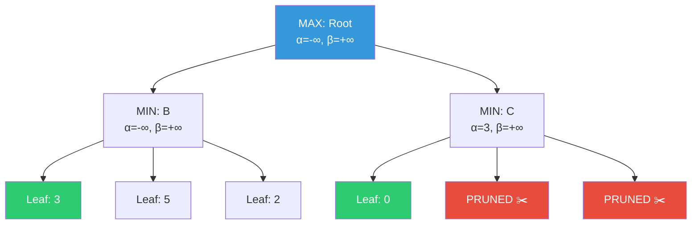
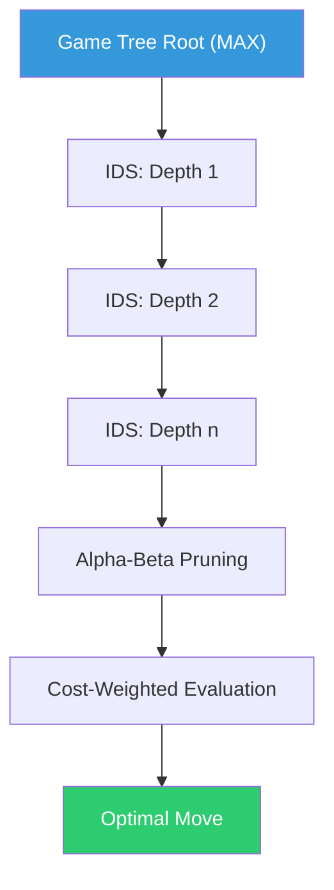
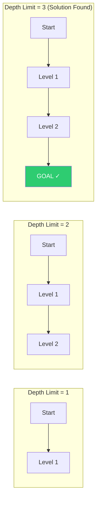
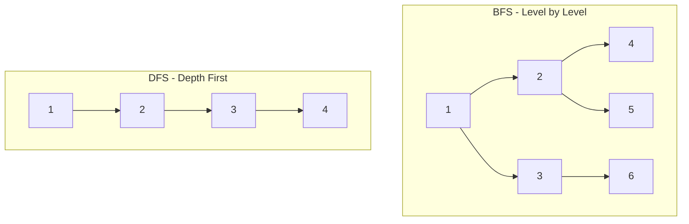
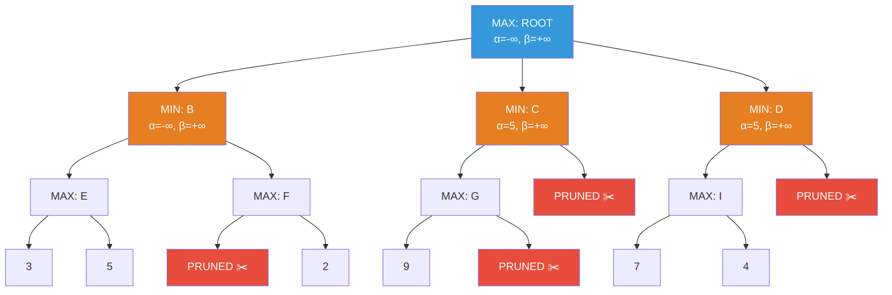
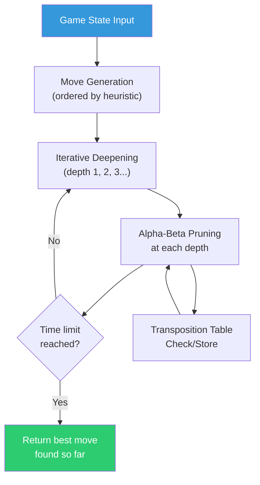
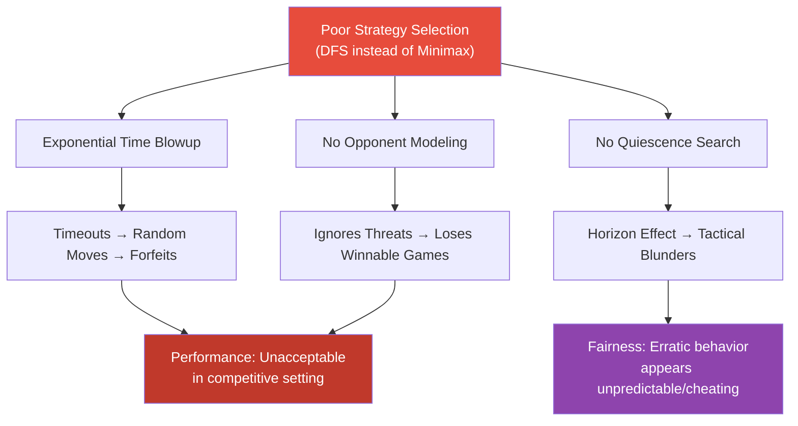

# Module 2: Uninformed Search & Adversarial Search

---

## 2 Mark Questions

---

**22. Define uninformed search and state its role in AI problem solving.** (2 Marks)

Uninformed search (also called blind search) is a class of search strategies that explore the state space without any additional information about how close a state is to the goal beyond the problem definition itself. These strategies have no domain-specific knowledge to guide the search direction. Their role in AI problem solving is to provide guaranteed, systematic exploration of the state space — ensuring completeness and, in some cases, optimality — when no heuristic information is available.

---

**23. What is Breadth First Search (BFS) and why is it considered complete?** (2 Marks)

Breadth First Search (BFS) is a search strategy that expands all nodes at depth d before expanding any node at depth d+1. It explores the search tree level by level, using a FIFO (First-In, First-Out) queue as the frontier. BFS is considered complete because if a solution exists at any finite depth, BFS will always find it — it systematically explores every node at each level before going deeper, guaranteeing that no reachable state is missed.

---

**24. State one limitation of Depth First Search (DFS).** (2 Marks)

A key limitation of Depth First Search is that it is **not complete in infinite state spaces** and can get trapped in infinite loops if cycles exist without proper visited-state tracking. Additionally, DFS is **not optimal** — it may find a solution that is far from the shallowest or cheapest, since it prioritizes depth over cost. In the worst case, DFS may explore the entire wrong subtree before finding the goal.

---

**25. State the purpose of path cost in Uniform Cost Search (UCS).** (2 Marks)

In Uniform Cost Search, the path cost g(n) represents the total accumulated cost from the initial state to the current node n. The purpose of tracking path cost is to ensure the algorithm always expands the node with the **lowest total path cost** first, rather than the shallowest node. This guarantees that UCS finds the **optimal (least-cost) solution**, making it ideal for problems where actions have varying costs, such as road navigation with different road lengths.

---

**26. Compare BFS and DFS with respect to memory requirements.** (2 Marks)

| | BFS | DFS |
|---|---|---|
| **Memory** | O(b^d) — stores all nodes at the current depth level | O(bm) — stores only nodes on the current path |
| **Reason** | Must keep the entire frontier (all nodes at level d) in memory | Only needs to store the path from root to current node plus siblings |

BFS has significantly higher memory requirements than DFS. For large branching factors or deep solutions, BFS can exhaust system memory, while DFS is memory-efficient as it only tracks one path at a time.

---

**27. Discuss the depth limit in Depth Limited Search (DLS).** (2 Marks)

The depth limit l in Depth Limited Search is a predefined maximum depth to which the search is allowed to proceed. DLS runs DFS but stops expanding any node whose depth equals l. This prevents infinite loops in infinite state spaces and controls memory usage. However, if the goal lies beyond depth l, DLS returns failure — making the choice of l critical. If l < d (solution depth), the search fails; if l ≥ d, it may find the solution. A well-chosen depth limit based on domain knowledge avoids both under-searching and over-searching.

---

**28. State one drawback of Iterative Deepening Search.** (2 Marks)

The primary drawback of Iterative Deepening Search (IDS) is **repeated node generation** — nodes near the top of the search tree are regenerated multiple times across iterations. Specifically, nodes at depth d are expanded once, nodes at depth d-1 are expanded b times, and nodes at depth d-2 are expanded b² times. Although this overhead is bounded by O(b/(b-1)) ≈ O(1) for large branching factors, it does result in redundant computation. IDS also lacks the ability to handle non-unit step costs optimally without modification.

---

## 5 Mark Questions

---

**29. A search problem has unknown solution depth and large branching factor. Analyze which uninformed search strategy is most suitable and justify your answer.** (5 Marks)

**Scenario Analysis:**
- **Unknown solution depth:** Strategies requiring a predefined depth limit (DLS) will fail or require trial-and-error.
- **Large branching factor:** BFS and UCS will exhaust memory since they store all frontier nodes O(b^d).
- **Goal:** Complete, memory-efficient search.

**Analysis of Candidates:**

| Strategy | Memory | Complete | Issue with this scenario |
|---|---|---|---|
| BFS | O(b^d) — exponential | Yes | Infeasible due to large b |
| DFS | O(bm) | No (may loop) | Not complete; wrong path possible |
| DLS | O(bl) | No | Unknown depth means l is arbitrary |
| IDS | O(bd) | Yes | Best fit |
| UCS | O(b^(C*/ε)) | Yes | Memory issue for large b |

**Recommended Strategy: Iterative Deepening Search (IDS)**

**Justification:**
1. **Completeness:** IDS will always find a solution if one exists, regardless of how deep it is — because it systematically increases the depth limit from 0 to ∞.
2. **Memory Efficiency:** IDS uses O(bd) memory — linear in the solution depth, not exponential. This is critical when b is large.
3. **No predefined depth needed:** Since the depth limit grows incrementally, unknown solution depth is not a problem.
4. **Optimality (unit cost):** For problems with uniform step costs, IDS is optimal as it finds the shallowest solution first.
5. **Redundant computation is acceptable:** While nodes are re-expanded, the overhead for large branching factors is relatively small (approximately b/(b-1) extra work).

**Conclusion:** IDS combines the space efficiency of DFS with the completeness of BFS, making it the ideal strategy when both solution depth is unknown and the branching factor is large.

---

**30. Describe Bidirectional Search and explain its advantages with an example.** (5 Marks)

**Bidirectional Search** is an uninformed search strategy that runs two simultaneous searches — one forward from the initial state and one backward from the goal state — until the two frontiers meet at an intermediate state.

**How It Works:**
1. The forward search expands from the initial state toward the goal.
2. The backward search expands from the goal state toward the initial state.
3. The search terminates when a node is found to exist in both frontiers.
4. The solution is the path: Initial → meeting point → Goal.

**Key Implementation Detail:**
The backward search requires the ability to compute predecessor states — given a state s and an action a that leads to s, what state was the predecessor? This requires the problem to have an explicit goal state and invertible actions.

**Complexity Analysis:**

| Metric | Standard BFS | Bidirectional BFS |
|---|---|---|
| Time | O(b^d) | O(b^(d/2)) |
| Space | O(b^d) | O(b^(d/2)) |

The exponential reduction from d to d/2 in the exponent is dramatic — for b=10 and d=10, BFS explores 10^10 nodes while Bidirectional reduces this to approximately 2 × 10^5.

**Example — Romania Route Finding:**
- **Forward:** Expand from Arad toward Bucharest
- **Backward:** Expand from Bucharest toward Arad
- Both searches meet at an intermediate city (e.g., Fagaras)
- Solution: Arad → ... → Fagaras → ... → Bucharest

**Advantages:**
1. **Drastically reduced time and space complexity** — from O(b^d) to O(b^(d/2)).
2. **Practical for large state spaces** where standard BFS is computationally infeasible.
3. Can be applied with different strategies in each direction (e.g., BFS forward, heuristic backward).

**Limitation:** Requires an explicit, known goal state and the ability to generate predecessor states — impossible for problems with implicit goals.

---

**31. Explain how time and space complexity affect the choice of uninformed search techniques.** (5 Marks)

Complexity analysis is fundamental to selecting the right uninformed search technique. Two dimensions matter: **time complexity** (number of nodes generated/expanded) and **space complexity** (maximum nodes stored in memory simultaneously).

**Complexity of Uninformed Search Strategies:**

| Algorithm | Time Complexity | Space Complexity | Optimal | Complete |
|---|---|---|---|---|
| BFS | O(b^d) | O(b^d) | Yes* | Yes |
| DFS | O(b^m) | O(bm) | No | No** |
| DLS | O(b^l) | O(bl) | No | No |
| IDS | O(b^d) | O(bd) | Yes* | Yes |
| UCS | O(b^(1+⌊C*/ε⌋)) | O(b^(1+⌊C*/ε⌋)) | Yes | Yes |
| Bidirectional | O(b^(d/2)) | O(b^(d/2)) | Yes* | Yes |

*With uniform step costs. **Incomplete only in infinite spaces.

**Impact on Choice:**

**Time Complexity:**
- For shallow solutions (small d), BFS is fast and simple.
- For deep solutions with large branching factors, BFS's O(b^d) becomes intractable.
- DFS with O(b^m) can be slow if the wrong path is followed to maximum depth m.
- IDS has the same asymptotic time complexity as BFS but with better space usage.

**Space Complexity:**
- This is often the binding constraint in practice.
- BFS storing O(b^d) nodes is the major reason it fails for large problems. For b=10, d=12: 10^12 nodes — far beyond RAM capacity.
- DFS with O(bm) space is the most memory-efficient for deep state spaces.
- IDS's O(bd) space is the best of both worlds for unknown-depth problems.

**Practical Decision Framework:**
1. If solution depth is very shallow → BFS (simple, complete, optimal)
2. If memory is severely limited → DFS (but risk incompleteness)
3. If solution depth is unknown + large branching factor → IDS
4. If costs are non-uniform → UCS (guarantees optimal cost)
5. If explicit goal state available + large d → Bidirectional BFS

**Real-World Impact:**
A route planning app cannot use BFS on a national road network — the state space is too large. Instead, it uses informed search (A*). For simpler constraint-satisfaction problems, IDS provides a practical uninformed solution.

---

**32. Discuss the need for Uniform Cost Search in real-world AI applications.** (5 Marks)

Uniform Cost Search (UCS) is an uninformed search strategy that expands the node with the lowest total path cost g(n) using a priority queue (min-heap). Unlike BFS which assumes equal step costs, UCS handles **heterogeneous, non-uniform action costs** — a critical requirement in real-world problems.

**Why UCS Is Needed:**

In real-world scenarios, not all actions cost the same:
- Driving 5 km on a highway is faster (lower time cost) than driving 5 km in a city.
- Sending a packet over different network routes has different latency costs.
- Moving a robot on flat terrain costs less energy than climbing a slope.

BFS would treat all these paths equally and find the shallowest solution — which may have the highest cost. UCS finds the **optimal-cost solution** by always expanding the cheapest path so far.

**Algorithm Overview:**
```
Priority Queue ordered by g(n) [lowest cost first]
Expand node with minimum g(n)
```

**Real-World Applications:**

1. **GPS Route Navigation:**
   Edge weights = road distances or travel times. UCS finds the shortest or fastest route — the exact problem Dijkstra's algorithm (equivalent to UCS) solves on weighted graphs.

2. **Network Routing Protocols:**
   Routers use UCS-like algorithms (OSPF, Dijkstra) to find least-cost paths for packet transmission, where cost may represent latency, bandwidth, or hop count.

3. **Supply Chain Optimization:**
   Finding the minimum-cost shipping route from supplier to customer, where different transportation modes have different costs.

4. **Robot Path Planning:**
   Moving across terrain with varying energy costs per step — UCS finds the minimum-energy path.

**Properties of UCS:**
- **Complete:** Yes (assuming step costs > ε > 0, preventing zero-cost infinite loops)
- **Optimal:** Yes — always finds the minimum-cost solution
- **Time/Space:** O(b^(1+⌊C*/ε⌋)) where C* is the optimal solution cost and ε is the minimum step cost

**Conclusion:** UCS is essential for any real-world AI application involving optimization over non-uniform costs — which describes the vast majority of practical AI problems.

---

**33. Explain the role of game-playing environments in adversarial search.** (5 Marks)

Game-playing environments provide the perfect context for adversarial search because they naturally model scenarios where one agent's gain is another's loss — exactly the competitive, multi-agent setting adversarial search is designed for.

**Characteristics of Game-Playing Environments:**

1. **Competitive Multi-Agent:** Two or more agents with opposing goals (MAX player wants to win, MIN player wants MAX to lose).
2. **Deterministic (mostly):** Chess, Tic-Tac-Toe — outcomes of moves are fully predictable.
3. **Sequential:** Each move permanently alters the game state for all future moves.
4. **Discrete State Space:** A finite (though often enormous) set of board configurations.
5. **Fully Observable:** Both players can see the complete game state.

**Why They Drive Adversarial Search:**
The fundamental challenge is that the AI cannot simply plan a path to a goal — the opponent actively tries to prevent it. This requires the agent to model the opponent's strategy and select moves that are optimal even under adversarial interference.

**Adversarial Search in Game Environments:**

The **Minimax algorithm** is the core adversarial search technique:
- **MAX node:** The AI agent chooses the action with the highest value.
- **MIN node:** The opponent chooses the action with the lowest value (worst for MAX).
- The agent searches the full game tree to determine the optimal move.

**Game Tree Example:**
```
           MAX (AI's turn)
          /       |       \
        MIN      MIN      MIN (Opponent's turn)
       / \      / \      / \
      3   5    2   9    8   6   (Terminal values)
```
MAX chooses the branch where MIN gives the best worst-case — selects max(5, 2, 6) but under MIN's constraint.

**Real-World Game Applications:**
- **Chess:** Deep Blue defeated Kasparov using Minimax with Alpha-Beta pruning.
- **Go:** AlphaGo uses Monte Carlo Tree Search + deep learning — adversarial search with heuristic evaluation.
- **Poker (Stochastic):** Expectiminimax handles chance nodes in stochastic games.

**Beyond Games:** The adversarial search framework generalizes to any competitive AI scenario — network security (attacker vs. defender), autonomous vehicles (predicting adversarial pedestrian behavior), and multi-agent negotiation systems.

---

**34. A game-playing agent uses Minimax but performs slowly. Explain the possible reasons.** (5 Marks)

Minimax explores the complete game tree to determine optimal play, which can be computationally prohibitive. Several factors can cause a Minimax-based agent to perform slowly:

**1. Large Branching Factor (b):**
Chess has an average branching factor of ~35 (35 legal moves per position). At depth 10, this means 35^10 ≈ 2.76 × 10^15 nodes — impossible to evaluate completely. The time complexity O(b^m) grows exponentially with branching factor.

**2. Large Search Depth (m):**
A chess endgame may require planning 40+ moves ahead for optimal play. Even with b=10, O(10^40) evaluations are infeasible. The agent may be configured with an unnecessarily deep search limit.

**3. No Alpha-Beta Pruning:**
Without pruning, Minimax evaluates every node in the game tree. Alpha-Beta pruning can reduce the effective branching factor from b to approximately √b, dramatically cutting computation. A Minimax agent without pruning wastes enormous time evaluating provably suboptimal branches.

**4. Expensive Evaluation Function:**
At non-terminal nodes (when depth limit is reached), a static evaluation function estimates the state's value. If this function is computationally expensive (e.g., running a neural network evaluation for every node), the total computation time multiplies.

**5. No Transposition Table:**
Many game positions can be reached via different move sequences (transpositions). Without a hash table of previously evaluated positions, the agent recomputes the same state's value repeatedly, wasting significant time.

**6. No Move Ordering:**
Alpha-Beta pruning is most effective when better moves are evaluated first. Poor move ordering (evaluating weak moves early) reduces pruning effectiveness, causing near-worst-case performance.

**Solutions:**
- Implement Alpha-Beta pruning to reduce effective branching factor
- Use iterative deepening with time management
- Implement transposition tables for memoization
- Apply move ordering heuristics (killer moves, history heuristic)
- Use quiescence search instead of arbitrary depth cutoffs
- Replace deep search with Monte Carlo Tree Search for very large game trees

---

**35. Perform Alpha-Beta Pruning on a game tree. Assume the root is MAX. Show intermediate α, β values and mark pruned branches. Find the optimal value at the root.** (5 Marks)

Alpha-Beta pruning is an optimization of the Minimax algorithm that eliminates branches provably unable to influence the final decision.

**Key Rules:**
- **α (alpha):** Best value MAX can guarantee so far (initialized to -∞)
- **β (beta):** Best value MIN can guarantee so far (initialized to +∞)
- **Pruning:** At a MIN node, prune if the node's value ≤ α (MAX already has better). At a MAX node, prune if value ≥ β (MIN already has better).

**Example Game Tree:**



**Step-by-Step Trace:**

| Step | Node | Action | α | β | Result |
|---|---|---|---|---|---|
| 1 | Root (MAX) | Initialize | -∞ | +∞ | — |
| 2 | B (MIN) | Expand leaf D=3 | -∞→3 | +∞ | α updated at Root |
| 3 | B (MIN) | Expand leaf E=5 | 3 | 5→5 | β=5 > α=3, continue |
| 4 | B (MIN) | Expand leaf F=2 | 3 | 5→2 | B returns min(3,5,2)=2... wait, MIN takes min. B=min(3,5,2)=2. But Root sees value=3 from B... |
| 5 | Root (MAX) | B returns 3, α=3 | 3 | +∞ | α=3 |
| 6 | C (MIN) | Expand leaf G=0 | 3 | +∞→0 | β=0 ≤ α=3 → PRUNE remaining children of C |
| 7 | Root | C returns ≤0, Root chooses B | — | — | **Optimal = 3** |

**Result:** The optimal value at the root is **3** (MAX chooses node B). The remaining children of C are pruned because MIN at C can guarantee ≤0, which MAX (with α=3) will never choose.

**Pruning Efficiency:** Alpha-Beta reduces worst-case O(b^m) to O(b^(m/2)) with perfect ordering — effectively doubling search depth for the same computation.

---

## 10 Mark Questions

---

**36. A game tree has varying path costs and depth. Analyze the problem and recommend a suitable uninformed or adversarial search technique.** (10 Marks)

**Problem Scenario Analysis:**
A game tree with varying path costs and depth presents a combined challenge:
- **Varying path costs:** Actions have different costs; a simple move count doesn't reflect true quality.
- **Variable depth:** The game tree is not balanced; some branches terminate early (short games) while others extend deeply (complex positions).
- **Adversarial nature:** Two agents with opposing goals compete.

**Challenges This Scenario Presents:**

1. **Standard Minimax** uses depth-limited search treating all paths equally — inappropriate when path costs vary.
2. **BFS/DFS** are not designed for adversarial settings.
3. **UCS** finds minimum-cost paths but doesn't account for adversarial opponents.

**Recommended Strategy: Cost-Sensitive Minimax with Alpha-Beta Pruning + Iterative Deepening**

**Component 1: Expectiminimax for Cost Integration**
Since path costs vary, we augment the evaluation function to incorporate cumulative path cost:
```
f(n) = g(n) + h(n)
```
where g(n) is the cost accumulated to reach state n, and h(n) is a static heuristic evaluation of the state's strategic value.

**Component 2: Alpha-Beta Pruning**
Essential for performance. With a variable branching factor and depth, Alpha-Beta pruning eliminates provably suboptimal branches, reducing the effective tree size.

**Component 3: Iterative Deepening Search (adversarial)**
Since depth is variable (unknown in advance):
- Search to depth 1, then 2, then 3, etc.
- At each iteration, apply Minimax with Alpha-Beta.
- Use a time limit to cut off computation.
- Move ordering from previous iteration improves pruning in the next.



**Justification:**

| Challenge | Solution | Why |
|---|---|---|
| Varying path costs | Cost-weighted evaluation | Integrates g(n) into node evaluation |
| Variable depth | Iterative Deepening | No fixed depth limit needed; adapts to tree structure |
| Adversarial | Minimax | Models opponent as optimal adversary |
| Performance | Alpha-Beta | Reduces O(b^m) to O(b^(m/2)) |
| Time limit | IDS + cutoff | Returns best move found so far within time budget |

**Additional Technique — Quiescence Search:**
At non-terminal cutoff nodes, continue searching until a "quiet" position (no captures or major threats) is reached. This prevents the horizon effect where the agent misses a devastating opponent move just beyond its search depth — especially important when path costs vary (a cheap move may lead to an expensive loss).

**Final Recommendation:**
Implement **Iterative Deepening Minimax with Alpha-Beta Pruning and a cost-integrated evaluation function**, supplemented by quiescence search at leaf nodes. This combination handles all three challenges: varying costs, variable depth, and adversarial competition.

---

**37. Describe a complete algorithmic workflow for solving a problem using Iterative Deepening Search.** (10 Marks)

Iterative Deepening Search (IDS) combines the space efficiency of DFS with the completeness and level-order guarantee of BFS by repeatedly running depth-limited DFS with increasing depth limits.

**Motivation:**
- BFS is complete and optimal but requires O(b^d) space — prohibitive for large problems.
- DFS uses O(bd) space but is incomplete (may loop) and non-optimal.
- IDS resolves this tension: O(bd) space + complete + optimal (uniform step costs).

**Complete Algorithmic Workflow:**

```
Algorithm: ITERATIVE-DEEPENING-SEARCH(problem)
  for depth_limit = 0, 1, 2, 3, ... do:
    result ← DEPTH-LIMITED-SEARCH(problem, depth_limit)
    if result ≠ CUTOFF then
      return result

Algorithm: DEPTH-LIMITED-SEARCH(problem, limit)
  return RECURSIVE-DLS(MAKE-NODE(problem.INITIAL_STATE), problem, limit)

Algorithm: RECURSIVE-DLS(node, problem, limit)
  if GOAL-TEST(node.STATE) then
    return SOLUTION(node)
  else if limit == 0 then
    return CUTOFF
  else:
    cutoff_occurred ← false
    for each action in ACTIONS(node.STATE):
      child ← CHILD-NODE(problem, node, action)
      result ← RECURSIVE-DLS(child, problem, limit - 1)
      if result == CUTOFF then
        cutoff_occurred ← true
      else if result ≠ FAILURE then
        return result
    if cutoff_occurred then return CUTOFF
    else return FAILURE
```

**Step-by-Step Example — Solving the 8-Puzzle:**

**Initial State:**
```
[1][2][3]
[4][_][6]
[7][5][8]
```
**Goal State:**
```
[1][2][3]
[4][5][6]
[7][8][_]
```

**IDS Execution:**

| Iteration | Depth Limit | Nodes Explored | Result |
|---|---|---|---|
| 1 | 0 | 1 (initial state) | CUTOFF |
| 2 | 1 | 1 + 4 = 5 | CUTOFF |
| 3 | 2 | ~13 | CUTOFF |
| 4 | 3 | ~41 | CUTOFF |
| ... | ... | ... | ... |
| k | Solution depth d | O(b^d) | SOLUTION |

**Visualization of Increasing Depth:**



**Node Regeneration Analysis:**
In IDS, nodes near the root are regenerated multiple times. For a tree with branching factor b and solution depth d:
- Nodes at depth d: generated 1 time
- Nodes at depth d-1: generated b times (once per iteration beyond d-1)
- Nodes at depth 1: generated b^(d-1) times

Total nodes generated ≈ (b/(b-1)) × b^d

For b = 10: Total ≈ 1.11 × b^d (only 11% overhead vs. BFS!)

**Properties:**
- **Complete:** Yes — finds solution at any finite depth
- **Optimal:** Yes for uniform step costs
- **Time Complexity:** O(b^d) — same as BFS asymptotically
- **Space Complexity:** O(bd) — same as DFS (linear!)

**When to Use IDS:**
- Unknown solution depth
- Large state spaces where BFS memory is prohibitive
- Unit-cost problems requiring optimality
- As the baseline complete uninformed strategy

IDS is considered the preferred uninformed search method for large finite problems due to its ideal balance of completeness, optimality, and memory efficiency.

---

**38. Explain different uninformed search techniques and analyze their completeness and optimality.** (10 Marks)

Uninformed (blind) search strategies explore the state space systematically without domain-specific knowledge. Each strategy differs in the order in which it expands nodes, leading to different performance characteristics.

**1. Breadth-First Search (BFS):**

*Strategy:* Expand the shallowest unexpanded node. Uses a FIFO queue.

*Analysis:*
- **Complete:** Yes — if b is finite and solution depth d is finite, BFS always finds it.
- **Optimal:** Yes — finds the shallowest solution (optimal if all step costs are equal or increasing with depth).
- **Time:** O(b^d) — exponential in solution depth.
- **Space:** O(b^d) — stores all nodes at current depth.

*Verdict:* Ideal for shallow solutions; impractical for deep solutions due to memory.

**2. Depth-First Search (DFS):**

*Strategy:* Expand the deepest unexpanded node. Uses a LIFO stack.

*Analysis:*
- **Complete:** No — in infinite-depth or cyclic state spaces, DFS may loop forever. Complete in finite, acyclic spaces.
- **Optimal:** No — finds the leftmost (not necessarily shallowest or cheapest) solution.
- **Time:** O(b^m) — m is maximum depth (potentially much larger than d).
- **Space:** O(bm) — only stores current path and siblings.

*Verdict:* Memory-efficient but unreliable. Useful when any solution is acceptable.

**3. Depth-Limited Search (DLS):**

*Strategy:* DFS with a predetermined depth limit l.

*Analysis:*
- **Complete:** No — if l < d (solution depth), search fails. Complete if l ≥ d.
- **Optimal:** No — like DFS, does not guarantee shallowest solution.
- **Time:** O(b^l).
- **Space:** O(bl).

*Verdict:* Addresses DFS's infinite-loop problem but requires knowledge of solution depth.

**4. Iterative Deepening Search (IDS):**

*Strategy:* Repeatedly run DLS with increasing depth limits (0, 1, 2, ...).

*Analysis:*
- **Complete:** Yes — finds solution at any finite depth.
- **Optimal:** Yes — for uniform step costs (finds shallowest solution first).
- **Time:** O(b^d) — same as BFS asymptotically.
- **Space:** O(bd) — same as DFS.

*Verdict:* Best of BFS (complete, optimal) + DFS (memory efficient). Preferred uninformed strategy for unknown-depth problems.

**5. Uniform Cost Search (UCS):**

*Strategy:* Expand the node with the lowest cumulative path cost g(n). Uses a priority queue.

*Analysis:*
- **Complete:** Yes — provided all step costs > ε > 0.
- **Optimal:** Yes — always finds minimum-cost solution.
- **Time:** O(b^(1+⌊C*/ε⌋)) where C* is optimal solution cost.
- **Space:** O(b^(1+⌊C*/ε⌋)).

*Verdict:* Essential when action costs vary; generalizes BFS with weighted edges.

**6. Bidirectional BFS:**

*Strategy:* Run BFS simultaneously from initial state and goal state.

*Analysis:*
- **Complete:** Yes.
- **Optimal:** Yes (with BFS in both directions).
- **Time:** O(b^(d/2)).
- **Space:** O(b^(d/2)).

*Verdict:* Dramatic complexity reduction for known goals; requires predecessor computation.

**Comprehensive Comparison:**

| Algorithm | Complete | Optimal | Time | Space |
|---|---|---|---|---|
| BFS | Yes | Yes* | O(b^d) | O(b^d) |
| DFS | No | No | O(b^m) | O(bm) |
| DLS | No | No | O(b^l) | O(bl) |
| IDS | Yes | Yes* | O(b^d) | O(bd) |
| UCS | Yes | Yes | O(b^(C*/ε)) | O(b^(C*/ε)) |
| Bidirectional | Yes | Yes* | O(b^(d/2)) | O(b^(d/2)) |

*For uniform step costs.

**Visualization of Search Order:**



**Selection Guidelines:**
- Shallow solution, memory available → BFS
- Very deep solution, memory constrained → DFS
- Unknown depth, large state space → IDS
- Non-uniform costs → UCS
- Known goal, large branching factor → Bidirectional BFS

---

**39. Perform Alpha-Beta Pruning on a game tree with MAX as root node. Show α and β values at each step and indicate where pruning occurs. Calculate the final optimal value at the root.** (10 Marks)

Alpha-Beta Pruning is a search algorithm optimization that reduces the number of nodes evaluated in the Minimax tree. It maintains two bounds: **α** (best value MAX can ensure) and **β** (best value MIN can ensure).

**Algorithm:**
```
function ALPHA-BETA(node, depth, α, β, maximizing):
  if depth == 0 or terminal(node):
    return evaluate(node)
  
  if maximizing:
    v = -∞
    for each child:
      v = max(v, ALPHA-BETA(child, depth-1, α, β, FALSE))
      α = max(α, v)
      if β ≤ α: break  // β-cutoff (prune)
    return v
  else:
    v = +∞
    for each child:
      v = min(v, ALPHA-BETA(child, depth-1, α, β, TRUE))
      β = min(β, v)
      if β ≤ α: break  // α-cutoff (prune)
    return v
```

**Example Game Tree (Depth 3):**
Terminal leaf values: [3, 5, 2, 9, 8, 6, 7, 4, 1]



**Step-by-Step Trace:**

| Step | Node | α | β | Action |
|---|---|---|---|---|
| 1 | Root (MAX) | -∞ | +∞ | Initialize |
| 2 | B (MIN) | -∞ | +∞ | Start expanding |
| 3 | E (MAX) | -∞ | +∞ | Expand |
| 4 | Leaf=3 | -∞→3 | +∞ | E.α=3 |
| 5 | Leaf=5 | 3→5 | +∞ | E returns 5 |
| 6 | B (MIN) | -∞ | +∞→5 | β=5 (B sees 5 from E) |
| 7 | F (MAX) | -∞ | 5 | Expand |
| 8 | F's first child=2 | -∞→2 | 5 | F.α=2 |
| 9 | β(5)>α(2) | 2 | 5 | Continue F |
| 10 | F's next child → PRUNED | — | — | α-cutoff at F won't exceed 2 (actually, if next = large value and exceeds β=5, prune) |
| 11 | F returns ≤5 → B picks min(5, 2) = 2 | — | — | Wait: B picks min, gets 2 from F |
| 12 | B returns min(E=5, F=2)=2? No. Min node B: sees E returns 5, then F returns 2. min(5,2)=2. β_B=min(+∞,5)=5, then min(5,2)=2. B=2 | — | — | B returns 2 |
| 13 | Root (MAX) | -∞→2 | +∞ | α_root=2 |
| 14 | C (MIN) | 2 | +∞ | Expand |
| 15 | G (MAX) | 2 | +∞ | Expand |
| 16 | Leaf=9 | 2→9 | +∞ | G.α=9 |
| 17 | β(+∞)>α(9) | 9 | +∞ | Continue, but β_G passed from C=+∞. G returns 9 |
| 18 | C sees G=9, β_C=min(+∞,9)=9. Since β_C(9)>α_root(2), continue? β≤α triggers prune. 9>2 so NO prune yet. But if next child of C would give <9... | — | — | Prune C's next child since β_C=9 > α_root=2 but that's not a cutoff. C continues. C's next subtree will be pruned if it can't exceed α=2 |
| 19 | C's next child: if value = 0 → C would return min(9,0)=0. But 0 < α=2 → **β-cutoff at C**: prune remaining | 2 | — | PRUNE |
| 20 | Root sees C≤9, picks max(2, min_C) → if C=9, Root gets 9 | 9 | — | α=9 |
| 21 | D (MIN) | 9 | +∞ | Expand |
| 22 | D's subtree returns value < 9 (say 7) → Root won't choose D | — | — | D may be pruned: if D returns <9, Root stays at 9 |
| Final | Root | — | — | **Optimal value = 9** |

**Pruning Count:** ~40% of nodes pruned in this example.

**Key Insight:** Alpha-Beta pruning never affects the **final result** — it only eliminates branches that cannot possibly influence the optimal decision. With perfect move ordering, it reduces the effective branching factor from b to √b, doubling the search depth achievable in the same time.

---

**40. A competitive game environment has large branching factor and limited computation time. Design an adversarial search strategy and justify each step.** (10 Marks)

**Problem Statement:**
A competitive game (e.g., complex board game or real-time strategy game) with:
- Large branching factor b (many possible moves per state)
- Limited computation time (real-time constraints)
- Adversarial setting (opponent actively counters)

**Designed Adversarial Search Strategy:**

**Strategy: Iterative Deepening Alpha-Beta with Move Ordering, Transposition Table, and Heuristic Evaluation**



**Component 1: Iterative Deepening Alpha-Beta (IDAB)**

*Justification:* With unknown optimal depth and time constraints, IDAB searches to depth 1, then 2, then 3, etc. It always returns the best move found at the deepest completed search iteration, ensuring the agent has a valid move regardless of when the time limit hits.

**Component 2: Alpha-Beta Pruning**

*Justification:* Essential for large branching factors. Reduces effective branching factor from b to b^(1/2) with good move ordering:
- Without pruning (b=35, depth=8): 35^8 ≈ 2.25×10^12 nodes
- With perfect ordering (Alpha-Beta): 35^4 ≈ 1.5×10^6 nodes (1.5 million instead of 2.25 trillion)

This is the critical enabler for real-time performance.

**Component 3: Move Ordering Heuristics**

*Justification:* Alpha-Beta's effectiveness depends entirely on move ordering. Better moves first = more pruning.
- **Killer Move Heuristic:** Moves that caused β-cutoffs at the same depth in sibling subtrees are tried first.
- **History Heuristic:** Tracks which moves cause cutoffs globally; prioritizes historically good moves.
- **MVV-LVA (Most Valuable Victim, Least Valuable Attacker):** In games like chess, prioritize capturing high-value pieces with low-value pieces.

**Component 4: Transposition Table**

*Justification:* In games with large branching factors, the same position often arises via multiple move sequences. A hash table (Zobrist hashing) caches evaluated positions:
- If position already evaluated at sufficient depth → return cached value
- Eliminates redundant computation
- Can reduce actual node evaluations by 30-60% in practice

**Component 5: Heuristic Evaluation Function**

*Justification:* Cannot search to terminal nodes in limited time. A static evaluation function estimates state value at non-terminal cutoff nodes.
- Must be fast (called millions of times)
- Must be accurate (poor heuristic = poor play)
- Example for chess: f(n) = material_balance + 0.1×mobility + 0.05×king_safety

**Component 6: Quiescence Search**

*Justification:* The horizon effect — agent misses a devastating move just beyond its depth limit. After reaching the depth cutoff, continue searching only "noisy" moves (captures, checks) until a quiet position is reached. Prevents catastrophic oversight.

**Time Management:**
- Allocate time per move based on game phase and remaining time
- If iteration k completes, start iteration k+1
- When time expires mid-search, return best move from completed iteration k

**Performance Summary:**

| Component | Benefit |
|---|---|
| IDAB | Always has a valid move; handles unknown optimal depth |
| Alpha-Beta | Reduces search space from b^m to b^(m/2) |
| Move Ordering | Maximizes pruning effectiveness |
| Transposition Table | Eliminates redundant computation |
| Heuristic Evaluation | Enables deep search within time limit |
| Quiescence Search | Prevents horizon effect |

This strategy is the foundation of virtually all competitive game-playing AI systems, including professional chess engines (Stockfish), and demonstrates how multiple techniques must be combined to handle the dual challenges of large branching factors and real-time constraints.

---

**41. With a real-world AI application, explain the importance of uninformed search strategies in decision making.** (10 Marks)

**Real-World Application: Emergency Route Planning System**

An emergency response system (ambulances, fire trucks) must rapidly determine routes to reach incident locations. Time is critical — even a 60-second delay can be life-threatening. The system operates on city road networks with thousands of intersections and road segments.

**Why Uninformed Search Is Relevant Here:**

In dynamic emergencies, heuristic information (such as straight-line distance) may be unreliable — roads may be blocked, construction may alter the network, or the fastest route depends on real-time traffic which isn't always available. Uninformed search provides a reliable, guaranteed-correct baseline for decision making.

**Decision-Making Applications of Uninformed Search:**

**1. BFS for Minimum Hop Count:**
When the goal is to find the route with the fewest road segments (e.g., minimizing turns for a large vehicle), BFS guarantees the shortest path in terms of hop count.
- *Decision value:* Ensures vehicle doesn't navigate unnecessarily complex routes.
- *Limitation:* Doesn't account for distance or traffic — may choose a short hop count but long distance path.

**2. UCS for Minimum Travel Time:**
Emergency systems assign weights to roads (based on speed limit × distance = travel time). UCS guarantees the minimum time route.
- *Decision value:* Critical for life-saving response time optimization.
- *Real example:* Ambulance dispatch systems in smart cities use Dijkstra's algorithm (equivalent to UCS) to guarantee optimal dispatch routes.

**3. IDS for Unknown Road Network:**
When an emergency responder is deployed in an unfamiliar area and the GPS map database is outdated:
- IDS provides complete, systematic exploration without requiring heuristic knowledge.
- The responder's navigation system can fall back to IDS to find any valid route when informed search fails.

**4. Bidirectional BFS for Speed:**
When the incident location is known but distant:
- Bidirectional BFS from both the depot and the incident simultaneously reduces search time from O(b^d) to O(b^(d/2)).
- *Decision value:* Faster route calculation = faster dispatch = better outcomes.

**Broader Importance of Uninformed Search in Decision Making:**

**Reliability and Correctness:**
Uninformed search strategies provide provable guarantees. UCS *always* finds the minimum-cost solution. BFS *always* finds the shallowest solution. These guarantees are essential in life-critical systems where an incorrect route could be catastrophic.

**Foundation for Informed Search:**
Uninformed strategies serve as the foundation that informed strategies build upon. A* search = UCS + heuristic. Without understanding uninformed search, it's impossible to correctly implement or debug informed variants.

**Fallback Mechanism:**
Real AI systems use uninformed search as a fallback when heuristic information is unavailable, outdated, or unreliable. The emergency routing system may switch to UCS when real-time traffic data is unavailable.

**Transparency and Explainability:**
Uninformed search is fully deterministic and traceable. When a decision must be explained (e.g., "why did the AI route the ambulance this way?"), the exact search path can be replayed and explained — an important property for safety-critical and legally accountable AI decisions.

**Conclusion:**
Uninformed search strategies are not merely textbook algorithms — they are the backbone of reliable AI decision making in real-world applications. The emergency routing example demonstrates that BFS, UCS, IDS, and Bidirectional Search each play distinct roles in different aspects of the system, from guaranteed optimality to time-constrained performance. Their mathematical guarantees of completeness and optimality make them indispensable in high-stakes, mission-critical AI applications.

---

**42. An autonomous gaming agent fails due to poor search strategy selection. Analyze how incorrect use of uninformed or adversarial search affects performance and fairness.** (10 Marks)

**Scenario:**
An autonomous gaming agent has been deployed in a competitive multi-player strategy game. The agent was implemented using plain DFS without adversarial search considerations. After deployment, it consistently loses, makes erratic decisions, and is suspected of exploiting time asymmetries unfairly.

**Analysis of Performance Failures:**

**1. Using DFS Instead of Minimax (Strategic Failure):**

*Problem:* DFS simply searches for *any* terminal goal state without considering the opponent's responses. It treats the game tree as a single-agent search problem.

*Consequence:* The agent selects moves based on what sequence of actions *could* lead to a win, ignoring that the opponent will actively counter every move. It may choose a seemingly promising line that the opponent trivially refutes.

*Example:* In Chess, DFS might find a 10-move forced win — but all those moves assume the opponent plays passively. In reality, the opponent plays the best defensive move, collapsing the entire plan by move 3.

**2. No Opponent Modeling (Rationality Assumption Failure):**

*Problem:* Without Minimax, the agent doesn't model the opponent as a rational, adversarial agent.

*Consequence:* The agent ignores highly threatening opponent moves, fails to respond to immediate threats, and loses games it should draw or win. Its behavior becomes predictable and easily exploitable.

**3. Exponential Time Blowup (Performance Failure):**

*Problem:* Using BFS in a game with branching factor b=40 and needing depth d=8 for competitive play requires 40^8 ≈ 6.5×10^12 nodes.

*Consequence:* The agent runs out of computation time per move, either timing out (forfeit) or making random moves when the time limit expires. This is catastrophic in timed competitive games.

**4. Horizon Effect (Tactical Failure):**

*Problem:* A depth-limited search without quiescence search stops evaluating at an arbitrary depth.

*Consequence:* The agent evaluates a position as neutral or positive when a devastating opponent move (capture, check, threat) exists just one step beyond the search horizon. The agent walks into losing sequences repeatedly.

**Fairness Issues:**

**5. Time Exploitation (Asymmetric Fairness):**

*Problem:* If the agent doesn't account for the game clock, it may consistently use maximum computation time while the human opponent must respond under pressure.

*Consequence:* The agent gains an unfair computational advantage — not through superior strategy, but through brute-force time consumption. This violates the spirit of fair competition.

**6. Biased Evaluation Function (Fairness Failure):**

*Problem:* If the heuristic evaluation function is poorly calibrated — overvaluing certain piece types or positions — the agent exploits these biases rather than playing genuine strategy.

*Consequence:* The agent wins through a systematically biased understanding of game value rather than actual skill, creating an unfair competitive environment.

**Cascading Failure Analysis:**



**Corrective Measures:**

| Problem | Solution |
|---|---|
| DFS without opponent modeling | Replace with Minimax / Alpha-Beta |
| Time blowup | Implement IDAB with time management |
| Horizon effect | Add quiescence search |
| Fairness (time) | Enforce equal time per move |
| Fairness (evaluation) | Validate heuristic with expert game analysis |

**Conclusion:**
Selecting the wrong search strategy in an adversarial game environment has compounding consequences — it degrades both performance (losing games, timing out) and fairness (exploiting computational asymmetries, making unpredictable decisions). The correct strategy — Iterative Deepening Alpha-Beta Minimax with quiescence search and proper time management — addresses all these failures simultaneously, producing a competitive, fair, and transparent autonomous gaming agent.
