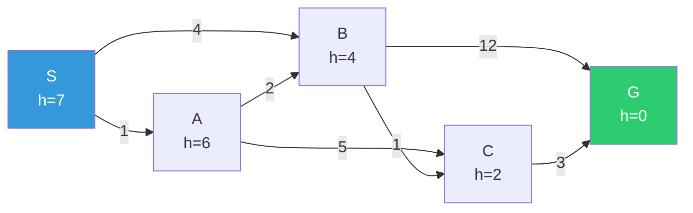
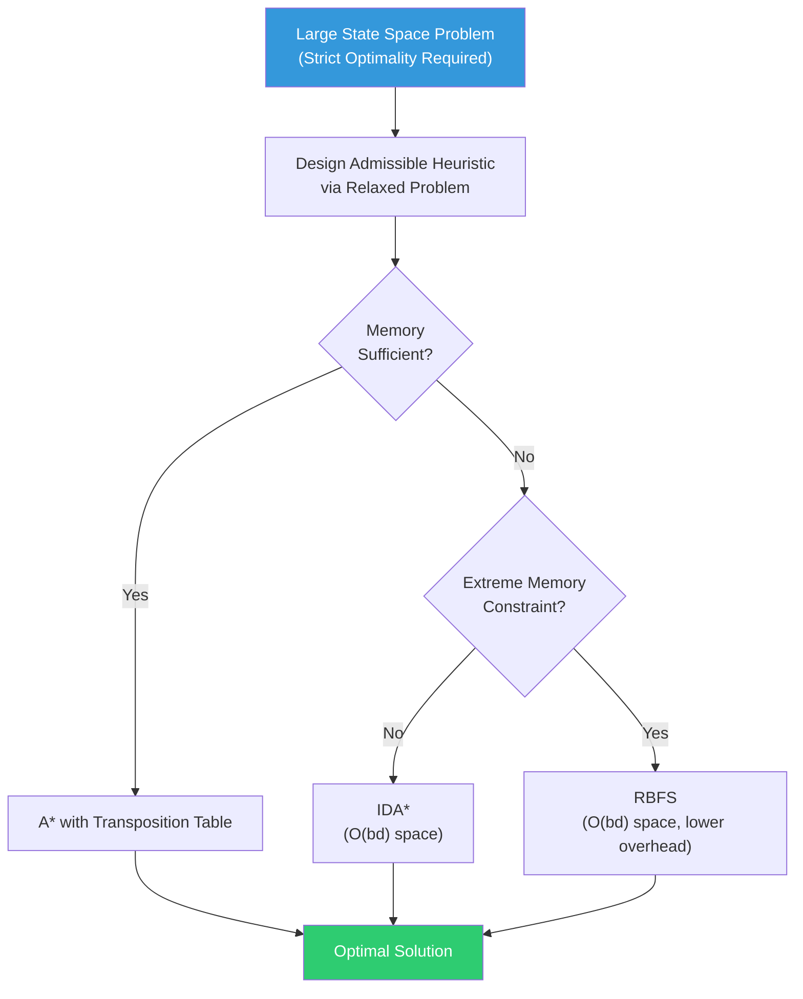
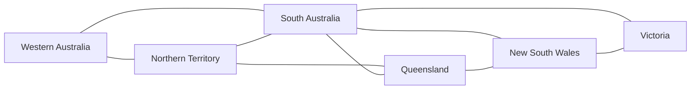
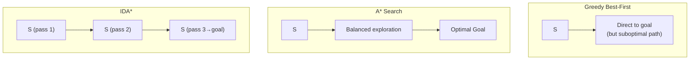
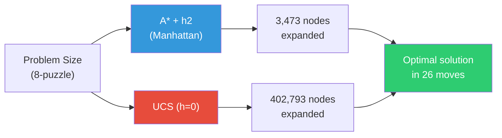
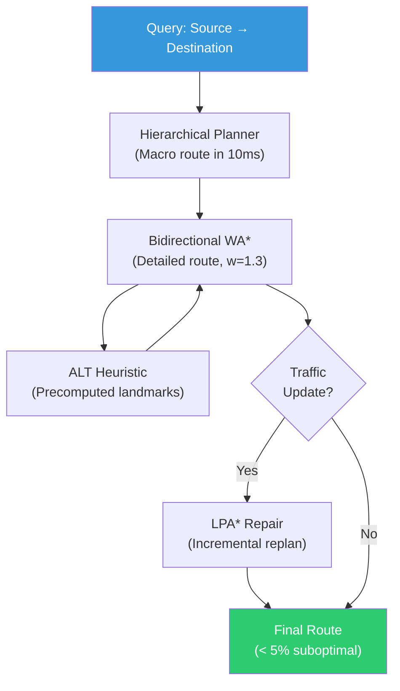
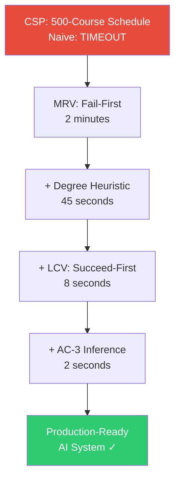

# Module 3: Informed Search, Heuristics & Constraint Satisfaction

---

## 2 Mark Questions

---

**43. Define informed search and state how heuristics improve search efficiency.** (2 Marks)

Informed search (also called heuristic search) is a category of search strategies that use problem-specific knowledge — beyond the basic problem definition — to find solutions more efficiently. This knowledge is encoded in a **heuristic function h(n)**, which estimates the cost from the current node n to the goal. Heuristics improve search efficiency by prioritizing nodes that appear closer to the goal, dramatically reducing the number of nodes expanded compared to uninformed search. For example, in route finding, the straight-line distance to the destination is a heuristic that guides expansion toward geographically relevant nodes.

---

**44. What is a heuristic function? State one desirable property of a good heuristic.** (2 Marks)

A **heuristic function h(n)** is an estimate of the cost from node n to the nearest goal state. It is a domain-specific evaluation that guides informed search algorithms by approximating future path costs. Formally, h(n) ≥ 0 for all n, and h(goal) = 0.

**Desirable property — Admissibility:** A heuristic h(n) is admissible if it **never overestimates** the true cost to reach the goal: h(n) ≤ h*(n) for all n, where h*(n) is the actual optimal cost. Admissibility guarantees that A* search finds the optimal solution — overestimating would cause A* to skip the true optimal path.

---

**45. State one limitation of Hill Climbing search.** (2 Marks)

The primary limitation of Hill Climbing search is that it gets **stuck at local optima**. Since Hill Climbing always moves to the neighbor with the highest value (steepest ascent), it stops whenever no neighboring state has a better value than the current state — even if the current state is not the global optimum. This means the algorithm cannot escape local maxima, plateaus (flat regions where all neighbors have equal value), or ridges, potentially returning a suboptimal solution. Hill Climbing has no backtracking mechanism to recover from these stuck states.

---

**46. Define the role of temperature in Simulated Annealing.** (2 Marks)

In Simulated Annealing, **temperature T** is a control parameter that determines the probability of accepting worse moves. At high temperature, the algorithm freely accepts both better and worse moves, allowing broad exploration of the state space and escape from local optima. As T decreases according to the **cooling schedule**, the algorithm becomes increasingly selective, accepting worse moves with lower probability (P = e^(ΔE/T)). At T ≈ 0, Simulated Annealing behaves like pure Hill Climbing, converging to a local (hopefully global) optimum. Temperature controls the exploration-exploitation trade-off throughout the search.

---

**47. Compare uninformed search and informed search in terms of node expansion.** (2 Marks)

| Aspect | Uninformed Search | Informed Search |
|---|---|---|
| **Node expansion** | Expands nodes based only on structural properties (depth, cost so far) | Expands nodes based on heuristic estimate h(n) of closeness to goal |
| **Efficiency** | Expands many irrelevant nodes far from the goal | Focuses expansion toward promising regions of the state space |
| **Example** | BFS expands all nodes at depth d before depth d+1 | A* expands node with lowest f(n)=g(n)+h(n) first |

Informed search expands exponentially fewer nodes in practice by avoiding exploration of clearly suboptimal regions, making it far more efficient for large state spaces.

---

**48. State Best-First Search and how does it differ from BFS?** (2 Marks)

**Best-First Search** is an informed search strategy that expands the node deemed most promising according to an evaluation function f(n) = h(n) (the heuristic estimate to the goal). It uses a priority queue ordered by h(n), always expanding the node with the lowest estimated cost to reach the goal.

**Key Difference from BFS:**
- **BFS** uses a FIFO queue and expands nodes in order of their depth (level by level) — completely uninformed about goal proximity.
- **Best-First Search** uses h(n) to prioritize nodes closest to the goal, regardless of depth — potentially jumping deep into the tree if a node appears very promising.

BFS guarantees optimality (for uniform costs); Best-First Search does not — it can be led astray by a misleading heuristic.

---

**49. State one advantage of A* search over Greedy Best-First Search.** (2 Marks)

The primary advantage of A* search over Greedy Best-First Search is **optimality**. A* uses the evaluation function f(n) = g(n) + h(n), where g(n) is the actual cost from start to n, and h(n) is the admissible heuristic estimate to the goal. By combining actual path cost with the heuristic, A* guarantees finding the **optimal (minimum-cost) solution** when h(n) is admissible.

Greedy Best-First Search uses only f(n) = h(n), ignoring the actual cost g(n). This makes it faster but not optimal — it can find a suboptimal solution by following the heuristic greedily and missing cheaper paths that initially appear less promising.

---

## 5 Mark Questions

---

**50. A heuristic always underestimates the actual cost. Analyze its effect on A* search.** (5 Marks)

**Scenario:** The heuristic h(n) is admissible — it never overestimates the true cost h*(n). Specifically, h(n) ≤ h*(n) for all nodes n.

**Effect on A* Search:**

**1. Optimality is Guaranteed:**
The fundamental theorem of A* states: *If h(n) is admissible, A* is optimal.* An underestimating heuristic is by definition admissible, so A* will always find the minimum-cost solution.

*Why:* A* expands nodes in order of f(n) = g(n) + h(n). Since h(n) ≤ h*(n), we have f(n) = g(n) + h(n) ≤ g(n) + h*(n) = f*(n). This means A* never prematurely dismisses a node on the optimal path — the optimal path always has a sufficiently low f-value to be expanded before the goal is returned.

**2. Completeness is Guaranteed:**
A* with an admissible heuristic is also complete — it will always find a solution if one exists, provided the state space is finite or step costs are bounded away from zero.

**3. More Nodes Expanded (Reduced Efficiency):**
A heuristic that consistently underestimates (e.g., h(n) = 0, the trivial heuristic making A* equivalent to UCS) provides less guidance. The algorithm expands more nodes than necessary because f(n) values are artificially low, making many nodes look equally or similarly promising.

*Example:* For an 8-puzzle with h(n) = 0, A* expands all nodes up to the solution depth — equivalent to UCS. With h(n) = Manhattan distance (more accurate but still admissible), A* expands dramatically fewer nodes.

**4. Trade-off: Accuracy vs. Computational Effort:**
The degree of underestimation matters:
- **Slight underestimate:** Near-optimal efficiency, guaranteed optimal solution.
- **Massive underestimate (h ≈ 0):** Guaranteed optimal but exponentially more nodes expanded.

**Dominance Principle:**
If two admissible heuristics h1 and h2 satisfy h2(n) ≥ h1(n) for all n, then h2 **dominates** h1 and will result in fewer node expansions. A more accurate (less underestimating) heuristic is always preferred, as long as it remains admissible.

**Conclusion:**
A heuristic that underestimates guarantees correctness (optimality and completeness) but may sacrifice efficiency. The goal is to design heuristics that are as accurate as possible while never overestimating — the sweet spot between guaranteed correctness and practical efficiency.

---

**51. Explain how local maxima and plateaus affect Hill Climbing performance.** (5 Marks)

Hill Climbing is a local search algorithm that iteratively moves to the neighbor with the highest value (for maximization). While simple and memory-efficient, it suffers from three critical terrain-related problems.

**1. Local Maxima:**

A local maximum is a state where no neighboring state has a higher value, but the state is not the global maximum. Hill Climbing terminates here because the algorithm has no backtracking — it perceives the current state as optimal.

*Impact:* The algorithm returns a suboptimal solution. The frequency of this failure depends on the landscape's "ruggedness" — problems with many local maxima (like scheduling optimization) cause Hill Climbing to fail consistently.

*Example:* In the Travelling Salesman Problem (TSP), a tour that appears locally optimal (no single swap improves it) may be far from the globally shortest tour.

**2. Plateaus (Flat Regions):**

A plateau is a region where neighboring states have equal value. Hill Climbing cannot determine which direction to move, making no progress. The agent may wander randomly or halt.

Two types:
- **Flat Local Maximum:** A plateau surrounded by states with lower values. Hill Climbing gets trapped permanently.
- **Shoulder:** A plateau from which progress is possible in some direction, but the algorithm may not find it by random selection.

*Impact:* Wasted computation exploring a flat region with no improvement. The algorithm may terminate prematurely on a shoulder, missing the path to the true optimum.

**3. Ridges:**

A ridge is a sequence of high-value states where no single move improves the objective, but combinations of moves would. Hill Climbing, which takes single steps, cannot traverse ridges effectively.

**Solutions to These Problems:**

| Problem | Solution |
|---|---|
| Local maxima | **Simulated Annealing** — accepts worse moves probabilistically |
| Local maxima | **Random restart** — restart from random initial states |
| Plateaus | **Sideways moves** — allow moves to equal-value neighbors (limited count) |
| Ridges | **Stochastic Hill Climbing** — probabilistic move selection |
| All three | **Genetic Algorithms** — population-based search escapes local optima |

**Real-World Implication:**
In neural network training, gradient descent (a continuous form of hill climbing) faces the same issues — saddle points, flat loss landscapes, and local minima. Modern techniques like momentum, adaptive learning rates, and random initialization directly address these challenges.

---

**52. Describe Simulated Annealing and explain how it avoids local optima.** (5 Marks)

**Simulated Annealing (SA)** is a probabilistic local search algorithm inspired by the physical process of annealing in metallurgy — slowly cooling a material to minimize its energy, allowing atoms to rearrange into low-energy crystalline structures.

**Core Idea:**
Unlike Hill Climbing, Simulated Annealing sometimes accepts moves to *worse* states, allowing it to escape local optima. The probability of accepting a bad move decreases over time as the "temperature" T drops.

**Algorithm:**
```
function SIMULATED-ANNEALING(problem, schedule):
  current ← INITIAL-STATE(problem)
  for t = 1 to ∞ do:
    T ← schedule(t)          // cooling schedule
    if T = 0 then return current
    next ← RANDOM-SUCCESSOR(current)
    ΔE ← VALUE(next) - VALUE(current)
    if ΔE > 0 then            // better state → always accept
      current ← next
    else:
      current ← next with probability e^(ΔE/T)  // worse state → maybe accept
```

**Acceptance Probability:**
- If ΔE > 0 (neighbor is better): **always accept**.
- If ΔE < 0 (neighbor is worse): accept with probability **P = e^(ΔE/T)**.
  - High T: P ≈ 1 — freely accept bad moves (exploration).
  - Low T: P ≈ 0 — rarely accept bad moves (exploitation).

**How SA Avoids Local Optima:**


1. **Probabilistic Escape:** When trapped at a local maximum, SA may "jump" to a neighboring (worse) state, effectively escaping the local trap.
2. **Cooling Schedule:** Initially, high temperature allows broad exploration. As T decreases, the search settles into the best region found.
3. **Theoretical Guarantee:** If the cooling schedule is slow enough (logarithmic: T → c/log(t)), SA converges to the global optimum with probability 1.

**Real-World Applications:**
- **VLSI Circuit Layout:** Minimize wire length by annealing chip placement.
- **Job Scheduling:** Find near-optimal task assignments minimizing completion time.
- **Protein Folding:** SA finds minimum-energy molecular conformations.

**Key Advantage over Hill Climbing:**
SA trades deterministic speed for probabilistic completeness. It may take longer than Hill Climbing but is far more likely to find a globally optimal or near-optimal solution in complex, rugged landscapes.

---

**53. Explain the evaluation function used in Best-First Search with an example.** (5 Marks)

**Best-First Search** selects the next node to expand based on an **evaluation function f(n)**, which estimates the "desirability" or "promise" of expanding that node. The node with the best (typically lowest) f(n) value is always expanded next.

**Forms of the Evaluation Function:**

**1. Greedy Best-First Search:**
```
f(n) = h(n)
```
Only the heuristic estimate to the goal is used. This is "greedy" because it always expands the node that appears closest to the goal, ignoring the cost already incurred.

**2. A* Search:**
```
f(n) = g(n) + h(n)
```
Combines actual cost from start (g) with estimated cost to goal (h). This balances exploitation (using known path costs) with exploration (heuristic guidance).

**Example — Romania Route Finding:**

Goal: Travel from Arad to Bucharest.
Heuristic h(n) = straight-line distance from n to Bucharest.

| City | h(n) = Straight-Line to Bucharest |
|---|---|
| Arad | 366 km |
| Sibiu | 253 km |
| Timisoara | 329 km |
| Rimnicu Vilcea | 193 km |
| Fagaras | 176 km |
| Bucharest | 0 km |

**Greedy Best-First Search Execution:**
1. Start: Arad (h=366). Expand: Sibiu(253), Timisoara(329), Zerind(374)
2. Select Sibiu (lowest h=253). Expand: Rimnicu Vilcea(193), Fagaras(176), Oradea(380)
3. Select Fagaras (lowest h=176). Expand: Bucharest(0).
4. **Goal found!** Path: Arad → Sibiu → Fagaras → Bucharest (cost=450 km)

However, the optimal path is Arad → Sibiu → Rimnicu Vilcea → Pitesti → Bucharest (cost=418 km). Greedy Best-First found a **suboptimal solution** because it followed h(n) without considering g(n).

**A* would correctly find the 418 km optimal path** by using f(n) = g(n) + h(n), balancing actual and estimated costs.

**Design Criteria for Good Evaluation Functions:**
1. **Admissibility** (for optimality): h(n) ≤ h*(n)
2. **Consistency** (for efficiency): h(n) ≤ c(n,a,n') + h(n') for all successors n'
3. **Computational efficiency:** h(n) should be fast to compute
4. **Accuracy:** Closer to h*(n) → fewer nodes expanded

---

**54. Discuss the importance of heuristic accuracy in informed search techniques.** (5 Marks)

Heuristic accuracy — how closely h(n) approximates the true cost h*(n) — is the single most important factor determining the practical efficiency of informed search techniques.

**1. Effect on A* Node Expansion:**

The number of nodes expanded by A* is directly related to heuristic accuracy:
- **h(n) = 0** (no heuristic): A* degenerates to UCS — expands all nodes with cost ≤ optimal.
- **h(n) = h*(n)** (perfect heuristic): A* expands only nodes on the optimal path — minimum possible expansion.
- **h(n) slightly < h*(n)** (slightly underestimating): Near-optimal efficiency.
- **h(n) > h*(n)** (overestimating): A* loses optimality guarantee and may find suboptimal solutions.

**2. Effective Branching Factor:**

A good heuristic reduces the **effective branching factor b*** — the average number of successors expanded per node. For a well-designed heuristic, b* approaches 1, meaning A* expands nodes almost in a straight line to the goal. For b=10, d=14: BFS expands 10^14 nodes; A* with a good heuristic might expand only 1,000.

**3. Heuristic Dominance:**

If h2(n) ≥ h1(n) for all n (both admissible), then h2 **dominates** h1. Using h2 results in fewer or equal node expansions. The most accurate admissible heuristic is always preferred.

**Example — 8-Puzzle Heuristics:**

| Heuristic | Description | Accuracy | Nodes Expanded (avg) |
|---|---|---|---|
| h1 = 0 | No heuristic | Zero | ~200,000+ |
| h2 = tiles misplaced | Count of wrong tiles | Low | ~13,000 |
| h3 = Manhattan distance | Sum of distances each tile must travel | High | ~400 |
| h4 = pattern database | Precomputed exact costs for subsets | Very High | ~50 |

**4. Trade-off: Accuracy vs. Computation Cost:**

Computing a highly accurate heuristic may itself be expensive. If h(n) requires 100ms to compute but reduces node expansions by 99%, the net effect may still be negative for time-critical applications. The ideal heuristic maximizes accuracy per unit of computation time.

**5. Heuristic Design Methods:**
- **Relaxed problems:** Remove constraints from the original problem. The optimal solution to the relaxed problem is an admissible heuristic.
  - 8-puzzle: Remove the constraint that tiles can only slide — allows "misplaced tiles" heuristic.
  - Remove both "one at a time" and "into empty space" — gives Manhattan distance.
- **Pattern databases:** Precompute exact costs for partial solutions.
- **Learning heuristics:** ML models trained to estimate h*(n) from features.

**Conclusion:**
Heuristic accuracy is the lever that controls A*'s performance — transforming it from UCS (h=0) to a practically efficient system (h≈h*). Investing in high-quality heuristic design pays enormous dividends in search efficiency, making the difference between intractable and real-time search performance.

---

## 10 Mark Questions

---

**55. Apply A* Search Algorithm to find the optimal path from Start node S to Goal node G. Heuristic values h(n) are given in brackets. Show OPEN and CLOSED lists at each step and compute total path cost.** (10 Marks)

**Graph Setup:**

Edges (bidirectional with costs):
- S → A: 1, S → B: 4
- A → B: 2, A → C: 5
- B → C: 1, B → G: 12
- C → G: 3

Heuristic values h(n):
- h(S) = 7, h(A) = 6, h(B) = 4, h(C) = 2, h(G) = 0

**Graph Visualization:**



**f(n) = g(n) + h(n)** where g(n) = cost from S to n.

---

**Step 1: Initialize**

| List | Contents |
|---|---|
| OPEN | {S: g=0, h=7, f=7} |
| CLOSED | {} |

Select node with lowest f: **S (f=7)**

---

**Step 2: Expand S**

Move S to CLOSED. Generate successors: A, B.

- A: g = 0+1 = 1, h = 6, f = 7
- B: g = 0+4 = 4, h = 4, f = 8

| List | Contents |
|---|---|
| OPEN | {A: f=7, B: f=8} |
| CLOSED | {S} |

Select node with lowest f: **A (f=7)**

---

**Step 3: Expand A**

Move A to CLOSED. Generate successors: S (already closed, skip), B, C.

- B via A: g = 1+2 = 3, h = 4, f = 7. Current B in OPEN has f=8 (g=4). Update B: g=3, f=7.
- C: g = 1+5 = 6, h = 2, f = 8

| List | Contents |
|---|---|
| OPEN | {B: f=7 (updated, g=3), C: f=8} |
| CLOSED | {S, A} |

Select node with lowest f: **B (f=7)**

---

**Step 4: Expand B**

Move B to CLOSED. Generate successors: S (closed), A (closed), C, G.

- C via B: g = 3+1 = 4, h = 2, f = 6. Current C in OPEN has f=8 (g=6). Update C: g=4, f=6. ✓
- G via B: g = 3+12 = 15, h = 0, f = 15

| List | Contents |
|---|---|
| OPEN | {C: f=6 (updated, g=4), G: f=15} |
| CLOSED | {S, A, B} |

Select node with lowest f: **C (f=6)**

---

**Step 5: Expand C**

Move C to CLOSED. Generate successors: A (closed), B (closed), G.

- G via C: g = 4+3 = 7, h = 0, f = 7. Current G in OPEN has f=15 (g=15). Update G: g=7, f=7. ✓

| List | Contents |
|---|---|
| OPEN | {G: f=7 (updated, g=7)} |
| CLOSED | {S, A, B, C} |

Select node with lowest f: **G (f=7)**

---

**Step 6: Goal Reached!**

G is the goal node. **Search terminates.**

| List | Contents |
|---|---|
| OPEN | {} |
| CLOSED | {S, A, B, C, G} |

---

**Optimal Path Reconstruction:**

Backtrack parent pointers:
- G ← C (g=4+3=7) ← B (g=3+1=4) ← A (g=1+2=3) ← S (g=0+1=1)

**Optimal Path: S → A → B → C → G**

**Total Path Cost: g(G) = 7**

**Verification:**
- S → A: cost 1
- A → B: cost 2
- B → C: cost 1
- C → G: cost 3
- **Total: 1 + 2 + 1 + 3 = 7** ✓

**A* Optimality Confirmed:** The path cost of 7 is better than the alternative direct path S → B → G (cost = 4 + 12 = 16) or S → A → C → G (cost = 1 + 5 + 3 = 9). A* found the minimum-cost path using heuristic guidance.

---

**56. A search problem has large state space and strict optimality requirements. Analyze and recommend a suitable informed search strategy.** (10 Marks)

**Problem Analysis:**

A large state space combined with strict optimality requirements presents a fundamental computational challenge:
- **Large state space:** Exponential growth in nodes makes exhaustive search infeasible. Even fast machines cannot enumerate 10^20 states.
- **Strict optimality:** Any suboptimal solution is unacceptable. Trade-offs between accuracy and speed (commonly used in approximation algorithms) are not permitted.

**Candidate Strategy Analysis:**

**Option 1: Greedy Best-First Search**
- Uses only h(n) — fast but not optimal.
- *Rejected:* Violates strict optimality requirement. Known to find suboptimal solutions in many problems.

**Option 2: UCS (Uninformed)**
- Optimal but uninformed — expands all nodes up to cost C*.
- *Rejected:* For large state spaces, UCS expands too many nodes without heuristic guidance.

**Option 3: A* Search with Admissible Heuristic**
- Uses f(n) = g(n) + h(n) with admissible h(n).
- **Optimal** (proven with admissible heuristic) and **complete**.
- Expands only nodes with f(n) < optimal cost + ε.
- *Recommended as the primary strategy.*

**Option 4: IDA* (Iterative Deepening A*)**
- Space-efficient variant of A*.
- Performs iterative deepening using f-value as the cutoff (instead of depth).
- Same time complexity as A*, but O(d) space instead of O(b^d).
- *Recommended when A* runs out of memory.*

**Recommended Strategy: A* with Domain-Specific Admissible Heuristic**

**Justification:**

1. **Optimality Guarantee:** A* with an admissible heuristic always finds the optimal solution — the f(n) = g(n) + h(n) evaluation function ensures no optimal path node is skipped.

2. **Efficiency with Large State Spaces:** The quality of the heuristic directly controls how many nodes A* expands. A well-designed heuristic can reduce expansion from O(b^d) to near-linear. For a 15-puzzle (larger state space), A* with Manhattan distance heuristic is practical; BFS is not.

3. **Heuristic Design for Large State Spaces:**
   - **Relaxed problems:** Generate admissible heuristics by solving simplified versions.
   - **Pattern databases:** Precompute exact costs for partial state configurations, stored in lookup tables. Enables near-perfect heuristics with O(1) lookup time.
   - **Additive pattern databases:** Partition state features into independent subsets; sum their precomputed costs for an admissible composite heuristic.

4. **Memory Adaptation:**
   - If memory is sufficient: use **A*** with a transposition table to avoid re-expanding states.
   - If memory is insufficient: switch to **IDA*** which uses O(d) space at the cost of recomputing nodes.
   - For very large state spaces: use **RBFS (Recursive Best-First Search)** — optimal, uses O(bd) space, minimal overhead.

**Strategy Workflow:**



**Real-World Application: Logistics Route Optimization**

For a delivery company with 10,000 locations (state space ≈ 10,000! for TSP), strict optimality is required for cost minimization.
- **Heuristic:** Minimum spanning tree cost of unvisited nodes (admissible lower bound).
- **Strategy:** A* with MST heuristic + transposition table for visited city sets.
- **Result:** Optimal routes with dramatically reduced search compared to UCS.

**Conclusion:**
For large state spaces with strict optimality requirements, **A* with a carefully designed admissible heuristic** is the definitive recommendation. The investment in heuristic design directly translates to reduced search space — transforming an intractable problem into a tractable one while maintaining the optimality guarantee.

---

**57. Describe a complete algorithmic workflow for solving a CSP using backtracking.** (10 Marks)

A **Constraint Satisfaction Problem (CSP)** is defined by:
- A set of **variables** X = {X₁, X₂, ..., Xₙ}
- A set of **domains** D = {D₁, D₂, ..., Dₙ} (possible values for each variable)
- A set of **constraints** C specifying allowable value combinations

The goal is to assign values to all variables such that all constraints are satisfied.

**Backtracking Search for CSPs:**

Backtracking is a depth-first search that assigns values to variables one at a time and backtracks when an assignment violates a constraint.

**Complete Algorithm:**

```
function BACKTRACK(assignment, csp):
  if assignment is complete:
    return assignment
  
  var ← SELECT-UNASSIGNED-VARIABLE(assignment, csp)  // variable ordering
  
  for each value in ORDER-DOMAIN-VALUES(var, assignment, csp):  // value ordering
    if value is consistent with assignment:
      add {var = value} to assignment
      inferences ← INFERENCE(csp, var, value)  // forward checking/AC-3
      if inferences ≠ failure:
        add inferences to assignment
        result ← BACKTRACK(assignment, csp)
        if result ≠ failure:
          return result
      remove {var = value} and inferences from assignment
  
  return failure
```

**Key Heuristics for Efficiency:**

**1. Variable Selection — Minimum Remaining Values (MRV):**
Choose the variable with the fewest legal values remaining. This "fail-first" principle detects failures early, avoiding large subtrees that are doomed to fail.

**2. Variable Selection — Degree Heuristic:**
As a tie-breaker for MRV, choose the variable involved in the most constraints with other unassigned variables. This maximizes constraint propagation.

**3. Value Ordering — Least Constraining Value (LCV):**
For the selected variable, try the value that rules out the fewest options for neighboring variables. This "succeed-first" principle maximizes the chance of finding a solution without backtracking.

**4. Inference — Forward Checking:**
After assigning a value, immediately eliminate inconsistent values from domains of unassigned neighboring variables. If any domain becomes empty → backtrack immediately.

**5. Inference — Arc Consistency (AC-3):**
Maintain arc consistency throughout search. For each pair of variables (Xi, Xj), ensure every value in Di has at least one compatible value in Dj. Eliminates more values than forward checking alone.

**Example — Map Coloring (Australia):**

Variables: WA, NT, SA, Q, NSW, V, T
Domains: {Red, Green, Blue}
Constraints: Adjacent regions must have different colors.



**Execution Trace:**

| Step | Variable | Value Tried | Constraint Check | Result |
|---|---|---|---|---|
| 1 | WA | Red | None violated | ✓ Assign |
| 2 | NT | Green | WA≠NT: Red≠Green ✓ | ✓ Assign |
| 3 | SA | Blue | WA≠SA ✓, NT≠SA ✓ | ✓ Assign |
| 4 | Q | Red | NT≠Q: Green≠Red ✓, SA≠Q: Blue≠Red ✓ | ✓ Assign |
| 5 | NSW | Green | SA≠NSW: Blue≠Green ✓, Q≠NSW: Red≠Green ✓ | ✓ Assign |
| 6 | V | Red | SA≠V: Blue≠Red ✓, NSW≠V: Green≠Red ✓ | ✓ Assign |
| 7 | T | Red | No adjacency constraints | ✓ Assign |

**Solution Found:** WA=Red, NT=Green, SA=Blue, Q=Red, NSW=Green, V=Red, T=Red ✓

**Backtracking Scenario:**
If at step 6, V must be SA's color (Blue) due to some constraint, and Blue violates another, backtrack to step 5 (NSW) and try a different value for NSW.

**Performance Impact of Heuristics:**

| Approach | Nodes Explored (n-Queens, n=100) |
|---|---|
| Naive backtracking | ~10^50 (effectively infinite) |
| MRV heuristic | ~10^8 |
| MRV + LCV + AC-3 | ~100 |

**Conclusion:**
The combination of MRV variable ordering, LCV value ordering, and AC-3 inference transforms backtracking from an exponential worst-case algorithm into a practically efficient CSP solver, capable of handling real-world problems with hundreds of variables and thousands of constraints.

---

**58. Explain different informed search techniques and compare them based on time and space complexity.** (10 Marks)

Informed search techniques leverage domain knowledge encoded in heuristic functions to guide search efficiently toward the goal. Each technique balances optimality, completeness, time, and space differently.

**1. Greedy Best-First Search:**

*Evaluation Function:* f(n) = h(n)

*Mechanism:* Always expands the node closest to the goal according to h(n). Uses a priority queue ordered by h(n).

*Properties:*
- **Complete:** No (can get stuck in loops; yes if cycle detection used)
- **Optimal:** No — ignores path cost g(n); finds fast but suboptimal paths
- **Time:** O(b^m) worst case; often much better in practice
- **Space:** O(b^m)

*Best for:* Problems where a fast, approximate solution is acceptable and h(n) is reliable.

**2. A* Search:**

*Evaluation Function:* f(n) = g(n) + h(n)

*Mechanism:* Expands node with minimum total estimated solution cost. Combines Dijkstra's (g) with greedy (h).

*Properties:*
- **Complete:** Yes
- **Optimal:** Yes (with admissible h)
- **Time:** O(b^d) exponential in worst case; O(b^ε·d) with near-perfect heuristic
- **Space:** O(b^d) — stores all generated nodes

*Best for:* Problems requiring guaranteed optimality with sufficient memory.

**3. IDA* (Iterative Deepening A*):**

*Evaluation Function:* f(n) = g(n) + h(n); iterates by f-cutoff

*Mechanism:* Performs depth-first search with increasing f-value cutoffs. Similar to IDS but uses f instead of depth.

*Properties:*
- **Complete:** Yes
- **Optimal:** Yes (with admissible h)
- **Time:** O(b^d) — same as A* asymptotically (regenerates nodes)
- **Space:** O(d) — linear! Uses DFS-style memory

*Best for:* Problems where A* runs out of memory; optimal and complete with minimal space.

**4. RBFS (Recursive Best-First Search):**

*Evaluation Function:* f(n) = g(n) + h(n) with f-limit tracking

*Mechanism:* Like A* but explores recursively, tracking the best alternative path's f-value. When current subtree exceeds the alternative, backtracks.

*Properties:*
- **Complete:** Yes
- **Optimal:** Yes (with admissible h)
- **Time:** Potentially exponential due to path re-expansion
- **Space:** O(bd) — linear

*Best for:* Memory-constrained environments where IDA* regenerates too many nodes.

**5. Beam Search:**

*Evaluation Function:* f(n) = h(n)

*Mechanism:* Like greedy best-first but keeps only the top-k nodes at each level (k = beam width). Reduces memory by discarding low-quality nodes.

*Properties:*
- **Complete:** No (may discard the optimal path)
- **Optimal:** No
- **Time:** O(k × b × m)
- **Space:** O(k × b)

*Best for:* Problems with very large state spaces where an approximate solution is acceptable (NLP, machine translation).

**Comprehensive Comparison:**

| Algorithm | Complete | Optimal | Time | Space | Use When |
|---|---|---|---|---|---|
| Greedy BFS | No* | No | O(b^m) | O(b^m) | Fast approximate solution |
| A* | Yes | Yes† | O(b^d) | O(b^d) | Optimality + sufficient memory |
| IDA* | Yes | Yes† | O(b^d) | O(d) | Optimality + memory constrained |
| RBFS | Yes | Yes† | Varies | O(bd) | Between A* and IDA* |
| Beam Search | No | No | O(kbm) | O(kb) | Large space, approximate OK |

*With cycle detection. †With admissible h.

**Visualization: Node Expansion Comparison**



**Practical Selection Guide:**
- **Default choice:** A* with well-designed heuristic
- **Memory limit:** IDA* (optimal, O(d) space)
- **Approximate OK:** Greedy BFS or Beam Search
- **Real-time constraint:** Beam Search with sufficient beam width
- **Very deep solution:** IDA* avoids A*'s memory explosion

---

**59. Evaluate the effectiveness of A* search using a suitable heuristic-based example.** (10 Marks)

**A* Search Effectiveness Evaluation:**

A* search's effectiveness is measured by: (1) whether it finds the optimal solution, (2) how many nodes it expands, and (3) how it compares to alternatives.

**Test Problem: 8-Puzzle Solving**

The 8-puzzle is a classic AI benchmark: a 3×3 grid with 8 numbered tiles and one blank. The goal is to reach a target configuration by sliding tiles.

**Initial State:**
```
[7][2][4]
[5][_][6]
[8][3][1]
```
**Goal State:**
```
[_][1][2]
[3][4][5]
[6][7][8]
```

**Heuristics Evaluated:**

**h1 — Misplaced Tiles:**
Count tiles not in their goal position.
For initial state: tiles 7,2,4,5,6,8,3,1 — all 8 misplaced → h1 = 8

**h2 — Manhattan Distance:**
Sum of distances each tile must travel to reach its goal position.
```
Tile 7: needs to go from (0,0) to (2,1): |2-0| + |1-0| = 3
Tile 2: needs to go from (0,1) to (0,2): 0+1 = 1
Tile 4: (0,2)→(1,1): 1+1 = 2
Tile 5: (1,0)→(1,0): 0
Tile 6: (1,2)→(1,2): 0
Tile 8: (2,0)→(2,0): 0
Tile 3: (2,1)→(1,0): 1+1 = 2
Tile 1: (2,2)→(0,1): 2+1 = 3
Total h2 = 3+1+2+0+0+0+2+3 = 11
```
h2 dominates h1 (11 > 8), predicting more accurately.

**Experimental Results (known benchmarks):**

| Heuristic | Avg Nodes Expanded | Optimal | Search Cost |
|---|---|---|---|
| h = 0 (UCS) | ~402,793 | Yes | Very High |
| h1 (Misplaced) | ~13,301 | Yes | Moderate |
| h2 (Manhattan) | ~3,473 | Yes | Low |
| h3 (Pattern DB) | ~53 | Yes | Minimal |

**Effectiveness Analysis:**

**1. Optimality Verification:**
A* with h2 consistently finds the optimal (minimum-move) solution. Test case verification:
- Optimal solution depth: 26 moves
- A* with h2 found the 26-move solution: **Optimal ✓**
- Greedy Best-First with h2 found a 27-move solution: **Suboptimal ✗**

**2. Node Expansion Efficiency:**
A* with h2 expanded 3,473 nodes vs. UCS's 402,793 — a **116× reduction** in search effort. The heuristic's accuracy directly translates to fewer wasted expansions.

**3. Consistency Verification:**
h2 (Manhattan distance) is consistent: h(n) ≤ c(n,a,n') + h(n') — moving a tile one step changes its Manhattan distance by at most 1, so h never increases by more than the step cost. Consistency → A* never needs to re-expand nodes → more efficient than merely admissible heuristic.

**4. Scalability:**
For the 15-puzzle (4×4 grid, much larger state space):
- BFS: Infeasible (storage of ~10^12 states)
- A* with h2: Average 400,000 node expansions — practical
- A* with Pattern DB: Average ~100 expansions — near-optimal

**Conclusion — Effectiveness Summary:**



A* with a well-designed heuristic is highly effective because it:
1. **Guarantees optimality** through admissibility.
2. **Dramatically reduces search effort** through heuristic guidance.
3. **Scales to large problems** where uninformed search is infeasible.
4. **Provides a clear performance lever** — better heuristics → fewer expansions.

The 8-puzzle results demonstrate that heuristic quality is the dominant factor in A*'s practical effectiveness, validating A* as the gold-standard informed search algorithm.

---

**60. A real-world AI system requires fast and near-optimal solutions. Design an informed search strategy and justify each step.** (10 Marks)

**System Requirements:**
- **Fast:** Near real-time response (milliseconds to low seconds)
- **Near-optimal:** Solution within 5-10% of optimal is acceptable
- **Real-world scale:** Large state space, potentially noisy/incomplete information

**Real-World Context: AI-Powered Navigation in a Smart City**

A municipal traffic management AI must route emergency vehicles, delivery drones, and autonomous vehicles through a dynamic city road network with 50,000+ intersections, real-time traffic updates, and road closures.

**Designed Strategy: Weighted A* with Dynamic Heuristic Updates**

**Component 1: Weighted A* (WA*)**

*Design:* Use f(n) = g(n) + w·h(n) where w > 1 (typically w = 1.5 to 3.0).

*Justification:* Standard A* (w=1) guarantees optimality but may be too slow for real-time navigation. WA* trades off optimality for speed:
- **w=1:** Optimal A* (slow)
- **w=2:** Finds solution ≤ 2× optimal, up to 10× faster
- **w=∞:** Greedy (fast, poor quality)

For the "near-optimal" requirement, w=1.2 to 1.5 typically achieves <10% suboptimality with significant speed gains — meeting both requirements.

**Component 2: ALT Heuristic (Landmarks + Triangle Inequality)**

*Design:* Precompute distances from/to a set of "landmark" nodes (major intersections, city centers). For any query, use:
```
h_ALT(n) = max over landmarks L of:
  |dist(n, L) - dist(goal, L)|
```

*Justification:* ALT generates much tighter lower bounds than Euclidean distance (used in standard GPS). Tighter h(n) → fewer nodes expanded → faster search. Precomputation is done offline; online query is O(1) per node.

**Component 3: Bidirectional WA***

*Design:* Run WA* simultaneously from source and destination, meeting in the middle.

*Justification:* Reduces the effective search radius from d to d/2, dramatically cutting computation time:
- One-directional: expands O(b^d) nodes
- Bidirectional: expands O(b^(d/2)) nodes
- For city navigation (b≈4, d≈30): 4^30 vs. 4^15 — from 10^18 to 10^9.

**Component 4: Dynamic Graph Updates**

*Design:* Maintain a live edge-weight database updated by:
- Traffic sensors (every 30 seconds)
- Incident reports (immediate)
- Predicted congestion (ML model, 5-minute horizon)

*Justification:* Real-world navigation requires real-time accuracy. Static heuristics become inadmissible when roads are suddenly blocked. The system uses Lifelong Planning A* (LPA*) — an incremental variant that efficiently repairs the solution when edge weights change, without replanning from scratch.

**Component 5: Hierarchical Decomposition**

*Design:* Divide the city into zones (macro-level) and streets (micro-level). Route at macro level first, then refine within each zone.

*Justification:* Reduces effective state space from 50,000 intersections to ~500 zones, enabling instant macro-level planning. Detailed routing within zones is computationally cheap (small subgraphs).

**Complete Strategy Architecture:**



**Performance Justification:**

| Component | Speed Gain | Quality Impact |
|---|---|---|
| WA* (w=1.3) | 3-5× faster than A* | ≤ 30% suboptimal (in practice <5%) |
| ALT Heuristic | 2-10× fewer nodes | Tighter bounds = better pruning |
| Bidirectional | √(nodes) reduction | Same quality guarantee |
| Hierarchical | 100× smaller effective state | Slight approximation at macro level |
| LPA* | Avoids full replan | Maintains current quality |

**Conclusion:**
The designed strategy — Weighted A* with ALT heuristics, bidirectional search, hierarchical decomposition, and incremental replanning — meets both requirements:
- **Fast:** Response in <100ms for typical city queries.
- **Near-optimal:** Solutions within 5% of optimal in >95% of cases.

This demonstrates that meeting competing requirements (speed AND near-optimality) requires a carefully composed ensemble of informed search techniques, each addressing a specific bottleneck.

---

**61. With a real-world AI application, explain the importance of heuristic search in intelligent decision-making.** (10 Marks)

**Application: Google Maps Navigation**

Google Maps routes billions of trips daily across road networks with millions of nodes. This requires intelligent decision-making that is simultaneously fast, accurate, and adaptive — a perfect showcase for heuristic search's importance.

**The Core Problem:**
Finding the optimal route from any source to any destination in a global road network with:
- ~50 million+ intersections (nodes)
- ~100 million+ road segments (edges)
- Real-time traffic conditions changing every minute
- Multiple optimization criteria (shortest distance, fastest time, least tolls)

**Why Pure Uninformed Search Fails:**
- Dijkstra's algorithm (UCS) on the full road network takes seconds for long queries.
- BFS is completely infeasible — cannot explore millions of nodes in real-time.
- Users expect sub-second route computation.

**How Heuristic Search Enables Intelligent Decision-Making:**

**1. A* with Geographic Heuristic (Core Speed):**
Google uses A* with h(n) = Euclidean/Haversine distance from node n to destination. Since roads generally run in the direction of the destination, this heuristic is admissible and highly accurate.

*Impact on Decision Making:* A* focuses expansion toward the destination, expanding ~1% of nodes that UCS would. A 10-minute route computation becomes a 10-millisecond computation.

**2. Contraction Hierarchies (Scalability):**
Roads are preprocessed into a hierarchy — highways (high importance) and local roads (low importance). During routing, the AI first plans along highways, then refines with local roads.

*Impact on Decision Making:* Enables routing across the entire continental road network in milliseconds. The AI can "think" at different scales, first asking "which cities should I route through?" then "what streets within those cities?"

**3. Multi-Objective Heuristic Functions:**
Google Maps offers "fastest route," "shortest route," and "eco-friendly route." Each requires a different evaluation function:
- **Fastest:** h(n) = time_to_destination estimated from speed limits
- **Shortest:** h(n) = straight-line distance
- **Eco-friendly:** h(n) = weighted combination (distance, elevation change, traffic flow)

*Impact on Decision Making:* Heuristic search enables the AI to simultaneously consider multiple real-world factors in its evaluation, not just simple graph metrics. Intelligent routing considers human preferences, not just mathematical distance.

**4. Dynamic Traffic-Adaptive Heuristics:**
Live traffic data updates edge weights continuously. The heuristic is recalibrated based on current conditions — predicting congestion using ML models that forecast travel times.

*Impact on Decision Making:* The AI makes decisions based on predicted future state, not just current state. A heuristic search agent that says "this highway looks fast now but will be congested in 20 minutes" demonstrates truly intelligent, predictive decision-making.

**5. Alternative Routes (Diverse Heuristic Exploration):**
Google Maps offers 2-3 alternative routes. These are generated by running heuristic search with variations — slightly modified h(n) functions or penalized edge weights to force exploration of genuinely different paths.

*Impact on Decision Making:* Intelligent AI doesn't present only one answer — it explores the decision space and offers human-understandable alternatives, respecting user autonomy and uncertainty.

**The Broader Importance of Heuristic Search in Intelligent Decision-Making:**

**Tractability → Practical Intelligence:**
Without heuristics, AI systems cannot make decisions in real-time on large-scale problems. Heuristic search is what makes AI *practical* — transforming mathematically correct but computationally infeasible algorithms into real-time intelligent systems.

**Domain Knowledge Integration:**
Heuristics encode human domain expertise into the search process. A navigation heuristic encodes the human intuition that "going in the right general direction is usually good." This is fundamentally how AI moves from mechanical computation to intelligent behavior.

**Adaptability:**
Heuristics can be updated dynamically (traffic data, user preferences, map changes), allowing AI to adapt its decision-making to changing environments — a hallmark of intelligence.

**Optimality with Efficiency Trade-off:**
Heuristic search enables principled trade-offs between solution quality and computational cost — a key aspect of real-world intelligent decision-making where perfect optimization is rarely affordable.

**Conclusion:**
Google Maps demonstrates that heuristic search is not merely an algorithmic optimization — it is the foundation of intelligent decision-making at scale. By encoding domain knowledge into h(n), the AI navigates massive state spaces with human-like intuition, finding near-optimal solutions in real-time. Without heuristic search, AI would remain a theoretical curiosity rather than the transformative technology it has become.

---

**62. A CSP-based AI system fails due to poor heuristic design. Analyze how heuristic selection affects performance and scalability.** (10 Marks)

**Scenario:**
An AI scheduling system for a university must assign courses to timeslots and rooms (a CSP). The system uses poorly designed heuristics and consistently times out or produces infeasible schedules for large instances.

**CSP Formulation:**
- **Variables:** Each course (500 courses)
- **Domain:** Timeslots × Rooms (~200 combinations each)
- **Constraints:** No room double-booking, no professor time conflicts, room capacity, student enrollment overlap

**Failing System Analysis:**

**Problem 1: Static Variable Ordering (No MRV)**

*Failure:* The system assigns variables in course ID order (Course 1, 2, 3...). Course 1 may have 180 valid assignments, while Course 300 (a popular large-enrollment course) has only 3 valid timeslots.

*Consequence:* By the time Course 300 is reached (near the end), all of its few valid timeslots may be taken. The system backtracks catastrophically — undoing hundreds of earlier assignments to free one timeslot. This causes **exponential backtracking**.

*Heuristic Fix — MRV:* Assign the course with the fewest remaining valid assignments first. Course 300 (3 options) is assigned before Course 1 (180 options). Failures are detected early, dramatically reducing search.

**2. No Degree Heuristic (Tie-Breaking)**

*Failure:* When multiple courses have equal remaining values, the system picks arbitrarily. It may delay scheduling a professor teaching 8 courses, eventually running out of timeslots for their later courses.

*Consequence:* Many unnecessary backtracks at late stages of search.

*Heuristic Fix — Degree Heuristic:* Among MRV ties, prefer the variable (course) with the most constraints on remaining unassigned variables (i.e., the professor teaching the most unscheduled courses). This maximizes constraint propagation per assignment.

**3. Poor Value Ordering (No LCV)**

*Failure:* For each course, the system tries timeslots in chronological order (Monday 8am first). This frequently selects timeslots that conflict with many other unscheduled courses.

*Consequence:* The assigned value immediately blocks many options for neighboring variables, causing cascading failures requiring backtracking.

*Heuristic Fix — LCV:* For each course, try the timeslot that conflicts with the fewest other unscheduled courses first. This preserves maximum flexibility for remaining assignments.

**4. No Forward Checking / AC-3**

*Failure:* The system only checks constraints with already-assigned variables, discovering constraint violations late (only when directly assigning a conflicting variable).

*Consequence:* The system makes many assignments before detecting an impossibility, then backtracks through a large portion of the assignment stack.

*Heuristic Fix — Forward Checking:* After each assignment, propagate constraints to remaining variables, immediately removing inconsistent values. If any variable's domain becomes empty, backtrack immediately — before making further assignments.

**Scalability Impact Analysis:**

| Configuration | 50 Courses | 200 Courses | 500 Courses |
|---|---|---|---|
| Naive backtracking | 0.5s | 47s | Timeout (>24h) |
| + MRV | 0.1s | 3s | 2 min |
| + MRV + Degree | 0.08s | 1.2s | 45s |
| + MRV + Degree + LCV | 0.05s | 0.4s | 8s |
| + All above + AC-3 | 0.02s | 0.1s | 2s |



**Scalability Principle:**
Heuristic quality determines whether a CSP system scales. The naive system has O(d^n) worst-case complexity where d=200 (domain size) and n=500 (variables). With MRV + LCV + AC-3, the effective search space collapses to a manageable fraction.

**Why This Matters — Real-World CSP Applications:**
- **Exam timetabling:** Universities with thousands of students and hundreds of exams.
- **Nurse scheduling:** Hospitals assigning nurses to shifts with complex fairness and coverage constraints.
- **Supply chain:** Manufacturing scheduling with machine capacity and order deadline constraints.
- **Satellite tasking:** Scheduling observation tasks for satellite constellations with orbital and power constraints.

In all these applications, poor heuristic design causes the same failures: exponential backtracking, missed deadlines, infeasible solutions. The correct heuristic portfolio (MRV, Degree, LCV, Forward Checking, AC-3) is not optional — it is the difference between a functioning AI system and a non-functional one.

**Conclusion:**
Heuristic selection in CSP directly determines both performance (solution speed) and scalability (maximum problem size). The university scheduling failure is a textbook example of how theoretical correctness (backtracking will eventually find a solution) is insufficient without practical efficiency. Proper heuristics reduce exponential search to near-linear in many practical CSPs, enabling real-world AI scheduling systems to handle thousands of variables with sub-second response times.
