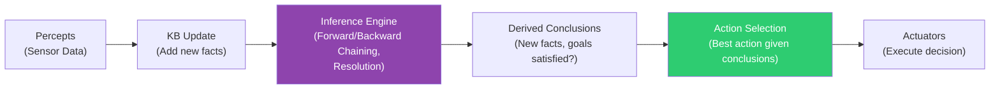
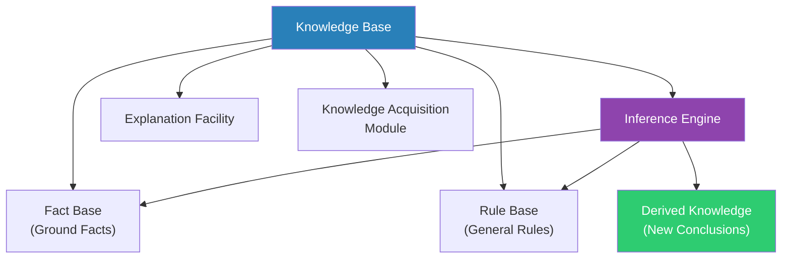
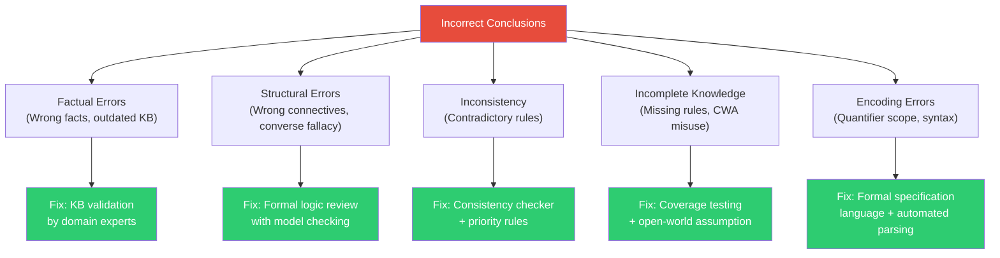
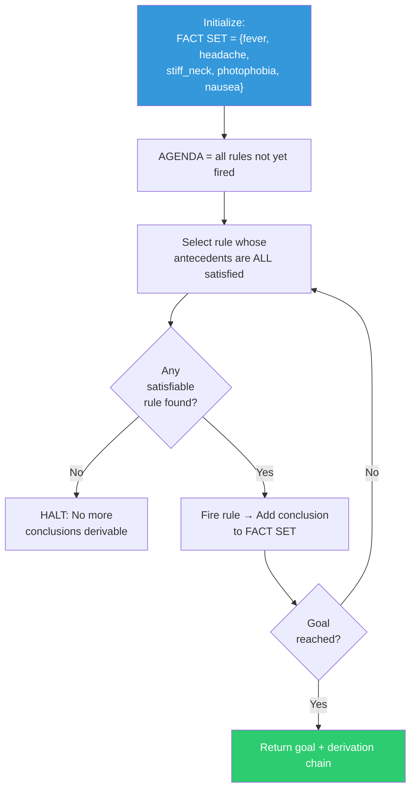
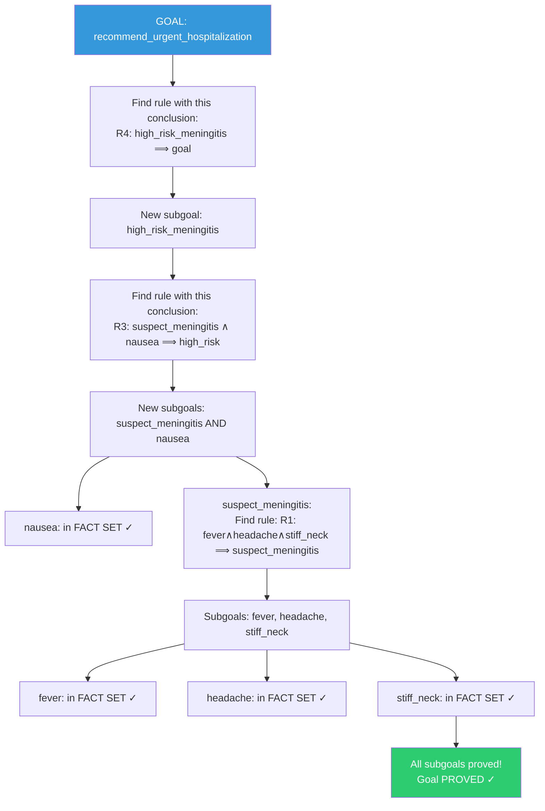
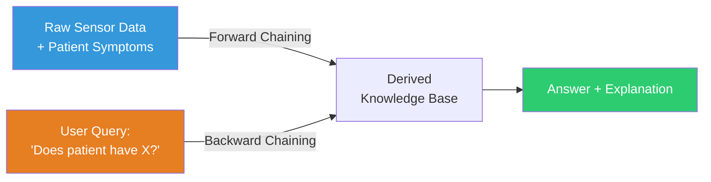
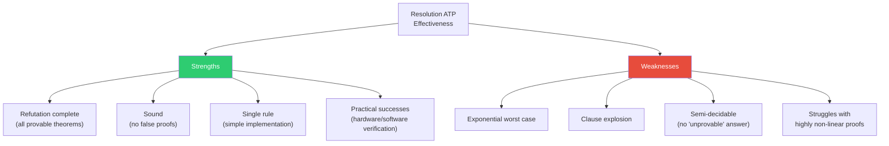
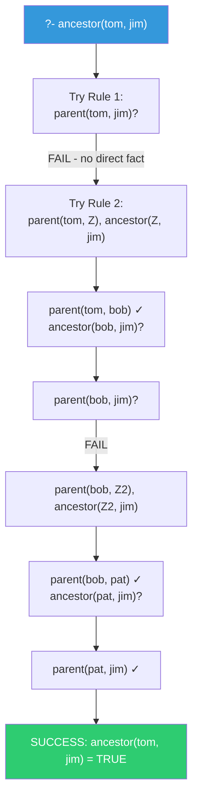
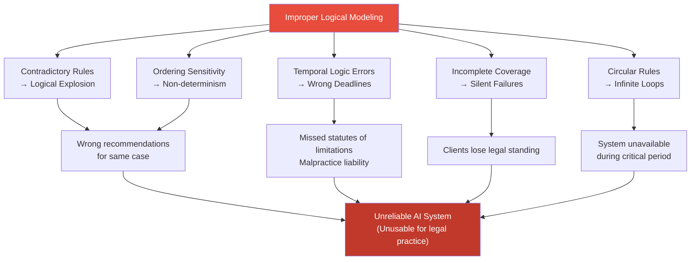

# Module 4: Knowledge Representation & Logical Reasoning

---

## 2 Mark Questions

---

**63. Define knowledge representation in Artificial Intelligence.** (2 Marks)

Knowledge representation in AI is the study and practice of encoding information about the world in a form that a computer system can utilize to reason, make decisions, and solve problems intelligently. It involves selecting appropriate formal structures — such as logic, semantic networks, frames, or rules — to capture facts, relationships, and constraints about a domain. Effective knowledge representation enables AI systems to draw inferences, answer questions, and exhibit intelligent behavior by combining stored knowledge with reasoning mechanisms.

---

**64. Define knowledge-based agent.** (2 Marks)

A knowledge-based agent is an AI agent that uses a **knowledge base (KB)** — a structured repository of domain-specific facts and rules — to reason about its environment and select appropriate actions. The agent operates through inference: given new percepts, it adds new facts to the KB and uses an **inference engine** to derive new conclusions. The agent's behavior is determined not by hard-coded rules but by its stored knowledge, making it flexible and adaptable. The Wumpus World agent is a classic example of a knowledge-based agent.

---

**65. State one limitation of propositional logic.** (2 Marks)

A key limitation of propositional logic is its **lack of expressiveness for generalizing over objects**. Propositional logic can only make statements about specific, fixed propositions (e.g., "It is raining") — it cannot express general statements involving variables, quantifiers, or relationships between objects (e.g., "All humans are mortal" or "John is taller than Mary"). This inability to represent universal or existential generalizations makes propositional logic inadequate for complex, real-world domains that require reasoning about classes of objects and their properties.

---

**66. Define First-Order Predicate Logic (FOPL).** (2 Marks)

First-Order Predicate Logic (FOPL), also called First-Order Logic (FOL), is a formal logical system that extends propositional logic with **predicates, functions, variables, and quantifiers**. It can express statements about objects, their properties, and relationships:
- **Predicates:** Properties of objects — `Human(x)`, `Loves(x, y)`
- **Quantifiers:** Universal (∀ — "for all"), Existential (∃ — "there exists")
- **Functions:** Map objects to objects — `Mother(John)`

FOPL enables powerful generalizations: ∀x Human(x) ⟹ Mortal(x) means "All humans are mortal."

---

**67. Differentiate between propositional logic and predicate logic.** (2 Marks)

| Aspect | Propositional Logic | Predicate Logic (FOPL) |
|---|---|---|
| **Basic unit** | Propositions (true/false statements) | Predicates applied to terms (objects) |
| **Variables** | None — only fixed truth values | Uses variables to represent objects |
| **Quantifiers** | None | Universal (∀) and Existential (∃) |
| **Expressiveness** | Limited — cannot generalize | High — can express general facts |
| **Example** | "It is raining" (P) | ∀x Human(x) ⟹ Mortal(x) |

Predicate logic is strictly more expressive than propositional logic, enabling representation of complex, real-world domain knowledge with relationships and generalizations.

---

**68. Discuss forward chaining in inference mechanisms.** (2 Marks)

Forward chaining is a **data-driven inference method** that starts from known facts in the knowledge base and applies inference rules to derive new facts until the goal is reached. It proceeds in the direction: **facts → rules → conclusions**.

Process:
1. Begin with all known facts.
2. Find rules whose conditions (antecedents) are satisfied by current facts.
3. Apply those rules to add new facts to the KB.
4. Repeat until the goal fact is derived or no new facts can be added.

Forward chaining is used in production rule systems and expert systems where the system must determine all consequences of given data.

---

**69. State one advantage of backward chaining.** (2 Marks)

The primary advantage of backward chaining is **goal-directed efficiency** — it only reasons about facts relevant to proving the specific goal, avoiding the derivation of irrelevant facts that forward chaining might produce.

By starting from the goal and working backwards to find supporting facts, backward chaining focuses computation exclusively on the subgoals necessary to establish the target conclusion. This makes it significantly faster when the goal is specific and only a small subset of the knowledge base is relevant — as is the case in diagnostic systems and PROLOG-based reasoning.

---

## 5 Mark Questions

---

**70. Explain the purpose of resolution in logical reasoning.** (5 Marks)

**Resolution** is a sound and complete inference rule used in automated theorem proving. Its purpose is to determine whether a given statement is logically entailed by a knowledge base — without requiring human guidance.

**Core Idea:**
Resolution works by **proof by refutation** (or proof by contradiction):
1. Negate the goal (query) to be proved.
2. Add the negation to the knowledge base.
3. Apply the resolution rule repeatedly to derive new clauses.
4. If the empty clause (⊥ — contradiction) is derived, the original goal is proved.

**The Resolution Rule:**
Given two clauses containing complementary literals:
```
Clause 1: A ∨ B
Clause 2: ¬B ∨ C
→ Resolvent: A ∨ C
```
The complementary pair (B and ¬B) is eliminated, producing a new clause.

**Why Resolution Is Important:**

1. **Completeness:** Resolution refutation is **refutation-complete** — if a contradiction exists, resolution will always find it. This guarantees that provable statements can always be proved.

2. **Single Inference Rule:** Unlike natural deduction (which uses many rules), resolution uses only one rule, making it simple to implement and verify.

3. **Foundation for Logic Programming:** PROLOG's inference engine is based on SLD resolution (a restricted form of resolution), enabling declarative programming.

4. **Automated Theorem Proving:** Resolution is the basis for automated theorem provers used in formal software verification, hardware verification, and mathematical proofs.

**Example:**
Knowledge Base:
- P1: ¬Human(x) ∨ Mortal(x) (All humans are mortal)
- P2: Human(Socrates) (Socrates is human)
- Negated goal: ¬Mortal(Socrates)

Resolution steps:
1. Resolve P1 with P2 (unify x=Socrates): Mortal(Socrates)
2. Resolve Mortal(Socrates) with ¬Mortal(Socrates): **⊥ (empty clause)**

Contradiction derived → **Mortal(Socrates) is proved** ✓

---

**71. Analyze the role of the Wumpus World environment in knowledge representation.** (5 Marks)

The **Wumpus World** is a classic AI benchmark environment that provides an ideal test case for knowledge-based agents using logical reasoning. It demonstrates the practical necessity and power of formal knowledge representation.

**Wumpus World Setup:**
- 4×4 grid of rooms
- A Wumpus (dangerous monster) is hidden in one room
- Pits are randomly distributed
- Gold is hidden somewhere
- Agent starts at [1,1] facing right
- Sensors: Stench (adjacent to Wumpus), Breeze (adjacent to pit), Glitter (gold present), Bump, Scream

**Role in Knowledge Representation:**

**1. Demonstrates Incremental Knowledge Building:**
The agent begins with zero specific knowledge about the world (just knows the rules). As it moves and senses, it adds percept-based facts to its KB:
- "Breeze at [1,2]" → "Pit in [1,3] OR [2,2]"
- "No breeze at [1,1]" → "No pit in [1,2] OR [2,1]"

This progressive KB construction mirrors real-world AI knowledge acquisition.

**2. Illustrates Propositional Logic's Limitations:**
The agent's KB grows large quickly when expressed in propositional logic. For a 4×4 grid: separate propositions for each cell (Pit₁₁, Pit₁₂... Breeze₁₁, Breeze₁₂...) become unwieldy. FOL would express this more compactly with Pit(x,y), Breeze(x,y).

**3. Tests Inference Under Uncertainty:**
The agent must reason about cells it hasn't visited, inferring safety or danger from indirect evidence. This demonstrates **deductive reasoning** from incomplete information — a key challenge in knowledge representation.

**4. Requires Consistent Knowledge Base:**
The KB must be logically consistent. If contradictory facts are added (e.g., concluding a cell is both safe and dangerous), the inference engine produces meaningless results. Wumpus World teaches the importance of maintaining logical consistency.

**5. Validates Knowledge Representation Systems:**
If a knowledge-based agent successfully navigates the Wumpus World (find gold, exit safely), it validates that the knowledge representation scheme and inference mechanism correctly encode and reason about the domain.

**Knowledge Representation in Action:**
```
KB Rule: Breeze(x,y) ⟺ (Pit(x+1,y) ∨ Pit(x-1,y) ∨ Pit(x,y+1) ∨ Pit(x,y-1))
KB Fact: ¬Breeze(1,1), ¬Breeze(1,2)
Inference: ¬Pit(2,1), ¬Pit(1,3) (proved safe)
```

The Wumpus World's genius is its simplicity — a small, well-defined environment that forces agents to engage in sophisticated multi-step logical reasoning, making it an ideal pedagogical and research tool for knowledge representation.

---

**72. Explain how inference mechanisms support decision-making in AI systems.** (5 Marks)

Inference mechanisms are the computational procedures that derive new facts and conclusions from a knowledge base. They are the "engine" of intelligent decision-making in AI systems.

**Role in Decision-Making:**

**1. Deriving Action Conditions:**
AI systems often encode actions as rules: "IF condition THEN action." Inference mechanisms evaluate whether conditions are satisfied:
```
Rule: IF Temperature > 38°C AND Symptoms = Fever THEN Recommend(Paracetamol)
Fact: Temperature = 39°C, Symptoms = Fever
Inference: Recommend(Paracetamol) → Action selected
```

**2. Forward Chaining for Proactive Decision-Making:**
In monitoring systems (e.g., industrial process control), forward chaining continuously evaluates sensor data against rules:
- New sensor reading → triggers relevant rules → derives conclusions → initiates actions
- Example: Network intrusion detection system that infers attack patterns from packet data.

**3. Backward Chaining for Goal-Directed Decisions:**
In diagnostic systems (e.g., medical expert systems like MYCIN), the system starts with a hypothesis and works backward to confirm or deny it:
- Goal: "Does this patient have bacterial meningitis?"
- Backward chain: requires "fever present?" + "neck stiffness?" + "CSF analysis confirms?"
- The system queries only relevant facts, making targeted diagnostic decisions.

**4. Resolution for Formal Verification:**
In safety-critical systems (aerospace, nuclear), resolution-based inference formally verifies that system specifications entail safety properties — ensuring decisions are provably correct.

**5. Uncertainty Handling:**
Advanced inference mechanisms handle probabilistic knowledge:
- Bayesian networks use probability calculus for inference under uncertainty
- Fuzzy logic handles imprecise knowledge ("temperature is somewhat high")

**Decision-Making Pipeline:**



Inference mechanisms transform stored knowledge into actionable decisions — bridging the gap between what an AI system knows and what it should do. Without effective inference, a knowledge base is merely a passive database; with it, the system achieves genuine intelligent decision-making.

---

**73. Describe the structure of a knowledge base with an example.** (5 Marks)

A **Knowledge Base (KB)** is a structured repository of domain knowledge used by AI systems for reasoning and decision-making. It consists of formal representations of facts, rules, and relationships.

**Components of a Knowledge Base:**

**1. Fact Base (Assertional Component — ABox):**
Contains specific, ground-level facts about instances:
- "John is a person": Person(John)
- "Mary is a doctor": Doctor(Mary)
- "John is sick": Sick(John)

**2. Rule Base (Terminological Component — TBox):**
Contains general rules and relationships:
- "All doctors can prescribe medicine": ∀x Doctor(x) ⟹ CanPrescribe(x)
- "If a person is sick, they need medical attention": ∀x (Person(x) ∧ Sick(x)) ⟹ NeedsAttention(x)

**3. Inference Engine:**
The mechanism that applies rules to facts to derive new conclusions (forward/backward chaining, resolution).

**4. Explanation Facility:**
Tracks reasoning chains to explain conclusions ("Why did the system recommend X?").

**5. Knowledge Acquisition Module:**
Interface for adding new knowledge to the KB (from experts, databases, or learning systems).

**Example — Medical Diagnosis KB:**

```
=== FACTS (ABox) ===
Patient(John)
Symptom(John, fever)
Symptom(John, headache)
Symptom(John, stiff_neck)

=== RULES (TBox) ===
R1: ∀x (Patient(x) ∧ Symptom(x, fever) ∧ Symptom(x, headache) 
         ∧ Symptom(x, stiff_neck)) ⟹ SuspectedDiagnosis(x, meningitis)
         
R2: ∀x SuspectedDiagnosis(x, meningitis) ⟹ RecommendTest(x, csf_analysis)

=== INFERENCE ===
Step 1: Apply R1 with facts → SuspectedDiagnosis(John, meningitis)
Step 2: Apply R2 → RecommendTest(John, csf_analysis)
Output: "Recommend CSF analysis for John" ✓
```

**Structure Diagram:**



The quality of an AI system's decisions depends directly on the completeness, accuracy, and consistency of its knowledge base — making KB design a critical engineering discipline in AI system development.

---

**74. Discuss the importance of logical consistency in knowledge representation.** (5 Marks)

Logical consistency in a knowledge base means that no contradiction can be derived from its contents — the KB has at least one model (an interpretation) in which all statements are simultaneously true.

**Why Consistency is Critical:**

**1. Principle of Explosion (Ex Contradictione Quodlibet):**
In classical logic, from a contradiction, *anything* can be proved. A single inconsistency (P ∧ ¬P) allows deriving any statement as a theorem, making the KB useless or dangerous.
- KB contains: "Aspirin cures headaches" AND "Aspirin does not cure headaches"
- From this contradiction, we can prove: "Aspirin kills patients" — a catastrophic inference.

**2. Trust and Reliability:**
AI systems used in high-stakes domains (medical diagnosis, legal reasoning, financial advice) must be completely reliable. Inconsistent knowledge leads to contradictory recommendations, destroying user trust and potentially causing harm.

**3. Scalability of Reasoning:**
Consistency enables efficient inference. Inconsistent KBs cause inference engines to loop indefinitely or explore contradictory paths, dramatically degrading performance.

**Causes of Inconsistency:**
- **Conflicting expert opinions:** Two experts provide contradicting rules.
- **Outdated knowledge:** Old facts contradict newly acquired ones.
- **Encoding errors:** Logical formulas don't match the intended meaning.
- **Incomplete constraint checking:** Rules that seem harmless individually create contradictions in combination.

**Ensuring Consistency:**

| Method | Description |
|---|---|
| **Consistency checking tools** | Automated theorem provers check KB for contradictions |
| **Non-monotonic reasoning** | Systems that gracefully handle conflicting rules (default logic, belief revision) |
| **Temporal reasoning** | Timestamped facts; newer facts override older ones |
| **Trust hierarchies** | Conflicting facts resolved by source credibility |
| **OWL reasoners** | Ontology languages with built-in consistency checkers (HermiT, Pellet) |

**Example — Inconsistency in a Medical KB:**
```
Rule 1: Patient(x) ∧ Allergy(x, penicillin) ⟹ ¬Prescribe(x, amoxicillin)
Rule 2: Patient(x) ∧ Diagnosis(x, pneumonia) ⟹ Prescribe(x, amoxicillin)
Fact: Patient(Alice) ∧ Allergy(Alice, penicillin) ∧ Diagnosis(Alice, pneumonia)
```
Applying both rules: `¬Prescribe(Alice, amoxicillin)` AND `Prescribe(Alice, amoxicillin)` — **contradiction!**

Resolution: Add precedence rule "allergy rules override treatment rules" to resolve consistently.

Logical consistency is not a theoretical nicety — it is the foundational requirement for building trustworthy, reliable AI systems.

---

**75. Explain the working of resolution with a suitable example.** (5 Marks)

Resolution is a single, powerful inference rule that forms the basis of many automated theorem proving systems. It works by eliminating complementary literals from pairs of clauses to produce new clauses.

**Conjunctive Normal Form (CNF):**
Resolution requires all statements to be in CNF (conjunction of clauses, where each clause is a disjunction of literals).

**The Resolution Rule:**
```
From: (P ∨ Q) and (¬P ∨ R)
Derive: (Q ∨ R)  [P and ¬P are eliminated]
```

**Resolution by Refutation (Proof by Contradiction):**
1. Convert all KB sentences to CNF.
2. Negate the goal query, add to KB.
3. Apply resolution repeatedly.
4. If empty clause (⊥) is derived → original goal is proved.

**Example — Proving Socrates is Mortal:**

**Given:**
- KB₁: "All men are mortal" → ∀x Man(x) ⟹ Mortal(x)
- KB₂: "Socrates is a man" → Man(Socrates)
- **Query:** Is Mortal(Socrates) true?

**Step 1: Convert to CNF:**
- KB₁: ¬Man(x) ∨ Mortal(x)
- KB₂: Man(Socrates)
- Negated query: ¬Mortal(Socrates)

**Step 2: Apply Resolution:**

| Step | Clauses Used | Resolvent |
|---|---|---|
| 1 | {¬Man(x) ∨ Mortal(x)} + {Man(Socrates)} [unify x=Socrates] | {Mortal(Socrates)} |
| 2 | {Mortal(Socrates)} + {¬Mortal(Socrates)} | {} = ⊥ (empty clause) |

**Empty clause derived → Contradiction found → Mortal(Socrates) is PROVED ✓**

**Complex Example — Family Relationships:**

KB: "Everyone has a parent" + "Parents of parents are grandparents"
- ∀x ∃y Parent(y, x) → (in CNF with Skolemization) Parent(f(x), x)
- ∀x ∀y ∀z (Parent(y,x) ∧ Parent(z,y)) ⟹ Grandparent(z,x)
  → ¬Parent(y,x) ∨ ¬Parent(z,y) ∨ Grandparent(z,x)
- Fact: Parent(Bob, Alice), Parent(Charlie, Bob)
- Query: Grandparent(Charlie, Alice)?

Resolution chain:
1. ¬Parent(y,x) ∨ ¬Parent(z,y) ∨ Grandparent(z,x) + Parent(Bob, Alice)
   → [y=Bob, x=Alice] → ¬Parent(z,Bob) ∨ Grandparent(z,Alice)
2. Result + Parent(Charlie, Bob)
   → [z=Charlie] → Grandparent(Charlie, Alice)
3. Grandparent(Charlie, Alice) + ¬Grandparent(Charlie, Alice) → **⊥** ✓

**Resolution is complete:** if the statement is provable, resolution will prove it.

---

## 10 Mark Questions

---

**76. A rule-based system produces incorrect conclusions. Analyze possible logical errors in knowledge representation.** (10 Marks)

**Scenario:**
A medical expert system diagnosing fever-related conditions produces incorrect diagnoses — sometimes recommending treatment for diseases the patient doesn't have, and missing actual conditions.

**Systematic Analysis of Logical Errors:**

**Category 1: Factual Errors in the Knowledge Base**

**Error 1.1 — Incorrect Assertion (Wrong Facts):**
```
INCORRECT: Symptom(fever) AND Symptom(rash) ⟹ Diagnosis(measles)
CORRECT: This rule misses measles' requirement for Koplik's spots
```
Overly simplified rules based on incomplete medical knowledge lead to misdiagnosis.

**Error 1.2 — Outdated Knowledge:**
Medical guidelines evolve. If the KB contains 2010 diagnostic criteria but current practice uses 2024 criteria, conclusions based on outdated rules will be systematically incorrect.

**Category 2: Structural Logical Errors**

**Error 2.1 — Incorrect Logical Connectives:**
```
INCORRECT: ¬(Symptom(cough) ∧ Symptom(fever)) ⟹ Diagnosis(healthy)
CORRECT:   ¬Symptom(cough) ∧ ¬Symptom(fever) ⟹ Consider(healthy)
```
De Morgan's Law confusion: "not (A and B)" is different from "(not A) and (not B)".

**Error 2.2 — Affirming the Consequent (Converse Error):**
```
RULE: Flu(x) ⟹ Fever(x)        (If flu, then fever)
ERROR: Fever(x) ⟹ Flu(x)        (If fever, then flu) ← LOGICALLY INVALID!
```
Many conditions cause fever. This fallacy diagnoses flu whenever fever is present, missing pneumonia, meningitis, COVID-19, etc.

**Error 2.3 — Missing Necessary Conditions:**
```
INCORRECT RULE: Symptom(headache) ⟹ Diagnosis(migraine)
CORRECT RULE: Symptom(headache) ∧ Duration(headache, >4h) ∧ ¬Symptom(fever) 
               ∧ Location(pain, unilateral) ⟹ Diagnosis(migraine)
```
Incomplete preconditions cause false positives.

**Category 3: Inconsistency Errors**

**Error 3.1 — Contradictory Rules:**
```
Rule A: Symptom(fever) ∧ Symptom(chills) ⟹ Prescribe(quinine)
Rule B: ¬SafeFor(quinine, children) ∧ Patient_age(x, <18) ⟹ ¬Prescribe(quinine)
[No conflict resolution mechanism: child patient with fever+chills → both fire]
```
Inconsistent rules without priority mechanisms lead to contradictory treatment recommendations.

**Error 3.2 — Rule Ordering Dependency:**
In forward-chaining systems with non-commutative rules, firing Rule 1 before Rule 2 may produce different results than the reverse order. A correctly designed KB should be order-independent.

**Category 4: Incomplete Knowledge**

**Error 4.1 — Missing Rules (Undercoverage):**
The KB has no rule covering a rare but serious condition. The system defaults to "unknown" or matches a superficially similar but incorrect diagnosis.

**Error 4.2 — Closed-World Assumption (CWA) Misapplication:**
The system assumes that if a fact is not in the KB, it is false. But absence of evidence ≠ evidence of absence in medical diagnosis. If a symptom wasn't recorded, the system incorrectly concludes it's absent.

**Category 5: Encoding Errors**

**Error 5.1 — Quantifier Scope Errors:**
```
INCORRECT: ∀x Patient(x) ∧ ∃y Symptom(x, y) ⟹ Prescribe_medication(x)
INTENDED: ∀x (Patient(x) ∧ ∃y Symptom(x, y)) ⟹ Prescribe_medication(x)
```
Misplaced parentheses change the meaning entirely.

**Error Analysis Framework:**



**Prevention and Detection:**
1. **Formal verification:** Use model checkers to verify KB properties.
2. **Test suites:** Create validated test cases with known diagnoses.
3. **Expert review cycles:** Periodic review by domain experts.
4. **Explanation facility:** Trace and audit all inference chains.
5. **Consistency checking:** Run automated consistency tests after every KB update.

**Conclusion:**
Incorrect conclusions in rule-based systems trace to one or more of five error categories: factual, structural, consistency, completeness, or encoding errors. A robust knowledge engineering methodology — combining formal specification, expert validation, automated consistency checking, and comprehensive testing — is essential to build reliable, correct knowledge-based AI systems.

---

**77. Develop a complete algorithmic workflow for solving a problem using forward or backward chaining.** (10 Marks)

**Problem Domain: Medical Diagnosis Expert System**

A rule-based medical expert system must determine whether a patient has a specific condition based on observed symptoms.

**Knowledge Base:**
```
FACTS: fever, headache, stiff_neck, photophobia, nausea
RULES:
R1: fever ∧ headache ∧ stiff_neck ⟹ suspect_meningitis
R2: fever ∧ headache ∧ photophobia ⟹ suspect_migraine_with_fever  
R3: suspect_meningitis ∧ nausea ⟹ high_risk_meningitis
R4: high_risk_meningitis ⟹ recommend_urgent_hospitalization
R5: suspect_migraine_with_fever ∧ ¬stiff_neck ⟹ recommend_outpatient_treatment
```

---

## FORWARD CHAINING WORKFLOW

**Purpose:** Start from known symptoms and derive all possible conclusions.



**Step-by-Step Execution:**

| Iteration | Facts Available | Rule Checked | Conditions Met? | Action |
|---|---|---|---|---|
| Init | {fever, headache, stiff_neck, photophobia, nausea} | — | — | — |
| 1 | Same | R1: fever∧headache∧stiff_neck | ✓ All satisfied | Add: suspect_meningitis |
| 1 | Same | R2: fever∧headache∧photophobia | ✓ All satisfied | Add: suspect_migraine_with_fever |
| 2 | + suspect_meningitis | R3: suspect_meningitis∧nausea | ✓ All satisfied | Add: high_risk_meningitis |
| 2 | + suspect_migraine | R5: suspect_migraine∧¬stiff_neck | ✗ stiff_neck present | Skip |
| 3 | + high_risk_meningitis | R4: high_risk_meningitis | ✓ Satisfied | Add: recommend_urgent_hospitalization |
| 3 | Goal reached | — | — | **HALT** |

**Result:** `recommend_urgent_hospitalization` derived.
**Derivation Chain:** fever + headache + stiff_neck → suspect_meningitis → high_risk_meningitis (with nausea) → **recommend_urgent_hospitalization**

---

## BACKWARD CHAINING WORKFLOW

**Purpose:** Start from a specific goal and find supporting evidence.

**Goal:** Prove `recommend_urgent_hospitalization`



**Backward Chaining Algorithm:**
```
function BACKWARD-CHAIN(KB, goal):
  if goal ∈ KB.FACTS:
    return SUCCESS (goal is a known fact)
  
  rules_supporting_goal ← [rule ∈ KB.RULES where rule.conclusion = goal]
  
  if rules_supporting_goal is empty:
    return FAILURE (cannot prove goal)
  
  for each rule in rules_supporting_goal:
    all_subgoals_proved ← TRUE
    for each subgoal in rule.antecedents:
      if BACKWARD-CHAIN(KB, subgoal) = FAILURE:
        all_subgoals_proved ← FALSE
        break
    if all_subgoals_proved:
      return SUCCESS
  
  return FAILURE
```

---

## COMPARISON: Forward vs. Backward Chaining

| Aspect | Forward Chaining | Backward Chaining |
|---|---|---|
| **Direction** | Facts → Conclusions (data-driven) | Goal → Facts (goal-driven) |
| **Starting point** | Known facts | Specific goal/query |
| **When to use** | All conclusions needed | Specific query to verify |
| **Efficiency** | May derive irrelevant facts | Derives only goal-relevant facts |
| **Implementation** | Production rule systems | PROLOG, diagnostic systems |
| **Real-world use** | Monitoring systems, alerts | Medical diagnosis, troubleshooting |

**Conclusion:**
Forward chaining is ideal when the system must determine all consequences of a situation (comprehensive monitoring). Backward chaining is ideal when a specific hypothesis must be verified (targeted diagnosis). For the medical diagnosis system, **backward chaining** is more efficient — it focuses on proving specific disease hypotheses rather than deriving all possible conclusions from every symptom combination.

---

**78. Compare forward chaining and backward chaining based on efficiency and application scenarios.** (10 Marks)

Forward chaining and backward chaining are the two fundamental inference strategies in rule-based AI systems. They differ in direction of reasoning, computational characteristics, and suitability for different application domains.

**Forward Chaining — Deep Dive:**

**Mechanism:** Starts with all known facts. Repeatedly scans the rule base for rules whose antecedents are satisfied by known facts. Fires matching rules to add new facts. Continues until the goal is derived or no new facts can be added.

**Algorithm (Simplified):**
```
FACT SET ← initial facts
repeat:
  NEW ← {}
  for each rule (P₁ ∧ P₂ ∧ ... ∧ Pₙ ⟹ Q):
    if all Pᵢ ∈ FACT SET and Q ∉ FACT SET:
      NEW ← NEW ∪ {Q}
  FACT SET ← FACT SET ∪ NEW
until NEW is empty or goal found
```

**Efficiency:**
- **Relevant facts:** May derive many facts irrelevant to the specific query.
- **Rule matching:** Must scan all rules at each iteration (can be optimized with Rete algorithm).
- **Complexity:** O(n × m × iterations) where n = rules, m = facts.
- **Best case:** Goal is derived quickly from initial facts.
- **Worst case:** Entire KB must be saturated before reaching goal.

**Backward Chaining — Deep Dive:**

**Mechanism:** Starts with the goal. Identifies rules whose conclusion matches the goal. Recursively tries to prove each antecedent of matching rules. Succeeds when all antecedents are found in the fact base.

**Algorithm (Simplified):**
```
PROVE(goal):
  if goal ∈ FACT SET: return TRUE
  for each rule (P₁ ∧ ... ∧ Pₙ ⟹ goal):
    if PROVE(P₁) ∧ PROVE(P₂) ∧ ... ∧ PROVE(Pₙ):
      return TRUE
  return FALSE
```

**Efficiency:**
- **Focused computation:** Only derives facts relevant to the specific goal.
- **Early termination:** Stops as soon as goal is confirmed or all alternatives exhausted.
- **Stack-based:** Uses recursion/call stack — space efficient for deep reasoning.
- **Complexity:** O(b^d) where b = rules per goal, d = proof depth.

**Detailed Efficiency Comparison:**

| Metric | Forward Chaining | Backward Chaining |
|---|---|---|
| **Relevant computation** | Low — derives irrelevant facts | High — only goal-relevant reasoning |
| **Memory usage** | High — stores all derived facts | Low — only current proof path |
| **Completeness** | Complete (derives all consequences) | Complete (finds all proofs of goal) |
| **Best for** | Many queries on same fact base | Single specific query |
| **Termination** | Always terminates (finite facts) | May loop (requires cycle detection) |

**Application Scenarios:**

**Forward Chaining Applications:**

1. **Network Intrusion Detection (Snort, Suricata):**
   - Known: Network packet patterns.
   - Goal: Derive all possible security events from current traffic.
   - Why FC: All potential threats must be identified, not just one specific attack type.

2. **Smart Home Automation:**
   - Known: Sensor readings (time, occupancy, temperature).
   - Goal: Derive all required actions (lights, heating, security).
   - Why FC: Multiple devices must react to the same environmental state.

3. **Business Rule Engines (DROOLS):**
   - Known: Customer data, purchase history.
   - Goal: Apply all applicable discount/promotion rules.
   - Why FC: All applicable rules must fire, not just the first match.

4. **Alarm Systems:**
   - Known: Sensor activations.
   - Goal: Derive all triggered alarms and cascading responses.
   - Why FC: Comprehensive consequence derivation is required.

**Backward Chaining Applications:**

1. **Medical Diagnosis (MYCIN-style):**
   - Goal: Does patient have bacterial meningitis?
   - Why BC: Only evidence relevant to THIS diagnosis is needed, not all possible conditions.

2. **PROLOG Programs:**
   - Goal: parent(X, alice)?
   - Why BC: Proof search for specific query term — backward is natural.

3. **Troubleshooting Wizards:**
   - Goal: Why is my printer not working?
   - Why BC: Hypothesis-driven diagnosis — work backward from failure to cause.

4. **Legal Reasoning Systems:**
   - Goal: Is John guilty of fraud?
   - Why BC: Prove or disprove a specific legal proposition from evidence.

**Hybrid Approach:**
Many real-world systems use both. An expert system may use:
- **Forward chaining** to process incoming data and derive all immediate conclusions.
- **Backward chaining** to answer specific user queries about diagnoses or recommendations.



**Conclusion:**
Forward chaining excels when all consequences of known facts must be derived (comprehensive monitoring, proactive systems). Backward chaining excels when specific hypotheses must be verified efficiently (diagnostic systems, targeted queries). The choice should be driven by whether the system needs breadth (all conclusions) or depth (one specific conclusion), with hybrid approaches offering the best of both worlds for complex AI applications.

---

**79. Evaluate the effectiveness of resolution in automated theorem proving.** (10 Marks)

Resolution-based automated theorem proving (ATP) is a cornerstone of formal AI reasoning, mathematical verification, and software verification. Its effectiveness can be evaluated across multiple dimensions.

**Resolution's Theoretical Strengths:**

**1. Refutation Completeness:**
Resolution is **refutation complete** — if a set of clauses is unsatisfiable, resolution will always derive the empty clause (contradiction) in a finite number of steps. This is proven by Robinson's completeness theorem (1965).

*Significance:* Any provable statement can be proven by resolution. No valid proof exists that resolution cannot, in principle, find.

**2. Single Inference Rule:**
Unlike natural deduction (which requires ~15+ rules: conjunction introduction, implication elimination, etc.), resolution uses exactly **one rule**. This simplicity makes implementation straightforward and verification of the prover itself easier.

**3. Sound:**
Every clause derived by resolution follows logically from the premises. Resolution never derives false conclusions from true premises — all inferences are valid.

**Evaluation of Practical Effectiveness:**

**Advantage 1 — Automated Formal Verification:**

Resolution-based provers have successfully verified:
- **Hardware correctness:** Intel uses formal verification tools (based on resolution) to verify microprocessor designs after the famous Pentium FDIV bug.
- **Software verification:** NASA uses theorem provers for flight control software safety proofs.
- **Mathematical theorems:** The four-color theorem's formal proof uses resolution-style checking.

**Advantage 2 — Foundation of Logic Programming:**

SLD resolution (Selective Linear Definite clause resolution) powers **PROLOG** — used in:
- Natural language processing
- Constraint logic programming
- Knowledge-based systems

PROLOG programs are essentially resolution provers running backwards over Horn clauses.

**Limitation 1 — Computational Complexity:**

Resolution is **EXPSPACE-complete** for full first-order logic — in the worst case, the number of resolution steps grows exponentially. For propositional logic, resolution is NP-complete (equivalent to SAT).

*Practical implication:* ATP systems can take exponential time on complex problems, limiting practical applicability to problems of bounded complexity.

**Limitation 2 — Clause Explosion:**

Naive resolution generates an exponentially large set of clauses. Without strategic control:
- A 20-variable problem may generate millions of clauses.
- Memory and time become prohibitive.

**Mitigation strategies:**
- **Set of support strategy:** Only resolve with clauses from the set of support (negated goal or descendants).
- **Unit preference:** Prioritize resolving with unit clauses (single literals).
- **Subsumption deletion:** Remove clauses subsumed by shorter clauses.
- **Paramodulation:** Efficient resolution for equational reasoning.

**Limitation 3 — Semi-Decidability:**

For full first-order logic, if a statement is **not** provable, resolution may run forever without terminating — it cannot reliably report "unprovable." Resolution is semi-decidable, not decidable.

**Effectiveness in Practice — Modern ATP Systems:**

| System | Domain | Notable Results |
|---|---|---|
| Prover9 | First-order logic | Solves open mathematical problems |
| Z3 (SMT solver) | Software verification | Microsoft's primary verification tool |
| E Prover | Equational logic | State-of-the-art benchmark performance |
| Vampire | Full FOL | Wins CASC competition regularly |

**Quantitative Effectiveness:**

In the CASC (CADE ATP System Competition) 2023:
- Top resolution-based provers solve 80-90% of standard benchmark problems.
- Problems that take humans hours of mathematical reasoning are solved in seconds.
- Some problems from open mathematical conjectures have been automatically proved.

**Overall Effectiveness Assessment:**



**Conclusion:**
Resolution-based theorem proving is highly effective for bounded, well-structured problems — making it the foundation of formal hardware/software verification and logic programming. Its theoretical completeness and practical successes in industrial verification make it indispensable. However, its exponential worst-case complexity and clause explosion limit applicability to moderately complex problems without sophisticated strategies. Modern ATP systems combine resolution with heuristic guidance, redundancy elimination, and machine learning (e.g., learning which lemmas to generate) to push practical effectiveness well beyond naive resolution.

---

**80. Design a PROLOG program to represent family relationships and justify the logical rules used.** (10 Marks)

PROLOG (Programming in Logic) is a logic programming language based on first-order predicate logic and SLD resolution. It is ideal for representing and reasoning about structured relationships like family trees.

**Program Design: Family Relationship Knowledge Base**

**Base Facts (Ground Clauses):**
These are atomic, unconditionally true statements about specific individuals.
```prolog
% parent(Parent, Child)
parent(tom, bob).
parent(tom, liz).
parent(bob, ann).
parent(bob, pat).
parent(pat, jim).

% gender facts
male(tom). male(bob). male(pat). male(jim).
female(liz). female(ann). female(pat).  % Note: pat can be female

% marriage facts
married(tom, mary).
married(bob, susan).
```

**Derived Rules:**

**Rule 1: Mother and Father**
```prolog
mother(X, Y) :- parent(X, Y), female(X).
father(X, Y) :- parent(X, Y), male(X).
```
*Justification:* A mother is a female parent. A father is a male parent. Uses conjunction of parent() and gender predicates.

**Rule 2: Grandparent**
```prolog
grandparent(X, Z) :- parent(X, Y), parent(Y, Z).
grandfather(X, Z) :- grandparent(X, Z), male(X).
grandmother(X, Z) :- grandparent(X, Z), female(X).
```
*Justification:* X is a grandparent of Z if X is a parent of some Y, and Y is a parent of Z. Chain rule — two parent relationships compose to grandparent.

**Rule 3: Sibling**
```prolog
sibling(X, Y) :- parent(Z, X), parent(Z, Y), X \= Y.
brother(X, Y) :- sibling(X, Y), male(X).
sister(X, Y)  :- sibling(X, Y), female(X).
```
*Justification:* X and Y are siblings if they share a common parent Z, and are distinct individuals (X \= Y). Brother/sister add gender constraint.

**Rule 4: Ancestor (Recursive)**
```prolog
ancestor(X, Y) :- parent(X, Y).
ancestor(X, Y) :- parent(X, Z), ancestor(Z, Y).
```
*Justification:* An ancestor is either a direct parent (base case) or a parent of an ancestor (recursive case). This is a classic recursive definition using PROLOG's depth-first search. The base case prevents infinite recursion by providing a termination condition.

**Rule 5: Cousin**
```prolog
cousin(X, Y) :- 
    parent(PX, X), 
    parent(PY, Y), 
    sibling(PX, PY).
```
*Justification:* X and Y are cousins if their parents (PX and PY respectively) are siblings.

**Rule 6: Uncle and Aunt**
```prolog
uncle(X, Y) :- sibling(X, Z), parent(Z, Y), male(X).
aunt(X, Y)  :- sibling(X, Z), parent(Z, Y), female(X).
```

**Sample Queries and Results:**

```prolog
?- mother(Who, bob).
Who = mary.   % tom married mary, but only if female(mary) is asserted

?- grandparent(tom, Who).
Who = ann ;
Who = pat.

?- ancestor(tom, jim).
true.    % tom → bob → pat → jim

?- sibling(bob, liz).
true.    % Both have parent tom

?- cousin(ann, Who).
% Would return cousins of ann if data contains her uncle/aunt's children
```

**PROLOG Resolution in Action:**

Query: `ancestor(tom, jim)?`



**Why PROLOG is Ideal for Family Relationships:**

1. **Declarative nature:** Rules state *what is true*, not *how to compute it*. The PROLOG engine handles the resolution automatically.
2. **Bidirectional queries:** `parent(tom, Who)` finds tom's children; `parent(Who, bob)` finds bob's parents — same facts, different query directions.
3. **Recursive rules:** The `ancestor` rule naturally handles family trees of any depth without modification.
4. **Knowledge base extensibility:** Adding new family members requires only adding new facts — rules remain unchanged.

**Conclusion:**
The PROLOG family relationships program demonstrates the elegance of logic-based knowledge representation: a small, declarative KB of facts and rules enables answering arbitrarily complex relationship queries through automated SLD resolution. The recursive ancestor rule, in particular, showcases the power of logical inference — handling infinite-depth family trees with just two lines of PROLOG code.

---

**81. With a real-world AI application, explain the importance of logical reasoning in intelligent systems.** (10 Marks)

**Application: IBM Watson Health — Clinical Decision Support**

IBM Watson Health represents one of the most ambitious deployments of logical reasoning in real-world AI — a clinical decision support system that assists oncologists in diagnosing cancer and recommending evidence-based treatments.

**System Overview:**
Watson Health ingests:
- Patient records (symptoms, lab results, imaging)
- Peer-reviewed medical literature (millions of papers)
- Clinical guidelines (NCCPA, ASCO)
- Drug interaction databases
- Historical treatment outcomes

It uses knowledge representation and logical reasoning to produce ranked treatment recommendations with supporting evidence.

**The Role of Logical Reasoning:**

**1. Precise Medical Knowledge Encoding:**

Medical knowledge cannot be ambiguous — "If the patient has stage III non-small cell lung cancer AND EGFR mutation AND no prior platinum therapy, THEN first-line treatment is osimertinib with high confidence."

This is naturally expressed as a first-order logic rule:
```
∀p (Patient(p) ∧ Diagnosis(p, nsclc_stage_iii) ∧ Mutation(p, egfr) 
    ∧ ¬PriorTreatment(p, platinum_therapy)) 
    ⟹ Recommend(p, osimertinib, confidence_high)
```

Logical reasoning ensures this recommendation is only made when ALL conditions are satisfied — no ambiguity, no approximation.

**2. Contradiction Detection (Safety):**

A patient may receive contradictory recommendations from different specialists. Watson's logical consistency checker identifies such conflicts:
```
Rule A: Diagnosis(p, renal_failure) ⟹ ¬Prescribe(p, metformin)
Rule B: Diagnosis(p, type2_diabetes) ⟹ Prescribe(p, metformin)
Fact: Patient p has both renal_failure AND type2_diabetes
```
Logical reasoning detects the contradiction and flags it for physician review — a direct patient safety contribution.

**3. Deductive Reasoning from Evidence:**

When direct evidence is absent, Watson reasons deductively from general principles:
- General rule: Drugs targeting EGFR mutations work for EGFR-positive tumors.
- Specific fact: Patient has EGFR+ adenocarcinoma.
- Deduction: EGFR inhibitors are likely effective → generate treatment hypothesis.

This is first-order inference in action — deriving specific recommendations from general medical principles.

**4. Explanation and Transparency (Critical for Medical AI):**

Unlike neural networks (black boxes), Watson's logical reasoning system can explain every recommendation:
- "Recommended osimertinib because: (1) stage III NSCLC confirmed by CT scan (2) EGFR mutation identified by NGS (3) ASCO 2023 guidelines strongly recommend osimertinib for this profile (4) no contraindications found."

This transparency is non-negotiable in medical AI — physicians must understand and trust the reasoning.

**5. Handling Uncertainty Through Probabilistic Logic:**

Medical knowledge involves uncertainty. Watson extends classical logic with:
- **Confidence scores:** Each recommendation has a probability.
- **Bayesian updating:** Prior clinical knowledge updated with patient-specific evidence.
- **Fuzzy rules:** "Elevated WBC" is not boolean — it's a continuous value with fuzzy membership functions.

**Broader Importance of Logical Reasoning in AI Systems:**

**Formal Guarantees:**
Unlike statistical ML systems, logical reasoning systems provide *formal* guarantees. If the KB is correct and complete, the conclusions are provably correct. This is crucial in safety-critical domains.

**Explainability:**
The AI "explainability crisis" — where deep learning models cannot explain their decisions — is a fundamental barrier to AI adoption in healthcare, law, and finance. Logical reasoning systems are inherently explainable by design.

**Knowledge Accumulation:**
Logical KBs can be systematically updated as new medical research emerges. New findings can be encoded as new rules without retraining the entire system — a major advantage over neural networks.

**Domain Expert Collaboration:**
Medical experts can directly inspect, verify, and correct logical rules — something impossible with neural network weights. This enables genuine human-AI collaboration.

**Formal Verification of AI Behavior:**
AI systems in autonomous vehicles, aircraft autopilots, and medical devices must provably satisfy safety properties. Logical reasoning enables formal specification and verification of these properties.

**Limitations and Modern Solutions:**
Watson Health encountered challenges scaling logical reasoning to millions of medical papers. Modern hybrid architectures combine:
- **Neural networks** for information extraction from unstructured text
- **Knowledge graphs** for structured relationship representation
- **Logical reasoners** for formal inference and consistency checking

This neuro-symbolic AI combines the pattern-recognition power of deep learning with the precision and explainability of logical reasoning — representing the state of the art in clinical AI.

**Conclusion:**
The Watson Health example demonstrates that logical reasoning is not just theoretically important — it is practically indispensable in high-stakes AI applications. It provides the precision, transparency, consistency, and formal guarantees that purely statistical AI systems cannot offer. As AI moves deeper into critical domains (healthcare, law, autonomous systems), logical reasoning will remain the foundation of trustworthy, explainable, and reliable intelligent systems.

---

**82. A knowledge-based AI system fails due to inconsistent rules. Analyze how improper logical modeling affects system performance and reliability.** (10 Marks)

**Scenario:**
A legal AI system designed to assist paralegals in determining case eligibility and filing deadlines has been producing contradictory outputs — simultaneously asserting a case is eligible and ineligible, recommending actions that violate their own prerequisites, and in some cases causing missed deadlines with significant legal consequences.

**Root Cause Analysis: Impacts of Improper Logical Modeling**

**Impact 1: Logical Explosion from Inconsistency**

When the KB contains a contradiction P ∧ ¬P, the principle of explosion (ex contradictione quodlibet) means any statement can be derived.

*Real failure:*
```
Rule A: Contract(x) ∧ Signed(x) ⟹ Enforceable(x)
Rule B: Oral_agreement(x) ⟹ ¬Enforceable(x)
Fact: Case X has a Signed(x) ∧ Oral_agreement(x) (verbal contract signed via email)
```
The system simultaneously concludes Enforceable(X) and ¬Enforceable(X).

*Consequence:* The inference engine produces arbitrary recommendations — filing as both enforceable and unenforceable. Paralegal follows wrong advice, case is dismissed.

**Impact 2: Rule Ordering Sensitivity**

*Failure:* Different legal clerks added rules at different times. Rule execution order determines outcome:
- **Order A:** "Contract enforceable" fires first → system proceeds to prepare filing.
- **Order B:** "Not enforceable" fires first → system advises no filing.

Two identical cases get opposite recommendations depending on the KB state at query time.

*Reliability impact:* The system is non-deterministic despite operating on identical facts — fundamentally unreliable for legal practice.

**Impact 3: Temporal Logic Errors (Deadline Calculation)**

*Failure:* The system has conflicting deadline calculation rules:
```
Rule X: Filing_deadline = case_date + 90_days  (general civil cases)
Rule Y: Filing_deadline = case_date + 30_days  (commercial cases)
Rule Z: Commercial(x) ⟹ ¬Applies(x, Rule_X)  (but this rule was added later)
```

Without Rule Z being processed, both Rule X and Rule Y apply to commercial cases.
- Rule X says deadline is 90 days → system confirms "you have time."
- Rule Y says deadline is 30 days → missed by the time someone notices.

*Consequence:* Statutes of limitations missed. Malpractice liability for the law firm.

**Impact 4: Incomplete Rule Coverage (Silent Failures)**

*Failure:* KB covers "plaintiff cases" and "defendant cases" but not "third-party intervenors." When a third-party intervenor query is made, no rules match:
- System returns no recommendation.
- Paralegal assumes case is not eligible (closed-world assumption).
- Case is not filed when it should be.

*Consequence:* Client loses legal standing due to AI's silent failure — no warning given.

**Impact 5: Circular Reasoning (Infinite Loops)**

*Failure:*
```
Rule A: Sufficient_evidence(x) ⟹ Eligible(x)
Rule B: Expert_witness(x) ⟹ Sufficient_evidence(x)
Rule C: Eligible(x) ⟹ Warrants_expert_witness(x)
```

Backward chaining for `Eligible(x)` → needs `Sufficient_evidence(x)` → needs `Expert_witness(x)` → needs `Eligible(x)` → **infinite loop**.

*Consequence:* System hangs, no recommendation provided. Time-sensitive cases miss deadlines while system is stuck.

**Cascading Reliability Analysis:**



**Corrective Framework:**

**1. Formal Consistency Checking:**
Before deploying any rule, run automated consistency checkers (OWL/DL reasoners like HermiT) to detect contradictions. New rules are only accepted if they maintain KB consistency.

**2. Priority Hierarchies:**
Implement explicit rule priorities:
```
PRIORITY 1 (Highest): Jurisdictional rules
PRIORITY 2: Specific case-type rules  
PRIORITY 3: General civil rules
```
When conflicts arise, higher-priority rules win deterministically.

**3. Closed-World vs. Open-World Assumption:**
Switch to open-world assumption for unknown categories: "No recommendation available" ≠ "Not eligible." Return explicit uncertainty rather than false negatives.

**4. Cycle Detection:**
Add cycle detection to the inference engine. When a circular dependency is detected, flag it as a KB error rather than looping.

**5. Comprehensive Testing Framework:**
Create test suites of known-answer legal cases. Every KB update must pass all tests before deployment. Regression testing catches rule conflicts introduced by new rules.

**6. Temporal Consistency:**
Use timestamp-based rule versioning. When multiple rules match, the most recently enacted legal rule takes precedence (mirrors actual legal supersession).

**Conclusion:**
Improper logical modeling is not a minor technical issue — it directly translates to catastrophic failures in reliability, consistency, and safety. The legal AI case study demonstrates that each type of logical error (contradiction, ordering sensitivity, temporal errors, incomplete coverage, circularity) produces distinct, serious real-world consequences. A rigorous knowledge engineering methodology — combining formal verification, priority systems, comprehensive testing, and explicit uncertainty handling — is not optional but essential for AI systems operating in high-stakes domains.
