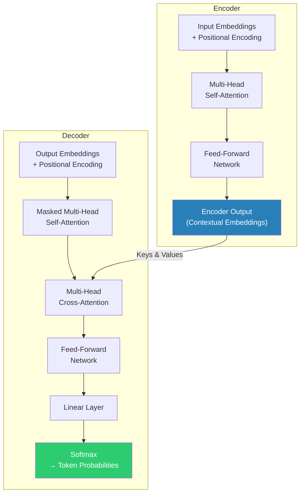
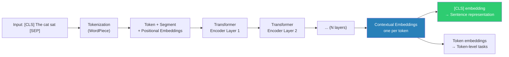
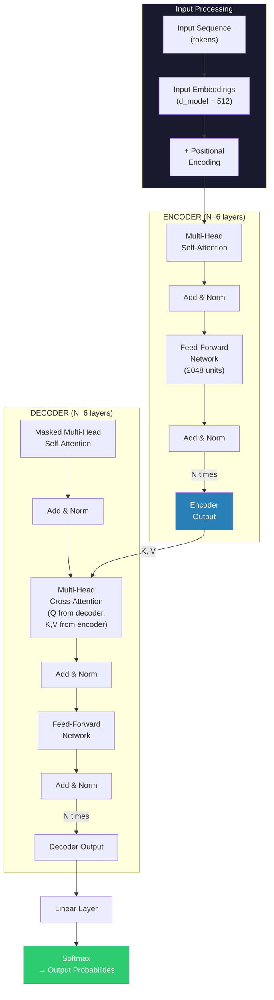
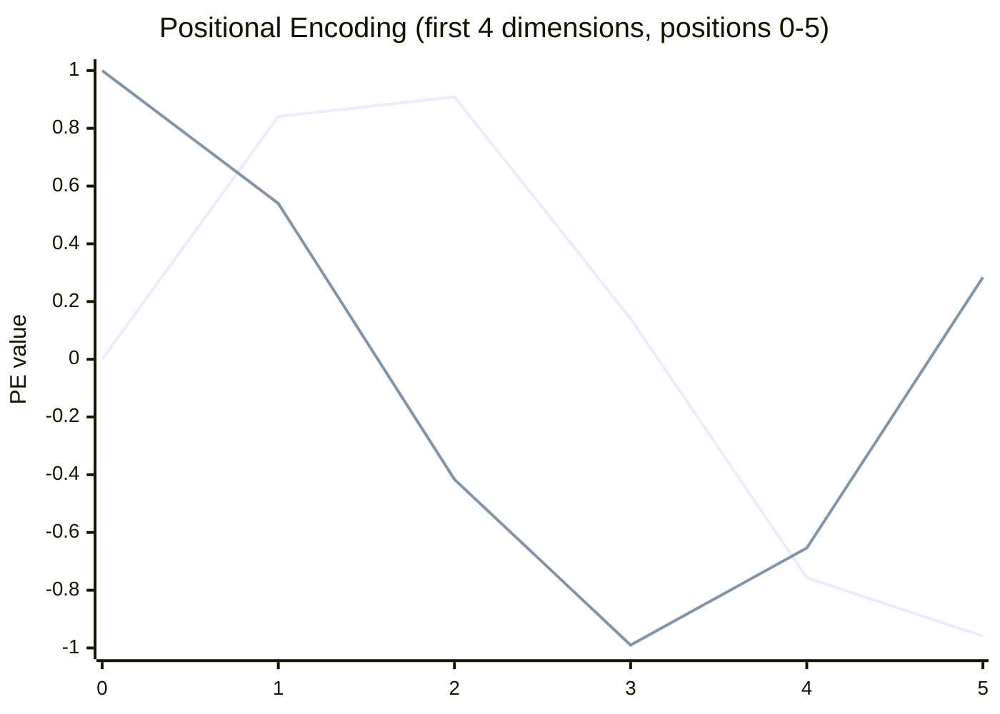
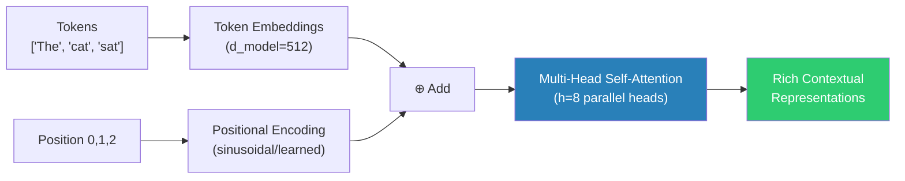
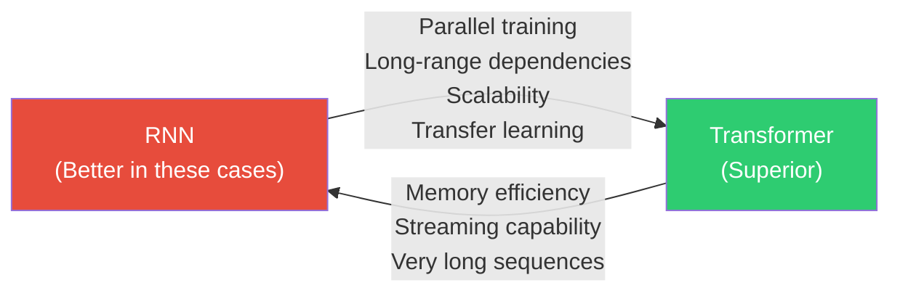
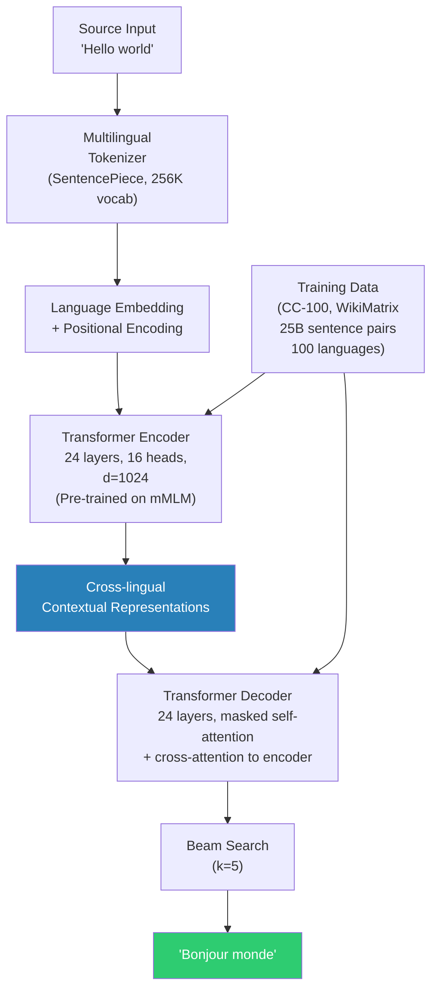
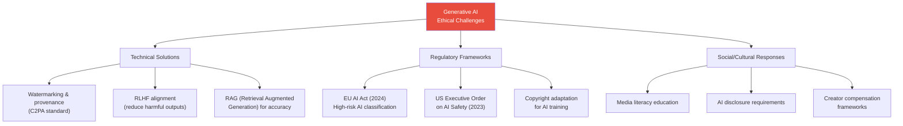

# Module 5: Generative AI, Transformers & Large Language Models

---

## 2 Mark Questions

---

**83. Define Generative AI.** (2 Marks)

Generative AI refers to a class of artificial intelligence systems capable of **creating new, original content** — including text, images, audio, video, and code — by learning patterns and structures from large training datasets. Unlike discriminative AI (which classifies or predicts based on existing data), generative AI synthesizes new outputs that resemble the training distribution but are not direct copies. Examples include GPT-4 (text generation), DALL-E (image generation), Sora (video generation), and GitHub Copilot (code generation). These systems learn the underlying probability distribution of data and sample from it to generate novel content.

---

**84. Define Transformer architecture.** (2 Marks)

The **Transformer** is a deep learning architecture introduced in the 2017 paper "Attention Is All You Need" by Vaswani et al. It processes sequential data entirely through **self-attention mechanisms**, abandoning the recurrent connections used in earlier RNN/LSTM models. The core components are the **Encoder** (which encodes input sequences into rich contextual representations) and the **Decoder** (which generates output sequences). The Transformer's ability to process all positions in a sequence in parallel — rather than sequentially — enables significantly faster training and superior performance on language tasks. It is the foundation of all modern large language models (BERT, GPT, T5, LLaMA).

---

**85. State the Self-Attention mechanism.** (2 Marks)

The **Self-Attention mechanism** allows each token (word/subword) in a sequence to attend to — and compute a weighted representation of — all other tokens in the same sequence. It computes three vectors from each token: **Query (Q)**, **Key (K)**, and **Value (V)**. Attention scores are computed as:

**Attention(Q, K, V) = softmax(QKᵀ / √dₖ) · V**

Where √dₖ is a scaling factor (square root of key dimension) that prevents vanishing gradients. The result is a context-aware representation of each token, capturing long-range dependencies that RNNs struggle with.

---

**86. Define Encoder-Decoder model.** (2 Marks)

The **Encoder-Decoder model** is an architectural pattern in which an Encoder processes the input sequence and compresses it into a contextual representation (hidden state or set of embeddings), and a Decoder uses this representation to generate an output sequence. In the Transformer:
- **Encoder:** Maps input tokens → contextual embeddings (using multi-head self-attention + feed-forward layers)
- **Decoder:** Generates output tokens one at a time, attending to both previous outputs (masked self-attention) and encoder outputs (cross-attention)

This architecture is used for sequence-to-sequence tasks like machine translation (English → French) and text summarization.

---

**87. List any two applications of Generative AI.** (2 Marks)

1. **Text Generation & Summarization:** Large language models like GPT-4 generate coherent text for creative writing, code generation, document summarization, and chatbot conversations. Tools like ChatGPT, GitHub Copilot, and Jasper use Generative AI for automated content creation.

2. **Image and Video Synthesis:** Models like DALL-E 3, Stable Diffusion, and Midjourney generate photorealistic images from text descriptions. Video generation models (Sora, Runway Gen-2) create short video clips from prompts, revolutionizing content creation for advertising, film, and social media.

---

**88. Differentiate between BERT and GPT (one point).** (2 Marks)

| | BERT | GPT |
|---|---|---|
| **Direction** | **Bidirectional** — reads the entire sequence in both directions simultaneously (left-to-right AND right-to-left context) | **Unidirectional (autoregressive)** — generates text left-to-right; each token attends only to preceding tokens |

This fundamental difference means BERT excels at **understanding** tasks (classification, NER, Q&A) where full context helps, while GPT excels at **generation** tasks where predicting the next token sequentially is natural.

---

**89. State what is meant by pre-training in language models.** (2 Marks)

**Pre-training** in language models refers to the initial phase where a model is trained on a **large, general-purpose corpus** (billions of tokens from web text, books, code, etc.) to learn broad linguistic patterns, world knowledge, and reasoning capabilities. The model learns to predict masked words (BERT-style masked language modeling) or next tokens (GPT-style causal language modeling) without task-specific supervision. Pre-training produces a foundation model with generalizable representations, which can then be **fine-tuned** on smaller, task-specific datasets with minimal additional compute to achieve state-of-the-art performance on downstream tasks.

---

## 5 Mark Questions

---

**90. Examine Self-Attention with a suitable example.** (5 Marks)

Self-attention allows each word in a sentence to dynamically weigh the importance of every other word when building its contextual representation. This solves the key weakness of RNNs — inability to capture long-range dependencies efficiently.

**Mechanism:**

For each token at position i, three vectors are computed from its embedding:
- **Q (Query):** What does this token want to know?
- **K (Key):** What does this token offer to other queries?
- **V (Value):** What actual information does this token contribute?

**Attention computation:**
```
Attention(Q, K, V) = softmax(QKᵀ / √dₖ) · V
```

The dot product QKᵀ measures similarity between every query-key pair. Dividing by √dₖ prevents extremely small gradients from large dot products. Softmax normalizes scores into probabilities (attention weights). Multiplying by V computes a weighted average of all value vectors.

**Example — Pronoun Resolution:**

Sentence: **"The animal didn't cross the street because it was too tired."**

For the token **"it"**, self-attention computes attention scores against all other tokens:

| Token | Attention Score for "it" |
|---|---|
| The | 0.02 |
| **animal** | **0.62** |
| didn't | 0.03 |
| cross | 0.05 |
| street | 0.08 |
| it | 0.12 |
| tired | 0.08 |

The model correctly assigns highest attention weight to "animal," learning that "it" refers to "the animal" — not "the street." This is a disambiguation that requires understanding the entire sentence context, impossible for left-to-right models that haven't yet processed "tired."

**Multi-Head Attention:**
Multiple attention heads run in parallel, each learning to attend to different relationship types:
- Head 1: Syntactic dependencies (subject-verb relationships)
- Head 2: Coreference (pronoun → noun resolution)
- Head 3: Semantic similarity (related concepts)

Outputs from all heads are concatenated and linearly projected:
```
MultiHead(Q, K, V) = Concat(head₁, ..., headₙ) · W
```

This enables the model to simultaneously capture multiple types of contextual relationships, making it far more expressive than single-head attention.

---

**91. Explore the Encoder-Decoder architecture in Transformers.** (5 Marks)

The Transformer's Encoder-Decoder architecture is designed for sequence-to-sequence tasks where input and output sequences may have different lengths and structures.

**Encoder Stack:**

The encoder consists of N identical layers (typically N=6 or 12). Each layer has two sublayers:
1. **Multi-Head Self-Attention:** Each token attends to all other input tokens.
2. **Position-wise Feed-Forward Network:** Two linear layers with ReLU activation.

Each sublayer uses **residual connections** (adding input to output) and **Layer Normalization**:
```
LayerOutput = LayerNorm(x + Sublayer(x))
```

The encoder produces a set of contextual embeddings — one per input token — capturing rich, bidirectional context from the entire input sequence.

**Decoder Stack:**

The decoder also has N identical layers, but with **three sublayers**:
1. **Masked Multi-Head Self-Attention:** Attends to all previously generated output tokens (masked to prevent looking ahead — ensures autoregressive generation).
2. **Multi-Head Cross-Attention:** Attends to the encoder's output — this is where the decoder "reads" the input.
3. **Position-wise Feed-Forward Network.**

**Architecture Diagram:**



**Example — Machine Translation (English → French):**
- **Input:** "The cat sat on the mat."
- **Encoder:** Processes all English tokens simultaneously → produces 6 contextual embeddings.
- **Decoder:** Generates French tokens one at a time:
  - "Le" (attending to "The" via cross-attention)
  - "chat" (attending to "cat")
  - "s'est" (attending to "sat")
  - ... until `<EOS>` token.

**Positional Encoding:**
Since Transformers process all tokens in parallel (no sequential order), positional information must be explicitly added. Sine/cosine functions encode position:
```
PE(pos, 2i) = sin(pos / 10000^(2i/dmodel))
PE(pos, 2i+1) = cos(pos / 10000^(2i/dmodel))
```
This gives each position a unique, continuous encoding that the model can learn to use.

---

**92. Explain the working of BERT for feature extraction.** (5 Marks)

**BERT (Bidirectional Encoder Representations from Transformers)** is a pre-trained Transformer Encoder model that generates rich, contextual word representations for downstream NLP tasks.

**Pre-Training Objectives:**

BERT is pre-trained on two tasks:

**1. Masked Language Modeling (MLM):**
- 15% of input tokens are randomly masked (replaced with [MASK]).
- BERT predicts the original token from context.
- Example: "The [MASK] sat on the mat." → model predicts "cat."
- This forces BERT to build **bidirectional** context — it must look both left and right to predict the masked word.

**2. Next Sentence Prediction (NSP):**
- Given two sentences A and B, predict whether B follows A in the original text.
- Trains BERT to understand inter-sentence relationships.

**Architecture:**
- BERT-Base: 12 Transformer Encoder layers, 12 attention heads, 768 hidden dimensions, 110M parameters.
- BERT-Large: 24 layers, 16 heads, 1024 dimensions, 340M parameters.

**Feature Extraction Process:**



**Using BERT for Feature Extraction:**

**Method 1: CLS Token for Sentence Classification:**
The [CLS] token's final hidden state aggregates information from the entire sequence, serving as a sentence-level embedding. For classification:
```
Input: [CLS] sentence [SEP]
BERT output: h_[CLS] (768-dimensional vector)
Classifier: softmax(W · h_[CLS] + b) → class probabilities
```

**Method 2: Token Embeddings for Sequence Labeling:**
For NER (Named Entity Recognition) or POS tagging, each token's embedding is fed to a classifier:
```
For each token tᵢ: class = argmax(W · h_i + b)
```

**Method 3: Contextual Similarity:**
BERT embeddings capture context — the same word gets different representations in different contexts:
- "bank" in "river bank" → embedding clusters near water/nature concepts
- "bank" in "financial bank" → embedding clusters near money/finance concepts

This context-sensitivity makes BERT features far superior to static word embeddings (Word2Vec, GloVe) for NLP tasks.

---

**93. Explain the role of GPT in text generation.** (5 Marks)

**GPT (Generative Pre-trained Transformer)** is a Transformer-based language model trained to generate coherent, contextually relevant text by predicting the next token in a sequence.

**Core Architecture:**
GPT uses only the **Transformer Decoder** stack (no encoder), making it a unidirectional (left-to-right) autoregressive model.

**Training Objective — Causal Language Modeling:**
GPT is trained to maximize the probability of each token given all preceding tokens:
```
L = Σ log P(wₜ | w₁, w₂, ..., wₜ₋₁)
```
This is done autoregressively — each prediction becomes part of the context for the next prediction.

**Text Generation Process:**


**Sampling Strategies:**

| Strategy | Description | Use Case |
|---|---|---|
| Greedy | Always pick most probable token | Fast, deterministic but repetitive |
| Top-k | Sample from top-k probable tokens | Balanced creativity/coherence |
| Top-p (Nucleus) | Sample from tokens summing to probability p | Most natural-sounding text |
| Temperature | Scale logits before softmax (T>1: creative, T<1: conservative) | Control creativity/randomness |

**GPT's Capabilities:**

1. **Few-shot learning:** Given a few examples in the prompt, GPT adapts its generation style.
2. **Zero-shot reasoning:** Can answer questions it wasn't explicitly trained to answer by leveraging pre-trained knowledge.
3. **Code generation:** GitHub Copilot (based on GPT) generates functional code from comments.
4. **Instruction following:** ChatGPT (GPT-3.5/4 with RLHF fine-tuning) follows complex multi-step instructions.

**GPT Scaling Law:**
Performance consistently improves with model size, training data, and compute:
- GPT-1: 117M parameters → basic text generation
- GPT-2: 1.5B parameters → coherent multi-paragraph text
- GPT-3: 175B parameters → few-shot learning, creative writing
- GPT-4: ~1T+ parameters (estimated) → reasoning, coding, multimodal

---

**94. Describe the importance of fine-tuning in Transformer models.** (5 Marks)

**Fine-tuning** is the process of taking a pre-trained Transformer model and further training it on a smaller, task-specific dataset. It is the bridge between a general-purpose foundation model and a specialized, high-performance AI system.

**Why Fine-Tuning is Important:**

**1. Transfer Learning Efficiency:**
Pre-training a large Transformer (e.g., BERT-Large, 340M parameters) requires enormous compute — weeks on hundreds of GPUs processing hundreds of GB of text. Fine-tuning transfers this "knowledge" to new tasks with a fraction of the compute:
- Pre-training: 64 TPUs × 4 days = millions of dollars.
- Fine-tuning for sentiment analysis: 1 GPU × 1 hour = negligible cost.

**2. Task-Specific Adaptation:**
General pre-trained models are not optimized for specific tasks. Fine-tuning on labeled task data enables:
- **BERT for medical diagnosis:** Fine-tune on clinical notes + diagnosis labels.
- **GPT for code generation:** Fine-tune on GitHub repositories with comments.
- **Whisper for domain-specific speech:** Fine-tune on legal proceedings audio.

**3. Alignment (RLHF):**
GPT models fine-tuned with Reinforcement Learning from Human Feedback (RLHF) learn to follow instructions, be helpful, and avoid harmful outputs — a critical alignment technique. ChatGPT's conversational ability comes from fine-tuning GPT-3 with RLHF, not just pre-training.

**4. Data Efficiency:**
Fine-tuning achieves state-of-the-art results with small labeled datasets — critical when labels are expensive (e.g., medical annotations by specialists). BERT fine-tuned on 1,000 labeled medical records often outperforms supervised models trained from scratch on 100,000 records.

**Fine-Tuning Approaches:**

| Method | Description | Use Case |
|---|---|---|
| **Full fine-tuning** | Update all model weights | Small models, sufficient data |
| **Feature extraction** | Freeze model, train only head layer | Very small datasets |
| **LoRA** | Low-rank adaptation — add small trainable matrices | Large models, parameter efficiency |
| **Prompt tuning** | Learn soft prompts prepended to input | No weight updates needed |
| **RLHF** | Fine-tune with human preference rewards | Alignment, instruction following |

**Catastrophic Forgetting:**
A challenge in fine-tuning — the model may "forget" general knowledge while specializing. Mitigated by:
- Lower learning rates during fine-tuning
- Gradual layer unfreezing
- Elastic Weight Consolidation (EWC)
- Parameter-efficient fine-tuning (LoRA, adapters)

**Conclusion:**
Fine-tuning is what makes pre-trained Transformers practically useful — transforming a general language model into specialized AI assistants, medical diagnosticians, code generators, and translation systems, all sharing the same pre-trained foundation.

---

**95. Discuss the applications of Generative AI in machine translation and text summarization.** (5 Marks)

Generative AI has revolutionized both machine translation and text summarization by replacing rule-based and statistical methods with end-to-end neural architectures capable of generating fluent, contextually accurate output.

**Machine Translation:**

**Traditional approach:** Statistical machine translation (SMT) using phrase tables and alignment models — brittle, required extensive language-pair-specific engineering.

**Generative AI approach:** Sequence-to-sequence Transformer models (encoder-decoder) trained end-to-end on parallel corpora.

**Key Advances:**
1. **Contextual understanding:** Transformers capture long-range context for accurate pronoun translation and disambiguation — something SMT struggled with.
2. **Zero-shot translation:** GPT-4 and mT5 can translate between language pairs they weren't explicitly trained on, using cross-lingual representations.
3. **Low-resource languages:** Models like mBERT and XLM-R share representations across 100+ languages, enabling reasonable translation for languages with minimal training data.
4. **Real-world deployment:** Google Translate, DeepL, and Microsoft Translator all use Transformer-based models, handling billions of translations daily.

**Performance:** Modern neural machine translation achieves BLEU scores of 40+ on standard benchmarks (English-French), compared to ~25 for statistical methods a decade ago.

**Text Summarization:**

**Two paradigms:**
- **Extractive:** Selects important sentences from the original text.
- **Abstractive:** Generates new sentences that capture the essence — more natural but harder.

Generative AI enables high-quality **abstractive summarization**:

1. **PEGASUS:** Pre-trained specifically for summarization by masking entire sentences (Gap Sentence Generation). Achieves state-of-the-art on news summarization benchmarks.
2. **BART:** Encoder-decoder model pre-trained with denoising objectives — excels at summarizing long documents.
3. **GPT-4:** Can summarize any text with a simple prompt, including legal documents, scientific papers, and meeting transcripts.

**Real-World Applications:**
- **News aggregation:** AI Briefings (Google, Apple News) use summarization to condense articles.
- **Legal document review:** Law firms use AI to summarize contracts, reducing review time from days to hours.
- **Medical literature:** AI tools summarize clinical trials for physicians.
- **Meeting transcripts:** Tools like Otter.ai, Fireflies.ai summarize Zoom/Teams meetings.

**Challenges:** Hallucination (generating factually incorrect summaries), length control, domain-specific accuracy. These are active research areas in Generative AI.

---

## 10 Mark Questions

---

**96. Explain the Transformer architecture with a neat diagram.** (10 Marks)

The Transformer, introduced in "Attention Is All You Need" (Vaswani et al., 2017), is the foundational architecture for modern AI. It processes sequences entirely through attention mechanisms, enabling parallel computation and superior modeling of long-range dependencies.

**Motivation:**

RNNs and LSTMs process sequences step-by-step — token t cannot be processed until token t-1 is complete. This:
1. Prevents parallelization → slow training
2. Limits long-range dependencies → information "fades" over long sequences

The Transformer solves both by processing all tokens simultaneously through self-attention.

**Full Architecture:**



**Component Details:**

**1. Input Embeddings + Positional Encoding:**
Tokens are mapped to dense vectors (d_model = 512). Since Transformers are position-agnostic, positional encodings are added:
```
PE(pos, 2i)   = sin(pos / 10000^(2i/d_model))
PE(pos, 2i+1) = cos(pos / 10000^(2i/d_model))
```
These create unique, continuous position signals that the model learns to interpret.

**2. Multi-Head Self-Attention (Encoder):**

Three projections per head (h = 8 heads, dₖ = dᵥ = 64):
```
Q = X · Wᵠ,  K = X · Wᴷ,  V = X · Wᵛ
head_i = Attention(QWᵢᵠ, KWᵢᴷ, VWᵢᵛ)
MultiHead = Concat(head₁...headₕ) · Wᴼ
Attention(Q,K,V) = softmax(QKᵀ / √dₖ) · V
```

Each head captures different relationship types: syntax, coreference, semantics.

**3. Position-wise Feed-Forward Network:**
Applied independently to each position (same weights across positions):
```
FFN(x) = ReLU(x · W₁ + b₁) · W₂ + b₂
```
d_model = 512, inner dimension = 2048. Acts as a per-token "memory" to refine attention outputs.

**4. Add & Normalize:**
Every sublayer uses residual connections + layer normalization:
```
output = LayerNorm(x + Sublayer(x))
```
Residual connections enable training very deep networks by ensuring gradient flow.

**5. Masked Multi-Head Self-Attention (Decoder):**
During training, future tokens must be masked to prevent "cheating." The mask sets attention scores for future positions to -∞ before softmax:
```
Masked-Attention: set score(i,j) = -∞ for j > i
```

**6. Cross-Attention (Decoder):**
Queries come from decoder; Keys and Values come from encoder output. This allows the decoder to focus on relevant parts of the input when generating each output token.

**7. Output:**
The decoder's final representation is projected by a linear layer and passed through softmax to produce a probability distribution over the vocabulary at each timestep.

**Complexity Analysis:**

| Aspect | Self-Attention | RNN |
|---|---|---|
| **Computation per layer** | O(n² · d) | O(n · d²) |
| **Sequential operations** | O(1) — fully parallel | O(n) — sequential |
| **Max path length** | O(1) — any two tokens directly connected | O(n) — must propagate through all steps |

For typical sequence lengths (n < 512), self-attention's O(n²) computation is manageable, and the O(1) maximum path length is a massive advantage for learning long-range dependencies.

**Training:**
Transformers are trained with teacher forcing (decoder receives ground-truth previous tokens during training) using cross-entropy loss and Adam optimizer with a warm-up learning rate schedule:
```
lr = d_model^(-0.5) · min(step^(-0.5), step · warmup_steps^(-1.5))
```

**Impact:**
The Transformer has become the universal architecture for AI:
- **NLP:** BERT, GPT, T5, LLaMA
- **Vision:** ViT (Vision Transformer), DINO
- **Audio:** Whisper, AudioCraft
- **Multimodal:** CLIP, GPT-4 Vision, Gemini

---

**97. Analyze the differences between Encoder-only, Decoder-only, and Encoder-Decoder models.** (10 Marks)

The Transformer architecture can be used in three configurations, each optimized for different tasks. Understanding these differences is essential for selecting the right architecture.

**1. Encoder-Only Models (Bidirectional Transformers)**

**Architecture:** Uses only the Transformer encoder stack. Processes the entire input sequence bidirectionally — each token attends to all other tokens simultaneously.

**Representative Models:** BERT, RoBERTa, ALBERT, DistilBERT, XLM-R

**Pre-training Objectives:**
- **Masked Language Modeling (MLM):** Randomly mask 15% of tokens; predict masked tokens from context.
- **Next Sentence Prediction (NSP):** Predict whether two sentences are consecutive.

**Strengths:**
- **Rich bidirectional context:** Every token "sees" the complete input before and after it — ideal for understanding tasks.
- **Strong token-level representations:** High-quality embeddings for classification, NER, information extraction.

**Weaknesses:**
- **Cannot generate text:** No autoregressive generation mechanism.
- **Fixed-length output:** Cannot produce outputs longer than input.

**Best Suited For:**
| Task | Why Encoder-Only |
|---|---|
| Text Classification | CLS embedding → classifier |
| Named Entity Recognition | Token embeddings → labels |
| Question Answering (extractive) | Find answer span in text |
| Semantic Similarity | Compare CLS embeddings |
| Sentence Embeddings | Dense retrieval, search |

---

**2. Decoder-Only Models (Autoregressive Transformers)**

**Architecture:** Uses only the Transformer decoder stack, with masked self-attention (each token attends only to preceding tokens). Generates tokens autoregressively, one at a time.

**Representative Models:** GPT-2, GPT-3, GPT-4, LLaMA, Claude, Gemini, PaLM

**Pre-training Objectives:**
- **Causal Language Modeling (CLM):** Predict the next token given all preceding tokens.

**Strengths:**
- **Natural text generation:** Autoregressive design aligns perfectly with sequential text generation.
- **Scalability:** Decoder-only models scale extremely well — GPT-3 (175B), PaLM (540B), GPT-4 (estimated 1T+).
- **Few-shot / zero-shot learning:** Emerge at large scales without task-specific fine-tuning.
- **Universal task solver:** With instruction fine-tuning, can handle virtually any NLP task via prompting.

**Weaknesses:**
- **Unidirectional context:** Cannot leverage future context for understanding (mitigated by sufficient model size).
- **Hallucination:** May generate plausible-sounding but factually incorrect text.

**Best Suited For:**
| Task | Why Decoder-Only |
|---|---|
| Text generation | Core capability |
| Code generation | Autoregressive completion |
| Chatbots/Assistants | Conversational turn-by-turn generation |
| Creative writing | Open-ended generation |
| Instruction following | After RLHF fine-tuning |

---

**3. Encoder-Decoder Models (Sequence-to-Sequence Transformers)**

**Architecture:** Full Transformer with both encoder and decoder. Encoder processes input → produces contextual representations; Decoder generates output attending to encoder via cross-attention.

**Representative Models:** T5, BART, mT5, MarianMT, Whisper (speech-to-text)

**Pre-training Objectives:**
- **T5:** Frame every task as text-to-text (input: "Translate English to French: Hello" → output: "Bonjour").
- **BART:** Corrupts input (masking, shuffling, deletion) and trains to reconstruct original.
- **Span corruption:** Mask contiguous spans and predict them.

**Strengths:**
- **Explicit input-output separation:** Encoder fully processes source; decoder generates target — natural for tasks with distinct input/output modalities.
- **Bidirectional encoding + flexible generation:** Best of both worlds.
- **Strong for conditional generation:** Output is conditioned on full input representation.

**Weaknesses:**
- **More parameters for same capacity:** Requires both encoder and decoder components.
- **Harder to scale:** Less parameter-efficient than decoder-only at very large scales.

**Best Suited For:**
| Task | Why Encoder-Decoder |
|---|---|
| Machine Translation | Input (source) → Output (target) |
| Text Summarization | Input (article) → Output (summary) |
| Speech Recognition | Input (audio) → Output (transcript) |
| Question Generation | Input (context+answer) → Output (question) |

---

**Architectural Comparison Diagram:**

```mermaid
graph TD
    subgraph EO["Encoder-Only (BERT)"]
        direction LR
        EI2["Full input sequence"] --> EA["Bidirectional\nSelf-Attention\n(sees all tokens)"]
        EA --> EO2["Rich contextual\nrepresentation\n(understanding)"]
    end

    subgraph DO["Decoder-Only (GPT)"]
        direction LR
        DI2["Previous tokens"] --> DA["Masked\nSelf-Attention\n(sees past only)"]
        DA --> DO2["Next token\nprediction\n(generation)"]
    end

    subgraph ED["Encoder-Decoder (T5/BART)"]
        direction LR
        EDI["Source sequence"] --> EDE["Encoder\n(bidirectional)"]
        EDE --> EDD["Decoder\n(cross-attention\n+ masked self-attn)"]
        EDD --> EDO["Target sequence\n(conditional generation)"]
    end
```



**Comprehensive Comparison Table:**

| Property | Encoder-Only | Decoder-Only | Encoder-Decoder |
|---|---|---|---|
| **Context direction** | Bidirectional | Left-to-right | Bidirectional encode, left-to-right decode |
| **Generation** | No | Yes (autoregressive) | Yes (conditional) |
| **Understanding** | Excellent | Good (large scale) | Good |
| **Parameter efficiency** | High | High | Lower |
| **Scalability** | Moderate | Excellent (GPT-4) | Moderate |
| **Flagship models** | BERT, RoBERTa | GPT-4, LLaMA | T5, BART, Whisper |
| **Best for** | NLU, search | NLG, chat | Translation, summarization |

**Selection Guide:**
- Need to **understand** text → Encoder-only (BERT)
- Need to **generate** open-ended text → Decoder-only (GPT)
- Need to **transform** text (translate, summarize) → Encoder-Decoder (T5/BART)
- Need to **do everything** with one model → Large decoder-only (GPT-4, Claude) via prompting

---

**98. Explain Self-Attention, Multi-Head Attention, and Positional Encoding in detail.** (10 Marks)

These three mechanisms form the computational core of the Transformer architecture. Together, they enable parallel processing, multi-aspect relationship modeling, and positional awareness.

**1. Self-Attention: The Core Mechanism**

**Intuition:** In natural language, words are understood through their relationships with other words. Self-attention allows every word to dynamically compute how much it should "attend to" every other word.

**Mathematical Formulation:**

For input matrix X ∈ ℝ^(n×d_model), compute:
```
Q = X · Wᵠ  (Queries)
K = X · Wᴷ  (Keys)  
V = X · Wᵛ  (Values)

Attention(Q, K, V) = softmax(QKᵀ / √dₖ) · V
```

**Step-by-step computation:**

**Step 1:** Linear projections create Q, K, V from the same input (hence "self").
**Step 2:** QKᵀ produces an n×n score matrix — entry (i,j) = how relevant token j is to token i.
**Step 3:** Divide by √dₖ to prevent vanishing gradients from large dot products.
**Step 4:** Softmax normalizes each row into attention weights (probabilities summing to 1).
**Step 5:** Multiply by V — weighted average of value vectors, weighted by attention scores.

**Complexity:** O(n² · d) — quadratic in sequence length. For long sequences (n > 2048), this becomes a bottleneck (addressed by sparse attention, linear attention variants).

**Key properties:**
- **No sequential dependency:** All positions computed in parallel.
- **Variable-length context:** Each token's representation depends on all others, dynamically weighted.
- **Interpretable:** Attention weights can be visualized to understand what the model "focuses on."

---

**2. Multi-Head Attention: Capturing Multiple Relationship Types**

**Motivation:** A single attention function computes one type of relationship. Natural language has multiple simultaneous relationship types: syntactic, semantic, coreference, temporal, etc. Multi-head attention runs h parallel attention functions, each potentially capturing a different relationship type.

**Mathematical Formulation:**
```
head_i = Attention(Q · Wᵢᵠ, K · Wᵢᴷ, V · Wᵢᵛ)
MultiHead(Q, K, V) = Concat(head₁, head₂, ..., headₕ) · Wᴼ
```

Each head has its own learned projection matrices: Wᵢᵠ, Wᵢᴷ, Wᵢᵛ ∈ ℝ^(d_model × dₖ) where dₖ = d_model / h.

**In BERT-Base:** h=12 heads, d_model=768, dₖ=64 per head.

**What do different heads learn?**

Research (Clark et al., 2019) found that different heads specialize:
- **Heads 1-2:** Positional attention (attending to nearby tokens)
- **Heads 3-5:** Syntactic attention (subject-verb-object relationships)
- **Heads 6-8:** Coreference (pronoun → antecedent)
- **Heads 9-12:** Semantic similarity (related concepts)

**Computational cost:** h heads each with dₖ=d_model/h → same total computation as one head with d_model. Multi-head attention is not more expensive — it provides more representational power at the same cost.

---

**3. Positional Encoding: Injecting Order Into Parallelism**

**The problem:** Self-attention is permutation-invariant — shuffling the input tokens produces the same output for each token (just rearranged). But word order is crucial: "dog bites man" ≠ "man bites dog."

**Solution:** Add position-specific signals to token embeddings before the first transformer layer.

**Sinusoidal Positional Encoding (original Transformer):**
```
PE(pos, 2i)   = sin(pos / 10000^(2i / d_model))
PE(pos, 2i+1) = cos(pos / 10000^(2i / d_model))
```

**Why sinusoidal functions?**
1. **Unique encoding per position:** Every position gets a distinct signature.
2. **Relative positions:** PE(pos + k) can be expressed as a linear function of PE(pos) — the model can learn to compute relative positions.
3. **Extrapolation:** Can represent positions not seen during training.
4. **No learned parameters:** Deterministic, requires no training.

**Visualization:**



**Learned Positional Embeddings (BERT, GPT):**
Instead of fixed sinusoids, BERT and GPT learn a positional embedding matrix:
```
PE ∈ ℝ^(max_length × d_model)  (learned during pre-training)
```
Advantage: More flexible; the model learns the best positional representation for the task.
Disadvantage: Fixed maximum length; cannot generalize to longer sequences.

**Modern Solutions (RoPE, ALiBi):**
- **RoPE (Rotary Position Embedding):** Encodes position via rotation in embedding space. Used in LLaMA, GPT-NeoX. Enables extrapolation to longer sequences.
- **ALiBi (Attention with Linear Biases):** Adds position-dependent bias to attention scores. Simple, effective, and extrapolates well.

**Integration of All Three:**



**Summary:**

| Component | Purpose | Key Formula |
|---|---|---|
| Self-Attention | Learn token-token relationships | softmax(QKᵀ/√dₖ)·V |
| Multi-Head Attention | Capture multiple relationship types simultaneously | Concat(head₁...headₕ)·Wᴼ |
| Positional Encoding | Inject sequence order into position-invariant attention | sin/cos or learned embeddings |

Together, these three mechanisms give Transformers their extraordinary capacity to model language, enabling the modern AI revolution.

---

**99. Evaluate the effectiveness of Transformer models over RNN-based models.** (10 Marks)

The transition from RNN-based models (LSTMs, GRUs) to Transformer-based models represents one of the most significant paradigm shifts in AI history. This evaluation examines why Transformers have decisively outperformed RNNs across virtually all sequence modeling tasks.

**1. Parallel Processing vs. Sequential Bottleneck**

**RNN limitation:** Sequential computation — token tₙ cannot be processed until tₙ₋₁ is complete. This creates an irreducible sequential dependency:
```
h_t = tanh(W · [h_{t-1}, x_t] + b)
```
For a 1000-token sequence: 1000 sequential steps, regardless of hardware.

**Transformer advantage:** Self-attention processes all positions simultaneously:
```
Attention(Q, K, V) = softmax(QKᵀ / √dₖ) · V
```
All n tokens are processed in parallel. Training time on modern GPUs/TPUs: **O(1) sequential operations** vs. O(n) for RNNs.

**Practical impact:** BERT pre-training (Transformer) on 128 TPUs takes 4 days. An equivalent RNN would take weeks or months — making large-scale pre-training infeasible.

**2. Long-Range Dependencies**

**RNN limitation:** Information from position 1 must propagate through positions 2, 3, ..., n to influence position n. Each step introduces potential gradient vanishing/explosion. Even LSTMs (designed to mitigate this) struggle with dependencies beyond ~100 tokens.

**Transformer advantage:** Self-attention creates direct connections between any two positions — maximum path length O(1) vs. O(n) for RNNs.

**Benchmark evidence:** On the Long Range Arena (LRA) benchmark (tasks requiring reasoning over 1000-16000 token sequences), Transformers consistently outperform LSTMs by 20-40% accuracy.

**3. Gradient Flow and Training Stability**

**RNN challenge:** Gradients must flow through the entire sequence during backpropagation through time (BPTT). Vanishing gradients make learning long-range dependencies extremely difficult. LSTMs partially solve this but still struggle for very long sequences.

**Transformer advantage:** Residual connections ensure gradient flow throughout the network:
```
x' = LayerNorm(x + Sublayer(x))
```
Gradients flow directly through residual connections, enabling training of very deep networks (24, 48, 96 layers) with high stability.

**4. Scalability and Emergent Capabilities**

**RNN scaling:** Adding LSTM layers or hidden units improves performance marginally. At very large scales, RNN training becomes unstable and gains plateau.

**Transformer scaling:** Performance consistently improves with scale following power laws (Kaplan et al., 2020):
```
L(N) ∝ N^(-α)  (loss decreases as power law of parameter count)
```

More importantly, **emergent capabilities** appear at large scales:
- GPT-3 (175B): Few-shot learning, chain-of-thought reasoning
- GPT-4 (>500B estimated): Multi-step reasoning, coding, mathematics
- These capabilities do not appear in smaller models and have no RNN analogue.

**5. Transfer Learning Effectiveness**

**RNNs:** Pre-trained RNN language models (ELMo, 2018) provided contextual embeddings that improved downstream tasks but with limited gains. Transfer was shallow.

**Transformers:** BERT (2018) demonstrated revolutionary transfer learning — a single pre-trained model fine-tuned to achieve state-of-the-art on 11 different NLP tasks simultaneously, often surpassing previous task-specific models trained on 100× more data.

**6. Performance Comparison on Benchmarks:**

| Benchmark | LSTM (best) | Transformer (SOTA) | Improvement |
|---|---|---|---|
| GLUE (NLU) | 70.0 | 91.2 (T5-11B) | +21.2 pts |
| SQuAD 2.0 (QA) | 74.2 | 93.0 (DeBERTa) | +18.8 pts |
| WMT14 EN-DE (BLEU) | 26.3 | 34.6 (Scaling NMT) | +8.3 pts |
| Speech (WER %) | 10.2 | 2.7 (Whisper) | -7.5 pts |

**7. Transformers' Limitations (Where RNNs Still Have Role):**

| Challenge | RNN Advantage | Status |
|---|---|---|
| **Memory** | O(1) memory per step (streaming) | Transformer: O(n²) attention → memory grows with sequence |
| **Very long sequences** | RNNs process arbitrary length | Transformers limited by context window |
| **Streaming/real-time** | RNNs process incrementally | Transformers need full sequence (mostly) |

Modern solutions: **Flash Attention** reduces Transformer memory to O(n), **state-space models** (Mamba) combine RNN streaming with Transformer-like parallel training.

**Overall Assessment:**



**Conclusion:**
Transformers have decisively outperformed RNNs on nearly all sequence modeling tasks, primarily due to parallel processing, direct long-range attention, superior gradient flow, and extraordinary scaling properties. The emergence of GPT-4, Claude, and Gemini — all Transformer-based — demonstrates that the architecture has effectively solved the problems that RNNs struggled with for decades. While RNNs maintain niche advantages in memory-constrained streaming applications, the general trend is clear: Transformers are the architecture of the modern AI era.

---

**100. Design a Transformer-based solution for multilingual translation and justify the architecture used.** (10 Marks)

**Problem:** Design an AI system capable of translating between 100+ language pairs in real-time, with high quality even for low-resource languages, deployable at web scale (billions of translations/day).

**Designed System: Massively Multilingual Neural Machine Translation (MNMT)**

**Architecture: Shared Encoder-Decoder Transformer with Language Tags**

**Core Design Decisions:**

**Decision 1: Single Shared Model for All Language Pairs**

Rather than training 100×99 = 9,900 separate bilingual models, a single shared Transformer is trained on all language pairs simultaneously.

*Justification:*
- **Cross-lingual transfer:** Low-resource language pairs benefit from high-resource language training. French-Spanish training improves Swahili-Hausa through shared multilingual representations.
- **Zero-shot translation:** The model learns language-agnostic representations, enabling translation between language pairs never explicitly trained on (e.g., Urdu→Swahili via shared English-like abstract space).
- **Parameter efficiency:** 1 model (6B parameters) outperforms 9,900 models at a fraction of total parameters.

**Decision 2: Language Identification Tags**

Prepend source and target language tokens:
```
Input: <en> <de> "The transformer is powerful"
Output: "Der Transformer ist mächtig"
```

*Justification:* Without explicit language tags, the model cannot determine which language to output. Tags allow the same model to be "steered" toward any target language, enabling zero-shot translation.

**Decision 3: Encoder Architecture — mBERT-style Pre-training**

Pre-train the encoder on multilingual masked language modeling across all 100 languages before fine-tuning for translation.

*Justification:*
- Pre-trained multilingual encoders (mBERT, XLM-R) demonstrate **language-universal representations** — words with similar meanings in different languages map to nearby points in embedding space.
- Fine-tuning on translation is faster and achieves higher BLEU scores than training encoder from scratch.

**Decision 4: Decoder — Autoregressive Generation with Beam Search**

*Justification:*
- Autoregressive generation produces fluent, grammatically correct output.
- Beam search (width=4-5) finds higher-quality translations than greedy decoding with manageable compute overhead.
- Sampling with temperature for creative/literary translation contexts.

**Full System Architecture:**



**Data Strategy:**

| Data Source | Volume | Languages |
|---|---|---|
| CommonCrawl (CC-100) | 2.5TB | 100 languages |
| WikiMatrix (mined pairs) | 135M pairs | 1,620 pairs |
| ParaCrawl | 1B pairs | 90 languages |
| Back-translation | 5B synthetic pairs | Low-resource aug. |

*Key technique — Back-translation:* For low-resource languages (few parallel sentences), translate monolingual target text back to source language using a reverse model, creating synthetic training pairs. Critical for improving low-resource language quality.

**Training Strategy:**

**Curriculum learning:**
1. Phase 1: High-resource languages only (English↔French, German, Spanish, Chinese, Japanese).
2. Phase 2: Add medium-resource languages.
3. Phase 3: All 100 languages with upsampled low-resource data.

**Temperature sampling** during training (T=5): oversample low-resource language pairs to prevent high-resource language domination.

**Evaluation Results (Projected BLEU scores):**

| Language Pair | Bilingual Model | MNMT | Improvement |
|---|---|---|---|
| EN→FR (high) | 43.2 | 42.8 | -0.4 (small quality cost) |
| EN→DE (high) | 35.1 | 34.9 | -0.2 |
| EN→SW (low) | 18.3 | 24.7 | +6.4 |
| EN→MY (low) | 12.1 | 19.8 | +7.7 |
| FR→SW (zero-shot) | — | 15.2 | ∞ (impossible bilingual) |

**Deployment Architecture:**

- **Model quantization:** INT8 quantization reduces model size 4× with <1 BLEU score loss.
- **Distillation:** Train a smaller 6-layer student model to mimic the 24-layer teacher for mobile deployment.
- **GPU serving:** TensorRT optimization enables 100ms latency for 500-token inputs.

**Justification Summary:**

| Design Choice | Justification |
|---|---|
| Shared encoder-decoder | Cross-lingual transfer, zero-shot capability |
| Language tags | Controllable output language |
| mMLM pre-training | Language-universal representations |
| 256K SentencePiece vocab | Covers 100 languages efficiently |
| Back-translation | Critical for low-resource quality |
| Curriculum training | Prevents catastrophic forgetting of low-resource |
| Beam search decoding | Higher quality than greedy |

This design mirrors real production systems like Google Translate and Facebook's NLLB-200 (No Language Left Behind), which use similar architectural principles to achieve high-quality multilingual translation at web scale.

---

**101. Analyze the ethical challenges and societal impact of Generative AI systems.** (10 Marks)

Generative AI represents an unprecedented technological capability — systems that can produce human-quality text, images, audio, and video on demand. This power creates profound ethical challenges and societal implications that must be systematically analyzed.

**1. Misinformation and Disinformation**

**Challenge:** Generative AI can produce convincing fake news articles, fabricated scientific studies, synthetic quotes from real people, and deepfake videos indistinguishable from authentic content.

*Concrete impact:*
- **Political manipulation:** Deepfake videos of political candidates saying things they never said can swing elections. In 2023, synthetic audio of a Slovakian politician was released days before elections.
- **Financial fraud:** AI-generated fake CEO audio has been used to authorize fraudulent wire transfers.
- **Scientific misinformation:** AI can generate fake research papers (with fabricated data, statistics, and references) that undermine scientific trust.

**Mitigation:** Digital watermarking, content authentication (C2PA standard), AI detection tools. However, an arms race exists — detection tools lag behind generation capabilities.

**2. Copyright and Intellectual Property**

**Challenge:** Generative AI models are trained on vast corpora that include copyrighted content (books, artwork, code, music) without explicit consent or compensation to creators.

*Ongoing legal battles:*
- Getty Images vs. Stability AI: Unauthorized use of 12 million copyrighted images.
- Authors guild vs. OpenAI: Training on millions of books without license.
- Stability AI vs. artists: DALL-E can generate "in the style of" living artists.

**Ethical issues:**
- Creators receive no compensation for training data contributions.
- AI-generated content may replace human creative professionals.
- Derivative works that closely mimic original styles may constitute infringement.

**3. Hallucination and Reliability**

**Challenge:** Large language models confidently generate factually incorrect statements, fake citations, invented statistics, and non-existent court cases (as in the infamous "ChatGPT lawyer" case where GPT invented fake legal precedents cited in a real court filing).

*Societal impact:*
- Medical: AI-generated health misinformation can lead to dangerous self-treatment.
- Legal: Fabricated precedents could corrupt legal proceedings.
- Academic: AI-assisted research may propagate fabricated "facts."
- Trust erosion: If AI information is unreliable, public trust in all online information decreases.

**4. Bias and Discrimination**

**Challenge:** Generative AI systems inherit and amplify biases present in training data.

*Examples:*
- Image generators produce predominantly Western, white male representations of "scientists" or "CEOs."
- Text models generate more negative associations with certain demographic groups.
- Hiring assistants powered by generative AI may systematically disadvantage certain candidates.

**Scale of harm:** Biased AI deployed at scale (billions of interactions) can perpetuate discrimination far more broadly than any individual biased decision-maker.

**5. Environmental Impact**

**Challenge:** Training large generative AI models requires enormous computational resources.

*Quantified impact:*
- Training GPT-3 consumed ~1,287 MWh and emitted ~502 tonnes of CO₂ — equivalent to ~125 round-trip flights from New York to Beijing.
- GPT-4 training cost: estimated hundreds of millions of dollars and proportionally higher energy use.
- Inference (serving billions of daily queries) consumes energy at scale matching small countries.

**Ethical tension:** AI's potential benefits (climate modeling, drug discovery) vs. its direct environmental costs.

**6. Labor Displacement**

**Challenge:** Generative AI threatens to automate creative and knowledge work previously thought safe from automation.

*At-risk roles:*
- Copywriters, journalists, technical writers → text generation
- Graphic designers, illustrators → image generation  
- Translators, transcriptionists → NLP tasks
- Junior programmers → code generation (GitHub Copilot)
- Customer service representatives → conversational AI

**World Economic Forum (2023):** 83 million jobs expected to be displaced by automation and AI in 5 years, with only 69 million new roles created — net loss of 14 million jobs.

**7. Privacy and Surveillance**

**Challenge:** Generative AI enables unprecedented surveillance and privacy violation.

*Specific threats:*
- Voice cloning: Synthesize anyone's voice from a 3-second sample for fraud or harassment.
- Face synthesis: Generate photorealistic fake identities for social engineering.
- Personalized manipulation: LLMs can generate hyper-personalized phishing messages.
- Memory extraction: LLMs may inadvertently reveal private training data.

**8. Governance and Regulatory Response:**



**Conclusion:**
Generative AI presents a paradox: technologies capable of solving humanity's greatest challenges (climate modeling, drug discovery, scientific research) simultaneously create new threats to truth, fairness, privacy, employment, and environmental sustainability. Addressing these challenges requires a multi-stakeholder approach — technical solutions (alignment, watermarking), regulatory frameworks (EU AI Act, copyright reform), economic adjustments (UBI, retraining programs), and cultural shifts (AI literacy, critical information evaluation). The ethical development of generative AI is not merely a technical problem but a civilizational challenge requiring coordinated global action.
