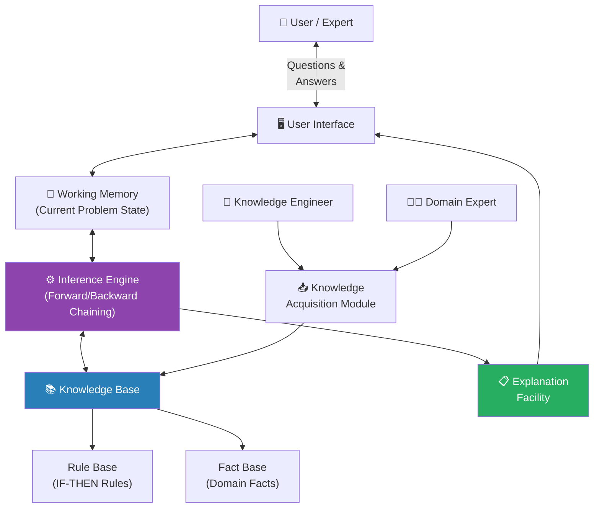
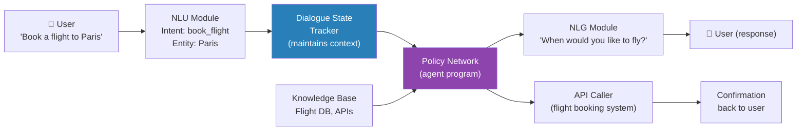
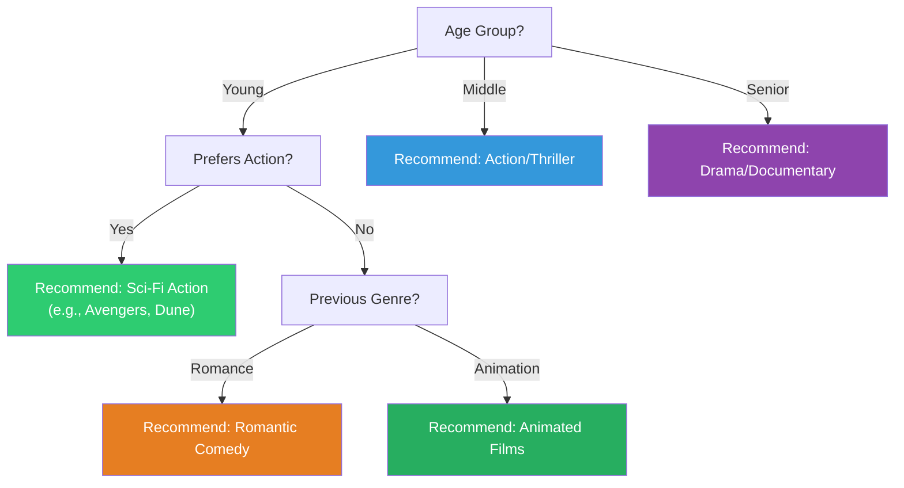
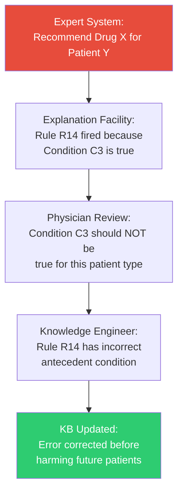
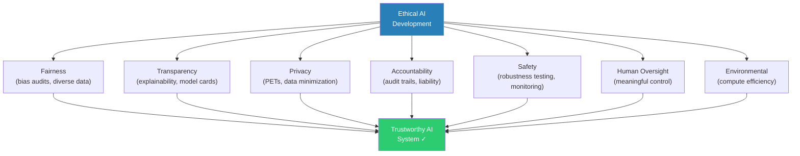
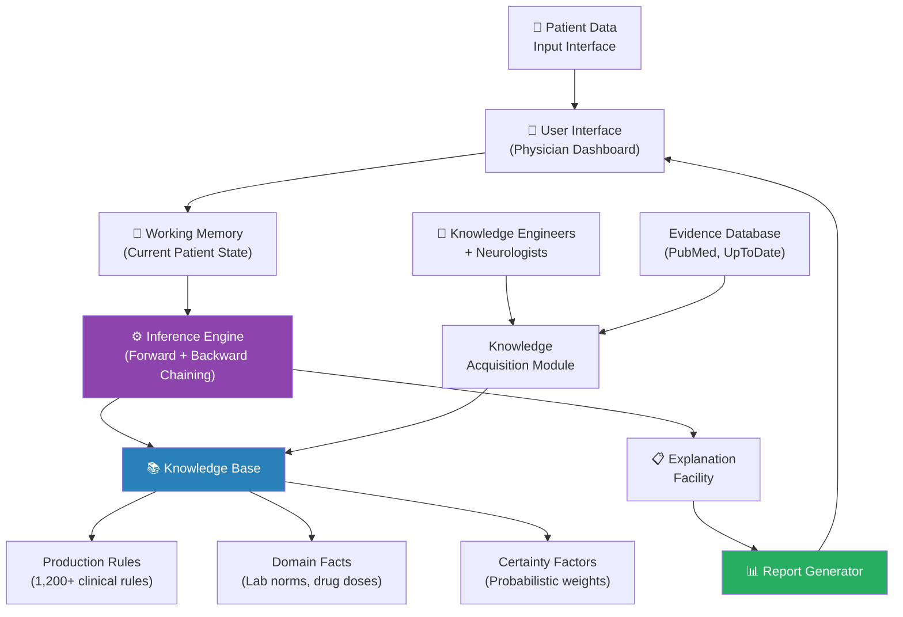
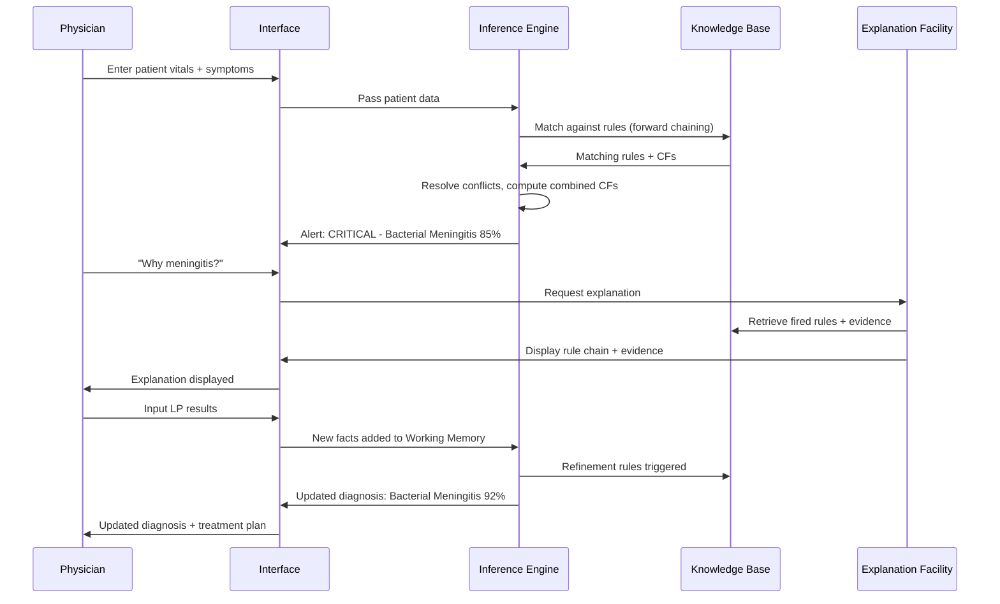
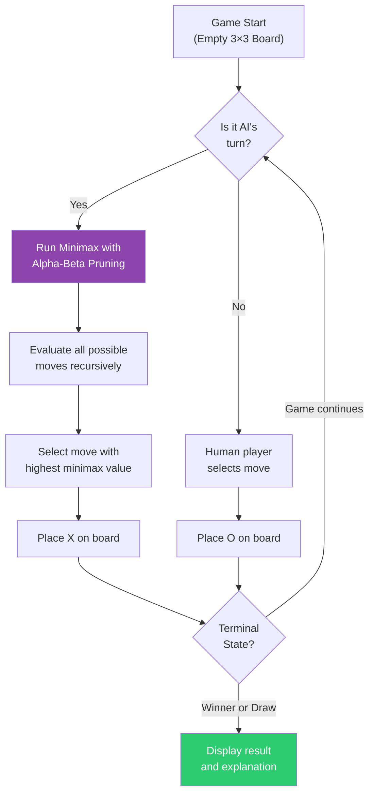
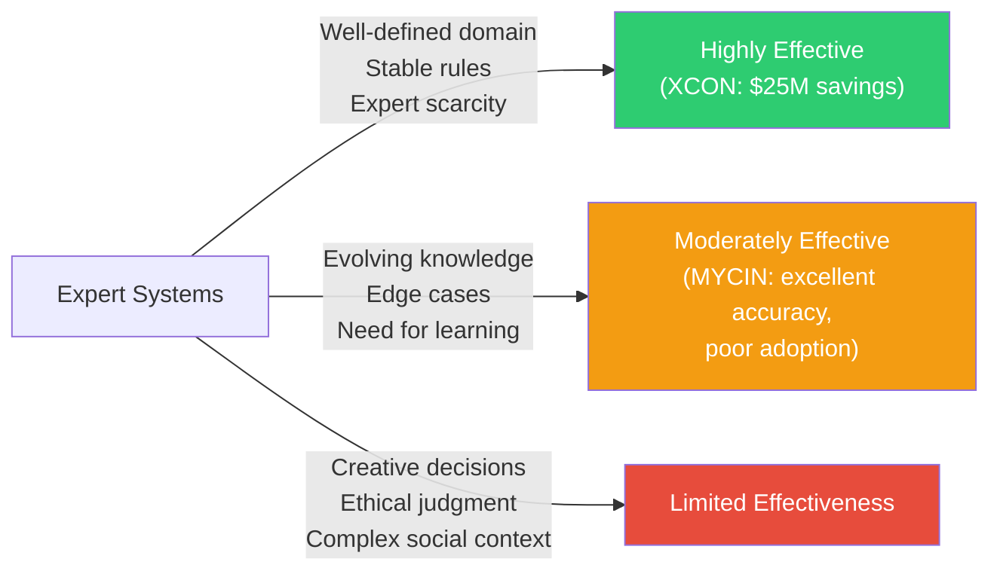
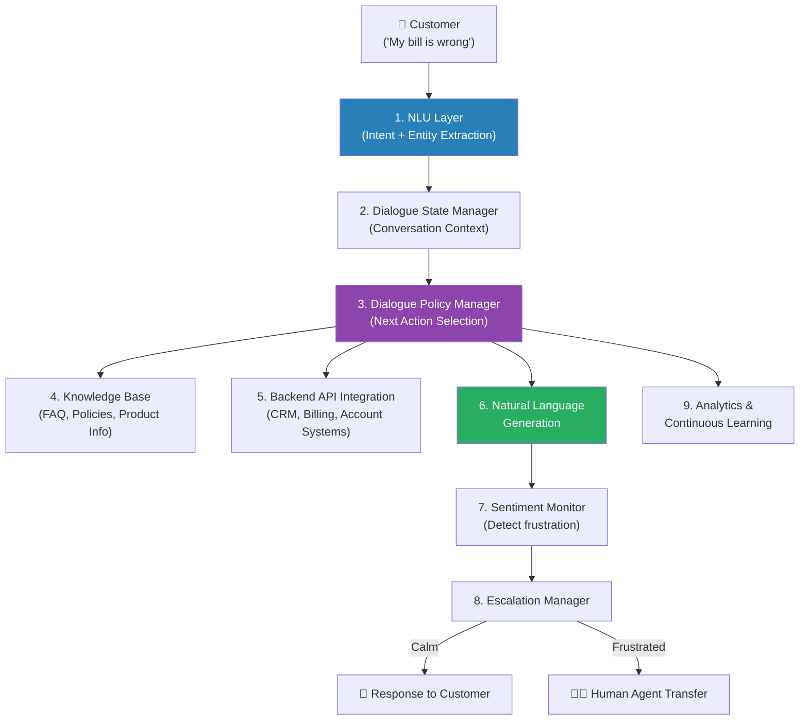

# Module 6: Expert Systems, AI Applications & Ethics

---

## 2 Mark Questions

---

**102. Define an Expert System.** (2 Marks)

An Expert System is an AI program that emulates the decision-making ability of a human expert in a specific domain. It captures and encodes the knowledge of domain experts into a structured knowledge base, then uses an inference engine to apply this knowledge to solve complex problems and provide expert-level advice. Expert systems consist of three core components: a knowledge base (domain facts and rules), an inference engine (reasoning mechanism), and a user interface. Classic examples include MYCIN (medical diagnosis), DENDRAL (chemical structure analysis), and XCON (computer configuration).

---

**103. State what is domain knowledge in Expert Systems.** (2 Marks)

Domain knowledge in Expert Systems refers to the **specialized, expert-level information** about a specific field or subject area that the system uses for reasoning and problem-solving. It encompasses:
1. **Factual knowledge:** Established facts about the domain (e.g., symptoms of diseases, properties of chemicals).
2. **Heuristic knowledge:** Rules of thumb, experience-based guidelines that experts use (e.g., "If fever > 38°C + stiff neck → suspect meningitis").
3. **Procedural knowledge:** How to perform specific diagnostic or decision procedures.

Domain knowledge distinguishes expert systems from general-purpose AI systems — they are specifically powerful within their defined domain but cannot reason outside it.

---

**104. State any one component of an Expert System.** (2 Marks)

**Knowledge Base:** The knowledge base is the central repository of an expert system, containing all domain-specific information used for reasoning. It stores:
- **Facts:** Specific, concrete information about the domain.
- **Rules:** Condition-action pairs (IF...THEN statements) that represent expert heuristics.
- **Meta-knowledge:** Knowledge about how to use the domain knowledge effectively.

The quality, completeness, and accuracy of the knowledge base directly determine the expert system's performance — it is the most critical component, often requiring months of knowledge engineering to develop.

---

**105. State Expert System Shell.** (2 Marks)

An **Expert System Shell** is a software framework that provides the general-purpose infrastructure for building expert systems — without any domain-specific knowledge pre-loaded. It provides:
- An **inference engine** (ready to use)
- A **knowledge base editor** (for entering rules and facts)
- A **user interface framework**
- An **explanation facility**

Domain experts and knowledge engineers use the shell to build specific expert systems by adding domain knowledge. Examples include CLIPS (C Language Integrated Production System), JESS (Java Expert System Shell), and OPS5. Shells enable rapid expert system development by reusing the reasoning infrastructure across different domains.

---

**106. Summarize knowledge acquisition.** (2 Marks)

Knowledge acquisition is the process of **extracting, structuring, and encoding expert knowledge** into an expert system's knowledge base. It is often called the "knowledge acquisition bottleneck" because it is the most difficult and time-consuming phase of expert system development. The process involves:
1. **Elicitation:** Interviewing domain experts, analyzing case studies, reviewing literature.
2. **Structuring:** Organizing knowledge into rules, frames, or ontologies.
3. **Encoding:** Translating structured knowledge into the formal representation language.
4. **Validation:** Testing encoded knowledge against expert opinion and known cases.

Modern approaches include machine learning for automated knowledge extraction from large datasets.

---

**107. State one application of AI in healthcare.** (2 Marks)

**Medical Imaging Diagnosis:** AI systems, particularly Convolutional Neural Networks (CNNs), analyze medical images — X-rays, MRI scans, CT scans, and pathology slides — to detect diseases with accuracy matching or exceeding specialist physicians. For example, Google's DeepMind developed an AI system that detects over 50 eye diseases from retinal scans with expert-level accuracy in seconds. IBM Watson Oncology analyzes tumor images and patient data to recommend cancer treatment plans. These systems dramatically reduce diagnostic time and extend specialist-level care to underserved areas without specialist access.

---

**108. Explain an explanation facility in Expert Systems.** (2 Marks)

The **explanation facility** (also called the justification system or "why" module) is a component of an expert system that can trace and present the reasoning behind its conclusions to users. It serves two purposes:
1. **"Why" questions:** Explains why the system is asking a particular question — "I need this information because Rule R3 requires it to determine diagnosis X."
2. **"How" questions:** Explains how the system reached a conclusion — shows the chain of rules fired and facts used to arrive at the recommendation.

The explanation facility is critical for user trust (physicians must understand AI recommendations before acting on them) and for debugging and validating the knowledge base.

---

**109. Mention one ethical issue in AI development.** (2 Marks)

**Algorithmic Bias and Discrimination:** AI systems trained on historical data can learn and perpetuate existing societal biases, leading to discriminatory outcomes. For example, facial recognition systems have demonstrated significantly higher error rates for women and people with darker skin tones (MIT study: error rates of 34.7% for dark-skinned women vs. 0.8% for light-skinned men). When such systems are deployed in criminal justice (predictive policing), hiring, or loan approval, they systematically disadvantage already marginalized groups at scale. This represents a serious ethical issue because AI amplifies bias to millions of decisions simultaneously, with consequences for individual rights and social justice.

---

## 5 Mark Questions

---

**110. Explain the architecture of an Expert System with a neat diagram.** (5 Marks)

An Expert System's architecture consists of several tightly integrated components that together enable intelligent, explainable decision-making.

**Core Components:**

**1. Knowledge Base:**
The heart of the expert system. Contains:
- **Rule base:** IF-THEN production rules (e.g., "IF fever AND cough THEN suspect flu")
- **Fact base:** Current known facts about the problem instance
- **Meta-knowledge:** Knowledge about how to use other knowledge

**2. Inference Engine:**
The "brain" that processes the knowledge base to derive conclusions. Two modes:
- **Forward chaining:** Data → conclusions (driven by facts)
- **Backward chaining:** Hypothesis → supporting evidence (driven by goals)

**3. Working Memory:**
Temporary storage for the current problem state — facts received from the user plus facts derived by the inference engine during a session. Cleared between sessions.

**4. User Interface:**
Handles input/output between user and system. Collects symptom/problem data from users and presents recommendations in natural language.

**5. Explanation Facility:**
Tracks rule firing chains; answers "Why did you ask this?" and "How did you reach this conclusion?"

**6. Knowledge Acquisition Module:**
Interface for knowledge engineers and domain experts to add, modify, and validate knowledge base entries.

**Architecture Diagram:**



**Data Flow Example — Medical Diagnosis:**
1. User reports "fever and headache" → entered via User Interface → stored in Working Memory.
2. Inference Engine scans rule base for rules with matching antecedents.
3. Rule fires: IF fever AND headache AND neck_stiffness THEN suspect_meningitis.
4. System asks: "Do you have neck stiffness?" (via Explanation Facility: "I need this because Rule R4 requires neck stiffness to diagnose meningitis").
5. User confirms → new fact added to Working Memory.
6. Rule fires → "Suspect meningitis: recommend immediate hospitalization" → displayed via User Interface.

---

**111. Describe the process of knowledge acquisition in building an Expert System.** (5 Marks)

Knowledge acquisition is the most challenging and critical phase in expert system development — often called the "knowledge engineering bottleneck" because it is slow, expensive, and requires deep collaboration between knowledge engineers and domain experts.

**The Knowledge Acquisition Process:**

**Phase 1: Domain Identification and Expert Selection**
- Define the system's scope (what specific problems will it solve?)
- Identify and recruit domain experts with relevant experience
- Clarify the expected performance level

**Phase 2: Knowledge Elicitation (Extracting Expert Knowledge)**

Multiple techniques are used because experts often have difficulty articulating implicit knowledge:

| Technique | Description | Best For |
|---|---|---|
| **Structured Interviews** | Systematic Q&A with experts | General domain overview |
| **Think-Aloud Protocol** | Expert verbalizes reasoning while solving cases | Procedural, heuristic knowledge |
| **Card Sorting** | Expert categorizes and ranks concepts | Taxonomic, conceptual knowledge |
| **Repertory Grids** | Expert evaluates attributes of cases | Comparative knowledge |
| **Case Studies** | Analyze solved historical cases | Pattern recognition |

**Phase 3: Knowledge Structuring**
Raw elicited knowledge is organized into formal structures:
- Production rules: IF [conditions] THEN [conclusions]
- Frames: Attribute-value pairs for objects
- Decision trees: Hierarchical decision logic
- Semantic networks: Relationship graphs

**Phase 4: Knowledge Encoding**
Structured knowledge is translated into the expert system shell's formal language:
```
RULE: Diagnose_Flu
  IF: symptom(fever) AND symptom(cough) AND symptom(fatigue)
      AND NOT symptom(stiff_neck)
  THEN: diagnosis(influenza) WITH certainty(0.85)
```

**Phase 5: Validation and Verification**
- **Verification:** Is the knowledge encoded correctly? (logic checking)
- **Validation:** Does the system produce the right answers? (test case evaluation)
- Expert reviews system outputs against benchmark cases.

**Phase 6: Refinement and Iteration**
Based on validation, rules are added, modified, or deleted. This is an iterative cycle — expert systems are never "complete."

**Challenges:**
- **Tacit knowledge:** Experts often "know more than they can tell" — implicit knowledge is hard to elicit.
- **Expert disagreement:** Multiple experts may give conflicting rules.
- **Knowledge evolution:** Medical/legal knowledge changes over time, requiring continuous updates.

---

**112. Explain how a chatbot can be developed using intelligent agents.** (5 Marks)

A chatbot built on intelligent agent principles is more than a simple pattern-matching system — it reasons, maintains state, and adaptively responds to user inputs as a goal-directed agent.

**Intelligent Agent Architecture for Chatbots:**

**1. Environment:**
- The conversation history (percepts)
- User's messages (current percept)
- External knowledge bases, APIs, databases (accessible via actuators)

**2. Percepts and Sensors:**
- Text input parser (natural language understanding)
- Intent classifier (what does the user want?)
- Entity extractor (what are the key pieces of information?)
- Sentiment analyzer (how is the user feeling?)

**3. Agent Program (Reasoning Core):**
The agent's brain — processes percepts and decides on actions:
- **Dialogue state tracker:** Maintains conversation context across multiple turns.
- **Policy network:** Decides what action to take given current state and goal.
- **Response generator:** Formulates the appropriate response (using templates or NLG).

**4. Actuators:**
- Natural language generation (NLG) module
- API caller (book flight, check weather, query database)
- Session manager (maintain conversation across turns)

**Architecture Diagram:**



**Key Intelligent Agent Properties:**

**Goal-Based:** The chatbot's goal is to satisfy the user's request (book flight, answer question, provide support). Every action is selected to advance toward this goal.

**Model-Based:** The dialogue state tracker maintains an internal model of the conversation — what has been said, what information has been gathered, what remains to be clarified. This enables coherent multi-turn conversations.

**Learning Agent:** Modern chatbots use reinforcement learning from human feedback (RLHF) — users rate responses, and the policy network is updated to prefer higher-rated actions. This enables continuous improvement.

**Example Multi-Turn Interaction:**
```
Turn 1: User: "Book a flight to Paris"
         Bot: "When would you like to fly?" [asks for missing info]
Turn 2: User: "Next Friday"  
         Bot: "Flying from which city?" [still gathering info]
Turn 3: User: "London Heathrow"
         Bot: "I found 3 flights. British Airways at £180, Air France at £165..."
```

The agent maintains context across all turns, building a complete understanding of the task before taking action — demonstrating true intelligent agent behavior.

---

**113. Discuss the role of DFS and BFS in solving maze problems.** (5 Marks)

Maze solving is a classic application of graph search algorithms, and DFS/BFS are the two fundamental approaches, each with distinct characteristics that make them suitable for different maze-solving scenarios.

**Maze as a Graph Search Problem:**
- **Nodes:** Grid cells (positions in the maze)
- **Edges:** Valid moves (up, down, left, right — no walls)
- **Initial state:** Starting cell
- **Goal state:** Exit cell
- **Actions:** Move to adjacent non-wall cell

**BFS for Maze Solving:**

BFS explores the maze level by level, expanding all cells at distance d before cells at distance d+1 from the start.

*Behavior:*
- Uses a FIFO queue
- Explores all paths of length 1, then length 2, then length 3, etc.
- Finds the **shortest path** (minimum number of moves) to the exit

*Advantages:*
- **Optimal:** Guaranteed to find the shortest route through the maze.
- **Complete:** If an exit exists and is reachable, BFS will find it.

*Disadvantages:*
- **Memory-intensive:** Stores all frontier cells at each level. For a large maze, this can be enormous.
- **Slower in practice:** For deep mazes with distant exits, BFS wastes time exploring "dead-end paths" at each level.

**DFS for Maze Solving:**

DFS plunges deep down one path before backtracking and trying alternatives.

*Behavior:*
- Uses a LIFO stack (or recursion)
- Follows one path as deep as possible, backtracks on dead ends
- May find a **non-optimal path** — not the shortest route

*Advantages:*
- **Memory-efficient:** Only stores cells on the current path (O(path_length)).
- **Fast at finding any solution:** In mazes with long corridors and few branches, DFS quickly reaches the exit.
- **Natural for maze generation:** DFS-based algorithms (recursive backtracker) generate complex, realistic mazes.

*Disadvantages:*
- **Not optimal:** The first path found may be much longer than the shortest.
- **Can get "lucky" or "unlucky":** Direction choice matters enormously.

**Comparison on a Sample Maze:**

```
Start → [S][ ][ ][ ]
         [#][#][#][ ]
         [ ][ ][ ][ ]
         [ ][#][#][#]
         [ ][ ][ ][G] ← Goal
```

| Metric | BFS | DFS |
|---|---|---|
| Cells explored before finding exit | ~15 (all at each distance) | ~7-20 (path-dependent) |
| Path found | Shortest (9 moves) | May be 15+ moves |
| Memory used | High (stores all frontier) | Low (stores current path) |
| Best use case | Short maze, optimality needed | Large maze, any solution needed |

**Real-World Applications:**
- **Robot navigation:** BFS for guaranteed shortest path in mapped environments.
- **Game AI:** DFS for quick path finding in procedurally generated dungeon levels.
- **Network routing:** BFS for minimum hop count routing.
- **GPS systems:** Informed variants (A*) for optimal real-world routing.

---

**114. Explain how Decision Trees are used in recommendation systems.** (5 Marks)

Decision trees are hierarchical models that make decisions by recursively splitting data based on feature values. In recommendation systems, they model user preferences to predict what content, products, or services a user is most likely to engage with.

**How Decision Trees Work:**

A decision tree consists of:
- **Root node:** The most discriminative feature (splits data most effectively)
- **Internal nodes:** Subsequent splitting features
- **Leaf nodes:** Final recommendations or predicted ratings

**Building a Movie Recommendation Decision Tree:**

Training data: User features + movie ratings:
```
Feature: Age_group | Prefers_action | Previous_genre | Rating
Young    | Yes       | Sci-fi         | 5-star (loved)
Young    | No        | Romance        | 5-star (loved)
Middle   | Yes       | Action         | 4-star (liked)
Senior   | No        | Drama          | 5-star (loved)
```

The tree uses **Information Gain** or **Gini Impurity** to select the best splitting feature at each node.

**Sample Recommendation Tree:**



**Advantages of Decision Trees in Recommendation:**

1. **Interpretability:** Unlike collaborative filtering or neural recommenders, decision tree recommendations are fully explainable — "We recommended this movie because you're under 30 and previously enjoyed Sci-Fi."

2. **Fast inference:** Tree traversal is O(depth) — near-instant recommendations.

3. **Handles categorical features:** User demographics, genre preferences, and device type are categorical — well-suited for tree-based models.

4. **Handles missing data:** Can use surrogate splits when a feature value is unknown.

**Limitations:**
- Single decision trees overfit easily → ensemble methods (Random Forests, Gradient Boosted Trees) are used in practice.
- Static model — doesn't adapt in real-time to changing user preferences.
- Less effective than collaborative filtering for discovering non-obvious preferences.

**Real-World Usage:**
While standalone decision trees are rare in production recommendation systems, gradient boosted trees (XGBoost, LightGBM) are widely used — notably by Netflix for personalization features and e-commerce platforms for product recommendations — typically combined with collaborative filtering in hybrid systems.

---

## 10 Mark Questions

---

**115. Analyze the importance of explanation facilities in medical diagnosis systems.** (10 Marks)

In medical AI systems, the explanation facility is not a convenience feature — it is an ethical and practical necessity. This analysis examines why explanation facilities are critical from multiple perspectives.

**What Explanation Facilities Provide:**

**1. "Why" Explanations:**
Explain why the system is requesting specific information during diagnosis:
- "I am asking about neck stiffness because if present, combined with fever and severe headache, it suggests bacterial meningitis — a life-threatening condition requiring immediate action."

**2. "How" Explanations:**
Show the inference chain leading to a conclusion:
- "I concluded bacterial meningitis because: (1) Patient has fever (39.2°C) → confirmed. (2) Patient has severe headache → confirmed. (3) Patient has neck stiffness → confirmed. All three conditions satisfy Rule R7: Suspected_Bacterial_Meningitis. Confidence: 0.87."

**3. Counterfactual Explanations:**
"What would change this diagnosis?" — "If neck stiffness were absent, the diagnosis would shift to viral encephalitis or migraine with fever."

**Importance Analysis:**

**1. Physician Trust and Acceptance:**

Medical AI systems fail not because they're inaccurate but because physicians don't trust black-box recommendations. A 2019 survey found 75% of physicians would NOT use AI diagnostic tools if they couldn't understand the reasoning.

With explanation facilities:
- Physicians can verify AI reasoning against their own clinical knowledge.
- They can identify if the AI is using incorrect information (e.g., misread lab value).
- Trust is built incrementally — physicians learn the system's reasoning patterns.

The difference between AI as a tool vs. AI as a liability often comes down to explainability.

**2. Legal and Regulatory Compliance:**

GDPR Article 22 requires AI systems used for consequential decisions to provide "meaningful information about the logic involved." In the EU, medical AI without explanation capabilities faces regulatory rejection.

FDA guidelines for software as medical device (SaMD) increasingly require explanations for AI-based diagnostic tools. The legal principle of "physician accountability" means doctors must understand and be able to justify AI-assisted decisions — requiring explanations.

**3. Error Detection and Safety:**

Explanation facilities reveal when AI is using flawed reasoning:

*Real scenario:* MYCIN (1970s medical expert system) diagnosed a case incorrectly. The explanation revealed it was using "penicillin resistance" as a contributing factor — but a nurse had entered lab data for the wrong patient. The explanation facility detected the data entry error that would have been invisible in a black-box system.

Modern equivalent: AI explains "I recommend insulin dosage reduction because BGL = 45 mg/dL." Physician recognizes this glucometer reading is implausibly low → suspects equipment error → manual retest confirms faulty reading. Patient protected from insulin overdose.

**4. Medical Education:**

Explanation facilities transform expert systems into teaching tools:
- Medical students use them to understand diagnostic reasoning patterns.
- "What would happen if this symptom were absent?" — counterfactual exploration.
- Compare system reasoning to their own reasoning — identify gaps.

MYCIN's explanation facility was used as a teaching tool in Stanford Medical School, demonstrating that AI could serve educational as well as clinical roles.

**5. Knowledge Base Debugging:**

Errors in the knowledge base (inconsistent rules, missing conditions) are detected through explanation review:



**6. Patient Communication:**

With appropriate simplification, explanations can be shared with patients:
- "The system suggests this treatment because your test results show X and Y, which together indicate Z condition."
- Improves informed consent.
- Empowers patients to participate in their healthcare decisions.

**7. Continuous Quality Improvement:**

Explanation logs create audit trails of AI reasoning:
- Post-hoc analysis of cases where AI was wrong → identify systematic reasoning failures.
- Track changes in AI behavior as KB is updated.
- Regulatory auditors can verify AI reasoning meets clinical standards.

**Consequences of Absent Explanation Facility:**
- COMPAS recidivism prediction algorithm (used in US criminal justice) had no explanation facility → ProPublica investigation revealed racial bias → public outcry → restricted use in several jurisdictions.
- Medical AI without explanation = same risk: systematic errors remain invisible until patient harm occurs.

**Conclusion:**
Explanation facilities in medical AI are not optional additions — they are fundamental to safe, trustworthy, and legally compliant deployment. They bridge the gap between AI capability and clinical acceptability, turning AI from a risky "black box oracle" into a transparent, auditable assistant that augments rather than replaces clinical judgment. The investment in explanation facility development is repaid many times over in physician adoption, error detection, regulatory approval, and patient safety.

---

**116. Discuss ethical considerations in AI system development.** (10 Marks)

As AI systems increasingly influence decisions that affect human lives — in healthcare, criminal justice, finance, education, and employment — the ethical dimensions of AI development have become paramount. This discussion examines the key ethical considerations that must guide responsible AI development.

**1. Fairness and Non-Discrimination**

**The Problem:** AI systems learn from historical data that reflects existing societal biases. Trained on biased data, AI can perpetuate and amplify discrimination at unprecedented scale.

*Documented cases:*
- **Amazon hiring AI (2018):** CV screening model penalized resumes mentioning "women's" (e.g., "women's chess club") because historical hire data was predominantly male. Scrapped after internal review.
- **COMPAS recidivism scoring:** Predicted Black defendants to re-offend at twice the rate of white defendants with comparable records (ProPublica, 2016).
- **Healthcare resource allocation:** Algorithm used by US hospitals systematically directed fewer resources to Black patients by using healthcare cost as a proxy for need (Obermeyer et al., Science 2019).

**Ethical Requirements:**
- Measure and report **fairness metrics** (demographic parity, equalized odds, individual fairness) for all deployed systems.
- Conduct **disparity audits** before and after deployment.
- Use **debiasing techniques** (resampling, adversarial debiasing, fairness constraints).
- Include **diverse teams** in AI development to identify blind spots.

**2. Transparency and Explainability**

**The Problem:** High-performing AI models (deep neural networks) are "black boxes" — their decisions cannot be explained in human-understandable terms. This is unacceptable when AI makes consequential decisions.

**The Right to Explanation:**
- GDPR (EU): "Meaningful information about the logic involved" for automated decisions.
- Credit decisions: Applicants must be told why they were denied credit.
- Medical decisions: Patients must understand treatment recommendations.
- Criminal justice: Defendants must understand basis for risk scores affecting sentencing.

**Technical approaches:**
- **LIME/SHAP:** Local explanation methods that explain individual predictions.
- **Attention visualization:** For Transformer models.
- **Interpretable models:** Decision trees, linear models where appropriate.
- **Model cards:** Standardized documentation of model performance, limitations, and intended use.

**3. Privacy and Data Rights**

**The Problem:** AI systems require vast amounts of training data, often including personal information. Data collection, storage, and use raise fundamental privacy rights concerns.

*Key issues:*
- **Training data consent:** Users didn't consent to their data training AI models (scraped from the web, social media, etc.).
- **Data memorization:** LLMs can reproduce private training data when prompted.
- **Surveillance creep:** AI enables unprecedented surveillance — facial recognition, behavior prediction, movement tracking.
- **Data breaches:** Centralized training datasets are high-value targets for attackers.

**Ethical frameworks:**
- **Privacy by design:** Build privacy protections into AI systems from the ground up.
- **Differential privacy:** Add mathematical noise to training to prevent memorization of individual examples.
- **Federated learning:** Train on distributed data without centralizing personal information.
- **Data minimization:** Collect only what is necessary for the specific AI task.

**4. Accountability and Responsibility**

**The Problem:** When AI systems cause harm, who is responsible? The AI? The developer? The deploying organization? The user?

*The accountability gap:* Current legal frameworks weren't designed for AI decision-making. When a self-driving car kills a pedestrian, liability is unclear. When medical AI misdiagnoses and harms a patient, responsibility is diffuse.

**Proposed frameworks:**
- **Strict liability:** AI deployers are strictly liable for harm caused by their systems, regardless of fault.
- **Regulatory requirements:** Pre-deployment risk assessment and certification for high-risk AI.
- **Audit trails:** AI systems must maintain logs of all decisions for post-hoc accountability.
- **Kill switches:** Human oversight mechanisms must exist for all high-stakes AI systems.

**5. Safety and Robustness**

**The Problem:** AI systems can fail in unexpected ways — adversarial attacks, distribution shift, edge cases — with potentially catastrophic consequences in safety-critical applications.

*Examples:*
- Autonomous vehicle misreads a stop sign modified with tiny stickers → doesn't stop.
- Medical AI trained on hospital A data performs poorly on hospital B data (distribution shift).
- Malicious actors craft inputs designed to fool AI systems (adversarial examples).

**Ethical requirements:**
- **Adversarial robustness testing** before deployment.
- **Out-of-distribution detection:** AI should recognize when it's operating outside its training distribution.
- **Conservative failure modes:** When uncertain, AI should defer to human judgment rather than make confident wrong decisions.
- **Continuous monitoring:** Post-deployment performance monitoring for degradation.

**6. Human Autonomy and Oversight**

**The Problem:** Highly capable AI systems risk displacing human judgment in ways that undermine autonomy and create dangerous dependencies.

**The principle of meaningful human control:** In high-stakes domains, humans must maintain meaningful oversight — they must understand AI recommendations well enough to override them when appropriate, and AI systems must be designed to support rather than supplant human judgment.

**EU AI Act High-Risk Categories requiring human oversight:**
- Medical devices
- Employment and recruitment
- Credit and financial services
- Law enforcement and criminal justice
- Critical infrastructure management

**7. Environmental Responsibility**

**The Problem:** Large AI models have significant environmental costs — training GPT-3 produced an estimated 502 tonnes of CO₂.

**Ethical requirements:**
- Report **compute and carbon costs** for large model training.
- **Efficient architectures:** Prefer distilled, quantized, or sparse models where possible.
- **Renewable energy:** Train on renewable-powered infrastructure.
- **Model reuse:** Prefer fine-tuning existing models over training from scratch.

**Ethical AI Development Framework:**



**Conclusion:**
Ethical AI development is not a constraint on innovation — it is the foundation of sustainable, trustworthy AI that society will actually adopt and benefit from. The history of technology shows that systems built without ethical consideration eventually face regulatory backlash, public rejection, or catastrophic failures. By embedding fairness, transparency, privacy, accountability, safety, and human oversight into the development process from the start, AI developers create systems that are not only powerful but genuinely beneficial and trustworthy.

---

**117. Explain the significance of AI in industry applications.** (10 Marks)

AI has moved from research laboratories to become a transformative force across virtually every industry. This analysis examines its significance in key sectors.

**1. Manufacturing and Industry 4.0**

AI is central to the "fourth industrial revolution" — the convergence of AI, IoT, robotics, and big data in manufacturing.

*Predictive Maintenance:*
AI analyzes sensor data from machines to predict failures before they occur. Siemens' predictive maintenance AI reduces unplanned downtime by 30-50% and maintenance costs by 10-25%. For a single automotive production line (worth $1M/hour when running), this represents tens of millions in annual savings.

*Quality Control:*
Computer vision systems inspect products at speeds and precision levels impossible for humans. BMW uses AI vision systems to detect paint defects as small as 0.1mm on car bodies, achieving near-zero defect rates. The same inspection by human workers would require large teams and still miss microscopic defects.

*Supply Chain Optimization:*
AI optimizes inventory, routing, and supplier selection simultaneously. Amazon's AI-driven supply chain processes 300+ variables to predict demand weeks ahead, maintaining 99.9%+ product availability while reducing inventory costs by 25%.

**2. Healthcare — Patient Outcomes and Efficiency**

*Drug Discovery:*
AI reduces drug discovery time from 15 years to 3-4 years. DeepMind's AlphaFold2 solved the 50-year protein folding problem, providing structures for virtually all known proteins — opening new targets for drug development against diseases previously considered "undruggable."

*Radiology and Pathology:*
AI reads CT scans for COVID-19 in 20 seconds vs. 15 minutes for radiologists — with 96% accuracy. In pathology, AI detected breast cancer in mammograms with 11.5% fewer false positives and 9.4% fewer false negatives than expert radiologists (Google Health, 2020).

*Personalized Medicine:*
AI analyzes patient genetics, lifestyle, and treatment response data to tailor therapies. IBM Watson Oncology matches cancer patients to clinical trials 60× faster than manual review, identifying treatments human oncologists miss.

**3. Financial Services**

*Fraud Detection:*
Mastercard's AI fraud detection processes 75 billion transactions annually, identifying suspicious patterns in milliseconds. AI fraud detection reduces false positives by 50% vs. rule-based systems — meaning fewer legitimate transactions are blocked, improving customer experience while catching more fraud.

*Algorithmic Trading:*
AI systems analyze news, social media sentiment, and market microstructure data to trade in microseconds. Algorithmic trading now accounts for 70-80% of US equity market volume. Firms using AI trading have consistently outperformed traditional funds.

*Credit Risk Assessment:*
AI models using thousands of variables (spending patterns, social connections, utility payment history) assess credit risk more accurately than traditional FICO scores, enabling credit access for millions of "credit invisible" individuals while maintaining portfolio quality.

**4. Agriculture — Precision Farming**

AI is enabling "precision agriculture" — treating each plant individually rather than managing entire fields uniformly.

*Crop Monitoring:*
Drones with AI vision systems survey thousands of acres daily, identifying pest damage, irrigation needs, and crop disease at the individual plant level. John Deere's AI spraying system targets individual weeds with herbicide — reducing chemical usage by 90% while achieving the same or better weed control.

*Yield Prediction:*
AI models integrating satellite imagery, weather data, soil sensors, and historical yields predict crop yields months before harvest with >95% accuracy, enabling better market planning and reducing food waste.

*Livestock Management:*
AI monitors individual animals via wearable sensors, detecting illness, predicting calving, and optimizing feeding — improving animal welfare and farm profitability simultaneously.

**5. Energy and Climate**

*Smart Grid Management:*
AI optimizes electricity distribution in real time, balancing renewable energy variability (solar/wind intermittency) with demand fluctuations. Google's DeepMind reduced cooling energy at data centers by 40% using AI — a finding directly applicable to industrial cooling systems globally.

*Renewable Energy Optimization:*
Wind farm AI improves power generation by 20% by adjusting turbine angles based on real-time wind patterns and predictive forecasting. AI weather models (GraphCast, FourCastNet) predict weather 10 days ahead more accurately than traditional models at 1/1000 the computational cost.

**6. Retail and E-Commerce**

*Personalization at Scale:*
Netflix's recommendation AI generates 80% of content watched — saving $1 billion annually in churn prevention. Amazon's recommendation engine drives 35% of revenue. At Amazon's scale, that's ~$70 billion annually attributable to AI recommendations.

*Demand Forecasting:*
Walmart's AI demand forecasting reduces food waste by 20% and stockout incidents by 16% — simultaneously improving sustainability and revenue.

**Economic Impact Summary:**

| Industry | AI Impact | Estimated Value |
|---|---|---|
| Manufacturing | Predictive maintenance, quality | $370B by 2025 |
| Healthcare | Drug discovery, diagnostics | $45B by 2026 |
| Financial | Fraud, trading, risk | $130B by 2025 |
| Agriculture | Precision farming | $4B by 2026 |
| Energy | Grid optimization | $9B by 2025 |
| Retail | Recommendations, supply chain | $340B by 2025 |

**Conclusion:**
AI's significance in industry is not hypothetical — it is already generating measurable, documented value across every major sector. The common thread is AI's ability to process vast amounts of complex, multi-dimensional data and extract actionable insights far faster and more accurately than human analysis. As AI capabilities continue to advance, its industrial significance will only grow — making AI literacy and adoption not merely advantageous but existentially important for competitive industries.

---

**118. Design a Medical Diagnosis Expert System and explain its components and workflow.** (10 Marks)

**System: MedExpert — A Clinical Decision Support Expert System**

**Design Objective:** Assist emergency physicians in diagnosing acute neurological conditions (meningitis, encephalitis, stroke, migraine) from symptom presentations, ensuring critical conditions are never missed.

**Domain Scope:** Acute neurological emergencies presenting with:
- Severe headache
- Fever
- Altered consciousness
- Neurological deficits

**Complete System Architecture:**



**Component Design:**

**1. Knowledge Base Design:**

*Rule Categories:*

```
=== CATEGORY 1: High-Urgency Rules (Immediate Action Required) ===
RULE: Bacterial_Meningitis_Suspected
  IF: Symptom(fever) AND Symptom(severe_headache) 
      AND Symptom(neck_stiffness) AND Age > 16
  THEN: Suspect(bacterial_meningitis) CF=0.85
        ALERT(CRITICAL) 
        Action(blood_culture_immediately)
        Action(LP_consideration)

RULE: SAH_Suspected  
  IF: Symptom(thunderclap_headache) AND Symptom(onset_sudden)
      AND Symptom(worst_headache_of_life)
  THEN: Suspect(subarachnoid_hemorrhage) CF=0.90
        ALERT(CRITICAL)
        Action(stat_CT_head_no_contrast)

=== CATEGORY 2: Diagnostic Refinement Rules ===
RULE: Bacterial_vs_Viral_Meningitis
  IF: Suspect(meningitis) AND Lab(WBC > 10000) 
      AND Lab(CSF_protein > 100) AND Lab(CSF_glucose < 40)
  THEN: Classify(bacterial_meningitis) CF=0.92
        Action(IV_antibiotics_stat)
  
RULE: Migraine_Suspected
  IF: Symptom(unilateral_headache) AND Symptom(pulsating)
      AND Symptom(nausea) AND Duration(4_to_72_hours)
      AND NOT Symptom(fever) AND NOT Symptom(neck_stiffness)
  THEN: Suspect(migraine) CF=0.88
        Action(triptan_therapy)
```

*Certainty Factor (CF) System:*
Rules include confidence weights (0 to 1). When multiple rules contribute to the same hypothesis, CFs are combined:
```
CF_combined = CF₁ + CF₂(1 - CF₁)  // two independent positive evidences
```

**2. Inference Engine Design:**

The engine uses a **mixed-initiative strategy**:
- **Forward chaining:** Continuously monitors incoming patient data (vitals, lab results) and fires alert rules immediately.
- **Backward chaining:** When the physician asks "Could this be meningitis?", works backward to identify what evidence would confirm/deny.

*Conflict Resolution (Multiple Rules Fire):*
1. **Priority by urgency:** Critical condition rules always fire first.
2. **Specificity:** More specific rules (more conditions) take priority over general rules.
3. **Recency:** Rules using the most recently entered data are preferred.

**3. User Interface Design:**

*Input panels:*
- **Vital signs:** Temperature, BP, HR, GCS score
- **Symptom checklist:** Structured neurological symptom assessment
- **Lab import:** Automatic import from hospital LIS (Lab Information System)
- **History:** Medication history, allergies, prior conditions

*Output panels:*
- **Diagnosis ranking:** Top 5 differential diagnoses with confidence percentages
- **Alert panel:** Red alerts for critical conditions requiring immediate action
- **Action plan:** Recommended investigations and treatments, ordered by urgency
- **Explanation viewer:** Clickable rule chains showing reasoning

**4. Explanation Facility:**

Physician clicks "Why Meningitis?" → system displays:

```
Bacterial Meningitis Suspected (CF = 0.85)

Evidence Supporting:
✓ Fever: 39.2°C (CRITICAL threshold >38.5°C)
✓ Severe headache: Patient reports 9/10 intensity
✓ Neck stiffness: Positive Kernig's sign documented
✓ Age 28: Adult presentation (higher bacterial risk)

Rules Fired:
R1: Bacterial_Meningitis_Suspected → CF 0.75
R7: High_Fever_Reinforcement → CF +0.10 (combined CF: 0.85)

Evidence Against:
? Petechial rash: Not yet assessed
? CSF results: LP not yet performed

Recommended Immediate Actions:
1. Blood cultures NOW (before antibiotics)
2. IV Ceftriaxone 2g (do not delay for LP)
3. CT head if focal neurological signs present
4. LP after CT if no contraindication

Reference: IDSA Bacterial Meningitis Guidelines 2023
```

**Complete Workflow:**



**Validation Strategy:**

1. **Test case database:** 1,000 cases with confirmed diagnoses from academic medical centers.
2. **Sensitivity analysis:** System must achieve ≥95% sensitivity for critical conditions (no missed meningitis/SAH).
3. **Comparison with specialists:** Diagnoses compared to consensus of 3 neurologists.
4. **Prospective trial:** Real-world evaluation in emergency departments.

**Conclusion:**
MedExpert demonstrates that a well-designed expert system — with a rich, validated knowledge base, sophisticated inference engine, and transparent explanation facility — can meaningfully support clinical decision-making in high-stakes medical environments. By capturing neurologist-level expertise and making it available to any physician, expert systems can reduce diagnostic errors, accelerate treatment, and extend specialist-level care where specialists are unavailable.

---

**119. Develop a complete algorithmic workflow for building a Tic-Tac-Toe intelligent game agent.** (10 Marks)

**Problem Definition:**
Build an unbeatable Tic-Tac-Toe AI agent that:
1. Always wins if possible
2. Always draws if it cannot win
3. Never makes a losing move

**Game Formulation:**

| Component | Definition |
|---|---|
| State | 3×3 board with {X, O, empty} for each cell |
| Initial State | All cells empty |
| Actions | Place own marker on any empty cell |
| Terminal Test | Three in a row, or board full |
| Utility | X wins: +1, O wins: -1, Draw: 0 |

**Total state space:** 9! = 362,880 terminal possibilities (much fewer with pruning)

**Core Algorithm: Minimax with Alpha-Beta Pruning**

**Step 1: Represent the Game State**
```python
class TicTacToe:
    def __init__(self):
        self.board = [[' ']*3 for _ in range(3)]
        self.current_player = 'X'  # AI plays as X
    
    def get_empty_cells(self):
        return [(i,j) for i in range(3) for j in range(3) 
                if self.board[i][j] == ' ']
    
    def check_winner(self):
        # Check rows, columns, diagonals
        for i in range(3):
            if self.board[i][0] == self.board[i][1] == self.board[i][2] != ' ':
                return self.board[i][0]  # row winner
            if self.board[0][i] == self.board[1][i] == self.board[2][i] != ' ':
                return self.board[0][i]  # col winner
        # Diagonals
        if self.board[0][0] == self.board[1][1] == self.board[2][2] != ' ':
            return self.board[0][0]
        if self.board[0][2] == self.board[1][1] == self.board[2][0] != ' ':
            return self.board[0][2]
        return None  # No winner
```

**Step 2: Minimax Algorithm**
```python
def minimax(board, depth, is_maximizing, alpha, beta):
    winner = check_winner(board)
    if winner == 'X': return +10 - depth   # AI wins (sooner = better)
    if winner == 'O': return -10 + depth   # Opponent wins
    if not get_empty_cells(board): return 0  # Draw
    
    if is_maximizing:  # AI's turn (X)
        best = -float('inf')
        for (i,j) in get_empty_cells(board):
            board[i][j] = 'X'
            best = max(best, minimax(board, depth+1, False, alpha, beta))
            board[i][j] = ' '  # undo move
            alpha = max(alpha, best)
            if beta <= alpha:  # Beta cutoff
                break
        return best
    
    else:  # Opponent's turn (O)
        best = +float('inf')
        for (i,j) in get_empty_cells(board):
            board[i][j] = 'O'
            best = min(best, minimax(board, depth+1, True, alpha, beta))
            board[i][j] = ' '  # undo move
            beta = min(beta, best)
            if beta <= alpha:  # Alpha cutoff
                break
        return best
```

**Step 3: Best Move Selection**
```python
def get_best_move(board):
    best_val = -float('inf')
    best_move = None
    alpha = -float('inf')
    beta = float('inf')
    
    for (i,j) in get_empty_cells(board):
        board[i][j] = 'X'
        move_val = minimax(board, 0, False, alpha, beta)
        board[i][j] = ' '
        
        if move_val > best_val:
            best_val = move_val
            best_move = (i,j)
    
    return best_move
```

**Complete Game Flow:**



**Step 4: Game Tree Analysis**

For the first move (9 empty cells), Minimax evaluates:
- Depth 1: 9 positions
- Depth 2: 9×8 = 72 positions
- ... 
- Total: ~255,168 terminal positions examined

With Alpha-Beta pruning, this reduces to approximately **~2,000-10,000** positions in practice.

**Step 5: Strategic Insights from Minimax**

The algorithm "discovers" strategic principles without being programmed with them:

| Strategy | Why AI Discovers It |
|---|---|
| **Play center first** | Center has most win lines (4 diagonals + row + col) → highest minimax value |
| **Block opponent's fork** | Minimax sees opponent will win in 2+ ways → must block |
| **Create own fork** | Move that creates two winning threats simultaneously → opponent can't block both |
| **Edge vs corner** | Corners give better win lines than edges → discovered via value comparison |

**Complexity Analysis:**

| Metric | Naive Minimax | With Alpha-Beta |
|---|---|---|
| **States evaluated** | ~9! = 362,880 | ~10,000-20,000 |
| **Response time** | ~50ms | ~1ms |
| **Pruning efficiency** | 0% | ~94% |

**Verification:**

Test the agent against all possible opening moves:
- AI plays first with center → **All outcomes: Draw or AI wins** ✓
- AI plays second → **All outcomes: Draw or AI wins** ✓

The agent is provably unbeatable — confirmed by exhaustive Minimax analysis.

**Extensions for Enhanced Agent:**

| Enhancement | Implementation |
|---|---|
| **Openings book** | Precomputed optimal first 2-3 moves |
| **Adjustable difficulty** | Randomly choose suboptimal moves with probability p |
| **Visual explanation** | Show evaluation scores for each possible move |
| **Learning from play** | Q-learning to improve from human matches |

**Conclusion:**
The Tic-Tac-Toe AI agent demonstrates the elegance of Minimax search: a relatively simple algorithm produces a provably perfect player by exploring the complete game tree with alpha-beta optimization. The workflow — from game formulation to state representation to recursive minimax to best-move selection — is a template applicable to any two-player zero-sum game, and scales (with enhancements) to chess, Go, and other complex games.

---

**120. Evaluate the effectiveness of Expert Systems in real-world decision-making scenarios.** (10 Marks)

Expert systems represent one of AI's earliest and most successful real-world deployments. This evaluation examines their documented effectiveness, limitations, and continued relevance.

**Historical Success Cases:**

**1. MYCIN (1976) — Medical Diagnosis:**
Developed at Stanford for diagnosing bacterial blood infections and recommending antibiotics.

*Effectiveness evaluation (Buchanan & Shortliffe, 1984):*
- Prescribed appropriate antibiotics for 69% of cases evaluated by medical faculty — compared to 62.5% for actual physicians treating the same cases.
- Expert systems demonstrated **superhuman performance** in this specialized domain — a landmark result.
- **Limitation discovered:** Physicians were reluctant to use MYCIN because they couldn't integrate it with hospital workflows and were uncomfortable with the lack of institutional accountability for AI recommendations.

**Key lesson:** Technical performance ≠ practical deployment success. Workflow integration and physician trust were equal challenges.

**2. XCON/R1 (1980s) — Computer Configuration:**
Digital Equipment Corporation's expert system configured VAX computer orders.

*Documented effectiveness:*
- Processed 95%+ of orders correctly vs. 65% for human specialists.
- Saved DEC approximately $25 million per year.
- Reduced order processing time from hours to minutes.
- Scaled to handle 2,500+ configurations — far beyond human expert capacity.

**Why highly effective here:** Unlike medical diagnosis, computer configuration is a well-defined combinatorial problem with clear rules, no ethical ambiguity, and no patient safety concerns — perfectly suited to rule-based expert systems.

**3. PXDES — Smelter Operations (1980s):**
Managed operations at a copper smelter.

*Effectiveness:* Saved $10M/year in production optimization. Operated 24/7, consistent performance — no human fatigue factor. The system outperformed human operators who worked in shifts with quality variation.

**Systematic Effectiveness Analysis:**

**Where Expert Systems Excel:**

| Scenario Characteristic | Why ES is Effective |
|---|---|
| **Well-defined domain** | Rules can completely capture domain knowledge |
| **Stable knowledge** | Rules don't change frequently (unlike fast-evolving medical knowledge) |
| **Expert scarcity** | Captures rare expertise and makes it scalable |
| **Consistent application needed** | No fatigue, no "bad days," consistent rule application |
| **Explanation required** | Built-in inference chains provide natural explanations |
| **Rule-based logic** | IF-THEN structure perfectly matches domain reasoning |

**Expert System Effectiveness Rating:**

| Domain | Effectiveness | Key Factor |
|---|---|---|
| **Tax law compliance** | Very High | Stable, codified rules |
| **Equipment fault diagnosis** | Very High | Well-defined symptom-cause relationships |
| **Product configuration** | Very High | Combinatorial constraint satisfaction |
| **Financial regulation** | High | Clear rules, high consistency value |
| **Medical diagnosis (acute)** | Moderate-High | Complex, evolving knowledge |
| **Criminal justice** | Moderate | Ethical concerns, discretion needed |
| **Creative decisions** | Low | Cannot encode aesthetic judgment |

**Documented Limitations:**

**1. Knowledge Acquisition Bottleneck:**
Building a comprehensive medical knowledge base (50,000+ rules) took years and millions in expert consultation time. In fast-moving fields, rules become outdated faster than they can be updated.

*Quantified:* MYCIN required 8+ years to develop adequately. Modern equivalent: machine learning from clinical data learns comparable patterns in weeks.

**2. Brittle Performance Outside Domain:**
Expert systems perform well within their domain but fail catastrophically on edge cases. A medical ES diagnosing tropical diseases in a US hospital may produce dangerous recommendations for presentations it has never seen.

*Evaluation:* Unlike humans, expert systems don't recognize "I don't know this case" — they apply their rules regardless, potentially with high confidence.

**3. Cannot Learn:**
Classic expert systems do not improve from experience. If a rule is wrong, it remains wrong until a knowledge engineer manually corrects it. This is particularly problematic in medicine where new treatments emerge constantly.

**Modern Hybrid Evaluation:**

Today's most effective systems combine expert systems with machine learning:
- **Neural network:** Learns patterns from millions of cases.
- **Expert system rules:** Enforce critical safety constraints and provide explanations.
- **Hybrid output:** Neural prediction + rule-based explanation + constraint enforcement.

*Example — IBM Watson Oncology:*
- Machine learning matches cancer genome profiles to drug sensitivity.
- Expert system rules enforce clinical guidelines (contraindications, dosing limits).
- Explanation facility shows oncologists the evidence basis.
- Effectiveness: 30% more treatment options identified vs. oncologists alone.

**Cost-Benefit Analysis:**

| Cost | Benefit |
|---|---|
| Knowledge acquisition: $1-10M | Captures expertise permanently |
| Maintenance: $100-500K/year | 24/7 availability, no salary |
| Development time: 2-5 years | Consistent, fatigue-free performance |
| | Scalability: 1 ES serves thousands simultaneously |
| | Formal audit trail for accountability |

**Verdict on Effectiveness:**



**Conclusion:**
Expert systems are highly effective for well-structured, rule-governed problems where domain knowledge is codifiable and relatively stable. The evidence from XCON and PXDES demonstrates genuine, quantified economic value. MYCIN demonstrates strong diagnostic accuracy but challenges in deployment — highlighting that technical effectiveness alone is insufficient. Modern expert system deployments work best as hybrid systems combined with machine learning, achieving the explanatory power and rule enforcement of traditional expert systems with the adaptability and pattern recognition of neural approaches. This hybrid model represents the state of the art in practical expert AI systems.

---

**121. Design a chatbot architecture and justify each component used in the system.** (10 Marks)

**System: SmartAssist — An Intelligent Customer Service Chatbot**

**Context:** SmartAssist is a conversational AI for a telecommunications company, handling billing inquiries, technical support, account changes, and plan upgrades for millions of customers.

**Design Principles:**
1. **Understanding over matching:** Use semantic understanding, not keyword matching.
2. **Context retention:** Remember conversation history within a session.
3. **Graceful failure:** Know when to escalate to human agents.
4. **Explainable actions:** Customers should understand why the bot asks questions.

**Complete Architecture:**



**Component Design and Justification:**

**Component 1: Natural Language Understanding (NLU) Layer**

*Function:* Transforms raw customer text into structured intent + entities.

*Implementation:* Fine-tuned BERT model for:
- **Intent classification:** `billing_dispute`, `technical_support`, `plan_upgrade`, `account_inquiry`, `cancel_service`
- **Entity extraction:** `account_number`, `billing_date`, `service_type`, `error_code`, `amount`

*Example:*
```
Input: "My bill shows an extra $30 charge I don't recognize"
Intent: billing_dispute (confidence: 0.94)
Entities: {amount: "$30", charge_type: "unrecognized"}
```

*Justification:* BERT's bidirectional context understanding correctly handles paraphrases ("my invoice", "my bill", "the amount charged") that keyword-matching would miss. Fine-tuning on telecom-domain conversations improves accuracy by 15-20% over general models.

**Component 2: Dialogue State Manager**

*Function:* Maintains conversation context across multiple turns — tracks what has been said, what information is collected, what goals remain.

*Implementation:* Slot-filling state machine:
```python
DialogueState = {
    "intent": "billing_dispute",
    "slots": {
        "account_number": "FILLED: 12345678",
        "billing_month": "MISSING",
        "charge_description": "FILLED: $30 unrecognized charge"
    },
    "conversation_history": [...],
    "session_id": "sess_abc123",
    "turns_elapsed": 3
}
```

*Justification:* Without state management, the bot would ask for account number repeatedly (frustrating customers) or lose context between turns. The state manager makes the conversation coherent and efficient — like talking to a human who actually listens.

**Component 3: Dialogue Policy Manager (Agent Core)**

*Function:* Given current dialogue state, decides the next system action.

*Implementation:* Learned policy using RLHF:
- Trained on thousands of successful human agent conversations
- Reward signal: Customer satisfaction score + task completion rate
- Actions: `ask_for_account_number`, `retrieve_bill`, `explain_charge`, `issue_credit`, `transfer_to_human`

*Justification:* Rule-based policies ("if intent=billing AND account=missing, ask account number") fail for complex multi-turn conversations. RLHF-trained policies learn nuanced strategies — like when to proactively offer a credit vs. when to escalate.

**Component 4: Knowledge Base Integration**

*Function:* Provides the bot with accurate, up-to-date product and policy information.

*Implementation:* Retrieval-Augmented Generation (RAG):
- Customer asks: "What are your data overage rates?"
- System retrieves relevant policy documents from KB.
- LLM generates answer grounded in retrieved content.
- Prevents hallucination — bot only says what's in the KB.

*Justification:* Without grounding in actual policies, LLMs hallucinate incorrect prices, plans, or policies — causing customer harm and regulatory issues. RAG ensures factual accuracy.

**Component 5: Backend API Integration**

*Function:* Connects to live systems for real customer data — billing records, account status, service tickets.

*APIs integrated:*
- CRM API: Customer account data, history
- Billing API: Current and past invoices, payment status
- Service API: Active subscriptions, data usage
- Support API: Open tickets, service outages

*Justification:* Without real-time data, the bot cannot actually resolve customer issues — only provide generic information. Integration transforms it from an FAQ bot to a genuine service agent that can check your actual bill and issue actual credits.

**Component 6: Natural Language Generation (NLG)**

*Function:* Converts system actions/data into natural, helpful customer-facing language.

*Implementation:* Template + LLM hybrid:
- **Templates:** For structured responses (bill details, credit confirmation) — ensures accuracy.
- **LLM generation:** For natural explanations, empathetic responses — ensures warmth.

*Example NLG output:*
```
Retrieved data: {charge: "Roaming", amount: 30, date: "May 3rd"}
Template: "I can see a [charge] charge of $[amount] from [date]."
LLM enrichment: "I can see a roaming charge of $30.00 on May 3rd. 
This appears to be from data usage while you were traveling. 
Were you outside your home network on that date?"
```

*Justification:* Pure templates feel robotic; pure LLM risks factual errors. The hybrid approach provides accuracy + naturalness.

**Component 7: Sentiment Monitor**

*Function:* Analyzes customer emotional state from message content and conversation pattern.

*Implementation:* Real-time sentiment classifier monitoring for:
- Negative sentiment keywords ("ridiculous", "unacceptable", "cancel", "lawyer")
- Rising frustration signals (short responses, repeated questions)
- Customer explicitly requesting human

*Justification:* Frustrated customers who are forced to stay with a bot churn at 3× the rate of those promptly transferred to humans. The sentiment monitor protects customer retention and revenue.

**Component 8: Escalation Manager**

*Function:* Decides when and how to transfer to human agents.

*Triggers:*
- Sentiment score drops below threshold
- Intent = `cancel_service` with negative sentiment
- Bot confidence below 60% for 3+ consecutive turns
- Customer explicitly requests human
- High-value customer flag

*Transfer package:* Complete conversation transcript + extracted information + recommended resolution → human agent receives full context, customer doesn't repeat themselves.

*Justification:* Intelligent escalation with context transfer dramatically reduces handle time for human agents and improves customer experience.

**Component 9: Analytics and Continuous Learning**

*Function:* Monitors performance, identifies failure modes, drives improvement.

*Metrics tracked:*
- Intent classification accuracy
- Task completion rate (issue resolved without escalation)
- Customer satisfaction score (post-chat survey)
- Escalation rate
- Average conversation turns to resolution

*Learning pipeline:*
- Failed conversations reviewed by quality analysts
- New training data generated from corrected conversations
- Model retrained weekly, deployed with A/B testing

*Justification:* Static chatbots degrade over time as customer language, products, and policies evolve. Continuous learning ensures the system improves with every interaction.

**Performance Targets:**

| Metric | Target | Justification |
|---|---|---|
| Intent accuracy | >92% | Below this, conversations become frustrating |
| Task completion | >75% | Industry average ~40%; 75% shows true intelligence |
| Escalation rate | 15-25% | Too low = missing complex cases; too high = poor AI |
| CSAT score | >4.2/5 | Competitive with human agents (~4.5/5) |
| Response time | <500ms | Feels natural, like human typing speed |

**Conclusion:**
SmartAssist's architecture demonstrates that an effective AI chatbot requires nine distinct, carefully justified components working in concert. The NLU layer provides understanding, the state manager provides memory, the policy manager provides intelligence, the KB provides accuracy, APIs provide actionability, NLG provides communication, the sentiment monitor provides empathy, the escalation manager provides judgment, and analytics provides growth. Missing any single component degrades the overall experience — confirming that intelligent agent design requires holistic, systematic thinking rather than adding individual AI features.

---

# Bonus Questions

*The following bonus questions from the end of the question bank have been answered below, with marks and module assignments indicated.*

---

**B1. Analyze industry applications of AI and discuss their societal impact and ethical implications.** *(10 Marks — Module 6)*

AI's industrial applications span healthcare (diagnostic imaging, drug discovery), finance (fraud detection, algorithmic trading), agriculture (precision farming, yield prediction), manufacturing (predictive maintenance, quality control), and transportation (autonomous vehicles, logistics optimization). Each domain generates documented efficiency gains and economic value — IBM Watson's drug discovery, Amazon's supply chain AI, and Tesla's autonomous driving collectively represent hundreds of billions in economic impact.

**Societal Benefits:**
- Extended specialist-level healthcare to underserved regions.
- Reduced food waste through precision agriculture.
- Enhanced road safety through driver assistance systems.
- Democratized financial services through AI credit assessment.

**Societal Harms:**
- **Labor displacement:** 83 million jobs at risk by 2025 (WEF estimate), particularly in transportation, manufacturing, and data entry.
- **Widening inequality:** AI benefits accrue disproportionately to capital owners and skilled workers, while automation displaces lower-skilled workers.
- **Algorithmic discrimination:** AI systems in hiring, credit, and criminal justice have demonstrated systematic bias against protected groups.
- **Environmental cost:** Training frontier AI models produces hundreds of tonnes of CO₂ per training run.

**Ethical Obligations:**
Industry deploying AI must: conduct impact assessments before deployment, measure fairness across demographic groups, invest in worker retraining programs, ensure transparent decision-making, and engage affected communities in system design. The ethical deployment of AI is not merely a regulatory requirement — it is the foundation of sustainable, socially beneficial technological progress.

---

**B2. A recommendation system produces biased results. Analyze possible causes and propose ethical corrective measures.** *(10 Marks — Module 6)*

**Root Causes of Recommendation Bias:**

**1. Historical Bias in Training Data:**
If the platform's historical user-item interactions reflect past discriminatory patterns (e.g., certain music genres were less promoted to specific demographics historically), the recommendation model learns and perpetuates these patterns. Content popular with majority demographics is over-recommended; content from minority creators is systematically under-represented.

**2. Popularity Bias:**
Most collaborative filtering algorithms favor popular items (high interaction count). This creates a self-reinforcing loop: popular items get recommended more → receive more interactions → become even more popular. Niche but high-quality content from smaller creators never breaks through.

**3. Feedback Loop Amplification:**
Users exposed only to certain content types interact with those types, signaling to the algorithm to show more of the same. A user who received biased recommendations has a biased interaction history → the algorithm doubles down on the bias.

**4. Selection Bias in User Base:**
If early adopters of a platform disproportionately represent certain demographics, the initial interaction data is unrepresentative. Models trained on this data perpetuate the early-adopter demographic's preferences.

**5. Algorithmic Disparate Impact:**
A recommendation objective optimizing for "engagement" (clicks, watch time) may systematically disadvantage content requiring deeper context (long-form journalism, educational content) versus emotionally provocative content — creating a bias toward sensationalism.

**Ethical Corrective Measures:**

**Technical Interventions:**
- **Fairness-aware recommendation:** Add fairness constraints to the optimization objective (e.g., ensure content from all demographic groups receives minimum recommendation exposure).
- **Debiasing training data:** Re-weight historical interactions to correct for documented historical biases.
- **Diversity metrics:** Optimize for item diversity in recommendation lists, not just relevance.
- **Counterfactual fairness:** Ensure recommendations would be identical regardless of protected attributes.

**Procedural Interventions:**
- **Regular fairness audits:** Quarterly measurement of recommendation rates across creator demographics.
- **Transparency reports:** Public reporting on demographic distribution of recommended content.
- **Algorithmic impact assessments:** Before deploying recommendation changes, assess differential impact on groups.

**Structural Interventions:**
- **Creator support programs:** Active promotion of underrepresented content creators to counter algorithmic disadvantage.
- **User controls:** Allow users to tune recommendation diversity, novelty, and serendipity preferences.
- **Redress mechanisms:** Clear process for creators to report and appeal perceived algorithmic discrimination.

**Governance:**
- **Ethics board oversight:** Independent review of recommendation algorithm changes before deployment.
- **Regulatory compliance:** Ensure recommendation systems comply with emerging AI regulations requiring non-discrimination.

The ultimate ethical responsibility is to recognize that recommendation systems shape public discourse, cultural exposure, and economic opportunity for creators at massive scale — and to design them with the intentionality this responsibility demands.

---

**B3. Discuss future trends in deep learning and machine learning and evaluate their impact on industry transformation.** *(10 Marks — Module 5)*

**Key Future Trends:**

**1. Foundation Models and Specialization:**
The trend of large pre-trained foundation models (GPT-4, Gemini, Claude) that are fine-tuned for specific applications will accelerate. Domain-specific foundation models (BioMedLM for healthcare, Bloomberg GPT for finance, Code Llama for software) will deliver specialist-level performance across industries.

*Industry Impact:* Democratizes AI adoption — companies without ML expertise can fine-tune foundation models for their domain. Reduces time-to-deployment from months to days.

**2. Multimodal AI:**
Models like GPT-4V, Gemini Ultra, and Claude 3 process text, images, audio, and video simultaneously. The trend continues toward models that understand and generate across modalities seamlessly.

*Industry Impact:*
- Healthcare: Simultaneous analysis of patient records + imaging + lab data.
- Manufacturing: Visual inspection + documentation + process optimization from single AI system.
- Education: Adaptive learning systems that respond to student video, audio, and text inputs.

**3. Agentic AI (AI Systems That Act):**
The shift from AI that answers questions to AI that completes multi-step tasks autonomously. AI agents (AutoGPT, Agent frameworks) plan, use tools, browse the web, write and execute code, and complete complex workflows.

*Industry Impact:*
- Software development: AI agents that write, test, and deploy code autonomously.
- Research: AI conducts literature reviews, designs experiments, analyzes results.
- Business processes: Automated workflows replacing entire departments.

**4. Efficient AI (Small, Fast, Cheap):**
Counter-trend to ever-larger models — techniques like quantization, distillation, pruning, and model merging enable high-capability AI in extremely small packages.

*Industry Impact:*
- Edge AI: High-performance AI on smartphones, IoT devices, medical implants.
- Democratization: Small teams with limited compute can deploy competitive AI.
- Real-time AI: Millisecond inference enables new interactive applications.

**5. Neuro-Symbolic AI:**
Combining neural networks (pattern recognition, language understanding) with symbolic reasoning (logic, knowledge graphs, formal verification). Systems that both learn from data AND reason according to rules.

*Industry Impact:*
- Healthcare: Neural pattern recognition + symbolic medical knowledge → explainable, safe diagnosis.
- Legal: Neural contract understanding + symbolic legal reasoning → reliable legal AI.
- Safety-critical systems: Formal guarantees alongside learned behaviors.

**6. Continual and Lifelong Learning:**
AI systems that update their knowledge continuously from new data without catastrophic forgetting — eliminating the need for periodic full retraining.

*Industry Impact:*
- Real-time adaptation to market changes in finance.
- Medical AI updated with new research findings automatically.
- Customer service AI that learns from every interaction.

**Evaluation of Industry Transformation:**

| Trend | Primary Industries Transformed | Timeline |
|---|---|---|
| Foundation models | All knowledge work | Now - 2025 |
| Multimodal AI | Healthcare, retail, media | 2024 - 2026 |
| Agentic AI | Software, research, administration | 2025 - 2027 |
| Efficient AI | Manufacturing, healthcare, consumer | 2024 - 2026 |
| Neuro-symbolic | Healthcare, legal, finance | 2026 - 2030 |
| Continual learning | Finance, customer service | 2026 - 2028 |

**Overall Assessment:**
The convergence of these trends represents a qualitative shift — from AI as a specialized tool requiring AI experts to AI as a general-purpose cognitive infrastructure accessible to any industry. McKinsey estimates $4.4T in annual economic value from generative AI alone. The industries most transformed will be those with high information content (healthcare, law, finance, education) and those with automated production (manufacturing, logistics).

The transformative impact will be profound and rapid — companies that fail to integrate AI capabilities risk obsolescence, while those that lead AI adoption will capture disproportionate market share and efficiency advantages. The challenge is ensuring this transformation is equitable, sustainable, and human-centered.
