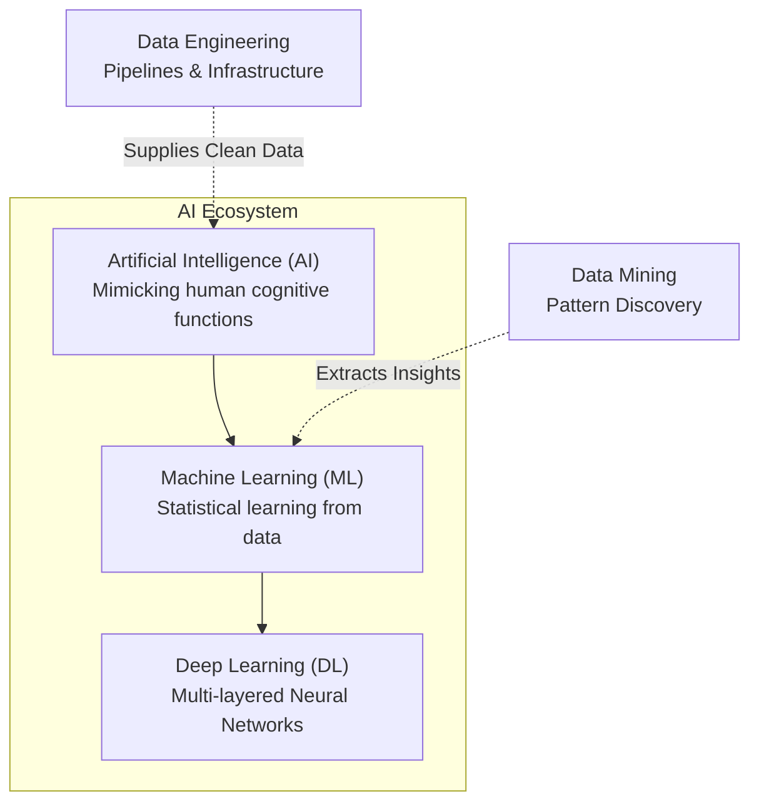
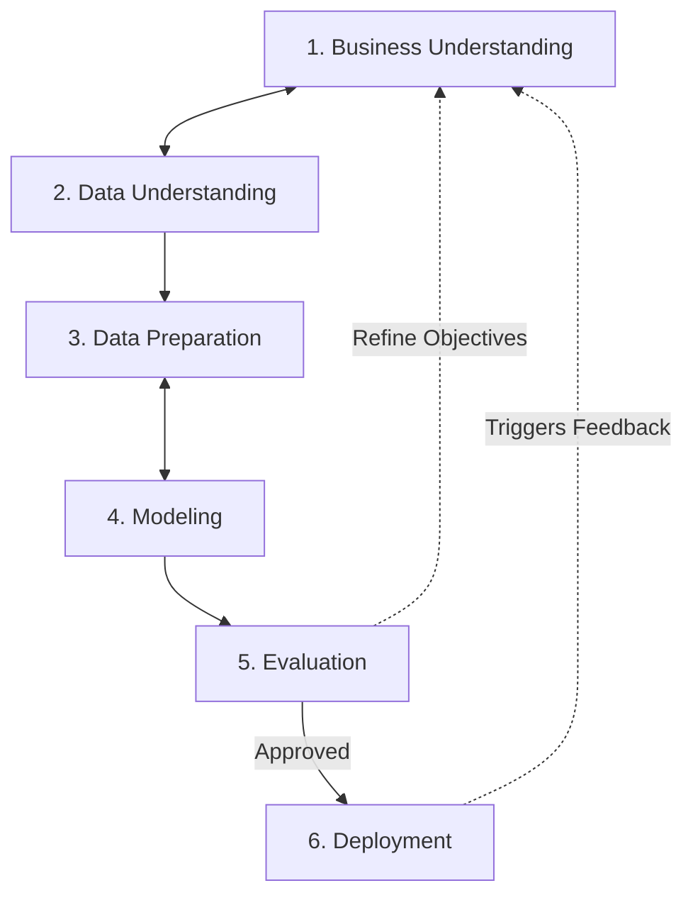
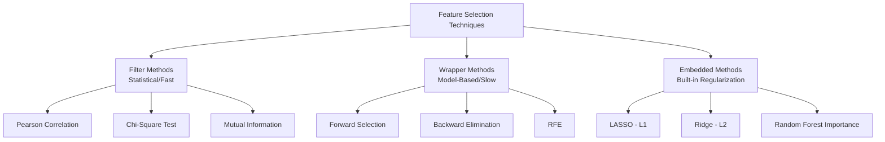
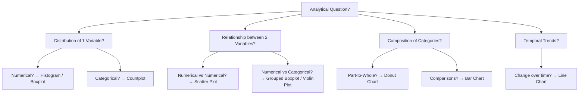
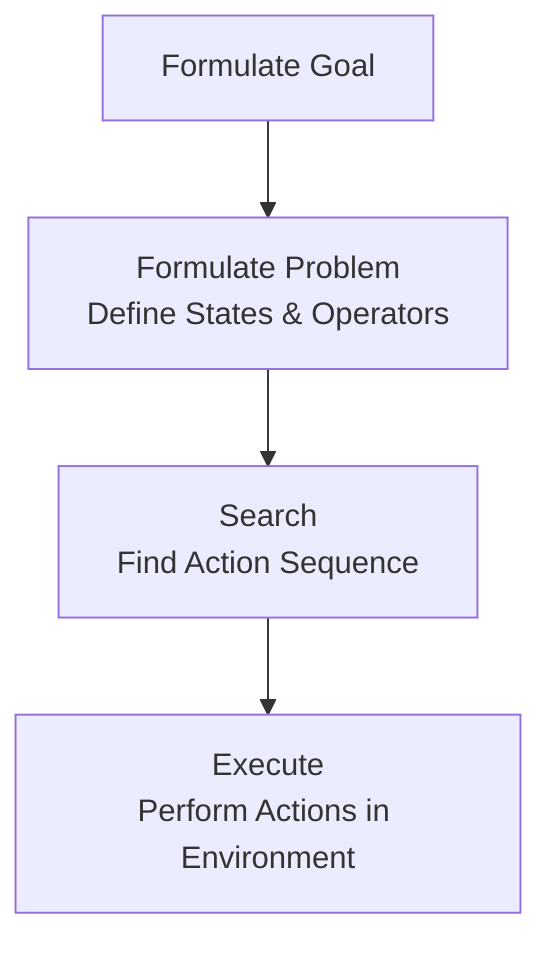
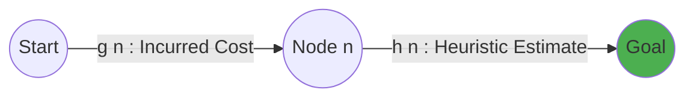
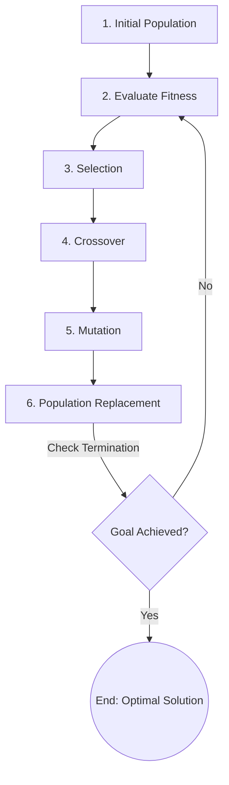
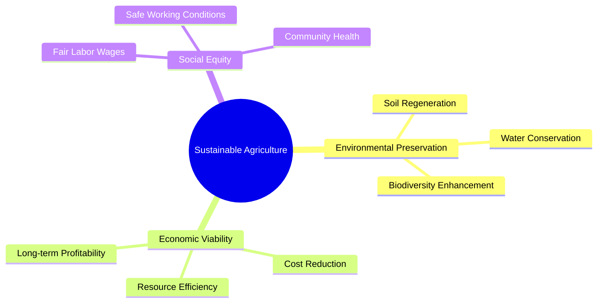

# AIDS ESE — In-Depth Revision Notes (Exam Focussed)

> **Course:** Artificial Intelligence and Data Science (AIDS)  
> **Target:** Semester VI — End Semester Examination (ESE)  
> **Note:** This document provides a highly consolidated, comprehensive, and in-depth coverage of **exclusively** all topics across the entire AIDS syllabus (Modules 1 to 6). It is rigorously structured with clear definitions, mathematical formulas, comparative tables, Python code patterns, and Mermaid diagrams to ensure rapid, high-yield exam preparation.

---

# Module 1: Introduction to Artificial Intelligence and Data Science

## 1. History & Evolution of Data Science
*   **Early Beginnings:** Roots in classical statistics and data analysis. In **1962**, John Tukey wrote *"The Future of Data Analysis"*, calling for an integration of statistics with computational sciences. In **1977**, Tukey published his landmark book *Exploratory Data Analysis (EDA)*, emphasizing looking at data before modeling.
*   **The Coining of "Data Science":** In **1997**, C.F. Jeff Wu, in his inaugural lecture at the University of Michigan, suggested renaming statistics to "Data Science" and statisticians to "Data Scientists." In **2001**, William S. Cleveland formalized it as an independent discipline, expanding statistics to incorporate advances in computing.
*   **The Big Data Explosion (2000s–Present):** The rise of social media, smartphones, and IoT generated petabytes of raw data (Velocity, Volume, Variety). Tools like Apache Hadoop (2006) and cloud infrastructures (AWS, GCP) made large-scale storage and computation cheap and accessible.
*   **Increasing Attention:**
    1.  **Data Proliferation:** Over 90% of the world's data was generated in the last few years alone.
    2.  **Decreased Storage Costs:** Storage shifted from expensive on-premise servers to cheap cloud storage.
    3.  **High-Performance Computing:** GPUs and TPUs enabled training of massive, multi-layered neural networks in hours rather than months.
    4.  **Competitive Advantage:** Organizations realized that data-driven predictive decisions vastly outperform heuristic-based or intuitive guessing.

---

## 2. Related Terminologies in Data Science
Understanding the exact boundaries between related concepts is critical for system design:

*   **Artificial Intelligence (AI):** The overarching field of computer science dedicated to creating systems capable of performing tasks that typically require human cognitive functions (e.g., reasoning, learning, perception).
*   **Machine Learning (ML):** A subset of AI focused on building algorithms that learn patterns from historical data to make predictions or decisions without being explicitly programmed.
*   **Deep Learning (DL):** A specialized subset of ML utilizing multi-layered artificial neural networks (ANNs) inspired by biological brain structures to model complex, highly non-linear representation patterns.
*   **Data Mining:** The process of discovering hidden, previously unknown, and potentially useful patterns, anomalies, and correlations within large datasets using statistics and ML.
*   **Data Engineering:** The practice of designing, building, and maintaining pipelines, architectures, databases, and data warehouses that support the reliable extraction, transformation, loading (ETL), and flow of data.



---

## 3. Types of Analytics
Analytics operates at different levels of complexity, shifting from looking at historical records to driving automated, optimized actions:

| Type | Core Question | Focus | Complexity & Value | Core Tools & Techniques | Real-World Example |
| :--- | :--- | :--- | :--- | :--- | :--- |
| **Descriptive** | *What happened?* | Historical data, summaries | Low complexity, low value | Aggregations, mean/median, dashboards, bar charts | A retail report showing total revenue in Q4 was $2.4M. |
| **Diagnostic** | *Why did it happen?* | Causality, correlations | Medium complexity, medium value | Drill-downs, data mining, hypothesis tests, VIF, correlation plots | Analyzing website logs to find that a server crash caused a Q4 sales dip. |
| **Predictive** | *What will happen?* | Forecasting, patterns | High complexity, high value | Regression, classification, time-series (ARIMA), Random Forest | A churn prediction model identifying customers with >85% likelihood of leaving next month. |
| **Prescriptive** | *What should we do?* | Optimization, decisions | Very high complexity, very high value | Linear programming, simulation, reinforcement learning, decision trees | A dynamic pricing engine adjusting flight ticket costs based on real-time demand. |

---

## 4. Data Science Process Models
A systematic framework ensures that projects translate commercial business problems into verified, deployable data-driven systems.

### CRISP-DM Model (Cross-Industry Standard Process for Data Mining)
CRISP-DM is a cyclical, highly iterative 6-phase framework:

1.  **Business Understanding:** Clearly define the project objectives, constraints, and success criteria from a business perspective. Translate the business goal (e.g., reduce loan defaults) into a data science objective (e.g., predict default probability).
2.  **Data Understanding:** Collect initial datasets. Explore their properties, check dimensions, identify data quality issues (missing fields, extreme entries), and generate initial hypotheses.
3.  **Data Preparation (Preprocessing):** Clean the dataset. Handle missing records, treat outliers, standardize scales, encode categories, and perform feature engineering. This consumes ~70-80% of project time.
4.  **Modeling:** Select and train appropriate machine learning algorithms (e.g., Logistic Regression, XGBoost). Tune hyperparameters using cross-validation.
5.  **Evaluation:** Rigorously validate model performance against the business success criteria. Ensure the model generalizes to unseen test data and check for biases.
6.  **Deployment:** Deliver the model into a production environment (via APIs, dashboards, or embedded systems). Set up continuous monitoring to detect performance drift.



---

## 5. Intelligence and its Types
In AI, **intelligence** is defined as the capability of an entity to perceive its environment, learn from experience, reason logically, and take autonomous actions to achieve specific goals.

*   **Artificial Narrow Intelligence (ANI / Weak AI):** Systems designed and trained to perform one specific task exceptionally well. They cannot generalize beyond their narrow domain. *Example: Google Translate, Siri, chess engines (Deep Blue).*
*   **Artificial General Intelligence (AGI / Strong AI):** A theoretical, human-level intelligence. An AGI system could perform any intellectual task a human can, including abstract reasoning, learning across domains without retraining, and understanding context.
*   **Artificial Super Intelligence (ASI):** A hypothetical future AI that surpasses human cognitive capabilities across all disciplines, including scientific creativity, general wisdom, and social skills.
*   **Other Dimensions of Intelligence:**
    *   *Fluid Intelligence:* The capacity to think logically and solve novel, unfamiliar problems independent of acquired knowledge.
    *   *Crystallized Intelligence:* The ability to apply accumulated knowledge, experience, and skills.
    *   *Emotional Intelligence (EQ):* The ability to perceive, understand, manage, and influence emotions (vital for conversational AI and social robotics).
    *   *Collective Intelligence:* Shared or group intelligence emerging from the collaboration and competition of many individual agents (e.g., Swarm Intelligence algorithms).

---

## 6. Categorization of AI Systems (Based on Functionality)
AI systems are categorized based on their cognitive capabilities and internal architecture:

1.  **Reactive Machines:**
    *   *Characteristics:* No memory or internal state representation. They do not store past experiences or learn from them. They respond directly to the current input based on hardcoded rules or models.
    *   *Example:* IBM's Deep Blue (chess engine that calculates optimal moves for the current board state without recalling past games).
2.  **Limited Memory:**
    *   *Characteristics:* Maintain a temporary internal representation of recent past events. They use this historical data to make decisions. Most modern ML and DL applications fall into this category.
    *   *Example:* Autonomous vehicles (they track the speed and trajectory of surrounding cars over a rolling window of seconds to plan lane changes safely).
3.  **Theory of Mind:**
    *   *Characteristics:* Theoretical/Advanced Research systems. Capable of understanding that entities in their environment (humans, other agents) have beliefs, emotions, and motivations of their own that influence their behavior.
    *   *Example:* Social companion robots (like Hanson Robotics' Sophia, in a very primitive form).
4.  **Self-Aware AI:**
    *   *Characteristics:* Hypothetical systems. Possess consciousness, self-awareness, and sentience. They understand their own internal state, emotions, and needs.

---

## 7. Agents & Environments
In AI, a **system** is formulated as an **Agent** interacting with an **Environment**.

```
  +-------------------------------------------------+
  |                   Environment                   |
  |                                                 |
  |     +--------+                    +---------+   |
  |     | Sensors| <--- Percepts <--- |  State  |   |
  |     +----+---+                    +----+----+   |
  |          |                             ^        |
  |          v                             |        |
  |   +------+------+                      |        |
  |   |    Agent    |                      |        |
  |   |   Program   |                      |        |
  |   +------+------+                      |        |
  |          |                             |        |
  |          v                             |        |
  |     +----+-----+                       |        |
  |     |Actuators| ----> Actions --------+        |
  |     +----------+                                |
  +-------------------------------------------------+
```

### The PEAS Framework
Before designing any agent, its operational parameters must be defined using the PEAS framework:

*   **P**erformance Measure: The metric evaluating the success of the agent's behavior.
*   **E**nvironment: The external world/context in which the agent operates.
*   **A**ctuators: The output mechanisms through which the agent acts on the environment.
*   **S**ensors: The input devices through which the agent perceives the environment.

*Example - Autonomous Delivery Drone:*
*   **Performance Measure:** Delivery time, safety (avoid collisions), battery conservation, payload damage minimization.
*   **Environment:** Urban airspace, buildings, trees, weather conditions, customer delivery zones.
*   **Actuators:** Propeller motors, cargo release clamp, communication transceiver.
*   **Sensors:** GPS receiver, LiDAR, cameras, wind speed sensor, battery level sensor.

### Types of Agents
1.  **Simple Reflex Agent:** Act based exclusively on the current percept, ignoring history. They utilize condition-action rules: `if light is red -> apply brakes`.
2.  **Model-Based Reflex Agent:** Maintain an internal state to track aspects of the environment that cannot be perceived right now (partially observable). They map: `Current Percept + Internal State + Action History -> Action`.
3.  **Goal-Based Agent:** Have a defined goal (desired state). They use search and planning algorithms to find a sequence of actions that leads to the goal state.
4.  **Utility-Based Agent:** Map states to real numbers representing the "utility" or "happiness" of that state. They choose actions that maximize expected utility, managing trade-offs (e.g., balancing speed vs. safety).
5.  **Learning Agent:** Divided into: *Learning Element* (learns from environment), *Performance Element* (chooses actions), *Critic* (gives feedback), and *Problem Generator* (suggests new actions for exploration).

### Environment Properties
The complexity of an agent program is determined by the characteristics of its environment:

| Property Pair | Description | Easy Configuration | Hard Configuration (Example) |
| :--- | :--- | :--- | :--- |
| **Observability** | Can sensors perceive the complete state of the environment? | Fully Observable (Chess) | Partially Observable (Autonomous Driving - hidden obstacles) |
| **Agency** | Are there other agents in the environment? | Single-Agent (Sudoku solver) | Multi-Agent (Stock Trading - competitive agents) |
| **Determinism** | Is the next state fully determined by the current state and action? | Deterministic (Chess) | Stochastic (Weather forecasting, real-world traffic) |
| **Episodicity** | Does a past action affect future decisions? | Episodic (Image classification) | Sequential (Chess - moves have long-term consequences) |
| **Dynamism** | Does the environment change while the agent is thinking? | Static (Crossword puzzle) | Dynamic (High-frequency Trading, flying a drone) |
| **Continuity** | Are states and actions countable or continuous? | Discrete (Tic-Tac-Toe) | Continuous (Robot arm angle adjustment) |
| **Knowledge** | Are the physical rules of the environment known to the agent? | Known (Backgammon - rules are clear) | Unknown (Learning to play a new video game from raw pixels) |

---
---

# Module 2: Exploratory Data Analysis (EDA)

## 1. Steps in Data Pre-processing
Raw data collected from production databases is rarely clean or model-ready. The four core preprocessing steps are:


1.  **Data Cleaning:**
    *   *Goal:* Handle missing values, correct noisy/inconsistent records, remove duplicate rows, and fix formatting errors.
2.  **Data Integration:**
    *   *Goal:* Combine data from multiple sources (e.g., joining SQL tables, merging CSVs, integrating APIs) into a unified dataset.
3.  **Data Transformation:**
    *   *Goal:* Scale features (standardization, normalization), encode categorical variables, correct skewness (log transformations), and engineer new features.
4.  **Data Reduction:**
    *   *Goal:* Reduce the volume of data without losing information. Includes dimensionality reduction (PCA) and feature selection (dropping redundant attributes).

---

## 2. Understanding Data & Scales of Measurement
Data is classified based on its structure and its scale of measurement:

### Data Structure Classifications
*   **Structured Data:** Highly organized, stored in fixed tables with rows (instances) and columns (features). Schemas are predefined. *Example: SQL Databases, CSV files.*
*   **Unstructured Data:** Lacks a predefined format or tabular structure. *Example: PDF reports, audio tracks, images, text paragraphs.*
*   **Semi-Structured Data:** Does not conform to rigid tables but contains tags, markers, or self-describing structures. *Example: JSON payloads, XML files.*

### Scales of Measurement
The scale of measurement determines what statistical calculations (mean, median, order) are mathematically valid for a feature:

| Scale | Core Characteristic | Mathematical Operations Allowed | Central Tendency Measure | Real-World Example |
| :--- | :--- | :--- | :--- | :--- |
| **Nominal** | Categorical labels only; no order or rank. | Counting frequencies, equality check ($=$ or $\neq$). | Mode | Eye color (Blue, Brown), Blood type (A, B, O) |
| **Ordinal** | Categorical labels with an inherent, meaningful order. | Ranking, inequality checks ($>$ or $<$); intervals between values are not uniform. | Median, Mode | Customer satisfaction (Poor, Good, Excellent) |
| **Interval** | Numeric scale where intervals between numbers are equal. **No true zero point** (zero is arbitrary). | Addition ($+$), Subtraction ($-$). Division/Multiplication is invalid. | Mean, Median, Mode | Temperature in Celsius (0°C does not mean "no heat") |
| **Ratio** | Numeric scale with equal intervals and a **true, absolute zero** (denotes complete absence). | Addition, Subtraction, Multiplication, Division. | Mean, Median, Mode | Weight, height, income ($0 income means complete absence of earnings) |

---

## 3. Summary Statistics
During EDA, summary statistics mathematically describe the central tendency, dispersion, and shape of numerical feature distributions.

### Measures of Central Tendency
*   **Arithmetic Mean ($\mu$):** The average value. Highly sensitive to extreme outliers.
    $$\mu = \frac{1}{n} \sum_{i=1}^{n} x_i$$
*   **Median:** The middle value when data is sorted in ascending order. **Robust to outliers**.
*   **Mode:** The most frequently occurring value in a feature. Useful for discrete/categorical variables.

### Measures of Dispersion (Spread)
*   **Variance ($\sigma^2$):** Measures the average squared deviation of data points from their mean:
    $$\sigma^2 = \frac{1}{n} \sum_{i=1}^{n} (x_i - \mu)^2$$
*   **Standard Deviation ($\sigma$):** The square root of variance, returning dispersion to the original unit of measurement:
    $$\sigma = \sqrt{\sigma^2}$$
*   **Interquartile Range (IQR):** The spread of the middle 50% of the dataset:
    $$\text{IQR} = Q_3 - Q_1$$
    Where $Q_1$ is the 25th percentile, and $Q_3$ is the 75th percentile. Used for statistical outlier detection:
    $$\text{Outlier limits} = [Q_1 - 1.5 \times \text{IQR}, \;\; Q_3 + 1.5 \times \text{IQR}]$$

### Shape: Skewness
Skewness measures the asymmetry of the probability distribution of a real-valued random variable relative to the normal distribution:

```
    Left-Skewed (Negative)        Normal (Symmetric)        Right-Skewed (Positive)
          _-_                             _-_                            _-_
        _-   -_                         _-   -_                        _-   -_
      _-       -_                     _-       -_                    _-       -_
   __-           -                 __-           -                 __-           -
  [Tail]----------                 -----Symmetric-                 ----------[Tail]
  Mean < Median < Mode             Mean = Median = Mode            Mode < Median < Mean
```

*   **Right-Skewed (Positive Skew):** The long tail extends to the right. Mean is pulled upward by extreme values. *Example: Household income.*
*   **Left-Skewed (Negative Skew):** The long tail extends to the left. Mean is pulled downward. *Example: Age at retirement.*

---

## 4. Dealing with Missing Values
Missing values must be categorized based on their generation mechanism before choosing an imputation strategy:

### Missing Data Mechanisms
1.  **Missing Completely At Random (MCAR):**
    *   *Definition:* The probability of a data point being missing is entirely independent of any observed or unobserved variables.
    *   *Example:* A laboratory technician drops and breaks a vial randomly.
2.  **Missing At Random (MAR):**
    *   *Definition:* The probability of missingness depends on **observed** variables, but not on the missing value itself.
    *   *Example:* Older patients are less likely to record their daily step counts on a health app, but within the age bracket, missingness is random.
3.  **Missing Not At Random (MNAR):**
    *   *Definition:* The probability of missingness depends directly on the **missing value itself**. This is the most difficult mechanism to handle.
    *   *Example:* Individuals with exceptionally high debt levels systematically decline to report their credit scores in surveys.

### Imputation and Deletion Strategies
*   **Listwise Deletion:** Delete entire rows with any missing data. Valid **only** if data is MCAR and missingness is low ($<5\%$). Otherwise, it introduces sampling bias and drops valuable records.
*   **Mean/Median/Mode Imputation:** Replace missing values with column summary statistics.
    *   *Mean Imputation:* Only for normally distributed numerical data.
    *   *Median Imputation:* For heavily skewed numerical data (highly robust).
    *   *Mode Imputation:* For categorical data.
    *   *Limitation:* Reduces the overall variance of the feature and distorts correlations between variables.
*   **K-Nearest Neighbors (KNN) Imputation:** Imputes missing values by computing the distance-weighted mean of the $K$ most similar instances. Preserves relationships between variables well, but is computationally expensive for large datasets.
*   **Multiple Imputation by Chained Equations (MICE):** A series of regression models where each variable with missing data is modeled conditionally on the other variables in the dataset iteratively. The gold standard for MAR datasets.

---

## 5. Standardizing and Normalizing Data
When numerical features have widely different scales, algorithms that depend on distance metrics (KNN, SVM, K-Means) or gradient-based optimization converge slowly or perform poorly.

### Z-Score Standardization
Rescales a feature to have a **mean of 0** and a **standard deviation of 1**:
$$z = \frac{x - \mu}{\sigma}$$
*Best For:* Normally distributed data, algorithms like PCA, Gradient Descent, and SVM. It does not cap the boundaries, making it highly robust to outliers.

### Min-Max Normalization
Rescales a feature to a fixed range, typically **[0, 1]**:
$$x_{\text{scaled}} = \frac{x - x_{\text{min}}}{x_{\text{max}} - x_{\text{min}}}$$
*Best For:* Image processing, neural networks, algorithms that require bounded inputs. It is highly sensitive to extreme outliers (an extreme maximum will compress all normal data into a narrow range).

### Robust Scaler
Rescales using robust statistics (median and IQR):
$$x_{\text{scaled}} = \frac{x - \text{median}}{\text{IQR}}$$
*Best For:* Datasets containing extreme outliers that should not be removed.

---

## 6. Steps involved in EDA using Python
A standard Python script execution flow for EDA utilizing Pandas, NumPy, Matplotlib, and Seaborn:

```python
import pandas as pd
import numpy as np
import matplotlib.pyplot as plt
import seaborn as sns

# 1. Load the Dataset
df = pd.read_csv('credit_scoring.csv')

# 2. Inspect Dimensions, Data Types and Structural Elements
print("Dimensions:", df.shape)
print("\nData Types:\n", df.dtypes)
print("\nSummary Statistics:\n", df.describe(include='all'))

# 3. Check for Duplicate Records and Remove
duplicates = df.duplicated().sum()
print(f"Duplicate records found: {duplicates}")
if duplicates > 0:
    df = df.drop_duplicates()

# 4. Analyze Missing Values and Impute
missing_percentage = (df.isnull().sum() / len(df)) * 100
print("\nMissing Percentages:\n", missing_percentage)
# Impute numeric feature with Median
df['income'] = df['income'].fillna(df['income'].median())
# Impute categorical feature with Mode
df['city'] = df['city'].fillna(df['city'].mode()[0])

# 5. Outlier Detection using IQR Method
Q1 = df['age'].quantile(0.25)
Q3 = df['age'].quantile(0.75)
IQR = Q3 - Q1
lower_fence = Q1 - 1.5 * IQR
upper_fence = Q3 + 1.5 * IQR
# Cap/Winsorize outliers rather than deleting them
df['age'] = np.clip(df['age'], lower_fence, upper_fence)

# 6. Apply Z-Score Standardization to numerical features
from sklearn.preprocessing import StandardScaler
scaler = StandardScaler()
df[['age', 'income']] = scaler.fit_transform(df[['age', 'income']])

# 7. Basic Visualizations
plt.figure(figsize=(10, 5))
sns.histplot(data=df, x='income', kde=True)
plt.title("Standardized Income Distribution")
plt.show()
```

---
---

# Module 3: Data Modelling: Feature Selection, Engineering, and Data Pipelines

## 1. Feature Selection Methods
Feature selection is the process of identifying and retaining only the most relevant features to reduce model complexity, mitigate overfitting, and speed up computation.



### A. Filter Methods
Filter methods evaluate individual features based on statistical properties, independent of any machine learning model.
*   **Pearson Correlation:** Used between numerical features and a numerical target. Drops features with near-zero correlation to the target.
*   **Chi-Square Test ($\chi^2$):** Measures independence between categorical features and a categorical target. Features with low $\chi^2$ values are dropped as non-informative.
*   **Mutual Information:** Measures how much information a feature provides about the target (works for non-linear relationships).
*   *Pros:* Extremely fast, highly scalable.
*   *Cons:* Ignores feature interactions (a feature might be weak individually but powerful when combined with another).

### B. Wrapper Methods
Wrapper methods use a machine learning model as a "black box" to evaluate different subsets of features iteratively.
*   **Forward Selection:** Starts with zero features. Evaluates each feature and adds the one that improves model performance the most. Repeat until no significant improvement is made.
*   **Backward Elimination:** Starts with all features. Evaluates model performance when removing each feature one by one. Drops the least significant feature. Repeat.
*   **Recursive Feature Elimination (RFE):** Fits a model, ranks features by importance (e.g., coefficients), drops the weakest, and refits. Repeat until the target number of features is reached.
*   *Pros:* Captures feature interactions; highly accurate for the selected model.
*   *Cons:* Exceptionally slow; high risk of overfitting.

### C. Embedded Methods
Embedded methods perform feature selection during model training as a built-in step.
*   **L1 Regularization (LASSO):** Adds a penalty equal to the absolute value of the coefficients:
    $$\text{Cost} = \text{Loss} + \lambda \sum_{j=1}^{p} |\beta_j|$$
    This forces the coefficients of redundant or weak features to **exactly zero**, effectively selecting a sparse feature subset.
*   **Tree Importance (Random Forest, XGBoost):** Trees calculate the mean decrease in impurity (Gini importance) for each split, providing an innate feature ranking.
*   *Pros:* Computationally efficient; considers all features simultaneously while training.

---

## 2. Dimensionality Reduction
Dimensionality reduction projects high-dimensional datasets into lower-dimensional spaces to overcome the **Curse of Dimensionality** (sparsity, loss of distance meaning, overfitting).

### Principal Component Analysis (PCA)
*   **Mechanism:** An **unsupervised** linear technique. It finds orthogonal directions (principal components) that maximize variance in the projected space:
    1.  Standardize the dataset.
    2.  Compute the Covariance Matrix.
    3.  Calculate Eigenvalues and Eigenvectors of the Covariance Matrix.
    4.  Sort Eigenvectors by their corresponding Eigenvalues in descending order.
    5.  Project original data onto the top $k$ Eigenvectors.
*   *Key Benefit:* Eliminates multicollinearity by generating completely orthogonal (uncorrelated) components.

### Linear Discriminant Analysis (LDA)
*   **Mechanism:** A **supervised** linear technique. It projects features into a lower-dimensional space while **maximizing class separation**:
    $$\text{Objective} = \text{Maximize } \frac{\text{Between-Class Variance}}{\text{Within-Class Variance}}$$
*   *Key Difference:* PCA maximizes variance regardless of class labels; LDA utilizes labels to preserve class-discriminating patterns.

### Advanced Non-Linear Techniques
*   **t-SNE (t-Distributed Stochastic Neighbor Embedding):** Computes probability distributions over pairs of high-dimensional objects such that similar objects have a high probability of being picked, then projects to 2D/3D to preserve local neighbor structures. *Best for: Visualizing clusters.*
*   **Autoencoders:** Unsupervised neural networks designed with an encoder bottleneck to compress inputs, and a decoder to reconstruct original data, learning non-linear low-dimensional embeddings.

---

## 3. Relationships between Variables
Understanding how variables interact is critical to statistical modeling.

*   **Independent Variables ($X$):** Predictors or features used as inputs.
*   **Dependent Variable ($Y$):** The target or output being predicted.
*   **Correlation:** Measures the strength and direction of the linear relationship between two variables. The **Pearson Correlation Coefficient ($r$)** ranges from $-1$ to $+1$:
    $$r = \frac{\sum (x - \bar{x})(y - \bar{y})}{\sqrt{\sum (x - \bar{x})^2 \sum (y - \bar{y})^2}}$$
*   **Multicollinearity:** Occurs when two or more independent variables are highly correlated with each other ($r > 0.85$), making it difficult to separate their individual impacts on the dependent variable.
    *   *Effect:* In linear models, multicollinearity destabilizes regression coefficients, inflates standard errors, and invalidates hypothesis tests.
    *   *Detection:* **Variance Inflation Factor (VIF)**. A VIF value $>10$ indicates severe multicollinearity that must be resolved:
        $$\text{VIF}_j = \frac{1}{1 - R_j^2}$$
        Where $R_j^2$ is the coefficient of determination when regressing feature $x_j$ against all other independent features.
    *   *Remedies:* Drop one of the highly correlated features, combine them using PCA, or use regularized models (Ridge Regression).

---

## 4. Factor Analysis
Factor Analysis is a statistical method used to explain the variance among many observed, correlated variables in terms of a smaller number of unobserved, latent variables called **factors**.

*   **Latent Constructs:** Seemingly distinct variables often reflect a single underlying theme. *Example: A student's scores in algebra, geometry, and calculus reflect a single latent factor: "Mathematical Ability."*
*   **Key Concepts:**
    *   *Factor Loadings:* The correlation coefficient between an observed variable and the latent factor (ranges from $-1$ to $+1$).
    *   *Communality ($h^2$):* The proportion of variance in each observed variable that is explained by the extracted factors combined. High values ($>0.6$) indicate the factors capture the variable's information well.
    *   *Eigenvalue:* Represents the total variance explained by a specific factor. Factors with eigenvalues $>1.0$ (Kaiser Criterion) are considered statistically significant.
    *   *Scree Plot:* A line plot displaying eigenvalues in descending order. The "elbow" point indicates the optimal number of factors to extract.

---

## 5. Treatment of Outliers
Outliers are extreme data points that deviate significantly from the general pattern of a dataset.

### Detection Techniques
1.  **IQR Method:** Points outside $[Q_1 - 1.5 \times \text{IQR}, \;\; Q_3 + 1.5 \times \text{IQR}]$. Excellent for skewed data.
2.  **Z-Score Method:** Points with absolute Z-scores $|z| > 3$. Best for normally distributed features.
3.  **Isolation Forest:** An ML anomaly detection algorithm that isolates anomalies by randomly partitioning feature paths. Outliers require fewer splits to isolate, making them easy to spot.
4.  **DBSCAN:** Density-based clustering that automatically marks sparse points lying outside core clusters as noise.

### Treatment Strategies
*   **Removal (Deletion):** Delete rows. Safe **only** if the outlier is confirmed to be a data entry or sensor measurement error. If the outlier represents a real, rare event (e.g., high-income earners), deletion introduces severe bias.
*   **Capping (Winsorization):** Cap outliers at a set percentile. For instance, set all values above the 99th percentile to the 99th percentile value, and all values below the 1st percentile to the 1st percentile.
*   **Mathematical Transformation:** Apply log (`log(x + 1)`), square root, or Box-Cox transformations to compress heavy tails and normalize highly skewed data.
*   **Binning:** Convert the continuous feature into categorical bins (e.g., binning continuous age into brackets: youth, adult, senior). This completely neutralizes outlier impact.

---
---

# Module 4: Data Visualization

## 1. Importance of Data Visualization
Data visualization is the graphical representation of information and data to translate complex, high-volume datasets into intuitive, human-comprehensible visual patterns.

### Role across the Data Science Lifecycle
*   **EDA:** Spotting distributions (histograms), identifying missing patterns (missingness heatmaps), and detecting outliers (box plots) before building models.
*   **Preprocessing Verification:** Visualizing distributions pre- and post-transformation to confirm normality and scale consistency.
*   **Model Evaluation:** Interpreting classification errors via confusion matrices, evaluating threshold trade-offs using ROC curves, and diagnosing overfitting using learning curves.
*   **Business Communication:** Conveying complex modeling results as actionable business narratives (e.g., choropleth maps showing customer churn by region).

---

## 2. Looking at Data through Graphics
To avoid misleading visual representations, plots must be matched strictly to the data types and the analytical question:



---

## 3. Visualization Techniques
A summary of the core visualization techniques utilized in data science:

### A. Histogram
*   *Data Type:* Single Continuous Numerical variable.
*   *Core Purpose:* Visualizes the frequency distribution, spread, shape, and skewness of a feature.
*   *Key Metric:* Bin width. Setting bins too wide hides fine-grained details; setting them too narrow introduces excessive visual noise.

### B. Countplot (Bar Chart)
*   *Data Type:* Discrete Categorical variable.
*   *Core Purpose:* Displays the frequency (count) of observations in each category.
*   *Data Science Application:* Instantly identifies **class imbalances** (e.g., discovering a target variable has 95% "No Churn" and 5% "Churn").

### C. Boxplot
*   *Data Type:* Continuous Numerical variable (often stratified by a Categorical variable).
*   *Core Purpose:* Displays the five-number summary (Min, $Q_1$, Median, $Q_3$, Max) and identifies outliers.

```
      Outlier             Lower Whisker         Median (Q2)        Upper Whisker       Outliers
         o                   |-----------------[====|====]-----------------|             o    o
                             |                 |    |    |                 |
                       Q1 - 1.5*IQR           Q1         Q3          Q3 + 1.5*IQR
```

### D. Scatter Plot
*   *Data Type:* Bivariate Numerical variables ($X$ and $Y$).
*   *Core Purpose:* Visualizes relationships, correlations, clusters, and bivariate outliers. Adding a regression line (trend line) reveals the direction of relationships.

### E. Heatmap (Correlation Matrix)
*   *Data Type:* Bivariate Numerical features (multivariate grid).
*   *Core Purpose:* Color-codes Pearson correlation coefficients ($r$) between all numerical features.
*   *Data Science Application:* Crucial during feature selection to spot highly correlated independent variables ($r > 0.85$) indicating multicollinearity.

### F. Violin Plot
*   *Data Type:* Numerical vs. Categorical.
*   *Core Purpose:* Combines a box plot with a **Kernel Density Estimation (KDE)** on each side. Shows both the statistical summary markers and the complete probability density shape of the distribution.

---

## 4. Visualization for Machine Learning
Specialized visualizations are used to diagnose model performance and interpret behavior:

| Plot | Core Metrics Displayed | Diagnostic Purpose | Real-World Application |
| :--- | :--- | :--- | :--- |
| **Confusion Matrix Heatmap** | True Positives, False Positives, True Negatives, False Negatives. | Evaluates classification error patterns. | Identifies if a medical model is prone to high False Negatives. |
| **ROC Curve (Receiver Operating Characteristic)** | True Positive Rate (Sensitivity) vs. False Positive Rate ($1 - \text{Specificity}$) across thresholds. | Measures classification discrimination power. | Evaluates overall model strength; computes the Area Under the Curve (AUC) metric. |
| **Precision-Recall Curve** | Precision vs. Recall across decision thresholds. | Evaluates performance on highly imbalanced datasets. | Crucial for fraud detection models where positive classes are exceptionally rare ($0.1\%$). |
| **Learning Curves** | Training Loss vs. Validation Loss plotted against training set size or epochs. | Diagnoses overfitting or underfitting. | If training loss is near-zero but validation loss is high, the model is overfitting. |
| **Residual Plot** | Residuals (Errors: $y - \hat{y}$) vs. Predicted Values ($\hat{y}$) in regression. | Validates linear regression assumptions. | Checks for homoscedasticity. If errors form a funnel shape (heteroscedasticity), model assumptions are violated. |
| **Feature Importance Plot** | Ranked list of features plotted against their Gini importance or coefficients. | Explains model decision-making. | Provides interpretability in regulated industries (e.g., explaining why a credit card application was rejected). |

---
---

# Module 5: Problem Solving in AI

## 1. Problem Solving Agents
A Problem Solving Agent is a goal-based agent that decides what actions to take by formulating a problem and finding a sequence of actions that leads to a goal state.



### Steps in the Problem-Solving Cycle
1.  **Goal Formulation:** Define the target state based on the current situation (e.g., arrive at airport by 5:00 PM).
2.  **Problem Formulation:** Define the states, actions, transition model, and cost parameters needed to reach the goal.
3.  **Search:** Apply search algorithms over the state space to find a sequence of actions (a path) that reaches the goal state.
4.  **Execution:** Perform the actions sequentially. If the environment is static and deterministic, the agent can execute the entire plan blindly.

### State Space Formulation
A problem is formally defined by five components:
1.  **Initial State:** The state the agent starts in. *Example: `In(Arad)`.*
2.  **Actions:** The set of valid actions available in a given state $s$.
3.  **Transition Model:** Returns the state $s'$ that results from doing action $a$ in state $s$.
    $$\text{Result}(s, a) \rightarrow s'$$
4.  **Goal Test:** Determines whether a given state is the goal state. Can be explicit (e.g., `State = In(Bucharest)`) or implicit (e.g., `State satisfies Checkmate`).
5.  **Path Cost:** A function that assigns a numeric cost to a path. Sum of step costs $c(s, a, s')$ (e.g., distance traveled, fuel consumed).

---

## 2. Classic Example Problems
These formalisms are illustrated using classic problems:

### A. The 8-Puzzle
*   **State:** The configuration of 8 numbered tiles and a single blank space on a $3 \times 3$ grid.
*   **Initial State:** A randomized, scrambled board configuration.
*   **Operators (Actions):** Move the blank space *Up, Down, Left, or Right*.
*   **Goal Test:** Board matches the ordered sequence `[1, 2, 3, 4, 5, 6, 7, 8, Blank]`.
*   **Path Cost:** Each move costs $1$. Total cost = number of moves.

### B. The 8-Queens Problem
*   **State:** Any configuration of 0 to 8 queens on an $8 \times 8$ chessboard.
*   **Initial State:** Empty chessboard.
*   **Constraints:** No two queens can attack each other (cannot share the same row, column, or diagonal).
*   **Formulation Types:**
    *   *Incremental Formulation:* Start with an empty board, place one queen per column such that it does not attack existing queens.
    *   *Complete-State Formulation:* Start with all 8 queens on the board, move queens to different squares in their columns to resolve conflicts (used in local search).

### C. Travelling Salesman Problem (TSP)
*   **State:** The current city visited and the set of unvisited cities.
*   **Actions:** Move to any unvisited city.
*   **Goal Test:** All cities visited exactly once and the salesman is back in the starting city.
*   **Path Cost:** Minimizing the total distance traveled.
*   **Combinatorial Explosion:** The search space for $N$ cities is $(N-1)! / 2$. For just 20 cities, brute-force search is computationally impossible ($O(N!)$), necessitating heuristics.

---

## 3. Uninformed Search Methods (Blind Search)
Uninformed search algorithms have no clue about the distance from the current node to the goal state. They expand nodes mechanically.

### Breadth-First Search (BFS)
*   **Mechanism:** Explores the search space level by level. It expands the root node, then all its children, then their children, exhausting depth $d$ before moving to $d+1$.
*   **Data Structure:** FIFO (First-In-First-Out) Queue.
*   **Completeness:** Complete (guaranteed to find a solution if one exists, even in infinite trees).
*   **Optimality:** Optimal **only if** all step costs are equal (unweighted graphs).
*   **Complexity:** Time: $O(b^d)$, Space: $O(b^d)$ (requires storing all expanded nodes in memory, which is the primary bottleneck).

### Depth-First Search (DFS)
*   **Mechanism:** Dives as deeply as possible down a single branch before backtracking.
*   **Data Structure:** LIFO (Last-In-First-Out) Stack.
*   **Completeness:** Incomplete (can get trapped in infinite paths or cyclic loops in graph search).
*   **Optimality:** Non-optimal (returns the first path found, which may be significantly longer than the shortest path).
*   **Complexity:** Time: $O(b^m)$ ($m$ is maximum depth), Space: $O(bm)$ (exceptionally memory-efficient; only stores path from root to current node).

### BFS vs. DFS Comparison

| Metric | Breadth-First Search (BFS) | Depth-First Search (DFS) |
| :--- | :--- | :--- |
| **Strategy** | Level-by-level radial expansion. | Deep-dive branch exploration. |
| **Data Structure** | Queue (FIFO). | Stack (LIFO). |
| **Completeness** | Complete. | Incomplete (can fail in infinite paths). |
| **Optimality** | Optimal (if step costs are equal). | Suboptimal. |
| **Time Complexity** | $O(b^d)$ (where $b$ is branch factor, $d$ is goal depth). | $O(b^m)$ (where $m$ is maximum depth). |
| **Space Complexity** | $O(b^d)$ (Massive; memory-intensive). | $O(bm)$ (Highly memory-efficient). |

---

## 4. Informed Search Methods (Heuristic Search)
Informed search uses domain-specific knowledge via a **Heuristic Function $h(n)$** to guide search choices:
$$h(n) = \text{Estimated cost of the cheapest path from node } n \text{ to the goal state.}$$

### A* Search
A* search minimizes the total estimated path cost through node $n$:
$$f(n) = g(n) + h(n)$$
*   $g(n)$ is the exact cost incurred to reach node $n$ from the start node.
*   $h(n)$ is the estimated cost from node $n$ to the goal.
*   $f(n)$ is the estimated total cost of a path passing through $n$.



### Guarantees of Optimality
A* is guaranteed to find the absolute optimal path if the heuristic satisfies these conditions:
1.  **Admissibility:** The heuristic $h(n)$ must **never overestimate** the actual cost to reach the goal. It must be optimistic:
    $$0 \leq h(n) \leq h^*(n)$$
    Where $h^*(n)$ is the true shortest path cost.
2.  **Consistency (Monotonicity):** For every node $n$ and every successor $n'$ generated by action $a$:
    $$h(n) \leq c(n, a, n') + h(n')$$
    (Satisfies the triangle inequality. Ensure $f(n)$ values never decrease along any path).

---

## 5. Local Search & Optimization
Local search algorithms operate on a single "current state" rather than pathfinding through trees. They use very little memory and are best for optimization problems.

### Hill Climbing Algorithm
*   **Mechanism:** A greedy, feedback-driven optimization loop. It starts at a random state, evaluates all immediate neighboring states, and moves to the neighbor with the highest value (gradient ascent). It terminates when no neighbor has a higher value.
*   **Limitations (Getting Stuck):**
    1.  **Local Maxima:** A peak that is higher than all its immediate neighbors, but lower than the global maximum. The algorithm gets trapped here because all further steps are downwards.
    2.  **Plateaus:** A flat area of the state space where all neighboring states have the same value. The algorithm drifts aimlessly without a gradient guide.
    3.  **Ridges:** A sequence of local maxima forming a narrow ridge. Navigating along ridges causes the algorithm to oscillate wildly, taking slow, inefficient steps.

```
       Objective Value
            ^             Global Maximum
            |                 _-_
            |               _-   -_
            |             _-       -_
            |   Local Maxima         -_
            |       _-_                -_
            |     _-   -_                -_
            |   _-       -_                -_     Plateau
            | _-           -_                - ______________
            +--------------------------------------------------> State Space
```

### Advanced Optimization Variants
*   **Random Restart Hill Climbing:** Runs multiple hill climbing sessions starting from randomized initial states, choosing the highest peak found.
*   **Simulated Annealing:** Combines hill climbing with exploration to escape local maxima.
    *   *Mechanism:* It chooses a random move. If the move improves the state, it is accepted. If the move is worse, it is accepted with a probability $P$:
        $$P = e^{\frac{\Delta E}{T}}$$
        Where $\Delta E$ is the change in quality, and $T$ is a temperature parameter that decreases slowly over time. At high $T$, the agent behaves randomly (exploring); at low $T$, it behaves greedily (exploiting).

---

## 6. Genetic Algorithms (GAs)
Genetic Algorithms are heuristic search optimization systems modeled directly on biological evolution and natural selection.

### Key Conceptual Mapping
*   **Chromosome (Individual):** A single candidate solution represented as a digital string (typically a binary bitstring `01011001`).
*   **Population:** A set of active chromosomes.
*   **Fitness Function:** Evaluates how close an individual solution is to solving the target problem. Acts as the survival pressure.

### The Evolutionary Cycle
1.  **Initialization:** Generate a random population of $P$ individuals.
2.  **Fitness Evaluation:** Calculate the fitness score for each chromosome in the population.
3.  **Selection:** Choose individuals to reproduce based on fitness. Fit individuals are chosen with higher probability.
    *   *Roulette Wheel Selection:* Probability of selection is proportional to fitness score.
    *   *Tournament Selection:* Choose a small group randomly; select the fittest within the group.
4.  **Crossover (Recombination):** Swaps genetic material between two parent chromosomes to create offspring.
    *   *Single-Point Crossover:* Swap bits after a single random index split point.
5.  **Mutation:** Introduces random modifications (e.g., flipping a bit from `0` to `1`) with low probability to maintain genetic diversity and prevent early convergence.
6.  **Replacement:** The new generation replaces the old. Repeat until a termination criterion is met.



---
---

# Module 6: Applying Domain Expertise to Solve Real-World Problems Using Data Science

## 1. Sustainable Agriculture and Food Security
Applying high-tech data science and AI algorithms to agricultural systems is vital to ensure long-term global food security as resource constraints tighten.

### Sustainable Agriculture Definition
Sustainable agriculture is the practice of growing food using farming methods that meet society's present food needs without compromising the ability of future generations to meet their own. It rests on **Three Interdependent Pillars**:



*   **Environmental Preservation:** Active regeneration of soil biodiversity, reduction of chemical pesticide runoff, and conservation of freshwater aquifers.
*   **Economic Viability:** Ensuring farms remain profitable. Reduced chemical reliance cuts input costs, improving long-term profit margins.
*   **Social Equity:** Ensuring fair, living wages and safe, chemical-free working conditions for farm laborers, fostering thriving rural communities.

### Four Dimensions of Food Security
Food security exists when all people, at all times, have physical, social, and economic access to sufficient, safe, and nutritious food. Its four dimensions are:

1.  **Availability:** The physical presence of food (achieved through domestic crop yields, food imports, and agricultural output).
2.  **Access:** The economic and physical capacity of individuals to purchase or acquire food (determined by household income, market prices, and infrastructure).
3.  **Utilization:** The body's biological ability to absorb nutrients, depending on dietary diversity, clean drinking water, and sanitation.
4.  **Stability:** The reliability of the other three dimensions over time, ensuring populations do not lose access during sudden seasonal variations, droughts, or price spikes.

---

## 2. Food Systems
A Food System encompasses all infrastructure, processes, and actors involved in feeding a population.

### Key Elements of a Food System
1.  **Production:** The physical growing of crops, raising of livestock, and harvesting of raw inputs.
2.  **Processing:** Converting raw agricultural inputs into consumer-ready food products (e.g., washing, canning, milling, packaging).
3.  **Distribution (Logistics):** Transporting, cold-storing, and warehousing packaged foods from processing plants to global and local markets.
4.  **Retail:** The commercial selling of food products in supermarkets, local markets, and restaurants.
5.  **Consumption:** The purchasing, cooking, eating, and nutritional utilization of food by households.
6.  **Waste Management:** The disposal, recycling, or composting of food packaging and organic food waste back into the environment.

### Interdependence and Cascading Effects
The components of a food system are highly interdependent. A disruption in one phase causes immediate, cascading failures down the entire supply chain:

```
  Severe Drought (Production Phase)
           |
           v
  Low Crop Yields
           |
           v
  Processing Raw Material Shortages (Processing Phase)
           |
           v
  Fewer Shipments & Driver Inefficiencies (Logistics Phase)
           |
           v
  Skyrocketing Supermarket Prices (Retail Phase)
           |
           v
  Low-Income Households Face Malnutrition (Consumption Phase)
```

---

## 3. Global vs. Local Food Systems
Understanding the operational differences between globalized industrial food systems and local supply networks is key to designing resilient distribution systems:

| Aspect | Global Food System | Local Food System |
| :--- | :--- | :--- |
| **Production Scale** | Massive-scale industrial monoculture. | Small to medium-scale diversified polyculture. |
| **Supply Chain Length** | Complex, multi-national logistics involving global sea, air, and rail transport. | Direct-to-consumer short chains (Farmers' Markets, Community Supported Agriculture - CSA). |
| **Environmental Footprint** | High transport emissions (long food miles), severe soil depletion, and heavy synthetic fertilizer runoff. | Minimal transport emissions, lower energy use, and higher organic/regenerative practice rates. |
| **Economic Flow** | Profits are captured by multi-national corporations, logistics middlemen, and major supermarket chains. | Keeps profits directly within the local farming community, bolstering regional economies. |
| **System Efficiency** | Exceptionally high output volume at low consumer prices due to economies of scale. | Lower volume efficiency, higher unit costs, and slightly higher retail prices. |
| **Vulnerability to Shocks** | High vulnerability to international geopolitical crises, fuel price hikes, and global pandemics. | Highly resilient to international disruptions, but vulnerable to localized weather anomalies. |

---

## 4. Challenges in Feeding a Growing Population
By **2050**, the global population is projected to reach **10 billion**, requiring a **60-70% increase in food production** under severe resource constraints:

*   **Climate Change:** Extreme weather events (droughts, floods), shifting temperature bands, and migrating pest habitats drastically reduce crop yields in historically fertile regions.
*   **Water Scarcity:** Agriculture consumes 70% of global freshwater withdrawals. Rapid aquifer depletion means farming must produce more food with less water.
*   **Soil Degradation:** Industrial monoculture and excessive synthetic fertilization have degraded 33% of the world's arable topsoil, threatening long-term soil fertility.
*   **Food Wastage:** Approximately 30% of all food produced globally is lost or wasted. In developing countries, food is lost early in the chain due to poor post-harvest storage and cold chain failures; in developed nations, it is wasted late in the chain at the retail and consumer level.

---

## 5. Opportunities & Data Science Applications in Agriculture
Data science, IoT telemetry, and machine learning offer powerful opportunities to transform agriculture from reactive, historical guesswork into a proactive, high-precision science:

### A. Precision Farming (IoT Telemetry & Optimization)
Farms deploy wireless **IoT sensor networks** in soil to collect real-time readings of moisture, temperature, nitrogen-phosphorus-potassium (NPK) levels, and ambient weather data.
*   *Data Science Action:* Predictive models analyze soil moisture levels to automate drip irrigation systems, delivering exact water amounts only to specific micro-zones that need it, reducing agricultural water consumption by up to 40%.

### B. Computer Vision for Crop Health & Disease Detection
High-resolution cameras mounted on autonomous drones or tractors capture images of crop fields.
*   *Data Science Action:* Convolutional Neural Networks (CNNs) are trained on labeled leaf images to classify crop diseases (e.g., late blight in tomatoes) weeks before symptoms are visible to the human eye, enabling localized, targeted fungicide application instead of blanket field spraying.

### C. Yield Prediction and Harvesting Optimization
*   *Data Science Action:* Random Forest and Gradient Boosted Regression models integrate historical yield records, satellite NDVI (Normalized Difference Vegetation Index) crop vigor metrics, and regional weather forecasts.
*   *Result:* Accurately predicts expected crop yields, allowing farmers to coordinate logistics, storage, and retail contracts weeks in advance.

### E. Logistics and Supply Chain Optimization (Wastage Reduction)
Perishable food transit requires strict temperature-controlled logistics (Cold Chain).
*   *Data Science Action:* **IoT GPS trackers** on refrigerated delivery trucks monitor temperature continuously. AI routing algorithms integrate real-time traffic data, weather patterns, and shelf-life decay models to calculate the fastest, most fuel-efficient delivery paths.
*   *Result:* Minimizes transport times and eliminates cold chain temperature spikes, reducing food spoilage and transport fuel emissions.

### F. Blockchain for Farm-to-Table Traceability
*   *Data Science Action:* Integrates distributed ledgers with IoT sensor telemetries.
*   *Result:* Records every step of a crop's lifecycle (from seeding, harvesting, and cold storage to supermarket delivery) on an immutable ledger, allowing rapid recall of contaminated products and validating organic certifications.

---
> **End of Comprehensive AIDS ESE Notes**
