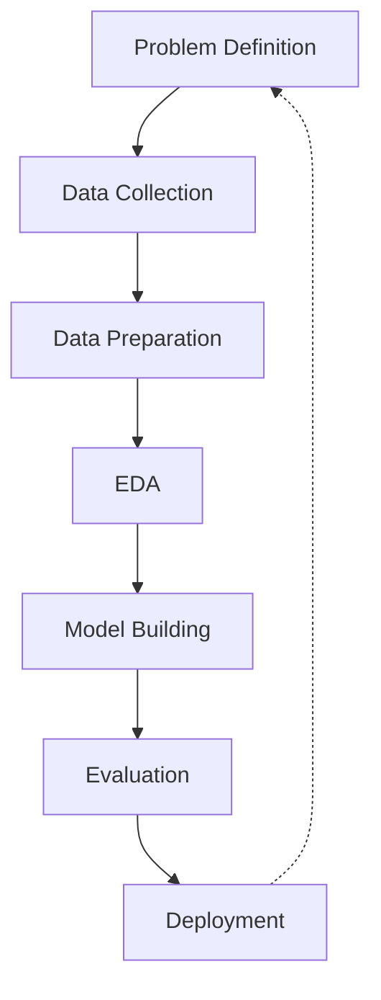
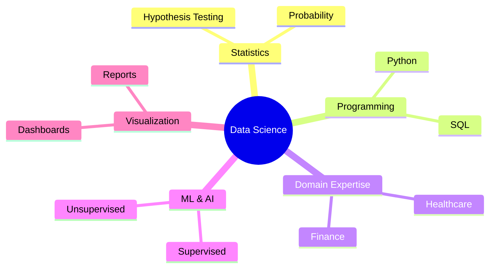
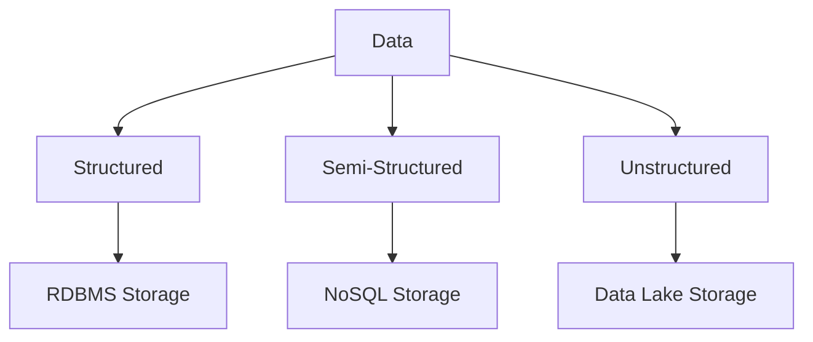
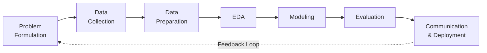
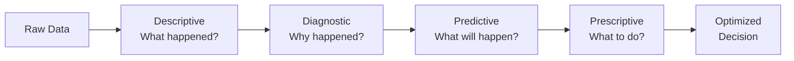
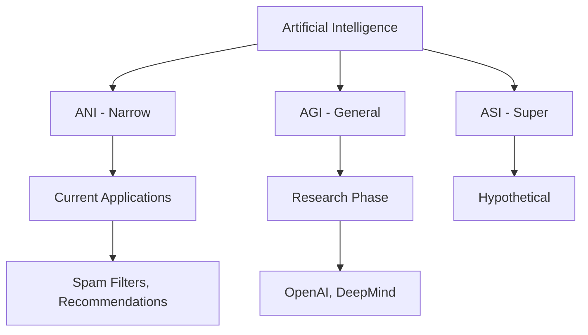
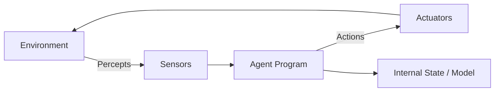
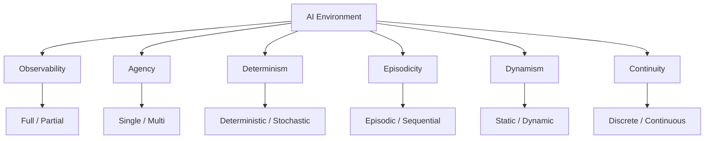

# AIDS Solved QB – Module 1
## Artificial Intelligence and Data Science

---

## 2-Mark Questions

### Q1. Summarize the concept of Data Science and clarify two key terminologies used in data analysis.

**Data Science** is an interdisciplinary field combining statistics, programming, and domain knowledge to extract insights from data. Two key terminologies: **Data Mining** – the process of discovering patterns in large datasets; **Feature** – an individual measurable property or characteristic of a phenomenon being observed.

---

### Q2. Identify the concept of a dataset and recognize its structure in tabular form used for analysis.

A **dataset** is a structured collection of related data used for analysis. In tabular form, it is organized as rows (records/instances) and columns (attributes/features). Each row represents one observation, and each column represents a variable. Example: a CSV file with patient records where each row is a patient.

---

### Q3. Use the factors contributing to the increasing importance of Data Science to illustrate its role in modern applications.

Data Science's importance has grown due to: explosive growth in data volume, low-cost storage, advanced computing, and demand for insights. It plays roles in healthcare (disease prediction), finance (fraud detection), e-commerce (recommendation systems), and smart cities (traffic optimization).

---

### Q4. Demonstrate the concept of an intelligent agent and show its interaction with the environment.

An **intelligent agent** is any entity that perceives its environment through sensors and acts upon it through actuators. Example: a self-driving car uses cameras (sensors) to perceive road conditions and steers (actuators) accordingly. The cycle is: Perceive → Decide → Act.

---

### Q5. Apply the concept of intelligence in Artificial Intelligence to illustrate its role in decision-making systems.

**Intelligence in AI** refers to the ability of machines to simulate human cognitive functions like learning, reasoning, and problem-solving. In decision-making systems, AI uses trained models to analyze inputs and choose optimal actions — e.g., a credit approval system uses ML to decide loan eligibility.

---

### Q6. Analyze the concept of features and examine how they are used in machine learning models.

**Features** are individual measurable variables used as inputs to ML models. They are selected or engineered from raw data. Example: in a house price prediction model, features include area (sq ft), number of rooms, and location. Good feature selection improves model accuracy and reduces overfitting.

---

### Q7. Differentiate types of analytics and evaluate how raw data is converted into meaningful insights.

| Type | Description | Example |
|------|-------------|---------|
| Descriptive | What happened | Sales summary |
| Diagnostic | Why it happened | Root cause analysis |
| Predictive | What will happen | Demand forecasting |
| Prescriptive | What to do | Recommendation engines |

Raw data → cleaned → aggregated → modeled → insights.

---

## 5-Mark Questions

### Q8. Use the concept of Data Science to illustrate how its key components contribute to extracting meaningful insights from raw data.

**Data Science** is a multi-disciplinary field that integrates several core components to transform raw, unstructured data into actionable insights.

**Key Components:**

1. **Data Collection:** Raw data is gathered from databases, APIs, sensors, web scraping, or surveys. The quality and quantity of data at this stage directly affect downstream outcomes.

2. **Data Cleaning & Preprocessing:** Missing values are handled, outliers removed, and data normalized. This ensures that noise does not compromise model accuracy.

3. **Exploratory Data Analysis (EDA):** Statistical summaries and visualizations (histograms, scatter plots) are used to understand distributions, correlations, and anomalies.

4. **Modeling:** Machine learning algorithms such as regression, classification, or clustering are applied to learn patterns from the prepared data.

5. **Evaluation:** Models are assessed using metrics like accuracy, precision, recall, or RMSE.

6. **Deployment & Communication:** Insights are communicated to stakeholders through dashboards, reports, or integrated applications.

**Example:** In healthcare, patient records (raw data) → cleaned and standardized → EDA reveals disease patterns → predictive model identifies high-risk patients → doctors receive alerts. This pipeline illustrates how each component is essential for reliable, meaningful outputs from data.


---

### Q9. Differentiate various types of data and categorize their characteristics with suitable real-world examples.

Data can be broadly classified based on its structure, type, and measurement scale.

**1. Structured Data:** Organized in rows and columns with a fixed schema. Easily stored in relational databases.
- Example: Employee database (ID, Name, Salary, Department)

**2. Unstructured Data:** Lacks a predefined format. Requires advanced techniques like NLP or image processing.
- Example: Social media posts, medical images, audio recordings

**3. Semi-Structured Data:** Has some organizational properties (tags, markers) but no strict schema.
- Example: JSON files, XML documents, emails

**Based on Measurement Scale:**
| Scale | Description | Example |
|-------|-------------|---------|
| Nominal | Categories with no order | Blood type (A, B, O) |
| Ordinal | Ordered categories | Survey ratings (1–5) |
| Interval | Numeric, no true zero | Temperature in Celsius |
| Ratio | Numeric, has true zero | Weight, Height, Income |

**Quantitative vs. Qualitative:**
- Quantitative (Numerical): Age, salary, temperature
- Qualitative (Categorical): Color, gender, city name

Understanding data types is critical for choosing appropriate preprocessing and modeling strategies.

---

### Q10. Utilize the Data Science workflow to show how each stage contributes to solving data-driven problems, emphasizing the role of data preparation and analysis.

The Data Science workflow is a structured, iterative process that transforms business problems into data-driven solutions.

**Stages:**

1. **Problem Definition:** Clearly state the objective — e.g., predict customer churn.
2. **Data Collection:** Gather relevant datasets from CRM systems, logs, or APIs.
3. **Data Preparation:** Clean missing values, encode categorical variables, normalize features. This is the most time-consuming stage (often 70–80% of effort).
4. **Exploratory Data Analysis:** Visualize distributions, correlations, and identify patterns.
5. **Model Building:** Select and train ML algorithms.
6. **Model Evaluation:** Validate performance on test data using metrics.
7. **Communication & Deployment:** Interpret results for stakeholders; deploy model in production.

**Role of Data Preparation:** Poor data quality leads to unreliable models (garbage in, garbage out). Cleaning, transformation, and feature engineering are critical to ensure the model learns accurate patterns.

**Role of Analysis (EDA):** EDA guides modeling decisions — which features to use, what algorithms suit the data, and which transformations are needed.



---

### Q11. Differentiate types of intelligence and infer their significance in Artificial Intelligence systems.

Intelligence in AI systems can be categorized into several types, each with distinct characteristics and implications.

**1. Artificial Narrow Intelligence (ANI):**
- Performs a single specific task exceptionally well.
- Examples: image classifiers, spam filters, voice assistants (Siri, Alexa).
- Significance: Widely deployed in real-world applications today.

**2. Artificial General Intelligence (AGI):**
- Hypothetical — can perform any intellectual task a human can.
- Significance: Would revolutionize all fields but has not been achieved yet.

**3. Artificial Super Intelligence (ASI):**
- Theoretical — surpasses human intelligence in all domains.
- Significance: Subject of major ethical debate; considered transformative and potentially risky.

**Other Intelligence Types:**
| Type | Description |
|------|-------------|
| Fluid Intelligence | Ability to reason and solve novel problems |
| Crystallized Intelligence | Applying learned knowledge |
| Emotional Intelligence | Understanding/managing emotions |
| Collective Intelligence | Insights from groups/swarms |

**Inference:** As AI systems evolve from ANI toward AGI, the ability to generalize, reason, and adapt becomes critical. Each intelligence type shapes the architecture, training strategy, and ethical considerations of AI systems.

---

### Q12. Use the Data Science process model to show how data is systematically collected, cleaned, and analyzed to generate meaningful outcomes.

The **Data Science Process Model** (also known as CRISP-DM — Cross-Industry Standard Process for Data Mining) provides a structured framework:

**Phases:**

**1. Business Understanding:**
Define project objectives, success criteria, and constraints from a business perspective.

**2. Data Understanding:**
Collect initial data, explore its properties, identify quality issues.

**3. Data Preparation (Cleaning):**
- Handle missing values (imputation/removal)
- Remove duplicate records
- Normalize/scale features
- Encode categorical data

**4. Modeling:**
Select algorithms, build models, tune hyperparameters.

**5. Evaluation:**
Check if model meets business objectives; test for overfitting.

**6. Deployment:**
Integrate model into business process; monitor performance over time.


**Key takeaway:** Data cleaning is the backbone — it ensures the model trains on accurate, consistent, and complete data. Analysis at every stage ensures outcomes align with real-world expectations.

---

### Q13. Demonstrate different types of analytics and show how they help in transforming raw data into actionable insights for decision-making.

Analytics is the systematic computational analysis of data, and it operates at different levels of sophistication.

**1. Descriptive Analytics (What happened?):**
- Uses historical data to summarize past events.
- Tools: dashboards, reports, summary statistics.
- Example: Monthly sales report showing revenue trends.

**2. Diagnostic Analytics (Why did it happen?):**
- Investigates root causes of past outcomes.
- Tools: drill-down analysis, data mining, correlation.
- Example: Analyzing why sales dropped in Q3 — identified supply chain disruption.

**3. Predictive Analytics (What will happen?):**
- Uses statistical models and ML to forecast future events.
- Tools: regression, time-series forecasting, classification.
- Example: Predicting customer churn next month.

**4. Prescriptive Analytics (What should we do?):**
- Recommends optimal actions based on predictions.
- Tools: optimization algorithms, simulation, decision trees.
- Example: Recommending optimal pricing strategy.

**Data Transformation Flow:**
```
Raw Data → Descriptive (understand) → Diagnostic (explain) → Predictive (forecast) → Prescriptive (act)
```

Each layer adds more value but also requires more sophisticated models and data quality.

---

### Q14. Utilize the concept of agents and environments to show how intelligent systems perceive inputs and perform actions.

An **intelligent agent** is anything that perceives its environment through sensors and acts through actuators. The relationship between agent and environment forms the basis of all AI systems.

**PEAS Framework:**
| Component | Description | Example (Self-driving Car) |
|-----------|-------------|---------------------------|
| Performance Measure | Criteria for success | Safe, fast, fuel-efficient driving |
| Environment | Context of operation | Roads, traffic, weather |
| Actuators | Output mechanisms | Steering, brakes, accelerator |
| Sensors | Input mechanisms | Cameras, GPS, LIDAR |

**Types of Agents:**
1. **Simple Reflex Agent:** Reacts to current percept only.
2. **Model-Based Agent:** Maintains internal state model.
3. **Goal-Based Agent:** Acts to achieve specific goals.
4. **Utility-Based Agent:** Maximizes a utility/happiness function.
5. **Learning Agent:** Improves performance over time.

**Agent-Environment Interaction:**
```
Environment → Sensors → Agent (Perceive → Decide → Act) → Actuators → Environment
```

Rationality depends on the performance measure, prior knowledge, available actions, and percept history.

---

## 10-Mark Questions

### Q15. Deduce the interdisciplinary nature of Data Science and infer how its various components work together to extract meaningful insights from structured and unstructured data. Discuss their role in supporting data-driven decision-making.

**Introduction:**
Data Science is not a single discipline but a convergence of multiple fields working in harmony. Its interdisciplinary nature is what makes it powerful and versatile in solving real-world problems.

**Core Disciplines:**

**1. Statistics & Mathematics:**
Provides the theoretical foundation — probability distributions, hypothesis testing, regression, and linear algebra. Without statistics, patterns discovered in data cannot be validated or trusted.

**2. Computer Science & Programming:**
Enables the implementation of algorithms, data structures, and pipelines. Tools like Python, R, SQL, and frameworks like Pandas, TensorFlow, and Spark make large-scale data processing feasible.

**3. Domain Expertise:**
Domain knowledge ensures that insights are contextually relevant. A data scientist in healthcare must understand medical terminology to build a meaningful disease prediction model.

**4. Machine Learning & AI:**
Provides algorithms that learn patterns from data — supervised learning (classification, regression), unsupervised learning (clustering, dimensionality reduction), and reinforcement learning.

**5. Data Engineering:**
Manages data pipelines, storage (data lakes, warehouses), and ETL processes. Ensures data flows reliably from source to model.

**6. Communication & Visualization:**
Data insights must be communicated clearly. Visualization tools (Matplotlib, Tableau, Power BI) and storytelling skills translate complex findings for non-technical stakeholders.

**Handling Structured vs. Unstructured Data:**

| Type | Component Used | Example |
|------|---------------|---------|
| Structured | SQL, Pandas, Regression | Customer database |
| Unstructured | NLP, CNN, OpenCV | Text, images, audio |
| Semi-Structured | JSON parsers, NoSQL | API responses |

**Role in Decision-Making:**

Data-driven decision-making replaces intuition with evidence. Examples:
- **Retail:** Customer purchase history → predictive model → targeted promotions (increased revenue by 20%)
- **Healthcare:** Patient vitals → anomaly detection → early disease warning
- **Finance:** Transaction patterns → fraud detection model → reduced losses



**Conclusion:**
The interdisciplinary nature of Data Science is its greatest strength. Each component fills a gap that the others cannot. Together, they form a complete ecosystem capable of transforming raw data — whether structured or unstructured — into actionable, reliable, and ethically sound decisions that drive organizational success.

---

### Q16. Differentiate between various forms of data by categorizing their characteristics, formats, and storage approaches. Discuss their significance and challenges in real-world data science applications.

**Introduction:**
Data is the foundational asset of any data science project. Understanding its forms, formats, and storage strategies is essential for designing effective pipelines and choosing appropriate analytical methods.

**Classification of Data:**

**1. By Structure:**

| Category | Characteristics | Formats | Storage |
|----------|----------------|---------|---------|
| Structured | Fixed schema, organized in rows/columns | CSV, Excel, SQL tables | RDBMS (MySQL, PostgreSQL) |
| Semi-Structured | Partial organization, self-describing | JSON, XML, YAML | NoSQL (MongoDB, Cassandra) |
| Unstructured | No fixed format, free-form | Text, images, audio, video | Data lakes (HDFS, S3) |

**2. By Measurement Scale:**

- **Nominal:** No inherent order. Example: blood type, country name.
- **Ordinal:** Ordered but non-uniform intervals. Example: education level (High School < Bachelor's < Master's).
- **Interval:** Equal intervals, no true zero. Example: temperature in Celsius.
- **Ratio:** Equal intervals with a true zero. Example: height, weight, income.

**3. By Source:**
- **Primary Data:** Collected directly (surveys, experiments).
- **Secondary Data:** Pre-existing (public datasets, historical records).
- **Real-time/Streaming Data:** Continuously generated (IoT sensors, social media feeds).

**Significance in Data Science:**

- **Structured data** is easiest to process and analyze using traditional SQL and ML algorithms.
- **Unstructured data** holds immense value (e.g., patient notes, satellite imagery) but requires specialized models (NLP, CNNs).
- **Semi-structured data** bridges the gap — common in APIs and modern applications.

**Challenges:**

| Challenge | Description |
|-----------|-------------|
| Volume | Petabytes of data require scalable infrastructure |
| Variety | Different formats demand different preprocessing |
| Velocity | Real-time data needs low-latency pipelines |
| Veracity | Data quality and trustworthiness are not guaranteed |
| Privacy | Personal data must comply with GDPR, HIPAA regulations |



**Real-World Challenges:**
1. **Healthcare:** Medical images (unstructured) + patient records (structured) must be integrated — requires different tools and expertise.
2. **Social Media Analytics:** Tweets, videos, and likes span all data types, demanding scalable and diverse pipelines.
3. **Financial Systems:** Real-time transaction data must be processed with minimal latency for fraud detection.

**Conclusion:**
Recognizing data forms is not merely academic — it directly determines the tools, algorithms, storage solutions, and preprocessing strategies a data scientist must employ. Mastery over data diversity is the hallmark of an effective data science practitioner.

---

### Q17. Utilize the stages of the Data Science workflow to illustrate how a problem is formulated, data is collected, prepared, analyzed, and results are communicated. Discuss the importance of each stage in ensuring reliable outcomes.

**Introduction:**
The Data Science workflow is a systematic, iterative process that transforms a business problem into a deployable, insight-generating solution. Each stage is interdependent, and a failure in any one stage cascades into unreliable outcomes.

**Stage 1: Problem Formulation**
- Define the business objective clearly and specifically.
- Translate it into a data science problem (classification, regression, clustering).
- Set success criteria: e.g., "Predict customer churn with 85%+ accuracy."
- **Importance:** A poorly defined problem leads to irrelevant solutions, wasted resources, and stakeholder dissatisfaction.

**Stage 2: Data Collection**
- Identify data sources: databases, APIs, web scraping, IoT sensors, surveys.
- Ensure data volume and variety are sufficient for the problem.
- Document data provenance for traceability.
- **Importance:** Insufficient or biased data leads to unreliable models regardless of algorithmic sophistication.

**Stage 3: Data Preparation**
- Handle missing values (imputation, removal).
- Detect and treat outliers.
- Normalize/scale numerical features.
- Encode categorical variables.
- Split into training, validation, and test sets.
- **Importance:** Data preparation consumes ~70-80% of project time and is the most critical factor for model quality. "Garbage in, garbage out."

**Stage 4: Exploratory Data Analysis (EDA)**
- Compute summary statistics (mean, median, std dev, quartiles).
- Visualize distributions (histograms), relationships (scatter plots), and group comparisons (box plots).
- Identify patterns, trends, and anomalies.
- **Importance:** EDA informs modeling choices — which features to use, what transformations are needed, and which algorithms are appropriate.

**Stage 5: Modeling**
- Select appropriate algorithms based on problem type.
- Train models on prepared data.
- Tune hyperparameters using cross-validation.
- **Importance:** The right model + right features = accurate predictions; wrong choices lead to overfitting or underfitting.

**Stage 6: Evaluation**
- Measure performance on held-out test data.
- Use appropriate metrics: accuracy, F1-score, AUC-ROC (classification); RMSE, MAE (regression).
- Test for fairness, bias, and robustness.
- **Importance:** Evaluation ensures the model generalizes beyond training data and meets business objectives.

**Stage 7: Communication & Deployment**
- Present findings using visualizations and narratives tailored to the audience.
- Deploy model via APIs, dashboards, or integrated systems.
- Monitor model performance in production (concept drift detection).
- **Importance:** Even the best model fails if stakeholders cannot understand or use it.



**Conclusion:**
The Data Science workflow is not a linear process but an iterative cycle. Each stage builds on the previous, and insights from later stages often trigger revisiting earlier ones. Reliable outcomes emerge only when each stage is executed with rigor, transparency, and a clear understanding of the business context.

---

### Q18. Demonstrate different types of analytics and show how they contribute to understanding past trends, identifying causes, predicting future outcomes, and supporting decision-making processes.

**Introduction:**
Analytics is the engine of data-driven decision-making. The four types of analytics form a continuum from understanding the past to shaping the future.

**1. Descriptive Analytics – "What happened?"**

Summarizes historical data to understand past performance.

- **Tools:** Aggregations, summary statistics, dashboards, reports.
- **Techniques:** Mean, median, frequency counts, time-series plots.
- **Example:** A retail chain reviews monthly sales across all stores. The dashboard shows that Store #5 had the highest revenue in Q4.
- **Contribution:** Establishes a baseline understanding of business performance.

**2. Diagnostic Analytics – "Why did it happen?"**

Investigates the causes of observed outcomes.

- **Tools:** Drill-down analysis, correlation analysis, data mining.
- **Techniques:** Root cause analysis, Pareto analysis, hypothesis testing.
- **Example:** Why did Store #5 outperform others? Analysis reveals: targeted promotions + higher foot traffic near a new transit hub.
- **Contribution:** Moves beyond surface-level observations to causality.

**3. Predictive Analytics – "What will happen?"**

Uses historical patterns to forecast future events.

- **Tools:** Regression, classification, time-series models (ARIMA), neural networks.
- **Techniques:** Train ML models on past data to predict future states.
- **Example:** Predict next quarter's demand per store to optimize inventory.
- **Contribution:** Enables proactive strategies rather than reactive responses.

**4. Prescriptive Analytics – "What should we do?"**

Recommends optimal courses of action.

- **Tools:** Optimization algorithms, simulation, reinforcement learning.
- **Techniques:** Linear programming, decision trees, A/B testing.
- **Example:** Given predicted demand, prescriptive model recommends stock levels per store and optimal delivery schedules.
- **Contribution:** Closes the loop — from insight to action.



**Analytics Maturity Model:**

| Level | Type | Value | Difficulty |
|-------|------|-------|------------|
| 1 | Descriptive | Hindsight | Low |
| 2 | Diagnostic | Insight | Medium |
| 3 | Predictive | Foresight | High |
| 4 | Prescriptive | Optimal Action | Very High |

**Conclusion:**
Each analytics type builds on the previous. Organizations that evolve from purely descriptive analytics toward prescriptive analytics gain a significant competitive edge. The integration of all four types within a unified data strategy creates a comprehensive decision-support ecosystem.

---

### Q19. Deduce the concept of Artificial Intelligence and differentiate its types based on capabilities and functionalities. Discuss their characteristics and relevance in real-world intelligent systems.

**Introduction:**
Artificial Intelligence (AI) is the simulation of human cognitive processes by computer systems, enabling machines to perform tasks that typically require human intelligence — reasoning, learning, perception, and problem-solving.

**Types of AI Based on Capabilities:**

**1. Artificial Narrow Intelligence (ANI) / Weak AI:**
- Designed to perform one specific task.
- Cannot generalize beyond its trained domain.
- **Examples:** Google Translate, facial recognition systems, chess engines (Deep Blue), spam filters.
- **Real-world relevance:** Dominates current AI applications. Highly effective, deployable, and commercially successful.

**2. Artificial General Intelligence (AGI) / Strong AI:**
- Theoretical — can perform any intellectual task a human can.
- Capable of reasoning, planning, and learning across diverse domains without retraining.
- **Examples:** No true AGI exists yet; it remains an active area of research (OpenAI, DeepMind).
- **Real-world relevance:** Would transform every industry; subject of significant investment and ethical scrutiny.

**3. Artificial Super Intelligence (ASI):**
- Hypothetical — surpasses human intelligence in all respects.
- Could self-improve recursively at exponential speed.
- **Real-world relevance:** Raises profound existential and ethical questions; requires global governance frameworks.

**Types Based on Functionality:**

| Type | Description | Example |
|------|-------------|---------|
| Reactive Machines | No memory, purely reactive | IBM Deep Blue |
| Limited Memory | Uses past data for decisions | Self-driving cars |
| Theory of Mind | Understands emotions/beliefs (research stage) | Social robots |
| Self-Aware AI | Conscious AI (hypothetical) | Science fiction |

**Key AI Functionalities in Real-World Systems:**

1. **Machine Learning:** Systems learn patterns from data without being explicitly programmed.
2. **Natural Language Processing:** Understanding and generating human language (ChatGPT, Alexa).
3. **Computer Vision:** Interpreting visual data (medical imaging, autonomous vehicles).
4. **Robotics:** Physical AI agents interacting with the real world.
5. **Expert Systems:** Rule-based systems mimicking human expertise.



**Conclusion:**
Understanding AI types is crucial for setting realistic expectations, choosing appropriate tools, and addressing ethical implications. Today's world runs on ANI — specialized, powerful, and narrow. The pursuit of AGI represents the next frontier, while ASI remains a philosophical and existential challenge requiring careful, collaborative governance.

---

### Q20. Utilize the structure of intelligent agents to illustrate how agent architecture and programs interact with inputs and actions. Discuss the role of rationality and performance measures in intelligent behavior.

**Introduction:**
An intelligent agent is a software entity that perceives its environment through sensors, processes information using its agent program, and takes actions through actuators to achieve its goals. The agent's architecture defines how it is physically implemented; the agent program defines its decision-making logic.

**Agent Architecture:**

The architecture specifies the physical/computational platform — hardware, operating system, programming language. The agent program runs on top of this architecture and maps percept sequences to actions.

```
Agent = Architecture + Program
```

**Types of Agent Architectures:**

**1. Simple Reflex Architecture:**
- Acts on current percept only using condition-action rules.
- No memory of past states.
- Example: Thermostat — if temperature < threshold, activate heater.

**2. Model-Based Reflex Architecture:**
- Maintains an internal model of the world.
- Can handle partially observable environments.
- Example: Robot vacuum with a map of room layout.

**3. Goal-Based Architecture:**
- Has explicit goals and searches for action sequences to achieve them.
- Uses planning and search algorithms.
- Example: GPS navigation system.

**4. Utility-Based Architecture:**
- Assigns a utility/value to each possible state.
- Selects actions that maximize expected utility.
- Example: Investment portfolio optimizer.

**5. Learning Architecture:**
- Learns and improves from experience.
- Contains a learning element, performance element, critic, and problem generator.
- Example: Recommendation systems, self-driving cars.

**Agent-Environment Interaction:**



**Rationality and Performance Measures:**

- **Performance Measure:** A criterion that evaluates the success of an agent's behavior. Example: a cleaning robot's performance is measured by floor cleanliness, time taken, and battery usage.
- **Rational Agent:** An agent that selects actions that maximize its expected performance measure given its percept history and built-in knowledge.
- **Rationality ≠ Omniscience:** A rational agent acts on available information — it doesn't need to be perfect, just optimal given what it knows.

**Key factors determining rationality:**
1. The performance measure.
2. The agent's prior knowledge of the environment.
3. The actions the agent can perform.
4. The agent's percept sequence to date.

**Conclusion:**
Agent architecture determines capability; the agent program defines behavior; performance measures define success; and rationality ties them all together. A well-designed rational agent adapts to its environment, learns from experience, and consistently pursues its goals within defined ethical and operational constraints.

---

### Q21. Differentiate various properties of AI environments and infer how these properties influence the design, behavior, and performance of intelligent systems.

**Introduction:**
The environment in which an AI agent operates is a fundamental determinant of its design. The properties of the environment dictate which agent architectures, algorithms, and decision-making strategies are appropriate.

**Properties of AI Environments:**

**1. Fully Observable vs. Partially Observable:**
- **Fully Observable:** Agent can access complete state of the environment at all times.
- **Partially Observable:** Agent has incomplete or noisy sensor data.
- **Design Influence:** Partially observable environments require model-based agents with internal state representation (e.g., robot with limited sensors needs internal mapping).

**2. Single-Agent vs. Multi-Agent:**
- **Single-Agent:** Only one agent acts in the environment.
- **Multi-Agent:** Multiple agents operate simultaneously, may cooperate or compete.
- **Design Influence:** Multi-agent systems need strategic reasoning (game theory), communication protocols, and conflict resolution mechanisms.

**3. Deterministic vs. Stochastic:**
- **Deterministic:** Next state is fully determined by current state and action.
- **Stochastic:** Next state involves randomness/uncertainty.
- **Design Influence:** Stochastic environments require probabilistic reasoning and models (Bayesian networks, Markov decision processes).

**4. Episodic vs. Sequential:**
- **Episodic:** Each decision is independent; past actions don't affect future episodes.
- **Sequential:** Current decisions affect future states and actions.
- **Design Influence:** Sequential environments require planning and memory (e.g., chess).

**5. Static vs. Dynamic:**
- **Static:** Environment doesn't change while agent deliberates.
- **Dynamic:** Environment changes continuously.
- **Design Influence:** Dynamic environments demand fast, real-time decision-making (e.g., autonomous driving).

**6. Discrete vs. Continuous:**
- **Discrete:** Finite set of states and actions (chess moves).
- **Continuous:** Infinite state space (robot arm position).
- **Design Influence:** Continuous environments require function approximators (neural networks) instead of lookup tables.

**7. Known vs. Unknown:**
- **Known:** Agent knows the rules of the environment.
- **Unknown:** Agent must learn environment dynamics through exploration.



**Summary Table:**

| Property | Easy Pole | Hard Pole | Example (Hard) |
|----------|-----------|-----------|----------------|
| Observability | Fully observable | Partially observable | Poker game |
| Agency | Single | Multi-agent | Stock market |
| Determinism | Deterministic | Stochastic | Autonomous driving |
| Episodicity | Episodic | Sequential | Chess |
| Dynamism | Static | Dynamic | Real-time trading |
| Continuity | Discrete | Continuous | Robotic manipulation |

**Conclusion:**
Environment properties directly shape every architectural decision in an AI system — from choosing between reactive and deliberative agents, to selecting search algorithms, to designing learning strategies. The more complex the environment (partially observable, stochastic, dynamic, multi-agent), the more sophisticated the agent must be. Understanding these properties allows engineers to build AI systems that are robust, efficient, and well-suited to their operational context.
