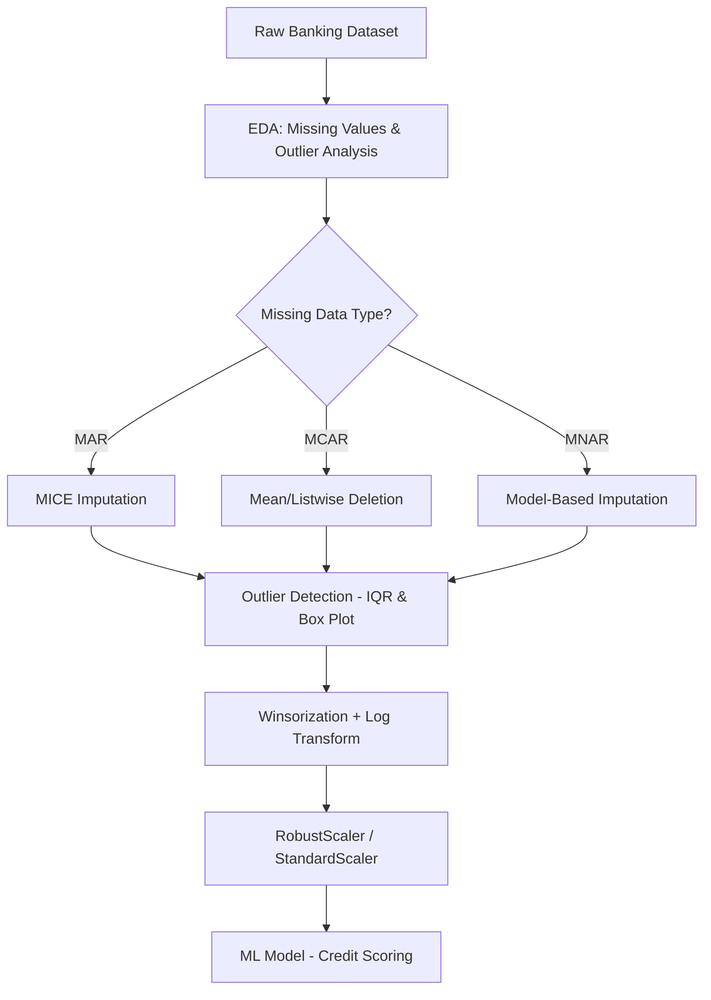
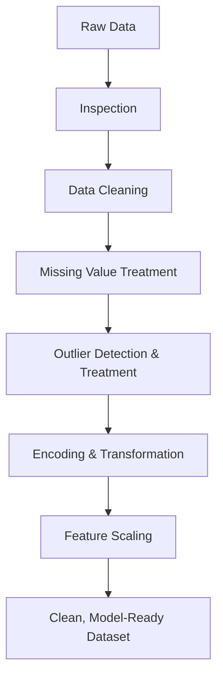
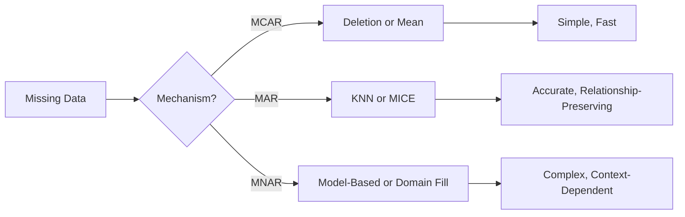
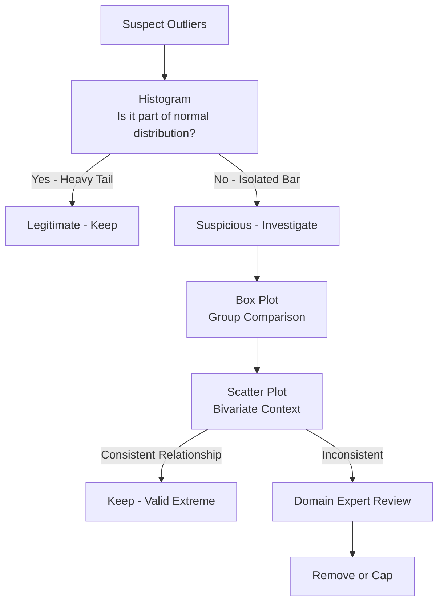
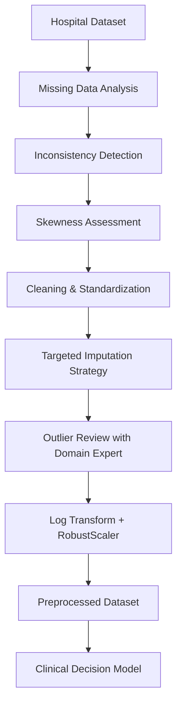
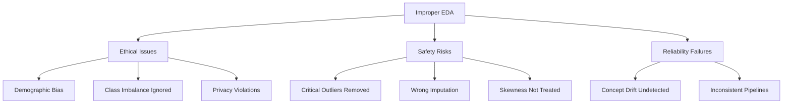

# AIDS Solved QB – Module 2
## Exploratory Data Analysis (EDA) & Data Preprocessing

---

## 2-Mark Questions

### Q1. Interpret the concept of Exploratory Data Analysis and explain why it is considered an essential step before building machine learning models.

**Exploratory Data Analysis (EDA)** is the process of analyzing datasets to summarize their main characteristics using statistical and visual methods. It is essential before ML because: it reveals data distributions, detects missing values and outliers, identifies feature correlations, and informs algorithm selection — preventing models from being built on flawed data.

---

### Q2. Utilize data preprocessing techniques to illustrate why cleaning, transforming, and preparing raw data are necessary during EDA.

Raw data is rarely clean or model-ready. **Preprocessing** involves: removing duplicates, handling missing values, correcting inconsistencies, and scaling features. Without cleaning, models learn noise instead of patterns. Transformation (normalization, encoding) ensures data is in the right format. Preparation reduces bias and improves model accuracy.

---

### Q3. Use the concept of standardization to show how scaling features improves consistency and model performance during EDA.

**Standardization** rescales features to have zero mean and unit variance: `z = (x - μ) / σ`. Without scaling, features with large ranges (e.g., income in thousands vs. age in years) dominate distance-based algorithms like KNN and SVM. Standardization ensures all features contribute equally, improving convergence and model consistency.

---

### Q4. Demonstrate a suitable method for handling missing values in a dataset containing incomplete records.

Common methods: **Mean/Median Imputation** (replace missing values with column mean or median), **Mode Imputation** (for categorical data), **Forward/Backward Fill** (for time-series), and **Predictive Imputation** (use a model to predict missing values). Choice depends on the extent and pattern of missingness.

---

### Q5. Analyze mean imputation and examine one important limitation for datasets with skewed data distribution.

**Mean Imputation** replaces missing values with the column average. Key limitation: in **skewed distributions**, the mean is pulled toward extreme values, making it an unrepresentative fill value. For example, if a salary column is right-skewed with a few very high earners, the mean overestimates typical salaries, distorting the dataset.

---

### Q6. Differentiate structured and unstructured data, and infer their suitability for different analytical applications.

| Type | Description | Storage | Suitability |
|------|-------------|---------|-------------|
| Structured | Fixed schema, rows/columns | RDBMS (SQL) | Quantitative analysis, traditional ML |
| Unstructured | No schema; text, images, audio | Data lakes | NLP, computer vision, deep learning |

Structured data is easier to query and model; unstructured requires advanced preprocessing.

---

### Q7. Evaluate the strategy of removing rows with missing values and identify one major drawback.

**Row removal (listwise deletion)** is simple and ensures complete data but its major drawback is **information loss**. If missing data is not completely random (MCAR), removing those rows introduces **bias** — the remaining dataset may not represent the full population, leading to skewed and unreliable model predictions.

---

## 5-Mark Questions

### Q8. Analyze the missing data mechanism — where missing income is more probable for younger individuals but does not depend on income value.

This scenario describes **Missing At Random (MAR)** — a critical missing data classification.

**Three Missing Data Mechanisms:**

**1. Missing Completely At Random (MCAR):**
- Probability of missingness is unrelated to any variable (observed or unobserved).
- Example: A sensor randomly malfunctions.
- Effect: Listwise deletion is valid but reduces sample size.

**2. Missing At Random (MAR):**
- Probability of missingness depends on **observed** variables but NOT on the missing value itself.
- Example (this scenario): Younger individuals are less likely to report income, but among a given age group, income is missing randomly.
- Effect: Imputation using observed variables (age, education) can recover the missing data without bias.

**3. Missing Not At Random (MNAR):**
- Probability of missingness depends on the **missing value itself**.
- Example: High earners are less likely to report their income.
- Effect: Most problematic — imputation may introduce systematic bias.

**Justification:**
In the given scenario: P(income missing | age) ≠ P(income missing) — but P(income missing | age, income) = P(income missing | age). This satisfies the MAR definition — missingness is explained by the observed variable (age), not by income itself.

**Recommended Strategy:**
Use **Multiple Imputation by Chained Equations (MICE)** or **regression imputation** using age as a predictor for missing income. This preserves dataset size and corrects for the age-dependent bias.

---

### Q9. Utilize different techniques used to handle missing values and illustrate their suitability with appropriate real-world examples.

Handling missing values is one of the most critical preprocessing steps in any data science pipeline. The appropriate technique depends on the nature, volume, and pattern of missing data.

**Techniques and Their Suitability:**

**1. Listwise Deletion (Complete Case Analysis):**
- Remove rows with any missing value.
- **When to use:** When data is MCAR and missing rows are a small fraction (<5%).
- **Example:** Survey data where only 2% of responses are incomplete — safe to delete without significant bias.
- **Limitation:** Information loss; may not be suitable for small datasets.

**2. Mean/Median Imputation:**
- Replace missing values with the column mean (for normal distributions) or median (for skewed distributions).
- **When to use:** Numerical data with moderate missingness.
- **Example:** Replacing missing age values in a customer dataset with the median age of 35.
- **Limitation:** Reduces variance; may distort correlations between variables.

**3. Mode Imputation:**
- Replace missing categorical values with the most frequent category.
- **Example:** Filling missing "City" entries in a retail dataset with "Mumbai" (most common city).
- **Limitation:** Can over-represent the most frequent category.

**4. K-Nearest Neighbors (KNN) Imputation:**
- Replace missing values with the mean/mode of K nearest neighbors (based on similar records).
- **When to use:** When relationships between features are meaningful.
- **Example:** Imputing missing blood pressure using similar patients' records.
- **Advantage:** Preserves variable relationships.

**5. Regression Imputation:**
- Predict missing values using a regression model trained on other features.
- **Example:** Predict missing income based on age, education, and job title.
- **Limitation:** Assumes linear relationships; can underestimate variance.

**6. Multiple Imputation (MICE):**
- Creates multiple datasets with different imputed values, runs analysis on each, and pools results.
- **When to use:** MAR data with significant missingness.
- **Advantage:** Accounts for uncertainty in imputation.

| Technique | Data Type | Best For |
|-----------|-----------|----------|
| Deletion | Any | MCAR, low missingness |
| Mean/Median | Numerical | Symmetric/Skewed distributions |
| Mode | Categorical | Most frequent category fill |
| KNN | Mixed | Relationship-preserving imputation |
| Regression | Numerical | Predictive, structured imputation |
| MICE | Any | MAR with high missingness |

---

### Q10. Demonstrate how summary statistics help in understanding data patterns during EDA.

Summary statistics provide a compact mathematical description of a dataset's properties, forming the foundation of EDA.

**Key Summary Statistics:**

**1. Measures of Central Tendency:**
- **Mean:** Arithmetic average. Sensitive to outliers. `μ = Σx / n`
- **Median:** Middle value when sorted. Robust to outliers.
- **Mode:** Most frequent value. Useful for categorical data.

**2. Measures of Dispersion:**
- **Variance:** Average squared deviation from mean. `σ² = Σ(x - μ)² / n`
- **Standard Deviation:** Square root of variance. Intuitive measure of spread.
- **Range:** Max - Min. Simple but sensitive to outliers.

**3. Quartiles and IQR:**
- **Q1 (25th percentile):** Lower bound of middle 50%
- **Q2 (50th percentile):** Median
- **Q3 (75th percentile):** Upper bound of middle 50%
- **IQR = Q3 - Q1:** Robust measure of spread; used for outlier detection.
- Outliers: values below Q1 - 1.5×IQR or above Q3 + 1.5×IQR.

**How They Reveal Patterns:**

| Statistic | What It Reveals |
|-----------|----------------|
| Mean vs. Median gap | Skewness of distribution |
| High std dev | Wide spread, possible outliers |
| Small IQR | Data concentrated around median |
| Multiple modes | Multimodal distribution |

**Example:** In a salary dataset, if Mean = ₹80,000 and Median = ₹45,000, the large gap reveals a **right-skewed distribution** — a few very high salaries pulling the mean upward. This suggests median is a better central measure and that outlier treatment is needed before modeling.

---

### Q11. Examine the need for data standardization in machine learning and infer how it improves model training and feature comparability.

**Data Standardization** is a preprocessing technique that transforms numerical features to a common scale without distorting the shape of their distribution.

**Formula:**
`z = (x - μ) / σ`

Where μ is the mean and σ is the standard deviation of the feature.

**Why Standardization is Needed:**

**1. Algorithm Sensitivity to Scale:**
Many ML algorithms use distance metrics or gradient-based optimization. Features with larger magnitudes dominate these computations:
- **KNN:** Euclidean distance is biased toward high-magnitude features.
- **SVM:** Kernel functions depend on feature magnitude.
- **Linear/Logistic Regression:** Gradient descent converges slower without standardization.
- **PCA:** Variance-based — higher-magnitude features contribute disproportionately.

**2. Gradient Descent Convergence:**
In neural networks and linear models, unstandardized features cause elongated loss contours, slowing convergence and causing oscillation.

**3. Numerical Stability:**
Large feature values can cause numerical overflow or instability in matrix operations.

**Feature Comparability:**
Standardization enables direct comparison of feature importances and coefficients. A coefficient of 0.5 on a standardized feature can be meaningfully compared with another, unlike unstandardized features.

**Standardization vs. Normalization:**
| Method | Formula | Range | Best For |
|--------|---------|-------|----------|
| Standardization | (x - μ) / σ | Unbounded | Normal distributions |
| Min-Max Normalization | (x - min) / (max - min) | [0, 1] | Bounded, non-normal data |

**Conclusion:** Standardization ensures all features contribute proportionately to model learning, speeds up training, and improves model interpretability.

---

### Q12. Employ visualization techniques to identify patterns, trends, and anomalies during EDA.

Data visualization converts abstract numerical data into graphical forms, enabling human perception to identify patterns that statistics alone may miss.

**Key Visualization Techniques in EDA:**

**1. Histogram:**
- Displays frequency distribution of a numerical variable.
- **Pattern Detection:** Shape of distribution (normal, skewed, bimodal).
- **Anomaly Detection:** Bars far from the main cluster indicate outliers.
- **Example:** A histogram of patient ages showing most patients aged 30–50 with a tail toward 80+.

**2. Box Plot (Box-and-Whisker):**
- Shows Q1, Q2, Q3, whiskers, and outlier points.
- **Anomaly Detection:** Points beyond whiskers are statistical outliers.
- **Trend Detection:** Comparing box plots across groups reveals distributional differences.

**3. Scatter Plot:**
- Plots two numerical variables against each other.
- **Pattern Detection:** Linear/nonlinear relationships, clusters.
- **Anomaly Detection:** Isolated points away from the main cluster.

**4. Heatmap (Correlation Matrix):**
- Color-coded matrix showing correlation coefficients between all pairs of numerical features.
- **Pattern Detection:** Highly correlated features (multicollinearity).

**5. Count Plot / Bar Chart:**
- Displays frequency of categorical variable values.
- **Pattern Detection:** Class imbalance in target variable.

**6. Pair Plot:**
- Grid of scatter plots for all feature pairs.
- **Pattern Detection:** Pairwise relationships and clusters simultaneously.

**Example Workflow:**
1. Plot histograms → identify skewness → apply log transformation.
2. Plot box plots → detect outliers → apply IQR capping.
3. Plot correlation heatmap → detect multicollinearity → drop redundant features.
4. Plot scatter plot (feature vs. target) → assess linearity → choose appropriate model.

---

### Q13 & Q14. A startup removes rows with missing values and sees declining accuracy. Investigate how EDA can identify biased data and its effect on fairness.

**Scenario Analysis:**

When a startup removes rows with missing values, accuracy declines because:
1. **Information Loss:** Deleted rows may contain important patterns.
2. **Sampling Bias:** If missing values are MAR or MNAR, removed rows are not representative — the remaining data is biased.

**How EDA Identifies Biased Data:**

**1. Missingness Analysis:**
- Plot missing value percentage per column (missingness heatmap).
- Check if missingness correlates with target variable using chi-square test.
- If missing income correlates with loan default → MNAR → removing rows introduces bias.

**2. Class Distribution Analysis:**
- Before and after row removal, compare class distribution (e.g., approved vs. rejected loans).
- If removal changes the class ratio significantly → biased sample.

**3. Demographic Analysis:**
- Group data by demographic features and compare missing value rates.
- Example: If younger applicants have higher missingness, their profiles are under-represented → model is biased against them.

**Effect on Fairness:**
- Biased training data → model discriminates against under-represented groups.
- Loan approval system may unfairly reject younger applicants due to their systematic exclusion during data preparation.

**Recommended Solutions:**
1. Use **MICE** or **KNN imputation** instead of row deletion.
2. Perform **fairness audits** using EDA before and after imputation.
3. Apply **oversampling** (SMOTE) to balance under-represented groups.
4. Use **fairness-aware ML algorithms** that account for protected attributes.

---

## 10-Mark Questions

### Q15. A banking dataset for credit scoring contains missing income values and extreme outliers. Assess the dataset and conclude suitable imputation and standardization techniques.

**Introduction:**
Credit scoring is a high-stakes ML application where data quality directly impacts financial decisions and fairness. A dataset with missing income values and extreme outliers requires a carefully designed preprocessing pipeline.

**Step 1: Understand the Dataset**

First, perform initial EDA:
- **Missing Values Analysis:** Identify columns with missing data, compute missingness percentage.
- **Outlier Detection:** Use IQR method and box plots to visualize extreme values.
- **Distribution Analysis:** Plot histograms to understand skewness of income distribution.

**Step 2: Classify the Missing Data Mechanism**

Examine the relationship between missingness and observed variables:
- If income missingness correlates with age or employment type → **MAR**
- If high earners systematically don't report → **MNAR**
- If missingness is random → **MCAR**

For a banking dataset, income missingness is often **MAR** (younger clients with limited history).

**Step 3: Choose Imputation Strategy**

| Missingness Type | Recommended Strategy |
|-----------------|---------------------|
| MCAR (<5%) | Listwise deletion or mean imputation |
| MAR | Regression imputation or MICE |
| MNAR | Model-based imputation or domain expert fill |

**Recommendation:** Use **Multiple Imputation by Chained Equations (MICE)** — it models income as a function of other observed variables (age, employment type, loan amount) and generates multiple plausible imputed values, reducing imputation uncertainty.

**Step 4: Outlier Treatment**

Income in banking datasets is typically right-skewed with extreme values (millionaires):
1. **IQR Method:** Flag values beyond Q3 + 1.5×IQR as outliers.
2. **Visualization:** Box plots and histograms confirm outlier presence.
3. **Treatment Options:**
   - **Capping/Winsorization:** Cap extreme values at 95th/99th percentile. Best for models sensitive to scale.
   - **Log Transformation:** Apply `log(income + 1)` to compress the scale and reduce skewness.
   - **Robust Scalers:** Use median and IQR for scaling instead of mean and std dev.

For credit scoring: **Winsorization + log transformation** is recommended — preserves high-income cases (which are valid) while reducing their disproportionate influence.

**Step 5: Standardization**

Post-imputation and outlier treatment, standardize numerical features:
- Apply **StandardScaler** (z-score standardization) for algorithms like Logistic Regression, SVM.
- Apply **RobustScaler** (uses median and IQR) — better for datasets with remaining outliers.
- For tree-based models (Random Forest, XGBoost) — scaling is not strictly necessary.



**Step 6: Validation**

After preprocessing:
- Re-examine distributions — are they closer to normal?
- Verify no remaining extreme outliers.
- Check model accuracy and fairness metrics pre/post preprocessing.
- Use cross-validation to confirm generalization.

**Conclusion:**
For a banking credit scoring dataset, MICE imputation handles MAR missing income effectively; winsorization and log transformation manage extreme outliers; and RobustScaler ensures scale consistency. This pipeline maximizes data quality, model reliability, and fairness — critical requirements in financial AI applications.

---

### Q16. Implement a complete data preprocessing workflow used in EDA, showing data cleaning, transformation, handling missing values, and scaling.

**Introduction:**
A complete data preprocessing workflow transforms raw, messy data into a clean, consistent, and model-ready dataset. This is the foundation of any reliable machine learning pipeline.

**Stage 1: Data Collection and Initial Inspection**

```
- Load dataset: df = pd.read_csv('data.csv')
- df.shape → number of rows and columns
- df.dtypes → data types per column
- df.head() → first few rows
- df.describe() → summary statistics
```

Objective: Understand what data you have before making any changes.

**Stage 2: Data Cleaning**

**(a) Handling Duplicate Records:**
- Identify: `df.duplicated().sum()`
- Remove: `df = df.drop_duplicates()`
- Why: Duplicates bias training by over-representing certain records.

**(b) Correcting Data Types:**
- Convert date strings to datetime: `pd.to_datetime(df['date'])`
- Convert numeric strings to floats: `df['income'].astype(float)`

**(c) Fixing Inconsistencies:**
- Standardize text: `df['city'] = df['city'].str.lower().str.strip()`
- Standardize categories: Map 'M', 'Male', 'male' → 'male'

**Stage 3: Handling Missing Values**

```
- df.isnull().sum() → count missing per column
- (df.isnull().sum() / len(df)) * 100 → missingness percentage
```

Decision matrix:
- **<5% missing:** Drop rows (if MCAR) or mean imputation
- **5–30% missing:** KNN or regression imputation
- **>30% missing:** Consider dropping the column entirely or using MICE

**Stage 4: Outlier Detection and Treatment**

```
- Box plots: df.boxplot(column='income')
- IQR method:
  Q1 = df['income'].quantile(0.25)
  Q3 = df['income'].quantile(0.75)
  IQR = Q3 - Q1
  Outliers = df[(df['income'] < Q1 - 1.5*IQR) | (df['income'] > Q3 + 1.5*IQR)]
```

Treatment: Capping at Q1 - 1.5×IQR (lower) and Q3 + 1.5×IQR (upper).

**Stage 5: Data Transformation**

**(a) Encoding Categorical Variables:**
- **Label Encoding:** Ordinal categories (Low → 0, Medium → 1, High → 2)
- **One-Hot Encoding:** Nominal categories (City: Mumbai, Delhi → [1,0], [0,1])

**(b) Skewness Correction:**
- Log transform: `df['income'] = np.log1p(df['income'])`
- Box-Cox transform: For positive data, optimizes normality.

**(c) Feature Engineering:**
- Create new features: `df['debt_ratio'] = df['debt'] / df['income']`

**Stage 6: Feature Scaling**

```
from sklearn.preprocessing import StandardScaler, MinMaxScaler
scaler = StandardScaler()
df[numerical_cols] = scaler.fit_transform(df[numerical_cols])
```

- **StandardScaler:** For normally distributed features.
- **MinMaxScaler:** For features with known bounds.
- **RobustScaler:** For datasets with remaining outliers.



**Stage 7: Final Validation**

- Re-run `df.describe()` to confirm distributions look clean.
- Visualize processed features with histograms.
- Check for remaining missing values: `df.isnull().sum().sum() == 0`
- Confirm no infinite values: `np.isinf(df).sum()`

**Conclusion:**
A complete preprocessing workflow is not a one-size-fits-all process — it requires domain knowledge, iterative analysis, and careful decision-making at each stage. Executed properly, it forms the bedrock of a reliable machine learning model, ensuring that insights are extracted from signal rather than noise.

---

### Q17. Evaluate various methods of handling missing values and conclude their impact on data quality, model accuracy, and dataset reliability.

**Introduction:**
Missing values are pervasive in real-world datasets. Their treatment is one of the most consequential decisions in preprocessing — the wrong approach can introduce bias, reduce accuracy, or undermine dataset reliability.

**Method 1: Listwise Deletion (Complete Case Analysis)**

Remove all rows with any missing value.

| Dimension | Assessment |
|-----------|-----------|
| Data Quality | Retains complete cases; no imputed noise |
| Model Accuracy | Good if MCAR; poor if MAR/MNAR — biased sample |
| Reliability | Reduces dataset size; may drop important minority class members |
| Best For | MCAR with low missingness (<5%) |

**Method 2: Mean/Median/Mode Imputation**

Replace missing values with column-level statistics.

| Dimension | Assessment |
|-----------|-----------|
| Data Quality | Reduces variance; distorts correlations |
| Model Accuracy | Acceptable for low missingness; degrades with high missingness |
| Reliability | Simple and consistent; may not capture complex patterns |
| Best For | Numerical columns with symmetric distributions (mean); skewed (median) |

**Method 3: KNN Imputation**

Use k-nearest neighbors to impute missing values based on similar records.

| Dimension | Assessment |
|-----------|-----------|
| Data Quality | Preserves inter-variable relationships |
| Model Accuracy | Better than simple imputation; computationally expensive |
| Reliability | Sensitive to k and feature scaling; good for MAR |
| Best For | Moderate missingness in structured datasets |

**Method 4: Regression Imputation**

Predict missing values using a regression model trained on other features.

| Dimension | Assessment |
|-----------|-----------|
| Data Quality | Uses full feature context; reduces bias |
| Model Accuracy | Can overfit; underestimates variance |
| Reliability | Good for MAR; requires feature relationships |
| Best For | Continuous variables with strong predictors |

**Method 5: Multiple Imputation (MICE)**

Generate multiple plausible imputed datasets, run analysis on each, pool results.

| Dimension | Assessment |
|-----------|-----------|
| Data Quality | Accounts for imputation uncertainty |
| Model Accuracy | Best overall performance; robust for MAR |
| Reliability | Statistically rigorous; computationally demanding |
| Best For | MAR data with significant missingness (5–40%) |

**Comparative Conclusion:**



**Final Assessment:**
No single method is universally best. The choice must be guided by the missingness mechanism, dataset size, feature relationships, and downstream model requirements. MICE is generally the gold standard for MAR data in production systems, while mean imputation remains acceptable for quick prototyping with low missingness.

---

### Q18. Apply visualization techniques such as histogram, scatter plot, and box plot to prevent incorrect outlier removal during data preprocessing.

**Introduction:**
Incorrect outlier removal — deleting legitimate extreme values — can be as damaging as retaining noise. Visualization is the primary tool for distinguishing genuine outliers from valid extreme observations before making any removal decisions.

**Why Visualization is Critical:**

Statistical outlier detection (IQR, z-score) flags values mathematically but cannot determine whether they are:
1. **Genuine outliers:** Data entry errors, sensor malfunctions.
2. **Legitimate extremes:** Real high-income earners, exceptional medical cases.
3. **Domain-specific anomalies:** Seasonal spikes, event-driven surges.

**1. Histogram – Understanding Distribution Shape**

A histogram plots frequency vs. value ranges (bins).

**How it prevents incorrect removal:**
- Reveals whether extreme values form a separate cluster (true outliers) or are part of a heavy-tailed distribution (valid data).
- Example: A salary histogram showing a smooth right tail up to ₹50L suggests a log-normal distribution — those high values are legitimate. A sudden isolated bar at ₹500L is suspicious.

**2. Box Plot – Quantile-Based Outlier Detection**

Box plot shows: minimum, Q1, median, Q3, maximum, and flagged outlier points.

**How it prevents incorrect removal:**
- Visualizes outliers in context of the overall distribution.
- Allows comparison across groups — what appears as an outlier in one group may be normal in another.
- Example: A doctor's income appearing as an outlier in a general employee dataset is legitimate in a healthcare subset.

**3. Scatter Plot – Bivariate Outlier Context**

Plots two numerical variables together.

**How it prevents incorrect removal:**
- A point may be extreme on one variable but perfectly aligned with the expected relationship between two variables.
- Example: An elderly patient with high cholesterol — extreme on cholesterol alone but consistent with the age-cholesterol scatter pattern.

**Prevention Strategy:**



**Best Practices:**
1. Always visualize before statistical removal.
2. Use domain knowledge to contextualize extreme values.
3. Prefer **capping/winsorization** over deletion — preserves row count.
4. Document all outlier decisions for audit trail.
5. Compare model performance with and without outlier removal.

**Conclusion:**
Visualization transforms outlier detection from a mechanical statistical process into an informed, context-aware decision. Histograms reveal distribution shape, box plots expose quantile extremes, and scatter plots provide relational context — together, they form the essential toolkit for preventing costly and biased incorrect outlier removal.

---

### Q19. A hospital dataset contains missing, inconsistent, and highly skewed patient records. Assess and conclude a suitable EDA and preprocessing strategy.

**Introduction:**
Hospital datasets are among the most complex — they contain diverse data types, sensitive patient information, and severe quality issues. A rigorous EDA and preprocessing strategy is essential for reliable, ethical, and accurate decision-making.

**Assessment of Dataset Issues:**

**1. Missing Data:**
- Patient records may have missing vitals (blood pressure, glucose), missing diagnoses, or missing lab results.
- Causes: Rushed data entry, equipment failure, patient non-compliance.
- Assessment: Run `df.isnull().sum()` per column. Classify missingness as MCAR/MAR/MNAR.

**2. Inconsistencies:**
- Same condition recorded as "Diabetes", "DM", "Type-2", "T2D".
- Date formats inconsistent: "01/02/2024" vs "2024-01-02".
- Assessment: Use `df['diagnosis'].value_counts()` to identify string variants.

**3. Highly Skewed Distributions:**
- Blood pressure, glucose, and BMI are often right-skewed with extreme outliers (critical patients).
- Assessment: Plot histograms and compute skewness: `df.skew()`.

**Preprocessing Strategy:**

**Step 1: Data Cleaning**
- Standardize categorical values using mapping dictionaries.
- Fix date formats using `pd.to_datetime()`.
- Remove exact duplicate patient records.

**Step 2: Missing Data Handling**
- Vital signs missing <5%: Median imputation (robust to skewness).
- Lab results missing 5–20%: KNN imputation using correlated vitals.
- Diagnosis missing >30%: Flag as unknown, keep as separate category.

**Step 3: Outlier Treatment**
- Extreme vitals (e.g., glucose = 500 mg/dL for diabetics) may be clinically valid — do not remove blindly.
- Use **domain knowledge + box plots** to confirm clinical validity.
- Cap physiologically impossible values (e.g., age = 200, height = 5 cm) — likely entry errors.
- Apply **log transformation** to heavily skewed columns (LDL, triglycerides, CRP).

**Step 4: Encoding and Scaling**
- Ordinal encode disease severity (Mild < Moderate < Severe).
- One-hot encode categorical variables (blood type, gender).
- Apply **RobustScaler** to handle remaining skewness in numerical features.



**Ethical Considerations:**
- Avoid imputing protected attributes (race, gender) that could introduce bias.
- Maintain data provenance for regulatory compliance (HIPAA).
- Validate preprocessing decisions with medical domain experts.

**Conclusion:**
Hospital datasets demand a multi-step, context-sensitive preprocessing strategy. Combining EDA-driven assessment with domain expertise ensures that the final dataset is not only statistically clean but clinically meaningful and ethically sound.

---

### Q20. Utilize a real-time dataset example to demonstrate the importance of EDA in supporting accurate and data-driven decision making.

**Introduction:**
EDA is the bridge between raw data and reliable decisions. A real-time example from the e-commerce sector demonstrates how EDA prevents costly mistakes and reveals actionable insights.

**Scenario: Customer Churn Prediction for an E-Commerce Platform**

A company wants to predict which customers are likely to churn (stop purchasing) in the next 30 days. The dataset includes: customer ID, purchase history, session frequency, average order value, customer age, city, and support tickets.

**EDA Step 1: Understand the Target Variable**

```python
df['churned'].value_counts()
# Output: No: 8500, Yes: 1500
```

EDA reveals a **class imbalance** (85:15 ratio). Without this knowledge, a model predicting "No churn" for all users achieves 85% accuracy but is useless. EDA drives the decision to apply SMOTE or class-weighted training.

**EDA Step 2: Distribution Analysis**

Histogram of `average_order_value` shows a right-skewed distribution. Without EDA, a linear model trained on raw values would be biased toward high spenders. EDA drives a log transformation decision.

**EDA Step 3: Correlation Analysis**

Heatmap reveals: `session_frequency` (r = -0.72) and `support_tickets` (r = 0.65) are strongly correlated with churn. EDA identifies the most predictive features — driving feature selection and improving model interpretability.

**EDA Step 4: Missing Value Identification**

```python
df.isnull().sum()
# customer_age: 12% missing
# city: 3% missing
```

EDA guides imputation strategy: median for age, mode for city.

**EDA Step 5: Outlier Detection**

Box plot of `average_order_value` reveals 50 customers with values > ₹1,00,000. Investigation (via scatter plot of value vs. frequency) shows they are high-value loyal customers — not errors. EDA prevents incorrect removal, preserving valuable data.

**Impact on Decision-Making:**

| EDA Finding | Decision Made | Business Impact |
|-------------|--------------|----------------|
| Class imbalance | Use SMOTE + weighted model | Correctly identifies churners |
| Skewed order value | Log transformation | More accurate regression |
| High correlation features | Feature selection | Simpler, faster model |
| Missing age data | Median imputation | No information loss |
| High-value customers | Preserve as valid | No loyal customer misclassified |

**Conclusion:**
EDA is not optional — it is the most critical phase of any data science project. In this e-commerce scenario, EDA prevented class-imbalance blindness, guided transformations, identified key predictors, and protected valuable data from incorrect removal. Every decision made during EDA translated directly into improved model accuracy, business-relevant insights, and confident, data-driven strategic actions.

---

### Q21. A smart-healthcare system relies on patient data for decision-making. Examine how improper EDA can affect ethical considerations, safety outcomes, and system reliability.

**Introduction:**
Smart-healthcare systems use AI to support clinical decisions — diagnosing diseases, recommending treatments, predicting deterioration. When EDA is improperly performed, the consequences extend beyond statistical inaccuracy — they become matters of patient safety, fairness, and legal compliance.

**Impact 1: Ethical Considerations**

**(a) Biased Data Handling:**
If EDA fails to detect that certain demographic groups (elderly, minority patients) have higher rates of missing data, and rows are deleted without analysis, the training dataset becomes demographically skewed. The resulting AI model may perform significantly worse for these groups — constituting **algorithmic discrimination**.

**(b) Imbalanced Classes:**
A disease dataset where 5% of patients have a rare condition. Improper EDA misses this imbalance. A model trained without correction predicts "no disease" for everyone — achieving 95% accuracy but failing the 5% who need urgent care. This is an ethical violation — the algorithm systematically fails the most vulnerable patients.

**(c) Privacy Violations:**
Improper EDA may expose or retain personally identifiable information (PII) in training data — violating HIPAA and GDPR. EDA should include a PII audit as a mandatory step.

**Impact 2: Safety Outcomes**

**(a) Improper Outlier Removal:**
A patient with extreme glucose (580 mg/dL) is flagged as an outlier and removed during preprocessing. In reality, this is a critical diabetic emergency. Removing such records means the model has never seen extreme cases — it will fail to alert physicians when such patients present. **This can cost lives.**

**(b) Incorrect Imputation:**
Imputing missing blood pressure with the column mean for all patients — regardless of age or condition — introduces incorrect values. A 70-year-old patient's normal BP range is very different from a 25-year-old's. Improper EDA misses this nuance, leading to incorrect feature values and potentially wrong treatment recommendations.

**(c) Skewness Ignorance:**
Lab values (creatinine, troponin) are right-skewed. Without transformation, a linear model trained on raw values may miss threshold effects critical for detecting kidney failure or cardiac events.

**Impact 3: System Reliability**

**(a) Concept Drift Blindness:**
EDA performed only at model training time and never repeated fails to catch distribution shifts — e.g., a new patient population with different demographics arriving post-COVID. Without continuous EDA, the model silently degrades, producing unreliable outputs that clinicians may not question.

**(b) Inconsistent Preprocessing Pipelines:**
If EDA is not systematic and documented, preprocessing steps may be applied inconsistently between training and inference — introducing data leakage or transformation errors that corrupt predictions.



**Proper EDA Safeguards:**

| Risk | EDA Safeguard |
|------|--------------|
| Demographic bias | Stratified missing data analysis |
| Class imbalance | Target variable distribution plot |
| Privacy violation | PII column detection and masking |
| Outlier misremoval | Clinical expert review before deletion |
| Wrong imputation | Group-aware imputation (by age/condition) |
| Concept drift | Continuous monitoring with periodic EDA |

**Conclusion:**
In smart-healthcare systems, improper EDA is not merely a technical failure — it is an ethical, legal, and clinical liability. Ensuring thorough, systematic, and repeated EDA is a professional and moral obligation for every data scientist working in healthcare AI. The integrity of EDA directly determines whether AI saves or harms lives.
