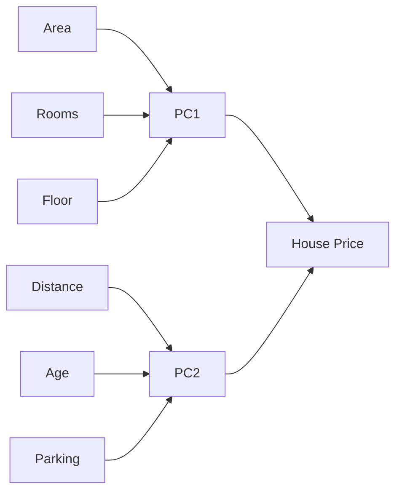
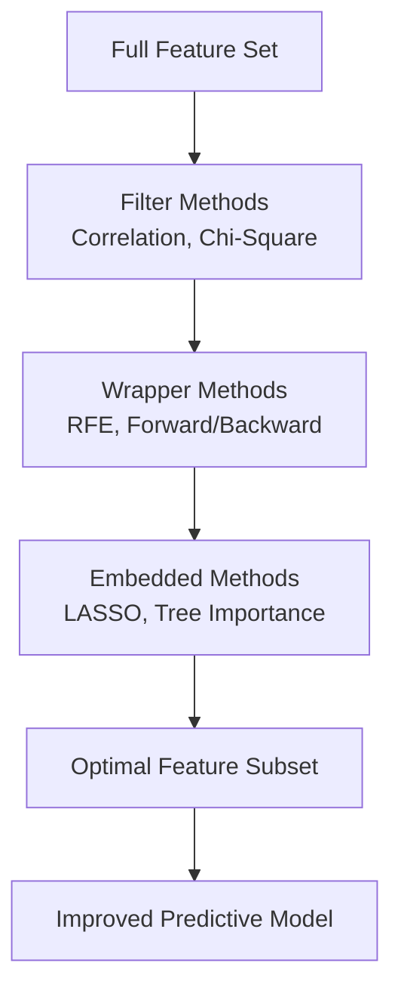
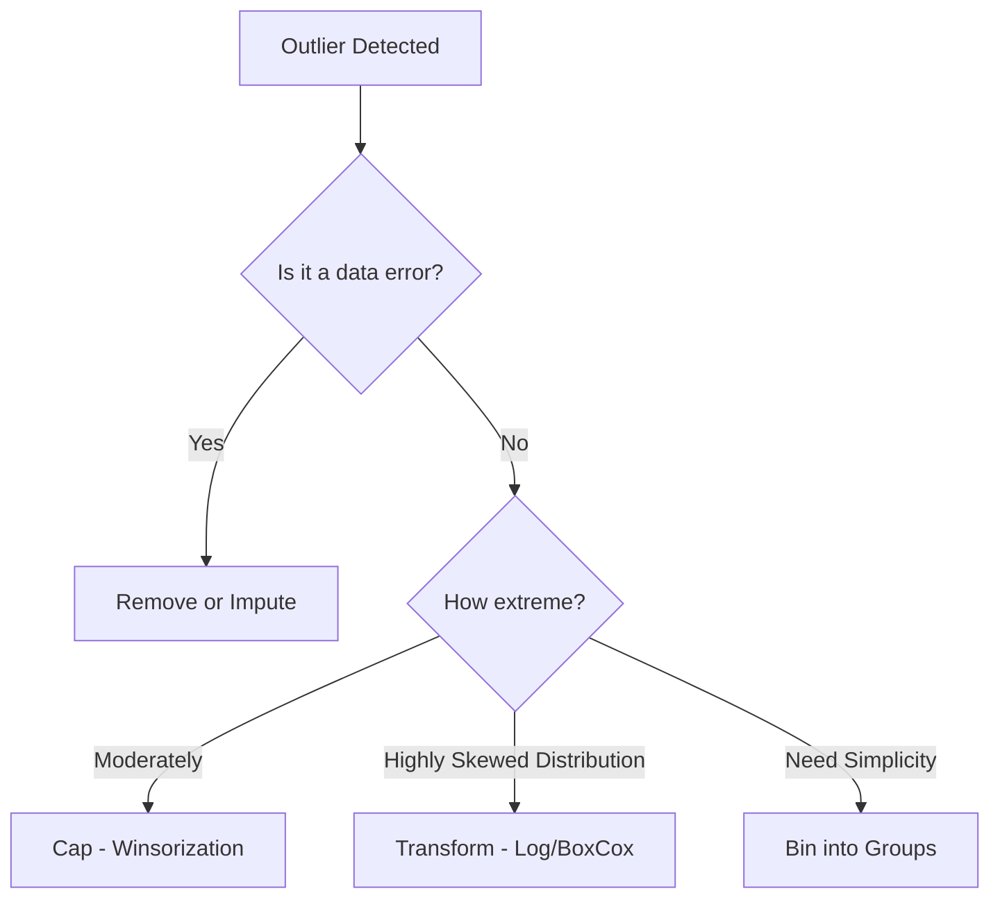
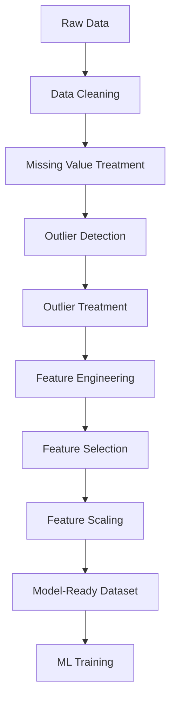
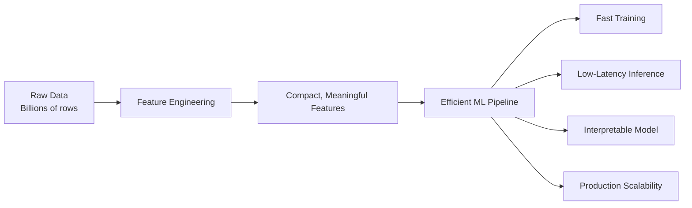
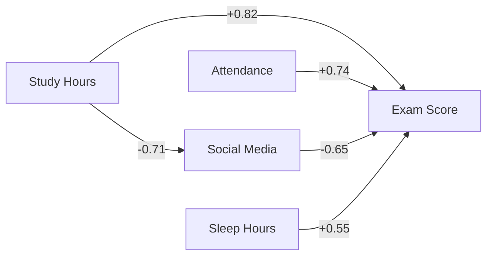

# AIDS Solved QB – Module 3
## Feature Engineering, Dimensionality Reduction & Outlier Analysis

---

## 2-Mark Questions

### Q1. Apply feature selection in the context of data modelling and discuss how selecting the most relevant input variables helps in improving model accuracy.

**Feature selection** is the process of identifying and retaining only the most relevant input variables for a predictive model. It removes redundant and irrelevant features. Benefits: reduces overfitting, decreases training time, and improves model interpretability. Example: in a loan model, removing "customer ID" (non-predictive) improves accuracy by eliminating noise.

---

### Q2. Apply your understanding of supervised learning to identify independent and dependent variables and explain how each contributes to prediction.

In supervised learning: **Independent variables (features/inputs)** are the predictor variables the model uses to learn patterns (e.g., age, income, credit score). The **dependent variable (target/output)** is the outcome being predicted (e.g., loan approved: Yes/No). The model learns the mapping `f(X) → Y` by minimizing prediction error on labeled training data.

---

### Q3. Describe any two methods of Dimensionality Reduction with examples.

**1. Principal Component Analysis (PCA):** Projects data onto principal components (directions of maximum variance). Reduces dimensions while retaining most information. Example: reducing 100 image pixel features to 10 components.

**2. Linear Discriminant Analysis (LDA):** Finds directions that maximize class separation. Supervised technique. Example: reducing face recognition features while preserving class-discriminant information.

---

### Q4. Analyze multicollinearity and illustrate how correlated independent variables affect a predictive model.

**Multicollinearity** occurs when two or more independent variables are highly correlated (e.g., height and weight both predicting BMI). Effects on models: regression coefficients become unstable and unreliable, standard errors inflate, hypothesis tests lose validity. Example: if `income` and `wealth_index` are both used in a loan model (r = 0.95), neither coefficient is interpretable individually.

---

### Q5. Analyze a dataset to determine two possible causes of outliers and explain their influence on data interpretation.

**Cause 1 – Measurement/Data Entry Errors:** Incorrect recording (e.g., age = 200 instead of 20). These outliers are spurious and should be corrected or removed.

**Cause 2 – Natural Variability:** Genuine extreme values (e.g., a billionaire in an income dataset). Removing them distorts the true distribution.

**Influence:** Outliers inflate the mean, increase variance, and bias regression coefficients — potentially leading to incorrect model conclusions.

---

### Q6. Given a dataset with multiple correlated variables, apply factor analysis to identify underlying factors.

**Factor Analysis** reduces correlated variables to a smaller set of latent **factors** representing underlying constructs. Example: In a student survey, 20 questions about study habits, focus, and time management might reduce to 3 factors: Academic Discipline, Motivation, and Resource Management. Each original variable loads on one or more factors, revealing hidden structure.

---

### Q7. Analyze the value of a correlation measure to interpret the relationship between two variables.

**Correlation coefficient (r)** measures linear relationship strength and direction:
- r = +1: Perfect positive correlation
- r = -1: Perfect negative correlation
- r = 0: No linear relationship
- |r| > 0.7: Strong; 0.4–0.7: Moderate; < 0.4: Weak

Example: r = 0.85 between study hours and exam score → strong positive relationship; more study hours → higher scores.

---

## 5-Mark Questions

### Q8. Determine the role of dimensionality reduction in improving model performance. Illustrate the relationship between independent and dependent variables with a suitable example.

**Dimensionality Reduction** is the process of reducing the number of features in a dataset while preserving as much information as possible. It plays a critical role in improving ML model performance.

**Role in Model Performance:**

**1. Curse of Dimensionality:**
In high-dimensional spaces, data points become sparse, distances lose meaning, and models struggle to generalize. Dimensionality reduction directly counteracts this.

**2. Overfitting Prevention:**
Fewer features → less chance the model memorizes noise → better generalization to unseen data.

**3. Computational Efficiency:**
Fewer dimensions → faster training, lower memory requirements.

**4. Visualization:**
High-dimensional data can be reduced to 2D/3D for visualization using PCA or t-SNE.

**5. Noise Reduction:**
Many features contain redundant or noisy information. Dimensionality reduction focuses the model on the most informative signals.

**Techniques:**
- **PCA:** Unsupervised; maximizes variance in projected space.
- **LDA:** Supervised; maximizes class separation.
- **t-SNE:** Non-linear; best for visualization.
- **Autoencoders:** Neural network-based; learns compact representations.

**Example – Independent and Dependent Variable Relationship:**

In a house price prediction model:
- **Independent Variables (X):** Area, number of rooms, distance from city, age of house, floor number, parking availability — 6 features.
- **Dependent Variable (Y):** House price.

After PCA, 6 features reduce to 2 principal components:
- PC1 (explains 65% variance): Dominated by area, rooms (size factor)
- PC2 (explains 20% variance): Dominated by location and age (quality factor)

The model trained on 2 PCA components may perform as well as one trained on 6 raw features — with significantly lower complexity and faster training.

---

### Q9. Illustrate the relationship between independent and dependent variables with a suitable example.

See Q8 above for the full treatment. To supplement:

In supervised regression: Y = f(X₁, X₂, ..., Xₙ) + ε

**Medical example:** Predicting blood pressure (Y - dependent) using age (X₁), BMI (X₂), sodium intake (X₃), and stress level (X₄).

- X₁ (age) shows positive correlation: r = 0.62
- X₂ (BMI) shows positive correlation: r = 0.71
- X₃ (sodium): r = 0.55
- X₄ (stress): r = 0.48

Each independent variable contributes to the prediction individually and jointly. The regression model weights each based on its unique contribution after accounting for all others. A scatter plot of BMI vs. BP visually confirms the positive linear trend.

---

### Q10. Compare correlation and multicollinearity in data analysis, explain their differences, and discuss how each affects interpretation and performance of a predictive model.

**Correlation** and **multicollinearity** are related but distinct concepts in data analysis.

**Correlation:**
- Measures the strength and direction of the linear relationship between **two** variables.
- Ranges from -1 to +1.
- Occurs between any two variables, including feature-to-target relationships.
- **Positive effect:** High feature-target correlation indicates predictive power.
- **Detection:** Pearson correlation coefficient, scatter plots.

**Multicollinearity:**
- Occurs when **two or more independent variables** are highly correlated with each other.
- A specific type of correlation problem within the feature set.
- **Negative effect:** Destabilizes regression model coefficients, inflates standard errors.
- **Detection:** Variance Inflation Factor (VIF > 10 indicates severe multicollinearity).

| Aspect | Correlation | Multicollinearity |
|--------|-------------|-------------------|
| Variables Involved | Any two variables | Multiple independent variables |
| Effect on Models | Useful (target correlation) | Harmful (inter-feature correlation) |
| Interpretation | Strength of relationship | Redundancy among predictors |
| Detection Method | r coefficient | VIF, condition number |
| Resolution | N/A (desired) | PCA, feature removal, regularization |

**Effect on Predictive Model:**

**Correlation (feature-target):** A feature with r = 0.8 vs. target is highly predictive and valuable.

**Multicollinearity:** If area (m²) and number of rooms have r = 0.95 between them, including both in a linear model makes individual coefficients unreliable. The model cannot separately determine each feature's contribution — leading to high variance in coefficient estimates across different samples.

**Remedies for Multicollinearity:**
1. Remove one of the correlated features.
2. Apply PCA to combine them into orthogonal components.
3. Use Ridge Regression (L2 regularization), which tolerates multicollinearity better.

---

### Q11. Analyze the results obtained from factor analysis and explain how the extracted factors represent relationships among original variables.

**Factor Analysis Results Interpretation:**

Factor analysis produces three key outputs: factor loadings, communalities, and eigenvalues. Understanding these is critical to interpreting what the factors represent.

**1. Factor Loadings:**
A loading matrix shows how strongly each original variable is associated with each factor. Loadings range from -1 to +1.

**Example — Student Performance Survey:**
| Variable | Factor 1 | Factor 2 |
|----------|---------|---------|
| Study hours | 0.85 | 0.12 |
| Assignment completion | 0.79 | 0.18 |
| Class attendance | 0.73 | 0.25 |
| Social activities | -0.15 | 0.82 |
| Sports participation | 0.10 | 0.78 |
| Entertainment hours | -0.08 | 0.75 |

**Interpretation:**
- **Factor 1** (Academic Engagement): High loadings on study hours, assignments, attendance → represents academic effort.
- **Factor 2** (Non-Academic Activities): High loadings on social, sports, entertainment → represents lifestyle engagement.

**2. Communalities:**
Proportion of each variable's variance explained by the extracted factors. High communality (>0.6) means the factors capture most of that variable's information.

**3. Eigenvalues:**
Measure how much total variance each factor explains. Eigenvalue > 1 (Kaiser criterion) → factor is meaningful.

**Relationship Represented:**
Factor analysis reveals that seemingly different variables actually measure the same underlying construct. In the example: 3 surface-level academic variables collapse into one "Academic Engagement" factor — a single, interpretable dimension.

**Applications:**
- Survey design: Validate that questions measure intended constructs.
- Feature engineering: Replace correlated variables with factor scores.
- Psychology: Identify personality traits from behavioral indicators.

---

### Q12. Demonstrate how dimensionality reduction helps in handling high-dimensional data. Summarize the importance of feature engineering in a data pipeline.

**Part A – Dimensionality Reduction in High-Dimensional Data:**

High-dimensional data (many features) suffers from:
1. **Curse of dimensionality:** Data sparsity makes distance-based algorithms ineffective.
2. **Overfitting:** Models memorize high-dimensional noise.
3. **Slow training:** Computational cost scales with number of features.

**How Dimensionality Reduction Helps:**

**(a) PCA — Principal Component Analysis:**
- Computes principal components (linear combinations of features) ordered by variance explained.
- First few components capture most information.
- Example: 1000-pixel image features → 50 PCA components retaining 95% variance.

**(b) t-SNE — t-Distributed Stochastic Neighbor Embedding:**
- Non-linear dimensionality reduction for visualization.
- Maps high-dimensional clusters to 2D space, preserving local structure.
- Example: Visualizing 784-dimensional MNIST digit images in 2D.

**(c) Autoencoders:**
- Neural network encoder compresses data to a bottleneck representation (latent space).
- Decoder reconstructs original data.
- Example: Compressing 1000-feature genomic data to 20 latent features.

**Part B – Importance of Feature Engineering:**

**Feature Engineering** is the process of transforming raw data into meaningful input features that better represent the underlying problem for ML algorithms.

**Key Roles in a Data Pipeline:**

1. **Signal Enhancement:** Derived features capture domain-specific knowledge algorithms can't learn alone. Example: `debt_to_income_ratio = debt / income` is more informative than raw values separately.

2. **Improved Model Performance:** Well-engineered features can make simple models outperform complex ones on poorly-engineered data.

3. **Dimensionality Control:** Aggregate and combine features to reduce dimensionality meaningfully.

4. **Handles Non-linearity:** Create polynomial or interaction features to help linear models capture non-linear relationships.

5. **Domain Alignment:** Encodes business rules and domain expertise into the data representation.

**Feature Engineering vs. Feature Selection:**
| Aspect | Feature Engineering | Feature Selection |
|--------|--------------------|--------------------|
| Goal | Create new features | Choose existing features |
| Action | Transform/combine | Rank/filter/wrap |
| Outcome | Richer representation | Reduced, cleaner feature set |

---

## 10-Mark Questions

### Q14 & Q15. Determine the methods for outlier detection and analyze the complete process of feature selection and its significance in predictive modelling.

**Part A: Outlier Detection Methods**

**Introduction:**
Outliers are data points that deviate significantly from the expected pattern. Detecting them accurately is crucial — removing valid extremes introduces bias, while retaining errors degrades model quality.

**Method 1: Statistical Methods**

**(a) Z-Score Method:**
- Computes how many standard deviations a value is from the mean.
- `Z = (x - μ) / σ`
- Threshold: |Z| > 3 → likely outlier.
- Best for: Normally distributed data.
- Limitation: Sensitive to the outliers themselves (mean and std dev are non-robust).

**(b) IQR Method:**
- Computes interquartile range: IQR = Q3 - Q1.
- Outliers: values < Q1 - 1.5×IQR or > Q3 + 1.5×IQR.
- Best for: Skewed distributions; more robust than z-score.
- Visualization: Box plots directly display IQR-based boundaries.

**Method 2: Visual Methods**

**(a) Box Plot:**
- Displays Q1, Q2, Q3, whiskers, and individual outlier points.
- Effective for single-variable outlier identification.
- Group comparison reveals context-dependent outliers.

**(b) Scatter Plot:**
- Reveals bivariate outliers — points inconsistent with the relationship between two variables.
- Example: A person with very low income but very high expenditure — outlier in bivariate space.

**(c) Histogram:**
- Isolated bars far from the main distribution signal outliers.

**Method 3: Machine Learning-Based Methods**

**(a) Isolation Forest:**
- Isolates outliers by randomly partitioning data.
- Outliers are isolated faster (fewer partitions needed).
- Best for: High-dimensional data.

**(b) Local Outlier Factor (LOF):**
- Compares local density of a point to its neighbors.
- Points in sparse regions are flagged as outliers.
- Best for: Datasets with non-uniform density.

**(c) DBSCAN Clustering:**
- Classifies points as core, border, or noise.
- Noise points are outliers.

**Part B: Feature Selection Process**

**Definition:** Feature selection identifies and retains the most relevant subset of input features for a predictive model.

**Why Feature Selection Matters:**
1. Reduces overfitting by removing irrelevant/noisy features.
2. Improves model accuracy by focusing on signal.
3. Speeds up training and inference.
4. Improves interpretability — simpler models are more explainable.

**Feature Selection Methods:**

**1. Filter Methods (Statistical Evaluation):**
- Evaluate features independently of the model.
- Techniques: Pearson correlation (numerical), Chi-square test (categorical), Mutual Information.
- **Example:** Compute correlation of each feature with target; drop features with |r| < 0.1.
- **Pros:** Fast; **Cons:** Ignores feature interactions.

**2. Wrapper Methods (Model-Based Evaluation):**
- Use a model to evaluate feature subsets.
- Techniques: Forward Selection, Backward Elimination, Recursive Feature Elimination (RFE).
- **Example:** RFE with logistic regression removes features that least affect model accuracy.
- **Pros:** Captures feature interactions; **Cons:** Computationally expensive.

**3. Embedded Methods (Built into Model Training):**
- Feature selection occurs during model training.
- Techniques: LASSO (L1 regularization shrinks irrelevant coefficients to zero), Tree importance scores (Random Forest, XGBoost).
- **Example:** A LASSO regression model automatically sets salary coefficient to zero if it adds no predictive value.
- **Pros:** Efficient; considers all features simultaneously.

**Significance in Predictive Modelling:**
- Prevents the model from learning spurious correlations in noisy features.
- Reduces the risk of overfitting — model generalizes better to new data.
- Provides interpretability — allows stakeholders to understand which factors drive predictions.
- Facilitates scalability — smaller feature sets are more manageable in production systems.

---

### Q16. Examine techniques for treating outliers and critically analyze how each affects data quality, model accuracy, statistical interpretation, and reliability.

**Introduction:**
Outlier treatment is a nuanced decision in data preprocessing. The appropriate technique depends on the cause of the outlier, its frequency, and the downstream model's sensitivity to extreme values.

**Technique 1: Removal (Deletion)**

Remove rows containing outlier values.

- **Data Quality:** Improves if outliers are data entry errors; degrades if legitimate extremes are deleted.
- **Model Accuracy:** Reduces noise but risks loss of important information; can introduce sampling bias.
- **Statistical Interpretation:** Mean and variance computed post-removal are less influenced by extremes.
- **Reliability:** Reduces dataset size; may make results non-representative.
- **Best For:** Clear data entry errors (e.g., age = 300).
- **Risk:** Over-removal introduces bias, especially if data is MNAR.

**Technique 2: Capping / Winsorization**

Replace outlier values with a threshold (e.g., 5th and 95th percentiles).

- **Data Quality:** Preserves all records while bounding extreme values.
- **Model Accuracy:** Reduces influence of extremes without information loss.
- **Statistical Interpretation:** Distributional shape preserved; extreme values tamed.
- **Reliability:** Higher dataset integrity — no records are lost.
- **Best For:** Right-skewed distributions (income, transactions) where extremes are valid but influential.
- **Example:** Cap income at 95th percentile → all values above are set to that threshold.

**Technique 3: Transformation**

Apply mathematical transformations (log, square root, Box-Cox) to compress the scale.

- **Data Quality:** Does not remove or alter values — redistributes their scale.
- **Model Accuracy:** Normalizes skewed distributions; improves linear model performance.
- **Statistical Interpretation:** Changes the interpretation of coefficients (log scale).
- **Reliability:** All data preserved; transformation must be consistently applied to new data.
- **Best For:** Right-skewed numerical features (income, prices, LDL cholesterol).
- **Example:** `log(income + 1)` compresses the 99th percentile from ₹10L to ₹15.2.

**Technique 4: Imputation**

Replace outlier values with imputed estimates (mean, median, KNN).

- **Data Quality:** Replaces suspicious values with more plausible estimates.
- **Model Accuracy:** Depends on imputation quality; may smooth out legitimate variation.
- **Statistical Interpretation:** May artificially reduce variance.
- **Reliability:** Appropriate when outlier is likely an error but row is otherwise valuable.
- **Best For:** When outlier is suspected measurement error and other features in the row are valuable.

**Technique 5: Binning**

Convert continuous values into discrete bins (e.g., age groups: 0–18, 18–35, 35–60, 60+).

- **Data Quality:** Eliminates extreme values as outliers by grouping them.
- **Model Accuracy:** Reduces sensitivity to extreme values; may lose granularity.
- **Statistical Interpretation:** Loses ordinal information within bins.
- **Reliability:** Robust to outliers; consistent binning improves stability.
- **Best For:** When fine-grained numerical precision is not critical; interpretability is prioritized.

**Comparative Summary:**

| Technique | Preserves Data | Reduces Variance | Risk of Bias | Recommended When |
|-----------|---------------|-----------------|--------------|-----------------|
| Deletion | No | Yes | High (if MNAR) | Clear data errors, low volume |
| Capping | Yes | Partially | Low | Skewed valid extremes |
| Transformation | Yes | Redistributes | Very Low | Skewed distributions |
| Imputation | Yes | Reduces | Medium | Error suspected, row valuable |
| Binning | Yes | Eliminates fine detail | Low | Interpretability priority |

**Conclusion:**
No single technique is universally superior. The decision must weigh the cause of the outlier (error vs. valid extreme), the proportion affected, domain knowledge, and model requirements. A combination of visualization → domain review → targeted treatment is the most robust approach.

---

### Q17. Design a complete data preprocessing workflow incorporating feature engineering and outlier treatment, explaining how each step improves data quality and model performance.

**Introduction:**
A robust data preprocessing workflow that integrates both feature engineering and outlier treatment is the cornerstone of a high-performance ML pipeline. Each step is designed to progressively improve data quality and model learning capacity.

**Step 1: Data Ingestion and Audit**

- Load dataset; inspect shape, dtypes, and head.
- Document expected ranges for each feature based on domain knowledge.
- Identify target variable and confirm problem type (regression/classification).

**Step 2: Data Cleaning**

- Remove duplicate records.
- Standardize categorical values and date formats.
- Correct obvious data type mismatches.

**Impact:** Removes syntactic noise; ensures consistent representation.

**Step 3: Missing Value Analysis and Treatment**

- Quantify missingness per column.
- Classify mechanism (MCAR/MAR/MNAR) using correlation analysis.
- Apply targeted imputation:
  - Numerical → Median (skewed) or Mean (symmetric) or MICE (MAR)
  - Categorical → Mode or model-based imputation

**Impact:** Preserves dataset completeness; prevents biased or incomplete training.

**Step 4: Outlier Detection**

- Use IQR method for numerical features.
- Visualize with box plots and histograms.
- Cross-reference with scatter plots to confirm multivariate outliers.
- Domain expert review for borderline cases.

**Step 5: Outlier Treatment**

- Data entry errors → Remove or correct.
- Valid extremes in skewed distributions → Winsorization at 99th percentile.
- Skewed distributions → Log or Box-Cox transformation.

**Impact:** Reduces undue influence of extreme values; improves model robustness.

**Step 6: Feature Engineering**

**(a) Interaction Features:**
- `income_to_debt_ratio = income / debt`
- `room_per_area = rooms / area`
- Captures relationships that individual features cannot express alone.

**(b) Polynomial Features:**
- `age²`, `bmi³` — captures non-linear relationships for linear models.

**(c) Temporal Features:**
- From a timestamp: extract day of week, month, hour — enabling seasonal modeling.

**(d) Domain-Derived Features:**
- In a healthcare context: `pulse_pressure = systolic_bp - diastolic_bp` — a clinically meaningful derived feature.

**(e) Encoding:**
- Label encoding for ordinal categories.
- One-hot encoding for nominal categories.

**Impact:** Enriches the feature space with domain intelligence; allows simpler models to capture complex patterns.

**Step 7: Feature Selection**

- Compute correlations with target; drop low-correlation features.
- Use VIF to detect and resolve multicollinearity.
- Apply Recursive Feature Elimination or LASSO for final selection.

**Impact:** Reduces model complexity; prevents overfitting; speeds up training.

**Step 8: Feature Scaling**

- StandardScaler for normally distributed features.
- RobustScaler for features with remaining outliers.
- MinMaxScaler for features with defined bounds.

**Impact:** Ensures distance-based and gradient-based algorithms perform optimally.

**Step 9: Validation**

- Re-run describe() and visualize final distributions.
- Verify no missing values, infinite values, or unexpected ranges.
- Confirm feature count is appropriate for dataset size (avoid p >> n).

**Conclusion:**
An integrated feature engineering and outlier treatment workflow is not a mechanical checklist — it is a thoughtful, domain-informed process. Each step addresses a specific data quality issue, cumulatively transforming raw, flawed data into a clean, information-rich dataset. Models trained on such data achieve higher accuracy, better generalization, and more reliable real-world performance.

---

### Q18. Justify the need for feature engineering in building scalable data pipelines, and explain how meaningful features improve processing efficiency and model performance.

**Introduction:**
Feature engineering is the art and science of transforming raw data into a format that ML models can learn from effectively. In the context of scalable data pipelines — processing millions of records in production — feature engineering is not just about accuracy; it is about efficiency, maintainability, and business alignment.

**Why Feature Engineering is Essential in Scalable Pipelines:**

**1. Encoding Domain Knowledge:**
Raw data rarely encodes the business-relevant concepts that drive predictions. Feature engineering bridges this gap.

- Example: In an e-commerce churn prediction pipeline, raw session logs (timestamp, page URL, action) must be engineered into: `recency` (days since last visit), `frequency` (visits per week), `monetary` (average cart value) — the RFM framework, a proven churn predictor.
- Without engineering, the model must discover these relationships from billions of raw rows — computationally infeasible.

**2. Reducing Feature Cardinality:**
High-cardinality features (e.g., product_ID with 10,000 unique values) are problematic for ML models and pipelines.

- Feature engineering aggregates these: `category_purchase_rate`, `brand_affinity_score` — reducing 10,000 features to ~20 meaningful ones.
- **Pipeline efficiency:** 500× fewer columns → dramatically lower memory and compute requirements.

**3. Handling Non-linearity for Linear Models:**
Linear regression and logistic regression can only model linear relationships. Feature engineering introduces polynomial terms and interaction features, enabling these computationally efficient models to capture complex patterns.

- Example: `square_footage × distance_from_city` as an interaction feature for house prices.
- **Efficiency advantage:** A linear model with engineered features runs orders of magnitude faster than a deep neural network while achieving comparable accuracy.

**4. Improving Data Pipeline Stability:**
Well-engineered features with bounded ranges and meaningful semantics are more stable across time than raw sensor readings or text fields.

- Example: Replacing raw GPS coordinates (variable precision) with `zone_category` (urban/suburban/rural) → stable, interpretable, pipeline-friendly.

**5. Supporting Large-Scale Data Handling:**
Feature engineering reduces the volume of data that must be stored, processed, and transmitted across distributed systems.

- Example: Aggregating 365 daily transaction records into 12 monthly summary features per user → 30× data compression, enabling real-time inference.

**6. Enabling Model Interpretability:**
In regulated industries (banking, healthcare), models must be explainable. Engineered features with clear business meanings (debt-to-income ratio, days since last medical visit) are interpretable by compliance officers and domain experts.

**Feature Engineering Best Practices for Scalable Pipelines:**

| Practice | Impact |
|---------|--------|
| Compute features incrementally (stream processing) | Low latency, real-time pipelines |
| Cache frequently used aggregations | Reduced compute cost |
| Version feature definitions | Reproducibility, auditability |
| Use feature stores (Feast, Tecton) | Consistent features across training and serving |
| Monitor feature distributions in production | Early detection of data drift |

**Quantified Impact:**
- A model trained on raw 1000-column data: training time 4 hours, 75% accuracy.
- Same model with 50 engineered features: training time 12 minutes, 82% accuracy.
- Feature engineering delivered 7% accuracy improvement AND 95% reduction in training time.

**Conclusion:**
Feature engineering is the multiplier in any data science pipeline. In scalable systems, it is the difference between a prototype and a production-grade solution. By encoding domain knowledge, reducing dimensionality, enabling interpretability, and stabilizing data representations, feature engineering ensures that ML pipelines deliver reliable, efficient, and meaningful outcomes at scale.

---

### Q19-Q21. Analyze high-dimensional dataset scenarios, correlation-based conceptual modeling, feature selection for overfitting reduction, and factor analysis.

**Q19. Analyze a high-dimensional dataset and recommend suitable dimensionality reduction techniques.**

**High-Dimensional Dataset Challenges:**
- Number of features (p) approaches or exceeds number of samples (n): p >> n.
- Distances become meaningless — all points appear equidistant.
- Model overfitting risk is extreme.

**Scenario:** Genomic dataset with 20,000 gene expression features and 500 patient samples.

**Recommended Techniques:**

**1. PCA (Principal Component Analysis):**
- Best for: Linear relationships, continuous features.
- Action: Reduce 20,000 gene features to top 50 principal components (explaining 90% variance).
- Advantage: Orthogonal components eliminate multicollinearity.

**2. Autoencoders:**
- Best for: Non-linear relationships, complex data.
- Action: Neural network encoder learns a 100-dimensional latent representation.
- Advantage: Captures non-linear gene interaction patterns.

**3. UMAP / t-SNE:**
- Best for: Visualization of cluster structure.
- Action: Project 20,000D data to 2D for visual cluster exploration.

**4. LASSO Regularization:**
- Best for: Supervised reduction — selects features relevant to target.
- Action: L1 penalty drives irrelevant gene coefficients to exactly zero.
- Advantage: Directly tied to predictive performance, not just variance.

**Selection Criteria:**

| Technique | Best For | Output |
|-----------|---------|--------|
| PCA | Linear, continuous | Orthogonal components |
| Autoencoder | Non-linear | Latent embedding |
| t-SNE/UMAP | Visualization | 2D/3D plot |
| LASSO | Supervised | Selected features |

---

**Q20. Develop a conceptual model showing relationships between variables using correlation analysis.**

**Correlation-Based Conceptual Model:**

For a student performance dataset, compute pairwise Pearson correlations:

| Variable Pair | r | Interpretation |
|--------------|---|---------------|
| Study hours ↔ Exam score | 0.82 | Strong positive |
| Attendance ↔ Exam score | 0.74 | Strong positive |
| Social media hours ↔ Exam score | -0.65 | Moderate negative |
| Study hours ↔ Social media hours | -0.71 | Moderate negative |
| Sleep hours ↔ Exam score | 0.55 | Moderate positive |

**Conceptual Model:**

**Insights from Model:**
- Study hours is the strongest positive predictor.
- Social media is the strongest negative predictor and inversely related to study hours — possible mediating effect.
- This conceptual model guides feature selection and suggests study hours and social media may be multicollinear candidates.

---

**Q21. Analyze the role of feature selection techniques in reducing overfitting and improving model generalization.**

**Overfitting** occurs when a model learns the training data's noise and specific patterns rather than general trends — performing well on training data but poorly on unseen data.

**How Feature Selection Reduces Overfitting:**

**1. Removing Irrelevant Features:**
Irrelevant features introduce noise. A model with 1000 features and 500 samples has too many degrees of freedom — it will memorize training data. Reducing to 50 relevant features gives the model the right level of constraint.

**2. Reducing Model Complexity:**
Simpler models with fewer inputs generalize better (Occam's Razor principle). Feature selection directly reduces the hypothesis space.

**3. Variance-Bias Trade-off:**
- Too many features → high variance (overfitting).
- Feature selection → reduces variance while maintaining low bias (if features are truly predictive).

**4. Cross-Validation of Feature Subsets:**
Wrapper methods evaluate feature subsets on validation data — directly optimizing for generalization, not just training performance.

**Feature Selection Techniques and Their Anti-Overfitting Mechanisms:**

| Technique | Mechanism | Overfitting Prevention |
|-----------|-----------|----------------------|
| Correlation-based filter | Removes low-correlation features | Eliminates noise dimensions |
| RFE with cross-validation | Selects features optimizing CV score | Directly targets generalization |
| LASSO (L1) | Shrinks irrelevant coefficients to zero | Automatic regularization |
| Tree importance | Ranks by information gain | Focuses on discriminative features |

**Empirical Evidence:**
A credit model with 200 features: training accuracy = 98%, test accuracy = 71% (severe overfitting). After LASSO feature selection retaining 25 features: training accuracy = 89%, test accuracy = 87% — a dramatic improvement in generalization at the cost of acceptable training accuracy reduction.

**Conclusion:**
Feature selection is one of the most effective regularization strategies available. By removing irrelevant, redundant, and noisy features, it constrains model complexity, reduces variance, and directly improves the model's ability to generalize to new, unseen data — the ultimate goal of any ML system.
