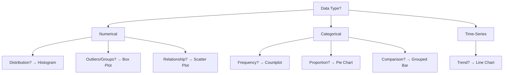
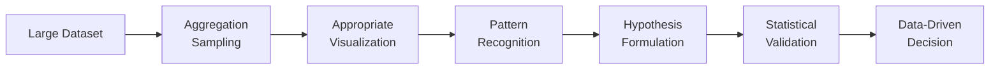
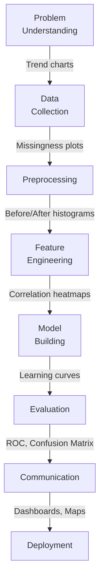

# AIDS Solved QB – Module 4
## Data Visualization

---

## 2-Mark Questions

### Q1. Apply your understanding of data visualization to explain how graphical representation techniques are used in data analysis, and describe the primary objective.

**Data visualization** is the graphical representation of data to communicate information clearly and efficiently. Techniques include histograms, scatter plots, box plots, heatmaps, and line charts. The **primary objective** is to make complex datasets understandable at a glance — helping analysts detect patterns, trends, outliers, and relationships that are difficult to see in raw numerical tables.

---

### Q2. Relate any two benefits of data visualization and explain how they support data-driven decision making.

**Benefit 1 – Pattern Detection:** Visual representations reveal trends (e.g., sales growth over time) that raw numbers obscure, enabling faster and more confident decisions.

**Benefit 2 – Outlier Identification:** Scatter plots and box plots immediately highlight anomalies in data. Decision-makers can investigate and act on these without parsing thousands of rows manually, saving time and reducing error.

---

### Q3. Demonstrate how a histogram represents data and justify why it effectively displays distribution.

A **histogram** divides a numerical variable into bins (intervals) and plots frequency (count or proportion) on the Y-axis. It is effective for displaying **distribution** because it reveals: the shape (normal, skewed, bimodal), spread (narrow vs. wide), and presence of outliers. Example: a histogram of exam scores shows whether most students scored in the 70–80 range or if performance was evenly spread.

---

### Q4. Apply a countplot in EDA and explain how it helps in understanding the distribution of categorical data.

A **countplot** (bar chart variant) displays the frequency of each category of a categorical variable. In EDA, it helps identify: class imbalance (e.g., far more "No" than "Yes" in a churn variable), dominant categories, and rare categories. Example: a countplot of customer payment methods reveals that 80% use credit cards, guiding business focus.

---

### Q5. Summarize what insight does a boxplot provide about a dataset.

A **boxplot** provides: the **median** (central tendency), **Q1 and Q3** (interquartile range — middle 50% spread), **whiskers** (data range excluding outliers), and individual **outlier points**. It allows quick comparison of distributions across groups and immediately reveals skewness (median closer to Q1 → right-skewed) and outlier presence.

---

### Q6. Examine why it is important to visualize data before applying machine learning algorithms.

Visualizing data before ML reveals: **class imbalance** (requires resampling), **feature distributions** (informs transformations), **correlations** (guides feature selection), **outliers** (require treatment), and **data quality issues** (missing patterns visible in missingness plots). Skipping visualization risks building models on flawed data — leading to poor generalization, biased predictions, and wasted compute resources.

---

### Q7. Identify any two common data visualization techniques used in data science. State one limitation of data visualization.

**Two techniques:** (1) **Heatmap** — shows correlation between all feature pairs using color intensity. (2) **Scatter plot** — plots two numerical variables against each other to reveal linear/non-linear relationships.

**Limitation:** Visualizations can be **misleading** — truncated Y-axes, poor color choices, or inappropriate chart types can distort perception of data. They also cannot capture all dimensions simultaneously in high-dimensional datasets.

---

## 5-Mark Questions

### Q8 & Q9. Explain the importance of data visualization in AI and Data Science. Analyze how visualization assists in understanding patterns, trends, and model performance.

**Introduction:**
Data visualization is indispensable in both Artificial Intelligence and Data Science. It serves as the communication layer between complex mathematical computations and human decision-making.

**Importance in Data Science:**

**1. Exploratory Data Analysis (EDA):**
Before any model is built, visualization reveals the structure of the data:
- **Histograms** show feature distributions and skewness.
- **Correlation heatmaps** identify multicollinearity and feature-target relationships.
- **Box plots** expose outliers and distributional differences across groups.
- **Pair plots** show pairwise relationships across all features simultaneously.

Without EDA visualization, data scientists would work "blind" — selecting features and models without understanding the underlying data characteristics.

**2. Feature Engineering Guidance:**
Scatter plots of raw features vs. the target variable reveal whether linear or non-linear relationships exist. This guides whether polynomial features, log transformations, or interaction terms are needed — decisions with significant accuracy implications.

**3. Model Performance Analysis:**

| Visualization | What it Shows |
|--------------|--------------|
| Confusion Matrix Heatmap | True/false positives and negatives |
| ROC-AUC Curve | Trade-off between sensitivity and specificity |
| Learning Curves | Overfitting or underfitting diagnosis |
| Residual Plots | Assumption violations in regression |
| Feature Importance Bar Charts | Which features drive predictions |

**4. Communication with Stakeholders:**
AI models produce numerical outputs that non-technical stakeholders cannot interpret directly. Visualizations — dashboards, trend charts, and geographic maps — translate model outputs into actionable business narratives. Example: A churn probability map showing high-risk customer segments by region is far more actionable than a table of probabilities.

**5. Pattern and Trend Detection:**
- **Line charts** over time reveal seasonality and trend direction.
- **Heatmaps** on time-of-day vs. day-of-week data reveal peak demand periods.
- **Cluster visualizations** (t-SNE, UMAP) reveal natural groupings in data.

**Importance in Artificial Intelligence:**
- In computer vision, **feature map visualizations** reveal what neural network layers have learned.
- In NLP, **attention heatmaps** show which words a transformer model focuses on.
- In reinforcement learning, **reward curve plots** diagnose training stability and convergence.

**Conclusion:**
Visualization is not a cosmetic layer on top of AI/DS work — it is an analytical tool that accelerates insight generation, improves model quality, and bridges the gap between data-driven systems and human understanding.

---

### Q10. Consider a real-world dataset (e.g., customer purchase or healthcare data). Develop an EDA strategy using appropriate visualization techniques to explore the dataset.

**Scenario: Healthcare Patient Dataset**

**Dataset Contents:** Patient ID, age, gender, blood pressure, glucose level, BMI, diagnosis (diabetic/non-diabetic), admission date.

**EDA Visualization Strategy:**

**Step 1: Understand Target Distribution — Countplot**
```python
sns.countplot(data=df, x='diagnosis')
```
Reveals class imbalance: if 90% are non-diabetic, model will need SMOTE or class weighting.

**Step 2: Numerical Feature Distributions — Histograms**
```python
df[['age', 'glucose', 'bmi', 'blood_pressure']].hist(bins=30, figsize=(12,8))
```
Reveals: age is roughly normal; glucose is right-skewed (needs log transform); BMI shows bimodal distribution.

**Step 3: Outlier Detection — Box Plots**
```python
sns.boxplot(data=df, x='diagnosis', y='glucose')
```
Reveals: diabetic patients have significantly higher and more variable glucose levels; several extreme glucose values that require clinical review.

**Step 4: Feature-Target Correlation — Heatmap**
```python
sns.heatmap(df.corr(), annot=True, cmap='coolwarm')
```
Reveals: glucose (r=0.47) and BMI (r=0.29) are most correlated with diagnosis; age and blood pressure show moderate correlations.

**Step 5: Bivariate Relationships — Scatter Plots**
```python
sns.scatterplot(data=df, x='glucose', y='bmi', hue='diagnosis')
```
Reveals: diabetic patients cluster in high-glucose/high-BMI region — supports these as key discriminating features.

**Step 6: Temporal Patterns — Line Chart**
```python
df.groupby('admission_month')['glucose'].mean().plot()
```
Reveals: seasonal glucose spikes in winter months — potentially important temporal feature.

**Step 7: Missing Value Visualization — Missingness Heatmap**
```python
import missingno as msno
msno.heatmap(df)
```
Reveals: blood pressure and glucose are often missing together — suggests joint imputation strategy.

**Insights Generated:**
- Glucose and BMI are the most important predictors.
- Class imbalance must be addressed.
- Log transformation needed for glucose.
- Seasonal patterns suggest including month as a feature.
- Joint missingness pattern informs MICE imputation strategy.

**Justification:** Each visualization serves a specific analytical purpose — together they form a comprehensive understanding of the dataset before any model is trained.

---

### Q11 & Q12. Apply histogram to explain data distribution and frequency patterns. Differentiate between histogram and countplot, analyzing their usage with examples.

**Part A – Histogram:**

A **histogram** plots the frequency distribution of a **continuous numerical** variable by dividing the data range into equal-width bins and counting observations in each.

**Key Properties:**
- X-axis: Continuous value range divided into bins.
- Y-axis: Frequency (count) or density.
- Bin width affects resolution — too wide: loses detail; too narrow: too noisy.

**What It Reveals:**
| Pattern | Histogram Appearance |
|---------|---------------------|
| Normal distribution | Symmetric bell curve |
| Right-skewed | Long tail to the right |
| Left-skewed | Long tail to the left |
| Bimodal | Two peaks |
| Outliers | Isolated bars far from main cluster |

**Example:** Histogram of patient ages in a hospital dataset shows peak between 40–60 years (middle-aged majority), with a long right tail toward 90+ (elderly minority). This informs age-group stratified analysis.

**Part B – Countplot:**

A **countplot** (categorical bar chart) plots the frequency of each category of a **discrete categorical** variable.

**Key Properties:**
- X-axis: Category labels.
- Y-axis: Count of observations per category.
- No bin width consideration — each bar represents one category.

**Example:** Countplot of blood type distribution shows A (35%), O (40%), B (20%), AB (5%) — immediately reveals AB is rare, guiding blood bank inventory decisions.

**Part C – Comparison:**

| Aspect | Histogram | Countplot |
|--------|-----------|-----------|
| Data Type | Continuous numerical | Categorical (discrete) |
| X-axis | Ranges/bins | Category labels |
| Y-axis | Frequency/density | Count per category |
| Purpose | Distribution shape | Category frequency |
| Example | Age distribution | Payment method frequency |
| Bin Width | Adjustable (critical parameter) | Not applicable |
| Reveals | Skewness, outliers, spread | Class imbalance, dominant categories |

**When to Use Which:**
- Use histogram when asking: "How are the numerical values distributed?"
- Use countplot when asking: "How many observations belong to each category?"

---

### Q13 & Q14 & Q15. Examine how boxplots identify outliers and analyze data spread. Apply quartiles and IQR in interpreting a dataset.

**Part A – Box Plot Structure and Outlier Detection:**

A **box plot** (box-and-whisker plot) summarizes data using five key statistics: minimum, Q1, median (Q2), Q3, and maximum — with outliers plotted as individual points.

```
|----| [====|====] |----|  o  o
Min   Q1   Q2  Q3  Max  Outliers
```

**IQR (Interquartile Range):** IQR = Q3 - Q1

**Outlier Boundaries:**
- Lower Fence: Q1 - 1.5 × IQR
- Upper Fence: Q3 + 1.5 × IQR
- Points beyond these fences are plotted individually as outlier dots.

**Spread Analysis:**
- **Box width (IQR):** Larger IQR → more spread in the middle 50%.
- **Whisker length:** Longer whiskers → more spread in tails.
- **Skewness:** If median is closer to Q1 → right-skewed; closer to Q3 → left-skewed.

**Part B – Practical Example:**

**Dataset:** Income (₹thousands/month) for 100 employees:
- Q1 = 30, Q2 = 45, Q3 = 65
- IQR = 65 - 30 = 35
- Lower fence = 30 - 52.5 = -22.5 (no outliers below)
- Upper fence = 65 + 52.5 = 117.5
- Values above ₹117,500/month flagged as outliers.

**Interpretation:**
- Median of 45 closer to Q1 (30) → slight right skew (high earners pulling distribution right).
- IQR of 35 → moderate spread in middle 50%.
- 3 employees earning above ₹120,000 plotted as outlier dots — likely senior executives.

**Part C – Group Comparison:**

Comparing box plots across groups (e.g., income by department) reveals:
- Which departments have higher median salaries.
- Which departments show greater salary variability.
- Which departments have more high-earning outliers.

This comparison is one of the most powerful uses of box plots in EDA — simultaneously summarizing distribution across multiple groups.

---

## 10-Mark Questions

### Q16 & Q17. Apply appropriate data visualization techniques for both categorical and numerical data. Justify your choice of plots with suitable examples.

**Introduction:**
Choosing the correct visualization technique for the data type and analytical question is as important as the visualization itself. A mismatched plot obscures rather than reveals insights.

**Part A: Visualizing Numerical Data**

**1. Histogram:**
- **Use when:** Understanding the distribution of a single continuous variable.
- **Example:** Distribution of house prices — reveals right skew, guiding log transformation decision.
- **Justification:** Shows frequency across value ranges; reveals shape, spread, and outliers simultaneously.

**2. Box Plot:**
- **Use when:** Comparing distributions across groups or detecting outliers.
- **Example:** Salary distribution by gender — reveals median gaps and variance differences.
- **Justification:** Compact summary (5 statistics + outliers) enables multi-group comparison in a single chart.

**3. Scatter Plot:**
- **Use when:** Exploring the relationship between two numerical variables.
- **Example:** Study hours vs. exam score — reveals positive linear trend.
- **Justification:** Each point represents one observation; clusters and trends are immediately visible.

**4. Line Chart:**
- **Use when:** Visualizing change over time (time-series data).
- **Example:** Monthly revenue over 2 years — reveals growth trend and seasonal dips.
- **Justification:** Connects consecutive data points to emphasize temporal continuity.

**5. Violin Plot:**
- **Use when:** Combining distribution shape with group comparison.
- **Example:** BMI distribution by disease status — shows that diabetics have wider BMI distribution.
- **Justification:** Extends box plot with kernel density estimation on both sides.

**Part B: Visualizing Categorical Data**

**1. Countplot / Bar Chart:**
- **Use when:** Comparing frequencies across categories.
- **Example:** Product category sales count — reveals Electronics dominates with 45% of sales.
- **Justification:** Clear, intuitive height comparison between categories.

**2. Grouped Bar Chart:**
- **Use when:** Comparing categorical frequencies across a secondary category.
- **Example:** Loan approval by applicant gender — reveals gender-based approval rate differences.
- **Justification:** Side-by-side bars enable direct comparison of two categorical dimensions.

**3. Stacked Bar Chart:**
- **Use when:** Showing composition of categories.
- **Example:** Market share by product category per year — shows how each category's share evolved.
- **Justification:** Total bar height represents whole; segments show composition.

**4. Pie/Donut Chart:**
- **Use when:** Showing proportion of a whole (with few categories).
- **Example:** Payment method distribution (Credit, Debit, UPI, Cash) — shows UPI dominates at 60%.
- **Justification:** Intuitive for part-to-whole relationships with ≤5 categories.

**Part C: Visualizing Mixed / Multi-Dimensional Data**

**1. Heatmap (Correlation Matrix):**
- **Use when:** Showing pairwise correlations between all numerical features.
- **Justification:** Color-coded matrix enables instant identification of strongly correlated feature pairs.

**2. Pair Plot:**
- **Use when:** Exploring all pairwise relationships in a dataset.
- **Justification:** Grid of scatter plots + histograms on diagonal; comprehensive but becomes dense with many features.

**3. Bubble Chart:**
- **Use when:** Representing three numerical variables simultaneously.
- **Example:** X = income, Y = spending, size = age — richer bivariate view.



**Conclusion:**
The right visualization is a function of: the data type (numerical vs. categorical), the number of variables (univariate, bivariate, multivariate), and the analytical question (distribution, relationship, comparison, composition, trend). Mismatched visualizations mislead; correctly chosen ones reveal the truth in data with immediate clarity.

---

### Q18 & Q19. Examine the significance of data visualization techniques in handling large datasets. Apply suitable methods to show how visualization improves data interpretation and decision-making.

**Introduction:**
Large datasets — millions of rows, hundreds of columns — present a fundamental interpretability challenge. No human can comprehend raw data at that scale. Data visualization is the essential cognitive bridge that makes large-scale data actionable.

**Challenge 1: Volume — Too Many Records**

**Problem:** A dataset with 10 million customer transactions cannot be inspected row by row.

**Visualization Solution: Aggregated Line Charts and Heatmaps**
- Aggregate to daily/monthly totals and plot trend lines → reveals macro patterns without overwhelming detail.
- Calendar heatmap (day vs. hour) → shows peak transaction periods across an entire year at a glance.
- **Decision Enabled:** Identify peak load periods for infrastructure scaling; detect unusual activity spikes.

**Challenge 2: Dimensionality — Too Many Features**

**Problem:** A dataset with 500 features — impossible to understand feature relationships manually.

**Visualization Solution: Correlation Heatmap + PCA Scatter Plot**
- Correlation heatmap of all 500 features (color-coded) → instantly reveals feature clusters.
- PCA reduces to 2D → scatter plot reveals natural data clusters that guide algorithm selection.
- **Decision Enabled:** Select correlated feature groups for factor analysis; choose clustering vs. classification approach.

**Challenge 3: Class Imbalance — Hidden in Raw Counts**

**Problem:** A fraud dataset with 99.9% legitimate transactions hides the 0.1% fraud cases.

**Visualization Solution: Countplot with Log Scale + Class-Stratified Box Plots**
- Countplot with log-scaled Y-axis reveals the true imbalance ratio.
- Box plots stratified by class (fraud vs. legitimate) show distributional differences in transaction amount, time, etc.
- **Decision Enabled:** Apply SMOTE oversampling; use precision-recall instead of accuracy as the evaluation metric.

**Challenge 4: Temporal Patterns — Obscured by Noise**

**Problem:** Monthly sales data with high week-to-week variability obscures long-term trend.

**Visualization Solution: Moving Average Line Chart + Seasonal Decomposition Plot**
- 30-day moving average smooths noise → reveals underlying upward trend.
- Seasonal decomposition (trend + seasonality + residual components) clearly separates cyclical patterns.
- **Decision Enabled:** Forecast next quarter's demand; plan inventory accordingly.

**Challenge 5: Geographic Patterns — Not Visible in Tables**

**Problem:** Customer location data spanning 500 cities cannot be compared in a table.

**Visualization Solution: Choropleth Map**
- Color-coded map by region shows customer density, revenue per region, and churn rates geographically.
- **Decision Enabled:** Focus sales team resources on high-potential low-penetration regions.

**Visualization → Decision Pipeline:**



**Quantified Impact:**
- A retail chain using visualization-driven EDA identified 3 under-performing product categories. Without visualization, this required 2 weeks of manual SQL analysis. With visualization: 2 hours → 10× faster insight generation.
- A healthcare provider using patient volume heatmaps optimized nurse shift scheduling → 15% reduction in overtime costs.

**Conclusion:**
For large datasets, visualization is not a luxury — it is a necessity. It compresses millions of data points into human-comprehensible patterns, surfaces anomalies that statistics alone miss, and directly drives faster, more confident, and more accurate data-driven decisions.

---

### Q20 & Q21. Analyze the importance of data visualization across different stages of the data science life cycle. Examine how visualization supports data understanding, preprocessing, model building, and communication.

**Introduction:**
Data visualization is not confined to EDA — it is an active tool throughout every stage of the data science life cycle. At each stage, specific visualization techniques serve distinct analytical purposes.

**Stage 1: Problem Understanding**

Visualization helps frame the problem by exploring existing reports, dashboards, and historical trends.
- **Technique:** Time-series line charts, trend comparisons.
- **Purpose:** Understand the business context; identify what has changed and why.
- **Example:** A sudden drop in sales visible in a monthly trend chart motivates a churn prediction project.

**Stage 2: Data Collection and Understanding**

Initial data exploration reveals data quality, completeness, and structure.
- **Techniques:** Missingness heatmap, data type summary, countplots for categorical variables, histograms for numerical.
- **Purpose:** Quickly identify what data is available, what is missing, and what cleaning is needed.
- **Example:** Missingness heatmap shows 40% of "income" column is missing → drives imputation strategy selection.

**Stage 3: Data Preprocessing**

Visualizations guide and validate preprocessing decisions.
- **Before treatment:** Box plots reveal outliers; histograms reveal skewness.
- **After treatment:** Re-plot histograms → confirm log transformation normalized distribution.
- **Techniques:** Before/after histograms, Q-Q plots for normality check.
- **Purpose:** Validate that preprocessing improved data quality without introducing artifacts.
- **Example:** Q-Q plot of glucose pre and post log-transformation confirms improved normality.

**Stage 4: Feature Engineering and Selection**

Visualizations reveal which features to create and which to keep.
- **Techniques:** Correlation heatmap, scatter plots (feature vs. target), feature importance bar charts.
- **Purpose:** Identify informative features; detect multicollinearity; guide dimensionality reduction.
- **Example:** Scatter matrix reveals that `income × age` interaction is more linearly related to purchase probability than either feature alone.

**Stage 5: Model Building and Tuning**

Visualizations diagnose model behavior during training.
- **Techniques:** Learning curves (training vs. validation loss over epochs), hyperparameter sensitivity plots.
- **Purpose:** Detect overfitting (training loss much lower than validation) or underfitting (both losses high).
- **Example:** Learning curve shows validation loss plateaus after epoch 20 → early stopping applied.

**Stage 6: Model Evaluation**

Visualizations provide richer evaluation than scalar metrics alone.

| Visualization | Evaluation Insight |
|--------------|-------------------|
| Confusion Matrix Heatmap | Which classes are misclassified |
| ROC-AUC Curve | Sensitivity-specificity trade-off |
| Precision-Recall Curve | Performance on imbalanced datasets |
| Residual Plot | Systematic bias in regression model |
| Calibration Curve | Whether predicted probabilities are reliable |

- **Example:** ROC curve showing AUC = 0.91 with the operating point at optimal threshold — guides deployment threshold selection.

**Stage 7: Communication and Deployment**

Visualizations translate technical results for non-technical stakeholders.
- **Techniques:** Executive dashboards, KPI trend charts, geographic maps, animated visualizations.
- **Purpose:** Enable business stakeholders to understand, trust, and act on model outputs.
- **Example:** A churn probability dashboard showing top 500 at-risk customers → sales team prioritizes outreach.



**Conclusion:**
Data visualization is the unifying thread of the entire data science lifecycle. From problem framing to production deployment, the right visualization at the right stage accelerates understanding, improves decision quality, and ensures that data-driven insights reach the people who need them in a form they can understand and act upon. A data scientist who masters visualization is not just technically proficient — they are a far more effective communicator, collaborator, and problem-solver.
