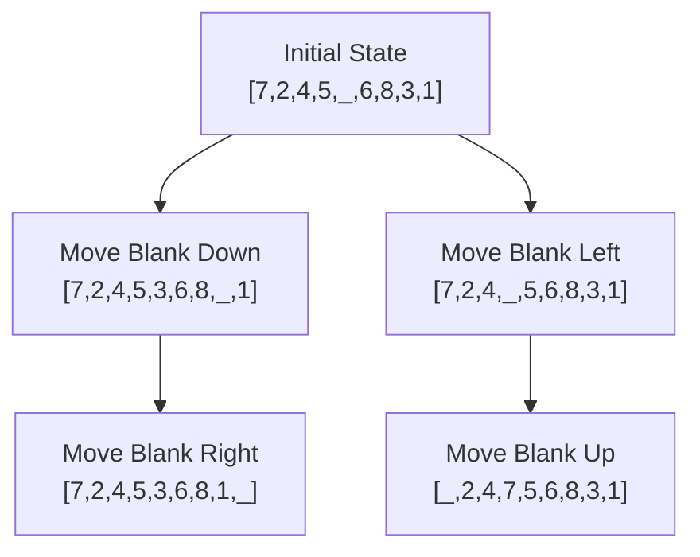
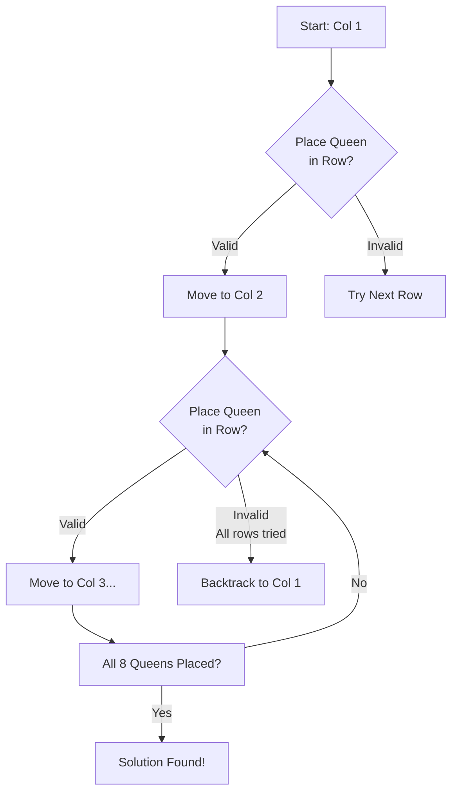
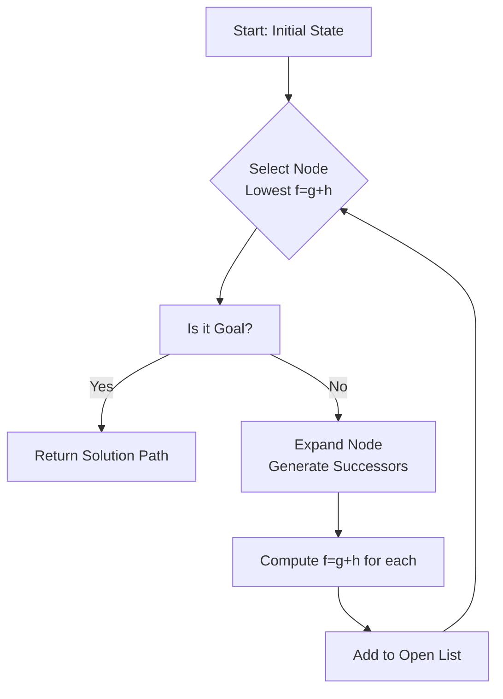
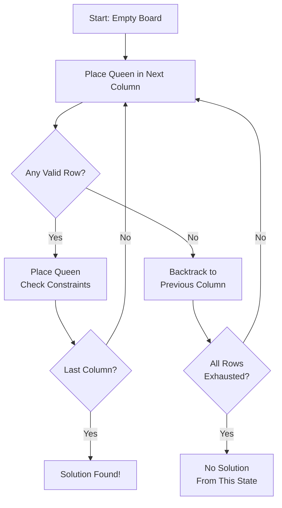
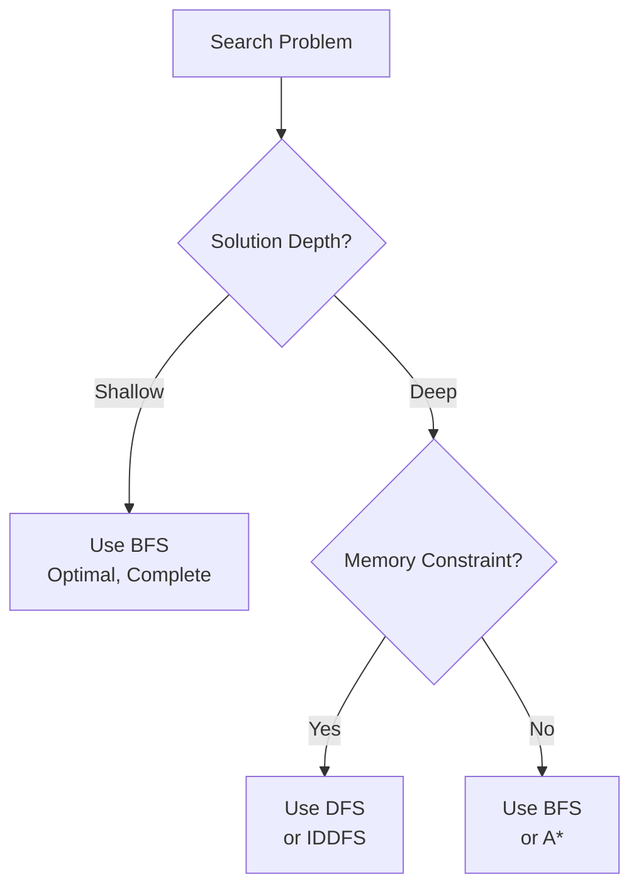
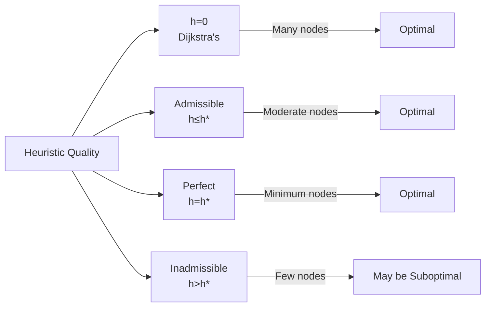
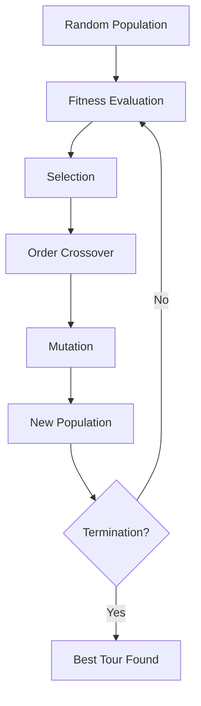
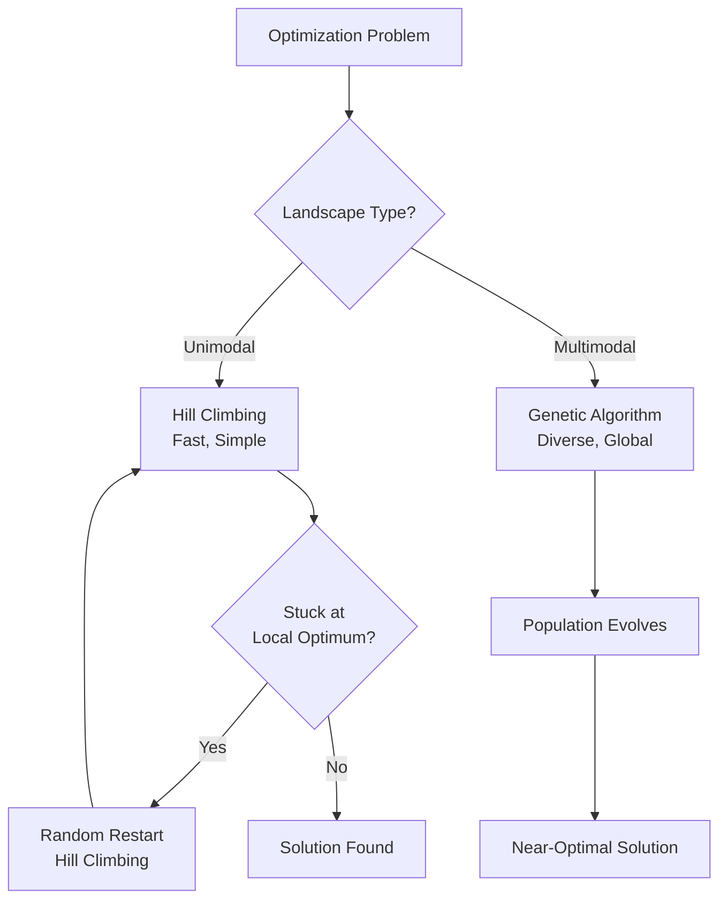
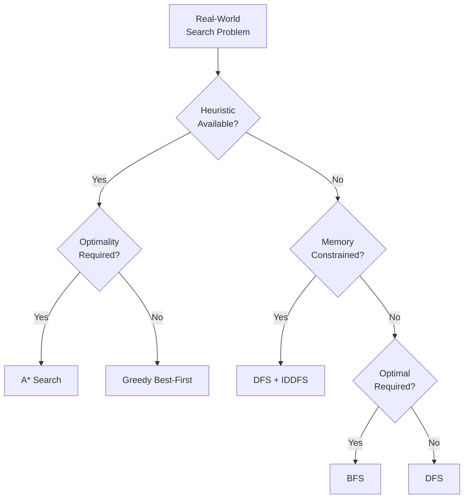

# AIDS Solved QB – Module 5
## Search Algorithms & AI Problem Solving

---

## 2-Mark Questions

### Q1. Explore the concept of state space representation in the 8-puzzle problem and identify its key elements.

The **8-puzzle** is a sliding tile puzzle on a 3×3 grid with 8 numbered tiles and one blank space. **State space** represents all possible tile configurations. Key elements: **Initial State** – the starting tile arrangement; **Goal State** – the desired arrangement (e.g., tiles 1–8 in order); **Operators** – valid moves (slide blank Up/Down/Left/Right); **State Space** – all reachable configurations (up to 9!/2 = 181,440 reachable states).

---

### Q2. Verify the constraints of the 8-Queens problem and check how they ensure no two queens attack each other.

The **8-Queens problem** places 8 queens on an 8×8 chessboard such that no two queens attack each other. Constraints: (1) **Row constraint** – at most one queen per row; (2) **Column constraint** – at most one queen per column; (3) **Diagonal constraint** – no two queens share a diagonal (|row₁ - row₂| ≠ |col₁ - col₂|). Together, these three constraints eliminate all attacking configurations, ensuring a valid placement.

---

### Q3. Identify how nodes are expanded level by level in BFS and illustrate how it finds the shortest path.

**Breadth-First Search (BFS)** uses a **queue (FIFO)** to expand all nodes at depth d before moving to depth d+1. It starts at the root, visits all neighbors, then their neighbors, and so on. Because all edge costs are assumed equal (unweighted), the first time BFS reaches the goal node, it has found the **shortest path** (fewest edges). Example: In a maze, BFS guarantees the minimum number of steps to reach the exit.

---

### Q4. Examine the working of Depth First Search (DFS) and explain why it may fail to find optimal solutions.

**DFS** uses a **stack (LIFO)** and explores as deep as possible along one path before backtracking. It may fail to find optimal solutions because: (1) it can get trapped in deep or infinite branches, never reaching the goal; (2) it returns the **first** solution found, not necessarily the shortest; (3) in infinite state spaces, DFS may loop forever without a visited-state check. It is **incomplete** in infinite search spaces.

---

### Q5. Distinguish the role of heuristic functions in A* search and describe how they influence efficiency and optimality.

In **A* search**, the heuristic function **h(n)** estimates the cost from node n to the goal. A* selects nodes with the lowest **f(n) = g(n) + h(n)**, where g(n) is the actual cost from start to n. **Influence on efficiency:** A good heuristic prunes irrelevant branches, drastically reducing nodes explored. **Influence on optimality:** If h(n) is **admissible** (never overestimates true cost), A* is guaranteed to find the optimal solution. Example: Manhattan distance heuristic for 8-puzzle.

---

### Q6. Implement the concept of hill climbing to explain iterative improvement and describe one situation where it gets stuck.

**Hill Climbing** is a local search algorithm that iteratively moves to the neighboring state with the highest value (highest "hill"). At each step: evaluate all neighbors, move to the best neighbor if it improves the objective, otherwise stop. **Local Optimum Problem:** If all neighbors have lower values than the current state, hill climbing stops — even if a globally better solution exists elsewhere. Example: Stuck at a local peak in a multi-peak landscape, never reaching the global maximum.

---

### Q7. Analyze the role of the fitness function in genetic algorithms and explain how it helps in selecting better solutions.

In **Genetic Algorithms (GA)**, the **fitness function** evaluates how well each solution (chromosome) solves the problem. It assigns a fitness score — higher is better. During **selection**, chromosomes with higher fitness scores have a greater probability of being chosen for reproduction (crossover and mutation). This mimics natural selection: "survival of the fittest." Example: In the TSP, fitness = 1 / total_route_distance — shorter routes have higher fitness and are more likely to produce offspring.

---

## 5-Mark Questions

### Q8. Solve the 8-puzzle using state space formulation and illustrate how operators transform the initial state toward the goal state.

**State Space Formulation for the 8-Puzzle:**

**Initial State:**
```
7 | 2 | 4
5 | _ | 6
8 | 3 | 1
```

**Goal State:**
```
1 | 2 | 3
4 | 5 | 6
7 | 8 | _
```

**Formal Definitions:**
- **State:** Any arrangement of 8 numbered tiles + 1 blank in a 3×3 grid.
- **Initial State:** The given starting configuration.
- **Goal State:** Tiles arranged in ascending order left-to-right, top-to-bottom with blank at bottom-right.
- **Operators (Actions):** Move blank tile Up, Down, Left, or Right (if within grid bounds).
- **State Space:** All configurations reachable from initial state — up to 181,440 states (half of 9! = 362,880 are reachable from any given state).
- **Path Cost:** Each move costs 1 (uniform cost).

**Sample Operator Application:**

Step 1 (Move blank Left):
```
7 | 2 | 4       7 | 2 | 4
5 | _ | 6  →   5 | 3 | 6
8 | 3 | 1       8 | _ | 1
```
Wait — correcting: Move blank Down:
```
7 | 2 | 4       7 | 2 | 4
5 | _ | 6  →   5 | 3 | 6
8 | 3 | 1       8 | _ | 1
```

**How Representation Affects Search Efficiency:**
- A compact state representation (flat array vs. 2D matrix) reduces memory overhead.
- A good heuristic (Manhattan Distance: sum of each tile's distance from its goal position) guides A* efficiently.
- Manhattan distance for the initial state = h = 18 (estimated moves). A* explores far fewer states than BFS/DFS.



---

### Q9. Conceptualize the 8-Queens problem and how constraints eliminate invalid solutions using backtracking.

**Problem Formulation:**
Place 8 queens on an 8×8 chessboard such that no two queens share a row, column, or diagonal.

**Backtracking Approach:**

Backtracking places queens column by column (one per column), checking constraints at each placement.

**Algorithm:**
1. Start with column 1. Try placing queen in row 1.
2. Move to column 2. Try each row; skip rows that violate constraints.
3. Continue until either all 8 queens are placed (success) or no valid row exists (backtrack to previous column).

**Constraint Check:**
For queen at (row_i, col_i) and (row_j, col_j):
- Same row: row_i == row_j → invalid
- Same diagonal: |row_i - row_j| == |col_i - col_j| → invalid

**Example Trace (First few steps):**
```
Col 1: Place queen at row 1.  [Q,_,_,_,_,_,_,_]
Col 2: Row 1 blocked (same row); Row 2 blocked (diagonal). Place at row 3.
Col 3: Row 1 blocked; Row 3 blocked (same row); Row 2 blocked (diagonal). Try row 5.
...
```

**Why Better Than Brute Force:**
- Brute force: 8^8 = 16,777,216 combinations to check.
- Backtracking with constraints: Prunes entire branches whenever a partial placement violates a constraint. Typical solutions found after evaluating only ~2,000 nodes.

**Total Valid Solutions:** 92 distinct solutions exist for the 8-Queens problem.



---

### Q10. Configure BFS to a simple graph problem and illustrate step-by-step node expansion. Why does BFS guarantee optimal solutions in unweighted graphs?

**Graph:**
```
A -- B -- D
|         |
C -- E -- F
```
Goal: Find shortest path from A to F.

**BFS Step-by-Step:**

| Step | Queue (FIFO) | Visited | Action |
|------|------------|---------|--------|
| 0 | [A] | {} | Start |
| 1 | [B, C] | {A} | Expand A → enqueue B, C |
| 2 | [C, D, E] | {A,B} | Expand B → enqueue D, E |
| 3 | [D, E] | {A,B,C} | Expand C → E already queued |
| 4 | [E, F] | {A,B,C,D} | Expand D → enqueue F |
| 5 | [F] | {A,B,C,D,E} | Expand E → F already queued |
| 6 | Goal! | {A,B,C,D,E,F} | F found! |

**Path:** A → B → D → F (3 edges)

**Why BFS Guarantees Optimality in Unweighted Graphs:**

BFS explores all nodes at depth d before depth d+1. Since all edges have equal cost (1), the first time BFS reaches the goal, it has used the minimum number of edges. No shorter path can exist at a deeper level.

- **Completeness:** BFS always finds a solution if one exists (finite graph).
- **Optimality:** Guaranteed for uniform cost (unweighted) graphs.
- **Time Complexity:** O(b^d) where b = branching factor, d = depth of solution.
- **Space Complexity:** O(b^d) — must store entire frontier; major weakness for deep solutions.

---

### Q11. Analyze DFS by applying it to a problem graph and explain situations where it may fail.

Using the same graph as Q10:

**DFS Step-by-Step (Stack - LIFO):**

| Step | Stack | Visited | Path |
|------|-------|---------|------|
| 0 | [A] | {} | A |
| 1 | [C, B] | {A} | Push neighbors of A |
| 2 | [C, D] | {A,B} | Pop B, push D |
| 3 | [C, F] | {A,B,D} | Pop D, push F |
| 4 | Goal! | {A,B,D,F} | F found via A→B→D→F |

**When DFS Fails:**

**1. Infinite Loops (without visited tracking):**
In a cyclic graph, DFS may revisit nodes endlessly: A→B→A→B... without ever reaching the goal.

**2. Non-Optimal Solutions:**
DFS found A→B→D→F (3 hops). But A→C→E→F also has 3 hops. In a weighted graph, DFS might find a longer path first and return it as the answer.

**3. Incomplete in Infinite State Spaces:**
Without depth limits, DFS may explore infinitely deep branches and never backtrack to find the goal on a shallower branch.

**Failure Situations:**
- Cyclic graphs without visited-state tracking.
- Very deep or infinite state spaces.
- When an optimal (shortest/lowest-cost) solution is required.

**Improvement:** **Iterative Deepening DFS (IDDFS)** combines DFS's space efficiency with BFS's optimality by progressively increasing depth limits.

---

### Q12-Q14. A* search on pathfinding, TSP formulation, and Hill Climbing on optimization.

**Q12 — A* Search:**

**Problem:** Find shortest path from S to G in a weighted graph with heuristic estimates.

```
S --2-- A --3-- G
|               |
--4--- B --1----
```
h(S)=5, h(A)=3, h(B)=2, h(G)=0

| Step | Open List (f=g+h) | Selected | g | h | f |
|------|-----------------|----------|---|---|---|
| 1 | {S(5)} | S | 0 | 5 | 5 |
| 2 | {A(5), B(6)} | A | 2 | 3 | 5 |
| 3 | {G(5), B(6)} | G | 5 | 0 | 5 |

Path: S→A→G, cost = 5. A* found optimal path efficiently.

**Q13 — Travelling Salesman Problem:**

**Formulation:** Given n cities and distances between each pair, find the shortest tour visiting each city exactly once and returning to start.

- **State:** Current city + set of unvisited cities.
- **Goal:** All cities visited, return to start.
- **Example (4 cities: A,B,C,D):** Evaluate: A→B→C→D→A (cost=25), A→B→D→C→A (cost=31), etc.
- **Exact methods limitation:** O(n!) time complexity — infeasible for n>20.
- **Heuristics:** Nearest Neighbor (greedy), 2-opt improvement.
- **GA/Metaheuristics:** Near-optimal solutions in polynomial time.

**Q14 — Hill Climbing:**

**Problem:** Maximize f(x) = -x² + 6x (peak at x=3).

| Iteration | Current x | f(x) | Neighbors f(x±0.1) | Move |
|-----------|-----------|------|---------------------|------|
| 1 | x=0 | 0 | f(0.1)=0.59 | → x=0.1 |
| 2 | x=0.1 | 0.59 | f(0.2)=1.16 | → x=0.2 |
| ... | ... | ... | ... | ... |
| 30 | x=3.0 | 9.0 | f(2.9)=8.99, f(3.1)=8.99 | Stop (local max) |

Hill climbing successfully converged to x=3 (global max here). But on multi-modal functions, it gets trapped at local maxima with no improvement in any direction, terminating prematurely.

---

## 10-Mark Questions

### Q15. Define the complete problem formulation of the 8-puzzle. Evaluate how heuristic techniques improve solution efficiency.

**Introduction:**
The 8-puzzle is a classic AI problem used to study search strategies, heuristics, and problem representation. A precise problem formulation is the foundation for any effective solution.

**Complete Problem Formulation:**

**1. State:**
A 3×3 grid configuration represented as a tuple or matrix of 9 values (8 tiles numbered 1–8 and one blank '_').

```
Initial State:        Goal State:
2 | 8 | 3            1 | 2 | 3
1 | 6 | 4    →       4 | 5 | 6
7 | _ | 5            7 | 8 | _
```

**2. Initial State:**
The given starting arrangement of tiles. Example: [2,8,3,1,6,4,7,_,5].

**3. Goal State:**
[1,2,3,4,5,6,7,8,_] — tiles arranged in order with blank at bottom-right.

**4. Actions (Operators):**
Slide a tile into the blank space — equivalently, move the blank:
- Move blank **Up**: Swap blank with tile directly above.
- Move blank **Down**: Swap blank with tile directly below.
- Move blank **Left**: Swap blank with tile to the left.
- Move blank **Right**: Swap blank with tile to the right.
- Precondition: Move is valid only if blank is not at the respective boundary.

**5. Transition Model:**
`Result(state, action)` → new state after applying the action. Example:
Result([2,8,3,1,_,4,7,6,5], MoveBlankRight) = [2,8,3,1,4,_,7,6,5]

**6. Goal Test:**
`state == [1,2,3,4,5,6,7,8,_]` → True means goal reached.

**7. Path Cost:**
Each move costs 1. Total cost = number of moves from initial to goal state.

**State Space Size:**
- Total permutations: 9! = 362,880
- Only half are reachable from any given state: 181,440 reachable states.

**Heuristic Techniques for Improved Efficiency:**

**1. Misplaced Tiles Heuristic (h₁):**
Count the number of tiles not in their goal position (excluding blank).
- Example: If 5 tiles are misplaced → h₁ = 5.
- **Admissible:** Each misplaced tile needs at least 1 move → h₁ never overestimates.
- **Quality:** Simple but weak — ignores distance to goal position.

**2. Manhattan Distance Heuristic (h₂):**
Sum of Manhattan distances of each tile from its goal position.
- `h₂ = Σ |row_current - row_goal| + |col_current - col_goal|` for each tile.
- Example: Tile 8 at position (0,1), goal (2,1) → contribution = |0-2| + |1-1| = 2.
- **Admissible:** Tiles cannot "jump" — each unit of Manhattan distance requires at least one move.
- **Quality:** Stronger than h₁ — dominates it (h₂ ≥ h₁ always).

**3. Linear Conflict Heuristic (h₃):**
Adds extra moves for tiles in correct row/column but in wrong relative order.
- If tile A and tile B are both in their goal row but A is to the right of B when A's goal is to the left of B's goal → at least 2 extra moves needed.
- h₃ = h₂ + 2 × number of linear conflicts.
- **Quality:** Strongest admissible heuristic of the three.

**Performance Comparison:**

| Heuristic | Nodes Explored (typical) | Effective Branching Factor |
|-----------|-------------------------|--------------------------|
| BFS (no heuristic) | ~181,000 | ~2.67 |
| A* with h₁ | ~1,300 | ~1.45 |
| A* with h₂ | ~400 | ~1.24 |
| A* with h₃ | ~150 | ~1.12 |



**Conclusion:**
The 8-puzzle's complete problem formulation — states, operators, goal test, and path cost — provides the framework. Heuristics transform the search from exhaustive (exponential time) to intelligent (near-linear), making even difficult puzzle configurations solvable in milliseconds. Manhattan distance is the practical standard; linear conflict is used when maximum efficiency is required.

---

### Q16. Justify the 8-Queens problem using backtracking and constraint satisfaction. Evaluate efficiency and scalability for larger board sizes.

**Introduction:**
The 8-Queens problem is a classic Constraint Satisfaction Problem (CSP) that beautifully illustrates the power of backtracking and constraint propagation.

**Constraint Satisfaction Problem (CSP) Formulation:**

- **Variables:** Q₁, Q₂, ..., Q₈ (queen in column i is placed in row Q_i)
- **Domain:** {1, 2, 3, 4, 5, 6, 7, 8} (possible rows for each queen)
- **Constraints:**
  - All-Different: Q_i ≠ Q_j for all i ≠ j (no same row)
  - Diagonal: |Q_i - Q_j| ≠ |i - j| for all i ≠ j (no same diagonal)

**Backtracking Algorithm:**

```
function BACKTRACK(assignment):
    if assignment is complete:
        return assignment
    Q = select unassigned variable (next column)
    for each row r in domain of Q:
        if row r is consistent with assignment:
            assign Q = r
            result = BACKTRACK(assignment)
            if result ≠ failure: return result
            remove Q = r from assignment
    return failure
```

**Step-by-Step Trace (8×8):**

| Column | Placed Row | Notes |
|--------|-----------|-------|
| 1 | Row 1 | Initial try |
| 2 | Row 3 | Rows 1,2 blocked |
| 3 | Row 5 | Rows 1,2,3,4 blocked |
| 4 | Row 7 | Rows 1–6 blocked |
| 5 | Row 2 | Rows 1,3,4,5,6,7,8 blocked → backtrack? |
| ... | ... | Continues until first valid solution found |

**First Valid Solution:** [1, 5, 8, 6, 3, 7, 2, 4]

```
Q _ _ _ _ _ _ _
_ _ _ _ Q _ _ _
_ _ _ _ _ _ _ Q
_ _ _ _ _ Q _ _
_ _ Q _ _ _ _ _
_ _ _ _ _ _ Q _
_ Q _ _ _ _ _ _
_ _ _ Q _ _ _ _
```

**Efficiency Analysis:**

Without backtracking (brute force): 8^8 = 16,777,216 configurations to check.
With backtracking: ~2,000 nodes explored to find first solution.
**Efficiency ratio:** 8,000× improvement.

**Enhancement: Forward Checking:**
After placing each queen, immediately remove conflicting rows from the domains of remaining columns. If any column's domain becomes empty → backtrack immediately without further exploration.

**Enhancement: Minimum Remaining Values (MRV):**
Select the column with the fewest valid rows remaining as the next variable — reduces branching factor.

**Scalability Analysis:**

| Board Size | Solutions | Backtracking Nodes | Brute Force |
|-----------|---------|-------------------|------------|
| 4×4 | 2 | ~16 | 256 |
| 8×8 | 92 | ~2,000 | 16.7M |
| 16×16 | ~14,772,512 | Millions | 10^19 |
| 100×100 | Astronomical | FC+MRV needed | Infeasible |



**Scalability Conclusion:**
Backtracking is efficient for n ≤ 20. For larger boards, pure backtracking becomes impractical without enhancements. Combined with forward checking, MRV, and arc consistency (AC-3), n-Queens can be solved efficiently for n up to several hundred. For extremely large n (>1000), Las Vegas randomized algorithms and neural network approaches are used.

---

### Q17. Evaluate BFS and DFS on a given graph and perform a detailed comparative analysis based on completeness, optimality, and complexity.

**Introduction:**
BFS and DFS are the two fundamental uninformed search strategies. Their comparative analysis reveals fundamental trade-offs between time, space, and solution quality.

**Test Graph:**
```
        A
       / \
      B   C
     / \   \
    D   E   F
   /         \
  G           H (Goal)
```

**BFS Execution:**
Queue: [A] → [B,C] → [C,D,E] → [D,E,F] → [E,F,G] → [F,G] → [G,H] → H found!
Path: A → C → F → H (depth 3)

**DFS Execution:**
Stack: [A] → [B,C] → [C,D,E] → [C,D] → [C,G] → [C] → [F] → [H]
Path: A → B → D → G → backtrack → A → C → F → H (also depth 3 but different traversal)

**Detailed Comparative Analysis:**

**1. Completeness:**
- **BFS:** Complete — will find a solution if one exists in a finite graph. Even in infinite graphs with finite branching factor.
- **DFS:** Incomplete in infinite state spaces or cyclic graphs (without visited tracking). With visited tracking: complete in finite graphs.

**2. Optimality:**
- **BFS:** Optimal for unweighted (uniform cost) graphs — first solution found is shallowest (minimum hops).
- **DFS:** Not optimal — may find a solution at depth d=10 when a solution exists at depth d=2 depending on branching order.

**3. Time Complexity:**
- **BFS:** O(b^d) where b = branching factor, d = depth of shallowest solution.
- **DFS:** O(b^m) where m = maximum depth of search tree. If m >> d, DFS explores far more nodes.
- For tree above: b=2, d=3 → BFS explores ~14 nodes; DFS explores up to ~15 nodes (similar for this graph, but diverges significantly for deeper trees).

**4. Space Complexity:**
- **BFS:** O(b^d) — must store entire frontier (all nodes at current depth). Major weakness.
- **DFS:** O(b×m) — only stores current path + siblings. Linear space! Major advantage.

**5. Practical Scenarios:**
- **BFS preferred when:** Solution is near the root; optimal solution required; memory is not a constraint.
- **DFS preferred when:** Solution is deep in the tree; memory is limited; completeness/optimality are not critical.

**Summary Table:**

| Property | BFS | DFS |
|----------|-----|-----|
| Completeness | Yes (finite graphs) | No (infinite); Yes (finite, with visited tracking) |
| Optimality | Yes (uniform cost) | No |
| Time Complexity | O(b^d) | O(b^m) |
| Space Complexity | O(b^d) | O(b·m) |
| Strategy | Queue (FIFO) | Stack (LIFO) |
| Best For | Shallow solutions | Deep solutions, memory-limited |



**IDDFS — Best of Both:**
Iterative Deepening DFS (IDDFS) combines BFS's optimality with DFS's space efficiency by running DFS with increasing depth limits (1, 2, 3, ...). Time complexity: O(b^d); Space: O(b×d). Preferred in practice when solution depth is unknown.

**Conclusion:**
BFS and DFS occupy opposite ends of the time-space trade-off. Neither is universally superior — the right choice depends on problem characteristics: solution depth, graph size, memory availability, and whether an optimal solution is required. IDDFS often provides the best balance in practice.

---

### Q18. Explore A* search on a real-world pathfinding problem and explain how different heuristic functions influence performance and optimality.

**Introduction:**
A* is the most widely used informed search algorithm, combining the path cost from start (g) with a heuristic estimate to goal (h) to guide search efficiently. Its performance is critically dependent on the choice of heuristic.

**Real-World Problem: City Navigation**

Find the shortest driving route from City S to City G.

**Graph:**
```
S --4-- A --3-- G
|       |       |
2       1       5
|       |       |
B --6-- C --2-- D
```
Straight-line (Euclidean) distances to G: h(S)=7, h(A)=3, h(B)=8, h(C)=5, h(D)=2, h(G)=0

**A* Execution:**

| Step | Open List (node: f=g+h) | Closed | Selected |
|------|------------------------|--------|----------|
| 1 | S(0+7=7) | {} | S |
| 2 | A(4+3=7), B(2+8=10) | {S} | A (tie-break) |
| 3 | G(7+0=7), C(5+5=10), B(10) | {S,A} | G |

**Path:** S→A→G, cost = 7. Optimal!

**Heuristic Function Comparison:**

**1. h=0 (Zero Heuristic → Uniform Cost Search / Dijkstra's):**
- Explores nodes purely by actual cost g(n).
- Finds optimal solution but explores many unnecessary nodes.
- Nodes explored: All nodes reachable with cost ≤ optimal cost.

**2. h = Euclidean Distance (Admissible):**
- Straight-line distance to goal. Never overestimates (shortest possible path is straight line).
- Highly efficient — prunes many irrelevant branches.
- Guarantees optimal solution.

**3. h = Manhattan Distance (Admissible for grid graphs):**
- Sum of horizontal + vertical distances. Appropriate for grid-based navigation.
- Better than Euclidean for grid-constrained movement (diagonal movement not allowed).

**4. h = Overestimating Heuristic (Inadmissible):**
- e.g., h = 2 × Euclidean distance.
- Faster search (fewer nodes explored) but **may not find optimal solution**.
- Useful when speed is more important than optimality (bounded suboptimal search).

**Impact of Heuristic Quality:**

| Heuristic | Nodes Explored | Optimality | Speed |
|-----------|---------------|-----------|-------|
| h=0 | Many | Yes | Slow |
| Admissible (h ≤ h*) | Moderate | Yes | Moderate |
| Perfect (h = h*) | Minimum | Yes | Fastest |
| Inadmissible (h > h*) | Few | No | Fastest |



**A* Optimality Proof (informal):**
If h is admissible, when A* expands goal node G, its f(G) = g(G) + h(G) = g(G) (since h(G)=0). Any unexplored node n has f(n) = g(n) + h(n) ≥ g(n) ≥ cost of optimal path through n ≥ g(G). Therefore, no unexplored path can be cheaper than the path A* found.

**Conclusion:**
A*'s power lies in its heuristic. An admissible, tight heuristic transforms it from a brute-force search into an intelligent, near-direct pathfinder. In real-world navigation (Google Maps, GPS), sophisticated heuristics combining Euclidean distance with road speed limits enable A* to plan routes across millions of nodes in milliseconds.

---

### Q19. Assess suitable AI techniques for the Travelling Salesman Problem. Justify your approach.

**Introduction:**
The Travelling Salesman Problem (TSP) asks: given n cities and distances between each pair, find the shortest route that visits each city exactly once and returns to the starting city. It is NP-hard — no polynomial-time exact solution is known.

**Problem Formulation:**
- **State:** Current city + ordered list of visited cities.
- **Initial State:** Starting at city 1.
- **Goal State:** All n cities visited, returned to city 1.
- **Cost:** Total route distance.

**Why Exact Methods Fail at Scale:**
- n=10: 10!/2 = 1.8 million routes → feasible.
- n=20: 20!/2 ≈ 10^18 routes → infeasible.
- n=100: Astronomically large — no computer can enumerate all routes.

**AI Technique 1: Nearest Neighbor Heuristic (Greedy)**

Start at a city; always travel to the closest unvisited city.
- **Time Complexity:** O(n²)
- **Quality:** 20–25% above optimal on average.
- **Justification:** Extremely fast; good starting solution for refinement.

**AI Technique 2: 2-Opt Local Search**

Iteratively improve a tour by reversing segments:
- Remove 2 edges; reconnect in the only other valid way.
- Accept if new tour is shorter.
- Repeat until no improvement.
- **Quality:** Usually within 5% of optimal.
- **Justification:** Simple refinement that dramatically improves greedy solutions.

**AI Technique 3: Genetic Algorithm (Best for Large n)**

```
1. Initialize population of random tours (chromosomes).
2. Evaluate fitness (1 / tour_length) for each chromosome.
3. Select parents via tournament selection.
4. Apply Order Crossover (OX) to produce offspring tours.
5. Mutate (swap two random cities) with small probability.
6. Replace worst members with offspring.
7. Repeat for N generations.
```

- **Encoding:** Each chromosome = permutation of city indices.
- **Crossover (OX):** Preserve relative order of one parent's segment in offspring.
- **Quality:** Within 1–3% of optimal for n=100; scalable to n=1000.
- **Justification:** Explores a diverse solution space via evolution; escapes local optima via crossover and mutation; balances exploration and exploitation.



**AI Technique 4: Ant Colony Optimization (ACO)**

Simulates ant behavior — virtual ants deposit pheromone on shorter paths; pheromone evaporates over time.
- Shorter routes accumulate more pheromone → more ants follow them.
- Self-reinforcing mechanism converges toward near-optimal routes.
- **Quality:** Competitive with GA for TSP; especially effective for dynamic problems.

**Recommendation:**
For n < 50: 2-opt after Nearest Neighbor. For n = 50–500: Genetic Algorithm. For n > 500: ACO or hybrid metaheuristic.

**Justification for GA:**
GA is recommended as the primary approach because it: (1) naturally handles the permutation encoding of TSP; (2) escapes local optima via crossover; (3) scales effectively; (4) has well-established TSP-specific crossover operators (OX, PMX). The combination of GA + 2-opt refinement typically yields solutions within 2% of optimal for practical TSP instances.

---

### Q20. Analyze hill climbing and genetic algorithms for solving optimization problems. Compare their performance, advantages, and limitations.

**Introduction:**
Hill climbing and genetic algorithms represent two fundamentally different approaches to optimization: local search vs. population-based evolutionary search. Their comparison illuminates the trade-offs between simplicity, speed, and solution quality.

**Hill Climbing:**

A local search that iteratively moves to the best neighboring solution.

```
current = initial_solution
while True:
    best_neighbor = best solution in neighborhood(current)
    if quality(best_neighbor) ≤ quality(current):
        return current  # local optimum reached
    current = best_neighbor
```

**Genetic Algorithms:**

A population-based search inspired by natural evolution.

```
population = initialize_random(size=N)
for each generation:
    fitness = evaluate(population)
    parents = selection(population, fitness)
    offspring = crossover(parents)
    offspring = mutate(offspring)
    population = replacement(population, offspring)
return best individual
```

**Performance Comparison:**

| Dimension | Hill Climbing | Genetic Algorithm |
|-----------|-------------|------------------|
| Solution Space | Single current solution | Population of N solutions |
| Exploration | Local neighborhood only | Global via crossover/mutation |
| Exploitation | Strong (greedy best move) | Moderate |
| Local Optima | Gets stuck | Escapes via crossover/mutation |
| Convergence Speed | Very fast (few iterations) | Slower (many generations) |
| Solution Quality | Good for unimodal | Better for multimodal |
| Computational Cost | O(n × neighborhood size) | O(generations × N × evaluation) |
| Parameter Tuning | Minimal | Population size, crossover/mutation rates |

**Advantages:**

Hill Climbing:
- Extremely fast and simple.
- Works well for smooth, unimodal landscapes.
- Easy to implement and debug.
- Good for local refinement of near-optimal solutions.

Genetic Algorithm:
- Explores multiple regions of solution space simultaneously.
- Escapes local optima via genetic operators.
- Naturally parallel — each chromosome evolves independently.
- Handles complex, multimodal, non-differentiable objective functions.
- Finds near-optimal solutions for NP-hard problems.

**Limitations:**

Hill Climbing:
- Gets permanently stuck at local optima (simple hill climbing).
- Performance depends heavily on starting point.
- Not effective for multimodal landscapes with many local optima.

Genetic Algorithm:
- No guarantee of finding global optimum.
- Many hyperparameters to tune (population size, crossover rate, mutation rate).
- Computationally expensive for large populations.
- Premature convergence if diversity is lost.

**Scenario Comparison:**

| Problem Type | Winner | Reason |
|-------------|--------|--------|
| Smooth unimodal (single peak) | Hill Climbing | Reaches peak directly; GA wastes time exploring |
| Multimodal (many peaks) | GA | Explores globally; escapes local maxima |
| Large-scale (TSP, job scheduling) | GA | Scales better; quality degrades less |
| Real-time (needs instant answer) | Hill Climbing | Fast convergence |
| Combinatorial (permutations) | GA | Natural encoding; crossover preserves structure |



**Hybrid Approach:**
Many practical systems use GA for global exploration followed by hill climbing for local refinement — combining the global search strength of GA with the speed of hill climbing for final optimization.

**Conclusion:**
Hill climbing and GAs are complementary tools. Hill climbing is ideal for fast, local optimization of simple problems. GAs excel at global exploration of complex, multimodal search spaces. The choice depends on the problem's landscape complexity, required solution quality, available computation budget, and time constraints.

---

### Q21. Compare and contrast informed and uninformed search techniques using BFS, DFS, and A*. Justify selection for real-world problems.

**Introduction:**
Search algorithms are the backbone of AI problem-solving. The key distinction between uninformed and informed search lies in the use of domain knowledge (heuristics) to guide the search.

**Uninformed Search — No Heuristic Knowledge:**

**BFS (Breadth-First Search):**
- Expands nodes level by level.
- Guaranteed to find optimal solution (unweighted graphs).
- High memory requirements: O(b^d).

**DFS (Depth-First Search):**
- Explores deep paths first.
- Memory efficient: O(b×m).
- Not optimal; may not terminate in infinite spaces.

**Informed Search — Uses Heuristic Knowledge:**

**A* Search:**
- Uses f(n) = g(n) + h(n).
- With admissible heuristic: optimal and complete.
- Dramatically reduces nodes explored compared to BFS.
- Memory: O(b^d) in worst case, but heuristic makes worst case rare.

**Comprehensive Comparison:**

| Property | BFS | DFS | A* |
|----------|-----|-----|----|
| Uses Heuristic | No | No | Yes |
| Complete | Yes | No (infinite)| Yes |
| Optimal | Yes (uniform) | No | Yes (admissible h) |
| Time | O(b^d) | O(b^m) | O(b^d) but smaller d due to heuristic |
| Space | O(b^d) | O(b·m) | O(b^d) |
| Knowledge Required | None | None | h(n) estimate needed |
| Implementation | Simple | Simple | Moderate |

**Real-World Problem Justifications:**

**1. Google Maps / GPS Navigation → A***
- Millions of road network nodes; need optimal (shortest/fastest) route.
- Euclidean distance heuristic guides search efficiently.
- A* with bidirectional search finds routes in milliseconds.
- **Justification:** Optimality and efficiency are both critical; heuristic is available.

**2. Maze Solving Robot (Simple maze) → BFS**
- Guaranteed shortest path; uniform movement cost.
- Maze is finite; BFS will always find goal.
- **Justification:** No domain knowledge for heuristic; optimality required; manageable memory.

**3. Game Tree Search (Chess endgame) → DFS + Alpha-Beta Pruning**
- Need to explore deep move sequences.
- Memory constraints prevent BFS/A*.
- **Justification:** Deep solutions; memory efficiency prioritized; alpha-beta pruning handles non-optimality.

**4. Logistics Route Optimization (Many cities) → A* + Heuristics**
- TSP-like problem with geographic structure.
- Straight-line distance provides admissible heuristic.
- **Justification:** Scale requires heuristic guidance; optimality valued.

**5. Web Crawling (Find target page) → BFS**
- Want to find target page with minimum clicks from start.
- No useful heuristic available (content unpredictable).
- **Justification:** BFS finds minimum-depth solution; no heuristic applicable.



**Conclusion:**
The selection of a search algorithm is a function of four key factors: (1) whether a useful heuristic is available, (2) whether an optimal solution is required, (3) the depth and breadth of the search space, and (4) available memory. A* dominates when heuristics are available and optimality matters. BFS is the safe default for finite, uniform-cost problems. DFS and IDDFS serve memory-constrained scenarios. Real-world AI systems often combine multiple strategies — for example, hierarchical A* for large-scale navigation or Monte Carlo Tree Search for game-playing — to achieve the best balance of speed, quality, and scalability.
