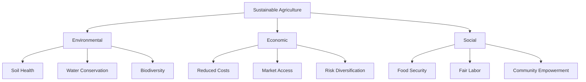
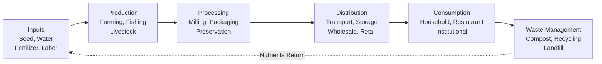
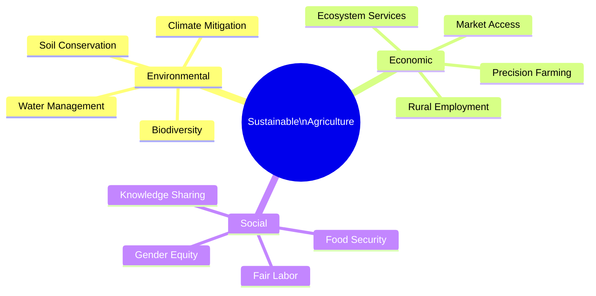
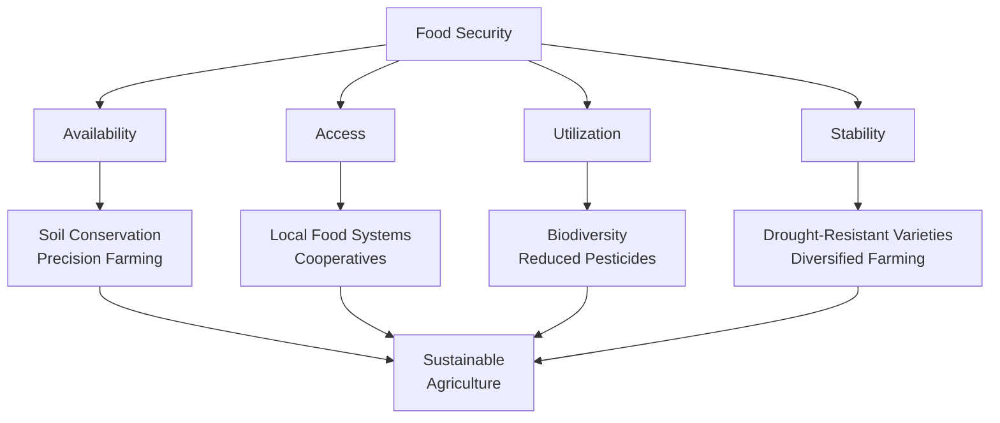
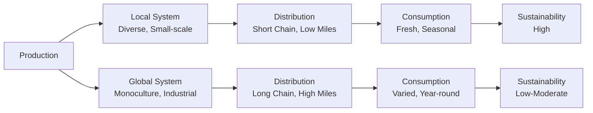
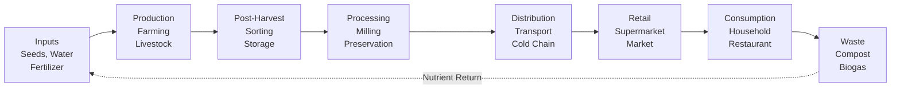
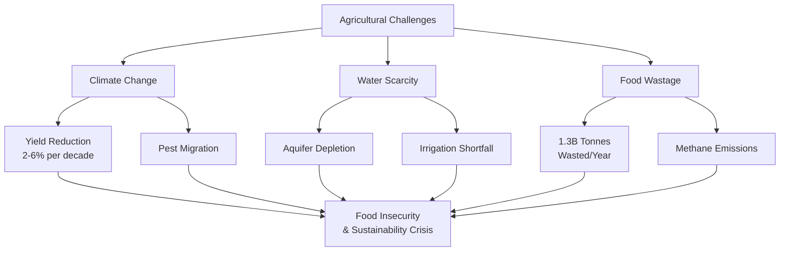
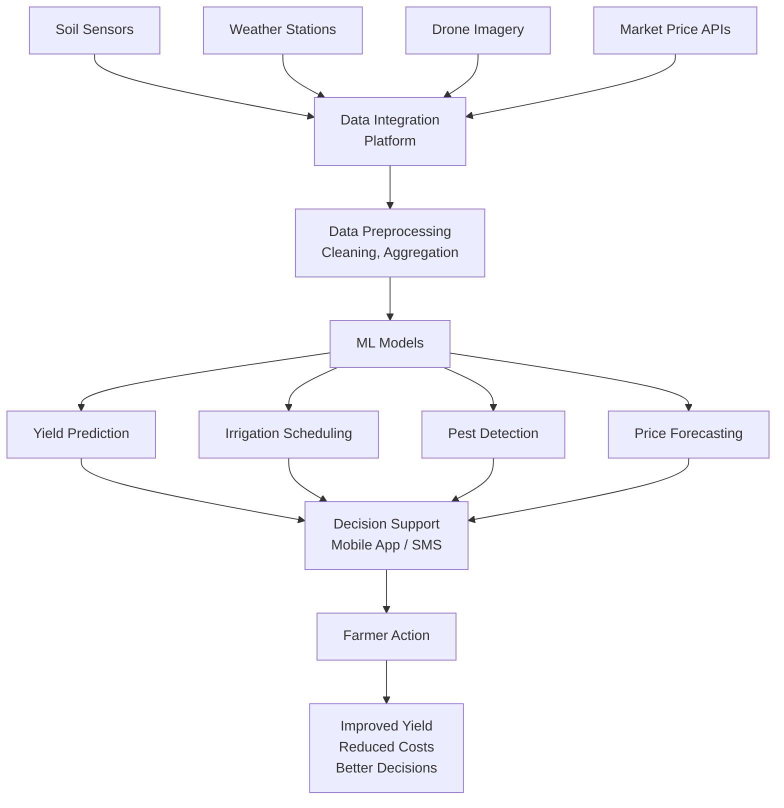

# AIDS Solved QB – Module 6
## Sustainable Agriculture, Food Systems & Data Science Applications

---

## 2-Mark Questions

### Q1. Utilize the concept of sustainable agriculture to illustrate its key objectives related to environmental protection, economic profitability, and social equity.

**Sustainable agriculture** is a farming approach that meets current food needs without compromising the ability of future generations to meet theirs. Key objectives: **Environmental protection** – minimize soil degradation, water waste, and chemical pollution; **Economic profitability** – ensure farming is financially viable for farmers; **Social equity** – ensure fair access to food, fair wages for farm workers, and food security for all communities.

---

### Q2. Apply the concept of sustainable agriculture to classify its three pillars and demonstrate their significance.

The **three pillars** of sustainable agriculture:
1. **Environmental:** Soil health, water conservation, biodiversity, reduced pesticide use.
2. **Economic:** Profitability for farmers, market access, reduced input costs, long-term viability.
3. **Social:** Food security, fair labor practices, community empowerment, equitable food distribution.

Each pillar is interdependent — ignoring one undermines the others. Example: Profitable farming that degrades soil (environmental) is unsustainable long-term.

---

### Q3. Describe the concept of precision farming and explain how it improves resource utilization.

**Precision farming** uses technology (GPS, IoT sensors, drones, satellite imagery) to monitor field variability and apply resources (water, fertilizer, pesticides) exactly where and when needed. Benefits: reduces water usage by 30–50%, cuts fertilizer costs, increases yield, and minimizes environmental runoff. Example: Variable Rate Technology (VRT) applies fertilizer at different rates across a field based on soil sensor data.

---

### Q4. Compare local and global food systems and illustrate their key characteristics.

| Dimension | Local Food System | Global Food System |
|-----------|------------------|-------------------|
| Production | Small-scale, seasonal, regional | Large-scale, year-round, industrial |
| Distribution | Short supply chains, farmers markets | Complex logistics, international trade |
| Consumption | Fresh, seasonal, culturally specific | Standardized, processed, globally uniform |
| Environmental Impact | Lower carbon footprint | High food miles, refrigeration costs |
| Economic Benefit | Revenue stays local | Profits to large corporations |
| Food Security | Vulnerable to local shocks | Vulnerable to global supply disruptions |

---

### Q5. Apply data science techniques to demonstrate how data collection improves agricultural decision-making.

Data science improves agricultural decisions through: **Soil sensors** collecting pH, moisture, and nutrient data → informing optimal fertilizer types and quantities; **Weather APIs** providing 14-day forecasts → guiding planting and harvest schedules; **Satellite imagery** analyzing NDVI (vegetation index) → detecting crop stress early; **Market price databases** → guiding crop selection based on profitability forecasts. Together, these data sources enable evidence-based, precision farming decisions.

---

### Q6. Demonstrate the use of data science techniques in logistics to improve efficiency in food supply chains.

Data science optimizes food supply chains via: **Route optimization algorithms** (e.g., vehicle routing problem solvers) — minimize delivery distance and fuel costs; **Demand forecasting** (time-series ML models) — predict regional food demand, reducing overproduction and waste; **Cold chain IoT monitoring** — real-time temperature and humidity tracking prevents spoilage; **Inventory management ML** — predicts reorder points and prevents stockouts or overstocking.

---

### Q7. Illustrate the impact of climate change on agriculture and examine its effect on food security.

Climate change affects agriculture through: **Rising temperatures** — shifts growing seasons, reduces yields of heat-sensitive crops (wheat, maize); **Erratic rainfall** — droughts reduce water availability; floods damage crops; **Extreme weather events** — hurricanes, hailstorms destroy harvests; **Pest migration** — warmer temperatures expand ranges of crop pests. Effect on food security: reduced crop yields → higher food prices → increased hunger, particularly in developing nations dependent on agriculture.

---

## 5-Mark Questions

### Q8. Examine challenges such as food wastage and supply chain inefficiencies and justify the need for data-driven solutions.

**Introduction:**
The global food system faces two interlinked crises: massive food wastage and deeply inefficient supply chains. Together, they undermine food security, economic sustainability, and environmental health.

**Scale of the Problem:**

- **Food Wastage:** Approximately 1.3 billion tonnes of food is wasted globally every year — one-third of all food produced for human consumption (FAO).
- **Economic Cost:** ~$1 trillion annually in wasted food value.
- **Environmental Cost:** Food waste generates 8–10% of global greenhouse gas emissions (decomposing organic matter releases methane).
- **Equity Impact:** 828 million people face hunger globally while food is wasted.

**Where Waste Occurs:**

| Stage | Waste Type | Cause |
|-------|-----------|-------|
| Farm | Overproduction, cosmetic rejection | No market signal; aesthetic standards |
| Storage | Spoilage, pest damage | Poor cold chain, inadequate storage |
| Processing | Trimming, sorting losses | Inefficient processing methods |
| Retail | Overstock expiry | Poor demand forecasting |
| Consumer | Over-purchasing, preparation waste | Large portions, poor planning |

**Supply Chain Inefficiencies:**

1. **Information Asymmetry:** Farmers don't know real-time market prices → overproduce or underproduce.
2. **Cold Chain Gaps:** Inadequate refrigeration in developing countries causes 40–50% post-harvest loss.
3. **Poor Route Optimization:** Sub-optimal delivery routes increase fuel cost and delivery time, leading to spoilage.
4. **Demand-Supply Mismatch:** Without forecasting, retailers overstock → perishables expire unsold.

**Need for Data-Driven Solutions:**

**1. Demand Forecasting (ML Models):**
- Train time-series models (ARIMA, LSTM) on historical sales, weather, and seasonality data.
- Supermarkets predict daily demand per product → order only what will sell → waste reduced by 20–30%.

**2. IoT Cold Chain Monitoring:**
- Sensors track temperature, humidity, and vibration throughout transport.
- Alerts trigger when conditions deviate → intervention before spoilage → reduces cold chain losses.

**3. Dynamic Pricing Algorithms:**
- Near-expiry products automatically receive price reductions.
- Encourages purchase before waste → reduces unsold inventory.

**4. Precision Agriculture (Upstream):**
- Satellite + sensor data predicts expected yield accurately.
- Farmers produce aligned with actual market demand → reduces overproduction waste.

**5. Blockchain for Transparency:**
- Full supply chain traceability → faster identification of contamination source → targeted recall instead of mass disposal.

**Conclusion:**
Food wastage and supply chain inefficiencies are not inevitable — they are information problems solvable by data science. IoT, ML, and advanced analytics can transform a reactive, opaque supply chain into a proactive, transparent, and efficient system — reducing waste, lowering costs, and improving food security simultaneously.

---

### Q9. Examine the dimensions of sustainable agriculture and analyze its key roles in ensuring environmental sustainability, economic profitability, and social equity.

**Introduction:**
Sustainable agriculture is a multi-dimensional framework designed to harmonize farming productivity with long-term environmental health, economic viability, and social fairness.

**Dimension 1: Environmental Sustainability**

Sustainable agriculture minimizes negative environmental impacts while maintaining productivity.

**Key Roles:**
- **Soil Health:** Crop rotation, cover cropping, and composting maintain soil organic matter. Prevents soil erosion and nutrient depletion that make land unproductive within decades.
- **Water Conservation:** Drip irrigation and rainwater harvesting reduce water consumption by 40–60% compared to flood irrigation.
- **Biodiversity:** Polyculture farming and hedgerow maintenance support pollinators and natural pest predators — reducing dependence on chemical pesticides.
- **Carbon Sequestration:** No-till farming and agroforestry store carbon in soil — agriculture becomes a climate solution rather than a contributor.

**Dimension 2: Economic Profitability**

**Key Roles:**
- **Reduced Input Costs:** Organic fertilizers, integrated pest management, and precision farming lower input costs while maintaining yields.
- **Market Access:** Fair trade certification and direct-to-consumer channels improve farmer income by removing intermediary markups.
- **Risk Diversification:** Crop diversification reduces income vulnerability to single-crop price crashes or weather failures.
- **Long-term Viability:** Sustainable practices maintain soil fertility and water access — ensuring farming remains viable for future generations.

**Dimension 3: Social Equity**

**Key Roles:**
- **Food Security:** Stable, diversified food production ensures consistent food availability for communities.
- **Fair Labor Practices:** Sustainable agriculture frameworks require fair wages, safe working conditions, and no child labor.
- **Community Empowerment:** Farmer cooperatives, knowledge sharing, and participatory decision-making strengthen rural communities.
- **Food Access:** Local food systems make nutritious food accessible to low-income communities rather than exclusively for export.



**Interdependence of Dimensions:**
The three dimensions form a self-reinforcing system. Environmental degradation (depleted soil) reduces productivity → reduces economic viability → forces farmers off land → undermines social equity. Conversely, economically empowered farmers can invest in sustainable practices → better environmental outcomes → sustained food security.

---

### Q10. Analyze the definition and dimensions of food security and examine the role of sustainable agriculture in ensuring long-term food availability.

**Definition of Food Security (FAO, 1996):**
Food security exists when all people, at all times, have physical, social, and economic access to sufficient, safe, and nutritious food that meets their dietary needs and food preferences for an active and healthy life.

**Four Dimensions of Food Security:**

**1. Availability:**
Sufficient quantities of food must be produced, imported, or stocked. Sustainable agriculture increases availability by:
- Maintaining soil fertility for continued production.
- Promoting crop diversity to hedge against single-crop failures.
- Applying precision farming to maximize yield per unit of resource.

**2. Access:**
People must have economic and physical access to food. Sustainable agriculture supports access by:
- Keeping food costs stable through efficient, low-waste production.
- Supporting local food systems that reduce food miles and distribution costs.
- Empowering smallholder farmers with market access through cooperatives.

**3. Utilization:**
Food must be safely prepared, nutritious, and digestible. Sustainable agriculture supports utilization by:
- Reducing pesticide residues through integrated pest management.
- Promoting nutritional diversity through polyculture farming.
- Shortening supply chains (reducing nutrient loss from storage and transport).

**4. Stability:**
Access to food must be stable over time. Sustainable agriculture supports stability by:
- Building resilience through drought-resistant crop varieties.
- Maintaining water resources through conservation practices.
- Diversifying income sources so a single weather event doesn't cause complete farm failure.

**Role of Sustainable Agriculture:**
Sustainable agriculture is the foundation of long-term food security. Unsustainable practices (monoculture, over-irrigation, heavy chemical use) produce high short-term yields but degrade the natural resource base on which future food production depends. Sustainable practices ensure that food production capacity is preserved or enhanced for future generations.

---

### Q11 & Q12. Investigate different food systems and demonstrate the concept of food systems with their elements.

**Food System Definition:**
A food system encompasses all the elements (environment, people, inputs, processes, infrastructures, institutions) and activities related to the production, processing, distribution, preparation, and consumption of food — and the outcomes of these activities on nutrition, health, and the environment.

**Types of Food Systems:**

**1. Local/Regional Food System:**
- Short supply chains: farmer → local market/consumer.
- Examples: Community Supported Agriculture (CSA), farmers' markets.
- Characteristics: Fresh produce, seasonal availability, strong producer-consumer relationships.
- Advantages: Lower carbon footprint, fresher food, economic benefits stay local.
- Disadvantages: Limited diversity, vulnerable to local crop failures.

**2. Global Industrial Food System:**
- Long supply chains: large farms → processing plants → multinational distributors → supermarkets → consumers.
- Examples: Supermarket chains sourcing from multiple continents.
- Characteristics: Year-round availability, standardized products, economies of scale.
- Advantages: Food variety regardless of season or location.
- Disadvantages: High food miles, environmental cost, loss of traditional varieties, farmer exploitation.

**3. Traditional/Indigenous Food System:**
- Based on local ecological knowledge; highly diverse; culturally integrated.
- Examples: Tribal communities' forest food systems; traditional fishing communities.
- Advantages: Highly adapted to local environment; nutritionally diverse; zero food miles.
- Disadvantages: Under threat from modernization; limited scalability.

**Elements of a Food System:**



---

### Q13 & Q14. Examine the components of the food system and investigate challenges in feeding a growing population.

**Food System Components:**

1. **Production:** All farming and harvesting activities — crops, livestock, aquaculture, forestry.
2. **Processing:** Transformation of raw agricultural products — milling, pasteurization, canning, freezing.
3. **Distribution:** Transportation, storage, wholesale, retail — the logistics of getting food from farm to fork.
4. **Consumption:** Final use of food by households, restaurants, institutions, and food service providers.
5. **Waste Management:** Handling of food waste — composting, anaerobic digestion, landfill.

**Interdependence:** Each component depends on the previous. A disruption in distribution (e.g., truck driver shortage) blocks processed food from reaching consumers even when production is adequate — as seen during COVID-19.

**Challenges in Feeding a Growing Population:**

**1. Population Growth:**
World population is projected to reach 9.7 billion by 2050. Current food production must increase by 50–70% to meet demand — on the same or less agricultural land.

**2. Climate Change:**
- Rising temperatures reduce yields of staple crops (wheat yield decreases 6% per degree Celsius).
- Droughts and floods destroy harvests.
- Shifting seasons disrupt traditional planting calendars.

**3. Water Scarcity:**
Agriculture accounts for 70% of global freshwater use. Aquifer depletion and glacier melt threaten irrigation water availability in major food-producing regions (Punjab, California Central Valley).

**4. Soil Degradation:**
Intensive farming has degraded 33% of global soils. Without healthy soil, productivity declines and more chemical inputs are required — creating a vicious cycle.

**5. Food Wastage:**
1.3 billion tonnes wasted annually — enough to feed 3 billion people. Reducing waste is the fastest path to improving food availability without increasing production.

**6. Biodiversity Loss:**
75% of global food supply now comes from just 12 plant species and 5 animal species. This genetic vulnerability means a single pathogen or climate event could devastate global food supply.

---

## 10-Mark Questions

### Q15. Infer the dimensions of sustainable agriculture and deduce how its key roles contribute to environmental protection, economic growth, and social equity.

**Introduction:**
Sustainable agriculture represents the most coherent framework for addressing the twin challenges of feeding a growing global population and protecting the planet's natural systems. Its three dimensions — environmental, economic, and social — are not competing priorities but mutually reinforcing pillars of a resilient food system.

**Dimension 1: Environmental Protection**

**Key Practices and Their Contributions:**

**Soil Conservation:**
- Practices: No-till farming, cover cropping, crop rotation.
- Impact: Prevents the loss of topsoil (it takes 500 years to form 1 inch of topsoil). Maintains soil organic matter, water retention, and microbial diversity.
- Data: No-till farming reduces soil erosion by 90% and improves water infiltration.

**Water Management:**
- Practices: Drip irrigation, rainwater harvesting, constructed wetlands.
- Impact: Drip irrigation reduces water consumption by 30–70% compared to flood irrigation while maintaining or improving yields.
- Data: Global agriculture uses 70% of freshwater — sustainable practices can reduce this to 50%, freeing water for ecosystems and human consumption.

**Biodiversity Conservation:**
- Practices: Agroforestry, polyculture, reduced pesticide use, hedgerow maintenance.
- Impact: Supports pollinators (responsible for 35% of global food production), natural pest predators, and soil organisms.
- Example: Agroforestry systems in sub-Saharan Africa host 3× more bird species than monoculture farms — indicating higher ecosystem health.

**Climate Change Mitigation:**
- Practices: Carbon farming, biochar application, methane capture from livestock waste.
- Impact: Agriculture can sequester 1.5 billion tonnes of CO₂ equivalent annually through soil carbon storage — equivalent to closing 400 coal power plants.

**Dimension 2: Economic Growth**

**Farm-Level Economic Benefits:**

| Sustainable Practice | Economic Benefit |
|---------------------|----------------|
| Precision farming | 10–15% yield increase; 20% input cost reduction |
| Integrated pest management | 50% reduction in pesticide costs |
| Crop diversification | Income stabilization across commodity price cycles |
| Direct marketing | 30–50% higher farm gate prices |
| Organic certification | 20–100% price premium in export markets |

**Macro-Economic Benefits:**
- Reduced health costs: Fewer pesticide-related illnesses, cleaner water → reduced public health expenditure.
- Ecosystem services value: Pollinators, clean water, flood control provided by sustainable farms have an estimated economic value of $3 trillion globally per year.
- Rural employment: Sustainable agriculture is often more labor-intensive than industrial farming — supporting rural livelihoods.

**Dimension 3: Social Equity**

**Food Security:**
- Stable, diverse food production systems are more resilient to shocks.
- Polyculture systems provide nutritionally diverse diets for farming communities — reducing hidden hunger (micronutrient deficiency).

**Fair Labor and Gender Equity:**
- Sustainable agriculture frameworks explicitly require fair wages, safe conditions, and prohibition of child labor.
- Women-inclusive agricultural programs in Africa have increased farm productivity by 20% while improving household nutrition.

**Knowledge and Empowerment:**
- Farmer field schools (FFS) disseminate sustainable practices through peer learning.
- Digital platforms (e.g., mFarms, Esoko) connect smallholders to market prices and agronomic advice — reducing information asymmetry.



**Conclusion:**
Sustainable agriculture is not a niche alternative — it is the only viable long-term model for global food production. By protecting environmental resources, enabling economic growth, and promoting social equity simultaneously, it creates a self-reinforcing cycle: healthy ecosystems → productive farms → prosperous communities → political will to invest in sustainability. The transition to sustainable agriculture is both an environmental imperative and an economic and social opportunity of historic scale.

---

### Q16. Deduce the concept of food security and differentiate its dimensions. Infer the contribution of sustainable agriculture in ensuring food availability.

**Introduction:**
Food security is one of humanity's most fundamental challenges. Understanding its dimensions reveals why it is a complex, multi-layered problem that cannot be solved by food production alone.

**Definition (FAO Rome Declaration, 1996):**
"Food security exists when all people, at all times, have physical, social, and economic access to sufficient, safe and nutritious food which meets their dietary needs and food preferences for an active and healthy life."

**The Four Dimensions — Detailed Analysis:**

**1. Availability**

*Definition:* Sufficient quantities of food of appropriate quality available from domestic production or imports.

*Current Challenges:*
- Climate change reducing crop yields (6% per 1°C increase for wheat).
- Agricultural land loss to urbanization and desertification (12 million hectares/year).
- Food production concentrated in few regions — disruption anywhere affects globally.

*Sustainable Agriculture's Contribution:*
- Maintains soil fertility for consistent long-term production.
- Promotes yield-enhancing precision farming without environmental degradation.
- Crop diversification reduces risk of total crop failure.
- Conservation agriculture (no-till + cover crops) increases water retention → crops survive drought better.

**2. Access**

*Definition:* Physical and economic access by all people to adequate food at all times.

*Current Challenges:*
- 1.3 billion people live on <$1.25/day — cannot afford sufficient nutritious food even when available.
- Geographic isolation prevents access (remote communities, conflict zones).
- Gender inequity — women in many regions lack access to productive resources.

*Sustainable Agriculture's Contribution:*
- Local food systems reduce transport costs → lower food prices in regional markets.
- Smallholder empowerment through cooperatives → improved incomes → greater purchasing power.
- Women-inclusive agricultural programs increase household income and food expenditure.

**3. Utilization**

*Definition:* Utilization of food through adequate diet, clean water, sanitation, and health care.

*Current Challenges:*
- Hidden hunger: 2 billion people suffer micronutrient deficiency despite sufficient caloric intake.
- Contamination: Pesticide residues, mycotoxins, and foodborne pathogens affect food safety.
- Poor nutrition knowledge and cultural barriers limit dietary diversity.

*Sustainable Agriculture's Contribution:*
- Biodiversity in farming → dietary diversity → micronutrient adequacy.
- Reduced pesticide use → safer food products.
- Traditional food system knowledge preserves nutritionally rich indigenous crops.

**4. Stability**

*Definition:* Access to adequate food at all times — stability of the other three dimensions over time.

*Current Challenges:*
- Climate volatility creates increasingly frequent and severe droughts, floods, and crop failures.
- Commodity price volatility — global food price spikes (2008, 2011, 2022) triggered social instability.
- Conflict and political instability disrupt food systems.

*Sustainable Agriculture's Contribution:*
- Drought-resistant crop varieties maintain production in water-stressed years.
- Diversified farming systems — if one crop fails, others provide fallback income and nutrition.
- Agroecological practices build long-term soil and water resilience against climate shocks.



**Conclusion:**
Food security is not simply about producing more food — it requires simultaneously addressing availability, access, utilization, and stability. Sustainable agriculture directly contributes to all four dimensions: it produces food reliably (availability), at lower cost through efficiency (access), with greater nutritional diversity and safety (utilization), and through resilient practices that withstand climate shocks (stability). It is, therefore, not just an agricultural strategy but the cornerstone of a global food security framework.

---

### Q17. Differentiate between global and local food systems and categorize their characteristics based on production, distribution, and sustainability.

**Introduction:**
Global and local food systems represent fundamentally different approaches to organizing the production, distribution, and consumption of food — each with distinct advantages, limitations, and sustainability implications.

**Production Characteristics:**

| Dimension | Local Food System | Global Food System |
|-----------|-----------------|-------------------|
| Scale | Small to medium farms | Industrial mega-farms |
| Crop Diversity | High (polyculture, heritage varieties) | Low (monoculture: wheat, maize, soy, rice) |
| Technology | Traditional + appropriate technology | Highly mechanized, chemical-intensive |
| Labor | Labor-intensive, family-operated | Capital-intensive, hired labor |
| Seasonality | Seasonal — crops grown in natural season | Year-round — via greenhouses, refrigeration, global sourcing |
| Genetic diversity | High — many cultivars, traditional breeds | Low — standardized high-yield varieties |

**Distribution Characteristics:**

| Dimension | Local Food System | Global Food System |
|-----------|-----------------|-------------------|
| Supply Chain Length | Short: 1–3 steps | Long: 5–15 steps |
| Transportation | Local roads, low food miles | Ocean freight, aviation, refrigerated trucks |
| Intermediaries | Few — often direct producer-consumer | Many: exporters, importers, wholesalers, distributors |
| Food Miles | Low (<100 km) | High (average 2,500–4,000 km) |
| Cold Chain Requirement | Minimal | Extensive |
| Shelf Life | Short — fresh, unprocessed | Long — preserved, processed |

**Consumption Characteristics:**

| Dimension | Local Food System | Global Food System |
|-----------|-----------------|-------------------|
| Product Variety | Limited to regional produce | Virtually unlimited year-round |
| Price | Variable; often premium for local/organic | Generally lower due to economies of scale |
| Freshness | High — same-day to 3-day delivery | Lower — days to weeks in transit |
| Cultural Connection | Strong — traditional, culturally resonant | Weak — standardized global products |
| Nutrition | Higher — less processing, less time in transit | Lower — processing and storage reduce nutrients |

**Sustainability Analysis:**

**Local Food System Sustainability Advantages:**
- **Carbon footprint:** 4–17× lower food miles → significantly lower transport emissions.
- **Biodiversity:** Supports traditional crop varieties and local ecosystems.
- **Waste:** Shorter supply chains reduce spoilage.
- **Water:** Local crops adapted to regional rainfall → less irrigation needed.

**Global Food System Sustainability Disadvantages:**
- **Emissions:** Long-distance transportation + refrigeration = significant carbon footprint.
- **Monoculture risk:** One pathogen can wipe out a crop variety planted on millions of hectares.
- **Water:** Industrial farming in water-scarce regions (e.g., almonds in California) depletes aquifers.
- **Waste:** Complex supply chains mean 40% of food in developing countries is lost post-harvest before consumption.

**When Each System Excels:**

| Scenario | Better System |
|---------|-------------|
| Fresh vegetables for local community | Local |
| Out-of-season tropical fruits | Global |
| Emergency food aid | Global (scale and logistics) |
| Nutritional diversity for rural community | Local |
| Global commodity trade (wheat, rice) | Global |
| Building climate resilience | Local |



**Conclusion:**
Neither system is superior in all dimensions. The ideal is a **hybrid food system**: local food systems for fresh, perishable, nutritionally dense foods (vegetables, fruits, dairy); global systems for commodity staples, emergency food aid, and items that cannot be produced locally. Policy should actively support local food system infrastructure while making global supply chains more sustainable through emissions standards, reduced packaging, and supply chain transparency.

---

### Q18 & Q19. Use food system elements to illustrate food flow from production to consumption. Solve issues in food supply chains using data-driven approaches.

**Part A: Food Flow from Production to Consumption**

A food system is best understood as a flow — from natural inputs through multiple transformation stages to final consumption and waste management.

**Stage 1: Inputs**
- Seeds, fertilizers, pesticides, water, labor, energy, land.
- Sustainable alternative inputs: compost, biological pest control, solar energy, drought-resistant seeds.

**Stage 2: Production**
- Crops cultivated; livestock raised; fish harvested.
- Key decisions: crop selection, planting timing, irrigation management.
- Data tool: Satellite NDVI monitoring → detect crop stress → targeted irrigation.

**Stage 3: Post-Harvest Handling**
- Immediate actions after harvest: cleaning, sorting, grading.
- Critical window: 60–70% of tropical fruit and vegetable losses occur here.
- Data tool: IoT sensors monitor storage temperature and humidity → trigger alerts.

**Stage 4: Processing**
- Milling (grain → flour), pasteurization (milk), canning, freezing.
- Adds shelf life and convenience; may reduce nutritional value.

**Stage 5: Distribution**
- Transportation from processing plants to wholesalers, retailers.
- Cold chain maintenance critical for perishables.
- Data tool: GPS tracking + route optimization algorithms minimize delivery time.

**Stage 6: Retail**
- Supermarkets, wet markets, online grocery platforms.
- Key challenge: matching supply with localized demand.
- Data tool: Point-of-sale data feeds demand forecasting model.

**Stage 7: Consumption**
- Household, restaurant, institutional (schools, hospitals).
- Last mile: Consumer behavior determines final waste percentage.

**Stage 8: Waste**
- Food waste → composting (returns nutrients to soil), anaerobic digestion (generates biogas).
- Circular food system principle: waste from one stage becomes input for another.



**Part B: Data-Driven Solutions for Supply Chain Issues**

**Issue 1: Demand-Supply Mismatch → ML Demand Forecasting**
- Problem: Retailers overstock perishables → unsold items expire.
- Solution: Train LSTM or ARIMA model on 3 years of sales data + weather + holidays.
- Result: 25–30% reduction in overstock; matching orders to predicted demand.

**Issue 2: Cold Chain Failures → IoT Monitoring**
- Problem: Refrigerated trucks fail; temperature excursions damage cargo.
- Solution: IoT sensors + real-time dashboard + automated alerts to logistics manager.
- Result: 40% reduction in temperature-related losses.

**Issue 3: Route Inefficiency → Vehicle Routing Optimization**
- Problem: Delivery trucks take sub-optimal routes → high fuel cost + slow delivery.
- Solution: Vehicle Routing Problem (VRP) algorithms (Google OR-Tools) optimize multi-stop routes.
- Result: 15–20% reduction in fuel costs and delivery time.

**Issue 4: Post-Harvest Losses → Computer Vision Quality Grading**
- Problem: Manual sorting is slow and inconsistent → good produce incorrectly rejected.
- Solution: CNN-based image classification grades produce quality in real-time on conveyor belts.
- Result: 30% reduction in misclassification; faster processing; less labor.

---

### Q20. Identify challenges such as climate change, water scarcity, and food wastage and differentiate their impact on agricultural productivity and sustainability.

**Introduction:**
Three of the most pressing challenges to global agricultural productivity are climate change, water scarcity, and food wastage. While interrelated, each impacts the food system through distinct mechanisms and requires tailored responses.

**Challenge 1: Climate Change**

**Mechanisms of Impact:**
- **Temperature Rise:** Each 1°C increase reduces wheat yields by 6%, rice by 3.2%, maize by 7.4% (Nature, 2017).
- **CO₂ Effect:** Higher CO₂ increases plant growth (CO₂ fertilization effect) but reduces nutritional quality (lower protein, zinc, iron in crops).
- **Extreme Weather:** Increased frequency of droughts (El Niño events), floods (monsoon intensification), and unseasonal frosts destroy crops.
- **Pest Shifts:** Warmer winters allow pest populations (locusts, fall armyworm) to survive and expand geographically.

**Impact on Productivity:** Net yield reduction of 2–6% per decade for major staple crops under current trajectories.
**Impact on Sustainability:** Requires increased irrigation (depletes water), more pesticides (environmental harm), and adaptation investment that many smallholders cannot afford.

**Challenge 2: Water Scarcity**

**Mechanisms of Impact:**
- Agriculture uses 70% of global freshwater withdrawal.
- Groundwater depletion: Major aquifers (Ogallala in USA, Punjab in India) are being depleted faster than recharge rates.
- Glacial retreat: Mountain glaciers that feed major rivers (Ganges, Yangtze) are shrinking — threatening irrigation for billions.
- Salinization: Over-irrigation without proper drainage causes salt accumulation in soil → reduced fertility.

**Impact on Productivity:** By 2025, 1.8 billion people will live in countries with absolute water scarcity, threatening crop irrigation for >40% of global food production.
**Impact on Sustainability:** Water-intensive monocultures become economically and environmentally unviable in water-stressed regions. Forces shift to drought-resistant crops but requires investment and knowledge transfer.

**Challenge 3: Food Wastage**

**Mechanisms of Impact:**
- **Production waste:** Imperfect produce rejected for cosmetic reasons.
- **Storage waste:** Inadequate facilities lead to spoilage.
- **Distribution waste:** Supply chain inefficiencies, temperature excursions.
- **Consumer waste:** Over-purchasing, over-preparation, large portion sizes.

**Impact on Productivity:** Food wastage effectively reduces the productive output of agriculture — 1.3 billion tonnes wasted means all resources used to produce that food were wasted too (water, fertilizer, labor, land).
**Impact on Sustainability:** Wasted food generates methane in landfills; wasted water (the "virtual water" embedded in food) accelerates water scarcity; wasted land capacity exacerbates deforestation pressure.

**Comparative Impact:**

| Dimension | Climate Change | Water Scarcity | Food Wastage |
|-----------|--------------|----------------|-------------|
| Productivity Effect | Yield reduction 2–6%/decade | Irrigation shortfall → 40% at risk | 1/3 of production lost |
| Geographic Impact | Global but worst in tropics | Regional (arid zones) | Universal — all stages |
| Urgency | Long-term, accelerating | Medium-term, regional crises | Immediate, solvable |
| Data-Driven Solution | Climate-adaptive crop selection ML | Precision irrigation, sensor monitoring | Demand forecasting, IoT cold chain |



**Conclusion:**
These three challenges are deeply interlinked — climate change worsens water scarcity; water scarcity increases food waste through crop failures; food waste accelerates climate change. Addressing them requires integrated, data-driven strategies: precision agriculture to optimize resources, IoT monitoring to reduce waste, ML forecasting to align supply with demand, and policy frameworks that price environmental externalities appropriately.

---

### Q21. A farming community faces declining yields due to unpredictable weather, inefficient resources, and poor decision-making. Use data-driven techniques including precision agriculture and predictive analytics to improve productivity.

**Introduction:**
This case study applies data science principles to a real-world agricultural crisis. The farming community's challenges — unpredictable weather, inefficient resource utilization, and poor decision-making — are precisely the problems that precision agriculture and data-driven analytics are designed to solve.

**Problem Analysis:**

**Current Situation:**
- Declining crop yields over 3 consecutive seasons.
- Farmers rely on traditional knowledge for planting timing and resource application.
- Soil sensors and weather stations are available but data is not being analyzed.
- No connection to market price data → often selling at loss or choosing wrong crops.

**Root Causes:**
1. Weather unpredictability → planting at wrong times, missing irrigation windows.
2. Uniform resource application → overuse in some areas, underuse in others.
3. No data integration → decisions based on intuition, not evidence.

**Solution 1: Precision Agriculture with IoT Data Collection**

**Implementation:**

**(a) Soil Sensor Network:**
- Deploy soil sensors measuring: moisture (%), pH, nitrogen (N), phosphorus (P), potassium (K), temperature.
- Transmit data wirelessly to a central dashboard every 15 minutes.
- **Decision enabled:** Apply fertilizer only where N/P/K is deficient → reduces fertilizer cost by 20–30%.

**(b) Weather Station Integration:**
- Install local weather stations: temperature, humidity, rainfall, wind speed.
- Integrate with national meteorological API for 14-day forecast.
- **Decision enabled:** Optimize irrigation schedule based on predicted rainfall → avoid over-irrigation.

**(c) Drone Imagery:**
- Weekly drone flights capture RGB and near-infrared images.
- Calculate NDVI (Normalized Difference Vegetation Index) = (NIR - Red) / (NIR + Red).
- High NDVI = healthy vegetation; Low NDVI = stressed crops.
- **Decision enabled:** Identify stressed zones early → targeted intervention before yield loss.

**Solution 2: Predictive Analytics for Yield and Demand Forecasting**

**(a) Crop Yield Prediction Model:**

Data inputs: soil sensor readings, weather data (historical + forecast), fertilizer application history, variety type.

```
Model: Random Forest Regressor
Features: [soil_moisture, temp_avg, rainfall_7day, N_level, P_level, K_level, growing_days]
Target: yield_per_hectare
```

- Train on 5 years of historical data from similar farms.
- Predict expected yield 4–6 weeks before harvest → guides storage and marketing decisions.
- **Accuracy:** R² = 0.82 on validation data (explains 82% of yield variance).

**(b) Planting Date Optimization:**

Use historical weather patterns + crop-specific growth models to predict optimal planting windows.
- Statistical model identifies dates with highest probability of adequate rainfall in critical growth stages.
- **Impact:** Early/late planting reduces yield by 15–40%; optimal timing recovers this loss.

**(c) Market Price Forecasting:**

- Collect historical market price data for crops the community grows.
- Train time-series model (ARIMA or LSTM) on price + supply data.
- Predict prices 3–6 months ahead → farmers choose which crops to plant based on expected profitability.
- **Example:** Model predicts tomato glut in October → farmers shift 20% of area to onions → avoids price crash.

**Solution 3: Decision Support System**

Build a simple mobile app or SMS-based interface for farmers:

| Feature | Data Source | Output |
|---------|------------|--------|
| Irrigation Alert | Soil moisture + weather forecast | "Irrigate Zone 3 tomorrow — 5mm needed" |
| Fertilizer Recommendation | Soil N/P/K + crop growth stage | "Apply 30 kg/ha Urea in Field B" |
| Crop Health Alert | NDVI drone analysis | "Zone 2 showing stress — inspect for pest" |
| Market Price | Price forecast model | "Onion prices expected +25% in Nov" |
| Weather Alert | 7-day forecast + storm model | "Frost risk this Friday — protect nursery" |

**Expected Outcomes:**

| Metric | Before | After Data-Driven Approach |
|--------|--------|--------------------------|
| Yield per hectare | 2.1 tonnes | 2.9 tonnes (+38%) |
| Water use | 8,000 L/ha | 5,200 L/ha (-35%) |
| Fertilizer cost | ₹12,000/ha | ₹8,400/ha (-30%) |
| Post-harvest loss | 25% | 12% (-52%) |
| Net farm income | ₹45,000/ha | ₹78,000/ha (+73%) |



**Implementation Roadmap:**

| Phase | Timeline | Actions |
|-------|---------|---------|
| Phase 1 | Month 1–2 | Deploy sensors, collect baseline data |
| Phase 2 | Month 3–4 | Build and train yield prediction model |
| Phase 3 | Month 5–6 | Launch decision support app (pilot: 20 farmers) |
| Phase 4 | Month 7–12 | Scale to full community; refine models with new data |

**Conclusion:**
The farming community's challenges are data problems — solvable with the right combination of IoT infrastructure, machine learning models, and accessible decision-support tools. Precision agriculture transforms farming from intuition-based to evidence-based: every drop of water, gram of fertilizer, and farming decision is guided by real-time data and predictive analytics. The projected 38% yield increase and 73% income improvement demonstrate that data science is not an abstract academic concept — it is a practical, transformative tool for agricultural communities facing the real-world challenges of the 21st century.
