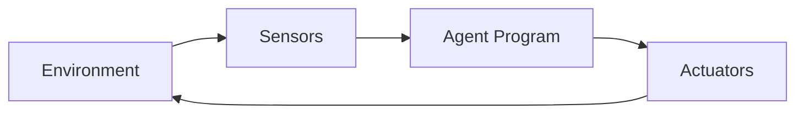
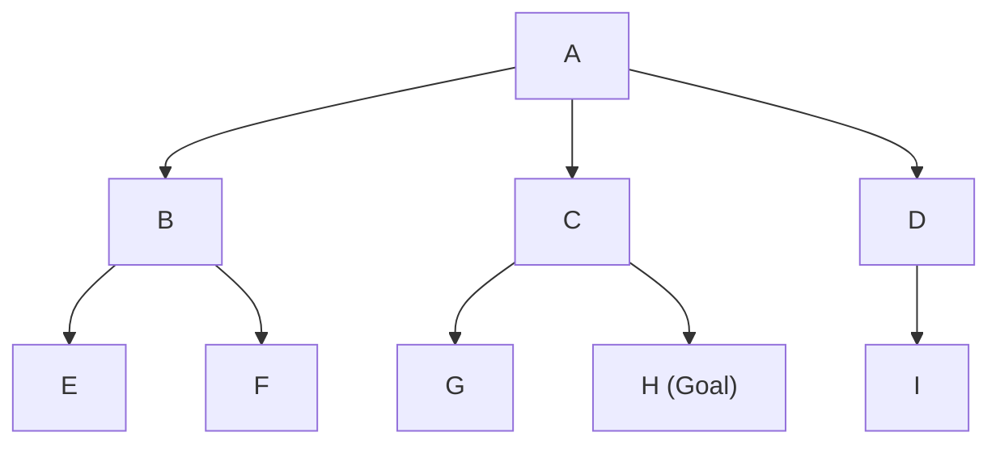
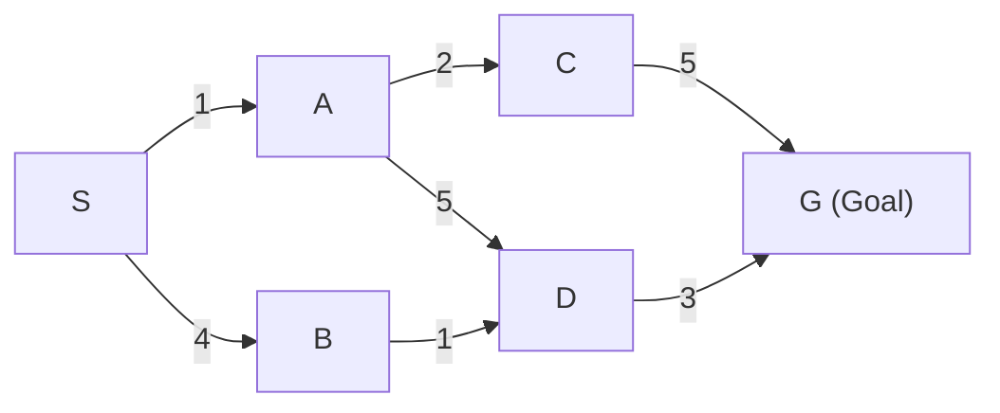
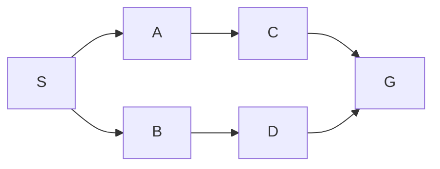
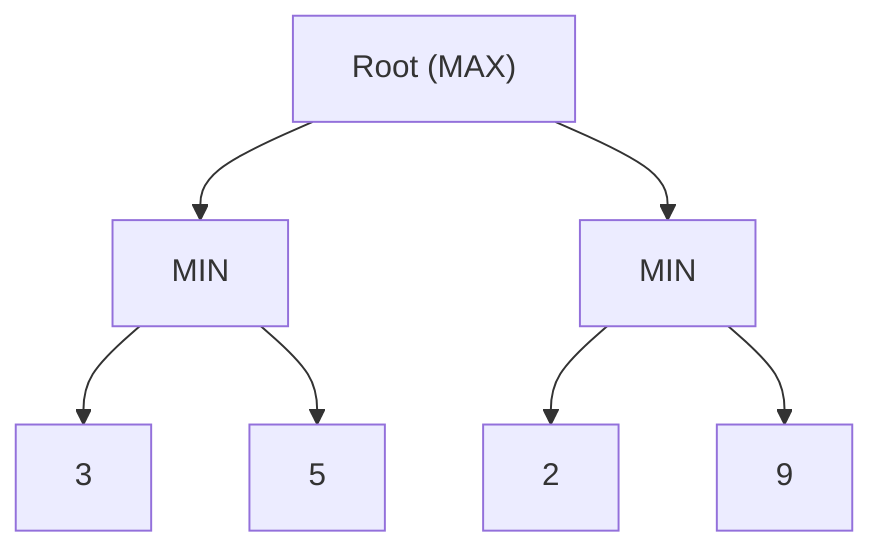
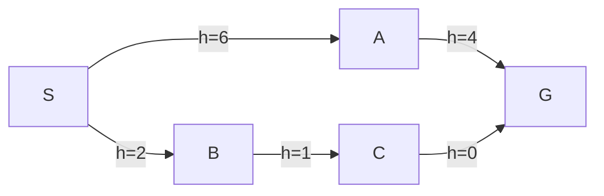
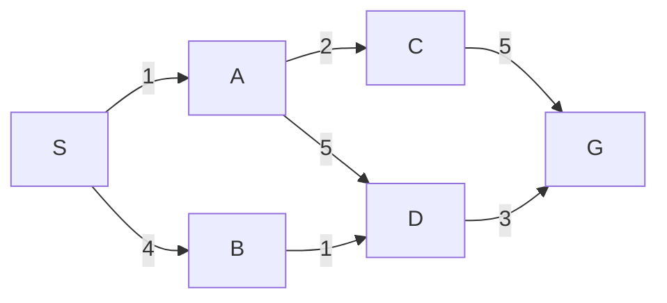

# Artificial Intelligence – Solved Numerical Notes

These notes focus on the **numerical / worked-out questions** commonly asked from the AI syllabus and solved question bank.  
Where the question bank may not have a direct numerical, a standard exam-style example is created so that **every important numerical type in the syllabus** is covered.

---

## Module 1: Introduction to AI & Intelligent Agents

Most questions in this module are conceptual, so there are very few true numericals.  
Still, the following two exam-style tasks are useful:

### 1.1 PEAS representation for an agent
**Question:** Represent an autonomous taxi using PEAS.

**Answer:**

- **Performance measure:** safety, legality, comfort, speed, fuel efficiency
- **Environment:** roads, traffic lights, pedestrians, passengers, weather
- **Actuators:** steering, accelerator, brake, horn, indicators, doors
- **Sensors:** cameras, GPS, radar, lidar, speedometer, microphones



### 1.2 Performance comparison idea
**Question:** If two agents complete the same route, one in 12 minutes and the other in 15 minutes, by what percentage is the faster agent quicker?

**Solution:**

Difference = 15 - 12 = 3 minutes

Percentage quicker = (3 / 15) × 100 = **20%**

**Final answer:** The faster agent is **20% quicker**.

---

## Module 2: Uninformed Search & Adversarial Search

---

### 2.1 Breadth First Search (BFS)

**Question:** Perform BFS on the following tree starting from A and find the order of expansion.



**Solution:**

BFS expands nodes level by level using a FIFO queue.

- Start: `A`
- Next level: `B, C, D`
- Next level: `E, F, G, H, I`

**Expansion order:**  
`A, B, C, D, E, F, G, H, I`

If the goal is `H`, BFS finds it when it reaches level 2.

**Final answer:**  
BFS order = **A → B → C → D → E → F → G → H → I**

---

### 2.2 Depth First Search (DFS)

**Question:** Perform DFS on the same tree starting from A.

**Solution:**

DFS explores one branch fully before backtracking.  
Assuming left-to-right traversal:

1. Start at `A`
2. Go to `B`
3. Go to `E`
4. Backtrack to `B`, then `F`
5. Backtrack to `A`, then `C`
6. Go to `G`
7. Then `H`
8. Backtrack and visit `D`, then `I`

**DFS order:**  
`A, B, E, F, C, G, H, D, I`

**Final answer:**  
DFS order = **A → B → E → F → C → G → H → D → I**

---

### 2.3 Depth Limited Search (DLS)

**Question:** Apply DLS with depth limit = 1 on the same tree.

**Solution:**

Depth levels:
- Level 0: `A`
- Level 1: `B, C, D`
- Level 2: `E, F, G, H, I`

Since the limit is 1, only nodes up to level 1 are explored.

**Nodes visited:** `A, B, C, D`

The goal `H` is not reached, so the result is **cutoff**.

**Final answer:**  
Visited nodes = **A, B, C, D**  
Result = **Cutoff / goal not found**

---

### 2.4 Iterative Deepening Search (IDS)

**Question:** Apply IDS to find goal `H` in the same tree.

**Solution:**

IDS runs DLS repeatedly with increasing limits.

- **Limit 0:** `A`
- **Limit 1:** `A, B, C, D`
- **Limit 2:** `A, B, E, F, C, G, H`

At limit 2, the goal `H` is found.

**Final answer:**  
IDS finds the goal at **depth limit 2**.

**Why IDS is useful:**  
It combines the low memory of DFS with the completeness of BFS.

---

### 2.5 Uniform Cost Search (UCS)

**Question:** Find the cheapest path from S to G using UCS.



**Solution:**

List possible paths and costs:

1. `S → A → C → G`  
   Cost = 1 + 2 + 5 = **8**

2. `S → A → D → G`  
   Cost = 1 + 5 + 3 = **9**

3. `S → B → D → G`  
   Cost = 4 + 1 + 3 = **8**

UCS always chooses the frontier node with the lowest cumulative cost `g(n)`.

The cheapest cost is **8**.

**Final answer:**  
Optimal cost = **8**  
Optimal paths = **S → A → C → G** or **S → B → D → G**

---

### 2.6 Bidirectional Search

**Question:** Use bidirectional search to find a path from S to G.



**Solution:**

- Forward search starts from `S`
- Backward search starts from `G`

Forward frontier:
- Level 0: `S`
- Level 1: `A, B`
- Level 2: `C, D`

Backward frontier:
- Level 0: `G`
- Level 1: `C, D`

The two searches meet at `C` or `D`.

One valid path is:

`S → A → C → G`

**Final answer:**  
Bidirectional search meets at **C** (or **D**) and returns a path such as **S → A → C → G**.

---

### 2.7 Game tree: Minimax

**Question:** Evaluate the minimax value of the following tree.



**Solution:**

- Left MIN node value = min(3, 5) = **3**
- Right MIN node value = min(2, 9) = **2**

Now the root is MAX:

- Root value = max(3, 2) = **3**

**Final answer:**  
Minimax value at root = **3**

---

### 2.8 Alpha-Beta Pruning

**Question:** Evaluate the same tree using alpha-beta pruning.

**Solution:**

Tree values:

- Left MIN subtree: `3, 5`
- Right MIN subtree: `2, 9`

Evaluation steps:

1. At root MAX, `alpha = -∞`, `beta = +∞`
2. Evaluate left MIN:
   - min(3, 5) = **3**
   - Root updates `alpha = 3`
3. Evaluate right MIN:
   - First leaf = 2
   - Since MIN node already has value 2, and `beta = 2`
   - Compare with root alpha = 3
   - Because `beta <= alpha`, pruning can happen
   - Leaf `9` is **not needed**

**Final answer:**  
Root value = **3**  
Pruned leaf = **9**

---

## Module 3: Informed Search Techniques

---

### 3.1 Greedy Best First Search

**Question:** Use Greedy Best First Search to reach the goal using heuristic values `h(n)`.



**Solution:**

Greedy Best First Search always expands the node with the smallest heuristic value.

From `S`:
- `A` has `h=6`
- `B` has `h=2`

Choose `B` first.

From `B`:
- `C` has `h=1`

Choose `C`.

From `C`:
- `G` has `h=0`

Goal reached.

**Expansion order:**  
`S → B → C → G`

**Final answer:**  
Greedy path = **S → B → C → G**

---

### 3.2 A* Search

**Question:** Find the optimal path using A* where `f(n) = g(n) + h(n)`.

Use the graph below.



Heuristic values:

- `h(A)=6`
- `h(B)=3`
- `h(C)=3`
- `h(D)=2`
- `h(G)=0`

**Solution:**

Compute `f = g + h`:

- `S`: `g=0`
- `A`: `g=1`, `f=1+6=7`
- `B`: `g=4`, `f=4+3=7`

Tie between `A` and `B`. Expand `A` first.

From `A`:
- `C`: `g=3`, `f=3+3=6`
- `D`: `g=6`, `f=6+2=8`

Now choose `C` because it has the lowest `f`.

From `C`:
- `G`: `g=8`, `f=8+0=8`

Frontier still has `B (f=7)` so expand `B` next.

From `B`:
- `D`: `g=5`, `f=5+2=7`  
This is better than previous `D` with `f=8`.

Expand `D`:
- `G`: `g=8`, `f=8`

The optimal cost remains **8**.

**Final answer:**  
One optimal path found by A* = **S → A → C → G**  
Optimal path cost = **8**

---

### 3.3 Hill Climbing

**Question:** Apply steepest-ascent hill climbing to the following states.

| State | Heuristic value |
|------|------------------|
| A    | 3                |
| B    | 5                |
| C    | 7                |
| D    | 6                |
| E    | 8 (goal peak)    |

Starting at `A`, the neighbors are `B` and `D`.  
From `B`, the neighbor is `C`.  
From `D`, the neighbor is `E`.

**Solution:**

Hill climbing always chooses the neighbor with the best heuristic value.

- Start at `A (3)`
- Neighbors: `B (5)`, `D (6)`
- Choose `D (6)` because it is better
- From `D`, neighbor `E (8)`
- Choose `E (8)`

Since `E` has the highest heuristic, the algorithm stops.

**Final answer:**  
Path followed = **A → D → E**

---

### 3.4 Hill Climbing failure example

**Question:** Show how hill climbing can get stuck in a local maximum.

Suppose the start state is `S` and neighbors are:

- `A = 4`
- `B = 6`
- `C = 5`

From `B`, all neighbors have values less than 6.

**Solution:**

- Start at `S`
- Move to `B` because it has the highest value among neighbors
- At `B`, every neighbor is worse
- The algorithm stops, even though a better global state may exist elsewhere

**Final answer:**  
Hill climbing can stop at a **local maximum** and fail to find the global optimum.

---

### 3.5 Simulated Annealing

**Question:** Use simulated annealing to decide whether a worse move should be accepted.

Current state cost = 10  
Neighbor state cost = 14  
Temperature `T = 5`

**Solution:**

Since the new state is worse, acceptance probability is:

\[
P = e^{-(\Delta E / T)}
\]

where

\[
\Delta E = 14 - 10 = 4
\]

So,

\[
P = e^{-4/5} = e^{-0.8} pprox 0.449
\]

If a random number `r` is less than `0.449`, accept the move.

Example:
- If `r = 0.3`, accept the worse move
- If `r = 0.7`, reject it

**Final answer:**  
Acceptance probability = **0.449** approximately

---

### 3.6 Cryptarithmetic: SEND + MORE = MONEY

**Question:** Solve the cryptarithmetic puzzle:

`SEND + MORE = MONEY`

**Solution:**

The standard solution is:

- `S = 9`
- `E = 5`
- `N = 6`
- `D = 7`
- `M = 1`
- `O = 0`
- `R = 8`
- `Y = 2`

Now substitute:

- `SEND = 9567`
- `MORE = 1085`
- `MONEY = 10652`

Check:

\[
9567 + 1085 = 10652
\]

This is correct.

**Final answer:**  
`SEND = 9567`, `MORE = 1085`, `MONEY = 10652`

---

### 3.7 CSP Backtracking: 4-Queens

**Question:** Place 4 queens on a 4×4 chessboard so that no two queens attack each other.

**Solution:**

Let queen positions be represented by the row number in each column:

- Column 1 → Row 2
- Column 2 → Row 4
- Column 3 → Row 1
- Column 4 → Row 3

So the solution is:

\[
[2, 4, 1, 3]
\]

Check:
- No two queens share the same row
- No two queens share the same diagonal

**Board view:**

```text
Column:   1 2 3 4
Rows
1         . . Q .
2         Q . . .
3         . . . Q
4         . Q . .
```

**Final answer:**  
One valid 4-Queens solution = **[2, 4, 1, 3]**

---

### 3.8 Backtracking on a small CSP

**Question:** Color three regions `A, B, C` using colors `{Red, Green}` such that adjacent regions have different colors.  
Adjacency: `A-B`, `B-C`, `A-C`.

**Solution:**

This is a triangle graph, so every region is adjacent to the other two.

Try assignments:

1. `A = Red`
2. `B = Green`
3. `C` must be different from both `A` and `B`

But only two colors exist, so no valid color remains.

**Final answer:**  
No solution exists with only **2 colors**.

---

## Module 4: Knowledge and Reasoning

---

### 4.1 Forward Chaining

**Question:** Using forward chaining, derive the conclusion from the facts and rules.

Facts:
- `A`
- `A → B`
- `B → C`
- `C → D`

**Solution:**

Start with known facts:
- `A` is true

Apply rule `A → B`:
- infer `B`

Apply rule `B → C`:
- infer `C`

Apply rule `C → D`:
- infer `D`

**Final answer:**  
Derived facts: **B, C, D**

---

### 4.2 Backward Chaining

**Question:** Prove `D` using backward chaining for the same rules.

**Solution:**

Goal: `D`

To prove `D`, we need `C`  
To prove `C`, we need `B`  
To prove `B`, we need `A`

`A` is given as a fact.

So the goal `D` is proven.

**Final answer:**  
`D` is true because **A → B → C → D**

---

### 4.3 Prolog: query evaluation

**Question:** Consider the following Prolog facts:

```prolog
parent(john, mary).
parent(mary, anne).
parent(mary, bob).

ancestor(X, Y) :- parent(X, Y).
ancestor(X, Y) :- parent(X, Z), ancestor(Z, Y).
```

Find the result of the query:

```prolog
?- ancestor(john, Y).
```

**Solution:**

Prolog tries:

1. `ancestor(john, Y)`  
   Using `ancestor(X, Y) :- parent(X, Y)`  
   → `parent(john, Y)`  
   → `Y = mary`

2. Backtrack using recursive rule:  
   `parent(john, Z)` gives `Z = mary`  
   Then `ancestor(mary, Y)`

   For `ancestor(mary, Y)`:
   - `Y = anne`
   - `Y = bob`

So the answers are:

- `Y = mary`
- `Y = anne`
- `Y = bob`

**Final answer:**  
Query result = **mary, anne, bob**

---

### 4.4 Prolog arithmetic / unification style question

**Question:** What is the result of the query?

```prolog
X is 3 + 4 * 2.
```

**Solution:**

Operator precedence:
- multiplication first: `4 * 2 = 8`
- then addition: `3 + 8 = 11`

So:

```prolog
X = 11
```

**Final answer:**  
`X = 11`

---

### 4.5 Resolution in propositional logic

**Question:** Prove `mortal(socrates)` using resolution.

Given:
1. `man(socrates)`
2. `∀x (man(x) → mortal(x))`

**Solution:**

Convert rule to CNF:

\[
man(x) 
ightarrow mortal(x)
\]

becomes

\[

eg man(x) \lor mortal(x)
\]

Now use resolution:

- Fact: `man(socrates)`
- Rule clause: `¬man(x) ∨ mortal(x)`

Substitute `x = socrates`:

- `¬man(socrates) ∨ mortal(socrates)`

Resolve with `man(socrates)`:

- `mortal(socrates)`

**Final answer:**  
`mortal(socrates)` is proved by resolution.

---

### 4.6 Wumpus World style reasoning

**Question:** If a square has a breeze, what can be inferred in Wumpus World?

**Solution:**

A breeze in a square means:
- one or more adjacent squares contain a **pit**

So if the agent senses breeze at `(1,1)`, it can infer:
- at least one adjacent square has a pit
- but it cannot know exactly which one unless more information is available

**Final answer:**  
Breeze implies **a pit exists in one of the adjacent squares**.

---

## Module 5: Generative AI & Transformer Models

---

### 5.1 Self-Attention numerical example

**Question:** Compute self-attention for two tokens using a simple identity setup.

Let the input vectors be:

\[
x_1 = [1, 0], \quad x_2 = [0, 1]
\]

Assume identity projections:

\[
Q = K = V = X
\]

So:

- `q1 = [1, 0]`
- `k1 = [1, 0]`
- `k2 = [0, 1]`
- `v1 = [1, 0]`
- `v2 = [0, 1]`

**Step 1: Compute scores for token 1**

\[
score(q_1,k_1)=1
\]

\[
score(q_1,k_2)=0
\]

After scaling by \(\sqrt{2}\):

\[
[1/\sqrt{2}, 0]
\]

Approximate values:

\[
[0.707, 0]
\]

**Step 2: Softmax**

\[
e^{0.707} pprox 2.028,\quad e^0 = 1
\]

Sum = `3.028`

Weights:

- for token 1: `2.028 / 3.028 ≈ 0.67`
- for token 2: `1 / 3.028 ≈ 0.33`

**Step 3: Weighted output**

\[
output_1 = 0.67[1,0] + 0.33[0,1]
\]

\[
output_1 pprox [0.67, 0.33]
\]

**Final answer:**  
Self-attention output for token 1 ≈ **[0.67, 0.33]**

---

### 5.2 Encoder-decoder intuition example

**Question:** In a sequence-to-sequence model, why is the encoder-decoder structure useful for translation?

**Solution:**

- The **encoder** reads the entire input sentence and creates a context representation.
- The **decoder** generates the output sentence one token at a time.
- Attention helps the decoder focus on the relevant input words during generation.

**Final answer:**  
Encoder-decoder models are useful because they convert the input sentence into a context and then generate the translated output step by step.

---

### 5.3 Feature extraction using a pre-trained model

**Question:** A pre-trained model outputs a 768-dimensional embedding for each sentence. If 100 sentences are processed, how many total feature values are produced?

**Solution:**

\[
100 	imes 768 = 76800
\]

**Final answer:**  
Total feature values = **76,800**

---

## Module 6: Expert Systems and Applications

---

### 6.1 Decision Tree: Entropy and Information Gain

**Question:** Compute entropy and information gain for a simple dataset.

Suppose a dataset has:
- 4 positive examples
- 4 negative examples

So total = 8

**Step 1: Entropy of the full set**

\[
Entropy(S) = -rac{4}{8}\log_2rac{4}{8} - rac{4}{8}\log_2rac{4}{8}
\]

\[
Entropy(S) = -0.5\log_2 0.5 - 0.5\log_2 0.5 = 1
\]

**Step 2: Split by attribute `X`**

Subset 1:
- 3 positive, 1 negative

\[
Entropy(S_1) = -rac{3}{4}\log_2rac{3}{4} - rac{1}{4}\log_2rac{1}{4}
pprox 0.811
\]

Subset 2:
- 1 positive, 3 negative

\[
Entropy(S_2) pprox 0.811
\]

Weighted entropy:

\[
Entropy_{after} = rac{4}{8}(0.811) + rac{4}{8}(0.811) = 0.811
\]

Information gain:

\[
IG(S, X) = 1 - 0.811 = 0.189
\]

**Final answer:**  
Entropy = **1**  
Information Gain = **0.189**

---

### 6.2 Expert system inference

**Question:** A medical expert system has the rule:

- IF fever AND cough THEN flu

Facts:
- fever
- cough

What conclusion is reached?

**Solution:**

Both conditions in the rule are true:
- fever = true
- cough = true

So the system infers:
- flu

**Final answer:**  
The expert system concludes **flu**.

---

### 6.3 Chatbot as an intelligent agent

**Question:** A chatbot receives 5 user messages and correctly classifies 4 of them. What is its classification accuracy?

**Solution:**

\[
Accuracy = rac{4}{5} 	imes 100 = 80\%
\]

**Final answer:**  
Accuracy = **80%**

---

## Quick revision list of numerical types covered

1. **BFS**
2. **DFS**
3. **Depth Limited Search**
4. **Iterative Deepening Search**
5. **Uniform Cost Search**
6. **Bidirectional Search**
7. **Minimax**
8. **Alpha-Beta Pruning**
9. **Greedy Best First Search**
10. **A\***
11. **Hill Climbing**
12. **Simulated Annealing**
13. **Cryptarithmetic**
14. **CSP Backtracking / 4-Queens**
15. **Forward Chaining**
16. **Backward Chaining**
17. **Prolog query evaluation**
18. **Resolution**
19. **Self-Attention**
20. **Entropy / Information Gain**
21. **Expert system inference**

---

## Exam tip

When answering numerical AI questions:

1. Draw the tree or graph first.
2. Write the rule used by the algorithm.
3. Show each step of expansion clearly.
4. Give the final order / cost / assignment separately.
5. For Prolog, write the query, unification, backtracking, and final output.
6. For decision trees, always show entropy before and after the split.
