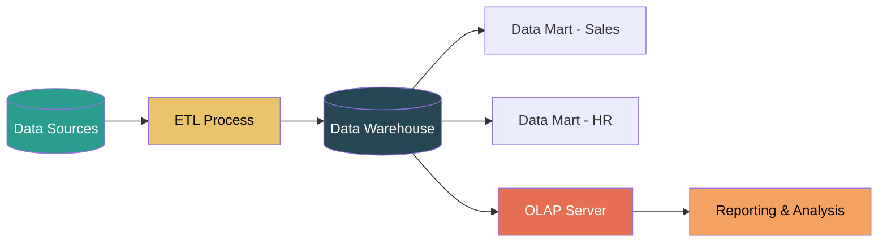
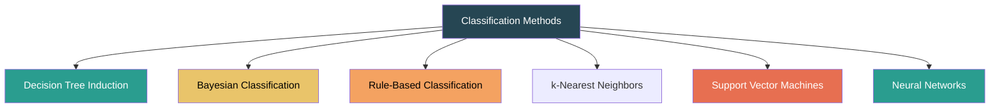
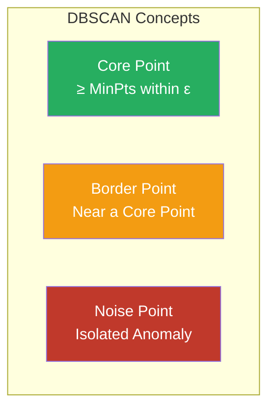
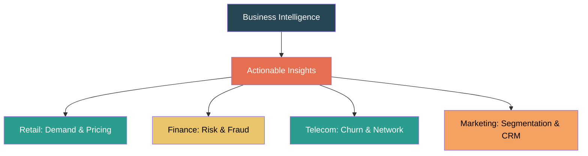

# DMBI End Semester Examination (ESE) Notes

**Subject**: Data Mining and Business Intelligence (Semester 6, B.E IT)

---

## Module 1: Introduction to Data Warehousing and Data Mining

### 1.1 Introduction to Data Warehousing
**Definition**: A Data Warehouse (DW) is a subject-oriented, integrated, time-variant, and non-volatile collection of data used to support management decision-making.
- **Subject-Oriented**: Organized around major subjects (customers, products, sales) rather than specific applications.
- **Integrated**: Combines data from heterogeneous sources (RDBMS, flat files), cleaning and unifying it into a consistent format.
- **Time-Variant**: Stores data with a time dimension (historical data spanning 5-10 years) for trend analysis.
- **Non-Volatile**: Data is read-only; no updates or deletes are performed after the initial loading.

**DW vs. OLTP**: 
- **OLTP (Operational Database)**: Handles day-to-day operations, up-to-date data, simple queries, highly normalized, used by clerks/IT.
- **OLAP (Data Warehouse)**: Used for decision support, historical consolidated data, complex ad-hoc queries, denormalized, used by managers/analysts.

**Data Warehouse Architecture Components:**
- **Data Sources**: Operational databases, external data, and flat files.
- **ETL (Extract, Transform, Load)**: Extracts raw data from sources, cleans and integrates it, and loads it into the warehouse.
- **Data Warehouse Storage**: Central repository for integrated historical data.
- **Data Marts**: Subsets of the warehouse tailored for specific departments (e.g., Sales, Marketing).
- **OLAP Server**: Provides multidimensional analysis capabilities to users.
- **Front-End Tools**: Reporting, querying, visualization, and data mining tools.

**Multidimensional Data Model:**
- Data is organized into a **data cube**.
- **Fact Table**: Contains quantitative measures (e.g., sales amount, quantity) and foreign keys to dimensions.
- **Dimension Tables**: Descriptive context (e.g., Time, Product, Location).
- **Star Schema**: Fact table at the center, dimension tables directly connected (fewer joins, faster queries).
- **Snowflake Schema**: Dimension tables are normalized into sub-tables (more joins, less redundancy).

**OLAP Operations**:
- **Roll-Up**: Summarize data by climbing up a concept hierarchy (e.g., City $\rightarrow$ Country).
- **Drill-Down**: Go from summary to lower-level detail (e.g., Year $\rightarrow$ Quarter $\rightarrow$ Month).
- **Slice**: Select a single value for one dimension (e.g., only Q1).
- **Dice**: Select a sub-cube for multiple dimensions.
- **Pivot (Rotate)**: Swap rows and columns to change the visual view of the data.

### 1.2 What is Data Mining?
**Data Mining (KDD - Knowledge Discovery in Databases)** is the non-trivial extraction of implicit, previously unknown, and potentially useful information from large datasets.

**KDD Process Steps**:
1. **Data Cleaning**: Remove noise and handle missing values.
2. **Data Integration**: Combine data from multiple sources into a coherent store.
3. **Data Selection**: Retrieve relevant data for the specific analysis task.
4. **Data Transformation**: Transform data into forms appropriate for mining (e.g., normalization, aggregation).
5. **Data Mining**: Apply intelligent methods and algorithms to extract patterns.
6. **Pattern Evaluation**: Identify truly interesting patterns based on metrics.
7. **Knowledge Presentation**: Visualize the mined knowledge for the user.

### 1.3 Kinds of Patterns to be Mined
- **Classification**: Assign objects to predefined categories (e.g., spam vs. not spam).
- **Clustering**: Group similar objects without predefined labels (e.g., customer segmentation).
- **Association Rules**: Find relationships between items (e.g., Market Basket Analysis - Bread & Butter).
- **Regression**: Predict continuous numerical values (e.g., house prices).
- **Outlier Detection**: Identify objects deviating significantly from the norm (e.g., fraud detection).
- **Sequential Patterns**: Find regularities in event sequences (e.g., buy phone $\rightarrow$ buy case within 1 week).
- **Summarization**: Provide compact descriptions of a dataset (e.g., dashboards).

### 1.4 Technologies, Applications, and Issues
- **Technologies Used**: Statistics, Machine Learning, Database Systems, Pattern Recognition, Artificial Intelligence, High-Performance Computing, Information Retrieval.
- **Applications Targeted**: Retail (cross-selling), Banking (fraud detection, credit scoring), Telecom (churn prediction), Healthcare (disease diagnosis), CRM (targeted marketing).
- **Major Issues in Data Mining**:
  - **Mining Methodology**: Handling noisy data, evaluating pattern interestingness.
  - **Efficiency/Scalability**: Real-time mining, handling massive datasets efficiently.
  - **Diversity of Data**: Mining complex types like text, graphs, multimedia, and web data.
  - **Privacy & Security**: Protecting sensitive user information.
  - **Data Quality**: "Garbage in, garbage out" - poor data leads to poor mining results.

---

## Module 2: Data Exploration and Data Preprocessing

### 2.1 Data Exploration
An attribute is a data field representing a characteristic of an object.

**Types of Attributes**:
- **Nominal**: Names or labels with no meaningful order (e.g., Gender, Zip Codes, Eye Color).
- **Ordinal**: Values have a meaningful order, but the magnitude of difference is unknown (e.g., Grades A/B/C, Customer Satisfaction).
- **Interval**: Equal intervals, but no true zero point. Differences are meaningful, but ratios are not (e.g., Temperature in Celsius, Calendar Dates).
- **Ratio**: True zero point exists. Both differences and ratios are meaningful (e.g., Age, Salary, Weight).
- **Discrete vs. Continuous**: Discrete means finite/countable (often integers), while Continuous means real numbers (floating-point).

**Statistical Description**:
- **Central Tendency**: 
  - Mean: Arithmetic average. Highly sensitive to extreme outliers.
  - Median: Middle value when sorted. Robust to outliers.
  - Mode: Most frequently occurring value. Best for categorical data.
- **Dispersion**:
  - Range: Difference between the maximum and minimum values.
  - Variance and Standard Deviation: Measure of spread around the mean.
  - Interquartile Range (IQR): Q3 - Q1.
- **Five-Number Summary**: Minimum, Q1 (25th percentile), Median (50th percentile), Q3 (75th percentile), Maximum. This is visually represented using a **Box Plot**.

**Data Visualization**:
- Histograms (distribution of single numeric variable), Scatter Plots (relationship between two variables), Box Plots (outlier detection), Heat Maps (correlation).

**Measuring Similarity and Dissimilarity**:
- **Numeric Data**: Euclidean (straight line distance), Manhattan (city block distance), Minkowski (generalized formula), Supremum (maximum difference on any one attribute).
- **Binary Data**: Simple Matching Coefficient (SMC) (counts both 1-1 and 0-0 matches), Jaccard Coefficient (ignores 0-0 matches, good for asymmetric binary data).
- **Text/Sparse Data**: Cosine Similarity measures the angle between two vectors, effectively ignoring zero-values.

### 2.2 Data Preprocessing
Real-world data is dirty: incomplete (missing values), noisy (errors/outliers), inconsistent, and redundant.

**1. Data Cleaning**:
- **Missing Values**: Discard the tuple, fill manually, replace with a global constant (e.g., "Unknown"), use the attribute mean/median, or predict using a machine learning model.
- **Noisy Data**: 
  - **Binning**: Sort data, divide into equal-frequency bins, and smooth by bin means, medians, or boundaries.
  - **Regression**: Fit data to a regression function to smooth it.
  - **Clustering**: Outliers fall outside clusters and can be detected and removed.

**2. Data Integration**:
- Merging data from multiple sources into a coherent store.
- Solves schema integration issues (different database columns mapping to the same concept).
- Removes redundancies by calculating correlation (e.g., Pearson's correlation for numeric data, Chi-square for categorical).

**3. Data Reduction**:
- **Attribute Subset Selection**: Forward selection (start empty, add best attributes), Backward elimination (start full, remove worst), Decision tree induction (attributes used in the tree form the subset).
- **Sampling**: Simple random sampling (with/without replacement), Stratified sampling (ensure class distribution is maintained across samples).

**4. Data Transformation & Discretization**:
- **Normalization**: 
  - **Min-Max**: Scales values to a specific range, usually [0, 1].
  - **Z-Score**: Normalizes based on the mean and standard deviation (mean becomes 0, std becomes 1).
  - **Decimal Scaling**: Moves the decimal point based on the maximum absolute value.
- **Discretization/Binning**: Converts continuous attributes to categorical by splitting them into equal-width or equal-frequency bins.
- **Concept Hierarchy**: Maps low-level data to higher-level concepts (e.g., Street $\rightarrow$ City $\rightarrow$ State $\rightarrow$ Country) to generalize data.

---

## Module 3: Frequent Pattern Mining

### 3.1 Market Basket Analysis
A technique used by retailers to discover associations between products bought together in transactions. 
- **Itemset**: A collection of one or more items (e.g., {Bread, Butter}).
- **Support**: The fraction of all transactions that contain the itemset.
- **Confidence**: The probability of buying item Y given that item X is bought: P(Y | X).
- **Frequent Itemset**: An itemset whose support is $\geq$ a user-defined minimum support threshold.
- **Closed Itemset**: A frequent itemset with no superset that has the exact same support count. Provides lossless compression.
- **Maximal Frequent Itemset**: A frequent itemset with no superset that is also frequent.

### 3.2 Frequent Itemset Mining Methods

**1. The Apriori Algorithm**:
- Uses a level-wise candidate-generation-and-test approach.
- **Apriori Property (Downward Closure)**: If an itemset is infrequent, all of its supersets must also be infrequent. This is used to heavily prune the search space.
- **Process**: Scan DB to find frequent 1-itemsets. Join them to create 2-itemset candidates. Prune candidates that have infrequent subsets. Scan DB to count actual support. Repeat for 3-itemsets until no more candidates can be generated.

**2. FP-Growth (Frequent Pattern Growth)**:
- **No candidate generation** required; highly efficient. Requires exactly **2 database scans**.
- **Process**:
  1. First Scan: Count item frequencies and sort items in descending order of support.
  2. Second Scan: Read each transaction, keep only frequent items, and sort them by the established frequency order.
  3. Insert sorted transactions into an **FP-Tree** (a prefix tree where common prefixes are shared).
  4. Mine the tree recursively by creating Conditional Pattern Bases for each item (starting from the least frequent item).

**3. ECLAT (Equivalence Class Transformation)**:
- Uses a **Vertical Data Format** (Item $\rightarrow$ List of Transaction IDs containing that item).
- Support counting is extremely fast because it is done via **set intersection** of the transaction ID lists.

### 3.3 Generating Rules & Pattern Evaluation
- **Generating Rules**: For every frequent itemset L, generate all non-empty subsets S. Create a rule S $\rightarrow$ (L - S). Keep the rule if its confidence is $\geq$ the minimum confidence threshold.
- **Objective Interestingness Measures**:
  - **Lift**: Ratio of Confidence to expected support. Lift > 1 means a positive correlation; Lift < 1 means a negative correlation.
  - **Null-Invariance**: A measure is null-invariant if it is not affected by transactions containing neither item (null-transactions). Support, Confidence, and Lift are NOT null-invariant and can be misleading on huge datasets. Kulczynski, Cosine, and Jaccard ARE null-invariant.
- **Subjective Interestingness**: A pattern is subjectively interesting if it is actionable (leads to business decisions), unexpected (contradicts beliefs), or novel.

---

## Module 4: Classification

### 4.1 Basic Concepts of Classification
- **Classification** is a form of **Supervised Learning**. The goal is to build a model (classifier) that predicts a categorical (discrete) class label based on a set of attributes.
- **Two Phases**:
  1. **Training Phase**: The algorithm learns the relationship between attributes and class labels using a labeled training dataset.
  2. **Testing/Prediction Phase**: The model's accuracy is evaluated on a separate test set. If satisfactory, it is used to classify new, unseen data.

### 4.2 Classification Methods Overview

**1. Decision Tree Induction**:
- A flowchart-like tree structure where internal nodes represent attribute tests, branches represent outcomes, and leaf nodes represent class labels.
- Follows Hunt's Algorithm (recursive partitioning).
- **Attribute Selection Measures** (how to choose the best attribute to split the data):
  - **Information Gain (ID3)**: Measures the reduction in Entropy (impurity). Biased towards attributes with many distinct values (like IDs).
  - **Gain Ratio (C4.5)**: Normalizes Information Gain by the attribute's intrinsic split information to fix the multi-value bias.
  - **Gini Index (CART)**: Measures impurity for binary splits. Selects the attribute with the largest reduction in Gini.
- **Tree Pruning**: Prevents **overfitting** (when the tree learns noise and performs poorly on new data).
  - **Pre-Pruning**: Stop growing the tree early if a split doesn't improve purity significantly.
  - **Post-Pruning**: Grow the full tree, then remove or collapse complex subtrees into leaf nodes based on a validation set.

**2. Bayesian Classification**:
- A statistical classifier based on **Bayes' Theorem**: P(C|X) = (P(X|C) * P(C)) / P(X).
- **Naive Bayes Classifier**: Makes a strong assumption of class-conditional independence (assumes all attributes are entirely independent of each other given the class).
- It is extremely fast, easy to implement, and performs surprisingly well with small datasets.
- **Laplacian Correction**: Adds 1 to all frequency counts to prevent the "zero probability problem", where an unseen attribute value zeroes out the entire multiplication.

**3. Rule-Based Classification**:
- Uses **IF-THEN rules** (e.g., IF age $\leq$ 30 AND student = yes THEN buys_computer = yes).
- **Rule Extraction**: Every path from a decision tree's root to a leaf can be converted into a mutually exclusive classification rule.
- **Sequential Covering Algorithm**: Learns one rule at a time to cover positive examples, removes the data covered by the rule, and repeats until all positive examples are covered.

### 4.3 Accuracy and Error Measures
- **Confusion Matrix**: Summarizes results for a binary classifier into True Positives (TP), True Negatives (TN), False Positives (FP), and False Negatives (FN).
- **Metrics**:
  - **Accuracy**: (TP + TN) / Total. Overall correctness of the model.
  - **Error Rate**: (FP + FN) / Total. Overall misclassification rate.
  - **Precision**: TP / (TP + FP). Exactness (out of all predicted positives, how many were actually positive?).
  - **Recall (Sensitivity)**: TP / (TP + FN). Completeness (out of all actual positives, how many were correctly found?).
  - **F1-Score**: Harmonic mean of Precision and Recall. Balances both metrics.

### 4.4 Model Evaluation Methods
How to split data into training and test sets:
- **Holdout Method**: Split data into two disjoint sets (e.g., 2/3 training, 1/3 testing).
- **Random Subsampling**: Repeat the holdout method multiple times with random partitions and average the accuracy.
- **k-Fold Cross-Validation**: Divide data into k equal subsets (folds). Train on k-1 folds, test on 1 fold. Repeat k times, using a different fold for testing each time. Averages results for a highly reliable estimate.

---

## Module 5: Clustering

### 5.1 Cluster Analysis Basic Concepts
- **Clustering** is a form of **Unsupervised Learning**. There are no predefined class labels in the dataset.
- **Goal**: Partition data into groups (clusters) so that objects in the same cluster are highly similar (high intra-cluster similarity), and objects in different clusters are highly dissimilar (low inter-cluster similarity).
- **Requirements**: Should be scalable, handle different attribute types, discover arbitrary shapes, and be robust to noise.

### 5.2 Partitioning Methods
Divides *n* objects into *k* user-specified clusters.
- **K-Means Algorithm**:
  1. Randomly pick *k* objects as initial centroids (means).
  2. Assign each point to the closest centroid using Euclidean distance.
  3. Recompute the centroids by calculating the mean of all points in each cluster.
  4. Repeat steps 2-3 until centroids stop changing (convergence).
  - **Pros/Cons**: Computationally efficient and scales well. However, it requires specifying *k*, is highly sensitive to noise/outliers, and only finds spherical (globular) clusters.
- **K-Medoids Algorithm (PAM)**:
  - Instead of calculated means, it uses actual data points (**medoids**) as cluster representatives.
  - Evaluates cost of swapping a medoid with a non-medoid point.
  - Much more robust to noise and outliers than K-Means, but computationally expensive for large datasets.

### 5.3 Hierarchical Methods
Creates a tree-like hierarchy of nested clusters called a **Dendrogram**. Does not require specifying *k* in advance.
- **Agglomerative (AGNES)**: **Bottom-Up** approach. Starts with every object as a singleton cluster. Iteratively merges the two closest clusters until one giant cluster remains.
- **Divisive (DIANA)**: **Top-Down** approach. Starts with all objects in a single cluster. Iteratively splits the most heterogeneous cluster into two.
- **Linkage Methods** (Measuring distance between clusters):
  - **Single Linkage**: Minimum distance between points of two clusters (prone to elongated chaining).
  - **Complete Linkage**: Maximum distance between points (produces compact clusters).
  - **Average Linkage**: Average distance between all pairs.
  - **Ward's Method**: Minimizes the increase in total within-cluster variance (SSE). Highly popular.

### 5.4 Density-Based Clustering (DBSCAN)
- Defines clusters as dense regions of data separated by regions of lower density.
- Can discover clusters of **arbitrary shapes** and is highly robust to **noise**.
- **Parameters**: 
  - $\varepsilon$ (Epsilon): The radius of the neighborhood around a point.
  - **MinPts**: Minimum number of points required within the $\varepsilon$-neighborhood to form a dense region.
- **Point Classifications**:
  - **Core Point**: Has $\geq$ MinPts neighbors in its $\varepsilon$-neighborhood.
  - **Border Point**: Has < MinPts neighbors but lies within the $\varepsilon$-neighborhood of a core point.
  - **Noise Point (Outlier)**: An isolated point that is neither a core nor a border point.

### 5.5 Clustering Evaluation
- **Internal Measures** (Evaluated without ground truth labels): SSE (Sum of Squared Errors - lower is better), Cohesion (maximize), Separation (maximize), Silhouette Coefficient (between -1 and 1, closer to 1 is better).
- **External Measures** (Evaluated against known ground truth labels): Rand Index, Adjusted Rand Index (ARI), Purity, Jaccard Coefficient.

### 5.6 Outlier Detection
An outlier is an observation that deviates so significantly from other observations that it arouses suspicion it was generated by a different mechanism.
- **Types of Outliers**: 
  - **Global**: A point that deviates from the entire dataset.
  - **Contextual**: A point that deviates only within a specific context (e.g., 35°C is a normal temperature in summer, but an outlier in winter).
  - **Collective**: A group of points that are anomalous together, even though individually they might seem normal (e.g., network attack packets).
- **Detection Methods**:
  - **Supervised/Semi-Supervised**: Uses labeled normal/outlier data to build classification models.
  - **Statistical**: Uses Z-score or Box Plot (IQR method). Assumes data fits a standard distribution.
  - **Proximity-Based**: Uses distance to k-Nearest Neighbors. The **Local Outlier Factor (LOF)** compares the density of a point to the density of its neighbors.
  - **Clustering-Based**: Points that do not fit well into any cluster (like DBSCAN noise points) are flagged as outliers.

---

## Module 6: Business Intelligence

### 6.1 What is Business Intelligence (BI)?
- **Business Intelligence** is a broad category of technologies, applications, architectures, and processes for gathering, storing, accessing, and analyzing data to help business users make better decisions.
- It transforms raw data into meaningful and actionable insights for strategic and tactical decision-making, providing a competitive advantage.
- Core components include Data Warehousing, ETL, OLAP, Data Mining, and Dashboards.

### 6.2 Decision Support System (DSS)
- An interactive, computer-based system that uses data and analytical models to support decision-making activities.
- **Components**: Data Management Subsystem (DW/DB), Model Management Subsystem (Stats/Simulations/Optimization), User Interface Subsystem (Dashboards), and Knowledge-Based Subsystem.
- **Types of Decisions**:
  - **Structured**: Routine, repetitive decisions with clear rules (e.g., automated inventory reordering).
  - **Semi-Structured**: Parts of the decision can be automated, but human judgment is still required (e.g., loan approvals).
  - **Unstructured**: Novel, complex, non-routine decisions requiring deep judgment (e.g., entering a new foreign market).

**DSS vs BI**: A DSS is usually focused on specific problem-solving scenarios (using simulation and what-if models), while BI provides broad, enterprise-wide analytics, reporting, and data mining capabilities.

### 6.3 BI Architecture & Development Lifecycle
**BI Architecture Layers**:
1. **Data Sources Layer**: Operational DBs, ERP, CRM, flat files, external web data.
2. **Data Integration Layer**: ETL tools that extract, clean, and load data.
3. **Data Storage Layer**: The Data Warehouse and Data Marts.
4. **Analytics Layer**: OLAP servers, statistical analysis, and Data Mining engines.
5. **Presentation Layer**: Dashboards, visual reports, and ad-hoc query tools for end-users.

**BI Development Lifecycle (9 Phases)**:
1. Business Requirements Analysis.
2. Data Identification & Source Analysis.
3. Data Warehouse Schema Design.
4. ETL Design & Development.
5. Analytics & Mining Implementation.
6. Dashboard & Report Development.
7. Testing & Validation.
8. Deployment & Training.
9. Maintenance & Evolution.

### 6.4 Data Retrieval for Business Applications
BI and Data Mining are applied extensively across various industries to solve complex business problems:

- **Fraud Detection**: Uses classification and anomaly detection models to identify suspicious patterns in credit card transactions, tax returns, or insurance claims (e.g., unusual locations, times, or transaction amounts).
- **Clickstream Mining**: Analyzes the sequence of website clicks made by users. Used for website layout optimization, A/B testing, understanding user journeys, and recommending products based on common navigation paths.
- **Market Segmentation**: Uses clustering (like K-Means) to divide a broad market into distinct subsets of consumers based on demographics, psychographics, or behaviors, allowing for highly targeted marketing strategies.
- **Retail Industry**: Utilizes market basket analysis for cross-selling and bundle promotions, predicts future demand to optimize inventory levels, and employs dynamic price optimization.
- **Telecommunications Industry**: Predicts customer churn (identifying users likely to switch providers) using classification, detects network faults, and prevents subscription fraud.
- **Banking & Finance**: Performs credit scoring to assess loan default risk, applies Anti-Money Laundering (AML) link analysis, predicts customer lifetime value (CLV), and utilizes algorithmic trading based on historical time-series data.
- **Customer Relationship Management (CRM)**: Focuses on customer acquisition (scoring leads), customer retention (churn prevention campaigns), and customer development (cross-selling and up-selling) to build a 360-degree holistic customer profile.

