# Software Engineering — ESE Solved Question Bank

> All 127 questions answered individually, sorted by module and marks.

---

## Module 1 Question Bank: The Software Process

**1. Elaborate on the definition of software and its key characteristics.** (2 Marks)

Software is not just code; it is a collection of computer programs, associated documentation, and data structures that enable computers to perform specific tasks. Unlike hardware, which is physical, software is logical. A key characteristic is that software does not "wear out" like physical machines do, though it can degrade due to poor changes. It is custom-built or engineered rather than being manufactured in the classical sense.

---

**2. Summarize the evolving role of software in modern technological contexts.** (2 Marks)

The role of software has evolved from a simple information processing tool to the fundamental engine driving modern technology. It powers everything from smartphones and household appliances to complex cloud infrastructures and artificial intelligence. Software acts as a product itself, while also serving as a vehicle for delivering products and services. In today's digital age, it transforms industries, enabling smart cities, autonomous vehicles, and global connectivity.

---

**3. Apply the concept of process assessment to outline its importance in software engineering.** (2 Marks)

Process assessment is a systematic evaluation of an organization's software development processes against a standard framework. Its importance lies in identifying process strengths and weaknesses, enabling continuous improvement. By understanding the current state of their processes, organizations can implement targeted changes to enhance productivity, reduce defects, and improve the overall quality of the software produced, making assessment crucial for long-term success.

---

**4. Describe the purpose of Personal Software Process (PSP) and its role in individual productivity.** (2 Marks)

The Personal Software Process (PSP) is a structured framework designed to help individual software developers improve their personal performance. Its purpose is to guide engineers in planning their work, tracking their time and defects, and analyzing their own data to make better estimates. By bringing discipline to individual coding practices, PSP significantly enhances personal productivity, reduces errors early in the cycle, and ultimately contributes to higher quality software.

---

**5. Illustrate the significance of SDLC by applying it to a software engineering context.** (2 Marks)

The Software Development Life Cycle (SDLC) is significant because it provides a structured blueprint for building software applications. In a software engineering context, applying the SDLC ensures that projects progress smoothly from initial requirements gathering to design, coding, testing, and final deployment. It helps teams manage resources effectively, maintain high quality, and deliver the project on time and within budget, acting as a crucial roadmap for complex developments.

---

**6. Categorize different umbrella activities in software development and justify their relevance.** (2 Marks)

Umbrella activities are ongoing tasks that occur across the entire software development process, rather than being confined to a single phase. They include Software Quality Assurance (SQA) to ensure high standards, Software Configuration Management (SCM) to handle changes, and Risk Management to mitigate potential issues. Their relevance is critical; they provide constant tracking, control, and quality checks, ensuring the project stays on track regardless of the specific development phase.

---

**7. Distinguish between different types of process patterns and classify them with suitable examples.** (2 Marks)

Process patterns provide reusable templates for solving common problems in software development. They are typically classified into three types: Phase Patterns, which define the flow of broad project phases like "Prototyping"; Stage Patterns, which structure specific steps within a phase, such as "Design Subsystem"; and Task Patterns, which detail specific actions like "Conduct Code Review." Utilizing these patterns helps teams quickly apply proven strategies to their unique projects.

---

**8. Apply the concept of Layered Technology to illustrate how each layer contributes to software engineering. Explain with a suitable diagram.** (5 Marks)

The Layered Technology approach to software engineering views the discipline as a series of interconnected layers, building upon a strong foundation of quality. 

1. **A Quality Focus:** This is the bedrock layer. Any engineering approach must rest on an organizational commitment to quality. Without a focus on continuous quality improvement, the subsequent layers will fail to produce reliable software.
2. **Process Layer:** This layer holds the technology layers together. It defines the framework for the delivery of software engineering technology. It establishes the context in which technical methods are applied, work products are created, and milestones are achieved.
3. **Methods Layer:** This layer provides the technical "how-to" for building software. It encompasses a broad array of tasks, including requirements analysis, design, program construction, testing, and support. Methods rely on a set of basic principles that govern each area of the technology.
4. **Tools Layer:** The top layer provides automated and semi-automated support for the process and the methods. When tools are integrated so that information created by one tool can be used by another, a system for the support of software development is established.

This layered structure ensures a comprehensive and quality-driven approach to software development.

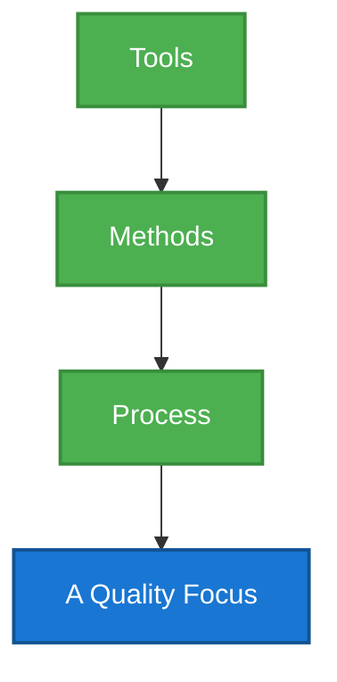

---

**9. Apply the Process Framework model to a real-world software project scenario. Justify its essential role in managing software development.** (5 Marks)

A Process Framework provides a foundational structure for organizing and managing software development. Consider a real-world scenario of developing a new mobile banking application. The framework establishes a set of framework activities that apply to all projects, regardless of their size or complexity. 

For the banking app, the framework defines the **Communication** phase to gather requirements from stakeholders and users. This is followed by **Planning**, where resources, risks, and timelines are established. The **Modeling** phase involves creating architectural and user interface designs. **Construction** covers the actual coding and rigorous security testing. Finally, **Deployment** manages the release to app stores and gathering user feedback.

The essential role of this framework is to provide consistency and predictability. Without it, developing a sensitive application like a banking app would be chaotic. It ensures that critical steps, such as security modeling and user testing, are not skipped. By defining clear activities and the flow between them, the process framework allows project managers to track progress accurately, allocate resources efficiently, and ensure that the final product meets both business goals and user expectations.

---

**10. Design a process pattern template for a software project and demonstrate how task and stage patterns are used in it.** (5 Marks)

A process pattern template provides a standardized way to describe a proven solution to a recurring problem in software engineering. A good template includes the Pattern Name, Intent, Type, Initial Context, Problem, Solution, Resulting Context, and Related Patterns.

Consider designing a process for **"Handling Changing Requirements"**.
*   **Pattern Name:** Agile Requirement Adaptability.
*   **Intent:** To manage and integrate new customer requirements smoothly during ongoing development.
*   **Type:** Phase Pattern.

In this scenario, a **Stage Pattern** could be "Sprint Planning." During this stage, the team evaluates the new requirements and decides which to include in the upcoming development cycle. It organizes the broad goal into a manageable timeframe.

A **Task Pattern** within that stage would be "Requirement Prioritization." This task pattern defines the specific steps taken by the Product Owner and the team to rank the new requirements based on business value and technical feasibility.

By using this template, teams don't have to invent a new method every time requirements change. They use the Stage Pattern to structure their approach (the sprint) and Task Patterns to execute the specific actions (prioritization), ensuring a structured, predictable response to dynamic project conditions.

---

**11. Classify different types of software and construct a comparison illustrating the distinction between system software and application software.** (5 Marks)

Software is broadly classified into several categories based on its purpose, functionality, and the environment in which it operates. The two most fundamental classifications are System Software and Application Software. 

**System Software** consists of programs written to service other programs. It acts as an intermediary between the computer hardware and the application programs. This type of software is heavily involved with managing hardware resources, memory, and fundamental system operations. Examples include Operating Systems (like Windows, Linux, macOS), device drivers, and utility programs (like disk defragmenters or antivirus software). It generally runs in the background and is essential for the computer to function.

**Application Software**, on the other hand, consists of standalone programs that solve a specific business need or perform a particular task for the end-user. It is designed to facilitate human activities. Applications utilize the capabilities of the system software to interact with the hardware. Examples include word processors, web browsers, database management systems, and video editing software.

**Comparison:**
System Software is general-purpose and hardware-centric, aiming to run the system itself. Application Software is specific-purpose and user-centric, aiming to perform tasks for the user. A computer cannot run without system software, but it can easily run without specific application software. System software typically runs continuously, while application software runs as needed by the user.

---

**12. Analyze the significance of ISO standards in improving software process quality. Examine how organizations benefit from ISO compliance.** (5 Marks)

The International Organization for Standardization (ISO) provides a globally recognized framework for quality management, specifically through the ISO 9000 series, with ISO 9001 being highly relevant to software engineering. The significance of ISO standards lies in their ability to establish a baseline for quality assurance, ensuring that a software organization follows a systematic, documented, and repeatable approach to development.

Organizations benefit immensely from ISO compliance. Firstly, it drives **process consistency**. By adhering to ISO standards, an organization ensures that every project follows a defined methodology, reducing errors and increasing predictability. Secondly, it fosters **continuous improvement**. ISO mandates regular audits and reviews, forcing the organization to constantly evaluate and enhance its processes. 

Furthermore, ISO certification serves as a powerful **mark of credibility**. It demonstrates to clients and stakeholders that the organization is committed to high-quality standards, often providing a competitive edge in the market. Internally, it improves employee onboarding and training, as processes are clearly documented. Ultimately, ISO standards shift the focus from merely finding defects in the final software to preventing them throughout the entire software process.

---

**13. Analyze how task patterns contribute to successful project completion. Examine their impact on scheduling and team coordination.** (5 Marks)

Task patterns define a specific sequence of actions, roles, and work products required to solve a recurring technical or management problem in a software project. They are highly specific, actionable blueprints for daily work.

The contribution of task patterns to successful project completion is significant. When a team encounters a common challenge—for example, "Conducting a Peer Code Review"—a task pattern provides the exact steps: who initiates it, what checklist is used, how feedback is recorded, and how corrections are verified. This eliminates guesswork and ensures that critical, low-level activities are performed consistently and thoroughly.

Regarding **scheduling**, task patterns make estimation much more accurate. Because the steps of the task are well-defined, managers can precisely estimate the time required for each step, leading to more reliable project timelines. 

In terms of **team coordination**, task patterns are invaluable. They clearly define roles and responsibilities. Everyone knows exactly what is expected of them during that specific task. This reduces confusion, prevents duplicated effort, and ensures smooth handoffs between team members. By standardizing how individual tasks are executed, task patterns build a foundation of reliability that scales up to ensure the overall success of the project.

---

**14. Analyze the Capability Maturity Model (CMM). Assess how an organization can transition from one maturity level to the next.** (5 Marks)

The Capability Maturity Model (CMM), developed by the Software Engineering Institute (SEI), is a framework used to assess the maturity and capability of an organization's software development processes. It defines five maturity levels, providing a roadmap for continuous process improvement.

1.  **Initial (Level 1):** Processes are ad hoc, chaotic, and heavily dependent on individual heroics.
2.  **Repeatable (Level 2):** Basic project management processes are established to track cost, schedule, and functionality.
3.  **Defined (Level 3):** Processes are documented, standardized, and integrated across the organization.
4.  **Managed (Level 4):** Detailed metrics are collected, and processes are quantitatively controlled.
5.  **Optimizing (Level 5):** Continuous process improvement is driven by quantitative feedback and innovation.

To **transition from one level to the next**, an organization must fulfill the specific Key Process Areas (KPAs) of the target level. For example, to move from Level 1 to Level 2, the organization must implement basic project planning, configuration management, and requirements management. Moving from Level 2 to Level 3 requires creating organizational standards and training programs. The transition involves a cycle of assessment to identify gaps, planning to address those gaps, implementing new processes, and continuously monitoring adherence until the new practices become deeply ingrained in the organizational culture.

---

**15. Compare and contrast PSP and TSP frameworks. Evaluate their effectiveness in software project management and recommend the most suitable approach for large-scale projects.** (10 Marks)

The Personal Software Process (PSP) and Team Software Process (TSP) are closely related frameworks designed to elevate the maturity and quality of software development, but they operate at different scales. 

**PSP (Personal Software Process):**
PSP focuses entirely on the individual engineer. It is a disciplined, data-driven approach that trains developers to measure their own performance. Engineers track the time they spend on different tasks, the defects they inject and remove, and the size of the code they write. The goal is personal continuous improvement. By understanding their own error rates and coding speeds, individuals can create highly accurate personal estimates, write cleaner code, and reduce testing time. PSP acts as a rigorous training regimen, turning software development from an art into an engineering discipline at the individual level.

**TSP (Team Software Process):**
TSP builds directly upon the foundation of PSP, scaling it up to the team level. It assumes that the team consists of PSP-trained engineers. TSP provides a structured framework for these capable individuals to work together effectively to build complex products. It guides the team through self-directed project planning, establishing roles, defining team goals, and tracking progress as a cohesive unit. TSP emphasizes team ownership of the process and the product.

**Comparison and Effectiveness:**
*   **Scope:** PSP is microscopic (individual habits), while TSP is macroscopic (team coordination and project execution).
*   **Focus:** PSP focuses on personal metrics (defects/KLOC, time management), whereas TSP focuses on team metrics (project milestones, overall product quality, team dynamics).
*   **Effectiveness:** PSP is highly effective for reducing individual defect rates and improving estimation accuracy. However, a team of great individuals can still fail if they cannot coordinate. TSP effectively bridges this gap, providing the structure needed to harmonize the efforts of PSP-trained engineers, leading to highly predictable project schedules and exceptionally low defect products.

**Recommendation for Large-Scale Projects:**
For large-scale projects, **TSP is the strongly recommended approach**, provided the prerequisite of PSP training is met. Large projects fail primarily due to communication breakdowns, poor planning, and integrated defects. TSP directly addresses these issues by enforcing rigorous team-based planning, clear role definitions, and continuous quality tracking. While an organization might start by implementing PSP to build individual capability, applying TSP is essential to harness those individual skills into a synchronized, high-performing team capable of tackling the massive complexity and coordination challenges inherent in large-scale software development.

---

**16. Analyze how evolving software trends influence the selection of process frameworks. Justify your analysis with real-world examples.** (10 Marks)

The selection of a software process framework is no longer a static decision; it is deeply influenced by the rapid evolution of software trends. In the past, heavy, plan-driven frameworks like the Waterfall model dominated. However, modern trends demand flexibility, speed, and continuous delivery, fundamentally shifting how organizations select their development processes.

**Influence of Evolving Trends:**

1.  **The Shift to Cloud and SaaS:** The rise of Software as a Service (SaaS) and cloud computing means software is never truly "finished." It requires continuous updates, patching, and feature releases. This trend heavily favors Agile frameworks and DevOps practices over traditional models. A Waterfall approach, which might take a year to release a new version, is entirely unsuitable for a cloud product that needs weekly updates.
2.  **Mobile App Development:** Mobile markets are highly volatile, and user feedback is immediate. Process frameworks must accommodate rapid prototyping and iterative releases. This trend has popularized lightweight Agile frameworks like Scrum, allowing teams to pivot quickly based on user reviews and changing mobile OS standards.
3.  **Artificial Intelligence and Machine Learning:** Developing AI models involves significant experimentation and uncertainty. Traditional processes fail here because you cannot definitively plan how an AI model will behave until it is trained. Frameworks that support iterative experimentation and continuous integration of data models are essential for AI-driven projects.
4.  **Security as a Priority (DevSecOps):** With increasing cyber threats, security cannot be an afterthought left to the final testing phase. This trend influences the selection of frameworks that integrate security checks into every stage of development, promoting the DevSecOps methodology, ensuring continuous security assessment.

**Justification with Real-World Examples:**

Consider **Spotify**. They could not survive using a rigid, traditional process framework. The trend of streaming audio demands constant innovation, A/B testing of features, and seamless updates for millions of users. Therefore, they adopted and adapted Agile methodologies (often referred to as the "Spotify Model" with Tribes and Squads) to ensure their process framework supports continuous delivery and rapid scaling.

Conversely, consider **SpaceX** developing flight software for the Falcon 9. The trend here is extreme reliability in mission-critical, embedded systems. While they may use iterative methods internally, their overarching framework must include incredibly rigorous, heavily documented verification and validation phases that resemble more traditional, highly controlled frameworks, as a single bug can result in catastrophic failure. The trend dictates the required rigor of the process.

---

**17. Apply software engineering principles to demonstrate their role in solving real-world problems. Support your argument with practical case studies.** (10 Marks)

Software engineering principles provide foundational guidelines that, when applied correctly, ensure the development of robust, maintainable, and effective solutions to complex real-world problems. These principles—such as modularity, abstraction, separation of concerns, and continuous testing—act as a compass guiding developers through the chaos of building large systems.

**Applying Principles to Real-World Problems:**

1.  **Principle of Modularity and Separation of Concerns:** This principle dictates that a complex system should be broken down into smaller, manageable, and independent modules. Each module should handle a specific aspect of the system's functionality.
    *   **Case Study: Amazon's E-commerce Platform.** In its early days, Amazon operated as a monolithic application. As the platform grew rapidly, this became a massive bottleneck; any small change could break the entire system. By applying the principle of modularity, Amazon transitioned to a microservices architecture. They separated concerns: one module handles the shopping cart, another handles user authentication, and another handles the recommendation engine. This allowed different teams to update, scale, and deploy these services independently, solving the real-world problem of scalability and system resilience.

2.  **Principle of Abstraction:** Abstraction involves hiding complex implementation details and exposing only the necessary interfaces. It allows developers to work with high-level concepts without needing to understand the underlying complexity.
    *   **Case Study: Google Maps API.** Google Maps solves the real-world problem of navigation and geographical data representation. It provides an API that heavily utilizes abstraction. A developer building a ride-sharing app does not need to know the complex algorithms Google uses to calculate traffic or render map tiles. They only interact with the abstracted API endpoints (e.g., "getRoute(start, end)"). This principle allows thousands of different businesses to integrate complex mapping technology easily and efficiently.

3.  **Principle of Continuous Testing and Validation:** Quality cannot be tested into a product at the end; it must be built in from the start. This principle ensures that the software meets requirements at every stage.
    *   **Case Study: Netflix's Chaos Monkey.** Netflix faces the real-world problem of maintaining constant uptime for millions of users across a massive global server network. They applied the principle of continuous testing uniquely by creating "Chaos Monkey"—a tool that randomly shuts down servers in their production environment. By constantly validating their system's ability to withstand failures, they ensure extreme resilience. This proactive application of testing principles prevents massive, real-world service outages.

---

**18. Apply appropriate documentation strategies to examine the role of documentation in software engineering across each phase of the lifecycle.** (10 Marks)

Documentation is often viewed as a tedious byproduct of coding, but in rigorous software engineering, appropriate documentation strategies are critical. Documentation acts as the organizational memory, a communication tool, and a baseline for quality assurance. Its role evolves significantly across the different phases of the software development lifecycle (SDLC).

**Role of Documentation Across the Lifecycle:**

1.  **Requirements Phase:** 
    *   **Strategy:** Capture clear, unambiguous, and testable requirements.
    *   **Role:** The primary document here is the Software Requirements Specification (SRS). This document serves as the binding contract between the stakeholders and the development team. It resolves the problem of "what" needs to be built. Good documentation here prevents scope creep and ensures everyone shares a common vision. It is the foundation upon which all subsequent work is based.

2.  **Design Phase:**
    *   **Strategy:** Create blueprints that guide implementation and facilitate architectural reviews.
    *   **Role:** Documents include System Architecture Design, Database Schemas, and Interface Specifications. The role is to translate requirements into a technical roadmap. It allows senior engineers to review the proposed structure for flaws before a single line of code is written. For a large team, design documentation ensures that different modules built by different developers will integrate seamlessly.

3.  **Implementation (Coding) Phase:**
    *   **Strategy:** Maintain self-documenting code supported by inline comments and API documentation.
    *   **Role:** While writing code, the documentation strategy shifts to the code level. Well-named variables and clear inline comments explain the "why" behind complex logic. Tools are often used to auto-generate API documentation (like Javadoc or Swagger). This documentation is crucial for immediate team collaboration and for future developers who will need to read and maintain the code.

4.  **Testing Phase:**
    *   **Strategy:** Document plans, cases, and results systematically.
    *   **Role:** Test Plans outline the overall strategy, while Test Cases detail the specific inputs, execution conditions, and expected results. Documenting Test Results and Bug Reports is essential for tracking progress and ensuring that defects are verified as fixed. This documentation provides concrete proof of the software's quality and stability.

5.  **Deployment and Maintenance Phase:**
    *   **Strategy:** Provide clear guides for end-users and detailed manuals for system administrators.
    *   **Role:** User Manuals and Release Notes are crucial for end-user adoption. For maintainers, comprehensive system documentation is vital for troubleshooting bugs and adding new features years after the original developers have moved on. Without strong maintenance documentation, legacy systems become impenetrable and dangerous to modify.

---

**19. Design an integrated process improvement plan combining CMMI, ISO/IEC standards, PSP, and TSP for a mid-sized software organization.** (10 Marks)

Designing an integrated process improvement plan for a mid-sized software organization requires a strategic blending of different frameworks. Each framework—CMMI, ISO/IEC, PSP, and TSP—offers unique strengths. A successful plan uses them complementarily rather than competitively.

**The Integrated Process Improvement Plan:**

**Phase 1: Foundation and Baseline (Months 1-3)**
*   **Action:** The organization begins by pursuing **ISO/IEC 9001** certification.
*   **Purpose:** ISO provides a broad, fundamental baseline for a Quality Management System. It forces the organization to document its existing, perhaps informal, processes. This establishes a culture of compliance and standardization, ensuring that basic project management, documentation, and auditing procedures are in place.

**Phase 2: Organizational Assessment and Roadmap (Months 4-6)**
*   **Action:** Conduct an initial assessment using the **CMMI (Capability Maturity Model Integration)** framework.
*   **Purpose:** With the ISO baseline established, CMMI provides a detailed, structured roadmap for maturity. The assessment identifies specific gaps in process areas (like Requirements Management or Configuration Management). The organization aims to achieve CMMI Maturity Level 2 (Managed) by formalizing these specific project-level processes across all teams.

**Phase 3: Individual Engineering Discipline (Months 7-12)**
*   **Action:** Roll out **PSP (Personal Software Process)** training to all developers.
*   **Purpose:** While CMMI and ISO address organizational management, they do not teach engineers how to write better code. PSP introduces rigorous discipline at the desk level. Developers learn to estimate their time, track their personal defect rates, and perform personal design and code reviews. This drastically reduces the number of defects injected during the coding phase, fundamentally improving the quality of the raw output.

**Phase 4: Team Cohesion and Advanced Maturity (Months 13-18)**
*   **Action:** Implement **TSP (Team Software Process)** and push for CMMI Level 3 (Defined).
*   **Purpose:** Once developers are trained in PSP, TSP is introduced to organize these capable individuals into high-performance teams. TSP provides the framework for the team to plan their own work, manage their commitments, and track progress using the data generated by PSP. Simultaneously, the organization uses CMMI Level 3 guidelines to ensure that these robust team processes are standardized and shared across the entire enterprise, creating a unified organizational standard.

**Phase 5: Continuous Optimization (Ongoing)**
*   **Action:** Leverage metrics from PSP/TSP to achieve CMMI Levels 4 and 5.
*   **Purpose:** The integrated system is now self-sustaining. The detailed, quantitative data generated by PSP and TSP feeds directly into the requirements for CMMI High Maturity (Levels 4 and 5). The organization uses this data to statistically manage processes, predict performance, and drive continuous, innovative improvements.

---

**20. Apply process assessment techniques to construct a process improvement framework for a software engineering organization with a structured improvement roadmap.** (10 Marks)

Process assessment is the crucial first step in any meaningful journey toward software engineering excellence. It provides the objective reality of how an organization currently develops software, which is essential before mapping out how to improve. 

**Process Assessment Techniques:**
To begin, the organization must employ structured assessment techniques. This typically involves using an established appraisal method, such as SCAMPI (Standard CMMI Appraisal Method for Process Improvement). The technique involves:
1.  **Documentation Review:** Examining existing policies, project plans, test cases, and requirement documents.
2.  **Interviews:** Conducting structured interviews with project managers, developers, and QA personnel to understand how work is actually performed versus how it is documented.
3.  **Metrics Analysis:** Reviewing defect rates, schedule variances, and effort estimations to quantify current performance.

**Constructing the Process Improvement Framework and Roadmap:**

Based on the assessment findings, we construct a framework prioritizing the most critical weaknesses.

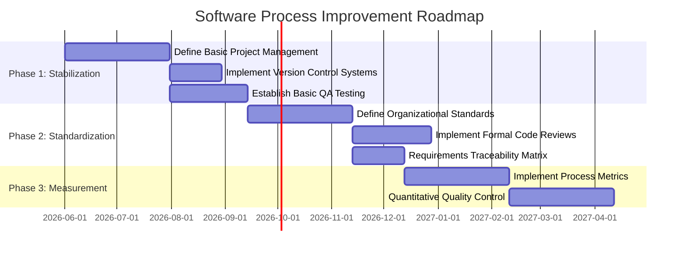

**Structured Improvement Roadmap:**

**Step 1: Stabilization (Short-Term Focus)**
*   **Goal:** Bring chaotic processes under basic management control.
*   **Actions:** Focus on fundamental project management. If the assessment revealed missed deadlines, the framework mandates rigorous estimation and tracking. If code is frequently lost, strict Configuration Management (version control) is implemented. The focus is on establishing repeatability.

**Step 2: Standardization (Medium-Term Focus)**
*   **Goal:** Create a unified organizational approach.
*   **Actions:** Once projects are stable, the best practices from individual projects are extracted and documented as standard organizational procedures. This phase includes implementing formal peer reviews and standardizing requirements gathering techniques. Training programs are rolled out so every new project follows the defined standard.

**Step 3: Measurement and Optimization (Long-Term Focus)**
*   **Goal:** Data-driven continuous improvement.
*   **Actions:** With standardized processes in place, the organization can collect reliable data (metrics). The framework establishes systems to measure defect density, productivity, and process efficiency. Management uses this quantitative data to identify bottlenecks and proactively optimize processes, moving the organization from a reactive state to a continuously improving, proactive culture.

---

**21. Apply process assessment principles to demonstrate the importance of process improvement in software engineering. Construct a justified improvement strategy.** (10 Marks)

Process assessment acts as a diagnostic tool for a software organization. Just as a doctor cannot prescribe effective treatment without a thorough examination, an organization cannot improve its software development without a rigorous assessment. The principles of process assessment dictate that evaluations must be objective, evidence-based, and focused on the process itself, not on evaluating individual people.

**Importance of Process Improvement:**
The software industry is characterized by rapid change and increasing complexity. Process improvement is important because static processes quickly become obsolete. 
1.  **Quality Enhancement:** Poor processes inherently produce defective software. Improving the process directly reduces bugs, leading to higher customer satisfaction and lower maintenance costs.
2.  **Predictability:** Chaotic processes result in blown budgets and missed deadlines. Improvement strategies stabilize development, allowing organizations to accurately predict timelines and resource needs.
3.  **Efficiency:** Streamlining processes removes redundant tasks, automates bottlenecks, and allows engineers to focus on creative problem-solving rather than administrative overhead.

**Constructing a Justified Improvement Strategy:**

A justified strategy is one where every improvement action directly addresses a weakness identified during the assessment. 

**The Strategy: The "Defect Reduction First" Approach**

*   **Assessment Finding:** The organization discovers a high rate of severe bugs being found by clients in production, leading to massive financial losses and reputational damage.
*   **Justified Strategy Objective:** Shift defect discovery to the earliest possible phases of the software lifecycle.

**Implementation Steps:**
1.  **Introduce Rigorous Requirements Validation (Month 1-3):** 
    *   *Justification:* Defects introduced in the requirements phase are the most expensive to fix later. The strategy mandates formal sign-offs and prototyping to ensure the right product is being built before coding starts.
2.  **Mandate Formal Peer Code Reviews (Month 4-6):**
    *   *Justification:* Assessment shows that developers work in silos. Code reviews are a proven, cost-effective method for catching logical errors and security vulnerabilities immediately after they are typed, long before formal testing.
3.  **Implement Automated Unit Testing (Month 7-9):**
    *   *Justification:* Manual testing is a bottleneck. Developers are required to write automated tests for their own code. This creates a safety net, ensuring that new changes do not break existing functionality (regression), thereby stabilizing the codebase.
4.  **Establish an Independent QA Gate (Month 10-12):**
    *   *Justification:* Developers cannot objectively test their own software. The strategy establishes a dedicated QA team responsible for final, rigorous system and acceptance testing before any release.

This strategy is justified because every step is logically connected to the core assessment finding: reducing production defects. By improving processes upstream (requirements, coding), the organization solves the problem proactively rather than reactively patching bugs.


---

## Module 2

### Q22. Discuss the Agile Manifesto values. (2 Marks)
The Agile Manifesto outlines four foundational values that prioritize flexibility and human interaction over rigid processes in software development. Firstly, it values **Individuals and interactions over processes and tools**, meaning team communication is crucial. Secondly, it emphasizes **Working software over comprehensive documentation**, focusing on delivering functional products rather than excessive paperwork. Thirdly, it champions **Customer collaboration over contract negotiation**, ensuring continuous alignment with user needs. Finally, it supports **Responding to change over following a plan**, allowing teams to adapt to evolving requirements quickly.

### Q23. Examine different Prescriptive and Specialized Process Models and compare their applicability. (2 Marks)
Prescriptive process models, like Waterfall or Incremental models, provide a strict, predefined roadmap for software engineering. They dictate exact phases, tasks, and outcomes, making them highly applicable for projects with clear, stable requirements and formal structures. In contrast, Specialized process models, such as Component Assembly or Concurrent models, are tailored for specific types of engineering environments. For example, Component Assembly focuses on reusability, which is perfect for projects leveraging existing libraries, while the Concurrent model manages parallel tasks effectively in complex, distributed systems.

### Q24. Illustrate why software process models are necessary for software product development. (2 Marks)
Software process models act as a vital blueprint for the entire development lifecycle, bringing order to what could otherwise be a chaotic endeavor. They provide a structured sequence of activities, ensuring that every phase—from requirement gathering to deployment—is systematically executed. This structure improves predictability, allowing teams to estimate timelines, manage budgets, and allocate resources efficiently. Furthermore, process models establish clear milestones and deliverables, making it easier to track progress, maintain quality standards, and ensure the final software meets customer expectations reliably.

### Q25. Interpret the phases of the Waterfall model and explain the role of each phase. (2 Marks)
The Waterfall model is a linear sequential approach. Its phases include: **Requirements**, where all system needs are gathered and documented; **Design**, which translates requirements into software architecture and blueprints; **Implementation**, where developers write the actual code; **Testing**, to rigorously find and fix defects ensuring quality; **Deployment**, releasing the software to the users; and **Maintenance**, handling post-release updates and bug fixes. Each phase must be completed before the next begins, making it simple to manage but highly inflexible to changes.

### Q26. Apply the concept of concurrent development to describe how parallel activities are managed in software engineering. (2 Marks)
Concurrent development, often used in client/server architectures, allows multiple software engineering activities to occur simultaneously rather than sequentially. Instead of waiting for one phase to finish completely, tasks exist in various "states" like Under Development, Awaiting Changes, or Baselined. For example, while the design team is refining the architecture (Under Revision), the coding team might already be building independent, stable modules (Baselined). This parallel management significantly speeds up the development timeline and dynamically accommodates changes across different components at the same time.

### Q27. Demonstrate what is meant by iterative development with the help of a suitable example. (2 Marks)
Iterative development is an approach where software is built and improved in repeated cycles, or "iterations." Instead of aiming for a perfect final product immediately, a basic version is created, evaluated, and refined continuously. For example, if building a word processor, the first iteration might only allow typing and saving text. The team tests this with users. The second iteration adds text formatting (bold, italics), and the third adds spell check. Each cycle produces a better, more feature-rich version based on feedback, effectively managing risks and evolving requirements step-by-step.

### Q28. Differentiate between the roles of Scrum Master, Product Owner, and Development Team in a Scrum team. (2 Marks)
In a Scrum team, the **Product Owner** acts as the voice of the customer, prioritizing the product backlog and ensuring the team builds maximum value. The **Scrum Master** is the servant-leader and facilitator, removing obstacles, coaching the team on Agile practices, and ensuring Scrum rules are followed. The **Development Team** consists of self-organizing, cross-functional professionals (developers, testers, designers) who execute the actual work. They collaboratively decide how to achieve the sprint goals and deliver a potentially shippable product increment by the end of each sprint cycle.

### Q29. Analyze the Rapid Application Development (RAD) Model with a suitable diagram. Examine its fundamental principles and identify scenarios where it is most effective. (5 Marks)
The Rapid Application Development (RAD) model is a high-speed adaptation of the linear sequential model, designed to achieve extremely fast development cycles (typically 60 to 90 days). Its fundamental principles revolve around heavy user involvement, component-based construction, and minimal planning in favor of rapid prototyping. The model emphasizes functional delivery over extensive documentation.

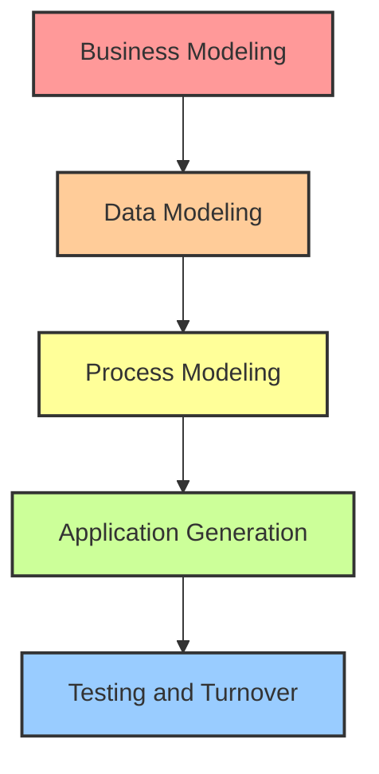

RAD consists of five phases: Business Modeling (understanding information flow), Data Modeling (refining data objects), Process Modeling (transforming data), Application Generation (using automated tools to build code), and Testing (focusing on new components). 

**Scenarios for Effectiveness:**
RAD is highly effective when requirements are well understood and the project scope is constrained. It is ideal for internal business applications (like HR portals or inventory systems) where the user interface is critical and end-users are readily available to provide immediate feedback. However, it requires a strong, committed team; if developers or clients cannot maintain the fast pace, RAD projects will fail. It is not suitable for highly complex, technically risky projects.

### Q30. Apply the Component Assembly Model to a software development scenario and demonstrate how reusable components improve development efficiency. (5 Marks)
The Component Assembly Model incorporates many characteristics of the spiral model but relies heavily on the use of pre-packaged software components or object-oriented classes. Instead of writing code from scratch, developers assemble existing, validated components to build the new system. 

Imagine a scenario where a team is developing a new E-Commerce web application. Instead of custom-coding a payment gateway, a user authentication system, and a shopping cart, the team evaluates and selects existing secure components for these features (e.g., integrating Stripe for payments and Auth0 for logins). 

**Improving Efficiency:**
This approach massively improves development efficiency in several ways:
1. **Time Savings**: Development time is drastically reduced because large portions of the system are simply plugged in rather than written and debugged line-by-line.
2. **Reduced Cost**: Buying or reusing existing components is often significantly cheaper than financing the man-hours required for custom development.
3. **Higher Quality & Reliability**: Reusable components have usually been thoroughly tested in other applications, meaning they come with fewer bugs.
4. **Faster Time-to-Market**: The focus shifts from coding to integration and testing, allowing the E-Commerce platform to launch much earlier.

### Q31. Apply the Concurrent Process Model to a practical software project. Outline its features and demonstrate how it manages parallel activities. (5 Marks)
The Concurrent Process Model, often represented as a series of major project activities existing simultaneously in various states, is highly effective for client/server systems or distributed software development. 

Consider a practical project: developing a mobile application and its corresponding backend server API. 
In the Concurrent model, the backend API team doesn't wait for the frontend design to be entirely finished. The 'Design' activity might be in the "Under Revision" state, while the 'Backend Development' activity transitions to the "Under Development" state based on initial agreements. 

**Managing Parallel Activities:**
The model handles concurrency through state transitions triggered by events. For instance, if the frontend team discovers a new requirement and changes the design, a "change event" is fired. The backend activity, which might be in the "Baselined" state, is immediately transitioned back to "Awaiting Changes" or "Under Revision." 

This event-driven network ensures that all parallel tracks of development stay synchronized. It is highly beneficial because it provides an accurate picture of the current state of a project. Instead of pretending a phase is "100% complete," it acknowledges that a component is "Baselined but awaiting testing," allowing multiple teams to work continuously without traditional bottleneck blockages.

### Q32. Analyze the advantages and disadvantages of Agile development in comparison to traditional process models. (5 Marks)
Agile development and traditional models (like Waterfall) represent two fundamentally different philosophies in software engineering. Agile focuses on adaptability, while traditional models focus on predictability.

**Advantages of Agile (vs. Traditional):**
1. **Flexibility to Change**: Agile welcomes changing requirements even late in development, whereas traditional models struggle significantly with changes once the design phase is locked.
2. **Continuous Feedback**: Agile delivers working software in short sprints (2-4 weeks), allowing constant customer feedback. Traditional models typically only show the product at the very end.
3. **Faster Time-to-Market**: Core features can be released early in Agile, whereas Waterfall requires the entire product to be finished before release.
4. **Improved Quality**: Continuous integration and daily testing in Agile catch bugs early.

**Disadvantages of Agile (vs. Traditional):**
1. **Lack of Documentation**: Agile prioritizes working software over comprehensive documentation. Traditional models produce extensive documentation, which is helpful for future maintenance.
2. **Unpredictable Costs and Timelines**: Because the scope is flexible, it is hard to estimate final costs and delivery dates accurately compared to fixed traditional models.
3. **High Resource Demands**: Agile requires experienced developers and intense, constant collaboration with the client, which isn't always possible in strict corporate environments.

### Q33. Apply the Spiral Model to a risk-intensive software development scenario and justify the conditions under which it is most appropriate. (5 Marks)
The Spiral Model combines iterative development with systematic risk management. It consists of four main sectors: Planning, Risk Analysis, Engineering, and Evaluation. Each loop around the spiral represents a phase of the project, gradually building from a concept to a fully realized system.

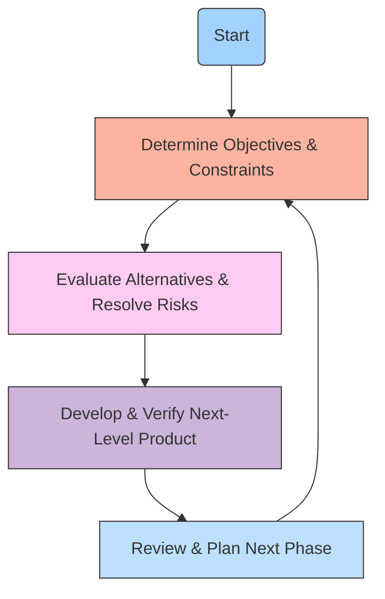

**Application to a Risk-Intensive Scenario:**
Imagine developing a life-critical medical imaging AI system. The risks are massive (patient misdiagnosis, strict regulatory compliance). Using the Spiral Model, the first loop might just produce a prototype to test the AI algorithm's feasibility (Risk Analysis). If it fails, the project can pivot or be cancelled before spending millions. The next loop might build a larger prototype to test regulatory compliance, and so on.

**Justification for Use:**
The Spiral model is most appropriate for large-scale, expensive, and complex projects where risk avoidance is the absolute highest priority. It is ideal when a new, untested technology is being utilized, or when requirements are highly complex and not fully understood upfront. It prevents disastrous failures by continuously evaluating risks before major investments are made.

### Q34. Analyze the application of the Incremental Model in software product development by comparing it with the Waterfall model. (5 Marks)
The Incremental Model merges the linear sequential flow of the Waterfall model with the iterative philosophy. Instead of delivering a massive final product in one go, the software is divided into independent, functional increments (modules) that are delivered staggered over time.

**Comparison with Waterfall:**
In a classic Waterfall, developing a comprehensive HR Management System (HRMS) would mean gathering all requirements for Payroll, Leave Management, and Recruitment, designing everything, coding everything, and finally delivering the whole system after a year. If the client hates it, the project fails entirely.

In the Incremental Model, the team applies a "mini-Waterfall" to each module. First, they develop and deliver just the Payroll module (Increment 1). The client starts using it immediately and provides feedback. While they use Payroll, the team develops Leave Management (Increment 2), integrating it later. 

**Advantages over Waterfall:**
1. **Early Value Delivery**: Customers get usable functionality much earlier.
2. **Lower Risk of Failure**: If Increment 1 is flawed, only one part of the project is delayed, not the entire system.
3. **Manageable Workload**: Staffing can be focused on one increment at a time, making project management easier than handling massive, monolithic Waterfall development.

### Q35. Design an Agile development plan for a startup product by applying core Agile values and selecting appropriate practices. (5 Marks)
Startups operate in highly uncertain environments where they must rapidly validate product ideas against market needs. An Agile development plan is crucial for this survival.

**The Agile Development Plan:**
1. **Embrace Customer Collaboration (Core Value)**: The startup will not spend months writing a massive spec document. Instead, the Product Owner will create a lightweight "Product Backlog" consisting of user stories based on direct interviews with early adopters.
2. **Iterative Sprints (Practice)**: The development will be structured in short, 2-week "Sprints." This ensures rapid delivery and prevents the team from going down the wrong path for too long.
3. **Working Software over Documentation (Core Value)**: By the end of Sprint 1, the goal is an MVP (Minimum Viable Product). For a food delivery app, this means a simple interface to order from one dummy restaurant, completely skipping complex payment integrations initially.
4. **Daily Stand-ups (Practice)**: The small startup team will hold 15-minute daily meetings to discuss what was done, what will be done, and any blockers, ensuring high team interaction (Individuals over processes).
5. **Responding to Change (Core Value)**: After releasing the MVP, user analytics might show customers want grocery delivery instead. The Agile plan allows the startup to instantly pivot the next sprint's backlog without breaking contractual agreements or rigid plans.

### Q36. Apply the Prototyping Model to a real-life example explaining all steps. Evaluate the trade-offs of using prototyping versus non-prototyping approaches. (10 Marks)
The Prototyping Model is a systems development method in which a prototype (an early approximation of a final system) is built, tested, and then reworked as necessary until an acceptable outcome is achieved from which the complete system can be developed.

**Application to a Real-Life Example:**
Imagine a software company tasked with building an innovative Virtual Reality (VR) interactive learning platform for medical students. Because VR interfaces are novel and highly subjective, the requirements cannot be fully documented upfront. The Prototyping Model is applied in the following steps:

1. **Requirements Gathering & Refinement**: The developers meet with medical professors to understand the broad objectives (e.g., simulating a surgical operation). Detailed features are left open.
2. **Quick Design**: The team rapidly designs a very basic VR environment focusing on the user interface and basic interaction, rather than underlying database architecture.
3. **Building the Prototype**: Developers create a "throwaway" or evolutionary VR mockup where a user can pick up a scalpel, even if the physics aren't perfect yet.
4. **Customer Evaluation**: The medical students and professors try the VR prototype. They provide crucial feedback: "The hand controls feel unnatural," or "We need to zoom in closer."
5. **Refinement**: The developers tweak the design based on the feedback. Steps 3, 4, and 5 iterate until the users are highly satisfied with the feel and functionality.
6. **Engineer Full System**: Once the prototype is approved, the team uses the validated design to build the robust, production-ready software with proper backend architecture.

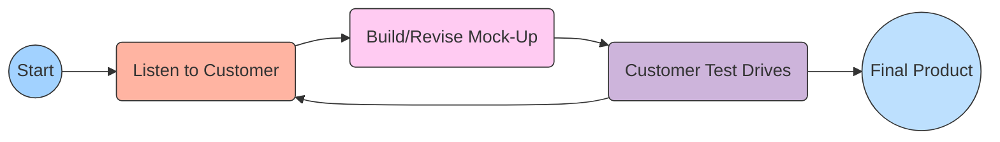

**Trade-offs: Prototyping vs. Non-Prototyping (Waterfall)**
*Advantages of Prototyping:*
The biggest advantage is massive risk reduction concerning user acceptance. Customers can "see and feel" the product early, eliminating misunderstandings. It is excellent for novel systems where requirements are fuzzy. It heavily increases user involvement and satisfaction.
*Disadvantages of Prototyping:*
Customers may mistake the flimsy prototype for a nearly finished product, demanding an unrealistic launch date. Furthermore, developers might make poor architectural choices (like using an inefficient database) just to get the prototype working quickly, and then fail to rewrite it properly for the final product, resulting in unmaintainable legacy code. Non-prototyping approaches, while rigid, ensure rigorous, well-planned architecture from day one.

### Q37. Analyze which software development model best suits a scenario where a large formal client enforces a strict approach. Justify by comparing it with Agile alternatives. (10 Marks)
In a scenario involving a large, formal client (such as a government defense contractor, a highly regulated banking institution, or a major healthcare provider) that enforces strict compliance, rigid documentation, and fixed budgets, the **Waterfall Model (or the V-Model variation)** is the most suitable software development approach. 

**Characteristics of the Scenario:**
Large formal clients typically require exhaustive upfront planning. They operate on fixed-price contracts, meaning the exact scope of work must be defined before a single line of code is written. They have strict regulatory auditing requirements that mandate comprehensive documentation at every stage (requirements specs, architectural blueprints, test plans). Changes to scope usually require a formal, slow change-request board approval.

**Justification for Waterfall / Plan-Driven Approach:**
1. **Clear Milestones and Deliverables**: Waterfall provides distinct, easily trackable phases (Requirements -> Design -> Coding -> Testing). A formal client can sign off on a massive Requirements Document, providing a legal and financial baseline for the project.
2. **Comprehensive Documentation**: If the development team changes, or if an external auditor reviews the system 5 years later, the heavy documentation mandated by Waterfall ensures knowledge is preserved and compliance is proven.
3. **Predictability**: Budgeting and resource allocation are highly predictable, which is a massive priority for bureaucratic organizations.

**Comparison with Agile Alternatives:**
If we attempted to use an Agile approach (like Scrum) for this strict client, severe friction would occur. 
*   **Documentation Clash**: Agile values "working software over comprehensive documentation." The client's compliance officers would reject the software without extensive manuals and architectural proofs.
*   **Scope and Contract Friction**: Agile welcomes changing requirements late in development. A formal client with a fixed-price contract views changing requirements as "scope creep" that ruins budget allocations. Agile's flexible scope makes writing a traditional legal contract very difficult.
*   **Customer Availability**: Agile requires continuous, daily involvement from the client (e.g., a dedicated Product Owner). Large formal clients usually do not have the time or willingness to dedicate senior personnel to daily stand-ups; they prefer to state their needs upfront and return months later for the final product.

Therefore, while Agile is excellent for innovation and speed, a traditional, prescriptive model like Waterfall aligns perfectly with the bureaucratic, risk-averse, and highly structured nature of large formal clients.

### Q38. Evaluate which software development approach best adapts to frequently changing client requirements. Construct a justification supported by model characteristics. (10 Marks)
When a software project is faced with highly volatile and frequently changing client requirements, the **Agile Development Methodology** (specifically frameworks like **Scrum** or **Extreme Programming (XP)**) is unequivocally the best approach. Traditional plan-driven models completely break down under the stress of continuous changes, whereas Agile models are explicitly designed to harness change for the customer's competitive advantage.

**Justification Based on Agile Model Characteristics:**

1. **Iterative and Incremental Delivery:**
Unlike the Waterfall model, which attempts to build the entire system in one monolithic pass, Agile delivers software in short, time-boxed iterations (Sprints) usually lasting 1 to 4 weeks. This characteristic is crucial for adapting to change. If a client realizes a major requirement was wrong, the team only loses a few weeks of work at most. They can immediately pivot the direction of the product at the start of the next iteration.

2. **Dynamic Backlog Management:**
Agile uses a "Product Backlog" instead of a rigid Requirements Specification Document. The backlog is an ordered, living list of everything that is needed in the product. As client requirements change, the Product Owner can instantly add, remove, or reprioritize items in the backlog. The development team only commits to the requirements at the very top of the list during a Sprint Planning session, ensuring they are always working on the most currently relevant features.

3. **Continuous Customer Collaboration:**
Agile promotes having a dedicated representative of the client (the Product Owner) integrated with the development team. This constant collaboration ensures that as the client's business environment changes, the software team is immediately informed. Frequent demonstrations of working software at the end of each Sprint allow the client to physically see the progress and realize earlier if their initial requirements need adjustment.

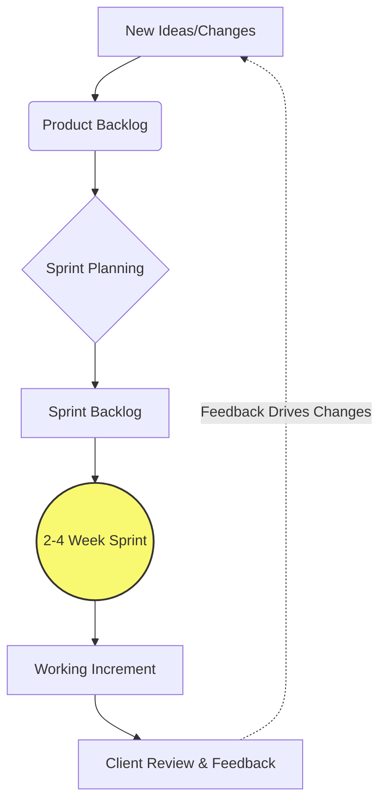

4. **Embracing Change as a Core Value:**
The Agile Manifesto explicitly states "Responding to change over following a plan." In traditional models, a change request involves painful bureaucracy, budget renegotiations, and delays. In Agile, change is expected and welcomed. The architecture and code are kept simple and flexible through practices like refactoring and Test-Driven Development (in XP), ensuring that the codebase can adapt to new requirements without shattering.

### Q39. Design a software development strategy for a project where customer requirements are unclear at the start. Apply the appropriate process model and justify each phase decision. (10 Marks)
When embarking on a project where customer requirements are vague, unclear, or highly conceptual (e.g., a novel AI-driven consumer application), proceeding with a linear model like Waterfall guarantees failure. The best strategy is to adopt an evolutionary approach using the **Evolutionary Prototyping Model** combined with **Iterative Agile principles**.

**Proposed Software Development Strategy & Phase Decisions:**

**Phase 1: Initial Discovery & Rapid Prototyping**
*   **Action**: The team conducts brief interviews with the stakeholders to capture the core vision, without attempting to write exhaustive specifications. They immediately construct a high-fidelity, interactive prototype (or mockup) focusing on User Interface (UI) and user flows.
*   **Justification**: Because the customer doesn't know exactly what they want, asking them to read a 100-page document will not help. Humans are visual. Giving them a clickable prototype allows them to experience the concept, instantly clarifying their vague ideas and generating concrete requirements based on their reactions.

**Phase 2: Customer Evaluation and Refinement Loop**
*   **Action**: The customer interacts with the prototype. The development team takes rigorous notes on their feedback. The prototype is rapidly modified and presented again. This loop continues until the core workflow is approved.
*   **Justification**: This mitigates the highest risk of the project: building the wrong product. Throwing away a rapid prototype costs very little compared to throwing away months of actual backend coding.

**Phase 3: Iterative Development (Agile Sprints)**
*   **Action**: Once the prototype establishes clear baseline requirements, the project transitions into Agile Sprints (2-week cycles). The approved features from the prototype are placed into a Product Backlog. The team builds the actual, robust software incrementally, starting with the highest-priority core features.
*   **Justification**: Even with a validated prototype, requirements will still evolve as the real software takes shape. Iterative Sprints allow the team to remain flexible. Delivering working increments every two weeks maintains customer confidence and allows for continuous micro-course corrections.

**Phase 4: Continuous Integration & Testing**
*   **Action**: Implement automated testing and continuous integration pipelines. As new features are coded to satisfy emerging requirements, they are automatically tested against the existing codebase.
*   **Justification**: When requirements are fluid, the codebase changes frequently. Automated testing ensures that adapting to a new requirement doesn't accidentally break existing, stable functionality, maintaining high software quality in a dynamic environment.

### Q40. Analyze how Scrum benefits software development by promoting teamwork, adaptability, and continuous improvement. Examine its ceremonies, roles, and artifacts. (10 Marks)
Scrum is the most popular Agile framework, designed to tackle complex software projects by providing a lightweight structure that maximizes teamwork, rapid adaptability, and relentless continuous improvement. 

**Core Roles Enhancing Teamwork:**
1.  **Product Owner (PO)**: Maximizes product value. By having a single person responsible for the product vision and backlog, the team avoids conflicting priorities and confusion.
2.  **Scrum Master**: A servant-leader who removes impediments and protects the team from external interruptions. This role ensures the team can focus deeply on their work, fostering a healthy, high-performance environment.
3.  **Development Team**: A self-organizing, cross-functional group. Scrum destroys traditional silos (where designers don't talk to coders). The whole team is collectively accountable for the sprint goal, fostering intense collaboration and shared ownership.

**Artifacts Promoting Transparency and Adaptability:**
1.  **Product Backlog**: A dynamic, prioritized list of all desired features. It adapts daily to market changes, ensuring the team is always working on the most valuable tasks.
2.  **Sprint Backlog**: The set of items selected for the current Sprint. It provides a highly focused, short-term plan that the team commits to, creating a stable micro-environment amidst broader project volatility.
3.  **Product Increment**: The sum of all working, integrated software completed during a sprint. It must be in a usable state, providing tangible proof of progress and allowing for immediate adaptability based on real-world use.

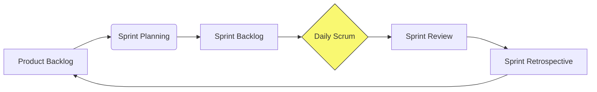

**Ceremonies Driving Continuous Improvement:**
1.  **Sprint Planning**: Aligns the team on the goal and strategy for the upcoming weeks.
2.  **Daily Scrum (Stand-up)**: A 15-minute daily synchronization. It rapidly identifies blockers, allowing the team to adapt their daily plan and help each other, severely reducing wasted time.
3.  **Sprint Review**: A demonstration of the working increment to stakeholders. It provides critical feedback, allowing the PO to adapt the Product Backlog for the next sprint.
4.  **Sprint Retrospective**: The ultimate engine of continuous improvement. At the end of every sprint, the team reflects on their internal processes (what went well, what failed, interpersonal conflicts) and commits to actionable improvements for the next sprint, ensuring the team gets faster and happier over time.

### Q41. Apply the principles of Extreme Programming (XP) to a software development scenario and demonstrate how its practices improve code quality and team collaboration. (10 Marks)
Extreme Programming (XP) is a highly disciplined Agile framework that takes established software engineering best practices to "extreme" levels. It is particularly focused on delivering exceptionally high-quality code and thriving in environments with rapidly changing requirements.

**Application Scenario:**
Consider a team developing a high-frequency trading platform for a financial firm. The requirements change daily based on market conditions, and a single bug could cost millions of dollars. The team applies XP practices to manage this immense pressure.

**Improving Code Quality through XP Practices:**
1.  **Test-Driven Development (TDD)**: In XP, developers write automated test cases *before* they write the actual code. For the trading platform, they first write a test for a new algorithmic trade. It fails. They then write the minimum code necessary to make the test pass. This ensures that every single function has test coverage, virtually eliminating critical bugs and making the code incredibly robust.
2.  **Continuous Integration (CI)**: Code is integrated into the main repository multiple times a day. Automated tests run instantly. If a developer's code breaks the system, they know within minutes, not weeks. This prevents "integration hell" and ensures the software is always in a deployable state.
3.  **Refactoring**: XP encourages developers to constantly improve the design of existing code without changing its behavior. As the trading logic gets complex, developers continuously clean the code, preventing "technical debt" and ensuring long-term maintainability.
4.  **Simple Design**: XP mandates building the simplest thing that works for today's requirements, avoiding complex architectures for hypothetical future needs.

**Improving Team Collaboration through XP Practices:**
1.  **Pair Programming**: All production code is written by two programmers sitting at one machine. One types (the driver), while the other reviews the code in real-time and thinks about strategic implications (the navigator). This drastically reduces bugs, shares knowledge instantly, and prevents "siloed" expertise. If one developer leaves the firm, the knowledge remains.
2.  **Collective Code Ownership**: Anyone on the team can improve any part of the code at any time. There is no ego or "my code vs. your code." This fosters immense team unity and accelerates development speed.
3.  **On-Site Customer**: The financial client sits directly with the development team, answering questions instantly. This eliminates long email chains and ensures the team builds exactly what is needed, bridging the gap between business and engineering perfectly.

### Q42. Apply and evaluate Agile versus traditional development approaches for an in-house flexible-client project. Recommend a justified development strategy. (10 Marks)
**Scenario Analysis:**
The project is an "in-house flexible-client project." This means the development team and the stakeholders (clients) belong to the same organization. The "flexible-client" aspect implies that requirements are not strictly locked down by rigid external contracts, budgets are likely more fluid, and the primary goal is maximizing business value rather than adhering to a predefined bureaucratic spec.

**Evaluation of Traditional Approach (Waterfall):**
Applying a Waterfall model to this scenario would be highly counterproductive. Waterfall demands exhaustive upfront planning and rigid phase gates. In an in-house project, forcing internal stakeholders to write a 200-page requirements document before development begins creates artificial barriers and wastes time. If market conditions change and the internal client wants to pivot, the Waterfall change-control processes will cause extreme frustration, slowing down the company's competitive edge. The heavy documentation focus of traditional models offers little return on investment when the team and client are co-located and flexible.

**Evaluation of Agile Approach (Scrum/Kanban):**
Agile is practically tailor-made for this exact environment. Because the client is in-house, continuous collaboration is easy to facilitate. The flexibility of Agile allows the internal business units to experiment with software features, gather user feedback, and refine the product sprint-by-sprint. Early delivery of working software provides immediate value to the company.

**Recommended Development Strategy: The Scrum Framework**
I strongly recommend an Agile strategy utilizing the Scrum framework.

**Justification & Implementation:**
1.  **Appoint an Internal Product Owner**: Assign a representative from the business unit to manage the Product Backlog. This bridges the gap between the business needs and IT.
2.  **Embrace Iterative Sprints**: Utilize 2-week Sprints. This provides the flexible internal client with frequent check-ins. If they realize a feature isn't working for the business, they only lose 2 weeks of development time.
3.  **Leverage Co-location**: Since it's in-house, mandate daily stand-up meetings. This ensures immediate problem-solving and fosters strong relationships between developers and the business side.
4.  **Focus on Value, Not Contracts**: Replace rigid upfront specifications with User Stories. Because there are no external legal contracts, the team can focus purely on building software that solves the internal business problem, adapting freely as the solution becomes clearer.

This Agile strategy ensures that the in-house project remains dynamic, tightly aligned with the company's evolving business needs, and delivers high-quality working software at a rapid, sustainable pace.


---

# Module 3: Requirements Analysis with Cost Estimation

## Question 43
**Clarify the types of requirements in software engineering with appropriate examples.** (2 Marks)

In software engineering, requirements are generally categorized into three main types:
1. **Functional Requirements**: These define what the system should do. They describe the interactions between the system and its environment, independent of implementation details. *Example*: "The system shall allow users to log in using an email and password."
2. **Non-functional Requirements**: These dictate how the system should perform. They define system attributes such as performance, usability, security, and reliability. *Example*: "The system must process login requests in under 2 seconds."
3. **Domain Requirements**: These are derived from the application domain and reflect specific characteristics or regulations of that field. *Example*: "A banking application must comply with local financial data encryption laws."

## Question 44
**Describe how a feasibility study is conducted during requirements engineering and explain its significance.** (2 Marks)

A feasibility study is a preliminary investigation conducted before heavy resources are committed to a project. It typically assesses several dimensions:
- **Technical Feasibility**: Determining if the required technology exists and if the team has the expertise to build it.
- **Economic Feasibility**: Analyzing whether the system is cost-effective and if its benefits outweigh the development costs.
- **Operational Feasibility**: Evaluating if the proposed system solves the users' problems and fits within the organizational culture.

**Significance**: It helps stakeholders make informed "go/no-go" decisions. By identifying major risks early, it prevents the company from wasting time, money, and effort on unviable projects.

## Question 45
**Apply your understanding to discuss different origins of changes occurring during software product development.** (2 Marks)

Changes in software requirements are inevitable and typically originate from several key sources:
1. **Business Environment Shifts**: Companies may restructure, or market trends may change, requiring the software to adapt to new business goals.
2. **User Feedback**: Once stakeholders or end-users interact with early prototypes, they often realize their actual needs differ from their initial requests.
3. **Technological Advancements**: New hardware, operating system updates, or third-party API changes can force the software to be updated.
4. **Regulatory Changes**: Governments frequently introduce new laws (e.g., data privacy regulations like GDPR), forcing software to adapt compliance measures.

## Question 46
**Explain the five information domain characteristics of function points with suitable examples.** (2 Marks)

Function Point Analysis evaluates a system's size based on five distinct information domain characteristics:
1. **External Inputs (EI)**: Data entering the system that updates internal logical files. *Example*: A user submitting a registration form.
2. **External Outputs (EO)**: Data exiting the system, usually derived or calculated. *Example*: An automatically generated monthly sales report.
3. **External Inquiries (EQ)**: Simple requests for data where no calculation is performed and no data is altered. *Example*: Searching for a book by its title in a library catalog.
4. **Internal Logical Files (ILF)**: Logical groupings of data maintained within the system's boundary. *Example*: The user account database.
5. **External Interface Files (EIF)**: Data files referenced by the system but maintained by an external system. *Example*: A third-party currency exchange rate API.

## Question 47
**Differentiate between Requirement Elicitation and Requirement Analysis activities.** (2 Marks)

**Requirement Elicitation** is the process of gathering and extracting requirements directly from stakeholders. It utilizes techniques like interviews, surveys, and observation to discover what the users *want*. It is a communication-heavy, outward-facing activity.

**Requirement Analysis**, in contrast, takes the raw data gathered during elicitation and examines it critically. Its purpose is to detect ambiguities, resolve conflicting requirements, and structure the data into clear, consistent models. While elicitation collects the information, analysis refines and formalizes it into a true software specification.

## Question 48
**Illustrate the kinds of checks conducted during requirement validation with examples.** (2 Marks)

Requirement validation ensures that the defined requirements accurately represent the stakeholders' true needs before development begins. Key checks include:
1. **Validity Checks**: Does this requirement reflect a real need? *Example*: Verifying if a complex reporting feature is actually needed by the client.
2. **Consistency Checks**: Are there any contradictory requirements? *Example*: One requirement states "passwords must be exactly 8 characters," while another states "passwords must be 10-15 characters."
3. **Completeness Checks**: Are all expected functionalities included? *Example*: Checking if the system has an error-handling mechanism for failed payments.
4. **Realism Checks**: Can these requirements be implemented given the budget and technology? *Example*: Ensuring an AI feature is feasible on standard hardware.

## Question 49
**Apply the concept of requirement gathering to justify its significance in software development.** (2 Marks)

Requirement gathering serves as the foundational pillar of any software development project. Its primary significance is risk reduction. By actively communicating with users to understand exactly what they need, developers prevent costly misunderstandings later in the lifecycle. Poor requirement gathering inevitably leads to scope creep, massive budget overruns, and ultimately, software that end-users reject because it fails to solve their core problems. Proper gathering establishes a clear, shared vision and an actionable roadmap.

## Question 50
**Apply scheduling concepts to draw and explain a scheduling diagram for a railway ticket reservation application development project.** (5 Marks)

A scheduling diagram maps out parallel and dependent tasks over time, ensuring efficient allocation of resources. For a complex system like a Railway Ticket Reservation application, activities must follow a logical sequence while allowing independent tasks to run concurrently.

**Explanation of the Schedule**:
1. **Requirements Phase**: We begin by eliciting needs from the railway administration and passengers.
2. **System Design**: Once requirements are analyzed, architecture and database schema design begins. 
3. **Implementation**: Coding starts after design. The database can be set up concurrently with the UI.
4. **Testing**: Once modules are coded, testing ensures the system handles high user concurrency.

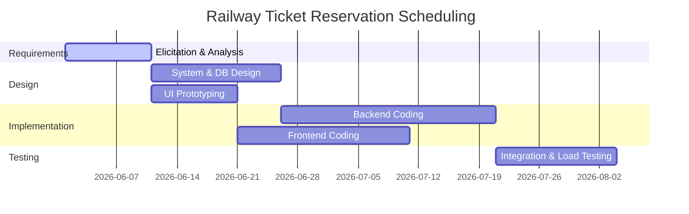

## Question 51
**Analyze the given DRDO project numerical: Apply the appropriate COCOMO model and compute effort, development time, and staffing.** (5 Marks)

*(Note: As the explicit numerical data for the DRDO project is omitted in the source question, the following applies the Intermediate COCOMO Model to a representative mission-critical project of 50 KLOC in Embedded mode.)*

**Step 1: Identify Parameters**
For embedded, complex, mission-critical systems (like defense projects), the **Embedded Mode** is used.
Constants: `a = 3.6`, `b = 1.20`, `c = 2.5`, `d = 0.32` (or 0.38 depending on specific COCOMO standard, using standard Basic embedded values: d=0.32). Size = 50 KLOC.

**Step 2: Calculate Effort**
Formula: Effort (E) = a * (KLOC)^b
E = 3.6 * (50)^1.20
E = 3.6 * 109.33 = **393.6 Person-Months (PM)**

**Step 3: Calculate Development Time**
Formula: Time (T) = c * (E)^d
T = 2.5 * (393.6)^0.32
T = 2.5 * 6.86 = **17.15 Months**

**Step 4: Calculate Staffing**
Formula: Staff = Effort / Time
Staff = 393.6 / 17.15 = **22.95 (approx. 23 Persons)**

## Question 52
**Apply DFD modeling concepts to identify and draw the components of an Analysis Model with a suitable explanation.** (5 Marks)

Data Flow Diagrams (DFDs) are a cornerstone of the analysis model, allowing designers to visualize how information transforms as it moves through a system. DFDs focus purely on logical data flow, ignoring physical implementation.

**Core Components**:
1. **External Entities (Squares)**: Represent people, organizations, or other systems that act as sources or sinks of data (e.g., a "Customer").
2. **Processes (Circles or Rounded Rectangles)**: Represent actions that transform input data into output data (e.g., "Calculate Bill").
3. **Data Stores (Open Rectangles)**: Represent data at rest or databases where information is stored for later retrieval (e.g., "Inventory DB").
4. **Data Flows (Arrows)**: Represent the pipelines through which data packets travel between components.

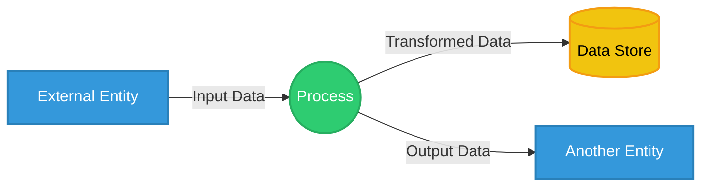

## Question 53
**Construct DFD Level 0 and Level 1 diagrams for a Library Management System applying appropriate data flow design principles.** (5 Marks)

A Library Management System tracks book inventories, manages members, and handles the issuing and returning of books.

**Level 0 (Context Diagram)**: Treats the entire system as a single abstract process. It shows the boundaries of the system and its interactions with external entities (Members and Librarians).

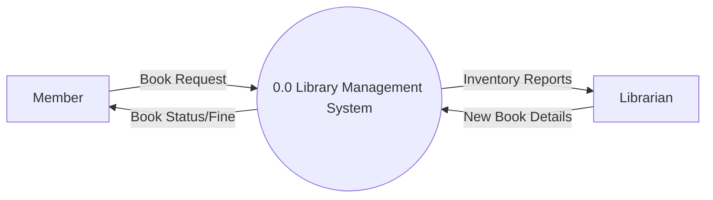

**Level 1 Diagram**: Decomposes the central Level 0 process into its primary sub-processes.

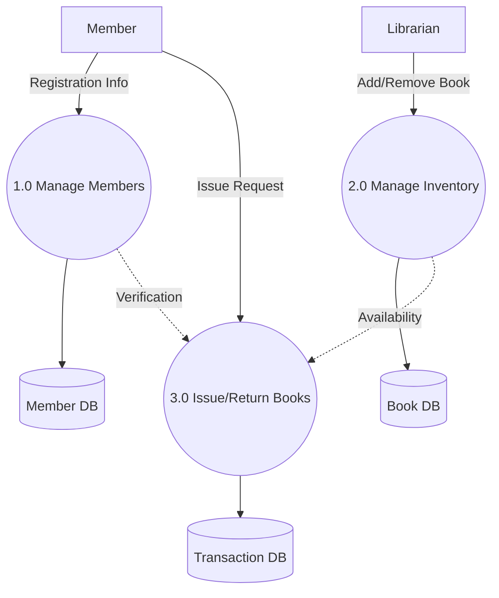

## Question 54
**Apply function point analysis to the given Library Management System numerical and estimate the development effort.** (5 Marks)

*(Note: As specific domain counts are omitted, representative values for a Library System are assumed.)*
Assume average complexity for all parameters:
- External Inputs (EI) = 4 (e.g., Add Book, Register Member) -> Weight 4
- External Outputs (EO) = 5 (e.g., Issue Slip, Fine Report) -> Weight 5
- External Inquiries (EQ) = 4 (e.g., Search Book) -> Weight 4
- Internal Logical Files (ILF) = 2 (Member DB, Book DB) -> Weight 10
- External Interface Files (EIF) = 1 (Payment Gateway) -> Weight 7

**Step 1: Calculate Unadjusted Function Points (UFP)**
UFP = (4*4) + (5*5) + (4*4) + (2*10) + (1*7)
UFP = 16 + 25 + 16 + 20 + 7 = **84**

**Step 2: Calculate Function Points (FP)**
Assuming standard average system complexity, Value Adjustment Factor (VAF) = 1.0.
FP = UFP * VAF = 84 * 1.0 = **84 FP**

**Step 3: Estimate Effort**
Assuming an industry average effort rate of 1.5 Person-Months per FP:
Total Effort = 84 FP * 1.5 PM/FP = **126 Person-Months**

## Question 55
**Analyze the key differences between Basic, Intermediate, and Detailed COCOMO models and examine their impact on cost estimation accuracy.** (5 Marks)

The Constructive Cost Model (COCOMO) evolves in granularity across three levels, each drastically impacting estimation accuracy:

1. **Basic COCOMO**: Estimates effort and cost purely based on the estimated size of the project (KLOC) and the development mode (Organic, Semi-detached, Embedded). It is quick but lacks accuracy for complex projects because it completely ignores factors like team experience or hardware constraints.
2. **Intermediate COCOMO**: Enhances the Basic model by introducing 15 Cost Drivers (Effort Multipliers), encompassing product attributes (e.g., software reliability), hardware attributes (e.g., memory constraints), and personnel attributes (e.g., analyst capability). This significantly improves accuracy by tailoring the formula to the project's unique real-world environment.
3. **Detailed COCOMO**: The most sophisticated level. It applies the 15 Cost Drivers not just universally across the project, but specifically to each individual phase of the software engineering process (planning, design, coding, testing). It yields the highest accuracy but requires immense effort and data to calculate properly.

## Question 56
**Design a requirements engineering plan for a new e-commerce application, integrating elicitation, validation, and specification activities.** (5 Marks)

A robust requirements engineering plan for an e-commerce platform must ensure seamless user experience and secure transactions.

1. **Elicitation Activities**:
   - *Interviews*: Conduct sessions with business stakeholders to define ROI goals.
   - *Questionnaires*: Survey potential shoppers to identify desired features (e.g., one-click checkout, wishlists).
   - *Competitor Analysis*: Review existing platforms to baseline standard features.
2. **Analysis Activities**:
   - Resolve conflicting priorities (e.g., balancing high-resolution imagery with fast page load times).
   - Construct Use Case models to visualize the checkout flow.
3. **Specification Activities**:
   - Draft a comprehensive Software Requirements Specification (SRS) detailing functional rules (cart logic) and critical non-functional rules (PCI-DSS compliance for payments).
4. **Validation Activities**:
   - Host walkthroughs with stakeholders to ensure the SRS accurately reflects business goals.
   - Perform prototyping to let users validate the UI/UX early.

## Question 57
**Apply appropriate requirements gathering techniques to construct a structured requirements elicitation plan for a real-world Hospital Management System.** (10 Marks)

A Hospital Management System (HMS) is a massive, life-critical software application involving highly diverse stakeholders ranging from doctors and nurses to receptionists and IT administrators. A structured elicitation plan is mandatory to capture accurate requirements.

**1. Stakeholder Identification & Profiling**
First, map out the users. Medical staff prioritize speed and accuracy, administrators prioritize reporting, and IT prioritizes security (HIPAA compliance).

**2. Technique Application Plan**
- **One-on-One Interviews (For Management and Doctors)**: Conduct structured interviews with senior doctors to understand their specific workflow needs for patient history and prescription management.
- **Surveys and Questionnaires (For Nurses and Staff)**: Distribute broad surveys to the nursing staff to identify common pain points in their current manual shift-handover processes.
- **Observation / Ethnography (For Receptionists)**: Spend time shadowing the front desk to silently observe how patient admissions and emergency triages are currently handled in real-time, uncovering unstated needs.
- **Document Analysis (For Compliance)**: Review existing paper forms, medical billing codes, and legal regulatory documents to ensure the software natively supports required formats.
- **Joint Application Development (JAD) Sessions**: Host workshops combining doctors, IT, and administrators. This is critical for resolving conflicting requirements, such as the trade-off between strict security (passwords timing out) and the need for rapid emergency access.

**3. Prototyping for Early Feedback**
Build low-fidelity UI mockups of the doctor's dashboard. Medical staff are rarely software experts; showing them a prototype helps elicit specific feedback that abstract questions cannot.

By combining direct communication, passive observation, and interactive prototyping, this structured plan ensures no critical healthcare requirement is missed, securing product quality and user acceptance.

## Question 58
**Analyze various activities encompassed within requirements engineering. Examine each activity with concrete examples and evaluate its contribution to product quality.** (10 Marks)

Requirements Engineering is not a single task, but a structured lifecycle of activities designed to bridge the gap between user needs and technical implementation.

1. **Inception**: The starting point where basic understanding of the problem is established. 
   - *Example*: Recognizing that a university's paper-based grading system is causing delays. 
   - *Contribution*: Prevents building a product for a non-existent problem.
2. **Elicitation**: The active process of gathering needs from stakeholders. 
   - *Example*: Interviewing professors to discover they need a bulk-upload feature for grades. 
   - *Contribution*: Directly increases usability by ensuring user needs are actually met.
3. **Elaboration**: Expanding gathered requirements into structured models. 
   - *Example*: Creating DFDs to map how a grade moves from a professor's input to a student's transcript. 
   - *Contribution*: Reduces ambiguity and acts as an early architectural guide, improving structural quality.
4. **Negotiation**: Resolving conflicts among stakeholders. 
   - *Example*: Balancing the IT department's strict password rotation policy with students' desire for seamless login. 
   - *Contribution*: Ensures a balanced product that is both secure and user-friendly.
5. **Specification**: Formalizing the negotiated requirements into a definitive Software Requirements Specification (SRS) document. 
   - *Example*: Writing specific performance metrics ("login must execute in < 2 seconds"). 
   - *Contribution*: Acts as the definitive blueprint, greatly reducing bugs caused by developer assumptions.
6. **Validation**: Reviewing the SRS to ensure it reflects reality. 
   - *Example*: Having the university dean sign off on the final feature list. 
   - *Contribution*: Prevents catastrophic late-stage rework, saving immense time and money.
7. **Management**: Handling requirement changes systematically. 
   - *Contribution*: Maintains project stability when scope changes inevitably occur.

## Question 59
**Construct a Use Case Diagram for a Restaurant Management System and develop DFD Level 0 and Level 1 diagrams applying appropriate modeling standards.** (10 Marks)

A Restaurant Management System (RMS) coordinates customer orders, kitchen preparation, billing, and inventory tracking.

**Use Case Diagram**:
Illustrates the interactions between external actors and system functionalities.

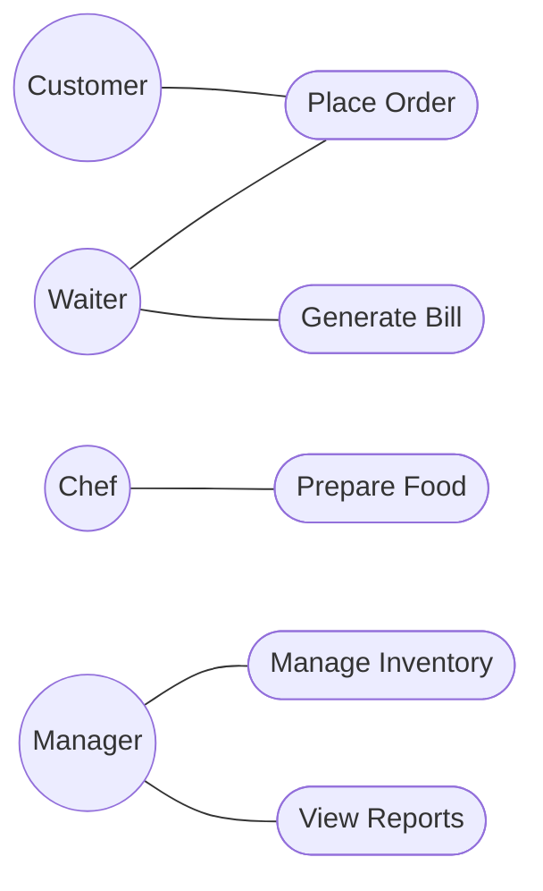

**Data Flow Diagram - Level 0 (Context Diagram)**:
Visualizes the RMS as a single, central entity interacting with external environments.

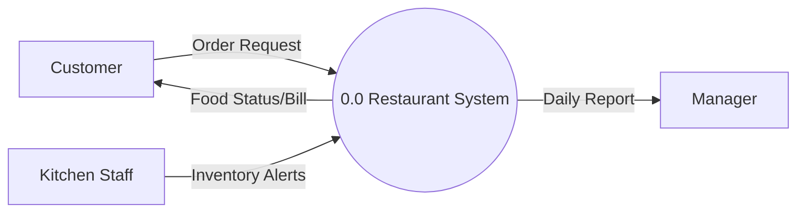

**Data Flow Diagram - Level 1**:
Breaks down the context diagram into logical sub-processes.

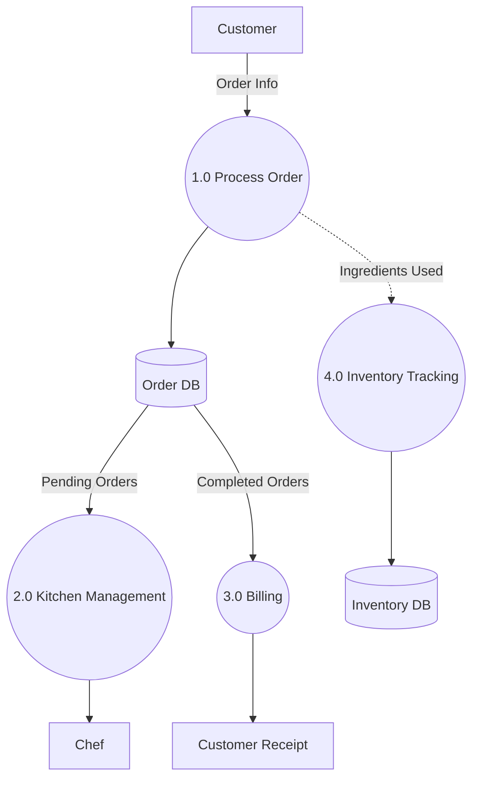

## Question 60
**Design a comprehensive Software Requirements Specification (SRS) document for an online banking system. Apply standard SRS components and justify each section.** (10 Marks)

An SRS is the most critical document in a software project, acting as a binding contract and blueprint. For an Online Banking System, precision is mandatory.

**1. Introduction**
- *Content*: Defines the purpose (e.g., providing 24/7 banking access), scope, and definitions.
- *Justification*: Sets strict project boundaries, preventing scope creep.

**2. Overall Description**
- *Content*: Describes user characteristics (e.g., elderly users needing large fonts, tech-savvy users wanting quick transfers), operating environments, and constraints.
- *Justification*: Contextualizes the system. A banking app cannot assume all users are tech experts, which drives UI simplicity.

**3. Specific Functional Requirements**
- *Content*: 
  - FR1: The system shall allow users to transfer funds between internal and external accounts.
  - FR2: The system shall generate automated PDF statements monthly.
  - FR3: The system shall lock accounts after 3 failed login attempts.
- *Justification*: These are the exact features developers will code. Without clear FRs, the core utility of the bank fails.

**4. Non-Functional Requirements**
- *Content*:
  - *Security*: Must enforce 256-bit AES encryption and mandatory Two-Factor Authentication (2FA).
  - *Performance*: All financial transactions must process in under 3 seconds.
  - *Availability*: Must guarantee 99.99% server uptime.
- *Justification*: For a banking system, NFRs are often more critical than FRs. If the system is functional but insecure or slow, it will lose customer trust instantly.

**5. External Interface Requirements**
- *Content*: Defines how the software interacts with hardware (e.g., mobile biometric scanners) and third-party APIs (e.g., national clearinghouses).
- *Justification*: Ensures seamless integration with the broader financial ecosystem.

## Question 61
**Suppose a Project was estimated to be 400 KLOC. Calculate the effort, development time & Team Size for each of three model i.e, Organic, Semidetached & Embedded.** (10 Marks)

**Given formulas:**
- Effort (E) = a * (KLOC)^b (in Person-Months)
- Time (T) = c * (E)^d (in Months)
- Team Size = Effort / Time (in Persons)
- Project Size (KLOC) = 400

**1. Organic Mode**
*(Small teams, familiar environment)*
Constants: `a = 2.4`, `b = 1.05`, `c = 2.5`, `d = 0.38`
- **Effort**: E = 2.4 * (400)^1.05 
  400^1.05 ≈ 539.57
  E = 2.4 * 539.57 = **1294.97 PM**
- **Time**: T = 2.5 * (1294.97)^0.38
  1294.97^0.38 ≈ 15.25
  T = 2.5 * 15.25 = **38.12 Months**
- **Team Size**: 1294.97 / 38.12 ≈ **34 Persons**

**2. Semi-detached Mode**
*(Medium teams, mixed experience)*
Constants: `a = 3.0`, `b = 1.12`, `c = 2.5`, `d = 0.35`
- **Effort**: E = 3.0 * (400)^1.12
  400^1.12 ≈ 822.7
  E = 3.0 * 822.7 = **2468.1 PM**
- **Time**: T = 2.5 * (2468.1)^0.35
  2468.1^0.35 ≈ 15.36
  T = 2.5 * 15.36 = **38.4 Months**
- **Team Size**: 2468.1 / 38.4 ≈ **64 Persons**

**3. Embedded Mode**
*(Complex hardware/software constraints)*
Constants: `a = 3.6`, `b = 1.20`, `c = 2.5`, `d = 0.38`
- **Effort**: E = 3.6 * (400)^1.20
  400^1.20 ≈ 1325.54
  E = 3.6 * 1325.54 = **4771.9 PM**
- **Time**: T = 2.5 * (4771.9)^0.38
  4771.9^0.38 ≈ 24.9
  T = 2.5 * 24.9 = **62.25 Months**
- **Team Size**: 4771.9 / 62.25 ≈ **77 Persons**

## Question 62
**A software project requires 50,000 lines of code (KLOC = 50). It follows the Organic mode of the COCOMO model. Calculate the Effort (in PM) and Development Time (in months) using the basic COCOMO equations. Also calculate cost required for the development of project. Assume monthly salary of a person is 60k.** (10 Marks)

**Given Data:**
- Size: KLOC = 50
- Mode: Organic
- Constants: `a = 2.4`, `b = 1.05`, `c = 2.5`, `d = 0.38`
- Salary per Person-Month: 60,000 Rupees

**Step 1: Calculate Effort (E)**
Formula: E = a * (KLOC)^b
E = 2.4 * (50)^1.05
50^1.05 ≈ 60.8
E = 2.4 * 60.8 = **145.92 Person-Months (PM)**

**Step 2: Calculate Development Time (T)**
Formula: T = c * (E)^d
T = 2.5 * (145.92)^0.38
145.92^0.38 ≈ 6.64
T = 2.5 * 6.64 = **16.6 Months**

**Step 3: Calculate Total Cost**
Formula: Cost = Effort * Salary
Cost = 145.92 PM * 60,000 Rupees/PM
Cost = **8,755,200 Rupees**

## Question 63
**Calculate estimate of Effort, Time & Cost using FP based estimation technique.** (10 Marks)

**Given Data:**
- EI: 10, Average (Weight = 4)
- EO: 5, High (Weight = 7)
- EQ: 8, Low (Weight = 3)
- ILF: 4, Average (Weight = 10)
- EIF: 6, High (Weight = 7)
- Sum of 14 adjustment factors = 35
- Effort rate = 1.5 Persons-Month Per FP
- Cost Per Person Month = 50,000 Rupees

**Step 1: Calculate Unadjusted Function Points (UFP)**
UFP = (Count * Weight)
EI = 10 * 4 = 40
EO = 5 * 7 = 35
EQ = 8 * 3 = 24
ILF = 4 * 10 = 40
EIF = 6 * 7 = 42
UFP Total = 40 + 35 + 24 + 40 + 42 = **181**

**Step 2: Calculate Value Adjustment Factor (VAF)**
Formula: VAF = 0.65 + [0.01 * (Sum of adjustment factors)]
VAF = 0.65 + (0.01 * 35) = 0.65 + 0.35 = **1.00**

**Step 3: Calculate Final Function Points (FP)**
FP = UFP * VAF = 181 * 1.00 = **181 FP**

**Step 4: Calculate Effort**
Effort = FP * Effort Rate
Effort = 181 * 1.5 = **271.5 Person-Months**

**Step 5: Calculate Total Cost**
Cost = Effort * Cost Per Person Month
Cost = 271.5 * 50,000 = **13,575,000 Rupees**

**Step 6: Calculate Estimated Time**
*(Assuming basic COCOMO general time estimation formula since a specific FP time formula was not provided in the problem statement. T = 2.5 * E^0.38)*
Time (T) = 2.5 * (271.5)^0.38
271.5^0.38 ≈ 8.41
Time = 2.5 * 8.41 = **21.0 Months**


---

## Module 4

### Q64: Illustrate the term 'Design Process' in software engineering and describe its key stages. (2 Marks)
The **Design Process** in software engineering is the transition phase where software requirements are translated into a blueprint for building the software. It involves iterative decision-making to create representations of the system's architecture, interfaces, and components. The key stages include: 1) **Architectural Design**, defining the broad structure and subsystems; 2) **Interface Design**, describing how the software communicates with users and other systems; 3) **Component-Level Design**, detailing the internal data structures and algorithms of each component; and 4) **Data Design**, converting data models into database structures.

### Q65: Apply the concept of User Interface Design and justify its purpose in improving user experience. (2 Marks)
**User Interface (UI) Design** focuses on anticipating what users might need to do and ensuring the interface has elements that are easy to access, understand, and use to facilitate those actions. Its primary purpose is to improve the user experience (UX) by making interactions as simple, intuitive, and efficient as possible. A well-designed UI reduces cognitive load, minimizes user errors, and increases overall satisfaction, ensuring that the software is not just functional but also accessible and user-friendly.

### Q66: Explain the goal of Data Design and illustrate its role in software architecture. (2 Marks)
The primary goal of **Data Design** is to translate data objects defined in the analysis model into data structures that reside within the software, as well as into database architectures. It plays a foundational role in software architecture because the data structure heavily influences the architectural style and the procedural details of the components. Good data design ensures data integrity, optimizes performance, and simplifies data retrieval, forming the bedrock upon which the rest of the application is built.

### Q67: Apply the principle of Refinement in Component-Level Design and discuss its significance. (2 Marks)
**Refinement** is a top-down design strategy where a high-level abstract concept is continuously broken down into more detailed and concrete specifications. In component-level design, a module is refined by elaborating on its internal algorithms, data structures, and procedural logic. Its significance lies in allowing designers to manage complexity by addressing broad concepts first before diving into intricate details, ensuring that each refined component aligns perfectly with the overall architectural objectives.

### Q68: Describe the concept of Information Hiding in design and summarize how it supports encapsulation. (2 Marks)
**Information Hiding** is the principle of segregating the design decisions in a computer program that are most likely to change, thus protecting other parts of the program from extensive modification. It states that modules should be characterized by design decisions that hide their internal complexities from other modules. This strongly supports **encapsulation** by restricting direct access to some of an object's components and binding together the data and functions that manipulate it, promoting a modular and secure architecture.

### Q69: Distinguish between the key elements of a design model and justify each element's role. (2 Marks)
A software design model consists of four key elements: 
1) **Data Design Elements**: Transform information domain models into data structures to ensure efficient data management. 
2) **Architectural Design Elements**: Define the relationships among major software structural elements. 
3) **Interface Design Elements**: Describe how the system communicates with external entities and users, ensuring seamless interaction. 
4) **Component-Level Design Elements**: Detail the internal logic and data structures of individual components, providing a direct blueprint for coding.

### Q70: Apply the principle of modularity to design a simple calculator application and demonstrate how modular decomposition improves maintainability. (5 Marks)
**Modularity** is the practice of subdividing a system into smaller, manageable, and independent units known as modules. For a simple calculator application, modular design involves breaking down the overarching mathematical tasks into distinct, functional modules. 

For instance, the application can be decomposed into:
- **UI Module**: Handles user inputs and displays results.
- **Arithmetic Module**: Contains distinct sub-modules or functions for `add()`, `subtract()`, `multiply()`, and `divide()`.
- **Validation Module**: Checks for mathematical errors, such as division by zero.

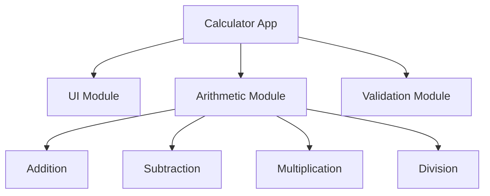

**Improving Maintainability:** Modular decomposition ensures that if a specific feature needs updating (e.g., adding advanced trigonometric functions), the developer only modifies the Arithmetic Module without risking disruption to the UI or Validation modules. Debugging is also simplified, as errors are easily traceable to specific modules. This isolation of functionality heavily reduces the ripple effect of changes, making the system highly maintainable.

### Q71: Apply the concept of abstraction to design a high-level architecture for a banking system and illustrate how abstraction layers reduce complexity. (5 Marks)
**Abstraction** allows designers to focus on essential features while ignoring irrelevant details. In a banking system, multiple layers of abstraction can be designed to separate concerns and reduce complexity.

A typical high-level architecture includes:
- **Presentation Layer**: The highest level of abstraction. Users interact with a clean UI (e.g., "Transfer Funds" button) without knowing the underlying network or database operations.
- **Business Logic Layer**: Handles the core banking rules (e.g., verifying sufficient balance). It abstracts away where the data is stored.
- **Data Access Layer**: The lowest level of abstraction. It executes the SQL queries and database transactions.

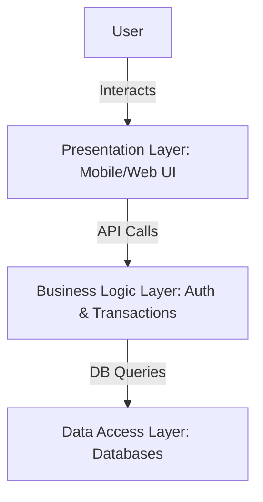

**Reducing Complexity:** Abstraction layers compartmentalize the system. A front-end developer working on the Presentation Layer does not need to understand the complex SQL joins happening in the Data Access Layer. By dealing with simplified representations at each layer, the cognitive load on developers is minimized, and system components can evolve independently as long as their interfaces remain consistent.

### Q72: Analyze the impact of poor User Interface Design on user satisfaction and system usability. Examine real-world failure cases. (5 Marks)
Poor **User Interface (UI) Design** can drastically undermine even the most robust backend systems. If users cannot figure out how to interact with the software, its functionality becomes effectively useless. Poor UI leads to high cognitive load, frequent user errors, frustration, and ultimately, system abandonment.

**Impacts:**
1. **Decreased Productivity**: Users spend more time figuring out how to use the tool than actually doing their tasks.
2. **Increased Training Costs**: Complex interfaces require extensive manuals and training sessions.
3. **High Error Rates**: Ambiguous buttons or confusing layouts lead to accidental data deletion or incorrect inputs.

**Real-World Failure Case:** The Hawaii missile alert incident in 2018 is a prime example of UI failure. A poorly designed dropdown menu with highly confusing and similarly worded options ("DRILL - PACOM (CDW) - STATE ONLY" vs. "PACOM (CDW) - STATE ONLY") led an operator to accidentally trigger a real ballistic missile alert instead of a drill. The lack of distinct visual cues and an inadequate confirmation dialogue caused massive public panic, highlighting that poor UI in critical systems can have catastrophic real-world consequences.

### Q73: Apply different Design Principles to a software system and construct a structured explanation of each principle with practical examples. (5 Marks)
Software Design Principles act as guidelines to create scalable, maintainable, and robust systems. Consider the development of an online library management system:

1. **Single Responsibility Principle (SRP)**: Every module should have only one reason to change. 
   *Example*: The `BookCatalog` class should solely handle querying book details, while a separate `NotificationService` handles sending due-date emails.
2. **Open/Closed Principle (OCP)**: Software entities should be open for extension but closed for modification.
   *Example*: The payment module allows adding a new payment gateway (like UPI) by creating a new class that implements the `PaymentInterface`, without modifying the existing Credit Card code.
3. **Separation of Concerns (SoC)**: Breaking a program into distinct sections where each section addresses a separate concern.
   *Example*: Separating the HTML rendering logic (Frontend) from the database queries (Backend).
4. **DRY (Don't Repeat Yourself)**: Avoid duplicating code. 
   *Example*: Creating a central `calculateFine()` function rather than writing the same mathematical logic in three different modules.

By strictly adhering to these principles, the library system remains highly flexible to future changes.

### Q74: Analyze the role of abstraction in the software design process. Examine how they guide designers from high-level to detailed specifications. (5 Marks)
**Abstraction** is the psychological and technical mechanism that allows software engineers to manage complexity. In the software design process, abstraction acts as a filtering mechanism, stripping away non-essential details to highlight the fundamental structure or behavior of a system at various levels of depth.

**Guiding the Design Process:**
At the highest level (Procedural or Architectural Abstraction), a designer might conceptualize a system operation simply as `process_payroll()`. This allows the team to understand the broad strokes of system flow without getting bogged down in how taxes are calculated. 

As the design moves towards detailed specifications, the abstraction is refined. `process_payroll()` is broken down into `calculate_gross_pay()`, `deduct_taxes()`, and `issue_payment()`. Finally, at the lowest level of abstraction (Data Abstraction), designers specify the exact data structures (like arrays or hash maps) and exact algorithms needed for `deduct_taxes()`.

By utilizing abstraction, designers can create a hierarchical blueprint. They construct a stable high-level architecture first, ensuring all major components interact correctly, and subsequently fill in the low-level algorithmic details without losing sight of the overall system goals.

### Q75: Design a modular architecture for a student management system by applying functional independence and evaluating cohesion and coupling. (5 Marks)
A **Student Management System (SMS)** requires a modular architecture to ensure scalability and ease of maintenance. **Functional independence** is achieved by maximizing cohesion (keeping related tasks together) and minimizing coupling (reducing dependencies between modules).

**Modular Architecture Design:**
1. **Admissions Module**: Handles new student enrollment and document verification.
2. **Academics Module**: Manages course registrations, attendance, and grades.
3. **Finance Module**: Handles fee collection and receipt generation.

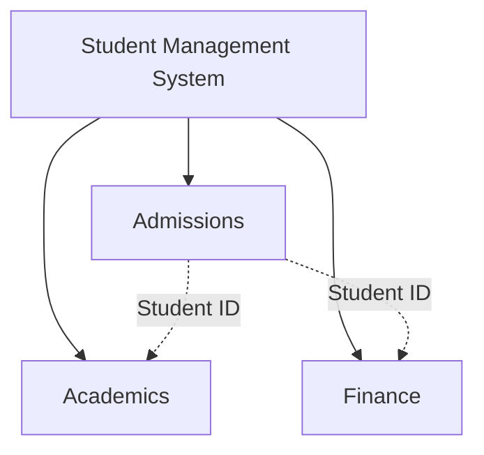

**Evaluating Cohesion and Coupling:**
- **High Cohesion**: The Finance Module only contains tasks related to money. It exhibits high functional cohesion because all elements within the module contribute to a single, well-defined task (managing fees).
- **Low Coupling**: The modules communicate through minimal interfaces, passing only essential data (like a `Student_ID`). The Academics module does not directly access the Finance database tables; it requests data via an API. This loose coupling ensures that if the Finance module is completely rewritten, the Academics module remains unaffected as long as the API interface stays intact.

### Q76: Analyze the role of information hiding in achieving secure and maintainable software systems. Examine its impact on module boundaries. (5 Marks)
**Information hiding** is the principle that a software module should conceal its internal implementation details from other modules, exposing only a well-defined interface. This principle is a cornerstone of both security and maintainability in software engineering.

**Impact on Maintainability:** By hiding internal data structures and algorithms, developers can change the internal workings of a module without affecting the rest of the system. For instance, a `DatabaseManager` module can switch its underlying technology from MySQL to MongoDB. As long as the public interface methods like `saveData()` and `getData()` remain unchanged, no other module needs to be updated.

**Impact on Security:** Information hiding prevents external modules from maliciously or accidentally altering sensitive internal states. For example, an `Authentication` module hides the cryptographic salt and hashing algorithms. External modules can only pass a password and receive a boolean `isValid` response, ensuring tight security boundaries.

**Impact on Module Boundaries:** It creates rigid, deliberate boundaries. Modules become "black boxes" to one another. Communication across these boundaries is strictly controlled, preventing "spaghetti code" where variables are accessed globally, thereby significantly reducing the likelihood of systemic cascading failures.

### Q77: Apply and distinguish between the types of abstraction and explain how abstraction differs from refinement in a practical software design scenario. (10 Marks)
**Abstraction** is the mechanism of conceptualizing complex systems by focusing on essential features while suppressing unnecessary details. It allows software engineers to manage cognitive load during design. There are primarily three types of abstraction in software engineering:

1. **Procedural Abstraction**: This focuses on instructions and operations. It names a sequence of instructions that perform a specific task. For example, calling a function named `sort_array()`. The user of this abstraction knows *what* it does, but the exact sorting algorithm (Merge Sort vs. Quick Sort) is hidden.
2. **Data Abstraction**: This focuses on the representation of data objects. It involves creating a custom data type that encapsulates data and the operations that can be performed on it. For example, a `Stack` data type hides the underlying array or linked list implementation, exposing only `push()` and `pop()` operations.
3. **Control Abstraction**: This implies a program control mechanism without specifying internal details, often seen in concurrent programming or asynchronous tasks (e.g., a `forEach` loop hides the index tracking and boundary checking of a traditional `for` loop).

**Abstraction vs. Refinement in a Practical Scenario:**
While Abstraction and Refinement are complementary, they move in opposite directions. Abstraction is a "bottom-up" mental model where you look at a complex system and simplify it. Refinement is a "top-down" process where you take a high-level abstraction and progressively elaborate on it until it becomes executable code.

*Practical Scenario: Developing an Autonomous Vehicle Navigation System*
- **Abstraction**: At the highest level, you create a procedural abstraction called `navigate_to_destination()`. This allows the architects to plan the interaction between the navigation system and the vehicle's engine control unit without worrying about the complex math of route finding.
- **Refinement**: As the project progresses, you refine `navigate_to_destination()`. 
  - Step 1 Refinement: Break it down into `fetch_gps_coordinates()`, `calculate_optimal_route()`, and `drive()`.
  - Step 2 Refinement: Refine `calculate_optimal_route()` further by introducing data abstractions like a `Graph` to represent roads and procedural abstractions like `Dijkstra's Algorithm` to find the shortest path.
  - Step 3 Refinement: Write the actual source code for `Dijkstra's Algorithm` handling all memory and boundary conditions.

In summary, abstraction allows you to declare "Drive to the destination" so you can design the big picture, while refinement is the systematic process of answering "Exactly how do we drive to the destination?" step-by-step.

### Q78: Analyze the components of the Design Model in software engineering. Examine the purpose and interrelation of each component in driving the design process. (10 Marks)
The Software Design Model serves as a comprehensive blueprint that bridges the gap between requirements analysis and actual coding. It transforms user requirements and system specifications into a structured, technical format. The model is typically comprised of four major components, each addressing a distinct aspect of the software architecture.

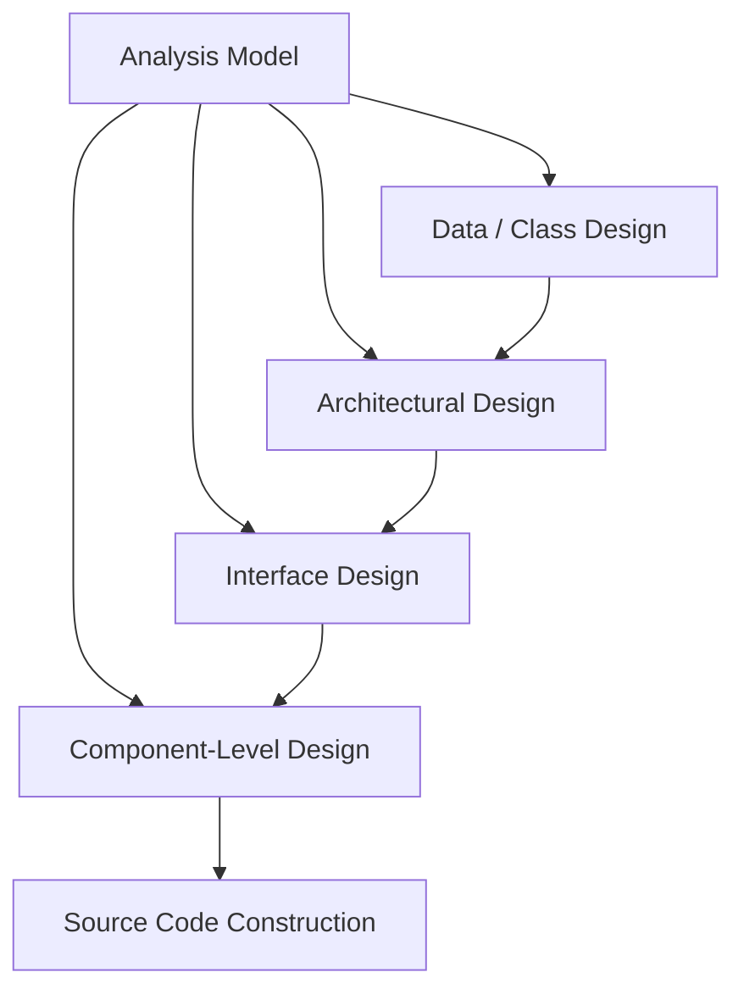

**1. Data / Class Design:**
- **Purpose**: This component transforms the information domain models (like Entity-Relationship Diagrams) into data structures and database architectures. In object-oriented systems, it defines the detailed class structures.
- **Interrelation**: It forms the foundation. Without well-defined data structures, the architecture has nothing to process. The architectural components rely heavily on the data schemas defined here.

**2. Architectural Design:**
- **Purpose**: This defines the global structure of the system. It identifies the major structural elements (subsystems/modules), their relationships, and the architectural styles and patterns (e.g., Client-Server, Microservices) used to construct the system.
- **Interrelation**: Architecture dictates the framework within which interfaces and components must operate. It groups the data classes and defines how large-scale modules interact.

**3. Interface Design:**
- **Purpose**: It details how the software communicates with external entities (other systems, devices) and human users (UI/UX). It establishes the boundaries and communication protocols (APIs, GUIs).
- **Interrelation**: Interfaces are the gateways between the architectural modules. The interface design heavily dictates how individual components will receive their input and deliver their output.

**4. Component-Level Design:**
- **Purpose**: This is the lowest level of the design model. It transforms the structural elements of the software architecture into detailed, procedural descriptions. It specifies algorithms, internal data structures, and the step-by-step logic required to execute the module's responsibilities.
- **Interrelation**: Component design relies on the interfaces to know what data is coming in/out, and relies on the architecture to know where it fits in the broader system. It is the final step that translates directly into source code.

Together, these components drive the design process from high-level, abstract structures down to precise, executable logic, ensuring that the final product strictly adheres to the initial requirements while remaining robust and maintainable.

### Q79: Apply the Four Elements Design Model to an online shopping system and demonstrate how each element contributes to the overall system design. (10 Marks)
The Four Elements Design Model comprises Data Design, Architectural Design, Interface Design, and Component-Level Design. Applying this to an Online Shopping System (e-commerce platform) provides a clear blueprint for development.

**1. Data Design Element:**
This element focuses on how information is stored and structured.
- **Application**: For the shopping system, data design involves creating database schemas for `Customers`, `Products`, `Orders`, and `ShoppingCarts`. 
- **Contribution**: It ensures data integrity and optimized queries. For example, structuring the `Orders` table with a foreign key to the `Customers` table ensures that every purchase is reliably linked to a registered user, preventing orphaned transaction records.

**2. Architectural Design Element:**
This defines the structural layout and relationship between major subsystems.
- **Application**: The system might adopt a modern **Microservices Architecture**. Distinct services are created: an `Authentication Service`, a `Product Catalog Service`, a `Cart Service`, and a `Payment Gateway Service`.
- **Contribution**: This ensures scalability. During a high-traffic holiday sale, the `Product Catalog Service` and `Payment Gateway Service` can be scaled up independently without needing to duplicate the entire monolithic application, ensuring high availability and system resilience.

**3. Interface Design Element:**
This handles interactions between the system, the users, and external services.
- **Application (User Interface)**: Designing a responsive, intuitive web storefront and a mobile app UI, ensuring the "Add to Cart" and "Checkout" buttons are highly visible.
- **Application (System Interface)**: Designing RESTful APIs to communicate with third-party systems like Stripe/PayPal for payments, and FedEx/UPS for shipping logistics.
- **Contribution**: It guarantees a smooth user experience (crucial for retail conversions) and ensures seamless, secure data exchange with external financial and logistical networks.

**4. Component-Level Design Element:**
This involves the granular algorithmic logic within specific modules.
- **Application**: Within the `Cart Service`, designing the exact procedural logic for the `Apply_Discount_Code()` function. This includes steps to validate the code against the database, check expiration dates, calculate the percentage deduction, and update the cart total.
- **Contribution**: It provides the exact blueprint for programmers. By detailing the algorithms beforehand, it prevents logical bugs (e.g., applying a discount code twice) and ensures the code written is highly efficient and cohesive.

### Q80: Apply the concept of modularity to design a Library Management System and evaluate design decisions related to coupling, cohesion, and structural organization. (10 Marks)
**Modularity** involves breaking down a large software system into distinct, manageable, and independent modules. A well-designed Library Management System (LMS) should be modular to handle various distinct operations seamlessly.

**Proposed Modular Architecture for LMS:**
1. **Authentication Module**: Manages logins, roles (Librarian, Member), and session security.
2. **Cataloging Module**: Handles adding, updating, and removing book records, including metadata like ISBN, Author, and Genre.
3. **Circulation Module**: Manages the core library transactions—issuing books, returning books, and tracking due dates.
4. **Member Management Module**: Manages user profiles, membership renewals, and fine tracking.
5. **Notification Module**: Responsible for sending emails/SMS for due dates or fine alerts.

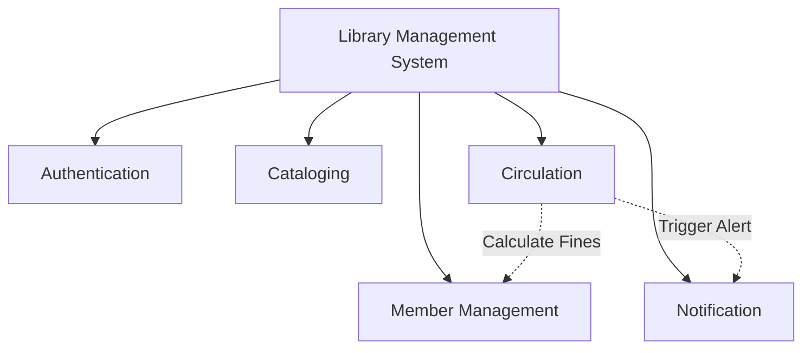

**Evaluation of Design Decisions:**

**1. Cohesion (Aim for High Cohesion):**
Cohesion measures how strongly related the functions within a single module are. 
- *Decision*: Grouping all book issuing and returning logic specifically in the Circulation Module represents **Functional Cohesion** (the highest and most desirable form). Everything in this module contributes to a single, well-defined task. If we mixed "sending emails" into the Circulation Module, cohesion would drop. Instead, delegating emails to a dedicated Notification Module keeps cohesion high across the board.

**2. Coupling (Aim for Low Coupling):**
Coupling measures the degree of interdependence between modules.
- *Decision*: We must design the Circulation Module so it does not directly query the Member Management database tables. Instead, it should pass a `memberID` via a well-defined interface (API) to request the member's current fine status. This represents **Data Coupling** (low, desirable coupling). If we allowed the Circulation Module to directly manipulate the internal variables of the Member Module (Content Coupling), a change in the Member database schema would break the Circulation logic.

**3. Structural Organization:**
The system employs a hierarchical control structure. The UI layer acts as a coordinator, invoking the appropriate sub-modules. By isolating the Notification Module, we can easily swap out an email provider (like SendGrid to AWS SES) without touching any code in the Cataloging or Circulation modules. This structural partitioning ensures maximum maintainability, testability, and parallel development efficiency.

### Q81: Design a software architecture for an e-learning platform by applying the nine key design concepts in software engineering and justifying each design decision. (10 Marks)
Designing a robust E-Learning Platform (like Coursera or Udemy) requires strict adherence to core design concepts to ensure scalability, maintainability, and quality.

**1. Abstraction:** 
- *Design*: Hide complex video streaming protocols behind a simple `VideoPlayer` component interface.
- *Justification*: Front-end developers can embed videos without needing to understand video encoding, buffering, or CDN logic.

**2. Architecture:** 
- *Design*: Use a Microservices architecture consisting of a `User Service`, `Course Catalog Service`, `Streaming Service`, and `Assessment Service`.
- *Justification*: Allows independent scaling. If thousands of students take a quiz simultaneously, only the `Assessment Service` needs to scale up.

**3. Patterns:** 
- *Design*: Apply the Model-View-Controller (MVC) pattern for the web interface.
- *Justification*: Separates the UI (View) from the business logic (Model) and user input routing (Controller), streamlining UI updates.

**4. Separation of Concerns:** 
- *Design*: Separate payment processing from course delivery.
- *Justification*: Ensures that a failure in the payment gateway doesn't stop existing enrolled students from watching their course videos.

**5. Modularity:** 
- *Design*: Divide the system into discrete modules like `Forum`, `Gradebook`, and `Video Streaming`.
- *Justification*: Allows different development teams to work in parallel without stepping on each other's toes.

**6. Information Hiding:** 
- *Design*: The `Payment Module` hides its cryptographic hashing algorithms and API keys from all other modules.
- *Justification*: Enhances security; even if the `Forum Module` is compromised via XSS, the attacker cannot access payment logic or secrets.

**7. Functional Independence:** 
- *Design*: Ensure modules have high cohesion and low coupling. The `Gradebook` relies only on a `student_id` and `course_id` to function.
- *Justification*: Reduces the ripple effect of changes. Modifying how grades are weighted won't break the course enrollment logic.

**8. Refinement:** 
- *Design*: Start with a top-level concept like "Deliver Quiz". Refine it to "Load Questions -> Accept Answers -> Submit". Refine further to specific database queries and UI state changes.
- *Justification*: Allows architects to solve broad structural problems before programmers tackle complex algorithmic details.

**9. Refactoring:** 
- *Design*: Plan for periodic code reviews to restructure internal code (e.g., combining redundant database queries in the `Course Catalog`) without changing the external behavior.
- *Justification*: Keeps the codebase clean, readable, and performant as the platform grows over time.

### Q82: Analyze the role of software architecture and control hierarchy in designing scalable systems. Examine architectural patterns and justify their selection. (10 Marks)
**Software Architecture** provides the macro-level structural framework of a system. It defines the major components, their properties, and how they interact. **Control Hierarchy** (or program structure) represents the organization of these modules, often depicted as a tree structure illustrating which modules invoke and control subordinate modules.

**Role in Scalable Systems:**
In scalable systems, architecture and control hierarchy dictate how the system handles increased load. A poorly architected monolithic system with a tangled control hierarchy (where every module relies directly on every other module) cannot scale efficiently. If one module bottlenecks, the whole system freezes.
A well-thought-out architecture enforces clean control hierarchies, allowing specific heavily-used subsystems to be replicated or distributed across multiple servers (horizontal scaling) without affecting the rest of the application.

**Examining Architectural Patterns:**
Architectural patterns offer proven solutions to recurring design problems. Selecting the right pattern is critical for scalability.

1. **Client-Server Architecture:**
   - *Description*: The system is divided into clients (requesters of services) and servers (providers of services).
   - *Selection Justification*: Ideal for standard web applications (like a basic CMS). It is easy to secure and manage centrally, but a single server can become a bottleneck.
   
2. **Layered (N-Tier) Architecture:**
   - *Description*: Modules are organized into horizontal layers (e.g., Presentation, Business Logic, Data Access). Each layer only communicates with the layer directly below it.
   - *Selection Justification*: Excellent for enterprise applications. It allows individual layers to be scaled independently (e.g., putting the Data layer on a massive dedicated database cluster).

3. **Microservices Architecture:**
   - *Description*: The system is constructed as a collection of small, independent services that communicate over lightweight protocols (like HTTP/REST). Each service handles a specific business capability.
   - *Selection Justification*: The gold standard for massive scalability (e.g., Netflix, Amazon). If the "Search" feature experiences heavy load, developers can spin up 100 new instances of the Search Microservice without touching the User Profile Microservice. It eliminates single points of failure.

**Conclusion:** 
Control hierarchy establishes clear lines of authority and data flow, preventing chaotic dependencies. Combined with a scalable architectural pattern like Microservices, architects can design systems capable of seamlessly adapting to massive user growth and evolving technological landscapes.

### Q83: Given two modules: 
**Module A: Performs a sequence of operations where output of one becomes input of another.**
**Module B: Contains unrelated functions grouped together.**
**Analyze which module is better designed and why? Identify cohesion types for both modules. Discuss the impact on testing and debugging. (10 Marks)**

**Analysis of Better Design:**
**Module A** is significantly better designed than Module B. Good software design emphasizes high cohesion and low coupling. Cohesion refers to the degree to which the elements inside a module belong together. Module A exhibits a strong internal relationship where elements are functionally linked to complete a unified task. Module B is essentially a "dumping ground" for arbitrary code, violating the principles of single responsibility and functional independence.

**Identification of Cohesion Types:**
1. **Module A (Sequential Cohesion):** 
   - *Type*: Sequential Cohesion.
   - *Explanation*: This occurs when parts of a module are grouped because the output from one part is the input to the next part (like an assembly line). For example, a module that `reads_file() -> parses_data() -> formats_output()`. This is a highly desirable form of cohesion, just one step below the ideal Functional Cohesion.
2. **Module B (Coincidental Cohesion):**
   - *Type*: Coincidental Cohesion.
   - *Explanation*: This is the lowest and worst form of cohesion. Elements are grouped into a module completely arbitrarily, with no meaningful relationship to one another. An example would be a `Utils` module containing `calculateTax()`, `printDocument()`, and `connectToWiFi()`.

**Impact on Testing and Debugging:**

*Testing Module A:*
Testing is straightforward. Because it operates sequentially, you can write integration tests that provide a single input at the beginning and verify the final output at the end. The flow of data is predictable. If a test fails, the sequential nature makes it relatively easy to isolate the exact step where the data transformation went wrong.

*Testing Module B:*
Testing is a nightmare. Because the functions are unrelated, you cannot test the module as a cohesive unit. You must write completely disconnected unit tests for every single arbitrary function. Mocking dependencies becomes highly complex because the module might require access to printers, networks, and databases all at once.

*Debugging:*
Debugging Module A involves simply tracing the data pipeline step-by-step. 
Debugging Module B is chaotic. Changes to one function might inadvertently share global variables with an unrelated function, causing unpredictable side effects. If a bug occurs, developers waste time deciphering the purpose of the module, ultimately slowing down maintenance and increasing technical debt.

### Q84: Analyze the role of structural partitioning and software procedure design in creating efficient software systems. Evaluate how these concepts contribute to improving system quality. (10 Marks)

**Structural Partitioning** and **Software Procedure Design** are two fundamental concepts that heavily influence the efficiency, quality, and maintainability of a software system.

**1. Structural Partitioning:**
Structural partitioning involves dividing the software architecture horizontally and vertically to establish distinct branches of control and functionality.
- **Horizontal Partitioning**: Divides the system into separate branches that execute specific major functions (e.g., input, processing, and output branches). This creates modularity. 
- **Vertical Partitioning (Factoring)**: Divides the system in a top-down manner, where high-level modules handle control and decision-making, and low-level modules perform the actual processing and computational work.

*Role in Efficiency:* By partitioning structurally, developers prevent the creation of "God modules" (monolithic modules that do everything). This allows different teams to work on different partitions simultaneously, significantly speeding up development time.
*Impact on System Quality:* Partitioning limits the impact of changes. If the output formatting requirements change, only the output partition needs modification. It also creates smaller, highly cohesive modules that are far easier to test, leading to fewer defects and higher overall quality.

**2. Software Procedure Design:**
While partitioning handles the macro-architecture, Software Procedure Design deals with the micro-architecture. It is the process of translating the structural components into detailed algorithmic logic, data structures, and procedural flows.

*Role in Efficiency:* This is where the actual computational efficiency is determined. A well-designed procedure will select the most optimal algorithms (e.g., choosing a Hash Map for O(1) lookups instead of a linear array search) and optimize memory usage. It ensures that the step-by-step logic is logical, non-redundant, and computationally inexpensive.
*Impact on System Quality:* Procedure design directly affects the robustness and reliability of the software. By meticulously planning the procedural flow (often using tools like flowcharts or pseudocode before actual coding), edge cases, null pointers, and infinite loops can be identified and mitigated early. It ensures that the code written is clean, strictly adheres to the intended architecture, and is highly readable for future maintenance.

**Conclusion:**
Together, structural partitioning provides the organizational clarity and modularity required for a system to be scalable and maintainable, while software procedure design provides the algorithmic precision required for it to run blazingly fast and without errors. Both are indispensable for producing high-quality software.


---

## Module 5: Risk Management & Software Configuration Management

### Q85. Explain the Reactive Risk Strategy and investigate its significance in software project risk management. (2 Marks)
A reactive risk strategy relies on waiting for a risk to actually occur before taking action. Also known as the "fire-fighting" approach, it involves no prior planning or contingency measures. When a problem arises, the team scrambles to fix it, which often leads to panic, delayed schedules, and increased costs. Its significance in professional software risk management is minimal, as it represents a poor management style. However, studying it is essential to understand why proactive planning is strictly necessary. It highlights the severe consequences of unpreparedness, showing that without mitigation strategies, even minor issues can derail a project.

### Q86. Describe how you would mitigate the risk of a computer crash in a software project. (2 Marks)
To mitigate the risk of a computer crash, I would implement a strict and layered data protection policy. First, all source code must be continuously pushed to a remote, cloud-based version control system like Git, ensuring local changes are safely stored off-site. Second, automated daily backups of all databases, project files, and environments would be established. For hardware protection, developers' machines should be connected to Uninterruptible Power Supplies (UPS) to prevent sudden power-loss damage. Having spare, pre-configured workstations available ensures that if a crash occurs, the developer can switch machines and resume work immediately with zero data loss.

### Q87. Apply risk assessment knowledge to identify parameters considered as fields of a Risk Table. Draw a Risk Table for any project. (2 Marks)
A Risk Table is a crucial assessment tool that organizes identified risks. The standard parameters (fields) include: **Risk ID/Description** (what the risk is), **Category** (e.g., technical, business, project), **Probability** (likelihood of occurrence, often a percentage), **Impact** (severity from 1 to 5), and **RMMM** (pointer to the Risk Mitigation, Monitoring, and Management plan).

| Risk Description | Category | Probability | Impact | RMMM |
| :--- | :--- | :--- | :--- | :--- |
| Database server failure | Technical | 20% | 4 (Critical) | Plan #1 |
| Key developer resigns | Project | 15% | 3 (Serious) | Plan #2 |

### Q88. Validate different categories of software risks and justify any one with a suitable example. (2 Marks)
Software risks are generally categorized into three main types: **Project Risks** (threaten the project schedule and budget, e.g., staff turnover), **Technical Risks** (threaten the quality and timeliness of the software, e.g., using an untested new framework), and **Business Risks** (threaten the viability of the software). A prime example of a **Business Risk** is building a perfectly functioning product that nobody wants. This occurs when market research is flawed, leading to the creation of a system that fails to meet actual user demands or loses out to competitors, rendering the entire development effort financially useless.

### Q89. Explain the role of Version Control in Software Configuration Management activities. (2 Marks)
Version Control is the backbone of Software Configuration Management (SCM). Its primary role is to track and manage changes to software code and documents over time. By maintaining a complete history of every modification, version control systems (like Git or SVN) allow teams to revert to previous stable states if a new change introduces bugs. It also enables seamless collaboration among multiple developers by facilitating branching (working on isolated features) and merging (integrating those features back together) without overwriting each other's work, ensuring the project's overall integrity is strictly maintained.

### Q90. Differentiate between a software configuration audit and a software configuration review based on their objectives. (2 Marks)
A **Software Configuration Review** (often a formal technical review) focuses on the technical correctness of the configuration object. Its objective is to ensure that a modified component satisfies its requirements, adheres to coding standards, and doesn't introduce technical flaws. In contrast, a **Software Configuration Audit** is a formal, administrative check. Its objective is to verify completeness and consistency—ensuring that the change was implemented as approved, that all necessary testing was performed, that documentation was correctly updated, and that the SCM procedures and standards were strictly followed before baselining.

### Q91. Apply risk mitigation principles to justify the importance of risk mitigation in project management. (2 Marks)
Risk mitigation is critical in project management because it shifts a project from a chaotic, reactive state to a controlled, proactive one. By anticipating potential threats and formulating strategies to reduce their likelihood and impact, mitigation saves significant time, money, and resources. It prevents minor issues from snowballing into catastrophic failures. For instance, holding regular code reviews (a mitigation strategy) catches bugs early, which is exponentially cheaper than fixing them post-release. Ultimately, risk mitigation ensures project stability, increases stakeholder confidence, and secures a higher probability of timely and successful product delivery.

### Q92. Apply the RMMM model to a software project scenario and demonstrate how it systematically manages project risks across phases. (5 Marks)
The **RMMM (Risk Mitigation, Monitoring, and Management)** model is a proactive strategy to handle software risks systematically. 
1. **Mitigation (Avoidance):** Proactive steps to reduce the probability or impact of a risk.
2. **Monitoring:** Tracking risk indicators over time to see if the risk is becoming more or less likely.
3. **Management (Contingency):** The action plan executed if the risk actually becomes a reality.

**Scenario:** A project relies on a critical third-party API, and the risk is that the API provider might shut down or change their pricing structure.
- **Mitigation:** The team designs the system architecture using the Adapter pattern, ensuring the software isn't tightly coupled to this specific API. They also research alternative API providers.
- **Monitoring:** The project manager assigns a team member to subscribe to the API provider's newsletters, monitor their developer forums, and watch for any announcements regarding business changes or server deprecations.
- **Management:** If the API provider suddenly shuts down, the contingency plan is triggered. The team seamlessly swaps the current API adapter with one built for the pre-researched alternative provider, using emergency budget reserved exactly for this scenario, preventing project failure.

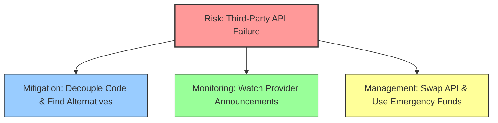
This systematic approach ensures that at no point is the team caught off guard, preserving the project's timeline and budget.

### Q93. Analyze the Risk Paradigm and apply it to perform structured risk management for a given software project. (5 Marks)
The **Risk Paradigm** is a continuous, circular framework that provides a structured approach to risk management throughout the software lifecycle. It consists of five key phases: **Identify, Analyze, Plan, Track, and Control**.

**Application to a Software Project (e.g., Developing a new Mobile Banking App):**
1. **Identify:** The team brainstorms potential threats. They identify risks such as "New security regulations might be introduced mid-development" and "The lead iOS developer might leave for another job."
2. **Analyze:** The team evaluates the likelihood and impact of these risks. The regulatory risk has a 30% probability but a catastrophic (5) impact. The developer leaving has a 20% probability and a serious (4) impact. The risks are prioritized based on these scores.
3. **Plan:** The team creates an RMMM plan. For the developer risk, they mandate extreme pair programming and thorough documentation so knowledge isn't siloed.
4. **Track:** The project manager monitors the indicators. They track the lead developer's job satisfaction and closely monitor legislative news regarding banking software.
5. **Control:** If the developer gives their two weeks' notice, the control mechanisms take over. The contingency plan is executed: a secondary developer, who has been pair-programming, takes over immediately, and HR expedites the hiring process.

By continuously cycling through this paradigm, the banking app project remains resilient to shifting circumstances, ensuring risks are consistently identified and mitigated before they derail the project.

### Q94. Apply risk identification techniques to identify two risks in a software project and construct a Risk Table with probability and impact values. (5 Marks)
Risk identification relies on techniques like brainstorming, reviewing past project post-mortems, and using risk item checklists. For a hypothetical project building an **AI-powered Customer Support Chatbot**, we can identify the following two significant risks using a product-specific checklist:

1. **Risk 1 (Technical):** The selected AI Natural Language Processing (NLP) model may struggle to accurately understand the specific technical jargon used by the company's customers, leading to a high rate of incorrect chatbot responses.
2. **Risk 2 (Project/Resource):** The project relies heavily on the internal customer support team to provide training data, but they are currently understaffed and may not have the time to label the required volume of data before the deadline.

**Risk Table:**

| Risk ID | Risk Description | Category | Probability | Impact (1-5) | RMMM Pointer |
| :---: | :--- | :--- | :---: | :---: | :--- |
| R-01 | NLP model fails to parse domain-specific technical jargon accurately. | Technical | 40% | 4 (Serious) | RMMM-01 |
| R-02 | Support team unavailable to label training data on schedule. | Project | 60% | 3 (Moderate)| RMMM-02 |

*Impact Scale: 1-Catastrophic, 2-Critical, 3-Marginal, 4-Negligible (Note: In some models, 1 is negligible and 5 is catastrophic. Here we assume 1-5 where 5 is highest impact for intuitive reading, so Impact=4 is High/Serious and Impact=3 is Moderate).*
By quantifying these risks in a table, the project manager can easily prioritize addressing the data labeling bottleneck (high probability) and the NLP accuracy issue (high impact).

### Q95. Design a complete Risk Information Sheet for a real-world software project by applying risk management documentation standards. (5 Marks)
A **Risk Information Sheet (RIS)** is a standardized document used to record all details about a single, specific risk. It serves as the ultimate reference point for that risk throughout the project lifecycle.

**Risk Information Sheet**
* **Project Name:** NextGen E-Commerce Platform
* **Risk ID:** R-045
* **Date Identified:** 2026-05-21
* **Identified By:** Jane Doe, Lead Architect
* **Risk Description:** The chosen payment gateway API may not support the expected transaction volume during the Black Friday launch, leading to system timeouts and lost revenue.
* **Risk Category:** Technical / External Dependency
* **Probability:** 35%
* **Impact Level:** 5 (Catastrophic - Direct loss of massive revenue)
* **Risk Refinement (Context):** The gateway is rated for 1,000 TPS, but marketing expects 2,500 TPS during peak hours.
* **Mitigation Strategy (Avoidance):** 
  - Integrate a secondary, high-capacity payment gateway as a fallback.
  - Implement a queuing mechanism to hold transactions during high traffic rather than dropping them.
* **Monitoring Strategy:**
  - Track marketing metrics to accurately forecast expected traffic.
  - Run continuous stress tests on the staging environment simulating 3,000 TPS.
* **Management Strategy (Contingency):** 
  - If the primary gateway throttles, automatically route all new traffic to the secondary gateway.
  - Deploy a user-friendly "Please wait in queue" UI overlay.
* **Current Status:** Open - Mitigation steps in progress (Queuing system is 50% coded).

### Q96. Apply SCM principles to outline three primary goals of Software Configuration Management and demonstrate how each contributes to project integrity. (5 Marks)
Software Configuration Management (SCM) is the discipline of managing change throughout the software lifecycle. Its primary goals are essential for maintaining a stable and reliable project.

1. **Identifying and Organizing Configuration Items (CIs):** SCM's first goal is to identify every single component of a software project (source code, design models, SRS documents, test data) and organize them into baselines. 
   * *Contribution to Integrity:* This ensures that the team always knows exactly what constitutes a specific version of the software. Without this, a developer might accidentally use an outdated requirements document, leading to incorrect implementation.
2. **Managing and Controlling Change:** SCM establishes strict procedures (Change Control) for requesting, evaluating, and approving modifications to baselined CIs.
   * *Contribution to Integrity:* This prevents uncoordinated, ad-hoc changes that cause software to break. By ensuring every change is reviewed for its impact and formally approved, the project remains stable and protected from rogue code commits.
3. **Status Accounting and Auditing:** SCM aims to keep track of the status of all changes (Status Accounting) and verify the correctness of those changes (Configuration Auditing).
   * *Contribution to Integrity:* This guarantees transparency and compliance. If a bug appears in production, status accounting provides a clear audit trail of who changed what and when, making it easy to identify the root cause and roll back to a stable state, thus ensuring long-term project reliability.

### Q97. Apply Change Management concepts to draw a flowchart of the Change Management process and explain each step in the SCM change process. (5 Marks)
The Change Management process ensures that all proposed changes to a baselined software configuration are systematically evaluated, approved, and tracked.

```mermaid
graph TD
    A([Submit Change Request CR]) --> B[Evaluate Technical & Business Impact]
    B --> C{Change Control Board CCB Decision}
    C -- Approved --> D[Check-out Configuration Item]
    C -- Rejected --> E([Notify Requester])
    D --> F[Implement Change & Test]
    F --> G[Configuration Audit]
    G --> H([Check-in & Create New Baseline])
    style A fill:#ffcc00,stroke:#333
    style C fill:#ff9999,stroke:#333
    style D fill:#99ccff,stroke:#333
    style H fill:#99ff99,stroke:#333
```
**Explanation of Steps:**
1. **Submit Change Request (CR):** A developer or client identifies a bug or feature need and submits a formal CR detailing the modification.
2. **Evaluate Impact:** SCM analysts assess how the change will affect the project timeline, budget, and other technical components.
3. **CCB Decision:** The Change Control Board (a group of stakeholders) reviews the impact report and either approves or rejects the CR.
4. **Check-out CI:** Once approved, the developer checks out the specific configuration item (e.g., source code file) from the central SCM repository, locking it for editing.
5. **Implement & Test:** The developer writes the code, modifies the file, and runs unit tests to ensure the change works without breaking existing features.
6. **Configuration Audit:** SCM teams perform a formal audit to verify that the change matches the CR and that all coding standards were followed.
7. **Check-in & Baseline:** The audited file is checked back into the repository. The SCM system updates the version history and establishes a new stable baseline for the project.

### Q98. Analyze how version control contributes to maintaining project integrity in SCM. Examine branching, merging, and baseline strategies. (5 Marks)
Version control is the technological heart of SCM, safeguarding project integrity by acting as an infallible time machine and traffic cop for source code. It records every modification, allowing teams to seamlessly track who made a change, why it was made, and when.

**Branching:** Version control allows developers to create "branches"—isolated, independent copies of the main codebase. This strategy maintains project integrity because developers can experiment, build risky new features, or fix bugs in their own branch without ever threatening the stability of the main production code.
**Merging:** Once a feature in a branch is fully completed and tested, it is "merged" back into the main branch. Version control systems manage this process by automatically combining code, and crucially, they detect "conflicts" (where two developers edited the exact same line). This prevents code from being blindly overwritten, forcing human review to maintain logic integrity.
**Baseline Strategies:** A baseline is a snapshot of the software at a specific point in time (e.g., v1.0 release). Version control systems use "tags" or "releases" to permanently mark these baselines. This ensures that even as development continues for v2.0, the team can always retrieve, compile, and patch the exact codebase that was shipped in v1.0, ensuring absolute consistency and historical integrity.

### Q99. Analyze the integration of SCM with software engineering practices such as testing and CI/CD. Examine how SCM activities improve overall project governance. (10 Marks)
Software Configuration Management (SCM) is not an isolated administrative task; it is the fundamental infrastructure that enables modern software engineering practices like rigorous Testing and Continuous Integration/Continuous Deployment (CI/CD). The deep integration of SCM into these practices dramatically enhances project governance, speed, and reliability.

**Integration with Testing:**
Testing requires stable, known environments to be effective. SCM provides this by establishing strict baselines. When a QA team begins testing a release candidate, they pull a specific, immutable version from the SCM repository. If a bug is found, the exact configuration item (CI) and its version number are logged in the bug report. Developers can then check out that exact same version to reproduce the bug. Without SCM, the codebase would be a moving target; developers might be writing code while testers are simultaneously testing it, leading to a chaotic situation where bugs are irreproducible. Furthermore, automated test scripts themselves are treated as Configuration Items and are version-controlled alongside the application code, ensuring that the tests always perfectly align with the software version they are meant to evaluate.

**Integration with CI/CD:**
CI/CD pipelines rely entirely on SCM to function. SCM acts as the definitive source of truth that triggers the automated pipeline.
*   **Continuous Integration (CI):** Whenever a developer commits a change to the SCM repository (e.g., Git), a webhook notifies the CI server (like Jenkins or GitHub Actions). The CI server automatically checks out the latest code, compiles it, and runs a battery of automated tests. If the build fails, the SCM system rejects the merge, ensuring that broken code never infects the main branch.
*   **Continuous Deployment (CD):** Once the CI process passes, the CD pipeline automatically packages the baselined artifacts and deploys them to staging or production environments. SCM ensures that exactly what was tested is what gets deployed, eliminating the risk of human error in manual deployments.

**Improving Project Governance:**
SCM activities inherently enforce strict project governance. Through Change Control Boards (CCB), SCM ensures that no change—no matter how small—is introduced without proper authorization, impact analysis, and testing. Configuration Audits provide stakeholders with transparent, objective proof that the software meets quality standards and regulatory compliance. Status Accounting generates reports on the health of the project, tracking metrics like the number of open change requests or frequent build failures. Together, these SCM activities create a highly disciplined, transparent environment where risks are minimized, quality is guaranteed, and the software delivery lifecycle is governed by predictable, repeatable processes rather than ad-hoc chaos.

### Q100. Apply risk identification and documentation techniques to construct a structured risk register for a complete software engineering project. (10 Marks)
A Risk Register is a comprehensive, living document utilized in project management to continuously track and manage all identified risks. Constructing one requires systematic risk identification techniques, such as analyzing project requirements for technical uncertainties, reviewing historical data from similar projects, and conducting stakeholder brainstorming sessions. 

Consider a complete software engineering project: **Developing an Enterprise Healthcare Record Management System (EHRMS)**. This project involves strict compliance laws, integration with legacy databases, and highly sensitive data. Applying risk identification, we can categorize risks into Technical, Project, and Business domains, and document them in a structured risk register.

**Enterprise Healthcare Record Management System - Risk Register**

| Risk ID | Risk Description | Category | Prob. (%) | Impact (1-5) | Score (P*I) | Mitigation Strategy (Avoidance) | Contingency Plan (Management) | Owner | Status |
| :--- | :--- | :--- | :---: | :---: | :---: | :--- | :--- | :--- | :--- |
| **RSK-01** | **Data Breach/HIPAA Violation:** Unauthorized access to patient medical records due to software vulnerabilities. | Business / Legal | 15% | 5 | 0.75 | Implement end-to-end AES-256 encryption. Hire a third-party security firm to perform monthly penetration testing. | Instantly isolate the compromised server, execute incident response plan, notify authorities and affected patients within 24h. | Sec. Lead | Open - Active |
| **RSK-02** | **Legacy System Integration Failure:** The new system fails to accurately migrate data from the hospital's 20-year-old proprietary database. | Technical | 40% | 4 | 1.60 | Develop custom data extraction scripts early. Perform multiple trial migrations on staging servers using sampled data. | Run the new and legacy systems in parallel for three months. Fallback to legacy system for critical lookups if migration halts. | DB Admin | Open - Active |
| **RSK-03** | **Key Personnel Attrition:** The Lead Software Architect resigns midway through the project, stalling critical design decisions. | Project | 25% | 4 | 1.00 | Enforce rigorous architectural documentation. Maintain a "shadow" architect or heavily involve senior devs in high-level design. | Promote the senior developer to acting architect immediately. Engage external consulting firm for short-term architectural review. | Proj. Mgr | Open - Monitored |
| **RSK-04** | **Scope Creep from Stakeholders:** Doctors continuously request new, complex features not agreed upon in the initial SRS. | Project | 60% | 3 | 1.80 | Strictly enforce a formal Change Control Board (CCB) process. Require all new features to be accompanied by budget/schedule extensions. | Log unapproved features into a "Phase 2" backlog. Politely but firmly refuse implementation in the current release cycle. | Prod. Owner | Open - Active |
| **RSK-05** | **Performance Degradation under Load:** System response time drops unacceptably during morning shift changes when hundreds of nurses log in simultaneously. | Technical | 35% | 3 | 1.05 | Design scalable cloud-based microservices. Perform heavy load testing simulating 200% of expected peak user traffic. | Automatically provision additional cloud server instances (auto-scaling) when CPU usage exceeds 80%. | Cloud Eng. | Open - Monitored |

This structured risk register acts as a central repository. By calculating the Risk Score (Probability × Impact), the project manager can mathematically prioritize their focus—in this case, RSK-04 (Scope Creep) and RSK-02 (Integration Failure) require immediate, heavy focus due to their high overall scores. The register ensures that every threat has an assigned owner and a pre-planned response, ensuring project resilience.

### Q101. Analyze the differences between reactive and proactive risk strategies in software project management. Evaluate the effectiveness of each strategy. (10 Marks)
In software project management, handling uncertainty distinguishes successful projects from massive failures. The two fundamental approaches to dealing with uncertainty are the Reactive Risk Strategy and the Proactive Risk Strategy. These methodologies differ entirely in their philosophy, execution, and overall effectiveness.

**The Reactive Risk Strategy ("Fire-Fighting")**
A reactive strategy operates on the principle of dealing with problems only after they occur. In this approach, the project team does not spend time during the planning phase identifying what could go wrong. Instead, they focus entirely on current development tasks. 
*   **Execution:** When a risk materializes into an actual issue (e.g., a critical server crashes, or a major bug is found right before release), the team drops their planned work and scrambles to "put out the fire." 
*   **Characteristics:** It is characterized by crisis management, high stress, and impromptu decision-making. There are no contingency funds or backup plans in place.
*   **Effectiveness Evaluation:** The effectiveness of a reactive strategy is generally **very low**. While it might save a small amount of time during initial project planning, the costs incurred when a risk actually hits are catastrophic. Fixing a problem in a state of panic usually results in "hacky," unstable solutions. It leads to severe schedule slippages, massive budget overruns, and rapid developer burnout. It is generally considered a poor management practice and should only be used for risks that have an infinitesimally small probability of occurring, where planning for them would cost more than the solution.

**The Proactive Risk Strategy ("Fire-Prevention")**
A proactive strategy operates on the principle of anticipation and prevention. The project team actively assumes that things will go wrong and spends considerable effort during the early phases of the project identifying, analyzing, and planning for those possibilities.
*   **Execution:** The team creates a detailed Risk Register and implements the RMMM (Risk Mitigation, Monitoring, and Management) model. They take concrete steps (Mitigation) to ensure risks never happen, monitor indicators (Monitoring) to see if risks are approaching, and have pre-approved backup plans (Management) ready to execute instantly if disaster strikes.
*   **Characteristics:** It is characterized by structured analysis, foresight, budget allocation for contingencies, and controlled responses.
*   **Effectiveness Evaluation:** The effectiveness of a proactive strategy is **exceptionally high**. By investing time upfront, the team avoids the vast majority of predictable problems entirely (saving money and time). For the risks that cannot be avoided, the team handles them calmly and efficiently using pre-tested contingency plans, resulting in zero panic. Proactive risk management ensures project stability, predictable delivery timelines, and high product quality. It is the hallmark of professional software engineering. 

**Summary Comparison:**
In conclusion, while reactive management leaves a project entirely at the mercy of chance and crisis, proactive management grants the team control over the project's destiny. A proactive approach is strictly necessary for any project of significant size, complexity, or importance.

### Q102. Apply the RMMM plan to construct a risk response strategy for your project and evaluate the effectiveness of each mitigation action. (10 Marks)
The **RMMM (Risk Mitigation, Monitoring, and Management)** plan is a comprehensive strategy for dealing with identified risks in a software project. To construct an effective risk response strategy, we will apply the RMMM framework to a hypothetical project: **Developing an AI-driven Autonomous Drone Navigation System**. 

For this highly complex project, we will select a critical risk: **Risk: The drone's computer vision processing is too slow, causing a massive delay in obstacle detection, leading to potential crashes.**

**1. Risk Mitigation (Avoidance)**
Mitigation involves proactive actions taken immediately to reduce the probability or impact of the risk.
*   **Action A:** Instead of using heavy, generic AI models, develop highly optimized, lightweight neural networks specifically pruned for edge-computing devices.
*   **Action B:** Utilize specialized hardware, such as dedicated Neural Processing Units (NPUs) or FPGAs on the drone, rather than relying on standard CPUs for vision processing.
*   **Evaluation of Effectiveness:** These actions are highly effective. By addressing both the software efficiency (Action A) and the hardware capability (Action B) upfront, the team fundamentally attacks the root cause of the processing delay. This drastically lowers the probability of the risk occurring, effectively avoiding the problem before it manifests in flight testing.

**2. Risk Monitoring**
Monitoring involves identifying metrics and tracking them continuously to determine if the risk is becoming more or less likely.
*   **Action A:** During daily continuous integration (CI) builds, run automated benchmark tests that specifically measure the millisecond latency of the computer vision module on simulated hardware.
*   **Action B:** Track the memory and CPU usage of the vision processing algorithm as new features are added during weekly sprints.
*   **Evaluation of Effectiveness:** This is highly effective because it provides early warning signs. If a developer commits new code that accidentally spikes the processing time from 5ms to 50ms, the automated CI monitoring catches it instantly. The team is alerted to the impending risk *before* the software is ever loaded onto a real physical drone, preventing expensive hardware destruction.

**3. Risk Management (Contingency Plan)**
Management involves the predefined steps to take if the mitigation fails and the risk actually becomes a reality (i.e., the drone is flying and the processing falls behind).
*   **Action A:** Program a hard-coded, non-AI "fail-safe" ultrasonic sensor array. If the AI processing latency exceeds 100ms, the system instantly overrides the AI and forces the drone to hover in place or slowly ascend to a safe altitude using only basic ultrasonic data.
*   **Action B:** Allocate 15% of the project budget as a contingency fund. If the current hardware fundamentally fails to meet speed requirements despite optimization, use this fund to immediately purchase and integrate next-generation processing boards.
*   **Evaluation of Effectiveness:** These contingency plans are crucial. Action A ensures safety; it acknowledges that if the software fails in real-time, the drone won't crash into a building, thereby saving the physical asset. Action B ensures project survival; having pre-approved emergency funds means the project won't stall awaiting financial approval to buy necessary faster hardware. 

By applying the RMMM plan, the project transforms a potentially catastrophic risk (drone crashes) into a highly controlled, monitored, and survivable engineering challenge.

### Q103. Design a Risk Table for a software project developing an e-commerce platform. Apply risk prioritization techniques and propose appropriate mitigation strategies. (10 Marks)
Designing a Risk Table is a fundamental step in proactive project management. For a project developing a high-traffic **E-Commerce Platform**, the team must anticipate technical, business, and project-level threats. 

To prioritize these risks, we will use a quantitative risk assessment technique: **Risk Score = Probability × Impact**. 
*   **Probability** is estimated as a percentage (0.1 to 1.0, represented as 10% to 100%).
*   **Impact** is rated on a scale of 1 to 5 (1=Negligible, 2=Marginal, 3=Moderate, 4=Critical, 5=Catastrophic).
Risks with the highest Risk Score demand the most immediate and robust mitigation strategies.

**Risk Table for E-Commerce Platform**

| ID | Risk Description | Category | Prob (P) | Impact (I) | Score (P×I) | Priority | Mitigation Strategy (Proactive Avoidance) |
| :--- | :--- | :--- | :---: | :---: | :---: | :---: | :--- |
| **R1** | **Payment Gateway Outage:** The integrated third-party payment gateway goes offline during peak holiday sales. | Technical | 0.30 | 5 | **1.50** | **High (1)** | Integrate at least two redundant payment gateways (e.g., Stripe and PayPal). Implement auto-failover logic so if Gateway A times out, transactions instantly route to Gateway B. |
| **R2** | **Cybersecurity Breach:** Hackers exploit a vulnerability in the checkout process, stealing customer credit card data. | Business | 0.15 | 5 | **0.75** | **Medium (3)** | Strictly enforce PCI-DSS compliance. Never store raw credit card data on our servers (use tokenization). Conduct bi-weekly vulnerability scanning and automated penetration tests on the checkout module. |
| **R3** | **Database Scalability Failure:** The product catalog database becomes locked/unresponsive when 10,000+ users browse simultaneously. | Technical | 0.40 | 4 | **1.60** | **High (1)** | Implement database read-replicas to handle heavy browsing traffic. Utilize distributed caching mechanisms (like Redis or Memcached) to serve catalog data without hitting the primary database. |
| **R4** | **Delayed Shipping API Integration:** The logistics partner fails to provide their shipping rate API documentation on time. | Project | 0.50 | 3 | **1.50** | **High (1)** | Initiate communication with the logistics partner on Day 1. Develop a fallback "flat-rate" shipping module that can be temporarily used for launch if the dynamic API is delayed. |
| **R5** | **Frontend Framework Deprecation:** The chosen open-source UI framework stops receiving security updates during development. | Technical | 0.10 | 3 | **0.30** | **Low (4)** | Select widely adopted, enterprise-backed frameworks (e.g., React or Angular) with clear long-term support (LTS) roadmaps rather than niche libraries. |

**Risk Prioritization Analysis:**
By calculating the Risk Score, we can objectively prioritize our efforts. 
*   **High Priority (Score 1.50 - 1.60):** R3 (Database Scalability), R1 (Payment Outage), and R4 (Shipping API). These are the most dangerous threats combining high likelihood and severe impact. The project manager must allocate immediate budget and engineering time to implement their mitigation strategies (e.g., setting up Redis caches and redundant gateways).
*   **Medium Priority (Score 0.75):** R2 (Cybersecurity). Although the impact is catastrophic (5), the probability is lower due to modern frameworks. However, its mitigation (tokenization) remains mandatory.
*   **Low Priority (Score 0.30):** R5 (Framework Deprecation). Highly unlikely and manageable. It requires basic monitoring but no heavy resource allocation.

This structured table ensures the e-commerce project team focuses their time and money on mitigating the most statistically dangerous threats first.

### Q104. Apply configuration management strategies to design an SCM scenario for a distributed team working on a mobile application. Justify your approach. (10 Marks)
Software Configuration Management (SCM) becomes exponentially more complex and critical when managing a distributed team (e.g., developers in the US, UI/UX designers in Europe, and QA testers in Asia) collaborating on a single product, such as a **Cross-Platform Mobile Application**. Without rigorous SCM strategies, concurrent development will lead to overwritten code, irreproducible bugs, and absolute chaos.

**SCM Scenario Design for a Distributed Mobile App Team**

**1. Centralized Source of Truth (Version Control Strategy)**
*   **Design:** I would mandate a cloud-hosted version control system, specifically Git (via GitHub Enterprise or GitLab). All Configuration Items (CIs)—including source code, UI assets, configuration JSONs, and test scripts—must be stored here.
*   **Justification:** A distributed team cannot rely on local servers or file-sharing apps. Cloud-based Git ensures that a developer in Tokyo and a designer in London are looking at the exact same, up-to-date repository. It provides a permanent, auditable history of every change made across all time zones.

**2. The GitFlow Branching Model (Concurrent Development Strategy)**
*   **Design:** The team will strictly adhere to the GitFlow branching strategy. 
    *   `main` branch: Contains only production-ready, highly stable code.
    *   `develop` branch: The integration branch for the next release.
    *   `feature/xyz` branches: Individual developers create branches off `develop` to work on specific tasks (e.g., `feature/login-screen`).
*   **Justification:** When a distributed team works on the same app, they will inevitably touch the same files. Feature branches isolate a developer's work. They can commit code locally and push changes without breaking the `develop` branch for everyone else. Code is only merged back via Pull Requests (PRs) after peer review.

**3. Automated Continuous Integration (CI Strategy)**
*   **Design:** I would integrate a CI pipeline (e.g., Bitrise or GitHub Actions, specialized for mobile). Whenever a developer across the globe opens a Pull Request to merge their feature branch into `develop`, the CI server automatically compiles the mobile app (both iOS and Android builds) and runs all automated unit tests.
*   **Justification:** In a distributed environment, you cannot trust that code works on one developer's machine ("It works on my machine" syndrome). The CI server acts as an impartial, automated configuration auditor. If a developer's code breaks the build or fails tests, the PR is automatically blocked from merging, maintaining the integrity of the shared `develop` branch.

**4. Change Control Board (CCB) and Issue Tracking (Change Management)**
*   **Design:** Use a cloud-based issue tracker like Jira. Every code change must be tied to a specific Jira ticket. For major architectural changes or release planning, a virtual CCB (comprising the Lead Developer, QA Lead, and Product Manager) meets weekly via video call to approve or reject change requests.
*   **Justification:** This enforces strict governance. A developer in the US cannot arbitrarily decide to change the database schema while the European team sleeps. The CCB ensures all major changes are communicated, impact-assessed, and scheduled properly, maintaining alignment across disparate geographies.

**5. Release Management and Baselining**
*   **Design:** When preparing for a release (e.g., v1.2), a `release/v1.2` branch is created. QA performs final UAT here. Once approved, it is merged to `main`, tagged as `v1.2` (the baseline), and automatically deployed to the App Store and Google Play via the CD pipeline.
*   **Justification:** Baselining via Git tags ensures that if a critical bug is found in production by a user, the team can instantly checkout the exact `v1.2` code, isolate the bug, and deploy a hotfix without getting tangled up in the new, half-finished features currently sitting in the `develop` branch.

### Q105. You are managing a software project, and you’ve identified the following risks in different categories. For each risk category, the likelihood (P), impact (I), and risk score (P * I) are provided. You need to analyze how reactive and proactive strategies would impact the project in terms of handling these risks.
*Assuming typical risk data for analysis:*
*   *Risk 1 (Technical): Database crash. Likelihood = 0.4, Impact = 5, Score = 2.0*
*   *Risk 2 (Project): Staff turnover. Likelihood = 0.6, Impact = 3, Score = 1.8*
*   *Risk 3 (Schedule): Scope creep. Likelihood = 0.8, Impact = 4, Score = 3.2*

**Task 1: Calculate the Risk Score for Each Risk Category**
The risk score is calculated by multiplying the Likelihood (Probability) by the Impact. Based on the assumed data:
*   **Technical Risk (Database Crash):** Score = 0.4 × 5 = **2.0**
*   **Project Risk (Staff Turnover):** Score = 0.6 × 3 = **1.8**
*   **Schedule Risk (Scope Creep):** Score = 0.8 × 4 = **3.2**

**Task 2: Prioritize the Risks**
Risks are prioritized in descending order based on their calculated Risk Scores. 
1.  **Priority 1: Schedule Risk (Scope Creep)** - Score: **3.2**. This is the highest priority. It has a very high likelihood of occurring and a severe impact on project delivery.
2.  **Priority 2: Technical Risk (Database Crash)** - Score: **2.0**. While slightly less likely, a score of 5 indicates a catastrophic impact, making it the second most critical threat.
3.  **Priority 3: Project Risk (Staff Turnover)** - Score: **1.8**. This is a moderate risk. It is likely to happen but has a manageable impact compared to a database failure.

**Task 3: Suggest Mitigation Strategies & Analyze Reactive vs. Proactive Impacts**

**1. Schedule Risk (Scope Creep)**
*   **Proactive Mitigation Strategy:** Implement a strict, formal Change Control Board (CCB) process. Require all client feature requests to be documented, estimated for cost/time impact, and formally approved/paid for before a single line of code is written. 
*   **Impact of Proactive Strategy:** The project remains on schedule and within budget. The team is protected from doing unpaid overtime, and the client's expectations are managed professionally.
*   **Impact of Reactive Strategy:** The team blindly says "yes" to all client requests without adjusting the deadline. The project inevitably runs out of time and budget, leading to immense stress, missed deadlines, and a poorly tested final product.

**2. Technical Risk (Database Crash)**
*   **Proactive Mitigation Strategy:** Implement continuous data replication to a secondary, failover database in a different geographic region. Set up automated daily backups and regular disaster recovery drills.
*   **Impact of Proactive Strategy:** If the primary database crashes, the system automatically routes to the failover database with near-zero downtime and zero data loss. The project reputation is maintained.
*   **Impact of Reactive Strategy:** The database crashes, and there are no backups. The system goes entirely offline for days. The team frantically tries to reconstruct data from corrupted logs. Massive amounts of user data are permanently lost, resulting in lawsuits and complete project failure.

**3. Project Risk (Staff Turnover)**
*   **Proactive Mitigation Strategy:** Enforce pair programming and thorough code documentation. Ensure no single developer holds exclusive knowledge of a critical system module (eliminate silos). Cross-train team members.
*   **Impact of Proactive Strategy:** When a developer quits, the remaining team easily picks up their work because the knowledge is shared and documented. The project schedule experiences only a minor hiccup while a replacement is hired.
*   **Impact of Reactive Strategy:** A lead developer quits, taking all the undocumented knowledge of the core algorithm with them. The rest of the team spends months deciphering their code, causing massive delays and halting all forward progress on the project.

### Q106. Consider a project with the following identified risks and their associated likelihoods and impacts (on a scale from 1 to 5, where 1 is low and 5 is high):
*   **Risk A: Likelihood = 4, Impact = 3**
*   **Risk B: Likelihood = 3, Impact = 5**
*   **Risk C: Likelihood = 2, Impact = 4**
**Calculate the overall risk score for the project. What is the priority order of these risks based on their risk scores? (10 Marks)**

To properly evaluate and prioritize risks in software engineering, we utilize a quantitative risk assessment formula. The standard method for determining the severity of a risk is calculating its Risk Score (often referred to as Risk Exposure). 

**Step 1: Formula Definition**
The formula used is:
**Risk Score = Likelihood × Impact**
Where:
*   **Likelihood (Probability):** The chance that the risk will actually occur (rated 1 to 5).
*   **Impact (Severity):** The level of damage the risk will cause to the project's schedule, budget, or quality if it occurs (rated 1 to 5).

By calculating this mathematical product, we gain an objective metric that balances how likely an event is against how damaging it would be, allowing us to focus resources intelligently.

**Step 2: Calculating Individual Risk Scores**
Applying the formula to the provided project risks:

*   **Risk A:**
    *   Likelihood = 4
    *   Impact = 3
    *   Risk Score = 4 × 3 = **12**

*   **Risk B:**
    *   Likelihood = 3
    *   Impact = 5
    *   Risk Score = 3 × 5 = **15**

*   **Risk C:**
    *   Likelihood = 2
    *   Impact = 4
    *   Risk Score = 2 × 4 = **8**

**Step 3: Calculating Overall Project Risk Score**
Depending on the specific risk management framework being used, the "overall risk score for the project" can be represented in a few ways. Most commonly, it is the sum of all individual active risk scores. This cumulative number provides project managers with a high-level metric to determine the total risk exposure of the entire project at a given time.
*   **Overall Project Risk Score** = Score(Risk A) + Score(Risk B) + Score(Risk C)
*   **Overall Project Risk Score** = 12 + 15 + 8 = **35**
*(Note: An overall score of 35 out of a theoretical maximum of 75 (if all three risks were 5x5) indicates that the project is operating under a moderate to high level of total risk exposure, necessitating strong mitigation planning).*

**Step 4: Determining the Priority Order**
Risk prioritization is critical because a project team has limited time, budget, and resources. They cannot mitigate every risk equally. Prioritization dictates that risks with the highest Risk Score must be addressed first with the most robust mitigation strategies (RMMM plans).

Based on our calculations, the risks are prioritized in descending order (highest score to lowest score):

1.  **Priority 1: Risk B (Score = 15).** 
    *   *Analysis:* Although it is slightly less likely to happen than Risk A, its impact is catastrophic (5). A score of 15 makes it the most dangerous threat to the project. This requires immediate management attention and proactive avoidance strategies.
2.  **Priority 2: Risk A (Score = 12).** 
    *   *Analysis:* This risk has the highest likelihood of occurring (4), though its impact is moderate (3). Because it is very likely to happen, it demands active monitoring and solid contingency planning, placing it second in priority.
3.  **Priority 3: Risk C (Score = 8).** 
    *   *Analysis:* This risk has a severe impact (4), but a low likelihood of occurring (2). It has the lowest risk score, meaning it poses the least immediate threat. It should be documented and periodically monitored, but it does not require significant immediate resource allocation compared to Risks B and A.

**Final Priority Order:** **Risk B (Highest) → Risk A → Risk C (Lowest)**.


---

# Software Engineering Question Bank

## Module 6: Software Testing with Quality Assurance

### **Q107. Apply the concept of Cyclomatic Complexity to explain its significance and demonstrate the formula with an example. (2 Marks)**
Cyclomatic complexity is a software metric used to indicate the complexity of a program. It measures the number of linearly independent paths through a program's source code, helping developers understand how difficult the code will be to test and maintain. Higher complexity signifies higher risk of defects. The formula is `V(G) = E - N + 2`, where `E` is the number of edges and `N` is the number of nodes in the control flow graph. For example, if a graph has 4 nodes and 4 edges, its cyclomatic complexity is `V(G) = 4 - 4 + 2 = 2`.

### **Q108. Differentiate between White Box Testing and Black Box Testing by comparing their techniques and use cases. (2 Marks)**
White Box Testing (or structural testing) involves inspecting the internal structure, logic, and code of the application. Techniques include basis path testing and control structure testing. It is mostly used by developers during unit testing. Black Box Testing (or behavioral testing) evaluates the software's functionality without looking at the internal code. Techniques include equivalence partitioning and boundary value analysis. It is typically performed by independent testers during system and acceptance testing to validate requirements.

### **Q109. Apply testing knowledge to illustrate the differences between Black Box and White Box Testing with examples. (2 Marks)**
Black Box Testing focuses on inputs and outputs. For example, testing a login page by entering various combinations of valid and invalid usernames and passwords without knowing how the authentication logic works internally. White Box Testing, on the other hand, examines the internal logic. For the same login module, a white box tester would write test cases to ensure that every `if-else` condition in the authentication code (e.g., checking password length, checking database connectivity) is executed at least once.

### **Q110. Describe the qualities assessed in the Product Transition Phase of McCall's Quality Factor Model. (2 Marks)**
In McCall's Quality Factor Model, the Product Transition phase assesses the ease with which software can be transferred from one environment to another. It includes three key quality factors:
1. **Portability**: The effort required to transfer the program from one hardware or software environment to another.
2. **Reusability**: The extent to which parts of the software can be reused in other applications.
3. **Interoperability**: The effort required to couple one system with another system.

### **Q111. Apply User Acceptance Testing concepts to identify and explain the two tests conducted under UAT. (2 Marks)**
User Acceptance Testing (UAT) ensures the software meets the business requirements and is ready for release. It consists of two primary tests:
1. **Alpha Testing**: Conducted by the user at the developer's site in a controlled environment. The developer is present to observe user behavior and record errors.
2. **Beta Testing**: Conducted by the end-users at their own site without the developer's presence. It represents a real-world testing environment, where users report any bugs they encounter back to the developers.

### **Q112. Illustrate the concept of Equivalence Partitioning in software testing and demonstrate how it reduces the number of test cases. (2 Marks)**
Equivalence Partitioning is a black-box testing technique that divides input data into different equivalent classes or partitions. It assumes that the system will behave the same way for any input within a specific class. Therefore, instead of testing all possible inputs, the tester only needs to select one representative value from each partition. For instance, if an input field accepts ages from 18 to 60, the partitions could be `<18` (invalid), `18-60` (valid), and `>60` (invalid). This drastically reduces the number of test cases while ensuring broad coverage.

### **Q113. Apply the concept of Regression Testing to demonstrate its purpose and usage in a software project. (2 Marks)**
Regression Testing ensures that recent code changes, such as bug fixes or new feature additions, do not adversely affect existing functionalities. It involves re-running previously executed test cases to verify that the software still performs correctly. For example, if a developer adds a new payment method to an e-commerce platform, regression testing is performed to ensure that the previously working checkout processes (like credit card and PayPal payments) still function without any unexpected errors.

### **Q114. Apply system testing knowledge to classify and discuss the types of tests executed during system testing with examples. (5 Marks)**
System testing is a holistic testing phase where the fully integrated software product is evaluated to ensure it meets all specified requirements. It validates the complete and fully integrated software application. The primary types of system testing include:

1. **Recovery Testing**: This tests how well the system recovers from failures, such as hardware crashes or network disruptions. *Example*: Unplugging the network cable during a file transfer to see if the system gracefully pauses and resumes when reconnected.
2. **Security Testing**: This evaluates the system's ability to protect data and resist unauthorized access or malicious attacks. *Example*: Attempting an SQL injection attack on a login screen to check if the database is adequately protected.
3. **Stress Testing**: This involves pushing the system beyond its normal operational capacity to determine its breaking point and observe how it fails. *Example*: Sending 10,000 simultaneous requests to a web server that is only designed to handle 1,000.
4. **Performance Testing**: This measures the system's responsiveness, speed, and stability under a normal or expected workload. *Example*: Measuring the loading time of a webpage to ensure it loads within the required 2 seconds under standard traffic conditions.

These tests ensure the software is robust, secure, and performs optimally in a production-like environment before it reaches the end-users.

### **Q115. Apply McCall's Quality Factor Model to explain what quality means in software and construct a detailed explanation of each quality factor. (5 Marks)**
McCall's Quality Factor Model defines software quality through three distinct perspectives, known as product lifecycle phases. Quality means that the software functions correctly, adapts to change, and easily transitions between environments.

1. **Product Revision (Ability to undergo change)**:
   - *Maintainability*: The effort required to locate and fix an error in an operational program.
   - *Flexibility*: The effort required to modify an operational program to add new features or adapt to new business rules.
   - *Testability*: The effort required to test a program to ensure that it performs its intended function correctly.

2. **Product Transition (Adaptability to new environments)**:
   - *Portability*: The ease with which software can be transferred from one hardware or operating system environment to another.
   - *Reusability*: The extent to which a program or its components can be reused in other applications.
   - *Interoperability*: The effort required to integrate the software with other existing systems.

3. **Product Operations (Characteristics during execution)**:
   - *Correctness*: The extent to which a program fulfills its specification and meets user expectations.
   - *Reliability*: The likelihood that a program will perform its intended function with required precision over time.
   - *Efficiency*: The amount of computing resources (e.g., CPU, memory) and code required to perform its function.
   - *Integrity*: The extent to which access to software or data by unauthorized persons can be controlled.
   - *Usability*: The effort required to learn, operate, prepare input, and interpret output of a program.

### **Q116. Apply integration testing concepts to explain the need for Integration Testing and differentiate between Top-Down and Bottom-Up strategies with diagrams. (5 Marks)**
Integration testing is essential because modules that work perfectly in isolation may fail when connected. It uncovers interface errors, data format mismatches, and global data structure issues.

**Top-Down Integration Strategy**:
This approach tests the top-level modules first, progressively integrating lower-level modules. It requires the use of **stubs** (dummy sub-modules) to simulate lower-level functionality until those modules are integrated.

```mermaid
graph TD
    A[Main Control Module] --> B[Stub 1]
    A --> C[Stub 2]
    A --> D[Stub 3]
    style A fill:#4CAF50,stroke:#388E3C,stroke-width:2px,color:#fff
    style B fill:#FFC107,stroke:#FFA000,stroke-width:2px,stroke-dasharray: 5 5
    style C fill:#FFC107,stroke:#FFA000,stroke-width:2px,stroke-dasharray: 5 5
    style D fill:#FFC107,stroke:#FFA000,stroke-width:2px,stroke-dasharray: 5 5
```
*Advantage*: Early validation of major control functions.
*Disadvantage*: Requires extensive use of stubs.

**Bottom-Up Integration Strategy**:
This approach begins testing from the lowest level (atomic) modules and works its way up. It uses **drivers** (dummy main programs) to coordinate test case input and output until higher-level modules are integrated.

```mermaid
graph BT
    B[Module A] --> A[Driver]
    C[Module B] --> A
    D[Module C] --> A
    style A fill:#2196F3,stroke:#1976D2,stroke-width:2px,stroke-dasharray: 5 5,color:#fff
    style B fill:#4CAF50,stroke:#388E3C,stroke-width:2px,color:#fff
    style C fill:#4CAF50,stroke:#388E3C,stroke-width:2px,color:#fff
    style D fill:#4CAF50,stroke:#388E3C,stroke-width:2px,color:#fff
```
*Advantage*: Operational software components are tested early; no stubs are needed.
*Disadvantage*: The complete application structure is not validated until the final module is added.

### **Q117. Analyze the effectiveness of Black Box Testing and White Box Testing in detecting different types of software defects. (5 Marks)**
Black Box and White Box testing target different categories of defects, making them complementary rather than mutually exclusive.

**Black Box Testing Effectiveness**:
- *Functional Errors*: Highly effective at identifying missing or incorrect functions because it directly validates requirements without implementation bias.
- *Interface Errors*: Excellent for detecting issues when interacting with external systems or databases.
- *Behavioral Issues*: Good at finding initialization and termination errors, as well as performance bottlenecks under typical user scenarios.
- *Limitation*: It cannot detect hidden logical errors or "dead code" since the internal structure is ignored.

**White Box Testing Effectiveness**:
- *Logical Errors*: Highly effective at finding bugs in loops, conditional statements, and complex algorithms by ensuring every path is executed.
- *Typographical/Syntax Errors*: Good at finding hardcoded values or syntax issues within the source code.
- *Security Vulnerabilities*: Effective at identifying security loopholes at the code level, such as buffer overflows or insecure data handling.
- *Limitation*: It may miss missing functionalities entirely if the requirement was never translated into code, as it only tests what is already written.

By combining both approaches, testing teams can achieve high defect detection rates, addressing both structural integrity and behavioral correctness.

### **Q118. Design a set of Boundary Value Analysis test cases for a login module by applying BVA principles and justifying each test case. (5 Marks)**
Boundary Value Analysis (BVA) focuses on the boundaries of input domains, as errors frequently occur at these edge cases. Let us consider a login module where the "Username" must be exactly 8 to 15 characters long, and the "Password" must be exactly 8 to 20 characters long.

**BVA Principles Applied**:
We test the minimum, just below the minimum, the maximum, and just above the maximum values.

**Test Cases for Username (Valid Range: 8-15 chars)**:
1. *Test Case 1*: Length = 7 characters (Just below minimum). *Expected Outcome*: Reject. *Justification*: To ensure the system correctly rejects inputs that fall short of the lower boundary.
2. *Test Case 2*: Length = 8 characters (Minimum boundary). *Expected Outcome*: Accept. *Justification*: To verify the lower boundary is inclusive.
3. *Test Case 3*: Length = 15 characters (Maximum boundary). *Expected Outcome*: Accept. *Justification*: To verify the upper boundary is inclusive.
4. *Test Case 4*: Length = 16 characters (Just above maximum). *Expected Outcome*: Reject. *Justification*: To ensure the system safely rejects inputs exceeding the upper limit.

**Test Cases for Password (Valid Range: 8-20 chars)**:
5. *Test Case 5*: Length = 7 characters. *Expected Outcome*: Reject.
6. *Test Case 6*: Length = 8 characters. *Expected Outcome*: Accept.
7. *Test Case 7*: Length = 20 characters. *Expected Outcome*: Accept.
8. *Test Case 8*: Length = 21 characters. *Expected Outcome*: Reject.

These test cases rigorously evaluate the boundary conditions, ensuring the login module robustly handles edge-case input sizes.

### **Q119. Analyze the role of SQA activities in ensuring software quality throughout the development lifecycle and examine how they reduce defect density. (5 Marks)**
Software Quality Assurance (SQA) is an umbrella activity applied throughout the entire software process. Its primary role is to provide management with objective insight into processes and work products.

**Key Roles of SQA Activities**:
1. **Process Definition and Auditing**: SQA establishes standard processes (like agile or waterfall) and continuously audits projects to ensure these processes are being followed. This prevents ad-hoc development that typically leads to errors.
2. **Formal Technical Reviews (FTRs)**: SQA mandates peer reviews and walk-throughs of requirements, design documents, and code. Finding defects during the design phase is exponentially cheaper than finding them during testing.
3. **Metrics Collection and Analysis**: SQA gathers data (e.g., defect density, code complexity) to identify weak areas in the development process and recommend improvements.
4. **Testing Strategy Oversight**: SQA ensures that testing is properly planned and executed, verifying that test coverage is adequate.

**Reducing Defect Density**:
Defect density is the number of confirmed bugs in a software module divided by the size of the module. SQA reduces this metric through **defect prevention**. By enforcing FTRs and rigorous requirement analysis, SQA catches ambiguities and logical flaws before they are coded. Furthermore, continuous process improvement driven by SQA ensures that mistakes made in past iterations are structurally prevented in future ones, steadily driving the defect density down.

### **Q120. Draw Control Flow Graph, Find independent Path, Compute Cyclomatic Complexity for the following code: (5 Marks)**
**a.**
```text
If(c1 or c2)
    While(c3) S1;
Else
    do s2; while(c4);
s3;
```

**Control Flow Graph**:
```mermaid
graph TD
    1[c1] -->|True| 3[c3]
    1 -->|False| 2[c2]
    2 -->|True| 3
    2 -->|False| 5[s2]
    
    3 -->|True| 4[S1]
    4 --> 3
    3 -->|False| 7[s3]
    
    5 --> 6[c4]
    6 -->|True| 5
    6 -->|False| 7
    
    style 1 fill:#2196F3,color:#fff
    style 2 fill:#2196F3,color:#fff
    style 3 fill:#FF9800,color:#fff
    style 6 fill:#FF9800,color:#fff
    style 7 fill:#4CAF50,color:#fff
```

**Cyclomatic Complexity**:
Nodes (N) = 7, Edges (E) = 10
V(G) = E - N + 2 = 10 - 7 + 2 = 5.
Predicate Nodes (P) = 4 (c1, c2, c3, c4). V(G) = P + 1 = 4 + 1 = 5.

**Independent Paths (5 Paths)**:
1. 1(T) -> 3(F) -> 7
2. 1(F) -> 2(T) -> 3(F) -> 7
3. 1(F) -> 2(F) -> 5 -> 6(F) -> 7
4. 1(T) -> 3(T) -> 4 -> 3(F) -> 7
5. 1(F) -> 2(F) -> 5 -> 6(T) -> 5 -> 6(F) -> 7

**b.**
```text
If(a1 or a2)
    print (a1);
Else
    print (a2); 
do(a3)
print(statement) (while(a4);
p3;
```

**Control Flow Graph**:
```mermaid
graph TD
    1[a1] -->|True| 3[print a1]
    1 -->|False| 2[a2]
    2 -->|True| 3
    2 -->|False| 4[print a2]
    
    3 --> 5[a3, print]
    4 --> 5
    
    5 --> 6[a4]
    6 -->|True| 5
    6 -->|False| 7[p3]
```

**Cyclomatic Complexity**:
Nodes (N) = 7, Edges (E) = 9
V(G) = E - N + 2 = 9 - 7 + 2 = 4.
Predicate Nodes = 3 (a1, a2, a4). V(G) = P + 1 = 3 + 1 = 4.

**Independent Paths (4 Paths)**:
1. 1(T) -> 3 -> 5 -> 6(F) -> 7
2. 1(F) -> 2(T) -> 3 -> 5 -> 6(F) -> 7
3. 1(F) -> 2(F) -> 4 -> 5 -> 6(F) -> 7
4. 1(T) -> 3 -> 5 -> 6(T) -> 5 -> 6(F) -> 7

### **Q121. Apply strategic software testing concepts to construct a comprehensive testing approach covering all levels of testing and their roles in quality assurance. (10 Marks)**
A comprehensive software testing strategy requires a systematic, multi-layered approach that progresses from the smallest individual components to the complete, integrated system. This structured progression ensures that defects are caught as early as possible, significantly reducing the cost and effort of remediation, while comprehensively verifying that the final product meets user expectations.

**1. Unit Testing:**
The strategy begins at the core with Unit Testing. Developers isolate the smallest functional units of code—such as individual functions, methods, or classes—and test them to ensure they operate correctly according to their design specifications. This level heavily utilizes White Box testing techniques. By testing units in isolation using mock objects and stubs, developers can pinpoint logical errors, boundary issues, and algorithmic flaws rapidly. In the context of Quality Assurance (QA), unit testing forms the foundational safety net, ensuring the building blocks of the software are structurally sound.

**2. Integration Testing:**
Once individual units are verified, the strategy progresses to Integration Testing. This phase focuses on the interfaces and interactions between the previously tested units when they are combined into larger modules. Even if units function flawlessly on their own, data format mismatches or incorrect API calls can cause failures when they communicate. QA employs strategies like Top-Down or Bottom-Up integration to systematically piece the architecture together. This level primarily aims to uncover architectural and design-level defects, ensuring data flows correctly across module boundaries.

**3. System Testing:**
With the software fully integrated, System Testing is conducted. This is a crucial phase where the complete, end-to-end system is evaluated in an environment that closely mirrors production. This phase predominantly utilizes Black Box testing techniques, validating the software against the initial System Requirements Specification (SRS). QA conducts various specific tests here, including Performance Testing (to ensure response times are acceptable), Security Testing (to check for vulnerabilities), and Recovery Testing (to verify system resilience). The role of QA at this level is to ensure the software functions as a cohesive whole under realistic operational conditions.

**4. Acceptance Testing:**
The final level is Acceptance Testing, which completely shifts the focus from technical correctness to business alignment. Conducted largely by the end-users or client representatives, this testing evaluates whether the software meets the operational and business needs defined at the project's inception. It is typically divided into Alpha Testing (conducted at the developer site) and Beta Testing (conducted in the live user environment). This level provides the ultimate validation for Quality Assurance, ensuring that the delivered product is not only technically sound but also delivers the required value to the business and its users.

```mermaid
graph TD
    A[Unit Testing<br/>Focus: Code Logic] --> B[Integration Testing<br/>Focus: Architecture]
    B --> C[System Testing<br/>Focus: End-to-End Functionality]
    C --> D[Acceptance Testing<br/>Focus: Business Requirements]
    
    style A fill:#E3F2FD,stroke:#1E88E5,stroke-width:2px
    style B fill:#BBDEFB,stroke:#1E88E5,stroke-width:2px
    style C fill:#90CAF9,stroke:#1E88E5,stroke-width:2px
    style D fill:#64B5F6,stroke:#1E88E5,stroke-width:2px
```

### **Q122. Analyze the significance of testing in software development. Examine the two broad categories of testing and compare their techniques, scope, and application scenarios. (10 Marks)**
Testing is an indispensable pillar of software development, serving as the primary mechanism for verifying quality, reliability, and security. Its significance cannot be overstated, as software defects can lead to catastrophic financial losses, compromised sensitive data, and severe reputational damage. Testing provides stakeholders with objective data regarding the product's readiness, mitigates deployment risks, and ensures that the final deliverable genuinely satisfies the specified business and user requirements. 

In the testing domain, activities are generally classified into two broad categories: **White Box Testing** and **Black Box Testing**. These methodologies are complementary, each examining the software from a completely different perspective.

**White Box Testing (Structural Testing):**
White Box Testing is an internal, code-centric approach. Testers (usually developers) have full access to the source code, architecture, and internal workings of the software.
*   **Techniques:** The focus is on exercising internal logic. Techniques include Basis Path Testing (ensuring every independent path is executed), Condition Testing (testing logical decisions), and Loop Testing. Testers write test cases to ensure 100% statement and branch coverage.
*   **Scope:** The scope is highly granular, zooming in on individual algorithms, conditional statements, and data structures within modules.
*   **Application Scenarios:** It is primarily applied during Unit Testing and early Integration Testing. It is highly effective for critical applications where complex logic and algorithms must be flawless, such as financial calculation engines or aerospace control systems.

**Black Box Testing (Behavioral Testing):**
Black Box Testing is an external, requirement-centric approach. Testers interact with the software solely through its user interface or APIs, possessing no knowledge of the internal code structure. The focus is entirely on inputs and outputs.
*   **Techniques:** Testers design test cases based on requirement specifications. Key techniques include Equivalence Partitioning (grouping inputs into valid/invalid classes), Boundary Value Analysis (testing inputs at the edges of valid ranges), and State Transition Testing.
*   **Scope:** The scope is broad and holistic, evaluating the overall behavior, usability, and functionality of complete features or the entire system.
*   **Application Scenarios:** It is prominently utilized during System Testing and User Acceptance Testing (UAT). It is essential for verifying that the software meets user expectations, handles erroneous user inputs gracefully, and integrates smoothly with external systems.

**Comparison Summary:**
While White Box Testing acts like a mechanic examining the intricate parts of a car's engine to ensure structural integrity, Black Box Testing is akin to a driver taking the car for a test drive to evaluate its handling and comfort. White Box ensures the code is built right, whereas Black Box ensures the right product has been built. A robust quality assurance strategy seamlessly integrates both categories to achieve comprehensive defect detection and deliver a superior software product.

### **Q123. Design a test automation strategy for an online banking application. Apply test automation concepts, justify tool selection, and evaluate scenarios suitable for automation. (10 Marks)**
Designing a test automation strategy for a highly sensitive system like an online banking application requires a meticulously planned approach. The primary goals are to ensure absolute transactional accuracy, maintain robust security, ensure high availability, and accelerate the regression testing cycles for rapid deployment of new features.

**1. Test Automation Concepts and Strategy Application:**
The strategy must be built on a layered architecture, often visualized as the Test Automation Pyramid.
*   **Unit Automation (Base Layer):** The foundation consists of thousands of automated unit tests. For a banking app, this means automating the validation of core mathematical algorithms (e.g., interest calculations, currency conversions) and data validation logic. These tests must run continuously via a CI/CD pipeline on every commit.
*   **API/Service Automation (Middle Layer):** The business logic layer is crucial. We must automate testing for the REST APIs that handle fund transfers, balance inquiries, and authentication. API tests execute faster and are less brittle than UI tests.
*   **UI Automation (Top Layer):** We automate only critical, end-to-end business workflows through the graphical interface, such as completing a full fund transfer sequence or adding a new beneficiary. UI tests are kept to a minimum to avoid high maintenance costs due to interface changes.

**2. Tool Selection and Justification:**
Selecting the right tools is paramount for the success of this strategy.
*   **UI Testing:** *Selenium WebDriver* or *Cypress*. Justification: These tools offer robust cross-browser testing capabilities. For a banking app accessed across diverse devices and browsers, verifying consistent UI behavior is essential.
*   **API Testing:** *Postman* or *RestAssured*. Justification: These tools excel at validating complex JSON responses, checking status codes, and managing authentication tokens, which are vital for securing banking endpoints.
*   **Performance/Load Testing:** *JMeter*. Justification: A banking application must handle significant traffic spikes (e.g., end-of-month salary deposits). JMeter simulates thousands of concurrent users to identify bottlenecks.
*   **Security Testing:** *OWASP ZAP*. Justification: Automated vulnerability scanning is non-negotiable to detect common threats like SQL Injection or Cross-Site Scripting (XSS).

**3. Evaluation of Scenarios Suitable for Automation:**
Not everything should be automated. We evaluate scenarios based on Return on Investment (ROI) and criticality.
*   **Highly Suitable Scenarios:** 
    *   *Regression Suites:* The login process, fund transfer workflows, and statement generation. These must be tested repeatedly on every build.
    *   *Data-Driven Tests:* Testing the loan calculator with hundreds of different principal amounts, interest rates, and tenures.
    *   *Cross-Browser Compatibility:* Ensuring the dashboard renders correctly on Chrome, Firefox, Safari, and Edge.
*   **Unsuitable Scenarios:**
    *   *Usability Testing:* Evaluating whether the new dashboard layout feels "intuitive" to an elderly customer. This requires human empathy.
    *   *Exploratory Testing:* Testers actively exploring the application without a script to find edge-case logical flaws.
    *   *One-time features:* Scripts that will only be run once or twice do not justify the cost of automation development.

### **Q124. Apply SQA principles to design a compliance checklist for a software product and demonstrate how SQA ensures adherence to industry standards and regulations. (10 Marks)**
Software Quality Assurance (SQA) is not merely about finding bugs; it is fundamentally about process governance and ensuring that the software development lifecycle aligns with predefined standards, both internal and external. In heavily regulated sectors like healthcare (HIPAA), finance (PCI-DSS), or automotive (ISO 26262), adherence to industry standards is not optional—it is a legal requirement. SQA ensures this adherence through rigorous audits, defined processes, and continuous monitoring.

**The Role of SQA in Ensuring Adherence:**
SQA operates as an independent entity within the project. It maps the requirements of industry standards to actionable software development practices. For instance, if an ISO standard mandates traceability, SQA enforces the use of Requirement Traceability Matrices (RTM). If a security standard requires data protection, SQA ensures that encryption algorithms are verified during code reviews and security testing is mandated in the test plan. SQA achieves this by participating in phase-gate reviews, ensuring that a project cannot proceed to the next phase unless all compliance criteria for the current phase are demonstrably met.

**Design of a Compliance Checklist for a Software Product:**
To operationalize this governance, SQA utilizes comprehensive compliance checklists. Below is a designed checklist applicable to a standard enterprise software product:

**Phase 1: Requirements and Planning Compliance**
- [ ] *Traceability:* Is a Requirement Traceability Matrix (RTM) established linking all business requirements to technical specifications and test cases?
- [ ] *Standard Alignment:* Have relevant regulatory standards (e.g., GDPR for data privacy) been explicitly identified and documented as non-functional requirements?
- [ ] *Risk Management:* Has a formal Risk Management Plan been documented, identifying technical and compliance risks alongside mitigation strategies?

**Phase 2: Design and Architecture Compliance**
- [ ] *Security by Design:* Does the architecture explicitly document data encryption standards (both at rest and in transit) meeting industry requirements?
- [ ] *Design Review:* Has a Formal Technical Review (FTR) of the design document been conducted and signed off by the lead architect and a security specialist?
- [ ] *Modularity & Standards:* Does the design adhere to the organization's approved architectural patterns and coding standards?

**Phase 3: Development and Coding Compliance**
- [ ] *Code Reviews:* Is there evidence of peer code reviews for all critical modules prior to merging into the main branch?
- [ ] *Static Analysis:* Have automated static code analysis tools been run, and have all critical/high vulnerabilities been resolved?
- [ ] *Version Control:* Are all source code changes properly documented in the SCM system with appropriate commit messages linking to requirement IDs?

**Phase 4: Testing and Quality Control Compliance**
- [ ] *Test Coverage:* Does the test execution report demonstrate 100% coverage of the requirements mapped in the RTM?
- [ ] *Security Testing:* Have specialized penetration tests or vulnerability scans been executed and documented?
- [ ] *Defect Resolution:* Are all 'Severity 1' and 'Severity 2' defects formally closed and verified by an independent tester?

**Phase 5: Release and Deployment Compliance**
- [ ] *Configuration Audit:* Has a Functional Configuration Audit (FCA) been performed to ensure the delivered product matches the specifications?
- [ ] *Release Notes:* Are comprehensive release notes and user manuals prepared and reviewed for accuracy?
- [ ] *Final Sign-off:* Has formal acceptance been documented from the primary stakeholders or product owner?

### **Q125. Analyze the role of audits and reviews in the SQA process. Examine how formal technical reviews and software audits contribute to defect prevention and process improvement. (10 Marks)**
Audits and reviews constitute the backbone of Software Quality Assurance (SQA). While dynamic testing attempts to find defects in executable code, audits and reviews proactively seek to identify issues in the work products (documents, models, source code) *before* they manifest as costly operational bugs. They act as critical quality filters applied at every phase of the Software Development Life Cycle (SDLC).

**Formal Technical Reviews (FTRs):**
An FTR is a structured, rigorous peer-review process applied to software artifacts, such as requirement specifications, design documents, and code. 

*   **Role and Contribution to Defect Prevention:** The primary objective of an FTR is defect discovery. Research consistently shows that finding an error during the design phase is magnitudes cheaper than finding it during system testing. By gathering a team of peers (architects, developers, testers) to scrutinize a design document, logical flaws, missing requirements, and architectural bottlenecks are exposed immediately. FTRs prevent defects from cascading down the lifecycle; a fixed design error prevents the creation of flawed code.
*   **Contribution to Process Improvement:** FTRs serve as an excellent knowledge-sharing mechanism. Junior developers learn best practices from senior reviewers, which elevates the overall skill level of the team and prevents future occurrences of similar mistakes. Furthermore, FTRs provide a mechanism to verify that software adheres to established organizational standards.

**Software Audits:**
While FTRs focus on the technical correctness of the product, software audits focus on the process and overall project governance. An audit is an independent examination to assess compliance with software requirements, specifications, baselines, and established quality standards.

*   **Role and Contribution to Defect Prevention:** Audits ensure that the defined quality processes (which are designed to prevent defects) are actually being followed. For instance, a Configuration Management Audit verifies that the correct versions of code are being built. If developers are bypassing version control procedures, an audit will flag this non-compliance. By enforcing process discipline, audits indirectly prevent the chaos and version-mismatch defects that occur in poorly managed projects.
*   **Contribution to Process Improvement:** Audits provide management with objective, quantitative data about project health. By identifying recurring non-compliance issues (e.g., test plans consistently being written too late), management can trace the root cause and refine the SDLC processes. Audits evaluate the efficacy of the SQA plan itself, driving a cycle of continuous process improvement. 

In summary, FTRs act as a microscopic lens, scrutinizing technical artifacts to catch logical errors early, while software audits act as a macroscopic lens, ensuring the entire development machine is operating according to the defined quality standards.

### **Q126. Design a comprehensive Black Box Testing plan for a weather forecasting application using Equivalence Partitioning and Boundary Value Analysis to develop a complete test suite. (10 Marks)**
A Weather Forecasting Application typically allows a user to input a location (City Name or ZIP Code) to retrieve current weather data, forecasts, and temperature alerts. To ensure robustness without writing an infinite number of test cases, we design a Black Box test suite utilizing Equivalence Partitioning (EP) and Boundary Value Analysis (BVA).

**1. Identification of Input Domains:**
Let us focus on two primary input fields for this application:
*   **Input A: ZIP Code Search** (Valid format: Exactly 5 numeric digits).
*   **Input B: Temperature Alert Setting** (Valid range: -50°C to +50°C).

**2. Equivalence Partitioning (EP) Design:**
EP divides the input data into partitions where the system is expected to exhibit the same behavior. We need to test one representative value from each partition.

*   **For ZIP Code (5 numeric digits):**
    *   *Partition 1 (Valid):* Exactly 5 numeric digits (e.g., 90210).
    *   *Partition 2 (Invalid - Length):* Less than 5 digits (e.g., 1234).
    *   *Partition 3 (Invalid - Length):* More than 5 digits (e.g., 123456).
    *   *Partition 4 (Invalid - Type):* Contains alphabetic or special characters (e.g., 12A45, 902!0).

*   **For Temperature Alert (-50 to +50):**
    *   *Partition 1 (Valid):* A value within the range (e.g., 20).
    *   *Partition 2 (Invalid):* A value less than -50 (e.g., -60).
    *   *Partition 3 (Invalid):* A value greater than +50 (e.g., 60).
    *   *Partition 4 (Invalid):* Non-numeric characters (e.g., "Cold").

**3. Boundary Value Analysis (BVA) Design:**
Errors frequently occur at the edges of equivalence classes. BVA targets the boundaries: minimum, just below minimum, maximum, and just above maximum.

*   **For Temperature Alert (-50 to +50):**
    *   Lower Boundary: -51, -50, -49
    *   Upper Boundary: +49, +50, +51

**4. The Comprehensive Test Suite:**

| Test ID | Technique | Input Field | Test Data | Expected Outcome | Justification / Focus |
| :--- | :--- | :--- | :--- | :--- | :--- |
| **TC01** | EP | ZIP Code | `10001` | System displays weather for ZIP 10001. | Valid class representation. |
| **TC02** | EP | ZIP Code | `123` | Error: "Invalid ZIP. Must be 5 digits." | Invalid class (too short). |
| **TC03** | EP | ZIP Code | `987654` | Error: "Invalid ZIP. Must be 5 digits." | Invalid class (too long). |
| **TC04** | EP | ZIP Code | `12B45` | Error: "Numeric values only." | Invalid class (wrong data type). |
| **TC05** | BVA | Temp Alert | `-51` | Error: "Value out of range." | Just below lower boundary. |
| **TC06** | BVA | Temp Alert | `-50` | Alert set successfully for -50°C. | Exact minimum boundary. |
| **TC07** | BVA | Temp Alert | `-49` | Alert set successfully for -49°C. | Just above lower boundary. |
| **TC08** | EP | Temp Alert | `0` | Alert set successfully for 0°C. | Representative valid interior value. |
| **TC09** | BVA | Temp Alert | `49` | Alert set successfully for 49°C. | Just below upper boundary. |
| **TC10** | BVA | Temp Alert | `50` | Alert set successfully for 50°C. | Exact maximum boundary. |
| **TC11** | BVA | Temp Alert | `51` | Error: "Value out of range." | Just above upper boundary. |
| **TC12** | EP | Temp Alert | `ABC` | Error: "Please enter numeric values." | Invalid class (wrong data type). |

By strategically applying EP and BVA, this test plan guarantees that the weather forecasting application handles typical user inputs, boundary conditions, and erroneous data efficiently and comprehensively.

### **Q127. Analyze and construct a complete set of test cases for a student registration application using Equivalence Partitioning and Boundary Value Analysis. Justify each test case. (10 Marks)**
A Student Registration Application is tasked with collecting and validating sensitive and critical information to enroll a user in an academic institution. For this analysis, we will focus on two core input fields that require rigorous validation:
1.  **Age Field:** The student must be between 18 and 25 years old (inclusive) to register.
2.  **Student ID Field:** Must be exactly an 8-character alphanumeric string.

To thoroughly test these fields while minimizing redundancy, we utilize Equivalence Partitioning (EP) to cover broad classes of data and Boundary Value Analysis (BVA) to test edge cases where off-by-one errors typically manifest.

**Step 1: Domain Analysis and Partitioning**

**For Age Field (Valid Range: 18 - 25):**
*   *EP Classes:*
    *   Class 1 (Valid): Ages 18 to 25.
    *   Class 2 (Invalid - Underage): Ages < 18.
    *   Class 3 (Invalid - Overage): Ages > 25.
    *   Class 4 (Invalid - Format): Non-integer values (e.g., "Twenty", 20.5).
*   *BVA Points:* 17, 18, 19, 24, 25, 26.

**For Student ID Field (Valid Format: 8 Alphanumeric Characters):**
*   *EP Classes:*
    *   Class 1 (Valid): Exactly 8 alphanumeric characters.
    *   Class 2 (Invalid): Less than 8 characters.
    *   Class 3 (Invalid): More than 8 characters.
    *   Class 4 (Invalid): Contains special characters (e.g., @, #, $).

**Step 2: Construction of the Complete Test Case Suite**

| Test Case ID | Test Technique | Field Under Test | Input Data | Expected Result | Justification |
| :--- | :--- | :--- | :--- | :--- | :--- |
| **TC-AGE-01** | BVA | Age | `17` | Reject. Error: "Must be at least 18." | Tests the boundary just below the valid minimum to ensure under-aged users are blocked. |
| **TC-AGE-02** | BVA | Age | `18` | Accept. | Tests the exact lower boundary to ensure it is inclusive. |
| **TC-AGE-03** | BVA | Age | `19` | Accept. | Tests the value just above the lower boundary. |
| **TC-AGE-04** | EP | Age | `21` | Accept. | Representative valid value from the middle of the equivalence class. |
| **TC-AGE-05** | BVA | Age | `24` | Accept. | Tests the value just below the upper boundary. |
| **TC-AGE-06** | BVA | Age | `25` | Accept. | Tests the exact upper boundary to ensure it is inclusive. |
| **TC-AGE-07** | BVA | Age | `26` | Reject. Error: "Maximum age is 25." | Tests the boundary just above the valid maximum to ensure over-aged users are blocked. |
| **TC-AGE-08** | EP | Age | `ABC` | Reject. Error: "Enter a valid number." | Validates that the system correctly rejects non-numeric input types. |
| **TC-ID-01** | EP/BVA | Student ID | `A1B2C3D` (7 chars) | Reject. Error: "ID must be 8 characters." | Tests the boundary just below the required length (Invalid EP class). |
| **TC-ID-02** | EP/BVA | Student ID | `A1B2C3D4` (8 chars) | Accept. | Tests the exact required length with valid alphanumeric data (Valid EP class). |
| **TC-ID-03** | EP/BVA | Student ID | `A1B2C3D4E` (9 chars) | Reject. Error: "ID must be 8 characters." | Tests the boundary just above the required length (Invalid EP class). |
| **TC-ID-04** | EP | Student ID | `A1B2C#D4` | Reject. Error: "Special characters not allowed." | Validates the system handles correct length but invalid character types. |

**Analysis and Conclusion:**
This test suite is highly efficient. By combining EP and BVA, we have reduced an infinite number of possible age and ID combinations down to just 12 targeted test cases. This suite guarantees that the core logic handling the boundaries (the `>` vs `>=` operators in the code) is thoroughly tested, while also ensuring that entirely invalid data classes are gracefully rejected, resulting in a highly stable registration module.


---

