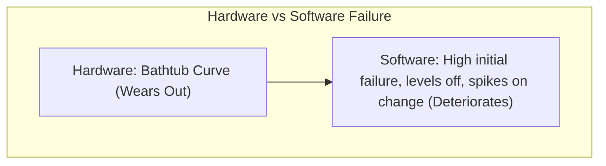
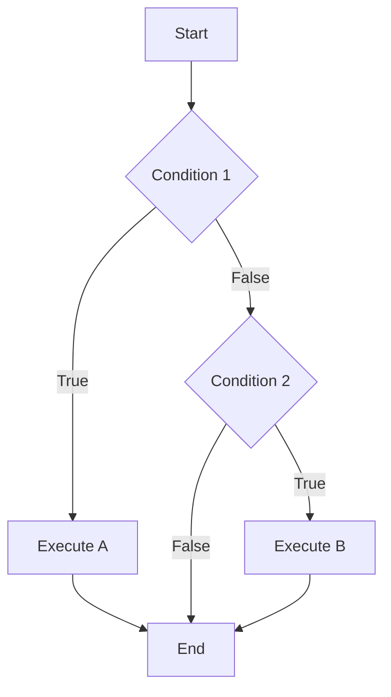

# SE ESE — In-Depth Revision Notes (Exam Focussed)

> **Note:** This document has been heavily consolidated to deeply cover **exclusively** all topics across the entire Software Engineering syllabus (Modules 1 to 6). It is structured for rapid, high-yield exam preparation.

---

# Module 1: The Software Process

## Software & Its Characteristics
Software is a collection of computer programs, procedures, rules, documentation, and associated data.
- **Engineered, not Manufactured:** Software is logically designed and built; it lacks a classical manufacturing phase. Quality must be built-in during design.
- **Does Not Wear Out:** Unlike hardware, software doesn't degrade from environmental wear and tear. It deteriorates logically due to continuous changes (maintenance) introducing new defects.
- **Custom-Built:** Most software is built specifically for a client, although component-based reuse is increasing.

## Software Application Domains & The Evolving Role
Software has evolved from a simple product to the primary vehicle for delivering products and services globally.
- **System Software:** Serves other programs (e.g., OS, Compilers).
- **Application Software:** Stand-alone business solutions (e.g., ERP, CRM).
- **Embedded Software:** Resides in hardware controlling systems (e.g., Automotive ECUs).
- **Web/Mobile & AI Software:** Network-centric apps and non-numerical complex problem solvers.

## The Process Framework & Umbrella Activities
A process framework establishes the foundation for software engineering.
**5 Generic Framework Activities:**
1. **Communication:** Stakeholder collaboration and requirements gathering.
2. **Planning:** Estimating, scheduling, and risk analysis.
3. **Modeling:** Analysis of requirements and structural design.
4. **Construction:** Code generation and rigorous testing.
5. **Deployment:** Delivery, user evaluation, and feedback.

**Umbrella Activities (Applied across all phases):**
- Project Tracking & Control
- Risk Management
- Software Quality Assurance (SQA)
- Technical Reviews & Measurement
- Software Configuration Management (SCM)

## Process Patterns
Patterns describe proven solutions to recurring process-related problems.
- **Stage Patterns:** Associated with a framework activity (e.g., Communication).
- **Task Patterns:** Associated with a specific action (e.g., Requirements Gathering).
- **Phase Patterns:** Defines the sequence of framework activities (e.g., Spiral Model flow).

## Software Development Myths
Myths propagate false expectations leading to project failure.
- **Management:** "Adding people to a late project catches it up" (Brooks' Law proves it delays it further due to communication overhead).
- **Customer:** "A general objective is enough to start coding" (Ambiguity destroys architecture).
- **Practitioner:** "Our job is done when the code works" (Maintenance takes 60-80% of total effort).

## Process Assessment: CMMI & ISO Standards
Evaluates the current state of software processes to identify weaknesses.
- **CMMI Maturity Levels:**
  1. **Initial (Ad-hoc):** Chaotic, depends on individual heroics.
  2. **Managed:** Basic project management is established.
  3. **Defined:** Standardized, documented processes across the organization.
  4. **Quantitatively Managed:** Processes are heavily measured and statistically controlled.
  5. **Optimizing:** Continuous, innovative process improvement.
- **ISO Standards:** Provide a baseline quality framework ensuring global standard compliance.

## PSP and TSP (Personal & Team Software Process)
- **PSP (Personal):** Focuses on individual developer discipline. Emphasizes personal measurement (time tracking, defect injection/removal) to improve individual code quality.
- **TSP (Team):** Extends PSP to teams, creating self-directed, high-performance groups that manage their own projects efficiently using detailed scripts and roles.

---

# Module 2: Traditional & Agile Software Development

## Traditional Process Models
Models provide a structured framework for development. 
- **Waterfall Model:** Linear sequential flow. Best for short projects with rigid, well-understood requirements. Fails when requirements change rapidly.
- **Incremental Model:** Delivers software in functional portions (increments). First increment is the core product. Flexible and provides early working software.
- **Prototyping Model:** Rapidly building a "mock-up" to clarify vague requirements. Customers evaluate it, ensuring the final product matches expectations perfectly.
- **Spiral Model (Boehm):** Combines iteration with explicit **Risk Analysis**. Highly effective for massive, mission-critical, high-risk projects.
- **Concurrent Development:** All activities exist simultaneously in different states (e.g., modeling happening alongside coding). Excellent for client/server apps.
- **Component Assembly:** Heavily relies on reusing pre-tested, pre-built components, slashing development time and costs significantly.

## Agile Software Development & The Manifesto
Agility focuses on flexibility, rapid delivery, and adapting to change over rigid planning.
**Agile Manifesto Values:**
- Individuals & interactions > Processes & tools.
- Working software > Comprehensive documentation.
- Customer collaboration > Contract negotiation.
- Responding to change > Following a plan.

## Agile Frameworks: Scrum & XP
- **Scrum:** Iterative project management framework.
  - *Roles:* Product Owner (defines features), Scrum Master (removes blockers), Development Team.
  - *Sprints:* 2-4 week development cycles delivering a "shippable increment".
  - *Ceremonies:* Daily Stand-up (15 mins), Sprint Planning, Review, Retrospective.
- **Extreme Programming (XP):** Engineering-focused agile model.
  - *Practices:* Pair Programming (two coders, one machine), Test-Driven Development (TDD) (writing tests before code), Continuous Integration, Refactoring, and Small Releases.

---

# Module 3: Requirements Analysis with Cost Estimation

## Requirements Engineering Process
The systematic process of defining what the system must do.
1. **Inception & Elicitation:** Gathering requirements via interviews, brainstorming, and use cases.
2. **Elaboration:** Expanding requirements into a detailed analysis model.
3. **Negotiation:** Reconciling conflicting stakeholder demands.
4. **Specification:** Producing the final Software Requirement Specification (SRS) document.
5. **Validation:** Checking the SRS strictly for completeness, consistency, and traceability.
6. **Management:** Controlling changes to requirements iteratively.

## Requirement Types & Feasibility
- **Functional:** Explicit system behaviors (e.g., User login authentication).
- **Non-Functional:** Quality constraints (e.g., 99.9% uptime, 2-second load times).
- **Feasibility Study:** Evaluates if the project is technically, financially, and operationally viable before committing resources.

## Analysis Modeling
Translates textual requirements into structural diagrams.
- **Data Flow Diagrams (DFD):** Maps data flow logically. Level 0 (Context) shows the whole system; Level 1 breaks down major processes.
- **Use Case Diagrams:** Visualizes direct interactions between external actors (users/systems) and the system's core functions.

## Project Estimation Techniques
Estimation predicts Effort (Person-Months), Duration, and Cost.
- **LOC (Lines of Code):** Size-based metric. Simple but language-dependent (1000 lines of C != 1000 lines of Python).
- **Function Point Analysis (FPA):** Language-independent metric evaluating functionality based on 5 parameters: External Inputs, Outputs, Inquiries, Internal Logical Files, and External Interface Files.

### COCOMO Model (Constructive Cost Model)
Calculates exact effort and time required based on KLOC (Thousands of Lines of Code).
- **Organic:** Small teams, familiar technology (e.g., simple payroll app).
- **Semi-detached:** Medium complexity, mixed experience.
- **Embedded:** Highly complex, rigid constraints (e.g., Air traffic control).
- *Basic Formulas:* 
  `Effort (E) = a * (KLOC)^b` PM 
  `Time (T) = c * (E)^d` Months

---

# Module 4: Design Engineering

## Design Principles
Principles establish a core foundation for designing high-quality software:
- **Traceability:** The design must be completely traceable back to the analysis model and SRS.
- **Minimize Intellectual Distance:** The design should effectively shorten the intellectual gap between software execution and the real-world problem.
- **Uniformity & Integration:** Designs should exhibit deep structural uniformity; it should look like one person wrote it.
- **Accommodate Change:** Structured proactively to accommodate change efficiently without breaking the system.

## Design Concepts
- **Abstraction:** Focuses actively on raw problem-solving without lower-level clutter (Levels: User, Procedural, Data). Reduces cognitive load.
- **Modularity:** Compartmentalizing software into isolated, single-purpose components. Exponentially improves maintainability.
- **Information Hiding:** Demands modules strictly hide internal raw data from surrounding code (Encapsulation). Eliminates side-effects and cements security.
- **Refinement:** Step-by-step downstream algorithmic elaboration of abstract structural models firmly into procedural logic.

## The Design Model Blueprint
1. **Data Design:** Physically transforms abstract entities into actionable data structures and optimized databases.
2. **Architecture Design:** Formulates relationship parameters operating across massive structural segments.
3. **User Interface (UI) Design:** Directs how software interprets input from users. Excellent UI dramatically improves end-user satisfaction.
4. **Component-Level Design:** Transmutes structural modules physically into procedural algorithmic execution sets.

## Functional Independence: Coupling & Cohesion
Excellent architectures actively engineer isolated parameter independence.
- **Cohesion (Goal: Highest Level):** How tightly internal module components relate to each other. *Functional Cohesion* (Single, perfect purpose) is the gold standard.
- **Coupling (Goal: Lowest Limit):** The degree of structural inter-dependence spanning separate modules. *Data Coupling* isolates modules efficiently by preventing unrestricted global variable sharing.

---

# Module 5: Risk Management & SCM

## Software Risks
Risk designates a potential failure warning mechanism.
- **Reactive vs Proactive Strategies:** Reactive protocols are post-catastrophe fire-fighting. Proactive mitigation enforces strict predictive analysis designed to avert crises pre-emptively.
- **Core Risk Categories:**
  1. **Project Risks:** Jeopardize fundamental timeframes (e.g., Unrealistic deadlines).
  2. **Technical Risks:** Corrupt qualitative implementation (e.g., Code logic breakdown).
  3. **Business Risks:** Cripple product market share inherently (e.g., Hostile competitor drops similar program).

## Risk Paradigm & Process
1. **Identification:** Isolating variable threats structurally.
2. **Projection & Assessment:** Determining exact likelihood ratios (Probability) against impact value. *Risk Score = Probability × Impact*.
3. **RMMM Framework:**
   - **Risk Mitigation:** Prevents occurrences completely.
   - **Risk Monitoring:** Constantly tracks failure condition telemetry metrics organically.
   - **Risk Management:** Established contingency failover fallback protocols.

## Software Configuration Management (SCM)
Governs overarching development lifecycle change modifications strictly.
- **3 Primary Goals:**
  1. *Identify:* Define explicit configuration item frameworks securely.
  2. *Control:* Defend environments rigorously against unauthorized developer overwrites via Change Control Boards (CCB).
  3. *Audit:* Verifiable systemic verification guaranteeing correct engineering implementations natively.
- **Version Control Processes:** Centralizes structural configurations. Implements critical failsafe branching, merging, and structural baseline rollbacks rapidly upon disaster.
- **SCM Lifecycle Flow:** Change Request -> CCB Evaluation -> Approval -> Code Checkout -> Audit -> Commit New Baseline.

---

# Module 6: Software Testing & QA

## Standardized Testing Tactics
- **Black Box (Behavioral Testing):** Evaluates consumer-facing output metrics blindly evaluating interface interactions, specifically omitting baseline logic analysis. (Used in System/Acceptance Testing).
- **White Box (Structural Testing):** Leverages deep inspection mechanisms parsing loops systematically alongside logical pathway node verifications. (Used in Unit/Integration Testing).

## Black Box Techniques
- **Boundary Value Analysis (BVA):** Capitalizes heavily upon structural code limits systematically. Checks parameter limits natively (e.g., testing limits -1, exactly at limit, and limit +1).
- **Equivalence Partitioning:** Logically divides the input domain into defined classes (valid/invalid) reducing total repetitive test cases required by executing one representative value per partitioned class.

## White Box Metrics: Cyclomatic Complexity
Evaluates mathematical code complexity inherently calculating completely sovereign pathway branches. 
- *Calculation Formula:* `V(G) = E - N + 2` (Edges - Nodes + 2) OR `V(G) = P + 1` (Predicate Nodes + 1).

*(Example: 2 Predicate conditions = Cyclomatic Complexity of 3 independent test paths)*

## Specialized Testing Phases
- **Integration Testing:** Focuses upon interconnectivity limitations strictly omitted by standalone Unit Testing.
  - *Top-Down:* Leverages code 'Stubs' to mock missing lower-layer implementations.
  - *Bottom-Up:* Relies specifically upon simulated 'Driver' components mimicking overarching calling features.
- **User Acceptance Testing (UAT):** End-users dynamically validate software requirement specifications. Uses *Alpha Testing* (Controlled site) and *Beta Testing* (Uncontrolled end-user environments).
- **Regression Testing:** Actively ensures that newly introduced modifications do not unexpectedly break previously functional components natively.

## Software Quality Assurance (SQA) & McCall’s Factors
QA governs the holistic lifecycle actively preventing codebase contamination rather than post-production reaction testing.
**McCall's Quality Factors:**
1. **Product Operations:** Correctness, Reliability, Usability.
2. **Product Revision:** Maintainability, Flexibility, Testability.
3. **Product Transition:** Portability, Reusability, Interoperability.

---
> **End of Comprehensive SE Notes**
