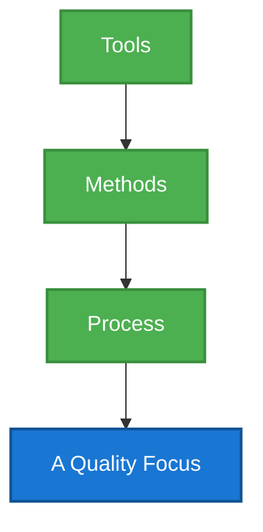
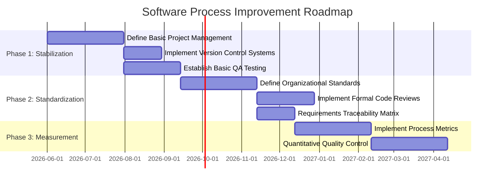

## Module 1 Question Bank: The Software Process

**1. Elaborate on the definition of software and its key characteristics.** (2 Marks)

Software is not just code; it is a collection of computer programs, associated documentation, and data structures that enable computers to perform specific tasks. Unlike hardware, which is physical, software is logical. A key characteristic is that software does not "wear out" like physical machines do, though it can degrade due to poor changes. It is custom-built or engineered rather than being manufactured in the classical sense.

---

**2. Summarize the evolving role of software in modern technological contexts.** (2 Marks)

The role of software has evolved from a simple information processing tool to the fundamental engine driving modern technology. It powers everything from smartphones and household appliances to complex cloud infrastructures and artificial intelligence. Software acts as a product itself, while also serving as a vehicle for delivering products and services. In today's digital age, it transforms industries, enabling smart cities, autonomous vehicles, and global connectivity.

---

**3. Apply the concept of process assessment to outline its importance in software engineering.** (2 Marks)

Process assessment is a systematic evaluation of an organization's software development processes against a standard framework. Its importance lies in identifying process strengths and weaknesses, enabling continuous improvement. By understanding the current state of their processes, organizations can implement targeted changes to enhance productivity, reduce defects, and improve the overall quality of the software produced, making assessment crucial for long-term success.

---

**4. Describe the purpose of Personal Software Process (PSP) and its role in individual productivity.** (2 Marks)

The Personal Software Process (PSP) is a structured framework designed to help individual software developers improve their personal performance. Its purpose is to guide engineers in planning their work, tracking their time and defects, and analyzing their own data to make better estimates. By bringing discipline to individual coding practices, PSP significantly enhances personal productivity, reduces errors early in the cycle, and ultimately contributes to higher quality software.

---

**5. Illustrate the significance of SDLC by applying it to a software engineering context.** (2 Marks)

The Software Development Life Cycle (SDLC) is significant because it provides a structured blueprint for building software applications. In a software engineering context, applying the SDLC ensures that projects progress smoothly from initial requirements gathering to design, coding, testing, and final deployment. It helps teams manage resources effectively, maintain high quality, and deliver the project on time and within budget, acting as a crucial roadmap for complex developments.

---

**6. Categorize different umbrella activities in software development and justify their relevance.** (2 Marks)

Umbrella activities are ongoing tasks that occur across the entire software development process, rather than being confined to a single phase. They include Software Quality Assurance (SQA) to ensure high standards, Software Configuration Management (SCM) to handle changes, and Risk Management to mitigate potential issues. Their relevance is critical; they provide constant tracking, control, and quality checks, ensuring the project stays on track regardless of the specific development phase.

---

**7. Distinguish between different types of process patterns and classify them with suitable examples.** (2 Marks)

Process patterns provide reusable templates for solving common problems in software development. They are typically classified into three types: Phase Patterns, which define the flow of broad project phases like "Prototyping"; Stage Patterns, which structure specific steps within a phase, such as "Design Subsystem"; and Task Patterns, which detail specific actions like "Conduct Code Review." Utilizing these patterns helps teams quickly apply proven strategies to their unique projects.

---

**8. Apply the concept of Layered Technology to illustrate how each layer contributes to software engineering. Explain with a suitable diagram.** (5 Marks)

The Layered Technology approach to software engineering views the discipline as a series of interconnected layers, building upon a strong foundation of quality. 

1. **A Quality Focus:** This is the bedrock layer. Any engineering approach must rest on an organizational commitment to quality. Without a focus on continuous quality improvement, the subsequent layers will fail to produce reliable software.
2. **Process Layer:** This layer holds the technology layers together. It defines the framework for the delivery of software engineering technology. It establishes the context in which technical methods are applied, work products are created, and milestones are achieved.
3. **Methods Layer:** This layer provides the technical "how-to" for building software. It encompasses a broad array of tasks, including requirements analysis, design, program construction, testing, and support. Methods rely on a set of basic principles that govern each area of the technology.
4. **Tools Layer:** The top layer provides automated and semi-automated support for the process and the methods. When tools are integrated so that information created by one tool can be used by another, a system for the support of software development is established.

This layered structure ensures a comprehensive and quality-driven approach to software development.

---

**9. Apply the Process Framework model to a real-world software project scenario. Justify its essential role in managing software development.** (5 Marks)

A Process Framework provides a foundational structure for organizing and managing software development. Consider a real-world scenario of developing a new mobile banking application. The framework establishes a set of framework activities that apply to all projects, regardless of their size or complexity. 

For the banking app, the framework defines the **Communication** phase to gather requirements from stakeholders and users. This is followed by **Planning**, where resources, risks, and timelines are established. The **Modeling** phase involves creating architectural and user interface designs. **Construction** covers the actual coding and rigorous security testing. Finally, **Deployment** manages the release to app stores and gathering user feedback.

The essential role of this framework is to provide consistency and predictability. Without it, developing a sensitive application like a banking app would be chaotic. It ensures that critical steps, such as security modeling and user testing, are not skipped. By defining clear activities and the flow between them, the process framework allows project managers to track progress accurately, allocate resources efficiently, and ensure that the final product meets both business goals and user expectations.

---

**10. Design a process pattern template for a software project and demonstrate how task and stage patterns are used in it.** (5 Marks)

A process pattern template provides a standardized way to describe a proven solution to a recurring problem in software engineering. A good template includes the Pattern Name, Intent, Type, Initial Context, Problem, Solution, Resulting Context, and Related Patterns.

Consider designing a process for **"Handling Changing Requirements"**.
*   **Pattern Name:** Agile Requirement Adaptability.
*   **Intent:** To manage and integrate new customer requirements smoothly during ongoing development.
*   **Type:** Phase Pattern.

In this scenario, a **Stage Pattern** could be "Sprint Planning." During this stage, the team evaluates the new requirements and decides which to include in the upcoming development cycle. It organizes the broad goal into a manageable timeframe.

A **Task Pattern** within that stage would be "Requirement Prioritization." This task pattern defines the specific steps taken by the Product Owner and the team to rank the new requirements based on business value and technical feasibility.

By using this template, teams don't have to invent a new method every time requirements change. They use the Stage Pattern to structure their approach (the sprint) and Task Patterns to execute the specific actions (prioritization), ensuring a structured, predictable response to dynamic project conditions.

---

**11. Classify different types of software and construct a comparison illustrating the distinction between system software and application software.** (5 Marks)

Software is broadly classified into several categories based on its purpose, functionality, and the environment in which it operates. The two most fundamental classifications are System Software and Application Software. 

**System Software** consists of programs written to service other programs. It acts as an intermediary between the computer hardware and the application programs. This type of software is heavily involved with managing hardware resources, memory, and fundamental system operations. Examples include Operating Systems (like Windows, Linux, macOS), device drivers, and utility programs (like disk defragmenters or antivirus software). It generally runs in the background and is essential for the computer to function.

**Application Software**, on the other hand, consists of standalone programs that solve a specific business need or perform a particular task for the end-user. It is designed to facilitate human activities. Applications utilize the capabilities of the system software to interact with the hardware. Examples include word processors, web browsers, database management systems, and video editing software.

**Comparison:**
System Software is general-purpose and hardware-centric, aiming to run the system itself. Application Software is specific-purpose and user-centric, aiming to perform tasks for the user. A computer cannot run without system software, but it can easily run without specific application software. System software typically runs continuously, while application software runs as needed by the user.

---

**12. Analyze the significance of ISO standards in improving software process quality. Examine how organizations benefit from ISO compliance.** (5 Marks)

The International Organization for Standardization (ISO) provides a globally recognized framework for quality management, specifically through the ISO 9000 series, with ISO 9001 being highly relevant to software engineering. The significance of ISO standards lies in their ability to establish a baseline for quality assurance, ensuring that a software organization follows a systematic, documented, and repeatable approach to development.

Organizations benefit immensely from ISO compliance. Firstly, it drives **process consistency**. By adhering to ISO standards, an organization ensures that every project follows a defined methodology, reducing errors and increasing predictability. Secondly, it fosters **continuous improvement**. ISO mandates regular audits and reviews, forcing the organization to constantly evaluate and enhance its processes. 

Furthermore, ISO certification serves as a powerful **mark of credibility**. It demonstrates to clients and stakeholders that the organization is committed to high-quality standards, often providing a competitive edge in the market. Internally, it improves employee onboarding and training, as processes are clearly documented. Ultimately, ISO standards shift the focus from merely finding defects in the final software to preventing them throughout the entire software process.

---

**13. Analyze how task patterns contribute to successful project completion. Examine their impact on scheduling and team coordination.** (5 Marks)

Task patterns define a specific sequence of actions, roles, and work products required to solve a recurring technical or management problem in a software project. They are highly specific, actionable blueprints for daily work.

The contribution of task patterns to successful project completion is significant. When a team encounters a common challenge—for example, "Conducting a Peer Code Review"—a task pattern provides the exact steps: who initiates it, what checklist is used, how feedback is recorded, and how corrections are verified. This eliminates guesswork and ensures that critical, low-level activities are performed consistently and thoroughly.

Regarding **scheduling**, task patterns make estimation much more accurate. Because the steps of the task are well-defined, managers can precisely estimate the time required for each step, leading to more reliable project timelines. 

In terms of **team coordination**, task patterns are invaluable. They clearly define roles and responsibilities. Everyone knows exactly what is expected of them during that specific task. This reduces confusion, prevents duplicated effort, and ensures smooth handoffs between team members. By standardizing how individual tasks are executed, task patterns build a foundation of reliability that scales up to ensure the overall success of the project.

---

**14. Analyze the Capability Maturity Model (CMM). Assess how an organization can transition from one maturity level to the next.** (5 Marks)

The Capability Maturity Model (CMM), developed by the Software Engineering Institute (SEI), is a framework used to assess the maturity and capability of an organization's software development processes. It defines five maturity levels, providing a roadmap for continuous process improvement.

1.  **Initial (Level 1):** Processes are ad hoc, chaotic, and heavily dependent on individual heroics.
2.  **Repeatable (Level 2):** Basic project management processes are established to track cost, schedule, and functionality.
3.  **Defined (Level 3):** Processes are documented, standardized, and integrated across the organization.
4.  **Managed (Level 4):** Detailed metrics are collected, and processes are quantitatively controlled.
5.  **Optimizing (Level 5):** Continuous process improvement is driven by quantitative feedback and innovation.

To **transition from one level to the next**, an organization must fulfill the specific Key Process Areas (KPAs) of the target level. For example, to move from Level 1 to Level 2, the organization must implement basic project planning, configuration management, and requirements management. Moving from Level 2 to Level 3 requires creating organizational standards and training programs. The transition involves a cycle of assessment to identify gaps, planning to address those gaps, implementing new processes, and continuously monitoring adherence until the new practices become deeply ingrained in the organizational culture.

---

**15. Compare and contrast PSP and TSP frameworks. Evaluate their effectiveness in software project management and recommend the most suitable approach for large-scale projects.** (10 Marks)

The Personal Software Process (PSP) and Team Software Process (TSP) are closely related frameworks designed to elevate the maturity and quality of software development, but they operate at different scales. 

**PSP (Personal Software Process):**
PSP focuses entirely on the individual engineer. It is a disciplined, data-driven approach that trains developers to measure their own performance. Engineers track the time they spend on different tasks, the defects they inject and remove, and the size of the code they write. The goal is personal continuous improvement. By understanding their own error rates and coding speeds, individuals can create highly accurate personal estimates, write cleaner code, and reduce testing time. PSP acts as a rigorous training regimen, turning software development from an art into an engineering discipline at the individual level.

**TSP (Team Software Process):**
TSP builds directly upon the foundation of PSP, scaling it up to the team level. It assumes that the team consists of PSP-trained engineers. TSP provides a structured framework for these capable individuals to work together effectively to build complex products. It guides the team through self-directed project planning, establishing roles, defining team goals, and tracking progress as a cohesive unit. TSP emphasizes team ownership of the process and the product.

**Comparison and Effectiveness:**
*   **Scope:** PSP is microscopic (individual habits), while TSP is macroscopic (team coordination and project execution).
*   **Focus:** PSP focuses on personal metrics (defects/KLOC, time management), whereas TSP focuses on team metrics (project milestones, overall product quality, team dynamics).
*   **Effectiveness:** PSP is highly effective for reducing individual defect rates and improving estimation accuracy. However, a team of great individuals can still fail if they cannot coordinate. TSP effectively bridges this gap, providing the structure needed to harmonize the efforts of PSP-trained engineers, leading to highly predictable project schedules and exceptionally low defect products.

**Recommendation for Large-Scale Projects:**
For large-scale projects, **TSP is the strongly recommended approach**, provided the prerequisite of PSP training is met. Large projects fail primarily due to communication breakdowns, poor planning, and integrated defects. TSP directly addresses these issues by enforcing rigorous team-based planning, clear role definitions, and continuous quality tracking. While an organization might start by implementing PSP to build individual capability, applying TSP is essential to harness those individual skills into a synchronized, high-performing team capable of tackling the massive complexity and coordination challenges inherent in large-scale software development.

---

**16. Analyze how evolving software trends influence the selection of process frameworks. Justify your analysis with real-world examples.** (10 Marks)

The selection of a software process framework is no longer a static decision; it is deeply influenced by the rapid evolution of software trends. In the past, heavy, plan-driven frameworks like the Waterfall model dominated. However, modern trends demand flexibility, speed, and continuous delivery, fundamentally shifting how organizations select their development processes.

**Influence of Evolving Trends:**

1.  **The Shift to Cloud and SaaS:** The rise of Software as a Service (SaaS) and cloud computing means software is never truly "finished." It requires continuous updates, patching, and feature releases. This trend heavily favors Agile frameworks and DevOps practices over traditional models. A Waterfall approach, which might take a year to release a new version, is entirely unsuitable for a cloud product that needs weekly updates.
2.  **Mobile App Development:** Mobile markets are highly volatile, and user feedback is immediate. Process frameworks must accommodate rapid prototyping and iterative releases. This trend has popularized lightweight Agile frameworks like Scrum, allowing teams to pivot quickly based on user reviews and changing mobile OS standards.
3.  **Artificial Intelligence and Machine Learning:** Developing AI models involves significant experimentation and uncertainty. Traditional processes fail here because you cannot definitively plan how an AI model will behave until it is trained. Frameworks that support iterative experimentation and continuous integration of data models are essential for AI-driven projects.
4.  **Security as a Priority (DevSecOps):** With increasing cyber threats, security cannot be an afterthought left to the final testing phase. This trend influences the selection of frameworks that integrate security checks into every stage of development, promoting the DevSecOps methodology, ensuring continuous security assessment.

**Justification with Real-World Examples:**

Consider **Spotify**. They could not survive using a rigid, traditional process framework. The trend of streaming audio demands constant innovation, A/B testing of features, and seamless updates for millions of users. Therefore, they adopted and adapted Agile methodologies (often referred to as the "Spotify Model" with Tribes and Squads) to ensure their process framework supports continuous delivery and rapid scaling.

Conversely, consider **SpaceX** developing flight software for the Falcon 9. The trend here is extreme reliability in mission-critical, embedded systems. While they may use iterative methods internally, their overarching framework must include incredibly rigorous, heavily documented verification and validation phases that resemble more traditional, highly controlled frameworks, as a single bug can result in catastrophic failure. The trend dictates the required rigor of the process.

---

**17. Apply software engineering principles to demonstrate their role in solving real-world problems. Support your argument with practical case studies.** (10 Marks)

Software engineering principles provide foundational guidelines that, when applied correctly, ensure the development of robust, maintainable, and effective solutions to complex real-world problems. These principles—such as modularity, abstraction, separation of concerns, and continuous testing—act as a compass guiding developers through the chaos of building large systems.

**Applying Principles to Real-World Problems:**

1.  **Principle of Modularity and Separation of Concerns:** This principle dictates that a complex system should be broken down into smaller, manageable, and independent modules. Each module should handle a specific aspect of the system's functionality.
    *   **Case Study: Amazon's E-commerce Platform.** In its early days, Amazon operated as a monolithic application. As the platform grew rapidly, this became a massive bottleneck; any small change could break the entire system. By applying the principle of modularity, Amazon transitioned to a microservices architecture. They separated concerns: one module handles the shopping cart, another handles user authentication, and another handles the recommendation engine. This allowed different teams to update, scale, and deploy these services independently, solving the real-world problem of scalability and system resilience.

2.  **Principle of Abstraction:** Abstraction involves hiding complex implementation details and exposing only the necessary interfaces. It allows developers to work with high-level concepts without needing to understand the underlying complexity.
    *   **Case Study: Google Maps API.** Google Maps solves the real-world problem of navigation and geographical data representation. It provides an API that heavily utilizes abstraction. A developer building a ride-sharing app does not need to know the complex algorithms Google uses to calculate traffic or render map tiles. They only interact with the abstracted API endpoints (e.g., "getRoute(start, end)"). This principle allows thousands of different businesses to integrate complex mapping technology easily and efficiently.

3.  **Principle of Continuous Testing and Validation:** Quality cannot be tested into a product at the end; it must be built in from the start. This principle ensures that the software meets requirements at every stage.
    *   **Case Study: Netflix's Chaos Monkey.** Netflix faces the real-world problem of maintaining constant uptime for millions of users across a massive global server network. They applied the principle of continuous testing uniquely by creating "Chaos Monkey"—a tool that randomly shuts down servers in their production environment. By constantly validating their system's ability to withstand failures, they ensure extreme resilience. This proactive application of testing principles prevents massive, real-world service outages.

---

**18. Apply appropriate documentation strategies to examine the role of documentation in software engineering across each phase of the lifecycle.** (10 Marks)

Documentation is often viewed as a tedious byproduct of coding, but in rigorous software engineering, appropriate documentation strategies are critical. Documentation acts as the organizational memory, a communication tool, and a baseline for quality assurance. Its role evolves significantly across the different phases of the software development lifecycle (SDLC).

**Role of Documentation Across the Lifecycle:**

1.  **Requirements Phase:** 
    *   **Strategy:** Capture clear, unambiguous, and testable requirements.
    *   **Role:** The primary document here is the Software Requirements Specification (SRS). This document serves as the binding contract between the stakeholders and the development team. It resolves the problem of "what" needs to be built. Good documentation here prevents scope creep and ensures everyone shares a common vision. It is the foundation upon which all subsequent work is based.

2.  **Design Phase:**
    *   **Strategy:** Create blueprints that guide implementation and facilitate architectural reviews.
    *   **Role:** Documents include System Architecture Design, Database Schemas, and Interface Specifications. The role is to translate requirements into a technical roadmap. It allows senior engineers to review the proposed structure for flaws before a single line of code is written. For a large team, design documentation ensures that different modules built by different developers will integrate seamlessly.

3.  **Implementation (Coding) Phase:**
    *   **Strategy:** Maintain self-documenting code supported by inline comments and API documentation.
    *   **Role:** While writing code, the documentation strategy shifts to the code level. Well-named variables and clear inline comments explain the "why" behind complex logic. Tools are often used to auto-generate API documentation (like Javadoc or Swagger). This documentation is crucial for immediate team collaboration and for future developers who will need to read and maintain the code.

4.  **Testing Phase:**
    *   **Strategy:** Document plans, cases, and results systematically.
    *   **Role:** Test Plans outline the overall strategy, while Test Cases detail the specific inputs, execution conditions, and expected results. Documenting Test Results and Bug Reports is essential for tracking progress and ensuring that defects are verified as fixed. This documentation provides concrete proof of the software's quality and stability.

5.  **Deployment and Maintenance Phase:**
    *   **Strategy:** Provide clear guides for end-users and detailed manuals for system administrators.
    *   **Role:** User Manuals and Release Notes are crucial for end-user adoption. For maintainers, comprehensive system documentation is vital for troubleshooting bugs and adding new features years after the original developers have moved on. Without strong maintenance documentation, legacy systems become impenetrable and dangerous to modify.

---

**19. Design an integrated process improvement plan combining CMMI, ISO/IEC standards, PSP, and TSP for a mid-sized software organization.** (10 Marks)

Designing an integrated process improvement plan for a mid-sized software organization requires a strategic blending of different frameworks. Each framework—CMMI, ISO/IEC, PSP, and TSP—offers unique strengths. A successful plan uses them complementarily rather than competitively.

**The Integrated Process Improvement Plan:**

**Phase 1: Foundation and Baseline (Months 1-3)**
*   **Action:** The organization begins by pursuing **ISO/IEC 9001** certification.
*   **Purpose:** ISO provides a broad, fundamental baseline for a Quality Management System. It forces the organization to document its existing, perhaps informal, processes. This establishes a culture of compliance and standardization, ensuring that basic project management, documentation, and auditing procedures are in place.

**Phase 2: Organizational Assessment and Roadmap (Months 4-6)**
*   **Action:** Conduct an initial assessment using the **CMMI (Capability Maturity Model Integration)** framework.
*   **Purpose:** With the ISO baseline established, CMMI provides a detailed, structured roadmap for maturity. The assessment identifies specific gaps in process areas (like Requirements Management or Configuration Management). The organization aims to achieve CMMI Maturity Level 2 (Managed) by formalizing these specific project-level processes across all teams.

**Phase 3: Individual Engineering Discipline (Months 7-12)**
*   **Action:** Roll out **PSP (Personal Software Process)** training to all developers.
*   **Purpose:** While CMMI and ISO address organizational management, they do not teach engineers how to write better code. PSP introduces rigorous discipline at the desk level. Developers learn to estimate their time, track their personal defect rates, and perform personal design and code reviews. This drastically reduces the number of defects injected during the coding phase, fundamentally improving the quality of the raw output.

**Phase 4: Team Cohesion and Advanced Maturity (Months 13-18)**
*   **Action:** Implement **TSP (Team Software Process)** and push for CMMI Level 3 (Defined).
*   **Purpose:** Once developers are trained in PSP, TSP is introduced to organize these capable individuals into high-performance teams. TSP provides the framework for the team to plan their own work, manage their commitments, and track progress using the data generated by PSP. Simultaneously, the organization uses CMMI Level 3 guidelines to ensure that these robust team processes are standardized and shared across the entire enterprise, creating a unified organizational standard.

**Phase 5: Continuous Optimization (Ongoing)**
*   **Action:** Leverage metrics from PSP/TSP to achieve CMMI Levels 4 and 5.
*   **Purpose:** The integrated system is now self-sustaining. The detailed, quantitative data generated by PSP and TSP feeds directly into the requirements for CMMI High Maturity (Levels 4 and 5). The organization uses this data to statistically manage processes, predict performance, and drive continuous, innovative improvements.

---

**20. Apply process assessment techniques to construct a process improvement framework for a software engineering organization with a structured improvement roadmap.** (10 Marks)

Process assessment is the crucial first step in any meaningful journey toward software engineering excellence. It provides the objective reality of how an organization currently develops software, which is essential before mapping out how to improve. 

**Process Assessment Techniques:**
To begin, the organization must employ structured assessment techniques. This typically involves using an established appraisal method, such as SCAMPI (Standard CMMI Appraisal Method for Process Improvement). The technique involves:
1.  **Documentation Review:** Examining existing policies, project plans, test cases, and requirement documents.
2.  **Interviews:** Conducting structured interviews with project managers, developers, and QA personnel to understand how work is actually performed versus how it is documented.
3.  **Metrics Analysis:** Reviewing defect rates, schedule variances, and effort estimations to quantify current performance.

**Constructing the Process Improvement Framework and Roadmap:**

Based on the assessment findings, we construct a framework prioritizing the most critical weaknesses.

**Structured Improvement Roadmap:**

**Step 1: Stabilization (Short-Term Focus)**
*   **Goal:** Bring chaotic processes under basic management control.
*   **Actions:** Focus on fundamental project management. If the assessment revealed missed deadlines, the framework mandates rigorous estimation and tracking. If code is frequently lost, strict Configuration Management (version control) is implemented. The focus is on establishing repeatability.

**Step 2: Standardization (Medium-Term Focus)**
*   **Goal:** Create a unified organizational approach.
*   **Actions:** Once projects are stable, the best practices from individual projects are extracted and documented as standard organizational procedures. This phase includes implementing formal peer reviews and standardizing requirements gathering techniques. Training programs are rolled out so every new project follows the defined standard.

**Step 3: Measurement and Optimization (Long-Term Focus)**
*   **Goal:** Data-driven continuous improvement.
*   **Actions:** With standardized processes in place, the organization can collect reliable data (metrics). The framework establishes systems to measure defect density, productivity, and process efficiency. Management uses this quantitative data to identify bottlenecks and proactively optimize processes, moving the organization from a reactive state to a continuously improving, proactive culture.

---

**21. Apply process assessment principles to demonstrate the importance of process improvement in software engineering. Construct a justified improvement strategy.** (10 Marks)

Process assessment acts as a diagnostic tool for a software organization. Just as a doctor cannot prescribe effective treatment without a thorough examination, an organization cannot improve its software development without a rigorous assessment. The principles of process assessment dictate that evaluations must be objective, evidence-based, and focused on the process itself, not on evaluating individual people.

**Importance of Process Improvement:**
The software industry is characterized by rapid change and increasing complexity. Process improvement is important because static processes quickly become obsolete. 
1.  **Quality Enhancement:** Poor processes inherently produce defective software. Improving the process directly reduces bugs, leading to higher customer satisfaction and lower maintenance costs.
2.  **Predictability:** Chaotic processes result in blown budgets and missed deadlines. Improvement strategies stabilize development, allowing organizations to accurately predict timelines and resource needs.
3.  **Efficiency:** Streamlining processes removes redundant tasks, automates bottlenecks, and allows engineers to focus on creative problem-solving rather than administrative overhead.

**Constructing a Justified Improvement Strategy:**

A justified strategy is one where every improvement action directly addresses a weakness identified during the assessment. 

**The Strategy: The "Defect Reduction First" Approach**

*   **Assessment Finding:** The organization discovers a high rate of severe bugs being found by clients in production, leading to massive financial losses and reputational damage.
*   **Justified Strategy Objective:** Shift defect discovery to the earliest possible phases of the software lifecycle.

**Implementation Steps:**
1.  **Introduce Rigorous Requirements Validation (Month 1-3):** 
    *   *Justification:* Defects introduced in the requirements phase are the most expensive to fix later. The strategy mandates formal sign-offs and prototyping to ensure the right product is being built before coding starts.
2.  **Mandate Formal Peer Code Reviews (Month 4-6):**
    *   *Justification:* Assessment shows that developers work in silos. Code reviews are a proven, cost-effective method for catching logical errors and security vulnerabilities immediately after they are typed, long before formal testing.
3.  **Implement Automated Unit Testing (Month 7-9):**
    *   *Justification:* Manual testing is a bottleneck. Developers are required to write automated tests for their own code. This creates a safety net, ensuring that new changes do not break existing functionality (regression), thereby stabilizing the codebase.
4.  **Establish an Independent QA Gate (Month 10-12):**
    *   *Justification:* Developers cannot objectively test their own software. The strategy establishes a dedicated QA team responsible for final, rigorous system and acceptance testing before any release.

This strategy is justified because every step is logically connected to the core assessment finding: reducing production defects. By improving processes upstream (requirements, coding), the organization solves the problem proactively rather than reactively patching bugs.
