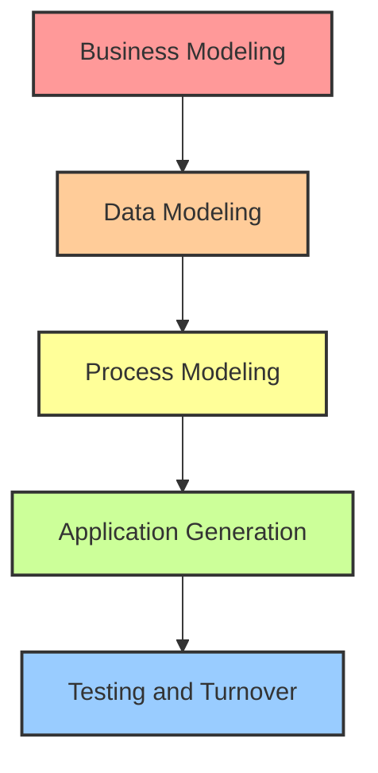
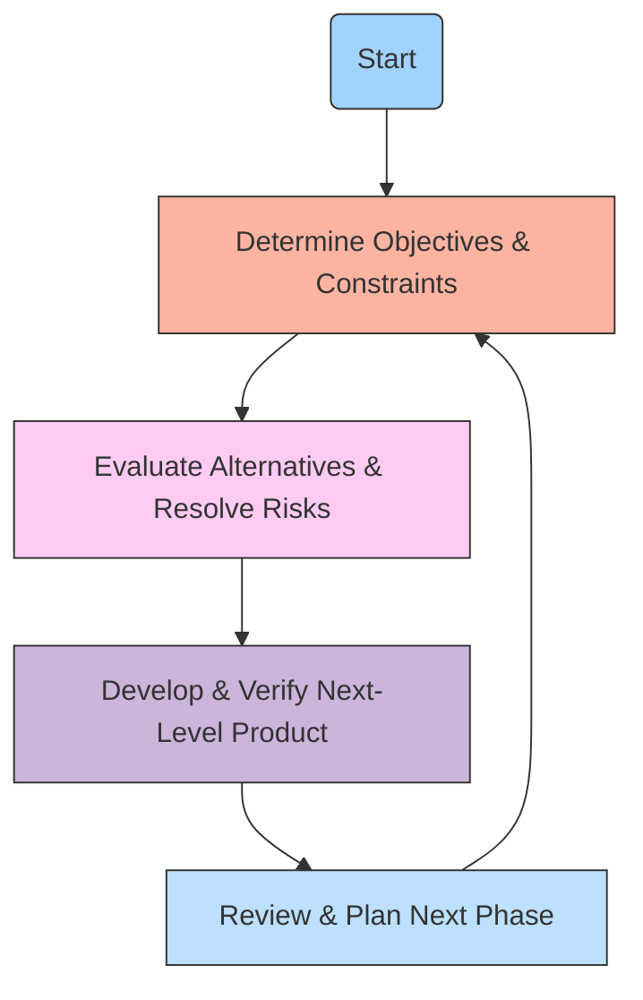
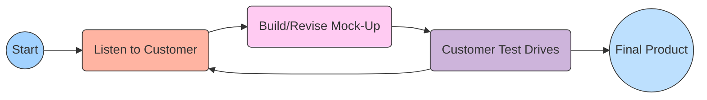
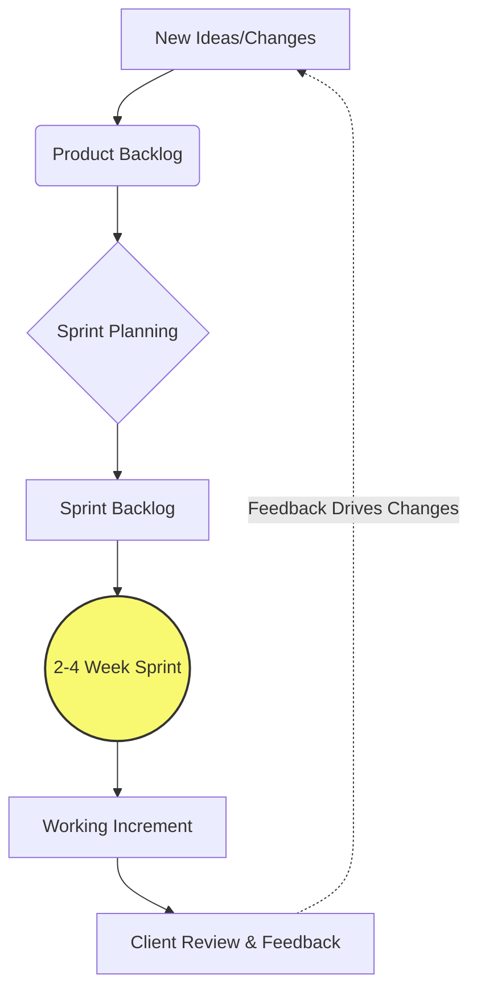
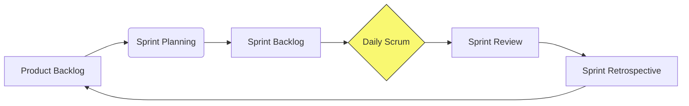

## Module 2

### Q22. Discuss the Agile Manifesto values. (2 Marks)
The Agile Manifesto outlines four foundational values that prioritize flexibility and human interaction over rigid processes in software development. Firstly, it values **Individuals and interactions over processes and tools**, meaning team communication is crucial. Secondly, it emphasizes **Working software over comprehensive documentation**, focusing on delivering functional products rather than excessive paperwork. Thirdly, it champions **Customer collaboration over contract negotiation**, ensuring continuous alignment with user needs. Finally, it supports **Responding to change over following a plan**, allowing teams to adapt to evolving requirements quickly.

### Q23. Examine different Prescriptive and Specialized Process Models and compare their applicability. (2 Marks)
Prescriptive process models, like Waterfall or Incremental models, provide a strict, predefined roadmap for software engineering. They dictate exact phases, tasks, and outcomes, making them highly applicable for projects with clear, stable requirements and formal structures. In contrast, Specialized process models, such as Component Assembly or Concurrent models, are tailored for specific types of engineering environments. For example, Component Assembly focuses on reusability, which is perfect for projects leveraging existing libraries, while the Concurrent model manages parallel tasks effectively in complex, distributed systems.

### Q24. Illustrate why software process models are necessary for software product development. (2 Marks)
Software process models act as a vital blueprint for the entire development lifecycle, bringing order to what could otherwise be a chaotic endeavor. They provide a structured sequence of activities, ensuring that every phase—from requirement gathering to deployment—is systematically executed. This structure improves predictability, allowing teams to estimate timelines, manage budgets, and allocate resources efficiently. Furthermore, process models establish clear milestones and deliverables, making it easier to track progress, maintain quality standards, and ensure the final software meets customer expectations reliably.

### Q25. Interpret the phases of the Waterfall model and explain the role of each phase. (2 Marks)
The Waterfall model is a linear sequential approach. Its phases include: **Requirements**, where all system needs are gathered and documented; **Design**, which translates requirements into software architecture and blueprints; **Implementation**, where developers write the actual code; **Testing**, to rigorously find and fix defects ensuring quality; **Deployment**, releasing the software to the users; and **Maintenance**, handling post-release updates and bug fixes. Each phase must be completed before the next begins, making it simple to manage but highly inflexible to changes.

### Q26. Apply the concept of concurrent development to describe how parallel activities are managed in software engineering. (2 Marks)
Concurrent development, often used in client/server architectures, allows multiple software engineering activities to occur simultaneously rather than sequentially. Instead of waiting for one phase to finish completely, tasks exist in various "states" like Under Development, Awaiting Changes, or Baselined. For example, while the design team is refining the architecture (Under Revision), the coding team might already be building independent, stable modules (Baselined). This parallel management significantly speeds up the development timeline and dynamically accommodates changes across different components at the same time.

### Q27. Demonstrate what is meant by iterative development with the help of a suitable example. (2 Marks)
Iterative development is an approach where software is built and improved in repeated cycles, or "iterations." Instead of aiming for a perfect final product immediately, a basic version is created, evaluated, and refined continuously. For example, if building a word processor, the first iteration might only allow typing and saving text. The team tests this with users. The second iteration adds text formatting (bold, italics), and the third adds spell check. Each cycle produces a better, more feature-rich version based on feedback, effectively managing risks and evolving requirements step-by-step.

### Q28. Differentiate between the roles of Scrum Master, Product Owner, and Development Team in a Scrum team. (2 Marks)
In a Scrum team, the **Product Owner** acts as the voice of the customer, prioritizing the product backlog and ensuring the team builds maximum value. The **Scrum Master** is the servant-leader and facilitator, removing obstacles, coaching the team on Agile practices, and ensuring Scrum rules are followed. The **Development Team** consists of self-organizing, cross-functional professionals (developers, testers, designers) who execute the actual work. They collaboratively decide how to achieve the sprint goals and deliver a potentially shippable product increment by the end of each sprint cycle.

### Q29. Analyze the Rapid Application Development (RAD) Model with a suitable diagram. Examine its fundamental principles and identify scenarios where it is most effective. (5 Marks)
The Rapid Application Development (RAD) model is a high-speed adaptation of the linear sequential model, designed to achieve extremely fast development cycles (typically 60 to 90 days). Its fundamental principles revolve around heavy user involvement, component-based construction, and minimal planning in favor of rapid prototyping. The model emphasizes functional delivery over extensive documentation.

RAD consists of five phases: Business Modeling (understanding information flow), Data Modeling (refining data objects), Process Modeling (transforming data), Application Generation (using automated tools to build code), and Testing (focusing on new components). 

**Scenarios for Effectiveness:**
RAD is highly effective when requirements are well understood and the project scope is constrained. It is ideal for internal business applications (like HR portals or inventory systems) where the user interface is critical and end-users are readily available to provide immediate feedback. However, it requires a strong, committed team; if developers or clients cannot maintain the fast pace, RAD projects will fail. It is not suitable for highly complex, technically risky projects.

### Q30. Apply the Component Assembly Model to a software development scenario and demonstrate how reusable components improve development efficiency. (5 Marks)
The Component Assembly Model incorporates many characteristics of the spiral model but relies heavily on the use of pre-packaged software components or object-oriented classes. Instead of writing code from scratch, developers assemble existing, validated components to build the new system. 

Imagine a scenario where a team is developing a new E-Commerce web application. Instead of custom-coding a payment gateway, a user authentication system, and a shopping cart, the team evaluates and selects existing secure components for these features (e.g., integrating Stripe for payments and Auth0 for logins). 

**Improving Efficiency:**
This approach massively improves development efficiency in several ways:
1. **Time Savings**: Development time is drastically reduced because large portions of the system are simply plugged in rather than written and debugged line-by-line.
2. **Reduced Cost**: Buying or reusing existing components is often significantly cheaper than financing the man-hours required for custom development.
3. **Higher Quality & Reliability**: Reusable components have usually been thoroughly tested in other applications, meaning they come with fewer bugs.
4. **Faster Time-to-Market**: The focus shifts from coding to integration and testing, allowing the E-Commerce platform to launch much earlier.

### Q31. Apply the Concurrent Process Model to a practical software project. Outline its features and demonstrate how it manages parallel activities. (5 Marks)
The Concurrent Process Model, often represented as a series of major project activities existing simultaneously in various states, is highly effective for client/server systems or distributed software development. 

Consider a practical project: developing a mobile application and its corresponding backend server API. 
In the Concurrent model, the backend API team doesn't wait for the frontend design to be entirely finished. The 'Design' activity might be in the "Under Revision" state, while the 'Backend Development' activity transitions to the "Under Development" state based on initial agreements. 

**Managing Parallel Activities:**
The model handles concurrency through state transitions triggered by events. For instance, if the frontend team discovers a new requirement and changes the design, a "change event" is fired. The backend activity, which might be in the "Baselined" state, is immediately transitioned back to "Awaiting Changes" or "Under Revision." 

This event-driven network ensures that all parallel tracks of development stay synchronized. It is highly beneficial because it provides an accurate picture of the current state of a project. Instead of pretending a phase is "100% complete," it acknowledges that a component is "Baselined but awaiting testing," allowing multiple teams to work continuously without traditional bottleneck blockages.

### Q32. Analyze the advantages and disadvantages of Agile development in comparison to traditional process models. (5 Marks)
Agile development and traditional models (like Waterfall) represent two fundamentally different philosophies in software engineering. Agile focuses on adaptability, while traditional models focus on predictability.

**Advantages of Agile (vs. Traditional):**
1. **Flexibility to Change**: Agile welcomes changing requirements even late in development, whereas traditional models struggle significantly with changes once the design phase is locked.
2. **Continuous Feedback**: Agile delivers working software in short sprints (2-4 weeks), allowing constant customer feedback. Traditional models typically only show the product at the very end.
3. **Faster Time-to-Market**: Core features can be released early in Agile, whereas Waterfall requires the entire product to be finished before release.
4. **Improved Quality**: Continuous integration and daily testing in Agile catch bugs early.

**Disadvantages of Agile (vs. Traditional):**
1. **Lack of Documentation**: Agile prioritizes working software over comprehensive documentation. Traditional models produce extensive documentation, which is helpful for future maintenance.
2. **Unpredictable Costs and Timelines**: Because the scope is flexible, it is hard to estimate final costs and delivery dates accurately compared to fixed traditional models.
3. **High Resource Demands**: Agile requires experienced developers and intense, constant collaboration with the client, which isn't always possible in strict corporate environments.

### Q33. Apply the Spiral Model to a risk-intensive software development scenario and justify the conditions under which it is most appropriate. (5 Marks)
The Spiral Model combines iterative development with systematic risk management. It consists of four main sectors: Planning, Risk Analysis, Engineering, and Evaluation. Each loop around the spiral represents a phase of the project, gradually building from a concept to a fully realized system.

**Application to a Risk-Intensive Scenario:**
Imagine developing a life-critical medical imaging AI system. The risks are massive (patient misdiagnosis, strict regulatory compliance). Using the Spiral Model, the first loop might just produce a prototype to test the AI algorithm's feasibility (Risk Analysis). If it fails, the project can pivot or be cancelled before spending millions. The next loop might build a larger prototype to test regulatory compliance, and so on.

**Justification for Use:**
The Spiral model is most appropriate for large-scale, expensive, and complex projects where risk avoidance is the absolute highest priority. It is ideal when a new, untested technology is being utilized, or when requirements are highly complex and not fully understood upfront. It prevents disastrous failures by continuously evaluating risks before major investments are made.

### Q34. Analyze the application of the Incremental Model in software product development by comparing it with the Waterfall model. (5 Marks)
The Incremental Model merges the linear sequential flow of the Waterfall model with the iterative philosophy. Instead of delivering a massive final product in one go, the software is divided into independent, functional increments (modules) that are delivered staggered over time.

**Comparison with Waterfall:**
In a classic Waterfall, developing a comprehensive HR Management System (HRMS) would mean gathering all requirements for Payroll, Leave Management, and Recruitment, designing everything, coding everything, and finally delivering the whole system after a year. If the client hates it, the project fails entirely.

In the Incremental Model, the team applies a "mini-Waterfall" to each module. First, they develop and deliver just the Payroll module (Increment 1). The client starts using it immediately and provides feedback. While they use Payroll, the team develops Leave Management (Increment 2), integrating it later. 

**Advantages over Waterfall:**
1. **Early Value Delivery**: Customers get usable functionality much earlier.
2. **Lower Risk of Failure**: If Increment 1 is flawed, only one part of the project is delayed, not the entire system.
3. **Manageable Workload**: Staffing can be focused on one increment at a time, making project management easier than handling massive, monolithic Waterfall development.

### Q35. Design an Agile development plan for a startup product by applying core Agile values and selecting appropriate practices. (5 Marks)
Startups operate in highly uncertain environments where they must rapidly validate product ideas against market needs. An Agile development plan is crucial for this survival.

**The Agile Development Plan:**
1. **Embrace Customer Collaboration (Core Value)**: The startup will not spend months writing a massive spec document. Instead, the Product Owner will create a lightweight "Product Backlog" consisting of user stories based on direct interviews with early adopters.
2. **Iterative Sprints (Practice)**: The development will be structured in short, 2-week "Sprints." This ensures rapid delivery and prevents the team from going down the wrong path for too long.
3. **Working Software over Documentation (Core Value)**: By the end of Sprint 1, the goal is an MVP (Minimum Viable Product). For a food delivery app, this means a simple interface to order from one dummy restaurant, completely skipping complex payment integrations initially.
4. **Daily Stand-ups (Practice)**: The small startup team will hold 15-minute daily meetings to discuss what was done, what will be done, and any blockers, ensuring high team interaction (Individuals over processes).
5. **Responding to Change (Core Value)**: After releasing the MVP, user analytics might show customers want grocery delivery instead. The Agile plan allows the startup to instantly pivot the next sprint's backlog without breaking contractual agreements or rigid plans.

### Q36. Apply the Prototyping Model to a real-life example explaining all steps. Evaluate the trade-offs of using prototyping versus non-prototyping approaches. (10 Marks)
The Prototyping Model is a systems development method in which a prototype (an early approximation of a final system) is built, tested, and then reworked as necessary until an acceptable outcome is achieved from which the complete system can be developed.

**Application to a Real-Life Example:**
Imagine a software company tasked with building an innovative Virtual Reality (VR) interactive learning platform for medical students. Because VR interfaces are novel and highly subjective, the requirements cannot be fully documented upfront. The Prototyping Model is applied in the following steps:

1. **Requirements Gathering & Refinement**: The developers meet with medical professors to understand the broad objectives (e.g., simulating a surgical operation). Detailed features are left open.
2. **Quick Design**: The team rapidly designs a very basic VR environment focusing on the user interface and basic interaction, rather than underlying database architecture.
3. **Building the Prototype**: Developers create a "throwaway" or evolutionary VR mockup where a user can pick up a scalpel, even if the physics aren't perfect yet.
4. **Customer Evaluation**: The medical students and professors try the VR prototype. They provide crucial feedback: "The hand controls feel unnatural," or "We need to zoom in closer."
5. **Refinement**: The developers tweak the design based on the feedback. Steps 3, 4, and 5 iterate until the users are highly satisfied with the feel and functionality.
6. **Engineer Full System**: Once the prototype is approved, the team uses the validated design to build the robust, production-ready software with proper backend architecture.

**Trade-offs: Prototyping vs. Non-Prototyping (Waterfall)**
*Advantages of Prototyping:*
The biggest advantage is massive risk reduction concerning user acceptance. Customers can "see and feel" the product early, eliminating misunderstandings. It is excellent for novel systems where requirements are fuzzy. It heavily increases user involvement and satisfaction.
*Disadvantages of Prototyping:*
Customers may mistake the flimsy prototype for a nearly finished product, demanding an unrealistic launch date. Furthermore, developers might make poor architectural choices (like using an inefficient database) just to get the prototype working quickly, and then fail to rewrite it properly for the final product, resulting in unmaintainable legacy code. Non-prototyping approaches, while rigid, ensure rigorous, well-planned architecture from day one.

### Q37. Analyze which software development model best suits a scenario where a large formal client enforces a strict approach. Justify by comparing it with Agile alternatives. (10 Marks)
In a scenario involving a large, formal client (such as a government defense contractor, a highly regulated banking institution, or a major healthcare provider) that enforces strict compliance, rigid documentation, and fixed budgets, the **Waterfall Model (or the V-Model variation)** is the most suitable software development approach. 

**Characteristics of the Scenario:**
Large formal clients typically require exhaustive upfront planning. They operate on fixed-price contracts, meaning the exact scope of work must be defined before a single line of code is written. They have strict regulatory auditing requirements that mandate comprehensive documentation at every stage (requirements specs, architectural blueprints, test plans). Changes to scope usually require a formal, slow change-request board approval.

**Justification for Waterfall / Plan-Driven Approach:**
1. **Clear Milestones and Deliverables**: Waterfall provides distinct, easily trackable phases (Requirements -> Design -> Coding -> Testing). A formal client can sign off on a massive Requirements Document, providing a legal and financial baseline for the project.
2. **Comprehensive Documentation**: If the development team changes, or if an external auditor reviews the system 5 years later, the heavy documentation mandated by Waterfall ensures knowledge is preserved and compliance is proven.
3. **Predictability**: Budgeting and resource allocation are highly predictable, which is a massive priority for bureaucratic organizations.

**Comparison with Agile Alternatives:**
If we attempted to use an Agile approach (like Scrum) for this strict client, severe friction would occur. 
*   **Documentation Clash**: Agile values "working software over comprehensive documentation." The client's compliance officers would reject the software without extensive manuals and architectural proofs.
*   **Scope and Contract Friction**: Agile welcomes changing requirements late in development. A formal client with a fixed-price contract views changing requirements as "scope creep" that ruins budget allocations. Agile's flexible scope makes writing a traditional legal contract very difficult.
*   **Customer Availability**: Agile requires continuous, daily involvement from the client (e.g., a dedicated Product Owner). Large formal clients usually do not have the time or willingness to dedicate senior personnel to daily stand-ups; they prefer to state their needs upfront and return months later for the final product.

Therefore, while Agile is excellent for innovation and speed, a traditional, prescriptive model like Waterfall aligns perfectly with the bureaucratic, risk-averse, and highly structured nature of large formal clients.

### Q38. Evaluate which software development approach best adapts to frequently changing client requirements. Construct a justification supported by model characteristics. (10 Marks)
When a software project is faced with highly volatile and frequently changing client requirements, the **Agile Development Methodology** (specifically frameworks like **Scrum** or **Extreme Programming (XP)**) is unequivocally the best approach. Traditional plan-driven models completely break down under the stress of continuous changes, whereas Agile models are explicitly designed to harness change for the customer's competitive advantage.

**Justification Based on Agile Model Characteristics:**

1. **Iterative and Incremental Delivery:**
Unlike the Waterfall model, which attempts to build the entire system in one monolithic pass, Agile delivers software in short, time-boxed iterations (Sprints) usually lasting 1 to 4 weeks. This characteristic is crucial for adapting to change. If a client realizes a major requirement was wrong, the team only loses a few weeks of work at most. They can immediately pivot the direction of the product at the start of the next iteration.

2. **Dynamic Backlog Management:**
Agile uses a "Product Backlog" instead of a rigid Requirements Specification Document. The backlog is an ordered, living list of everything that is needed in the product. As client requirements change, the Product Owner can instantly add, remove, or reprioritize items in the backlog. The development team only commits to the requirements at the very top of the list during a Sprint Planning session, ensuring they are always working on the most currently relevant features.

3. **Continuous Customer Collaboration:**
Agile promotes having a dedicated representative of the client (the Product Owner) integrated with the development team. This constant collaboration ensures that as the client's business environment changes, the software team is immediately informed. Frequent demonstrations of working software at the end of each Sprint allow the client to physically see the progress and realize earlier if their initial requirements need adjustment.

4. **Embracing Change as a Core Value:**
The Agile Manifesto explicitly states "Responding to change over following a plan." In traditional models, a change request involves painful bureaucracy, budget renegotiations, and delays. In Agile, change is expected and welcomed. The architecture and code are kept simple and flexible through practices like refactoring and Test-Driven Development (in XP), ensuring that the codebase can adapt to new requirements without shattering.

### Q39. Design a software development strategy for a project where customer requirements are unclear at the start. Apply the appropriate process model and justify each phase decision. (10 Marks)
When embarking on a project where customer requirements are vague, unclear, or highly conceptual (e.g., a novel AI-driven consumer application), proceeding with a linear model like Waterfall guarantees failure. The best strategy is to adopt an evolutionary approach using the **Evolutionary Prototyping Model** combined with **Iterative Agile principles**.

**Proposed Software Development Strategy & Phase Decisions:**

**Phase 1: Initial Discovery & Rapid Prototyping**
*   **Action**: The team conducts brief interviews with the stakeholders to capture the core vision, without attempting to write exhaustive specifications. They immediately construct a high-fidelity, interactive prototype (or mockup) focusing on User Interface (UI) and user flows.
*   **Justification**: Because the customer doesn't know exactly what they want, asking them to read a 100-page document will not help. Humans are visual. Giving them a clickable prototype allows them to experience the concept, instantly clarifying their vague ideas and generating concrete requirements based on their reactions.

**Phase 2: Customer Evaluation and Refinement Loop**
*   **Action**: The customer interacts with the prototype. The development team takes rigorous notes on their feedback. The prototype is rapidly modified and presented again. This loop continues until the core workflow is approved.
*   **Justification**: This mitigates the highest risk of the project: building the wrong product. Throwing away a rapid prototype costs very little compared to throwing away months of actual backend coding.

**Phase 3: Iterative Development (Agile Sprints)**
*   **Action**: Once the prototype establishes clear baseline requirements, the project transitions into Agile Sprints (2-week cycles). The approved features from the prototype are placed into a Product Backlog. The team builds the actual, robust software incrementally, starting with the highest-priority core features.
*   **Justification**: Even with a validated prototype, requirements will still evolve as the real software takes shape. Iterative Sprints allow the team to remain flexible. Delivering working increments every two weeks maintains customer confidence and allows for continuous micro-course corrections.

**Phase 4: Continuous Integration & Testing**
*   **Action**: Implement automated testing and continuous integration pipelines. As new features are coded to satisfy emerging requirements, they are automatically tested against the existing codebase.
*   **Justification**: When requirements are fluid, the codebase changes frequently. Automated testing ensures that adapting to a new requirement doesn't accidentally break existing, stable functionality, maintaining high software quality in a dynamic environment.

### Q40. Analyze how Scrum benefits software development by promoting teamwork, adaptability, and continuous improvement. Examine its ceremonies, roles, and artifacts. (10 Marks)
Scrum is the most popular Agile framework, designed to tackle complex software projects by providing a lightweight structure that maximizes teamwork, rapid adaptability, and relentless continuous improvement. 

**Core Roles Enhancing Teamwork:**
1.  **Product Owner (PO)**: Maximizes product value. By having a single person responsible for the product vision and backlog, the team avoids conflicting priorities and confusion.
2.  **Scrum Master**: A servant-leader who removes impediments and protects the team from external interruptions. This role ensures the team can focus deeply on their work, fostering a healthy, high-performance environment.
3.  **Development Team**: A self-organizing, cross-functional group. Scrum destroys traditional silos (where designers don't talk to coders). The whole team is collectively accountable for the sprint goal, fostering intense collaboration and shared ownership.

**Artifacts Promoting Transparency and Adaptability:**
1.  **Product Backlog**: A dynamic, prioritized list of all desired features. It adapts daily to market changes, ensuring the team is always working on the most valuable tasks.
2.  **Sprint Backlog**: The set of items selected for the current Sprint. It provides a highly focused, short-term plan that the team commits to, creating a stable micro-environment amidst broader project volatility.
3.  **Product Increment**: The sum of all working, integrated software completed during a sprint. It must be in a usable state, providing tangible proof of progress and allowing for immediate adaptability based on real-world use.

**Ceremonies Driving Continuous Improvement:**
1.  **Sprint Planning**: Aligns the team on the goal and strategy for the upcoming weeks.
2.  **Daily Scrum (Stand-up)**: A 15-minute daily synchronization. It rapidly identifies blockers, allowing the team to adapt their daily plan and help each other, severely reducing wasted time.
3.  **Sprint Review**: A demonstration of the working increment to stakeholders. It provides critical feedback, allowing the PO to adapt the Product Backlog for the next sprint.
4.  **Sprint Retrospective**: The ultimate engine of continuous improvement. At the end of every sprint, the team reflects on their internal processes (what went well, what failed, interpersonal conflicts) and commits to actionable improvements for the next sprint, ensuring the team gets faster and happier over time.

### Q41. Apply the principles of Extreme Programming (XP) to a software development scenario and demonstrate how its practices improve code quality and team collaboration. (10 Marks)
Extreme Programming (XP) is a highly disciplined Agile framework that takes established software engineering best practices to "extreme" levels. It is particularly focused on delivering exceptionally high-quality code and thriving in environments with rapidly changing requirements.

**Application Scenario:**
Consider a team developing a high-frequency trading platform for a financial firm. The requirements change daily based on market conditions, and a single bug could cost millions of dollars. The team applies XP practices to manage this immense pressure.

**Improving Code Quality through XP Practices:**
1.  **Test-Driven Development (TDD)**: In XP, developers write automated test cases *before* they write the actual code. For the trading platform, they first write a test for a new algorithmic trade. It fails. They then write the minimum code necessary to make the test pass. This ensures that every single function has test coverage, virtually eliminating critical bugs and making the code incredibly robust.
2.  **Continuous Integration (CI)**: Code is integrated into the main repository multiple times a day. Automated tests run instantly. If a developer's code breaks the system, they know within minutes, not weeks. This prevents "integration hell" and ensures the software is always in a deployable state.
3.  **Refactoring**: XP encourages developers to constantly improve the design of existing code without changing its behavior. As the trading logic gets complex, developers continuously clean the code, preventing "technical debt" and ensuring long-term maintainability.
4.  **Simple Design**: XP mandates building the simplest thing that works for today's requirements, avoiding complex architectures for hypothetical future needs.

**Improving Team Collaboration through XP Practices:**
1.  **Pair Programming**: All production code is written by two programmers sitting at one machine. One types (the driver), while the other reviews the code in real-time and thinks about strategic implications (the navigator). This drastically reduces bugs, shares knowledge instantly, and prevents "siloed" expertise. If one developer leaves the firm, the knowledge remains.
2.  **Collective Code Ownership**: Anyone on the team can improve any part of the code at any time. There is no ego or "my code vs. your code." This fosters immense team unity and accelerates development speed.
3.  **On-Site Customer**: The financial client sits directly with the development team, answering questions instantly. This eliminates long email chains and ensures the team builds exactly what is needed, bridging the gap between business and engineering perfectly.

### Q42. Apply and evaluate Agile versus traditional development approaches for an in-house flexible-client project. Recommend a justified development strategy. (10 Marks)
**Scenario Analysis:**
The project is an "in-house flexible-client project." This means the development team and the stakeholders (clients) belong to the same organization. The "flexible-client" aspect implies that requirements are not strictly locked down by rigid external contracts, budgets are likely more fluid, and the primary goal is maximizing business value rather than adhering to a predefined bureaucratic spec.

**Evaluation of Traditional Approach (Waterfall):**
Applying a Waterfall model to this scenario would be highly counterproductive. Waterfall demands exhaustive upfront planning and rigid phase gates. In an in-house project, forcing internal stakeholders to write a 200-page requirements document before development begins creates artificial barriers and wastes time. If market conditions change and the internal client wants to pivot, the Waterfall change-control processes will cause extreme frustration, slowing down the company's competitive edge. The heavy documentation focus of traditional models offers little return on investment when the team and client are co-located and flexible.

**Evaluation of Agile Approach (Scrum/Kanban):**
Agile is practically tailor-made for this exact environment. Because the client is in-house, continuous collaboration is easy to facilitate. The flexibility of Agile allows the internal business units to experiment with software features, gather user feedback, and refine the product sprint-by-sprint. Early delivery of working software provides immediate value to the company.

**Recommended Development Strategy: The Scrum Framework**
I strongly recommend an Agile strategy utilizing the Scrum framework.

**Justification & Implementation:**
1.  **Appoint an Internal Product Owner**: Assign a representative from the business unit to manage the Product Backlog. This bridges the gap between the business needs and IT.
2.  **Embrace Iterative Sprints**: Utilize 2-week Sprints. This provides the flexible internal client with frequent check-ins. If they realize a feature isn't working for the business, they only lose 2 weeks of development time.
3.  **Leverage Co-location**: Since it's in-house, mandate daily stand-up meetings. This ensures immediate problem-solving and fosters strong relationships between developers and the business side.
4.  **Focus on Value, Not Contracts**: Replace rigid upfront specifications with User Stories. Because there are no external legal contracts, the team can focus purely on building software that solves the internal business problem, adapting freely as the solution becomes clearer.

This Agile strategy ensures that the in-house project remains dynamic, tightly aligned with the company's evolving business needs, and delivers high-quality working software at a rapid, sustainable pace.
