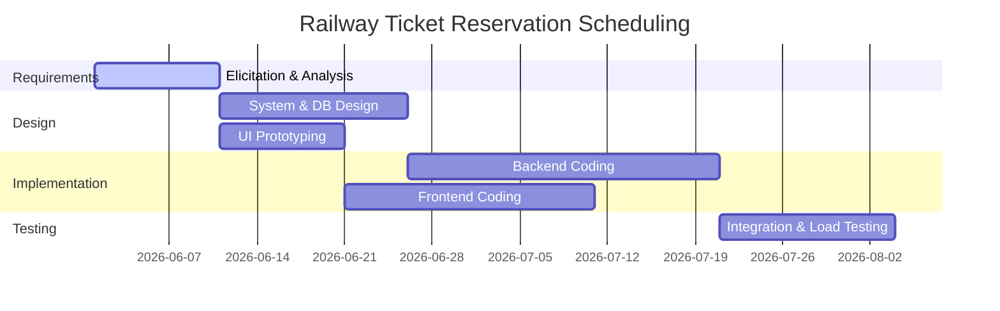
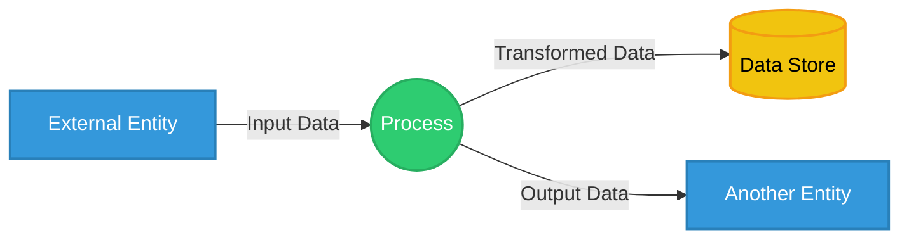
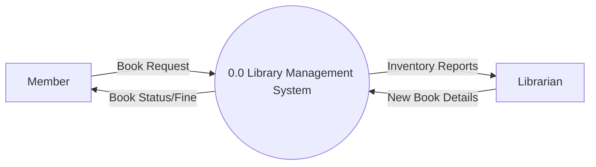
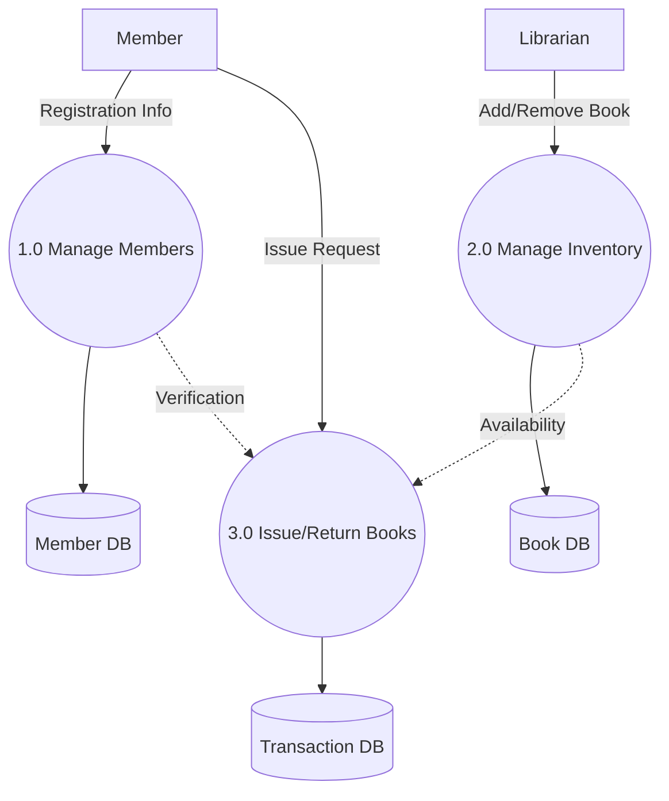
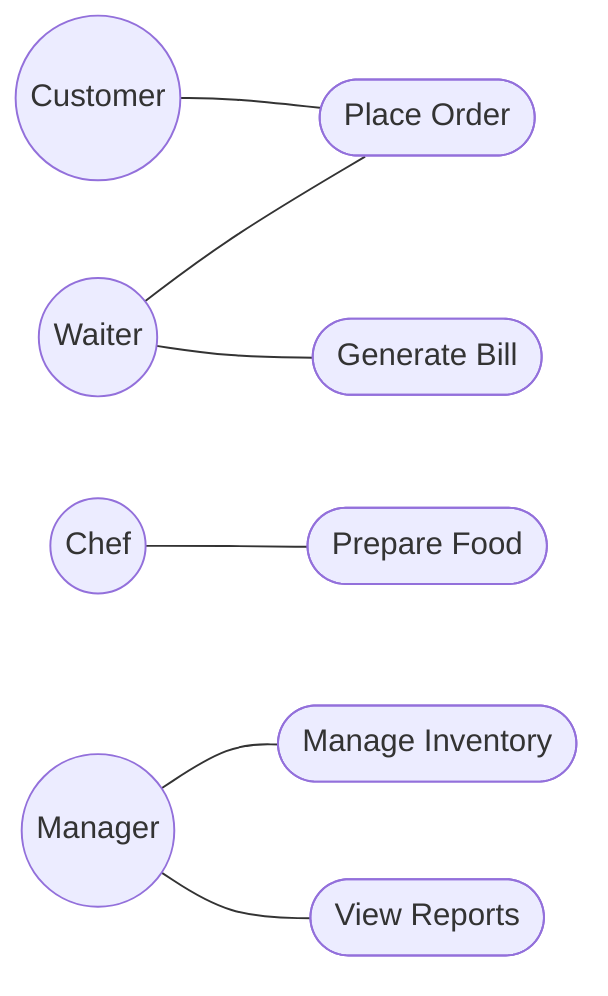
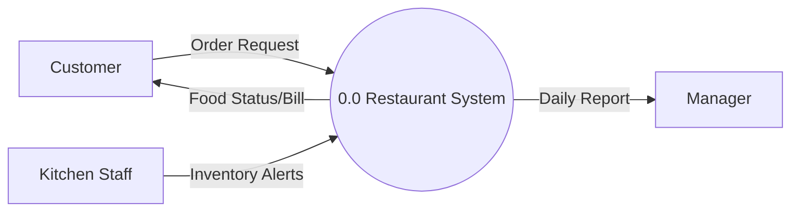
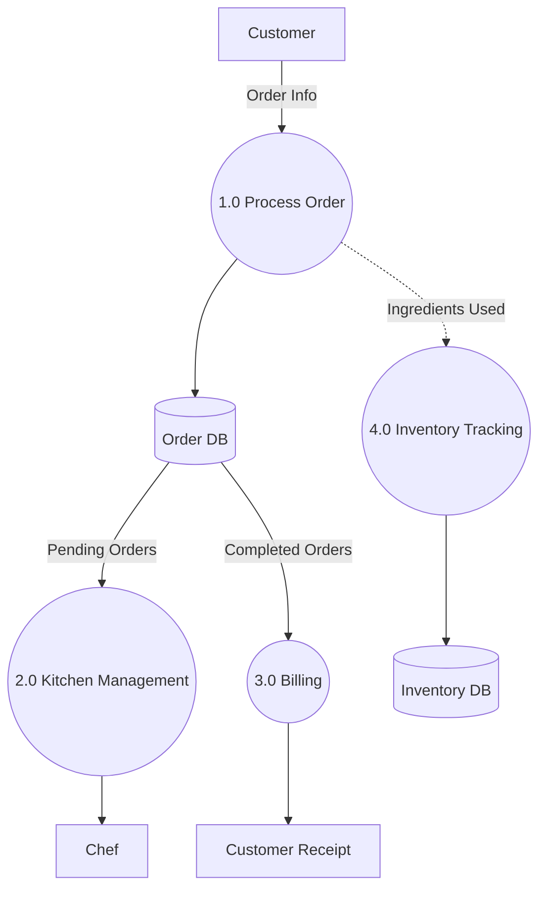

# Module 3: Requirements Analysis with Cost Estimation

## Question 43
**Clarify the types of requirements in software engineering with appropriate examples.** (2 Marks)

In software engineering, requirements are generally categorized into three main types:
1. **Functional Requirements**: These define what the system should do. They describe the interactions between the system and its environment, independent of implementation details. *Example*: "The system shall allow users to log in using an email and password."
2. **Non-functional Requirements**: These dictate how the system should perform. They define system attributes such as performance, usability, security, and reliability. *Example*: "The system must process login requests in under 2 seconds."
3. **Domain Requirements**: These are derived from the application domain and reflect specific characteristics or regulations of that field. *Example*: "A banking application must comply with local financial data encryption laws."

## Question 44
**Describe how a feasibility study is conducted during requirements engineering and explain its significance.** (2 Marks)

A feasibility study is a preliminary investigation conducted before heavy resources are committed to a project. It typically assesses several dimensions:
- **Technical Feasibility**: Determining if the required technology exists and if the team has the expertise to build it.
- **Economic Feasibility**: Analyzing whether the system is cost-effective and if its benefits outweigh the development costs.
- **Operational Feasibility**: Evaluating if the proposed system solves the users' problems and fits within the organizational culture.

**Significance**: It helps stakeholders make informed "go/no-go" decisions. By identifying major risks early, it prevents the company from wasting time, money, and effort on unviable projects.

## Question 45
**Apply your understanding to discuss different origins of changes occurring during software product development.** (2 Marks)

Changes in software requirements are inevitable and typically originate from several key sources:
1. **Business Environment Shifts**: Companies may restructure, or market trends may change, requiring the software to adapt to new business goals.
2. **User Feedback**: Once stakeholders or end-users interact with early prototypes, they often realize their actual needs differ from their initial requests.
3. **Technological Advancements**: New hardware, operating system updates, or third-party API changes can force the software to be updated.
4. **Regulatory Changes**: Governments frequently introduce new laws (e.g., data privacy regulations like GDPR), forcing software to adapt compliance measures.

## Question 46
**Explain the five information domain characteristics of function points with suitable examples.** (2 Marks)

Function Point Analysis evaluates a system's size based on five distinct information domain characteristics:
1. **External Inputs (EI)**: Data entering the system that updates internal logical files. *Example*: A user submitting a registration form.
2. **External Outputs (EO)**: Data exiting the system, usually derived or calculated. *Example*: An automatically generated monthly sales report.
3. **External Inquiries (EQ)**: Simple requests for data where no calculation is performed and no data is altered. *Example*: Searching for a book by its title in a library catalog.
4. **Internal Logical Files (ILF)**: Logical groupings of data maintained within the system's boundary. *Example*: The user account database.
5. **External Interface Files (EIF)**: Data files referenced by the system but maintained by an external system. *Example*: A third-party currency exchange rate API.

## Question 47
**Differentiate between Requirement Elicitation and Requirement Analysis activities.** (2 Marks)

**Requirement Elicitation** is the process of gathering and extracting requirements directly from stakeholders. It utilizes techniques like interviews, surveys, and observation to discover what the users *want*. It is a communication-heavy, outward-facing activity.

**Requirement Analysis**, in contrast, takes the raw data gathered during elicitation and examines it critically. Its purpose is to detect ambiguities, resolve conflicting requirements, and structure the data into clear, consistent models. While elicitation collects the information, analysis refines and formalizes it into a true software specification.

## Question 48
**Illustrate the kinds of checks conducted during requirement validation with examples.** (2 Marks)

Requirement validation ensures that the defined requirements accurately represent the stakeholders' true needs before development begins. Key checks include:
1. **Validity Checks**: Does this requirement reflect a real need? *Example*: Verifying if a complex reporting feature is actually needed by the client.
2. **Consistency Checks**: Are there any contradictory requirements? *Example*: One requirement states "passwords must be exactly 8 characters," while another states "passwords must be 10-15 characters."
3. **Completeness Checks**: Are all expected functionalities included? *Example*: Checking if the system has an error-handling mechanism for failed payments.
4. **Realism Checks**: Can these requirements be implemented given the budget and technology? *Example*: Ensuring an AI feature is feasible on standard hardware.

## Question 49
**Apply the concept of requirement gathering to justify its significance in software development.** (2 Marks)

Requirement gathering serves as the foundational pillar of any software development project. Its primary significance is risk reduction. By actively communicating with users to understand exactly what they need, developers prevent costly misunderstandings later in the lifecycle. Poor requirement gathering inevitably leads to scope creep, massive budget overruns, and ultimately, software that end-users reject because it fails to solve their core problems. Proper gathering establishes a clear, shared vision and an actionable roadmap.

## Question 50
**Apply scheduling concepts to draw and explain a scheduling diagram for a railway ticket reservation application development project.** (5 Marks)

A scheduling diagram maps out parallel and dependent tasks over time, ensuring efficient allocation of resources. For a complex system like a Railway Ticket Reservation application, activities must follow a logical sequence while allowing independent tasks to run concurrently.

**Explanation of the Schedule**:
1. **Requirements Phase**: We begin by eliciting needs from the railway administration and passengers.
2. **System Design**: Once requirements are analyzed, architecture and database schema design begins. 
3. **Implementation**: Coding starts after design. The database can be set up concurrently with the UI.
4. **Testing**: Once modules are coded, testing ensures the system handles high user concurrency.

## Question 51
**Analyze the given DRDO project numerical: Apply the appropriate COCOMO model and compute effort, development time, and staffing.** (5 Marks)

*(Note: As the explicit numerical data for the DRDO project is omitted in the source question, the following applies the Intermediate COCOMO Model to a representative mission-critical project of 50 KLOC in Embedded mode.)*

**Step 1: Identify Parameters**
For embedded, complex, mission-critical systems (like defense projects), the **Embedded Mode** is used.
Constants: `a = 3.6`, `b = 1.20`, `c = 2.5`, `d = 0.32` (or 0.38 depending on specific COCOMO standard, using standard Basic embedded values: d=0.32). Size = 50 KLOC.

**Step 2: Calculate Effort**
Formula: Effort (E) = a * (KLOC)^b
E = 3.6 * (50)^1.20
E = 3.6 * 109.33 = **393.6 Person-Months (PM)**

**Step 3: Calculate Development Time**
Formula: Time (T) = c * (E)^d
T = 2.5 * (393.6)^0.32
T = 2.5 * 6.86 = **17.15 Months**

**Step 4: Calculate Staffing**
Formula: Staff = Effort / Time
Staff = 393.6 / 17.15 = **22.95 (approx. 23 Persons)**

## Question 52
**Apply DFD modeling concepts to identify and draw the components of an Analysis Model with a suitable explanation.** (5 Marks)

Data Flow Diagrams (DFDs) are a cornerstone of the analysis model, allowing designers to visualize how information transforms as it moves through a system. DFDs focus purely on logical data flow, ignoring physical implementation.

**Core Components**:
1. **External Entities (Squares)**: Represent people, organizations, or other systems that act as sources or sinks of data (e.g., a "Customer").
2. **Processes (Circles or Rounded Rectangles)**: Represent actions that transform input data into output data (e.g., "Calculate Bill").
3. **Data Stores (Open Rectangles)**: Represent data at rest or databases where information is stored for later retrieval (e.g., "Inventory DB").
4. **Data Flows (Arrows)**: Represent the pipelines through which data packets travel between components.

## Question 53
**Construct DFD Level 0 and Level 1 diagrams for a Library Management System applying appropriate data flow design principles.** (5 Marks)

A Library Management System tracks book inventories, manages members, and handles the issuing and returning of books.

**Level 0 (Context Diagram)**: Treats the entire system as a single abstract process. It shows the boundaries of the system and its interactions with external entities (Members and Librarians).

**Level 1 Diagram**: Decomposes the central Level 0 process into its primary sub-processes.

## Question 54
**Apply function point analysis to the given Library Management System numerical and estimate the development effort.** (5 Marks)

*(Note: As specific domain counts are omitted, representative values for a Library System are assumed.)*
Assume average complexity for all parameters:
- External Inputs (EI) = 4 (e.g., Add Book, Register Member) -> Weight 4
- External Outputs (EO) = 5 (e.g., Issue Slip, Fine Report) -> Weight 5
- External Inquiries (EQ) = 4 (e.g., Search Book) -> Weight 4
- Internal Logical Files (ILF) = 2 (Member DB, Book DB) -> Weight 10
- External Interface Files (EIF) = 1 (Payment Gateway) -> Weight 7

**Step 1: Calculate Unadjusted Function Points (UFP)**
UFP = (4*4) + (5*5) + (4*4) + (2*10) + (1*7)
UFP = 16 + 25 + 16 + 20 + 7 = **84**

**Step 2: Calculate Function Points (FP)**
Assuming standard average system complexity, Value Adjustment Factor (VAF) = 1.0.
FP = UFP * VAF = 84 * 1.0 = **84 FP**

**Step 3: Estimate Effort**
Assuming an industry average effort rate of 1.5 Person-Months per FP:
Total Effort = 84 FP * 1.5 PM/FP = **126 Person-Months**

## Question 55
**Analyze the key differences between Basic, Intermediate, and Detailed COCOMO models and examine their impact on cost estimation accuracy.** (5 Marks)

The Constructive Cost Model (COCOMO) evolves in granularity across three levels, each drastically impacting estimation accuracy:

1. **Basic COCOMO**: Estimates effort and cost purely based on the estimated size of the project (KLOC) and the development mode (Organic, Semi-detached, Embedded). It is quick but lacks accuracy for complex projects because it completely ignores factors like team experience or hardware constraints.
2. **Intermediate COCOMO**: Enhances the Basic model by introducing 15 Cost Drivers (Effort Multipliers), encompassing product attributes (e.g., software reliability), hardware attributes (e.g., memory constraints), and personnel attributes (e.g., analyst capability). This significantly improves accuracy by tailoring the formula to the project's unique real-world environment.
3. **Detailed COCOMO**: The most sophisticated level. It applies the 15 Cost Drivers not just universally across the project, but specifically to each individual phase of the software engineering process (planning, design, coding, testing). It yields the highest accuracy but requires immense effort and data to calculate properly.

## Question 56
**Design a requirements engineering plan for a new e-commerce application, integrating elicitation, validation, and specification activities.** (5 Marks)

A robust requirements engineering plan for an e-commerce platform must ensure seamless user experience and secure transactions.

1. **Elicitation Activities**:
   - *Interviews*: Conduct sessions with business stakeholders to define ROI goals.
   - *Questionnaires*: Survey potential shoppers to identify desired features (e.g., one-click checkout, wishlists).
   - *Competitor Analysis*: Review existing platforms to baseline standard features.
2. **Analysis Activities**:
   - Resolve conflicting priorities (e.g., balancing high-resolution imagery with fast page load times).
   - Construct Use Case models to visualize the checkout flow.
3. **Specification Activities**:
   - Draft a comprehensive Software Requirements Specification (SRS) detailing functional rules (cart logic) and critical non-functional rules (PCI-DSS compliance for payments).
4. **Validation Activities**:
   - Host walkthroughs with stakeholders to ensure the SRS accurately reflects business goals.
   - Perform prototyping to let users validate the UI/UX early.

## Question 57
**Apply appropriate requirements gathering techniques to construct a structured requirements elicitation plan for a real-world Hospital Management System.** (10 Marks)

A Hospital Management System (HMS) is a massive, life-critical software application involving highly diverse stakeholders ranging from doctors and nurses to receptionists and IT administrators. A structured elicitation plan is mandatory to capture accurate requirements.

**1. Stakeholder Identification & Profiling**
First, map out the users. Medical staff prioritize speed and accuracy, administrators prioritize reporting, and IT prioritizes security (HIPAA compliance).

**2. Technique Application Plan**
- **One-on-One Interviews (For Management and Doctors)**: Conduct structured interviews with senior doctors to understand their specific workflow needs for patient history and prescription management.
- **Surveys and Questionnaires (For Nurses and Staff)**: Distribute broad surveys to the nursing staff to identify common pain points in their current manual shift-handover processes.
- **Observation / Ethnography (For Receptionists)**: Spend time shadowing the front desk to silently observe how patient admissions and emergency triages are currently handled in real-time, uncovering unstated needs.
- **Document Analysis (For Compliance)**: Review existing paper forms, medical billing codes, and legal regulatory documents to ensure the software natively supports required formats.
- **Joint Application Development (JAD) Sessions**: Host workshops combining doctors, IT, and administrators. This is critical for resolving conflicting requirements, such as the trade-off between strict security (passwords timing out) and the need for rapid emergency access.

**3. Prototyping for Early Feedback**
Build low-fidelity UI mockups of the doctor's dashboard. Medical staff are rarely software experts; showing them a prototype helps elicit specific feedback that abstract questions cannot.

By combining direct communication, passive observation, and interactive prototyping, this structured plan ensures no critical healthcare requirement is missed, securing product quality and user acceptance.

## Question 58
**Analyze various activities encompassed within requirements engineering. Examine each activity with concrete examples and evaluate its contribution to product quality.** (10 Marks)

Requirements Engineering is not a single task, but a structured lifecycle of activities designed to bridge the gap between user needs and technical implementation.

1. **Inception**: The starting point where basic understanding of the problem is established. 
   - *Example*: Recognizing that a university's paper-based grading system is causing delays. 
   - *Contribution*: Prevents building a product for a non-existent problem.
2. **Elicitation**: The active process of gathering needs from stakeholders. 
   - *Example*: Interviewing professors to discover they need a bulk-upload feature for grades. 
   - *Contribution*: Directly increases usability by ensuring user needs are actually met.
3. **Elaboration**: Expanding gathered requirements into structured models. 
   - *Example*: Creating DFDs to map how a grade moves from a professor's input to a student's transcript. 
   - *Contribution*: Reduces ambiguity and acts as an early architectural guide, improving structural quality.
4. **Negotiation**: Resolving conflicts among stakeholders. 
   - *Example*: Balancing the IT department's strict password rotation policy with students' desire for seamless login. 
   - *Contribution*: Ensures a balanced product that is both secure and user-friendly.
5. **Specification**: Formalizing the negotiated requirements into a definitive Software Requirements Specification (SRS) document. 
   - *Example*: Writing specific performance metrics ("login must execute in < 2 seconds"). 
   - *Contribution*: Acts as the definitive blueprint, greatly reducing bugs caused by developer assumptions.
6. **Validation**: Reviewing the SRS to ensure it reflects reality. 
   - *Example*: Having the university dean sign off on the final feature list. 
   - *Contribution*: Prevents catastrophic late-stage rework, saving immense time and money.
7. **Management**: Handling requirement changes systematically. 
   - *Contribution*: Maintains project stability when scope changes inevitably occur.

## Question 59
**Construct a Use Case Diagram for a Restaurant Management System and develop DFD Level 0 and Level 1 diagrams applying appropriate modeling standards.** (10 Marks)

A Restaurant Management System (RMS) coordinates customer orders, kitchen preparation, billing, and inventory tracking.

**Use Case Diagram**:
Illustrates the interactions between external actors and system functionalities.

**Data Flow Diagram - Level 0 (Context Diagram)**:
Visualizes the RMS as a single, central entity interacting with external environments.

**Data Flow Diagram - Level 1**:
Breaks down the context diagram into logical sub-processes.

## Question 60
**Design a comprehensive Software Requirements Specification (SRS) document for an online banking system. Apply standard SRS components and justify each section.** (10 Marks)

An SRS is the most critical document in a software project, acting as a binding contract and blueprint. For an Online Banking System, precision is mandatory.

**1. Introduction**
- *Content*: Defines the purpose (e.g., providing 24/7 banking access), scope, and definitions.
- *Justification*: Sets strict project boundaries, preventing scope creep.

**2. Overall Description**
- *Content*: Describes user characteristics (e.g., elderly users needing large fonts, tech-savvy users wanting quick transfers), operating environments, and constraints.
- *Justification*: Contextualizes the system. A banking app cannot assume all users are tech experts, which drives UI simplicity.

**3. Specific Functional Requirements**
- *Content*: 
  - FR1: The system shall allow users to transfer funds between internal and external accounts.
  - FR2: The system shall generate automated PDF statements monthly.
  - FR3: The system shall lock accounts after 3 failed login attempts.
- *Justification*: These are the exact features developers will code. Without clear FRs, the core utility of the bank fails.

**4. Non-Functional Requirements**
- *Content*:
  - *Security*: Must enforce 256-bit AES encryption and mandatory Two-Factor Authentication (2FA).
  - *Performance*: All financial transactions must process in under 3 seconds.
  - *Availability*: Must guarantee 99.99% server uptime.
- *Justification*: For a banking system, NFRs are often more critical than FRs. If the system is functional but insecure or slow, it will lose customer trust instantly.

**5. External Interface Requirements**
- *Content*: Defines how the software interacts with hardware (e.g., mobile biometric scanners) and third-party APIs (e.g., national clearinghouses).
- *Justification*: Ensures seamless integration with the broader financial ecosystem.

## Question 61
**Suppose a Project was estimated to be 400 KLOC. Calculate the effort, development time & Team Size for each of three model i.e, Organic, Semidetached & Embedded.** (10 Marks)

**Given formulas:**
- Effort (E) = a * (KLOC)^b (in Person-Months)
- Time (T) = c * (E)^d (in Months)
- Team Size = Effort / Time (in Persons)
- Project Size (KLOC) = 400

**1. Organic Mode**
*(Small teams, familiar environment)*
Constants: `a = 2.4`, `b = 1.05`, `c = 2.5`, `d = 0.38`
- **Effort**: E = 2.4 * (400)^1.05 
  400^1.05 ≈ 539.57
  E = 2.4 * 539.57 = **1294.97 PM**
- **Time**: T = 2.5 * (1294.97)^0.38
  1294.97^0.38 ≈ 15.25
  T = 2.5 * 15.25 = **38.12 Months**
- **Team Size**: 1294.97 / 38.12 ≈ **34 Persons**

**2. Semi-detached Mode**
*(Medium teams, mixed experience)*
Constants: `a = 3.0`, `b = 1.12`, `c = 2.5`, `d = 0.35`
- **Effort**: E = 3.0 * (400)^1.12
  400^1.12 ≈ 822.7
  E = 3.0 * 822.7 = **2468.1 PM**
- **Time**: T = 2.5 * (2468.1)^0.35
  2468.1^0.35 ≈ 15.36
  T = 2.5 * 15.36 = **38.4 Months**
- **Team Size**: 2468.1 / 38.4 ≈ **64 Persons**

**3. Embedded Mode**
*(Complex hardware/software constraints)*
Constants: `a = 3.6`, `b = 1.20`, `c = 2.5`, `d = 0.38`
- **Effort**: E = 3.6 * (400)^1.20
  400^1.20 ≈ 1325.54
  E = 3.6 * 1325.54 = **4771.9 PM**
- **Time**: T = 2.5 * (4771.9)^0.38
  4771.9^0.38 ≈ 24.9
  T = 2.5 * 24.9 = **62.25 Months**
- **Team Size**: 4771.9 / 62.25 ≈ **77 Persons**

## Question 62
**A software project requires 50,000 lines of code (KLOC = 50). It follows the Organic mode of the COCOMO model. Calculate the Effort (in PM) and Development Time (in months) using the basic COCOMO equations. Also calculate cost required for the development of project. Assume monthly salary of a person is 60k.** (10 Marks)

**Given Data:**
- Size: KLOC = 50
- Mode: Organic
- Constants: `a = 2.4`, `b = 1.05`, `c = 2.5`, `d = 0.38`
- Salary per Person-Month: 60,000 Rupees

**Step 1: Calculate Effort (E)**
Formula: E = a * (KLOC)^b
E = 2.4 * (50)^1.05
50^1.05 ≈ 60.8
E = 2.4 * 60.8 = **145.92 Person-Months (PM)**

**Step 2: Calculate Development Time (T)**
Formula: T = c * (E)^d
T = 2.5 * (145.92)^0.38
145.92^0.38 ≈ 6.64
T = 2.5 * 6.64 = **16.6 Months**

**Step 3: Calculate Total Cost**
Formula: Cost = Effort * Salary
Cost = 145.92 PM * 60,000 Rupees/PM
Cost = **8,755,200 Rupees**

## Question 63
**Calculate estimate of Effort, Time & Cost using FP based estimation technique.** (10 Marks)

**Given Data:**
- EI: 10, Average (Weight = 4)
- EO: 5, High (Weight = 7)
- EQ: 8, Low (Weight = 3)
- ILF: 4, Average (Weight = 10)
- EIF: 6, High (Weight = 7)
- Sum of 14 adjustment factors = 35
- Effort rate = 1.5 Persons-Month Per FP
- Cost Per Person Month = 50,000 Rupees

**Step 1: Calculate Unadjusted Function Points (UFP)**
UFP = (Count * Weight)
EI = 10 * 4 = 40
EO = 5 * 7 = 35
EQ = 8 * 3 = 24
ILF = 4 * 10 = 40
EIF = 6 * 7 = 42
UFP Total = 40 + 35 + 24 + 40 + 42 = **181**

**Step 2: Calculate Value Adjustment Factor (VAF)**
Formula: VAF = 0.65 + [0.01 * (Sum of adjustment factors)]
VAF = 0.65 + (0.01 * 35) = 0.65 + 0.35 = **1.00**

**Step 3: Calculate Final Function Points (FP)**
FP = UFP * VAF = 181 * 1.00 = **181 FP**

**Step 4: Calculate Effort**
Effort = FP * Effort Rate
Effort = 181 * 1.5 = **271.5 Person-Months**

**Step 5: Calculate Total Cost**
Cost = Effort * Cost Per Person Month
Cost = 271.5 * 50,000 = **13,575,000 Rupees**

**Step 6: Calculate Estimated Time**
*(Assuming basic COCOMO general time estimation formula since a specific FP time formula was not provided in the problem statement. T = 2.5 * E^0.38)*
Time (T) = 2.5 * (271.5)^0.38
271.5^0.38 ≈ 8.41
Time = 2.5 * 8.41 = **21.0 Months**
