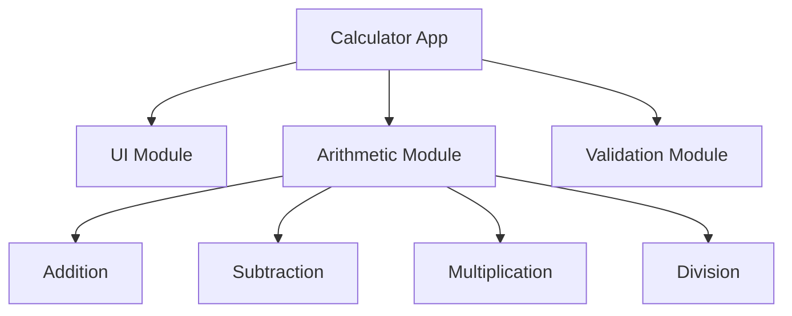
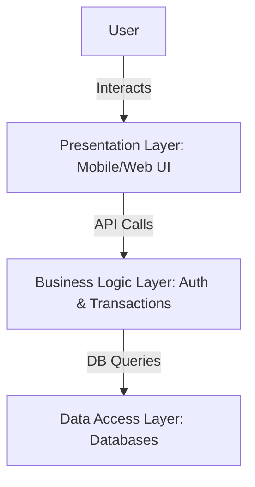
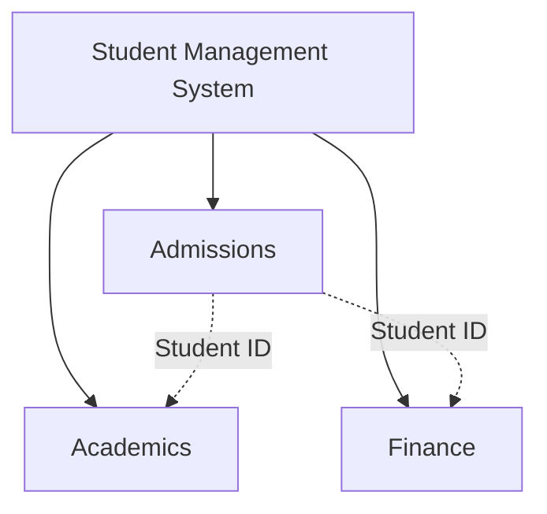
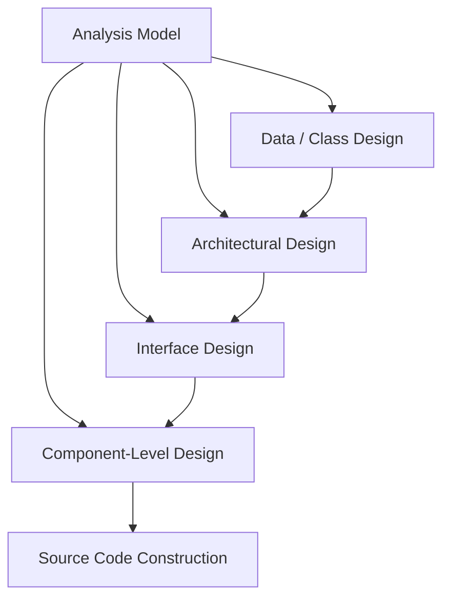
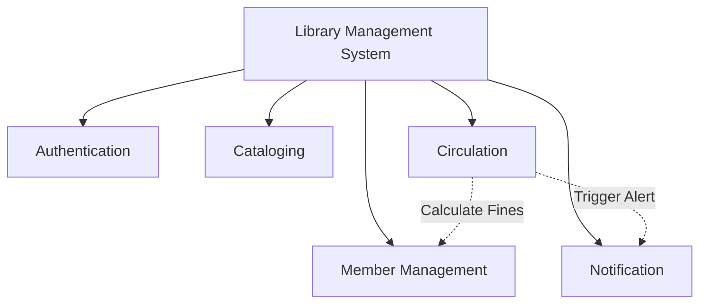

## Module 4

### Q64: Illustrate the term 'Design Process' in software engineering and describe its key stages. (2 Marks)
The **Design Process** in software engineering is the transition phase where software requirements are translated into a blueprint for building the software. It involves iterative decision-making to create representations of the system's architecture, interfaces, and components. The key stages include: 1) **Architectural Design**, defining the broad structure and subsystems; 2) **Interface Design**, describing how the software communicates with users and other systems; 3) **Component-Level Design**, detailing the internal data structures and algorithms of each component; and 4) **Data Design**, converting data models into database structures.

### Q65: Apply the concept of User Interface Design and justify its purpose in improving user experience. (2 Marks)
**User Interface (UI) Design** focuses on anticipating what users might need to do and ensuring the interface has elements that are easy to access, understand, and use to facilitate those actions. Its primary purpose is to improve the user experience (UX) by making interactions as simple, intuitive, and efficient as possible. A well-designed UI reduces cognitive load, minimizes user errors, and increases overall satisfaction, ensuring that the software is not just functional but also accessible and user-friendly.

### Q66: Explain the goal of Data Design and illustrate its role in software architecture. (2 Marks)
The primary goal of **Data Design** is to translate data objects defined in the analysis model into data structures that reside within the software, as well as into database architectures. It plays a foundational role in software architecture because the data structure heavily influences the architectural style and the procedural details of the components. Good data design ensures data integrity, optimizes performance, and simplifies data retrieval, forming the bedrock upon which the rest of the application is built.

### Q67: Apply the principle of Refinement in Component-Level Design and discuss its significance. (2 Marks)
**Refinement** is a top-down design strategy where a high-level abstract concept is continuously broken down into more detailed and concrete specifications. In component-level design, a module is refined by elaborating on its internal algorithms, data structures, and procedural logic. Its significance lies in allowing designers to manage complexity by addressing broad concepts first before diving into intricate details, ensuring that each refined component aligns perfectly with the overall architectural objectives.

### Q68: Describe the concept of Information Hiding in design and summarize how it supports encapsulation. (2 Marks)
**Information Hiding** is the principle of segregating the design decisions in a computer program that are most likely to change, thus protecting other parts of the program from extensive modification. It states that modules should be characterized by design decisions that hide their internal complexities from other modules. This strongly supports **encapsulation** by restricting direct access to some of an object's components and binding together the data and functions that manipulate it, promoting a modular and secure architecture.

### Q69: Distinguish between the key elements of a design model and justify each element's role. (2 Marks)
A software design model consists of four key elements: 
1) **Data Design Elements**: Transform information domain models into data structures to ensure efficient data management. 
2) **Architectural Design Elements**: Define the relationships among major software structural elements. 
3) **Interface Design Elements**: Describe how the system communicates with external entities and users, ensuring seamless interaction. 
4) **Component-Level Design Elements**: Detail the internal logic and data structures of individual components, providing a direct blueprint for coding.

### Q70: Apply the principle of modularity to design a simple calculator application and demonstrate how modular decomposition improves maintainability. (5 Marks)
**Modularity** is the practice of subdividing a system into smaller, manageable, and independent units known as modules. For a simple calculator application, modular design involves breaking down the overarching mathematical tasks into distinct, functional modules. 

For instance, the application can be decomposed into:
- **UI Module**: Handles user inputs and displays results.
- **Arithmetic Module**: Contains distinct sub-modules or functions for `add()`, `subtract()`, `multiply()`, and `divide()`.
- **Validation Module**: Checks for mathematical errors, such as division by zero.

**Improving Maintainability:** Modular decomposition ensures that if a specific feature needs updating (e.g., adding advanced trigonometric functions), the developer only modifies the Arithmetic Module without risking disruption to the UI or Validation modules. Debugging is also simplified, as errors are easily traceable to specific modules. This isolation of functionality heavily reduces the ripple effect of changes, making the system highly maintainable.

### Q71: Apply the concept of abstraction to design a high-level architecture for a banking system and illustrate how abstraction layers reduce complexity. (5 Marks)
**Abstraction** allows designers to focus on essential features while ignoring irrelevant details. In a banking system, multiple layers of abstraction can be designed to separate concerns and reduce complexity.

A typical high-level architecture includes:
- **Presentation Layer**: The highest level of abstraction. Users interact with a clean UI (e.g., "Transfer Funds" button) without knowing the underlying network or database operations.
- **Business Logic Layer**: Handles the core banking rules (e.g., verifying sufficient balance). It abstracts away where the data is stored.
- **Data Access Layer**: The lowest level of abstraction. It executes the SQL queries and database transactions.

**Reducing Complexity:** Abstraction layers compartmentalize the system. A front-end developer working on the Presentation Layer does not need to understand the complex SQL joins happening in the Data Access Layer. By dealing with simplified representations at each layer, the cognitive load on developers is minimized, and system components can evolve independently as long as their interfaces remain consistent.

### Q72: Analyze the impact of poor User Interface Design on user satisfaction and system usability. Examine real-world failure cases. (5 Marks)
Poor **User Interface (UI) Design** can drastically undermine even the most robust backend systems. If users cannot figure out how to interact with the software, its functionality becomes effectively useless. Poor UI leads to high cognitive load, frequent user errors, frustration, and ultimately, system abandonment.

**Impacts:**
1. **Decreased Productivity**: Users spend more time figuring out how to use the tool than actually doing their tasks.
2. **Increased Training Costs**: Complex interfaces require extensive manuals and training sessions.
3. **High Error Rates**: Ambiguous buttons or confusing layouts lead to accidental data deletion or incorrect inputs.

**Real-World Failure Case:** The Hawaii missile alert incident in 2018 is a prime example of UI failure. A poorly designed dropdown menu with highly confusing and similarly worded options ("DRILL - PACOM (CDW) - STATE ONLY" vs. "PACOM (CDW) - STATE ONLY") led an operator to accidentally trigger a real ballistic missile alert instead of a drill. The lack of distinct visual cues and an inadequate confirmation dialogue caused massive public panic, highlighting that poor UI in critical systems can have catastrophic real-world consequences.

### Q73: Apply different Design Principles to a software system and construct a structured explanation of each principle with practical examples. (5 Marks)
Software Design Principles act as guidelines to create scalable, maintainable, and robust systems. Consider the development of an online library management system:

1. **Single Responsibility Principle (SRP)**: Every module should have only one reason to change. 
   *Example*: The `BookCatalog` class should solely handle querying book details, while a separate `NotificationService` handles sending due-date emails.
2. **Open/Closed Principle (OCP)**: Software entities should be open for extension but closed for modification.
   *Example*: The payment module allows adding a new payment gateway (like UPI) by creating a new class that implements the `PaymentInterface`, without modifying the existing Credit Card code.
3. **Separation of Concerns (SoC)**: Breaking a program into distinct sections where each section addresses a separate concern.
   *Example*: Separating the HTML rendering logic (Frontend) from the database queries (Backend).
4. **DRY (Don't Repeat Yourself)**: Avoid duplicating code. 
   *Example*: Creating a central `calculateFine()` function rather than writing the same mathematical logic in three different modules.

By strictly adhering to these principles, the library system remains highly flexible to future changes.

### Q74: Analyze the role of abstraction in the software design process. Examine how they guide designers from high-level to detailed specifications. (5 Marks)
**Abstraction** is the psychological and technical mechanism that allows software engineers to manage complexity. In the software design process, abstraction acts as a filtering mechanism, stripping away non-essential details to highlight the fundamental structure or behavior of a system at various levels of depth.

**Guiding the Design Process:**
At the highest level (Procedural or Architectural Abstraction), a designer might conceptualize a system operation simply as `process_payroll()`. This allows the team to understand the broad strokes of system flow without getting bogged down in how taxes are calculated. 

As the design moves towards detailed specifications, the abstraction is refined. `process_payroll()` is broken down into `calculate_gross_pay()`, `deduct_taxes()`, and `issue_payment()`. Finally, at the lowest level of abstraction (Data Abstraction), designers specify the exact data structures (like arrays or hash maps) and exact algorithms needed for `deduct_taxes()`.

By utilizing abstraction, designers can create a hierarchical blueprint. They construct a stable high-level architecture first, ensuring all major components interact correctly, and subsequently fill in the low-level algorithmic details without losing sight of the overall system goals.

### Q75: Design a modular architecture for a student management system by applying functional independence and evaluating cohesion and coupling. (5 Marks)
A **Student Management System (SMS)** requires a modular architecture to ensure scalability and ease of maintenance. **Functional independence** is achieved by maximizing cohesion (keeping related tasks together) and minimizing coupling (reducing dependencies between modules).

**Modular Architecture Design:**
1. **Admissions Module**: Handles new student enrollment and document verification.
2. **Academics Module**: Manages course registrations, attendance, and grades.
3. **Finance Module**: Handles fee collection and receipt generation.

**Evaluating Cohesion and Coupling:**
- **High Cohesion**: The Finance Module only contains tasks related to money. It exhibits high functional cohesion because all elements within the module contribute to a single, well-defined task (managing fees).
- **Low Coupling**: The modules communicate through minimal interfaces, passing only essential data (like a `Student_ID`). The Academics module does not directly access the Finance database tables; it requests data via an API. This loose coupling ensures that if the Finance module is completely rewritten, the Academics module remains unaffected as long as the API interface stays intact.

### Q76: Analyze the role of information hiding in achieving secure and maintainable software systems. Examine its impact on module boundaries. (5 Marks)
**Information hiding** is the principle that a software module should conceal its internal implementation details from other modules, exposing only a well-defined interface. This principle is a cornerstone of both security and maintainability in software engineering.

**Impact on Maintainability:** By hiding internal data structures and algorithms, developers can change the internal workings of a module without affecting the rest of the system. For instance, a `DatabaseManager` module can switch its underlying technology from MySQL to MongoDB. As long as the public interface methods like `saveData()` and `getData()` remain unchanged, no other module needs to be updated.

**Impact on Security:** Information hiding prevents external modules from maliciously or accidentally altering sensitive internal states. For example, an `Authentication` module hides the cryptographic salt and hashing algorithms. External modules can only pass a password and receive a boolean `isValid` response, ensuring tight security boundaries.

**Impact on Module Boundaries:** It creates rigid, deliberate boundaries. Modules become "black boxes" to one another. Communication across these boundaries is strictly controlled, preventing "spaghetti code" where variables are accessed globally, thereby significantly reducing the likelihood of systemic cascading failures.

### Q77: Apply and distinguish between the types of abstraction and explain how abstraction differs from refinement in a practical software design scenario. (10 Marks)
**Abstraction** is the mechanism of conceptualizing complex systems by focusing on essential features while suppressing unnecessary details. It allows software engineers to manage cognitive load during design. There are primarily three types of abstraction in software engineering:

1. **Procedural Abstraction**: This focuses on instructions and operations. It names a sequence of instructions that perform a specific task. For example, calling a function named `sort_array()`. The user of this abstraction knows *what* it does, but the exact sorting algorithm (Merge Sort vs. Quick Sort) is hidden.
2. **Data Abstraction**: This focuses on the representation of data objects. It involves creating a custom data type that encapsulates data and the operations that can be performed on it. For example, a `Stack` data type hides the underlying array or linked list implementation, exposing only `push()` and `pop()` operations.
3. **Control Abstraction**: This implies a program control mechanism without specifying internal details, often seen in concurrent programming or asynchronous tasks (e.g., a `forEach` loop hides the index tracking and boundary checking of a traditional `for` loop).

**Abstraction vs. Refinement in a Practical Scenario:**
While Abstraction and Refinement are complementary, they move in opposite directions. Abstraction is a "bottom-up" mental model where you look at a complex system and simplify it. Refinement is a "top-down" process where you take a high-level abstraction and progressively elaborate on it until it becomes executable code.

*Practical Scenario: Developing an Autonomous Vehicle Navigation System*
- **Abstraction**: At the highest level, you create a procedural abstraction called `navigate_to_destination()`. This allows the architects to plan the interaction between the navigation system and the vehicle's engine control unit without worrying about the complex math of route finding.
- **Refinement**: As the project progresses, you refine `navigate_to_destination()`. 
  - Step 1 Refinement: Break it down into `fetch_gps_coordinates()`, `calculate_optimal_route()`, and `drive()`.
  - Step 2 Refinement: Refine `calculate_optimal_route()` further by introducing data abstractions like a `Graph` to represent roads and procedural abstractions like `Dijkstra's Algorithm` to find the shortest path.
  - Step 3 Refinement: Write the actual source code for `Dijkstra's Algorithm` handling all memory and boundary conditions.

In summary, abstraction allows you to declare "Drive to the destination" so you can design the big picture, while refinement is the systematic process of answering "Exactly how do we drive to the destination?" step-by-step.

### Q78: Analyze the components of the Design Model in software engineering. Examine the purpose and interrelation of each component in driving the design process. (10 Marks)
The Software Design Model serves as a comprehensive blueprint that bridges the gap between requirements analysis and actual coding. It transforms user requirements and system specifications into a structured, technical format. The model is typically comprised of four major components, each addressing a distinct aspect of the software architecture.

**1. Data / Class Design:**
- **Purpose**: This component transforms the information domain models (like Entity-Relationship Diagrams) into data structures and database architectures. In object-oriented systems, it defines the detailed class structures.
- **Interrelation**: It forms the foundation. Without well-defined data structures, the architecture has nothing to process. The architectural components rely heavily on the data schemas defined here.

**2. Architectural Design:**
- **Purpose**: This defines the global structure of the system. It identifies the major structural elements (subsystems/modules), their relationships, and the architectural styles and patterns (e.g., Client-Server, Microservices) used to construct the system.
- **Interrelation**: Architecture dictates the framework within which interfaces and components must operate. It groups the data classes and defines how large-scale modules interact.

**3. Interface Design:**
- **Purpose**: It details how the software communicates with external entities (other systems, devices) and human users (UI/UX). It establishes the boundaries and communication protocols (APIs, GUIs).
- **Interrelation**: Interfaces are the gateways between the architectural modules. The interface design heavily dictates how individual components will receive their input and deliver their output.

**4. Component-Level Design:**
- **Purpose**: This is the lowest level of the design model. It transforms the structural elements of the software architecture into detailed, procedural descriptions. It specifies algorithms, internal data structures, and the step-by-step logic required to execute the module's responsibilities.
- **Interrelation**: Component design relies on the interfaces to know what data is coming in/out, and relies on the architecture to know where it fits in the broader system. It is the final step that translates directly into source code.

Together, these components drive the design process from high-level, abstract structures down to precise, executable logic, ensuring that the final product strictly adheres to the initial requirements while remaining robust and maintainable.

### Q79: Apply the Four Elements Design Model to an online shopping system and demonstrate how each element contributes to the overall system design. (10 Marks)
The Four Elements Design Model comprises Data Design, Architectural Design, Interface Design, and Component-Level Design. Applying this to an Online Shopping System (e-commerce platform) provides a clear blueprint for development.

**1. Data Design Element:**
This element focuses on how information is stored and structured.
- **Application**: For the shopping system, data design involves creating database schemas for `Customers`, `Products`, `Orders`, and `ShoppingCarts`. 
- **Contribution**: It ensures data integrity and optimized queries. For example, structuring the `Orders` table with a foreign key to the `Customers` table ensures that every purchase is reliably linked to a registered user, preventing orphaned transaction records.

**2. Architectural Design Element:**
This defines the structural layout and relationship between major subsystems.
- **Application**: The system might adopt a modern **Microservices Architecture**. Distinct services are created: an `Authentication Service`, a `Product Catalog Service`, a `Cart Service`, and a `Payment Gateway Service`.
- **Contribution**: This ensures scalability. During a high-traffic holiday sale, the `Product Catalog Service` and `Payment Gateway Service` can be scaled up independently without needing to duplicate the entire monolithic application, ensuring high availability and system resilience.

**3. Interface Design Element:**
This handles interactions between the system, the users, and external services.
- **Application (User Interface)**: Designing a responsive, intuitive web storefront and a mobile app UI, ensuring the "Add to Cart" and "Checkout" buttons are highly visible.
- **Application (System Interface)**: Designing RESTful APIs to communicate with third-party systems like Stripe/PayPal for payments, and FedEx/UPS for shipping logistics.
- **Contribution**: It guarantees a smooth user experience (crucial for retail conversions) and ensures seamless, secure data exchange with external financial and logistical networks.

**4. Component-Level Design Element:**
This involves the granular algorithmic logic within specific modules.
- **Application**: Within the `Cart Service`, designing the exact procedural logic for the `Apply_Discount_Code()` function. This includes steps to validate the code against the database, check expiration dates, calculate the percentage deduction, and update the cart total.
- **Contribution**: It provides the exact blueprint for programmers. By detailing the algorithms beforehand, it prevents logical bugs (e.g., applying a discount code twice) and ensures the code written is highly efficient and cohesive.

### Q80: Apply the concept of modularity to design a Library Management System and evaluate design decisions related to coupling, cohesion, and structural organization. (10 Marks)
**Modularity** involves breaking down a large software system into distinct, manageable, and independent modules. A well-designed Library Management System (LMS) should be modular to handle various distinct operations seamlessly.

**Proposed Modular Architecture for LMS:**
1. **Authentication Module**: Manages logins, roles (Librarian, Member), and session security.
2. **Cataloging Module**: Handles adding, updating, and removing book records, including metadata like ISBN, Author, and Genre.
3. **Circulation Module**: Manages the core library transactions—issuing books, returning books, and tracking due dates.
4. **Member Management Module**: Manages user profiles, membership renewals, and fine tracking.
5. **Notification Module**: Responsible for sending emails/SMS for due dates or fine alerts.

**Evaluation of Design Decisions:**

**1. Cohesion (Aim for High Cohesion):**
Cohesion measures how strongly related the functions within a single module are. 
- *Decision*: Grouping all book issuing and returning logic specifically in the Circulation Module represents **Functional Cohesion** (the highest and most desirable form). Everything in this module contributes to a single, well-defined task. If we mixed "sending emails" into the Circulation Module, cohesion would drop. Instead, delegating emails to a dedicated Notification Module keeps cohesion high across the board.

**2. Coupling (Aim for Low Coupling):**
Coupling measures the degree of interdependence between modules.
- *Decision*: We must design the Circulation Module so it does not directly query the Member Management database tables. Instead, it should pass a `memberID` via a well-defined interface (API) to request the member's current fine status. This represents **Data Coupling** (low, desirable coupling). If we allowed the Circulation Module to directly manipulate the internal variables of the Member Module (Content Coupling), a change in the Member database schema would break the Circulation logic.

**3. Structural Organization:**
The system employs a hierarchical control structure. The UI layer acts as a coordinator, invoking the appropriate sub-modules. By isolating the Notification Module, we can easily swap out an email provider (like SendGrid to AWS SES) without touching any code in the Cataloging or Circulation modules. This structural partitioning ensures maximum maintainability, testability, and parallel development efficiency.

### Q81: Design a software architecture for an e-learning platform by applying the nine key design concepts in software engineering and justifying each design decision. (10 Marks)
Designing a robust E-Learning Platform (like Coursera or Udemy) requires strict adherence to core design concepts to ensure scalability, maintainability, and quality.

**1. Abstraction:** 
- *Design*: Hide complex video streaming protocols behind a simple `VideoPlayer` component interface.
- *Justification*: Front-end developers can embed videos without needing to understand video encoding, buffering, or CDN logic.

**2. Architecture:** 
- *Design*: Use a Microservices architecture consisting of a `User Service`, `Course Catalog Service`, `Streaming Service`, and `Assessment Service`.
- *Justification*: Allows independent scaling. If thousands of students take a quiz simultaneously, only the `Assessment Service` needs to scale up.

**3. Patterns:** 
- *Design*: Apply the Model-View-Controller (MVC) pattern for the web interface.
- *Justification*: Separates the UI (View) from the business logic (Model) and user input routing (Controller), streamlining UI updates.

**4. Separation of Concerns:** 
- *Design*: Separate payment processing from course delivery.
- *Justification*: Ensures that a failure in the payment gateway doesn't stop existing enrolled students from watching their course videos.

**5. Modularity:** 
- *Design*: Divide the system into discrete modules like `Forum`, `Gradebook`, and `Video Streaming`.
- *Justification*: Allows different development teams to work in parallel without stepping on each other's toes.

**6. Information Hiding:** 
- *Design*: The `Payment Module` hides its cryptographic hashing algorithms and API keys from all other modules.
- *Justification*: Enhances security; even if the `Forum Module` is compromised via XSS, the attacker cannot access payment logic or secrets.

**7. Functional Independence:** 
- *Design*: Ensure modules have high cohesion and low coupling. The `Gradebook` relies only on a `student_id` and `course_id` to function.
- *Justification*: Reduces the ripple effect of changes. Modifying how grades are weighted won't break the course enrollment logic.

**8. Refinement:** 
- *Design*: Start with a top-level concept like "Deliver Quiz". Refine it to "Load Questions -> Accept Answers -> Submit". Refine further to specific database queries and UI state changes.
- *Justification*: Allows architects to solve broad structural problems before programmers tackle complex algorithmic details.

**9. Refactoring:** 
- *Design*: Plan for periodic code reviews to restructure internal code (e.g., combining redundant database queries in the `Course Catalog`) without changing the external behavior.
- *Justification*: Keeps the codebase clean, readable, and performant as the platform grows over time.

### Q82: Analyze the role of software architecture and control hierarchy in designing scalable systems. Examine architectural patterns and justify their selection. (10 Marks)
**Software Architecture** provides the macro-level structural framework of a system. It defines the major components, their properties, and how they interact. **Control Hierarchy** (or program structure) represents the organization of these modules, often depicted as a tree structure illustrating which modules invoke and control subordinate modules.

**Role in Scalable Systems:**
In scalable systems, architecture and control hierarchy dictate how the system handles increased load. A poorly architected monolithic system with a tangled control hierarchy (where every module relies directly on every other module) cannot scale efficiently. If one module bottlenecks, the whole system freezes.
A well-thought-out architecture enforces clean control hierarchies, allowing specific heavily-used subsystems to be replicated or distributed across multiple servers (horizontal scaling) without affecting the rest of the application.

**Examining Architectural Patterns:**
Architectural patterns offer proven solutions to recurring design problems. Selecting the right pattern is critical for scalability.

1. **Client-Server Architecture:**
   - *Description*: The system is divided into clients (requesters of services) and servers (providers of services).
   - *Selection Justification*: Ideal for standard web applications (like a basic CMS). It is easy to secure and manage centrally, but a single server can become a bottleneck.
   
2. **Layered (N-Tier) Architecture:**
   - *Description*: Modules are organized into horizontal layers (e.g., Presentation, Business Logic, Data Access). Each layer only communicates with the layer directly below it.
   - *Selection Justification*: Excellent for enterprise applications. It allows individual layers to be scaled independently (e.g., putting the Data layer on a massive dedicated database cluster).

3. **Microservices Architecture:**
   - *Description*: The system is constructed as a collection of small, independent services that communicate over lightweight protocols (like HTTP/REST). Each service handles a specific business capability.
   - *Selection Justification*: The gold standard for massive scalability (e.g., Netflix, Amazon). If the "Search" feature experiences heavy load, developers can spin up 100 new instances of the Search Microservice without touching the User Profile Microservice. It eliminates single points of failure.

**Conclusion:** 
Control hierarchy establishes clear lines of authority and data flow, preventing chaotic dependencies. Combined with a scalable architectural pattern like Microservices, architects can design systems capable of seamlessly adapting to massive user growth and evolving technological landscapes.

### Q83: Given two modules: 
**Module A: Performs a sequence of operations where output of one becomes input of another.**
**Module B: Contains unrelated functions grouped together.**
**Analyze which module is better designed and why? Identify cohesion types for both modules. Discuss the impact on testing and debugging. (10 Marks)**

**Analysis of Better Design:**
**Module A** is significantly better designed than Module B. Good software design emphasizes high cohesion and low coupling. Cohesion refers to the degree to which the elements inside a module belong together. Module A exhibits a strong internal relationship where elements are functionally linked to complete a unified task. Module B is essentially a "dumping ground" for arbitrary code, violating the principles of single responsibility and functional independence.

**Identification of Cohesion Types:**
1. **Module A (Sequential Cohesion):** 
   - *Type*: Sequential Cohesion.
   - *Explanation*: This occurs when parts of a module are grouped because the output from one part is the input to the next part (like an assembly line). For example, a module that `reads_file() -> parses_data() -> formats_output()`. This is a highly desirable form of cohesion, just one step below the ideal Functional Cohesion.
2. **Module B (Coincidental Cohesion):**
   - *Type*: Coincidental Cohesion.
   - *Explanation*: This is the lowest and worst form of cohesion. Elements are grouped into a module completely arbitrarily, with no meaningful relationship to one another. An example would be a `Utils` module containing `calculateTax()`, `printDocument()`, and `connectToWiFi()`.

**Impact on Testing and Debugging:**

*Testing Module A:*
Testing is straightforward. Because it operates sequentially, you can write integration tests that provide a single input at the beginning and verify the final output at the end. The flow of data is predictable. If a test fails, the sequential nature makes it relatively easy to isolate the exact step where the data transformation went wrong.

*Testing Module B:*
Testing is a nightmare. Because the functions are unrelated, you cannot test the module as a cohesive unit. You must write completely disconnected unit tests for every single arbitrary function. Mocking dependencies becomes highly complex because the module might require access to printers, networks, and databases all at once.

*Debugging:*
Debugging Module A involves simply tracing the data pipeline step-by-step. 
Debugging Module B is chaotic. Changes to one function might inadvertently share global variables with an unrelated function, causing unpredictable side effects. If a bug occurs, developers waste time deciphering the purpose of the module, ultimately slowing down maintenance and increasing technical debt.

### Q84: Analyze the role of structural partitioning and software procedure design in creating efficient software systems. Evaluate how these concepts contribute to improving system quality. (10 Marks)

**Structural Partitioning** and **Software Procedure Design** are two fundamental concepts that heavily influence the efficiency, quality, and maintainability of a software system.

**1. Structural Partitioning:**
Structural partitioning involves dividing the software architecture horizontally and vertically to establish distinct branches of control and functionality.
- **Horizontal Partitioning**: Divides the system into separate branches that execute specific major functions (e.g., input, processing, and output branches). This creates modularity. 
- **Vertical Partitioning (Factoring)**: Divides the system in a top-down manner, where high-level modules handle control and decision-making, and low-level modules perform the actual processing and computational work.

*Role in Efficiency:* By partitioning structurally, developers prevent the creation of "God modules" (monolithic modules that do everything). This allows different teams to work on different partitions simultaneously, significantly speeding up development time.
*Impact on System Quality:* Partitioning limits the impact of changes. If the output formatting requirements change, only the output partition needs modification. It also creates smaller, highly cohesive modules that are far easier to test, leading to fewer defects and higher overall quality.

**2. Software Procedure Design:**
While partitioning handles the macro-architecture, Software Procedure Design deals with the micro-architecture. It is the process of translating the structural components into detailed algorithmic logic, data structures, and procedural flows.

*Role in Efficiency:* This is where the actual computational efficiency is determined. A well-designed procedure will select the most optimal algorithms (e.g., choosing a Hash Map for O(1) lookups instead of a linear array search) and optimize memory usage. It ensures that the step-by-step logic is logical, non-redundant, and computationally inexpensive.
*Impact on System Quality:* Procedure design directly affects the robustness and reliability of the software. By meticulously planning the procedural flow (often using tools like flowcharts or pseudocode before actual coding), edge cases, null pointers, and infinite loops can be identified and mitigated early. It ensures that the code written is clean, strictly adheres to the intended architecture, and is highly readable for future maintenance.

**Conclusion:**
Together, structural partitioning provides the organizational clarity and modularity required for a system to be scalable and maintainable, while software procedure design provides the algorithmic precision required for it to run blazingly fast and without errors. Both are indispensable for producing high-quality software.
