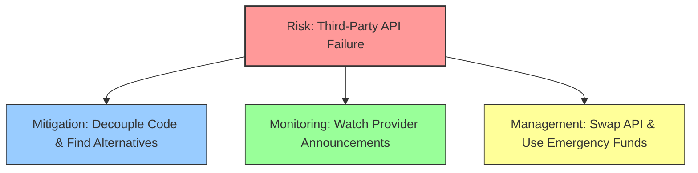
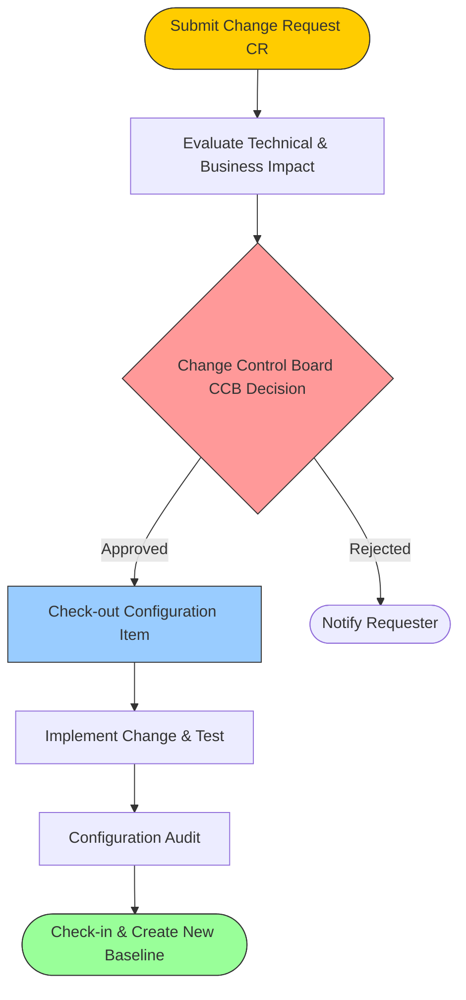

## Module 5: Risk Management & Software Configuration Management

### Q85. Explain the Reactive Risk Strategy and investigate its significance in software project risk management. (2 Marks)
A reactive risk strategy relies on waiting for a risk to actually occur before taking action. Also known as the "fire-fighting" approach, it involves no prior planning or contingency measures. When a problem arises, the team scrambles to fix it, which often leads to panic, delayed schedules, and increased costs. Its significance in professional software risk management is minimal, as it represents a poor management style. However, studying it is essential to understand why proactive planning is strictly necessary. It highlights the severe consequences of unpreparedness, showing that without mitigation strategies, even minor issues can derail a project.

### Q86. Describe how you would mitigate the risk of a computer crash in a software project. (2 Marks)
To mitigate the risk of a computer crash, I would implement a strict and layered data protection policy. First, all source code must be continuously pushed to a remote, cloud-based version control system like Git, ensuring local changes are safely stored off-site. Second, automated daily backups of all databases, project files, and environments would be established. For hardware protection, developers' machines should be connected to Uninterruptible Power Supplies (UPS) to prevent sudden power-loss damage. Having spare, pre-configured workstations available ensures that if a crash occurs, the developer can switch machines and resume work immediately with zero data loss.

### Q87. Apply risk assessment knowledge to identify parameters considered as fields of a Risk Table. Draw a Risk Table for any project. (2 Marks)
A Risk Table is a crucial assessment tool that organizes identified risks. The standard parameters (fields) include: **Risk ID/Description** (what the risk is), **Category** (e.g., technical, business, project), **Probability** (likelihood of occurrence, often a percentage), **Impact** (severity from 1 to 5), and **RMMM** (pointer to the Risk Mitigation, Monitoring, and Management plan).

| Risk Description | Category | Probability | Impact | RMMM |
| :--- | :--- | :--- | :--- | :--- |
| Database server failure | Technical | 20% | 4 (Critical) | Plan #1 |
| Key developer resigns | Project | 15% | 3 (Serious) | Plan #2 |

### Q88. Validate different categories of software risks and justify any one with a suitable example. (2 Marks)
Software risks are generally categorized into three main types: **Project Risks** (threaten the project schedule and budget, e.g., staff turnover), **Technical Risks** (threaten the quality and timeliness of the software, e.g., using an untested new framework), and **Business Risks** (threaten the viability of the software). A prime example of a **Business Risk** is building a perfectly functioning product that nobody wants. This occurs when market research is flawed, leading to the creation of a system that fails to meet actual user demands or loses out to competitors, rendering the entire development effort financially useless.

### Q89. Explain the role of Version Control in Software Configuration Management activities. (2 Marks)
Version Control is the backbone of Software Configuration Management (SCM). Its primary role is to track and manage changes to software code and documents over time. By maintaining a complete history of every modification, version control systems (like Git or SVN) allow teams to revert to previous stable states if a new change introduces bugs. It also enables seamless collaboration among multiple developers by facilitating branching (working on isolated features) and merging (integrating those features back together) without overwriting each other's work, ensuring the project's overall integrity is strictly maintained.

### Q90. Differentiate between a software configuration audit and a software configuration review based on their objectives. (2 Marks)
A **Software Configuration Review** (often a formal technical review) focuses on the technical correctness of the configuration object. Its objective is to ensure that a modified component satisfies its requirements, adheres to coding standards, and doesn't introduce technical flaws. In contrast, a **Software Configuration Audit** is a formal, administrative check. Its objective is to verify completeness and consistency—ensuring that the change was implemented as approved, that all necessary testing was performed, that documentation was correctly updated, and that the SCM procedures and standards were strictly followed before baselining.

### Q91. Apply risk mitigation principles to justify the importance of risk mitigation in project management. (2 Marks)
Risk mitigation is critical in project management because it shifts a project from a chaotic, reactive state to a controlled, proactive one. By anticipating potential threats and formulating strategies to reduce their likelihood and impact, mitigation saves significant time, money, and resources. It prevents minor issues from snowballing into catastrophic failures. For instance, holding regular code reviews (a mitigation strategy) catches bugs early, which is exponentially cheaper than fixing them post-release. Ultimately, risk mitigation ensures project stability, increases stakeholder confidence, and secures a higher probability of timely and successful product delivery.

### Q92. Apply the RMMM model to a software project scenario and demonstrate how it systematically manages project risks across phases. (5 Marks)
The **RMMM (Risk Mitigation, Monitoring, and Management)** model is a proactive strategy to handle software risks systematically. 
1. **Mitigation (Avoidance):** Proactive steps to reduce the probability or impact of a risk.
2. **Monitoring:** Tracking risk indicators over time to see if the risk is becoming more or less likely.
3. **Management (Contingency):** The action plan executed if the risk actually becomes a reality.

**Scenario:** A project relies on a critical third-party API, and the risk is that the API provider might shut down or change their pricing structure.
- **Mitigation:** The team designs the system architecture using the Adapter pattern, ensuring the software isn't tightly coupled to this specific API. They also research alternative API providers.
- **Monitoring:** The project manager assigns a team member to subscribe to the API provider's newsletters, monitor their developer forums, and watch for any announcements regarding business changes or server deprecations.
- **Management:** If the API provider suddenly shuts down, the contingency plan is triggered. The team seamlessly swaps the current API adapter with one built for the pre-researched alternative provider, using emergency budget reserved exactly for this scenario, preventing project failure.

This systematic approach ensures that at no point is the team caught off guard, preserving the project's timeline and budget.

### Q93. Analyze the Risk Paradigm and apply it to perform structured risk management for a given software project. (5 Marks)
The **Risk Paradigm** is a continuous, circular framework that provides a structured approach to risk management throughout the software lifecycle. It consists of five key phases: **Identify, Analyze, Plan, Track, and Control**.

**Application to a Software Project (e.g., Developing a new Mobile Banking App):**
1. **Identify:** The team brainstorms potential threats. They identify risks such as "New security regulations might be introduced mid-development" and "The lead iOS developer might leave for another job."
2. **Analyze:** The team evaluates the likelihood and impact of these risks. The regulatory risk has a 30% probability but a catastrophic (5) impact. The developer leaving has a 20% probability and a serious (4) impact. The risks are prioritized based on these scores.
3. **Plan:** The team creates an RMMM plan. For the developer risk, they mandate extreme pair programming and thorough documentation so knowledge isn't siloed.
4. **Track:** The project manager monitors the indicators. They track the lead developer's job satisfaction and closely monitor legislative news regarding banking software.
5. **Control:** If the developer gives their two weeks' notice, the control mechanisms take over. The contingency plan is executed: a secondary developer, who has been pair-programming, takes over immediately, and HR expedites the hiring process.

By continuously cycling through this paradigm, the banking app project remains resilient to shifting circumstances, ensuring risks are consistently identified and mitigated before they derail the project.

### Q94. Apply risk identification techniques to identify two risks in a software project and construct a Risk Table with probability and impact values. (5 Marks)
Risk identification relies on techniques like brainstorming, reviewing past project post-mortems, and using risk item checklists. For a hypothetical project building an **AI-powered Customer Support Chatbot**, we can identify the following two significant risks using a product-specific checklist:

1. **Risk 1 (Technical):** The selected AI Natural Language Processing (NLP) model may struggle to accurately understand the specific technical jargon used by the company's customers, leading to a high rate of incorrect chatbot responses.
2. **Risk 2 (Project/Resource):** The project relies heavily on the internal customer support team to provide training data, but they are currently understaffed and may not have the time to label the required volume of data before the deadline.

**Risk Table:**

| Risk ID | Risk Description | Category | Probability | Impact (1-5) | RMMM Pointer |
| :---: | :--- | :--- | :---: | :---: | :--- |
| R-01 | NLP model fails to parse domain-specific technical jargon accurately. | Technical | 40% | 4 (Serious) | RMMM-01 |
| R-02 | Support team unavailable to label training data on schedule. | Project | 60% | 3 (Moderate)| RMMM-02 |

*Impact Scale: 1-Catastrophic, 2-Critical, 3-Marginal, 4-Negligible (Note: In some models, 1 is negligible and 5 is catastrophic. Here we assume 1-5 where 5 is highest impact for intuitive reading, so Impact=4 is High/Serious and Impact=3 is Moderate).*
By quantifying these risks in a table, the project manager can easily prioritize addressing the data labeling bottleneck (high probability) and the NLP accuracy issue (high impact).

### Q95. Design a complete Risk Information Sheet for a real-world software project by applying risk management documentation standards. (5 Marks)
A **Risk Information Sheet (RIS)** is a standardized document used to record all details about a single, specific risk. It serves as the ultimate reference point for that risk throughout the project lifecycle.

**Risk Information Sheet**
* **Project Name:** NextGen E-Commerce Platform
* **Risk ID:** R-045
* **Date Identified:** 2026-05-21
* **Identified By:** Jane Doe, Lead Architect
* **Risk Description:** The chosen payment gateway API may not support the expected transaction volume during the Black Friday launch, leading to system timeouts and lost revenue.
* **Risk Category:** Technical / External Dependency
* **Probability:** 35%
* **Impact Level:** 5 (Catastrophic - Direct loss of massive revenue)
* **Risk Refinement (Context):** The gateway is rated for 1,000 TPS, but marketing expects 2,500 TPS during peak hours.
* **Mitigation Strategy (Avoidance):** 
  - Integrate a secondary, high-capacity payment gateway as a fallback.
  - Implement a queuing mechanism to hold transactions during high traffic rather than dropping them.
* **Monitoring Strategy:**
  - Track marketing metrics to accurately forecast expected traffic.
  - Run continuous stress tests on the staging environment simulating 3,000 TPS.
* **Management Strategy (Contingency):** 
  - If the primary gateway throttles, automatically route all new traffic to the secondary gateway.
  - Deploy a user-friendly "Please wait in queue" UI overlay.
* **Current Status:** Open - Mitigation steps in progress (Queuing system is 50% coded).

### Q96. Apply SCM principles to outline three primary goals of Software Configuration Management and demonstrate how each contributes to project integrity. (5 Marks)
Software Configuration Management (SCM) is the discipline of managing change throughout the software lifecycle. Its primary goals are essential for maintaining a stable and reliable project.

1. **Identifying and Organizing Configuration Items (CIs):** SCM's first goal is to identify every single component of a software project (source code, design models, SRS documents, test data) and organize them into baselines. 
   * *Contribution to Integrity:* This ensures that the team always knows exactly what constitutes a specific version of the software. Without this, a developer might accidentally use an outdated requirements document, leading to incorrect implementation.
2. **Managing and Controlling Change:** SCM establishes strict procedures (Change Control) for requesting, evaluating, and approving modifications to baselined CIs.
   * *Contribution to Integrity:* This prevents uncoordinated, ad-hoc changes that cause software to break. By ensuring every change is reviewed for its impact and formally approved, the project remains stable and protected from rogue code commits.
3. **Status Accounting and Auditing:** SCM aims to keep track of the status of all changes (Status Accounting) and verify the correctness of those changes (Configuration Auditing).
   * *Contribution to Integrity:* This guarantees transparency and compliance. If a bug appears in production, status accounting provides a clear audit trail of who changed what and when, making it easy to identify the root cause and roll back to a stable state, thus ensuring long-term project reliability.

### Q97. Apply Change Management concepts to draw a flowchart of the Change Management process and explain each step in the SCM change process. (5 Marks)
The Change Management process ensures that all proposed changes to a baselined software configuration are systematically evaluated, approved, and tracked.

**Explanation of Steps:**
1. **Submit Change Request (CR):** A developer or client identifies a bug or feature need and submits a formal CR detailing the modification.
2. **Evaluate Impact:** SCM analysts assess how the change will affect the project timeline, budget, and other technical components.
3. **CCB Decision:** The Change Control Board (a group of stakeholders) reviews the impact report and either approves or rejects the CR.
4. **Check-out CI:** Once approved, the developer checks out the specific configuration item (e.g., source code file) from the central SCM repository, locking it for editing.
5. **Implement & Test:** The developer writes the code, modifies the file, and runs unit tests to ensure the change works without breaking existing features.
6. **Configuration Audit:** SCM teams perform a formal audit to verify that the change matches the CR and that all coding standards were followed.
7. **Check-in & Baseline:** The audited file is checked back into the repository. The SCM system updates the version history and establishes a new stable baseline for the project.

### Q98. Analyze how version control contributes to maintaining project integrity in SCM. Examine branching, merging, and baseline strategies. (5 Marks)
Version control is the technological heart of SCM, safeguarding project integrity by acting as an infallible time machine and traffic cop for source code. It records every modification, allowing teams to seamlessly track who made a change, why it was made, and when.

**Branching:** Version control allows developers to create "branches"—isolated, independent copies of the main codebase. This strategy maintains project integrity because developers can experiment, build risky new features, or fix bugs in their own branch without ever threatening the stability of the main production code.
**Merging:** Once a feature in a branch is fully completed and tested, it is "merged" back into the main branch. Version control systems manage this process by automatically combining code, and crucially, they detect "conflicts" (where two developers edited the exact same line). This prevents code from being blindly overwritten, forcing human review to maintain logic integrity.
**Baseline Strategies:** A baseline is a snapshot of the software at a specific point in time (e.g., v1.0 release). Version control systems use "tags" or "releases" to permanently mark these baselines. This ensures that even as development continues for v2.0, the team can always retrieve, compile, and patch the exact codebase that was shipped in v1.0, ensuring absolute consistency and historical integrity.

### Q99. Analyze the integration of SCM with software engineering practices such as testing and CI/CD. Examine how SCM activities improve overall project governance. (10 Marks)
Software Configuration Management (SCM) is not an isolated administrative task; it is the fundamental infrastructure that enables modern software engineering practices like rigorous Testing and Continuous Integration/Continuous Deployment (CI/CD). The deep integration of SCM into these practices dramatically enhances project governance, speed, and reliability.

**Integration with Testing:**
Testing requires stable, known environments to be effective. SCM provides this by establishing strict baselines. When a QA team begins testing a release candidate, they pull a specific, immutable version from the SCM repository. If a bug is found, the exact configuration item (CI) and its version number are logged in the bug report. Developers can then check out that exact same version to reproduce the bug. Without SCM, the codebase would be a moving target; developers might be writing code while testers are simultaneously testing it, leading to a chaotic situation where bugs are irreproducible. Furthermore, automated test scripts themselves are treated as Configuration Items and are version-controlled alongside the application code, ensuring that the tests always perfectly align with the software version they are meant to evaluate.

**Integration with CI/CD:**
CI/CD pipelines rely entirely on SCM to function. SCM acts as the definitive source of truth that triggers the automated pipeline.
*   **Continuous Integration (CI):** Whenever a developer commits a change to the SCM repository (e.g., Git), a webhook notifies the CI server (like Jenkins or GitHub Actions). The CI server automatically checks out the latest code, compiles it, and runs a battery of automated tests. If the build fails, the SCM system rejects the merge, ensuring that broken code never infects the main branch.
*   **Continuous Deployment (CD):** Once the CI process passes, the CD pipeline automatically packages the baselined artifacts and deploys them to staging or production environments. SCM ensures that exactly what was tested is what gets deployed, eliminating the risk of human error in manual deployments.

**Improving Project Governance:**
SCM activities inherently enforce strict project governance. Through Change Control Boards (CCB), SCM ensures that no change—no matter how small—is introduced without proper authorization, impact analysis, and testing. Configuration Audits provide stakeholders with transparent, objective proof that the software meets quality standards and regulatory compliance. Status Accounting generates reports on the health of the project, tracking metrics like the number of open change requests or frequent build failures. Together, these SCM activities create a highly disciplined, transparent environment where risks are minimized, quality is guaranteed, and the software delivery lifecycle is governed by predictable, repeatable processes rather than ad-hoc chaos.

### Q100. Apply risk identification and documentation techniques to construct a structured risk register for a complete software engineering project. (10 Marks)
A Risk Register is a comprehensive, living document utilized in project management to continuously track and manage all identified risks. Constructing one requires systematic risk identification techniques, such as analyzing project requirements for technical uncertainties, reviewing historical data from similar projects, and conducting stakeholder brainstorming sessions. 

Consider a complete software engineering project: **Developing an Enterprise Healthcare Record Management System (EHRMS)**. This project involves strict compliance laws, integration with legacy databases, and highly sensitive data. Applying risk identification, we can categorize risks into Technical, Project, and Business domains, and document them in a structured risk register.

**Enterprise Healthcare Record Management System - Risk Register**

| Risk ID | Risk Description | Category | Prob. (%) | Impact (1-5) | Score (P*I) | Mitigation Strategy (Avoidance) | Contingency Plan (Management) | Owner | Status |
| :--- | :--- | :--- | :---: | :---: | :---: | :--- | :--- | :--- | :--- |
| **RSK-01** | **Data Breach/HIPAA Violation:** Unauthorized access to patient medical records due to software vulnerabilities. | Business / Legal | 15% | 5 | 0.75 | Implement end-to-end AES-256 encryption. Hire a third-party security firm to perform monthly penetration testing. | Instantly isolate the compromised server, execute incident response plan, notify authorities and affected patients within 24h. | Sec. Lead | Open - Active |
| **RSK-02** | **Legacy System Integration Failure:** The new system fails to accurately migrate data from the hospital's 20-year-old proprietary database. | Technical | 40% | 4 | 1.60 | Develop custom data extraction scripts early. Perform multiple trial migrations on staging servers using sampled data. | Run the new and legacy systems in parallel for three months. Fallback to legacy system for critical lookups if migration halts. | DB Admin | Open - Active |
| **RSK-03** | **Key Personnel Attrition:** The Lead Software Architect resigns midway through the project, stalling critical design decisions. | Project | 25% | 4 | 1.00 | Enforce rigorous architectural documentation. Maintain a "shadow" architect or heavily involve senior devs in high-level design. | Promote the senior developer to acting architect immediately. Engage external consulting firm for short-term architectural review. | Proj. Mgr | Open - Monitored |
| **RSK-04** | **Scope Creep from Stakeholders:** Doctors continuously request new, complex features not agreed upon in the initial SRS. | Project | 60% | 3 | 1.80 | Strictly enforce a formal Change Control Board (CCB) process. Require all new features to be accompanied by budget/schedule extensions. | Log unapproved features into a "Phase 2" backlog. Politely but firmly refuse implementation in the current release cycle. | Prod. Owner | Open - Active |
| **RSK-05** | **Performance Degradation under Load:** System response time drops unacceptably during morning shift changes when hundreds of nurses log in simultaneously. | Technical | 35% | 3 | 1.05 | Design scalable cloud-based microservices. Perform heavy load testing simulating 200% of expected peak user traffic. | Automatically provision additional cloud server instances (auto-scaling) when CPU usage exceeds 80%. | Cloud Eng. | Open - Monitored |

This structured risk register acts as a central repository. By calculating the Risk Score (Probability × Impact), the project manager can mathematically prioritize their focus—in this case, RSK-04 (Scope Creep) and RSK-02 (Integration Failure) require immediate, heavy focus due to their high overall scores. The register ensures that every threat has an assigned owner and a pre-planned response, ensuring project resilience.

### Q101. Analyze the differences between reactive and proactive risk strategies in software project management. Evaluate the effectiveness of each strategy. (10 Marks)
In software project management, handling uncertainty distinguishes successful projects from massive failures. The two fundamental approaches to dealing with uncertainty are the Reactive Risk Strategy and the Proactive Risk Strategy. These methodologies differ entirely in their philosophy, execution, and overall effectiveness.

**The Reactive Risk Strategy ("Fire-Fighting")**
A reactive strategy operates on the principle of dealing with problems only after they occur. In this approach, the project team does not spend time during the planning phase identifying what could go wrong. Instead, they focus entirely on current development tasks. 
*   **Execution:** When a risk materializes into an actual issue (e.g., a critical server crashes, or a major bug is found right before release), the team drops their planned work and scrambles to "put out the fire." 
*   **Characteristics:** It is characterized by crisis management, high stress, and impromptu decision-making. There are no contingency funds or backup plans in place.
*   **Effectiveness Evaluation:** The effectiveness of a reactive strategy is generally **very low**. While it might save a small amount of time during initial project planning, the costs incurred when a risk actually hits are catastrophic. Fixing a problem in a state of panic usually results in "hacky," unstable solutions. It leads to severe schedule slippages, massive budget overruns, and rapid developer burnout. It is generally considered a poor management practice and should only be used for risks that have an infinitesimally small probability of occurring, where planning for them would cost more than the solution.

**The Proactive Risk Strategy ("Fire-Prevention")**
A proactive strategy operates on the principle of anticipation and prevention. The project team actively assumes that things will go wrong and spends considerable effort during the early phases of the project identifying, analyzing, and planning for those possibilities.
*   **Execution:** The team creates a detailed Risk Register and implements the RMMM (Risk Mitigation, Monitoring, and Management) model. They take concrete steps (Mitigation) to ensure risks never happen, monitor indicators (Monitoring) to see if risks are approaching, and have pre-approved backup plans (Management) ready to execute instantly if disaster strikes.
*   **Characteristics:** It is characterized by structured analysis, foresight, budget allocation for contingencies, and controlled responses.
*   **Effectiveness Evaluation:** The effectiveness of a proactive strategy is **exceptionally high**. By investing time upfront, the team avoids the vast majority of predictable problems entirely (saving money and time). For the risks that cannot be avoided, the team handles them calmly and efficiently using pre-tested contingency plans, resulting in zero panic. Proactive risk management ensures project stability, predictable delivery timelines, and high product quality. It is the hallmark of professional software engineering. 

**Summary Comparison:**
In conclusion, while reactive management leaves a project entirely at the mercy of chance and crisis, proactive management grants the team control over the project's destiny. A proactive approach is strictly necessary for any project of significant size, complexity, or importance.

### Q102. Apply the RMMM plan to construct a risk response strategy for your project and evaluate the effectiveness of each mitigation action. (10 Marks)
The **RMMM (Risk Mitigation, Monitoring, and Management)** plan is a comprehensive strategy for dealing with identified risks in a software project. To construct an effective risk response strategy, we will apply the RMMM framework to a hypothetical project: **Developing an AI-driven Autonomous Drone Navigation System**. 

For this highly complex project, we will select a critical risk: **Risk: The drone's computer vision processing is too slow, causing a massive delay in obstacle detection, leading to potential crashes.**

**1. Risk Mitigation (Avoidance)**
Mitigation involves proactive actions taken immediately to reduce the probability or impact of the risk.
*   **Action A:** Instead of using heavy, generic AI models, develop highly optimized, lightweight neural networks specifically pruned for edge-computing devices.
*   **Action B:** Utilize specialized hardware, such as dedicated Neural Processing Units (NPUs) or FPGAs on the drone, rather than relying on standard CPUs for vision processing.
*   **Evaluation of Effectiveness:** These actions are highly effective. By addressing both the software efficiency (Action A) and the hardware capability (Action B) upfront, the team fundamentally attacks the root cause of the processing delay. This drastically lowers the probability of the risk occurring, effectively avoiding the problem before it manifests in flight testing.

**2. Risk Monitoring**
Monitoring involves identifying metrics and tracking them continuously to determine if the risk is becoming more or less likely.
*   **Action A:** During daily continuous integration (CI) builds, run automated benchmark tests that specifically measure the millisecond latency of the computer vision module on simulated hardware.
*   **Action B:** Track the memory and CPU usage of the vision processing algorithm as new features are added during weekly sprints.
*   **Evaluation of Effectiveness:** This is highly effective because it provides early warning signs. If a developer commits new code that accidentally spikes the processing time from 5ms to 50ms, the automated CI monitoring catches it instantly. The team is alerted to the impending risk *before* the software is ever loaded onto a real physical drone, preventing expensive hardware destruction.

**3. Risk Management (Contingency Plan)**
Management involves the predefined steps to take if the mitigation fails and the risk actually becomes a reality (i.e., the drone is flying and the processing falls behind).
*   **Action A:** Program a hard-coded, non-AI "fail-safe" ultrasonic sensor array. If the AI processing latency exceeds 100ms, the system instantly overrides the AI and forces the drone to hover in place or slowly ascend to a safe altitude using only basic ultrasonic data.
*   **Action B:** Allocate 15% of the project budget as a contingency fund. If the current hardware fundamentally fails to meet speed requirements despite optimization, use this fund to immediately purchase and integrate next-generation processing boards.
*   **Evaluation of Effectiveness:** These contingency plans are crucial. Action A ensures safety; it acknowledges that if the software fails in real-time, the drone won't crash into a building, thereby saving the physical asset. Action B ensures project survival; having pre-approved emergency funds means the project won't stall awaiting financial approval to buy necessary faster hardware. 

By applying the RMMM plan, the project transforms a potentially catastrophic risk (drone crashes) into a highly controlled, monitored, and survivable engineering challenge.

### Q103. Design a Risk Table for a software project developing an e-commerce platform. Apply risk prioritization techniques and propose appropriate mitigation strategies. (10 Marks)
Designing a Risk Table is a fundamental step in proactive project management. For a project developing a high-traffic **E-Commerce Platform**, the team must anticipate technical, business, and project-level threats. 

To prioritize these risks, we will use a quantitative risk assessment technique: **Risk Score = Probability × Impact**. 
*   **Probability** is estimated as a percentage (0.1 to 1.0, represented as 10% to 100%).
*   **Impact** is rated on a scale of 1 to 5 (1=Negligible, 2=Marginal, 3=Moderate, 4=Critical, 5=Catastrophic).
Risks with the highest Risk Score demand the most immediate and robust mitigation strategies.

**Risk Table for E-Commerce Platform**

| ID | Risk Description | Category | Prob (P) | Impact (I) | Score (P×I) | Priority | Mitigation Strategy (Proactive Avoidance) |
| :--- | :--- | :--- | :---: | :---: | :---: | :---: | :--- |
| **R1** | **Payment Gateway Outage:** The integrated third-party payment gateway goes offline during peak holiday sales. | Technical | 0.30 | 5 | **1.50** | **High (1)** | Integrate at least two redundant payment gateways (e.g., Stripe and PayPal). Implement auto-failover logic so if Gateway A times out, transactions instantly route to Gateway B. |
| **R2** | **Cybersecurity Breach:** Hackers exploit a vulnerability in the checkout process, stealing customer credit card data. | Business | 0.15 | 5 | **0.75** | **Medium (3)** | Strictly enforce PCI-DSS compliance. Never store raw credit card data on our servers (use tokenization). Conduct bi-weekly vulnerability scanning and automated penetration tests on the checkout module. |
| **R3** | **Database Scalability Failure:** The product catalog database becomes locked/unresponsive when 10,000+ users browse simultaneously. | Technical | 0.40 | 4 | **1.60** | **High (1)** | Implement database read-replicas to handle heavy browsing traffic. Utilize distributed caching mechanisms (like Redis or Memcached) to serve catalog data without hitting the primary database. |
| **R4** | **Delayed Shipping API Integration:** The logistics partner fails to provide their shipping rate API documentation on time. | Project | 0.50 | 3 | **1.50** | **High (1)** | Initiate communication with the logistics partner on Day 1. Develop a fallback "flat-rate" shipping module that can be temporarily used for launch if the dynamic API is delayed. |
| **R5** | **Frontend Framework Deprecation:** The chosen open-source UI framework stops receiving security updates during development. | Technical | 0.10 | 3 | **0.30** | **Low (4)** | Select widely adopted, enterprise-backed frameworks (e.g., React or Angular) with clear long-term support (LTS) roadmaps rather than niche libraries. |

**Risk Prioritization Analysis:**
By calculating the Risk Score, we can objectively prioritize our efforts. 
*   **High Priority (Score 1.50 - 1.60):** R3 (Database Scalability), R1 (Payment Outage), and R4 (Shipping API). These are the most dangerous threats combining high likelihood and severe impact. The project manager must allocate immediate budget and engineering time to implement their mitigation strategies (e.g., setting up Redis caches and redundant gateways).
*   **Medium Priority (Score 0.75):** R2 (Cybersecurity). Although the impact is catastrophic (5), the probability is lower due to modern frameworks. However, its mitigation (tokenization) remains mandatory.
*   **Low Priority (Score 0.30):** R5 (Framework Deprecation). Highly unlikely and manageable. It requires basic monitoring but no heavy resource allocation.

This structured table ensures the e-commerce project team focuses their time and money on mitigating the most statistically dangerous threats first.

### Q104. Apply configuration management strategies to design an SCM scenario for a distributed team working on a mobile application. Justify your approach. (10 Marks)
Software Configuration Management (SCM) becomes exponentially more complex and critical when managing a distributed team (e.g., developers in the US, UI/UX designers in Europe, and QA testers in Asia) collaborating on a single product, such as a **Cross-Platform Mobile Application**. Without rigorous SCM strategies, concurrent development will lead to overwritten code, irreproducible bugs, and absolute chaos.

**SCM Scenario Design for a Distributed Mobile App Team**

**1. Centralized Source of Truth (Version Control Strategy)**
*   **Design:** I would mandate a cloud-hosted version control system, specifically Git (via GitHub Enterprise or GitLab). All Configuration Items (CIs)—including source code, UI assets, configuration JSONs, and test scripts—must be stored here.
*   **Justification:** A distributed team cannot rely on local servers or file-sharing apps. Cloud-based Git ensures that a developer in Tokyo and a designer in London are looking at the exact same, up-to-date repository. It provides a permanent, auditable history of every change made across all time zones.

**2. The GitFlow Branching Model (Concurrent Development Strategy)**
*   **Design:** The team will strictly adhere to the GitFlow branching strategy. 
    *   `main` branch: Contains only production-ready, highly stable code.
    *   `develop` branch: The integration branch for the next release.
    *   `feature/xyz` branches: Individual developers create branches off `develop` to work on specific tasks (e.g., `feature/login-screen`).
*   **Justification:** When a distributed team works on the same app, they will inevitably touch the same files. Feature branches isolate a developer's work. They can commit code locally and push changes without breaking the `develop` branch for everyone else. Code is only merged back via Pull Requests (PRs) after peer review.

**3. Automated Continuous Integration (CI Strategy)**
*   **Design:** I would integrate a CI pipeline (e.g., Bitrise or GitHub Actions, specialized for mobile). Whenever a developer across the globe opens a Pull Request to merge their feature branch into `develop`, the CI server automatically compiles the mobile app (both iOS and Android builds) and runs all automated unit tests.
*   **Justification:** In a distributed environment, you cannot trust that code works on one developer's machine ("It works on my machine" syndrome). The CI server acts as an impartial, automated configuration auditor. If a developer's code breaks the build or fails tests, the PR is automatically blocked from merging, maintaining the integrity of the shared `develop` branch.

**4. Change Control Board (CCB) and Issue Tracking (Change Management)**
*   **Design:** Use a cloud-based issue tracker like Jira. Every code change must be tied to a specific Jira ticket. For major architectural changes or release planning, a virtual CCB (comprising the Lead Developer, QA Lead, and Product Manager) meets weekly via video call to approve or reject change requests.
*   **Justification:** This enforces strict governance. A developer in the US cannot arbitrarily decide to change the database schema while the European team sleeps. The CCB ensures all major changes are communicated, impact-assessed, and scheduled properly, maintaining alignment across disparate geographies.

**5. Release Management and Baselining**
*   **Design:** When preparing for a release (e.g., v1.2), a `release/v1.2` branch is created. QA performs final UAT here. Once approved, it is merged to `main`, tagged as `v1.2` (the baseline), and automatically deployed to the App Store and Google Play via the CD pipeline.
*   **Justification:** Baselining via Git tags ensures that if a critical bug is found in production by a user, the team can instantly checkout the exact `v1.2` code, isolate the bug, and deploy a hotfix without getting tangled up in the new, half-finished features currently sitting in the `develop` branch.

### Q105. You are managing a software project, and you’ve identified the following risks in different categories. For each risk category, the likelihood (P), impact (I), and risk score (P * I) are provided. You need to analyze how reactive and proactive strategies would impact the project in terms of handling these risks.
*Assuming typical risk data for analysis:*
*   *Risk 1 (Technical): Database crash. Likelihood = 0.4, Impact = 5, Score = 2.0*
*   *Risk 2 (Project): Staff turnover. Likelihood = 0.6, Impact = 3, Score = 1.8*
*   *Risk 3 (Schedule): Scope creep. Likelihood = 0.8, Impact = 4, Score = 3.2*

**Task 1: Calculate the Risk Score for Each Risk Category**
The risk score is calculated by multiplying the Likelihood (Probability) by the Impact. Based on the assumed data:
*   **Technical Risk (Database Crash):** Score = 0.4 × 5 = **2.0**
*   **Project Risk (Staff Turnover):** Score = 0.6 × 3 = **1.8**
*   **Schedule Risk (Scope Creep):** Score = 0.8 × 4 = **3.2**

**Task 2: Prioritize the Risks**
Risks are prioritized in descending order based on their calculated Risk Scores. 
1.  **Priority 1: Schedule Risk (Scope Creep)** - Score: **3.2**. This is the highest priority. It has a very high likelihood of occurring and a severe impact on project delivery.
2.  **Priority 2: Technical Risk (Database Crash)** - Score: **2.0**. While slightly less likely, a score of 5 indicates a catastrophic impact, making it the second most critical threat.
3.  **Priority 3: Project Risk (Staff Turnover)** - Score: **1.8**. This is a moderate risk. It is likely to happen but has a manageable impact compared to a database failure.

**Task 3: Suggest Mitigation Strategies & Analyze Reactive vs. Proactive Impacts**

**1. Schedule Risk (Scope Creep)**
*   **Proactive Mitigation Strategy:** Implement a strict, formal Change Control Board (CCB) process. Require all client feature requests to be documented, estimated for cost/time impact, and formally approved/paid for before a single line of code is written. 
*   **Impact of Proactive Strategy:** The project remains on schedule and within budget. The team is protected from doing unpaid overtime, and the client's expectations are managed professionally.
*   **Impact of Reactive Strategy:** The team blindly says "yes" to all client requests without adjusting the deadline. The project inevitably runs out of time and budget, leading to immense stress, missed deadlines, and a poorly tested final product.

**2. Technical Risk (Database Crash)**
*   **Proactive Mitigation Strategy:** Implement continuous data replication to a secondary, failover database in a different geographic region. Set up automated daily backups and regular disaster recovery drills.
*   **Impact of Proactive Strategy:** If the primary database crashes, the system automatically routes to the failover database with near-zero downtime and zero data loss. The project reputation is maintained.
*   **Impact of Reactive Strategy:** The database crashes, and there are no backups. The system goes entirely offline for days. The team frantically tries to reconstruct data from corrupted logs. Massive amounts of user data are permanently lost, resulting in lawsuits and complete project failure.

**3. Project Risk (Staff Turnover)**
*   **Proactive Mitigation Strategy:** Enforce pair programming and thorough code documentation. Ensure no single developer holds exclusive knowledge of a critical system module (eliminate silos). Cross-train team members.
*   **Impact of Proactive Strategy:** When a developer quits, the remaining team easily picks up their work because the knowledge is shared and documented. The project schedule experiences only a minor hiccup while a replacement is hired.
*   **Impact of Reactive Strategy:** A lead developer quits, taking all the undocumented knowledge of the core algorithm with them. The rest of the team spends months deciphering their code, causing massive delays and halting all forward progress on the project.

### Q106. Consider a project with the following identified risks and their associated likelihoods and impacts (on a scale from 1 to 5, where 1 is low and 5 is high):
*   **Risk A: Likelihood = 4, Impact = 3**
*   **Risk B: Likelihood = 3, Impact = 5**
*   **Risk C: Likelihood = 2, Impact = 4**
**Calculate the overall risk score for the project. What is the priority order of these risks based on their risk scores? (10 Marks)**

To properly evaluate and prioritize risks in software engineering, we utilize a quantitative risk assessment formula. The standard method for determining the severity of a risk is calculating its Risk Score (often referred to as Risk Exposure). 

**Step 1: Formula Definition**
The formula used is:
**Risk Score = Likelihood × Impact**
Where:
*   **Likelihood (Probability):** The chance that the risk will actually occur (rated 1 to 5).
*   **Impact (Severity):** The level of damage the risk will cause to the project's schedule, budget, or quality if it occurs (rated 1 to 5).

By calculating this mathematical product, we gain an objective metric that balances how likely an event is against how damaging it would be, allowing us to focus resources intelligently.

**Step 2: Calculating Individual Risk Scores**
Applying the formula to the provided project risks:

*   **Risk A:**
    *   Likelihood = 4
    *   Impact = 3
    *   Risk Score = 4 × 3 = **12**

*   **Risk B:**
    *   Likelihood = 3
    *   Impact = 5
    *   Risk Score = 3 × 5 = **15**

*   **Risk C:**
    *   Likelihood = 2
    *   Impact = 4
    *   Risk Score = 2 × 4 = **8**

**Step 3: Calculating Overall Project Risk Score**
Depending on the specific risk management framework being used, the "overall risk score for the project" can be represented in a few ways. Most commonly, it is the sum of all individual active risk scores. This cumulative number provides project managers with a high-level metric to determine the total risk exposure of the entire project at a given time.
*   **Overall Project Risk Score** = Score(Risk A) + Score(Risk B) + Score(Risk C)
*   **Overall Project Risk Score** = 12 + 15 + 8 = **35**
*(Note: An overall score of 35 out of a theoretical maximum of 75 (if all three risks were 5x5) indicates that the project is operating under a moderate to high level of total risk exposure, necessitating strong mitigation planning).*

**Step 4: Determining the Priority Order**
Risk prioritization is critical because a project team has limited time, budget, and resources. They cannot mitigate every risk equally. Prioritization dictates that risks with the highest Risk Score must be addressed first with the most robust mitigation strategies (RMMM plans).

Based on our calculations, the risks are prioritized in descending order (highest score to lowest score):

1.  **Priority 1: Risk B (Score = 15).** 
    *   *Analysis:* Although it is slightly less likely to happen than Risk A, its impact is catastrophic (5). A score of 15 makes it the most dangerous threat to the project. This requires immediate management attention and proactive avoidance strategies.
2.  **Priority 2: Risk A (Score = 12).** 
    *   *Analysis:* This risk has the highest likelihood of occurring (4), though its impact is moderate (3). Because it is very likely to happen, it demands active monitoring and solid contingency planning, placing it second in priority.
3.  **Priority 3: Risk C (Score = 8).** 
    *   *Analysis:* This risk has a severe impact (4), but a low likelihood of occurring (2). It has the lowest risk score, meaning it poses the least immediate threat. It should be documented and periodically monitored, but it does not require significant immediate resource allocation compared to Risks B and A.

**Final Priority Order:** **Risk B (Highest) → Risk A → Risk C (Lowest)**.
