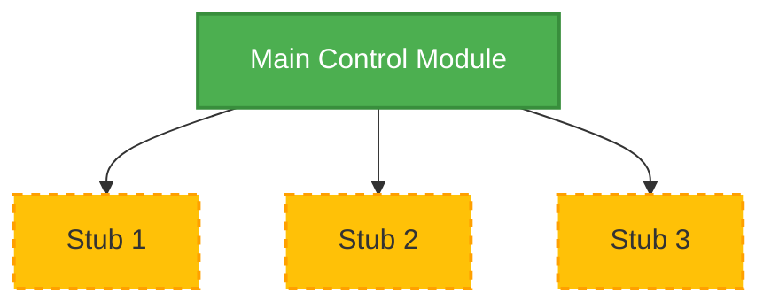
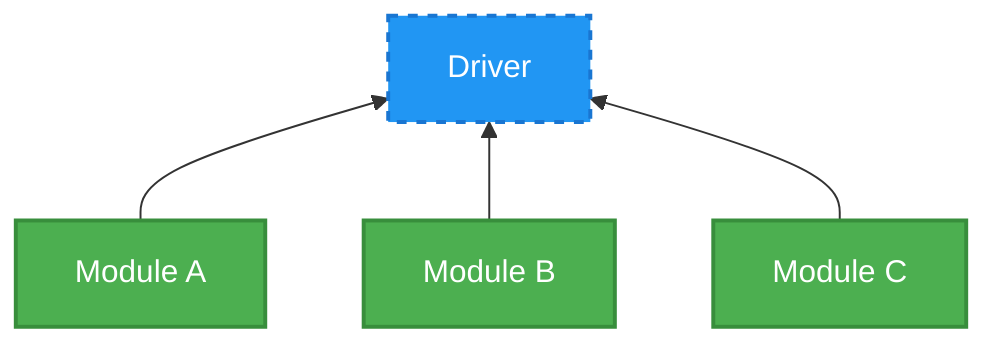
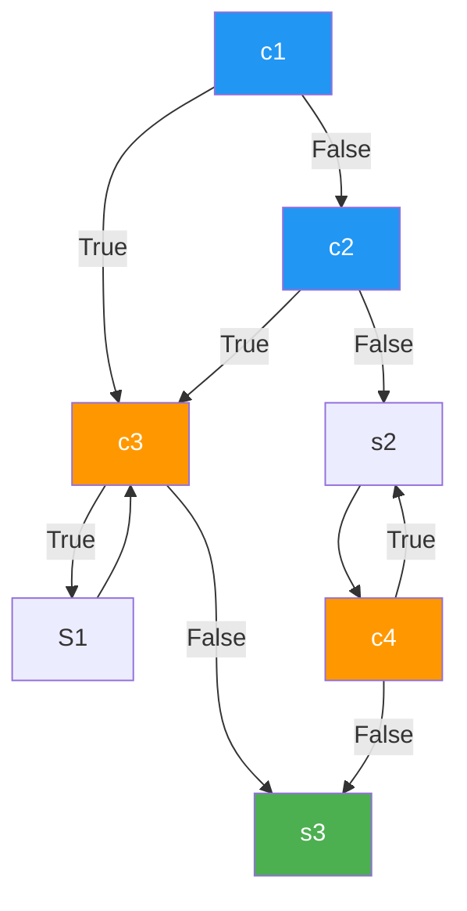
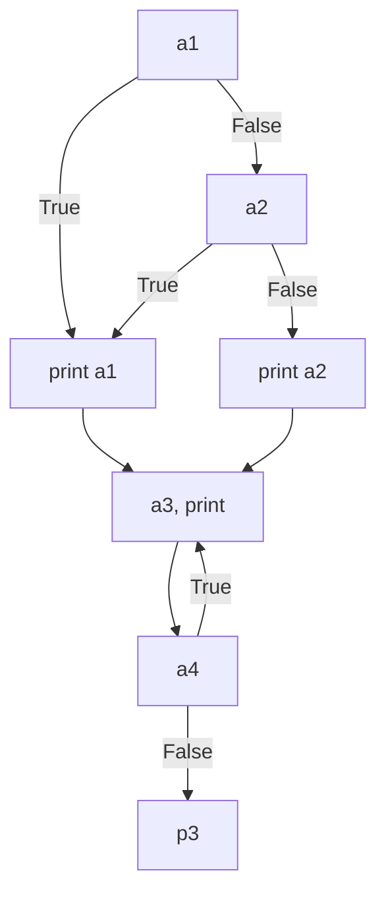
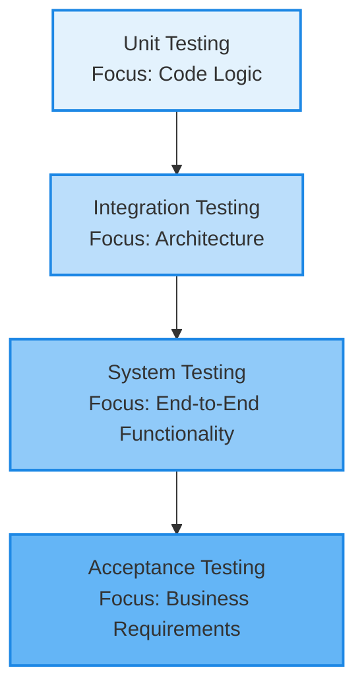

# Software Engineering Question Bank

## Module 6: Software Testing with Quality Assurance

### **Q107. Apply the concept of Cyclomatic Complexity to explain its significance and demonstrate the formula with an example. (2 Marks)**
Cyclomatic complexity is a software metric used to indicate the complexity of a program. It measures the number of linearly independent paths through a program's source code, helping developers understand how difficult the code will be to test and maintain. Higher complexity signifies higher risk of defects. The formula is `V(G) = E - N + 2`, where `E` is the number of edges and `N` is the number of nodes in the control flow graph. For example, if a graph has 4 nodes and 4 edges, its cyclomatic complexity is `V(G) = 4 - 4 + 2 = 2`.

### **Q108. Differentiate between White Box Testing and Black Box Testing by comparing their techniques and use cases. (2 Marks)**
White Box Testing (or structural testing) involves inspecting the internal structure, logic, and code of the application. Techniques include basis path testing and control structure testing. It is mostly used by developers during unit testing. Black Box Testing (or behavioral testing) evaluates the software's functionality without looking at the internal code. Techniques include equivalence partitioning and boundary value analysis. It is typically performed by independent testers during system and acceptance testing to validate requirements.

### **Q109. Apply testing knowledge to illustrate the differences between Black Box and White Box Testing with examples. (2 Marks)**
Black Box Testing focuses on inputs and outputs. For example, testing a login page by entering various combinations of valid and invalid usernames and passwords without knowing how the authentication logic works internally. White Box Testing, on the other hand, examines the internal logic. For the same login module, a white box tester would write test cases to ensure that every `if-else` condition in the authentication code (e.g., checking password length, checking database connectivity) is executed at least once.

### **Q110. Describe the qualities assessed in the Product Transition Phase of McCall's Quality Factor Model. (2 Marks)**
In McCall's Quality Factor Model, the Product Transition phase assesses the ease with which software can be transferred from one environment to another. It includes three key quality factors:
1. **Portability**: The effort required to transfer the program from one hardware or software environment to another.
2. **Reusability**: The extent to which parts of the software can be reused in other applications.
3. **Interoperability**: The effort required to couple one system with another system.

### **Q111. Apply User Acceptance Testing concepts to identify and explain the two tests conducted under UAT. (2 Marks)**
User Acceptance Testing (UAT) ensures the software meets the business requirements and is ready for release. It consists of two primary tests:
1. **Alpha Testing**: Conducted by the user at the developer's site in a controlled environment. The developer is present to observe user behavior and record errors.
2. **Beta Testing**: Conducted by the end-users at their own site without the developer's presence. It represents a real-world testing environment, where users report any bugs they encounter back to the developers.

### **Q112. Illustrate the concept of Equivalence Partitioning in software testing and demonstrate how it reduces the number of test cases. (2 Marks)**
Equivalence Partitioning is a black-box testing technique that divides input data into different equivalent classes or partitions. It assumes that the system will behave the same way for any input within a specific class. Therefore, instead of testing all possible inputs, the tester only needs to select one representative value from each partition. For instance, if an input field accepts ages from 18 to 60, the partitions could be `<18` (invalid), `18-60` (valid), and `>60` (invalid). This drastically reduces the number of test cases while ensuring broad coverage.

### **Q113. Apply the concept of Regression Testing to demonstrate its purpose and usage in a software project. (2 Marks)**
Regression Testing ensures that recent code changes, such as bug fixes or new feature additions, do not adversely affect existing functionalities. It involves re-running previously executed test cases to verify that the software still performs correctly. For example, if a developer adds a new payment method to an e-commerce platform, regression testing is performed to ensure that the previously working checkout processes (like credit card and PayPal payments) still function without any unexpected errors.

### **Q114. Apply system testing knowledge to classify and discuss the types of tests executed during system testing with examples. (5 Marks)**
System testing is a holistic testing phase where the fully integrated software product is evaluated to ensure it meets all specified requirements. It validates the complete and fully integrated software application. The primary types of system testing include:

1. **Recovery Testing**: This tests how well the system recovers from failures, such as hardware crashes or network disruptions. *Example*: Unplugging the network cable during a file transfer to see if the system gracefully pauses and resumes when reconnected.
2. **Security Testing**: This evaluates the system's ability to protect data and resist unauthorized access or malicious attacks. *Example*: Attempting an SQL injection attack on a login screen to check if the database is adequately protected.
3. **Stress Testing**: This involves pushing the system beyond its normal operational capacity to determine its breaking point and observe how it fails. *Example*: Sending 10,000 simultaneous requests to a web server that is only designed to handle 1,000.
4. **Performance Testing**: This measures the system's responsiveness, speed, and stability under a normal or expected workload. *Example*: Measuring the loading time of a webpage to ensure it loads within the required 2 seconds under standard traffic conditions.

These tests ensure the software is robust, secure, and performs optimally in a production-like environment before it reaches the end-users.

### **Q115. Apply McCall's Quality Factor Model to explain what quality means in software and construct a detailed explanation of each quality factor. (5 Marks)**
McCall's Quality Factor Model defines software quality through three distinct perspectives, known as product lifecycle phases. Quality means that the software functions correctly, adapts to change, and easily transitions between environments.

1. **Product Revision (Ability to undergo change)**:
   - *Maintainability*: The effort required to locate and fix an error in an operational program.
   - *Flexibility*: The effort required to modify an operational program to add new features or adapt to new business rules.
   - *Testability*: The effort required to test a program to ensure that it performs its intended function correctly.

2. **Product Transition (Adaptability to new environments)**:
   - *Portability*: The ease with which software can be transferred from one hardware or operating system environment to another.
   - *Reusability*: The extent to which a program or its components can be reused in other applications.
   - *Interoperability*: The effort required to integrate the software with other existing systems.

3. **Product Operations (Characteristics during execution)**:
   - *Correctness*: The extent to which a program fulfills its specification and meets user expectations.
   - *Reliability*: The likelihood that a program will perform its intended function with required precision over time.
   - *Efficiency*: The amount of computing resources (e.g., CPU, memory) and code required to perform its function.
   - *Integrity*: The extent to which access to software or data by unauthorized persons can be controlled.
   - *Usability*: The effort required to learn, operate, prepare input, and interpret output of a program.

### **Q116. Apply integration testing concepts to explain the need for Integration Testing and differentiate between Top-Down and Bottom-Up strategies with diagrams. (5 Marks)**
Integration testing is essential because modules that work perfectly in isolation may fail when connected. It uncovers interface errors, data format mismatches, and global data structure issues.

**Top-Down Integration Strategy**:
This approach tests the top-level modules first, progressively integrating lower-level modules. It requires the use of **stubs** (dummy sub-modules) to simulate lower-level functionality until those modules are integrated.


*Advantage*: Early validation of major control functions.
*Disadvantage*: Requires extensive use of stubs.

**Bottom-Up Integration Strategy**:
This approach begins testing from the lowest level (atomic) modules and works its way up. It uses **drivers** (dummy main programs) to coordinate test case input and output until higher-level modules are integrated.


*Advantage*: Operational software components are tested early; no stubs are needed.
*Disadvantage*: The complete application structure is not validated until the final module is added.

### **Q117. Analyze the effectiveness of Black Box Testing and White Box Testing in detecting different types of software defects. (5 Marks)**
Black Box and White Box testing target different categories of defects, making them complementary rather than mutually exclusive.

**Black Box Testing Effectiveness**:
- *Functional Errors*: Highly effective at identifying missing or incorrect functions because it directly validates requirements without implementation bias.
- *Interface Errors*: Excellent for detecting issues when interacting with external systems or databases.
- *Behavioral Issues*: Good at finding initialization and termination errors, as well as performance bottlenecks under typical user scenarios.
- *Limitation*: It cannot detect hidden logical errors or "dead code" since the internal structure is ignored.

**White Box Testing Effectiveness**:
- *Logical Errors*: Highly effective at finding bugs in loops, conditional statements, and complex algorithms by ensuring every path is executed.
- *Typographical/Syntax Errors*: Good at finding hardcoded values or syntax issues within the source code.
- *Security Vulnerabilities*: Effective at identifying security loopholes at the code level, such as buffer overflows or insecure data handling.
- *Limitation*: It may miss missing functionalities entirely if the requirement was never translated into code, as it only tests what is already written.

By combining both approaches, testing teams can achieve high defect detection rates, addressing both structural integrity and behavioral correctness.

### **Q118. Design a set of Boundary Value Analysis test cases for a login module by applying BVA principles and justifying each test case. (5 Marks)**
Boundary Value Analysis (BVA) focuses on the boundaries of input domains, as errors frequently occur at these edge cases. Let us consider a login module where the "Username" must be exactly 8 to 15 characters long, and the "Password" must be exactly 8 to 20 characters long.

**BVA Principles Applied**:
We test the minimum, just below the minimum, the maximum, and just above the maximum values.

**Test Cases for Username (Valid Range: 8-15 chars)**:
1. *Test Case 1*: Length = 7 characters (Just below minimum). *Expected Outcome*: Reject. *Justification*: To ensure the system correctly rejects inputs that fall short of the lower boundary.
2. *Test Case 2*: Length = 8 characters (Minimum boundary). *Expected Outcome*: Accept. *Justification*: To verify the lower boundary is inclusive.
3. *Test Case 3*: Length = 15 characters (Maximum boundary). *Expected Outcome*: Accept. *Justification*: To verify the upper boundary is inclusive.
4. *Test Case 4*: Length = 16 characters (Just above maximum). *Expected Outcome*: Reject. *Justification*: To ensure the system safely rejects inputs exceeding the upper limit.

**Test Cases for Password (Valid Range: 8-20 chars)**:
5. *Test Case 5*: Length = 7 characters. *Expected Outcome*: Reject.
6. *Test Case 6*: Length = 8 characters. *Expected Outcome*: Accept.
7. *Test Case 7*: Length = 20 characters. *Expected Outcome*: Accept.
8. *Test Case 8*: Length = 21 characters. *Expected Outcome*: Reject.

These test cases rigorously evaluate the boundary conditions, ensuring the login module robustly handles edge-case input sizes.

### **Q119. Analyze the role of SQA activities in ensuring software quality throughout the development lifecycle and examine how they reduce defect density. (5 Marks)**
Software Quality Assurance (SQA) is an umbrella activity applied throughout the entire software process. Its primary role is to provide management with objective insight into processes and work products.

**Key Roles of SQA Activities**:
1. **Process Definition and Auditing**: SQA establishes standard processes (like agile or waterfall) and continuously audits projects to ensure these processes are being followed. This prevents ad-hoc development that typically leads to errors.
2. **Formal Technical Reviews (FTRs)**: SQA mandates peer reviews and walk-throughs of requirements, design documents, and code. Finding defects during the design phase is exponentially cheaper than finding them during testing.
3. **Metrics Collection and Analysis**: SQA gathers data (e.g., defect density, code complexity) to identify weak areas in the development process and recommend improvements.
4. **Testing Strategy Oversight**: SQA ensures that testing is properly planned and executed, verifying that test coverage is adequate.

**Reducing Defect Density**:
Defect density is the number of confirmed bugs in a software module divided by the size of the module. SQA reduces this metric through **defect prevention**. By enforcing FTRs and rigorous requirement analysis, SQA catches ambiguities and logical flaws before they are coded. Furthermore, continuous process improvement driven by SQA ensures that mistakes made in past iterations are structurally prevented in future ones, steadily driving the defect density down.

### **Q120. Draw Control Flow Graph, Find independent Path, Compute Cyclomatic Complexity for the following code: (5 Marks)**
**a.**
```text
If(c1 or c2)
    While(c3) S1;
Else
    do s2; while(c4);
s3;
```

**Control Flow Graph**:


**Cyclomatic Complexity**:
Nodes (N) = 7, Edges (E) = 10
V(G) = E - N + 2 = 10 - 7 + 2 = 5.
Predicate Nodes (P) = 4 (c1, c2, c3, c4). V(G) = P + 1 = 4 + 1 = 5.

**Independent Paths (5 Paths)**:
1. 1(T) -> 3(F) -> 7
2. 1(F) -> 2(T) -> 3(F) -> 7
3. 1(F) -> 2(F) -> 5 -> 6(F) -> 7
4. 1(T) -> 3(T) -> 4 -> 3(F) -> 7
5. 1(F) -> 2(F) -> 5 -> 6(T) -> 5 -> 6(F) -> 7

**b.**
```text
If(a1 or a2)
    print (a1);
Else
    print (a2); 
do(a3)
print(statement) (while(a4);
p3;
```

**Control Flow Graph**:


**Cyclomatic Complexity**:
Nodes (N) = 7, Edges (E) = 9
V(G) = E - N + 2 = 9 - 7 + 2 = 4.
Predicate Nodes = 3 (a1, a2, a4). V(G) = P + 1 = 3 + 1 = 4.

**Independent Paths (4 Paths)**:
1. 1(T) -> 3 -> 5 -> 6(F) -> 7
2. 1(F) -> 2(T) -> 3 -> 5 -> 6(F) -> 7
3. 1(F) -> 2(F) -> 4 -> 5 -> 6(F) -> 7
4. 1(T) -> 3 -> 5 -> 6(T) -> 5 -> 6(F) -> 7

### **Q121. Apply strategic software testing concepts to construct a comprehensive testing approach covering all levels of testing and their roles in quality assurance. (10 Marks)**
A comprehensive software testing strategy requires a systematic, multi-layered approach that progresses from the smallest individual components to the complete, integrated system. This structured progression ensures that defects are caught as early as possible, significantly reducing the cost and effort of remediation, while comprehensively verifying that the final product meets user expectations.

**1. Unit Testing:**
The strategy begins at the core with Unit Testing. Developers isolate the smallest functional units of code—such as individual functions, methods, or classes—and test them to ensure they operate correctly according to their design specifications. This level heavily utilizes White Box testing techniques. By testing units in isolation using mock objects and stubs, developers can pinpoint logical errors, boundary issues, and algorithmic flaws rapidly. In the context of Quality Assurance (QA), unit testing forms the foundational safety net, ensuring the building blocks of the software are structurally sound.

**2. Integration Testing:**
Once individual units are verified, the strategy progresses to Integration Testing. This phase focuses on the interfaces and interactions between the previously tested units when they are combined into larger modules. Even if units function flawlessly on their own, data format mismatches or incorrect API calls can cause failures when they communicate. QA employs strategies like Top-Down or Bottom-Up integration to systematically piece the architecture together. This level primarily aims to uncover architectural and design-level defects, ensuring data flows correctly across module boundaries.

**3. System Testing:**
With the software fully integrated, System Testing is conducted. This is a crucial phase where the complete, end-to-end system is evaluated in an environment that closely mirrors production. This phase predominantly utilizes Black Box testing techniques, validating the software against the initial System Requirements Specification (SRS). QA conducts various specific tests here, including Performance Testing (to ensure response times are acceptable), Security Testing (to check for vulnerabilities), and Recovery Testing (to verify system resilience). The role of QA at this level is to ensure the software functions as a cohesive whole under realistic operational conditions.

**4. Acceptance Testing:**
The final level is Acceptance Testing, which completely shifts the focus from technical correctness to business alignment. Conducted largely by the end-users or client representatives, this testing evaluates whether the software meets the operational and business needs defined at the project's inception. It is typically divided into Alpha Testing (conducted at the developer site) and Beta Testing (conducted in the live user environment). This level provides the ultimate validation for Quality Assurance, ensuring that the delivered product is not only technically sound but also delivers the required value to the business and its users.



### **Q122. Analyze the significance of testing in software development. Examine the two broad categories of testing and compare their techniques, scope, and application scenarios. (10 Marks)**
Testing is an indispensable pillar of software development, serving as the primary mechanism for verifying quality, reliability, and security. Its significance cannot be overstated, as software defects can lead to catastrophic financial losses, compromised sensitive data, and severe reputational damage. Testing provides stakeholders with objective data regarding the product's readiness, mitigates deployment risks, and ensures that the final deliverable genuinely satisfies the specified business and user requirements. 

In the testing domain, activities are generally classified into two broad categories: **White Box Testing** and **Black Box Testing**. These methodologies are complementary, each examining the software from a completely different perspective.

**White Box Testing (Structural Testing):**
White Box Testing is an internal, code-centric approach. Testers (usually developers) have full access to the source code, architecture, and internal workings of the software.
*   **Techniques:** The focus is on exercising internal logic. Techniques include Basis Path Testing (ensuring every independent path is executed), Condition Testing (testing logical decisions), and Loop Testing. Testers write test cases to ensure 100% statement and branch coverage.
*   **Scope:** The scope is highly granular, zooming in on individual algorithms, conditional statements, and data structures within modules.
*   **Application Scenarios:** It is primarily applied during Unit Testing and early Integration Testing. It is highly effective for critical applications where complex logic and algorithms must be flawless, such as financial calculation engines or aerospace control systems.

**Black Box Testing (Behavioral Testing):**
Black Box Testing is an external, requirement-centric approach. Testers interact with the software solely through its user interface or APIs, possessing no knowledge of the internal code structure. The focus is entirely on inputs and outputs.
*   **Techniques:** Testers design test cases based on requirement specifications. Key techniques include Equivalence Partitioning (grouping inputs into valid/invalid classes), Boundary Value Analysis (testing inputs at the edges of valid ranges), and State Transition Testing.
*   **Scope:** The scope is broad and holistic, evaluating the overall behavior, usability, and functionality of complete features or the entire system.
*   **Application Scenarios:** It is prominently utilized during System Testing and User Acceptance Testing (UAT). It is essential for verifying that the software meets user expectations, handles erroneous user inputs gracefully, and integrates smoothly with external systems.

**Comparison Summary:**
While White Box Testing acts like a mechanic examining the intricate parts of a car's engine to ensure structural integrity, Black Box Testing is akin to a driver taking the car for a test drive to evaluate its handling and comfort. White Box ensures the code is built right, whereas Black Box ensures the right product has been built. A robust quality assurance strategy seamlessly integrates both categories to achieve comprehensive defect detection and deliver a superior software product.

### **Q123. Design a test automation strategy for an online banking application. Apply test automation concepts, justify tool selection, and evaluate scenarios suitable for automation. (10 Marks)**
Designing a test automation strategy for a highly sensitive system like an online banking application requires a meticulously planned approach. The primary goals are to ensure absolute transactional accuracy, maintain robust security, ensure high availability, and accelerate the regression testing cycles for rapid deployment of new features.

**1. Test Automation Concepts and Strategy Application:**
The strategy must be built on a layered architecture, often visualized as the Test Automation Pyramid.
*   **Unit Automation (Base Layer):** The foundation consists of thousands of automated unit tests. For a banking app, this means automating the validation of core mathematical algorithms (e.g., interest calculations, currency conversions) and data validation logic. These tests must run continuously via a CI/CD pipeline on every commit.
*   **API/Service Automation (Middle Layer):** The business logic layer is crucial. We must automate testing for the REST APIs that handle fund transfers, balance inquiries, and authentication. API tests execute faster and are less brittle than UI tests.
*   **UI Automation (Top Layer):** We automate only critical, end-to-end business workflows through the graphical interface, such as completing a full fund transfer sequence or adding a new beneficiary. UI tests are kept to a minimum to avoid high maintenance costs due to interface changes.

**2. Tool Selection and Justification:**
Selecting the right tools is paramount for the success of this strategy.
*   **UI Testing:** *Selenium WebDriver* or *Cypress*. Justification: These tools offer robust cross-browser testing capabilities. For a banking app accessed across diverse devices and browsers, verifying consistent UI behavior is essential.
*   **API Testing:** *Postman* or *RestAssured*. Justification: These tools excel at validating complex JSON responses, checking status codes, and managing authentication tokens, which are vital for securing banking endpoints.
*   **Performance/Load Testing:** *JMeter*. Justification: A banking application must handle significant traffic spikes (e.g., end-of-month salary deposits). JMeter simulates thousands of concurrent users to identify bottlenecks.
*   **Security Testing:** *OWASP ZAP*. Justification: Automated vulnerability scanning is non-negotiable to detect common threats like SQL Injection or Cross-Site Scripting (XSS).

**3. Evaluation of Scenarios Suitable for Automation:**
Not everything should be automated. We evaluate scenarios based on Return on Investment (ROI) and criticality.
*   **Highly Suitable Scenarios:** 
    *   *Regression Suites:* The login process, fund transfer workflows, and statement generation. These must be tested repeatedly on every build.
    *   *Data-Driven Tests:* Testing the loan calculator with hundreds of different principal amounts, interest rates, and tenures.
    *   *Cross-Browser Compatibility:* Ensuring the dashboard renders correctly on Chrome, Firefox, Safari, and Edge.
*   **Unsuitable Scenarios:**
    *   *Usability Testing:* Evaluating whether the new dashboard layout feels "intuitive" to an elderly customer. This requires human empathy.
    *   *Exploratory Testing:* Testers actively exploring the application without a script to find edge-case logical flaws.
    *   *One-time features:* Scripts that will only be run once or twice do not justify the cost of automation development.

### **Q124. Apply SQA principles to design a compliance checklist for a software product and demonstrate how SQA ensures adherence to industry standards and regulations. (10 Marks)**
Software Quality Assurance (SQA) is not merely about finding bugs; it is fundamentally about process governance and ensuring that the software development lifecycle aligns with predefined standards, both internal and external. In heavily regulated sectors like healthcare (HIPAA), finance (PCI-DSS), or automotive (ISO 26262), adherence to industry standards is not optional—it is a legal requirement. SQA ensures this adherence through rigorous audits, defined processes, and continuous monitoring.

**The Role of SQA in Ensuring Adherence:**
SQA operates as an independent entity within the project. It maps the requirements of industry standards to actionable software development practices. For instance, if an ISO standard mandates traceability, SQA enforces the use of Requirement Traceability Matrices (RTM). If a security standard requires data protection, SQA ensures that encryption algorithms are verified during code reviews and security testing is mandated in the test plan. SQA achieves this by participating in phase-gate reviews, ensuring that a project cannot proceed to the next phase unless all compliance criteria for the current phase are demonstrably met.

**Design of a Compliance Checklist for a Software Product:**
To operationalize this governance, SQA utilizes comprehensive compliance checklists. Below is a designed checklist applicable to a standard enterprise software product:

**Phase 1: Requirements and Planning Compliance**
- [ ] *Traceability:* Is a Requirement Traceability Matrix (RTM) established linking all business requirements to technical specifications and test cases?
- [ ] *Standard Alignment:* Have relevant regulatory standards (e.g., GDPR for data privacy) been explicitly identified and documented as non-functional requirements?
- [ ] *Risk Management:* Has a formal Risk Management Plan been documented, identifying technical and compliance risks alongside mitigation strategies?

**Phase 2: Design and Architecture Compliance**
- [ ] *Security by Design:* Does the architecture explicitly document data encryption standards (both at rest and in transit) meeting industry requirements?
- [ ] *Design Review:* Has a Formal Technical Review (FTR) of the design document been conducted and signed off by the lead architect and a security specialist?
- [ ] *Modularity & Standards:* Does the design adhere to the organization's approved architectural patterns and coding standards?

**Phase 3: Development and Coding Compliance**
- [ ] *Code Reviews:* Is there evidence of peer code reviews for all critical modules prior to merging into the main branch?
- [ ] *Static Analysis:* Have automated static code analysis tools been run, and have all critical/high vulnerabilities been resolved?
- [ ] *Version Control:* Are all source code changes properly documented in the SCM system with appropriate commit messages linking to requirement IDs?

**Phase 4: Testing and Quality Control Compliance**
- [ ] *Test Coverage:* Does the test execution report demonstrate 100% coverage of the requirements mapped in the RTM?
- [ ] *Security Testing:* Have specialized penetration tests or vulnerability scans been executed and documented?
- [ ] *Defect Resolution:* Are all 'Severity 1' and 'Severity 2' defects formally closed and verified by an independent tester?

**Phase 5: Release and Deployment Compliance**
- [ ] *Configuration Audit:* Has a Functional Configuration Audit (FCA) been performed to ensure the delivered product matches the specifications?
- [ ] *Release Notes:* Are comprehensive release notes and user manuals prepared and reviewed for accuracy?
- [ ] *Final Sign-off:* Has formal acceptance been documented from the primary stakeholders or product owner?

### **Q125. Analyze the role of audits and reviews in the SQA process. Examine how formal technical reviews and software audits contribute to defect prevention and process improvement. (10 Marks)**
Audits and reviews constitute the backbone of Software Quality Assurance (SQA). While dynamic testing attempts to find defects in executable code, audits and reviews proactively seek to identify issues in the work products (documents, models, source code) *before* they manifest as costly operational bugs. They act as critical quality filters applied at every phase of the Software Development Life Cycle (SDLC).

**Formal Technical Reviews (FTRs):**
An FTR is a structured, rigorous peer-review process applied to software artifacts, such as requirement specifications, design documents, and code. 

*   **Role and Contribution to Defect Prevention:** The primary objective of an FTR is defect discovery. Research consistently shows that finding an error during the design phase is magnitudes cheaper than finding it during system testing. By gathering a team of peers (architects, developers, testers) to scrutinize a design document, logical flaws, missing requirements, and architectural bottlenecks are exposed immediately. FTRs prevent defects from cascading down the lifecycle; a fixed design error prevents the creation of flawed code.
*   **Contribution to Process Improvement:** FTRs serve as an excellent knowledge-sharing mechanism. Junior developers learn best practices from senior reviewers, which elevates the overall skill level of the team and prevents future occurrences of similar mistakes. Furthermore, FTRs provide a mechanism to verify that software adheres to established organizational standards.

**Software Audits:**
While FTRs focus on the technical correctness of the product, software audits focus on the process and overall project governance. An audit is an independent examination to assess compliance with software requirements, specifications, baselines, and established quality standards.

*   **Role and Contribution to Defect Prevention:** Audits ensure that the defined quality processes (which are designed to prevent defects) are actually being followed. For instance, a Configuration Management Audit verifies that the correct versions of code are being built. If developers are bypassing version control procedures, an audit will flag this non-compliance. By enforcing process discipline, audits indirectly prevent the chaos and version-mismatch defects that occur in poorly managed projects.
*   **Contribution to Process Improvement:** Audits provide management with objective, quantitative data about project health. By identifying recurring non-compliance issues (e.g., test plans consistently being written too late), management can trace the root cause and refine the SDLC processes. Audits evaluate the efficacy of the SQA plan itself, driving a cycle of continuous process improvement. 

In summary, FTRs act as a microscopic lens, scrutinizing technical artifacts to catch logical errors early, while software audits act as a macroscopic lens, ensuring the entire development machine is operating according to the defined quality standards.

### **Q126. Design a comprehensive Black Box Testing plan for a weather forecasting application using Equivalence Partitioning and Boundary Value Analysis to develop a complete test suite. (10 Marks)**
A Weather Forecasting Application typically allows a user to input a location (City Name or ZIP Code) to retrieve current weather data, forecasts, and temperature alerts. To ensure robustness without writing an infinite number of test cases, we design a Black Box test suite utilizing Equivalence Partitioning (EP) and Boundary Value Analysis (BVA).

**1. Identification of Input Domains:**
Let us focus on two primary input fields for this application:
*   **Input A: ZIP Code Search** (Valid format: Exactly 5 numeric digits).
*   **Input B: Temperature Alert Setting** (Valid range: -50°C to +50°C).

**2. Equivalence Partitioning (EP) Design:**
EP divides the input data into partitions where the system is expected to exhibit the same behavior. We need to test one representative value from each partition.

*   **For ZIP Code (5 numeric digits):**
    *   *Partition 1 (Valid):* Exactly 5 numeric digits (e.g., 90210).
    *   *Partition 2 (Invalid - Length):* Less than 5 digits (e.g., 1234).
    *   *Partition 3 (Invalid - Length):* More than 5 digits (e.g., 123456).
    *   *Partition 4 (Invalid - Type):* Contains alphabetic or special characters (e.g., 12A45, 902!0).

*   **For Temperature Alert (-50 to +50):**
    *   *Partition 1 (Valid):* A value within the range (e.g., 20).
    *   *Partition 2 (Invalid):* A value less than -50 (e.g., -60).
    *   *Partition 3 (Invalid):* A value greater than +50 (e.g., 60).
    *   *Partition 4 (Invalid):* Non-numeric characters (e.g., "Cold").

**3. Boundary Value Analysis (BVA) Design:**
Errors frequently occur at the edges of equivalence classes. BVA targets the boundaries: minimum, just below minimum, maximum, and just above maximum.

*   **For Temperature Alert (-50 to +50):**
    *   Lower Boundary: -51, -50, -49
    *   Upper Boundary: +49, +50, +51

**4. The Comprehensive Test Suite:**

| Test ID | Technique | Input Field | Test Data | Expected Outcome | Justification / Focus |
| :--- | :--- | :--- | :--- | :--- | :--- |
| **TC01** | EP | ZIP Code | `10001` | System displays weather for ZIP 10001. | Valid class representation. |
| **TC02** | EP | ZIP Code | `123` | Error: "Invalid ZIP. Must be 5 digits." | Invalid class (too short). |
| **TC03** | EP | ZIP Code | `987654` | Error: "Invalid ZIP. Must be 5 digits." | Invalid class (too long). |
| **TC04** | EP | ZIP Code | `12B45` | Error: "Numeric values only." | Invalid class (wrong data type). |
| **TC05** | BVA | Temp Alert | `-51` | Error: "Value out of range." | Just below lower boundary. |
| **TC06** | BVA | Temp Alert | `-50` | Alert set successfully for -50°C. | Exact minimum boundary. |
| **TC07** | BVA | Temp Alert | `-49` | Alert set successfully for -49°C. | Just above lower boundary. |
| **TC08** | EP | Temp Alert | `0` | Alert set successfully for 0°C. | Representative valid interior value. |
| **TC09** | BVA | Temp Alert | `49` | Alert set successfully for 49°C. | Just below upper boundary. |
| **TC10** | BVA | Temp Alert | `50` | Alert set successfully for 50°C. | Exact maximum boundary. |
| **TC11** | BVA | Temp Alert | `51` | Error: "Value out of range." | Just above upper boundary. |
| **TC12** | EP | Temp Alert | `ABC` | Error: "Please enter numeric values." | Invalid class (wrong data type). |

By strategically applying EP and BVA, this test plan guarantees that the weather forecasting application handles typical user inputs, boundary conditions, and erroneous data efficiently and comprehensively.

### **Q127. Analyze and construct a complete set of test cases for a student registration application using Equivalence Partitioning and Boundary Value Analysis. Justify each test case. (10 Marks)**
A Student Registration Application is tasked with collecting and validating sensitive and critical information to enroll a user in an academic institution. For this analysis, we will focus on two core input fields that require rigorous validation:
1.  **Age Field:** The student must be between 18 and 25 years old (inclusive) to register.
2.  **Student ID Field:** Must be exactly an 8-character alphanumeric string.

To thoroughly test these fields while minimizing redundancy, we utilize Equivalence Partitioning (EP) to cover broad classes of data and Boundary Value Analysis (BVA) to test edge cases where off-by-one errors typically manifest.

**Step 1: Domain Analysis and Partitioning**

**For Age Field (Valid Range: 18 - 25):**
*   *EP Classes:*
    *   Class 1 (Valid): Ages 18 to 25.
    *   Class 2 (Invalid - Underage): Ages < 18.
    *   Class 3 (Invalid - Overage): Ages > 25.
    *   Class 4 (Invalid - Format): Non-integer values (e.g., "Twenty", 20.5).
*   *BVA Points:* 17, 18, 19, 24, 25, 26.

**For Student ID Field (Valid Format: 8 Alphanumeric Characters):**
*   *EP Classes:*
    *   Class 1 (Valid): Exactly 8 alphanumeric characters.
    *   Class 2 (Invalid): Less than 8 characters.
    *   Class 3 (Invalid): More than 8 characters.
    *   Class 4 (Invalid): Contains special characters (e.g., @, #, $).

**Step 2: Construction of the Complete Test Case Suite**

| Test Case ID | Test Technique | Field Under Test | Input Data | Expected Result | Justification |
| :--- | :--- | :--- | :--- | :--- | :--- |
| **TC-AGE-01** | BVA | Age | `17` | Reject. Error: "Must be at least 18." | Tests the boundary just below the valid minimum to ensure under-aged users are blocked. |
| **TC-AGE-02** | BVA | Age | `18` | Accept. | Tests the exact lower boundary to ensure it is inclusive. |
| **TC-AGE-03** | BVA | Age | `19` | Accept. | Tests the value just above the lower boundary. |
| **TC-AGE-04** | EP | Age | `21` | Accept. | Representative valid value from the middle of the equivalence class. |
| **TC-AGE-05** | BVA | Age | `24` | Accept. | Tests the value just below the upper boundary. |
| **TC-AGE-06** | BVA | Age | `25` | Accept. | Tests the exact upper boundary to ensure it is inclusive. |
| **TC-AGE-07** | BVA | Age | `26` | Reject. Error: "Maximum age is 25." | Tests the boundary just above the valid maximum to ensure over-aged users are blocked. |
| **TC-AGE-08** | EP | Age | `ABC` | Reject. Error: "Enter a valid number." | Validates that the system correctly rejects non-numeric input types. |
| **TC-ID-01** | EP/BVA | Student ID | `A1B2C3D` (7 chars) | Reject. Error: "ID must be 8 characters." | Tests the boundary just below the required length (Invalid EP class). |
| **TC-ID-02** | EP/BVA | Student ID | `A1B2C3D4` (8 chars) | Accept. | Tests the exact required length with valid alphanumeric data (Valid EP class). |
| **TC-ID-03** | EP/BVA | Student ID | `A1B2C3D4E` (9 chars) | Reject. Error: "ID must be 8 characters." | Tests the boundary just above the required length (Invalid EP class). |
| **TC-ID-04** | EP | Student ID | `A1B2C#D4` | Reject. Error: "Special characters not allowed." | Validates the system handles correct length but invalid character types. |

**Analysis and Conclusion:**
This test suite is highly efficient. By combining EP and BVA, we have reduced an infinite number of possible age and ID combinations down to just 12 targeted test cases. This suite guarantees that the core logic handling the boundaries (the `>` vs `>=` operators in the code) is thoroughly tested, while also ensuring that entirely invalid data classes are gracefully rejected, resulting in a highly stable registration module.
