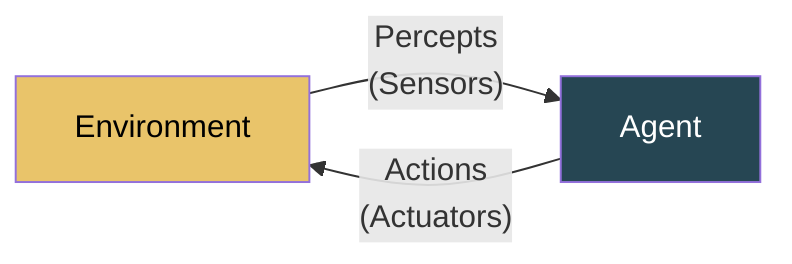

# AI ISE 1 — Short Notes (Question Bank Focused)

> Based on 62 questions covering Chapters 1, 2, and 3. Question numbers referenced throughout.

---

# Chapter 1: Introduction to AI & Intelligent Agents

*Questions 1–21*

---

## Q1: Define Artificial Intelligence

**AI** is the branch of computer science that builds systems capable of performing tasks requiring human intelligence — reasoning, learning, problem-solving, perception, and decision-making.

**Four Approaches:**

| | Human-based | Ideal/Rational |
|---|---|---|
| **Thinking** | Cognitive modeling (think like humans) | Laws of thought (logical reasoning) |
| **Acting** | Turing Test (act like humans) | **Rational Agent** (act for best outcome) ✦ |

✦ The **rational agent** approach dominates modern AI.

---

## Q2, Q11, Q16: Applications of AI

| Domain | Application | Techniques |
|--------|------------|------------|
| **Healthcare** | Medical diagnosis, drug discovery | Expert systems, deep learning |
| **Finance** | Fraud detection, algorithmic trading | ML, Bayesian methods |
| **Transportation** | Self-driving cars, route planning | Computer vision, RL, search |
| **Gaming** | Chess/Go agents, NPC behavior | Minimax, alpha-beta, RL |
| **NLP** | Translation, chatbots, sentiment | Transformers, attention |
| **Robotics** | Industrial automation, drones | Planning, perception |
| **E-commerce** | Recommendations, demand forecasting | Collaborative filtering |
| **Cybersecurity** | Intrusion detection, malware | Anomaly detection, NN |
| **Education** | Intelligent tutoring systems | Knowledge representation |
| **Agriculture** | Crop disease detection | Computer vision, IoT+ML |

**Societal Impact:** Automation of jobs, improved healthcare access, privacy concerns, bias in decision-making, environmental monitoring, accessibility tools.

---

## Q3, Q8: AI Problems

An **AI problem** is a task that is computationally complex, involves large search spaces, uncertainty, or requires human-like intelligence.

| Property | Description | Example |
|---|---|---|
| **Large search space** | Too many states to enumerate | Chess: ~10⁴⁷ states |
| **Uncertainty** | Incomplete/noisy information | Medical diagnosis |
| **Non-determinism** | Unpredictable action outcomes | Robot navigation |
| **Dynamic environment** | Environment changes during deliberation | Self-driving |
| **Multi-agent** | Multiple actors simultaneously | Game playing |

**Categories:** Mundane tasks (perception, NLP, common sense), Formal tasks (games, math, logic), Expert tasks (diagnosis, financial analysis, engineering design).

---

## Q4, Q5, Q9, Q10, Q15: Problem Formulation & Search

### Problem Formulation (Q4, Q9)

Translating a real-world problem into a formal representation with 5 components:

| Component | Description | Romania Map Example |
|---|---|---|
| **Initial State** | Starting state | In(Arad) |
| **Actions** | Available actions in state s | {Go(Sibiu), Go(Timisoara), Go(Zerind)} |
| **Transition Model** | RESULT(s, a) → s' | RESULT(In(Arad), Go(Sibiu)) = In(Sibiu) |
| **Goal Test** | Is this the goal? | In(Bucharest)? |
| **Path Cost** | Numeric cost of path, g(n) | Sum of road distances |

### Search as Problem-Solving (Q5, Q10, Q15)


**State Space** = all reachable states from initial state (graph: nodes=states, edges=actions)

**Key Terminology:**
- **Frontier (Open List):** Nodes available for expansion
- **Explored (Closed List):** Already expanded nodes
- **Solution:** Path from initial to goal state
- **Optimal Solution:** Lowest-cost solution

**Performance Metrics:** Completeness, Optimality, Time Complexity, Space Complexity — measured using **b** (branching factor), **d** (depth of shallowest goal), **m** (max depth).

**AI Techniques for Problem Solving (Q5):** Search algorithms, Knowledge representation, Logic & reasoning, Machine learning, Neural networks, Probabilistic reasoning, Evolutionary computation.

---

## Q6, Q7, Q12, Q13, Q17, Q20, Q21: Intelligent Agents

### Definition (Q6)

An **intelligent agent** perceives its environment through **sensors** and acts upon it through **actuators**. A **rational agent** selects actions that maximize expected **performance measure**.



**Agent = Architecture + Program** | **Agent Function:** f: P* → A (percept sequence to actions)

> **Rationality ≠ Omniscience.** A rational agent maximizes *expected* performance based on *available* information.

### Structure of Intelligent Agents (Q12, Q21)

The agent program runs on the agent architecture (physical system). It takes percept input and produces action output. Internally it may maintain state, goals, utility functions, or learning components.

### Types of Agents (Q13, Q17, Q20, Q21)

| Type | How It Works | Memory | Best For | Example |
|------|-------------|--------|----------|---------|
| **Simple Reflex** | If percept=X → do Y (condition-action rules) | None | Fully observable environments | Thermostat |
| **Model-Based Reflex** | Maintains internal state + transition/sensor models | ✅ Internal state | Partially observable | Self-driving car tracking traffic |
| **Goal-Based** | Uses goals + search/planning to decide actions | ✅ State + Goals | Flexible goal-directed tasks | GPS navigation |
| **Utility-Based** | Utility function U(s) ranks states; maximizes E[U] | ✅ State + Utility | Trade-offs, conflicting goals | Route: minimize time + fuel + tolls |
| **Learning** | Improves over time via critic + learning element | ✅ Adapts | Unknown/changing environments | Spam filter |

**Learning Agent Components:**
- **Performance Element** — selects actions
- **Critic** — evaluates performance against standard
- **Learning Element** — modifies performance element
- **Problem Generator** — suggests exploratory actions

---

## Q7, Q18: Agent Environments

### Definition (Q7)

An **agent environment** is everything external to the agent that it perceives and acts upon. It defines the "world" in which the agent operates.

### Properties (Q18)

| Property | Options | Example |
|---|---|---|
| **Observable** | Fully / Partially | Chess=Fully; Poker=Partially |
| **Deterministic** | Deterministic / Stochastic | Vacuum=Deterministic; Dice=Stochastic |
| **Episodic** | Episodic / Sequential | Spam filter=Episodic; Chess=Sequential |
| **Static** | Static / Dynamic / Semi-dynamic | Crossword=Static; Traffic=Dynamic; Chess with clock=Semi-dynamic |
| **Discrete** | Discrete / Continuous | Chess=Discrete; Self-driving=Continuous |
| **Agents** | Single / Multi | Crossword=Single; Chess=Multi |

**Real-world examples:**

| Environment | Obs. | Det. | Ep. | Static | Disc. | Agents |
|---|---|---|---|---|---|---|
| Self-driving car | Partial | Stochastic | Sequential | Dynamic | Continuous | Multi |
| Chess (clock) | Full | Deterministic | Sequential | Semi-dynamic | Discrete | Multi |
| Medical Diagnosis | Partial | Stochastic | Sequential | Dynamic | Continuous | Single |
| Vacuum World | Full | Deterministic | Episodic | Static | Discrete | Single |

---

## Q14, Q19: PEAS Representation

**P**erformance, **E**nvironment, **A**ctuators, **S**ensors — specifies the task environment for agent design.

| Agent | Performance | Environment | Actuators | Sensors |
|---|---|---|---|---|
| **Self-Driving Taxi** | Safety, speed, legal, profit | Roads, traffic, pedestrians, weather | Steering, brake, accelerator, signal | Camera, LIDAR, GPS, speedometer |
| **Medical Diagnosis** | Patient health, minimize cost | Patient, hospital, staff | Display (tests, diagnoses) | Keyboard, patient history DB |
| **Vacuum Cleaner** | Cleanliness, efficiency, battery | Room, floor, furniture, dust | Wheels, brush, suction | Dirt sensor, bump sensor, camera |
| **Chess Agent** | Winning, time management | Board, opponent, clock | Move-making interface | Board state input |
| **Tutoring System** | Score improvement, engagement | Student, exercises, screen | Display (hints, exercises) | Keyboard, test scores |

---

# Chapter 2: Uninformed Search & Adversarial Search

*Questions 22–42*

---

## Q22: Uninformed Search — Definition

**Uninformed (blind) search** has **no information about states beyond the problem definition** — it cannot estimate how close a state is to the goal. It only generates successors and checks for goal states.

**Role in AI:** Provides baseline, guaranteed strategies for finding solutions when no domain knowledge is available.

---

## Q23, Q24, Q25, Q26: BFS, DFS, UCS

### BFS (Q23)

- **Strategy:** Expand shallowest node first. **Queue (FIFO).**
- **Complete? ✅ Yes** (if b is finite) — it systematically explores every level, so it WILL find a solution if one exists.
- **Optimal?** ✅ (if step costs equal)
- **Time/Space:** O(b^d) — **memory is the bottleneck**

### DFS (Q24)

- **Strategy:** Expand deepest node first. **Stack (LIFO).**
- **Limitation (Q24):** Can get stuck in **infinite loops** in infinite state spaces. Not complete without cycle detection. Also **not optimal** — may find a deeper solution first.
- **Time:** O(b^m) | **Space:** O(b·m) — very memory efficient

### UCS (Q25)

- **Strategy:** Expand node with **lowest path cost g(n)**. **Priority queue.**
- **Path cost role (Q25):** g(n) ensures UCS always expands the cheapest path first, guaranteeing the optimal solution is found before any costlier alternative.
- **Complete? ✅** | **Optimal? ✅** (if step costs ≥ ε > 0)

### BFS vs DFS Memory (Q26)

| | BFS | DFS |
|---|---|---|
| **Space** | O(b^d) — stores ALL nodes at current level + frontier | O(b·m) — stores only current path + siblings |
| **For b=10, d=12** | ~10¹² nodes (terabytes) | ~120 nodes (trivial) |

> DFS is far more memory-efficient, but BFS guarantees optimal solution.

---

## Q27, Q28: DLS & Iterative Deepening

### DLS (Q27)

DFS with a **depth limit ℓ** — nodes at depth ℓ are not expanded.
- **Purpose:** Prevents infinite looping in DFS.
- **Problem:** If ℓ < d (goal depth), solution is missed. If ℓ >> d, wastes time.
- **Not complete, not optimal.**

### Iterative Deepening DFS — IDDFS (Q28, Q29, Q37)

Runs DLS with ℓ = 0, 1, 2, 3... until goal found.

**Drawback (Q28):** Redundant re-expansion of nodes at shallower levels. However, overhead is small (~11% for b=10) since deeper levels dominate.

**Q29 — Unknown depth, large branching factor → IDDFS is best:**
- ✅ Complete (like BFS)
- ✅ Optimal (equal step costs)
- Space: O(b·d) — like DFS
- Doesn't require knowing solution depth in advance

**Algorithmic Workflow (Q37):**
```
for depth_limit = 0, 1, 2, ...
    result = DLS(problem, depth_limit)
    if result ≠ cutoff then return result
```

---

## Q30: Bidirectional Search

Two simultaneous searches — **forward from start**, **backward from goal** — meet in middle.

- **Time/Space:** O(b^(d/2)) vs O(b^d) for BFS — **massive speedup**
- For b=10, d=6: BFS=1,000,000 nodes; Bidirectional=2,000 nodes
- **Requires:** Goal must be explicitly known; must be able to generate predecessors

---

## Q31, Q38: Comparing Uninformed Techniques

| | BFS | DFS | UCS | DLS | IDDFS | Bidirectional |
|---|---|---|---|---|---|---|
| **Complete** | ✅ | ❌ | ✅ | ❌ | ✅ | ✅ |
| **Optimal** | ✅* | ❌ | ✅ | ❌ | ✅* | ✅* |
| **Time** | O(b^d) | O(b^m) | O(b^(1+⌊C*/ε⌋)) | O(b^ℓ) | O(b^d) | O(b^(d/2)) |
| **Space** | O(b^d) | O(b·m) | O(b^(1+⌊C*/ε⌋)) | O(b·ℓ) | O(b·d) | O(b^(d/2)) |

*When step costs equal. b=branching, d=goal depth, m=max depth, ℓ=limit, C*=optimal cost, ε=min step cost.

**How complexity affects choice (Q31):** Memory-constrained → DFS/IDDFS. Need optimality → BFS/UCS. Large d, unknown → IDDFS. Known goal state → Bidirectional.

**Real-world importance (Q32, Q41):** UCS essential for weighted graphs (GPS routing, network routing) where costs differ. Uninformed strategies provide guaranteed baselines when no heuristic is available.

---

## Q33, Q34, Q35, Q36, Q39, Q40: Adversarial Search

### Game Playing (Q33)

Games are **multi-agent adversarial environments** — one player's gain = other's loss.

**Game = {S₀, PLAYER(s), ACTIONS(s), RESULT(s,a), TERMINAL-TEST(s), UTILITY(s,p)}**

### Minimax Algorithm (Q34)

- MAX tries to **maximize** utility; MIN tries to **minimize** it.
- Computes optimal strategy assuming **both players play optimally**.

```
MINIMAX(s) = UTILITY(s) if terminal
           = max over children if MAX's turn
           = min over children if MIN's turn
```

**Why Minimax can be slow (Q34):**
- Time: **O(b^m)** — exponential in game depth
- For chess: b≈35, m≈100 → 10¹⁵⁴ nodes — impractical
- No pruning → explores every node including irrelevant subtrees
- **Solutions:** Alpha-beta pruning, depth cutoff + evaluation function, move ordering

### Alpha-Beta Pruning (Q35, Q39)

Prunes branches that **cannot affect the final decision**. Same result as minimax, fewer nodes.

**Parameters:**
- **α** = best MAX can guarantee (init −∞), updated at MAX nodes
- **β** = best MIN can guarantee (init +∞), updated at MIN nodes
- **Prune when α ≥ β**

### Solved Example (Q35, Q39)

```
            MAX (A)
           /       \
      MIN (B)     MIN (C)
      /    \       /    \
    MAX(D) MAX(E) MAX(F) MAX(G)
    / \    / \    / \    / \
   3   5  6   9  1   2  0   7
```

| Step | Node | Type | Value | α | β | Action |
|------|------|------|-------|---|---|--------|
| 1 | D:left=3 | MAX | 3 | 3 | ∞ | α←3 |
| 2 | D:right=5 | MAX | 5 | 5 | ∞ | D=max(3,5)=**5** |
| 3 | B gets D=5 | MIN | — | -∞ | 5 | β←5 |
| 4 | E:left=6 | MAX | 6 | 6 | 5 | **α(6)≥β(5) → PRUNE 9** |
| 5 | E=6, B=min(5,6) | MIN | **5** | — | — | B=**5** |
| 6 | A gets B=5 | MAX | — | 5 | ∞ | α←5 |
| 7 | F:left=1 | MAX | 1 | 1 | ∞ | — |
| 8 | F:right=2 | MAX | 2 | — | — | F=max(1,2)=**2** |
| 9 | C gets F=2 | MIN | — | 5 | 2 | β←2, **α(5)≥β(2) → PRUNE G** |
| 10 | C=2, A=max(5,2) | MAX | **5** | — | — | **Root = 5** |

**Pruned:** Node 9 (child of E), entire subtree G (nodes 0, 7).

**Performance:**
- Best case (optimal ordering): **O(b^(m/2))** — doubles solvable depth
- Worst case: O(b^m)
- **Move ordering** is critical for maximizing pruning

### Strategy Design (Q36, Q40, Q42)

For large branching + time limit: **Alpha-Beta + depth cutoff + evaluation function + iterative deepening.** Use move ordering (killer heuristic, history heuristic) to maximize pruning.

---

# Chapter 3: Informed Search Techniques

*Questions 43–62*

---

## Q43, Q44, Q47, Q54: Heuristics

### Definition (Q43, Q44)

**Informed search** uses **domain-specific knowledge** (heuristics) to guide search toward the goal, reducing the number of nodes expanded compared to uninformed search.

A **heuristic function h(n)** estimates the cost from n to the nearest goal.

**Desirable properties (Q44):**
- **Admissible:** h(n) ≤ h*(n) — never overestimates true cost
- **Consistent:** h(n) ≤ c(n,a,n') + h(n') — triangle inequality
- **Informative:** Higher h values (while still admissible) → fewer nodes expanded

### Informed vs Uninformed (Q47)

| | Uninformed | Informed |
|---|---|---|
| **Knowledge** | No domain knowledge | Uses heuristic h(n) |
| **Node Expansion** | Systematic, explores widely | Directed toward goal, fewer expansions |
| **Examples** | BFS, DFS, UCS | A*, Greedy BFS, Hill Climbing |
| **Efficiency** | O(b^d) typically | Much better with good heuristic |

**Heuristic accuracy impact (Q54):** Better heuristic → fewer nodes expanded → faster solution. Perfect h = go straight to goal. Poor h = degrades to uninformed search. h must remain admissible for A* optimality.

---

## Q45, Q51: Hill Climbing

**Strategy:** Always move to the highest-valued neighbor. No lookahead.

```
current = initial_state
loop:
    neighbor = best successor of current
    if VALUE(neighbor) ≤ VALUE(current): return current
    current = neighbor
```

### Problems (Q45, Q51)

| Problem | Description | Solution |
|---|---|---|
| **Local Maximum** | Peak that isn't global best; all neighbors worse | Random restart, simulated annealing |
| **Plateau** | Flat region; all neighbors have equal value — no direction | Sideways moves (limited), random restart |
| **Ridge** | Narrow elevated path; steep sides but ascent only along ridge | Better neighbor generation |

**Variants:** Simple HC (first better), Steepest-Ascent (examine all, pick best), Stochastic HC (random uphill), Random-Restart HC (multiple runs).

> HC is fast and memory-efficient O(1) but **incomplete** and **not optimal**.

---

## Q46, Q52: Simulated Annealing

**Idea:** Hill climbing + **random bad moves** with decreasing probability. Inspired by metallurgical annealing.

### Temperature Role (Q46)

- **High T** → accept most bad moves (wide exploration), P ≈ 1
- **Low T** → reject most bad moves (local exploitation), P ≈ 0
- **T = 0** → pure hill climbing

**Acceptance:** P(accept worse) = e^(ΔE/T), where ΔE = VALUE(next) - VALUE(current) < 0

### How It Avoids Local Optima (Q52)

By accepting worse moves with probability e^(ΔE/T), the algorithm can **escape local maxima**. Early on (high T), it freely explores. As T decreases, it settles into the best found region. Theoretically converges to global optimum with infinitely slow cooling.

| T | ΔE = -3 | P(accept) |
|---|---|---|
| 100 | e^(-0.03) | 0.97 (almost always) |
| 10 | e^(-0.3) | 0.74 |
| 1 | e^(-3) | 0.05 |
| 0.1 | e^(-30) | ≈ 0 (never) |

---

## Q48, Q49, Q53: Best-First Search & A*

### Best-First Search (Q48, Q53)

Expands node with best **evaluation function f(n)**. Uses a **priority queue**.

**Greedy Best-First:** f(n) = h(n) — expand node closest to goal (heuristic only).

| vs BFS | Greedy Best-First |
|---|---|
| Expands by **level** (shallowest) | Expands by **heuristic** (closest to goal) |
| Guarantees optimal | **Not optimal** — ignores actual cost |
| Explores all at level | Directed, often much faster |

**Evaluation function example (Q53):** For route-finding, h(n) = straight-line distance to goal. Node with smallest h is expanded first.

### A* Search (Q49, Q50, Q55, Q56, Q59)

**f(n) = g(n) + h(n)** — combines actual cost + estimated remaining cost.

**Advantage over Greedy (Q49):** A* considers **actual cost g(n)**, preventing it from being misled by a low heuristic on an expensive path. A* is **optimal**; Greedy is not.

**Admissible heuristic effect (Q50):** If h(n) always underestimates → A* is guaranteed to find the optimal solution. It will never prune the optimal path because f(optimal_path) ≤ f(any_other_path).

### Solved Example — A* (Q55, Q59)

**Graph:**
```
        S
       / | \
     1/  5|  \8
     /   |   \
    A    B    C
    |   / \    |
   3|  2|  \6  |3
    |  / |   \  |
    D    E    G
     \       ↑
      4\    /1
        \ /
         F
```

**h(n):** h(S)=8, h(A)=6, h(B)=5, h(C)=3, h(D)=4, h(E)=2, h(F)=1, h(G)=0

| Step | OPEN List (f=g+h) | CLOSED | Expand | g | f |
|------|-------------------|--------|--------|---|---|
| 0 | {S:0+8=8} | {} | — | — | — |
| 1 | {**A:1+6=7**, B:5+5=10, C:8+3=11} | {S} | S | 0 | 8 |
| 2 | {D:4+4=8, B:10, C:11} | {S,A} | A | 1 | 7 |
| 3 | {**F:8+1=9**, B:10, C:11} | {S,A,D} | D | 4 | 8 |
| 4 | {**G:9+0=9**, B:10, C:11} | {S,A,D,F} | F | 8 | 9 |
| 5 | — | {S,A,D,F,G} | **G** | **9** | **9** |

**Path:** S → A → D → F → G | **Cost = 9** ✓

### A* Properties

| Property | Value |
|---|---|
| Complete | ✅ Yes |
| Optimal | ✅ Yes (if h is admissible) |
| Time | O(b^d) worst, much better with good h |
| Space | O(b^d) — main limitation |

**For large state space + strict optimality (Q56):** A* is the best choice. For relaxing optimality for speed, use Greedy BFS or weighted A* (f = g + w·h, w > 1).

---

## Q57, Q62: Backtracking for CSP

### CSP Definition

**Variables** X₁..Xₙ, **Domains** D₁..Dₙ, **Constraints** on valid combinations.

### Backtracking Algorithm (Q57)

```
function BACKTRACK(assignment, csp):
    if assignment is complete: return assignment
    var = SELECT-UNASSIGNED-VARIABLE(csp)
    for value in ORDER-DOMAIN-VALUES(var, assignment, csp):
        if value is consistent with constraints:
            assign var = value
            result = BACKTRACK(assignment, csp)
            if result ≠ failure: return result
            remove var = value     ← BACKTRACK
    return failure
```

**Example — Map Coloring (3 colors: R, G, B):**

| Step | Variable | Try | OK? | Result |
|---|---|---|---|---|
| 1 | WA | R | ✅ | Assign |
| 2 | NT | R | ❌ adj WA | Try G |
| 3 | NT | G | ✅ | Assign |
| 4 | SA | R ❌, G ❌ | B | ✅ Assign |
| 5 | Q | R | ✅ | Assign |
| 6 | NSW | G | ✅ | Assign |
| 7 | V | R | ✅ | Assign |

**Improving performance (Q62):**
- **MRV:** Pick variable with fewest legal values (fail-first)
- **LCV:** Pick value that constrains neighbors least
- **Forward Checking:** After assignment, remove inconsistent values from neighbors
- **Arc Consistency (AC-3):** Propagate constraints across all arcs

**Poor heuristic impact (Q62):** Wrong variable/value ordering → exponential blowup. Poor constraint propagation → late failure detection → excessive backtracking.

---

## Q58: Complete Comparison — Informed Search

| Algorithm | Complete | Optimal | Time | Space | f(n) |
|---|---|---|---|---|---|
| **Greedy BFS** | ❌ | ❌ | O(b^m) | O(b^m) | h(n) |
| **A*** | ✅ | ✅ | O(b^d) | O(b^d) | g(n)+h(n) |
| **Hill Climbing** | ❌ | ❌ | varies | O(1) | h(n) |
| **Simulated Annealing** | ❌† | ❌† | varies | O(1) | h(n)+random |

†Theoretical guarantee only with infinite cooling time.

---

## Q56, Q60, Q61: Strategy Design Questions

**Q56 — Large state space + optimality required:** → A* with admissible, consistent heuristic. If memory is limited, use IDA* (iterative deepening A*).

**Q60 — Fast + near-optimal:** → Weighted A* (f = g + w·h, w > 1) or Greedy BFS with bounded suboptimality. For very large spaces, simulated annealing or beam search.

**Q61 — Importance of heuristic search:** Heuristics reduce search space exponentially. GPS uses straight-line distance heuristic. Medical diagnosis uses symptom-probability heuristic. Without heuristics, even small problems become intractable.

---
