# Artificial Intelligence (AI) — ISE 1 Notes

## Chapters Covered

1. Introduction to AI & Intelligent Agents
2. Uninformed Search Techniques & Adversarial Search
3. Informed Search Techniques

---

# Chapter 1: Introduction to AI & Intelligent Agents

---

## 1.1 Introduction to Artificial Intelligence

**Artificial Intelligence (AI)** is the branch of computer science concerned with building systems that can perform tasks that normally require human intelligence — such as reasoning, learning, problem-solving, perception, language understanding, and decision-making.

### Definitions of AI — Four Approaches

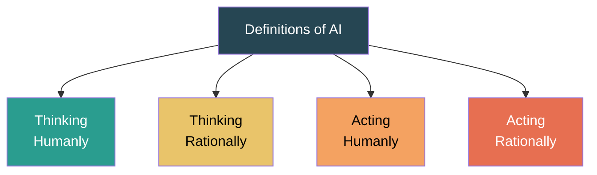

| Approach | Description | Example |
|----------|-------------|---------|
| **Thinking Humanly** | Systems that think like humans (cognitive modeling) | Neural networks modeling human brain |
| **Thinking Rationally** | Systems that think using logic ("laws of thought") | Logic-based inference engines |
| **Acting Humanly** | Systems that act like humans (Turing Test) | Chatbots passing the Turing Test |
| **Acting Rationally** | Systems that act to achieve the best outcome (rational agents) | Self-driving cars making optimal decisions |

> The **rational agent** approach is the most prevalent in modern AI — the goal is to build agents that act to achieve the best expected outcome.

### The Turing Test

Proposed by **Alan Turing (1950)** — a machine is intelligent if a human interrogator cannot distinguish it from a human based on written responses.

**Capabilities needed to pass the Turing Test:**
- Natural Language Processing (NLP) — communicate in English
- Knowledge Representation — store what it knows/hears
- Automated Reasoning — use stored info to answer and draw conclusions
- Machine Learning — adapt to new circumstances and detect patterns

**Total Turing Test** also requires:
- Computer Vision — to perceive objects
- Robotics — to manipulate objects and move

---

## 1.2 AI Problems

AI problems are characterized by the following properties that make them challenging:

| Property | Description |
|----------|-------------|
| **Large search space** | Too many possible states to enumerate (e.g., chess has ~10⁴⁷ states) |
| **Uncertainty** | Incomplete or noisy information (e.g., medical diagnosis) |
| **Non-determinism** | Actions may have unpredictable outcomes |
| **Complex constraints** | Multiple interacting constraints that must be satisfied |
| **Dynamic environments** | Environment changes while the agent is deliberating |
| **Multi-agent interaction** | Multiple agents acting simultaneously (e.g., game playing) |

### Categories of AI Problems

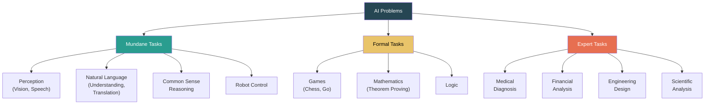

---

## 1.3 AI Techniques

AI techniques are methods that exploit knowledge to solve complex problems efficiently.

### Characteristics of AI Techniques

1. **Use of Knowledge** — Represented explicitly and can be manipulated
2. **Generalization** — Can handle a wide variety of situations
3. **Tolerance of Uncertainty** — Can work with incomplete/noisy data
4. **Learnability** — Can acquire new knowledge through experience

### Major AI Techniques

| Technique | Description | Example |
|-----------|-------------|---------|
| **Search** | Systematic exploration of solution space | Pathfinding in maps, game trees |
| **Knowledge Representation** | Encoding information for machine reasoning | Semantic nets, frames, ontologies |
| **Logic & Reasoning** | Formal inference from known facts | Expert systems, theorem provers |
| **Machine Learning** | Learning patterns from data | Spam classification, image recognition |
| **Neural Networks / Deep Learning** | Layered learning systems inspired by brain | Image classification, NLP, speech |
| **Probabilistic Reasoning** | Reasoning under uncertainty | Bayesian networks, HMMs |
| **Evolutionary Computation** | Optimization inspired by natural selection | Genetic algorithms |
| **NLP** | Processing and understanding human language | Chatbots, machine translation |

---

## 1.4 Solving Problems by Searching

### Problem-Solving Agent

A **problem-solving agent** finds a sequence of actions that leads from the initial state to a goal state. It operates through:


### Problem Formulation

A problem is formally defined by **five components:**

| Component | Description | Example (Romania Map) |
|-----------|-------------|----------------------|
| **Initial State** | The state where the agent starts | In(Arad) |
| **Actions** | Set of possible actions available in a state. ACTIONS(s) returns actions applicable in state s | {Go(Sibiu), Go(Timisoara), Go(Zerind)} |
| **Transition Model** | Describes the result of applying an action. RESULT(s, a) → s' | RESULT(In(Arad), Go(Sibiu)) = In(Sibiu) |
| **Goal Test** | Determines if a given state is a goal state | In(Bucharest)? |
| **Path Cost** | Assigns a numeric cost to each path. g(n) = cost from start to node n | Sum of road distances along the path |

> **State Space** = Set of all states reachable from the initial state by any sequence of actions. Forms a **graph** where nodes are states and edges are actions.

### State Space as a Graph

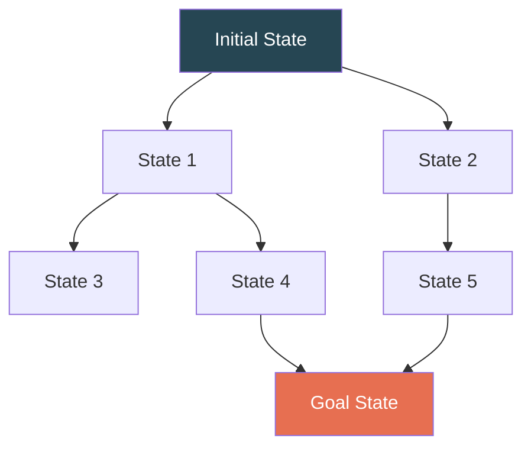

### Search Tree vs Search Graph

| Search Tree | Search Graph |
|------------|-------------|
| Tree structure derived from state space | Uses the state space graph directly |
| May revisit states (same state in multiple nodes) | Tracks visited states to avoid revisiting |
| Can be infinite even for finite state spaces | Finite for finite state spaces |
| Simpler to implement | More memory-efficient |

### Key Terminology

| Term | Definition |
|------|-----------|
| **Node** | A data structure representing a state in the search tree |
| **Frontier (Open List)** | Set of nodes available for expansion (leaf nodes) |
| **Explored Set (Closed List)** | Set of already expanded nodes |
| **Expanding a node** | Generating all successor nodes by applying all actions |
| **Solution** | A path from initial state to goal state |
| **Optimal Solution** | Solution with lowest path cost |

### Measuring Problem-Solving Performance

| Criterion | Description |
|-----------|-------------|
| **Completeness** | Does the algorithm always find a solution if one exists? |
| **Optimality** | Does it find the least-cost solution? |
| **Time Complexity** | How long does it take? (number of nodes generated) |
| **Space Complexity** | How much memory is needed? (max nodes stored) |

> Complexity is measured in terms of: **b** (branching factor), **d** (depth of shallowest goal), **m** (maximum depth of search tree).

---

## 1.5 Applications of AI

| Domain | Application | AI Techniques Used |
|--------|------------|-------------------|
| **Healthcare** | Medical diagnosis, drug discovery, medical imaging | Expert systems, deep learning, NLP |
| **Finance** | Fraud detection, algorithmic trading, credit scoring | ML, neural networks, Bayesian methods |
| **Transportation** | Self-driving cars, traffic optimization, route planning | Computer vision, reinforcement learning, search |
| **Gaming** | Game-playing agents (Chess, Go), NPC behavior | Minimax, alpha-beta pruning, RL |
| **NLP** | Machine translation, chatbots, sentiment analysis | Transformers, seq2seq, attention |
| **Robotics** | Industrial automation, surgical robots, drones | Planning, perception, control |
| **Education** | Intelligent tutoring, personalized learning | Knowledge representation, ML |
| **E-commerce** | Recommendation systems, demand forecasting | Collaborative filtering, deep learning |
| **Cybersecurity** | Intrusion detection, malware classification | Anomaly detection, neural networks |
| **Agriculture** | Crop disease detection, yield prediction | Computer vision, IoT + ML |

---

## 1.6 Intelligent Agents

### What is an Agent?

An **agent** is anything that can:
- **Perceive** its environment through **sensors**
- **Act** upon its environment through **actuators**

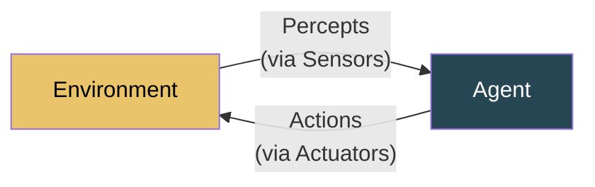

> **Agent Function:** Maps percept sequences to actions. f: P* → A
> **Agent Program:** The internal implementation of the agent function.

### Structure of Intelligent Agents

```
Agent = Architecture + Program
```

- **Architecture** — The physical system (computer, robot, camera + motors)
- **Program** — The software that implements the agent function

### Rational Agent

A **rational agent** selects the action that maximizes its **performance measure**, given:
- The percept sequence to date
- The agent's built-in knowledge

> Rationality ≠ Omniscience (knowing everything) ≠ Perfection (always right). A rational agent acts to **maximize expected performance** based on available information.

---

## 1.7 Types of Agents

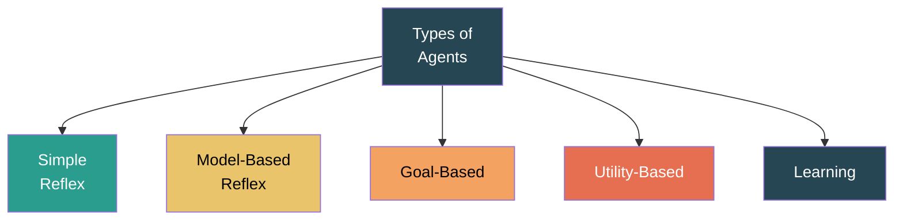

### 1. Simple Reflex Agent

Acts based **only on current percept**, ignoring history.

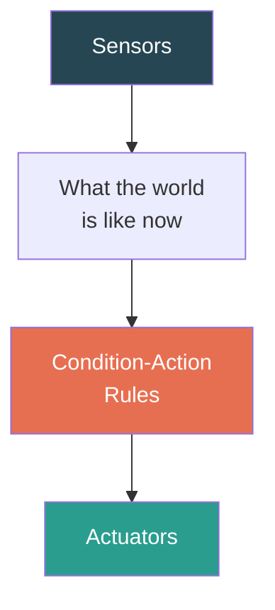

| Feature | Detail |
|---------|--------|
| **Logic** | if (percept = X) then action = Y |
| **Memory** | None — no internal state |
| **Works when** | Environment is fully observable |
| **Fails when** | Environment is partially observable |
| **Example** | Thermostat: if temp > 25°C → turn on AC |

### 2. Model-Based Reflex Agent

Maintains an **internal state** (model of the world) to handle partial observability.

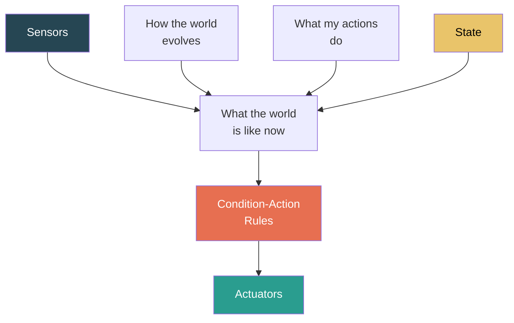

| Feature | Detail |
|---------|--------|
| **Logic** | Updates internal state based on percepts + transition model, then selects action |
| **Memory** | Maintains internal state |
| **Key Models** | Transition model (how world evolves) + Sensor model (what percepts mean) |
| **Example** | Self-driving car tracking positions of other vehicles over time |

### 3. Goal-Based Agent

Uses **goal information** to decide which actions are desirable. Combines the internal model with search and planning.

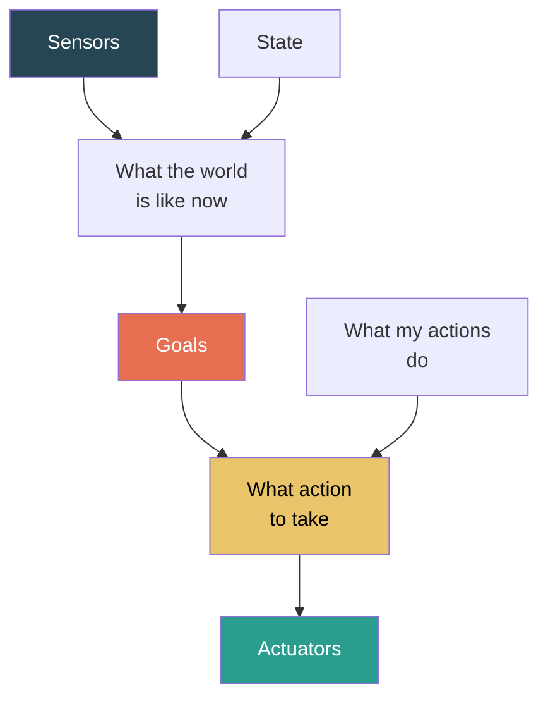

| Feature | Detail |
|---------|--------|
| **Logic** | Considers future consequences of actions to achieve goals |
| **Advantage** | Flexible — changing the goal changes behavior without reprogramming rules |
| **Technique** | Search + Planning algorithms |
| **Example** | GPS navigation: goal = reach destination; plans route considering current traffic |

### 4. Utility-Based Agent

Uses a **utility function** to rank states by "happiness/desirability," choosing the action that maximizes expected utility.

| Feature | Detail |
|---------|--------|
| **Logic** | Utility function U(s) maps each state to a real number. Agent maximizes E[U]. |
| **Advantage** | Can handle conflicting goals, trade-offs, and uncertainty |
| **vs Goal-Based** | Goal-based: binary (goal achieved or not). Utility-based: how good is the state |
| **Example** | Route planning: minimizes travel time while also minimizing fuel & toll costs |

### 5. Learning Agent

Has the ability to improve its performance over time through experience.

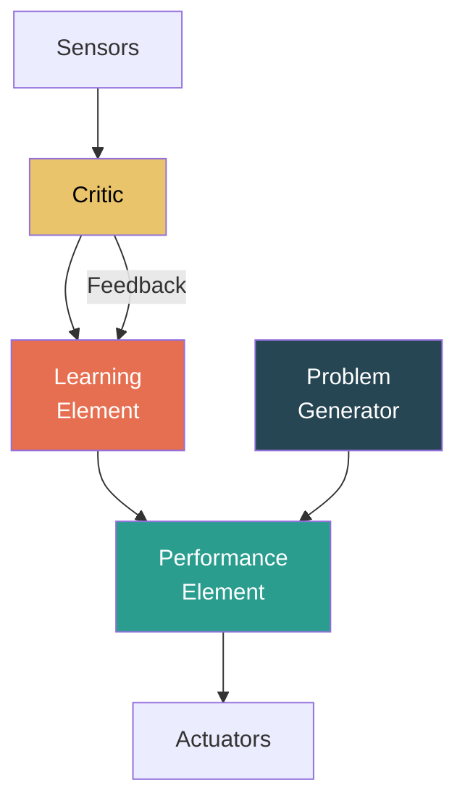

| Component | Role |
|-----------|------|
| **Performance Element** | Selects actions (the previous agent types) |
| **Critic** | Evaluates how well the agent is doing (based on feedback from environment) |
| **Learning Element** | Modifies the performance element to improve future actions |
| **Problem Generator** | Suggests exploratory actions for new learning experiences |

| Feature | Detail |
|---------|--------|
| **Example** | Spam filter that learns from user marking emails as spam/not-spam |
| **Advantage** | Adapts without explicit reprogramming |

---

## 1.8 Agent Environments

### Properties of Environments

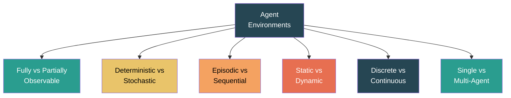

| Property | Options | Description |
|----------|---------|-------------|
| **Observable** | Fully / Partially | Can the agent see the complete state? Chess = fully; Poker = partially |
| **Deterministic** | Deterministic / Stochastic | Is the next state completely determined by current state + action? Vacuum world = deterministic; Dice game = stochastic |
| **Episodic** | Episodic / Sequential | Are episodes independent? Spam filter = episodic; Chess = sequential (current move affects future) |
| **Static** | Static / Dynamic | Does the environment change while agent is deliberating? Crossword = static; Traffic = dynamic. **Semi-dynamic:** environment doesn't change but agent's performance score does (e.g., chess clock) |
| **Discrete** | Discrete / Continuous | Finite number of states/percepts/actions? Chess = discrete; Self-driving car = continuous |
| **Agents** | Single / Multi | One agent or multiple? Crossword = single; Chess = multi-agent (competitive) |

### Environment Examples

| Environment | Observable | Deterministic | Episodic | Static | Discrete | Agents |
|-------------|-----------|--------------|----------|--------|----------|--------|
| **Chess (with clock)** | Fully | Deterministic | Sequential | Semi-dynamic | Discrete | Multi |
| **Poker** | Partially | Stochastic | Sequential | Static | Discrete | Multi |
| **Self-driving car** | Partially | Stochastic | Sequential | Dynamic | Continuous | Multi |
| **Medical Diagnosis** | Partially | Stochastic | Sequential | Dynamic | Continuous | Single |
| **Vacuum World** | Fully | Deterministic | Episodic | Static | Discrete | Single |
| **Image Classification** | Fully | Deterministic | Episodic | Static | Continuous | Single |

---

## 1.9 PEAS Representation for an Agent

**PEAS** = **P**erformance measure, **E**nvironment, **A**ctuators, **S**ensors

Used to fully specify the task environment for designing an agent.

### PEAS Examples

| Agent | Performance | Environment | Actuators | Sensors |
|-------|------------|-------------|-----------|---------|
| **Self-Driving Taxi** | Safe, fast, legal, comfortable, maximize profit | Roads, traffic, pedestrians, weather, passengers | Steering, accelerator, brake, signal, horn, display | Cameras, LIDAR, GPS, speedometer, odometer, engine sensors, keyboard |
| **Medical Diagnosis** | Healthy patient, minimize costs, minimize lawsuits | Patient, hospital, staff | Display (questions, tests, diagnoses, treatments, referrals) | Keyboard (symptom entry), patient history database |
| **Vacuum Cleaner** | Cleanliness, efficiency, battery conservation | Room, floor, furniture, dust | Wheels, brush, suction | Camera, dirt sensor, bump sensor, IR sensor |
| **Chess Agent** | Winning, time management | Chessboard, opponent, clock | Arm/screen to move pieces | Camera/input board for opponent moves |
| **Tutoring System** | Student's score improvement, engagement | Student, screen, exercises | Display (exercises, hints, explanations) | Keyboard input, test scores, response time |

---

# Chapter 2: Uninformed Search Techniques & Adversarial Search

---

## 2.1 Uninformed (Blind) Search Strategies

**Uninformed search** algorithms have **no additional information** about states beyond the problem definition. They do not know how "close" a state is to the goal — they only distinguish goal states from non-goal states.

### General Tree Search Algorithm

```
function TREE-SEARCH(problem) returns a solution or failure
    initialize frontier with initial state of problem
    loop do
        if frontier is empty then return failure
        choose a leaf node and remove it from frontier
        if node contains a goal state then return solution
        expand the chosen node, adding children to the frontier
```

> The **strategy** (which node to expand next) defines the type of search.

---

## 2.2 Breadth-First Search (BFS)

**Strategy:** Expand the **shallowest** unexpanded node first.
**Data structure:** FIFO Queue (First-In, First-Out)

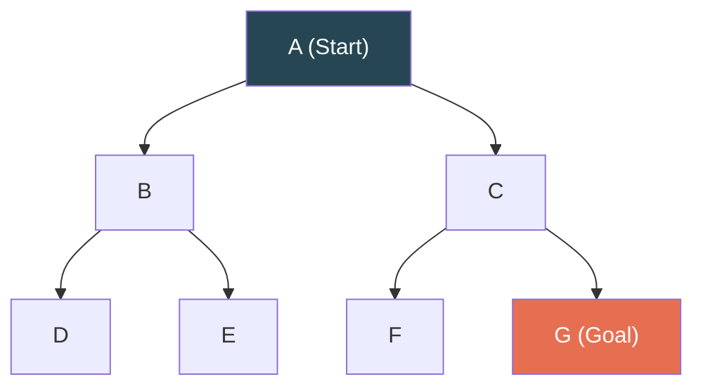

**BFS Traversal Order:** A → B → C → D → E → F → G ✓ (level by level)

### Solved Example — BFS

**Problem:** Find path from S to G in the following graph:

```
      S
     / \
    A   B
   / \   \
  C   D   G
```

| Step | Frontier (Queue) | Expanded | Action |
|------|-------------------|----------|--------|
| 0 | [S] | — | Start |
| 1 | [A, B] | S | Expand S |
| 2 | [B, C, D] | A | Expand A |
| 3 | [C, D, G] | B | Expand B |
| 4 | [D, G] | C | Expand C (no children) |
| 5 | [G] | D | Expand D (no children) |
| 6 | [] | **G** | **Goal found!** |

**Path:** S → B → G

### Properties of BFS

| Property | Value |
|----------|-------|
| **Complete?** | ✅ Yes (if b is finite) |
| **Optimal?** | ✅ Yes (if all step costs are equal) |
| **Time Complexity** | O(b^d) — exponential |
| **Space Complexity** | O(b^d) — stores all nodes at current level |

> **Biggest drawback:** Memory. BFS stores all nodes, which can be enormous for large problems.

---

## 2.3 Depth-First Search (DFS)

**Strategy:** Expand the **deepest** unexpanded node first.
**Data structure:** LIFO Stack (Last-In, First-Out) or Recursion


**DFS Traversal Order:** A → B → D → E → C → F → G ✓ (go deep first)

### Solved Example — DFS

**Problem:** Same graph as above, find S to G:

```
      S
     / \
    A   B
   / \   \
  C   D   G
```

| Step | Frontier (Stack) | Expanded | Action |
|------|-------------------|----------|--------|
| 0 | [S] | — | Start |
| 1 | [A, B] | S | Expand S, push A and B |
| 2 | [C, D, B] | A | Expand A (deeper), push C and D |
| 3 | [D, B] | C | Expand C (no children) |
| 4 | [B] | D | Expand D (no children) |
| 5 | [G] | B | Expand B, push G |
| 6 | [] | **G** | **Goal found!** |

**Path:** S → B → G

### Properties of DFS

| Property | Value |
|----------|-------|
| **Complete?** | ❌ No (can loop infinitely in infinite state spaces; yes with cycle detection in finite spaces) |
| **Optimal?** | ❌ No (may find a deeper solution first) |
| **Time Complexity** | O(b^m) where m = max depth |
| **Space Complexity** | O(b·m) — linear! Only stores path + siblings |

> **Advantage:** Very memory-efficient. **Drawback:** Can get stuck in infinite branches.

---

## 2.4 Uniform Cost Search (UCS)

**Strategy:** Expand the node with the **lowest path cost g(n)** first.
**Data structure:** Priority Queue (ordered by g(n))

> UCS is a generalization of BFS — when all step costs are equal, UCS = BFS.

### Solved Example — UCS

**Problem:** Find cheapest path from S to G:

```
    S --1-- A --3-- G
    |              ↑
    2              1
    |              |
    B -----4----- C
```

Edges: S→A(1), S→B(2), A→G(3), B→C(4), C→G(1)

| Step | Frontier (Priority Queue) | Expanded | g(n) | Path |
|------|---------------------------|----------|------|------|
| 0 | [(S, 0)] | — | — | — |
| 1 | [(A,1), (B,2)] | S | 0 | — |
| 2 | [(B,2), (G,4)] | A | 1 | S→A |
| 3 | [(G,4), (C,6)] | B | 2 | S→B |
| 4 | [] | **G** | **4** | **S→A→G** |

**Optimal Path:** S → A → G, Cost = 4

Also check: S → B → C → G = 2 + 4 + 1 = 7 (more expensive, correctly not chosen)

### Properties of UCS

| Property | Value |
|----------|-------|
| **Complete?** | ✅ Yes (if step costs ≥ ε > 0) |
| **Optimal?** | ✅ Yes (always expands least-cost node) |
| **Time Complexity** | O(b^(1+⌊C*/ε⌋)) where C* = optimal cost, ε = smallest step cost |
| **Space Complexity** | O(b^(1+⌊C*/ε⌋)) |

---

## 2.5 Depth-Limited Search (DLS)

**Strategy:** DFS with a **depth limit ℓ**. Nodes at depth ℓ are treated as leaf nodes (no expansion).

**Purpose:** Prevents DFS from going infinitely deep.

| Property | Value |
|----------|-------|
| **Complete?** | ❌ No (goal may be beyond depth limit) |
| **Optimal?** | ❌ No |
| **Time Complexity** | O(b^ℓ) |
| **Space Complexity** | O(b·ℓ) |

**Problem:** Choosing the right ℓ is hard. Too small → misses goal. Too large → slow.

> **Diameter of state space** = the longest shortest path between any two states. Ideal ℓ = diameter, but usually unknown.

---

## 2.6 Iterative Deepening Depth-First Search (IDDFS)

**Strategy:** Run DLS with depth limit ℓ = 0, 1, 2, 3, ... incrementing until goal is found.

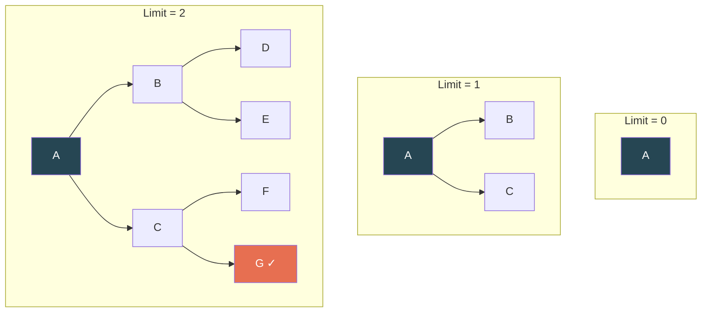

**Combines benefits of BFS (completeness, optimality) with DFS (low memory).**

| Property | Value |
|----------|-------|
| **Complete?** | ✅ Yes (like BFS) |
| **Optimal?** | ✅ Yes (if step costs are equal, like BFS) |
| **Time Complexity** | O(b^d) — same as BFS despite re-expansion |
| **Space Complexity** | O(b·d) — same as DFS! |

> **Overhead of re-expansion is minimal.** For b=10, d=5: BFS generates 111,111 nodes. IDDFS generates 123,456 nodes (only ~11% more). The deeper levels dominate.

> IDDFS is the **preferred uninformed search** when search space is large and depth of solution is unknown.

---

## 2.7 Bidirectional Search

**Strategy:** Run **two simultaneous searches** — one forward from the start and one backward from the goal — hoping they meet in the middle.

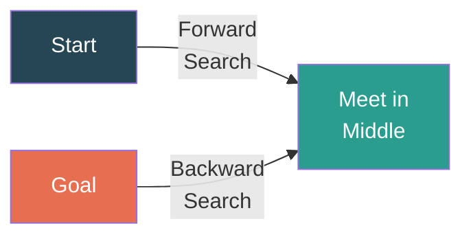

| Property | Value |
|----------|-------|
| **Complete?** | ✅ Yes (if both use BFS) |
| **Optimal?** | ✅ Yes (if both use BFS and step costs are uniform) |
| **Time Complexity** | O(b^(d/2)) — much better than O(b^d)! |
| **Space Complexity** | O(b^(d/2)) |

**Requirements:** Must be able to generate predecessors (backward search). Goal must be explicitly known (not just a test).

> **Key insight:** 2 × b^(d/2) ≪ b^d. For b=10, d=6: BFS = 10⁶ = 1,000,000 nodes. Bidirectional = 2 × 10³ = 2,000 nodes.

---

## 2.8 Comparing Uninformed Search Techniques

| Criterion | BFS | DFS | UCS | DLS | IDDFS | Bidirectional |
|-----------|-----|-----|-----|-----|-------|---------------|
| **Complete?** | ✅ | ❌ | ✅ | ❌ | ✅ | ✅ |
| **Optimal?** | ✅* | ❌ | ✅ | ❌ | ✅* | ✅* |
| **Time** | O(b^d) | O(b^m) | O(b^(1+⌊C*/ε⌋)) | O(b^ℓ) | O(b^d) | O(b^(d/2)) |
| **Space** | O(b^d) | O(b·m) | O(b^(1+⌊C*/ε⌋)) | O(b·ℓ) | O(b·d) | O(b^(d/2)) |

*_When all step costs are equal_

**b** = branching factor, **d** = depth of shallowest goal, **m** = max depth, **ℓ** = depth limit, **C*** = optimal cost, **ε** = minimum step cost

---

## 2.9 Adversarial Search — Game Playing

### Game as a Search Problem

Games involve **competition** — one agent's gain is another's loss. The environment is **multi-agent** and typically **adversarial**.

**Formal Definition of a Game:**

| Component | Description |
|-----------|-------------|
| **S₀** | Initial state (starting board position) |
| **PLAYER(s)** | Which player's turn it is in state s |
| **ACTIONS(s)** | Legal moves in state s |
| **RESULT(s, a)** | Transition model — state after action a |
| **TERMINAL-TEST(s)** | Is the game over? |
| **UTILITY(s, p)** | Payoff for player p in terminal state s (e.g., +1 win, -1 loss, 0 draw) |

---

## 2.10 Minimax Algorithm

**Idea:** In a two-player zero-sum game:
- **MAX** player tries to **maximize** the utility
- **MIN** player tries to **minimize** the utility

The algorithm computes the **minimax value** for each node:

```
MINIMAX(s) =
    UTILITY(s)                              if TERMINAL(s)
    max(MINIMAX(RESULT(s,a)) for a in ACTIONS(s))    if PLAYER(s) = MAX
    min(MINIMAX(RESULT(s,a)) for a in ACTIONS(s))    if PLAYER(s) = MIN
```

### Solved Example — Minimax

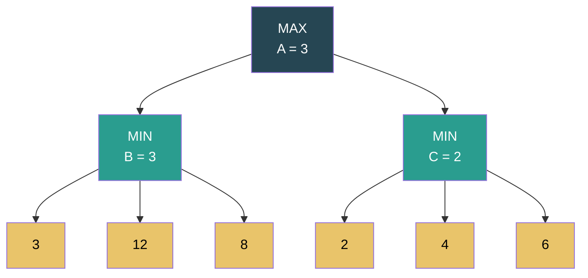

**Step-by-step:**

1. **Terminal nodes (leaves):** 3, 12, 8, 2, 4, 6 — these are the utility values
2. **MIN node B:** min(3, 12, 8) = **3**
3. **MIN node C:** min(2, 4, 6) = **2**
4. **MAX node A:** max(3, 2) = **3**

**Optimal move:** MAX chooses B (value 3), because MIN will respond optimally.

### Properties of Minimax

| Property | Value |
|----------|-------|
| **Complete?** | ✅ Yes (if tree is finite) |
| **Optimal?** | ✅ Yes (against an optimal opponent) |
| **Time Complexity** | O(b^m) |
| **Space Complexity** | O(b·m) (DFS-based) |

> For chess: b ≈ 35, m ≈ 100 → 35¹⁰⁰ ≈ 10¹⁵⁴ nodes — **impractical!** Need pruning.

---

## 2.11 Alpha-Beta Pruning

**Idea:** Prune branches of the minimax tree that **cannot affect the final decision**. Returns the same result as minimax but explores fewer nodes.

### Key Parameters

- **α (alpha)** = Best value MAX can guarantee so far (highest value found along the path for MAX). Initialized to −∞
- **β (beta)** = Best value MIN can guarantee so far (lowest value found along the path for MIN). Initialized to +∞

**Pruning rule:** At any node:
- If **α ≥ β** → prune remaining children (no need to explore further)

### Algorithm

```
function ALPHA-BETA(node, α, β, maximizingPlayer):
    if node is terminal: return utility(node)
    
    if maximizingPlayer:
        value = -∞
        for each child of node:
            value = max(value, ALPHA-BETA(child, α, β, FALSE))
            α = max(α, value)
            if α ≥ β: break    // β pruning
        return value
    
    else: // minimizing player
        value = +∞
        for each child of node:
            value = min(value, ALPHA-BETA(child, α, β, TRUE))
            β = min(β, value)
            if α ≥ β: break    // α pruning
        return value
```

### Solved Example — Alpha-Beta Pruning

Consider the game tree:

```
            MAX (A)
           /       \
      MIN (B)     MIN (C)
      /    \       /    \
    MAX(D) MAX(E) MAX(F) MAX(G)
    / \    / \    / \    / \
   3   5  6   9  1   2  0   7
```

**Step-by-step traversal (Left to Right):**

| Step | Node | α | β | Value | Action |
|------|------|---|---|-------|--------|
| 1 | D's child: 3 | 3 | +∞ | 3 | α updated at D |
| 2 | D's child: 5 | 5 | +∞ | 5 | D = max(3,5) = 5 |
| 3 | B gets D=5 | -∞ | 5 | — | β updated at B to 5 |
| 4 | E's child: 6 | 5 | 5 | 6 | At E: α=6, but α(6) ≥ β(5) → **PRUNE** (don't check 9) |
| 5 | B = min(5, 6) = 5 | — | — | 5 | B's value = 5 |
| 6 | A gets B=5 | 5 | +∞ | — | α updated at A to 5 |
| 7 | F's child: 1 | 5 | 1 | 1 | At F: value=1. At C: β=1, α(5) ≥ β(1) → **PRUNE** (don't check F's 2, skip G entirely) |
| 8 | A = max(5, 1) = **5** | — | — | **5** | Final answer |

**Nodes pruned:** Node 9 (child of E), Node 2 (child of F), entire subtree G (nodes 0, 7)

**Result:** Same as minimax (5), but **explored fewer nodes**.

### Properties of Alpha-Beta Pruning

| Property | Value |
|----------|-------|
| **Pruning does not affect result** | Always returns same value as minimax |
| **Best case (perfect ordering)** | O(b^(m/2)) — effectively doubles the solvable depth! |
| **Worst case (no pruning)** | O(b^m) — same as minimax |
| **Average case** | O(b^(3m/4)) |
| **Move ordering** | Examining best moves first maximizes pruning |

> With perfect move ordering, alpha-beta can solve a tree **twice as deep** as minimax in the same time.

---

# Chapter 3: Informed Search Techniques

---

## 3.1 Heuristic Functions

A **heuristic function h(n)** estimates the cost from node n to the nearest goal state. It provides "informed guidance" about which paths are more promising.

**Properties:**
- h(n) ≥ 0 for all nodes
- h(goal) = 0
- A heuristic is **admissible** if it **never overestimates** the true cost: h(n) ≤ h*(n)
- A heuristic is **consistent (monotone)** if: h(n) ≤ c(n, a, n') + h(n') for every successor n'

### Common Heuristics for 8-Puzzle

```
┌───┬───┬───┐     ┌───┬───┬───┐
│ 7 │ 2 │ 4 │     │ 1 │ 2 │ 3 │
├───┼───┼───┤     ├───┼───┼───┤
│ 5 │   │ 6 │ →→→ │ 4 │ 5 │ 6 │
├───┼───┼───┤     ├───┼───┼───┤
│ 8 │ 3 │ 1 │     │ 7 │ 8 │   │
└───┴───┴───┘     └───┴───┴───┘
  Start State         Goal State
```

| Heuristic | Formula | Value for above |
|-----------|---------|-----------------|
| **h₁ (Misplaced Tiles)** | Count of tiles not in goal position | h₁ = 6 (tiles 7,5,8,3,1,4 are misplaced) |
| **h₂ (Manhattan Distance)** | Sum of distances of each tile from its goal position | h₂ = 2+0+2+3+1+0+2+1 = 11 |

> h₂ dominates h₁ (h₂(n) ≥ h₁(n) for all n), so h₂ is always more informative and never expands more nodes.

---

## 3.2 Hill Climbing

**Hill climbing** is a local search algorithm that continuously moves in the direction of **increasing value** (or decreasing cost). It's like climbing a mountain in fog — always go uphill.

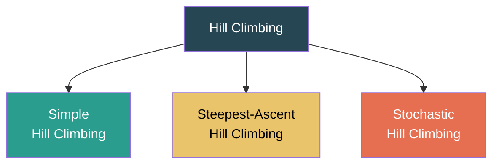

### Algorithm — Steepest-Ascent Hill Climbing

```
function HILL-CLIMBING(problem) returns a state
    current = problem.INITIAL-STATE
    loop do
        neighbor = highest-valued successor of current
        if VALUE(neighbor) ≤ VALUE(current) then return current
        current = neighbor
```

### Problems with Hill Climbing

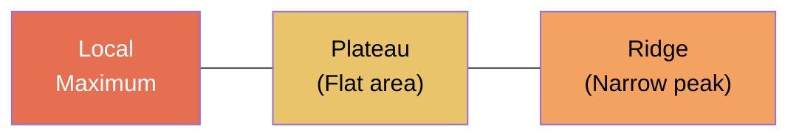

| Problem | Description | Solution |
|---------|-------------|----------|
| **Local Maximum** | A peak that is not the global best; all neighbors are worse | Random restart, simulated annealing |
| **Plateau (Flat)** | Region where all neighbors have the same value; no direction to move | Sideways moves (limited), random restart |
| **Ridge** | A narrow elevated path; steep sides but ascent is only along the ridge | More sophisticated neighbor generation |

### Variants

| Variant | Description |
|---------|-------------|
| **Simple HC** | Examines neighbors one by one; moves to the first one that's better |
| **Steepest-Ascent HC** | Examines ALL neighbors; moves to the best one |
| **Stochastic HC** | Randomly selects from uphill neighbors (probability proportional to steepness) |
| **Random-Restart HC** | Runs HC from multiple random starting points; returns the best result |
| **First-Choice HC** | Generates random successors until one is better than current |

> Hill climbing is **incomplete** (gets stuck at local maxima) and **not optimal**, but is very fast and memory-efficient.

---

## 3.3 Simulated Annealing

**Simulated Annealing** combines hill climbing with **random exploration** inspired by the metallurgical process of annealing (heating and slowly cooling metal).

**Key Idea:** Allow **bad moves** (downhill) with a probability that decreases over time. Initially, accept many bad moves (high temperature). Gradually reduce acceptance until the algorithm behaves like hill climbing.

### Algorithm

```
function SIMULATED-ANNEALING(problem, schedule) returns a state
    current = problem.INITIAL-STATE
    for t = 1 to ∞ do
        T = schedule(t)        // Temperature at time t
        if T = 0 then return current
        next = random successor of current
        ΔE = VALUE(next) - VALUE(current)
        if ΔE > 0 then current = next       // Better → always accept
        else current = next with probability e^(ΔE/T)  // Worse → accept with probability
```

**Acceptance Probability:** P(accept worse move) = e^(ΔE/T)
- When T is high → e^(ΔE/T) ≈ 1 → most moves accepted (explores widely)
- When T is low → e^(ΔE/T) ≈ 0 → almost no bad moves accepted (exploits locally)
- When T = 0 → pure hill climbing

### Solved Example

Current state value = 10, Neighbor value = 7 (worse, ΔE = -3)

| Temperature T | P(accept) = e^(-3/T) | Decision |
|---|---|---|
| T = 100 | e^(-0.03) = 0.97 | Very likely accept |
| T = 10 | e^(-0.3) = 0.74 | Likely accept |
| T = 3 | e^(-1) = 0.37 | Maybe accept |
| T = 1 | e^(-3) = 0.05 | Unlikely accept |
| T = 0.1 | e^(-30) ≈ 0 | Reject |

> If the **temperature schedule** is slow enough, simulated annealing is **theoretically guaranteed** to find the global optimum (but may require infinite time in practice).

---

## 3.4 Best-First Search

**Best-First Search** is a general strategy that expands the node with the **best evaluation function f(n)**.

### Greedy Best-First Search

**Strategy:** Expand the node that appears **closest to the goal** using only the heuristic: **f(n) = h(n)**

| Property | Value |
|----------|-------|
| **Complete?** | ❌ No (can loop in infinite spaces; yes with cycle detection in finite spaces) |
| **Optimal?** | ❌ No — only considers h(n), not actual cost |
| **Time Complexity** | O(b^m) worst case, but good heuristic reduces this dramatically |
| **Space Complexity** | O(b^m) — stores all nodes |

> Greedy search is **fast** but **suboptimal** — it can be misled by the heuristic.

---

## 3.5 A* Search

**A* Search** is the most widely used informed search algorithm. It combines:
- **g(n)** = actual cost from start to node n
- **h(n)** = estimated cost from n to goal

**Evaluation function: f(n) = g(n) + h(n)**

> A* expands the node with the lowest estimated **total cost** of the path through n to the goal.

### Algorithm

```
function A-STAR(problem, h) returns solution or failure
    node = initial state; frontier = priority queue ordered by f(n)
    add node to frontier
    explored = empty set
    loop do
        if frontier is empty then return failure
        node = POP(frontier)     // Remove node with lowest f(n)
        if GOAL-TEST(node) then return SOLUTION(node)
        add node.STATE to explored
        for each child of node:
            if child.STATE not in explored and not in frontier:
                add child to frontier
            else if child is in frontier with higher f:
                replace that frontier node with child
```

### Solved Example — A* Search

**Problem:** Find shortest path from S to G.

```
Graph:
    S ---1--- A ---3--- G
    |                   ↑
    4                   1
    |                   |
    B -------2--------- C
```

**Heuristic values (straight-line distance to G):**
h(S) = 6, h(A) = 4, h(B) = 3, h(C) = 1, h(G) = 0

| Step | Node Expanded | f(n) = g(n) + h(n) | Frontier (with f values) |
|------|--------------|---------------------|--------------------------|
| 0 | — | — | {S: 0+6=6} |
| 1 | S | 6 | {A: 1+4=**5**, B: 4+3=**7**} |
| 2 | A | 5 | {G: 1+3+0=**4**, B: 4+3=7} |
| 3 | G | 4 | **Goal reached!** |

**Optimal Path:** S → A → G, Cost = 4

**Verification:** S → B → C → G = 4 + 2 + 1 = 7 (more expensive ✓)

### Why A* is Optimal — Proof Sketch

If h(n) is **admissible** (never overestimates):
- Any unexpanded node n on the frontier has f(n) ≤ f*(n) ≤ C* (optimal cost)
- So A* will never expand past optimal-cost goal before finding it
- If h is also **consistent**, A* expands nodes in order of non-decreasing f, and each node is expanded at most once

### Properties of A*

| Property | Value |
|----------|-------|
| **Complete?** | ✅ Yes (if there are finitely many nodes with f ≤ C*) |
| **Optimal?** | ✅ Yes (if h is admissible; and for graph search, if h is consistent) |
| **Time Complexity** | O(b^d) worst case, but typically much better with good heuristic |
| **Space Complexity** | O(b^d) — keeps all nodes in memory (main limitation) |

> A* is **optimally efficient** — no other optimal algorithm is guaranteed to expand fewer nodes than A* for a given heuristic.

### A* — Larger Solved Example

**Problem:** Find shortest path from S to G using A*.

```
        S
       / | \
     1/  5|  \8
     /   |   \
    A    B    C
    |   / \    |
   3|  2|  \6  |3
    |  / |   \  |
    D    E    G
     \       ↑
      4\    /1
        \ /
         F
```

**Heuristic h(n):** h(S)=8, h(A)=6, h(B)=5, h(C)=3, h(D)=4, h(E)=2, h(F)=1, h(G)=0

| Step | Expand | g(n) | h(n) | f(n) | Frontier |
|------|--------|------|------|------|----------|
| 0 | — | — | — | — | {S:0+8=8} |
| 1 | S | 0 | 8 | 8 | {A:1+6=7, B:5+5=10, C:8+3=11} |
| 2 | A | 1 | 6 | 7 | {D:4+4=8, B:5+5=10, C:8+3=11} |
| 3 | D | 4 | 4 | 8 | {F:8+1=9, B:10, C:11} |
| 4 | F | 8 | 1 | 9 | {G:9+0=9, B:10, C:11} |
| 5 | **G** | **9** | 0 | **9** | **Goal!** |

**Optimal Path:** S → A → D → F → G, Cost = **9**

---

## 3.6 Crypto-Arithmetic Problem

**Crypto-arithmetic** problems are puzzles where digits are replaced by letters, and the goal is to find a digit assignment that makes the arithmetic correct.

### Classic Example: SEND + MORE = MONEY

```
    S E N D
  + M O R E
  ---------
  M O N E Y
```

**Constraints:**
- Each letter represents a unique digit (0-9)
- M ≠ 0 (leading digit), S ≠ 0 (leading digit)
- The addition must be arithmetically correct

**Solution approach — Constraint Satisfaction:**

Starting from the rightmost column:

| Column | Equation | Deduction |
|--------|----------|-----------|
| **Ones** | D + E = Y (or 10 + Y with carry c₁) | |
| **Tens** | N + R + c₁ = E (or 10 + E with carry c₂) | |
| **Hundreds** | E + O + c₂ = N (or 10 + N with carry c₃) | |
| **Thousands** | S + M + c₃ = O (or 10 + O with carry c₄) | |
| **Ten-Thousands** | c₄ = M | → **M = 1** (carry can only be 0 or 1, and M ≠ 0) |

From M = 1:
- S + 1 + c₃ = O + 10·c₄ → Since c₄ = 1: S + 1 + c₃ = O + 10
- S must be large: S ∈ {8, 9}. If S = 9: 9 + 1 + c₃ = O + 10 → O = c₃ → O ∈ {0, 1}. But M=1, so O = 0.
- With O = 0, c₃ = 0: E + 0 + c₂ = N → N = E + c₂
- Continuing this constraint propagation...

**Final Solution:**

| S | E | N | D | M | O | R | Y |
|---|---|---|---|---|---|---|---|
| 9 | 5 | 6 | 7 | 1 | 0 | 8 | 2 |

**Verification:** 9567 + 1085 = 10652 ✓ → SEND + MORE = MONEY ✓

---

## 3.7 Backtracking for Constraint Satisfaction Problems (CSP)

### What is a CSP?

A **Constraint Satisfaction Problem** is defined by:
- **Variables:** X₁, X₂, ..., Xn
- **Domains:** D₁, D₂, ..., Dn (possible values for each variable)
- **Constraints:** Restrictions on which combinations of values are allowed

> CSPs are solved by searching for an **assignment** of values to all variables that satisfies all constraints simultaneously.

### Backtracking Search

**Backtracking** = DFS with **constraint checking**. Assign variables one at a time, and if an assignment violates a constraint, **backtrack** to the previous variable and try a different value.

```
function BACKTRACKING-SEARCH(csp) returns solution or failure
    return BACKTRACK({}, csp)

function BACKTRACK(assignment, csp):
    if assignment is complete then return assignment
    var = SELECT-UNASSIGNED-VARIABLE(csp)
    for each value in ORDER-DOMAIN-VALUES(var, assignment, csp):
        if value is consistent with assignment:
            add {var = value} to assignment
            result = BACKTRACK(assignment, csp)
            if result ≠ failure then return result
            remove {var = value} from assignment   // BACKTRACK
    return failure
```

### Solved Example — Map Coloring (CSP)

**Problem:** Color the map of Australia with 3 colors (R, G, B) such that no two adjacent regions share the same color.

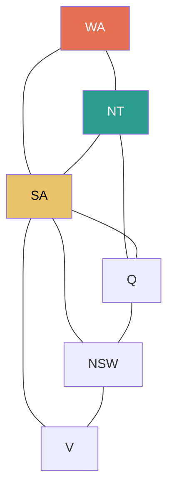

**Variables:** WA, NT, Q, NSW, V, SA, T
**Domains:** {R, G, B} for each
**Constraints:** Adjacent regions must have different colors

**Backtracking trace:**

| Step | Variable | Value | Consistent? | Action |
|------|----------|-------|-------------|--------|
| 1 | WA | R | ✅ | Assign WA=R |
| 2 | NT | R | ❌ (adj to WA=R) | Try next |
| 3 | NT | G | ✅ | Assign NT=G |
| 4 | SA | R | ❌ (adj to WA=R) | Try next |
| 5 | SA | G | ❌ (adj to NT=G) | Try next |
| 6 | SA | B | ✅ | Assign SA=B |
| 7 | Q | R | ✅ (adj to NT=G, SA=B → ok) | Assign Q=R |
| 8 | NSW | G | ✅ (adj to Q=R, SA=B → ok) | Assign NSW=G |
| 9 | V | R | ✅ (adj to SA=B, NSW=G → ok) | Assign V=R |
| 10 | T | R | ✅ (no constraints) | Assign T=R |

**Solution:** WA=R, NT=G, SA=B, Q=R, NSW=G, V=R, T=R ✓

### Improving Backtracking Performance

| Technique | Description |
|-----------|-------------|
| **MRV (Minimum Remaining Values)** | Choose the variable with the fewest legal values left → fail-first strategy |
| **Degree Heuristic** | Choose the variable involved in the most constraints with unassigned variables |
| **LCV (Least Constraining Value)** | Choose the value that rules out the fewest choices for neighboring variables |
| **Forward Checking** | When a variable is assigned, eliminate inconsistent values from neighbors' domains |
| **Arc Consistency (AC-3)** | Ensure every variable's domain values have consistent support in all neighbor domains |

---

## 3.8 Performance Evaluation of Search Algorithms

### Complete Comparison — Informed vs Uninformed

| Algorithm | Type | Complete? | Optimal? | Time | Space | Uses h(n)? |
|-----------|------|-----------|----------|------|-------|-----------|
| **BFS** | Uninformed | ✅ | ✅* | O(b^d) | O(b^d) | ❌ |
| **DFS** | Uninformed | ❌ | ❌ | O(b^m) | O(b·m) | ❌ |
| **UCS** | Uninformed | ✅ | ✅ | O(b^(1+⌊C*/ε⌋)) | O(b^(1+⌊C*/ε⌋)) | ❌ |
| **DLS** | Uninformed | ❌ | ❌ | O(b^ℓ) | O(b·ℓ) | ❌ |
| **IDDFS** | Uninformed | ✅ | ✅* | O(b^d) | O(b·d) | ❌ |
| **Bidirectional** | Uninformed | ✅ | ✅* | O(b^(d/2)) | O(b^(d/2)) | ❌ |
| **Greedy BFS** | Informed | ❌ | ❌ | O(b^m) | O(b^m) | ✅ (f=h) |
| **A*** | Informed | ✅ | ✅ | O(b^d) | O(b^d) | ✅ (f=g+h) |
| **Hill Climbing** | Local | ❌ | ❌ | O(∞) | O(1) | ✅ |
| **Sim. Annealing** | Local | ❌† | ❌† | O(∞) | O(1) | ✅ |

*_When step costs are equal_ †_Theoretical guarantee only with infinitely slow cooling_

### When to Use Which?

| Situation | Recommended Algorithm |
|-----------|----------------------|
| Small search space, equal step costs | BFS |
| Large search space, unknown solution depth | IDDFS |
| Weighted graph, need optimal path | UCS or A* |
| Good heuristic available, need optimal | A* |
| Good heuristic, optimality not needed | Greedy BFS |
| Very large space, only need "good" solution | Hill Climbing / Simulated Annealing |
| Game playing (adversarial) | Minimax + Alpha-Beta |
| Constraint satisfaction | Backtracking + inference techniques |

---
