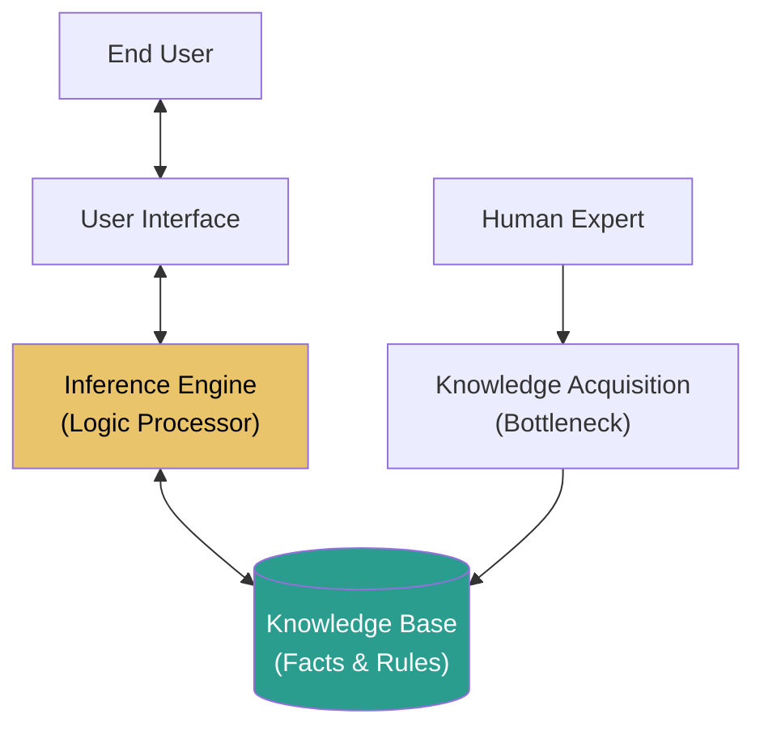
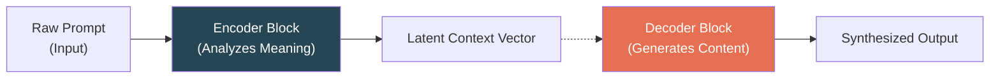
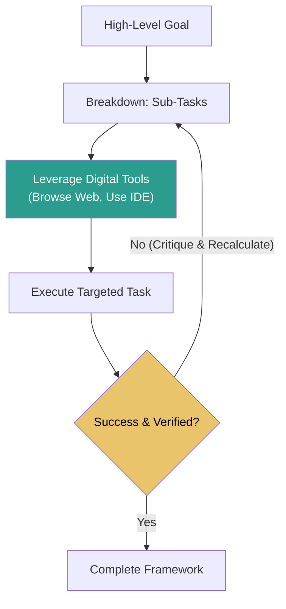
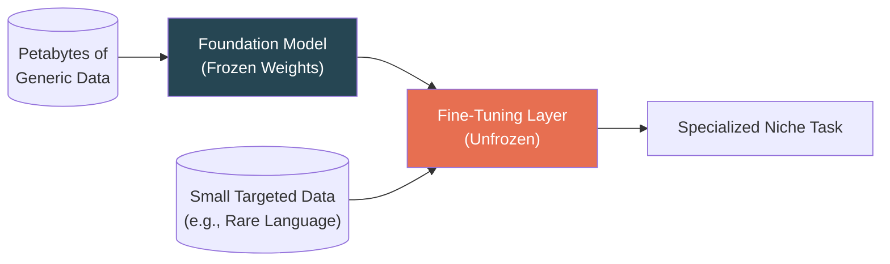

# AI ISE 2 — Short Revision Notes (Exam Focussed)

> **Note:** This document has been heavily consolidated to cover **exclusively** the topics requested within the question bank syllabus. A dedicated section at the end of this document contains the remaining critical syllabus topics that were unexpectedly excluded from the primary question bank constraints. 

---

# Module 4: Knowledge Representation & Expert Systems

## Knowledge Representation *(Targeted by Mod 4)*
- **Definition:** The structured method of logically organizing information so that an AI agent can natively understand, process, and leverage it to solve complex real-world problems.
- **Logical Consistency:** Essential for eliminating contradictory facts ($P \land \neg P$); guaranteeing the overarching Inference Engine mathematically derives deterministic, reliable conclusions continually.

## Propositional Logic vs Predicate Logic *(Targeted by Mod 4)*

| Feature | Propositional Logic | Predicate Logic (First Order Logic) |
| :--- | :--- | :--- |
| **Granularity** | Evaluates entire sentences strictly as True or False. | Evaluates specific objects, properties, and relationships. |
| **Expressiveness** | Low (Cannot analyze internal structures). | High (Dynamic variable evaluation). |
| **Quantifiers** | None available. | Universal ($\forall$) and Existential ($\exists$). |

## Forward vs Backward Chaining *(Targeted by Mod 4)*

| Comparison Parameter| Forward Chaining | Backward Chaining |
| :--- | :--- | :--- |
| **Approach** | Data-Driven | Goal-Driven |
| **Process Flow** | Starts with known facts linearly mapping rules until new facts are generated. | Starts with a hypothesis/goal backtracking rules to prove it mathematically. |
| **Best Use-Cases** | Synthesis, Monitoring, System Configuration | Diagnostics, Troubleshooting, Medical Checkups |

## PROLOG Implementation Basics *(Targeted by Mod 4)*
Utilized purely for Knowledge Base fact-rule declarations statically. Logically calculates inferences natively based precisely upon declared relationships.
- **Facts:** `parent(john, mary).`
- **Rules:** `father(X, Y) :- parent(X, Y), male(X).` 

## Expert Systems *(Targeted by Mod 4)*
Simulates rigorous human domain logic explicitly eliminating human error. Highly effective in narrow operational tasks (Medical Diagnosis), but suffers "brittle failure" outside rigid programmatic bounds.

**Expert System Structural Architecture:**

---

# Module 5: Generative AI & Transformer Models

## Generative AI & The Transformer Architecture *(Targeted by Mod 6)*
- **Generative AI:** Focuses on natively synthesizing entirely novel structural datasets (text, imagery) mimicking human outputs, shifting entirely from old classification algorithms.
- **Self-Attention Mechanism:** Mathematically weighs the contextual relationship between disparate tokens globally simultaneously (e.g., identifying "bank" relates to "loan"). Abandons distance-based RNN lag entirely.

**Encoder-Decoder Framework Flow:**

## Large Language Models (LLMs) Comparison *(Targeted by Mod 6)*

| Model | Architecture | Processing Method | Primary Optimization / Use Cases |
| :--- | :--- | :--- | :--- |
| **BERT** | Encoder-Only | Bidirectional (Left+Right) | Deep comprehension, Classification, Sentiment Extraction |
| **GPT** | Decoder-Only | Unidirectional (Left-to-Right) | Recursive Text Generation, Conversational Chatbots |
| **T5 / BART**| Encoder-Decoder | Hybrid Sequence Mapping | Multilingual Machine Translation, Complex Summarization |

---

# Module 6: Expert System and Applications

## Artificial Intelligence Sector Applications *(Targeted by Mod 5)*
- **Healthcare:** Convolutional Neural Networks analyze MRIs and X-Rays directly tracking dense anomalies dramatically increasing radiological diagnostic verification accuracies natively.
- **Recommendation Systems:** Algorithms specifically utilize distinct Decision Trees dividing consumer interaction metrics tracking behavior branching mathematically extracting optimal targeted output.
- **Industry Transformations & AI Future Trends:** Shift toward massively predictive industrial maintenance, recursive Multi-Modal AI models synthesizing text alongside video natively, and hyper-personalized automated analytics organically.

## AI Development Ethical Frictions *(Targeted by Mod 5)*
- **Algorithmic Bias:** Training AI upon historically prejudiced human databases embeds rigid biases inherently corrupting automated logical output (e.g., skewed hiring protocols).
- **Societal Impact:** Automating massive white-collar sector branches introduces starkly chaotic human resource displacements natively.

---

# ⚠️ Remaining Syllabus (Not Covered in Question Bank) ⚠️
*These topics are strictly dictated within the curriculum syllabus but were unrepresented in the main question bank.*

### The WUMPUS WORLD Environment (Module 4)
A rigid grid-based simulation benchmarking structured Knowledge-Based Agents. Because the agent's localized sensors (Breeze, Stench) cannot map the full grid inherently, it strictly forces developers to execute rigorous First-Order logic resolving environmental uncertainty seamlessly ensuring safe navigation dynamically.

### Propositional Resolution (Module 4)
An extremely powerful **Proof-by-Contradiction** inference protocol. Structurally takes two complementary rule clauses mapping conflicting properties cancelling them aggressively inferring absolute logical truths continually.

### Agentic AI Frameworks (Module 5)
Vastly supersedes pure generative prompt-based bounds entirely. 

### Transfer Learning & Pre-Trained Models (Module 5)
Rather than computationally exhausting petabytes of data training complex architectures from absolute zero, engineers heavily leverage Transfer Learning.

### Classical Search based Applications (Module 6)

| Application Vector | Implementation Mechanism | Description |
| :--- | :--- | :--- |
| **Maze Solving Agent** | Depth-First Search (DFS) | Plunges deep into a single pathway; backtracks only at dead-ends. Low memory footprint, but rarely yields the optimal solution. |
| **Maze Solving Agent** | Breadth-First Search (BFS) | Systematically sweeps all adjacent nodes outward. Memory intensive, but mathematically guarantees the absolute shortest route. |
| **Tic-Tac-Toe Agent** | Adversarial Min-Max Method | Recursively evaluates all future game-states; assumes the opponent plays perfectly, selecting moves that mathematically guarantee at least a draw. |

- **Intelligent Chatbots:** Advanced autonomous application relying on integrated NLP toolsets identifying conversational intent dynamically sourcing centralized rule-based logic or LLM endpoints mimicking semantic support organically.
