# Artificial Intelligence & Data Science (AIDS) — ISE 1 Notes

## Chapters Covered

1. Introduction to AI and Data Science
2. Exploratory Data Analysis
3. Data Modelling: Feature Selection, Engineering, and Data Pipelines

---

# Chapter 1: Introduction to AI and Data Science

---

## 1.1 Data Science — History


| Era | Key Developments |
|-----|-----------------|
| **1960s** | John Tukey's paper on "The Future of Data Analysis"; early statistical computing |
| **1970-80s** | Relational databases, SQL, data warehousing concepts emerge |
| **1990s** | Term "Data Mining" popularized; KDD (Knowledge Discovery in Databases) process defined |
| **2001** | William S. Cleveland publishes "Data Science: An Action Plan" — proposes DS as independent discipline |
| **2008** | "Data Scientist" title coined at Facebook and LinkedIn |
| **2010s** | Big Data (Hadoop, Spark), deep learning breakthroughs (ImageNet), cloud computing |
| **2020s** | Generative AI (GPT, DALL-E), AutoML, MLOps, democratization of AI |

### Why Increasing Attention to Data Science?

- **Data explosion** — 2.5 quintillion bytes of data created daily
- **Cheaper storage & computing** — cloud, GPUs, distributed systems
- **Business value** — data-driven decisions outperform intuition
- **Open-source tools** — Python, R, TensorFlow, scikit-learn
- **Industry demand** — "Data Scientist" called the "sexiest job of the 21st century" (HBR, 2012)
- **AI breakthroughs** — deep learning, NLP, computer vision

---

## 1.2 Data Science and Related Terminologies

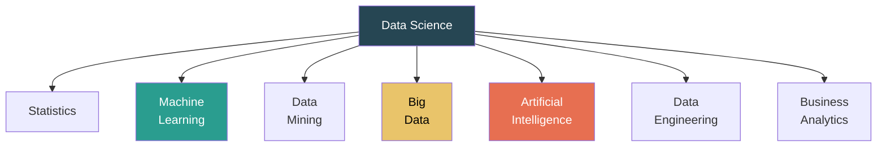

| Term | Definition | Relationship to DS |
|------|-----------|-------------------|
| **Data Science** | Interdisciplinary field using scientific methods, algorithms, and systems to extract knowledge from data | The umbrella discipline |
| **Statistics** | Mathematical science of collecting, analyzing, and interpreting data | Foundation of DS — provides theoretical basis |
| **Machine Learning** | Systems that learn patterns from data without explicit programming | Core technique used in DS for prediction and classification |
| **Data Mining** | Process of discovering patterns in large datasets | Subset of DS focused on pattern extraction |
| **Big Data** | Extremely large datasets characterized by Volume, Velocity, Variety, Veracity, Value (5 V's) | DS techniques applied to big data problems |
| **Artificial Intelligence** | Machines that simulate human intelligence | DS provides data; AI provides intelligent decision-making |
| **Data Engineering** | Building infrastructure for data collection, storage, and processing | Enables DS by preparing data pipelines |
| **Business Analytics** | Using data analysis for business decision-making | Application of DS in business context |
| **Deep Learning** | ML using multi-layered neural networks | Advanced ML technique within DS |

### Data Science vs Related Fields

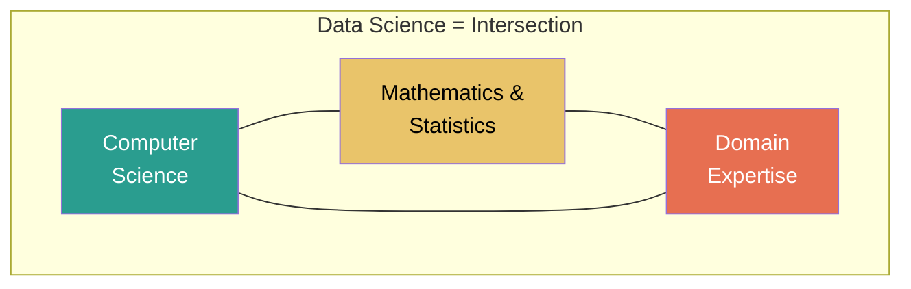

---

## 1.3 Types of Analytics


| Type | Question | Techniques | Example |
|------|----------|-----------|---------|
| **Descriptive** | What happened? | Summary statistics, dashboards, reporting, aggregation | Monthly sales report, avg. customer age |
| **Diagnostic** | Why did it happen? | Drill-down, data mining, correlation analysis | Why did sales drop in Q3? (seasonal effect) |
| **Predictive** | What will happen? | Regression, classification, time series, ML models | Predict next quarter sales, churn prediction |
| **Prescriptive** | What should we do? | Optimization, simulation, decision trees, RL | Recommend best pricing strategy, resource allocation |

```python
# Descriptive Analytics Example
import pandas as pd

df = pd.read_csv('sales.csv')

# Summary statistics
print(df.describe())

# What happened last month?
monthly = df.groupby('month')['revenue'].sum()
print(monthly)
```

```python
# Predictive Analytics Example
from sklearn.linear_model import LinearRegression

X = df[['advertising_spend', 'num_employees']]
y = df['revenue']

model = LinearRegression()
model.fit(X, y)

# Predict next quarter revenue
prediction = model.predict([[50000, 25]])
print(f"Predicted revenue: ${prediction[0]:,.2f}")
```

---

## 1.4 Applications of Data Science

| Domain | Application | Techniques Used |
|--------|------------|----------------|
| **Healthcare** | Disease prediction, drug discovery, medical imaging | Deep learning, NLP, classification |
| **Finance** | Fraud detection, credit scoring, algorithmic trading | Anomaly detection, regression, time series |
| **E-commerce** | Recommendation systems, demand forecasting, pricing | Collaborative filtering, clustering |
| **Social Media** | Sentiment analysis, content recommendation, ad targeting | NLP, deep learning, network analysis |
| **Transportation** | Route optimization, autonomous vehicles, traffic prediction | Reinforcement learning, computer vision |
| **Manufacturing** | Predictive maintenance, quality control, supply chain | IoT analytics, time series, anomaly detection |
| **Agriculture** | Crop yield prediction, disease detection, precision farming | Computer vision, regression, satellite imagery |
| **Sports** | Player performance analysis, injury prediction | Statistical modeling, computer vision |
| **Cybersecurity** | Intrusion detection, threat analysis | Anomaly detection, classification |
| **Government** | Census analysis, policy impact, urban planning | Statistical analysis, visualization |

---

## 1.5 Data Science Process Models

### CRISP-DM (Cross-Industry Standard Process for Data Mining)

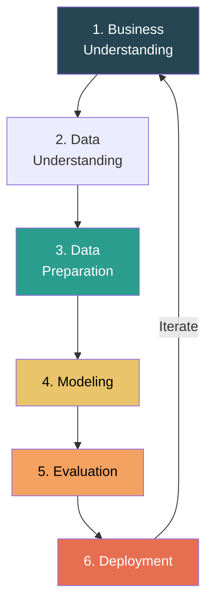

| Phase | Activities |
|-------|-----------|
| **Business Understanding** | Define objectives, identify key questions, determine success criteria |
| **Data Understanding** | Collect data, explore data, verify quality, identify patterns |
| **Data Preparation** | Clean, transform, integrate, select features, handle missing values |
| **Modeling** | Select algorithms, train models, tune hyperparameters |
| **Evaluation** | Assess model performance, validate results against business objectives |
| **Deployment** | Deploy model to production, monitor, maintain, retrain |

### KDD Process (Knowledge Discovery in Databases)


### OSEMN Framework

| Step | Description |
|------|-----------|
| **O**btain | Gather data from databases, APIs, web scraping, files |
| **S**crub | Clean data — handle missing values, duplicates, inconsistencies |
| **E**xplore | EDA — visualize, summarize, find patterns and relationships |
| **M**odel | Build and evaluate ML models |
| **i**Nterpret | Communicate results, derive actionable insights |

---

## 1.6 Intelligence and Its Types

**Intelligence** is the ability to acquire and apply knowledge and skills — learning, reasoning, problem-solving, perception, and language understanding.

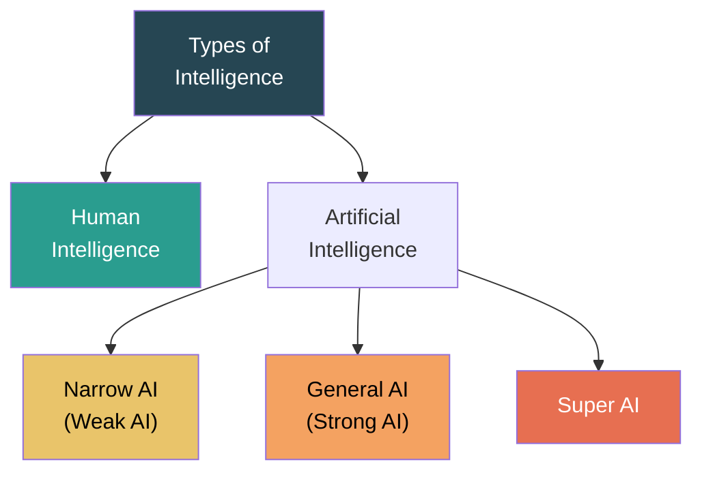

| Type | Description | Example |
|------|------------|---------|
| **Human Intelligence** | Natural intelligence — reasoning, creativity, emotional understanding, consciousness | Human decision-making, artistic creation |
| **Narrow AI (Weak AI)** | Designed for a specific task; cannot generalize beyond it | Siri, chess engines, spam filters, image recognition |
| **General AI (Strong AI)** | Hypothetical AI with human-level cognitive abilities across all domains | Does not exist yet |
| **Super AI** | Hypothetical AI surpassing human intelligence in every aspect | Theoretical — subject of AI safety research |

---

## 1.7 Categorization of AI-Based Systems

### Based on Capabilities

| Category | Description | Example |
|----------|------------|---------|
| **Reactive Machines** | No memory; responds to current input only | IBM Deep Blue (chess) |
| **Limited Memory** | Uses past data for short-term decisions | Self-driving cars, chatbots |
| **Theory of Mind** | Understands emotions, beliefs, intentions (future AI) | Advanced social robots (in research) |
| **Self-Aware AI** | Has consciousness and self-awareness (hypothetical) | Does not exist |

### Based on Functionality

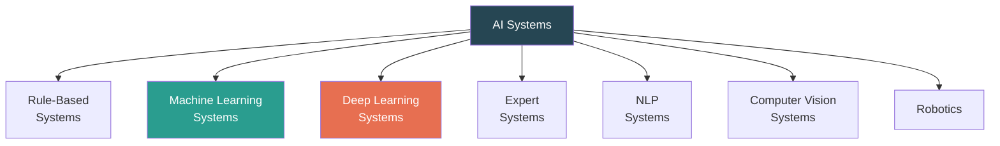

| System Type | How It Works | Example |
|-------------|-------------|---------|
| **Rule-Based** | If-then rules defined by experts | Early medical diagnosis systems |
| **Machine Learning** | Learns patterns from data | Spam detection, recommendation engines |
| **Deep Learning** | Multi-layer neural networks for complex patterns | Image recognition, language models |
| **Expert Systems** | Encodes domain expert knowledge for decision-making | MYCIN (medical), DENDRAL (chemistry) |
| **NLP Systems** | Process and understand human language | ChatGPT, Google Translate |
| **Computer Vision** | Interpret visual information from the world | Face recognition, autonomous driving |

---

## 1.8 Agents & Environments

### Intelligent Agent

An **agent** perceives its environment through **sensors** and acts upon it through **actuators**.

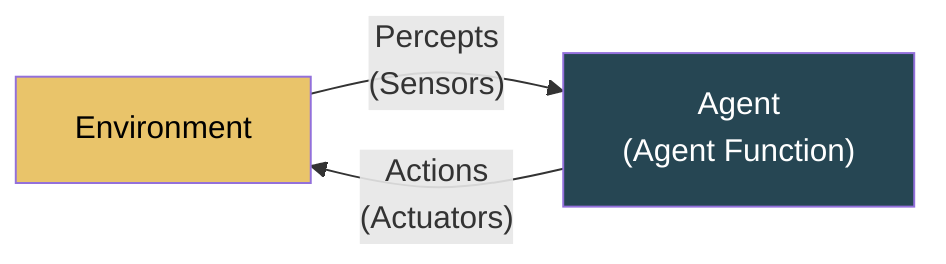

**Agent Function:** f: P* → A (maps percept sequences to actions)

### Types of Agents

| Agent Type | Description | Example |
|-----------|-------------|---------|
| **Simple Reflex** | Acts on current percept only; condition-action rules | Thermostat |
| **Model-Based Reflex** | Maintains internal state to handle partial observability | Self-driving car |
| **Goal-Based** | Uses goals + planning to choose actions | GPS navigation |
| **Utility-Based** | Maximizes a utility function for "best" outcome | Investment portfolio optimization |
| **Learning** | Improves performance through experience | Spam filter that learns |

### Agent Environments — Properties

| Property | Options | Example |
|----------|---------|---------|
| **Observable** | Fully / Partially | Chess = Fully; Poker = Partially |
| **Deterministic** | Deterministic / Stochastic | Vacuum = Determ.; Weather = Stochastic |
| **Episodic** | Episodic / Sequential | Image classification = Episodic; Chess = Sequential |
| **Static** | Static / Dynamic | Crossword = Static; Stock market = Dynamic |
| **Discrete** | Discrete / Continuous | Chess = Discrete; Robot navigation = Continuous |
| **Agents** | Single / Multi | Puzzle = Single; Game = Multi |

### PEAS Representation

| Agent | Performance | Environment | Actuators | Sensors |
|-------|------------|-------------|-----------|---------|
| **Self-Driving Car** | Safety, speed, comfort | Roads, traffic, weather | Steering, brake, signal | Camera, LIDAR, GPS |
| **Chatbot** | User satisfaction, accuracy | User queries, conversation | Text/voice output | Text/voice input, user history |
| **Medical Diagnosis** | Correct diagnosis, minimize cost | Patient, symptoms, history | Display recommendations | Input symptoms, lab results |

---

# Chapter 2: Exploratory Data Analysis (EDA)

---

## 2.1 Introduction to EDA

**Exploratory Data Analysis (EDA)** is the process of examining and summarizing datasets to discover patterns, spot anomalies, test hypotheses, and check assumptions — primarily using statistical graphics and visualization.

**Goals of EDA:**
- Understand data structure, types, and distributions
- Detect outliers and anomalies
- Find relationships between variables
- Identify missing data patterns
- Guide feature engineering and model selection


---

## 2.2 Steps in Data Preprocessing

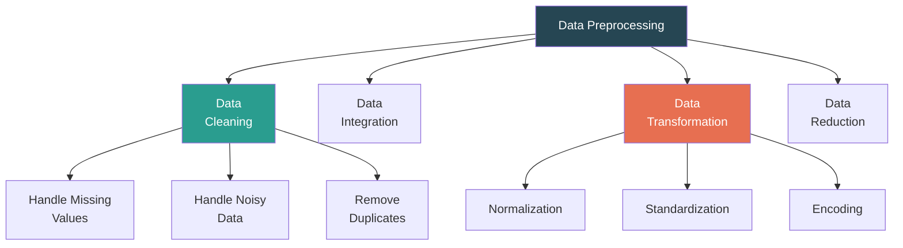

| Step | Purpose | Techniques |
|------|---------|-----------|
| **Data Cleaning** | Fix or remove incorrect, incomplete, corrupted data | Handle missing values, remove duplicates, fix inconsistencies |
| **Data Integration** | Combine data from multiple sources | Schema matching, entity resolution, redundancy removal |
| **Data Transformation** | Convert data into suitable format for analysis | Normalization, standardization, encoding, log transform |
| **Data Reduction** | Reduce data volume while maintaining integrity | Feature selection, dimensionality reduction, sampling |

### Python — Complete Preprocessing Pipeline

```python
import pandas as pd
import numpy as np

# Load data
df = pd.read_csv('dataset.csv')

# ---- DATA CLEANING ----

# Check for missing values
print(df.isnull().sum())

# Remove duplicates
df = df.drop_duplicates()
print(f"Shape after removing duplicates: {df.shape}")

# Fix inconsistent values
df['gender'] = df['gender'].str.lower().str.strip()
df['gender'] = df['gender'].replace({'m': 'male', 'f': 'female'})

# ---- DATA INTEGRATION ----
# Merge two dataframes
# df_merged = pd.merge(df1, df2, on='id', how='inner')

# ---- DATA TRANSFORMATION ----

# Encoding categorical variables
df_encoded = pd.get_dummies(df, columns=['gender', 'city'], drop_first=True)

# Log transformation for skewed data
df['log_income'] = np.log1p(df['income'])
```

---

## 2.3 Understanding Data

### Data Types

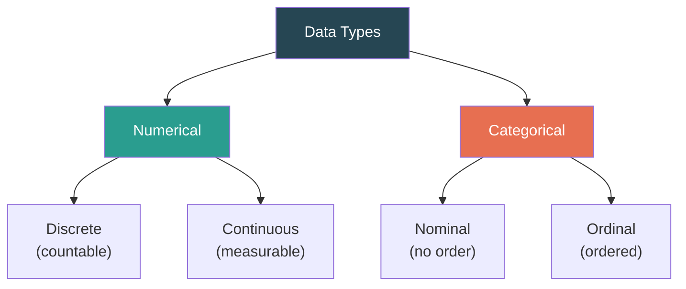

| Type | Subtype | Examples |
|------|---------|---------|
| **Numerical** | Discrete | Number of students, age (whole years), count of items |
| | Continuous | Salary, temperature, height, weight |
| **Categorical** | Nominal | Gender, color, city (no inherent order) |
| | Ordinal | Education level, satisfaction rating (has order) |

### Looking at the Data — Python

```python
import pandas as pd

df = pd.read_csv('dataset.csv')

# Basic info
print(df.shape)              # (rows, columns)
print(df.dtypes)             # Data types of each column
print(df.info())             # Non-null counts, dtypes, memory usage
print(df.head(10))           # First 10 rows
print(df.tail(5))            # Last 5 rows

# Statistical summary
print(df.describe())         # count, mean, std, min, 25%, 50%, 75%, max
print(df.describe(include='object'))  # For categorical columns

# Unique values
print(df['city'].nunique())       # Number of unique values
print(df['city'].value_counts())  # Frequency of each value

# Check for missing values
print(df.isnull().sum())
print(df.isnull().mean() * 100)   # Percentage missing
```

### Key Statistical Measures

```python
# Central Tendency
mean = df['salary'].mean()
median = df['salary'].median()
mode = df['salary'].mode()[0]

# Dispersion
std = df['salary'].std()
variance = df['salary'].var()
range_val = df['salary'].max() - df['salary'].min()
iqr = df['salary'].quantile(0.75) - df['salary'].quantile(0.25)

# Shape
skewness = df['salary'].skew()    # >0 right-skewed, <0 left-skewed
kurtosis = df['salary'].kurtosis() # >0 heavy tails, <0 light tails

# Correlation
print(df.corr())                   # Correlation matrix
```

| Measure | Formula/Meaning | Use |
|---------|----------------|-----|
| **Mean** | Sum / Count | Central value (sensitive to outliers) |
| **Median** | Middle value when sorted | Central value (robust to outliers) |
| **Mode** | Most frequent value | Most common category/value |
| **Std Dev (σ)** | √(Σ(xᵢ-μ)²/n) | Spread of data |
| **IQR** | Q3 - Q1 | Spread (robust to outliers) |
| **Skewness** | Asymmetry of distribution | Right-skewed: mean > median |
| **Kurtosis** | Tailedness of distribution | High: heavy tails, outliers |

---

## 2.4 Dealing with Missing Values

### Types of Missing Data

| Type | Meaning | Example |
|------|---------|---------|
| **MCAR** (Missing Completely At Random) | Missingness is unrelated to any variable | Data entry error randomly missed fields |
| **MAR** (Missing At Random) | Missingness depends on observed variables | Higher-income people skip income question less |
| **MNAR** (Missing Not At Random) | Missingness depends on the missing value itself | Sick patients too ill to attend follow-up |

### Techniques for Handling Missing Values

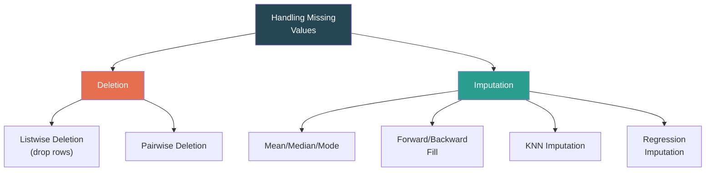

```python
import pandas as pd
import numpy as np
from sklearn.impute import SimpleImputer, KNNImputer

df = pd.read_csv('dataset.csv')

# --- DETECTION ---
print(df.isnull().sum())
print(df.isnull().mean() * 100)  # % missing per column

# --- DELETION ---
# Drop rows with any missing value
df_dropped = df.dropna()

# Drop rows where specific column is missing
df_dropped = df.dropna(subset=['age', 'salary'])

# Drop columns with >50% missing
threshold = len(df) * 0.5
df_dropped = df.dropna(thresh=threshold, axis=1)

# --- IMPUTATION: Mean/Median/Mode ---
# Numerical: fill with mean or median
df['age'].fillna(df['age'].mean(), inplace=True)
df['salary'].fillna(df['salary'].median(), inplace=True)

# Categorical: fill with mode
df['city'].fillna(df['city'].mode()[0], inplace=True)

# --- IMPUTATION: Forward/Backward Fill (time series) ---
df['temperature'].fillna(method='ffill', inplace=True)  # Forward fill
df['temperature'].fillna(method='bfill', inplace=True)  # Backward fill

# --- IMPUTATION: KNN Imputer ---
imputer = KNNImputer(n_neighbors=5)
df_numeric = df.select_dtypes(include=[np.number])
df_imputed = pd.DataFrame(
    imputer.fit_transform(df_numeric),
    columns=df_numeric.columns
)

# --- IMPUTATION: Using sklearn SimpleImputer ---
imputer = SimpleImputer(strategy='median')  # 'mean', 'median', 'most_frequent'
df[['age', 'salary']] = imputer.fit_transform(df[['age', 'salary']])
```

| Method | When to Use | Pros | Cons |
|--------|------------|------|------|
| **Drop rows** | Very few missing rows (<5%) | Simple, no bias introduced | Loses data |
| **Drop columns** | Column has >50% missing | Removes unreliable feature | Loses feature entirely |
| **Mean** | Numerical, normally distributed | Simple, preserves mean | Reduces variance, affected by outliers |
| **Median** | Numerical, skewed data | Robust to outliers | Reduces variance |
| **Mode** | Categorical data | Simple for categories | May over-represent one category |
| **Forward/Backward Fill** | Time series data | Preserves temporal patterns | Not suitable for non-sequential data |
| **KNN Imputer** | Complex relationships exist | Uses similar records | Computationally expensive |

---

## 2.5 Standardizing Data

### Why Standardize?

- Features at different scales can bias ML algorithms (e.g., salary in thousands vs age in tens)
- Algorithms using distance metrics (KNN, SVM, K-Means) are especially affected
- Gradient-based algorithms converge faster with standardized features

### Normalization vs Standardization

| Method | Formula | Range | When to Use |
|--------|---------|-------|-------------|
| **Min-Max Normalization** | x' = (x - min) / (max - min) | [0, 1] | When you need bounded values; data not heavily skewed |
| **Z-Score Standardization** | x' = (x - μ) / σ | ~ [-3, 3] | When data is normally distributed; most ML algorithms |
| **Robust Scaling** | x' = (x - median) / IQR | varies | When data has outliers |
| **Max-Abs Scaling** | x' = x / |max| | [-1, 1] | Sparse data |
| **Log Transform** | x' = log(x) | varies | Right-skewed data |

```python
import pandas as pd
from sklearn.preprocessing import (
    MinMaxScaler, StandardScaler, RobustScaler
)

df = pd.read_csv('dataset.csv')

# --- MIN-MAX NORMALIZATION ---
scaler = MinMaxScaler()
df[['age', 'salary']] = scaler.fit_transform(df[['age', 'salary']])

# --- Z-SCORE STANDARDIZATION ---
scaler = StandardScaler()
df[['age', 'salary']] = scaler.fit_transform(df[['age', 'salary']])

# --- ROBUST SCALER (handles outliers) ---
scaler = RobustScaler()
df[['age', 'salary']] = scaler.fit_transform(df[['age', 'salary']])

# --- MANUAL IMPLEMENTATION ---
# Min-Max
df['age_norm'] = (df['age'] - df['age'].min()) / (df['age'].max() - df['age'].min())

# Z-Score
df['salary_std'] = (df['salary'] - df['salary'].mean()) / df['salary'].std()

# Log Transform (for skewed data)
import numpy as np
df['log_salary'] = np.log1p(df['salary'])  # log(1+x) handles zero values
```

### Encoding Categorical Variables

```python
import pandas as pd
from sklearn.preprocessing import LabelEncoder, OneHotEncoder

# --- LABEL ENCODING (ordinal categories) ---
le = LabelEncoder()
df['education_encoded'] = le.fit_transform(df['education'])
# e.g., High School=0, Bachelor=1, Master=2, PhD=3

# --- ONE-HOT ENCODING (nominal categories) ---
df_encoded = pd.get_dummies(df, columns=['city'], drop_first=True)
# Creates binary columns: city_Mumbai, city_Delhi, etc.

# --- ORDINAL ENCODING (custom order) ---
from sklearn.preprocessing import OrdinalEncoder
oe = OrdinalEncoder(categories=[['Low', 'Medium', 'High']])
df['priority_encoded'] = oe.fit_transform(df[['priority']])
```

---

## 2.6 Steps Involved in EDA Using Python

### Complete EDA Pipeline

```python
import pandas as pd
import numpy as np
import matplotlib.pyplot as plt
import seaborn as sns

# ====== STEP 1: LOAD DATA ======
df = pd.read_csv('dataset.csv')

# ====== STEP 2: BASIC INSPECTION ======
print("Shape:", df.shape)
print("\nData Types:\n", df.dtypes)
print("\nFirst 5 rows:\n", df.head())
print("\nStatistical Summary:\n", df.describe())
print("\nMissing Values:\n", df.isnull().sum())

# ====== STEP 3: HANDLE MISSING VALUES ======
df['age'].fillna(df['age'].median(), inplace=True)
df['city'].fillna(df['city'].mode()[0], inplace=True)

# ====== STEP 4: UNIVARIATE ANALYSIS ======
# Distribution of numerical variable
plt.figure(figsize=(10, 4))
plt.subplot(1, 2, 1)
sns.histplot(df['salary'], kde=True, bins=30)
plt.title('Salary Distribution')

plt.subplot(1, 2, 2)
sns.boxplot(y=df['salary'])
plt.title('Salary Boxplot')
plt.tight_layout()
plt.show()

# Categorical variable frequency
sns.countplot(x='department', data=df)
plt.title('Department Distribution')
plt.show()

# ====== STEP 5: BIVARIATE ANALYSIS ======
# Numerical vs Numerical
sns.scatterplot(x='experience', y='salary', data=df)
plt.title('Experience vs Salary')
plt.show()

# Correlation heatmap
plt.figure(figsize=(8, 6))
sns.heatmap(df.corr(), annot=True, cmap='coolwarm', center=0)
plt.title('Correlation Matrix')
plt.show()

# Categorical vs Numerical
sns.boxplot(x='department', y='salary', data=df)
plt.title('Salary by Department')
plt.show()

# ====== STEP 6: MULTIVARIATE ANALYSIS ======
sns.pairplot(df, hue='department')
plt.show()

# ====== STEP 7: OUTLIER DETECTION ======
Q1 = df['salary'].quantile(0.25)
Q3 = df['salary'].quantile(0.75)
IQR = Q3 - Q1
lower = Q1 - 1.5 * IQR
upper = Q3 + 1.5 * IQR
outliers = df[(df['salary'] < lower) | (df['salary'] > upper)]
print(f"Outliers detected: {len(outliers)}")
```

---

# Chapter 3: Data Modelling — Feature Selection, Engineering & Data Pipelines

---

## 3.1 Feature Selection

**Feature selection** is the process of selecting the most relevant features (variables) for building a predictive model. It reduces overfitting, improves accuracy, and reduces training time.

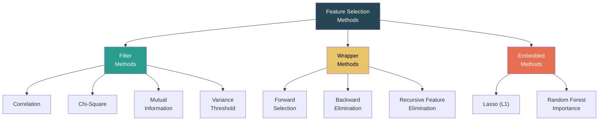

| Method | How It Works | Pros | Cons |
|--------|-------------|------|------|
| **Filter** | Rank features by statistical metric, independent of model | Fast, scalable | Ignores feature interactions |
| **Wrapper** | Use a model to evaluate feature subsets | Considers interactions | Computationally expensive |
| **Embedded** | Feature selection during model training | Balanced speed & accuracy | Model-specific |

```python
import pandas as pd
import numpy as np
from sklearn.feature_selection import (
    SelectKBest, chi2, mutual_info_classif,
    VarianceThreshold, RFE
)
from sklearn.ensemble import RandomForestClassifier

df = pd.read_csv('dataset.csv')
X = df.drop('target', axis=1)
y = df['target']

# --- FILTER: Variance Threshold ---
selector = VarianceThreshold(threshold=0.1)
X_filtered = selector.fit_transform(X)
print(f"Features after variance filter: {X_filtered.shape[1]}")

# --- FILTER: SelectKBest with chi-square ---
selector = SelectKBest(chi2, k=10)
X_best = selector.fit_transform(X, y)
best_features = X.columns[selector.get_support()]
print(f"Top 10 features: {list(best_features)}")

# --- FILTER: Correlation-based ---
corr_matrix = X.corr().abs()
upper = corr_matrix.where(np.triu(np.ones(corr_matrix.shape), k=1).astype(bool))
to_drop = [col for col in upper.columns if any(upper[col] > 0.85)]
X_reduced = X.drop(to_drop, axis=1)
print(f"Dropped highly correlated: {to_drop}")

# --- WRAPPER: Recursive Feature Elimination (RFE) ---
model = RandomForestClassifier(n_estimators=100)
rfe = RFE(model, n_features_to_select=10)
rfe.fit(X, y)
selected = X.columns[rfe.support_]
print(f"RFE selected features: {list(selected)}")

# --- EMBEDDED: Random Forest Feature Importance ---
model = RandomForestClassifier(n_estimators=100)
model.fit(X, y)
importances = pd.Series(model.feature_importances_, index=X.columns)
top_features = importances.nlargest(10)
print(f"Top 10 important features:\n{top_features}")
```

---

## 3.2 Dimensionality Reduction

**Dimensionality reduction** transforms high-dimensional data into a lower-dimensional representation while preserving important information.

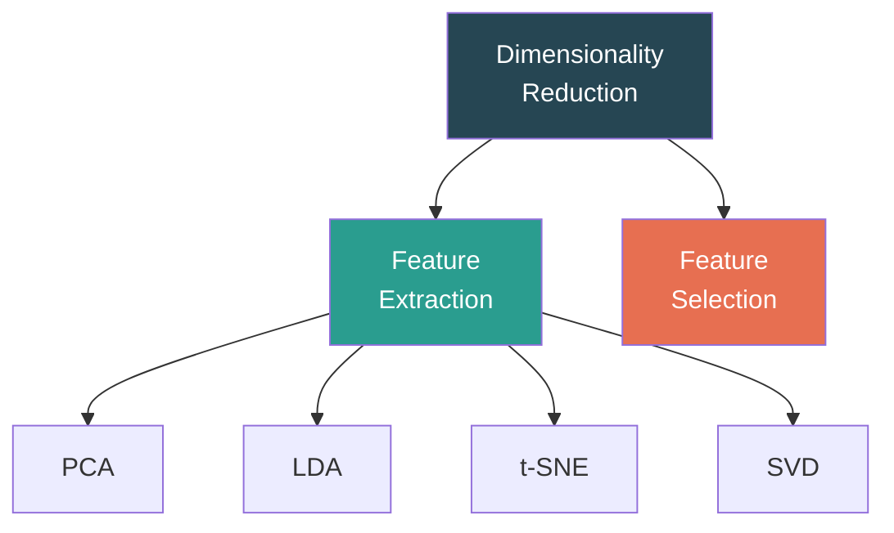

### PCA (Principal Component Analysis)

**PCA** finds new axes (principal components) that capture the maximum variance in the data.

**Steps:**
1. Standardize the data
2. Compute covariance matrix
3. Calculate eigenvalues and eigenvectors
4. Sort by eigenvalue (descending)
5. Select top-k eigenvectors
6. Transform data to new k-dimensional space

```python
from sklearn.preprocessing import StandardScaler
from sklearn.decomposition import PCA
import matplotlib.pyplot as plt

# Standardize
scaler = StandardScaler()
X_scaled = scaler.fit_transform(X)

# Apply PCA
pca = PCA(n_components=2)
X_pca = pca.fit_transform(X_scaled)

# Explained variance
print(f"Explained variance ratio: {pca.explained_variance_ratio_}")
print(f"Total variance explained: {sum(pca.explained_variance_ratio_):.2%}")

# Scree plot — how many components to keep?
pca_full = PCA()
pca_full.fit(X_scaled)
plt.plot(range(1, len(pca_full.explained_variance_ratio_) + 1),
         np.cumsum(pca_full.explained_variance_ratio_))
plt.xlabel('Number of Components')
plt.ylabel('Cumulative Variance Explained')
plt.axhline(y=0.95, color='r', linestyle='--', label='95% threshold')
plt.title('Scree Plot')
plt.legend()
plt.show()

# Visualize 2D projection
plt.scatter(X_pca[:, 0], X_pca[:, 1], c=y, cmap='viridis', alpha=0.5)
plt.xlabel('PC1')
plt.ylabel('PC2')
plt.title('PCA — 2D Projection')
plt.colorbar(label='Target')
plt.show()
```

| Method | Supervised? | Use Case |
|--------|-----------|----------|
| **PCA** | No | General dimensionality reduction; captures maximum variance |
| **LDA** | Yes | Maximizes class separability; best for classification |
| **t-SNE** | No | Visualization of high-dimensional data (2D/3D) |
| **SVD** | No | Matrix factorization; used in recommendation systems, NLP |

---

## 3.3 Independent and Dependent Variables

| | Independent Variable (X) | Dependent Variable (Y) |
|---|---|---|
| **Also called** | Feature, predictor, input, explanatory | Target, response, output, outcome |
| **Role** | Cause / Input to model | Effect / What we want to predict |
| **Example** | Study hours, experience, age | Exam score, salary, diagnosis |

```python
# Defining X and y
X = df[['study_hours', 'attendance', 'past_score']]  # Independent
y = df['exam_score']                                    # Dependent

from sklearn.model_selection import train_test_split
X_train, X_test, y_train, y_test = train_test_split(X, y, test_size=0.2, random_state=42)
```

---

## 3.4 Relationship Between Variables: Correlation

**Correlation** measures the strength and direction of the linear relationship between two variables.

| Coefficient | Range | Interpretation |
|------------|-------|---------------|
| **Pearson's r** | [-1, 1] | Linear correlation; r=+1 perfect positive, r=-1 perfect negative, r=0 no linear |
| **Spearman's ρ** | [-1, 1] | Rank-based correlation; works for non-linear monotonic relationships |
| **Kendall's τ** | [-1, 1] | Rank-based; better for small samples and ordinal data |

```python
import seaborn as sns
import matplotlib.pyplot as plt

# Pearson correlation
corr = df.corr(method='pearson')
print(corr)

# Spearman correlation (for non-linear)
corr_spearman = df.corr(method='spearman')

# Heatmap visualization
plt.figure(figsize=(10, 8))
sns.heatmap(corr, annot=True, cmap='coolwarm', center=0,
            fmt='.2f', square=True, linewidths=0.5)
plt.title('Correlation Heatmap')
plt.show()

# Pairplot for visual relationships
sns.pairplot(df[['salary', 'experience', 'age', 'education_years']])
plt.show()
```

**Correlation ≠ Causation:** Two variables can be correlated without one causing the other (e.g., ice cream sales and drowning — both caused by hot weather).

---

## 3.5 Multicollinearity

**Multicollinearity** occurs when two or more independent variables are highly correlated with each other. This inflates standard errors and makes it difficult to determine the individual effect of each variable.

### Detection Methods

| Method | How | Threshold |
|--------|-----|-----------|
| **Correlation Matrix** | Check pairwise correlations | \|r\| > 0.8 indicates issue |
| **VIF (Variance Inflation Factor)** | 1/(1-R²) for each feature regressed on others | VIF > 5 = moderate; VIF > 10 = severe |
| **Condition Number** | Ratio of largest to smallest eigenvalue | > 30 indicates multicollinearity |

```python
import pandas as pd
import numpy as np
from statsmodels.stats.outliers_influence import variance_inflation_factor

# --- METHOD 1: Correlation Matrix ---
corr = df[['age', 'experience', 'salary', 'education_years']].corr()
print("High correlations (|r| > 0.8):")
for i in range(len(corr.columns)):
    for j in range(i+1, len(corr.columns)):
        if abs(corr.iloc[i, j]) > 0.8:
            print(f"  {corr.columns[i]} & {corr.columns[j]}: {corr.iloc[i,j]:.3f}")

# --- METHOD 2: VIF ---
X = df[['age', 'experience', 'salary', 'education_years']]
vif_data = pd.DataFrame()
vif_data['Feature'] = X.columns
vif_data['VIF'] = [variance_inflation_factor(X.values, i) for i in range(X.shape[1])]
print("\nVIF Values:")
print(vif_data)
# VIF > 10 → remove or combine the feature

# --- TREATMENT ---
# Option 1: Remove one of the highly correlated features
# Option 2: PCA to combine correlated features
# Option 3: Ridge regression (L2) which handles multicollinearity
```

### Treatment of Multicollinearity

| Method | Description |
|--------|-------------|
| **Remove features** | Drop one of the highly correlated pair |
| **PCA** | Combine correlated features into principal components |
| **Ridge Regression (L2)** | Penalizes large coefficients, stabilizes estimates |
| **Domain knowledge** | Choose the more meaningful feature based on context |

---

## 3.6 Factor Analysis

**Factor Analysis** identifies **latent (hidden) factors** that explain the correlations among observed variables. It reduces many observed variables into fewer unobserved factors.

**Difference from PCA:**
| | PCA | Factor Analysis |
|---|---|---|
| **Goal** | Maximize variance explained | Identify latent factors causing correlations |
| **Assumption** | Components = linear combos of variables | Variables = linear combos of factors + error |
| **Error term** | No explicit error | Each variable has unique error (uniqueness) |
| **Use case** | Dimensionality reduction | Understanding underlying structure |

```python
from sklearn.decomposition import FactorAnalysis
import pandas as pd

X = df[['math_score', 'physics_score', 'chemistry_score',
        'english_score', 'history_score', 'geography_score']]

# Apply Factor Analysis with 2 factors
fa = FactorAnalysis(n_components=2, random_state=42)
X_factors = fa.fit_transform(X)

# Factor loadings — how each variable relates to each factor
loadings = pd.DataFrame(
    fa.components_.T,
    columns=['Factor 1', 'Factor 2'],
    index=X.columns
)
print("Factor Loadings:")
print(loadings.round(3))

# Interpretation example:
# Factor 1 loads high on math, physics, chemistry → "Science aptitude"
# Factor 2 loads high on english, history, geography → "Humanities aptitude"
```

---

## 3.7 Treatment of Outliers

**Outliers** are data points significantly different from other observations. They can distort statistical analyses and ML model performance.

### Detection Methods

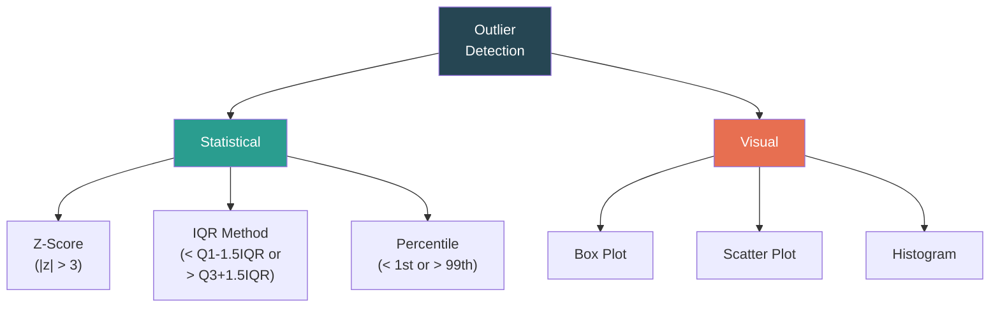

```python
import numpy as np
import pandas as pd
import matplotlib.pyplot as plt
import seaborn as sns

# --- DETECTION: IQR Method ---
Q1 = df['salary'].quantile(0.25)
Q3 = df['salary'].quantile(0.75)
IQR = Q3 - Q1
lower_bound = Q1 - 1.5 * IQR
upper_bound = Q3 + 1.5 * IQR

outliers = df[(df['salary'] < lower_bound) | (df['salary'] > upper_bound)]
print(f"Outliers: {len(outliers)} out of {len(df)} ({len(outliers)/len(df)*100:.1f}%)")

# --- DETECTION: Z-Score Method ---
from scipy import stats
z_scores = np.abs(stats.zscore(df['salary']))
outliers_z = df[z_scores > 3]
print(f"Z-score outliers: {len(outliers_z)}")

# --- VISUAL DETECTION ---
fig, axes = plt.subplots(1, 2, figsize=(12, 4))
sns.boxplot(y=df['salary'], ax=axes[0])
axes[0].set_title('Boxplot — Outlier Detection')
sns.histplot(df['salary'], kde=True, ax=axes[1])
axes[1].set_title('Distribution')
plt.tight_layout()
plt.show()
```

### Treatment Methods

```python
# --- REMOVAL ---
df_clean = df[(df['salary'] >= lower_bound) & (df['salary'] <= upper_bound)]

# --- CAPPING (Winsorization) ---
df['salary_capped'] = df['salary'].clip(lower=lower_bound, upper=upper_bound)

# --- TRANSFORMATION ---
df['salary_log'] = np.log1p(df['salary'])          # Log transform
df['salary_sqrt'] = np.sqrt(df['salary'])           # Square root

# --- IMPUTATION (replace with median) ---
median_salary = df['salary'].median()
df.loc[df['salary'] > upper_bound, 'salary'] = median_salary
df.loc[df['salary'] < lower_bound, 'salary'] = median_salary

# --- BINNING ---
df['salary_bin'] = pd.cut(df['salary'], bins=5, labels=['Very Low', 'Low', 'Mid', 'High', 'Very High'])
```

| Method | When to Use | Effect |
|--------|------------|--------|
| **Remove** | Clear errors or tiny dataset impact | Loses data |
| **Cap (Winsorize)** | Want to keep data but limit extremes | Preserves count, modifies values |
| **Log/Sqrt Transform** | Right-skewed distributions | Reduces impact, normalizes distribution |
| **Replace with median** | Few outliers, want to preserve count | Loses extreme information |
| **Binning** | Convert to categories for certain models | Loses granularity |
| **Keep as-is** | Outliers are genuine and informative | May affect model accuracy |

> **Key decision:** Always investigate outliers before treating. Ask: Is this a data error or a genuine extreme value? Domain knowledge is essential.

---
