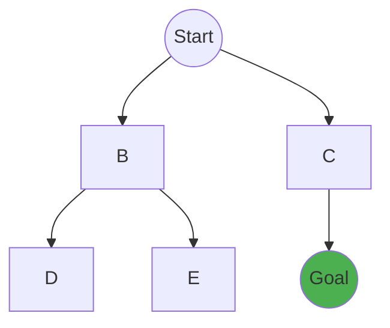

---

# **Artificial Intelligence and Data Science (AIDS) — ISE 2 Complete Notes**

---

# **Module 4: Data Visualization**

## **Importance of Data Visualization**
Data visualization is the graphical representation of information. By using visual elements like charts, graphs, and maps, it provides an accessible way to see and understand trends, outliers, and patterns in data. 
- **Rapid Processing:** Human brains process visuals 60,000 times faster than text.
- **Pattern Recognition:** It easily exposes correlations that might go unnoticed in text-based data sets.
- **Storytelling:** It conveys complex analytical results to non-technical stakeholders effectively.

## **Looking at Data (Exploratory Data Analysis)**
Before applying complex Machine Learning algorithms, Data Scientists must "look" at the data. This involves:
- **Identifying missing values (NaNs).**
- **Understanding data distributions.**
- **Spotting anomalies (outliers)** that could break predictive models.
- **Checking multi-collinearity** between independent variables.

## **Visualization of Data (Techniques & Python Implementation)**

### **1. Histogram**
Best used for **Continuous Numerical Data**. It groups continuous data into discrete bins, showing the frequency of data points falling into each bin.
- **Purpose:** Analyzing the underlying distribution (e.g., normal, skewed).
```python
import seaborn as sns
import matplotlib.pyplot as plt

# Visualizing Age Distribution
data = [22, 25, 30, 35, 40, 45, 50, 55, 60]
sns.histplot(data, bins=5, kde=True, color='blue')
plt.title('Age Distribution')
plt.show()
```

### **2. Countplot**
Best used for **Categorical Data**. It shows the raw counts of observations in each categorical bin using bars.
- **Purpose:** Excellent for identifying class imbalances in datasets.
```python
import seaborn as sns

# Visualizing Gender Count
sns.countplot(x='Gender', data=customer_dataset, palette='Set2')
```

### **3. Boxplot (Whisker Plot)**
Displays the five-number summary of a set of data: minimum, first quartile (Q1), median, third quartile (Q3), and maximum.
- **Purpose:** The absolute best tool for **Outlier Detection**. Points lying beyond the "whiskers" are mathematically considered outliers.
```python
import seaborn as sns

# Detecting outliers in Spending Score
sns.boxplot(x='Category', y='Spending_Score', data=dataset)
```

## **Data Visualization for Machine Learning**
Visualization doesn't stop at EDA; it's heavily used to evaluate ML models.
- **Confusion Matrix:** A heatmap displaying True Positives, False Positives, etc., to evaluate Classification models.
- **ROC Curve:** Plots the True Positive Rate against the False Positive Rate.
- **Elbow Curve:** Used in K-Means clustering to visually find the optimal number of clusters ($K$).

## **Other Data Visualization Techniques**
- **Scatter Plot:** Visualizes the relationship (correlation) between two continuous numeric variables.
- **Line Chart:** Best for visualizing Time-Series data (e.g., Stock prices over 5 years).
- **Heatmap:** Uses color gradients to represent complex matrices (like a correlation matrix).

---

# **Module 5: Problem Solving in AI**

## **Problem Solving Agent**
An agent that systematically searches for a sequence of actions leading to a desired goal. It follows a loop:
1. **Formulate Goal:** Decide what constitutes a successful state.
2. **Formulate Problem:** Define the states and actions to consider.
3. **Search:** Determine the sequence of actions.
4. **Execute:** Carry out the actions.

## **Formulating Problems (State Space Search)**
A problem is defined by five components:
1. **Initial State:** Where the agent begins.
2. **Actions:** The set of valid moves.
3. **Transition Model:** What each action does (State + Action = New State).
4. **Goal Test:** Checks if the current state is the goal.
5. **Path Cost:** A numeric cost assigned to a path (e.g., distance, time).

## **Example Problems**

### **1. The 8-Puzzle Problem**
- **Initial State:** A scrambled 3x3 grid of tiles (1-8 and one blank).
- **Goal State:** Tiles ordered sequentially.
- **Operators:** Move blank Up, Down, Left, Right.

### **2. The 8-Queens Problem**
- **Constraints:** Place 8 queens on a chessboard so none attack each other (no shared row, column, or diagonal).
- **Approach:** Backtracking is used to place queens and instantly revert if a constraint is violated, vastly outperforming brute force.

### **3. Travelling Salesman Problem (TSP)**
- **Goal:** Visit a set of cities exactly once, return to start, and minimize total distance.
- **Challenge:** Combinatorial explosion. Exact methods ($O(n!)$) fail for large $N$.

## **Uninformed Search Methods (Blind Search)**
These algorithms have no additional information about the goal beyond the problem definition.

### **Breadth-First Search (BFS)**
- **Mechanism:** Expands the shallowest unexpanded node. Uses a **FIFO Queue**.
- **Pros:** Guaranteed to find the optimal (shortest) path in unweighted graphs.
- **Cons:** Extremely high memory consumption (must store all nodes in a level).



### **Depth-First Search (DFS)**
- **Mechanism:** Expands the deepest unexpanded node. Uses a **LIFO Stack**.
- **Pros:** Highly memory efficient compared to BFS.
- **Cons:** Can get trapped in infinite loops. Cannot guarantee the optimal path.

## **Informed Search Method (Heuristic Search)**
Uses domain-specific knowledge to find solutions faster.

### **A* Search Algorithm**
A* evaluates nodes by combining actual cost ($g(n)$) and estimated cost to goal ($h(n)$).
- **Formula:** $f(n) = g(n) + h(n)$
- **Heuristic ($h(n)$):** A guess (e.g., straight-line Euclidean distance).
- **Optimality:** If the heuristic is *admissible* (never overestimates), A* is mathematically guaranteed to find the optimal path without wasting time checking useless nodes.

## **Local Search Methods**
Used for optimization problems where the path to the goal doesn't matter, only the final state (e.g., TSP).

### **Hill Climbing Algorithm**
It evaluates neighboring states and continuously moves to the state with the highest value (up the hill). 
- **Drawbacks:**
  - **Local Maxima:** Gets stuck on a peak that is lower than the highest overall peak.
  - **Plateaus:** A flat landscape where all neighbors have equal value, causing random wandering.

## **Genetic Algorithms (Evolutionary Search)**
Inspired by Darwinian evolution.
1. **Population:** Starts with a random set of solutions (Chromosomes).
2. **Fitness Function:** Evaluates how "good" each solution is.
3. **Selection:** The fittest individuals are chosen to reproduce.
4. **Crossover:** Parents combine traits to create offspring.
5. **Mutation:** Random small tweaks maintain genetic diversity, preventing the algorithm from getting stuck in local maxima.

---

# **Module 6: Sustainable Agriculture and Food Systems**

## **The Role of Sustainable Agriculture in Ensuring Food Security**
Sustainable agriculture aims to meet current food needs without destroying the ecosystem for future generations.
- **Food Security Dimensions:** Availability, Access, Utilization, and Stability.
- **Role:** By conserving soil nutrients, limiting toxic pesticide runoff, and using water efficiently, sustainable farming guarantees the **Stability** and **Long-term Availability** of food globally.
- **Key Objectives:**
  - *Environmental:* Protect biodiversity and soil health.
  - *Economic:* Ensure farm profitability.
  - *Social:* Provide fair labor conditions.

## **Precision Farming (AI in Agriculture)**
Using data to optimize crop yields.
- Deploys **IoT Sensors** for soil moisture.
- Uses **Drone Imagery** with ML to detect crop disease early.
- Applies water and fertilizer *only* where explicitly needed, minimizing waste and environmental damage.

## **Global vs. Local Food Systems**

| Feature | Global Food System | Local Food System |
| :--- | :--- | :--- |
| **Scale** | Massive, industrial agribusinesses. | Small, community-based farms. |
| **Supply Chain** | Complex, international, high carbon footprint. | Short, direct (Farmer's Markets), low emissions. |
| **Variety** | Any produce available year-round. | Seasonal, native produce. |
| **Efficiency** | Extremely high yield, cheaper consumer prices. | Lower yield, slightly higher prices, but organic. |

## **Challenges and Opportunities in Feeding a Growing Population**
The global population is projected to hit 10 Billion by 2050, requiring a 60% increase in food production.

### **Challenges**
1. **Climate Change:** Extreme weather, unpredictable rainfall, and shifting pest habitats directly destroy crop yields.
2. **Water Scarcity:** Agriculture already consumes 70% of the world's freshwater.
3. **Food Wastage:** Over 30% of global food is wasted due to horrific logistical supply chain inefficiencies and retail overstocking.

### **Opportunities (Data-Driven Solutions)**
- **Predictive Analytics:** AI forecasting demand accurately so supermarkets stop over-ordering perishables.
- **Route Optimization:** Using ML logistics algorithms to find the fastest transport routes for cold-chain trucks, heavily reducing spoilage time and fuel emissions.
- **Climate-Resilient Crops:** Using genetic algorithms and bioinformatics to engineer drought-resistant seeds.

---
