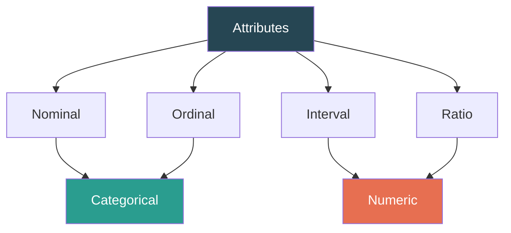
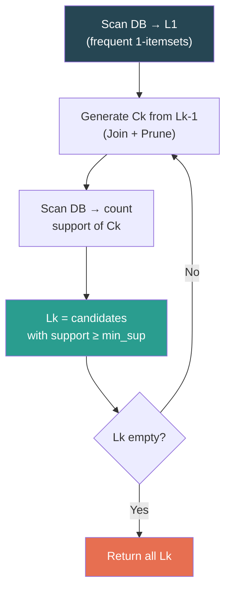

# DMBI ISE 1 — Quick Revision Notes

---

# Chapter 1: Data Warehousing & Data Mining

---

## Data Mining — Definition

> **Data Mining** is the non-trivial extraction of implicit, previously unknown, and potentially useful patterns from large datasets. Also called **Knowledge Discovery in Databases (KDD)**.

---

## Data Warehouse — Key Concepts

| Characteristic | One-liner |
|---|---|
| **Subject-Oriented** | Organized around subjects (customers, sales), not applications |
| **Integrated** | Data from multiple sources cleaned & unified |
| **Time-Variant** | Historical data (5-10 yrs), every key has a time element |
| **Non-Volatile** | Read-only after loading; no update/delete |

### DW vs Transactional DB (OLTP vs OLAP)

| | OLTP (Operational) | OLAP (Data Warehouse) |
|---|---|---|
| **Purpose** | Day-to-day operations | Decision support / Analysis |
| **Data** | Current, detailed | Historical, consolidated |
| **Operations** | Insert, Update, Delete | Mostly Read (SELECT) |
| **Design** | ER-based, normalized (3NF) | Star/Snowflake, de-normalized |
| **Users** | Clerks, IT | Managers, Analysts |
| **Queries** | Simple, short | Complex, ad-hoc, aggregations |

### Data Mart

A **Data Mart** is a **subset** of a data warehouse focused on a specific department or business function (e.g., Sales Data Mart, Marketing Data Mart). It is smaller, faster to query, and easier to build than a full warehouse.

### OLAP Operations

| Operation | Description |
|---|---|
| **Roll-Up** | Aggregate up hierarchy (City → State → Country) |
| **Drill-Down** | Go to finer detail (Year → Quarter → Month) |
| **Slice** | Fix one dimension (e.g., only Q1) |
| **Dice** | Fix multiple dimensions (Q1 + Product A + Mumbai) |
| **Pivot** | Rotate axes for alternate view |

---

## Structured, Semi-Structured & Unstructured Data

| Type | Description | Examples |
|---|---|---|
| **Structured** | Fixed schema, organized in rows/columns | RDBMS tables, spreadsheets |
| **Semi-Structured** | Partial schema, self-describing tags | JSON, XML, HTML, emails |
| **Unstructured** | No predefined schema or format | Text docs, images, videos, audio |

---

## KDD Process

---

## Major Data Mining Tasks / Patterns

| Task | What it does | Example |
|---|---|---|
| **Classification** | Assign to predefined classes | Spam / Not Spam |
| **Clustering** | Group similar objects (no predefined labels) | Customer segmentation |
| **Association Rules** | Find item co-occurrences | Bread → Butter |
| **Regression** | Predict continuous value | House price prediction |
| **Outlier Detection** | Find deviations from norm | Fraud detection |
| **Sequential Patterns** | Find event sequences | Phone → Case → Charger |

### Characterization & Discrimination

- **Characterization** — Summarizes the general features of a target class. (e.g., describe the profile of customers who spend > ₹10,000/month)
- **Discrimination** — Compares the target class against one or more contrasting classes. (e.g., how do high-spenders differ from low-spenders?)

---

## Types of Attributes

| Type | Order? | Zero? | Operations | Example |
|---|---|---|---|---|
| **Nominal** | ✗ | ✗ | =, ≠ | Gender, Color, ID |
| **Ordinal** | ✓ | ✗ | =, ≠, <, > | Grades, Size (S/M/L) |
| **Interval** | ✓ | No true zero | +, − | Temperature °C, IQ |
| **Ratio** | ✓ | True zero | +, −, ×, ÷ | Weight, Age, Salary |

**Impact on Analysis:** Determines which statistical operations, distance measures, and mining algorithms are valid. E.g., mean is meaningless for nominal data; ratios only valid for ratio scale.

---

## "Data Can Be Dirty" — Why Preprocessing?

| Problem | Example |
|---|---|
| **Incomplete** | Missing values (Occupation = "") |
| **Noisy** | Errors/outliers (Salary = −10) |
| **Inconsistent** | Contradictions (Age=42, DOB=2010) |
| **Redundant** | Duplicate records |

> **"Garbage In, Garbage Out"** — Dirty data → poor mining results.

---

## Data Preprocessing — Major Tasks

| Task | Purpose |
|---|---|
| **Cleaning** | Handle missing values, smooth noisy data, fix inconsistencies |
| **Integration** | Merge data from multiple sources (resolve naming, redundancy) |
| **Reduction** | Reduce volume — attribute selection, sampling, clustering, histograms |
| **Transformation** | Normalize, bin, discretize, aggregate |

---

## Data Correlation

**Correlation** measures the strength and direction of the linear relationship between two variables.

- **Pearson's r** = Σ(aᵢ−Ā)(bᵢ−B̄) / (n × σ_A × σ_B)
- r = +1 → perfect positive | r = −1 → perfect negative | r = 0 → no correlation
- **χ² (Chi-Square) test** — tests correlation for **nominal** attributes

---

## Binning — Solved Example

**Data:** 4, 8, 15, 21, 21, 24, 25, 28, 34

### (a) Equal Width Partitioning (3 bins)

Width = (34 − 4) / 3 = 10

| Bin | Range | Values |
|---|---|---|
| 1 | [4–14] | 4, 8 |
| 2 | [14–24] | 15, 21, 21, 24 |
| 3 | [24–34] | 25, 28, 34 |

### (b) Equal Frequency Partitioning (3 bins, 3 values each)

| Bin | Values |
|---|---|
| 1 | 4, 8, 15 |
| 2 | 21, 21, 24 |
| 3 | 25, 28, 34 |

**Smoothing:** Replace values by bin mean, median, or nearest boundary.

---

## Normalization — Quick Formulas

| Method | Formula |
|---|---|
| **Min-Max** | v' = (v − min)/(max − min) |
| **Z-Score** | v' = (v − x̄) / σ |
| **Decimal Scaling** | v' = v / 10^j |

---

## Similarity & Distance — Quick Reference

| Measure | Formula |
|---|---|
| **Euclidean** | √(Σ(xᵢ − yᵢ)²) |
| **Manhattan** | Σ\|xᵢ − yᵢ\| |
| **SMC** | (q + t) / p |
| **Jaccard** | q / (q + r + s) |
| **Cosine** | (X·Y) / (‖X‖ × ‖Y‖) |

---

# Chapter 2: Data Warehousing & OLAP

*(Covered above in Chapter 1 — DW concepts, OLTP vs OLAP, Data Marts, OLAP operations, Star/Snowflake schemas)*

---

# Chapter 3: Frequent Pattern Mining

---

## Key Definitions

| Term | Definition |
|---|---|
| **Frequent Pattern** | An itemset/subsequence/substructure that appears in a dataset with frequency ≥ **min_sup** threshold |
| **Support** | support(X) = σ(X) / N — fraction of transactions containing X |
| **Confidence** | confidence(X→Y) = σ(X∪Y) / σ(X) — how often Y appears when X is present |
| **Lift** | lift(X→Y) = confidence(X→Y) / support(Y) — >1 positive, =1 independent, <1 negative |
| **Strong Rule** | A rule that meets both min_sup AND min_conf |

---

## Apriori Algorithm — Flow

**Apriori Property:** If an itemset is infrequent → all its supersets are infrequent. Used to prune candidates.

### Solved Example

**Transactions (min_sup = 2):**

| TID | Items |
|---|---|
| T1 | {A, B, E} |
| T2 | {B, D} |
| T3 | {B, C} |
| T4 | {A, B, D} |
| T5 | {A, C} |
| T6 | {B, C} |
| T7 | {A, C} |
| T8 | {A, B, C, E} |
| T9 | {A, B, C} |

**L₁:** A(6), B(7), C(6), D(2), E(2) — all frequent

**L₂:** {A,B}:4 ✓, {A,C}:4 ✓, {A,E}:2 ✓, {B,C}:4 ✓, {B,D}:2 ✓, {B,E}:2 ✓ | {A,D}:1 ✗, {C,D}:0 ✗, {C,E}:1 ✗, {D,E}:0 ✗

**L₃:** {A,B,C}:2 ✓, {A,B,E}:2 ✓ | Others pruned (subset not in L₂)

**C₄:** {A,B,C,E} pruned ({A,C,E} ∉ L₃) → **STOP**

### Generating Rules from {A,B,C} (min_conf = 50%)

| Rule | Confidence | Strong? |
|---|---|---|
| AB → C | 2/4 = 50% | ✓ |
| AC → B | 2/4 = 50% | ✓ |
| BC → A | 2/4 = 50% | ✓ |
| A → BC | 2/6 = 33% | ✗ |
| B → AC | 2/7 = 29% | ✗ |
| C → AB | 2/6 = 33% | ✗ |

---

## FP-Growth — Key Points

- **No candidate generation** — compresses DB into an **FP-Tree**
- Only **2 DB scans** (vs multiple for Apriori)
- Mines by building **Conditional Pattern Bases** → **Conditional FP-Trees** → recursion

---

## Vertical Data Format (ECLAT)

Instead of TID → Items, store **Item → TID set**:

| Item | TID Set |
|---|---|
| A | {T1, T4, T5, T7, T8, T9} |
| B | {T1, T2, T3, T4, T6, T8, T9} |
| C | {T3, T5, T6, T7, T8, T9} |

**Support({A,B})** = |tidset(A) ∩ tidset(B)| = |{T1,T4,T8,T9}| = 4

No further DB scans needed — just **set intersections**.

---

## Comparison of Approaches

| | Apriori | FP-Growth | ECLAT |
|---|---|---|---|
| **Strategy** | Candidate gen + test | Pattern growth | Set intersection |
| **DB Scans** | Multiple | 2 | 1 |
| **Best For** | Sparse, short | Dense, long | Medium |

---

## Applications of Frequent Pattern Mining

| Application | How FPM is Used |
|---|---|
| **Market Basket Analysis** | Product associations for cross-selling, store layout |
| **Medical Diagnosis** | Find co-occurring symptoms/diseases |
| **Web Usage Mining** | Pages frequently visited together |
| **Fraud Detection** | Unusual transaction patterns |
| **Bioinformatics** | Gene expression patterns |
| **Recommendation Systems** | "Customers also bought..." |
| **Telecom** | Call pattern analysis, churn prediction |

---

## Pattern Interestingness — Why Confidence Can Be Misleading

| | Coffee=Yes | Coffee=No | Total |
|---|---|---|---|
| **Tea=Yes** | 150 | 50 | 200 |
| **Tea=No** | 650 | 150 | 800 |
| **Total** | 800 | 200 | 1000 |

- confidence(Tea→Coffee) = 150/200 = **75%** (seems strong!)
- P(Coffee) = 800/1000 = **80%**
- **Lift = 0.75/0.80 = 0.94 < 1** → Actually **negative correlation!**

> Use **Lift**, **Kulczynski**, or **Cosine** (null-invariant measures) instead of confidence alone.

---
