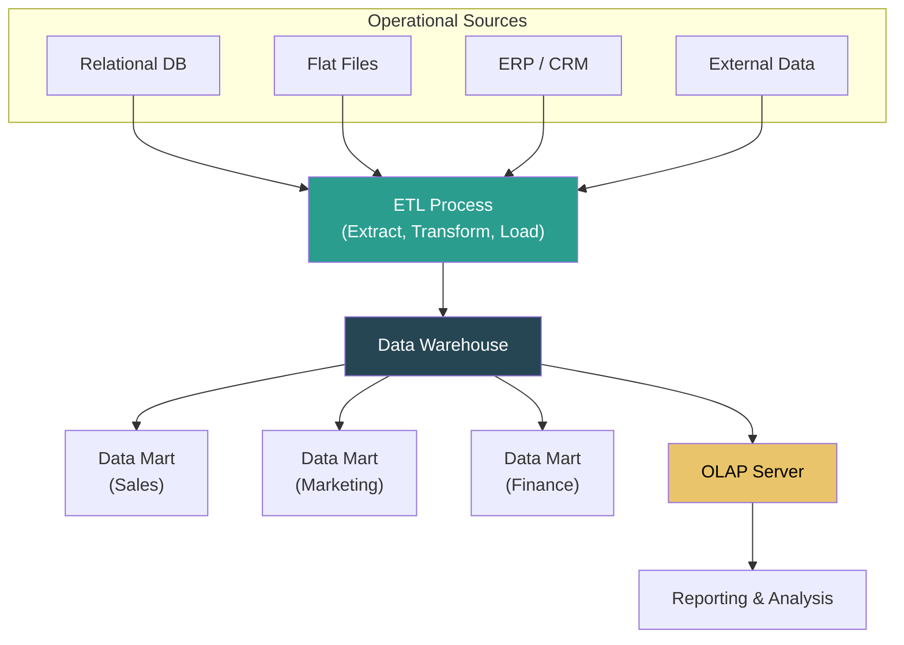
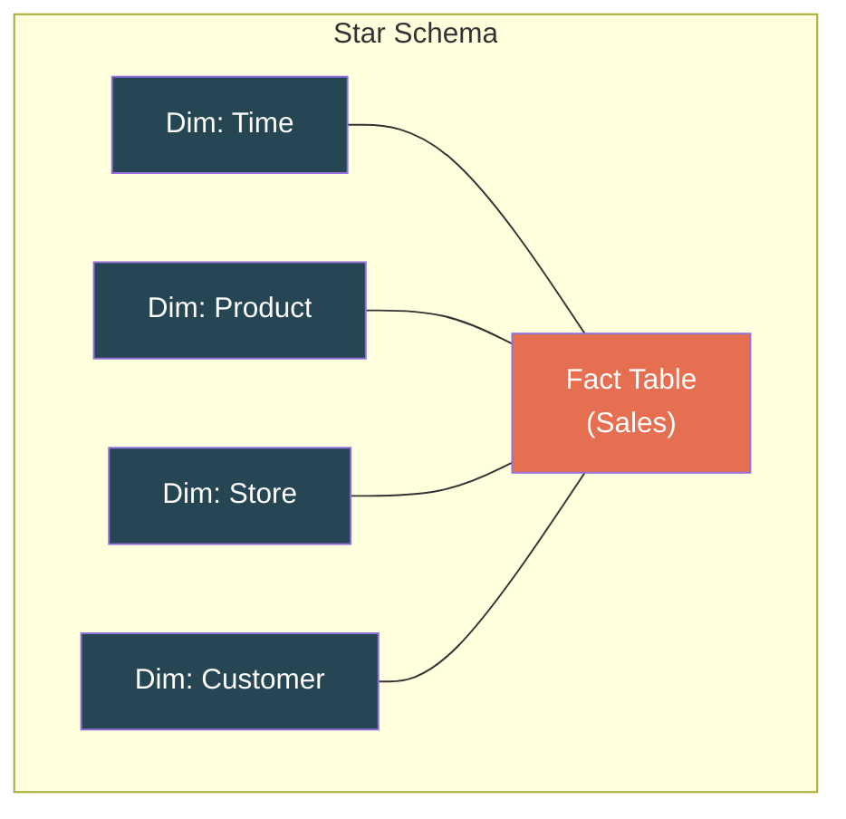
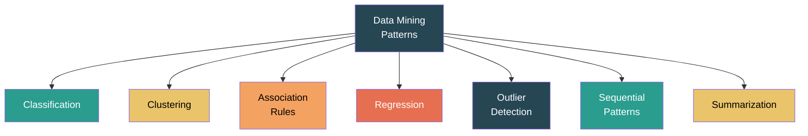
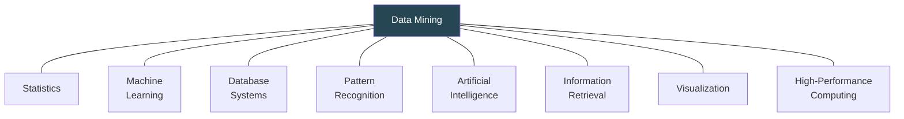
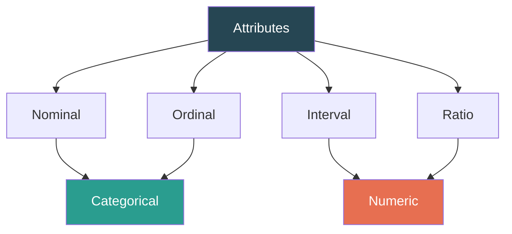
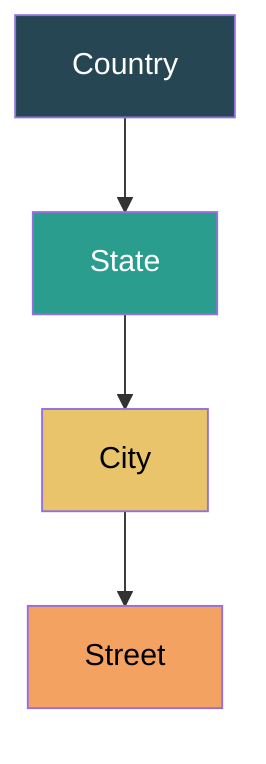
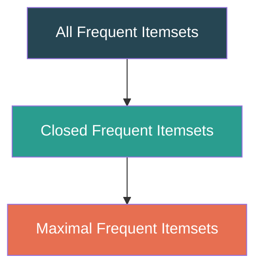
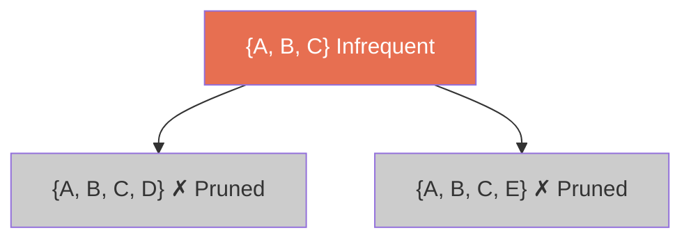
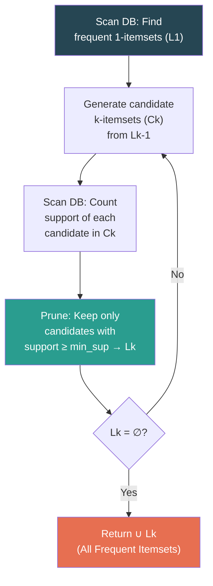
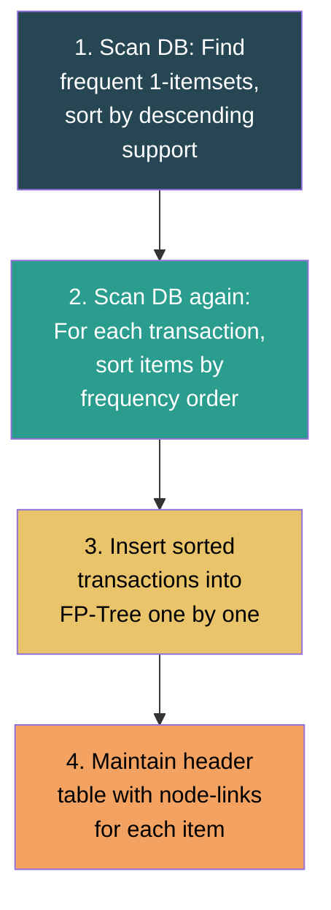

# Data Mining & Business Intelligence — ISE 1 Notes

## Chapters Covered

1. Introduction to Data Warehousing and Data Mining
2. Data Exploration and Data Preprocessing
3. Frequent Pattern Mining

---

# Chapter 1: Introduction to Data Warehousing and Data Mining

---

## 1.1 Introduction to Data Warehousing

A **Data Warehouse** is a subject-oriented, integrated, time-variant, and non-volatile collection of data in support of management's decision-making process.

> **Definition (W.H. Inmon):** "A data warehouse is a subject-oriented, integrated, time-variant, and non-volatile collection of data in support of management's decision-making process."

### Key Characteristics of a Data Warehouse

| # | Characteristic | Description |
|---|---------------|-------------|
| 1 | **Subject-Oriented** | Organized around major subjects (e.g., customers, products, sales) rather than applications or transactions. |
| 2 | **Integrated** | Data from multiple heterogeneous sources (RDBMS, flat files, online records) is cleaned, transformed, and unified into a consistent format. |
| 3 | **Time-Variant** | Data is stored with a time dimension (historical data spanning 5–10 years), allowing trend analysis. Every key structure contains a time element. |
| 4 | **Non-Volatile** | Once data enters the warehouse, it is not updated or deleted. Only two operations: **initial loading** and **access** (read-only). |



### Data Warehouse vs Operational Database (OLTP)

| Feature | OLTP (Operational) | OLAP (Data Warehouse) |
|---------|-------------------|----------------------|
| **Purpose** | Day-to-day operations | Decision support / Analysis |
| **Data** | Current, up-to-date | Historical, consolidated |
| **Operations** | Insert, Update, Delete, Select | Mostly Read (Select) |
| **Design** | Application-oriented, ER-based | Subject-oriented, Star/Snowflake schema |
| **Users** | Clerks, IT professionals | Managers, Analysts, Knowledge workers |
| **Size** | Hundreds of MB to GB | Hundreds of GB to TB |
| **Queries** | Simple, short transactions | Complex, ad-hoc, aggregations |
| **Normalization** | Highly normalized (3NF) | Typically de-normalized |

### Data Warehouse Architecture Components

| Component | Description |
|-----------|-------------|
| **Data Sources** | Operational databases, external data, flat files — the raw data inputs. |
| **ETL (Extract, Transform, Load)** | Extract data from sources, transform (clean, integrate, aggregate), and load into the warehouse. |
| **Data Warehouse Storage** | Central repository storing the integrated, historical data. |
| **Data Marts** | Subsets of the warehouse for specific departments or business functions. |
| **OLAP Server** | Provides multidimensional analysis; supports operations like roll-up, drill-down, slice, dice, pivot. |
| **Front-End Tools** | Reporting, querying, visualization, dashboards, data mining tools. |
| **Metadata Repository** | Data about data — describes structure, source, transformations, and mappings. |

### Multidimensional Data Model

Data warehouses organize data using a **multidimensional model** often called a **data cube**.

**Key Concepts:**
- **Fact Table** — Central table containing quantitative measures (e.g., sales amount, quantity, profit) and foreign keys to dimension tables.
- **Dimension Tables** — Descriptive context tables (e.g., Time, Product, Location, Customer).
- **Measures** — Numerical values that can be aggregated (sum, count, average).

#### Star Schema vs Snowflake Schema

| Feature | Star Schema | Snowflake Schema |
|---------|------------|-----------------|
| **Structure** | Fact table at center, dimension tables directly connected | Fact table at center, dimension tables normalized into sub-tables |
| **Joins** | Fewer joins, simpler queries | More joins, more complex queries |
| **Redundancy** | More redundancy in dimensions | Less redundancy (normalized) |
| **Query Performance** | Faster (fewer joins) | Slower (more joins) |
| **Storage** | Uses more storage | Uses less storage |



### OLAP Operations

| Operation | Description | Example |
|-----------|-------------|---------|
| **Roll-Up** | Aggregate data by climbing up a concept hierarchy (increasing level of summarization). | City → State → Country |
| **Drill-Down** | Reverse of roll-up — go from higher-level summary to lower-level detail. | Year → Quarter → Month |
| **Slice** | Select a single value for one dimension, resulting in a sub-cube. | Select only Q1 from Time dimension |
| **Dice** | Select a sub-cube by specifying values for two or more dimensions. | Sales in Q1 AND Q2 for Product A in Mumbai |
| **Pivot (Rotate)** | Rotate the data axes to provide an alternate view of the data. | Swap rows and columns |

---

## 1.2 What is Data Mining?

**Data Mining** is the process of discovering interesting patterns, correlations, anomalies, and statistical structures from large amounts of data. It is also known as **Knowledge Discovery in Databases (KDD)**.

> **Definition:** Data mining is the non-trivial extraction of implicit, previously unknown, and potentially useful information (such as rules, constraints, regularities) from data.

### KDD Process (Knowledge Discovery in Databases)


| Step | Description |
|------|-------------|
| **Data Cleaning** | Remove noise, handle missing values, resolve inconsistencies. |
| **Data Integration** | Combine data from multiple sources into a coherent store. |
| **Data Selection** | Select relevant data for the analysis task. |
| **Data Transformation** | Transform data into forms appropriate for mining (normalization, aggregation). |
| **Data Mining** | Apply intelligent methods to extract patterns. |
| **Pattern Evaluation** | Identify truly interesting patterns based on interestingness measures. |
| **Knowledge Presentation** | Visualize and present the mined knowledge to the user using visualization techniques. |

---

## 1.3 Kinds of Patterns to be Mined

Data mining can discover several types of patterns:



| # | Pattern Type | Description | Example |
|---|-------------|-------------|---------|
| 1 | **Classification** | Assign data objects to predefined classes/categories. | Classify email as spam or not spam. |
| 2 | **Clustering** | Group similar data objects into clusters without predefined labels. | Customer segmentation based on purchasing behavior. |
| 3 | **Association Rules** | Find interesting relationships/associations between items. | "Customers who buy bread also buy butter" (Market Basket Analysis). |
| 4 | **Regression** | Predict a continuous numerical value. | Predict house price based on area, location, bedrooms. |
| 5 | **Outlier Detection** | Identify data objects that deviate significantly from the norm. | Fraud detection in credit card transactions. |
| 6 | **Sequential Pattern Mining** | Find regularities in sequences of events. | Customers who buy a phone → buy a case within 1 week → buy a charger within 1 month. |
| 7 | **Summarization** | Provide a compact description of a subset of data. | Summary statistics, data cubes, dashboards. |

---

## 1.4 Technologies Used in Data Mining

Data mining draws upon and integrates techniques from multiple fields:

| Technology | Role in Data Mining |
|-----------|-------------------|
| **Statistics** | Probability distributions, hypothesis testing, regression, variance analysis. Foundation of many mining algorithms. |
| **Machine Learning** | Algorithms that learn from data — decision trees, neural networks, SVMs, Bayesian classifiers. |
| **Database Systems (DBMS)** | Efficient storage, retrieval, and querying of massive datasets. Query optimization. |
| **Pattern Recognition** | Identifies patterns and regularities in data — feature extraction, classification. |
| **Artificial Intelligence** | Search strategies, knowledge representation, heuristic-based approaches. |
| **Information Retrieval** | Text mining, document clustering, search relevance — handling unstructured data. |
| **Visualization** | Graphical representation of data and mined patterns for human interpretation. |
| **High-Performance Computing** | Parallel and distributed algorithms for mining very large datasets. |



---

## 1.5 Kinds of Applications Targeted

Data mining is used across a wide range of industries and domains:

| # | Application Domain | Use Case |
|---|-------------------|----------|
| 1 | **Retail / Market Basket** | Discover product associations for cross-selling, store layout optimization. |
| 2 | **Banking & Finance** | Credit scoring, fraud detection, risk analysis, loan default prediction. |
| 3 | **Telecommunications** | Churn prediction, network fault analysis, customer profiling. |
| 4 | **Healthcare / Biomedical** | Disease diagnosis, drug discovery, patient outcome prediction. |
| 5 | **Manufacturing** | Quality control, defect detection, predictive maintenance. |
| 6 | **E-Commerce / Web** | Recommendation engines, clickstream analysis, user behavior modeling. |
| 7 | **Science & Engineering** | Climate modeling, bioinformatics, astronomical data analysis. |
| 8 | **Education** | Student performance prediction, learning analytics, curriculum optimization. |
| 9 | **CRM** | Customer segmentation, lifetime value analysis, targeted marketing. |
| 10 | **Social Media** | Sentiment analysis, community detection, trend prediction. |

---

## 1.6 Major Issues in Data Mining

| # | Issue Category | Description |
|---|---------------|-------------|
| 1 | **Mining Methodology** | Mining various kinds of knowledge (multi-level, multi-dimensional), handling noisy/incomplete data, pattern interestingness assessment, knowledge representation. |
| 2 | **User Interaction** | Interactive mining, incorporating background knowledge, ad-hoc mining, presentation and visualization of results. |
| 3 | **Efficiency & Scalability** | Handling massive datasets, real-time mining, parallel/distributed mining, incremental update of mined patterns. |
| 4 | **Diversity of Data Types** | Mining complex data types: relational, transactional, spatial, temporal, text, multimedia, stream, web, graph data. |
| 5 | **Privacy & Security** | Protecting sensitive information, privacy-preserving data mining, ethical use of discovered knowledge. |
| 6 | **Data Quality** | Noisy, incomplete, inconsistent data leads to poor mining results — "Garbage in, garbage out." |
| 7 | **Integration with DB/DW Systems** | Seamless coupling of mining algorithms with existing database/warehouse infrastructure. |

---

# Chapter 2: Data Exploration and Data Preprocessing

---

## Part A: Data Exploration

---

## 2.1 Types of Attributes

An **attribute** (also called a variable, field, or feature) is a data field representing a characteristic of a data object.



| Type | Description | Operations | Examples |
|------|-------------|-----------|----------|
| **Nominal** | Names or labels. No meaningful order. | =, ≠ | ID numbers, eye color, zip codes, gender |
| **Ordinal** | Values have a meaningful order, but magnitude between values is unknown. | =, ≠, <, > | Grades (A, B, C), satisfaction (low, medium, high) |
| **Interval** | Equal intervals. No true zero point. Differences meaningful, ratios are not. | =, ≠, <, >, +, − | Temperature °C/°F, calendar dates, IQ scores |
| **Ratio** | True zero point. Both differences and ratios are meaningful. | =, ≠, <, >, +, −, ×, ÷ | Height, weight, age, salary, Kelvin temp |

### Discrete vs Continuous Attributes

| Discrete | Continuous |
|----------|-----------|
| Finite or countably infinite set of values | Real-number values |
| Often integers (zip code, word count) | Floating-point (temperature, height, salary) |

---

## 2.2 Statistical Description of Data

### Measures of Central Tendency

| Measure | Formula / Definition | When to Use |
|---------|---------------------|-------------|
| **Mean (x̄)** | x̄ = (Σxᵢ) / n | Symmetric data, no extreme outliers |
| **Weighted Mean** | x̄ = Σ(wᵢ × xᵢ) / Σwᵢ | Values have different importance |
| **Trimmed Mean** | Drop top & bottom d%, compute mean | Reduce outlier influence |
| **Median** | Middle value when sorted | Skewed data, robust to outliers |
| **Mode** | Most frequently occurring value | Categorical data |

### Measures of Dispersion

| Measure | Formula |
|---------|---------|
| **Range** | Max − Min |
| **Variance (σ²)** | σ² = Σ(xᵢ − x̄)² / n |
| **Standard Deviation (σ)** | σ = √(σ²) |
| **IQR** | Q3 − Q1 |

### Five-Number Summary & Box Plot

**Five-Number Summary:** Min, Q1, Median (Q2), Q3, Max

- **Box** spans Q1 to Q3 (the IQR)
- **Line** inside the box = median
- **Whiskers** extend to Min/Max (or 1.5 × IQR from Q1/Q3)
- Points beyond whiskers = **outliers**
- **Outlier rule:** value < Q1 − 1.5×IQR or value > Q3 + 1.5×IQR

#### Solved Example: Five-Number Summary

**Data:** 3, 7, 8, 12, 13, 14, 18, 21, 25, 30, 35 (n=11)

| Statistic | Value |
|-----------|-------|
| Min | 3 |
| Q1 | 8 |
| Median | 14 |
| Q3 | 25 |
| Max | 35 |
| IQR | 17 |
| Outlier Lower Bound | 8 − 1.5(17) = −17.5 |
| Outlier Upper Bound | 25 + 1.5(17) = 50.5 |

**Result:** No outliers in this dataset.

---

## 2.3 Data Visualization

| Visualization | Best For |
|--------------|----------|
| **Histogram** | Distribution of a single numeric attribute |
| **Box Plot** | Summary statistics + outlier detection |
| **Scatter Plot** | Relationship between two numeric variables |
| **Bar Chart** | Comparing categories |
| **Heat Map** | Correlation or density across two dimensions |
| **Q-Q Plot** | Comparing two distributions (normality check) |
| **Quantile Plot** | Displaying all data vs quantile values |

---

## 2.4 Measuring Similarity and Dissimilarity

### Numeric Data — Distance Measures

| Distance | Formula | Notes |
|----------|---------|-------|
| **Euclidean** | d = √(Σ(xᵢ − yᵢ)²) | Straight-line distance |
| **Manhattan** | d = Σ\|xᵢ − yᵢ\| | City-block distance |
| **Minkowski** | d = (Σ\|xᵢ − yᵢ\|^p)^(1/p) | p=1→Manhattan, p=2→Euclidean |
| **Supremum** | d = max(\|xᵢ − yᵢ\|) | p→∞ in Minkowski |

#### Solved Example: Distance Measures

**A** = (1, 2), **B** = (4, 6)

- **Euclidean:** √((4−1)² + (6−2)²) = √(9+16) = √25 = **5**
- **Manhattan:** |4−1| + |6−2| = 3 + 4 = **7**
- **Supremum:** max(3, 4) = **4**

### Binary Data

| | y=1 | y=0 |
|---|---|---|
| **x=1** | q (both 1) | r |
| **x=0** | s | t (both 0) |

p = q + r + s + t

| Measure | Formula | Use |
|---------|---------|-----|
| **SMC** | (q + t) / p | Symmetric binary (0-0 matches matter) |
| **Jaccard** | q / (q + r + s) | Asymmetric binary (0-0 matches ignored) |

#### Solved Example: Jaccard & SMC

**X** = (1, 0, 0, 1, 1, 0, 1, 0), **Y** = (1, 1, 0, 1, 0, 0, 1, 1)

q=3, r=1, s=2, t=2, p=8

- **SMC** = (3+2)/8 = **0.625**
- **Jaccard** = 3/(3+1+2) = **0.5**

### Cosine Similarity

**cos(X, Y)** = (X · Y) / (‖X‖ × ‖Y‖)

#### Solved Example

**X** = (3, 2, 0, 5), **Y** = (1, 0, 0, 0)

- X·Y = 3, ‖X‖ = √38 ≈ 6.16, ‖Y‖ = 1
- **cos(X,Y)** = 3/6.16 ≈ **0.487**

---

## Part B: Data Preprocessing

---

## 2.5 Why Preprocessing?

Real-world data is **dirty** — incomplete, noisy, and inconsistent.

| Problem | Description | Example |
|---------|-------------|---------|
| **Incomplete** | Missing attribute values | Occupation = "" |
| **Noisy** | Errors, outliers, random variance | Salary = −10 |
| **Inconsistent** | Discrepancies, conflicting records | Age=42, Birthday=2010 |
| **Redundant** | Duplicate data or derivable attributes | Same customer twice |


---

## 2.6 Data Cleaning

### Handling Missing Values

| Method | Description |
|--------|-------------|
| **Ignore the tuple** | Discard record. Not effective when missing % is high. |
| **Fill manually** | Tedious for large datasets. |
| **Global constant** | Replace with "Unknown" or −∞. |
| **Attribute mean/median** | Replace with mean (numeric) or mode (categorical). |
| **Class-based mean** | Use mean for same-class tuples. More accurate. |
| **Most probable value** | Use regression, Bayesian, decision tree to predict. |

### Handling Noisy Data

| Method | Description |
|--------|-------------|
| **Binning** | Sort, partition into bins, smooth by bin mean/median/boundaries. |
| **Regression** | Fit data to regression function. |
| **Clustering** | Outliers fall outside clusters → detect and remove. |
| **Human + Computer** | Automated detection + manual verification. |

#### Solved Example: Smoothing by Binning

**Sorted data:** 4, 8, 9, 15, 21, 21, 24, 25, 26, 28, 29, 34

**3 equal-frequency bins (4 values each):**
- Bin 1: {4, 8, 9, 15}
- Bin 2: {21, 21, 24, 25}
- Bin 3: {26, 28, 29, 34}

| Smoothing Method | Bin 1 | Bin 2 | Bin 3 |
|-----------------|-------|-------|-------|
| **By Mean** | {9, 9, 9, 9} | {22.75, 22.75, 22.75, 22.75} | {29.25, 29.25, 29.25, 29.25} |
| **By Boundaries** | {4, 4, 4, 15} | {21, 21, 25, 25} | {26, 26, 26, 34} |
| **By Median** | {8.5, 8.5, 8.5, 8.5} | {22.5, 22.5, 22.5, 22.5} | {28.5, 28.5, 28.5, 28.5} |

---

## 2.7 Data Integration

Merges data from multiple sources into a coherent store.

| Issue | Description |
|-------|-------------|
| **Schema Integration** | Same attribute, different names (`customer_id` vs `cust_no`) |
| **Redundancy** | Attribute derivable from another (`total = qty × price`) |
| **Data Value Conflicts** | Different units, scales, encodings across sources |
| **Duplicate Data** | Same record from multiple databases |

**Redundancy Detection:** χ² test (nominal), Pearson's Correlation r (numeric), Covariance.

---

## 2.8 Data Reduction

### Attribute Subset Selection

- **Forward Selection** — Start empty, add best attribute one at a time.
- **Backward Elimination** — Start with all, remove worst one at a time.
- **Decision Tree Induction** — Attributes in tree are the selected subset.

### Sampling Types

| Type | Description |
|------|-------------|
| **SRSWOR** | Simple random, without replacement |
| **SRSWR** | Simple random, with replacement |
| **Stratified** | Divide into strata, sample from each |
| **Cluster Sampling** | Select entire clusters randomly |

---

## 2.9 Data Transformation & Discretization

### Normalization

| Method | Formula | Range |
|--------|---------|-------|
| **Min-Max** | v' = (v − min)/(max − min) × (new_max − new_min) + new_min | [0, 1] typically |
| **Z-Score** | v' = (v − x̄) / σ | mean=0, std=1 |
| **Decimal Scaling** | v' = v / 10^j (j = smallest int s.t. max(\|v'\|) < 1) | [−1, 1] |

#### Solved Example: Normalization

**Data:** {12000, 24000, 36000, 48000, 60000}

**Min-Max to [0,1]:** min=12000, max=60000

| Value | Min-Max | Z-Score (x̄=36000, σ≈16971) | Decimal (j=5) |
|-------|---------|---------|---------|
| 12000 | 0.0 | −1.414 | 0.12 |
| 24000 | 0.25 | −0.707 | 0.24 |
| 36000 | 0.5 | 0.0 | 0.36 |
| 48000 | 0.75 | 0.707 | 0.48 |
| 60000 | 1.0 | 1.414 | 0.60 |

### Binning (Discretization)

| Type | Description |
|------|-------------|
| **Equal-Width** | Divide [min, max] into N bins of equal width. Width = (max−min)/N |
| **Equal-Frequency** | Each bin has approximately same number of data points |

### Concept Hierarchy Generation

Maps low-level concepts to higher-level ones for generalization.



**Examples:** Street → City → State → Country | Day → Month → Quarter → Year | Product → Category → Department

**Generation Methods:** Schema-based, Expert-defined grouping, Automatic (clustering/statistics)

---

# Chapter 3: Frequent Pattern Mining

---

## 3.1 Market Basket Analysis

**Market Basket Analysis** is a technique that discovers associations between products purchased together in transactions. It answers the question: *"Which items are frequently bought together?"*

> **Real-World Application:** In a supermarket, if customers who buy **bread** also tend to buy **butter**, the store can place them nearby, offer bundle discounts, or create targeted promotions.

### Key Terminology

| Term | Definition | Example |
|------|-----------|---------|
| **Itemset** | A collection of one or more items. | {Bread, Butter, Milk} |
| **k-itemset** | An itemset containing k items. | {Bread, Butter} is a 2-itemset |
| **Transaction** | A set of items purchased together by a customer. | T1 = {Bread, Butter, Milk} |
| **Transaction Database** | A collection of all transactions. | D = {T1, T2, T3, ...} |
| **Support Count (σ)** | Number of transactions containing a given itemset. | σ({Bread, Butter}) = 4 |
| **Support** | Fraction of transactions containing the itemset. support(X) = σ(X) / N | support({Bread}) = 4/10 = 40% |
| **Frequent Itemset** | An itemset whose support ≥ minimum support threshold (min_sup). | If min_sup = 30%, then {Bread} with 40% is frequent. |

---

## 3.2 Frequent Itemsets, Closed Itemsets, and Association Rules

### Association Rules

An **association rule** is an implication of the form **X → Y**, where X and Y are itemsets, and X ∩ Y = ∅.

| Metric | Formula | Meaning |
|--------|---------|---------|
| **Support** | support(X → Y) = P(X ∪ Y) = σ(X ∪ Y) / N | How frequently X and Y appear together. |
| **Confidence** | confidence(X → Y) = P(Y\|X) = σ(X ∪ Y) / σ(X) | How often Y appears when X is present. |
| **Lift** | lift(X → Y) = confidence(X → Y) / support(Y) | How much more likely Y is when X is present vs. random. Lift > 1 = positive correlation, Lift = 1 = independent, Lift < 1 = negative correlation. |

> A rule X → Y is **strong** if it satisfies both **minimum support** and **minimum confidence** thresholds.

### Closed and Maximal Frequent Itemsets

| Concept | Definition |
|---------|-----------|
| **Closed Frequent Itemset** | A frequent itemset X is **closed** if there is no proper superset Y ⊃ X with the same support count. (No superset has identical frequency.) |
| **Maximal Frequent Itemset** | A frequent itemset X is **maximal** if there is no superset Y ⊃ X that is also frequent. |

> **Relationship:** Maximal ⊂ Closed ⊂ Frequent. Closed itemsets provide a **lossless compression** of frequent itemsets (you can reconstruct exact support counts). Maximal itemsets are more compact but lose support count information.



---

## 3.3 Frequent Itemset Mining Methods

---

### 3.3.1 The Apriori Algorithm

The **Apriori Algorithm** (by Agrawal & Srikant, 1994) is a level-wise, candidate-generation-and-test approach for mining frequent itemsets.

#### The Apriori Property (Downward Closure / Anti-Monotone)

> **Key Insight:** If an itemset is **infrequent**, then all of its **supersets** must also be infrequent.
> Equivalently: All non-empty subsets of a frequent itemset must also be frequent.

This property is used to **prune** the candidate search space drastically.



#### Apriori Algorithm Steps



**Algorithm (Pseudocode):**

1. **L₁** = {frequent 1-itemsets} (scan DB, count each item, keep those ≥ min_sup)
2. **For** k = 2, 3, ... while L_{k-1} ≠ ∅:
   - **C_k** = candidates generated from L_{k-1} (join step + prune step)
   - **For each** transaction t ∈ D:
     - Increment count of all candidates in C_k that are subsets of t
   - **L_k** = {c ∈ C_k | support(c) ≥ min_sup}
3. **Return** L₁ ∪ L₂ ∪ ... ∪ L_k

**Candidate Generation (C_k from L_{k-1}):**
- **Join Step:** Join L_{k-1} with itself. Two itemsets from L_{k-1} are joined if their first (k-2) items are identical.
- **Prune Step:** Remove any candidate whose (k-1)-subset is NOT in L_{k-1} (Apriori property).

#### Solved Example: Apriori Algorithm

**Transaction Database:**

| TID | Items |
|-----|-------|
| T1 | {A, B, E} |
| T2 | {B, D} |
| T3 | {B, C} |
| T4 | {A, B, D} |
| T5 | {A, C} |
| T6 | {B, C} |
| T7 | {A, C} |
| T8 | {A, B, C, E} |
| T9 | {A, B, C} |

**N = 9 transactions, min_sup = 2 (i.e., 2/9 ≈ 22%)**

**Step 1: Find L₁ (frequent 1-itemsets)**

Scan DB and count each item:

| Item | Count | Frequent? (≥2) |
|------|:-----:|:---:|
| A | 6 | ✓ |
| B | 7 | ✓ |
| C | 6 | ✓ |
| D | 2 | ✓ |
| E | 2 | ✓ |

**L₁** = {{A}, {B}, {C}, {D}, {E}}

**Step 2: Generate C₂ from L₁, find L₂**

C₂ = all 2-item combinations of L₁:

| Candidate | Count | Frequent? (≥2) |
|-----------|:-----:|:---:|
| {A, B} | 4 | ✓ |
| {A, C} | 4 | ✓ |
| {A, D} | 1 | ✗ |
| {A, E} | 2 | ✓ |
| {B, C} | 4 | ✓ |
| {B, D} | 2 | ✓ |
| {B, E} | 2 | ✓ |
| {C, D} | 0 | ✗ |
| {C, E} | 1 | ✗ |
| {D, E} | 0 | ✗ |

**L₂** = {{A,B}, {A,C}, {A,E}, {B,C}, {B,D}, {B,E}}

**Step 3: Generate C₃ from L₂, find L₃**

Join L₂ with itself (matching first item):
- {A,B} ∪ {A,C} → {A,B,C} — check subsets: {A,B}✓, {A,C}✓, {B,C}✓ → **Keep**
- {A,B} ∪ {A,E} → {A,B,E} — check subsets: {A,B}✓, {A,E}✓, {B,E}✓ → **Keep**
- {A,C} ∪ {A,E} → {A,C,E} — check subsets: {A,C}✓, {A,E}✓, {C,E}✗ → **Pruned**
- {B,C} ∪ {B,D} → {B,C,D} — check subsets: {B,C}✓, {B,D}✓, {C,D}✗ → **Pruned**
- {B,C} ∪ {B,E} → {B,C,E} — check subsets: {B,C}✓, {B,E}✓, {C,E}✗ → **Pruned**
- {B,D} ∪ {B,E} → {B,D,E} — check subsets: {B,D}✓, {B,E}✓, {D,E}✗ → **Pruned**

C₃ = {{A,B,C}, {A,B,E}}

Scan DB:

| Candidate | Count | Frequent? (≥2) |
|-----------|:-----:|:---:|
| {A, B, C} | 2 | ✓ |
| {A, B, E} | 2 | ✓ |

**L₃** = {{A,B,C}, {A,B,E}}

**Step 4: Generate C₄ from L₃**

- {A,B,C} ∪ {A,B,E} → {A,B,C,E} — check subset {A,C,E}: not in L₃ → **Pruned**

C₄ = ∅ → **STOP**

**Final Frequent Itemsets:** L₁ ∪ L₂ ∪ L₃

---

### 3.3.2 Generating Association Rules from Frequent Itemsets

For each frequent itemset L, generate all non-empty subsets S of L:
- Rule: **S → (L − S)** with:
  - confidence = support(L) / support(S)
- Keep rule if confidence ≥ min_conf

#### Solved Example: Generating Rules

From frequent itemset **{A, B, C}** with support count = 2 (support = 2/9):

Given: σ({A}) = 6, σ({B}) = 7, σ({C}) = 6, σ({A,B}) = 4, σ({A,C}) = 4, σ({B,C}) = 4, σ({A,B,C}) = 2

**min_conf = 50%**

| Rule | Confidence | Strong? |
|------|-----------|---------|
| A → BC | σ({A,B,C})/σ({A}) = 2/6 = 33.3% | ✗ |
| B → AC | σ({A,B,C})/σ({B}) = 2/7 = 28.6% | ✗ |
| C → AB | σ({A,B,C})/σ({C}) = 2/6 = 33.3% | ✗ |
| AB → C | σ({A,B,C})/σ({A,B}) = 2/4 = 50% | ✓ |
| AC → B | σ({A,B,C})/σ({A,C}) = 2/4 = 50% | ✓ |
| BC → A | σ({A,B,C})/σ({B,C}) = 2/4 = 50% | ✓ |

**Strong rules (support ≥ 2/9, confidence ≥ 50%):** AB → C, AC → B, BC → A

---

### 3.3.3 FP-Growth: A Pattern Growth Approach

**FP-Growth** (Frequent Pattern Growth) by Han, Pei & Yin (2000) mines frequent itemsets **without candidate generation**. It compresses the database into a compact structure called an **FP-Tree** and mines it directly.

#### Why FP-Growth?

Apriori has bottlenecks:
- Multiple database scans (one per level)
- Huge number of candidates (especially for long patterns)

FP-Growth addresses both: **only 2 DB scans** and **no candidate generation**.

#### FP-Tree Construction



**Steps:**
1. **First scan:** Count item frequencies, remove infrequent items, sort frequent items by descending support.
2. **Second scan:** Read each transaction, retain only frequent items sorted by frequency order, insert into the FP-Tree.
3. **FP-Tree:** A prefix tree where each node contains an item name, count, and node-link. Common prefixes are shared.
4. **Header Table:** Links all nodes of the same item for efficient traversal.

#### FP-Growth Mining Process

1. Start from the **least frequent item** in the header table.
2. Construct its **Conditional Pattern Base** — the set of prefix paths ending at that item.
3. Build a **Conditional FP-Tree** from the conditional pattern base.
4. **Recursively** mine the conditional FP-Tree.
5. Repeat for the next item in the header table.

#### Solved Example: FP-Tree Construction

**Transaction Database (min_sup = 3):**

| TID | Items |
|-----|-------|
| T1 | {A, B, D, E} |
| T2 | {B, C, E} |
| T3 | {A, B, D, E} |
| T4 | {A, B, C, E} |
| T5 | {A, B, C, D, E} |
| T6 | {B, C, D} |

**Step 1: Item frequency count:**

| Item | Count | Frequent? (≥3) |
|------|:-----:|:---:|
| A | 4 | ✓ |
| B | 6 | ✓ |
| C | 4 | ✓ |
| D | 4 | ✓ |
| E | 5 | ✓ |

**Sorted by descending frequency:** B(6), E(5), A(4), C(4), D(4)

**Step 2: Reorder each transaction:**

| TID | Ordered Frequent Items |
|-----|----------------------|
| T1 | {B, E, A, D} |
| T2 | {B, E, C} |
| T3 | {B, E, A, D} |
| T4 | {B, E, A, C} |
| T5 | {B, E, A, C, D} |
| T6 | {B, C, D} |

**Step 3: Build FP-Tree**

Insert transactions one by one into the tree, incrementing counts for shared prefixes:

```
Root
└── B:6
    ├── E:5
    │   ├── A:4
    │   │   ├── D:2 (T1, T3)
    │   │   ├── C:2
    │   │   │   └── D:1 (T5)
    │   │   └── (T4 adds to A count)
    │   └── C:1 (T2)
    └── C:1
        └── D:1 (T6)
```

**Step 4: Mining using Conditional Pattern Bases**

Starting from the least frequent item (D, count=4):

| Item | Conditional Pattern Base | Conditional FP-Tree | Frequent Patterns |
|------|------------------------|--------------------|--------------------|
| D | {B,E,A}:2, {B,E,A,C}:1, {B,C}:1 | {B:4, E:3, A:3} | {D,B}, {D,E}, {D,A}, {D,B,E}, {D,B,A}, {D,E,A}, {D,B,E,A} |
| C | {B,E,A}:2, {B,E}:1, {B}:1 | {B:4, E:3} | {C,B}, {C,E}, {C,B,E} |
| A | {B,E}:4 | {B:4, E:4} | {A,B}, {A,E}, {A,B,E} |
| E | {B}:5 | {B:5} | {E,B} |

---

### 3.3.4 Mining Frequent Itemsets Using Vertical Data Format

Instead of the traditional **horizontal format** (TID → itemset), the **vertical data format** represents data as **item → set of TIDs** (tidset).

| Horizontal Format | | Vertical Format | |
|---|---|---|---|
| **TID** | **Items** | **Item** | **TID Set** |
| T1 | {A, B, E} | A | {T1, T4, T5, T7, T8, T9} |
| T2 | {B, D} | B | {T1, T2, T3, T4, T6, T8, T9} |
| T3 | {B, C} | C | {T3, T5, T6, T7, T8, T9} |
| ... | ... | D | {T2, T4} |
| | | E | {T1, T8} |

#### ECLAT Algorithm (Equivalence Class Transformation)

**Key Idea:** Support of an itemset X = |tidset(X)|. To find support of X ∪ Y, simply compute **tidset(X) ∩ tidset(Y)**.

**Advantages:**
- No need to scan the database after the initial conversion.
- Support counting = set intersection (fast).
- Naturally lends itself to depth-first search.

**Example:**
- tidset(A) = {T1, T4, T5, T7, T8, T9}
- tidset(B) = {T1, T2, T3, T4, T6, T8, T9}
- tidset(A ∩ B) = {T1, T4, T8, T9} → support({A,B}) = 4

---

## 3.4 Which Patterns Are Interesting? Pattern Evaluation Methods

Not all mined patterns are useful. Many associations may be **coincidental**, **redundant**, or **obvious**. Pattern evaluation methods help filter truly interesting patterns.

### Objective Interestingness Measures

| Measure | Formula | Interpretation |
|---------|---------|----------------|
| **Support** | P(X ∪ Y) | How frequently the pattern occurs. Filters rare patterns. |
| **Confidence** | P(Y\|X) = P(X∪Y)/P(X) | How reliable the rule is. But can be misleading! |
| **Lift** | P(X∪Y) / (P(X) × P(Y)) | > 1: positive correlation. = 1: independent. < 1: negative correlation. |
| **All-Confidence** | min(P(X∪Y)/P(X), P(X∪Y)/P(Y)) | Minimum confidence in both directions. |
| **Cosine** | P(X∪Y) / √(P(X) × P(Y)) | Harmonic measure between X and Y. |
| **Kulczynski (Kulc)** | ½ × (P(Y\|X) + P(X\|Y)) | Average of both directional confidences. |
| **Imbalance Ratio (IR)** | \|P(X) − P(Y)\| / (P(X) + P(Y) − P(X∪Y)) | Measures how imbalanced X and Y are. |

### Why Confidence Alone Can Be Misleading

#### Example: The Tea & Coffee Problem

| | Coffee = Yes | Coffee = No | Total |
|---|---|---|---|
| **Tea = Yes** | 150 | 50 | 200 |
| **Tea = No** | 650 | 150 | 800 |
| **Total** | 800 | 200 | 1000 |

- confidence(Tea → Coffee) = 150/200 = **75%** (looks strong!)
- BUT: P(Coffee) = 800/1000 = **80%**
- **Lift** = 0.75/0.80 = **0.9375 < 1** → **Negative correlation!**

> Buying tea actually makes you **less likely** to buy coffee than the general population. Confidence was misleading because Coffee has very high support.

### Subjective Interestingness

A pattern is interesting if it is:
1. **Actionable** — The pattern can lead to business decisions or actions.
2. **Unexpected** — The pattern is surprising and contradicts prior beliefs.
3. **Novel** — The pattern provides new, previously unknown knowledge.

### Null-Invariance

A measure is **null-invariant** if it is not affected by the number of null-transactions (transactions that contain neither X nor Y).

| Measure | Null-Invariant? |
|---------|:---:|
| Support | ✗ |
| Confidence | ✗ |
| Lift | ✗ |
| All-Confidence | ✓ |
| Cosine | ✓ |
| Kulczynski | ✓ |
| Jaccard | ✓ |

> For large datasets with many null-transactions, **null-invariant measures** (Kulc, Cosine) are preferred over Lift and Confidence.

---

### Summary: Comparison of Mining Approaches

| Feature | Apriori | FP-Growth | ECLAT (Vertical) |
|---------|---------|-----------|-------------------|
| **Strategy** | Candidate generation & test | Pattern growth (no candidates) | Set intersection |
| **DB Scans** | Multiple (one per level) | 2 scans only | 1 scan (convert to vertical) |
| **Data Structure** | Hash tree for candidates | FP-Tree (compressed) | Tidsets |
| **Memory** | Can be high (many candidates) | Compact FP-Tree | Tidsets can be large |
| **Speed** | Slower for long patterns | Faster, especially for dense data | Fast for sparse data |
| **Best For** | Sparse data, short patterns | Dense data, long patterns | Medium datasets |

---


