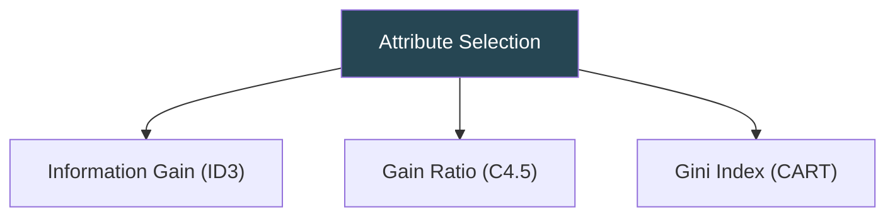
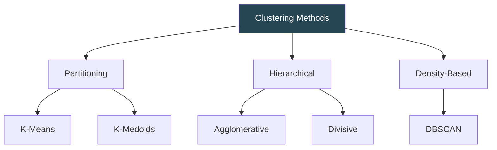

# DMBI ISE 2 — Short Revision Notes

> Chapters 4 (Classification), 5 (Clustering), 6 (Business Intelligence)

---

# Chapter 4: Classification

## Key Concepts

- **Classification** = Supervised learning → predict **categorical class labels**
- **Two phases:** Training (build model from labeled data) → Testing (evaluate on unseen data)
- **Binary** (Yes/No) vs **Multi-class** (Low/Med/High)

| Term | Meaning |
|------|---------|
| Training Set | Labeled data to build model |
| Test Set | Labeled data to evaluate model |
| Classifier | The learned model |
| Class Label | Target categorical attribute |
| Predictor Attributes | Input features |

---

## Decision Tree Induction

- **Internal node** = test on attribute | **Branch** = outcome | **Leaf** = class label
- **Hunt's Algorithm:** If all same class → leaf. Else pick best attribute → split → recurse.

### Formulas

| Measure | Formula | Select |
|---------|---------|--------|
| **Entropy** | Info(D) = −Σ pᵢ log₂(pᵢ) | — |
| **Info Gain** | Gain(A) = Info(D) − Info_A(D) | **Highest** |
| **Gain Ratio** | GainRatio(A) = Gain(A) / SplitInfo_A(D) | **Highest** |
| **Gini Index** | Gini(D) = 1 − Σ pᵢ² | **Lowest Gini_A** |

**Key properties:**
- Entropy = 0 → pure; Entropy = 1 → max impurity (50-50)
- Gini = 0 → pure; Gini = 0.5 → max impurity
- Info Gain biased toward many-valued attrs → use Gain Ratio (C4.5)
- Gini uses **binary splits** (CART)

### Comparison

| Measure | Algorithm | Bias | Split |
|---------|-----------|------|-------|
| Information Gain | ID3 | Many values | Multi-way |
| Gain Ratio | C4.5 | Corrected | Multi-way |
| Gini Index | CART | Few values | Binary |

### Tree Pruning

| Method | When | How |
|--------|------|-----|
| **Pre-Pruning** | During growth | Stop if split doesn't improve measure or too few tuples |
| **Post-Pruning** | After full tree | Remove subtrees that don't help; use validation set |

**Post-pruning types:** Reduced Error Pruning, Cost Complexity Pruning (CART), Pessimistic Error Pruning

---

## Bayesian Classification

**Bayes' Theorem:** P(C|X) = P(X|C) · P(C) / P(X)

| Term | Meaning |
|------|---------|
| P(C\|X) | Posterior — what we want |
| P(X\|C) | Likelihood |
| P(C) | Prior probability |
| P(X) | Evidence (constant, ignore for comparison) |

### Naïve Bayes

- **Assumption:** All attributes are **independent** given class
- **Classify:** argmax P(Cᵢ) × ∏ P(xₖ|Cᵢ)
- **Categorical:** P(xₖ|Cᵢ) = count(xₖ in Cᵢ) / count(Cᵢ)
- **Continuous:** Use Gaussian: P(x|C) = (1/√2πσ) × e^(-(x-μ)²/2σ²)
- **Laplacian Correction:** P(xₖ|Cᵢ) = (count + 1) / (total + d) → avoids zero probability

| ✅ Pros | ❌ Cons |
|---------|---------|
| Simple, fast | Assumes independence |
| Works with small data | Accuracy drops if attrs correlated |
| Handles categorical + continuous | Zero probability without smoothing |

---

## Rule-Based Classification

- **Format:** IF condition THEN class
- **Coverage** = % tuples satisfying rule | **Accuracy** = % of covered tuples correctly classified
- Rules from decision trees are **mutually exclusive** and **exhaustive**

**Conflict Resolution:** Rule ordering, highest accuracy, most specific, majority vote

**Sequential Covering:** Learn one rule → remove covered tuples → repeat

**Algorithms:** RIPPER, CN2, Sequential Covering

---

## Accuracy & Error Measures

### Confusion Matrix

| | Pred: + | Pred: − |
|---|:---:|:---:|
| **Act: +** | TP | FN |
| **Act: −** | FP | TN |

### Metrics

| Metric | Formula | Use |
|--------|---------|-----|
| **Accuracy** | (TP+TN) / Total | Overall correctness |
| **Error Rate** | (FP+FN) / Total | Overall error |
| **Precision** | TP / (TP+FP) | "Of predicted +, how many correct?" |
| **Recall / Sensitivity** | TP / (TP+FN) | "Of actual +, how many found?" |
| **Specificity** | TN / (TN+FP) | "Of actual −, how many correct?" |
| **F1-Score** | 2×P×R / (P+R) | Balance P & R |

**When to prioritize:**
- **Precision:** Spam detection (FP costly)
- **Recall:** Cancer diagnosis, fraud detection (FN costly)

### Model Evaluation Methods

| Method | How | Reliability | Cost |
|--------|-----|:-----------:|:----:|
| **Holdout** | Split 67/33 once | Low | Low |
| **Random Subsampling** | Repeat holdout k times, average | Medium | Medium |
| **k-Fold CV** | k folds, each tested once | High | Medium-High |
| **Leave-One-Out** | k = N (each tuple tested) | Highest | Very High |

**Stratified CV** = each fold keeps same class proportion

---

# Chapter 5: Clustering

## Key Concepts

- **Clustering** = Unsupervised learning → group similar objects, separate dissimilar
- No predefined labels — discover natural groupings

| Supervised (Classification) | Unsupervised (Clustering) |
|:--:|:--:|
| Labels known | No labels |
| Predict class | Discover groups |
| Decision Tree, NB, SVM | K-Means, DBSCAN, Hierarchical |

**Good clustering requirements:** Scalability, different attribute types, arbitrary shapes, noise robustness, order insensitivity

---

## K-Means

**Steps:** Choose k centroids → Assign each point to nearest centroid → Recompute centroids → Repeat until convergence

**Objective:** Minimize SSE = Σ Σ ||xᵢ − μⱼ||²

| ✅ Pros | ❌ Cons |
|---------|---------|
| Simple, efficient O(nkt) | Must specify k |
| Scales well | Sensitive to initial centroids |
| Guaranteed convergence | Sensitive to outliers |
| | Only spherical clusters |
| | Not for categorical data |

## K-Medoids (PAM)

- Uses **medoid** (actual data point) instead of mean → **robust to outliers**
- Swap medoid with non-medoid if total cost decreases

| | K-Means | K-Medoids |
|---|---|---|
| Representative | Mean (may not be real point) | Actual data point |
| Outlier sensitivity | High | Low |
| Complexity | O(nkt) | O(k(n-k)²t) — expensive |
| Data types | Numeric only | Any distance measure |

---

## Hierarchical Clustering

- Creates **dendrogram** — tree of nested clusters
- **No need to specify k** — cut dendrogram at desired level

### Agglomerative (Bottom-Up / AGNES)

Start: n singletons → Merge closest pair → Repeat until 1 cluster

### Divisive (Top-Down / DIANA)

Start: 1 cluster → Split most heterogeneous → Repeat until n clusters

### Linkage Methods

| Linkage | Distance | Characteristics |
|---------|----------|----------------|
| **Single (MIN)** | Closest pair | Handles non-elliptical; prone to **chaining** |
| **Complete (MAX)** | Farthest pair | Compact clusters; sensitive to outliers |
| **Average** | Mean of all pairs | Compromise |
| **Ward's** | Min increase in SSE | Compact, equal-sized; most popular |

| ✅ Pros | ❌ Cons |
|---------|---------|
| No need to specify k | Cannot undo merge/split |
| Dendrogram visualization | O(n² log n) or O(n³) |
| Deterministic | Not scalable to large data |

---

## DBSCAN

**Density-based** → clusters = dense regions separated by sparse regions

### Parameters

| Parameter | Meaning |
|-----------|---------|
| **ε (Epsilon)** | Neighborhood radius |
| **MinPts** | Min points in ε-neighborhood to be core |

### Point Types

| Type | Definition |
|------|-----------|
| **Core Point** | ≥ MinPts neighbors within ε |
| **Border Point** | < MinPts neighbors but near a core point |
| **Noise Point** | Not near any core point |

**Algorithm:** Visit each point → if core, create cluster & expand via density-reachable points → else mark noise

| ✅ Pros | ❌ Cons |
|---------|---------|
| **Arbitrary shape** clusters | Varying density fails |
| Robust to noise/outliers | Sensitive to ε, MinPts |
| No need to specify k | High-dim struggles |

---

## Clustering Evaluation

### Internal Measures (no labels)

| Measure | Goal | Meaning |
|---------|------|---------|
| **SSE** | Minimize | Within-cluster sum of squares |
| **Silhouette Coefficient** | Maximize (near +1) | s = (b−a)/max(a,b); a=own cluster dist, b=nearest other |
| **Dunn Index** | Maximize | Min inter-cluster dist / max intra-cluster diameter |
| **Davies-Bouldin** | Minimize | Avg ratio of scatter to separation |

### External Measures (with ground truth)

| Measure | Range | Meaning |
|---------|-------|---------|
| **Rand Index** | [0,1] | Agreement of pair decisions |
| **Adjusted Rand** | [0,1] | RI adjusted for chance |
| **NMI** | [0,1] | Normalized mutual information |
| **Purity** | [0,1] | Fraction correctly assigned |

---

## Outlier Detection

### Types of Outliers

| Type | Description |
|------|-------------|
| **Global** (Point) | Deviates from entire dataset |
| **Contextual** (Conditional) | Outlier in specific context (e.g., 35°C in winter) |
| **Collective** | Group collectively anomalous (e.g., DDoS packets) |

### Detection Methods Summary

| Method | Labels? | Key Idea |
|--------|:-------:|----------|
| **Supervised** | Both | Binary classification (normal vs outlier) |
| **Semi-Supervised** | Normal only | Model normality; flag deviations |
| **Unsupervised** | None | Outliers are rare & different |
| **Statistical** | None | Z-score (\|z\|>3), IQR (Q1−1.5×IQR, Q3+1.5×IQR) |
| **Proximity (kNN/LOF)** | None | Far from neighbors = outlier; LOF≈1 normal, LOF>>1 outlier |
| **Clustering** | None | Points outside clusters / in tiny clusters = outlier |

---

# Chapter 6: Business Intelligence

## What is BI?

**BI** = strategies, technologies, tools to transform raw data → meaningful info → better business decisions

### Key BI Components

| Component | Function |
|-----------|----------|
| Data Sources | Operational DBs, CRM, ERP, external |
| Data Warehousing | Central integrated repository |
| ETL | Extract, Transform, Load |
| OLAP | Roll-up, drill-down, slice, dice, pivot |
| Data Mining | Hidden patterns & trends |
| Reporting/Visualization | Dashboards, charts, reports |
| Predictive Analytics | Forecasting with ML/stats |

### BI Architecture Layers

---

## Decision Support System (DSS)

- Interactive system supporting **semi-structured** and **unstructured** decisions

### DSS Components

| Component | Role |
|-----------|------|
| Data Management | Data warehouse, databases |
| Model Management | Statistical, optimization, simulation models |
| User Interface | Dashboards, query tools |
| Knowledge-Based | Domain rules, expert knowledge |

### Decision Types

| Type | Automation | Example |
|------|-----------|---------|
| **Structured** | Fully automated | Reorder when stock < threshold |
| **Semi-Structured** | Partly automated | Loan approval |
| **Unstructured** | Human judgment | Mergers & acquisitions |

### DSS vs BI

| | DSS | BI |
|---|---|---|
| Focus | Specific decision problems | Enterprise-wide analytics |
| Scope | Narrower | Broader |
| Models | What-if, simulation | OLAP, mining, reporting |

---

## BI Development Lifecycle

1. **Business Requirements** → 2. **Data Source Analysis** → 3. **DW Design** → 4. **ETL Development** → 5. **Analytics Implementation** → 6. **Dashboard/Reports** → 7. **Testing** → 8. **Deployment** → 9. **Maintenance**

---

## BI Applications by Domain

### Fraud Detection

- **Techniques:** Classification, anomaly detection, neural networks, rule-based
- **Challenges:** Imbalanced data, evolving strategies, false positives
- **Features:** Amount, frequency, location, time, merchant, user history

### Clickstream Mining

- Analyze web page visit sequences → optimize UX, personalize, improve conversion
- **Techniques:** Sequential patterns, clustering users, Markov models, association rules

### Market Segmentation

- Divide market into distinct customer groups
- **Bases:** Geographic, Demographic, Psychographic, Behavioral
- **Techniques:** K-Means clustering, classification, association rules

### Industry Applications

| Industry | Key Applications | Techniques |
|----------|-----------------|-----------|
| **Retail** | Market basket, demand forecasting, recommendations | Association rules, classification |
| **Telecom** | Churn prediction, network faults, fraud | Classification, anomaly detection |
| **Banking** | Credit scoring, fraud, AML, risk | Classification, anomaly, link analysis |
| **E-Commerce** | Clickstream, personalization, pricing | Sequential patterns, collaborative filtering |
| **CRM** | Acquisition, retention, cross-sell, CLV | Clustering, classification, association |

### CRM Applications

| Application | Technique |
|-------------|-----------|
| Customer Acquisition | Classification (lead scoring) |
| Churn Prevention | Churn prediction models |
| Segmentation | Clustering by value/behavior |
| Cross-sell / Up-sell | Association rules, collaborative filtering |
| Campaign Optimization | A/B testing, predictive targeting |
| Sentiment Analysis | NLP on feedback/social media |
| Customer Lifetime Value | Predictive models |

---

> **End of DMBI ISE 2 Short Notes**
