# Data Mining & Business Intelligence — ISE 2 Notes

## Chapters Covered

4. Classification
5. Clustering
6. Business Intelligence

---

# Chapter 4: Classification

---

## 4.1 Basic Concepts of Classification

**Classification** is a form of **supervised learning** where the goal is to build a model (classifier) that can predict the **class label** of a data object based on its attributes. The class label is a categorical (discrete) attribute.

> **Definition:** Classification is the task of learning a target function *f* that maps each attribute set *x* to one of the predefined class labels *y*.

### Classification Process — Two-Phase Approach

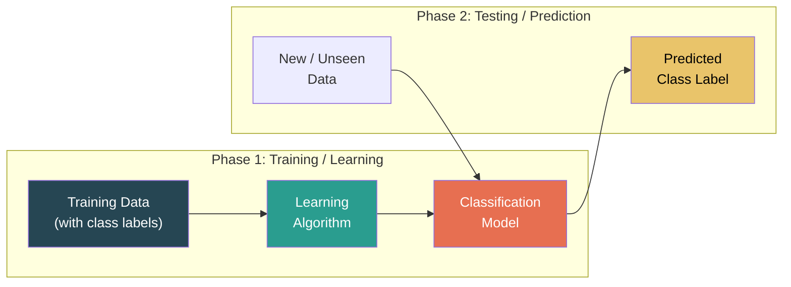

| Phase | Description |
|-------|-------------|
| **Training Phase** | A classification algorithm builds the classifier by learning from a **training set** — a collection of data tuples where each tuple has a known class label. The model learns the relationship between attributes and class labels. |
| **Testing Phase** | The model's accuracy is estimated using a **test set** — a separate collection of tuples with known class labels. The predicted labels are compared with actual labels to compute accuracy. |
| **Application Phase** | Once accuracy is satisfactory, the model is used to classify new, unseen data tuples whose class labels are unknown. |

### Key Terminology

| Term | Definition |
|------|-----------|
| **Training Set** | A set of data tuples with known class labels used to build the model. |
| **Test Set** | A separate set of labeled tuples used to evaluate model accuracy. |
| **Classifier** | The learned model that assigns class labels to new data. |
| **Class Label** | The target categorical attribute to be predicted (e.g., Yes/No, Spam/Not Spam). |
| **Predictor Attributes** | The input features used to predict the class label (e.g., age, income). |
| **Supervised Learning** | Learning from labeled examples (contrast with unsupervised learning like clustering). |

### Types of Classification

| Type | Description | Example |
|------|-------------|---------|
| **Binary Classification** | Two possible class labels. | Spam vs Not Spam, Yes vs No |
| **Multi-class Classification** | More than two possible class labels. | Low / Medium / High risk; Disease types |

---

## 4.2 Classification Methods Overview

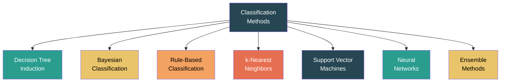

---

## 4.3 Decision Tree Induction

A **Decision Tree** is a flowchart-like tree structure used for classification:
- Each **internal node** represents a test on an attribute.
- Each **branch** represents an outcome of the test.
- Each **leaf node** (terminal node) holds a class label.

> To classify an unknown sample, the attribute values are tested starting from the **root** node, following the branches based on attribute values until a **leaf** node is reached. The leaf node's class label is the prediction.

### Structure of a Decision Tree

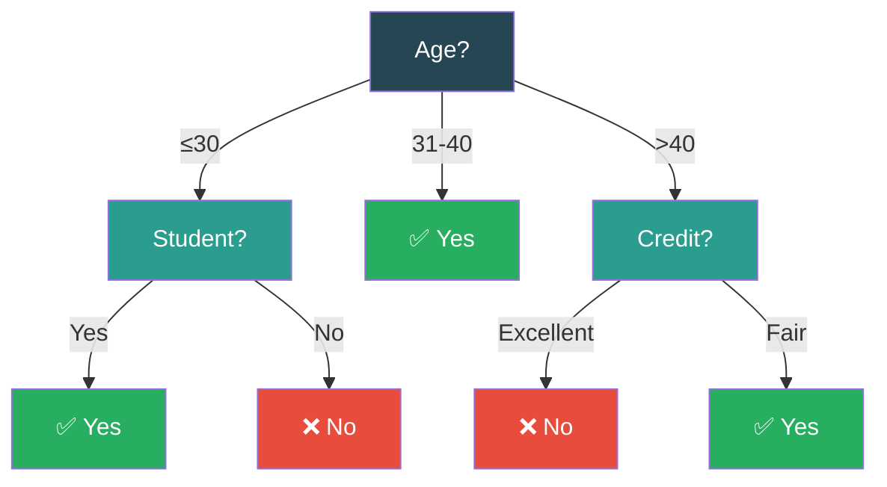

### Decision Tree Induction Algorithm (Basic Hunt's Algorithm)

1. If all tuples in the current dataset belong to the **same class** → create a **leaf node** with that class label.
2. If the dataset is **empty** → create a leaf node with the **majority class** of the parent.
3. Otherwise:
   - Select the **best attribute** using an attribute selection measure.
   - Label the current node with this attribute.
   - **Partition** the data by the attribute's values.
   - **Recursively** build subtrees for each partition.

---

### 4.3.1 Attribute Selection Measures

The quality of a decision tree depends on how well we choose the attributes for splitting. The goal is to select the attribute that best separates the data into pure (homogeneous) subsets.

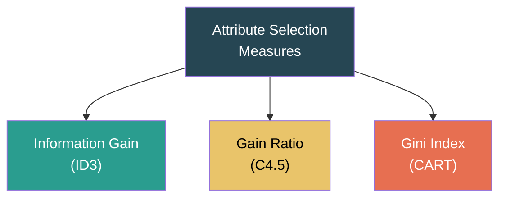

---

#### A. Information Gain (ID3 Algorithm)

**Information Gain** measures the reduction in entropy (information needed) after splitting on an attribute. The attribute with the **highest information gain** is selected.

**Entropy** measures the impurity or uncertainty in a dataset:

$$Info(D) = - \sum_{i=1}^{m} p_i \log_2(p_i)$$

Where:
- *D* = the dataset
- *m* = number of classes
- *pᵢ* = probability that a tuple in D belongs to class *Cᵢ* = |Cᵢ,D| / |D|

**Properties of Entropy:**
- Entropy = **0** → perfectly pure (all tuples belong to one class)
- Entropy = **1** (for 2 classes) → maximum impurity (50-50 split)
- Higher entropy = more disorder/impurity

**Information needed after splitting on attribute A:**

$$Info_A(D) = \sum_{j=1}^{v} \frac{|D_j|}{|D|} \times Info(D_j)$$

Where *v* = number of distinct values of attribute A, and *Dⱼ* = subset of D for which A has value *aⱼ*.

**Information Gain:**

$$Gain(A) = Info(D) - Info_A(D)$$

> **Select the attribute with the HIGHEST Information Gain.**

##### Solved Example: Information Gain

**Training Data: "Buy Computer?" (14 tuples)**

| RID | Age | Income | Student | Credit | Buys_Computer |
|-----|-----|--------|---------|--------|:---:|
| 1 | ≤30 | High | No | Fair | No |
| 2 | ≤30 | High | No | Excellent | No |
| 3 | 31-40 | High | No | Fair | Yes |
| 4 | >40 | Medium | No | Fair | Yes |
| 5 | >40 | Low | Yes | Fair | Yes |
| 6 | >40 | Low | Yes | Excellent | No |
| 7 | 31-40 | Low | Yes | Excellent | Yes |
| 8 | ≤30 | Medium | No | Fair | No |
| 9 | ≤30 | Low | Yes | Fair | Yes |
| 10 | >40 | Medium | Yes | Fair | Yes |
| 11 | ≤30 | Medium | Yes | Excellent | Yes |
| 12 | 31-40 | Medium | No | Excellent | Yes |
| 13 | 31-40 | High | Yes | Fair | Yes |
| 14 | >40 | Medium | No | Excellent | No |

**Class Distribution:** Yes = 9, No = 5, Total = 14

**Step 1: Compute Info(D) — Entropy of the full dataset**

Info(D) = −(9/14)log₂(9/14) − (5/14)log₂(5/14)
        = −(0.643)(−0.637) − (0.357)(−1.486)
        = 0.410 + 0.531
        = **0.940 bits**

**Step 2: Compute Info_Age(D) — Split on Age**

| Age | Total | Yes | No |
|-----|:-----:|:---:|:--:|
| ≤30 | 5 | 2 | 3 |
| 31-40 | 4 | 4 | 0 |
| >40 | 5 | 3 | 2 |

Info(D_≤30) = −(2/5)log₂(2/5) − (3/5)log₂(3/5) = 0.971
Info(D_31-40) = −(4/4)log₂(4/4) = 0 (pure node)
Info(D_>40) = −(3/5)log₂(3/5) − (2/5)log₂(2/5) = 0.971

Info_Age(D) = (5/14)(0.971) + (4/14)(0) + (5/14)(0.971)
            = 0.347 + 0 + 0.347
            = **0.694**

**Gain(Age) = 0.940 − 0.694 = 0.246**

**Step 3: Similarly compute for other attributes**

| Attribute | Info_A(D) | Gain(A) |
|-----------|:---------:|:-------:|
| Age | 0.694 | **0.246** |
| Income | 0.911 | 0.029 |
| Student | 0.788 | 0.152 |
| Credit | 0.892 | 0.048 |

**Result:** **Age** has the highest information gain (0.246) → Selected as the root node.

The process then recurses for each branch (≤30, 31-40, >40), computing information gain on the remaining attributes for each subset.

---

#### B. Gain Ratio (C4.5 Algorithm)

**Problem with Information Gain:** It is biased toward attributes with a **large number of distinct values** (e.g., an ID attribute would have the highest gain but is useless for classification).

**Solution:** Gain Ratio normalizes information gain by the attribute's own intrinsic information:

**Split Information:**

$$SplitInfo_A(D) = - \sum_{j=1}^{v} \frac{|D_j|}{|D|} \log_2 \frac{|D_j|}{|D|}$$

**Gain Ratio:**

$$GainRatio(A) = \frac{Gain(A)}{SplitInfo_A(D)}$$

> **Select the attribute with the HIGHEST Gain Ratio.**

##### Solved Example: Gain Ratio for Age

SplitInfo_Age(D) = −(5/14)log₂(5/14) − (4/14)log₂(4/14) − (5/14)log₂(5/14)
                 = −(0.357)(−1.486) − (0.286)(−1.807) − (0.357)(−1.486)
                 = 0.531 + 0.516 + 0.531
                 = **1.577**

GainRatio(Age) = 0.246 / 1.577 = **0.156**

---

#### C. Gini Index (CART Algorithm)

The **Gini Index** measures the **impurity** of a dataset. Used by the **CART** (Classification and Regression Trees) algorithm.

$$Gini(D) = 1 - \sum_{i=1}^{m} p_i^2$$

Where *pᵢ* is the probability that a tuple belongs to class *Cᵢ*.

**Properties:**
- Gini = **0** → perfectly pure
- Gini = **0.5** (for 2 classes) → maximum impurity
- Lower Gini = better purity

**For a binary split on attribute A into D₁ and D₂:**

$$Gini_A(D) = \frac{|D_1|}{|D|} Gini(D_1) + \frac{|D_2|}{|D|} Gini(D_2)$$

**Reduction in Impurity (Gini Gain):**

$$\Delta Gini(A) = Gini(D) - Gini_A(D)$$

> **Select the attribute with the LARGEST reduction in Gini (smallest Gini_A).**

##### Solved Example: Gini Index

Using the same "Buy Computer" dataset:

Gini(D) = 1 − (9/14)² − (5/14)² = 1 − 0.413 − 0.128 = **0.459**

**Split on Income (binary split: {Low, Medium} vs {High}):**

D₁ = {Low, Medium}: 7 Yes, 3 No → Gini(D₁) = 1 − (7/10)² − (3/10)² = 1 − 0.49 − 0.09 = 0.42
D₂ = {High}: 2 Yes, 2 No → Gini(D₂) = 1 − (2/4)² − (2/4)² = 1 − 0.25 − 0.25 = 0.5

Gini_Income(D) = (10/14)(0.42) + (4/14)(0.5) = 0.300 + 0.143 = **0.443**

ΔGini(Income) = 0.459 − 0.443 = **0.016**

---

### Comparison of Attribute Selection Measures

| Measure | Algorithm | Bias | Split Type | Formula Summary |
|---------|-----------|------|------------|----------------|
| **Information Gain** | ID3 | Biased toward many-valued attributes | Multi-way | Gain = Info(D) − Info_A(D) |
| **Gain Ratio** | C4.5 | Corrects multi-value bias via normalization | Multi-way | GainRatio = Gain / SplitInfo |
| **Gini Index** | CART | Favors attributes with fewer values, equal-size partitions | Binary | ΔGini = Gini(D) − Gini_A(D) |

---

### 4.3.2 Tree Pruning

A fully grown decision tree may **overfit** the training data — it learns noise and anomalies, resulting in poor generalization to unseen data.

> **Overfitting:** The model is too complex and captures noise. It performs very well on training data but poorly on test/unseen data.

**Tree pruning** addresses overfitting by simplifying the tree.

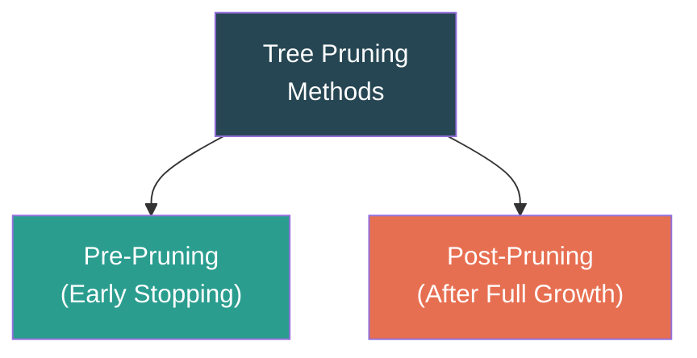

| Method | Description | Advantages | Disadvantages |
|--------|-------------|------------|---------------|
| **Pre-Pruning (Early Stopping)** | Stop growing the tree before it becomes fully grown. A node is declared a leaf if splitting does not significantly improve a measure (e.g., information gain, Gini, chi-square test) or if the number of tuples falls below a threshold. | Avoids generating overly complex subtrees; computationally efficient. | Difficult to choose the right threshold; may stop too early (underfitting). |
| **Post-Pruning** | Grow the full tree first, then remove or collapse subtrees that provide little classification power. Replace a subtree with a leaf node labeled with the majority class. Use a validation set or cross-validation to decide which subtrees to prune. | Generally produces more reliable results than pre-pruning. | More computationally expensive since the full tree must be generated first. |

**Common Post-Pruning Techniques:**

| Technique | Description |
|-----------|-------------|
| **Reduced Error Pruning** | For each non-leaf node, evaluate performance if we replace the subtree with a leaf. If accuracy on a validation set does not decrease (or improves), prune. |
| **Cost Complexity Pruning (CCP)** | Used in CART. Generates a sequence of progressively pruned trees, each associated with a complexity parameter α. Select the tree with the best cross-validated accuracy. |
| **Pessimistic Error Pruning** | Uses training error with a penalty term for complexity. If the upper bound of the estimated error of the subtree is ≥ the error of replacing it with a leaf, prune. |

---

## 4.4 Bayesian Classification

Bayesian classifiers are **statistical classifiers** based on **Bayes' theorem**. They predict class membership probabilities — the probability that a given tuple belongs to a particular class.

### Bayes' Theorem

$$P(C|X) = \frac{P(X|C) \cdot P(C)}{P(X)}$$

| Term | Meaning |
|------|---------|
| **P(C\|X)** | **Posterior probability** — Probability of class C given the data X. (What we want to compute.) |
| **P(X\|C)** | **Likelihood** — Probability of observing data X given that the class is C. |
| **P(C)** | **Prior probability** — Prior probability of class C (from training data). |
| **P(X)** | **Evidence** — Probability of the data X (constant for all classes, can be ignored for comparison). |

### 4.4.1 Naïve Bayes Classifier

The **Naïve Bayes classifier** makes the simplifying **assumption of class-conditional independence** — it assumes that all attributes are independent of each other given the class label.

$$P(X|C_i) = \prod_{k=1}^{n} P(x_k|C_i)$$

**Classification Rule:** Assign the class label Cᵢ that **maximizes** the posterior probability:

$$C_{predicted} = \arg\max_{C_i} P(C_i) \cdot \prod_{k=1}^{n} P(x_k|C_i)$$

Since P(X) is constant across all classes, we only need to maximize the numerator.

**Estimating Probabilities:**
- **Categorical attributes:** P(xₖ|Cᵢ) = (count of tuples with xₖ in class Cᵢ) / (count of tuples in class Cᵢ)
- **Continuous attributes:** Assume a Gaussian (normal) distribution:

$$P(x_k|C_i) = \frac{1}{\sqrt{2\pi}\sigma_{C_i}} \exp\left(-\frac{(x_k - \mu_{C_i})^2}{2\sigma_{C_i}^2}\right)$$

Where μ and σ are the mean and standard deviation of attribute xₖ for class Cᵢ.

**Laplacian Correction (Smoothing):**
If P(xₖ|Cᵢ) = 0 (an attribute value never appears for a class in training), the entire product becomes 0. To avoid this, add 1 to each count:

$$P(x_k|C_i) = \frac{count(x_k, C_i) + 1}{count(C_i) + d}$$

Where *d* = number of distinct values of the attribute.

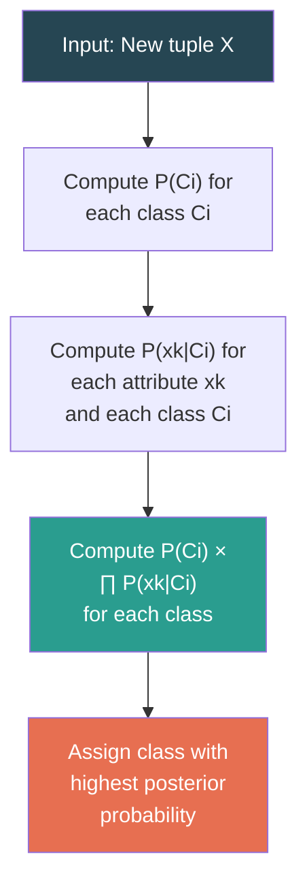

##### Solved Example: Naïve Bayes Classifier

**Problem:** Classify the tuple X = (Age=≤30, Income=Medium, Student=Yes, Credit=Fair) using the "Buy Computer" training data.

**Step 1: Compute Prior Probabilities**

P(Yes) = 9/14 = 0.643
P(No) = 5/14 = 0.357

**Step 2: Compute Likelihoods (Class-Conditional Probabilities)**

**For Class = Yes (9 tuples):**

| Attribute | Value | Count in Yes | P(xₖ|Yes) |
|-----------|-------|:---:|:---:|
| Age | ≤30 | 2 | 2/9 = 0.222 |
| Income | Medium | 4 | 4/9 = 0.444 |
| Student | Yes | 6 | 6/9 = 0.667 |
| Credit | Fair | 6 | 6/9 = 0.667 |

**For Class = No (5 tuples):**

| Attribute | Value | Count in No | P(xₖ|No) |
|-----------|-------|:---:|:---:|
| Age | ≤30 | 3 | 3/5 = 0.600 |
| Income | Medium | 2 | 2/5 = 0.400 |
| Student | Yes | 1 | 1/5 = 0.200 |
| Credit | Fair | 2 | 2/5 = 0.400 |

**Step 3: Compute Posterior Probabilities (unnormalized)**

P(Yes) × P(X|Yes) = 0.643 × 0.222 × 0.444 × 0.667 × 0.667  = 0.643 × 0.0440 = **0.0283**

P(No) × P(X|No) = 0.357 × 0.600 × 0.400 × 0.200 × 0.400 = 0.357 × 0.0192 = **0.00686**

**Step 4: Compare and Classify**

Since P(Yes|X) ∝ 0.0283 > P(No|X) ∝ 0.00686 → **Predicted class = Yes (Buys Computer)**

**Normalized:**
P(Yes|X) = 0.0283 / (0.0283 + 0.00686) = **0.805 (80.5%)**
P(No|X) = 0.00686 / (0.0283 + 0.00686) = **0.195 (19.5%)**

### Advantages and Disadvantages of Naïve Bayes

| Advantages | Disadvantages |
|------------|---------------|
| Simple and easy to implement | Assumes attribute independence (often violated in practice) |
| Fast training and prediction | Accuracy can suffer when attributes are correlated |
| Performs well with small training data | Not ideal for numeric data without discretization or Gaussian assumption |
| Handles both categorical and continuous attributes | Zero probability problem (mitigated by Laplacian correction) |
| Robust to irrelevant attributes | Cannot capture interactions between attributes |

---

## 4.5 Rule-Based Classification

Rule-based classifiers use **IF-THEN rules** to classify data. Rules are in the form:

> **IF** *condition* **THEN** *conclusion*

Where:
- **condition** (antecedent/LHS) = a conjunction of attribute tests
- **conclusion** (consequent/RHS) = a class label

**Example Rule:**
```
IF age = "≤30" AND student = "Yes"
THEN buys_computer = "Yes"
```

### Key Concepts

| Concept | Definition |
|---------|-----------|
| **Rule Antecedent** | The IF part — a conjunction of conditions (attribute-value pairs). |
| **Rule Consequent** | The THEN part — the predicted class label. |
| **Coverage** | The percentage of tuples that satisfy the rule's antecedent. |
| **Accuracy** | Of the tuples that satisfy the antecedent, the percentage correctly classified. |
| **Mutually Exclusive Rules** | No two rules are triggered by the same tuple. |
| **Exhaustive Rules** | There is a rule for every possible attribute combination — all tuples are covered. |

### Rule Evaluation

For a rule *R:* IF *condition* THEN *class = c*:

- **Coverage(R)** = n_covers / |D| — Fraction of tuples satisfying the condition.
- **Accuracy(R)** = n_correct / n_covers — Fraction of covered tuples that truly belong to class *c*.

### Rule Extraction from Decision Trees

Every path from the root to a leaf node in a decision tree can be converted to a classification rule:

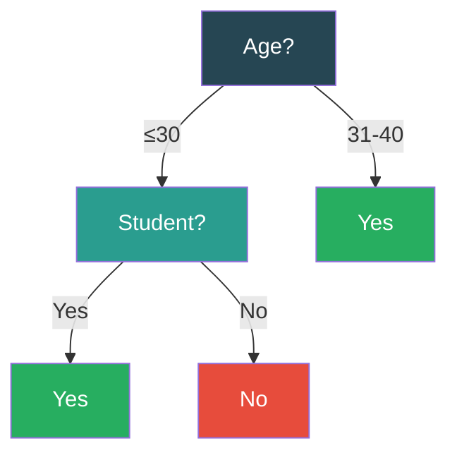

**Extracted Rules:**
```
Rule 1: IF age = "≤30" AND student = "Yes" THEN buys_computer = "Yes"
Rule 2: IF age = "≤30" AND student = "No"  THEN buys_computer = "No"
Rule 3: IF age = "31-40"                   THEN buys_computer = "Yes"
```

**Properties of rules from decision trees:**
- Rules are **mutually exclusive** (exactly one rule fires per tuple).
- Rules are **exhaustive** (every tuple is covered by at least one rule).

### Rule Ordering / Conflict Resolution

When rules are NOT mutually exclusive, multiple rules may fire for a single tuple. Conflict resolution strategies:

| Strategy | Description |
|----------|-------------|
| **Rule Ordering (Decision List)** | Rules are ranked in priority order. The first matching rule is applied. |
| **Class-Based Ordering** | Classes are ranked; within each class, rules are unordered. |
| **Highest Accuracy** | Select the matching rule with the highest accuracy. |
| **Most Specific** | Select the rule with the most conditions (most specific antecedent). |
| **Majority Vote** | All matching rules vote; the class with the most votes wins. |

### Rule-Based Classification Algorithms

| Algorithm | Description |
|-----------|-------------|
| **RIPPER (Repeated Incremental Pruning to Produce Error Reduction)** | Efficient rule learning algorithm. Grows rules then prunes them. Handles multi-class problems. |
| **Sequential Covering** | Learn one rule at a time. Remove covered tuples (those correctly classified). Repeat until all tuples are covered. |
| **CN2** | Uses beam search to find the best rule antecedent; based on entropy or Laplace accuracy. |

### Sequential Covering Algorithm

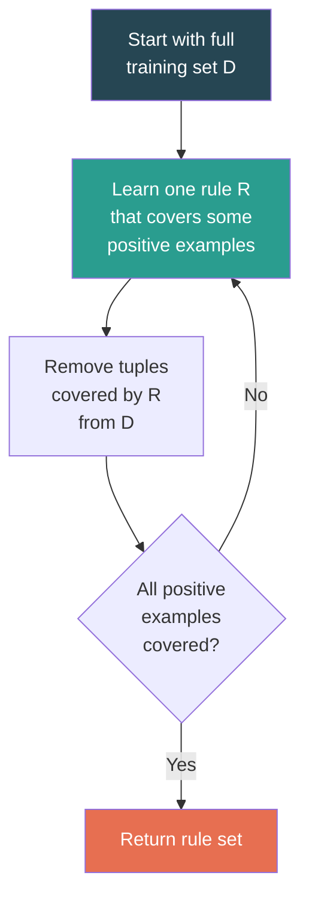

1. Start with the entire training dataset.
2. **Learn-One-Rule:** Find the best rule that covers a subset of tuples for a particular class.
3. Remove the tuples (positive examples) covered by this rule from the dataset.
4. Repeat until all (or a sufficient number of) positive examples are covered.
5. The final classifier is the **disjunction** (OR) of all learned rules plus a default rule.

---

## 4.6 Accuracy and Error Measures

Evaluating a classifier's performance is critical. Several metrics and methods are used.

### Confusion Matrix

A confusion matrix summarizes the classification results on test data for a **binary classifier**:

|  | **Predicted: Positive** | **Predicted: Negative** |
|---|:---:|:---:|
| **Actual: Positive** | TP (True Positive) | FN (False Negative) |
| **Actual: Negative** | FP (False Positive) | TN (True Negative) |

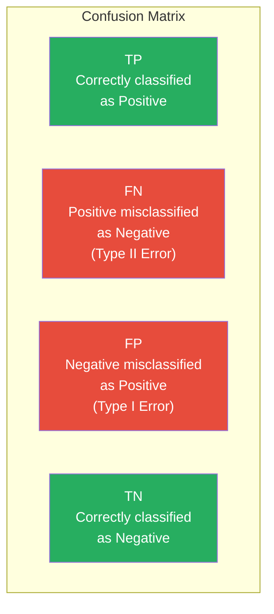

### Key Performance Metrics

| Metric | Formula | Interpretation |
|--------|---------|---------------|
| **Accuracy** | (TP + TN) / (TP + TN + FP + FN) | Overall correctness — fraction of correct predictions. |
| **Error Rate** | (FP + FN) / (TP + TN + FP + FN) = 1 − Accuracy | Overall misclassification rate. |
| **Precision (P)** | TP / (TP + FP) | Of all predicted positives, how many are actually positive? (Exactness) |
| **Recall (R) / Sensitivity / TPR** | TP / (TP + FN) | Of all actual positives, how many were correctly predicted? (Completeness) |
| **Specificity / TNR** | TN / (TN + FP) | Of all actual negatives, how many were correctly predicted? |
| **F1-Score** | 2 × (P × R) / (P + R) | Harmonic mean of Precision and Recall — balances both. |
| **F_β Score** | (1 + β²) × (P × R) / (β² × P + R) | Weighted F-score; β > 1 emphasizes recall, β < 1 emphasizes precision. |

##### Solved Example: Confusion Matrix Metrics

| | Predicted: Yes | Predicted: No |
|---|:---:|:---:|
| **Actual: Yes** | TP = 85 | FN = 15 |
| **Actual: No** | FP = 10 | TN = 90 |

Total = 200

| Metric | Calculation | Value |
|--------|-------------|-------|
| Accuracy | (85+90)/200 | **87.5%** |
| Error Rate | (10+15)/200 | **12.5%** |
| Precision | 85/(85+10) | **89.5%** |
| Recall | 85/(85+15) | **85.0%** |
| Specificity | 90/(90+10) | **90.0%** |
| F1-Score | 2×(0.895×0.85)/(0.895+0.85) | **87.2%** |

### When to Use Precision vs Recall

| Scenario | Prioritize | Reason |
|----------|-----------|--------|
| **Spam Detection** | Precision | Don't want legitimate emails marked as spam (FP costly). |
| **Cancer Diagnosis** | Recall | Don't want to miss a cancer patient (FN costly). |
| **Fraud Detection** | Recall | Missing fraud (FN) is worse than false alarms (FP). |
| **Search Engine Results** | Precision | Users prefer relevant results at the top. |

---

### 4.6.1 Model Evaluation Methods

These methods determine how to split available data into training and test sets.

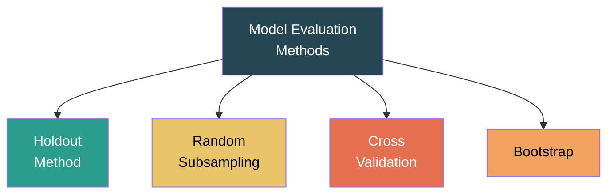

#### A. Holdout Method

The simplest approach: **partition** the data into two disjoint sets:
- **Training set** (typically 2/3 of the data) — used to build the model.
- **Test set** (typically 1/3 of the data) — used to evaluate the model.

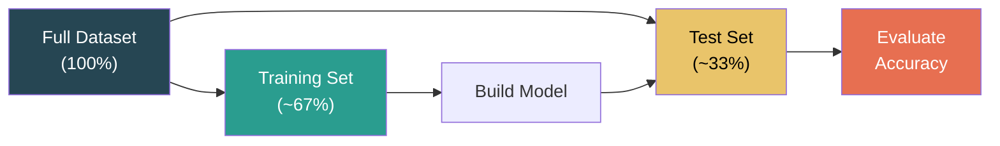

| Advantages | Disadvantages |
|------------|---------------|
| Simple and fast | Results highly dependent on the particular split |
| Easy to implement | May not use all data for training |
| | Not representative if data is imbalanced |

**Stratified Holdout:** Ensures both training and test sets have the same class distribution as the original data.

#### B. Random Subsampling

Repeat the **holdout** method multiple times with **different random partitions**. The overall accuracy is the **average** of all iterations.

$$Accuracy = \frac{1}{k} \sum_{i=1}^{k} Accuracy_i$$

| Advantages | Disadvantages |
|------------|---------------|
| Reduces variance due to single split | Some tuples may never be used for testing; others may be used multiple times |
| More reliable estimate than single holdout | No guarantee every tuple is tested |

#### C. Cross-Validation

**k-Fold Cross-Validation:** Partition the data into **k** mutually exclusive subsets (folds) of approximately equal size.

1. Train on (k−1) folds, test on the remaining 1 fold.
2. Repeat k times, each time using a different fold as the test set.
3. Average accuracy across all k runs.

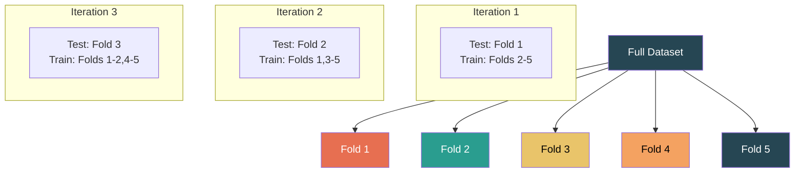

**Common value:** k = 10 (**10-fold cross-validation**)

| Variant | Description |
|---------|-------------|
| **Stratified k-Fold** | Each fold has the same class proportion as the full dataset. Preferred in practice. |
| **Leave-One-Out (LOO)** | k = N (number of tuples). Each fold is a single tuple. Most exhaustive but computationally expensive. |

| Advantages | Disadvantages |
|------------|---------------|
| Every tuple is tested exactly once | More computationally expensive than holdout |
| Reliable and widely used | LOO is very expensive for large datasets |
| All data used for both training and testing | |

**Comparison Summary:**

| Method | # Iterations | Test Set Size | Reliability | Cost |
|--------|:---:|:---:|:---:|:---:|
| Holdout | 1 | ~33% | Low | Low |
| Random Subsampling | k | ~33% each | Medium | Medium |
| k-Fold CV | k | ~1/k each | High | Medium-High |
| Leave-One-Out | N | 1 tuple | Highest | Very High |

---

# Chapter 5: Clustering

---

## 5.1 Cluster Analysis — Basic Concepts

**Clustering** is a form of **unsupervised learning** where the goal is to group data objects into **clusters** such that:
- Objects **within** a cluster are **similar** to each other.
- Objects **across** different clusters are **dissimilar** to each other.

> **Definition:** Clustering is the process of partitioning a set of data objects into subsets (clusters) such that objects in the same cluster share common characteristics and are dissimilar to objects in other clusters.

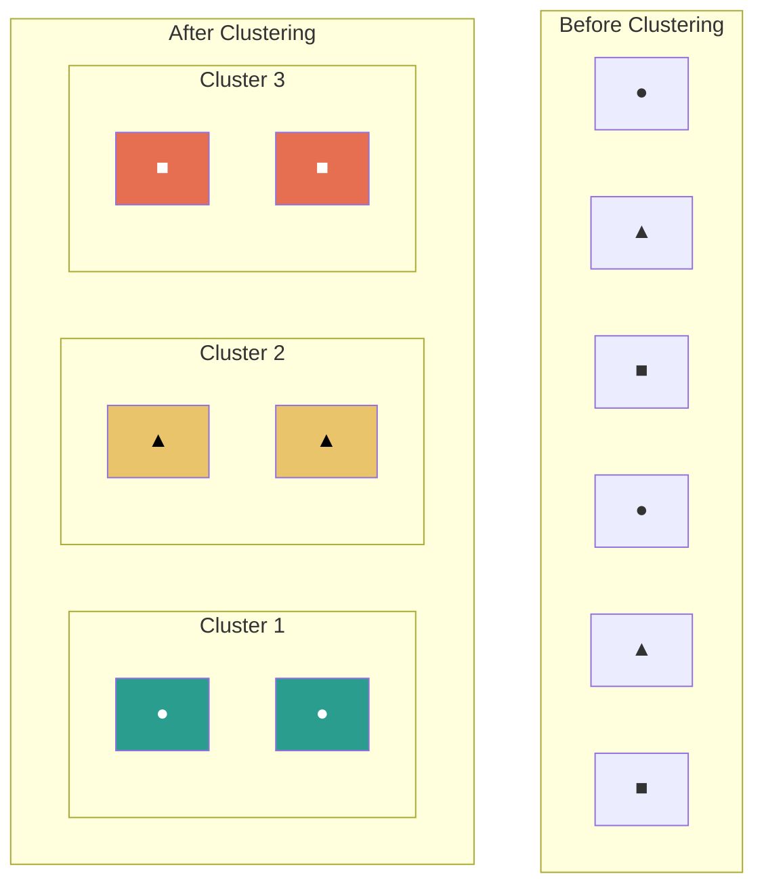

### Classification vs Clustering

| Feature | Classification (Supervised) | Clustering (Unsupervised) |
|---------|---------------------------|--------------------------|
| **Labels** | Class labels are known (training data is labeled) | No predefined labels |
| **Goal** | Predict class label for new data | Discover natural groupings |
| **Learning** | Learns from labeled examples | Learns from data structure |
| **Examples** | Decision trees, Naïve Bayes, SVM | K-Means, DBSCAN, Hierarchical |

### Requirements of Good Clustering

| Requirement | Description |
|-------------|-------------|
| **Scalability** | Should handle large datasets efficiently. |
| **Ability to handle different types of attributes** | Numeric, categorical, binary, mixed. |
| **Discovery of clusters with arbitrary shapes** | Not just spherical clusters. |
| **Minimal domain knowledge required** | Should not require too many input parameters. |
| **Robustness to noise and outliers** | Should not be overly affected by noisy or erroneous data. |
| **Insensitivity to order of input** | Results should not depend on the order data is processed. |
| **High dimensionality** | Should work well even when the data has many attributes. |
| **Interpretability and usability** | Results should be meaningful and usable. |

### Types of Clustering Methods

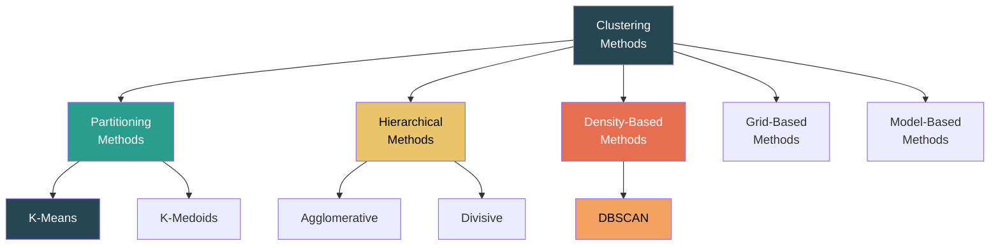

---

## 5.2 Partitioning Methods

Partitioning methods divide *n* objects into *k* clusters (where k is specified by the user), such that each object belongs to **exactly one** cluster and each cluster contains **at least one** object.

### 5.2.1 K-Means Algorithm

**K-Means** is the most widely used partitioning clustering algorithm. It partitions *n* data points into *k* clusters based on their proximity to cluster **centroids** (means).

#### Algorithm Steps

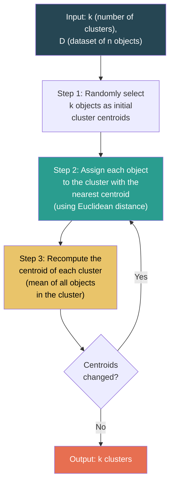

**Pseudocode:**

```
Algorithm: K-Means
Input: k (number of clusters), D (dataset with n objects)
Output: A set of k clusters

1. Randomly choose k objects from D as initial centroids μ₁, μ₂, ..., μₖ
2. REPEAT
   3.   For each object xᵢ in D:
   4.       Assign xᵢ to the cluster Cⱼ whose centroid μⱼ is nearest
            (j = argmin ||xᵢ − μⱼ||²)
   5.   For each cluster Cⱼ:
   6.       Update centroid μⱼ = mean of all objects in Cⱼ
            μⱼ = (1/|Cⱼ|) Σ xᵢ  for all xᵢ ∈ Cⱼ
7. UNTIL centroids do not change (convergence)
8. Return {C₁, C₂, ..., Cₖ}
```

**Objective Function (to minimize):**

$$SSE = \sum_{j=1}^{k} \sum_{x_i \in C_j} ||x_i - \mu_j||^2$$

Where SSE = Sum of Squared Errors (also called within-cluster sum of squares).

##### Solved Example: K-Means (k=2)

**Data Points:** A(2,10), B(2,5), C(8,4), D(5,8), E(7,5), F(6,4), G(1,2), H(4,9)

**Step 1: Initial centroids (randomly chosen):** μ₁ = A(2,10), μ₂ = C(8,4)

**Step 2 (Iteration 1): Assign each point to nearest centroid**

| Point | Dist to μ₁(2,10) | Dist to μ₂(8,4) | Cluster |
|-------|:-:|:-:|:---:|
| A(2,10) | 0 | 8.49 | C₁ |
| B(2,5) | 5.0 | 6.08 | C₁ |
| C(8,4) | 8.49 | 0 | C₂ |
| D(5,8) | 3.61 | 5.0 | C₁ |
| E(7,5) | 7.07 | 1.41 | C₂ |
| F(6,4) | 7.21 | 2.0 | C₂ |
| G(1,2) | 8.06 | 7.28 | C₂ |
| H(4,9) | 2.24 | 6.40 | C₁ |

C₁ = {A, B, D, H}, C₂ = {C, E, F, G}

**Step 3: Recompute centroids**

μ₁ = ((2+2+5+4)/4, (10+5+8+9)/4) = **(3.25, 8.0)**
μ₂ = ((8+7+6+1)/4, (4+5+4+2)/4) = **(5.5, 3.75)**

**Step 4 (Iteration 2): Reassign**

| Point | Dist to μ₁(3.25,8) | Dist to μ₂(5.5,3.75) | Cluster |
|-------|:-:|:-:|:---:|
| A(2,10) | 2.28 | 7.13 | C₁ |
| B(2,5) | 3.25 | 3.77 | C₁ |
| C(8,4) | 5.95 | 2.52 | C₂ |
| D(5,8) | 1.75 | 4.27 | C₁ |
| E(7,5) | 4.95 | 1.90 | C₂ |
| F(6,4) | 4.87 | 0.56 | C₂ |
| G(1,2) | 6.40 | 4.83 | C₂ |
| H(4,9) | 1.25 | 5.51 | C₁ |

C₁ = {A, B, D, H}, C₂ = {C, E, F, G} — **Same assignment as before → Converged!**

**Final Clusters:**
- **Cluster 1:** {A(2,10), B(2,5), D(5,8), H(4,9)} — Centroid: (3.25, 8.0)
- **Cluster 2:** {C(8,4), E(7,5), F(6,4), G(1,2)} — Centroid: (5.5, 3.75)

#### Advantages and Disadvantages of K-Means

| Advantages | Disadvantages |
|------------|---------------|
| Simple and easy to understand | Requires k to be specified in advance |
| Computationally efficient: O(n × k × t) where t = iterations | Sensitive to initial centroid selection (may converge to local optima) |
| Works well with large datasets | Sensitive to outliers and noise |
| Scales well | Only finds spherical (globular) clusters |
| Guaranteed to converge | Cannot handle non-convex or irregularly shaped clusters |
| | Not suitable for categorical data |

---

### 5.2.2 K-Medoids Algorithm (PAM — Partitioning Around Medoids)

**K-Medoids** addresses K-Means' sensitivity to outliers. Instead of using the **mean** (centroid) as the cluster representative, it uses the **medoid** — an actual data object in the cluster that is most centrally located.

> **Medoid:** The object within a cluster whose average dissimilarity to all other objects in the cluster is minimal.

#### Algorithm (PAM — Partitioning Around Medoids)

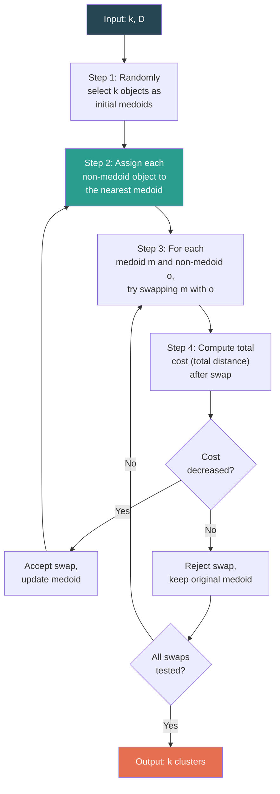

**Cost Function:**

$$TotalCost = \sum_{j=1}^{k} \sum_{x_i \in C_j} dist(x_i, m_j)$$

Where mⱼ is the medoid of cluster Cⱼ.

**Swap Evaluation:** For each (medoid m, non-medoid o):
- Tentatively replace m with o.
- Reassign all objects to the nearest medoid.
- Compute the change in total cost (ΔTC).
- If ΔTC < 0 (cost decreased), accept the swap.

#### K-Means vs K-Medoids

| Feature | K-Means | K-Medoids (PAM) |
|---------|---------|-----------------|
| **Representative** | Centroid (mean) — may not be an actual data point | Medoid — always an actual data point |
| **Sensitivity to Outliers** | Very sensitive | More robust |
| **Complexity** | O(n × k × t) | O(k × (n−k)² × t) — much more expensive |
| **Data Types** | Numeric only (needs mean) | Works with arbitrary distance measures (categorical too) |
| **Cluster Shape** | Spherical | Spherical (but more robust) |

---

## 5.3 Hierarchical Methods

Hierarchical clustering creates a **tree-like hierarchy** of nested clusters called a **dendrogram**. There is no need to specify the number of clusters (k) in advance — the user can cut the dendrogram at the desired level.

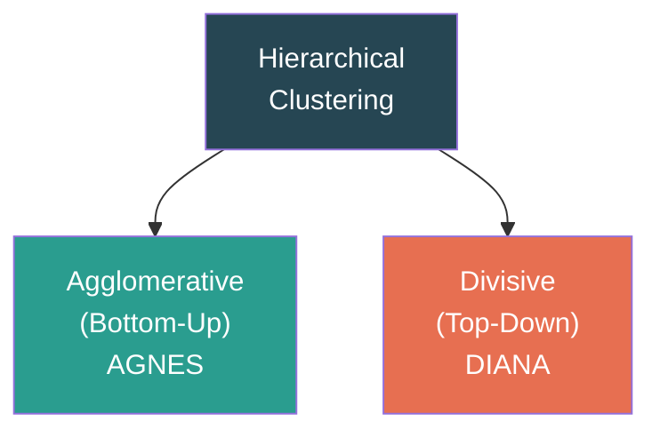

### 5.3.1 Agglomerative Hierarchical Clustering (AGNES)

**Agglomerative** = Bottom-Up approach. Starts with **each object as its own cluster** and merges the two closest clusters at each step until one cluster remains (or until k clusters are reached).

#### Algorithm

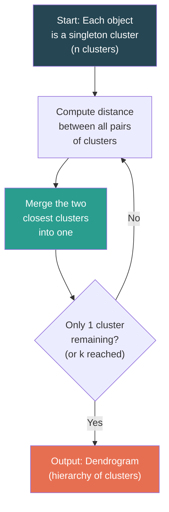

**Pseudocode:**

```
1. Start with n clusters (each object = one cluster).
2. Compute the proximity matrix (distance between every pair of clusters).
3. REPEAT
   4.   Find the two closest clusters Ci and Cj.
   5.   Merge Ci and Cj into a new cluster.
   6.   Update the proximity matrix.
7. UNTIL only one cluster remains.
```

#### Inter-Cluster Distance Measures (Linkage Methods)

The key question: How do we define the **distance between two clusters** (which contain multiple points)?

| Linkage | Formula | Description | Characteristics |
|---------|---------|-------------|----------------|
| **Single Linkage (MIN)** | dist(Cᵢ, Cⱼ) = min{d(a,b) : a∈Cᵢ, b∈Cⱼ} | Distance between the **closest** pair of points. | Can handle non-elliptical shapes; prone to **chaining effect** (elongated clusters). |
| **Complete Linkage (MAX)** | dist(Cᵢ, Cⱼ) = max{d(a,b) : a∈Cᵢ, b∈Cⱼ} | Distance between the **farthest** pair of points. | Produces compact, roughly equal-diameter clusters; sensitive to outliers. |
| **Average Linkage** | dist(Cᵢ, Cⱼ) = avg{d(a,b) : a∈Cᵢ, b∈Cⱼ} | **Average** distance between all pairs of points. | Compromise between single and complete; less susceptible to noise. |
| **Centroid Linkage** | dist(Cᵢ, Cⱼ) = d(μᵢ, μⱼ) | Distance between cluster **centroids** (means). | Simple but can produce inversions in dendrogram. |
| **Ward's Method** | Merge clusters that cause the **minimum increase** in total within-cluster variance (SSE). | Minimizes information loss at each step. | Tends to create compact, equally-sized clusters; most popular in practice. |

##### Solved Example: Agglomerative Clustering (Single Linkage)

**Data Points:** P1(0,0), P2(1,0), P3(3,0), P4(5,0), P5(4,0)

**Step 1: Initial Distance Matrix**

|  | P1 | P2 | P3 | P4 | P5 |
|---|:---:|:---:|:---:|:---:|:---:|
| P1 | 0 | 1 | 3 | 5 | 4 |
| P2 | 1 | 0 | 2 | 4 | 3 |
| P3 | 3 | 2 | 0 | 2 | 1 |
| P4 | 5 | 4 | 2 | 0 | 1 |
| P5 | 4 | 3 | 1 | 1 | 0 |

**Step 2: Merge closest pair** → min distance = 1 (P1,P2) and (P3,P5) and (P4,P5). Merge P1 and P2 → {P1,P2}

**Step 3: Update distances** (Single linkage = min)

|  | {P1,P2} | P3 | P4 | P5 |
|---|:---:|:---:|:---:|:---:|
| {P1,P2} | 0 | 2 | 4 | 3 |
| P3 | 2 | 0 | 2 | 1 |
| P4 | 4 | 2 | 0 | 1 |
| P5 | 3 | 1 | 1 | 0 |

**Step 4: Merge** → min = 1 (P3,P5) or (P4,P5). Merge P3 and P5 → {P3,P5}

|  | {P1,P2} | {P3,P5} | P4 |
|---|:---:|:---:|:---:|
| {P1,P2} | 0 | 2 | 4 |
| {P3,P5} | 2 | 0 | 1 |
| P4 | 4 | 1 | 0 |

**Step 5: Merge** → min = 1 ({P3,P5}, P4). Merge → {P3,P4,P5}

|  | {P1,P2} | {P3,P4,P5} |
|---|:---:|:---:|
| {P1,P2} | 0 | 2 |
| {P3,P4,P5} | 2 | 0 |

**Step 6: Merge** → {P1,P2,P3,P4,P5} — Single cluster.

**Dendrogram:**

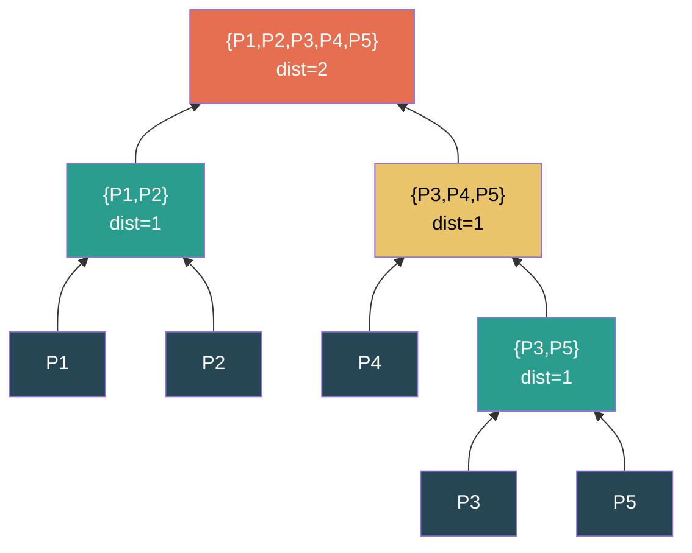

To obtain **k=2 clusters**, cut the dendrogram at distance 2: **{P1, P2}** and **{P3, P4, P5}**.

---

### 5.3.2 Divisive Hierarchical Clustering (DIANA)

**Divisive** = Top-Down approach. Starts with **all objects in a single cluster** and recursively divides the most heterogeneous cluster into two until each object forms its own cluster (or k clusters are reached).

#### Algorithm

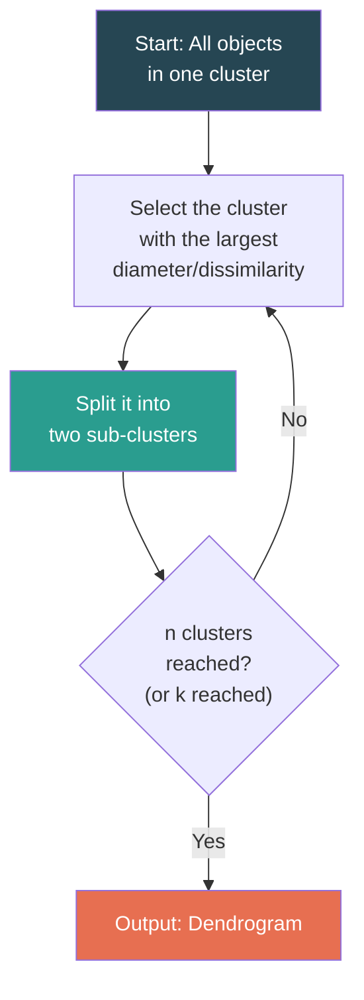

**Splitting Strategies:**
1. Find the object in the cluster with the **highest average dissimilarity** to all other objects. Move it to a new "splinter group."
2. Iteratively move objects closer to the splinter group than to the remaining cluster.
3. Continue until no more objects can be moved.

#### Agglomerative vs Divisive

| Feature | Agglomerative (AGNES) | Divisive (DIANA) |
|---------|----------------------|-----------------|
| **Direction** | Bottom-up | Top-down |
| **Starts with** | n singleton clusters | 1 cluster containing all objects |
| **Process** | Merge closest pair | Split most heterogeneous |
| **Complexity** | O(n²) with efficient implementations | O(2ⁿ) in the worst case |
| **Usage** | More commonly used | Less common due to complexity |
| **Early Decisions** | Small, local decisions (merging) | Large, global decisions (splitting) |

### Advantages and Disadvantages of Hierarchical Clustering

| Advantages | Disadvantages |
|------------|---------------|
| No need to specify k in advance | Cannot undo a merge/split once made |
| Produces a dendrogram for visual analysis | High time complexity: O(n² log n) or O(n³) |
| Deterministic — no random initialization | Not scalable to very large datasets |
| Flexible — can cut dendrogram at any level | Sensitive to noise and outliers |

---

## 5.4 Density-Based Clustering: DBSCAN

**Density-based** methods define clusters as dense regions of data separated by regions of lower density. They can discover clusters of **arbitrary shape** and are robust to **noise**.

### 5.4.1 DBSCAN (Density-Based Spatial Clustering of Applications with Noise)

**DBSCAN** (Ester, Kriegel, Sander & Xu, 1996) is the most well-known density-based clustering algorithm.

#### Key Parameters

| Parameter | Description |
|-----------|-------------|
| **ε (Epsilon)** | The radius of the neighborhood around a point. Two points are neighbors if their distance ≤ ε. |
| **MinPts** | The minimum number of points required within the ε-neighborhood to form a dense region. |

#### Key Definitions

| Term | Definition |
|------|-----------|
| **ε-Neighborhood** | N_ε(p) = {q ∈ D \| dist(p, q) ≤ ε} — the set of all points within distance ε from point p. |
| **Core Point** | A point p is a **core point** if \|N_ε(p)\| ≥ MinPts (at least MinPts points in its ε-neighborhood, including itself). |
| **Border Point** | A point that is NOT a core point but lies within the ε-neighborhood of a core point. It has fewer than MinPts neighbors but is reachable from a core point. |
| **Noise Point (Outlier)** | A point that is neither a core point nor a border point — not within ε of any core point. |
| **Directly Density-Reachable** | A point q is directly density-reachable from p if p is a core point and q ∈ N_ε(p). |
| **Density-Reachable** | A point q is density-reachable from p if there is a chain of points p = p₁, p₂, ..., pₙ = q such that each pᵢ₊₁ is directly density-reachable from pᵢ. |
| **Density-Connected** | Two points p and q are density-connected if there is a point o such that both p and q are density-reachable from o. |

```mermaid
graph TD
    subgraph "Point Classification (ε, MinPts=4)"
        CP["Core Point<br>≥ MinPts neighbors<br>within ε"]
        BP["Border Point<br>< MinPts neighbors<br>but near a core point"]
        NP["Noise Point<br>Not near any<br>core point"]
    end
    style CP fill:#27ae60,color:#fff
    style BP fill:#e9c46a,color:#000
    style NP fill:#e74c3c,color:#fff
```

#### DBSCAN Algorithm

```mermaid
graph TD
    A["Input: ε, MinPts, D"] --> B["Mark all points<br>as unvisited"]
    B --> C["Pick an unvisited<br>point p"]
    C --> D["Mark p as visited"]
    D --> E{"Is |N_ε(p)|<br>≥ MinPts?"}
    E -->|"Yes (Core)"| F["Create new cluster C<br>Add p to C"]
    E -->|"No"| G["Mark p as<br>Noise (for now)"]
    F --> H["For each point q<br>in N_ε(p):"]
    H --> I["If q unvisited:<br>mark visited,<br>check its neighbors"]
    I --> J{"Is |N_ε(q)|<br>≥ MinPts?"}
    J -->|"Yes"| K["Add N_ε(q) to<br>seed set"]
    J -->|"No"| L["q is border point"]
    K --> H
    L --> M["If q not in any<br>cluster, add q to C"]
    M --> N{"More unvisited<br>points?"}
    G --> N
    N -->|"Yes"| C
    N -->|"No"| O["Output: Clusters +<br>Noise points"]
    style A fill:#264653,color:#fff
    style F fill:#2a9d8f,color:#fff
    style O fill:#e76f51,color:#fff
```

**Pseudocode:**

```
Algorithm: DBSCAN(D, ε, MinPts)
1. Label all points as unvisited
2. For each unvisited point p in D:
   3.   Mark p as visited
   4.   N = ε-neighborhood of p
   5.   If |N| < MinPts:
   6.       Mark p as NOISE
   7.   Else:
   8.       Create new cluster C
   9.       Add p to C
   10.      SeedSet = N \ {p}
   11.      For each point q in SeedSet:
   12.          If q is unvisited:
   13.              Mark q as visited
   14.              N' = ε-neighborhood of q
   15.              If |N'| ≥ MinPts:
   16.                  SeedSet = SeedSet ∪ N'
   17.          If q is not yet member of any cluster:
   18.              Add q to C
   19.  Output C
20. Output all clusters and noise points
```

##### Solved Example: DBSCAN

**Data Points (1D for simplicity):** {1, 2, 3, 8, 9, 10, 25}

**Parameters:** ε = 2, MinPts = 3

| Point | ε-Neighborhood (within distance 2) | Count | Type |
|:-----:|-------------------------------------|:-----:|:----:|
| 1 | {1, 2, 3} | 3 | **Core** |
| 2 | {1, 2, 3} | 3 | **Core** |
| 3 | {1, 2, 3} | 3 | **Core** |
| 8 | {8, 9, 10} | 3 | **Core** |
| 9 | {8, 9, 10} | 3 | **Core** |
| 10 | {8, 9, 10} | 3 | **Core** |
| 25 | {25} | 1 | **Noise** |

**Result:**
- **Cluster 1:** {1, 2, 3}
- **Cluster 2:** {8, 9, 10}
- **Noise:** {25}

#### Advantages and Disadvantages of DBSCAN

| Advantages | Disadvantages |
|------------|---------------|
| Discovers clusters of **arbitrary shape** | Difficulty with **varying density** clusters |
| Robust to **noise and outliers** | Sensitive to ε and MinPts parameters |
| **No need to specify k** (number of clusters) | Not suitable for **high-dimensional** data (curse of dimensionality) |
| Based on intuitive density notion | **Deterministic** for core points but border points may vary |
| Efficient with spatial indexing: O(n log n) | Struggles when clusters have very different densities |

---

## 5.5 Evaluation of Clustering

Since clustering is unsupervised, evaluating quality is challenging. Two main approaches exist:

```mermaid
graph TD
    CE["Clustering<br>Evaluation"] --> INT["Internal<br>Measures"]
    CE --> EXT["External<br>Measures"]
    CE --> REL["Relative<br>Measures"]
    style CE fill:#264653,color:#fff
    style INT fill:#2a9d8f,color:#fff
    style EXT fill:#e9c46a,color:#000
    style REL fill:#e76f51,color:#fff
```

### Internal Evaluation Measures

Evaluate clustering quality using only the data and the clustering itself (no external labels).

| Measure | Description | Goal |
|---------|-------------|------|
| **SSE (Sum of Squared Errors)** | Σ Σ \|\|xᵢ − μⱼ\|\|² for all points in all clusters. Also called within-cluster sum of squares. | Minimize — lower is better. |
| **Cohesion** | Measures how closely related objects within a cluster are. Sum of proximity between all objects and centroid within a cluster. | Maximize — higher is better. |
| **Separation** | Measures how distinct a cluster is from other clusters. Distance between cluster centroids. | Maximize — higher is better. |
| **Silhouette Coefficient** | For each point: s(i) = (b(i) − a(i)) / max(a(i), b(i)), where a(i) = avg distance to own cluster, b(i) = avg distance to nearest other cluster. Range: [−1, 1]. | Closer to +1 is better. Near 0 = on boundary. Negative = likely misclassified. |
| **Dunn Index** | Ratio of minimum inter-cluster distance to maximum intra-cluster diameter. | Maximize. |
| **Davies-Bouldin Index** | Average of maximum ratio of within-cluster scatter to between-cluster separation. | Minimize — lower is better. |

### External Evaluation Measures

Compare clustering results against a known **ground truth** (external class labels).

| Measure | Description |
|---------|-------------|
| **Rand Index (RI)** | Fraction of point-pair decisions (same-cluster or different-cluster) that agree with ground truth. Range [0,1]. |
| **Adjusted Rand Index (ARI)** | RI adjusted for chance. ARI = 0 for random clustering, 1 for perfect agreement. |
| **Jaccard Coefficient** | TP / (TP + FP + FN) for pair-counting. |
| **Normalized Mutual Information (NMI)** | Mutual information between clustering and ground truth, normalized by entropy. Range [0,1]. |
| **Purity** | Fraction of correctly assigned objects: Σ max(class count in cluster) / N. |
| **F-Measure** | Harmonic mean of precision and recall for cluster-class matching. |

---

## 5.6 Outlier Detection

### What are Outliers?

An **outlier** is a data object that deviates significantly from the rest of the dataset. It does not conform to the general behavior or model of the data.

> **Definition (Hawkins, 1980):** "An outlier is an observation that deviates so much from other observations as to arouse suspicion that it was generated by a different mechanism."

**Examples:**
- A credit card transaction of ₹50,000 when usual spending is ₹500–₹2,000.
- A temperature reading of 100°C in a dataset of body temperatures.
- A network packet with unusual payload size indicating a potential attack.

### Types of Outliers

| Type | Description | Example |
|------|-------------|---------|
| **Global Outlier (Point Anomaly)** | A data object that deviates significantly from the **entire** dataset. | A student scoring 100% when all others score 40–70%. |
| **Contextual Outlier (Conditional Anomaly)** | A data object that deviates significantly in a **specific context** (but may be normal in another context). | A temperature of 35°C is normal in summer but an outlier in winter. Context attributes (time, location) define the context. |
| **Collective Outlier** | A **collection** of data objects that collectively deviate significantly, even though individual objects may not be outliers on their own. | A sequence of network packets that together indicate a denial-of-service attack, though each packet alone seems normal. |

```mermaid
graph TD
    OT["Types of<br>Outliers"] --> GO["Global Outlier<br>(Point Anomaly)"]
    OT --> CO["Contextual Outlier<br>(Conditional Anomaly)"]
    OT --> CLO["Collective<br>Outlier"]
    style OT fill:#264653,color:#fff
    style GO fill:#e76f51,color:#fff
    style CO fill:#2a9d8f,color:#fff
    style CLO fill:#e9c46a,color:#000
```

### Challenges in Outlier Detection

| Challenge | Description |
|-----------|-------------|
| **Defining normal behavior** | Normal behavior is hard to define precisely; the boundary between normal and outlier is often blurry. |
| **Noise vs. outliers** | Noise is random error in data; outliers are genuine deviations. Distinguishing them is difficult. |
| **Evolving data** | What is "normal" may change over time (concept drift). |
| **Availability of labeled data** | Labeled examples of outliers are rare — makes supervised approaches difficult. |
| **Data type diversity** | Different data types (numeric, categorical, temporal, spatial) require different techniques. |
| **High dimensionality** | In high dimensions, distance measures become less meaningful (curse of dimensionality). |

### Outlier Detection Methods

```mermaid
graph TD
    OD["Outlier Detection<br>Methods"] --> SUP["Supervised"]
    OD --> SEMI["Semi-Supervised"]
    OD --> UN["Unsupervised"]
    OD --> STAT["Statistical"]
    OD --> PROX["Proximity-Based"]
    OD --> CLU["Clustering-Based"]
    style OD fill:#264653,color:#fff
    style SUP fill:#2a9d8f,color:#fff
    style SEMI fill:#e9c46a,color:#000
    style UN fill:#e76f51,color:#fff
    style STAT fill:#f4a261,color:#000
    style PROX fill:#264653,color:#fff
    style CLU fill:#2a9d8f,color:#fff
```

---

#### A. Supervised Outlier Detection

Treats outlier detection as a **binary classification** problem. Requires **labeled training data** with both "normal" and "outlier" examples.

| Aspect | Details |
|--------|---------|
| **Approach** | Build a classification model (e.g., decision tree, SVM, neural network) using labeled training data. Apply the model to classify new data as normal or outlier. |
| **Requirements** | Labeled training data with both normal and outlier instances. |
| **Challenge** | Outliers are rare → highly **imbalanced dataset**. Need techniques like oversampling (SMOTE), undersampling, or cost-sensitive learning. |
| **Advantages** | Can achieve high accuracy with sufficient labeled data. |
| **Disadvantages** | Labeled outlier data is very hard/expensive to obtain. May not generalize to novel outlier types. |

#### B. Semi-Supervised Outlier Detection

Uses training data that is **partially labeled** — typically only **normal instances** are labeled.

| Aspect | Details |
|--------|---------|
| **Approach** | Build a model of "normal" behavior from labeled normal data. Any new instance that does not conform to this model is flagged as an outlier. |
| **Technique** | One-class SVM, autoencoders (reconstruction error), one-class classification. |
| **Advantages** | More practical than fully supervised (only normal data needed). |
| **Disadvantages** | Assumes labeled normal data is representative; may not detect all outlier types. |

#### C. Unsupervised Outlier Detection

Requires **no labeled data** at all. Assumes that outliers are rare and different from the majority.

| Aspect | Details |
|--------|---------|
| **Approach** | Detect outliers based on intrinsic properties of the data (distance, density, clustering structure). |
| **Assumption** | Normal data objects form dense clusters; outliers lie far from dense regions. |
| **Advantages** | No labeled data needed — most widely applicable. |
| **Disadvantages** | Cannot distinguish noise from meaningful outliers; high false positive rate. |

#### D. Statistical Methods

Assume data follows a known **statistical model/distribution**. Points that deviate from this model are outliers.

| Aspect | Details |
|--------|---------|
| **Parametric** | Assume data follows a specific distribution (e.g., Gaussian). Compute parameters (μ, σ). Points beyond a threshold (e.g., > 3σ from mean) are outliers. |
| **Non-Parametric** | No assumption about distribution. Use histograms, kernel density estimation. |
| **Z-Score Method** | z = (x − μ) / σ. If \|z\| > 3, the point is an outlier. |
| **Box Plot / IQR Method** | Outlier if x < Q1 − 1.5×IQR or x > Q3 + 1.5×IQR. |
| **Grubbs' Test** | Tests whether the point with the largest deviation from the mean is an outlier (assumes normality). |

**Advantages:** Mathematically well-founded; works well when distribution assumption holds.
**Disadvantages:** May not apply to multivariate or non-normal data; requires distribution assumption.

#### E. Proximity-Based Methods

Use the **distance** or **density** of a data point relative to its neighbors to determine if it is an outlier.

##### Distance-Based Outlier Detection

> A point p is a **DB(d, fraction)** outlier if at least *fraction* of all other points have a distance greater than *d* from p.

Alternatively: A point is an outlier if its **k-nearest neighbors** are far away.

| Approach | Description |
|----------|-------------|
| **k-Nearest Neighbor (kNN) Distance** | Compute the distance from each point to its k-th nearest neighbor. Points with the **largest** k-th nearest neighbor distance are outliers. |
| **Average kNN Distance** | Compute the average distance to the k nearest neighbors. Higher average → more likely an outlier. |
| **LOF (Local Outlier Factor)** | Computes the **relative density** of a point with respect to its neighbors. LOF ≈ 1 → similar density to neighbors (normal). LOF >> 1 → much lower density than neighbors (outlier). |

**LOF (Local Outlier Factor):**

The LOF of a point p is:

$$LOF_k(p) = \frac{\sum_{o \in N_k(p)} \frac{lrd_k(o)}{lrd_k(p)}}{|N_k(p)|}$$

Where:
- *N_k(p)* = the k-nearest neighbors of p
- *lrd_k(p)* = local reachability density of p = inverse of the average reachability distance from p to its neighbors.
- LOF ≈ 1: point's density is similar to its neighbors (inlier).
- LOF >> 1: point's density is much lower (outlier).

**Advantages:** Intuitive; no distribution assumption.
**Disadvantages:** Computationally expensive (O(n²) for distance computation); sensitive to k.

#### F. Clustering-Based Outlier Detection

Use clustering algorithms to detect outliers. The basic idea: after clustering, objects that don't belong to any cluster or belong to very small clusters are outliers.

| Approach | Description |
|----------|-------------|
| **Objects not in any cluster** | After DBSCAN, noise points are outliers. |
| **Small or sparse clusters** | Clusters with very few members may represent outlier groups (collective outliers). |
| **Distance from centroid** | After K-Means, objects far from their nearest cluster centroid can be flagged as outliers. |
| **Cluster membership probability** | In probabilistic clustering (e.g., GMM), objects with low membership probability across all clusters are outliers. |

**Advantages:** Can detect collective outliers; leverages existing clustering infrastructure.
**Disadvantages:** Quality depends on the clustering algorithm; computationally expensive for large datasets.

### Summary of Outlier Detection Methods

| Method | Labeled Data | Key Assumptions | Strengths | Weaknesses |
|--------|:---:|----------------|-----------|------------|
| **Supervised** | Both normal + outlier | Classification framework | High accuracy with good labels | Hard to get outlier labels; imbalanced data |
| **Semi-Supervised** | Only normal | Model of normality | Practical; only need normal labels | May miss novel outlier types |
| **Unsupervised** | None | Outliers are rare/different | Most applicable | High false positive rate |
| **Statistical** | None | Known distribution | Mathematically sound | Distribution assumption may not hold |
| **Proximity-Based** | None | Outliers are far/isolated | Intuitive; general | O(n²) complexity; sensitive to k |
| **Clustering-Based** | None | Outliers outside clusters | Detects collective outliers | Depends on clustering quality |

---

# Chapter 6: Business Intelligence

---

## 6.1 What is Business Intelligence (BI)?

**Business Intelligence (BI)** is a broad category of applications, technologies, architectures, and processes for gathering, storing, accessing, and analyzing data to help business users make better decisions.

> **Definition:** Business Intelligence is the set of strategies, technologies, and tools used to transform raw data into meaningful and actionable information for business analysis and decision-making purposes.

BI enables organizations to:
- Gain competitive advantage
- Identify market trends and patterns
- Improve operational efficiency
- Support strategic and tactical decision-making
- Discover new business opportunities

### Key Components of BI

| Component | Description |
|-----------|-------------|
| **Data Sources** | Operational databases, CRM, ERP, external data, social media, web logs, IoT sensors. |
| **Data Warehousing** | Central repository integrating data from multiple sources for analysis. |
| **ETL (Extract, Transform, Load)** | Processes for extracting data from sources, transforming it, and loading it into the warehouse. |
| **OLAP (Online Analytical Processing)** | Multidimensional analysis — roll-up, drill-down, slice, dice, pivot operations. |
| **Data Mining** | Discovering hidden patterns, trends, and relationships in data. |
| **Reporting & Visualization** | Dashboards, reports, charts, graphs to present insights. |
| **Performance Management** | KPIs, balanced scorecards, metrics tracking. |
| **Predictive & Prescriptive Analytics** | Statistical models and ML to forecast future trends and recommend actions. |

---

## 6.2 Business Intelligence Architecture

The BI architecture defines how data flows from source systems through various processing stages to end-user tools and applications.

```mermaid
graph TD
    subgraph "Data Sources"
        DS1["Operational<br>Databases"]
        DS2["CRM / ERP<br>Systems"]
        DS3["External &<br>Web Data"]
        DS4["Flat Files &<br>Spreadsheets"]
    end
    
    subgraph "Data Integration Layer"
        ETL["ETL Process<br>(Extract, Transform, Load)"]
    end
    
    subgraph "Data Storage Layer"
        DW["Data Warehouse"]
        DW --> DM1["Data Mart<br>(Sales)"]
        DW --> DM2["Data Mart<br>(Finance)"]
        DW --> DM3["Data Mart<br>(Marketing)"]
    end
    
    subgraph "Analytics Layer"
        OLAP["OLAP Server"]
        DMI["Data Mining<br>Engine"]
        STAT["Statistical<br>Analysis"]
    end
    
    subgraph "Presentation Layer"
        DASH["Dashboards"]
        RPT["Reports"]
        VIS["Visualizations"]
        AD["Ad-hoc<br>Queries"]
    end
    
    DS1 --> ETL
    DS2 --> ETL
    DS3 --> ETL
    DS4 --> ETL
    ETL --> DW
    DW --> OLAP
    DW --> DMI
    DW --> STAT
    OLAP --> DASH
    OLAP --> RPT
    DMI --> VIS
    STAT --> AD
    
    style DW fill:#264653,color:#fff
    style ETL fill:#2a9d8f,color:#fff
    style OLAP fill:#e9c46a,color:#000
    style DMI fill:#e76f51,color:#fff
```

### BI Architecture Layers

| Layer | Components | Function |
|-------|-----------|----------|
| **Data Source Layer** | Operational databases, ERP, CRM, external data, web data, IoT | Raw data from various internal and external systems. |
| **Data Integration Layer** | ETL tools, data quality tools, metadata management | Extract data from sources, clean and transform it, load into the data warehouse. |
| **Data Storage Layer** | Data warehouse, data marts, operational data store (ODS) | Central repository for integrated, historical, and aggregated data. |
| **Analytics Layer** | OLAP, data mining, statistical analysis, machine learning | Analyze data to discover patterns, trends, and insights. |
| **Presentation Layer** | Dashboards, reports, visualizations, ad-hoc query tools | Present insights to business users in an understandable and actionable format. |

---

## 6.3 Decision Support System (DSS)

A **Decision Support System** is an interactive, computer-based system that supports decision-making activities. DSS uses data and analytical models to help managers and executives make semi-structured and unstructured decisions.

> **Definition:** A DSS is an information system that supports business or organizational decision-making by combining data, analytical tools, and models to help users make better decisions.

### Components of a DSS

```mermaid
graph TD
    DSS["Decision Support<br>System (DSS)"] --> DB["Data Management<br>Subsystem"]
    DSS --> MB["Model Management<br>Subsystem"]
    DSS --> UI["User Interface<br>Subsystem"]
    DSS --> KB["Knowledge-Based<br>Subsystem"]
    DB --> DW2["Data Warehouse"]
    DB --> ED["External Data"]
    MB --> STAT2["Statistical Models"]
    MB --> OPT["Optimization Models"]
    MB --> SIM["Simulation Models"]
    UI --> DASH2["Dashboards"]
    UI --> QRY["Query Tools"]
    style DSS fill:#264653,color:#fff
    style DB fill:#2a9d8f,color:#fff
    style MB fill:#e9c46a,color:#000
    style UI fill:#e76f51,color:#fff
    style KB fill:#f4a261,color:#000
```

| Component | Function |
|-----------|----------|
| **Data Management Subsystem** | Manages the data needed for decision support. Includes the data warehouse, databases, and data extraction tools. |
| **Model Management Subsystem** | Contains mathematical, statistical, and analytical models. Includes optimization models, simulation models, forecasting models, and what-if analysis tools. |
| **User Interface (Dialog) Subsystem** | Provides interaction between the user and the DSS. Includes dashboards, query tools, reports, and visualizations. |
| **Knowledge-Based Subsystem** | Stores domain knowledge, rules, constraints, and expert knowledge that assist in decision-making (optional component). |

### Types of Decisions

| Decision Type | Description | Example |
|--------------|-------------|---------|
| **Structured** | Routine, repetitive decisions with clear rules and procedures. Can be fully automated. | Reorder inventory when stock falls below threshold. |
| **Semi-Structured** | Part of the decision can be automated, but parts require human judgment. | Loan approval — automated credit scoring + manager review. |
| **Unstructured** | Novel, non-routine decisions requiring intuition, experience, and judgment. | Entering a new market, mergers & acquisitions. |

### DSS vs BI

| Feature | DSS | BI |
|---------|-----|-----|
| **Focus** | Decision-making support for specific problems | Broad organizational intelligence and analysis |
| **Scope** | Narrower — specific decision scenarios | Broader — enterprise-wide analytics |
| **Users** | Managers, executives for specific decisions | Analysts, managers, executives for general insights |
| **Models** | Includes what-if, simulation, optimization | Primarily reporting, OLAP, mining |
| **Integration** | Often standalone or specialized | Integrated platform (DW + OLAP + Mining + Reports) |

---

## 6.4 Development of Business Intelligence System

Developing a BI system follows a structured lifecycle that includes planning, architecture design, data integration, analytics, deployment, and maintenance.

```mermaid
graph TD
    A["1. Business<br>Requirements<br>Analysis"] --> B["2. Data<br>Identification &<br>Source Analysis"]
    B --> C["3. Data Warehouse<br>Design &<br>Implementation"]
    C --> D["4. ETL Design<br>& Development"]
    D --> E["5. Analytics &<br>Mining<br>Implementation"]
    E --> F["6. Dashboard &<br>Report<br>Development"]
    F --> G["7. Testing &<br>Validation"]
    G --> H["8. Deployment<br>& Training"]
    H --> I["9. Maintenance<br>& Evolution"]
    style A fill:#264653,color:#fff
    style C fill:#2a9d8f,color:#fff
    style E fill:#e76f51,color:#fff
    style G fill:#e9c46a,color:#000
    style I fill:#f4a261,color:#000
```

### BI Development Phases

| Phase | Activities |
|-------|-----------|
| **1. Business Requirements Analysis** | Identify business objectives, KPIs, required reports, and analytical needs. Identify stakeholders and their information requirements. |
| **2. Data Identification & Source Analysis** | Identify all data sources (internal and external). Assess data quality, availability, and format. Create a data inventory. |
| **3. Data Warehouse Design** | Design the data warehouse schema (star, snowflake). Define fact tables, dimension tables, and hierarchies. Design data marts. |
| **4. ETL Design & Development** | Design and implement ETL processes to extract, clean, transform, and load data into the warehouse. Establish data quality rules. |
| **5. Analytics & Mining Implementation** | Implement OLAP cubes, data mining models, statistical analyses. Configure mining algorithms for specific business objectives. |
| **6. Dashboard & Report Development** | Design interactive dashboards, scheduled reports, and ad-hoc query capabilities. Ensure user-friendly interfaces. |
| **7. Testing & Validation** | Test data accuracy, ETL processes, reports, dashboards. Validate analytical results against business expectations. Performance testing. |
| **8. Deployment & Training** | Deploy the BI system to production. Train end-users, analysts, and administrators. Create documentation. |
| **9. Maintenance & Evolution** | Monitor system performance. Update ETL processes as data sources change. Add new reports, dashboards, and mining models as business needs evolve. |

---

## 6.5 Data Retrieval for Business Applications

BI and data mining are applied across numerous industries and domains. The following sections detail specific applications.

### 6.5.1 Fraud Detection

**Fraud detection** uses data mining and BI to identify suspicious patterns and anomalies that indicate fraudulent activity.

```mermaid
graph TD
    FD["Fraud Detection<br>System"] --> DC["Data Collection<br>(Transactions, Claims,<br>User Behavior)"]
    DC --> PP["Preprocessing<br>(Cleaning, Feature<br>Engineering)"]
    PP --> MOD["Model Building<br>(Classification,<br>Anomaly Detection)"]
    MOD --> RT["Real-Time<br>Scoring"]
    RT --> AL["Alert<br>Generation"]
    AL --> INV["Investigation<br>& Action"]
    style FD fill:#264653,color:#fff
    style MOD fill:#e76f51,color:#fff
    style AL fill:#e9c46a,color:#000
```

| Aspect | Details |
|--------|---------|
| **Types of Fraud** | Credit card fraud, insurance fraud, tax fraud, identity theft, accounting fraud, healthcare fraud. |
| **Techniques Used** | Classification (supervised — flag known fraud patterns), Anomaly/outlier detection (unsupervised — detect unusual behavior), Neural networks, Rule-based systems, Link analysis (network of relationships). |
| **Key Features** | Transaction amount, frequency, location, time, merchant category, user history, device information. |
| **Challenges** | Highly imbalanced data (fraud is rare); evolving fraud strategies; minimizing false positives (blocking legitimate transactions). |
| **Example** | A credit card transaction from a foreign country at 3 AM for a category never used before → flagged as potentially fraudulent. |

---

### 6.5.2 Clickstream Mining

**Clickstream mining** analyzes the sequence of mouse clicks (web page visits) made by users on a website to understand browsing behavior and improve user experience.

| Aspect | Details |
|--------|---------|
| **What is Clickstream?** | A record of every page viewed, link clicked, and action taken by a user during a website visit. Includes URLs, timestamps, session IDs, referrer URLs. |
| **Data Sources** | Web server logs, client-side tracking (JavaScript), application logs, proxy server logs. |
| **Applications** | Website optimization (improve navigation, page layout), Personalized recommendations, Understanding user journeys, Improving conversion rates, A/B testing, Ad targeting. |
| **Techniques** | Sequential pattern mining (find common navigation paths), Clustering (group similar users), Association rules (pages viewed together), Markov models (predict next click), Classification (predict purchase vs. bounce). |
| **Example** | Analysis shows: Users who visit Product Page → Reviews → Add to Cart have 80% purchase probability. Users who visit Product Page → FAQ → Leave have 90% bounce rate. Use this to redesign navigation. |

```mermaid
graph LR
    HP["Home<br>Page"] --> PP["Product<br>Page"]
    PP --> RV["Reviews<br>Page"]
    PP --> FAQ["FAQ<br>Page"]
    RV --> ATC["Add to<br>Cart"]
    FAQ --> LV["Leave<br>Site"]
    ATC --> CO["Checkout"]
    CO --> PUR["Purchase<br>✓"]
    style HP fill:#264653,color:#fff
    style PP fill:#2a9d8f,color:#fff
    style ATC fill:#27ae60,color:#fff
    style PUR fill:#27ae60,color:#fff
    style LV fill:#e74c3c,color:#fff
```

---

### 6.5.3 Market Segmentation

**Market segmentation** divides a broad market into distinct subsets (segments) of consumers who have common needs, characteristics, or behaviors.

| Aspect | Details |
|--------|---------|
| **Purpose** | Target specific customer groups with tailored products, pricing, promotions, and distribution strategies. |
| **Segmentation Bases** | **Geographic** (region, city, climate), **Demographic** (age, income, education, occupation), **Psychographic** (lifestyle, personality, values), **Behavioral** (purchase history, usage rate, brand loyalty, benefits sought). |
| **Techniques** | Clustering (K-Means, hierarchical) to discover natural customer groups, Classification to assign new customers to segments, Association rules to find purchase patterns within segments. |
| **Example** | An e-commerce company clusters customers into: "Budget Shoppers" (price sensitive, frequent deals), "Premium Buyers" (brand-focused, high value), "Occasional Browsers" (low engagement, high bounce). Each segment receives a different marketing strategy. |

```mermaid
graph TD
    MKT["Total<br>Market"] --> S1["Segment 1:<br>Price-Sensitive<br>Shoppers"]
    MKT --> S2["Segment 2:<br>Premium<br>Buyers"]
    MKT --> S3["Segment 3:<br>Occasional<br>Browsers"]
    MKT --> S4["Segment 4:<br>Loyal<br>Repeat Customers"]
    S1 --> T1["Strategy:<br>Discounts &<br>Deals"]
    S2 --> T2["Strategy:<br>Premium Brands &<br>Exclusivity"]
    S3 --> T3["Strategy:<br>Re-engagement<br>Campaigns"]
    S4 --> T4["Strategy:<br>Loyalty Programs &<br>Rewards"]
    style MKT fill:#264653,color:#fff
    style S1 fill:#2a9d8f,color:#fff
    style S2 fill:#e9c46a,color:#000
    style S3 fill:#e76f51,color:#fff
    style S4 fill:#f4a261,color:#000
```

---

### 6.5.4 Retail Industry

The retail industry extensively uses BI and data mining for operational efficiency and strategic planning.

| Application | Description |
|-------------|-------------|
| **Market Basket Analysis** | Discover product associations (e.g., bread & butter bought together). Used for cross-selling, shelf placement, bundle promotions. |
| **Demand Forecasting** | Predict future sales using historical data, seasonality, and trends. Optimize inventory levels. |
| **Price Optimization** | Dynamic pricing based on demand, competition, and customer willingness to pay. |
| **Customer Churn Prediction** | Identify customers likely to stop buying. Target them with retention campaigns. |
| **Inventory Management** | Optimize stock levels, reduce carrying costs, prevent stockouts using predictive models. |
| **Store Layout Optimization** | Use association rules and customer path analysis to optimize product placement. |
| **Recommendation Engines** | Collaborative filtering and content-based filtering to suggest products (e.g., "Customers who bought X also bought Y"). |
| **Sentiment Analysis** | Analyze customer reviews and social media to gauge product/brand perception. |

---

### 6.5.5 Telecommunication Industry

| Application | Description |
|-------------|-------------|
| **Customer Churn Prediction** | Classify subscribers likely to switch providers using decision trees, logistic regression, or neural networks. Features: call duration, complaints, plan type, usage patterns. |
| **Network Fault Detection** | Use anomaly detection and classification to identify network equipment failures or degrading service quality before they impact users. |
| **Fraud Detection** | Detect SIM cloning, subscription fraud, and toll fraud by identifying unusual calling patterns. |
| **Customer Profiling & Segmentation** | Cluster subscribers by usage behavior (heavy data users, international callers, budget users) for targeted marketing. |
| **Revenue Assurance** | Mine billing and usage data to detect revenue leakage due to system errors or fraud. |
| **Network Optimization** | Analyze traffic patterns to optimize network capacity, plan tower placement, and manage bandwidth. |
| **Targeted Marketing** | Use data mining to identify customers likely to respond to specific promotions or upgrade offers. |

---

### 6.5.6 Banking & Finance

| Application | Description |
|-------------|-------------|
| **Credit Scoring / Risk Assessment** | Classification models (logistic regression, decision trees, neural networks) to predict the likelihood of loan default. Assign credit scores to applicants. |
| **Fraud Detection** | Detect credit card fraud, money laundering, identity theft using anomaly detection and real-time transaction monitoring. |
| **Customer Segmentation** | Cluster customers by portfolio, risk profile, lifetime value for personalized services and marketing. |
| **Anti-Money Laundering (AML)** | Use link analysis and anomaly detection to identify suspicious transaction patterns and networks. |
| **Algorithmic Trading** | Use predictive models and time-series analysis to identify trading opportunities and automate trading decisions. |
| **Loan Default Prediction** | Build classification models to predict whether a borrower will default. Features: income, debt-to-income ratio, credit history, employment. |
| **Customer Lifetime Value (CLV)** | Predict the total revenue a customer is expected to generate over their relationship with the bank. Used for resource allocation. |
| **Market Risk Analysis** | Use simulation models (Monte Carlo) and historical data analysis to assess and manage financial risk. |

```mermaid
graph TD
    BF["Banking & Finance<br>BI Applications"] --> CS["Credit<br>Scoring"]
    BF --> FD2["Fraud<br>Detection"]
    BF --> AML["Anti-Money<br>Laundering"]
    BF --> AT["Algorithmic<br>Trading"]
    BF --> RK["Risk<br>Management"]
    BF --> CLV["Customer<br>Lifetime Value"]
    style BF fill:#264653,color:#fff
    style CS fill:#2a9d8f,color:#fff
    style FD2 fill:#e76f51,color:#fff
    style AML fill:#e9c46a,color:#000
    style AT fill:#f4a261,color:#000
    style RK fill:#264653,color:#fff
    style CLV fill:#2a9d8f,color:#fff
```

---

### 6.5.7 Customer Relationship Management (CRM)

**CRM** is a strategy and system for managing a company's interactions and relationships with current and potential customers. BI enhances CRM through data-driven insights.

```mermaid
graph TD
    CRM["CRM with<br>BI & Data Mining"] --> ACQ["Customer<br>Acquisition"]
    CRM --> RET["Customer<br>Retention"]
    CRM --> DEV["Customer<br>Development"]
    ACQ --> LA["Lead Scoring & Targeting"]
    ACQ --> CP["Campaign<br>Optimization"]
    RET --> CH["Churn<br>Prediction"]
    RET --> SAT["Satisfaction<br>Analysis"]
    DEV --> CS2["Cross-Selling &<br>Up-Selling"]
    DEV --> LTV["Lifetime Value<br>Maximization"]
    style CRM fill:#264653,color:#fff
    style ACQ fill:#2a9d8f,color:#fff
    style RET fill:#e9c46a,color:#000
    style DEV fill:#e76f51,color:#fff
```

| CRM Application | BI/Data Mining Technique |
|-----------------|------------------------|
| **Customer Acquisition** | Classification to predict which prospects are most likely to convert. Score leads based on demographics and behavior. |
| **Customer Retention / Churn Prevention** | Build churn prediction models. Identify at-risk customers early. Design targeted retention offers. |
| **Customer Segmentation** | Cluster customers by value, behavior, and needs. Create micro-segments for personalized engagement. |
| **Cross-Selling & Up-Selling** | Association rule mining and collaborative filtering to recommend additional or premium products. |
| **Campaign Management** | Analyze campaign effectiveness. Use A/B testing and predictive models to optimize targeting and messaging. |
| **Sentiment Analysis** | Mine customer feedback, emails, social media to understand satisfaction and identify pain points. |
| **Customer Lifetime Value** | Predictive models to estimate the long-term value of each customer, guiding resource allocation. |
| **360° Customer View** | Integrate data from all touchpoints (web, store, call center, social) into a unified customer profile for holistic understanding. |

---

## 6.6 Summary: BI Applications Across Industries

| Industry | Key Applications | Primary Techniques |
|----------|-----------------|-------------------|
| **Retail** | Market basket analysis, demand forecasting, recommendations | Association rules, classification, clustering |
| **Telecom** | Churn prediction, network analytics, fraud detection | Classification, anomaly detection, clustering |
| **Banking & Finance** | Credit scoring, fraud detection, risk management, AML | Classification, anomaly detection, link analysis |
| **Healthcare** | Disease prediction, drug discovery, patient outcome analysis | Classification, clustering, neural networks |
| **E-Commerce** | Clickstream analysis, personalization, price optimization | Sequential patterns, collaborative filtering, regression |
| **Insurance** | Claims fraud detection, risk assessment, pricing | Classification, anomaly detection, regression |
| **Manufacturing** | Quality control, predictive maintenance, supply chain | Time-series analysis, clustering, classification |
| **CRM** | Customer segmentation, churn, cross-selling, CLV | Clustering, classification, association rules |

```mermaid
graph TD
    BI["Business<br>Intelligence"] --> DATA["Data<br>Collection"]
    DATA --> STORE["Data<br>Warehousing"]
    STORE --> ANALYZE["Analysis &<br>Mining"]
    ANALYZE --> INSIGHT["Actionable<br>Insights"]
    INSIGHT --> DECISION["Better Business<br>Decisions"]
    DECISION --> VALUE["Competitive<br>Advantage &<br>Business Value"]
    style BI fill:#264653,color:#fff
    style STORE fill:#2a9d8f,color:#fff
    style ANALYZE fill:#e9c46a,color:#000
    style INSIGHT fill:#e76f51,color:#fff
    style DECISION fill:#f4a261,color:#000
    style VALUE fill:#27ae60,color:#fff
```

---

> **End of DMBI ISE 2 Notes — Chapters 4, 5, 6**
