# SE ISE 1 — Quick Revision Notes

---

# Module 1: The Software Process

---

## Software — Definition & Characteristics

> **Software** = Programs + Procedures + Rules + Documentation + Data

| Characteristic | Key Point |
|---|---|
| **Engineered**, not manufactured | Quality is designed in |
| **Does not wear out** | Failures = design defects, not wear |
| **Custom-built** | Component reuse is growing |
| **Flexible** | Can be modified and adapted |
| **Complex** | Among most complex human-made items |

- **Hardware** → Bathtub curve (infant mortality → steady → wear out)
- **Software** → Failures decrease with fixes, but spike again with each change/maintenance

---

## Evolving Role of Software

1. **Ubiquitous Computing** — IoT, software in everything
2. **Netsourcing** — SaaS, PaaS, IaaS
3. **Open Source** — Collaborative development
4. **Big Data & Data Mining** — Pattern extraction from massive datasets
5. **Cloud Computing** — On-demand distributed resources
6. **AI & ML** — Autonomous learning software
7. **Legacy Software** — Old but critical systems; poor docs, hard to extend

### Origins of Changes During Development

- Evolving business requirements and market conditions
- New stakeholder inputs discovered mid-project
- Technology changes and platform updates
- Regulatory / legal changes
- Defect corrections requiring design rework
- User feedback during iterative development

---

## Software Engineering

> **IEEE Definition:** Systematic, disciplined, quantifiable approach to development, operation, and maintenance of software.

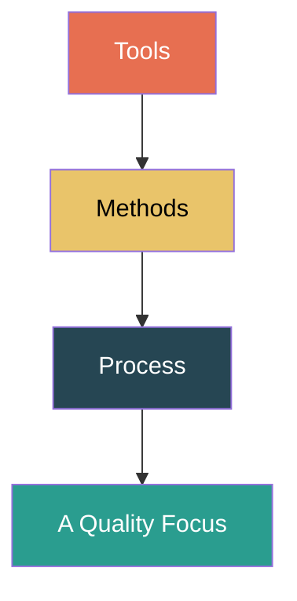

**Layers:** Quality Focus (foundation) → Process → Methods → Tools (top)

---

## Process Framework — 5 Activities

Each activity has **actions** → each action has a **task set** (work tasks + work products + QA points + milestones).

---

## 8 Umbrella Activities

1. **Software Project Tracking & Control**
2. **Risk Management**
3. **SQA** (Software Quality Assurance)
4. **Technical Reviews**
5. **Measurement**
6. **SCM** (Software Configuration Management)
7. **Reusability Management**
8. **Work Product Preparation & Production**

> Applied **throughout** the entire process, overlaying all framework activities.

---

## Process Patterns

- **Stage Pattern** → problem tied to a framework activity
- **Task Pattern** → problem tied to a specific action/work task
- **Phase Pattern** → defines sequence of framework activities

Template: Pattern Name, Intent, Type, Initial Context, Problem, Solution, Resulting Context, Related Patterns, Known Uses.

---

## Process Assessment — CMMI Levels

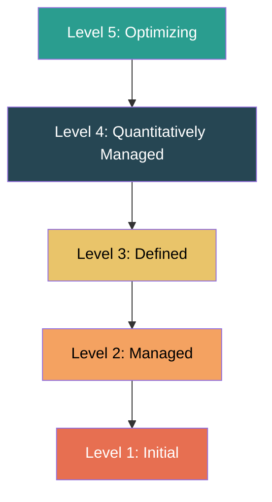

| Level | Name | One-liner |
|---|---|---|
| 1 | Initial | Ad hoc, chaotic |
| 2 | Managed | Planned & tracked |
| 3 | Defined | Documented & standardized |
| 4 | Quantitatively Managed | Measured with statistics |
| 5 | Optimizing | Continuous improvement |

Other models: **SPICE** (ISO/IEC 15504), **ISO 9001:2000**

---

## PSP & TSP

**PSP** (Personal Software Process) — Individual level: PSP0 → PSP3 (baseline → cyclic). Focus: personal planning, measurement, quality, estimation.

**TSP** (Team Software Process) — Team level. Activities: Launch → High-Level Design → Implementation → Integration & Test → Postmortem. Roles: Team Leader, Dev Manager, Planning Manager, Quality Manager, Support Manager.

---

## Software Development Myths

| Type | Key Myth | Reality |
|---|---|---|
| **Management** | Adding people catches up | **Brooks's Law** — makes it later |
| **Customer** | Requirements can change easily | Late changes are exponentially expensive |
| **Practitioner** | Job is done when code runs | 60-80% effort is post-delivery maintenance |

---

# Module 2: Traditional & Agile Software Development

---

## Prescriptive (Traditional) Process Models

### Quick Reference

| Model | Key Idea | Best For | Risk | Flexibility |
|---|---|---|---|---|
| **Waterfall** | Linear sequential | Small, well-defined projects | Low | Rigid |
| **Incremental** | Multiple waterfall cycles | Early delivery needed | Moderate | Moderate |
| **RAD** | 60-90 day cycles, component-based | Time-pressured business apps | Low-Mod | High |
| **Prototyping** | Build prototype to clarify reqs | Unclear requirements | Low | High |
| **Spiral** | Risk-driven iterations (Boehm) | Large, high-risk projects | Very High | High |

### Waterfall Model

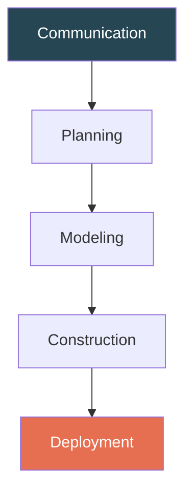

✅ Simple, clear milestones | ❌ No working software until late, rigid, requirements must be frozen upfront

### Spiral Model — 4 Quadrants

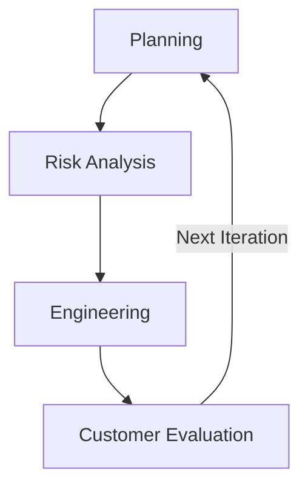

Each loop = a phase. Explicit **risk analysis** every iteration.

---

## Specialized Process Models

### Component-Based Development (CBD)

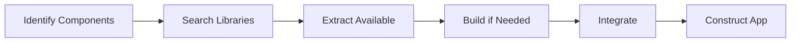

- Evolutionary, uses **pre-built reusable components** from repositories
- Reduces dev time & cost; pre-tested components increase quality
- New components engineered only when existing ones don't fit

### Concurrent Development Model

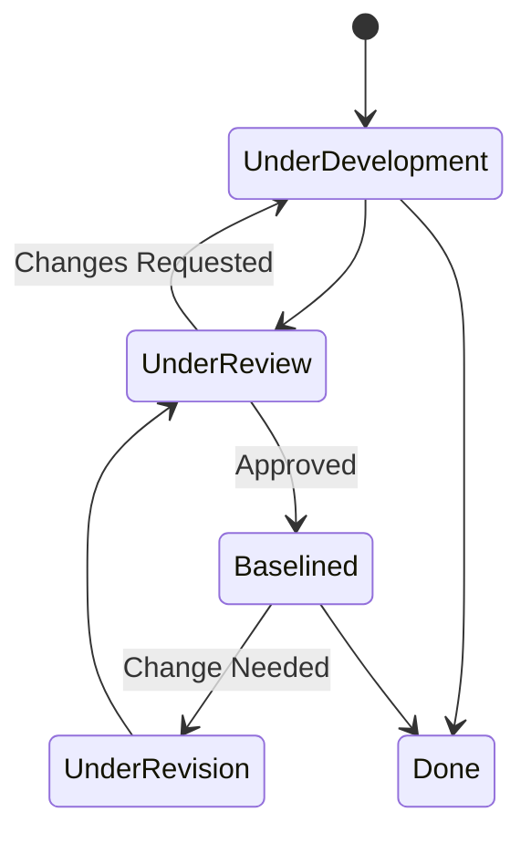

- All activities exist **concurrently** in different states
- **Events trigger transitions** between states
- Best for **client/server** applications
- Shows accurate **current state** of entire project

---

## Agile Development

### Agile Manifesto (4 Values)

| Value More ✅ | Over ❌ |
|---|---|
| Individuals & interactions | Processes & tools |
| Working software | Comprehensive documentation |
| Customer collaboration | Contract negotiation |
| Responding to change | Following a plan |

### What is Agility?

**Agility** = ability to respond rapidly and effectively to change. In software: embracing uncertainty, iterating quickly, delivering working software frequently, collaborating closely with customers, and adapting plans as understanding evolves.

### 12 Agile Principles (Key Points)

1. Early & continuous delivery of valuable software
2. Welcome changing requirements, even late
3. Deliver working software frequently (shorter = better)
4. Business + developers work together daily
5. Motivated individuals with trust & support
6. Face-to-face communication preferred
7. Working software = primary measure of progress
8. Sustainable development pace
9. Technical excellence & good design
10. Simplicity — maximize work NOT done
11. Self-organizing teams produce best results
12. Regular reflection and adjustment

---

### Scrum

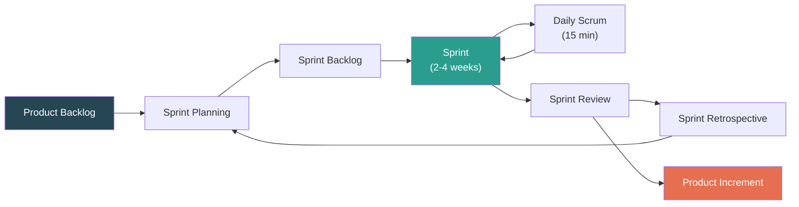

| | |
|---|---|
| **Roles** | Product Owner, Scrum Master, Dev Team (5-9) |
| **Artifacts** | Product Backlog, Sprint Backlog, Product Increment |
| **Events** | Sprint Planning, Daily Scrum (15 min), Sprint Review, Sprint Retrospective |

### XP (Extreme Programming)

**Key Practices:** Planning Game, Small Releases, **Pair Programming**, **TDD**, Continuous Integration, Refactoring, Collective Code Ownership, Simple Design, On-Site Customer, 40-hr Week

**5 Values:** Communication, Simplicity, Feedback, Courage, Respect

### FDD (Feature Driven Development)

5 steps: Develop Overall Model → Build Feature List → Plan by Feature → Design by Feature → Build by Feature

### Which model is best for adaptability to changes?

**Agile models** (especially Scrum/XP) are best suited for adaptability. The **Spiral Model** is the best **traditional** model for handling change — its iterative risk-driven approach allows re-planning at every cycle based on customer evaluation and evolving requirements.

---

# Module 3: Requirements Analysis with Cost Estimation

---

## Types of Requirements

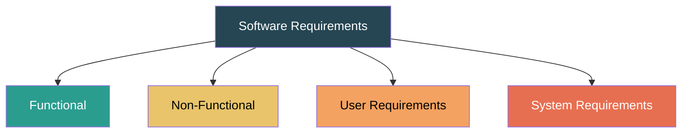

| Type | What it defines | Example |
|---|---|---|
| **Functional** | What the system **does** (services, behavior) | "System shall generate PDF reports" |
| **Non-Functional** | **Constraints & quality** (performance, security, usability) | "Response time < 3 sec" |
| **User** | High-level, natural language, for **non-technical** audience | "Librarian searches books by title" |
| **System** | Detailed, precise, for **developers** — basis for design/contract | Function signatures, DB constraints |

### Non-Functional Requirements Classification

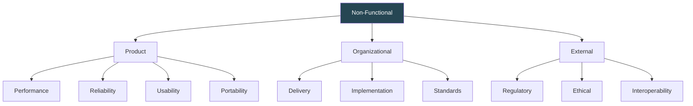

### Interface Specification — 4 Types

UI Interface, Hardware Interface, Software Interface, Communication Interface

---

## SRS Document (IEEE 830)

**Structure:** 1. Introduction → 2. Overall Description → 3. Specific Requirements → 4. Appendices → 5. Index

**Good SRS Characteristics:** Correct, Unambiguous, Complete, Consistent, Ranked for Importance, Verifiable, Modifiable, Traceable

> **Key Considerations:** Every requirement must be testable (verifiable), no two requirements should contradict (consistent), and each requirement should be traceable to its source and downstream design/code/test.

---

## Requirements Engineering Process

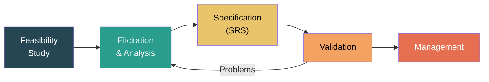

### Feasibility Study — 5 Types

Technical, Economic, Legal, Operational, Schedule → Output: **Go / No-Go decision**

### Elicitation & Analysis Activities

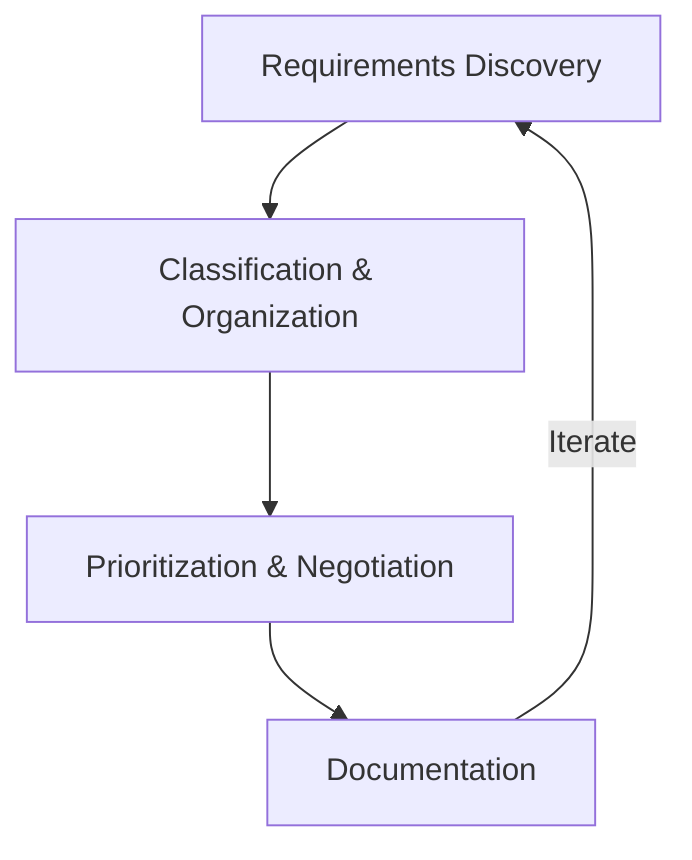

**9 Techniques:** Interviews, Questionnaires, Observation/Ethnography, Document Analysis, Brainstorming, Prototyping, Use Cases/Scenarios, JAD, Focus Groups

**Problems:** Stakeholders don't know what they want, conflicting requirements, domain jargon, political factors, requirements change during analysis.

### Validation

**5 Checks:** Validity, Consistency, Completeness, Realism, Verifiability

**Techniques:** Reviews/Inspections, Prototyping, Test-Case Generation, Automated Consistency Analysis

### Requirements Management

Change Request → Impact Analysis → Approve/Reject → Update RTM → Communicate

**Key activities:** Change Management, Traceability, Version Control, Impact Analysis, Status Tracking

---

## Project Estimation

---

### LOC-Based Estimation

- **Expected LOC** = (a + 4m + b) / 6 *(PERT formula)*
- **Effort** = Total LOC / Productivity (LOC/person-month)
- **Cost** = Total LOC × Cost per LOC

**Solved Example (Library Management System):**

| Module | LOC |
|---|---|
| Book Management | 10,000 |
| User Management | 8,000 |
| Borrow/Return System | 12,000 |
| **Total** | **30,000** |

Given: Productivity = 600 LOC/person-month, EAF = 1.1, Cost/PM = ₹50,000

- **Total Effort** = (30,000 / 600) × 1.1 = 50 × 1.1 = **55 person-months**
- **Project Duration** = 2.5 × (55)^0.38 ≈ 2.5 × 4.42 ≈ **11.05 months**
- **Total Cost** = 55 × ₹50,000 = **₹27,50,000**

---

### Function Point (FP) Estimation

**Step 1:** Count information domain values:

| Parameter | Simple | Average | Complex |
|---|:-:|:-:|:-:|
| External Inputs (EI) | 3 | 4 | 6 |
| External Outputs (EO) | 4 | 5 | 7 |
| External Inquiries (EQ) | 3 | 4 | 6 |
| Internal Logical Files (ILF) | 7 | 10 | 15 |
| External Interface Files (EIF) | 5 | 7 | 10 |

**Step 2:** UFP = Σ (Count × Weight)

**Step 3:** VAF = 0.65 + 0.01 × TDI (14 GSCs rated 0-5, TDI range: 0-70)

**Step 4:** **FP = UFP × VAF**

Estimation: Effort = FP / Productivity

---

### COCOMO Models — Basic vs Intermediate vs Detailed

| Aspect | Basic COCOMO | Intermediate COCOMO | Detailed COCOMO |
|---|---|---|---|
| **Formula** | E = a × (KLOC)^b | E = a × (KLOC)^b × EAF | Same + phase-wise EAF |
| **Inputs** | Size (KLOC) only | Size + 15 cost drivers | Size + cost drivers per phase |
| **Accuracy** | Rough, early estimate | Moderate, considers project attributes | Most accurate, detailed |
| **Cost Drivers** | None | 15 cost drivers → EAF multiplier | 15 cost drivers applied **per phase** |
| **Modes** | Organic, Semi-detached, Embedded | Same 3 modes | Same 3 modes |

#### 3 Modes of Basic COCOMO

| Mode | Project Type | a | b |
|---|---|:-:|:-:|
| **Organic** | Small teams, familiar, < 50 KLOC | 2.4 | 1.05 |
| **Semi-detached** | Medium, mix of experienced/inexperienced | 3.0 | 1.12 |
| **Embedded** | Tight constraints, hardware-coupled | 3.6 | 1.20 |

**Duration:** TDEV = 2.5 × (Effort)^c

---

### COCOMO-II Model

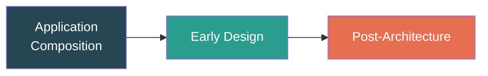

**Post-Architecture Formula:** PM = 2.94 × (Size)^E × Π(EM_i)

- **E** = 0.91 + 0.01 × Σ(SF_i) — from 5 Scale Factors (PREC, FLEX, RESL, TEAM, PMAT)
- **17 Effort Multipliers** in 4 categories: Product, Platform, Personnel, Project

**Duration:** TDEV = 3.67 × (PM)^(0.28 + 0.2 × (E − 0.91))

---

## Analysis Model Elements

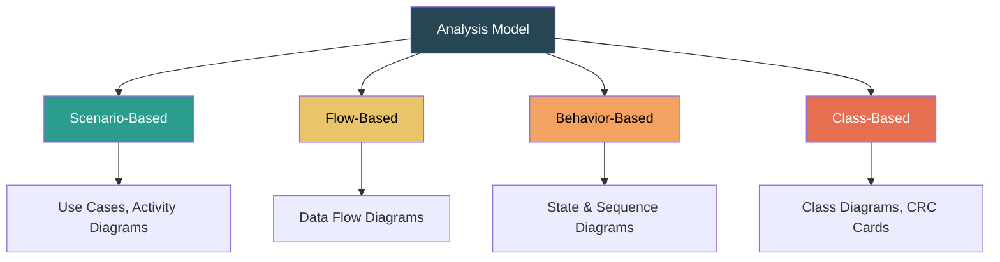

| Element | Diagrams | Focus |
|---|---|---|
| **Scenario-Based** | Use Case, Activity | What users do with system |
| **Flow-Based** | DFD (Level 0, 1, 2) | How data moves & transforms |
| **Behavior-Based** | State, Sequence diagrams | How system responds to events |
| **Class-Based** | Class diagrams, CRC cards | Objects, attributes, relationships |

### DFD Symbols

| Symbol | Name | Description |
|---|---|---|
| ○ | Process | Transforms data |
| → | Data Flow | Data movement |
| ═ | Data Store | Data repository |
| □ | External Entity | Source/sink outside system |

### Class Relationships

| Relationship | Meaning | Notation |
|---|---|---|
| Association | Structural link | Solid line |
| Aggregation | Has-a (part can exist alone) | Open diamond |
| Composition | Has-a (part dies with whole) | Filled diamond |
| Inheritance | Is-a | Open arrowhead |
| Dependency | Uses temporarily | Dashed arrow |

---
