# Software Engineering — ISE 1 Notes

## Chapters Covered

1. The Software Process
2. Traditional & Agile Software Development
3. Requirements Analysis with Cost Estimation

---

# Chapter 1: The Software Process

---

## 1.1 Software

**Software** is a collection of computer programs, procedures, rules, documentation, and associated data that form part of a computer system's operations.

### Characteristics of Software

| # | Characteristic | Description |
|---|---------------|-------------|
| 1 | **Developed / Engineered** | Software is engineered, not manufactured in the classical sense. Quality is built through good design. |
| 2 | **Does not wear out** | Unlike hardware, software doesn't degrade with use. Failures are due to design defects, not physical wear. |
| 3 | **Custom-built** | Most software is custom-built rather than assembled from existing components, though component reuse is growing. |
| 4 | **Flexible** | Software can be modified, updated, and adapted to meet changing requirements. |
| 5 | **Complex** | Modern software systems are among the most complex items produced by humans. |

### Software Failure Curve vs Hardware Failure Curve

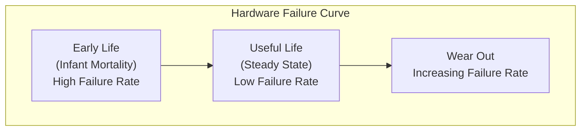

- **Hardware**: Follows a "bathtub curve" — high initial failures, steady low failure rate, then increasing failures due to wear.
- **Software**: Idealized curve shows high early failures that decrease as defects are fixed. However, as changes (maintenance) are made, the failure rate spikes again due to new defects introduced by changes.

---

## 1.2 Software Engineering

> **Definition (IEEE):** Software Engineering is the application of a systematic, disciplined, quantifiable approach to the development, operation, and maintenance of software; that is, the application of engineering to software.

### Key Layers of Software Engineering

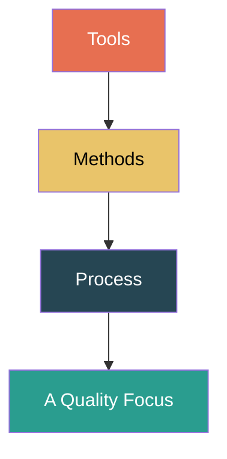

| Layer | Description |
|-------|-------------|
| **Quality Focus** | Foundation layer. SE must rest on a commitment to quality (TQM, Six Sigma, etc.). |
| **Process** | Defines a framework of activities for delivering software. Glue that holds methods and tools together. |
| **Methods** | Provide the technical "how-to" — communication, analysis, design, coding, testing, maintenance. |
| **Tools** | Provide automated or semi-automated support for methods (CASE tools, IDEs, testing frameworks). |

---

## 1.3 Software Application Domains

Software is applied across many domains. The major categories are:

| # | Domain | Description | Examples |
|---|--------|-------------|----------|
| 1 | **System Software** | Programs that serve other programs. Heavy interaction with hardware. | OS, compilers, drivers, network managers |
| 2 | **Application Software** | Stand-alone programs that solve specific business needs. | Payroll, inventory, ERP, CRM |
| 3 | **Engineering / Scientific Software** | Algorithms for number crunching, simulation, and modeling. | CAD, MATLAB, climate modeling |
| 4 | **Embedded Software** | Resides in ROM/flash; controls products and systems. | Microwave controllers, automotive ECUs |
| 5 | **Product-Line Software** | Designed to provide a specific capability for many customers. | Word processors, spreadsheets, browsers |
| 6 | **Web / Mobile Applications** | Network-centric apps spanning browsers and mobile devices. | E-commerce apps, social media, SaaS |
| 7 | **Artificial Intelligence Software** | Uses non-numerical algorithms to solve complex problems. | Robotics, expert systems, ML models |
| 8 | **Open World Computing** | Distributed, pervasive computing across wireless networks. | IoT platforms, cloud services |

---

## 1.4 The Changing Nature of Software

Software is continuously evolving due to:

1. **Ubiquitous Computing** — Software now runs on everything from smartphones to refrigerators (IoT).
2. **Netsourcing** — Complex computing resources delivered as services over the internet (SaaS, PaaS, IaaS).
3. **Open Source** — A growing trend where source code is made freely available, enabling collaborative development.
4. **Data Mining & Big Data** — Software that extracts meaningful patterns from massive datasets.
5. **Grid & Cloud Computing** — Distributed computing resources available on demand.
6. **AI & Machine Learning** — Software now learns, adapts, and makes autonomous decisions.
7. **Legacy Software** — Old software systems that must be maintained, adapted, or replaced despite being decades old. These systems are often critical to business operations.

### Challenges with Legacy Software

- Poor quality, outdated architecture
- Lack of documentation
- Difficult to extend or modify
- Must be maintained because they are critical to business

---

## 1.5 Software Development Myths

Software myths propagate misinformation and lead to unrealistic expectations. They are categorized into three classes:

### Management Myths

| Myth | Reality |
|------|---------|
| "We already have standards and procedures — that's enough." | Standards may exist but are often incomplete, outdated, or not followed. |
| "Adding more programmers when behind schedule will catch up." | **Brooks's Law**: Adding people to a late project makes it later (communication overhead). |
| "Outsourcing the project means we can relax." | You must manage and understand the project even if outsourced. |

### Customer Myths

| Myth | Reality |
|------|---------|
| "A general statement of objectives is sufficient to begin." | Ambiguous requirements lead to project failure. Requirements must be detailed and precise. |
| "Requirements can easily change because software is flexible." | Changes late in the process are exponentially more expensive. |

### Practitioner Myths

| Myth | Reality |
|------|---------|
| "Once we write the program, our job is done." | 60-80% of effort is expended after the software is delivered (maintenance). |
| "Until the program runs, there's no way to assess quality." | Reviews and inspections (before coding) catch up to 85% of defects. |
| "The only deliverable is the working program." | Documentation, test cases, and design models are equally critical deliverables. |
| "Software engineering makes us create unnecessary documentation." | SE is about creating quality, not just documents; the focus is on reducing rework. |

---

## 1.6 Process Framework

A **process framework** establishes the foundation for a complete software engineering process. It identifies a small number of **framework activities** applicable to all software projects.

### Generic Process Framework Activities


| Activity | Description |
|----------|-------------|
| **Communication** | Collaborate with stakeholders to understand objectives and gather requirements. |
| **Planning** | Create a "map" — define tasks, risks, resources, schedule, and work products. |
| **Modeling** | Create models (analysis + design) that help developers and customers understand the requirements and design. |
| **Construction** | Code generation and testing. |
| **Deployment** | Deliver the software to the customer, who evaluates it and provides feedback. |

Each framework activity is populated by a set of **software engineering actions** (e.g., architectural design is an action within the Modeling activity), and each action is defined by a **task set** — a collection of work tasks, work products, quality assurance points, and milestones.

---

## 1.7 Software Umbrella Activities

**Umbrella activities** are applied throughout the entire software process. They overlay the framework activities and help manage and control the project.

| # | Umbrella Activity | Description |
|---|-------------------|-------------|
| 1 | **Software Project Tracking & Control** | Assess progress against the plan and take corrective action. |
| 2 | **Risk Management** | Assess risks that may affect the outcome or quality. |
| 3 | **Software Quality Assurance (SQA)** | Define and conduct activities to ensure quality. |
| 4 | **Technical Reviews** | Assess work products to uncover and remove errors before they propagate. |
| 5 | **Measurement** | Define and collect process, project, and product measures. |
| 6 | **Software Configuration Management (SCM)** | Manage the effects of change throughout the process. |
| 7 | **Reusability Management** | Define criteria for work product reuse and establish mechanisms for reusable components. |
| 8 | **Work Product Preparation & Production** | Create work products such as models, documents, logs, forms, and lists. |

---

## 1.8 Process Patterns

A **process pattern** describes a process-related problem, its environment, and a proven solution. It allows software teams to recognize common situations and apply tested approaches.

### Template for a Process Pattern

| Field | Description |
|-------|-------------|
| **Pattern Name** | A meaningful name describing the pattern. |
| **Intent** | Brief description of the pattern's objective. |
| **Type** | Stage pattern, Task pattern, or Phase pattern. |
| **Initial Context** | Conditions that must exist before the pattern is applied. |
| **Problem** | The specific problem the pattern addresses. |
| **Solution** | How the problem is solved using the pattern. |
| **Resulting Context** | Conditions that will exist after the pattern is applied. |
| **Related Patterns** | Other patterns related to this one. |
| **Known Uses / Examples** | Instances where this pattern is applied. |

### Types of Process Patterns

| Type | Description |
|------|-------------|
| **Stage Pattern** | Defines a problem associated with a framework activity (e.g., Communication). |
| **Task Pattern** | Defines a problem associated with a specific action or work task (e.g., Requirements Gathering). |
| **Phase Pattern** | Defines the sequence of framework activities that occur within the process, even when overlapping. |

---

## 1.9 Process Assessment and Improvement

Process assessment evaluates the current state of a software process and identifies areas for improvement. Several standards and models exist:

### Key Models

| Model | Description |
|-------|-------------|
| **CMMI (Capability Maturity Model Integration)** | Developed by SEI (Carnegie Mellon). Provides a staged (5 levels) or continuous representation for process maturity. |
| **SPICE (ISO/IEC 15504)** | International standard for software process assessment. Defines a framework for assessing process capability. |
| **ISO 9001:2000** | International quality standard applicable to software; focuses on customer satisfaction and continuous improvement. |

### CMMI Maturity Levels

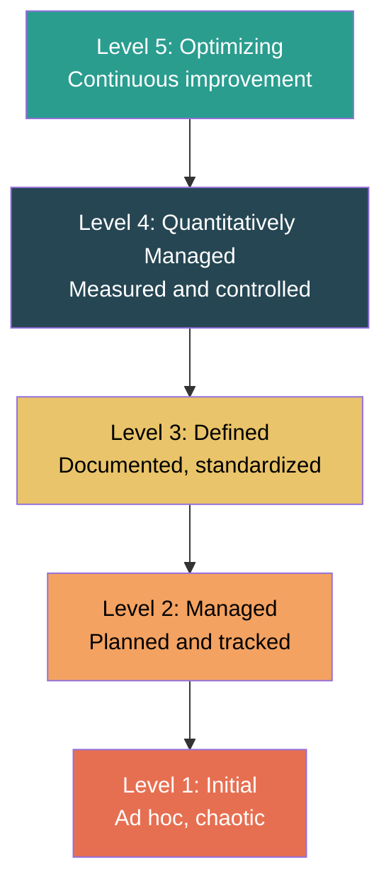

| Level | Name | Key Characteristics |
|-------|------|---------------------|
| 1 | **Initial** | Process is ad hoc and chaotic. Few processes are defined. Success depends on individual talent. |
| 2 | **Managed** | Basic project management processes are established. Projects are planned, performed, measured, and controlled. |
| 3 | **Defined** | Processes are documented, standardized, and integrated into a standard process for the organization. |
| 4 | **Quantitatively Managed** | Quantitative objectives for quality and process performance are established. Processes are measured using statistical techniques. |
| 5 | **Optimizing** | Focus on continuous process improvement through innovative ideas and technologies. |

---

## 1.10 Personal Software Process (PSP)

The **Personal Software Process (PSP)**, developed by Watts Humphrey, emphasizes personal measurement and quality at the individual developer level.

### PSP Framework Levels

| Level | Name | Activities |
|-------|------|------------|
| **PSP0** | Baseline | Current process with basic measurements (time, defects). |
| **PSP0.1** | Baseline + | Add coding standards, size measurement, process improvement proposals. |
| **PSP1** | Personal Planning | Size estimation, test reporting. |
| **PSP1.1** | Personal Planning + | Task planning, scheduling. |
| **PSP2** | Personal Quality Management | Code reviews, design reviews. |
| **PSP2.1** | Personal Quality Management + | Design templates. |
| **PSP3** | Cyclic Process | Cyclic development for larger programs (iterative). |

### Key PSP Principles

1. **Planning**: Each developer plans their work and bases that plan on personal data.
2. **Quality**: Each developer monitors personal quality and learns to improve it.
3. **Estimating**: Developers use historical personal data to estimate size and effort.
4. **Measurement**: Developers track time spent, defects injected, and defects removed.
5. **Process Improvement**: Analyze data to identify areas for personal process improvement.

---

## 1.11 Team Software Process (TSP)

The **Team Software Process (TSP)**, also by Watts Humphrey, extends PSP principles to teams. It builds high-performance teams by applying disciplined processes.

### TSP Objectives

- Build self-directed teams that plan and track their work.
- Establish goals and create a team environment conducive to quality work.
- Accelerate software process improvement.
- Provide improvement guidance to high-maturity organizations.
- Facilitate university teaching of industrial-grade team skills.

### TSP Framework Activities

1. **Launch** — Define team goals, roles, and plan the project.
2. **High-Level Design** — Define the overall architecture.
3. **Implementation** — Build the software using PSP practices individually.
4. **Integration & Test** — Assemble and verify the complete system.
5. **Postmortem** — Analyze performance data and document lessons learned.

### TSP Team Roles

| Role | Responsibility |
|------|---------------|
| **Team Leader** | Motivates and directs the team. |
| **Development Manager** | Guides the team in overall development. |
| **Planning Manager** | Leads planning activities and tracks the plan. |
| **Quality / Process Manager** | Guides the team in defining and managing the process. |
| **Support Manager** | Manages tools, configuration, and reusable assets. |

### TSP Scripts

TSP uses **scripts** — detailed guides that specify the steps each team member follows. Scripts exist for:

- Launch
- Strategy
- Planning
- Requirements
- Design
- Implementation
- Test
- Postmortem

---

# Chapter 2: Traditional & Agile Software Development

---

## Part A: Traditional Software Development

---

### 2.1 Software Process Models

A **software process model** is a simplified representation of a software process. Each model presents a process from a specific perspective and provides a framework for activities, actions, and tasks.

---

### 2.2 The Waterfall Model (Classic Life Cycle)

The **Waterfall Model** is the oldest and most widely used paradigm. It follows a **linear sequential** flow where each phase must be completed before the next begins.

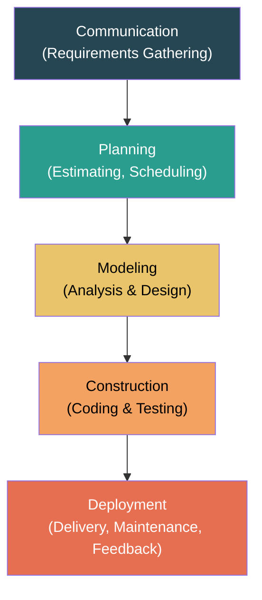

#### Advantages

- Simple to understand and use.
- Phases are processed and completed one at a time.
- Well-suited for smaller projects with well-understood requirements.
- Provides a structured approach with clear milestones.

#### Disadvantages

- Real projects rarely follow a perfectly sequential flow.
- Customers must state all requirements upfront — difficult in practice.
- A working version is not available until late in the process.
- High risk and uncertainty; errors found late are expensive to fix.
- Poor model for complex and object-oriented projects.

#### When to Use

- Requirements are well-documented, clear, and fixed.
- Product definition is stable.
- Technology is understood.
- Short projects.

---

### 2.3 The Incremental Model

The **Incremental Model** combines elements of the Waterfall Model applied in an iterative fashion. It delivers the software in **increments** (portions), with each increment adding functionality.

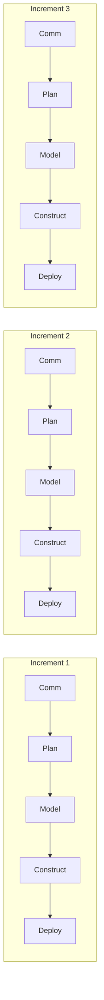

- **Increment 1** delivers the core product (basic requirements).
- **Subsequent increments** add supplementary features based on priorities.
- Each increment goes through the full process framework.

#### Advantages

- Generates working software early in the lifecycle.
- More flexible — less costly to change scope and requirements.
- Each increment is easier to test and debug.
- Customer can respond to each increment.
- Risk is lower since high-priority functions are developed first.

#### Disadvantages

- Needs good planning and design.
- Total cost may be higher than Waterfall.
- Requires a clear and complete definition of the whole system before it can be broken into increments.

---

### 2.4 RAD Model (Rapid Application Development)

**RAD** is a high-speed adaptation of the linear sequential model. It emphasizes a very short development cycle (60–90 days) using a **component-based construction** approach.

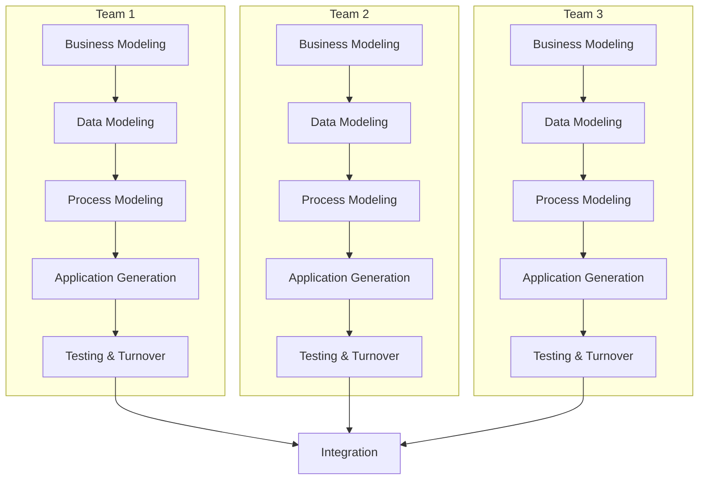

#### RAD Phases

| Phase | Description |
|-------|-------------|
| **Business Modeling** | Define what information drives the business process, what is generated, who generates it, where does it go. |
| **Data Modeling** | Define data objects and their relationships from the business model. |
| **Process Modeling** | Data objects are transformed to achieve information flow needed for business functions. |
| **Application Generation** | Use automated tools, component reuse, and code generators. |
| **Testing & Turnover** | Test new components and interfaces. |

#### Advantages

- Very short development time.
- Reusability of components.
- Quick initial reviews and user feedback.

#### Disadvantages

- Needs sufficient human resources to create enough teams.
- Requires committed developers and customers.
- Not appropriate for all types of applications (especially those needing high performance or tight technical requirements).
- Not suitable if system cannot be modularized properly.
- High risk if technical risks are high.

---

### 2.5 Prototyping Model

The **Prototyping Model** builds a **prototype** — a preliminary version of a system — to help understand requirements. It is especially useful when the customer has a general objective but does not know the detailed input, processing, or output requirements.

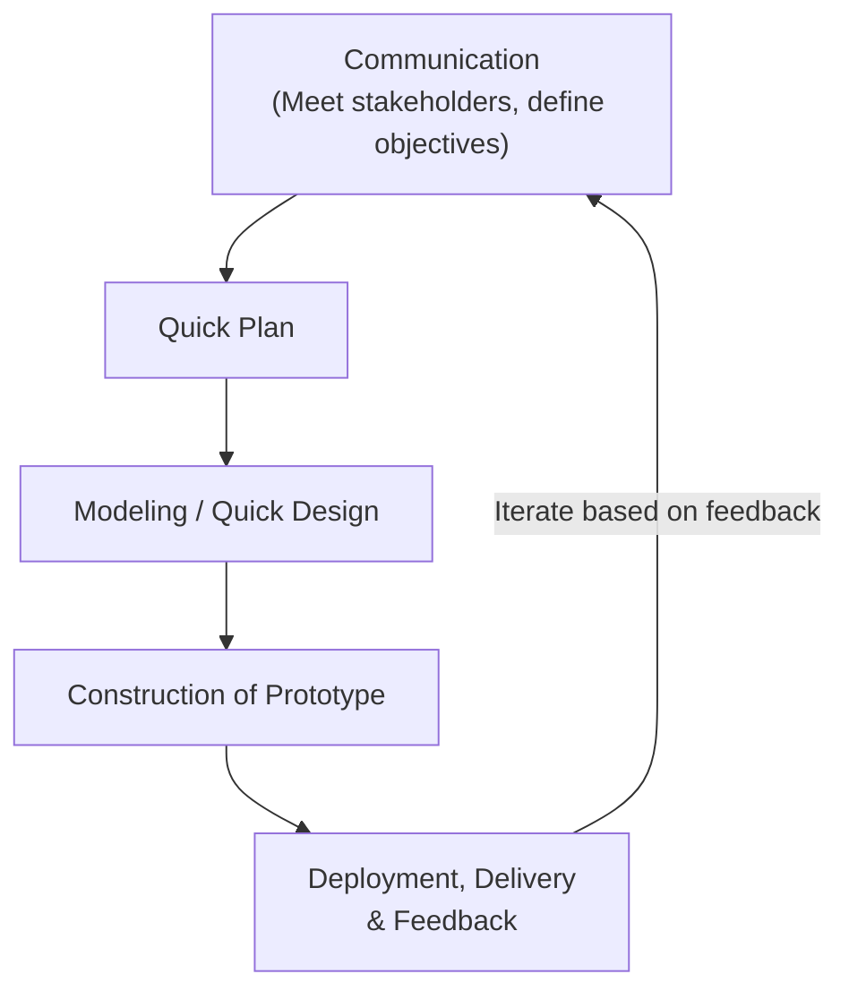

#### Types of Prototyping

| Type | Description |
|------|-------------|
| **Throwaway / Rapid Prototyping** | Prototype is discarded after requirements are understood. Final system is built from scratch. |
| **Evolutionary Prototyping** | Prototype is refined iteratively and evolves into the final system. |

#### Advantages

- Users are actively involved — reduced risk of requirement misunderstanding.
- Errors can be detected early.
- Missing functionality can be identified easily.
- Quick user feedback.

#### Disadvantages

- Leads to "good enough" solutions — quality may be sacrificed.
- Customers may think the prototype IS the finished product.
- Developers may be tempted to use prototype code in the final product (leads to poor quality).
- Can lead to scope creep through excessive iteration.

---

### 2.6 The Spiral Model

The **Spiral Model**, proposed by **Barry Boehm**, combines the iterative nature of prototyping with the systematic aspects of the Waterfall Model. Its distinguishing feature is the explicit emphasis on **risk analysis** in every iteration.

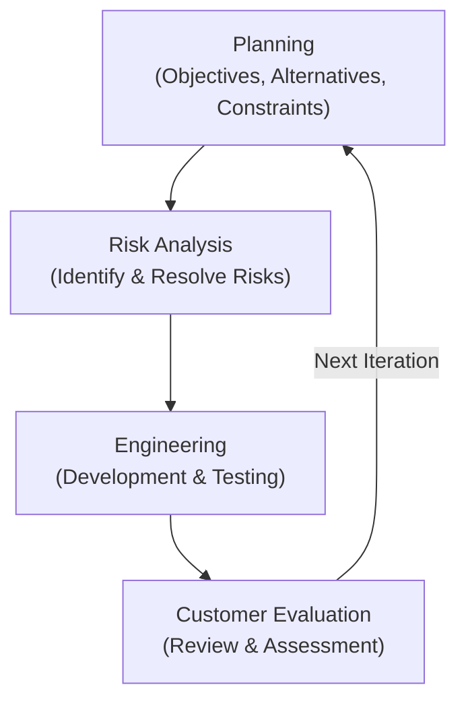

Each loop of the spiral represents a **phase** of the software process. The innermost loop might focus on feasibility, the next on requirements, the next on design, and so on.

#### Four Quadrants of the Spiral

| Quadrant | Activities |
|----------|-----------|
| **Determine Objectives** | Identify objectives, alternatives, and constraints. |
| **Identify & Resolve Risks** | Evaluate alternatives; identify and resolve risks; build prototypes if needed. |
| **Development & Test** | Develop the next-level product / perform engineering tasks. |
| **Plan Next Iteration** | Review results with customer; plan the next phase. |

#### Advantages

- High amount of risk analysis — reduces risk of project failure.
- Good for large and mission-critical projects.
- Software is produced early in the lifecycle.
- Requirements can be captured more accurately.

#### Disadvantages

- Can be costly and time-consuming.
- Risk analysis requires high expertise.
- Success is highly dependent on risk analysis accuracy.
- Not well-suited for small or low-risk projects.
- Complex model — difficult to manage.

---

### 2.7 Specialized Process Models

#### 2.7.1 Component-Based Development Model

The **Component-Based Development (CBD)** model incorporates many characteristics of the spiral model. It is evolutionary in nature. It emphasizes the use of **pre-built, reusable software components**.

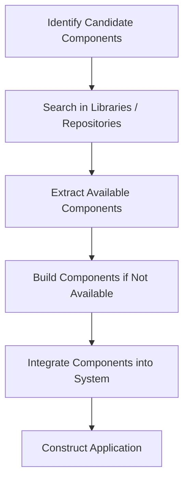

**Key Features:**
- Relies on a library/repository of reusable components.
- Components are identified and evaluated for reuse.
- New components are engineered only when existing ones don't satisfy needs.
- Reduces development time and cost significantly.
- Increases quality since components are pre-tested.

#### 2.7.2 Concurrent Development Model

The **Concurrent Development Model** (also called **Concurrent Engineering**) allows the software team to represent iterative and concurrent elements of any process model.

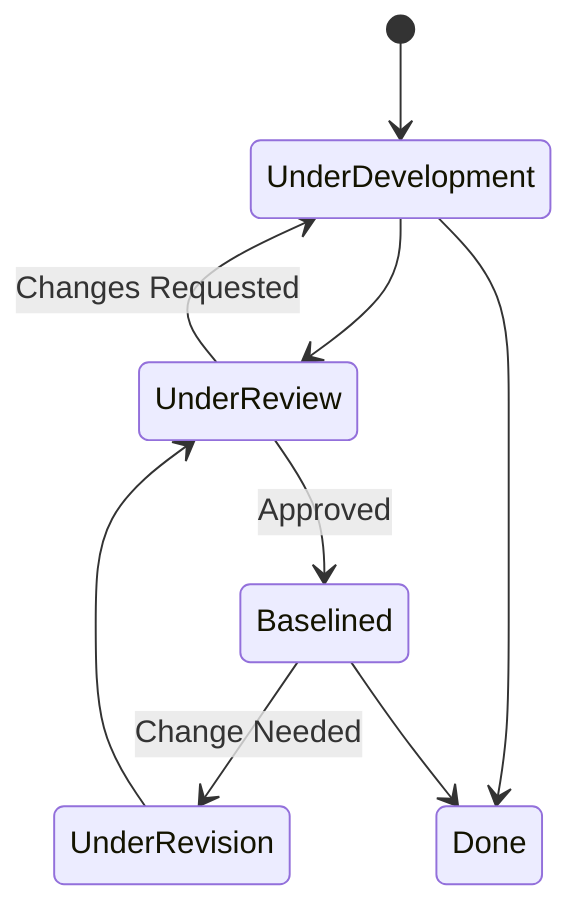

**Key Features:**
- All activities exist concurrently but are in different states at different times.
- Each activity, action, or task on a network exists simultaneously with other activities.
- Events trigger transitions from state to state.
- Suitable for development of client/server applications.
- Provides an accurate picture of the current state of a project.
- Applicable to all types of software development.

### Comparison of Traditional Process Models

| Model | Best For | Risk Handling | Flexibility | Customer Involvement |
|-------|----------|---------------|-------------|---------------------|
| **Waterfall** | Small, well-defined projects | Low | Rigid | Low (only at start/end) |
| **Incremental** | Projects needing early delivery | Moderate | Moderate | At each increment |
| **RAD** | Time-pressured business apps | Low-Moderate | High | High |
| **Prototyping** | Unclear requirements | Low | High | Very High |
| **Spiral** | Large, high-risk projects | Very High | High | At every cycle |
| **Component-Based** | Projects with reusable parts | Moderate | High | Moderate |
| **Concurrent** | Client/server systems | Moderate | Very High | Moderate |

---

## Part B: Agile Software Development

---

### 2.8 Agile Manifesto

The **Agile Manifesto** (2001) was created by 17 software practitioners who valued:

| We Value More | Over |
|---------------|------|
| **Individuals and interactions** | Processes and tools |
| **Working software** | Comprehensive documentation |
| **Customer collaboration** | Contract negotiation |
| **Responding to change** | Following a plan |

> While there is value in the items on the right, we value the items on the left more.

---

### 2.9 Agile Principles

The 12 principles behind the Agile Manifesto:

| # | Principle |
|---|-----------|
| 1 | Highest priority is to satisfy the customer through **early and continuous delivery** of valuable software. |
| 2 | Welcome **changing requirements**, even late in development. |
| 3 | Deliver **working software frequently** (weeks to months, prefer shorter timescale). |
| 4 | Business people and developers must **work together daily**. |
| 5 | Build projects around **motivated individuals**. Give them the environment and trust. |
| 6 | **Face-to-face conversation** is the most efficient method of conveying information. |
| 7 | **Working software** is the primary measure of progress. |
| 8 | Promote **sustainable development** — constant pace indefinitely. |
| 9 | Continuous attention to **technical excellence and good design**. |
| 10 | **Simplicity** — the art of maximizing the amount of work not done. |
| 11 | Best architectures, requirements, and designs emerge from **self-organizing teams**. |
| 12 | Team **reflects on how to become more effective** and adjusts accordingly at regular intervals. |

---

### 2.10 Agile Models

---

#### 2.10.1 Scrum

**Scrum** is an agile framework that uses fixed-length iterations called **Sprints** (typically 2–4 weeks). It focuses on transparency, inspection, and adaptation.

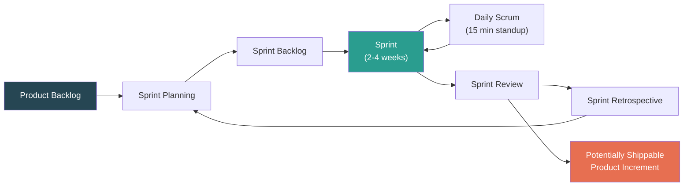

##### Scrum Roles

| Role | Responsibility |
|------|----------------|
| **Product Owner** | Defines features, prioritizes the Product Backlog, accepts/rejects work results. |
| **Scrum Master** | Facilitates the process, removes impediments, ensures team follows Scrum practices. Acts as a servant-leader. |
| **Development Team** | Self-organizing, cross-functional team (5–9 members) that builds the product increment. |

##### Scrum Artifacts

| Artifact | Description |
|----------|-------------|
| **Product Backlog** | An ordered list of everything that is known to be needed in the product. Owned by the Product Owner. |
| **Sprint Backlog** | The set of Product Backlog items selected for the Sprint, plus the plan for delivering them. |
| **Product Increment** | The sum of all completed Product Backlog items at the end of a Sprint — must be in a usable, "Done" state. |

##### Scrum Events

| Event | Purpose | Time-box |
|-------|---------|----------|
| **Sprint Planning** | Select items from Product Backlog; create Sprint Backlog. | 8 hours (4-week Sprint) |
| **Daily Scrum** | Synchronize activities; create plan for next 24 hours (What did I do? What will I do? Any impediments?). | 15 minutes |
| **Sprint Review** | Demonstrate the increment to stakeholders; gather feedback. | 4 hours |
| **Sprint Retrospective** | Reflect on the Sprint; identify improvements for the next Sprint. | 3 hours |

---

#### 2.10.2 Extreme Programming (XP)

**Extreme Programming (XP)** is an agile methodology designed for small to medium teams developing software with vague or rapidly changing requirements. It emphasizes customer satisfaction, frequent delivery, and engineering practices.

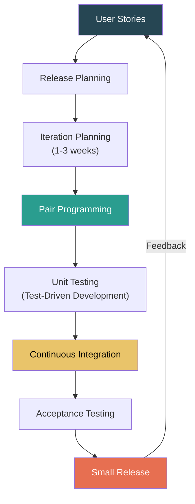

##### Key XP Practices

| Practice | Description |
|----------|-------------|
| **Planning Game** | Customers write User Stories; developers estimate effort; stories are prioritized for releases. |
| **Small Releases** | Release small, functional increments frequently. |
| **Pair Programming** | Two programmers work together at one workstation. One writes code (driver), the other reviews (observer). |
| **Test-Driven Development (TDD)** | Write unit tests before writing the code. Code is written to pass the tests. |
| **Continuous Integration** | Integrate and build the system multiple times per day. |
| **Refactoring** | Continuously improve the internal structure of code without changing its external behavior. |
| **Collective Code Ownership** | Any developer can change any part of the codebase. |
| **Simple Design** | Design the simplest solution that works. Do not add functionality for future needs (YAGNI). |
| **On-Site Customer** | A real customer must be available full-time for the team. |
| **40-Hour Week** | Sustainable pace — no excessive overtime. |
| **Coding Standards** | Team follows a common coding standard. |
| **Metaphor** | A shared, simple description of how the system works to guide development. |

##### XP Values

- **Communication** — Frequent verbal communication among the team and with the customer.
- **Simplicity** — Do what is needed and asked for, nothing more.
- **Feedback** — From the system (unit tests), from the customer (acceptance tests), from the team.
- **Courage** — Tell the truth about progress and estimates; adapt to changes.
- **Respect** — Every team member gives and receives respect.

---

#### 2.10.3 Feature Driven Development (FDD)

**Feature Driven Development (FDD)** is a model-driven, short-iteration agile process. It focuses on designing and building features — small, client-valued functions expressed as `<action> the <result> <by|for|of|to> a <object>`.

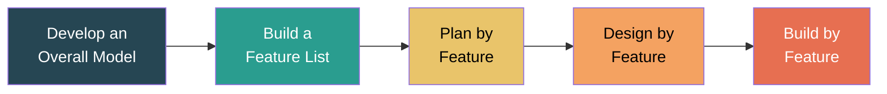

##### FDD Key Practices

| Practice | Description |
|----------|-------------|
| **Domain Object Modeling** | Build a class diagram/model representing the business domain. |
| **Development by Feature** | Develop in terms of features (small, useful functions). |
| **Individual Class Ownership** | Each class is owned by a single developer. |
| **Feature Teams** | Small, dynamically formed teams assigned features. |
| **Inspections** | Defect detection through code reviews and design inspections. |
| **Regular Builds** | Ensure the system is always demonstrable and up-to-date. |
| **Configuration Management** | Manage versioning and change tracking. |
| **Reporting / Visibility** | Progress is tracked by features completed. |

---

### Comparison of Agile Models

| Feature | Scrum | XP | FDD |
|---------|-------|----|-----|
| **Iteration Length** | 2–4 weeks (Sprint) | 1–3 weeks | 2 weeks |
| **Team Size** | 5–9 | Small (up to 12) | Can scale to large teams |
| **Focus** | Project management | Engineering practices | Feature delivery |
| **Customer Role** | Product Owner | On-site customer | Chief Architect/Modeler |
| **Key Practice** | Daily Scrum, Sprints | Pair Programming, TDD | Design/Build by Feature |
| **Best For** | Most project types | Small teams, changing reqs | Larger, model-driven projects |

---

# Chapter 3: Requirements Analysis with Cost Estimation

---

## 3.1 Software Requirements

A **software requirement** is a description of what a system should do — the services it provides and the constraints on its operation. Requirements reflect the needs of customers for a system that serves a certain purpose.

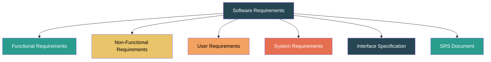

---

### 3.1.1 Functional Requirements

**Functional requirements** describe the specific **functions** and **services** that the system must provide — what the system should do in response to specific inputs or in particular situations.

| Aspect | Description |
|--------|-------------|
| **Definition** | Statements of services the system should provide, how the system should react to inputs, and how the system should behave in particular situations. |
| **Nature** | Depend on the type of software, expected users, and the type of system being developed. |
| **Expression** | Can be stated as abstract high-level statements or detailed functional specifications. |

**Examples:**
- The system shall allow users to search the database by customer name, order ID, or date range.
- The system shall generate a monthly sales report in PDF format.
- The system shall send an email notification when a new order is placed.

> **Problems with Functional Requirements:**
> - **Ambiguity** — Requirements written in natural language may be interpreted differently.
> - **Incompleteness** — Some functions may be missing or assumed.
> - **Inconsistency** — Two requirements may contradict each other.

---

### 3.1.2 Non-Functional Requirements

**Non-functional requirements (NFRs)** define **constraints** and **quality attributes** on the system and its development process. They are often more critical than functional requirements — if they are not met, the system may be unusable.

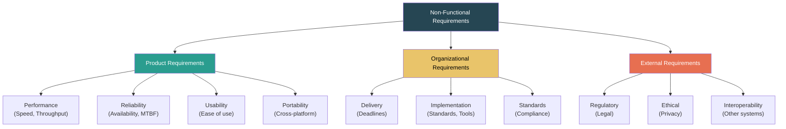

| Type | Category | Description | Example |
|------|----------|-------------|---------|
| **Product** | Performance | Speed, throughput, response time | "All queries must return results within 3 seconds." |
| **Product** | Reliability | Failure rate, availability, recoverability | "System uptime must be 99.9%." |
| **Product** | Usability | Ease of learning, user satisfaction | "New users must be productive within 2 hours of training." |
| **Product** | Portability | Platform independence | "The system must run on Windows, Linux, and macOS." |
| **Organizational** | Delivery | Delivery schedule and milestones | "Version 1.0 must be delivered by March 31." |
| **Organizational** | Implementation | Language, tools, and methodology constraints | "The system must be implemented in Java using the Spring framework." |
| **Organizational** | Standards | Coding standards, documentation standards | "Code must follow the company's Java coding guidelines." |
| **External** | Regulatory | Laws, regulations | "The system must comply with GDPR." |
| **External** | Ethical | Privacy, data protection | "User data must be encrypted at rest and in transit." |
| **External** | Interoperability | Integration with other systems | "The system must integrate with the existing SAP ERP system." |

---

### 3.1.3 User Requirements

**User requirements** are high-level, abstract statements of what the system should provide, written in **natural language** (with diagrams) for the **end user and customer** — people who are not technical experts.

| Aspect | Description |
|--------|-------------|
| **Audience** | Clients, managers, end users |
| **Language** | Natural language, simple diagrams |
| **Level of Detail** | High-level, abstract |
| **Purpose** | Communicate what the system should do from the user's perspective |

**Example:**
> "The system should allow a librarian to search for books by title, author, or ISBN and display available copies."

**Guidelines for writing user requirements:**
1. Use a standard format and consistent language.
2. Distinguish between mandatory ("shall") and desirable ("should") requirements.
3. Use text highlighting (bold/italic) for key parts.
4. Avoid technical jargon.
5. Associate a rationale with each requirement.

---

### 3.1.4 System Requirements

**System requirements** are detailed, precise descriptions of the system's functions, services, and operational constraints. They serve as the **contract** between the client and the developer and serve as a basis for system design.

| Aspect | Description |
|--------|-------------|
| **Audience** | Developers, system architects, testers |
| **Language** | Structured natural language, formal specifications, mathematical models |
| **Level of Detail** | Low-level, precise, detailed |
| **Purpose** | Define exactly what is to be implemented; serve as the basis for design |

**Example:**
> "Function `searchBook(query: String, type: Enum[TITLE, AUTHOR, ISBN]): List<Book>` — Searches the Book table in the database using SQL LIKE matching. Returns a list of Book objects with fields: title, author, isbn, copiesAvailable. Response time must not exceed 2 seconds for databases with up to 1 million records."

---

### 3.1.5 Interface Specification

**Interface specification** defines how the system interacts with other systems, hardware, and users. It is critical for system integration.

| Interface Type | Description | Example |
|---------------|-------------|---------|
| **User Interface (UI)** | How the user interacts with the system (screens, forms, navigation). | Login page with username and password fields. |
| **Hardware Interface** | Communication with hardware devices. | Printer interface using USB protocol. |
| **Software Interface** | Communication with other software systems or databases. | REST API with JSON response format. |
| **Communication Interface** | Protocols and data formats for network communication. | HTTPS with TLS 1.3 encryption. |

---

### 3.1.6 The Software Requirements Specification (SRS) Document

The **SRS** is the official statement of what the system developers should implement. It is a complete description of the behavior of the system to be developed.

#### Structure of an SRS (IEEE 830 Standard)

| Section | Contents |
|---------|----------|
| **1. Introduction** | Purpose, scope, definitions, references, overview. |
| **2. Overall Description** | Product perspective, product functions, user characteristics, constraints, assumptions and dependencies. |
| **3. Specific Requirements** | Functional requirements, non-functional requirements, interface requirements. |
| **4. Appendices** | Supporting information, data models, use case diagrams. |
| **5. Index** | Cross-referencing for quick lookup. |

#### Characteristics of a Good SRS

| Characteristic | Description |
|----------------|-------------|
| **Correct** | Every requirement in the SRS reflects an actual need. |
| **Unambiguous** | Every requirement has only one interpretation. |
| **Complete** | All requirements and responses to all classes of input are included. |
| **Consistent** | No requirement conflicts with another. |
| **Ranked for Importance** | Requirements are prioritized (essential, conditional, optional). |
| **Verifiable** | Every requirement can be tested with a finite, cost-effective process. |
| **Modifiable** | The structure allows changes to be made easily, consistently, and completely. |
| **Traceable** | The origin and downstream usage of each requirement is clear. |

---

## 3.2 Requirements Engineering Process

The **requirements engineering process** is a structured set of activities used to derive, validate, and maintain the system requirements document.

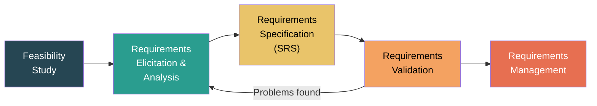

---

### 3.2.1 Feasibility Studies

A **feasibility study** is a short, focused assessment to determine whether the project is worth pursuing. It evaluates whether the system contributes to organizational objectives and whether it can be engineered with current technology and within budget/schedule.

#### Types of Feasibility

| Type | Question Answered |
|------|-------------------|
| **Technical Feasibility** | Can the system be built with existing technology, tools, and expertise? |
| **Economic Feasibility** | Is the project cost-justified? Do the benefits outweigh the costs? (Cost-Benefit Analysis) |
| **Legal Feasibility** | Are there any legal, regulatory, or compliance issues? |
| **Operational Feasibility** | Will the system be used as intended? Will it integrate into existing workflows? |
| **Schedule Feasibility** | Can the project be completed within the required timeframe? |

#### Feasibility Study Outputs

- Assessment of whether the system contributes to organizational objectives.
- Assessment of whether the system can be engineered with current technology and within budget.
- Assessment of whether the system can be integrated with other existing systems.
- **Go / No-Go decision** on proceeding with the project.

---

### 3.2.2 Requirements Elicitation and Analysis

**Requirements elicitation** is the process of gathering requirements from stakeholders, domain experts, documents, and existing systems. It is often the most difficult part of requirements engineering.

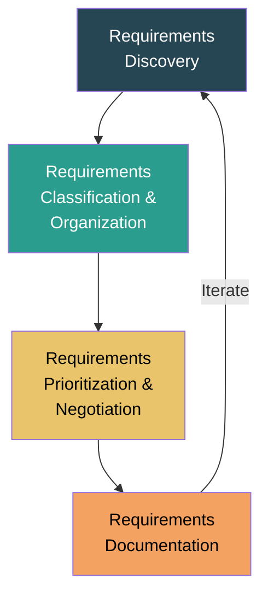

#### Elicitation Techniques

| # | Technique | Description |
|---|-----------|-------------|
| 1 | **Interviews** | Structured or unstructured discussions with stakeholders. Closed-ended (specific answers) or open-ended (exploratory). |
| 2 | **Questionnaires / Surveys** | Written questions distributed to a large group of stakeholders for quick data collection. |
| 3 | **Observation / Ethnography** | Observing users in their work environment to understand actual tasks and workflows. |
| 4 | **Document Analysis** | Studying existing forms, reports, manuals, and system documentation. |
| 5 | **Brainstorming** | Group sessions to generate creative ideas and identify requirements. |
| 6 | **Prototyping** | Building a quick working model to clarify and validate requirements. |
| 7 | **Use Cases / Scenarios** | Describe how a user interacts with the system to achieve a specific goal. |
| 8 | **Joint Application Development (JAD)** | Facilitated workshop with stakeholders, users, and developers working together intensively. |
| 9 | **Focus Groups** | Guided group discussion with representative users to explore needs and expectations. |

#### Problems with Requirements Elicitation

- **Stakeholders don't know what they really want.**
- **Stakeholders express requirements in their own terms** — may use domain-specific jargon that developers don't understand.
- **Different stakeholders may have conflicting requirements.**
- **Political and organizational factors** may influence requirements.
- **Requirements change** during the analysis process as new stakeholders are discovered.

---

### 3.2.3 Requirements Validation

**Requirements validation** checks that the documented requirements accurately define the system that the customer wants. Errors in the requirements document can lead to extensive rework later.

#### Validation Checks

| Check | Description |
|-------|-------------|
| **Validity** | Do the requirements reflect the real needs of users? |
| **Consistency** | Are there any contradictions between requirements? |
| **Completeness** | Are all functions and constraints mentioned? |
| **Realism** | Can the requirements actually be implemented with available technology and budget? |
| **Verifiability** | Can a test be designed to verify each requirement? |

#### Validation Techniques

| Technique | Description |
|-----------|-------------|
| **Requirements Reviews / Inspections** | Systematic team review of the requirements document for errors, ambiguities, and inconsistencies. |
| **Prototyping** | Build a prototype and let users evaluate it. |
| **Test-Case Generation** | Write test cases for each requirement — if a test cannot be written, the requirement may be unclear. |
| **Automated Consistency Analysis** | Use tools to check for contradictions in formal requirement models. |

---

### 3.2.4 Requirements Management

**Requirements management** is the process of managing changing requirements during the requirements engineering process and system development. Requirements inevitably change due to evolving business needs, new stakeholders, and better understanding.

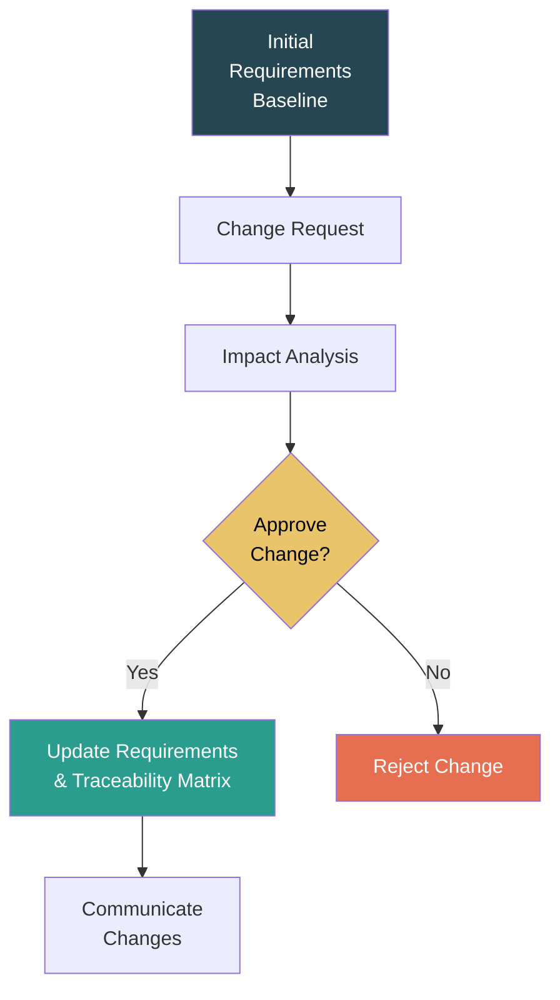

#### Key Activities in Requirements Management

| Activity | Description |
|----------|-------------|
| **Change Management** | Define a formal process for proposing, evaluating, and approving/rejecting changes to requirements. |
| **Requirements Traceability** | Maintain a traceability matrix that links each requirement to its source, design elements, code modules, and test cases. |
| **Version Control** | Track different versions of the requirements document. |
| **Impact Analysis** | Assess the effects of a proposed change on other requirements, design, schedule, and cost. |
| **Status Tracking** | Track whether each requirement is proposed, approved, implemented, verified, or deleted. |

#### Requirements Traceability Matrix (RTM)

| Req ID | Requirement Description | Source | Design Element | Code Module | Test Case | Status |
|--------|------------------------|--------|---------------|-------------|-----------|--------|
| R001 | User login with email/password | Stakeholder Interview | Login Module Design | `auth.py` | TC-001 | Implemented |
| R002 | Password recovery via email | User Story US-05 | Password Reset Design | `reset.py` | TC-002 | Verified |
| R003 | Session timeout after 30 min | Security Policy | Session Manager | `session.py` | TC-003 | Approved |

---

## 3.3 Project Estimation

Project estimation involves predicting the **effort, cost, time, and resources** needed to build a software system. Accurate estimation is critical for planning and decision-making.

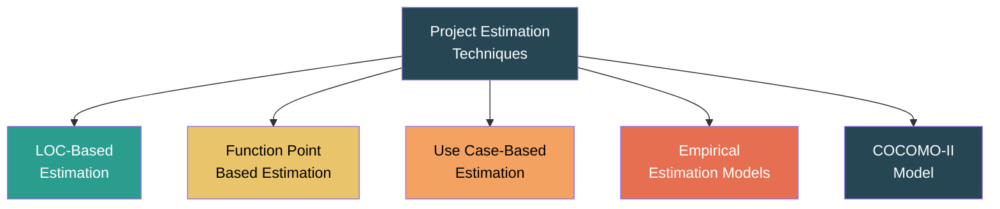

---

### 3.3.1 LOC-Based Estimation (Lines of Code)

**LOC-based estimation** uses the estimated number of lines of source code as the primary input for predicting project effort and cost.

#### Process

1. **Decompose** the software into individual functions/modules.
2. **Estimate LOC** for each function — typically using:
   - **Optimistic estimate (a)** — best case
   - **Most likely estimate (m)** — expected
   - **Pessimistic estimate (b)** — worst case
3. **Expected LOC** = (a + 4m + b) / 6 *(PERT weighted average)*
4. **Total estimated LOC** = Sum of expected LOC for all functions.
5. Use historical data to derive **productivity** (LOC/person-month) and **cost per LOC**.
6. **Estimated Effort** = Total LOC / Productivity
7. **Estimated Cost** = Total LOC × Cost per LOC

#### Example

| Function | Optimistic (a) | Most Likely (m) | Pessimistic (b) | Expected LOC |
|----------|:-:|:-:|:-:|:-:|
| User Interface | 1800 | 2400 | 3000 | 2400 |
| Database Access | 2500 | 3000 | 4200 | 3117 |
| Report Generation | 1100 | 1500 | 2200 | 1550 |
| **Total** | | | | **7067** |

If historical productivity = 500 LOC/person-month and cost = $15/LOC:
- Estimated Effort = 7067 / 500 ≈ **14.1 person-months**
- Estimated Cost = 7067 × $15 = **$106,005**

#### Advantages and Disadvantages

| Advantages | Disadvantages |
|------------|---------------|
| Simple to calculate | LOC depends on programming language and developer style |
| Widely available historical data | Difficult to estimate LOC early in the project |
| Directly measurable | Does not account for complexity or quality |
| Language-independent when normalized | Penalizes well-designed, concise code |

---

### 3.3.2 Function Point (FP) Based Estimation

**Function Point analysis** measures software size based on the **functionality** delivered to the user, independent of the programming language used. Developed by **Allan Albrecht (1979)** at IBM.

#### Step 1: Identify and Count Information Domain Values

| Parameter | Description | Simple | Average | Complex |
|-----------|-------------|:------:|:-------:|:-------:|
| **External Inputs (EI)** | Data entering the system from outside (e.g., input forms, data files) | 3 | 4 | 6 |
| **External Outputs (EO)** | Data leaving the system (e.g., reports, messages, screens) | 4 | 5 | 7 |
| **External Inquiries (EQ)** | Input that results in an immediate output (e.g., search queries) | 3 | 4 | 6 |
| **Internal Logical Files (ILF)** | Logical groups of data maintained within the system (e.g., database tables) | 7 | 10 | 15 |
| **External Interface Files (EIF)** | Logical groups of data referenced from another system (shared data) | 5 | 7 | 10 |

#### Step 2: Calculate Unadjusted Function Points (UFP)

**UFP** = Σ (Count × Weight) for each parameter and complexity level.

#### Step 3: Determine the Value Adjustment Factor (VAF)

Evaluate 14 **General System Characteristics (GSC)**, each rated from 0 (no influence) to 5 (strong influence):

| # | General System Characteristic |
|---|-------------------------------|
| 1 | Data communications |
| 2 | Distributed data processing |
| 3 | Performance requirements |
| 4 | Heavily used configuration |
| 5 | Transaction rate |
| 6 | Online data entry |
| 7 | End-user efficiency |
| 8 | Online update |
| 9 | Complex processing |
| 10 | Reusability |
| 11 | Installation ease |
| 12 | Operational ease |
| 13 | Multiple sites |
| 14 | Facilitate change |

**Total Degree of Influence (TDI)** = Sum of all 14 GSC ratings (range: 0–70)

**VAF** = 0.65 + 0.01 × TDI (range: 0.65–1.35)

#### Step 4: Calculate Adjusted Function Points

**FP** = UFP × VAF

#### Using FP for Estimation

| Metric | Formula |
|--------|---------|
| **Productivity** | FP / person-month (from historical data) |
| **Quality** | Defects / FP |
| **Cost** | $ / FP |
| **Estimated Effort** | Total FP / Productivity |

```mermaid
graph LR
    A["Identify Domain<br>Values"] --> B["Count & Weigh<br>(UFP)"]
    B --> C["Apply 14 GSCs<br>(VAF)"]
    C --> D["FP = UFP × VAF"]
    D --> E["Estimate Effort<br>& Cost"]
    style A fill:#264653,color:#fff
    style B fill:#2a9d8f,color:#fff
    style C fill:#e9c46a,color:#000
    style D fill:#f4a261,color:#000
    style E fill:#e76f51,color:#fff
```

#### Advantages and Disadvantages

| Advantages | Disadvantages |
|------------|---------------|
| Language-independent | Subjective weighting and classification |
| Based on user functionality, not code | Requires experience with FP counting rules |
| Can be estimated early (from requirements/design) | Not applicable to real-time or embedded systems easily |
| Widely accepted and standardized (IFPUG) | Calculation is complex |

---

### 3.3.3 Use Case-Based Estimation

**Use Case Points (UCP)** estimation, developed by **Gustav Karner (1993)**, estimates effort based on the use case model of the system.

#### Step 1: Calculate Unadjusted Use Case Weight (UUCW)

| Use Case Complexity | # Transactions | Weight |
|---------------------|:-:|:-:|
| Simple | ≤ 3 | 5 |
| Average | 4–7 | 10 |
| Complex | > 7 | 15 |

**UUCW** = Σ (Number of use cases × Weight) for each category.

#### Step 2: Calculate Unadjusted Actor Weight (UAW)

| Actor Complexity | Description | Weight |
|-----------------|-------------|:------:|
| Simple | External system via API | 1 |
| Average | External system via protocol or human via text interface | 2 |
| Complex | Human user via GUI | 3 |

**UAW** = Σ (Number of actors × Weight) for each category.

#### Step 3: Calculate Unadjusted Use Case Points (UUCP)

**UUCP** = UUCW + UAW

#### Step 4: Adjust for Technical and Environmental Factors

**Technical Complexity Factor (TCF)** = 0.6 + (0.01 × TFactor)
- TFactor is derived from 13 technical factors, each rated 0–5.

**Environmental Complexity Factor (ECF)** = 1.4 + (−0.03 × EFactor)
- EFactor is derived from 8 environmental factors, each rated 0–5.

#### Step 5: Calculate Use Case Points

**UCP** = UUCP × TCF × ECF

#### Step 6: Estimate Effort

**Effort (person-hours)** = UCP × Productivity Factor (typically 20–28 hours/UCP)

---

### 3.3.4 Empirical Estimation Models

**Empirical estimation models** use historical data and mathematically derived formulas to predict effort, cost, and schedule. They use regression analysis on past project data.

#### General Form

Most empirical models follow the formula:

**Effort = A × (Size)^B × M**

Where:
- **A** = a constant derived empirically
- **Size** = estimated size of the software (LOC or FP)
- **B** = an exponent reflecting economies or diseconomies of scale
- **M** = an adjustment multiplier based on process, product, and project attributes

#### Common Empirical Models

| Model | Formula | Notes |
|-------|---------|-------|
| **Walston-Felix (IBM)** | E = 5.2 × (KLOC)^0.91 | Early model from IBM data |
| **Bailey-Basili** | E = 5.5 + 0.73 × (KLOC)^1.16 | Includes project-specific adjustments |
| **Boehm (Basic COCOMO)** | E = a × (KLOC)^b | Three modes: Organic, Semi-detached, Embedded |
| **Doty** | E = 5.288 × (KLOC)^1.047 | For KLOC > 9 |

#### Limitations

- Accuracy depends on quality and relevance of historical data.
- May not reflect current technologies or practices.
- Calibration is needed for organizational context.

---

### 3.3.5 COCOMO-II Model

**COCOMO-II** (Constructive Cost Model II), developed by **Barry Boehm (2000)**, is a comprehensive, widely-used estimation model. It is the successor to COCOMO-81 and is designed for modern software development.

#### COCOMO-II Stages

```mermaid
graph LR
    A["Application<br>Composition Model"] --> B["Early Design<br>Model"]
    B --> C["Post-Architecture<br>Model"]
    style A fill:#264653,color:#fff
    style B fill:#2a9d8f,color:#fff
    style C fill:#e76f51,color:#fff
```

| Stage | When Used | Size Metric |
|-------|-----------|-------------|
| **Application Composition** | Very early; prototyping stage. Used when project is built using GUI builders, database tools. | Object Points |
| **Early Design** | Early in project when requirements are known but architecture is not yet finalized. | Function Points (converted to KSLOC) |
| **Post-Architecture** | After architecture is defined. Most detailed and accurate stage. | KSLOC (Thousands of Source Lines of Code) |

#### Post-Architecture Model Formula

**Effort (PM)** = A × (Size)^E × Π(EM_i)

Where:
- **A** = 2.94 (a calibrated constant)
- **Size** = estimated size in KSLOC (adjusted for reuse and breakage)
- **E** = exponent derived from 5 **Scale Factors**
- **EM_i** = **Effort Multipliers** (17 cost drivers)

#### Scale Factors (determine the exponent E)

**E** = B + 0.01 × Σ(SF_i)

Where **B** = 0.91 (a constant) and SF_i are rated from Very Low (5) to Extra High (0):

| # | Scale Factor | Description |
|---|-------------|-------------|
| 1 | **PREC** (Precedentedness) | How similar is this project to previous ones? |
| 2 | **FLEX** (Development Flexibility) | How much flexibility is allowed in the development process? |
| 3 | **RESL** (Architecture / Risk Resolution) | How well have risks been identified and resolved? |
| 4 | **TEAM** (Team Cohesion) | How well does the team work together? |
| 5 | **PMAT** (Process Maturity) | CMMI maturity level of the organization. |

> If all scale factors are rated **Extra High** → E ≈ 0.91 (economies of scale).
> If all scale factors are rated **Very Low** → E ≈ 1.226 (diseconomies of scale).

#### Effort Multipliers (17 Cost Drivers)

Grouped into four categories:

| Category | Cost Drivers |
|----------|-------------|
| **Product** | RELY (Reliability), DATA (Database size), CPLX (Complexity), RUSE (Reusability), DOCU (Documentation) |
| **Platform** | TIME (Execution time), STOR (Main storage), PVOL (Platform volatility) |
| **Personnel** | ACAP (Analyst capability), PCAP (Programmer capability), PCON (Personnel continuity), APEX (Application experience), PLEX (Platform experience), LTEX (Language/tool experience) |
| **Project** | TOOL (Use of software tools), SITE (Multi-site development), SCED (Schedule compression/expansion) |

Each cost driver is rated from **Very Low** to **Extra High**, producing a multiplier (typically 0.5–1.7). The product of all 17 multipliers scales the base effort.

#### Schedule Estimation

**Duration (TDEV)** = C × (PM)^(D + 0.2 × (E − B))

Where:
- **C** = 3.67, **D** = 0.28 (calibrated constants)
- **PM** = Effort in person-months
- **E** and **B** as defined above

#### COCOMO-II Example

Given:
- Size = 100 KSLOC
- Scale Factors yield E = 1.05
- Effort Multipliers product = 1.32

**PM** = 2.94 × (100)^1.05 × 1.32 = 2.94 × 112.2 × 1.32 ≈ **435 person-months**

**TDEV** = 3.67 × (435)^(0.28 + 0.2 × (1.05 − 0.91)) = 3.67 × (435)^0.308 ≈ **25.6 months**

---

## 3.4 Analysis Modeling

An **analysis model** provides a bridge between the system description (requirements) and the design model. It represents the system from the user's point of view and focuses on **what** the system does, not **how** it does it.

```mermaid
graph TD
    AM["Analysis Model<br>Elements"] --> SB["Scenario-Based<br>Elements"]
    AM --> FB["Flow-Based<br>Elements"]
    AM --> BB["Behavior-Based<br>Elements"]
    AM --> CB["Class-Based<br>Elements"]
    SB --> UC["Use Cases"]
    SB --> AD["Activity Diagrams"]
    SB --> SL["Swimlane Diagrams"]
    FB --> DFD["Data Flow Diagrams"]
    BB --> STD["State Diagrams"]
    BB --> SD["Sequence Diagrams"]
    CB --> CD["Class Diagrams"]
    CB --> CRC["CRC Cards"]
    style AM fill:#264653,color:#fff
    style SB fill:#2a9d8f,color:#fff
    style FB fill:#e9c46a,color:#000
    style BB fill:#f4a261,color:#000
    style CB fill:#e76f51,color:#fff
```

---

### 3.4.1 Scenario-Based Elements

Scenario-based modeling describes the system from the user's point of view through **use cases** and **activity diagrams**.

#### Use Cases

A **use case** describes a sequence of actions performed by an **actor** (user or external system) interacting with the system to achieve a specific goal.

**Components:**
- **Actor** — An entity that interacts with the system (person, system, device).
- **Use Case** — A specific function or service the system provides.
- **System Boundary** — Defines what is inside the system.
- **Relationships** — Include (`<<include>>`), Extend (`<<extend>>`), Generalization.

```mermaid
graph LR
    subgraph System Boundary
        UC1["Login"]
        UC2["Search Products"]
        UC3["Place Order"]
        UC4["Make Payment"]
        UC5["View Order History"]
        UC3 -->|"<<include>>"| UC4
    end
    Actor1["Customer 👤"] --- UC1
    Actor1 --- UC2
    Actor1 --- UC3
    Actor1 --- UC5
    Actor2["Admin 👤"] --- UC1
```

#### Activity Diagrams

An **activity diagram** represents the flow of activities in a process. It shows the sequence of steps, decisions, parallel activities, and flow of control.

```mermaid
graph TD
    Start(("●")) --> A["Customer places order"]
    A --> B{"Payment<br>valid?"}
    B -->|"Yes"| C["Process order"]
    B -->|"No"| D["Reject order"]
    C --> E["Ship order"]
    E --> F["Send confirmation email"]
    F --> End(("◉"))
    D --> End
```

#### Swimlane Diagrams

**Swimlane diagrams** are activity diagrams with partitions (lanes) that show **which actor or component is responsible** for each activity.

---

### 3.4.2 Flow-Based Elements

Flow-based modeling represents how **data objects are transformed** as they move through the system using **Data Flow Diagrams (DFDs)**.

#### Data Flow Diagram (DFD)

A **DFD** graphically represents the flow of data through a system. It shows:
- **Processes** — transform incoming data into outgoing data.
- **Data Flows** — paths along which data moves.
- **Data Stores** — repositories of data.
- **External Entities** — sources or destinations of data outside the system.

| Symbol | Notation | Description |
|--------|----------|-------------|
| ○ (Circle) | Process | A function that transforms data. |
| → (Arrow) | Data Flow | Movement of data between elements. |
| ═ (Open Rectangle) | Data Store | A repository where data is stored. |
| □ (Rectangle) | External Entity | Source or sink of data outside the system. |

#### DFD Levels

| Level | Name | Description |
|-------|------|-------------|
| **Level 0** | Context Diagram | Shows the entire system as a single process with external entities and data flows. Provides the big picture. |
| **Level 1** | Top-Level DFD | Breaks down the single process from Level 0 into major sub-processes. |
| **Level 2** | Detailed DFD | Further decomposes Level 1 processes into more detailed sub-processes. |
| **Level 3+** | Lower-Level DFD | Further decomposition as needed. |

```mermaid
graph LR
    subgraph "Level 0 — Context Diagram"
        E1["Customer"] -->|"Order Details"| P0["Order Processing<br>System"]
        P0 -->|"Order Confirmation"| E1
        P0 -->|"Shipping Request"| E2["Warehouse"]
        E2 -->|"Shipment Status"| P0
    end
```

#### Guidelines for Drawing DFDs

1. All processes must have at least one input and one output data flow.
2. All data flows must start or end at a process.
3. Data stores must be connected to processes (not directly to external entities).
4. Do not show control flow (decisions); DFDs show data flow only.
5. Maintain **balancing** — data flows into and out of a parent process must match the child diagram.

---

### 3.4.3 Behavior-Based Elements

Behavior-based modeling represents the **dynamic behavior** of the system — how it responds to external events over time.

#### State Transition Diagram (STD)

A **state diagram** shows the different **states** of an object or system and the **transitions** triggered by events.

```mermaid
stateDiagram-v2
    [*] --> Idle
    Idle --> Processing : Order Received
    Processing --> Validating : Validate Payment
    Validating --> Approved : Payment Valid
    Validating --> Rejected : Payment Invalid
    Approved --> Shipped : Ship Order
    Shipped --> Delivered : Delivery Confirmed
    Rejected --> Idle : Retry / Cancel
    Delivered --> [*]
```

**Components:**
- **State** — A condition or situation of an object during its life.
- **Transition** — A change from one state to another triggered by an event.
- **Event** — An occurrence that triggers a state transition.
- **Action** — An activity performed during a transition.
- **Guard Condition** — A boolean condition that must be true for a transition to occur.

#### Sequence Diagrams

A **sequence diagram** shows the interactions between objects arranged in a time sequence. It emphasizes the order in which messages are exchanged.

```mermaid
sequenceDiagram
    participant C as Customer
    participant S as System
    participant D as Database
    participant P as Payment Gateway

    C->>S: Login(username, password)
    S->>D: Validate credentials
    D-->>S: Valid
    S-->>C: Login successful
    C->>S: Place Order(items, address)
    S->>D: Save Order
    D-->>S: Order ID
    S->>P: Process Payment(amount)
    P-->>S: Payment confirmed
    S-->>C: Order Confirmation
```

---

### 3.4.4 Class-Based Elements

Class-based modeling identifies the **objects**, **attributes**, **operations**, and **relationships** within the system.

#### Class Diagram

A **class diagram** describes the structure of a system by showing the system's classes, their attributes, operations, and the relationships among the classes.

```mermaid
classDiagram
    class Customer {
        -customerId: int
        -name: String
        -email: String
        -address: String
        +register()
        +login()
        +placeOrder()
    }

    class Order {
        -orderId: int
        -orderDate: Date
        -totalAmount: double
        -status: String
        +calculateTotal()
        +updateStatus()
    }

    class Product {
        -productId: int
        -name: String
        -price: double
        -stock: int
        +updateStock()
        +getDetails()
    }

    class Payment {
        -paymentId: int
        -amount: double
        -method: String
        -status: String
        +processPayment()
        +refund()
    }

    Customer "1" --> "*" Order : places
    Order "*" --> "*" Product : contains
    Order "1" --> "1" Payment : has
```

#### CRC Cards (Class-Responsibility-Collaborator)

**CRC cards** are a simple way to identify classes and their responsibilities during analysis.

| Class Name: **Order** |
|---|
| **Responsibilities** | **Collaborators** |
| Calculate order total | Product |
| Update order status | Payment |
| Store order details | Customer |
| Generate invoice | — |

#### Key Relationships in Class Diagrams

| Relationship | Description | Notation |
|-------------|-------------|----------|
| **Association** | A structural link between two classes. | Solid line |
| **Aggregation** | "Has-a" relationship (whole-part); part can exist independently. | Open diamond |
| **Composition** | Strong "has-a" relationship; part cannot exist without the whole. | Filled diamond |
| **Inheritance** | "Is-a" relationship; child class inherits from parent. | Open arrowhead |
| **Dependency** | One class uses another temporarily. | Dashed arrow |

---

### Summary: Analysis Model Elements

| Element Type | Key Diagrams | Focus |
|-------------|-------------|-------|
| **Scenario-Based** | Use Case Diagrams, Activity Diagrams | What the user does with the system |
| **Flow-Based** | Data Flow Diagrams (DFD) | How data moves and transforms through the system |
| **Behavior-Based** | State Diagrams, Sequence Diagrams | How the system responds to events over time |
| **Class-Based** | Class Diagrams, CRC Cards | What objects exist and how they relate |

---
