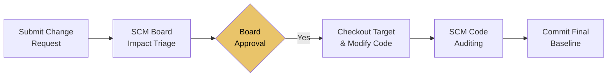
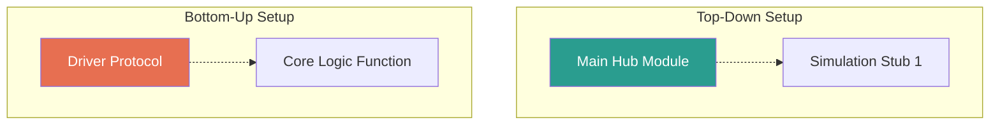

# SE ISE 2 — Short Revision Notes (Exam Focussed)

> **Note:** This document has been heavily consolidated to cover **exclusively** the topics requested within the 2-Mark and 5-Mark question bank syllabus. Irrelevant portions have been pruned for optimized study targeting.

---

# Chapter 4: Design Engineering

## Design Principles *(Targeted by Mod 4: Q9)*
Principles establish a core foundation for designing high-quality software:
- **Traceability:** The design must be completely traceable back to the analysis model.
- **Minimize Intellectual Distance:** The design should effectively shorten the intellectual distance between software execution and the physical real-world problem.
- **Uniformity & Integration:** Designs should exhibit deep structural uniformity; it should look like one person wrote it.
- **Accommodate Change:** Structured proactively to accommodate change efficiently and gracefully.
- **Graceful Degradation:** Fails softly, not catastrophically during edge cases.
- **Assess for Quality:** Must be rigorously assessed for qualitative value during creation itself.

## Design Concepts
These establish the required mindset frameworks for component formulation:
- **Abstraction *(Targeted by Mod 4: Q7, Q10)*:** Focuses actively on raw problem-solving without lower-level clutter (Levels: User, Procedural, Data abstractions). Massively reduces cognitive complexity by forcing developers upwards toward high-level specs.
- **Modularity *(Targeted by Mod 4: Q6, Q11)*:** Methodically compartmentalizing software directly into isolated, single-purpose components. Exponentially improves generalized maintainability (e.g., math logic naturally isolated away from a given UI parser).
- **Information Hiding *(Targeted by Mod 4: Q4, Q12)*:** Demands modules strictly hide internal raw data from surrounding code scopes, fiercely protecting internal states (Encapsulation logic). Eliminates side-effects and cements overarching codebase security.
- **Refinement *(Targeted by Mod 4: Q3)*:** Step-by-step downstream algorithmic elaboration of abstract structural models firmly into procedural logic safely.

## The Design Model *(Targeted by Mod 4: Q5)*
The centralized blueprint mapping requirements sequentially towards coding.
- **Data Design *(Targeted by Mod 4: Q2)*:** Physically transforms abstract entities into actionable data structures, ledgers, and functional databases.
- **Architecture Design:** Formulates relationship parameters operating across massive structural segments.
- **User Interface (UI) Design *(Targeted by Mod 4: Q1, Q8)*:** Directs how software interprets input from system users. Excellent UI dramatically improves end-user satisfaction. Conversely, awful UI directly initiates devastating failures via cascading learning-curve misclicks.
- **Component-Level Design *(Targeted by Mod 4: Q3)*:** Transmutes structural modules physically into procedural algorithmic execution sets.

## Functional Independence: Coupling & Cohesion *(Targeted by Mod 4: Q11)*
Excellent architectures actively engineer isolated parameter independence.
- **Cohesion (Goal: Highest Level):** Explains exactly how tightly internal module components rely heavily on each other. *Functional Cohesion* (Single, perfect purpose) rules natively.
- **Coupling (Goal: Lowest Limit):** Details arbitrary structural inter-dependence spanning separate modules. *Data Coupling* isolates modules efficiently by preventing unrestricted global variable sharing constraints.

---

# Chapter 5: Risk Management & SCM

## Software Risks
**Risk** designates a potential failure warning mechanism.
- **Reactive vs Proactive Strategies *(Targeted by Mod 5: Q16)*:** Reactive protocols embody post-catastrophe panic fire-fighting (very damaging timelines). Proactive mitigation enforces strict predictive analysis algorithms designed to avert crises pre-emptively.
- **Risk Mitigation *(Targeted by Mod 5: Q1, Q6)*:** Primary importance revolves fully around preemptive action mapping (e.g., Hardware UPS deployment mapping prevents server crash devastation).

### Core Risk Categories *(Targeted by Mod 5: Q3)*
1. **Project Risks:** Dangerously jeopardize fundamental timeframes natively (e.g., Unrealistic deadlines).
2. **Technical Risks:** Corrupt qualitative implementation protocols (e.g., Code logic breakdown).
3. **Business Risks:** Cripple product market share inherently (e.g., Hostile competitor drops similar program).

## Risk Paradigm & Process *(Targeted by Mod 5: Q8)*
1. **Identification:** Isolating variables structurally.
2. **Projection & Assessment:** Determining exact likelihood ratios (Probability P) against impact value (I).
   - **Risk Score Validation = P × I** *(Targeted by Mod 5: Q20, Q21)*.
3. **RMMM Framework:** Implementation pipeline.

## Fundamental Risk Tools
- **The Risk Table *(Targeted by Mod 5: Q2, Q9)*:** Incorporates exact system variables: Assigned Risk ID, Context Description, Baseline Category classification, Projection Probability, Impact scale limits, alongside RMMM directives.
- **Risk Information Sheet *(Targeted by Mod 5: Q10)*:** A dedicated, exhaustive overview strictly targeting high-threat parameters enforcing direct physical Management plan protocols and tracking telemetry triggers natively.

## RMMM Model Outline *(Targeted by Mod 5: Q7, Q17)*
- **Risk Mitigation:** Prevents occurrences completely.
- **Risk Monitoring:** Constantly tracks failure condition telemetry metrics organically.
- **Risk Management:** Established Contingency failover fallback protocols.

## Software Configuration Management (SCM)
Governs overarching development lifecycle change modifications strictly across engineering domains.
- **3 Primary Goals *(Targeted by Mod 5: Q11)*:**
  1. *Identify:* Define explicit configuration item frameworks securely.
  2. *Control:* Defend environments rigorously against unauthorized developer parameter overwrites organically.
  3. *Audit:* Verifiable systemic verification guaranteeing correct engineering implementations natively.

- **Version Control Processes *(Targeted by Mod 5: Q4, Q13)*:** Centralizes structural configurations across localized branch setups. Implements critical failsafe merging alongside structural branch baseline rollbacks rapidly upon disaster.
- **Configuration Audit vs SCM Review *(Targeted by Mod 5: Q5)*:**
  - *Code Review:* Checks exact architectural logic validity.
  - *Configuration Audit:* Directly analyzes complete SCM procedural workflow enforcement standards securely.

### SCM Lifecycle Change Flowchart *(Targeted by Mod 5: Q12)*

---

# Chapter 6: Software Testing & QA

## Standardized Testing Tactics *(Targeted by Mod 6: Q2, Q3, Q4)*
- **Black Box (Behavior Testing Mechanism):** Evaluates consumer-facing output metrics blindly evaluating interface interactions specifically omitting baseline logic analysis.
  - *Use Case:* High-level System and Acceptance Testing (e.g., verifying a login screen accepts passwords organically).
- **White Box (Structural Execution Tools):** Leverages fully deep inspection mechanisms parsing loops systematically alongside logical pathway node verifications deeply.
  - *Use Case:* Low-level Unit and Integration Testing (e.g., verifying an internal `authCheck()` logically throws an exception correctly).

## Black Box Techniques
- **Boundary Value Analysis (BVA) *(Targeted by Mod 6: Q5 [5M])*:** Capitalizes heavily natively upon structural code limits systematically. Checks parameter limits (e.g., Logins needing [5 to 15] keys). Systematically checks parameters surrounding specific borders (+1 / -1) mapping extreme invalid triggers sequentially.
- **Equivalence Partitioning *(Targeted by Mod 6: Q6 [2M])*:** Logically divides the input domain into defined classes (valid/invalid) reducing total repetitive test cases required because testers only need to execute one representative value per partitioned class.

## White Box: Basis Path Testing Metrics *(Targeted by Mod 6: Q1, Q7, Q8)*
**Cyclomatic Complexity System V(G):** Evaluates mathematical code complexity inherently calculating completely sovereign pathway branches. 
- *Calculation Path A:* V(G) = Baseline Path Nodes (Edges) - Execution (Nodes) + 2
- *Calculation Path B:* V(G) = Predicate Target Condition Nodes + 1

## Specialized Testing Phases & Configurations
- **Integration Testing *(Targeted by Mod 6: Q3 [5M])*:** Focuses upon interconnectivity limitations strictly omitted by standalone single-module Unit Testing structures completely.
  - **Top-Down Strategy:** Begins with main overarching logical control loops, heavily leveraging code 'Stubs' to functionally mock missing lower-layer implementations seamlessly.
  - **Bottom-Up Strategy:** Establishes rigorous verification inherently from granular underlying sub-functions relying specifically upon dedicated simulated 'Driver' components mimicking overarching calling features.
- **User Acceptance Testing (UAT) *(Targeted by Mod 6: Q5 [2M])*:** End-users dynamically validate software requirement specifications organically. Uses **Alpha Testing** (Controlled, developer-monitored site) and **Beta Testing** (Uncontrolled, strictly end-user targeted environments).
- **Regression Testing *(Targeted by Mod 6: Q7 [2M])*:** Actively ensures that newly introduced modifications do not unexpectedly break previously functional components natively. Heavy usage inside automated CI/CD deployment channels structurally.

## McCall's Quality Factors *(Targeted by Mod 6: Q2 [5M], Q4 [2M])*
Defines generalized systemic viability across strictly governed categorical perspectives inherently:
1. **Software Operations Execution:** Verifies reliability stability natively.
2. **Software Code Revision Structures:** Enforces maintenance refactoring capabilities flexibly.
3. **Software Product Transitional Phase:** Evaluates the capacity to migrate configurations specifically via **Portability** (OS agnostic bounds), **Reusability** (targeted asset extraction), and **Interoperability** (cross-system execution linkages).

## Software Quality Assurance (SQA) *(Targeted by Mod 6: Q6)*
Quality Assurance governs the holistic lifecycle actively preventing codebase contamination rather than post-production reaction testing organically. This structural ideology aggressively detects baseline flaws internally early along production maps drastically thereby reducing cumulative structural code defect density completely.

---
> **End of Revised Targeted Notes**
