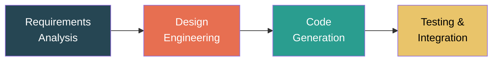
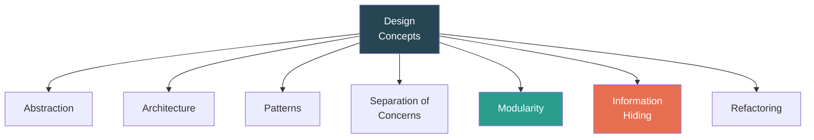
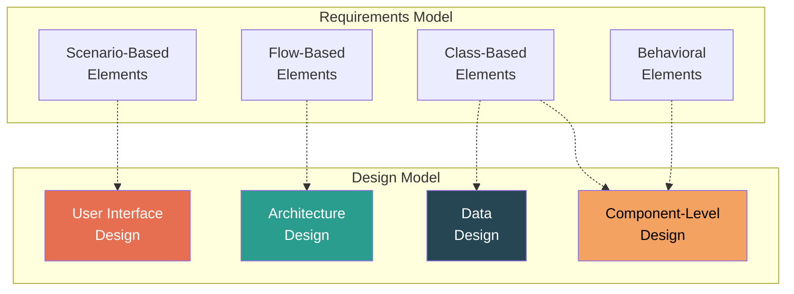
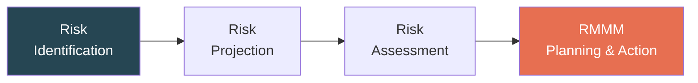
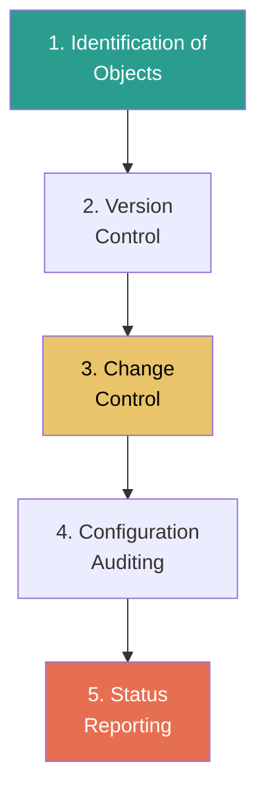
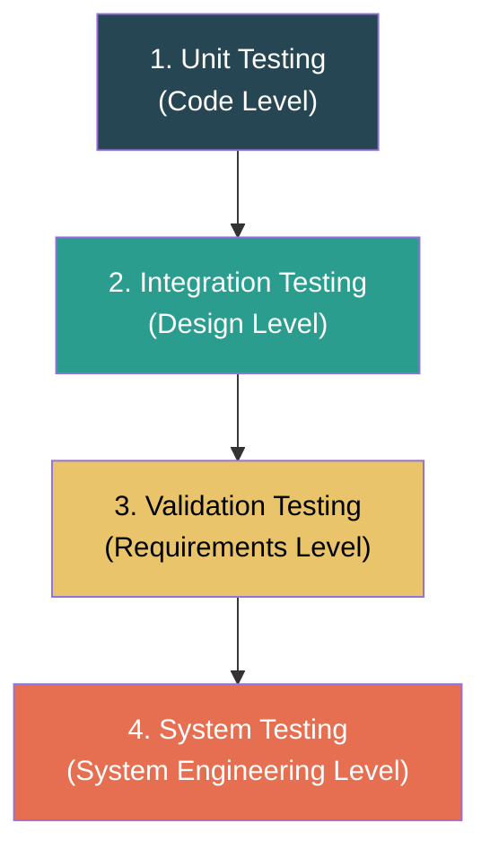
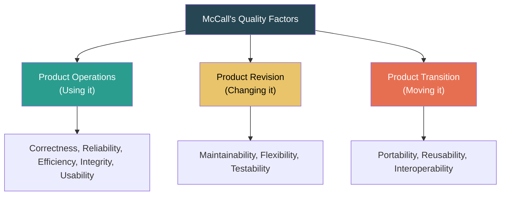

# Software Engineering — ISE 2 Notes

## Chapters Covered

4. Design Engineering
5. Risk Management & Software Configuration Management
6. Software Testing with Quality Assurance

---

# Chapter 4: Design Engineering

---

## 4.1 Introduction to Design Engineering
**Design Engineering** encompasses the set of principles, concepts, and practices that lead to the development of a high-quality system or product. It acts as the bridge between requirements analysis and code generation. It translates the customer's requirements into a blueprint for constructing the software.

## 4.2 Design Process and Principles

### Design Process
The software design process is an iterative sequence of steps that enable the designer to describe all aspects of the software. It involves:
1. **Preliminary Design:** Focuses on the transformation of requirements into data and software architecture.
2. **Detailed Design:** Focuses on refining the architectural representation to detailed data structures and algorithmic representations of software components.

### Design Principles
Design principles establish a core foundation for designing high-quality software:

| Principle | Description |
|-----------|-------------|
| **Traceability** | The design must be traceable to the analysis model. |
| **Minimize Intel Distance** | The design should shorten the "intellectual distance" between the software and the real-world problem. |
| **Uniformity & Integration** | A design should exhibit uniformity and integration. It should look like one person wrote it. |
| **Accommodate Change** | The design should be structured to accommodate change gracefully. |
| **Degradation** | The design should be structured to degrade gently, not catastrophically, when aberrant data or events occur. |
| **Assess for Quality** | Design is not simply coding; it must be assessed for quality as it is being created. |

## 4.3 Design Concepts

Some fundamental concepts provide the necessary framework for software design:

- **Abstraction:** Allows the designer to focus on solving a problem without being concerned about irrelevant lower-level details (Data, Procedural, and Control abstractions).
- **Architecture:** The overall structure of the software and the ways in which its structure provides conceptual integrity.
- **Patterns:** A documented solution to a recurring design problem.
- **Separation of Concerns:** Breaking down a complex problem into smaller, manageable pieces (concerns) that can be solved independently.
- **Modularity:** Compartmentalizing the software into single-purpose components (modules).
- **Information Hiding:** Modules should be designed so that information (data and algorithms) contained within them is inaccessible to other modules that have no need for such information.
- **Refactoring:** A reorganization technique that simplifies the design of an existing component without changing its observable behavior.

## 4.4 The Design Model

The design model maps the requirements model to representations that can be assessed for quality before coding begins.

### Components of the Design Model:
1. **Data Design:** Transforms data models (e.g., ER diagrams) into data structures and databases.
2. **Architecture Design:** Defines the relationship among major structural elements of the software.
3. **User Interface Design:** Describes how the software communicates within itself, with other systems, and with human users.
4. **Component-level Design:** Transforms structural elements into procedural descriptions of software components.

## 4.5 Coupling and Cohesion

These are two critical metrics for evaluating module design. 

**Cohesion** refers to the degree to which the elements inside a module belong together. **(Aim: High Cohesion)**
**Coupling** refers to the degree of interdependence between software modules. **(Aim: Low Coupling)**

### Types of Cohesion (from Best to Worst)

| Type | Description |
|------|-------------|
| **Functional** | Performs a single, well-defined task (Best) |
| **Sequential** | Output of one part is input to the next |
| **Communicational**| Operates on the same data |
| **Procedural** | Executed in a specific order |
| **Temporal** | Executed at the same time (e.g., initialization) |
| **Logical** | Elements perform logically similar activities |
| **Coincidental** | Parts are grouped together arbitrarily (Worst) |

### Types of Coupling (from Best to Worst)

| Type | Description |
|------|-------------|
| **Data Coupling** | Modules communicate by passing parameters (Best) |
| **Stamp Coupling**| Modules share a composite data structure (e.g., passing a whole object) |
| **Control Coupling**| One module controls the flow of another (passing flags) |
| **External Coupling**| Modules share an externally imposed format/protocol |
| **Common Coupling**| Modules share global data |
| **Content Coupling**| One module directly modifies data/code of another (Worst) |

---

# Chapter 5: Risk Management & Software Configuration Management

---

## 5.1 Risk Management Overview
**Risk** is a potential problem that may or may not happen in the future. **Risk Management** is a series of proactive steps that help software teams understand and mitigate uncertainty.

## 5.2 Reactive vs. Proactive Risk Strategies

| Feature | Reactive Risk Strategy | Proactive Risk Strategy |
|---------|------------------------|-------------------------|
| **Approach** | "Fire-fighting" mode | Identification before problems occur |
| **Action** | Action is taken *after* a risk becomes reality | Action is taken *before* to avoid risk |
| **Focus** | Fixing the current issue and crisis management | Prevention and contingency planning |
| **Result** | High cost, delayed schedules, panic | Predictable schedules, minimized impact |

## 5.3 Software Risks & Risk Identification

### Categories of Software Risks
1. **Project Risks:** Threaten the project plan (budget, schedule, resources).
2. **Technical Risks:** Threaten the quality and timeline of the software to be built (design, implementation, interface issues).
3. **Business Risks:** Threaten the viability of the software (market risk, strategic risk, sales risk).

### Identifying Risks
Risks can be identified as:
- **Known Risks:** Uncovered after careful evaluation (e.g., unrealistic delivery date).
- **Predictable Risks:** Extrapolated from past project experience (e.g., staff turnover).
- **Unpredictable Risks:** Cannot be anticipated.

## 5.4 Risk Projection & Assessment

**Risk Projection** (or estimation) attempts to rate each risk based on two elements:
- The **Probability** of the risk occurring.
- The **Impact** of the risk if it does occur.

### Developing a Risk Table
A risk table provides a simple technique to handle risk projection.

| Risk ID | Risk Description | Category | Probability (%) | Impact (1=Catastrophic, 4=Negligible) | RMMM |
|---------|------------------|----------|-----------------|--------------------------------------|------|
| R01 | Key developer leaves | Project | 30% | 1 (Catastrophic) | ... |
| R02 | Third-party API changes | Technical| 60% | 2 (Critical) | ... |
| R03 | Initial budget reduced | Business | 10% | 3 (Marginal) | ... |

*Risk Exposure (RE) = Probability (P) x Cost of Impact (C)*

## 5.5 The RMMM Plan

**RMMM** stands for **Risk Mitigation, Monitoring, and Management**.
- **Risk Mitigation:** How can we avoid the risk proactively?
- **Risk Monitoring:** What factors track whether the risk is becoming more or less likely?
- **Risk Management:** Contingency planning if the risk actually materializes.

## 5.6 Software Configuration Management (SCM)
**SCM** is an umbrella activity that is applied throughout the software process. It identifies, controls, and audits changes made to software products.

**Why is it needed?**
Software changes continually. If changes aren't managed properly, multiple developers overwriting each other's code can lead to chaos.

### SCM Scenario
A developer modifies a shared file. Another developer tries to modify the same file. Without SCM, the latest save overrides everything. With SCM, changes can be merged, creating a new "version" while retaining history.

### Elements of a Configuration Management System
1. **Component elements:** Tools for the management of individual files.
2. **Process elements:** Procedures that dictate how changes are managed.
3. **Construction elements:** Tools that automate the generation of a software build.
4. **Human elements:** The team and structure that manage SCM tasks.

### The SCM Process

1. **Identification:** Identifying baseline configuration objects (code, docs).
2. **Version Control:** Combining procedures and tools to manage different versions.
3. **Change Control:** The formal process of deciding whether or not a change is approved.
4. **Configuration Auditing:** Ensuring that changes have been properly implemented.
5. **Status Reporting:** Telling others about changes that have occurred.

---

# Chapter 6: Software Testing with Quality Assurance

---

## 6.1 Overview of Software Testing
Testing is the process of evaluating a system to check whether it satisfies specified requirements and to identify defects.
- **Verification:** "Are we building the product right?" (Evaluating whether the software adheres to specifications).
- **Validation:** "Are we building the right product?" (Evaluating whether the software fulfills user requirements).

## 6.2 Testing Tactics: Black Box vs. White Box

| Feature | Black Box Testing | White Box Testing |
|---------|-------------------|-------------------|
| **Also Known As** | Behavioral Testing / Opaque-box | Structural Testing / Glass-box |
| **Focus** | Inputs and outputs (Functionality) | Internal logic, paths, and structure |
| **Knowledge** | Tester has no knowledge of code | Tester has full knowledge of code |
| **Level** | Higher levels (System, Acceptance) | Lower levels (Unit, Integration) |

---

## 6.3 Black Box Testing Techniques

### Equivalence Partitioning
Divides the input domain into classes of data where cases in a class are treated identically. 
*Example: If an input is a month (1-12), valid partition: 1-12. Invalid partitions: < 1 and > 12.*

### Boundary Value Analysis (BVA)
Bugs often occur at the "boundaries" of inputs. BVA focuses on testing boundary values.
*Example: For the month (1-12), tests would be: 0, 1, 2... 11, 12, 13.*

---

## 6.4 White Box Testing Techniques

### Basis Path Testing
Uses the control flow graph of the program to determine a basis set of execution paths. It guarantees that every statement in the program has been executed at least once.

**Cyclomatic Complexity [ V(G) ]** provides a quantitative measure of the logical complexity of a program.
- Formula 1: `V(G) = E - N + 2` (Edges - Nodes + 2)
- Formula 2: `V(G) = P + 1` (Predicate nodes + 1)
- Formula 3: `V(G) = Regions`

*The V(G) value gives the number of independent paths that must be tested to ensure coverage.*

---

## 6.5 Test Strategies for Conventional Software

Testing typically follows a bottom-up progression (The V-Model approach):

1. **Unit Testing:** Focuses on individual components or modules. Heavily uses white-box testing.
2. **Integration Testing:** Focuses on the interfaces and interactions between merged units. 
   - *Top-down Integration:* Stub modules are used to substitute lower-level components.
   - *Bottom-up Integration:* Driver modules are used to run lower-level components, merging upwards.
3. **Validation Testing:** Checks whether software meets the customer's expectations (Alpha and Beta testing).
4. **System Testing:** Tests the software as part of a complete, integrated system (Security, Recovery, Stress, Performance testing).

---

## 6.6 Software Quality Assurance (SQA)
SQA involves the entire software development process — measuring and assessing whether products hold an acceptable level of quality.

### Elements of SQA
- Standards, reviews, and audits
- Error tracking and analysis
- Change management
- Educational programs
- Vendor/subcontractor management
- Security and safety management

---

## 6.7 McCall's Quality Factors
A framework for defining software quality based on three main perspectives:

---

## 6.8 Case Study: Testing Strategies in FinTech Applications

**Scenario:** High-stakes financial systems like **Paytm** or **Razorpay**.
Because FinTech applications handle sensitive user data and large financial transactions, testing strategies must be exceptionally robust. A minor bug can cause catastrophic financial loss and legal ramifications.

### 1. Unit Testing
- **Focus:** Validating individual functions like calculating interest, verifying transaction minimums, and logic for currency conversion.
- **Approach:** Developers use tools like JUnit/PyTest. Mock objects simulate databases and payment gateways so individual transaction algorithms can be tested instantly without network latency.

### 2. Integration Testing
- **Focus:** Ensuring internal microservices communicate properly.
- **Approach:** Testing the flow between the authentication service, user wallet database, and the payment processing API. Validating that a user is debited properly and the merchant is subsequently credited via database triggers.

### 3. Regression Testing
- **Focus:** FinTechs deploy updates frequently (e.g., adding a new UPI payment vector).
- **Approach:** Automated regression testing ensures that updating a feature (like adding credit card support) does NOT break existing functionality (like wallet transfers). Entire test suites are run every time code is merged (Continuous Integration).

### 4. Security Testing (Crucial for FinTech)
- **Focus:** Preventing hacking, data leaks, and unauthorized transactions.
- **Approach:**
  - **Penetration Testing:** Ethical hackers purposefully attempt to breach the firewall and API.
  - **Vulnerability Scanning:** Checking for OWASP top 10 vulnerabilities (like SQL injection and Cross-Site Scripting).
  - **Encryption Validation:** Making sure data in transit (TLS 1.3) and data at rest (AES-256) is securely managed.
  - **Compliance Testing:** Ensuring the app meets PCI-DSS and localized laws (like RBI guidelines in India) for storing customer credentials.

### Metrics for Success in FinTech Testing
- Zero occurrences of P1 (Critical) severity bugs involving financial loss in production.
- Sub-second latency in API processing under simulated heavy load (Stress Testing).
- High code coverage (>90%) for all transaction and security-oriented modules.
