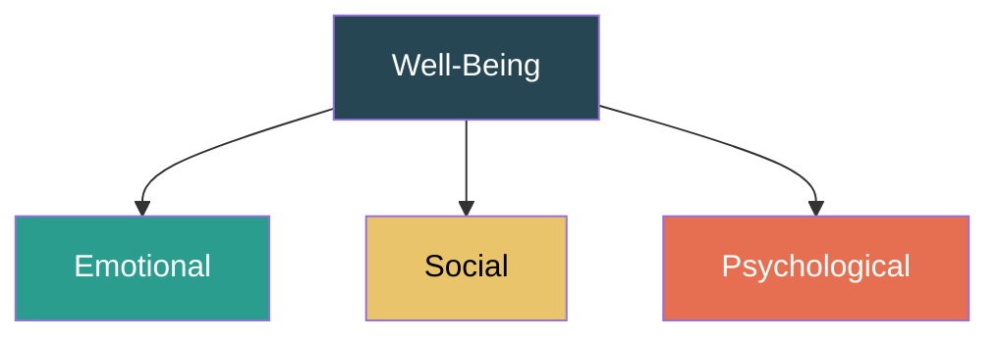
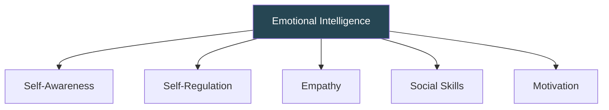
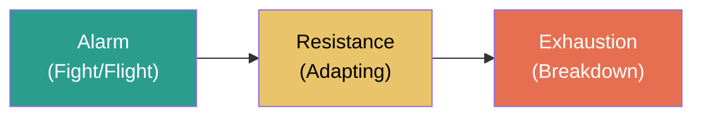
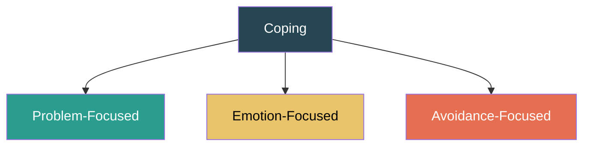

# WPMH ISE 1 — Quick Revision Notes

---

# Chapter 1: Introduction to Mental Health

---

## Mental Health — Definition

> **WHO:** A state of well-being in which an individual realizes their abilities, copes with normal stresses, works productively, and contributes to community.

**Continuum:** Thriving → Healthy → Struggling → In Crisis (everyone moves along it)

---

## Why It Matters at Work

| Factor | Poor MH Impact | Good MH Impact |
|---|---|---|
| Productivity | Reduced output, errors | Higher efficiency |
| Absenteeism | Frequent sick leaves | Consistent attendance |
| Presenteeism | Present but disengaged (costs MORE than absenteeism) | Engaged & focused |
| Turnover | High attrition, costly | Better retention |
| Safety | More accidents, poor judgment | Better decisions |
| Financial | WHO: $1 trillion/yr lost globally | $1 invested → $4 returned |

---

## Three Dimensions of Well-Being

| Dimension | Key Aspects |
|---|---|
| **Emotional** | Managing emotions, coping with stress, optimism, self-awareness |
| **Social** | Relationships, belonging, collaboration, trust, supporting others |
| **Psychological** | Sense of purpose, personal growth, autonomy, self-acceptance |

> **Signs of Social Well-Being:** Participating in team activities, positive relationships, willingness to collaborate, feeling included/valued.

---

## Job Satisfaction ↔ Mental Health

**Bidirectional:** Good MH → higher satisfaction → better MH. Poor MH → low satisfaction → worse MH. They reinforce each other.

## Resilience

**Definition:** Ability to adapt, recover, and grow from adversity/setbacks.

**Components:** Adaptability, Emotional regulation, Problem-solving, Social support, Positive mindset

**Building it:** Growth mindset, social connections, self-care, realistic goals, professional help when needed

> **Resilience strategy → Result:** Better stress tolerance, lower burnout, improved adaptability, stronger teams, setbacks viewed as learning.

---

## Common Mental Health Disorders

| Disorder | Key Symptoms | Workplace Impact |
|---|---|---|
| **Depression** | Persistent sadness, fatigue, loss of interest, worthlessness | Reduced productivity, withdrawal, absenteeism |
| **Anxiety** | Excessive worry, panic attacks, avoidance, restlessness | Avoiding meetings, perfectionism, missed deadlines |
| **Burnout** | Exhaustion, cynicism, reduced efficacy | Disengagement, high turnover |
| **PTSD** | Flashbacks, hypervigilance, emotional numbness | Difficulty focusing, avoidance, outbursts |
| **OCD** | Intrusive thoughts, repetitive rituals, excessive checking | Time consumed by rituals → team productivity loss |
| **Bipolar** | Mania (high energy) ↔ Depression cycles | Inconsistent performance, risky decisions |

### Physical Symptoms of Anxiety

Rapid heartbeat, chest tightness, shortness of breath, nausea, muscle tension, headaches, dizziness, sweating, insomnia, trembling

### Myths vs Facts

| Myth | Fact |
|---|---|
| "Just stress, not real" | Clinically diagnosed, biological basis |
| "They can snap out of it" | Not a choice; needs support & treatment |
| "Only weak people" | Affects everyone regardless of strength |
| "Depression = sadness" | Includes fatigue, cognitive impairment, sleep changes |
| "If they can work, they're fine" | Presenteeism is real and costly |

### Depression Misdiagnosed As:
Laziness, poor performance, personality trait, personal weakness → prevents help-seeking

---

## Recognizing Signs at Work

| Category | Signs |
|---|---|
| **Emotional** | Sadness, mood swings, irritability, hopelessness |
| **Behavioral** | Absenteeism, declining quality, substance use, overworking |
| **Physical** | Fatigue, headaches, sleep issues, weight changes |
| **Cognitive** | Poor concentration, forgetfulness, negative self-talk |
| **Social** | Withdrawal, avoiding meetings, conflict with coworkers |

**Red Flags:** Self-harm talk, feeling trapped, giving away possessions, extreme mood changes, reckless behavior

### Social Withdrawal
- Eating alone, skipping events, minimal communication
- Worsens MH through isolation → need gentle check-ins, inclusive activities

---

## Legal & Ethical Considerations

| Legal | Key Point |
|---|---|
| **Anti-Discrimination** | Can't discriminate based on MH status (ADA, RPWD Act 2016) |
| **Reasonable Accommodations** | Flexible hours, modified duties, quiet spaces, therapy time |
| **Confidentiality** | MH info is confidential; sharing without consent = legal action |
| **OHS** | Duty to maintain psychologically safe workplace |
| **Workers' Compensation** | Work-caused MH conditions may qualify |
| **Right to Disconnect** | Emerging laws on after-hours communication |

| Ethical | Key Point |
|---|---|
| **Non-Stigmatization** | Normalize help-seeking |
| **Privacy** | Never pressure disclosure |
| **Duty of Care** | Obligation to support distressed employees |
| **Fair Treatment** | MH status cannot influence career decisions |

### Duty of Care Breach Example
> Manager sees employee showing severe stress signs → ignores and increases workload → employee has breakdown → **breach** (failed to act + worsened situation). Consequences: legal liability, compensation claims, trust damage.

### Confidentiality Breach Consequences
Lawsuits, loss of trust, stigma/discrimination, worsened MH, damaged org reputation

### Psychological Safety
Feeling safe to take risks, voice opinions, admit mistakes without fear of punishment → encourages help-seeking, innovation, engagement.

---

# Chapter 2: Creating a Supportive Work Environment

---

## Promoting MH — Three Levels

**Organizational:** Policies, EAPs, leadership commitment, resource allocation
**Team:** Supportive management, team building, open communication
**Individual:** Self-care, skill development, help-seeking

### Key Initiatives

EAPs, Mental Health Days, Wellness Programs, Flexible Work, Workload Management, Training, Peer Support, Safe Reporting

---

## Mental Health Literacy

Knowledge of MH conditions that aids recognition, management, prevention. Includes recognizing symptoms, knowing how to seek help, understanding risk factors, stigma-reducing attitudes.

## Motivation & MH

Bidirectional: Good MH → motivation → engagement. Apply via: SMART goals, recognition, growth opportunities, autonomy, purpose connection.

## Emotional Intelligence (EI)

Self-Awareness → know your triggers | Self-Regulation → don't react impulsively | Empathy → notice struggling colleagues | Social Skills → communicate sensitively | Motivation → maintain drive

---

## Stigma — 3 Types

| Type | Manifestation |
|---|---|
| **Public** | Gossiping, labeling as "weak" |
| **Self** | Hiding condition, shame, not seeking help |
| **Institutional** | No MH policies, insurance gaps, penalizing MH leave |

### Reducing Stigma
Leadership example → Education → Appropriate language → Normalize conversations → Celebrate help-seeking → Anti-bullying policies → Mental Health Champions

---

## Zero-Tolerance Bullying — HR Steps

1. Define bullying clearly
2. Multiple reporting channels (anonymous)
3. Investigate promptly & fairly
4. Enforce consequences (no seniority exceptions)
5. Protect complainant (anti-retaliation)
6. Train all employees + managers
7. Monitor via surveys & exit interviews
8. Support victims (EAP, schedule adjustments)
9. Leadership endorsement

## Diversity, Inclusion & MH

Inclusive policies → culturally sensitive counseling, multilingual resources. Exclusion/discrimination = major stressors. Belonging protects against depression/anxiety.

---

## Key Policies

| Policy | Core Elements |
|---|---|
| **MH Policy Statement** | Commitment, scope, responsibilities |
| **Stress Management** | Risk assessment, interventions, monitoring |
| **Anti-Bullying** | Definitions, reporting, investigation, consequences |
| **Accommodations** | Request process, types, confidentiality |
| **Return-to-Work** | Phased return, modified workload, no penalty |
| **Confidentiality** | Data storage, access limits, consent |
| **Crisis Response** | Emergency contacts, trained responders, post-incident support |

## Resources

EAPs (6-8 sessions free), In-house counselors, External referrals, Helplines (iCall, Vandrevala Foundation, 988), Self-help apps (Headspace, Calm), Support groups, Financial wellness programs

---

# Chapter 3: Procrastination, Stress & Work-Life Balance

---

## Procrastination

> NOT laziness — it's an **emotional regulation problem** (avoiding negative emotions tied to a task).

### 6 Types

| Type | Pattern |
|---|---|
| **Perfectionist** | Won't start until it can be "perfect" |
| **Dreamer** | Big ideas, avoids execution |
| **Avoider** | Fear of failure/success |
| **Crisis-Maker** | "I work best under pressure" |
| **Busy Procrastinator** | Does easy tasks, avoids hard ones |
| **Indecisive** | Paralysis by analysis |

### Strategies

Break tasks down, 2-Minute Rule, Pomodoro (25/5), Set artificial deadlines, Eat the Frog (hardest first), Remove distractions, Self-compassion, Reward system, Accountability partner

---

## Stress

**Eustress** (positive, motivating) vs **Distress** (negative, harmful)

> **Yerkes-Dodson Law:** Performance ↑ with stress to an optimal point, then ↓ sharply.

### Common Stressors

Excessive workload, Job insecurity, Poor relationships, Lack of control, Role ambiguity, Organizational change, Poor environment, Work-life imbalance, Lack of recognition, Discrimination

### GAS (Hans Selye) — 3 Stages

### Effects of Stress

| Physical | Behavioral | Emotional | Cognitive |
|---|---|---|---|
| Headaches, fatigue, insomnia, high BP, weak immunity | Absenteeism, substance use, withdrawal, aggression | Irritability, anxiety, depression, helplessness | Poor concentration, forgetfulness, negative thinking |

---

## Coping Mechanisms

| Type | Examples | When Effective |
|---|---|---|
| **Problem-Focused** | Planning, seeking help, delegating, negotiating | Situation IS within your control ✅ |
| **Emotion-Focused** | Meditation, journaling, reframing, exercise | Situation NOT in your control ✅ |
| **Avoidance-Focused** | Denial, substance use, distraction | ❌ Temporary relief, worsens long-term |

**Positive coping:** Exercise, mindfulness, social support, journaling, therapy
**Negative coping:** Substance abuse, isolation, aggression, denial

---

## Stress Management Techniques

| Category | Techniques |
|---|---|
| **Physical** | Exercise, sleep (7-9 hrs), nutrition, deep breathing |
| **Psychological** | Mindfulness, CBT reframing, journaling, professional help |
| **Time Management** | Eisenhower Matrix, say "No", delegate, SMART goals |
| **Social** | Talk to someone, hobbies, digital detox |

### Eisenhower Matrix
- **Q1 (Urgent+Important):** DO IT — crises, deadlines
- **Q2 (Not Urgent+Important):** SCHEDULE — planning, self-care, learning ← *spend more time here*
- **Q3 (Urgent+Not Important):** DELEGATE — interruptions, some emails
- **Q4 (Not Urgent+Not Important):** ELIMINATE — time wasters

### Time Management for Stress Reduction
Prioritize (Eisenhower/ABCDE), SMART goals, plan daily/weekly, delegate, say no, avoid multitasking, schedule buffer time

### Organizational Interventions
**Primary (Prevention):** Job redesign, reduce workload, increase autonomy
**Secondary (Coping):** Training, workshops, mindfulness, fitness
**Tertiary (Treatment):** EAPs, counseling, return-to-work support

---

## Work-Life Balance vs Integration

| Balance | Integration |
|---|---|
| Clear boundaries | Fluid blending |
| "Leave work at work" | Handle both throughout day |
| Fixed schedules | Remote/hybrid friendly |

### Strategies
Flexible scheduling, clear log-off times, generous PTO, manager training, results-oriented culture, family-friendly policies, workload audits, encourage PTO use

### Signs of Poor Balance
Working late/weekends constantly, no PTO use, declining social events, chronic fatigue, guilt when not working, declining quality despite more hours

> **Manager's Role:** Check in proactively, model healthy behavior, redistribute work before burnout.

---
