# Workplace Mental Health (WPMH) — ISE 1 Notes

## Chapters Covered

1. Introduction to Mental Health
2. Creating a Supportive Work Environment
3. Procrastination, Stress, and Work-Life Balance

---

# Chapter 1: Introduction to Mental Health

---

## 1.1 Understanding the Importance of Mental Health at the Workplace

**Mental health** is a state of well-being in which an individual realizes their own abilities, can cope with the normal stresses of life, can work productively, and is able to contribute to their community. *(WHO Definition)*

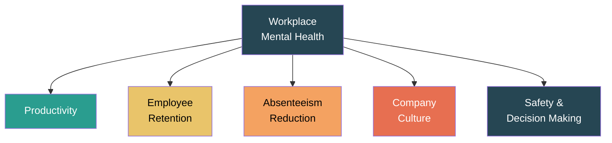

### Why Mental Health Matters at Work

| Factor | Impact of Poor Mental Health | Impact of Good Mental Health |
|--------|---------------------------|----------------------------|
| **Productivity** | Reduced output, errors, poor concentration | Higher efficiency, creativity, better output |
| **Absenteeism** | Frequent sick leaves, unexplained absences | Lower absenteeism, consistent attendance |
| **Presenteeism** | Physically present but mentally disengaged — this costs MORE than absenteeism | Engaged, motivated, focused employees |
| **Employee Turnover** | High attrition; costly to replace and retrain | Better retention, loyalty, reduced hiring costs |
| **Workplace Safety** | More accidents, poor judgment, risk-taking | Better decision-making, fewer accidents |
| **Team Dynamics** | Conflicts, isolation, communication breakdown | Collaboration, trust, positive relationships |
| **Financial Cost** | WHO estimates depression & anxiety cost $1 trillion/year globally in lost productivity | ROI: Every $1 invested in mental health returns $4 in improved health and productivity |

### Mental Health as a Continuum

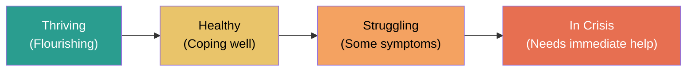

> Mental health is **not binary** (healthy vs. ill). Everyone moves along this continuum depending on life circumstances, stress, support systems, and coping mechanisms.

### Three Dimensions of Well-Being

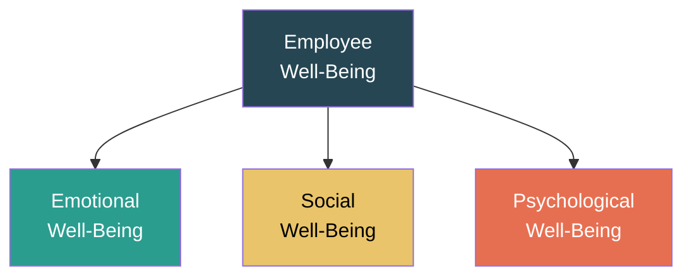

| Dimension | Description | Signs of Good Well-Being |
|-----------|-------------|-------------------------|
| **Emotional** | Ability to manage emotions, cope with stress, and maintain a positive outlook. | Emotional stability, optimism, self-awareness, ability to handle setbacks |
| **Social** | Quality of relationships, sense of belonging, ability to connect with others. | Maintaining friendships, participating in group activities, feeling of belonging, giving/receiving support, trust in others |
| **Psychological** | Sense of purpose, personal growth, autonomy, self-acceptance, and mastery over one's environment. | Feeling purposeful, continued learning, sense of independence, self-confidence |

> **Signs of Social Well-Being:** Active participation in team activities, positive relationships with colleagues, willingness to collaborate, feeling included and valued, contributing to community.

### Job Satisfaction and Mental Health

**Job satisfaction** and **mental health** have a **bidirectional relationship:**
- **Good mental health → Higher job satisfaction** — Employees who are mentally well are more engaged, find meaning in work, and report higher satisfaction.
- **High job satisfaction → Better mental health** — Fulfilling work, recognition, fair pay, and good relationships protect against anxiety and depression.
- **Poor mental health → Low job satisfaction** — Depression, anxiety, and burnout reduce enjoyment and motivation at work.
- **Low job satisfaction → Poor mental health** — Unfulfilling, stressful, or hostile work leads to anxiety, depression, and burnout.

### Resilience and Workplace Mental Health

**Resilience** is the ability to adapt, recover, and grow in the face of stress, adversity, challenges, or setbacks.

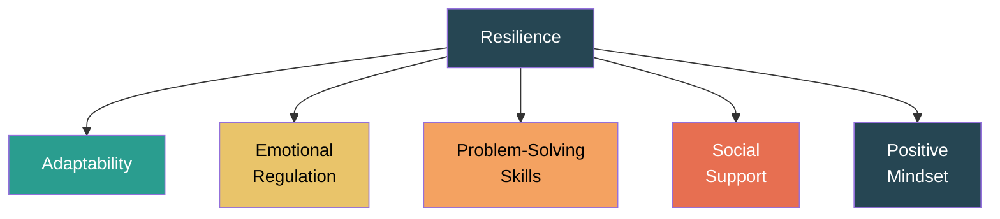

**How Resilience Helps at Work:**
- Helps employees bounce back from failures and rejections
- Reduces impact of workplace stressors
- Promotes constructive coping rather than avoidance
- Builds capacity to handle change and uncertainty

**Building Resilience — Strategies:**
- Develop a growth mindset (failures = learning, not defeat)
- Strengthen social connections and support networks
- Practice self-care (sleep, exercise, nutrition)
- Set realistic goals and break problems into steps
- Seek professional help when needed

> **Implementing a Resilience Strategy:** When organizations focus on resilience, employees develop better stress tolerance, lower burnout rates, improved adaptability to change, stronger team cohesion, and a culture where setbacks are viewed as learning opportunities rather than failures.

---

## 1.2 Common Mental Health Disorders and Their Impact

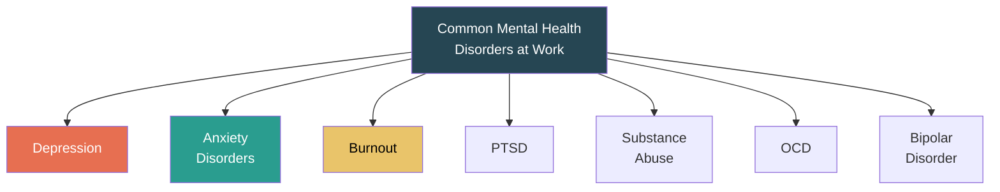

| Disorder | Key Symptoms | Workplace Impact |
|----------|-------------|-----------------|
| **Depression** | Persistent sadness, loss of interest, fatigue, difficulty concentrating, feelings of worthlessness, sleep changes | Reduced productivity, withdrawal from colleagues, increased absenteeism, poor decision-making |
| **Anxiety Disorders** | Excessive worry, restlessness, muscle tension, panic attacks, avoidance behavior, irritability | Difficulty meeting deadlines, avoiding meetings/presentations, perfectionism leading to inefficiency |
| **Burnout** | Emotional exhaustion, cynicism/detachment, reduced professional efficacy | Disengagement, high turnover, decreased work quality, resentment toward organization |
| **PTSD** | Flashbacks, nightmares, hypervigilance, avoidance, emotional numbness (triggered by traumatic events) | Difficulty focusing, avoidance of certain tasks/places, emotional outbursts, interpersonal difficulties |
| **Substance Abuse** | Dependence on alcohol/drugs to cope, tolerance, withdrawal symptoms | Impaired judgment, absenteeism, workplace accidents, strained relationships |
| **OCD** | Intrusive thoughts, repetitive behaviors/rituals, excessive checking | Time consumed by rituals, difficulty completing tasks, distress from disruption |
| **Bipolar Disorder** | Alternating episodes of mania (high energy, impulsivity) and depression | Inconsistent performance, risky decisions during mania, withdrawal during depression |

### Physical Symptoms of Anxiety (How Anxiety Manifests Physically)

| System | Physical Symptom |
|--------|----------------|
| **Cardiovascular** | Rapid heartbeat (palpitations), chest tightness, elevated blood pressure |
| **Respiratory** | Shortness of breath, hyperventilation, feeling of suffocation |
| **Gastrointestinal** | Nausea, stomach cramps, diarrhea, loss of appetite |
| **Muscular** | Muscle tension, trembling, headaches, jaw clenching |
| **Neurological** | Dizziness, light-headedness, tingling sensations, insomnia |
| **Dermatological** | Excessive sweating, hot flashes, skin rashes |

> Managers/healthcare professionals should recognize these physical signs — an employee with frequent headaches, stomach issues, or unexplained fatigue may be experiencing anxiety rather than a purely physical illness. Accommodations: flexible deadlines, quiet workspaces, breaks, and connecting them with EAPs.

### Common Myths & Misconceptions About Anxiety and Depression

| Myth | Fact |
|------|------|
| "It's just stress, not a real illness" | Anxiety and depression are clinically diagnosed mental health conditions with neurological and biological bases. |
| "They can just snap out of it" | These are not choices. Recovery requires support, coping strategies, and often professional treatment. |
| "Only weak people get depressed" | Mental illness affects people of all backgrounds, strengths, and intelligence levels. |
| "Depression = just being sad" | Depression involves persistent loss of interest, fatigue, cognitive impairment, sleep changes — far beyond sadness. |
| "Anxiety means you worry too much" | Anxiety disorders involve physiological symptoms (panic attacks, heart racing) and can be debilitating. |
| "Medication is the only treatment" | Therapy (CBT), lifestyle changes, social support, and workplace accommodations are equally important. |
| "If you can work, you're fine" | Presenteeism — working while mentally unwell — is common and costly. Performance doesn't always reflect internal suffering. |

> **As a team leader:** Don't assume, don't diagnose. Create open dialogue, avoid judgmental language, provide information about EAPs, and make accommodations without requiring employees to "prove" their condition.

### How Depression Can Be Misdiagnosed/Misunderstood at Work

- Mistaken for **laziness or lack of motivation** — depression causes fatigue and loss of interest, not laziness.
- Confused with **poor performance** — cognitive impairment from depression affects concentration and decision-making.
- Attributed to **personality** — "they're just a negative person" — when it's actually a treatable condition.
- Dismissed as **personal weakness** — prevents employees from seeking help.

### Impact on Organizations

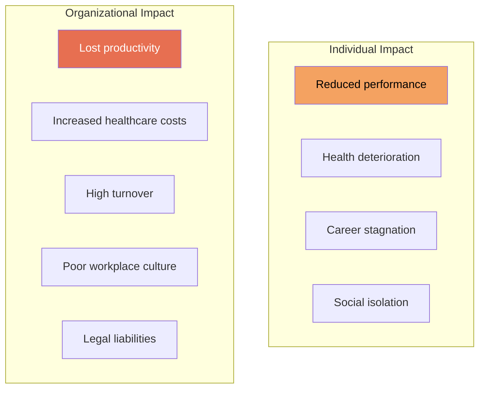

---

## 1.3 Recognizing Signs and Symptoms at the Workplace

### Categories of Warning Signs

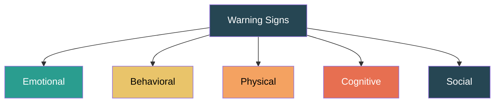

| Category | Signs to Watch For |
|----------|-------------------|
| **Emotional** | Persistent sadness, mood swings, irritability, anxiety, feeling overwhelmed, hopelessness, emotional outbursts |
| **Behavioral** | Increased absenteeism, decline in work quality, missed deadlines, withdrawal from team activities, substance use increase, working excessively (overcompensation) |
| **Physical** | Chronic fatigue, frequent headaches, unexplained aches, sleep disturbances, weight changes, neglecting personal hygiene/appearance |
| **Cognitive** | Difficulty concentrating, forgetfulness, indecisiveness, negative self-talk, inability to problem-solve, confused thinking |
| **Social** | Withdrawing from colleagues, avoiding meetings, reduced communication, conflict with coworkers, loss of interest in social activities |

### Red Flags Requiring Immediate Attention

- Talking about self-harm or suicide
- Expressing feelings of being trapped or in unbearable pain
- Giving away possessions or saying goodbye
- Extreme mood changes
- Increased use of alcohol or drugs
- Reckless behavior

> **Important:** Recognizing signs ≠ diagnosing. The goal is to notice changes and facilitate access to professional help, not to label colleagues.

### Social Withdrawal and Its Connection to Stress/Mental Health

**Social withdrawal** is the deliberate or unconscious pulling away from social interactions, relationships, and group activities. It is a key warning sign of stress, depression, and anxiety.

- **Causes:** Emotional exhaustion, feeling misunderstood, fear of judgment, low self-esteem, burnout
- **Signs at work:** Eating lunch alone, skipping team events, minimal communication, avoiding eye contact, not contributing in meetings
- **Impact:** Worsens mental health (isolation reinforces negative thoughts), reduces team cohesion, delays identification of problems
- **Response:** Gentle check-ins (not invasive), inclusive activities, buddy systems, manager awareness

---

## 1.4 Legal and Ethical Considerations

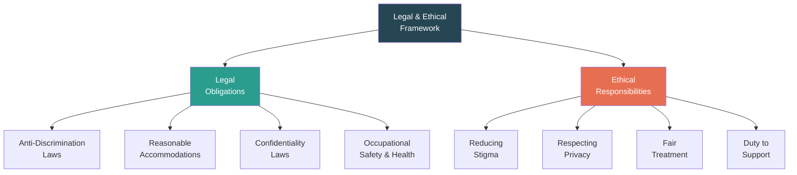

### Legal Obligations

| Area | Description |
|------|-------------|
| **Anti-Discrimination** | Mental health conditions are protected under disability discrimination laws. Employers cannot discriminate in hiring, promotion, or termination based on mental health status. (e.g., Americans with Disabilities Act, Rights of Persons with Disabilities Act 2016 - India) |
| **Reasonable Accommodations** | Employers must provide reasonable adjustments — flexible scheduling, modified duties, quiet workspaces, time off for therapy, reduced workload during recovery. |
| **Confidentiality** | Medical/mental health information is confidential. Cannot be shared without employee consent. Violation can lead to legal action. |
| **Occupational Health & Safety** | Employers have a duty to maintain a psychologically safe workplace. Bullying, harassment, and excessive stress may constitute OHS violations. |
| **Workers' Compensation** | Mental health conditions caused or aggravated by work (e.g., PTSD from workplace accident, stress from hostile environment) may qualify for compensation. |
| **Right to Disconnect** | Emerging legislation in some countries granting employees the right to not engage with work communications outside office hours. |

### Ethical Responsibilities

| Responsibility | Description |
|---------------|-------------|
| **Non-Stigmatization** | Create an environment where seeking help is normalized, not penalized. |
| **Privacy & Dignity** | Respect employee's right to decide what to disclose. Never pressure disclosure. |
| **Informed Consent** | Any mental health programs or assessments must be voluntary with clear information about data use. |
| **Fair Treatment** | Decisions about work assignments, promotions, and evaluations should not be influenced by mental health status. |
| **Duty of Care** | Managers have an ethical obligation to support employees showing signs of distress and to connect them with resources. |
| **Inclusive Policies** | Mental health policies should be inclusive of all employees regardless of role, seniority, gender, or background. |

### Duty of Care — Detailed Definition and Breach Example

**Duty of Care** is the legal and ethical obligation of an employer to take reasonable steps to ensure the health, safety, and well-being of employees — including their **mental health**.

**Example of a Duty of Care Breach:**
> A manager repeatedly observes an employee showing signs of severe stress — missing deadlines, frequent absences, visible anxiety. Instead of offering support or referring to the EAP, the manager ignores the signs and increases the employee's workload to "toughen them up." The employee eventually suffers a mental breakdown and is hospitalized. This constitutes a breach of duty of care — the manager failed to act despite recognizing warning signs and made the situation worse.

**Consequences of breach:** Legal liability, compensation claims, reputational damage, regulatory penalties, loss of employee trust.

### Consequences of Breaching Confidentiality

If an employee's mental health information is disclosed without consent:
- **Legal consequences** — lawsuits, regulatory fines, violation of data protection laws
- **Loss of trust** — the affected employee and others will not disclose issues in the future
- **Stigma and discrimination** — the employee may face judgment, exclusion, or career damage
- **Psychological harm** — the breach itself can worsen the employee's mental health
- **Organizational impact** — damaged reputation, reduced effectiveness of mental health programs

### Psychological Safety

A **psychologically safe** workplace is one where employees feel safe to take risks, voice opinions, ask questions, and admit mistakes **without fear of punishment or humiliation**.

**Benefits:** Encourages help-seeking, fosters innovation, improves team learning, reduces hiding of mental health struggles, increases engagement.

---

# Chapter 2: Creating a Supportive Work Environment

---

## 2.1 Promoting Mental Health and Well-Being

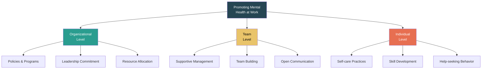

### Organizational Initiatives for Mental Health Promotion

| Initiative | Description |
|-----------|-------------|
| **Employee Assistance Programs (EAPs)** | Confidential counseling and referral services for employees and their families. Covers personal, work-related, and psychological issues. |
| **Mental Health Days** | Designated paid leave specifically for mental health recovery, separate from sick leave. |
| **Wellness Programs** | Yoga, meditation, fitness classes, mindfulness workshops, nutrition counseling offered at or through the workplace. |
| **Flexible Work Arrangements** | Remote work options, flexible hours, compressed work weeks — reduce commute stress and enable better personal management. |
| **Workload Management** | Regular assessment of employee workloads to prevent burnout. Realistic deadlines and adequate staffing. |
| **Training & Awareness** | Regular workshops on mental health literacy, stress management, and resilience for all employees. |
| **Peer Support Programs** | Trained peer supporters (Mental Health First Aiders) who can provide initial support and guide colleagues to professional help. |
| **Safe Reporting Mechanisms** | Anonymous channels to report workplace bullying, harassment, or excessive stress without fear of retaliation. |

### Mental Health Literacy

**Mental health literacy** is the knowledge and understanding of mental health conditions that aids in their recognition, management, and prevention. It includes:
- Ability to recognize disorders and their symptoms
- Knowledge of how to seek help and available treatments
- Understanding of risk factors and causes
- Attitudes that promote recognition and help-seeking (reducing stigma)

> Higher mental health literacy among employees → earlier identification of issues → reduced stigma → better help-seeking behavior → improved retention and productivity.

### Motivation and Workplace Mental Health

**Motivation** is the internal drive that directs behavior toward goals. It is closely linked to mental health:
- **Good mental health → Higher motivation** — employees feel energized, purposeful, and engaged
- **Poor mental health → Low motivation** — depression, anxiety, and burnout drain motivation
- **Low motivation → Worsening mental health** — disengagement and lack of purpose feed negative thoughts

**Applying Motivation in Real Workplace Scenarios:**
- Set achievable, meaningful goals (SMART goals)
- Provide regular recognition and positive feedback
- Offer growth opportunities (training, promotions, new challenges)
- Ensure autonomy — let employees have control over how they do their work
- Connect individual work to organizational purpose ("your work matters because...")

### Emotional Intelligence (EI) in Managing Mental Health

**Emotional Intelligence** is the ability to recognize, understand, manage, and effectively express one's own emotions and to engage with the emotions of others.

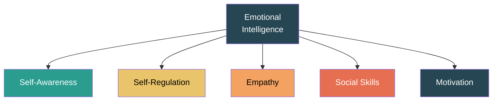

| EI Component | Role in Mental Health Management |
|-------------|----------------------------------|
| **Self-Awareness** | Recognize your own stress triggers and emotional states |
| **Self-Regulation** | Manage emotional responses; don't react impulsively under stress |
| **Empathy** | Understand colleagues' emotional states; notice when someone is struggling |
| **Social Skills** | Communicate sensitively about mental health; resolve conflicts constructively |
| **Motivation** | Maintain internal drive despite setbacks; inspire others |

---

## 2.2 Fostering a Positive Work Culture and Reducing Stigma

### Understanding Stigma

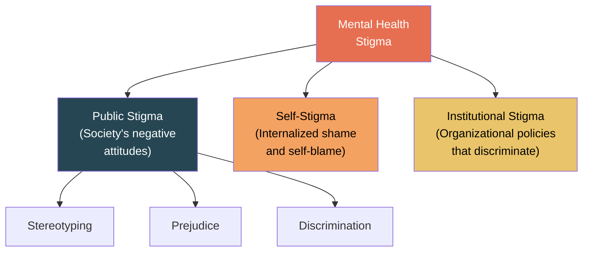

| Type of Stigma | How It Manifests at Work |
|---------------|------------------------|
| **Public Stigma** | Colleagues avoiding or gossiping about someone with mental health issues; belief that they are "weak" or "unreliable." |
| **Self-Stigma** | Employee hides their condition, doesn't seek help, feels ashamed — leading to worsening symptoms. |
| **Institutional Stigma** | Lack of mental health policies, no accommodations, insurance not covering mental health, penalizing mental health leave. |

### Strategies to Reduce Stigma and Foster Positive Culture

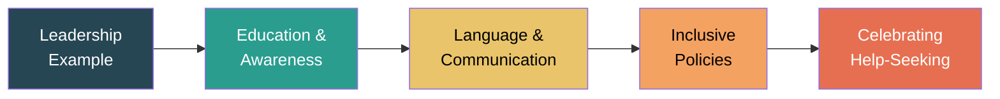

| Strategy | How to Implement |
|----------|-----------------|
| **Leadership sets the tone** | Senior leaders openly discussing mental health, sharing their own experiences, endorsing programs. |
| **Education & Training** | Mandatory mental health awareness sessions for all staff; specialized training for managers. |
| **Language matters** | Use person-first language ("person with depression" not "depressed person"). Avoid trivializing ("just cheer up"). |
| **Normalize conversations** | Regular team check-ins about well-being, not just work. Mental health as a standing agenda item. |
| **Celebrate help-seeking** | Publicly acknowledge that seeking help is a sign of strength. Share success stories (with consent). |
| **Anti-bullying policies** | Zero-tolerance for bullying, harassment, and discrimination. Clear consequences. |
| **Inclusive team activities** | Social events that are inclusive (not just drinking events), team wellness challenges, volunteering. |
| **Mental Health Champions** | Designate trained volunteers across departments who advocate for mental health and act as first points of contact. |

### Zero-Tolerance for Workplace Bullying — HR Steps

1. **Define bullying clearly** — verbal abuse, intimidation, exclusion, sabotage, cyber-bullying. Put it in writing.
2. **Establish a reporting system** — anonymous hotlines, online forms, designated point of contact. Multiple channels.
3. **Investigate promptly** — all complaints must be investigated fairly and within a set timeframe.
4. **Enforce consequences** — warnings, mandatory training, suspension, termination based on severity. No exceptions for seniority.
5. **Protect the complainant** — anti-retaliation policy. Ensure confidentiality and no negative career impact for reporting.
6. **Train all employees** — regular anti-bullying training. Teach bystander intervention.
7. **Train managers** — managers must be able to recognize bullying and act immediately.
8. **Monitor and review** — regular climate surveys, exit interviews, track complaint trends. Adjust policies based on data.
9. **Support victims** — provide access to counseling (EAP), allow schedule adjustments, ensure a safe workspace.
10. **Lead from the top** — leadership must publicly endorse zero-tolerance and model respectful behavior.

### Diversity, Inclusion, and Workplace Mental Health

- **Diverse workplaces** must address different mental health experiences across genders, cultures, disabilities, and backgrounds.
- **Inclusive policies** ensure mental health support is accessible and relevant to all (e.g., culturally sensitive counseling, multilingual resources).
- **Exclusion and discrimination** are major workplace stressors that directly harm mental health.
- **Belonging** — feeling included and valued is protective against depression and anxiety.

---

## 2.3 Implementing Policies, Procedures, and Resources

### Essential Workplace Mental Health Policies

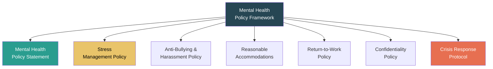

| Policy | Key Elements |
|--------|-------------|
| **Mental Health Policy Statement** | Organization's commitment to mental health; scope, responsibilities, and review process. |
| **Stress Management Policy** | Risk assessment for workplace stressors, intervention strategies, monitoring mechanisms. |
| **Anti-Bullying & Harassment** | Clear definitions, reporting procedures, investigation process, consequences, support for victims. |
| **Reasonable Accommodations** | Request process, types of accommodations (flexible hours, modified duties, quiet space), review and confidentiality. |
| **Return-to-Work** | Phased return plans after mental health leave; support, modified workload, regular check-ins, no penalty for absence. |
| **Confidentiality** | How mental health data is stored, who has access, limits of confidentiality, consent procedures. |
| **Crisis Response** | Steps to follow when an employee is in acute distress; emergency contacts, trained responders, post-incident support. |

### Resources and Support for Employees

| Resource | Description |
|----------|-------------|
| **EAP (Employee Assistance Program)** | Free, confidential, short-term counseling (typically 6-8 sessions) covering personal, family, and work issues. |
| **In-house Counselors** | On-site mental health professionals available during work hours. |
| **External Referral Networks** | Partnerships with hospitals, psychiatrists, and therapists for specialized care. |
| **Helplines & Crisis Lines** | 24/7 helplines (e.g., iCall, Vandrevala Foundation in India, 988 Suicide Lifeline in US). |
| **Self-Help Resources** | Apps (Headspace, Calm), online CBT programs, psychoeducation materials, book libraries. |
| **Support Groups** | Peer-led or professionally facilitated groups for shared experiences (e.g., anxiety support group, grief group). |
| **Financial Wellness Programs** | Financial counseling and planning, since financial stress is a major mental health trigger. |

---

# Chapter 3: Procrastination, Stress, and Work-Life Balance

---

## 3.1 Understanding Procrastination and Its Types

**Procrastination** is the voluntary, unnecessary delay of an intended action despite knowing that the delay will likely lead to negative consequences.

> Procrastination is NOT laziness. It is often an **emotional regulation problem** — people procrastinate to avoid negative emotions (anxiety, boredom, frustration) associated with a task.

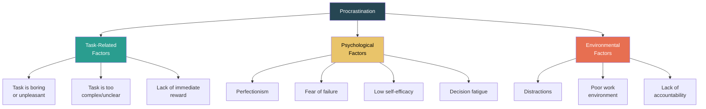

### Types of Procrastinators

| Type | Description | Example |
|------|-------------|---------|
| **The Perfectionist** | Delays because afraid the work won't be good enough. Sets impossibly high standards. | Won't submit the report until it's "perfect" — so never submits. |
| **The Dreamer** | Has big ideas but struggles with details and execution. Avoids practical steps. | Plans an amazing project but never starts the actual work. |
| **The Avoider** | Avoids tasks due to fear of failure or fear of success (and the expectations it brings). | Delays applying for a promotion because of fear of rejection. |
| **The Crisis-Maker** | Deliberately waits until the last minute; claims to work best under pressure. | Starts the assignment the night before the deadline. |
| **The Busy Procrastinator** | Fills time with low-priority tasks to avoid the important, difficult ones. | Organizes desk, checks emails, makes lists — but never does the core work. |
| **The Indecisive** | Can't decide how to approach a task, so doesn't start at all. Paralysis by analysis. | Spends hours researching the "best" method instead of starting any method. |

### Consequences of Procrastination at Work

- **Missed deadlines** and reduced work quality
- **Increased stress and anxiety** (pressure accumulates)
- **Damaged professional reputation** and lost opportunities
- **Strained relationships** with colleagues who depend on your work
- **Health problems** — sleep deprivation, burnout, chronic stress
- **Guilt-procrastination cycle** — guilt from procrastinating leads to more avoidance

### Strategies to Overcome Procrastination

| Strategy | How It Works |
|----------|-------------|
| **Break tasks down** | Divide large tasks into small, manageable steps. Focus on just the next step. |
| **2-Minute Rule** | If a task takes less than 2 minutes, do it immediately. |
| **Pomodoro Technique** | Work for 25 minutes, break for 5 minutes. Repeat. Longer break after 4 cycles. |
| **Set deadlines** | Create artificial deadlines before the real one. Share them with someone for accountability. |
| **Eat the Frog** | Do the hardest/most dreaded task first thing in the morning. |
| **Remove distractions** | Phone on silent, close social media, use website blockers (Cold Turkey, Freedom). |
| **Self-compassion** | Forgive yourself for procrastinating instead of spiraling into guilt. Research shows self-compassion reduces future procrastination. |
| **Reward system** | Reward yourself after completing a task (small treat, break, fun activity). |
| **Accountability partner** | Tell someone your goal and deadline. Regular check-ins create external motivation. |

---

## 3.2 Identifying Common Workplace Stressors and Their Impact

### What is Stress?

**Stress** is the body's response to any demand or challenge. It can be:
- **Eustress** (positive stress) — motivating, enhances performance (e.g., healthy deadline pressure)
- **Distress** (negative stress) — overwhelming, harms health and performance

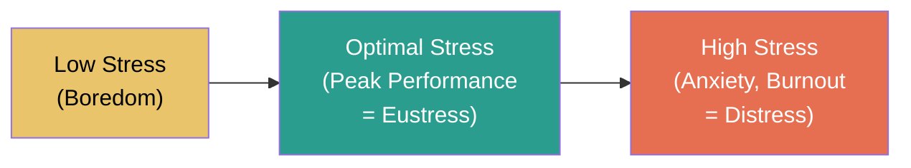

> This is the **Yerkes-Dodson Law** — performance increases with stress up to an optimal point, then declines sharply.

### Common Workplace Stressors

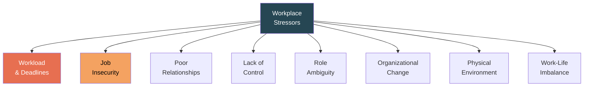

| Stressor | Description | Impact |
|----------|-------------|--------|
| **Excessive Workload** | Unrealistic deadlines, long hours, too many responsibilities | Burnout, fatigue, errors, health issues |
| **Job Insecurity** | Fear of layoffs, contract uncertainty, organizational restructuring | Anxiety, reduced motivation, presenteeism |
| **Poor Relationships** | Conflict with colleagues, toxic manager, bullying, lack of support | Isolation, dread of going to work, depression |
| **Lack of Control** | No autonomy over tasks, methods, or schedule; micro-management | Helplessness, frustration, disengagement |
| **Role Ambiguity / Conflict** | Unclear job expectations, conflicting demands from multiple managers | Confusion, stress, reduced performance |
| **Organizational Change** | Mergers, restructuring, new technology, leadership changes | Uncertainty, resistance, anxiety |
| **Poor Physical Environment** | Noise, poor lighting, uncomfortable seating, open-plan offices | Distraction, physical discomfort, irritability |
| **Work-Life Imbalance** | Work encroaching on personal/family time, inability to disconnect | Relationship problems, guilt, resentment, burnout |
| **Lack of Recognition** | Efforts go unnoticed; no appreciation, no growth opportunities | Demotivation, disengagement, looking for other jobs |
| **Discrimination / Harassment** | Gender, racial, or other bias; sexual harassment; hostile environment | Severe psychological distress, PTSD, exit |

### Stages of Stress Response (General Adaptation Syndrome — Hans Selye)

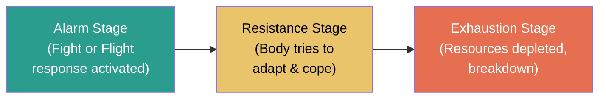

| Stage | What Happens |
|-------|-------------|
| **Alarm** | Body detects stressor → releases adrenaline & cortisol → heart rate ↑, blood pressure ↑, energy ↑ (fight-or-flight) |
| **Resistance** | If stress continues, body attempts to adapt. Performance may seem normal but internal resources are being used up. |
| **Exhaustion** | Prolonged stress → body's resources are depleted → physical/mental breakdown, illness, burnout, depression |

### Physical and Behavioral Effects of Stress

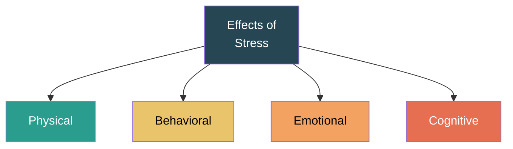

| Category | Effects |
|----------|--------|
| **Physical** | Headaches, muscle tension, fatigue, insomnia, weakened immune system, high blood pressure, digestive issues, weight changes, increased heart rate |
| **Behavioral** | Absenteeism, substance abuse (alcohol/drugs/smoking), social withdrawal, aggression, reduced performance, overeating or under-eating, neglecting responsibilities |
| **Emotional** | Irritability, mood swings, anxiety, depression, feeling overwhelmed, helplessness, low self-esteem, emotional outbursts, apathy |
| **Cognitive** | Poor concentration, forgetfulness, indecisiveness, racing thoughts, negative thinking, difficulty problem-solving |

**Impact on Interpersonal Relationships:**
- Irritability leads to conflicts with family, friends, and colleagues
- Emotional withdrawal damages trust and intimacy
- Low patience and increased aggression strain team dynamics
- Communication breakdown — stressed individuals may stop sharing or become overly critical

---

## 3.3 Techniques for Managing Stress and Promoting Work-Life Balance

### Individual Stress Management Techniques

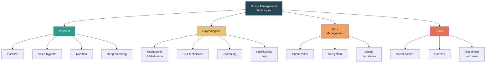

| Category | Technique | How It Helps |
|----------|-----------|-------------|
| **Physical** | Regular exercise (30 min/day) | Releases endorphins, reduces cortisol, improves sleep |
| | Adequate sleep (7-9 hrs) | Restores cognitive function, emotional regulation |
| | Healthy nutrition | Stable energy, mood regulation, reduced anxiety |
| | Deep breathing / Progressive muscle relaxation | Activates parasympathetic nervous system (calming) |
| **Psychological** | Mindfulness & Meditation | Present-moment awareness, reduces rumination |
| | Cognitive reframing (CBT) | Challenge negative thought patterns; replace with realistic ones |
| | Journaling | Process emotions, identify patterns, gain perspective |
| | Seeking professional help | Therapy (CBT, counseling) for persistent issues |
| **Time Management** | Eisenhower Matrix (Urgent vs Important) | Prioritize tasks effectively; stop spending time on unimportant tasks |
| | Learn to say "No" | Set boundaries to prevent overcommitment |
| | Delegate | Trust others with tasks; focus on what only you can do |
| **Social** | Talk to someone | Social support is one of the strongest buffers against stress |
| | Pursue hobbies | Activities outside work restore energy and identity |
| | Digital detox | Scheduled time away from screens and work communications |

### The Eisenhower Matrix

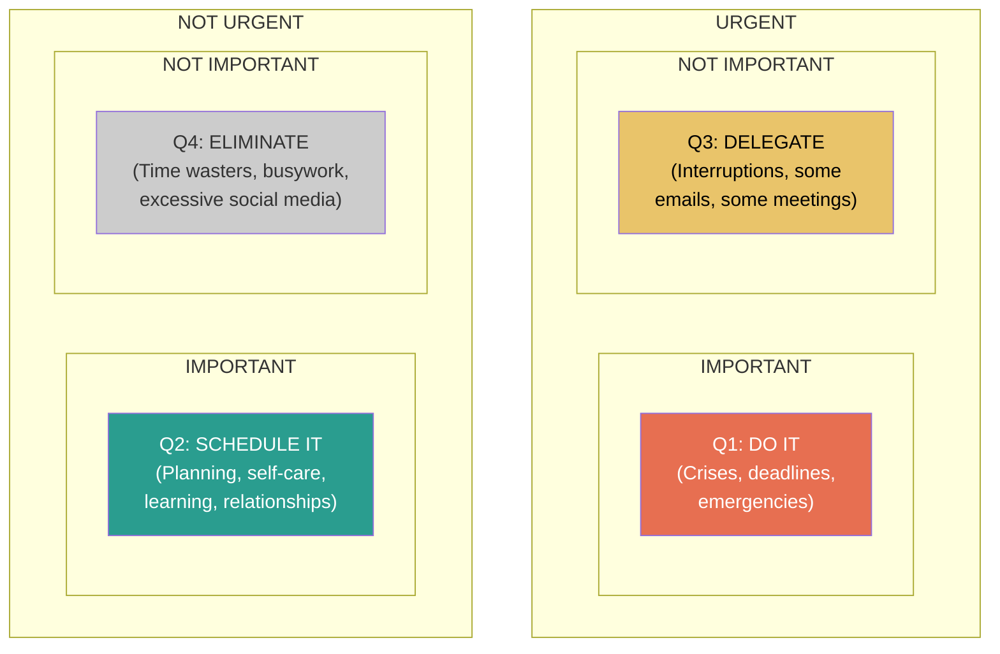

> **Key Insight:** Most people spend too much time in Q1 (firefighting) and Q3 (distractions). Effective stress management means spending MORE time in **Q2** (prevention, planning, self-care).

### Organizational Stress Management Interventions

| Level | Intervention |
|-------|-------------|
| **Primary (Prevention)** | Redesign jobs, reduce workload, improve work conditions, increase autonomy, clarify roles |
| **Secondary (Coping)** | Stress management training, resilience workshops, mindfulness programs, fitness facilities |
| **Tertiary (Treatment)** | EAPs, counseling, rehabilitation programs, return-to-work support for those already affected |

### Coping Mechanisms

A **coping mechanism** is a strategy or behavior used to manage, tolerate, or reduce the effects of stress.

```mermaid
graph TD
    CM["Coping<br>Mechanisms"] --> PF["Problem-Focused"]
    CM --> EF["Emotion-Focused"]
    CM --> AF["Avoidance-Focused"]
    style CM fill:#264653,color:#fff
    style PF fill:#2a9d8f,color:#fff
    style EF fill:#e9c46a,color:#000
    style AF fill:#e76f51,color:#fff
```

| Type | Definition | Examples | Effectiveness |
|------|-----------|----------|---------------|
| **Problem-Focused** | Directly addresses the source of stress by changing the situation. | Time management, seeking information, creating a plan, asking for help, delegating tasks, negotiating deadlines | ✅ Most effective when the situation IS within your control |
| **Emotion-Focused** | Manages the emotional response to stress (not the stressor itself). | Meditation, deep breathing, journaling, talking to a friend, reframing thoughts, exercise, humor | ✅ Most effective when the situation is NOT within your control |
| **Avoidance-Focused** | Avoids dealing with the stressor altogether. | Denial, substance use, excessive sleeping, distraction, procrastination, withdrawal | ❌ Generally least effective; provides temporary relief but worsens long-term outcomes |

**Examples of Positive Coping Mechanisms:** Exercise, mindfulness, social support, journaling, creative outlets, structured problem-solving, seeking therapy.

**Examples of Negative Coping Mechanisms:** Substance abuse, overeating, social isolation, aggression, denial, excessive screen time.

> In the workplace, **problem-focused** coping is most effective because many stressors (workload, deadlines, unclear roles) can be addressed through action. However, **emotion-focused** coping is essential for situations beyond individual control (organizational changes, industry downturns).

### Time Management for Stress Reduction

**Time management** in the context of stress reduction refers to the conscious planning and control of time spent on specific activities to increase efficiency and reduce the feeling of being overwhelmed.

**Key Elements:**
- **Prioritization** — Eisenhower Matrix, ABCDE method (rank tasks by importance)
- **Goal Setting** — SMART goals (Specific, Measurable, Achievable, Relevant, Time-bound)
- **Planning** — Daily/weekly schedules, to-do lists, calendar blocking
- **Delegation** — Identify tasks others can handle
- **Saying No** — Decline non-essential commitments
- **Avoiding Multitasking** — Focus on one task at a time for better quality and less stress
- **Buffer Time** — Schedule breaks between tasks; account for unexpected delays

---

## 3.4 Supporting Employees in Maintaining Healthy Work-Life Integration

### Work-Life Balance vs Work-Life Integration

| Work-Life Balance | Work-Life Integration |
|---|---|
| Clear boundaries between work and personal life | Fluid blending of work and personal responsibilities |
| "Leave work at work" approach | Flexibility to handle both as needed throughout the day |
| Works well with fixed schedules & physical offices | Better suited for remote/hybrid work and flexible roles |
| Risk: rigid, may not suit all industries | Risk: boundaries can blur, leading to "always on" mode |

### Strategies for Healthy Work-Life Integration

```mermaid
graph TD
    WLI["Work-Life<br>Integration"] --> FLEX["Flexible<br>Scheduling"]
    WLI --> BOUND["Clear<br>Boundaries"]
    WLI --> TECH["Technology<br>Discipline"]
    WLI --> CULT["Supportive<br>Culture"]
    WLI --> SELF["Self-Care<br>Priority"]
    FLEX --> F1["Flexible hours"]
    FLEX --> F2["Remote options"]
    FLEX --> F3["Compressed weeks"]
    BOUND --> B1["Log-off times"]
    BOUND --> B2["No-meeting blocks"]
    BOUND --> B3["Vacation policy"]
    TECH --> T1["Notification management"]
    TECH --> T2["Email batching"]
    TECH --> T3["Right to disconnect"]
    style WLI fill:#264653,color:#fff
    style FLEX fill:#2a9d8f,color:#fff
    style BOUND fill:#e9c46a,color:#000
    style TECH fill:#f4a261,color:#000
    style CULT fill:#e76f51,color:#fff
```

| Strategy | Implementation |
|----------|---------------|
| **Flexible Scheduling** | Core hours (e.g., 10am-3pm mandatory, rest flexible), job sharing, part-time options |
| **Clear Boundaries** | Establish "log-off" time; managers should not send emails after hours; no-meeting Fridays |
| **Leave Policies** | Generous PTO, parental leave, sabbaticals, mental health days (no questions asked) |
| **Manager Training** | Train managers to recognize overwork, respect boundaries, and model healthy behavior |
| **Results-Oriented Culture** | Focus on output/quality, not hours at desk. Trust employees to manage their time. |
| **Family-Friendly Policies** | On-site childcare, nursing rooms, family event invitations, dependent care support |
| **Workload Audits** | Regular reviews of team capacity. Hire when needed instead of stretching existing employees. |
| **Encouraging PTO Use** | Some companies mandate minimum vacation use; unlimited PTO policies need cultural backing. |

### Signs of Poor Work-Life Balance in Employees

- Consistently working late or on weekends
- Not taking vacation days or PTO
- Declining social invitations and family events
- Physical symptoms: chronic fatigue, headaches, insomnia
- Expressing guilt about not working when off
- Irritability, emotional exhaustion, cynicism
- Decline in work quality despite increased hours

> **Manager's Role:** Proactively check in, model healthy behavior (take your own vacation, leave on time), and redistribute work before employees burn out.

---
