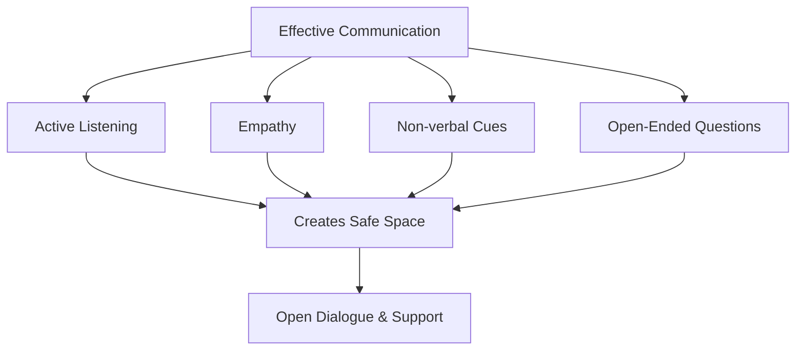
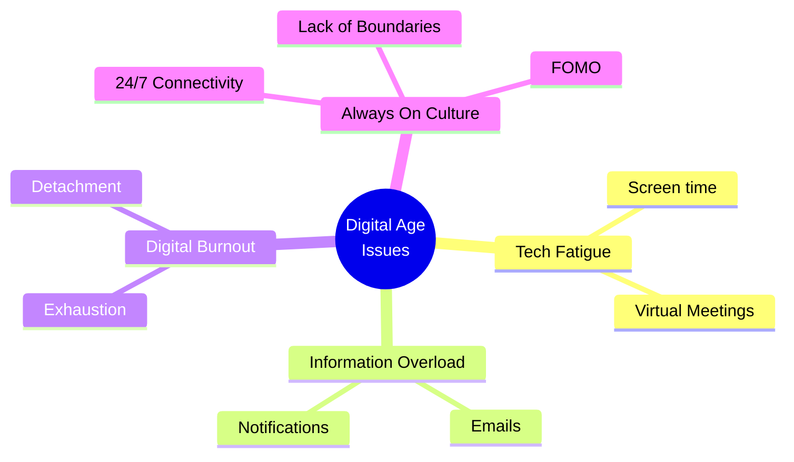
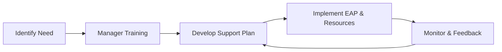

# Workplace Mental Health - ISE 2 Notes

## Chapter 4: Mental Health Awareness and Communication Skills

### 4.1 Enhancing mental health literacy and awareness among employees
Mental health literacy refers to knowledge and beliefs about mental disorders which aid their recognition, management, or prevention.
In the workplace, it involves:
- **Understanding:** Knowing how to foster and maintain good mental health.
- **Recognizing:** Identifying signs and symptoms of mental ill-health in oneself and colleagues.
- **Seeking Help:** Knowing when and where to seek professional help.
- **Reducing Stigma:** Cultivating attitudes that decrease the stigma attached to mental illness.

**Ways to Enhance Literacy:**
- Workshops and Seminars by mental health professionals.
- Circulating informative newsletters and resources.
- Integrating mental health training into onboarding programs.

### 4.2 Developing effective communication skills related to mental health discussions and Facilitating open dialogue
Effective communication is key to destigmatizing mental health and providing support.

**Key Communication Skills:**
- **Active Listening:** Fully concentrating, understanding, responding, and remembering what the speaker is saying without judgment.
- **Empathy:** Trying to understand the colleague's feelings and perspective. Avoid saying "I know exactly how you feel" but rather "I can see this is difficult for you."
- **Non-verbal Communication:** Being mindful of body language, eye contact, and tone of voice.
- **Asking Open-Ended Questions:** Encouraging the person to share more (e.g., "How have you been feeling lately?" instead of "Are you okay?").

**Facilitating Open Dialogue:**
- Leaders sharing their own challenges or the importance of mental well-being to lead by example.
- Creating "safe spaces" where employees feel they won't be judged.

### 4.3 Addressing failure, rejection, and criticism at workplace
Handling negative experiences is crucial for mental resilience.

- **Reframing Failure:** Viewing failure not as a reflection of self-worth but as a learning opportunity (Growth Mindset).
- **Managing Rejection:** Acknowledging the disappointment but not letting it derail career objectives.
- **Constructive Criticism vs. Destructive Criticism:** 
  - Constructive: Specific, actionable, focused on the work, not the person.
  - Destructive: Vague, personal attacks.
- **Taking Feedback:** Listening actively, taking time to process before responding, and extracting actionable points to improve.

## Chapter 5: Digital Age and Mental Health

### 5.1 Tech fatigue, information overload, digital burnout
- **Tech Fatigue:** A state of exhaustion stemming from the persistent use of digital tools, screens, and virtual meetings (e.g., "Zoom fatigue").
- **Information Overload:** Exposure to or provision of too much information or data, leading to decision paralysis and anxiety.
- **Digital Burnout:** A specific form of burnout caused by prolonged and excessive use of digital devices, leading to emotional, physical, and mental exhaustion.

### 5.2 Impact of remote/hybrid work on mental health
**Positive Impacts:**
- Flexibility and lack of commute.
- Potential for better work-life balance.

**Negative Impacts:**
- **Isolation and Loneliness:** Lack of casual watercooler conversations and physical presence.
- **Blurring of Boundaries:** Difficulty separating work time from personal time, leading to longer working hours.

### 5.3 Fear of missing out (FOMO), 24/7 connectivity, "always on" culture
- **FOMO in Workplace:** Anxiety that an exciting or interesting event may currently be happening elsewhere, often aroused by posts seen on social media or communication platforms.
- **"Always On" Culture:** The expectation that employees should be accessible and responsive to work-related communications outside of regular working hours.
- **Impacts:** Chronic stress, sleep deprivation, and inability to detach and recover.

### 5.4 Cyberbullying, workplace WhatsApp stress, email anxiety: Case Studies
- **Cyberbullying:** Use of electronic communication to bully a person, typically by sending messages of an intimidating or threatening nature.
- **WhatsApp Stress/Email Anxiety:** The pressure to reply immediately, anxiety caused by the tone of written messages (which can be easily misinterpreted), and the sheer volume of messages.

**Case Study Scenarios:**
- *Scenario 1:* An employee feels pressured by their manager who sends WhatsApp messages at 10 PM.
- *Scenario 2:* Passive-aggressive emails copying upper management (CC-ing) used as a tool to undermine a colleague.

## Chapter 6: Mental Health Support and Sustainable Development Goals

### 6.1 Identifying available mental health resources and services
Organizations must clearly outline and provide access to resources:
- **Employee Assistance Programs (EAPs):** Confidential support services offered by employers.
- **Health Insurance:** Coverage for therapy, counseling, and psychiatric care.
- **In-house Counselors:** On-site mental health professionals.
- **Wellness Apps:** Subscriptions to meditation and mindfulness apps (e.g., Headspace, Calm).

### 6.2 Developing an organizational mental health support plan; Training managers
A structured approach to support mental health globally within the organization.

**Support Plan Components:**
- Clear policies on mental health and anti-discrimination.
- Preventive measures (e.g., managing workloads).
- Accommodations for those returning from mental health leave.

**Training for Managers:**
- Managers are often the first line of defense.
- Training them to recognize signs, initiate conversations safely, and guide employees to appropriate resources (without acting as therapists themselves).

### 6.3 Accessing external support networks and community resources
Employers should not only rely on internal resources but also guide employees to external help if needed:
- National helplines (e.g., suicide prevention lifelines).
- Support groups (local or online).
- Specialized non-profits dealing with specific issues (addiction, domestic violence).

### 6.4 Sustainable Development Goals - 3 (Health) and 8 (Decent Work for all)
The United Nations' Sustainable Development Goals (SDGs) interlink with workplace mental health:
- **SDG 3 (Good Health and Well-being):** Ensure healthy lives and promote well-being for all at all ages. This explicitly includes promoting mental health.
- **SDG 8 (Decent Work and Economic Growth):** Promote sustained, inclusive and sustainable economic growth, full and productive employment and decent work for all. Decent work involves a safe working environment that does not harm mental health.

By prioritizing workplace mental health, organizations directly contribute to these global goals.
