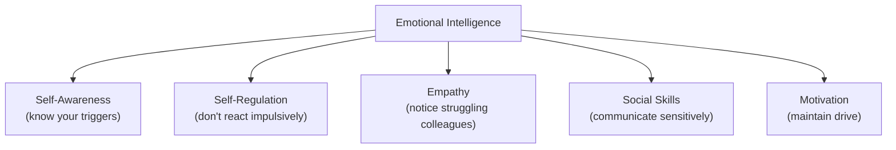
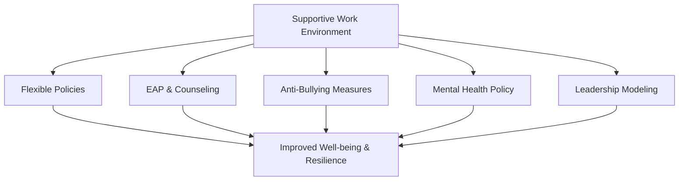
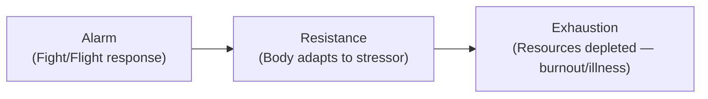
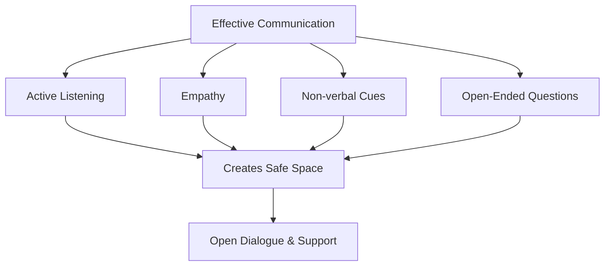
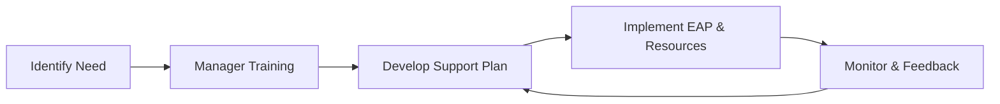
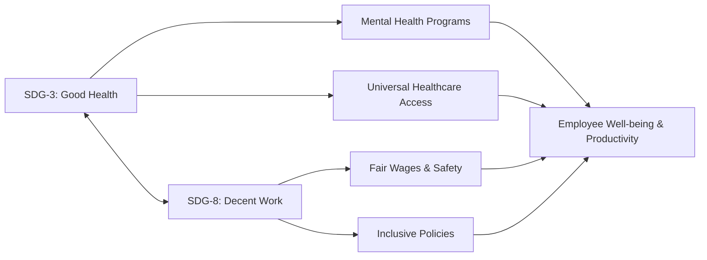

# WPMH ESE Notes

---

## CO1 — Introduction to Mental Health at the Workplace

### What is Workplace Mental Health?
- **WHO Definition:** A state of well-being where an individual realizes their abilities, copes with normal stresses, works productively, and contributes to community.
- **Continuum:** Thriving → Healthy → Struggling → In Crisis (everyone moves along it)
- Good mental health → higher productivity, lower absenteeism, better job satisfaction.

### Why It Matters at Work
- **Presenteeism** (present but disengaged) costs MORE than absenteeism
- WHO: $1 trillion/yr lost globally; $1 invested in MH → $4 returned
- Poor MH → reduced output, high turnover, workplace accidents

### Three Dimensions of Well-Being

| Dimension | Key Aspects |
|---|---|
| **Emotional** | Managing emotions, coping with stress, optimism, self-awareness |
| **Social** | Relationships, belonging, collaboration, trust, supporting others |
| **Psychological** | Sense of purpose, personal growth, autonomy, self-acceptance |

> Signs of Social Well-Being: participating in team activities, positive relationships, willingness to collaborate, feeling included/valued.

### Common Mental Health Disorders

| Disorder | Key Symptoms | Workplace Impact |
|---|---|---|
| **Depression** | Persistent sadness, fatigue, loss of interest | Reduced productivity, withdrawal, absenteeism |
| **Anxiety** | Excessive worry, panic attacks, avoidance | Avoiding meetings, perfectionism, missed deadlines |
| **Burnout** | Exhaustion, cynicism, reduced efficacy | Disengagement, high turnover |
| **PTSD** | Flashbacks, hypervigilance, emotional numbness | Avoidance, difficulty focusing, outbursts |
| **OCD** | Repetitive rituals, excessive checking | Time consumed → team productivity loss |
| **Bipolar** | Mania ↔ Depression cycles | Inconsistent performance, risky decisions |

**Physical Symptoms of Anxiety:** rapid heartbeat, chest tightness, headaches, nausea, muscle tension, insomnia, dizziness, sweating.

### Myths vs Facts

| Myth | Fact |
|---|---|
| "Just stress, not real" | Clinically diagnosed, biological basis |
| "They can snap out of it" | Not a choice; needs support & treatment |
| "Only weak people get it" | Affects everyone regardless of strength |
| "Depression = sadness only" | Also fatigue, cognitive impairment, sleep changes |
| "If they can work, they're fine" | Presenteeism is real and costly |

**Depression misdiagnosed as:** laziness, poor performance, personality trait → prevents help-seeking.

### Recognizing Signs at Work

| Category | Signs |
|---|---|
| Emotional | Sadness, mood swings, irritability, hopelessness |
| Behavioral | Absenteeism, declining quality, overworking |
| Physical | Fatigue, headaches, sleep issues |
| Cognitive | Poor concentration, forgetfulness, negative self-talk |
| Social | Withdrawal, avoiding meetings, conflict with coworkers |

**Social Withdrawal:** eating alone, skipping events, minimal communication → worsens MH through isolation.

### Legal & Ethical Considerations

| Legal | Key Point |
|---|---|
| Anti-Discrimination | Can't discriminate based on MH status (ADA, RPWD Act 2016) |
| Reasonable Accommodations | Flexible hours, modified duties, quiet spaces |
| Confidentiality | MH info is confidential; sharing without consent = legal action |
| Duty of Care | Employer must protect psychological safety |
| Right to Disconnect | Emerging laws on after-hours communication |

- **Duty of Care Breach Example:** Manager sees severe stress signs → ignores & increases workload → breakdown → breach. Consequences: legal liability, damaged trust.
- **Confidentiality Breach:** Lawsuits, stigma, worsened MH, damaged reputation.
- **Psychological Safety:** Feeling safe to take risks, voice opinions, admit mistakes without fear of punishment.

### Resilience
- **Definition:** Ability to adapt, recover, and grow from adversity.
- **Components:** Adaptability, emotional regulation, problem-solving, social support, positive mindset.
- **Building:** Growth mindset, social connections, self-care, realistic goals, professional help.

### Job Satisfaction ↔ Mental Health
Bidirectional: Good MH → higher satisfaction → better MH. They reinforce each other.

---

## CO2 — Creating a Supportive Work Environment

### Three Levels of Promotion

| Level | Examples |
|---|---|
| **Organizational** | Policies, EAPs, leadership commitment, resource allocation |
| **Team** | Supportive management, team building, open communication |
| **Individual** | Self-care, skill development, help-seeking |

### Key Terms

| Term | Definition |
|---|---|
| **Well-being** | Physical, mental, and social health combined |
| **Resilience** | Ability to recover from setbacks and adapt |
| **Motivation** | Internal/external drive to take action; apply via SMART goals, recognition, autonomy |
| **Duty of Care** | Legal obligation to protect employee health and safety |

### Stigma — 3 Types

| Type | Manifestation |
|---|---|
| **Public** | Gossiping, labeling as "weak" |
| **Self** | Hiding condition, shame, not seeking help |
| **Institutional** | No MH policies, penalizing MH leave, insurance gaps |

**Reducing Stigma:** Leadership modeling → Education → Appropriate language → Normalize conversations → Anti-bullying policies → Mental Health Champions.

### Emotional Intelligence (EI)

### Mental Health Policy — Key Components
- Clear goals, scope, and responsibilities
- Confidentiality and anti-discrimination clauses
- Stress management (risk assessment, monitoring)
- Return-to-work process (phased return, no penalty)
- Crisis response (emergency contacts, post-incident support)
- Evaluation and review schedule

### Zero-Tolerance Bullying — HR Steps
1. Define bullying clearly
2. Multiple anonymous reporting channels
3. Investigate promptly & fairly
4. Enforce consequences (no seniority exceptions)
5. Protect complainants (anti-retaliation)
6. Train all employees and managers
7. Monitor via surveys and exit interviews
8. Support victims with EAP and schedule adjustments

### Legal Protections for Employees
- Right to reasonable accommodation (flexible hours, quiet space)
- Protection from discrimination based on MH condition
- Right to confidential support and leave

### Supporting Return-to-Work
- Phased return, adjusted duties, regular check-ins, no judgment, link to EAP

### Diversity, Inclusion & MH
- Exclusion/discrimination = major stressors; belonging protects against depression/anxiety
- Inclusive → culturally sensitive counseling, multilingual resources

### Resources Available
- EAPs (6-8 free sessions), in-house counselors, helplines (iCall, Vandrevala, 988)
- Apps: Headspace, Calm; peer support groups; financial wellness programs

---

## CO3 — Procrastination, Stress & Work-Life Balance

### Procrastination
> NOT laziness — it's an **emotional regulation problem** (avoiding negative feelings tied to a task).

| Type | Pattern |
|---|---|
| **Perfectionist** | Won't start until conditions are "perfect" |
| **Dreamer** | Big ideas, avoids execution |
| **Avoider** | Fear of failure or success |
| **Crisis-Maker** | "I work best under pressure" |
| **Busy Procrastinator** | Does easy tasks, avoids hard ones |
| **Indecisive** | Paralysis by analysis |

**Strategies:** Break tasks down, 2-Minute Rule, Pomodoro (25 min work / 5 min break), "Eat the Frog" (hardest task first), accountability partner, remove distractions, self-compassion.

### Stress Basics
- **Eustress** (positive, motivating) vs **Distress** (negative, harmful)
- **Yerkes-Dodson Law:** Performance ↑ with stress to an optimal point, then ↓ sharply (inverted U).

### Common Workplace Stressors
Excessive workload, job insecurity, poor management/criticism, role ambiguity, organizational change, irregular shifts, work-life imbalance, lack of recognition, discrimination.

### Effects of Stress

| Physical | Behavioral | Emotional | Cognitive |
|---|---|---|---|
| Headaches, fatigue, insomnia, high BP | Absenteeism, withdrawal, aggression | Irritability, anxiety, helplessness | Poor concentration, forgetfulness, negative thinking |

### GAS (Hans Selye) — 3 Stages

### Burnout
- **Causes:** Chronic overwork, lack of support, unclear role, no recognition
- **Signs:** Emotional exhaustion, cynicism, reduced performance
- **Prevention:** Workload balance, recognition, recovery time, manager awareness

### Coping Mechanisms

| Type | Examples | Effectiveness |
|---|---|---|
| **Problem-Focused** | Planning, seeking help, delegating | Best when situation IS in your control ✅ |
| **Emotion-Focused** | Mindfulness, journaling, reframing, exercise | Best when NOT in your control ✅ |
| **Avoidance-Focused** | Denial, substance use, distraction | ❌ Temporary only, worsens long-term |

**Positive coping:** Exercise, mindfulness, social support, journaling, therapy.

### Stress Management Techniques

| Category | Techniques |
|---|---|
| Physical | Exercise, sleep (7-9 hrs), nutrition, deep breathing |
| Psychological | Mindfulness, CBT reframing, journaling, professional help |
| Time Management | Eisenhower Matrix, say "No", delegate, SMART goals |
| Social | Talk to someone, hobbies, digital detox |

**Eisenhower Matrix:**
- Q1 (Urgent + Important): DO IT — crises, deadlines
- Q2 (Not Urgent + Important): SCHEDULE — planning, self-care ← *spend most time here*
- Q3 (Urgent + Not Important): DELEGATE — interruptions
- Q4 (Not Urgent + Not Important): ELIMINATE — time wasters

### Organizational Interventions
- **Primary (Prevention):** Job redesign, reduce workload, increase autonomy
- **Secondary (Coping):** Training, workshops, mindfulness, fitness programs
- **Tertiary (Treatment):** EAPs, counseling, return-to-work support

### Work-Life Balance vs Integration

| Balance | Integration |
|---|---|
| Clear boundaries between work & personal | Fluid blending of both |
| "Leave work at work" | Handle both throughout the day |
| Fixed schedules | Remote/hybrid friendly |

**Signs of Poor Balance:** Chronic fatigue, no PTO use, constant overtime, guilt when not working.

**Manager's Role:** Check in proactively, model healthy behavior, redistribute work before burnout.

---

## CO4 — Mental Health Awareness & Communication Skills

### Mental Health Literacy
- **Definition:** Knowledge and beliefs about mental disorders that aid recognition, management, or prevention.
- Includes: recognizing symptoms, knowing how to seek help, understanding risk factors, reducing stigma.
- **Ways to enhance:** Workshops/seminars, informative newsletters, integrating MH training into onboarding.
- Low e-learning participation → make content short, relevant, and part of daily work.

### Effective Communication Skills

| Skill | Description |
|---|---|
| **Active Listening** | Full attention, no interruption, no judgment |
| **Empathy** | "I can see this is difficult for you" (not "I know exactly how you feel") |
| **Non-Verbal Cues** | Open posture, eye contact, calm tone |
| **Open-Ended Questions** | "How have you been feeling lately?" (not "Are you okay?") |
| **Reflective Responses** | Repeat back what you heard to confirm understanding |

### Communication Styles

| Style | Effect |
|---|---|
| **Empathetic** | Builds trust, encourages sharing |
| **Directive** | Can shut down conversation |
| **Supportive** | Reduces stigma, increases openness |

### Facilitating Open Dialogue
- Leaders sharing their own challenges to model openness
- Creating "safe spaces" — no judgment, no consequences
- Role-play exercises to practice MH conversations
- Anonymous feedback channels reduce fear

### Addressing Failure, Rejection & Criticism
- **Reframing Failure:** View as a learning opportunity, not a reflection of self-worth (Growth Mindset)
- **Managing Rejection:** Acknowledge disappointment, don't let it derail career goals
- **Constructive vs. Destructive Criticism:**
  - Constructive: specific, actionable, focused on the work not the person
  - Destructive: vague, personal attacks
- **Taking Feedback:** Listen actively → process before reacting → extract actionable points

### Ethical Considerations
- Respect confidentiality in all MH discussions
- Never use disclosed MH info to disadvantage employees
- Balance organizational interests vs. employee well-being

### Early Warning Signs (Managers Must Know)
- Increased errors and missed deadlines
- Social withdrawal, unusual quietness
- Mood changes, irritability
- Frequent unexplained sick days

### Role of Empathy
- Employees feel heard → reduce shame and stigma
- Core skill in peer support and management
- Integrate empathy into training programs

### Peer Support Programs
- **Advantages:** Accessible, relatable, reduces stigma
- **Limitations:** Peers may lack training, confidentiality risks
- **Best practice:** Train peer supporters, provide supervision and clear boundaries

### Managing Return-to-Work & Absence
- Supportive (not interrogating) conversation, flexible re-entry, check-ins, EAP link

### AI & Technology in Mental Health
- Chatbots: 24/7, low-stigma entry point; ethical risks: data privacy, no human empathy
- Use as supplement only, not replacement for human support

---

## CO5 — Digital Age & Positive Thinking

### Digital Age Challenges

| Issue | Description |
|---|---|
| **Tech Fatigue** | Exhaustion from persistent use of digital tools, screens, virtual meetings (e.g., Zoom fatigue) |
| **Information Overload** | Too much data → decision paralysis and anxiety |
| **Digital Burnout** | Prolonged device use → emotional, physical, and mental exhaustion |
| **FOMO** | Anxiety that interesting events are happening elsewhere; triggered by social/work platforms |
| **"Always On" Culture** | Expectation to respond outside working hours → chronic stress, sleep deprivation |
| **Cyberbullying** | Intimidating/threatening electronic messages → distress, withdrawal |
| **WhatsApp/Email Anxiety** | Pressure to reply instantly; tone misinterpretation; message volume overwhelm |

**Case Study Scenarios:**
- Employee pressured by manager sending WhatsApp messages at 10 PM → stress, boundary violation.
- Passive-aggressive emails CC-ing upper management to undermine a colleague → workplace hostility.

### Remote/Hybrid Work & Mental Health

| Positive | Negative |
|---|---|
| Flexibility, no commute | Isolation and loneliness |
| Potential better work-life balance | Blurred boundaries, longer working hours |
| Autonomy | Communication gaps, reduced collaboration |

### Positive Thinking — Core Concepts
- **Definition:** Focusing on the good in a situation; expecting positive outcomes.
- **Not:** Ignoring problems or toxic positivity.
- Linked to: better mental health, resilience, motivation, job satisfaction.

### Positive Thinking Techniques

| Technique | Description |
|---|---|
| **Cognitive Reframing** | Change how you interpret a situation (failure = learning) |
| **Positive Self-Talk** | Replace negative inner dialogue with constructive thoughts |
| **Gratitude Practice** | Daily focus on what's going well |
| **Mindfulness** | Stay present, reduce rumination |
| **Deep Breathing** | Activates calm response, reduces cortisol |

### Positive Thinking & Leadership
- Leaders who model optimism inspire resilience in teams.
- Steps to rebuild morale after failure:
  1. Acknowledge the setback openly
  2. Shift focus to lessons learned
  3. Set new achievable goals
  4. Celebrate small wins

### Positive Feedback Loop
Good mindset → better performance → more confidence → stronger mindset.

### Self-Talk & Negative Thoughts
- Negative self-talk reduces performance and increases anxiety.
- Replace with: "I can handle this," "Mistakes help me grow."
- Consistent positive self-talk improves long-term well-being.

### Well-being Dimensions & Positive Thinking
- **Psychological:** Optimism → sense of purpose, emotional resilience
- **Emotional:** Positive emotions → better coping, lower anxiety
- **Social:** Positive outlook → stronger relationships, reduced conflict

### Stress Management Techniques (Supporting Positive Thinking)
- **Deep breathing:** Slows heart rate, reduces anxiety immediately
- **Cognitive reframing:** Reinterpret failure as opportunity
- **Mindfulness:** Reduces rumination, improves focus and clarity

---

## CO6 — Mental Health Support & Sustainable Development Goals

### Organizational Mental Health Support Plan
- **Definition:** A structured plan to promote and protect employee mental health across the organization.
- **Components:** Clear MH policy, EAP, manager training, flexible work, anti-discrimination, accommodations for return-to-work, crisis response.

### Types of Resources

| Resource | Description |
|---|---|
| **EAP** | Confidential counseling/referral service (typically 6-8 free sessions) |
| **Telehealth** | Remote MH services via app or video call |
| **In-house Counselor** | On-site professional support |
| **Health Insurance** | Coverage for therapy, counseling, psychiatric care |
| **Wellness Apps** | Headspace, Calm — meditation and mindfulness |
| **Peer Support Groups** | Employee-led mutual support |
| **Crisis Intervention** | Immediate support in acute MH crisis |
| **Online Platforms** | e-learning, self-help tools, webinars |

### Community & External Resources
- National helplines (iCall, Vandrevala Foundation, 988, suicide prevention lines)
- Local NGOs, mental health non-profits
- Specialized support (addiction, domestic violence, grief)

### Training Managers
- Managers are the **first line of defense** for employee MH.
- Train them to: recognize early signs, initiate safe conversations, guide to resources.
- Key: they are NOT therapists — they connect, they don't treat.

### Mental Health Disparities
- **Definition:** Unequal access to MH care based on race, gender, disability, income.
- Gig workers, minority groups, and persons with disabilities are most underserved.
- **Solution:** Inclusive, culturally sensitive, multilingual programs.

### SDG-3: Good Health and Well-being
- Ensure healthy lives and well-being for all at all ages.
- Workplace: universal access to MH resources, preventive health programs, reduce stigma.

### SDG-8: Decent Work and Economic Growth
- Promote sustained, inclusive, productive employment and decent work for all.
- Workplace: fair wages, safe conditions, anti-discrimination, support for persons with disabilities, MH as part of decent work standards.

### SDG-3 & SDG-8: Connection

### Framework: Integrating SDGs into Workplace Policy
1. Assess current gaps (surveys, data)
2. Align HR policies with SDG targets
3. Introduce EAP, flexible work, anti-discrimination rules
4. Train managers on mental health
5. Measure ROI: track absenteeism, turnover, satisfaction scores
6. Review and improve annually

### Measuring Success of Mental Health Programs
- Reduction in absenteeism (%)
- Increase in employee satisfaction scores
- Usage rates of EAP/counseling
- Reduction in reported stigma
- Turnover rates

### Building Trust for Mental Health Initiatives
- Clear confidentiality guarantees
- Senior leadership visibly participates
- Anonymous participation options
- Normalize mental health like physical health

### Gig Economy & Mental Health
- Gig workers lack employer-provided benefits and job security
- Financial instability → mental distress
- Solutions: portable benefits, freelancer MH apps, community peer groups, government safety nets

### Sustainable Mental Health Practices
- Long-term commitment, not one-off campaigns
- Embedded in organizational culture
- Regular refreshes, leadership commitment, employee feedback loop
