# Big Data Analytics
### Complete Notes — Modules 1 to 6 (PCC-IT 702)

> **Course:** B.E. IT, Semester VII | **Total Hours:** 45

---

## Table of Contents

| Module | Topic | Hrs |
|---|---|---|
| 1 | Introduction to Big Data | 3 |
| 2 | Big Data Frameworks - Hadoop and NoSQL | 8 |
| 3 | MapReduce Paradigm | 9 |
| 4 | Mining Big Data Streams | 7 |
| 5 | Big Data Mining Algorithms | 9 |
| 6 | Big Data Analytics Applications | 9 |

---

# MODULE 1: Introduction to Big Data

## 1.1 What is Big Data?

**Big Data** means datasets that are so large, arrive so fast, or are so varied that traditional tools (a single-server relational database, Excel, ordinary file systems) cannot store or process them in a reasonable time.

It is not just about size. A 10 TB archive that never changes is easier than a 100 GB stream that must be analysed in one second.

## 1.2 Characteristics of Big Data — the 5 Vs and beyond

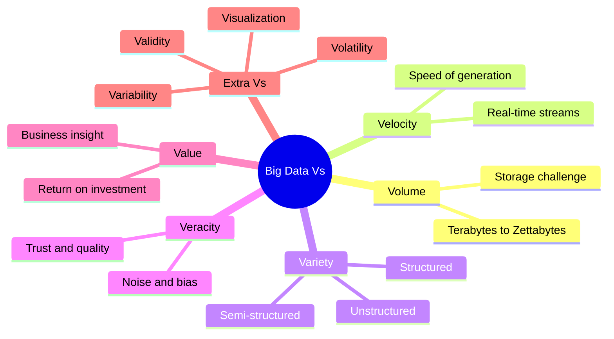

| V | Meaning | Example |
|---|---|---|
| **Volume** | Sheer quantity of data | Facebook stores petabytes of photos daily |
| **Velocity** | Speed of generation and processing | Stock ticks, credit card swipes, IoT sensors |
| **Variety** | Different formats and sources | Text, images, video, logs, JSON, sensor readings |
| **Veracity** | Uncertainty, noise and trustworthiness | Fake reviews, faulty sensor readings, duplicates |
| **Value** | The useful insight extracted; the whole point | Better recommendations increasing sales |

**Additional Vs:**
- **Variability** — the meaning and load of data change over time (a hashtag trends then dies).
- **Visualization** — presenting results so humans can act on them.
- **Volatility** — how long data stays relevant and must be retained.
- **Validity** — is the data correct and accurate for the intended use.

## 1.3 Types of Data

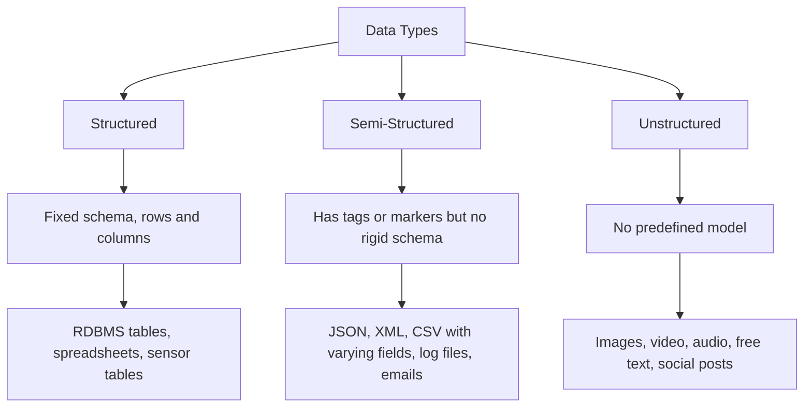

| Type | Share of enterprise data | Storage | Query |
|---|---|---|---|
| Structured | About 10-20% | RDBMS, data warehouse | SQL |
| Semi-structured | About 10% | NoSQL document stores | JSON path, XQuery |
| Unstructured | About 80% | HDFS, object stores, data lakes | Search, ML, NLP |

## 1.4 Traditional Data Processing vs Big Data Processing

| Aspect | Traditional (RDBMS / Data Warehouse) | Big Data |
|---|---|---|
| Data volume | GB to TB | TB to PB and beyond |
| Data type | Mostly structured | All three types |
| Schema | Schema-on-write, defined first | Schema-on-read, defined at query time |
| Scaling | Vertical - buy a bigger server | Horizontal - add commodity machines |
| Architecture | Centralised | Distributed cluster |
| Processing | Move data to the computation | Move the computation to the data |
| Hardware | Expensive, high-end | Cheap commodity nodes |
| Fault tolerance | Hardware redundancy | Software replication, expect node failure |
| Integrity | Strict ACID | Often BASE and eventual consistency |
| Example | Oracle, MySQL, Teradata | Hadoop, Spark, MongoDB, Cassandra |

**Key shift:** in traditional systems data is pulled to the processor. In Hadoop, the *code* is shipped to the node holding the data. This is **data locality** and it is what makes petabyte processing feasible.

## 1.5 Business Approaches for Big Data Analytics

The four analytics maturity levels:

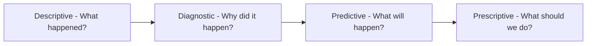

| Type | Question | Techniques | Example |
|---|---|---|---|
| **Descriptive** | What happened? | Reporting, dashboards, aggregation | Monthly sales report |
| **Diagnostic** | Why did it happen? | Drill-down, correlation, root cause | Why sales dropped in Zone 3 |
| **Predictive** | What will happen? | Regression, classification, forecasting | Which customers will churn |
| **Prescriptive** | What should we do? | Optimisation, simulation, RL | Best price and stock plan |

**Business approaches / strategies:**
1. **Data-driven decision making** — replace intuition with evidence.
2. **Customer 360 view** — merge every touchpoint into one profile.
3. **Operational efficiency** — reduce cost through predictive maintenance and route optimisation.
4. **New revenue streams** — monetise data products.
5. **Risk management** — fraud detection, credit risk, compliance.
6. **Personalisation** — recommendations and targeted marketing.

## 1.6 Challenges in Big Data Management and Processing

1. **Storage and scalability** — storing petabytes reliably and cheaply.
2. **Data quality** — incomplete, inconsistent, duplicated or noisy data.
3. **Data integration** — merging many heterogeneous sources and formats.
4. **Real-time processing** — latency requirements in milliseconds.
5. **Security and privacy** — encryption, access control, GDPR/DPDP compliance.
6. **Skill shortage** — data engineers and scientists are scarce and expensive.
7. **Cost** — infrastructure, licensing and cloud bills.
8. **Fault tolerance** — nodes will fail; the system must survive it.
9. **Data governance** — ownership, lineage, retention, cataloguing.
10. **Choosing the right tool** — an overcrowded ecosystem.
11. **Visualization** — making huge results human-readable.
12. **Data silos** — departments hoarding their own data.

## 1.7 Real-Life Examples and Applications

| Company / Domain | Big Data usage |
|---|---|
| Netflix | Viewing history drives recommendations and even content production decisions |
| Amazon | "Customers who bought this also bought", dynamic pricing, supply chain |
| Google | Search indexing, PageRank, Ads targeting, Maps traffic |
| Uber / Ola | Surge pricing, ETA prediction, driver-rider matching |
| Walmart | Real-time inventory, market basket analysis |
| Healthcare | Genomics, epidemic tracking, ICU monitoring, medical imaging |
| Banking | Fraud detection, credit scoring, AML monitoring |
| Telecom | Churn prediction, network optimisation, call-drop analysis |
| Smart cities | Traffic control, waste management, energy grids |
| Sports | Player performance analytics, injury prediction |
| Agriculture | Yield prediction from satellite and weather data |
| Manufacturing | Predictive maintenance from IoT sensor streams |

## 1.8 Emerging Trends and Future Directions

- **Cloud-native and serverless analytics** — Snowflake, BigQuery, Databricks; storage separated from compute.
- **Data Lakehouse** — combines the flexibility of a data lake with the reliability of a warehouse (Delta Lake, Iceberg, Hudi).
- **Real-time and streaming first** — Kafka, Flink, Spark Structured Streaming.
- **Edge and Fog computing** — process IoT data near the source to cut latency and bandwidth.
- **AI and Big Data convergence** — AutoML, MLOps, feature stores.
- **Generative AI on Big Data** — LLMs for natural-language querying, synthetic data generation, automated report writing.
- **DataOps and Data Mesh** — treating data as a product owned by domain teams.
- **Graph analytics** — fraud rings, knowledge graphs.
- **Responsible AI and data privacy** — federated learning, differential privacy, explainability.
- **Quantum computing** — early research for optimisation-heavy analytics.

---

# MODULE 2: Big Data Frameworks — Hadoop and NoSQL

## 2.1 Overview of Big Data Frameworks

A big data framework provides **distributed storage**, **distributed processing** and **resource management** so that a cluster of ordinary machines behaves like one large computer.

| Framework | Role |
|---|---|
| **Hadoop** | Batch storage and processing foundation |
| **Spark** | Fast in-memory processing engine |
| **Kafka** | Distributed messaging and streaming backbone |
| **Flink / Storm** | True real-time stream processing |
| **NoSQL databases** | Flexible, scalable operational storage |
| **Hive / Pig** | Higher-level query languages over Hadoop |

## 2.2 Introduction to Hadoop

**Apache Hadoop** is an open-source framework for distributed storage and processing of very large datasets on clusters of commodity hardware. It was inspired by two Google papers: the Google File System (2003) and MapReduce (2004), and created by Doug Cutting and Mike Cafarella.

**Core design assumptions:**
- Hardware failure is normal, not exceptional.
- Files are huge and written once, read many times.
- Moving computation is cheaper than moving data.
- Streaming access matters more than low-latency random access.

## 2.3 Hadoop Architecture and Core Components

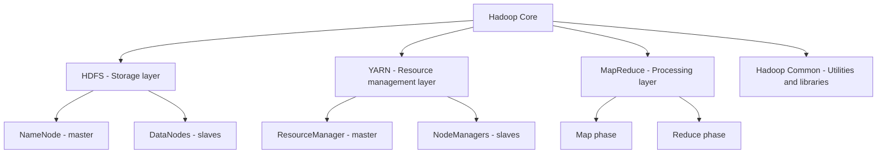

### A. HDFS — Hadoop Distributed File System

HDFS splits a file into **blocks** (default 128 MB) and stores each block on several machines.

**Master-slave architecture:**

| Component | Role |
|---|---|
| **NameNode (master)** | Stores metadata only: the filesystem tree, file-to-block mapping, block locations, permissions. Keeps it in RAM for speed. Single point of failure in Hadoop 1. |
| **DataNode (slave)** | Stores the actual data blocks. Sends a **heartbeat** every 3 seconds and a **block report** periodically. |
| **Secondary NameNode** | Not a backup. It periodically merges the edit log into the fsimage checkpoint so NameNode restart is fast. |
| **Standby NameNode** | In HA setups, a hot standby that takes over automatically. |

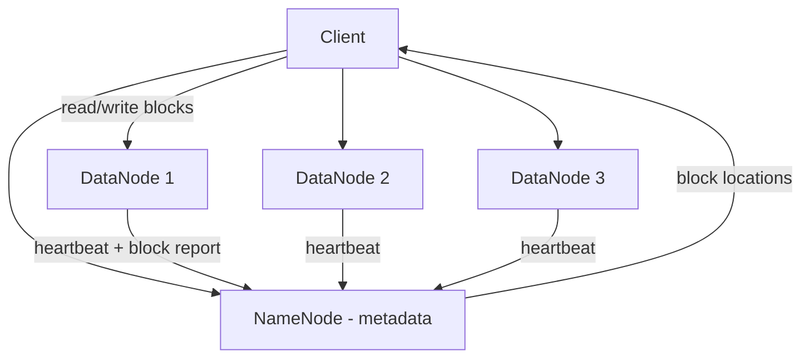

**Replication:** default replication factor is 3. The **rack-aware placement policy** puts
- replica 1 on the local node,
- replica 2 on a different rack,
- replica 3 on another node of that second rack.

This survives a whole rack failure while limiting cross-rack network traffic.

**Why 128 MB blocks?** Large blocks reduce the number of metadata entries in the NameNode and minimise disk seek time relative to transfer time. HDFS is bad at storing millions of tiny files — this is the well-known **small files problem**.

**Write path:** client asks NameNode → gets DataNode list → writes to the first DataNode → that node pipelines to the second → the second to the third → acknowledgements flow back.

**Read path:** client asks NameNode for block locations → reads each block directly from the nearest DataNode.

### B. YARN — Yet Another Resource Negotiator

Introduced in Hadoop 2 to separate **resource management** from **job processing**, so Hadoop could run engines other than MapReduce.

| Component | Role |
|---|---|
| **ResourceManager (master)** | Global arbiter of cluster resources. Contains the **Scheduler** (allocates containers) and the **Applications Manager** (accepts jobs, launches App Masters). |
| **NodeManager (per node)** | Manages containers on its node, monitors CPU/memory, reports to RM. |
| **ApplicationMaster (per job)** | Negotiates resources for its own application and monitors its tasks. |
| **Container** | A bundle of resources (CPU, memory) on one node in which a task runs. |

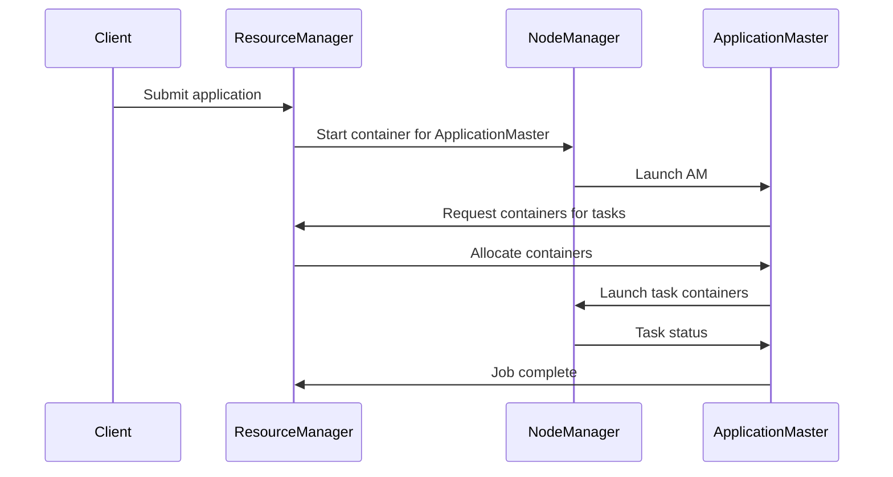

**Schedulers:** FIFO, **Capacity Scheduler** (queues with guaranteed capacity), **Fair Scheduler** (equal share over time).

### C. MapReduce
The batch processing model, covered fully in Module 3.

### D. Hadoop Common
Shared Java libraries, utilities and the abstraction layer used by the other modules.

## 2.4 Hadoop Ecosystem

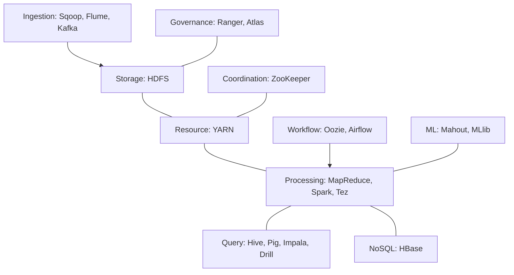

| Tool | Purpose |
|---|---|
| **HDFS** | Distributed storage |
| **YARN** | Cluster resource management |
| **MapReduce** | Batch processing model |
| **Hive** | SQL-like queries (HiveQL) over HDFS; data warehousing |
| **Pig** | Dataflow scripting language (Pig Latin) for ETL |
| **HBase** | Column-family NoSQL store for random real-time read/write |
| **Sqoop** | Bulk transfer between RDBMS and HDFS |
| **Flume** | Streaming log ingestion into HDFS |
| **Kafka** | Distributed publish-subscribe messaging |
| **Oozie** | Workflow scheduler for Hadoop jobs |
| **ZooKeeper** | Distributed coordination, leader election, configuration |
| **Spark** | Fast in-memory processing engine |
| **Mahout** | Scalable machine learning library |
| **Ambari** | Cluster provisioning and monitoring |

## 2.5 Overview of Apache Spark

**Spark** is a fast, general-purpose cluster computing engine. Its key advantage over MapReduce is **in-memory computation**, which makes it up to 100 times faster for iterative workloads such as machine learning.

**Core concepts:**
- **RDD (Resilient Distributed Dataset)** — an immutable, partitioned collection that can be rebuilt from its **lineage** if a partition is lost.
- **Transformations** (map, filter, join) are **lazy** — nothing runs until an **action** (count, collect, save) triggers execution.
- **DAG scheduler** — Spark builds a Directed Acyclic Graph of stages and optimises it before running.
- **DataFrame / Dataset** — higher-level structured APIs with the Catalyst optimiser.

**Spark components:** Spark Core, Spark SQL, Spark Streaming / Structured Streaming, MLlib, GraphX.

| Aspect | MapReduce | Spark |
|---|---|---|
| Data storage during processing | Writes to disk after every step | Keeps data in memory |
| Speed | Slower | 10-100x faster for iterative work |
| Ease of use | Verbose Java code | Concise Scala, Python, R, SQL |
| Processing types | Batch only | Batch, streaming, ML, graph |
| Fault tolerance | Re-run failed tasks from HDFS | Recompute from RDD lineage |
| Cost | Cheaper, less RAM needed | Needs a lot of RAM |

## 2.6 Apache Pig

**Pig** provides **Pig Latin**, a dataflow language that compiles to MapReduce (or Tez/Spark). A 200-line Java MapReduce job may be 10 lines of Pig.

**Components:** Pig Latin language, the Grunt shell, and the compiler/optimiser.
**Data model:** Atom, Tuple, Bag, Map. It supports nested and semi-structured data.
**Modes:** Local mode and MapReduce (cluster) mode.

Typical operators: `LOAD`, `FILTER`, `FOREACH ... GENERATE`, `GROUP`, `JOIN`, `ORDER`, `DISTINCT`, `STORE`.

Pig is **procedural** — you specify the sequence of steps. Best for ETL pipelines and researchers/programmers.

## 2.7 Apache Hive

**Hive** is a data warehouse layer over Hadoop that lets you write **HiveQL**, a SQL-like language, which is translated into MapReduce, Tez or Spark jobs.

**Architecture:**
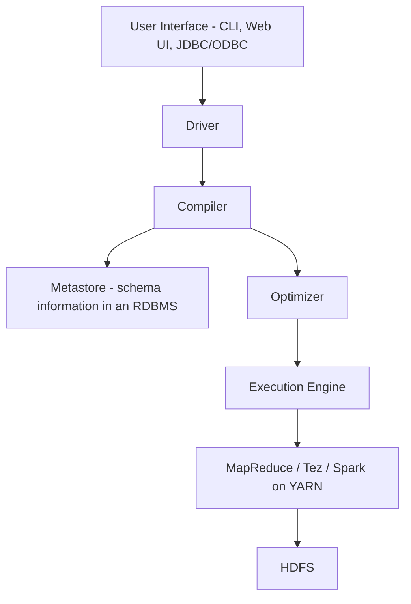

- **Metastore** — stores table schemas, columns, types and partitions in a relational database. This is the heart of Hive.
- **Schema-on-read** — data is validated when queried, not when loaded.

**Table types:**
- **Managed (internal) table** — Hive owns the data; `DROP TABLE` deletes it.
- **External table** — Hive only owns the schema; `DROP TABLE` keeps the files.

**Performance features:** **partitioning** (split by a column such as date into directories) and **bucketing** (hash into a fixed number of files) to prune data scanned.

Hive is **declarative** and best suited for analysts who already know SQL.

| | Pig | Hive |
|---|---|---|
| Language | Pig Latin, procedural dataflow | HiveQL, declarative SQL-like |
| User | Programmers, ETL developers | Analysts, BI users |
| Schema | Optional, flexible | Required in the metastore |
| Data | Handles semi/unstructured well | Mainly structured |
| Use | ETL pipelines | Reporting and ad-hoc analysis |

## 2.8 Apache HBase

**HBase** is a distributed, column-family NoSQL database modelled on **Google Bigtable**, running on top of HDFS. It gives HDFS what it lacks: **random, real-time read and write** access to individual rows.

**Data model:** `Table → Row Key → Column Family → Column Qualifier → Timestamp → Value`. Data is sorted by row key, which makes range scans efficient. Cells are versioned by timestamp.

**Architecture:**

| Component | Role |
|---|---|
| **HMaster** | Assigns regions, handles schema changes and load balancing |
| **RegionServer** | Serves read/write for a set of regions |
| **Region** | A contiguous range of row keys; splits automatically when large |
| **ZooKeeper** | Tracks live servers, stores the location of the meta table |
| **MemStore / HFile / WAL** | Writes go to WAL and MemStore, then flush to HFile on HDFS |

**Good for:** sparse tables, billions of rows, time-series, messaging (Facebook Messages used it).
**Not good for:** joins, transactions across rows, complex SQL analytics.

## 2.9 Apache Sqoop

**Sqoop** = "SQL to Hadoop". It transfers bulk data between relational databases and HDFS/Hive/HBase.

- **Import** — RDBMS to HDFS. Sqoop generates a MapReduce job with only mappers, splitting the table by a **split-by** column so each mapper pulls a range in parallel.
- **Export** — HDFS back to RDBMS.
- Supports **incremental import** (append mode or lastmodified mode) so only new rows come over.

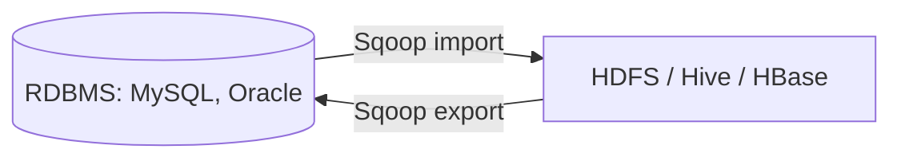

## 2.10 Introduction to NoSQL Databases

**NoSQL** = "Not Only SQL". These are non-relational databases designed for horizontal scale, flexible schemas and high availability.

### Need for NoSQL systems
1. **Scale** — relational databases scale vertically, which hits a hardware ceiling; NoSQL scales out across cheap nodes.
2. **Schema flexibility** — modern data (JSON, sensor, social) changes shape constantly. NoSQL is schema-less or schema-flexible.
3. **Variety** — need to store unstructured and semi-structured data.
4. **Velocity** — millions of writes per second, which joins and locks cannot sustain.
5. **Availability** — internet services must stay up; NoSQL favours availability and partition tolerance.
6. **Cost** — commodity hardware and open-source licensing.
7. **Impedance mismatch** — objects in code map awkwardly to normalised tables; documents map naturally.

### CAP Theorem
A distributed system can only guarantee **two** of the following three at once:

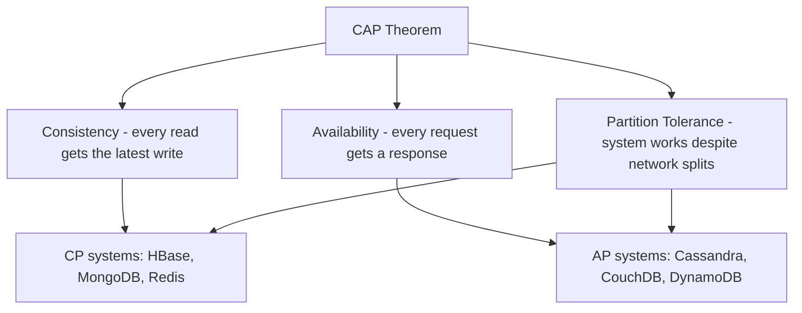

Since network partitions are unavoidable in a distributed system, real systems choose between **CP** and **AP**.

### ACID vs BASE

| ACID (RDBMS) | BASE (NoSQL) |
|---|---|
| **A**tomicity | **B**asically **A**vailable |
| **C**onsistency | **S**oft state |
| **I**solation | **E**ventual consistency |
| **D**urability | |
| Strong guarantees, lower scale | Weaker guarantees, massive scale |

## 2.11 NoSQL Data Models and Architecture Patterns

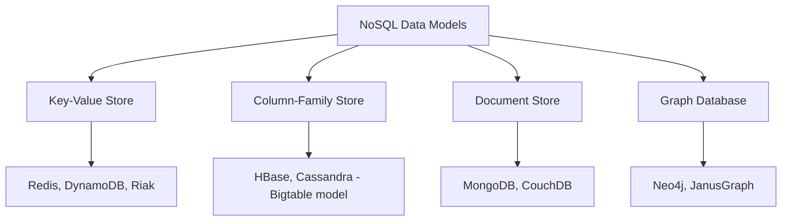

### A. Key-Value Stores
The simplest model: a giant distributed hash map of `key → value`. The value is opaque to the database.

- **Operations:** `put(key, value)`, `get(key)`, `delete(key)`.
- **Pros:** extremely fast, simple, scales trivially.
- **Cons:** cannot query by value, no relationships.
- **Use cases:** session storage, caching, shopping carts, user preferences, leaderboards.
- **Examples:** Redis, Amazon DynamoDB, Riak, Memcached.

### B. Column-Family Stores (Bigtable model)
Data is stored by **column families** rather than rows. Each row key maps to one or more column families, and each family holds a variable set of columns.

- Physically, values in the same column family are stored together, which makes analytical scans of a few columns very fast and compresses well.
- Rows can have **different columns** — it is a sparse, multidimensional sorted map.
- Conceptually: `(row key, column family : column, timestamp) → value`
- **Pros:** massive scale, fast writes, efficient column scans, good compression.
- **Cons:** no joins, query patterns must be designed in advance.
- **Use cases:** time-series, IoT sensor data, event logging, messaging.
- **Examples:** HBase, Cassandra, Google Bigtable.

### C. Document Stores
Each record is a self-contained **document**, usually JSON/BSON/XML, with a unique key. Documents in one collection may have different fields.

- Supports **nested structures and arrays**, so a whole object graph fits in one record.
- Rich queries on **any field**, secondary indexes, aggregation pipelines.
- **Pros:** natural fit for application objects, flexible schema, powerful queries.
- **Cons:** joins are limited, duplication of embedded data.
- **Use cases:** content management, catalogues, user profiles, real-time analytics.
- **Examples:** MongoDB, CouchDB, Couchbase, Elasticsearch.

### D. Graph Databases
Data is stored as **nodes** (entities), **edges** (relationships) and **properties** on both. Relationships are first-class citizens, stored directly rather than computed with joins.

- Traversals of deep relationships stay fast regardless of database size (**index-free adjacency**).
- Query languages: **Cypher** (Neo4j), Gremlin, SPARQL.
- **Use cases:** social networks, fraud rings, recommendation engines, knowledge graphs, network topology.
- **Examples:** Neo4j, JanusGraph, Amazon Neptune, ArangoDB.

### Comparison

| Model | Structure | Query power | Scalability | Best for |
|---|---|---|---|---|
| Key-Value | key to opaque blob | Lowest, key lookup only | Highest | Caching, sessions |
| Column-Family | sparse column families | Medium, by row key and column | Very high | Time-series, logs |
| Document | nested JSON documents | High, on any field | High | Apps, catalogues, CMS |
| Graph | nodes and edges | Highest for relationships | Lower, hard to shard | Networks, fraud, recommendations |

### Common architecture patterns
- **Sharding (partitioning)** — split data across nodes by a shard key for horizontal scale.
- **Replication** — master-slave or peer-to-peer copies for availability and read scaling.
- **Consistent hashing** — used by Cassandra and DynamoDB to place keys on a ring so adding a node moves minimal data.
- **Quorum reads/writes** — tune consistency with R + W > N.
- **Materialized views / denormalisation** — store data pre-joined for the query you need.

## 2.12 MongoDB and its Features

**MongoDB** is the most widely used document-oriented NoSQL database. It stores **BSON** (binary JSON) documents.

**Terminology mapping:**

| RDBMS | MongoDB |
|---|---|
| Database | Database |
| Table | Collection |
| Row / Record | Document |
| Column | Field |
| Join | `$lookup` or embedding |
| Primary key | `_id` (auto-generated ObjectId) |

**Key features:**
1. **Document oriented** — flexible, nested, self-describing records.
2. **Dynamic schema** — documents in one collection need not match.
3. **Rich query language** — filters, projections, sorting, regex, geospatial queries.
4. **Indexing** — single field, compound, multikey (arrays), text, geospatial, hashed, TTL.
5. **Aggregation Framework** — a pipeline of stages such as `$match`, `$group`, `$project`, `$sort`, `$unwind`, `$lookup`.
6. **Replication (Replica Sets)** — one primary and several secondaries with automatic failover through elections.
7. **Sharding** — automatic horizontal partitioning across shards using a shard key, coordinated by config servers and `mongos` routers.
8. **High availability** — automatic leader election if the primary dies.
9. **GridFS** — stores files larger than the 16 MB document limit.
10. **Ad-hoc queries and MapReduce** support.
11. **Transactions** — multi-document ACID transactions since version 4.0.

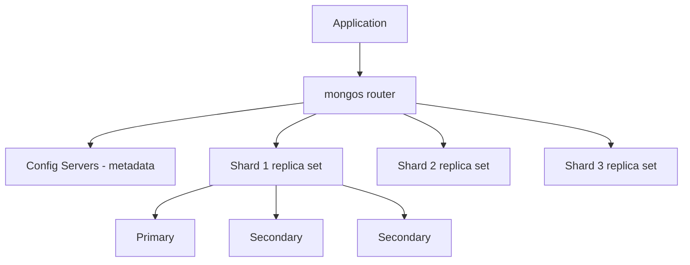

**Basic operations:**
- Create: `db.users.insertOne({name:"Amit", age:22})`
- Read: `db.users.find({age:{$gt:20}})`
- Update: `db.users.updateOne({name:"Amit"}, {$set:{age:23}})`
- Delete: `db.users.deleteOne({name:"Amit"})`
- Aggregate: `db.orders.aggregate([{$match:{status:"A"}},{$group:{_id:"$cust",total:{$sum:"$amt"}}}])`

---

# MODULE 3: MapReduce Paradigm

## 3.1 Introduction to the MapReduce Programming Model

**MapReduce** is a programming model for processing very large datasets in parallel across a cluster. The programmer writes just two functions and the framework handles parallelisation, distribution, scheduling and fault tolerance.

$$\text{map}(k_1, v_1) \rightarrow list(k_2, v_2)$$
$$\text{reduce}(k_2, list(v_2)) \rightarrow list(k_3, v_3)$$

**The classic Word Count example:**
- **Map:** for each word in the line, emit `(word, 1)`.
- **Shuffle and Sort:** group all the 1s belonging to the same word.
- **Reduce:** sum the list to get `(word, total)`.

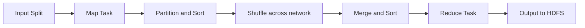

## 3.2 Phases of MapReduce

### 1. Input Split and Record Reader
The input file is divided into **logical input splits** (usually one per HDFS block). Each split goes to one map task. The **RecordReader** turns the split's bytes into key-value pairs (by default, byte offset as key and the line as value).

### 2. Map Task
Runs the user's map function on each record and emits intermediate key-value pairs. Output goes to the **local disk** of the mapper node, not to HDFS, because it is temporary.

The number of mappers is decided by the number of input splits, so it is data-driven, not user-set.

### 3. Combiner (optional, "mini-reducer")
Runs on the map output **before** it crosses the network, aggregating locally. For word count, a mapper emitting `(the,1)` a thousand times can send `(the,1000)` instead.

- Massively reduces network traffic.
- Must be **commutative and associative** — sum and max are fine, **average is not**.
- Its execution is **not guaranteed**, so the program must be correct with or without it.

### 4. Partitioner
Decides which reducer each key goes to. Default is
$$\text{partition} = \text{hash}(key) \bmod (\text{number of reducers})$$
All values for one key must land on the same reducer. A custom partitioner is used to control distribution and avoid **data skew**.

### 5. Shuffle and Sort
The framework transfers map outputs to the correct reducers over the network (**shuffle**) and sorts them by key (**sort**), merging the streams from all mappers. This is the most expensive phase and the only one entirely handled by the framework.

### 6. Grouping by Key
After sorting, all values with the same key are grouped into one `(key, list-of-values)` record, which is exactly what the reduce function receives.

### 7. Reduce Task
Runs the user's reduce function on each key group and writes the final output to HDFS. The number of reducers **is** set by the user; 0 reducers means a map-only job.

### 8. Output Format
The **OutputFormat** and **RecordWriter** write the result, one file per reducer (`part-r-00000`, `part-r-00001`, ...).

## 3.3 Detailed Execution Flow of MapReduce

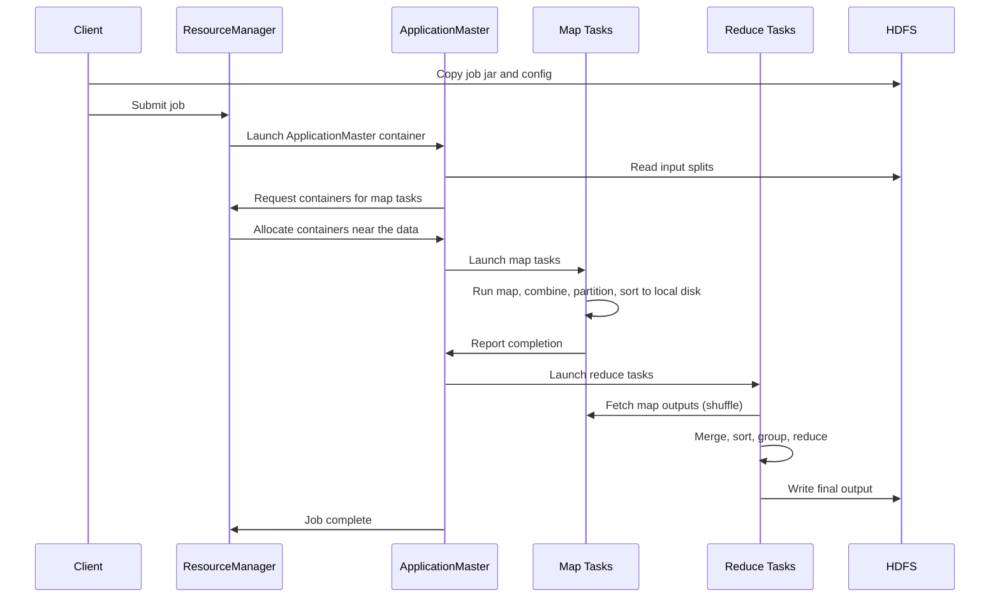

**Data locality optimisation:** the scheduler tries to run a map task on the node that already holds its block (node-local), else on the same rack (rack-local), else anywhere. This minimises network usage.

**Speculative execution:** if a task runs unusually slowly (a **straggler**, perhaps on failing hardware), the framework launches a duplicate copy on another node and uses whichever finishes first.

## 3.4 Handling and Recovery from Node Failures

| Failure | Detection | Recovery |
|---|---|---|
| **Task failure** | Task JVM throws an exception or times out (default 10 minutes without progress) | ApplicationMaster reschedules the task on another node, up to 4 attempts |
| **NodeManager failure** | Stops sending heartbeats to the ResourceManager | RM marks it dead; all its running tasks and completed **map** outputs are rescheduled (map outputs sat on local disk and are now lost). Completed **reduce** outputs are safe on HDFS |
| **ApplicationMaster failure** | RM misses the AM heartbeat | RM starts a new AM in a new container; with job recovery enabled, completed tasks are not re-run |
| **ResourceManager failure** | The whole cluster stalls | Solved with HA: an active/standby RM pair coordinated by ZooKeeper, with state in a state store |
| **DataNode failure (HDFS)** | Missing heartbeat for 10 minutes | NameNode marks blocks under-replicated and re-replicates them elsewhere from surviving copies |
| **NameNode failure** | Metadata unavailable | Hadoop 2 HA: Standby NameNode with a shared edit log (JournalNodes) and automatic ZooKeeper failover |

**Why the model is naturally fault tolerant:**
- Tasks are **deterministic and side-effect free**, so re-running one is safe.
- Data is replicated three times, so another copy is always available.
- Output is only committed when the task completes, so partial results never pollute the result.

## 3.5 Design and Implementation of MapReduce Algorithms

### A. Matrix–Vector Multiplication

Compute $x = M v$ where M is an n x n matrix and v is a vector of length n:
$$x_i = \sum_{j=1}^{n} m_{ij} v_j$$

**Case 1: v fits in memory**
- **Map:** the vector v is loaded into memory on every mapper (via the distributed cache). For each matrix element $m_{ij}$, emit `(i, m_ij * v_j)`.
- **Reduce:** for key i, sum all values to produce $x_i$.

**Case 2: v is too large for memory**
Split M into vertical **stripes** and v into matching horizontal stripes, so each map task only needs one stripe of v in memory. Process one stripe pair at a time.

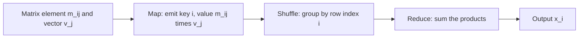

### B. Relational Algebra Operations using MapReduce

Assume a relation R(A, B) stored as tuples.

**1. Selection — σ(R)**
- **Map:** for each tuple t, if t satisfies the condition, emit `(t, t)`; otherwise emit nothing.
- **Reduce:** identity — just pass the tuple through.
- This is essentially a **map-only** job.

**2. Projection — π_A(R)**
- **Map:** for each tuple t, produce t' by keeping only the required attributes; emit `(t', t')`.
- **Reduce:** for each key t', output t' once. The reduce step is needed to **remove duplicates**.

**3. Union — R ∪ S** (same schema)
- **Map:** for every tuple t in R and in S, emit `(t, t)`.
- **Reduce:** for key t, output t once regardless of whether one or two values arrived (removes duplicates).

**4. Intersection — R ∩ S**
- **Map:** emit `(t, "R")` for tuples of R and `(t, "S")` for tuples of S.
- **Reduce:** output t **only if both** markers are present (list length is 2).

**5. Difference — R − S**
- **Map:** emit `(t, "R")` from R and `(t, "S")` from S.
- **Reduce:** output t only if the list contains "R" **and not** "S".

**6. Natural Join — R(A,B) ⋈ S(B,C)** (the reduce-side join)
- **Map:** for each tuple of R emit `(b, ("R", a))`; for each tuple of S emit `(b, ("S", c))`. The **join attribute becomes the key**.
- **Reduce:** for key b, take the cross product of all R-values with all S-values and emit `(a, b, c)`.

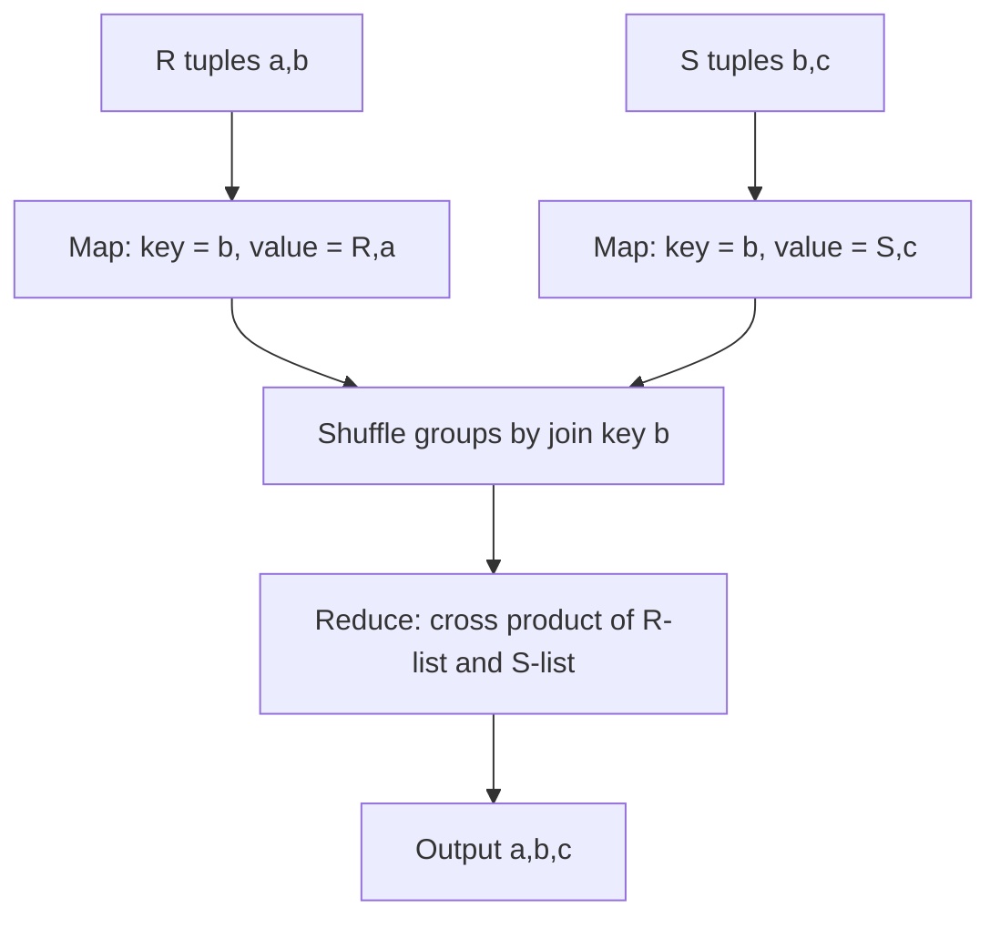

**Map-side join (broadcast join):** if one relation is small enough to fit in memory, distribute it to every mapper and join there. This skips the shuffle entirely and is much faster.

**7. Grouping and Aggregation — γ**
For `SELECT A, SUM(B) FROM R GROUP BY A`:
- **Map:** for each tuple, emit `(A, B)` — the grouping attribute is the key.
- **Reduce:** apply the aggregate (SUM, COUNT, MAX, MIN, AVG) to the list of values for each key.
- A **combiner** can pre-aggregate for SUM/COUNT/MAX/MIN. For AVG, emit `(sum, count)` pairs instead of averages so the combiner stays valid.

### C. Matrix Multiplication using MapReduce

Compute $P = M \times N$ where M is i x j and N is j x k:
$$p_{ik} = \sum_{j} m_{ij} \cdot n_{jk}$$

**Two-step (two MapReduce jobs) method:**

*Job 1 — multiply the pairs:*
- **Map:** for each $m_{ij}$ emit `(j, ("M", i, m_ij))`; for each $n_{jk}$ emit `(j, ("N", k, n_jk))`. The shared index j is the key.
- **Reduce:** for key j, for every M entry and every N entry, emit `((i,k), m_ij * n_jk)`.

*Job 2 — sum the products:*
- **Map:** identity.
- **Reduce:** for key `(i,k)`, sum all the products to get $p_{ik}$.

**One-step method:**
- **Map:** for each $m_{ij}$ emit `((i,k), ("M", j, m_ij))` for all k = 1..K; for each $n_{jk}$ emit `((i,k), ("N", j, n_jk))` for all i = 1..I.
- **Reduce:** for key `(i,k)`, sort values by j, multiply matching pairs and sum.

The one-step version needs only one job but replicates each element many times, so it uses much more network. The two-step version is usually preferred for large matrices.

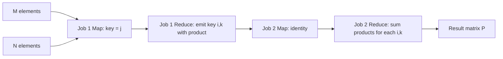

## 3.6 Case Studies and Real-World Applications of MapReduce

| Application | How MapReduce is used |
|---|---|
| **Web indexing (Google)** | The original use case: build an inverted index from crawled pages |
| **Log analysis** | Count errors, sessions, unique visitors across terabytes of server logs |
| **Word count / N-grams** | Text corpus statistics for NLP |
| **PageRank** | Iterative rank computation, one MapReduce job per iteration |
| **Recommendation** | Compute item-item co-occurrence matrices at scale |
| **ETL** | Clean, transform and load raw data into a warehouse |
| **Click-stream analysis** | Sessionise user activity, compute funnels |
| **Fraud detection** | Aggregate transaction features per account over history |
| **Genomics** | Sequence alignment and variant counting |
| **Telecom CDR analysis** | Call detail record aggregation for billing and churn |

### Limitations of MapReduce
- Every stage writes to disk, so **iterative algorithms are slow** — this is exactly why Spark exists.
- **High latency**, unsuitable for real-time or interactive queries.
- The rigid two-phase structure makes complex workflows awkward, needing chains of jobs.
- Verbose to program directly in Java (hence Hive and Pig).
- **Data skew** — one hot key can make one reducer run forever.

---

# MODULE 4: Mining Big Data Streams

## 4.1 The Stream Data Model

A **data stream** is data that arrives continuously, rapidly, in unpredictable order, and is potentially **infinite**. You usually get **one look** at each element.

**Key constraints:**
- The stream cannot be stored in full.
- Algorithms must use memory that is **sub-linear**, ideally logarithmic, in the stream size.
- Answers are usually **approximate**, with provable error bounds.
- Processing must be fast enough to keep up with the arrival rate.

## 4.2 Stream Management System (DSMS)

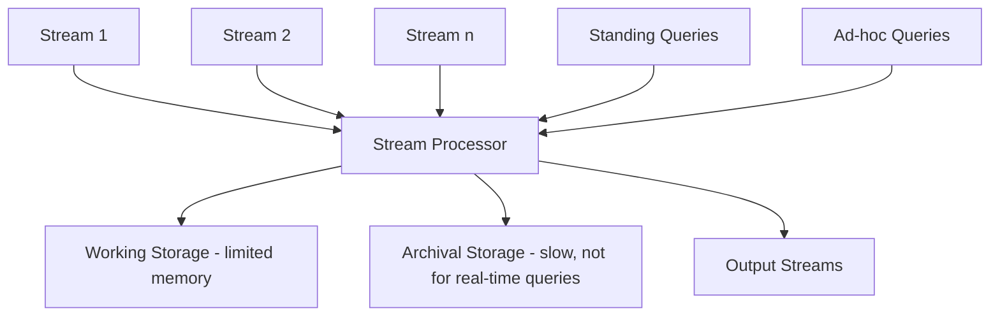

**Components:**
- **Input streams** — arrive at unpredictable rates.
- **Stream processor** — the engine that runs the queries.
- **Working store** — small, fast memory holding summaries, sketches and windows.
- **Archival store** — everything is dumped here, but it is too slow for live answering.
- **Query processor** — handles both kinds of query below.

## 4.3 Examples of Stream Sources

| Source | Description |
|---|---|
| **Sensor data / IoT** | Temperature, GPS, accelerometer readings from millions of devices |
| **Image and video streams** | CCTV, satellite feeds |
| **Internet and web traffic** | Router packet headers, clickstreams, search queries |
| **Social media** | Tweets, posts, likes arriving continuously |
| **Financial markets** | Stock ticks, transactions |
| **Telecom** | Call detail records |
| **Server logs** | Application and security logs |

## 4.4 Stream Queries

**1. Standing (continuous) queries**
Registered once and evaluated forever as data arrives. Example: "report the maximum temperature seen so far" or "the average of the last 24 readings". The output itself is a stream.

**2. Ad-hoc queries**
Asked once, at an arbitrary moment, about the stream. Since the past is gone, systems keep **sliding windows** or **summaries** so common ad-hoc questions can still be answered.

**Windows:**
- **Sliding window** — the last N elements or the last T time units, moving continuously.
- **Tumbling window** — non-overlapping fixed blocks.
- **Hopping window** — fixed size, advancing by a smaller step, so windows overlap.

## 4.5 Issues in Stream Processing

1. **Unbounded data** — cannot store or make a second pass.
2. **Limited memory** — summaries must be far smaller than the data.
3. **High and variable arrival rate** — bursts can overwhelm the processor, requiring **load shedding**.
4. **One-pass constraint** — algorithms must be online and incremental.
5. **Approximation is unavoidable** — exact answers are often impossible in small space.
6. **Concept drift** — the underlying distribution changes over time, so old data may mislead.
7. **Out-of-order and late arrivals** — network delays break time ordering, needing watermarks.
8. **Fault tolerance** — must recover without replaying the whole stream.
9. **Multiple streams** — joining streams with different rates and delays.

## 4.6 Sampling Data in a Stream

**Problem:** we want a representative sample of the stream, small enough to store, that supports later queries.

### Naive approach and why it fails
Suppose we keep 1/10 of *search queries* at random to answer "what fraction of queries a user repeats?". Because we sample individual records, we may keep one copy of a duplicated query and drop its twin, so the duplicate fraction we compute is **wrong**.

### The correct approach: sample by key, not by record
Choose the **key** that queries will be grouped by (here, the user). Hash the key into 10 buckets and keep **every record** whose user hashes to bucket 0. Now we have complete data for 1/10 of users, and statistics computed on them are unbiased.

**General rule:** to keep a fraction a/b of the stream, hash the key value into b buckets and accept the record if the bucket number is less than a.

### Reservoir Sampling
Maintains a uniform random sample of **exactly s elements** from a stream of unknown length.

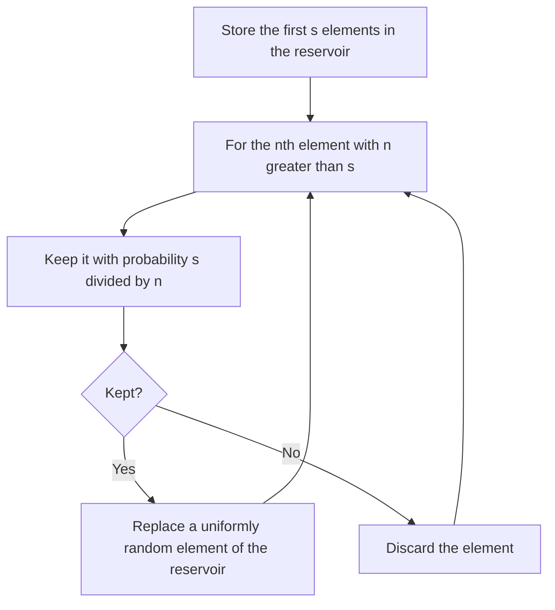

At every moment, each of the n elements seen so far is in the reservoir with probability s/n. This is the standard technique when the stream length is unknown.

**Varying the sample size:** if memory fills up, lower the threshold (drop the highest-numbered bucket) so the sample shrinks while remaining valid.

## 4.7 Filtering Streams: The Bloom Filter

**Problem:** given a very large set S of "allowed" keys (say a billion valid email addresses), decide for each arriving element whether it is in S — using far less memory than storing S.

A **Bloom filter** is a space-efficient probabilistic data structure that answers set membership with:
- **No false negatives** — if it says "not present", it is definitely not present.
- **Possible false positives** — if it says "present", it might be wrong.

### Structure
- An array of **n bits**, all initially 0.
- **k independent hash functions**, each mapping a key to one of the n positions.
- The set S has **m members**.

### Operations

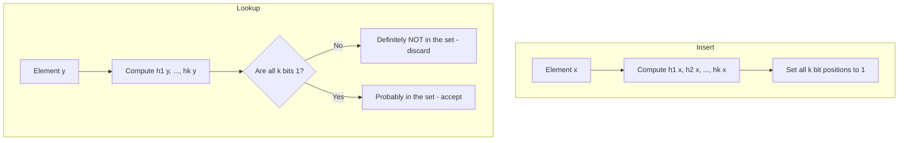

### False positive probability

After inserting m elements with k hash functions into n bits:

- Probability a given bit is still 0: $\left(1 - \frac{1}{n}\right)^{km} \approx e^{-km/n}$
- Probability a given bit is 1: $1 - e^{-km/n}$
- **False positive rate:** $$P_{fp} = \left(1 - e^{-km/n}\right)^{k}$$

**The dart-and-target analogy:** throwing `km` darts at `n` targets, the fraction of targets hit at least once is $1 - e^{-km/n}$. A false positive happens when all k of a new element's positions were already hit.

**Optimal number of hash functions:**
$$k_{opt} = \frac{n}{m}\ln 2 \approx 0.693 \frac{n}{m}$$

At that optimum, the false positive rate is about $0.6185^{n/m}$.

**Properties:**
- Cannot **delete** elements (clearing bits would break other members). A **Counting Bloom Filter** uses small counters instead of bits to allow deletion.
- Memory is fixed and independent of element size.
- **Uses:** spam/blacklist filtering, cache lookups (HBase and Cassandra use them to avoid pointless disk reads), URL crawl checks, network packet filtering, duplicate detection.

## 4.8 Counting Distinct Elements in a Stream

### The Count-Distinct Problem
Count how many **different** elements have appeared in a stream (the cardinality). Examples: unique visitors to a website, distinct IP addresses hitting a router, distinct search queries in a day.

**The obvious solution** — keep a hash set of everything seen — needs memory proportional to the number of distinct elements, which is impossible when there are billions across many streams.

### The Flajolet–Martin (FM) Algorithm

**Core idea:** hash each element to a bit string. If there are many distinct elements, some hash value will, by chance, end in a long run of zeros. The length of the longest tail of zeros estimates the cardinality.

```mermaid
flowchart TD
    A[Element a arrives] --> B[Compute hash h of a into a bit string]
    B --> C[Count trailing zeros of h - call it r a]
    C --> D[Track R = maximum r seen so far]
    D --> E[Estimate distinct count = 2 raised to R]
```

**Why it works:**
- The probability that a hash value ends in at least r zeros is $2^{-r}$.
- With m distinct elements, the probability that **none** of them has r trailing zeros is $(1-2^{-r})^m \approx e^{-m 2^{-r}}$.
- If $m \gg 2^r$ this is close to 0 (some element almost surely has r zeros).
- If $m \ll 2^r$ this is close to 1 (probably no element does).
- So the largest observed r sits right around $\log_2 m$, giving the estimate $2^R$.

**Note:** duplicates do not affect the result, because the same element always hashes to the same value.

### Combining Estimates

A single estimate $2^R$ has very high variance, and because it is a power of two the possible answers jump in factors of 2. Fixes:

1. **Use many hash functions** to get many estimates.
2. **Averaging alone is bad** — a single unusually large R (an outlier) skews the mean upward badly, since the values are exponential.
3. **Median alone is bad** — the median is always a power of 2, so it cannot land near a value in between.
4. **The standard solution: group and combine.**
   - Divide the hash functions into small **groups**.
   - Take the **average within each group** (this smooths the power-of-two granularity).
   - Take the **median across groups** (this removes outliers).

Group size should be a small multiple of $\log_2 m$.

### Space Requirements
Each hash function needs only **O(log n) bits** to store the maximum tail length R, where n is the number of possible elements. Even with hundreds of hash functions this is a few kilobytes, versus gigabytes for exact counting. Computing the hashes, not storing them, is the real cost.

**HyperLogLog** is the modern refinement of Flajolet–Martin: it splits the hash into a bucket index plus a tail, uses the **harmonic mean** across buckets, and estimates billions of distinct items within about 2% error using roughly 1.5 KB of memory. It is used in Redis, BigQuery and Presto.

## 4.9 Counting Ones in a Window

### The Problem
Given a stream of 0s and 1s, answer at any moment: "how many 1s are in the last **k** bits?" for any k up to a window size N.

### The Cost of Exact Counts
To answer exactly for **every** k up to N, you must remember the whole window, needing **N bits**. Worse, you cannot even distinguish two different windows without storing them: any scheme using fewer than N bits must map two different windows to the same representation, and there exists a query k on which they differ. So exact answers require O(N) space, which is impossible when N is a billion and there are many streams.

### The DGIM Algorithm (Datar–Gionis–Indyk–Motwani)

DGIM estimates the count using **O(log² N) bits** per stream with an error of at most **50%** (tunable to less).

**Buckets.** The window is summarised as a set of buckets, where each bucket stores:
1. The **timestamp of its right (most recent) end**, recorded modulo N, needing `log2 N` bits.
2. The **number of 1s** in the bucket, which is always a **power of 2**. Storing the exponent needs `log2 log2 N` bits.

**The six DGIM rules:**
1. The right end of a bucket is always a position with a 1.
2. Every position with a 1 is in exactly one bucket.
3. There are **one or two buckets of each size** (each power of 2).
4. All bucket sizes are powers of 2.
5. Buckets do not overlap.
6. Buckets get **larger as they get older** — sizes never decrease as we move left.

Example window summary (newest on the right): sizes `... 8, 8, 4, 2, 2, 1`.

```mermaid
flowchart LR
    A[Bucket size 8] --> B[Bucket size 8] --> C[Bucket size 4] --> D[Bucket size 2] --> E[Bucket size 2] --> F[Bucket size 1]
    F --> G[Current time - newest bit]
```

**Updating on a new bit:**

```mermaid
flowchart TD
    A[New bit arrives] --> B{Is it a 1?}
    B -- No --> C[Only drop the oldest bucket if its timestamp fell out of the window]
    B -- Yes --> D[Create a new bucket of size 1 with the current timestamp]
    D --> E{Are there now three buckets of size 1?}
    E -- Yes --> F[Merge the two oldest into one bucket of size 2]
    F --> G{Are there now three buckets of size 2?}
    G -- Yes --> H[Merge the two oldest into size 4, and cascade upward]
    G -- No --> I[Done]
    E -- No --> I
    H --> I
    C --> I
```

Also, whenever the oldest bucket's timestamp is more than N positions behind the current time, **drop that bucket**.

**Query answering in DGIM.** To estimate the number of 1s in the last k bits:
1. Find all buckets that lie **completely inside** the last k bits and **sum their sizes**.
2. Add **half the size** of the last (oldest, partially overlapping) bucket, since we do not know how much of it falls inside the window.

$$\text{Estimate} = \sum(\text{sizes of fully contained buckets}) + \frac{\text{size of the partial bucket}}{2}$$

**Error bound.** The only uncertainty is the partial bucket. If it has size $2^j$, the error is at most $2^{j-1}$. Since the fully contained buckets already include at least one bucket of every smaller size, the true count is at least $2^j - 1$. Hence the relative error is at most about **50%**.

**Reducing the error:** allow **r or r−1 buckets of each size** instead of 1 or 2. The error then drops to about $O(1/r)$, at the cost of more memory.

**Worked example.**
Suppose the buckets, from newest to oldest, have sizes 1, 1, 2, 4, 8, and the query window covers the four newest buckets fully (1 + 1 + 2 + 4 = 8) and half of the size-8 bucket.
Estimate = 8 + 8/2 = **12 ones**.

**Extensions:** DGIM can be generalised to sum integers in a window and to count under other aggregates; the same bucketing idea is called an **exponential histogram**.

## 4.10 Case Studies and Applications of Big Data Stream Mining

| Domain | Application | Techniques used |
|---|---|---|
| **Social media analytics** | Trending topics, live sentiment, viral detection | Sampling, count-distinct, heavy hitters |
| **Network monitoring** | DDoS detection, traffic profiling, unique-IP counts | Bloom filter, FM/HyperLogLog, DGIM |
| **IoT systems** | Sensor anomaly detection, predictive maintenance | Sliding windows, streaming clustering |
| **Financial transactions** | Real-time fraud scoring, algorithmic trading | Windowed aggregates, streaming ML |
| **Real-time event processing** | Ad click fraud, live dashboards, recommendations | Kafka + Flink/Spark Streaming, sketches |
| **E-commerce** | Live inventory, session tracking, cart abandonment | Sessionisation, tumbling windows |
| **Telecom** | Call drop monitoring, live billing | Stream joins, aggregates |

**Typical modern stack:** Kafka for ingestion → Flink or Spark Structured Streaming for processing → Redis or Druid for serving → Grafana for dashboards.

---

# MODULE 5: Big Data Mining Algorithms

## 5.1 Frequent Pattern Mining

**Goal:** find sets of items that appear together often. The classic use is **market basket analysis** — "customers who buy bread and butter also buy jam".

**Key terms:**
- **Itemset** — a set of items, e.g. {bread, butter}.
- **Support** — fraction (or count) of baskets containing the itemset.
  $$support(X) = \frac{\text{number of baskets containing } X}{\text{total baskets}}$$
- **Frequent itemset** — support at or above a minimum support threshold s.
- **Confidence** of rule X → Y: $$conf = \frac{support(X \cup Y)}{support(X)}$$
- **Lift**: $$lift = \frac{conf(X \rightarrow Y)}{support(Y)}$$ Lift above 1 means a genuine positive association.

**The Apriori principle (monotonicity):** if an itemset is frequent, all of its subsets are frequent. Equivalently, if a subset is infrequent, no superset can be frequent. This prunes the search space massively.

### Handling Larger Datasets in Main Memory

The real bottleneck in Apriori is **counting pairs**. With a million items, the number of possible pairs is about $5 \times 10^{11}$, far too many counters to hold in memory. The following algorithms attack exactly this pass-2 memory problem.

### A. The PCY Algorithm (Park, Chen and Yu)

**Observation:** during pass 1, Apriori only counts individual items, leaving most of memory idle. PCY uses that idle memory for a **hash table of pair counts**.

```mermaid
flowchart TD
    subgraph Pass1
    A[For each basket] --> B[Count each individual item]
    A --> C[For each pair in the basket, hash it to a bucket and increment that bucket count]
    end
    B --> D[Find frequent items]
    C --> E[Find frequent buckets: count at least s]
    D --> F[Convert the bucket counts into a bitmap - 1 bit per bucket]
    E --> F
    subgraph Pass2
    F --> G[Count a pair only if BOTH items are frequent AND the pair hashes to a frequent bucket]
    end
    G --> H[Frequent pairs]
```

**Pass 1:**
1. Count occurrences of each item.
2. For every pair in every basket, hash the pair to a bucket and increment the bucket's counter. Do **not** store the pair itself, only the count.

**Between passes:**
- Items with count ≥ s are **frequent items**.
- Buckets with count ≥ s are **frequent buckets**.
- Replace the bucket counters (4 bytes each) with a **bitmap** (1 bit each), a 32-fold compression, freeing memory for pass 2.

**Pass 2:** count a candidate pair {i, j} only if:
1. i is frequent, **and**
2. j is frequent, **and**
3. the pair {i, j} hashes to a **frequent bucket**.

Condition 3 is the extra filter Apriori lacks, and it eliminates a large share of candidate pairs.

**Important caveat:** a frequent bucket may be frequent only because many infrequent pairs collided in it, so PCY still needs the real count in pass 2. But an **infrequent bucket guarantees** every pair in it is infrequent — that is the pruning power.

**Refinements:**
- **Multistage algorithm** — insert an extra pass with a *second, different* hash function applied only to pairs that survived the first filter. Fewer candidates, but one more pass.
- **Multihash algorithm** — use two independent hash tables in the *same* pass 1. Each is smaller, so buckets fill up faster; useful when memory is plentiful relative to the pair count.

### B. Limited-Pass Algorithms

**Simple randomised algorithm:** take a random sample of baskets that fits in memory and run Apriori on it with a scaled-down threshold (e.g. use `s × sample fraction × 0.8`). Fast, but produces both **false positives** and **false negatives**.

**SON Algorithm** (Savasere, Omiecinski and Navathe) — no false positives or negatives, in exactly **two passes**.

```mermaid
flowchart TD
    A[Divide the data into chunks that each fit in memory] --> B[Pass 1: run Apriori on each chunk with threshold p times s]
    B --> C[Collect the union of all locally frequent itemsets = candidate set]
    C --> D[Pass 2: count every candidate over the whole dataset]
    D --> E[Keep only those with true support at least s]
```

**The monotonicity argument behind SON:** if an itemset is frequent in the whole dataset (support ≥ s), it must be frequent in **at least one chunk** at the scaled threshold `p·s`, where p is the chunk's fraction of the data. Otherwise, summing over all chunks, its total support would be below s — a contradiction. Therefore the union of local frequent itemsets contains **every** truly frequent itemset: no false negatives. Pass 2 counts them exactly, removing false positives.

### C. SON and MapReduce

SON maps onto MapReduce perfectly, since each chunk is independent.

**First MapReduce job — find candidates:**
- **Map:** each mapper receives one chunk of baskets, runs an in-memory frequent-itemset algorithm (Apriori or FP-Growth) with threshold `p·s`, and emits `(itemset, 1)` for every locally frequent itemset.
- **Reduce:** emit each distinct itemset once. The output is the candidate set.

**Second MapReduce job — count candidates:**
- **Map:** each mapper takes a chunk plus the full candidate list, counts how many baskets in its chunk contain each candidate, and emits `(itemset, local count)`.
- **Reduce:** sum the local counts per itemset and output those with total ≥ s.

```mermaid
flowchart LR
    A[Chunks of baskets] --> M1[Job1 Map: local Apriori per chunk]
    M1 --> R1[Job1 Reduce: union of candidates]
    R1 --> M2[Job2 Map: count candidates in each chunk]
    A --> M2
    M2 --> R2[Job2 Reduce: sum counts, keep support at least s]
    R2 --> O[True frequent itemsets]
```

**Toivonen's algorithm** is another option: it samples, computes the **negative border**, and with one full pass either confirms the answer exactly or reports failure and retries.

## 5.2 Clustering Algorithms for Big Data

Standard K-Means assumes all data fits in memory and needs many passes. Big data clustering needs single-pass, memory-bounded methods.

### A. The CURE Algorithm (Clustering Using REpresentatives)

**Motivation:** K-Means represents a cluster by a **single centroid**, so it can only find spherical clusters of similar size. Hierarchical clustering represents a cluster by **all its points**, which is accurate but far too slow and memory-hungry.

**CURE takes the middle path:** represent each cluster by a **fixed number of well-scattered representative points** (typically 10 to 20), moved slightly toward the centroid. This captures non-spherical shapes while staying cheap.

```mermaid
flowchart TD
    A[Pass 0: take a random sample that fits in memory] --> B[Cluster the sample hierarchically into k clusters]
    B --> C[For each cluster pick c scattered representative points]
    C --> D[Shrink each representative toward the cluster centroid by a fraction alpha]
    D --> E[Pass 1: scan the full dataset]
    E --> F[Assign each point to the cluster whose nearest representative is closest]
    F --> G[Final clusters]
```

**Step details:**

**Pass 0 — initialisation on a sample:**
1. Draw a random sample small enough to fit in main memory.
2. Cluster the sample using **hierarchical (agglomerative)** clustering, merging the closest clusters until k clusters remain.
3. From each cluster, pick **c scattered points**: first the point farthest from the centroid, then repeatedly the point farthest from the already-chosen representatives. This traces the cluster's shape.
4. **Shrink** each representative toward the cluster centroid by a factor **alpha** (typically 0.2 to 0.3):
   $$p_{new} = p + \alpha (centroid - p)$$

**Why shrinking matters:** it pulls representatives away from the cluster's outer edge, which (a) suppresses the effect of **outliers**, which would otherwise be chosen as scattered points, and (b) prevents the **chaining effect** where two nearby clusters merge through a thin bridge of points.

**Pass 1 — assign all data:** read every point of the full dataset and assign it to the cluster with the **closest representative point**.

**Handling outliers:** CURE removes outliers in two stages — clusters that grow very slowly during the hierarchical phase are eliminated early, and very small clusters are discarded near the end.

| Advantages | Disadvantages |
|---|---|
| Finds **non-spherical** clusters of varying size | Sensitive to the parameters c and alpha |
| **Robust to outliers** | Needs a representative random sample |
| Only two passes over the data, so scales well | Hierarchical step on the sample is still O(n² log n) in the sample size |
| Works in Euclidean space with any distance | Only for numeric, Euclidean data |

### B. Canopy Clustering

**Canopy clustering** is a fast, approximate **pre-clustering** step used before an expensive algorithm like K-Means. It exists to reduce the number of costly distance computations.

It uses two thresholds, **T1 (loose)** and **T2 (tight)**, with **T1 > T2**, and a **cheap distance measure**.

```mermaid
flowchart TD
    A[Put all points in a list] --> B[Remove a point P at random - it becomes a canopy centre]
    B --> C[Measure the cheap distance from P to every remaining point]
    C --> D[Points within T1 join P's canopy - they may also join other canopies]
    D --> E[Points within T2 are removed from the list - they cannot start a new canopy]
    E --> F{List empty?}
    F -- No --> B
    F -- Yes --> G[Set of overlapping canopies]
    G --> H[Run K-Means, but only compare points that share at least one canopy]
```

**Key properties:**
- Canopies **overlap** — a point can belong to several.
- The T2 rule guarantees canopy centres are spread out, so the number of canopies stays manageable.
- Then the expensive algorithm only compares points **within the same canopy**, cutting the O(n²) comparison cost dramatically.
- The number of canopies is a natural estimate for **k** in K-Means.

**Trade-off:** T1 and T2 must be chosen carefully. If T1 is too large every point is in every canopy and nothing is saved; if too small, related points never get compared and accuracy suffers.

### C. Clustering with MapReduce

**Parallel K-Means (one MapReduce job per iteration):**

```mermaid
sequenceDiagram
    participant D as Driver
    participant M as Mappers
    participant C as Combiners
    participant R as Reducers
    D->>M: Broadcast current k centroids
    M->>M: For each point, find nearest centroid, emit (centroid id, point)
    M->>C: Combiner computes partial sum and count per centroid
    C->>R: (centroid id, partial sum, partial count)
    R->>R: Sum all partials, divide to get the new centroid
    R->>D: New centroid list
    D->>D: Converged? If not, start the next iteration
```

- **Map:** load the current centroids into memory. For each data point, compute the nearest centroid and emit `(centroid_id, point)`.
- **Combiner:** sum the coordinate vectors and count the points locally, so only one partial sum per centroid per mapper crosses the network. This is essential for performance.
- **Reduce:** for each centroid id, add all partial sums and divide by the total count to get the new centroid.
- **Driver:** compares old and new centroids; repeats until movement is below a threshold or max iterations are reached.

**Weakness:** each iteration is a full MapReduce job with disk I/O, which is why **Spark MLlib** (which caches the points in memory across iterations) is far faster for K-Means.

**BFR algorithm** is another important big-data clustering method: it assumes clusters are normally distributed and axis-aligned, and summarises points into three sets — the **Discard Set** (summarised by N, SUM, SUMSQ), the **Compression Set** (mini-clusters not near any centroid) and the **Retained Set** (isolated points) — needing only one pass.

## 5.3 Predictive Analytics

**Predictive analytics** uses historical data to forecast future outcomes. In big data settings the same statistical models are used, but fitted at scale with distributed engines.

### A. Dimension Reduction using PCA

High-dimensional data is slow to process, hard to visualise and prone to the curse of dimensionality. **Principal Component Analysis** projects data onto a smaller set of uncorrelated axes that retain most of the variance.

**Steps:**
```mermaid
flowchart TD
    A[Standardize the features to mean 0 and unit variance] --> B[Compute the covariance matrix]
    B --> C[Compute eigenvalues and eigenvectors]
    C --> D[Sort eigenvectors by decreasing eigenvalue]
    D --> E[Select the top k components that retain 90-95% of variance]
    E --> F[Project the data onto those components]
```

1. **Standardize**: $z = \frac{x-\mu}{\sigma}$ — mandatory, because PCA is scale sensitive.
2. **Covariance matrix**: $C = \frac{1}{n-1}X^T X$
3. **Eigen decomposition**: $Cv = \lambda v$. Eigenvectors are the principal component directions; eigenvalues are the variance along them.
4. **Explained variance ratio**: $\frac{\lambda_i}{\sum \lambda_j}$. Use a scree plot to find the elbow.
5. **Project**: $Z = X W_k$.

**In big data:** the covariance matrix is expensive, so distributed implementations use **randomised SVD** or **stochastic PCA** (available in Spark MLlib as `PCA` and `computeSVD`).

**Benefits:** faster training, removes multicollinearity, reduces noise, enables 2D/3D visualisation, reduces storage.
**Costs:** the new components are not interpretable, only linear relationships are captured, and some information is always lost.

### B. Simple Linear Regression

Model one predictor against one continuous outcome:
$$y = \beta_0 + \beta_1 x + \varepsilon$$

Fitted by **least squares**, minimising $\sum (y_i - \hat{y}_i)^2$:

$$\beta_1 = \frac{\sum (x_i-\bar{x})(y_i-\bar{y})}{\sum (x_i-\bar{x})^2} = \frac{Cov(x,y)}{Var(x)}, \qquad \beta_0 = \bar{y} - \beta_1\bar{x}$$

### C. Multiple Linear Regression

Several predictors:
$$y = \beta_0 + \beta_1 x_1 + \beta_2 x_2 + \dots + \beta_p x_p + \varepsilon$$

Matrix solution: $\hat{\beta} = (X^TX)^{-1}X^Ty$

**Assumptions:** linearity, independent errors, constant error variance (homoscedasticity), normally distributed errors, and no severe multicollinearity.

**At big-data scale** the closed form is impractical, so distributed **gradient descent** (or L-BFGS / IRLS in Spark MLlib) is used instead.

### D. Interpretation of Regression Coefficients

| Quantity | Interpretation |
|---|---|
| **Intercept β₀** | Expected value of y when all predictors are 0. Often has no real-world meaning if x = 0 is outside the data range. |
| **Slope βⱼ** | Expected change in y for a **one-unit increase in xⱼ**, holding all other predictors constant. This "holding constant" clause is the essential difference from simple regression. |
| **Sign of βⱼ** | Positive means y rises with xⱼ; negative means it falls. |
| **Magnitude** | Depends on the units of xⱼ. To compare importance across predictors, use **standardized (beta) coefficients** obtained by fitting on z-scored features. |
| **p-value** | Tests H₀: βⱼ = 0. A p-value below 0.05 means the predictor is statistically significant. |
| **Confidence interval** | The plausible range for βⱼ. If it contains 0, the effect is not significant. |
| **R²** | Fraction of variance in y explained by the model. |
| **Adjusted R²** | R² penalised for the number of predictors; use this for model comparison. |

**Cautions:**
- **Correlation is not causation** — a coefficient describes association, not cause.
- **Multicollinearity** inflates standard errors and makes coefficient signs unstable. Check **VIF**; a value above 10 is a problem.
- **Extrapolation** beyond the observed range of x is unreliable.
- **Categorical variables** are interpreted relative to the omitted reference category.
- **Log transformations** change interpretation: in a log-linear model, βⱼ is approximately the **percentage change** in y per unit of xⱼ.

## 5.4 Visualizations

### Visual Data Analysis Techniques

Visualization turns numbers into pictures so humans can spot patterns, trends, outliers and relationships that statistics alone can hide (Anscombe's quartet is the classic demonstration).

| Category | Techniques | Use |
|---|---|---|
| **Distribution** | Histogram, box plot, violin plot, density plot | Shape, spread, outliers |
| **Comparison** | Bar chart, grouped bar, radar chart | Compare categories |
| **Relationship** | Scatter plot, bubble chart, correlation heatmap | Association between variables |
| **Trend / Time** | Line chart, area chart, candlestick, streamgraph | Change over time |
| **Composition** | Pie chart, stacked bar, treemap, sunburst | Part-to-whole |
| **Hierarchy** | Treemap, dendrogram, sunburst | Nested structures |
| **Network** | Node-link graph, arc diagram, chord diagram | Relationships and communities |
| **Geospatial** | Choropleth map, dot map, heat map, flow map | Location-based data |
| **High-dimensional** | Parallel coordinates, scatter plot matrix, t-SNE / UMAP projection, Andrews curves | Many variables at once |
| **Big data specific** | Binned scatter plots, hexbin, data shading (Datashader), sampling | Avoid overplotting with millions of points |

**Classification of visual techniques (Keim's taxonomy):**
- **Standard 2D/3D displays** — bar charts, line graphs, scatter plots.
- **Geometrically transformed displays** — parallel coordinates, scatter plot matrices.
- **Icon-based displays** — Chernoff faces, star glyphs.
- **Dense pixel displays** — one pixel per data value, arranged to fill the screen; excellent for very large datasets.
- **Stacked displays** — treemaps, dimensional stacking, for hierarchical data.

### Interaction Techniques

Static charts are not enough for big data, so interaction is essential.

```mermaid
flowchart TD
    A[Interaction Techniques] --> B[Overview first]
    B --> C[Zoom and Filter]
    C --> D[Details on demand]
    A --> E[Brushing and Linking]
    A --> F[Dynamic Projection]
    A --> G[Distortion / Fisheye]
    A --> H[Drill-down and Roll-up]
```

This follows **Shneiderman's Visual Information Seeking Mantra**: *overview first, zoom and filter, then details on demand*.

| Technique | What it does |
|---|---|
| **Dynamic projection** | Change which dimensions are shown, animating between projections |
| **Interactive filtering** | Narrow the data to a subset by direct manipulation (sliders, selections) |
| **Zooming** | Move between an overview and fine detail; semantic zoom changes representation, not just size |
| **Distortion (fisheye)** | Show a region in detail while keeping the surrounding context compressed |
| **Brushing and linking** | Select points in one view and see the same records highlighted in all other views |
| **Details on demand** | Tooltips and pop-ups that reveal record values on hover |
| **Drill-down / roll-up** | Move between levels of a hierarchy, e.g. country → state → city |
| **Cross-filtering** | Clicking one chart filters every other chart on the dashboard |

### Systems and Applications

| Tool | Type | Notes |
|---|---|---|
| **Tableau** | Commercial BI | Drag-and-drop, strong interactivity |
| **Power BI** | Commercial BI | Microsoft ecosystem, DAX |
| **Qlik Sense** | Commercial BI | Associative in-memory engine |
| **Apache Superset** | Open source BI | Connects to Druid, Presto, SQL engines |
| **Grafana** | Open source | Real-time metrics and time-series dashboards |
| **Kibana** | Open source | Visualization layer of the ELK stack |
| **D3.js** | JavaScript library | Full control, custom web visualizations |
| **Plotly / Bokeh** | Python libraries | Interactive web charts from Python |
| **Matplotlib / Seaborn** | Python libraries | Static statistical plots |
| **Gephi / Cytoscape** | Graph tools | Network and community visualization |
| **Datashader** | Python library | Renders billions of points without overplotting |

**Good practice:** choose the chart type from the question being asked, keep the data-ink ratio high, never truncate a bar chart's axis, use colour-blind-safe palettes, and always label units.

## 5.5 Case Studies and Applications

| Sector | Frequent Pattern Mining | Clustering | Predictive Analytics | Visual Analytics |
|---|---|---|---|---|
| **Retail** | Market basket, cross-sell bundles, shelf layout | Customer segmentation, store grouping | Demand forecasting, dynamic pricing | Sales dashboards, heat maps of store traffic |
| **Healthcare** | Co-occurring symptoms and drug combinations, adverse-event detection | Patient cohorts, disease subtype discovery | Readmission risk, disease progression | Epidemic maps, patient timelines |
| **Finance** | Fraud pattern rules, co-occurring transaction types | Customer risk tiers, anomaly groups | Credit scoring, default prediction, churn | Real-time risk dashboards, network graphs of fraud rings |
| **Social media** | Hashtag co-occurrence, common interest sets | Community detection, influencer grouping | Virality prediction, sentiment forecasting | Network graphs, trend streamgraphs |
| **Smart city** | Co-occurring traffic incidents | Zone clustering by usage, sensor grouping | Traffic and energy demand forecasting | Geospatial live maps, control-room dashboards |

---

# MODULE 6: Big Data Analytics Applications

## 6.1 Link Analysis and PageRank

### Structure of the Web

The web is a **directed graph**: pages are nodes and hyperlinks are edges. Studies of its shape (the "bowtie" structure) found:

```mermaid
flowchart LR
    A[IN component] --> B[Strongly Connected Core - SCC]
    B --> C[OUT component]
    A --> D[Tendrils]
    C --> D
    E[Disconnected islands]
```

- **SCC (core)** — every page reachable from every other.
- **IN** — pages that can reach the core but are not reachable from it.
- **OUT** — pages reachable from the core but with no path back.
- **Tendrils and tubes** — attached to IN or OUT without touching the core.
- **Disconnected components** — isolated islands.

### PageRank Definition

**PageRank** measures the importance of a web page by the importance of the pages linking to it. Two ideas drive it:
1. A link from page A to page B is a **vote** for B.
2. Votes from **important** pages count more.

**Recursive formulation:**
$$PR(p) = \sum_{q \rightarrow p} \frac{PR(q)}{L(q)}$$
where $L(q)$ is the number of outgoing links from page q. Each page distributes its rank equally among the pages it links to.

**The random surfer model:** imagine a surfer clicking links at random forever. PageRank is the long-run probability of finding the surfer on a given page — the **stationary distribution** of the walk.

**Matrix form:** Let M be the transition matrix where $M_{ij} = 1/L(j)$ if page j links to page i, else 0. Then the rank vector r satisfies
$$r = M r$$
so **r is the principal eigenvector of M** (eigenvalue 1). It is computed by the **power iteration**:
$$r^{(t+1)} = M r^{(t)}$$
starting from $r^{(0)} = [1/N, 1/N, \dots]$ and repeating until the change is tiny (usually 50 to 100 iterations for the real web).

### Dead Ends and Spider Traps

**Dead ends** are pages with **no outgoing links**. In the random walk, rank flows in and never comes out, so eventually **all PageRank leaks away to zero**.

*Solutions:*
1. **Pruning** — repeatedly remove dead-end pages (removing one can create new dead ends), compute PageRank on the remaining graph, then add the removed pages back in reverse order and give each the rank flowing into it.
2. **Teleportation** — treat a dead end as linking to every page with probability 1/N.

**Spider traps** are groups of pages that link only among themselves. The random walk enters and can never leave, so the trap **absorbs all the PageRank**.

*Solution:* **taxation / teleportation** — at each step, with probability β (typically 0.8 to 0.85) the surfer follows a random link, and with probability 1−β it **teleports** to a random page.

**PageRank with teleportation:**
$$r = \beta M r + (1-\beta)\frac{\mathbf{1}}{N}$$

or per page:
$$PR(p) = \frac{1-\beta}{N} + \beta \sum_{q \rightarrow p}\frac{PR(q)}{L(q)}$$

The teleport term guarantees the walk always escapes traps and that a unique solution exists.

```mermaid
flowchart TD
    A[Compute PageRank] --> B{Dead ends present?}
    B -- Yes --> C[Prune them or add teleport links]
    B -- No --> D{Spider traps present?}
    C --> D
    D -- Yes --> E[Apply taxation with beta about 0.85]
    D -- No --> F[Run power iteration until convergence]
    E --> F
```

### Using PageRank in a Search Engine

PageRank is a **query-independent** score computed offline for the whole web. At query time the engine:
1. Retrieves pages matching the query terms (from the inverted index).
2. Scores them by combining **content relevance** (TF-IDF, BM25, position of terms, anchor text) with the **PageRank** authority score and hundreds of other signals.
3. Ranks and returns the top results.

PageRank alone would return the same order for every query, so it is only one signal among many — but it was the breakthrough that made Google's results better than its competitors' in 1998.

### Efficient Computation of PageRank

The web has billions of pages, so the matrix M has astronomically many entries — but it is extremely **sparse** (an average page has around 10 outlinks).

**Efficiency techniques:**
1. **Sparse representation** — store, for each page, only its degree and its list of destinations, not the full matrix.
2. **Stripe / block decomposition** — split the rank vector into blocks that fit in memory and stream the matrix once per block.
3. **Avoid materialising the teleport term** — instead of adding a dense $(1-\beta)/N$ matrix, compute $r' = \beta M r$ and then add the constant $(1-\beta)/N$ to every entry, re-normalising to account for leaked mass at dead ends.
4. Use **32-bit floats** and compact integer IDs.

### PageRank Iteration Using MapReduce

Each iteration of the power method is one MapReduce job.

**Input record per page:** `pageID, currentRank, [list of outlinks]`

```mermaid
flowchart TD
    A[Map input: page, rank, outlinks] --> B[Emit rank divided by number of outlinks to each destination]
    A --> C[Also emit the adjacency list itself, so the graph survives the iteration]
    B --> D[Shuffle: group all contributions by destination page]
    C --> D
    D --> E[Reduce: sum contributions, apply beta and the teleport term]
    E --> F[Output: page, newRank, outlinks]
    F --> G{Converged?}
    G -- No --> A
    G -- Yes --> H[Final PageRank vector]
```

- **Map:** for a page p with rank r and outlinks $\{q_1..q_n\}$, emit `(q_i, r/n)` for each destination, **plus** `(p, adjacency list)` so the graph structure is passed to the next iteration.
- **Reduce:** for each page, separate the adjacency list from the numeric contributions, sum the contributions, and compute
  $$newRank = \frac{1-\beta}{N} + \beta \times \sum contributions$$
  Emit the page with its new rank and its adjacency list.
- The **driver** compares old and new ranks and decides whether to run another iteration.

**Cost note:** re-emitting the adjacency list every iteration is expensive, which is why Spark/GraphX (which caches the graph in memory) or Pregel-style systems are preferred today.

### Topic-Sensitive PageRank

Standard PageRank gives one global score, so the word "jaguar" ranks the same regardless of whether the user means the animal or the car. **Topic-sensitive PageRank** fixes this by biasing the teleport step.

**Idea:** instead of teleporting to a uniformly random page, teleport only to pages in a chosen **topic set S** (for example pages listed under "Sports" in a web directory).

$$r = \beta M r + (1-\beta) \frac{e_S}{|S|}$$

where $e_S$ is a vector with 1 for pages in S and 0 elsewhere.

**Procedure:**
1. Pick a small number of broad topics (Open Directory's 16 top-level categories were used originally).
2. Precompute one PageRank vector **per topic** offline.
3. At query time, classify the query (or use the user's context, history or the page they came from) into a mixture of topics.
4. Blend the corresponding topic vectors with those weights to rank results.

**Benefits:** far more relevant results, personalisation, and strong resistance to link spam (a spam farm not in the topic set gains nothing).

### Link Spam

**Link spam** is the deliberate creation of link structures to inflate a page's PageRank artificially.

**Spam farm structure:**
```mermaid
flowchart LR
    A[Accessible pages - blog comments, forums] -- spammer posts links --> T[Target page]
    T -- links out --> S1[Own supporting page 1]
    T --> S2[Own supporting page 2]
    T --> S3[Own supporting page m]
    S1 -- links back --> T
    S2 --> T
    S3 --> T
```

- **Inaccessible pages** — pages the spammer cannot touch.
- **Accessible pages** — places where anyone can inject a link (comment sections, wikis, guestbooks).
- **Own pages** — thousands of pages the spammer controls, all pointing at the target, with the target pointing back to amplify the loop.

**Countermeasures:**
1. **TrustRank** — a topic-sensitive PageRank whose teleport set is a small, manually vetted set of **trusted seed pages** (major universities, government sites, well-known publishers). Trust propagates outward and decays with distance, so spam farms far from any trusted page receive little.
2. **Spam mass** — compute
   $$\text{spam mass} = \frac{PR - TrustRank}{PR}$$
   A page whose ordinary PageRank is far above its TrustRank gets most of its rank from untrusted sources, so a high spam mass flags it as spam.
3. Detecting the structural signature of link farms, ignoring `nofollow` links, and penalising paid-link networks.

### Hubs and Authorities: The HITS Algorithm

**HITS** (Hyperlink-Induced Topic Search), by Jon Kleinberg, uses **two** scores per page instead of one:

- **Authority** — a page with valuable content on the topic (e.g. an official course page).
- **Hub** — a page that points to many good authorities (e.g. a curated list of resources).

**The mutually reinforcing definition:**
> A good hub points to many good authorities. A good authority is pointed to by many good hubs.

$$a(p) = \sum_{q \rightarrow p} h(q) \qquad h(p) = \sum_{p \rightarrow q} a(q)$$

In matrix form with adjacency matrix L:
$$a = L^T h, \qquad h = L a$$
so $a = L^T L a$ and $h = L L^T h$ — the authority vector is the principal eigenvector of $L^TL$ and the hub vector of $LL^T$.

**Algorithm:**
```mermaid
flowchart TD
    A[Run the query and take the top results = root set] --> B[Expand with pages linking to or from the root set = base set]
    B --> C[Initialize all hub and authority scores to 1]
    C --> D[Update authority: a p = sum of hub scores of pages linking to p]
    D --> E[Update hub: h p = sum of authority scores of pages p links to]
    E --> F[Normalize both vectors]
    F --> G{Converged?}
    G -- No --> D
    G -- Yes --> H[Report top authorities and top hubs]
```

### PageRank vs HITS

| Aspect | PageRank | HITS |
|---|---|---|
| Scores per page | One (authority-like) | Two (hub and authority) |
| Computed | Once, offline, for the whole web | Per query, on a small subgraph |
| Query dependence | Query independent | Query dependent |
| Speed at query time | Very fast, just a lookup | Slower, requires an iterative run |
| Spam resistance | Better, especially with TrustRank | Weaker, easy to inflate with a hub page |
| Used by | Google | Ask.com (Teoma), research systems |

## 6.2 Mining Social-Network Graphs

### Social Networks as Graphs

A social network is modelled as a graph where **nodes are entities** (people, organisations, pages) and **edges are relationships** (friendship, following, messaging, co-authorship).

**Essential characteristics of a social graph:**
1. **Locality of connections** — edges are not random; friends of friends tend to be friends. This gives a high **clustering coefficient**.
2. **Small-world property** — the average shortest path between any two people is very small (the "six degrees of separation"; Facebook measured about 4.7).
3. **Power-law degree distribution** — a few nodes (hubs/influencers) have enormous degree while most have few connections. This is a **scale-free** network.
4. **Community structure** — dense subgroups with sparse connections between them.

**Types of social network graphs:**

| Type | Description | Example |
|---|---|---|
| **Undirected** | Symmetric relationship | Facebook friendship |
| **Directed** | Asymmetric relationship | Twitter follow, citations |
| **Weighted** | Edges carry strength | Number of messages exchanged |
| **Bipartite** | Two node types, edges only between types | Users and products, authors and papers |
| **Multigraph / multi-layer** | Several relationship types at once | Colleague + friend + family |
| **Dynamic / temporal** | Edges appear and disappear over time | Evolving follower graph |

Other networks with the same properties: telephone call graphs, email networks, collaboration networks (IMDb actors, DBLP co-authors), information networks (citations, the web), and biological networks (protein interaction).

### Clustering of Social Network Graphs

**Goal:** find **communities** — groups of nodes far more connected internally than externally.

**Why standard clustering fails:** distance in a graph is not Euclidean, and the graph distance is nearly the same (2 or 3 hops) between almost every pair because of the small-world property. So plain K-Means on shortest-path distances gives poor results.

**Approaches:**

**1. Betweenness and the Girvan–Newman algorithm.**
The **edge betweenness** of an edge is the number of shortest paths (over all node pairs) that pass through it. Edges *between* communities carry many shortest paths, so they have high betweenness.

```mermaid
flowchart TD
    A[Compute betweenness of every edge] --> B[Remove the edge with the highest betweenness]
    B --> C[Recompute betweenness for the remaining graph]
    C --> D{Graph split into enough components?}
    D -- No --> B
    D -- Yes --> E[Each connected component is a community]
```

Betweenness is computed efficiently for all edges using **BFS from each node** (the Brandes algorithm), doing a top-down pass to count shortest paths and a bottom-up pass to distribute credit along edges. Since each pair is counted twice, the final credits are divided by 2.

Girvan–Newman is accurate but expensive — roughly O(n·m) per removal — so it suits medium graphs.

**2. Modularity optimisation (Louvain method).**
**Modularity Q** measures how many more edges fall inside communities than would be expected at random:
$$Q = \frac{1}{2m}\sum_{ij}\left[A_{ij} - \frac{k_i k_j}{2m}\right]\delta(c_i, c_j)$$
The Louvain method greedily moves nodes between communities to raise Q, then collapses each community into a super-node and repeats. It is very fast and handles millions of nodes.

**3. Spectral clustering / graph partitioning.**
Build the **Laplacian matrix** $L = D - A$ (degree matrix minus adjacency matrix). Its second-smallest eigenvector, the **Fiedler vector**, splits the graph into two well-separated parts by the sign of its entries. Repeating gives more partitions. It effectively minimises the **normalised cut**.

**4. Overlapping communities (affiliation graph models).**
Real people belong to several communities at once. Methods such as **BigCLAM** fit a model where the probability of an edge grows with the number of shared community memberships, allowing overlap.

**5. Other approaches** — label propagation, clique percolation, and hierarchical agglomeration by similarity.

### Direct Discovery of Communities

Instead of partitioning the whole graph, **directly find dense subgraphs**.

- **Clique** — a set of nodes where every pair is connected. Finding maximum cliques is NP-complete, and real communities are rarely perfect cliques.
- **Complete bipartite subgraph $K_{s,t}$** — s nodes on one side each connected to the same t nodes on the other. This is a realistic *core* of a community: for instance s people who all like the same t pages.
- **The key theorem:** any sufficiently dense bipartite graph must contain an instance of $K_{s,t}$. So searching for these cores reliably finds communities.
- **Finding them via frequent itemsets:** treat the neighbourhood of each left-side node as a "basket" of right-side nodes. An instance of $K_{s,t}$ then corresponds exactly to a **frequent itemset of size t with support s**. So the entire Apriori/SON machinery from Module 5 can be reused to discover communities.

```mermaid
flowchart LR
    A[Bipartite social graph] --> B[Each left node's neighbours become a basket]
    B --> C[Run frequent itemset mining with support s]
    C --> D[Frequent itemsets of size t = complete bipartite cores K s,t]
    D --> E[Grow each core into a full community]
```

### Counting Triangles using MapReduce

**Why triangles matter:** the number of triangles measures how tightly knit a network is. It gives the **clustering coefficient**
$$C = \frac{3 \times \text{number of triangles}}{\text{number of connected triples}}$$
which distinguishes genuine social networks (high) from random graphs (low). It is used for community detection, spam and bot detection (bot accounts form very few triangles), and link prediction.

**Naive approach:** check all $\binom{n}{3}$ triples — O(n³), impossible at scale.

**Better serial algorithm:** define a **node ordering** where node u precedes v if u has smaller degree (breaking ties by node ID). Count each triangle exactly once by only considering triples in that order. This runs in $O(m^{3/2})$, which is optimal.

**MapReduce approach (two jobs):**

*Job 1 — form paths of length 2:*
- **Map:** for each edge (u,v), emit it in ordered form.
- **Reduce:** for each node, take every pair of its neighbours that come after it in the ordering, and emit `((v,w), u)` — meaning "u connects v and w".

*Job 2 — close the triangles:*
- **Map:** emit `((v,w), "$")` for every actual edge (v,w), together with the path records `((v,w), u)` from job 1.
- **Reduce:** for key (v,w), if the "$" marker is present, then the edge exists, so each u in the list forms a triangle. Emit one triangle per u (or just count them).

```mermaid
flowchart TD
    A[Edges] --> M1[Job1 Map: order each edge by degree]
    M1 --> R1[Job1 Reduce: for each node emit neighbour pairs as candidate triangle bases]
    A --> M2[Job2 Map: emit real edges with a marker]
    R1 --> M2
    M2 --> R2[Job2 Reduce: if the closing edge exists, count a triangle]
    R2 --> O[Total triangle count]
```

**Optimisation:** ordering by degree ensures that high-degree hubs are processed last, which prevents one reducer from receiving an enormous neighbour list. Without it, a celebrity node with 10 million followers would produce $10^{14}$ pairs and stall the job.

**Approximate alternatives:** graph sampling, the doubling/triangle-sparsifier approach, and streaming triangle-count sketches for very large graphs.

## 6.3 Recommendation Engines

### A Model for Recommendation Systems

The **utility matrix** is the core abstraction: rows are **users**, columns are **items**, and each entry is the user's rating or preference for an item.

|  | Item A | Item B | Item C | Item D |
|---|---|---|---|---|
| **User 1** | 5 | ? | 3 | ? |
| **User 2** | ? | 4 | ? | 2 |
| **User 3** | 4 | ? | ? | 5 |

The matrix is **extremely sparse** — most entries are unknown. **The goal of a recommender is to predict the blanks**, and then recommend the items with the highest predicted values.

**Gathering ratings:**
- **Explicit** — the user rates or reviews. Accurate but rare, and biased toward extremes.
- **Implicit** — inferred from behaviour: clicks, purchases, watch time, dwell time. Plentiful but noisy (buying a gift is not a preference).

**The long tail.** Physical shops can stock only popular items, but online stores have unlimited shelf space. Most of the catalogue sits in the **long tail** of rarely bought items, and recommendation engines are what make that tail discoverable and profitable.

**Applications:** product recommendation (Amazon), movie and music recommendation (Netflix, Spotify), news feeds, job and connection suggestions (LinkedIn), matchmaking, and ad targeting.

### Content-Based Recommendations

**Idea:** recommend items **similar to what the user liked before**, based on item attributes.

```mermaid
flowchart LR
    A[Item features: genre, actors, keywords] --> B[Build an item profile vector]
    C[User's past liked items] --> D[Build a user profile = aggregate of liked item profiles]
    B --> E[Compute cosine similarity between user profile and item profiles]
    D --> E
    E --> F[Recommend the highest-similarity unseen items]
```

**1. Item profiles.** Describe each item as a feature vector.
- Movies: director, actors, genre, year.
- Documents and news: **TF-IDF** weights of the important words.
$$TF\text{-}IDF(t,d) = tf(t,d) \times \log\frac{N}{df(t)}$$

**2. User profile.** Aggregate the profiles of items the user rated highly, typically as a weighted average. A useful refinement is to subtract the user's average rating first, so that only relative preference contributes.

**3. Prediction.** Score an unseen item by **cosine similarity** between the user profile vector u and the item vector i:
$$\cos(u,i) = \frac{u \cdot i}{\lVert u \rVert \lVert i \rVert}$$

Alternatively, train a **per-user classifier** (a decision tree or logistic regression) that predicts like/dislike from item features.

| Advantages | Disadvantages |
|---|---|
| No data needed about other users | Requires good item features, hard for images, video, audio |
| Handles **new items** immediately (no item cold start) | **New user cold start** — nothing known about their taste |
| Recommendations are **explainable** ("because you watched X") | **Over-specialisation** — never suggests anything outside the user's bubble |
| Works for users with unique tastes | Cannot exploit the wisdom of the crowd or quality signals |

### Collaborative Filtering

**Idea:** ignore item content entirely. Recommend based on the behaviour of **similar users** or **similar items**. "People who agreed with you in the past will agree with you again."

```mermaid
flowchart TD
    A[Collaborative Filtering] --> B[Memory-based / Neighbourhood]
    A --> C[Model-based]
    B --> B1[User-User CF]
    B --> B2[Item-Item CF]
    C --> C1[Matrix Factorization - SVD, ALS]
    C --> C2[Clustering-based]
    C --> C3[Deep learning - neural CF, embeddings]
```

**Similarity measures.**

*Jaccard similarity* (ignores rating values, only which items were rated):
$$J(A,B) = \frac{|A \cap B|}{|A \cup B|}$$

*Cosine similarity* — treats unknowns as 0, which wrongly implies dislike.

*Centred cosine (Pearson correlation)* — the standard choice. Subtract each user's mean rating first, so a generous rater and a harsh rater can still be compared, and missing entries become neutral:
$$sim(x,y) = \frac{\sum_{i \in I_{xy}} (r_{xi}-\bar{r}_x)(r_{yi}-\bar{r}_y)}{\sqrt{\sum (r_{xi}-\bar{r}_x)^2}\sqrt{\sum (r_{yi}-\bar{r}_y)^2}}$$

**1. User-User Collaborative Filtering**
Find the **k most similar users** (the neighbourhood N) to the target user, then predict:
$$r_{xi} = \bar{r}_x + \frac{\sum_{y \in N} sim(x,y)\,(r_{yi} - \bar{r}_y)}{\sum_{y \in N} |sim(x,y)|}$$

**2. Item-Item Collaborative Filtering**
Find items similar to item i **based on who rated them**, then predict from the target user's own ratings of those similar items:
$$r_{xi} = \frac{\sum_{j \in N(i;x)} sim(i,j)\, r_{xj}}{\sum_{j \in N(i;x)} sim(i,j)}$$

**Item-item usually works better in practice** because items have more stable, simpler "character" than people, item similarity can be precomputed offline, and there are typically fewer items than users. Amazon's famous engine is item-item.

**3. Model-based: Matrix Factorization**
Decompose the sparse utility matrix R (m users x n items) into two dense low-rank matrices:
$$R \approx P \times Q^T$$
where P is m x k (user latent factors) and Q is n x k (item latent factors). Each of the k **latent factors** is a discovered hidden dimension such as "amount of comedy" or "seriousness", learned automatically.

Prediction with bias terms:
$$\hat{r}_{ui} = \mu + b_u + b_i + p_u \cdot q_i$$

where μ is the global mean, $b_u$ the user bias and $b_i$ the item bias.

Learned by minimising the regularised squared error over known ratings only:
$$\min \sum_{(u,i) \in K} (r_{ui} - \hat{r}_{ui})^2 + \lambda(\lVert p_u \rVert^2 + \lVert q_i \rVert^2 + b_u^2 + b_i^2)$$

Optimised with **SGD** or, in Spark MLlib, **ALS (Alternating Least Squares)**, which fixes P to solve for Q and vice versa — a form that parallelises perfectly. This family of methods won the Netflix Prize.

| Advantages of CF | Disadvantages of CF |
|---|---|
| Needs no item features at all | **Cold start** for both new users and new items |
| Discovers **serendipitous** recommendations outside the user's usual content | **Sparsity** — most users rate very few items |
| Works across any item type | **Popularity bias** — blockbusters dominate |
| Improves as more users join | **Scalability** — similarity over millions of users is costly |
| | **Shilling attacks** — fake ratings can manipulate results |

### Hybrid Recommendation Systems

Combining approaches removes most individual weaknesses.

| Hybrid strategy | How it works |
|---|---|
| **Weighted** | Combine the scores of several recommenders with weights |
| **Switching** | Use content-based for new users, then switch to CF once enough ratings exist |
| **Mixed** | Show recommendations from different engines side by side |
| **Feature combination** | Feed CF-derived features into a content-based model |
| **Cascade** | One recommender produces a shortlist, another re-ranks it |

Modern production systems (YouTube, Netflix) use a **two-stage architecture**: a fast **candidate generation** step reduces millions of items to a few hundred, then a heavy **ranking model** (deep neural network using user, item, and context features) orders them.

### Evaluating Recommenders

| Metric | Measures |
|---|---|
| **RMSE / MAE** | Accuracy of predicted ratings |
| **Precision@k / Recall@k** | Quality of the top-k recommended list |
| **MAP, NDCG** | Ranking quality, rewarding relevant items placed higher |
| **Coverage** | Fraction of the catalogue that ever gets recommended |
| **Diversity / Novelty / Serendipity** | Whether recommendations are varied and surprising, not all the same |
| **CTR and conversion (A/B test)** | The real online business measure |

## 6.4 Case Studies

### A. Synthetic Data Generation for Healthcare Analytics

**The problem:** healthcare data is the most valuable and the most restricted. HIPAA, GDPR and India's DPDP Act limit sharing; rare diseases have too few records; and datasets are often imbalanced and biased.

**Synthetic data** is artificially generated data that preserves the **statistical properties and relationships** of real patient data without containing any real person's record.

**Generation techniques:**

| Technique | Description |
|---|---|
| **Statistical / rule-based** | Sample from fitted distributions and clinical rules |
| **GANs** | A generator creates fake records while a discriminator tries to spot them; medical variants include medGAN and CTGAN for tabular EHR data |
| **Variational Autoencoders (VAE)** | Learn a latent representation and sample new records from it |
| **Diffusion models** | State of the art for synthetic medical images |
| **LLM-based generation** | Generate realistic clinical notes and discharge summaries |
| **Agent-based simulation** | Synthea simulates whole synthetic patient lifetimes |

```mermaid
flowchart LR
    A[Real patient data - restricted] --> B[Train a generative model]
    B --> C[Generate synthetic records]
    C --> D[Validate: statistical fidelity, utility, privacy risk]
    D --> E{Passes all three?}
    E -- Yes --> F[Share freely for research, testing and ML training]
    E -- No --> B
```

**Validation has three axes:**
1. **Fidelity** — do the distributions and correlations match the real data?
2. **Utility** — does a model trained on synthetic data perform well on real data (the TSTR test: Train on Synthetic, Test on Real)?
3. **Privacy** — can any real patient be re-identified? Tested with membership-inference and nearest-neighbour distance checks.

**Benefits:** removes privacy barriers, enables data sharing and open research, balances rare classes, generates edge cases for testing, and allows safe software development.
**Risks:** may reproduce the biases of the original data, can miss rare but critical patterns, and imperfect generation can leak real records through memorisation.

### B. Education: Personalized Learning Recommendation System

**Goal:** recommend the right learning resource to each student at the right time, adapting to their pace, gaps and goals.

**Data collected:** quiz and assessment scores, time spent on each topic, video watch and pause patterns, clickstream through the LMS, forum activity, prior academic record, and stated goals.

**Architecture:**
```mermaid
flowchart TD
    A[Learner data: clicks, scores, time, LMS logs] --> B[Data pipeline: Kafka ingest, Spark processing]
    B --> C[Learner profile: knowledge state, pace, preferred format]
    C --> D[Knowledge tracing model - which concepts are mastered]
    D --> E[Recommendation engine]
    F[Content catalogue with concept tags and difficulty] --> E
    E --> G[Personalized learning path: next topic, videos, practice problems]
    G --> H[Learner interacts]
    H --> A
    D --> I[Teacher dashboard: at-risk students, weak concepts]
```

**Techniques used:**
- **Collaborative filtering** — "students like you found this module helpful".
- **Content-based** — match resource difficulty and concept tags to the learner's current level.
- **Knowledge tracing** — Bayesian Knowledge Tracing or Deep Knowledge Tracing (an LSTM) to estimate mastery of each concept from the sequence of responses.
- **Knowledge graph** — represent prerequisite relationships between concepts, so the system never recommends a topic whose prerequisites are unmet.
- **Reinforcement learning** — treat the learning path as a sequential decision problem maximising long-term mastery, not just the next click.
- **Early-warning classification** — flag students at risk of dropping out.

**Benefits:** each student learns at their own pace, gaps are filled before they compound, teachers get actionable dashboards, and dropout falls.
**Challenges:** student privacy, algorithmic bias against certain groups, the filter bubble of never being challenged, cold start for new students, and the need for well-tagged content.

### C. Generative AI for Big Data Analytics

Generative AI, especially large language models, is changing how people interact with big data platforms.

```mermaid
flowchart TD
    A[Generative AI in Big Data] --> B[Natural language to SQL/Spark]
    A --> C[Automated insight and report generation]
    A --> D[Synthetic data generation]
    A --> E[Data cleaning and schema mapping]
    A --> F[Code generation for pipelines]
    A --> G[Conversational BI assistants]
    A --> H[RAG over enterprise data]
    A --> I[Unstructured data extraction]
```

| Application | Description |
|---|---|
| **Text-to-SQL / text-to-query** | A business user asks "what were the top 5 products in the west zone last quarter?" and the LLM writes the SQL or Spark job |
| **Automated insight narration** | The model reads a dashboard's numbers and writes the explanatory summary, flagging anomalies |
| **Synthetic data** | Generate privacy-safe training and test data, and balance rare classes |
| **Data preparation** | Suggest column mappings, infer schemas, standardise messy free-text fields, propose cleaning rules |
| **Pipeline code generation** | Draft ETL scripts, Spark transformations and dbt models from a description |
| **RAG (Retrieval-Augmented Generation)** | Embed enterprise documents into a **vector database**, retrieve the relevant chunks for a question, and let the LLM answer with citations. This is the standard pattern for enterprise knowledge assistants |
| **Unstructured data mining** | Extract structured fields from contracts, invoices, clinical notes and support tickets at scale |
| **Feature and hypothesis suggestion** | Propose candidate features or analyses a data scientist might not have considered |

**The RAG pipeline:**
```mermaid
flowchart LR
    A[Enterprise documents] --> B[Chunk and embed into vectors]
    B --> C[(Vector database)]
    D[User question] --> E[Embed the question]
    E --> C
    C --> F[Retrieve the most relevant chunks]
    F --> G[LLM generates a grounded answer with citations]
    D --> G
```

**Benefits:** data access is democratised beyond SQL-literate staff, analyst productivity rises sharply, unstructured data finally becomes usable, and time-to-insight drops.

**Risks and limitations:**
- **Hallucination** — plausible but wrong answers; grounding with RAG and showing sources is essential.
- **Data privacy** — sending enterprise data to a third-party model; mitigated with private deployments and redaction.
- **Cost** — inference over large volumes is expensive.
- **Bias and fairness** inherited from training data.
- **Governance** — outputs still need human validation before driving decisions.
- **Reproducibility** — generation is non-deterministic, which complicates auditing.

---

## Quick Revision Summary

| Module | Must-remember points |
|---|---|
| 1 | 5 Vs; three data types; traditional vs big data processing; the four analytics levels; challenges; emerging trends |
| 2 | HDFS NameNode/DataNode, 128 MB blocks, replication factor 3, rack awareness; YARN RM/NM/AM/container; Hive vs Pig; CAP theorem; ACID vs BASE; the four NoSQL models; MongoDB features |
| 3 | Map, combiner, partitioner, shuffle and sort, reduce; data locality; speculative execution; failure recovery; matrix-vector, relational algebra, and matrix multiplication in MapReduce |
| 4 | DSMS components; standing vs ad-hoc queries; sample by key not by record; reservoir sampling; Bloom filter with its false-positive formula and optimal k; Flajolet-Martin with 2^R and group-average-then-median; DGIM bucket rules and the estimate with half the partial bucket |
| 5 | PCY pass 1 hashing and the bitmap; SON's two passes and its MapReduce form; CURE's representatives and shrinking; canopy T1 and T2; parallel K-Means; PCA steps; regression coefficient interpretation; visualization and interaction techniques |
| 6 | PageRank formula, dead ends, spider traps, teleportation with beta = 0.85, MapReduce iteration, topic-sensitive PageRank, TrustRank and spam mass; HITS hubs and authorities; Girvan-Newman betweenness; K_s,t via frequent itemsets; triangle counting in two MapReduce jobs; utility matrix; content-based vs collaborative filtering; matrix factorization |
