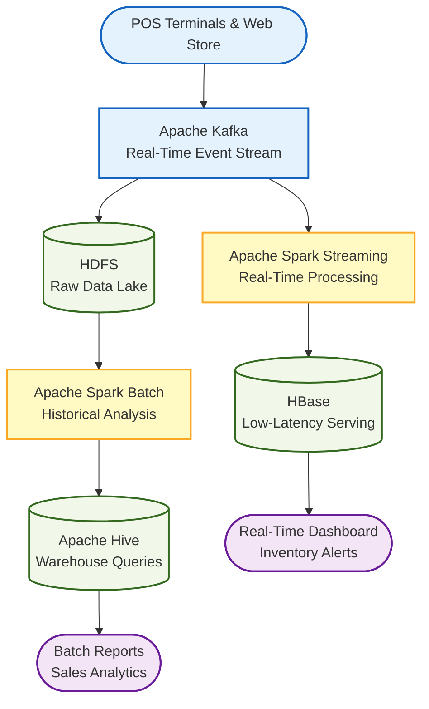
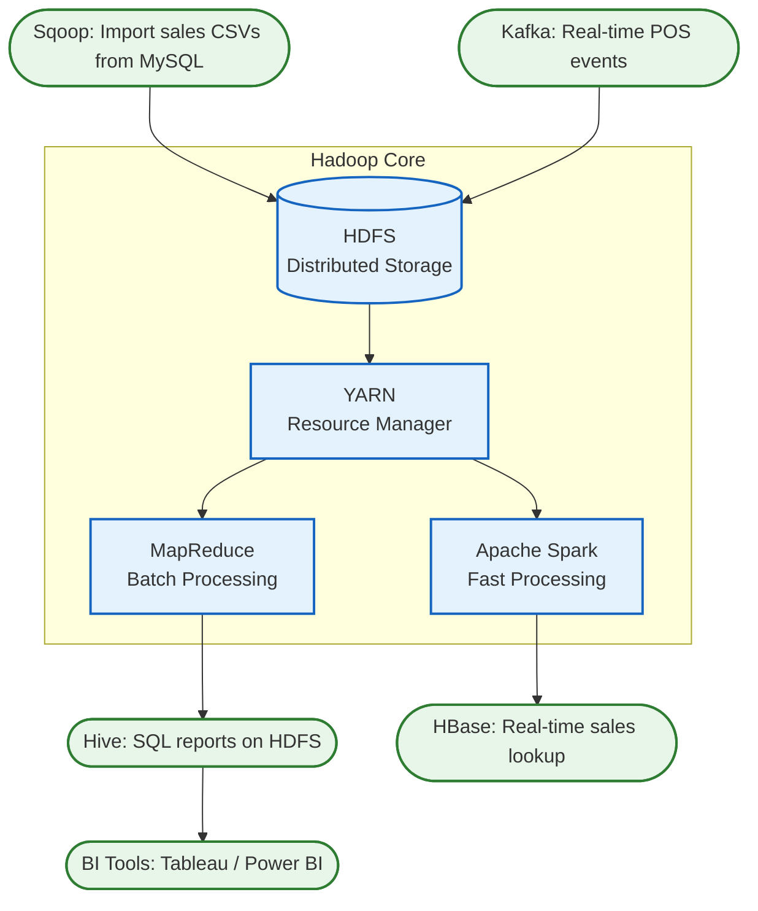
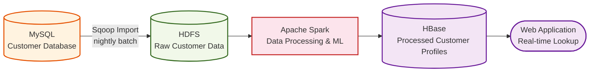
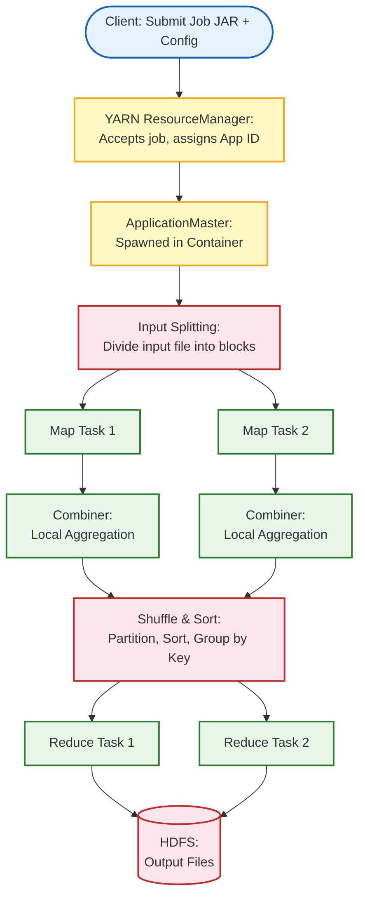
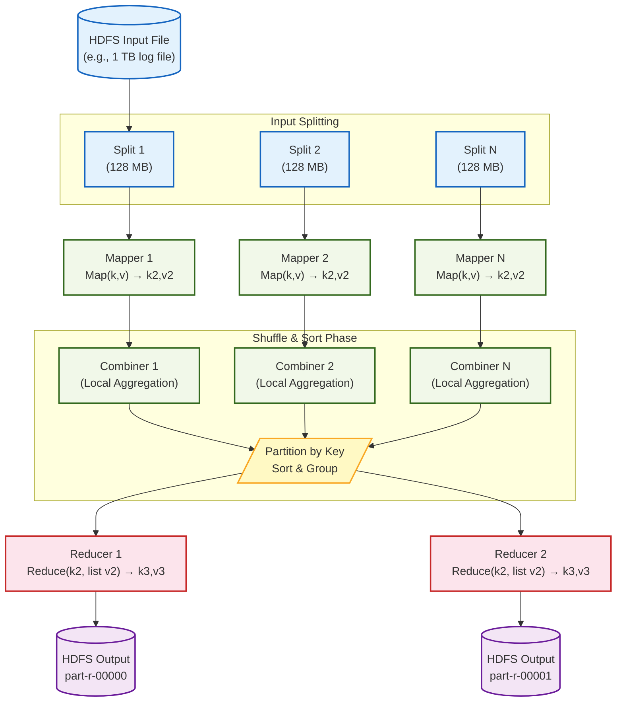

# Big Data Analytics — ISE 1 Solved Question Bank
### Modules 1, 2 & 3 | Pattern: 10 × 2 Marks + 10 × 5 Marks per Module

---

# MODULE 1: Introduction to Big Data

## Section A — 2-Mark Questions

---

**Q2. Analyze the significance of the 'Velocity' characteristic in a stock trading platform that processes thousands of transactions every second.**

Velocity refers to the speed at which data is generated and processed. In a stock trading platform, thousands of buy/sell orders arrive every millisecond. Any delay in processing can cause financial losses or missed opportunities. The platform must analyze data in real time to detect price changes, trigger alerts, and execute trades instantly. This makes Velocity the most critical Big Data characteristic in trading systems.

---

**Q3. Select suitable Big Data analytics tools required to build an analytics pipeline for an e-commerce company.**

An e-commerce analytics pipeline needs tools at each stage:
- **Ingestion**: Apache Kafka (real-time event streaming from clicks/orders).
- **Storage**: HDFS or Amazon S3 (raw data storage).
- **Processing**: Apache Spark (fast batch and stream processing).
- **Querying**: Apache Hive (SQL-like queries on large datasets).
- **Visualization**: Tableau or Power BI (business dashboards).

These tools together form a complete end-to-end pipeline from data collection to insight delivery.

---

**Q4. Assess the storage challenges faced by a healthcare organization managing petabytes of patient records and medical images.**

Healthcare organizations face several storage challenges:
1. **Volume**: Patient records, MRI scans, and X-rays produce petabytes of data that single servers cannot hold.
2. **Format Variety**: Records exist as structured tables, unstructured images (DICOM), and free-text clinical notes.
3. **Data Retention**: Regulations often require data to be kept for 7–10+ years.
4. **Access Speed**: Doctors need instant access during emergencies; slow retrieval is dangerous.
5. **Cost**: Storing petabytes of data with high availability and redundancy is extremely expensive.

---

**Q6. Justify why customer reviews, product images, and videos stored by an online shopping platform are classified as unstructured data.**

Unstructured data has no fixed, predefined format that can be stored directly in rows and columns. Customer reviews are free-form text with no consistent structure. Product images are binary pixel data with no schema. Videos are sequences of frames with associated audio, which cannot be split into table fields. None of these can be queried with a standard SQL `SELECT` statement without prior transformation. This lack of predefined structure is precisely what classifies them as unstructured data.

---

**Q7. Analyze the influence of the 'Volume' characteristic on the storage and processing of billions of e-commerce purchase transactions.**

Volume refers to the enormous scale of data produced. Billions of purchase transactions from an e-commerce platform cannot fit on a single database server. Traditional RDBMS would slow down or crash under this load. The platform must use distributed storage (like HDFS) to spread data across hundreds of machines. Processing also needs to be parallelized using frameworks like MapReduce or Spark so that analysis completes in minutes rather than days. High volume thus forces both horizontal scaling of storage and distributed computing for processing.

---

**Q8. Categorize customer records, emails, videos, and sensor data into appropriate Big Data types, providing suitable justification.**

| Data Type | Category | Justification |
|:---|:---|:---|
| **Customer Records** | Structured | Stored in fixed schemas — rows and columns (Name, Age, Account No.) |
| **Emails** | Semi-Structured | Have defined headers (From, To, Subject) but free-form body text |
| **Videos** | Unstructured | Raw binary media; no fixed schema; cannot be queried with SQL |
| **Sensor Data** | Semi-Structured | Often delivered in timestamped JSON or XML packets with key-value pairs |

---

**Q10. Evaluate the impact of the 'Volume' characteristic on the effectiveness and scalability of analytics in a rapidly growing online retail platform.**

As a retail platform grows, the volume of data — orders, clicks, product views — grows exponentially. High volume means traditional single-node analytics systems become too slow and eventually fail. The platform must invest in horizontally scalable systems (Hadoop, Spark) to distribute processing across many nodes. Scalability allows the company to add more servers as data grows without redesigning the system. However, high volume also increases infrastructure costs and operational complexity. Overall, managing volume is essential for ensuring that analytics remain fast and cost-effective as the business grows.

---

**Q13. Interpret the role of Big Data in supporting business decision-making on social media platforms such as Instagram and Facebook.**

Social media platforms generate billions of events daily — likes, shares, comments, and follows. Big Data tools collect and process these events to understand user behavior. This data feeds recommendation algorithms that decide what content to show each user. It also helps advertisers target the right users based on demographics and interests. Sentiment analysis on posts helps the platform detect hate speech or viral trends. Without Big Data, platforms like Facebook could not personalize experiences for over 3 billion users simultaneously.

---

**Q14. Analyze how traffic data, CCTV footage, weather information, and social media updates demonstrate the 'Variety' characteristic of Big Data in a smart city environment.**

Variety means data comes in multiple formats from multiple sources. In a smart city:
- **Traffic data** is structured (speed readings in tabular sensor logs).
- **CCTV footage** is unstructured (raw video streams from thousands of cameras).
- **Weather data** is semi-structured (JSON/XML feeds with temperature, humidity, wind fields).
- **Social media updates** are unstructured (free-form text, images, emojis, hashtags).

Each source uses a completely different format, making integration and analysis very challenging. This diversity of types is exactly what the 'Variety' characteristic describes.

---

**Q17. Define Big Data Analytics and classify its different types with suitable examples from disease prediction and patient care.**

**Big Data Analytics** is the process of collecting, organizing, and analyzing massive datasets to discover patterns, correlations, and insights for better decision-making.

| Type | Definition | Healthcare Example |
|:---|:---|:---|
| **Descriptive** | What happened? | Count of ICU admissions per week |
| **Diagnostic** | Why did it happen? | Identify causes of a spike in diabetes cases |
| **Predictive** | What will happen? | Predict which patients will develop sepsis in 24 hours |
| **Prescriptive** | What should we do? | Recommend drug dosage adjustments for individual patients |

---

## Section B — 5-Mark Questions

---

**Q1. Illustrate how Big Data creates value for a retail company using customer transaction data to improve its sales strategy.**

A retail company like Walmart processes millions of transactions daily from physical stores, websites, and apps. Big Data creates value at every stage of the sales strategy:

**1. Customer Segmentation**: Transaction data is analyzed to group customers by buying habits (e.g., weekly grocery buyers vs. seasonal shoppers). Targeted promotions can then be designed for each group, increasing conversion rates.

**2. Demand Forecasting**: Historical sales data combined with weather data, holidays, and local events allows the retailer to predict which products will sell more next week. This prevents stockouts and reduces overstocking.

**3. Price Optimization (Prescriptive Analytics)**: Real-time competitor pricing data from the web is combined with internal sales velocity data to dynamically adjust prices to maximize revenue.

**4. Basket Analysis (Association Rules)**: Mining transaction logs reveals that customers who buy diapers often buy beer on Friday evenings. The store can place these items near each other or create bundle offers.

**5. Churn Prevention**: By analyzing frequency, recency, and monetary value of transactions, the retailer identifies customers who have not purchased in a long time and sends them personalized discount offers.

In this way, Big Data transforms raw transaction records into strategic insights that directly improve sales, inventory, and customer retention.

---

**Q5. Interpret the concept of Big Data by identifying the various data sources generated on a social media platform, including text, images, videos, GPS locations, and user interactions.**

A social media platform like Instagram generates massive, diverse data continuously:

| Data Source | Format | Big Data Characteristic |
|:---|:---|:---|
| **Text posts, comments, captions** | Unstructured free text | Variety, Velocity |
| **Images (JPEG/PNG)** | Binary, unstructured | Variety, Volume |
| **Videos (MP4/Stories)** | Binary streams, unstructured | Volume, Velocity |
| **GPS location tags** | Semi-structured (lat/long JSON) | Variety, Veracity |
| **Likes, follows, shares** | Structured event logs (timestamps + user IDs) | Velocity, Volume |
| **Hashtags, Search queries** | Semi-structured text | Variety |

All of these sources combined produce petabytes of data every day (Volume). They arrive continuously in real time (Velocity). They span multiple formats (Variety). GPS data can sometimes be inaccurate or spoofed (Veracity). The platform must extract advertising revenue and engagement value from this data (Value). This example perfectly illustrates all 5 Vs of Big Data in action.

---

**Q9. Differentiate between Traditional Data Processing and Big Data Processing using suitable examples from the banking domain.**

| Feature | Traditional Data Processing | Big Data Processing |
|:---|:---|:---|
| **Data Volume** | Manages millions of rows (e.g., monthly statements) | Manages billions of rows (e.g., real-time global transactions) |
| **Processing Location** | Single centralized server | Distributed across hundreds of commodity nodes |
| **Scaling Model** | Vertical (buy a bigger Oracle server) | Horizontal (add more cheap Linux servers) |
| **Schema** | Schema-on-Write (define table before inserting data) | Schema-on-Read (store raw data, define schema at query time) |
| **Latency** | Batch processing overnight | Real-time or near-real-time processing |
| **Tools** | Oracle DB, SQL Server | Hadoop, Spark, Kafka, Cassandra |

**Banking Examples**:
- *Traditional*: Nightly batch job to generate end-of-day account balance statements for all customers. This runs on a single powerful database server and completes by 6 AM.
- *Big Data*: Real-time fraud detection that analyzes every card transaction globally the moment it occurs, checking for anomalies against 3 years of historical behavior across 200 million accounts — all within 50 milliseconds.

The key difference is that traditional systems are designed for structured, periodic workloads while Big Data systems are built for continuous, massive, and heterogeneous workloads.

---

**Q11. Investigate emerging trends in Big Data analytics and evaluate their influence on AI-driven demand forecasting in the logistics industry.**

Several emerging trends are reshaping Big Data analytics and directly improving logistics demand forecasting:

**1. Edge Computing**: Instead of sending all sensor data (from trucks, warehouses, and ports) to a central cloud, Edge Computing processes data near the source. This reduces latency and allows real-time rerouting of vehicles when a road is blocked.

**2. AI/ML Integration with Big Data**: Machine learning models trained on years of historical shipment data, weather patterns, and economic indicators can now predict seasonal demand spikes with over 90% accuracy. Companies like Amazon use this to pre-position inventory in warehouses closest to predicted demand areas.

**3. Streaming Analytics (Apache Flink/Kafka)**: Real-time stream processing allows logistics companies to act on live GPS feeds, traffic jams, or port delays the moment they happen, dynamically adjusting delivery routes.

**4. Digital Twins**: A virtual replica of the entire logistics network is built using real-time data. Planners can simulate the impact of a disruption (e.g., a port strike) and test solutions before committing resources.

**5. Explainable AI (XAI)**: As black-box AI makes complex demand predictions, XAI tools help logistics managers understand *why* the model is recommending a particular inventory level, building trust in automated decisions.

These trends together allow logistics companies to move from reactive operations (responding to disruptions) to proactive planning (anticipating and preventing them).

---

**Q12. Summarize the phases of the Big Data Analytics Lifecycle and highlight the significance of each phase in implementing a customer analytics solution.**

The Big Data Analytics Lifecycle consists of six key phases:


1. **Business Case Evaluation**: Define the goal clearly — e.g., "Reduce customer churn by 15%." Without a clear goal, the project wastes resources on analyzing irrelevant data.
2. **Data Identification & Collection**: Identify all relevant data sources — transaction logs, customer service calls, web clickstreams. Collecting the right data is more important than collecting all data.
3. **Data Preprocessing**: Clean missing values, remove duplicates, normalize formats across sources. Poor data quality at this stage leads to wrong insights, no matter how good the analysis is.
4. **Analytics & Modeling**: Apply ML models (e.g., churn prediction using logistic regression) or run Spark SQL queries to find patterns. This is where actual insights are generated.
5. **Visualization & Interpretation**: Present results in dashboards for business stakeholders. Even perfect analysis is useless if decision-makers cannot understand it.
6. **Deployment & Monitoring**: Deploy the model in production (e.g., trigger automated discount emails for high-churn-risk users). Continuously monitor model accuracy and retrain as customer behavior changes.

---

**Q15. Identify five major challenges in managing massive volumes of structured and unstructured organizational data, and evaluate their impact on organizational decision-making.**

| # | Challenge | Impact on Decision-Making |
|:---:|:---|:---|
| 1 | **Data Storage & Scalability** | Organizations cannot store all data cheaply; they must delete or archive older records, leading to incomplete historical analysis |
| 2 | **Data Quality & Veracity** | Dirty data (duplicates, nulls, errors) produces misleading insights; decisions based on incorrect data cause financial loss |
| 3 | **Data Integration** | Data exists in silos across departments (CRM, ERP, social media); integrating them requires expensive ETL pipelines, causing delays |
| 4 | **Data Security & Privacy** | Sensitive customer or patient data must be protected under GDPR/HIPAA; fear of breaches slows down data sharing and collaboration |
| 5 | **Talent Gap** | A shortage of skilled data engineers and scientists means organizations cannot fully exploit the data they collect; insights remain locked in raw files |

These challenges collectively slow down the analytics pipeline, reduce the reliability of conclusions, and can expose the organization to regulatory fines or competitive disadvantages.

---

**Q16. Compare the distinguishing characteristics of Big Data with traditional data by considering the migration of an e-commerce data warehouse to a Big Data platform.**

An e-commerce company starting with a traditional Oracle data warehouse and migrating to a Hadoop-based Big Data platform would observe these differences:

| Dimension | Traditional Data Warehouse (Oracle) | Big Data Platform (Hadoop) |
|:---|:---|:---|
| **Volume Handled** | Gigabytes to low Terabytes | Terabytes to Petabytes |
| **Data Types Supported** | Structured only | Structured, Semi-structured, Unstructured |
| **Scaling** | Vertical (expensive hardware upgrades) | Horizontal (add commodity servers) |
| **Processing** | Batch SQL queries; slow on large joins | Distributed MapReduce/Spark; massively parallel |
| **Schema** | Schema-on-Write (rigid) | Schema-on-Read (flexible) |
| **Cost** | High licensing + hardware costs | Low-cost commodity hardware + open-source software |
| **Real-time Support** | Limited | Built for real-time streaming (Kafka + Spark) |
| **Fault Tolerance** | Requires expensive RAID storage | Built-in replication (HDFS Replication Factor = 3) |

**Migration Insight**: After migration, the e-commerce company can now store raw clickstream logs, social media mentions, and product images alongside structured order data. It can run recommendation algorithms on all this combined data, which was impossible in the traditional warehouse.

---

**Q18. (a) Classify the different forms of Big Data generated through traffic sensors, surveillance cameras, and weather stations in a smart city. (b) Assess the associated data privacy and security challenges, and recommend suitable solutions.**

**(a) Classification of Smart City Data**:

| Source | Data Generated | Type |
|:---|:---|:---|
| **Traffic Sensors** | Vehicle count, speed, timestamps | Structured |
| **Surveillance Cameras** | Video streams, facial features | Unstructured |
| **Weather Stations** | Temperature, humidity in JSON/XML | Semi-Structured |

Traffic sensor data is numerical and timestamped, fitting neatly into tables. CCTV video is raw binary media with no predefined fields. Weather station data is tagged with keys and values in a semi-structured format.

**(b) Privacy and Security Challenges & Solutions**:

| Challenge | Description | Recommended Solution |
|:---|:---|:---|
| **Facial Recognition Privacy** | CCTV systems can identify and track individuals without consent | Implement privacy-preserving techniques like image blurring; require judicial authorization for face tracking |
| **Unauthorized Data Access** | Hackers can intercept traffic and weather feeds | Encrypt all data in transit (TLS/SSL) and at rest (AES-256 encryption in HDFS) |
| **Data Breach of Location Data** | GPS and sensor data can reveal citizens' daily movement patterns | Apply differential privacy and data anonymization before sharing data with third parties |
| **Lack of Regulation Compliance** | GDPR requires consent for collecting personal data | Establish a city data governance policy with clear data retention and access control rules |

---

**Q19. Design a basic Big Data architecture for real-time sales and inventory analysis in a retail enterprise, and justify the role of each component.**



**Component Roles**:
- **POS Terminals / Web Store**: Source of raw sales and inventory events (items sold, stock updated).
- **Apache Kafka**: Collects and buffers high-velocity event streams from all stores in real time. Acts as the entry point for the pipeline.
- **HDFS (Data Lake)**: Stores all raw events permanently for future batch analysis and model retraining. This is the single source of truth.
- **Spark Streaming**: Reads live events from Kafka and computes running totals (e.g., units sold per hour) for real-time dashboards.
- **Spark Batch**: Runs nightly jobs on HDFS data to compute weekly trends, generate demand forecasts, and update recommendation models.
- **HBase**: Stores real-time processed results with millisecond read latency, feeding live dashboards.
- **Hive**: Provides SQL querying over historical HDFS data for business analysts to generate detailed sales reports.
- **Dashboard / Reports**: Business layer for operations teams to view stock alerts and for management to review sales performance.

---

**Q20. Evaluate the contribution of Big Data analytics in improving patient outcomes using wearable devices, electronic health records, and medical imaging data.**

Big Data analytics integrates three key data sources to transform patient care:

**1. Wearable Devices (Velocity + Volume)**: Devices like smartwatches and glucose monitors generate continuous streams of heart rate, blood oxygen, and activity data. Big Data streaming platforms (Kafka + Spark) process this data in real time. If a patient's heart rate exceeds a threshold, an immediate alert is sent to their cardiologist. This enables proactive intervention before a crisis occurs.

**2. Electronic Health Records — EHR (Variety + Volume)**: EHRs contain structured data (lab results, prescriptions) and unstructured data (doctor's notes, discharge summaries). NLP algorithms process free-text clinical notes to extract diagnoses and drug interactions that structured data alone would miss. ML models trained on millions of EHRs can identify patterns that predict which patients are at high risk of readmission within 30 days.

**3. Medical Imaging (Volume + Variety)**: MRI, CT, and X-ray images are massive unstructured binary files. Deep learning models (convolutional neural networks) trained on datasets of millions of labeled scans can detect tumors, fractures, or abnormalities with accuracy matching expert radiologists. Big Data storage (HDFS) makes it feasible to store and retrieve these enormous image libraries.

**Combined Impact**: By correlating wearable real-time vitals, EHR history, and imaging results, physicians get a 360-degree view of the patient. Predictive models can recommend personalized treatment plans. This reduces misdiagnosis, prevents unnecessary hospital admissions, and ultimately saves lives.

---

# MODULE 2: Big Data Frameworks – Hadoop and NoSQL

## Section A — 2-Mark Questions

---

**Q22. Illustrate why Hadoop is an appropriate framework for processing petabytes of customer data in a multinational e-commerce company.**

Hadoop is appropriate because it is specifically designed to store and process massive datasets by distributing the work across hundreds of commodity servers. HDFS breaks customer data into 128 MB blocks and stores them across the cluster with replication, preventing data loss. MapReduce processes these blocks in parallel, so analyzing petabytes takes hours instead of weeks. Hadoop is also open-source and runs on cheap hardware, making it cost-effective at scale. Its fault tolerance means the system continues working even if individual servers fail, which is critical for a 24/7 e-commerce business.

---

**Q23. Identify the core Hadoop components required to build a Hadoop cluster for large-scale data processing and justify their roles.**

The three core Hadoop components are:
1. **HDFS (Hadoop Distributed File System)**: Stores data reliably across the cluster by splitting files into blocks and replicating each block on three different nodes.
2. **YARN (Yet Another Resource Negotiator)**: Acts as the cluster's operating system — it allocates CPU and memory resources to applications and schedules jobs across available nodes.
3. **MapReduce**: The distributed processing framework that runs computation in parallel directly on the nodes where data is stored, avoiding costly network transfers (data locality principle).

---

**Q25. Describe how HDFS blocks contribute to efficient storage and retrieval of terabytes of video files.**

HDFS splits each large video file into fixed-size blocks (default 128 MB) and distributes these blocks across multiple DataNodes. This means a 10 GB video is stored as ~80 separate blocks spread across the cluster. During retrieval, multiple DataNodes serve their blocks simultaneously in parallel, dramatically increasing throughput compared to reading from a single disk. Each block is also replicated three times across different nodes, ensuring the video remains available even if a server fails. This design makes HDFS well-suited for large, sequential-access files like videos.

---

**Q26. Difference between BASE and ACID properties.**

| Property | ACID (Relational DBs) | BASE (NoSQL DBs) |
|:---|:---|:---|
| **Full Form** | Atomicity, Consistency, Isolation, Durability | Basically Available, Soft state, Eventual Consistency |
| **Consistency** | Strict — all reads see the latest write immediately | Eventual — data becomes consistent over time, not instantly |
| **Availability** | May block reads/writes during failures to maintain consistency | Always available; returns a response even if it may be stale |
| **Use Case** | Banking transactions, financial systems | Social media feeds, shopping carts, distributed caches |

ACID guarantees correctness above all else. BASE sacrifices strict consistency to achieve higher availability and scalability.

---

**Q27. Interpret the role of the Secondary NameNode and infer whether it can replace the NameNode in a Hadoop cluster.**

The Secondary NameNode is a maintenance helper for the primary NameNode. Its only job is to periodically merge the NameNode's edit log (a record of recent changes) with the filesystem image (`fsimage`) to create a clean checkpoint. This prevents the edit log from growing too large, which would slow down NameNode restarts. **The Secondary NameNode cannot replace a failed NameNode.** It does not receive real-time updates and is always slightly behind the primary. If the NameNode fails, the Secondary NameNode cannot immediately take over, making it unsuitable as a hot standby. Modern Hadoop uses an Active-Standby NameNode setup with ZooKeeper for true fault tolerance.

---

**Q28. Justify why HDFS is unsuitable for storing millions of log files, each only a few kilobytes in size.**

HDFS is optimized for large files because every file — regardless of size — requires metadata entries stored in the NameNode's RAM. A file of 1 KB still occupies ~150 bytes of NameNode memory for its metadata. Storing 100 million tiny log files would consume ~15 GB of NameNode RAM just for metadata, potentially crashing it. Additionally, HDFS blocks are 128 MB each. A 1 KB file wastes an entire 128 MB block on disk, causing massive storage inefficiency. HDFS works best for files that are at least several hundred megabytes. For millions of small files, HBase or a sequence file format that bundles small files together is more appropriate.

---

**Q30. Investigate how Hadoop addresses the challenges associated with processing billions of user interactions on a social media platform.**

Hadoop addresses social media processing challenges in these ways:
- **Volume**: HDFS distributes billions of interaction records (likes, comments, shares) across hundreds of DataNodes, so no single disk overflows.
- **Parallel Processing**: MapReduce splits the analysis task (e.g., counting total likes per post) across all nodes simultaneously, completing in minutes.
- **Fault Tolerance**: If a node fails mid-job, Hadoop automatically re-runs only the failed tasks on a healthy node.
- **Data Locality**: Hadoop moves computation to where data already resides, minimizing network traffic and speeding up jobs.
- **Ecosystem Support**: Pig scripts process raw event logs; Hive runs SQL-like engagement reports; HBase stores user activity profiles for real-time access.

---

**Q34. Demonstrate suitable Hadoop commands to create directories, upload files, and verify stored data in HDFS.**

```bash
# 1. Create a directory in HDFS
hadoop fs -mkdir /user/student/sales_data

# 2. Upload a local file to HDFS
hadoop fs -put /local/path/transactions.csv /user/student/sales_data/

# 3. List files in an HDFS directory
hadoop fs -ls /user/student/sales_data/

# 4. View the content of an HDFS file
hadoop fs -cat /user/student/sales_data/transactions.csv

# 5. Check file block info and replication status
hdfs fsck /user/student/sales_data/transactions.csv -files -blocks -locations
```

These commands use the `hadoop fs` (or `hdfs dfs`) interface to interact with HDFS just like a Unix filesystem.

---

**Q38. Evaluate the role of Apache Spark within the Hadoop ecosystem and justify its suitability for migrating from MapReduce to support real-time analytics.**

Apache Spark is an in-memory distributed computing engine that can run on top of YARN and read/write data from HDFS. Unlike MapReduce, which writes intermediate results to disk after every step, Spark keeps intermediate data in RAM throughout the computation. This makes Spark up to 100× faster than MapReduce for iterative algorithms (like ML model training). Spark also includes built-in libraries for streaming (Spark Streaming), SQL (Spark SQL), machine learning (MLlib), and graph processing (GraphX) — removing the need for multiple separate tools. It supports both batch and real-time stream processing with a single unified API. These features make Spark the natural successor to MapReduce for any analytics platform requiring near-real-time results.

---

**Q40. Differentiate the responsibilities of the Map task and Reduce task within the MapReduce framework.**

| Aspect | Map Task | Reduce Task |
|:---|:---|:---|
| **Input** | Raw data records from HDFS splits | Grouped intermediate `<key, list of values>` from Shuffle phase |
| **Function** | Transforms and filters raw records | Aggregates or summarizes grouped values |
| **Output** | Intermediate `<key, value>` pairs | Final `<key, value>` pairs written to HDFS |
| **Parallelism** | One mapper per input split; runs in parallel | One reducer per key partition; fewer than mappers |
| **Example (Word Count)** | Reads a line, emits `<word, 1>` for each word | Sums all 1s for each word, emits `<word, total_count>` |

---

## Section B — 5-Mark Questions

---

**Q21. Develop a case study demonstrating how Big Data Analytics and Machine Learning enhance Netflix's personalized recommendation system.**

**Background**: Netflix streams content to over 230 million subscribers globally. Without personalization, users would face an overwhelming catalogue of 15,000+ titles and abandon the platform.

**Data Sources**:
- **Viewing history**: What each user watched, when, and for how long.
- **Interaction data**: Pause, rewind, fast-forward events; ratings; search queries.
- **Device data**: Whether the user watches on TV, phone, or laptop.
- **Geographic and time data**: Country, time of day, day of week.

**Big Data Infrastructure**:
Netflix uses Apache Kafka to stream all viewing events in real time. Data is stored in Amazon S3 (their data lake). Apache Spark processes this data at scale for both batch (nightly model retraining) and real-time (session-level recommendations) workloads.

**ML Algorithms Used**:
1. **Collaborative Filtering**: Identifies users with similar taste profiles ("users who watched A and B also watched C").
2. **Content-Based Filtering**: Analyses the metadata of shows (genre, actors, director) to recommend similar titles.
3. **Deep Learning**: Neural networks predict the probability that a specific user will enjoy a specific title at a specific time.

**Impact**:
- Netflix claims that 80% of content watched is driven by recommendations, not manual search.
- Personalization is estimated to save Netflix $1 billion per year by reducing subscriber churn.
- Thumbnail images are also A/B tested using Big Data — different users see different artwork for the same show based on what is predicted to attract them most.

This case study demonstrates that Big Data and ML work together to deliver individualized experiences at a scale that is impossible with traditional systems.

---

**Q24. Analyze how Hadoop's fault tolerance mechanism ensures uninterrupted processing when a DataNode fails unexpectedly.**

Hadoop is architected to treat hardware failure as a normal, expected event rather than an exception. Here is how it handles DataNode failure step by step:

**Step 1 — Heartbeat Detection**: Every DataNode sends a heartbeat signal to the NameNode every 3 seconds. If the NameNode does not receive a heartbeat for 10 minutes, it marks that DataNode as dead.

**Step 2 — Block Re-replication**: The NameNode checks its metadata to identify all blocks that were stored on the dead DataNode. For each block, the replication count has dropped below the target (default = 3). The NameNode immediately instructs healthy DataNodes (which hold other replicas of those blocks) to copy the blocks to new, healthy DataNodes to restore the full replication factor.

**Step 3 — Task Failure Recovery**: If a MapReduce task was running on the dead DataNode, the ApplicationMaster detects the failure (the task stops sending progress updates). It reschedules the failed task on another healthy node. The replacement task reads the input data from a surviving replica on another DataNode.

**Step 4 — Rack-Aware Placement**: HDFS originally places block replicas across different racks. This means a DataNode failure — or even the failure of an entire rack — will never result in data loss because at least one replica always exists on a different rack.

**Result**: The user's job continues to completion, possibly a few minutes slower, but with no data loss and no need for administrator intervention. This is what makes Hadoop reliable on cheap commodity hardware.

---

**Q29. Evaluate the advantages and limitations of adopting MongoDB as a NoSQL database for migration from a relational database.**

**Advantages of MongoDB**:

| Advantage | Detail |
|:---|:---|
| **Flexible Schema** | Documents in the same collection can have different fields. Adding a new attribute requires no `ALTER TABLE` command — just insert the new field. |
| **Horizontal Scalability (Sharding)** | MongoDB distributes data across multiple servers using a shard key, allowing linear scaling of read/write throughput. |
| **Rich Document Model** | Related data can be embedded in a single document (e.g., a customer document containing their entire order history), eliminating expensive multi-table JOINs. |
| **High Availability (Replica Sets)** | Automatic failover through replica sets ensures uptime even when the primary node crashes. |
| **Developer Productivity** | JSON-like BSON format maps naturally to objects in most programming languages, reducing impedance mismatch. |

**Limitations of MongoDB**:

| Limitation | Detail |
|:---|:---|
| **No Multi-Document ACID Transactions (Legacy)** | Older versions of MongoDB lacked full ACID transactions across multiple documents, making it unsuitable for financial systems. (Fixed in MongoDB 4.0+ but with performance overhead.) |
| **No JOINs** | Complex relational queries requiring multiple table joins must be restructured. This requires redesigning the data model and application logic. |
| **Higher Memory Usage** | Storing full field names in every document (unlike column names in relational tables) increases storage overhead. |
| **Data Duplication** | Embedding related data in documents (instead of normalizing) leads to data duplication and update anomalies. |

**Recommendation**: MongoDB is excellent for content management, product catalogs, and user profiles where data is document-centric and schemas evolve frequently. It is not recommended for financial ledgers or systems requiring complex multi-record atomic transactions.

---

**Q31. Differentiate between an RDBMS and a NoSQL database for managing customer transactions and clickstream data, and recommend the most suitable solution.**

| Feature | RDBMS (e.g., MySQL, PostgreSQL) | NoSQL (e.g., Cassandra, MongoDB) |
|:---|:---|:---|
| **Data Model** | Tables with fixed rows and columns | Flexible: Key-Value, Document, Column-Family, Graph |
| **Schema** | Rigid; changes require ALTER TABLE | Dynamic; schema can evolve without migration |
| **Scaling** | Vertical (expensive) | Horizontal (cheap commodity servers) |
| **ACID Compliance** | Full ACID transactions | BASE model (Eventual Consistency) |
| **Query Language** | Standard SQL — very powerful for complex joins | NoSQL query APIs — simpler but limited in joins |
| **Performance** | Degrades significantly at billions of rows | Consistent at petabyte scale |
| **Use Case** | Structured financial data with complex relationships | High-velocity, high-volume, variable-format data |

**Recommendation**:
- **Customer Transactions (Payments, Balances)**: Use an **RDBMS** (or NewSQL like CockroachDB). Financial transactions require strict ACID compliance to guarantee that money is never double-debited or lost in a crash.
- **Clickstream Data** (page views, button clicks, scroll depth): Use **Apache Cassandra** (NoSQL Column-Family store). Clickstream data arrives at extremely high velocity from millions of users simultaneously. Cassandra's AP design (always accepts writes, even during partial network failures) is ideal for this workload. A hybrid architecture using both systems is the most practical enterprise solution.

---

**Q32. Interpret the Hadoop architecture and describe how it integrates with the Hadoop ecosystem for processing sales records.**



**How Integration Works for Sales Records**:
1. **Sqoop** imports historical sales CSVs from the company's MySQL database into HDFS overnight.
2. **Kafka** streams live point-of-sale events into HDFS in real time during business hours.
3. **YARN** manages resources and schedules both Spark and MapReduce jobs on the cluster.
4. **Spark** runs rapid sales aggregation (e.g., top-selling products per hour) that is too slow for MapReduce.
5. **Hive** provides SQL-like querying, allowing business analysts to run monthly sales trend queries without knowing Java.
6. **HBase** stores pre-computed sales summaries for near-instantaneous lookup by the web dashboard.

---

**Q33. Illustrate the HBase architecture and discuss how it enables efficient storage and retrieval of billions of product records.**

**HBase Architecture**:
HBase is a distributed, column-family database built on top of HDFS. Its key components are:

| Component | Role |
|:---|:---|
| **HMaster** | Assigns regions to RegionServers; manages schema changes and load balancing |
| **RegionServer** | Serves read/write requests for its assigned Regions; hosts multiple Regions |
| **Region** | A contiguous range of rows identified by a row key range |
| **MemStore** | In-memory write buffer inside each RegionServer; newly written data is buffered here first |
| **HFile (StoreFile)** | Sorted, immutable data file on HDFS where MemStore data is flushed |
| **WAL (Write-Ahead Log)** | Ensures durability; all writes are logged before being put in MemStore |
| **ZooKeeper** | Coordinates distributed state — tracks which RegionServer is active and handles failover |

**Efficient Storage of Billions of Product Records**:
- **Row Key Design**: Products are stored by a composite row key (e.g., `categoryId_productId`). This keeps products in the same category physically adjacent on disk, enabling fast range scans.
- **Column Families**: Product attributes are grouped (e.g., `cf:name`, `cf:price`, `cf:stock`) and stored together on disk, so reading only the price column does not require loading unrelated image data.
- **Region Splitting**: When a Region grows too large, HBase automatically splits it and assigns the new Region to a different RegionServer, distributing load evenly.
- **Bloom Filters**: Stored in HFiles to skip files that definitely do not contain a requested row key, speeding up random reads.

This architecture allows HBase to deliver millisecond-latency reads and writes across billions of product records, which is impossible with a traditional relational database.

---

**Q35. Design a Hadoop-based data pipeline to import customer data from MySQL, process it using Spark, and store the results in HBase.**



**Pipeline Steps**:

**Step 1 — Data Import (Sqoop)**:
```bash
sqoop import --connect jdbc:mysql://db-server/customers \
  --username root --password secret \
  --table customer_transactions \
  --target-dir /hdfs/raw/customers \
  --fields-terminated-by ',' -m 4
```
Sqoop runs 4 parallel import mappers to copy the customer table from MySQL to HDFS as CSV files overnight.

**Step 2 — Data Processing (Spark)**:
```python
from pyspark.sql import SparkSession
spark = SparkSession.builder.appName("CustomerAnalytics").getOrCreate()

# Load raw customer data from HDFS
df = spark.read.csv("hdfs:///hdfs/raw/customers", header=True)

# Compute customer lifetime value
summary = df.groupBy("customer_id") \
            .agg({"purchase_amount": "sum", "order_id": "count"}) \
            .withColumnRenamed("sum(purchase_amount)", "lifetime_value") \
            .withColumnRenamed("count(order_id)", "order_count")
```

**Step 3 — Store Results (HBase)**:
The processed summary DataFrame is written to HBase using the Spark-HBase connector, with `customer_id` as the HBase row key. This enables the web application to look up any customer's lifetime value with millisecond latency.

---

**Q36. Interpret the role of major Hadoop ecosystem components and demonstrate how they collectively support Big Data analytics.**

The Hadoop ecosystem is a collection of tools that each solve a specific problem in the Big Data pipeline. They are designed to work together:

| Component | Role | How it connects |
|:---|:---|:---|
| **HDFS** | Distributed storage | All other components read from / write to HDFS |
| **YARN** | Resource management | Runs and manages jobs for MapReduce, Spark, Pig, and Hive |
| **MapReduce** | Batch processing engine | Processes HDFS data; Hive and Pig translate queries into MR jobs |
| **Apache Pig** | ETL scripting (Pig Latin) | Transforms raw HDFS data into structured formats for Hive analysis |
| **Apache Hive** | Data warehousing / SQL | Allows SQL analysts to query HDFS data without writing Java |
| **Apache HBase** | Real-time NoSQL DB | Stores processed results from Spark/MR for low-latency lookups |
| **Apache Sqoop** | RDBMS-to-HDFS bridge | Imports data from MySQL/Oracle into HDFS for processing |
| **Apache Spark** | Fast in-memory processing | Replaces MapReduce for iterative and streaming analytics |

**Collective Workflow**: Sqoop imports raw data from MySQL into HDFS. Pig cleans and transforms it. Hive runs analytical SQL queries for reporting. Spark trains ML models on the data. Results are stored in HBase for real-time serving. YARN schedules all of these jobs efficiently across the cluster. This ecosystem eliminates the need for separate, expensive proprietary tools for each task.

---

**Q37. Trace the sequence of operations involved in reading and writing data within HDFS after uploading a large dataset for analytics.**

**Write Operation (Client uploads `sales_data.csv`, size = 512 MB)**:

1. **Client contacts NameNode**: Requests to write `/data/sales_data.csv`.
2. **NameNode responds**: Sends a list of DataNodes for each of the 4 blocks (512 MB / 128 MB = 4 blocks), choosing nodes based on rack-awareness policy.
3. **Client writes Block 1**: Client streams Block 1 data to DataNode A. DataNode A forwards it to DataNode B (pipeline replication), which forwards it to DataNode C.
4. **Acknowledgement**: Once all 3 replicas of Block 1 are safely written, DataNodes send an ACK back through the pipeline to the client.
5. **Repeat for Blocks 2, 3, 4**.
6. **Close file**: Client notifies NameNode that the write is complete. NameNode updates its metadata: `sales_data.csv → [Block1@DN-A, Block2@DN-B, Block3@DN-C, Block4@DN-A]`.

**Read Operation (Analytics job reads `sales_data.csv`)**:

1. **Client contacts NameNode**: Requests the block locations for `sales_data.csv`.
2. **NameNode responds**: Returns the list of DataNodes for each block, sorted by proximity to the client (data locality — preferring the same node, then same rack).
3. **Client reads blocks in parallel**: The client connects directly to each DataNode and streams the block data concurrently.
4. **Data integrity check**: The client verifies the checksum of each received block. If a block is corrupted, the client automatically fetches it from a different replica.

---

**Q39. (a) Compare key-value, document, column-family, and graph databases. (b) Evaluate Cassandra as an alternative to a traditional RDBMS.**

**(a) NoSQL Data Model Comparison**:

| Feature | Key-Value Store | Document Store | Column-Family Store | Graph Database |
|:---|:---|:---|:---|:---|
| **Data Unit** | Key + Value (opaque blob) | Key + JSON/BSON document | Row key + column families | Nodes + Edges + Properties |
| **Query Power** | Only by exact key | Rich queries on nested fields | Row key + column range scans | Graph traversal queries |
| **Scalability** | Extremely high | High | Very high | Moderate |
| **Best For** | Caching, sessions | Product catalogs, CMS | Time-series, sensor logs | Social networks, recommendations |
| **Example** | Redis, DynamoDB | MongoDB, CouchDB | Cassandra, HBase | Neo4j, Amazon Neptune |

**(b) Cassandra vs. Traditional RDBMS**:

**Benefits of Cassandra**:
- **Linear Scalability**: Adding a server to the cluster increases read/write throughput proportionally. MySQL performance degrades sharply beyond a single-server limit.
- **High Availability**: Cassandra uses a peer-to-peer ring architecture with no single master. Any node failure is seamlessly handled without downtime.
- **Optimized for Write-Heavy Workloads**: Cassandra's log-structured storage (LSM-tree) is extremely fast for ingesting millions of events per second.
- **Multi-Datacenter Replication**: Built-in geo-distributed replication for disaster recovery.

**Limitations of Cassandra**:
- **No ACID Transactions**: Cassandra cannot guarantee that multi-row operations are atomic, making it unsuitable for financial ledgers.
- **No JOIN Operations**: All data access must be pre-modelled around specific query patterns. Complex ad-hoc queries are very difficult.
- **Eventual Consistency**: Data written to one node may take milliseconds to replicate to others, causing brief inconsistencies.

**Verdict**: Cassandra is an excellent RDBMS alternative for IoT sensor data, e-commerce clickstreams, and messaging platforms, but it should not be used for applications requiring strict transactional correctness.

---

# MODULE 3: MapReduce Paradigm

## Section A — 2-Mark Questions

---

**Q41. Examine the role of the Reducer in generating the final output of a MapReduce job.**

The Reducer receives sorted and grouped `<key, List(values)>` pairs from the Shuffle and Sort phase. It iterates over each group and applies an aggregation or summarization function to the list of values. For example, in a word count job, the Reducer receives `<"hello", [1, 1, 1]>` and sums the values to produce `<"hello", 3>`. The Reducer writes its output directly to HDFS as the final result of the job. Each Reducer is assigned a distinct, non-overlapping partition of keys, so multiple Reducers can work in parallel without interfering.

---

**Q42. Analyze how the "Grouping by Key" phase contributes to the correctness of MapReduce execution.**

The Grouping by Key phase is part of the Shuffle and Sort step. After all Map outputs are sorted, the framework merges all `<key, value>` pairs that share the same key into a single `<key, List(values)>` record and sends it to one Reducer. Without this grouping, a Reducer might process only a subset of values for a key, producing an incorrect result. For example, if `<"apple", 1>` and `<"apple", 1>` are sent to different Reducers, each would output `<"apple", 1>` instead of `<"apple", 2>`. Grouping guarantees that all values for a key reach exactly one Reducer, which is the foundation of MapReduce correctness.

---

**Q43. Differentiate the implementation of Union and Intersection operations using MapReduce.**

| Aspect | Union ($R \cup S$) | Intersection ($R \cap S$) |
|:---|:---|:---|
| **Map Output** | Emit `<tuple, tuple>` for every tuple in both R and S | Emit `<tuple, 'R'>` or `<tuple, 'S'>` depending on which relation the tuple comes from |
| **Reduce Logic** | Output the key once (removing duplicates from the key grouping) | Output the key only if the grouped values contain BOTH `'R'` AND `'S'` |
| **Result** | All distinct tuples from both relations | Only tuples that appear in both relations |

The critical difference is that Union simply deduplicates all tuples, while Intersection uses the relation name tag to confirm joint membership before emitting.

---

**Q44. Illustrate the use of Grouping and Aggregation in MapReduce using a suitable application scenario.**

**Scenario**: Calculate the total sales per product category from a sales log.

**Input data**:
```
Electronics, 5000
Clothing, 1500
Electronics, 3000
Clothing, 2000
Electronics, 7000
```

**Map Phase**: The Mapper emits `<category, amount>` for each line:
- `<Electronics, 5000>`, `<Clothing, 1500>`, `<Electronics, 3000>`, `<Clothing, 2000>`, `<Electronics, 7000>`

**Shuffle & Sort Phase (Grouping by Key)**:
- `<Clothing, [1500, 2000]>`
- `<Electronics, [5000, 3000, 7000]>`

**Reduce Phase**: The Reducer sums each list:
- `<Clothing, 3500>`
- `<Electronics, 15000>`

This is the classic grouping and aggregation pattern — identical to a SQL `GROUP BY category, SUM(amount)` operation.

---

**Q45. Identify and justify a real-world application where MapReduce provides an efficient solution for large-scale data processing.**

**Application: Web Search Index Building (e.g., Google)**

When Google crawls billions of web pages, it needs to build an inverted index — a mapping from every word to the list of pages that contain it. This is exactly a MapReduce problem. The **Mapper** processes each web page document and emits `<word, pageURL>` pairs. The **Reducer** collects all URLs for each word and builds the index entry `<word, [URL1, URL2, URL3, ...]>`. Without MapReduce's parallelism, indexing the entire web would take months. With MapReduce running on thousands of machines, Google can re-index the web in hours. This is why MapReduce was originally invented at Google.

---

**Q46. Assess the advantages of the MapReduce programming model for distributed data processing.**

1. **Simplicity**: Programmers only write two functions — Map and Reduce. The framework handles all parallel execution, data distribution, and fault tolerance automatically.
2. **Scalability**: Adding more nodes to the cluster linearly increases processing capacity. The same program can process 1 GB or 1 PB without code changes.
3. **Fault Tolerance**: Failed tasks are automatically re-executed on healthy nodes. Data loss is prevented by HDFS replication.
4. **Data Locality**: The framework moves computation to the node where data already resides, minimizing network traffic.
5. **Language Agnostic (Hadoop Streaming)**: MapReduce programs can be written in any language (Python, Ruby) using Hadoop Streaming, not just Java.

---

**Q47. Evaluate the role of Combiners in optimizing MapReduce jobs with a suitable example.**

A Combiner is a "mini-Reducer" that runs on the Mapper's local machine before data is sent over the network to the Reducer. It performs partial aggregation on the Map output, reducing the volume of data transferred across the cluster.

**Example (Word Count)**:
- Without Combiner: A single node processing a paragraph might emit 100 pairs of `<"the", 1>`. All 100 pairs are sent over the network to the Reducer.
- With Combiner: The Combiner on that node sums them locally first, sending only `<"the", 100>` — a 100× reduction in network traffic.

**Benefits**: Reduces network I/O, speeds up the Shuffle phase, and lowers the load on Reducers. The Combiner must be used only for commutative and associative operations (like SUM, MIN, MAX), not operations like AVERAGE (which cannot be partially aggregated without losing correctness).

---

**Q49. Compare traditional parallel processing with distributed processing, highlighting their methods and limitations.**

| Feature | Traditional Parallel Processing | Distributed Processing (MapReduce/Spark) |
|:---|:---|:---|
| **Architecture** | Multiple CPUs/cores on a single powerful machine (SMP) | Multiple commodity machines connected via network |
| **Communication** | Shared memory (extremely fast) | Network message passing (slower) |
| **Scalability** | Limited by the maximum hardware of one machine | Nearly unlimited — just add more machines |
| **Cost** | High — requires expensive supercomputers or mainframes | Low — built on cheap commodity servers |
| **Fault Tolerance** | Single machine failure = total failure | Individual node failures are automatically recovered |
| **Programming Model** | Complex thread management (race conditions, deadlocks) | Simple Map/Reduce functions; framework handles parallelism |
| **Best For** | High-performance computing (weather modeling, physics simulations) | Large-scale data analytics (web logs, transactions, social data) |

---

**Q54. Interpret the execution of relational algebra operations using MapReduce, emphasizing the roles of Mapper and Reducer.**

Relational algebra operations map naturally onto MapReduce because the framework's core behavior — grouping all values with the same key — mirrors the behavior of relational operations that group and compare tuples.

- **Selection**: The Mapper acts as a filter. It reads each tuple and decides whether it passes the condition. The Reducer is an identity (outputs whatever the Mapper sends). The Mapper does all the work.
- **Projection**: The Mapper strips unwanted columns. The Reducer eliminates duplicate tuples that result from removing columns.
- **Union / Intersection / Difference**: The Mapper tags each tuple with its source relation name. The Reducer checks which tags are present and applies the set logic to decide whether to emit the tuple.
- **Natural Join**: The Mapper tags tuples with their relation name and uses the join key as the MapReduce key. The Reducer receives all tuples sharing the same join-key value and performs the cross-product to assemble joined tuples.

In all cases, the Mapper transforms/filters/tags data, and the Reducer applies the relational logic on the grouped result.

---

**Q58. Compare the execution of a MapReduce program with and without a Combiner, and infer its impact on performance.**

**Without Combiner**:
All intermediate `<key, value>` pairs produced by every Mapper are serialized, written to local disk, and then transferred across the network to the appropriate Reducer. For a word count job across 1 TB of text, millions of `<"the", 1>` pairs travel the network. The Reducer alone must sum all of them.

**With Combiner**:
Before the data leaves the Mapper's machine, the Combiner locally aggregates all pairs with the same key. Instead of sending 1,000,000 pairs of `<"the", 1>`, it sends one pair `<"the", 1000000>`. Only the pre-aggregated result crosses the network.

**Performance Impact**:

| Metric | Without Combiner | With Combiner |
|:---|:---|:---|
| **Network Data Transferred** | Very high (all raw pairs) | Very low (pre-aggregated pairs) |
| **Reducer Load** | High (must process all raw pairs) | Low (sums fewer, larger values) |
| **Job Completion Time** | Slower | Significantly faster |

**Inference**: Combiners are a critical optimization. They can reduce network data by 50–90% for aggregation-heavy jobs, dramatically improving performance. However, they must only be used when the aggregation is both commutative and associative.

---

## Section B — 5-Mark Questions

---

**Q48. Develop the pseudo code for implementing the Matrix-Vector Multiplication algorithm using MapReduce.**

**Problem Setup**: Matrix $M$ of size $m \times n$, vector $v$ of length $n$. Compute $x = M \times v$ where $x_i = \sum_{j=1}^{n} M_{ij} \times v_j$.

**Assumption**: Vector $v$ is small enough to fit in memory on each node (loaded via Distributed Cache).

```
=== DRIVER SETUP ===
Load vector v into Hadoop Distributed Cache so every node can read it.

=== MAPPER ===
Input:  Key = (i, j), Value = M[i][j]
         (i = row index, j = column index, M[i][j] = matrix cell value)

function Map(key (i, j), value M_ij):
    Read v[j] from Distributed Cache (vector is in local memory)
    product = M_ij * v[j]
    Emit(i, product)
    // Group all partial products for row i together

=== REDUCER ===
Input:  Key = i, Values = List of partial products [M[i][1]*v[1], M[i][2]*v[2], ...]

function Reduce(key i, values partialProducts):
    x_i = 0
    for each product in partialProducts:
        x_i = x_i + product
    Emit(i, x_i)
    // x_i is the final i-th element of the result vector x

=== OUTPUT ===
Each Reducer outputs one line: (i, x_i)
Combining all outputs gives the result vector x.
```

**Example Trace**:
- Matrix: $M = \begin{bmatrix} 1 & 2 \\ 3 & 4 \end{bmatrix}$, Vector: $v = \begin{bmatrix} 2 \\ 3 \end{bmatrix}$

- **Map outputs**: `<0, 1×2=2>`, `<0, 2×3=6>`, `<1, 3×2=6>`, `<1, 4×3=12>`
- **After Shuffle**: `<0, [2, 6]>`, `<1, [6, 12]>`
- **Reduce outputs**: `<0, 8>`, `<1, 18>`
- **Result**: $x = \begin{bmatrix} 8 \\ 18 \end{bmatrix}$ ✓

---

**Q50. Examine the complete execution flow of a MapReduce job from job submission to output generation.**



**Detailed Steps**:
1. **Job Submission**: The client calls `hadoop jar job.jar WordCount /input /output`. The job JAR, configuration, and input/output paths are uploaded to HDFS.
2. **Resource Allocation**: YARN's ResourceManager accepts the job, assigns an Application ID, and spawns an ApplicationMaster in a Container.
3. **Task Planning**: The ApplicationMaster analyses the input splits (one per HDFS block) and requests Containers from the ResourceManager for each Map and Reduce task.
4. **Map Execution**: Each Mapper reads its assigned input split, applies the Map function, and writes intermediate `<key, value>` pairs to its local disk (not HDFS).
5. **Combiner (optional)**: The Combiner aggregates local Map output to reduce the amount of data sent over the network.
6. **Shuffle and Sort**: Map outputs are partitioned by key (using a hash function), transferred to the appropriate Reducer nodes, merged, and sorted. All values sharing the same key are grouped together.
7. **Reduce Execution**: Each Reducer processes its key-group list and writes final output directly to HDFS.
8. **Job Completion**: The ApplicationMaster reports success to the ResourceManager. The client's `hadoop jar` command exits with status 0.

---

**Q51. Investigate the implementation of Matrix-Vector Multiplication using the MapReduce programming model.**

Matrix-Vector Multiplication is fundamental in machine learning (e.g., linear regression, neural networks) and graph algorithms. MapReduce enables this computation over matrices too large to fit in a single machine's memory.

**Setup**:
- Matrix $M$: Size $m \times n$, stored as a text file: each line contains `row_i, col_j, value`
- Vector $v$: Size $n$, small enough to fit in RAM on every node (broadcast via Distributed Cache)
- Goal: Compute output vector $x$ where $x_i = \sum_{j=0}^{n-1} M[i][j] \times v[j]$

**Key Design Insight**: Every element in row $i$ of the matrix contributes to exactly one element of the output — $x_i$. Therefore, the natural grouping key for the Reducer is the row index $i$.

**Map Phase**:
```
For each record (i, j, M_ij) in the matrix file:
    Read v[j] from Distributed Cache
    Emit( key=i, value=M_ij * v[j] )
```
This produces one output pair per matrix cell. All partial products that contribute to $x_i$ are keyed by $i$.

**Shuffle Phase**: The framework automatically groups all pairs with the same key $i$ together:
`<i, [M[i][0]*v[0], M[i][1]*v[1], ..., M[i][n-1]*v[n-1]]>`

**Reduce Phase**:
```
For key i, values = [p0, p1, ..., p_{n-1}]:
    x_i = sum(values)
    Emit( key=i, value=x_i )
```

**Worked Example**:
$$M = \begin{bmatrix} 2 & 1 & 3 \\ 0 & 4 & 2 \end{bmatrix}, \quad v = \begin{bmatrix} 1 \\ 2 \\ 1 \end{bmatrix}$$

- Map outputs: `<0, 2*1=2>`, `<0, 1*2=2>`, `<0, 3*1=3>`, `<1, 0*1=0>`, `<1, 4*2=8>`, `<1, 2*1=2>`
- After shuffle: `<0, [2,2,3]>`, `<1, [0,8,2]>`
- Reduce: `<0, 7>`, `<1, 10>`
- Result: $x = \begin{bmatrix} 7 \\ 10 \end{bmatrix}$

Verification: $x_0 = 2(1) + 1(2) + 3(1) = 7$ ✓, $x_1 = 0(1) + 4(2) + 2(1) = 10$ ✓

---

**Q52. Perform the Projection operation using MapReduce for the given relation and illustrate each execution phase.**

**Problem**: Given the relation `Employee(EmpID, Name, Department, Salary)`, perform the projection $\pi_{\text{Name, Department}}(\text{Employee})$ to extract only Name and Department, removing duplicates.

**Input Relation**:
```
101, Alice, Engineering, 70000
102, Bob, Marketing, 55000
103, Alice, Engineering, 68000
104, Charlie, Marketing, 60000
```

**Map Phase**:
For each tuple, keep only the projected attributes (Name, Department) and emit the reduced tuple as both key and value:
```
Input:  (101, Alice, Engineering, 70000)  →  Emit: <"Alice,Engineering", "Alice,Engineering">
Input:  (102, Bob, Marketing, 55000)      →  Emit: <"Bob,Marketing", "Bob,Marketing">
Input:  (103, Alice, Engineering, 68000)  →  Emit: <"Alice,Engineering", "Alice,Engineering">
Input:  (104, Charlie, Marketing, 60000)  →  Emit: <"Charlie,Marketing", "Charlie,Marketing">
```

**Shuffle & Sort Phase (Grouping by Key)**:
```
"Alice,Engineering"   →  ["Alice,Engineering", "Alice,Engineering"]
"Bob,Marketing"       →  ["Bob,Marketing"]
"Charlie,Marketing"   →  ["Charlie,Marketing"]
```

**Reduce Phase**:
For each key, emit the key exactly once regardless of how many values are in the list (this removes duplicates):
```
Emit: <"Alice,Engineering",   NULL>
Emit: <"Bob,Marketing",       NULL>
Emit: <"Charlie,Marketing",   NULL>
```

**Final Output**:
```
Alice, Engineering
Bob, Marketing
Charlie, Marketing
```
Note: The duplicate `(Alice, Engineering)` tuple (from rows 101 and 103) was correctly removed by the Reducer's deduplication logic.

---

**Q53. Write a MapReduce pseudo code for the word count problem. Illustrate with an example showing all the steps.**

**Problem**: Count the frequency of each word in a large text corpus.

```
=== MAPPER ===
Input:  Key = line_offset (ignored), Value = line of text

function Map(key, value):
    words = value.split(" ")   // Split the line into individual words
    for each word in words:
        word = word.toLowerCase().strip()  // Normalize
        Emit(word, 1)

=== COMBINER (Optional, same logic as Reducer) ===
function Combine(key word, values list_of_ones):
    Emit(word, sum(list_of_ones))

=== REDUCER ===
Input:  Key = word, Values = List of 1s (or combined counts)

function Reduce(key word, values):
    total = 0
    for each count in values:
        total = total + count
    Emit(word, total)
```

**Step-by-Step Example**:

**Input** (2 splits across 2 nodes):
- Split 1: `"big data is great"`
- Split 2: `"data is everywhere"`

**Map Phase**:
- Node 1 emits: `<big,1>`, `<data,1>`, `<is,1>`, `<great,1>`
- Node 2 emits: `<data,1>`, `<is,1>`, `<everywhere,1>`

**Combiner Phase** (local, per-node):
- Node 1 (no local duplicates — unchanged): `<big,1>`, `<data,1>`, `<is,1>`, `<great,1>`
- Node 2 (no local duplicates — unchanged): `<data,1>`, `<is,1>`, `<everywhere,1>`

**Shuffle & Sort Phase** (grouped globally):
```
big         → [1]
data        → [1, 1]
everywhere  → [1]
great       → [1]
is          → [1, 1]
```

**Reduce Phase**:
```
big         → 1
data        → 2
everywhere  → 1
great       → 1
is          → 2
```

**Final Output (written to HDFS)**:
```
big          1
data         2
everywhere   1
great        1
is           2
```

---

**Q55. Construct MapReduce algorithms for (i) Natural Join of two relations and (ii) Intersection of two sets, illustrating each with suitable examples.**

---

**(i) Natural Join: $R(A, B) \bowtie S(B, C)$**

The join is on the shared attribute $B$.

**Algorithm**:
```
MAP:
  For each tuple (a, b) in R:  Emit(b,  ('R', a))
  For each tuple (b, c) in S:  Emit(b,  ('S', c))

REDUCE:
  For key b, split values into:
      L_R = [a values from R tuples]
      L_S = [c values from S tuples]
  For each a in L_R, for each c in L_S:
      Emit((a, b, c), NULL)
```

**Example**:
- $R$: `{(Alice, ENG), (Bob, MKT)}`
- $S$: `{(ENG, Sharma), (MKT, Gupta), (ENG, Mehta)}`

Map outputs:
```
<ENG, ('R','Alice')>, <MKT, ('R','Bob')>
<ENG, ('S','Sharma')>, <MKT, ('S','Gupta')>, <ENG, ('S','Mehta')>
```

After Shuffle:
```
ENG → [('R','Alice'), ('S','Sharma'), ('S','Mehta')]
MKT → [('R','Bob'), ('S','Gupta')]
```

Reduce output:
```
(Alice, ENG, Sharma)
(Alice, ENG, Mehta)
(Bob,   MKT, Gupta)
```

---

**(ii) Intersection: $R \cap S$**

**Algorithm**:
```
MAP:
  For each tuple t in R:  Emit(t, 'R')
  For each tuple t in S:  Emit(t, 'S')

REDUCE:
  For key t, values = list of source tags:
      if 'R' in values AND 'S' in values:
          Emit(t, NULL)   // t is in both relations
```

**Example**:
- $R = \{10, 20, 30, 40\}$
- $S = \{20, 30, 50\}$

Map outputs:
```
<10,'R'>, <20,'R'>, <30,'R'>, <40,'R'>
<20,'S'>, <30,'S'>, <50,'S'>
```

After Shuffle:
```
10 → ['R']
20 → ['R', 'S']
30 → ['R', 'S']
40 → ['R']
50 → ['S']
```

Reduce output:
```
20     ← appears in both R and S
30     ← appears in both R and S
```
$R \cap S = \{20, 30\}$ ✓

---

**Q56. Evaluate matrix vector multiplication by MapReduce. Illustrate with an example.**

**Evaluation**: Matrix-Vector multiplication is highly suitable for MapReduce because each row of the matrix independently contributes to exactly one element of the result vector. This independence means rows can be processed in parallel with zero inter-Mapper communication, which is the ideal use case for MapReduce.

**Algorithm Recap**:
- **Map**: For each matrix cell $(i, j, M_{ij})$, read $v_j$ from Distributed Cache and emit `<i, M_ij * v_j>`.
- **Reduce**: For each row index $i$, sum all partial products to get $x_i$.

**Full Numerical Example**:

$$M = \begin{bmatrix} 1 & 0 & 2 \\ 3 & 1 & 0 \\ 0 & 2 & 4 \end{bmatrix}, \quad v = \begin{bmatrix} 2 \\ 1 \\ 3 \end{bmatrix}$$

**Expected Result** (manual calculation):
- $x_0 = 1(2) + 0(1) + 2(3) = 2 + 0 + 6 = 8$
- $x_1 = 3(2) + 1(1) + 0(3) = 6 + 1 + 0 = 7$
- $x_2 = 0(2) + 2(1) + 4(3) = 0 + 2 + 12 = 14$

**Map Phase** (all cells emit with row index as key):

| Cell | Key | Value |
|:---:|:---:|:---:|
| $M[0][0]=1$, $v[0]=2$ | 0 | $1 \times 2 = 2$ |
| $M[0][1]=0$, $v[1]=1$ | 0 | $0 \times 1 = 0$ |
| $M[0][2]=2$, $v[2]=3$ | 0 | $2 \times 3 = 6$ |
| $M[1][0]=3$, $v[0]=2$ | 1 | $3 \times 2 = 6$ |
| $M[1][1]=1$, $v[1]=1$ | 1 | $1 \times 1 = 1$ |
| $M[1][2]=0$, $v[2]=3$ | 1 | $0 \times 3 = 0$ |
| $M[2][0]=0$, $v[0]=2$ | 2 | $0 \times 2 = 0$ |
| $M[2][1]=2$, $v[1]=1$ | 2 | $2 \times 1 = 2$ |
| $M[2][2]=4$, $v[2]=3$ | 2 | $4 \times 3 = 12$ |

**Shuffle Phase** (group by row index):
- `<0, [2, 0, 6]>`, `<1, [6, 1, 0]>`, `<2, [0, 2, 12]>`

**Reduce Phase** (sum each list):
- `<0, 8>`, `<1, 7>`, `<2, 14>`

**Result**: $x = [8, 7, 14]^T$ ✓ — matches manual calculation perfectly.

---

**Q57. Perform the Grouping and Aggregation operation using MapReduce for the given dataset and derive the final output.**

**Dataset**: Student exam scores.

```
Alice, Math, 85
Bob, Science, 92
Alice, Science, 78
Bob, Math, 88
Alice, Math, 90
Bob, Science, 76
```

**Goal**: Find the average score per student.

**Map Phase**: Emit `<student_name, score>` for each record:
```
<Alice, 85>, <Bob, 92>, <Alice, 78>, <Bob, 88>, <Alice, 90>, <Bob, 76>
```

**Shuffle & Grouping Phase**:
```
Alice  →  [85, 78, 90]
Bob    →  [92, 88, 76]
```

**Reduce Phase**: Compute average for each group:
```
Alice: (85 + 78 + 90) / 3 = 253 / 3 = 84.33
Bob:   (92 + 88 + 76) / 3 = 256 / 3 = 85.33
```

**Final Output**:
```
Alice   84.33
Bob     85.33
```

> [!NOTE]
> Average cannot use a Combiner directly because `avg(avg(x), avg(y)) ≠ avg(x, y)`. To safely use a Combiner, emit `<name, (sum, count)>` and combine by summing both the totals. The Reducer divides the final combined sum by the combined count.

---

**Q59. Create a detailed diagram that summarizes the MapReduce process in a nutshell.**



**Reading the Diagram**:
1. The input file is split into fixed-size chunks stored across HDFS DataNodes.
2. Each Mapper processes one split independently and emits intermediate `<key, value>` pairs.
3. Combiners perform local pre-aggregation to reduce network data.
4. The Shuffle & Sort phase is the framework's backbone — it partitions keys to specific Reducers, sorts them, and groups all values with the same key together.
5. Each Reducer processes one group of keys and writes final results as separate output part-files to HDFS.

---

**Q60. Perform the Union operation using MapReduce for the given datasets and illustrate all intermediate processing steps.**

**Goal**: Compute $R \cup S$ (distinct tuples from both relations).

**Input**:
- Relation $R$: `{10, 20, 30, 40}`
- Relation $S$: `{20, 30, 50, 60}`

**Algorithm**:
- **Map**: For every tuple $t$ in $R$ or $S$, emit `<t, t>` (the tuple is both the key and the value).
- **Reduce**: For each key $t$, emit `<t, t>` exactly once, regardless of how many times $t$ appeared in the input.

**Step 1 — Map Phase**:

| Relation | Input | Map Output |
|:---:|:---:|:---:|
| R | 10 | `<10, 10>` |
| R | 20 | `<20, 20>` |
| R | 30 | `<30, 30>` |
| R | 40 | `<40, 40>` |
| S | 20 | `<20, 20>` |
| S | 30 | `<30, 30>` |
| S | 50 | `<50, 50>` |
| S | 60 | `<60, 60>` |

**Step 2 — Shuffle & Sort Phase** (sort by key, group duplicates):
```
10  →  [10]
20  →  [20, 20]     ← appears in both R and S
30  →  [30, 30]     ← appears in both R and S
40  →  [40]
50  →  [50]
60  →  [60]
```

**Step 3 — Reduce Phase** (emit key once regardless of value list length):
```
Emit: <10, 10>
Emit: <20, 20>   ← duplicate removed
Emit: <30, 30>   ← duplicate removed
Emit: <40, 40>
Emit: <50, 50>
Emit: <60, 60>
```

**Final Output**:
```
10
20
30
40
50
60
```

$R \cup S = \{10, 20, 30, 40, 50, 60\}$ ✓

The Union was computed correctly. Values `20` and `30`, which appeared in both $R$ and $S$, are present only once in the output. This deduplication is achieved naturally by the MapReduce grouping mechanism.
