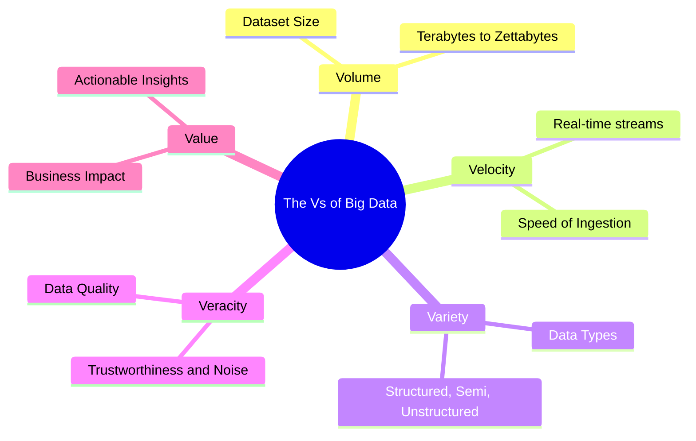
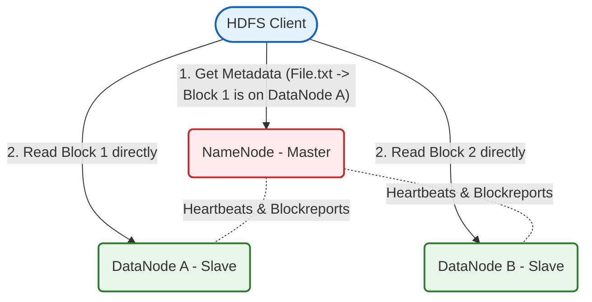
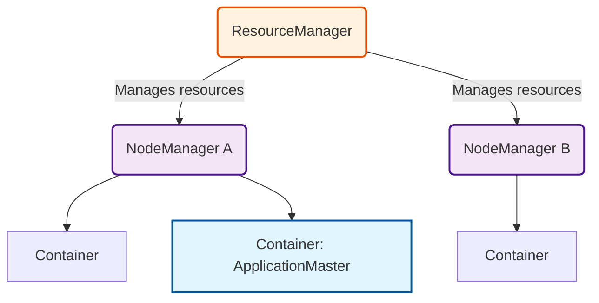
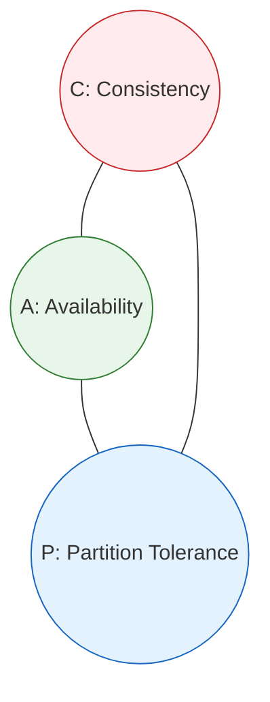
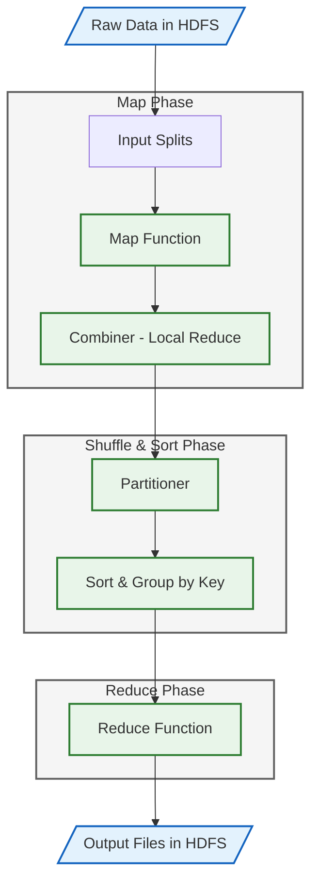

# Big Data Analytics (BDA)
## Study Notes: Modules 1, 2 & 3 (ISE 1)

---

## MODULE 1: Introduction to Big Data

### 1.1 What is Big Data?
**Big Data** refers to datasets that are so large, fast-moving, and complex that traditional data processing software (like standard SQL databases running on a single server) cannot store, manage, or analyze them efficiently.

---

### 1.2 The Characteristics of Big Data (The 5 Vs & Beyond)
To understand what makes data "Big Data," we look at its core characteristics:



1.  **Volume**: The sheer size of the data being generated. We are talking about datasets moving from Gigabytes into Terabytes, Petabytes, Exabytes, and Zettabytes.
    *   *Source*: Social media posts, sensor readings, transaction logs.
2.  **Velocity**: The speed at which new data is generated, ingested, and needs to be processed.
    *   *Example*: Credit card transactions being checked for fraud in milliseconds, or live sensor feeds from autonomous cars.
3.  **Variety**: The different formats of data. Traditional databases only handled structured tables, but Big Data includes unstructured documents, videos, audio files, and sensor logs.
4.  **Veracity**: The trustworthiness or quality of the data. Big Data is often messy, containing noise, errors, duplicate records, and incomplete entries. Veracity measures how clean and reliable the data is.
5.  **Value**: The ultimate business goal. Having massive amounts of data is useless unless we can extract meaningful, actionable insights that add value to the organization.

#### Beyond the 5 Vs:
*   **Variability**: The changes in data flow rates and formats over time. For example, a social media spike during a global event creates temporary, massive spikes in velocity and volume.
*   **Visualization**: The ability to represent complex, high-dimensional datasets in charts and graphs so that non-technical business leaders can understand the trends.

---

### 1.3 Types of Data
Data exists in three main formats:

#### A. Structured Data
Highly organized data that conforms to a strict, pre-defined schema (tables with rows and columns).
*   **Format**: SQL Tables, Relational Databases, CSV files.
*   **Examples**: Bank transaction tables (columns: AccountNo, Date, Amount), student records.
*   **Pros**: Easy to query using SQL; fits neatly in memory.

#### B. Semi-Structured Data
Data that does not fit into a rigid tabular schema but contains markers, tags, or keys to separate data elements and enforce a hierarchy.
*   **Format**: JSON, XML, YAML.
*   **Example (JSON)**:
    ```json
    {
      "name": "Amit",
      "courses": ["BDA", "ML"],
      "address": { "city": "Mumbai", "zip": 400001 }
    }
    ```
*   **Pros**: Highly flexible; easy to share over APIs.

#### C. Unstructured Data
Data that has no predefined structure or organization. It cannot be stored in standard rows and columns without losing its meaning.
*   **Format**: Media files, text documents, raw binary.
*   **Examples**: PDF reports, images (JPEG), video recordings (MP4), audio feeds, email body texts.
*   **Pros**: Represents over $80\%$ of all real-world data; contains deep insights.
*   **Cons**: Hardest to process and analyze without specialized tools (like AI/NLP).

---

### 1.4 Traditional Data Processing vs. Big Data Processing

| Feature | Traditional Data Processing | Big Data Processing |
| :--- | :--- | :--- |
| **Data Volume** | Small to Medium (Gigabytes) | Large to Massive (Terabytes to Petabytes) |
| **Data Variety** | Mostly Structured | Structured, Semi-structured, & Unstructured |
| **Scaling Model** | **Vertical (Scale-Up)**: Adding RAM/CPU to a single server | **Horizontal (Scale-Out)**: Adding more cheap commodity servers to a cluster |
| **Schema Paradigm** | **Schema-on-Write**: Schema must be defined *before* loading data | **Schema-on-Read**: Raw data is loaded; schema is applied when querying |
| **Processing Style** | Centralized, Single machine | Distributed, Parallel processing across clusters |
| **Query Speed** | Slows down heavily as data size increases | Remains fast by dividing tasks among servers |

---

### 1.5 Business Approaches for Big Data Analytics
To get value from Big Data, businesses use four sequential stages of analytics:
1.  **Descriptive Analytics ("What happened?")**: Looking at historical data to summarize past events.
    *   *Example*: Generating monthly sales reports or tracking page views.
2.  **Diagnostic Analytics ("Why did it happen?")**: Drill-down analysis to find the root cause of past events.
    *   *Example*: Investigating a sudden drop in sales by correlating it with web server downtime.
3.  **Predictive Analytics ("What will happen?")**: Using statistical models and ML to forecast future outcomes.
    *   *Example*: Predicting customer churn or identifying credit card transactions likely to be fraudulent.
4.  **Prescriptive Analytics ("What should we do?")**: Recommending actions to optimize business outcomes based on predictions.
    *   *Example*: Google Maps calculating the absolute best route to avoid upcoming traffic jams.

---

### 1.6 Challenges in Big Data Management
1.  **Storage**: Safely storing petabytes of data without high hardware costs.
2.  **Processing**: Running computations over massive files in a reasonable amount of time.
3.  **Data Quality (Veracity)**: Cleaning bad data, handling missing values, and syncing mismatched formats from multiple sources.
4.  **Security & Privacy**: Protecting personal customer data (GDPR/HIPAA compliance) when sharing it across large distributed clusters.
5.  **Skill Gap**: Finding engineers who understand distributed computing architectures.

---

## MODULE 2: Big Data Frameworks – Hadoop and NoSQL

### 2.1 Overview of Hadoop
**Apache Hadoop** is an open-source framework designed for the distributed storage and parallel processing of massive datasets across clusters of commodity (cheap) servers.

#### Core Core Components of Hadoop:
1.  **HDFS (Storage)**: Distributed file system.
2.  **YARN (Management)**: Resource scheduler.
3.  **MapReduce (Processing)**: Batch computing paradigm.

```
+-------------------------------------------------------------+
| MAPREDUCE (Distributed Processing Layer)                    |
+-------------------------------------------------------------+
| YARN (Resource Management & Cluster Scheduling Layer)       |
+-------------------------------------------------------------+
| HDFS (Distributed Storage Layer)                            |
+-------------------------------------------------------------+
```

---

### 2.2 Hadoop Architecture Deep Dive

#### A. Hadoop Distributed File System (HDFS)
HDFS stores massive files by breaking them into smaller chunks called **blocks** (default block size is $128\text{ MB}$) and distributing them across a cluster.



*   **NameNode (Master)**:
    *   Stores all **metadata** (directory tree, file names, file-to-block mapping, block locations).
    *   Does NOT store actual file contents.
    *   Keeps metadata in RAM for fast access.
*   **DataNode (Slave)**:
    *   Stores the actual file **blocks** on its local hard drive.
    *   Periodically sends **Heartbeats** (status updates) and **Block Reports** (list of stored blocks) to the NameNode.
*   **Secondary NameNode**:
    *   It is **NOT** a backup NameNode.
    *   Its sole job is to merge the edit logs (changes) with the system image (`fsimage`) periodically. This keeps the NameNode's startup time short.
*   **Replication Policy**:
    *   To prevent data loss if a server crashes, HDFS duplicates blocks (default **Replication Factor = 3**).
    *   *Rack Awareness*: Block copy 1 goes to a local node; copy 2 goes to a different node in the same rack; copy 3 goes to a node in a different rack. This protects against entire rack failures.

---

#### B. YARN (Yet Another Resource Negotiator)
YARN is the operating system layer of Hadoop. It schedules tasks and manages computing resources (RAM/CPU) across the cluster.



*   **ResourceManager (RM - Master)**: The ultimate authority that schedules and allocates resources (CPU, RAM) across all applications in the cluster.
*   **NodeManager (NM - Slave)**: Runs on each node. It monitors resource usage (containers) on that specific server and reports back to the ResourceManager.
*   **ApplicationMaster (AM - Per Application)**: A temporary manager spawned inside a container for each active job. It negotiates resources with the ResourceManager and works with NodeManagers to execute the tasks.
*   **Container**: A physical bundle of resources (e.g., $2\text{ GB RAM}$, $1\text{ CPU Core}$) allocated on a DataNode to run a specific task.

---

### 2.3 The Hadoop Ecosystem
The Hadoop core is supported by a large ecosystem of tools:

```
+-------------------------------------------------------------+
|    Hive (SQL queries)  |  Pig (Scripting)  | Spark (In-Memory) |
+-------------------------------------------------------------+
| Sqoop (RDBMS <-> HDFS)  |  HBase (NoSQL DB Column-Family)   |
+-------------------------------------------------------------+
|              HDFS / YARN / MapReduce (Core)                 |
+-------------------------------------------------------------+
```

*   **Apache Pig**: A high-level data flow platform. It uses a scripting language called **Pig Latin** to process large datasets, which it automatically translates into MapReduce jobs.
*   **Apache Hive**: A data warehousing framework. It provides an SQL-like interface called **HiveQL**, allowing users to write standard SQL queries that are translated into MapReduce tasks.
*   **Apache HBase**: A distributed, column-family NoSQL database built on top of HDFS, optimized for random, real-time read/write access to petabytes of data.
*   **Apache Sqoop**: A tool designed to import data from relational databases (like MySQL, Oracle) into HDFS, and export it back.
*   **Apache Spark**: An advanced processing engine that performs computations in-memory (RAM) instead of writing intermediate states to hard drives (like MapReduce), making it up to $100\times$ faster for machine learning and iterative algorithms.

---

### 2.4 Introduction to NoSQL Databases
**NoSQL** (Not Only SQL) databases are non-relational database systems designed to handle unstructured or semi-structured data, scale horizontally, and bypass the rigid schema constraints of traditional SQL databases.

#### Why do we need NoSQL?
1.  **Horizontal Scaling**: SQL databases scale *vertically* (buying bigger, more expensive servers), which has a hard physical limit. NoSQL scales *horizontally* (adding cheap servers).
2.  **Flexible Schema**: Traditional tables crash if you try to insert columns on the fly. NoSQL allows dynamic, unstructured documents.
3.  **Real-Time Reads/Writes**: NoSQL databases can handle thousands of writes per second by eliminating expensive table joins.

#### The CAP Theorem
In a distributed system, a database can guarantee at most **two** of the following three properties simultaneously:



1.  **Consistency (C)**: Every read request returns the most recent write or an error. All nodes see the exact same data at the same time.
2.  **Availability (A)**: Every non-failing node returns a response for every request, but there is no guarantee that the response contains the newest write.
3.  **Partition Tolerance (P)**: The system continues to operate even if some communication messages between servers are lost or delayed (network partition).

> [!IMPORTANT]
> Because physical networks are guaranteed to experience drops and failures, **Partition Tolerance (P) is mandatory** for distributed databases. Therefore, distributed NoSQL databases must choose between:
> *   **CP (Consistency & Partition Tolerance)**: Sacrifices Availability. If a node loses connection, the system blocks writes/reads to keep data consistent (e.g., MongoDB, HBase).
> *   **AP (Availability & Partition Tolerance)**: Sacrifices Consistency. The system accepts writes on any node and updates other nodes slowly over time, leading to *Eventual Consistency* (e.g., Cassandra, DynamoDB).

---

### 2.5 NoSQL Data Models

#### A. Key-Value Stores
Stores data as simple collections of Key-Value pairs. The value is a black box to the database; it is only retrieved by its exact key.
*   *Structure*: `Key -> Value`
*   *Examples*: Redis, Memcached.
*   *Best Use Case*: Caching web sessions, shopping carts.

#### B. Column-Family / Wide-Column Stores
Stores columns of data grouped together in families rather than rows. Each row can have a different number of columns.
*   *Structure*: Rows contain column families, which contain columns of keys and values.
*   *Examples*: HBase, Cassandra.
*   *Best Use Case*: Storing massive time-series sensor data or user activity logs.

#### C. Document Stores
Stores data as semi-structured documents (typically JSON, BSON, or XML). The database can index and query fields nested deep within the document.
*   *Structure*: Key mapped to a nested document.
*   *Examples*: MongoDB, CouchDB.
*   *Best Use Case*: Content management systems, e-commerce product catalogs.

#### D. Graph Databases
Focuses on representing the relationships between data elements. Data is stored as Nodes (entities), Edges (relationships), and Properties.
*   *Structure*: Graph networks.
*   *Examples*: Neo4j, Amazon Neptune.
*   *Best Use Case*: Social networks, recommendation engines, fraud rings detection.

---

### 2.6 MongoDB Deep Dive
MongoDB is the most popular **Document Store** NoSQL database.

#### Core Features:
*   **BSON Format**: Documents are stored in BSON (Binary JSON), which allows faster parsing and supports more data types (like dates, integers, and binary).
*   **Dynamic / Schemaless**: Different documents in the same collection do not need the same set of fields.
*   **Replica Sets (High Availability)**: Replicates data across multiple servers. If the primary node crashes, the secondary nodes automatically elect a new primary to prevent downtime.
*   **Sharding (Horizontal Scaling)**: Distributes data across multiple servers (shards) using a shard key, allowing the database to grow infinitely.
*   **Aggregation Pipeline**: A framework for data processing that processes documents through multi-stage pipelines (using stages like `$match`, `$group`, `$project`, and `$sort`).

---

## MODULE 3: MapReduce Paradigm

### 3.1 The MapReduce Programming Model
**MapReduce** is a software framework and programming model used to write applications that process vast amounts of data in parallel on large clusters of hardware.

The model divides computation into two primary phases: **Map** and **Reduce**, with a built-in infrastructure step called **Shuffle and Sort** connecting them.

---

### 3.2 MapReduce Execution Flow
The complete step-by-step pipeline of a MapReduce job:



1.  **Input Splitting**: The input file is split into block-sized chunks (e.g., $128\text{ MB}$ splits).
2.  **Map Step**: A Mapper task runs on each split. It parses the raw records and outputs intermediate `<key, value>` pairs.
3.  **Combiner Step (Optional)**: A "mini-reducer" that runs locally on the Mapper's machine to aggregate intermediate data before it is sent over the network, minimizing network congestion.
4.  **Shuffle and Sort Step**: 
    *   *Partitioning*: Assigns map outputs to specific Reducers.
    *   *Sorting*: Sorts intermediate keys alphabetically/numerically.
    *   *Grouping*: Groups values with matching keys into a list: `<key, List(values)>`.
5.  **Reduce Step**: A Reducer task runs for each group. It aggregates the list of values for each key and writes the final output to HDFS.

---

### 3.3 Handling and Recovery from Node Failures
Hadoop is designed to run on cheap commodity hardware, where failures are common. It handles failures automatically:

*   **DataNode Failure**:
    *   If a DataNode stops sending heartbeats to the NameNode (typically for 10 minutes), the NameNode marks it as dead.
    *   The NameNode identifies all blocks that were stored on the dead node and schedules their replication onto healthy DataNodes using other block copies to restore the replication factor.
*   **Task/Worker Failure**:
    *   The ApplicationMaster monitors all map and reduce tasks.
    *   If a task hangs or fails, the ApplicationMaster rescheduling it on another node. If a task fails more than 4 times, the entire job is marked as failed.
*   **NameNode Failure**:
    *   In traditional Hadoop 1.x, the NameNode was a Single Point of Failure (SPOF).
    *   In modern Hadoop (Active/Standby High Availability), two NameNodes run: an Active NameNode and a Standby NameNode. They share an edits log via a Quorum Journal Manager (QJM). If the Active NameNode fails, ZooKeeper automatically detects it and promotes the Standby NameNode to Active in seconds.

---

### 3.4 Relational Algebra Operations using MapReduce
Database operations can be modeled using MapReduce. Let $R$ and $S$ be relations (tables) containing tuples (rows).

#### A. Selection ($\sigma_{C}(R)$)
Filters rows based on a condition $C$.
*   **Map**: For each tuple $t$ in $R$, check if $t$ satisfies condition $C$. If it does, emit `<t, t>`.
*   **Reduce**: An identity reducer. Emits the key `<t>` directly to output.

#### B. Projection ($\pi_{A}(R)$)
Keeps only a subset of columns (attributes) $A$ and discards the rest. This can create duplicate rows, which must be removed.
*   **Map**: For each tuple $t$ in $R$, discard attributes not in $A$ to form a smaller tuple $t'$. Emit `<t', t'>`.
*   **Reduce**: The reducer removes duplicates. For each key $t'$, it emits `<t', t'>` exactly once, ignoring duplicate values.

#### C. Union ($R \cup S$)
Combines all distinct tuples from both relations.
*   **Map**: For each tuple $t$ in either $R$ or $S$, emit `<t, t>`.
*   **Reduce**: For each key $t$, the reducer outputs `<t, t>` exactly once, removing duplicates.

#### D. Intersection ($R \cap S$)
Finds tuples that exist in *both* relations.
*   **Map**: For each tuple $t$ in $R$ or $S$, emit `<t, name_of_relation>` (e.g., `<t, 'R'>` or `<t, 'S'>`).
*   **Reduce**: For each key $t$, check the list of values. If the list contains both `'R'` and `'S'`, emit `<t, t>`. Otherwise, discard it.

#### E. Difference ($R - S$)
Finds tuples that exist in $R$ but *not* in $S$.
*   **Map**: For each tuple $t$ in $R$, emit `<t, 'R'>`. For each tuple $t$ in $S$, emit `<t, 'S'>`.
*   **Reduce**: For each key $t$, check the list of values. If the values contain `'R'` but do **NOT** contain `'S'`, emit `<t, t>`.

#### F. Natural Join ($R(X, Y) \bowtie S(Y, Z)$)
Joins tables on a shared attribute $Y$ (Reduce-Side Join).
*   **Map**:
    *   For each tuple $(x, y)$ in $R$, emit `<y, ('R', x)>`.
    *   For each tuple $(y, z)$ in $S$, emit `<y, ('S', z)>`.
*   **Reduce**:
    *   For each key $y$, separate the values into two lists: $L_R$ (containing $x$ values) and $L_S$ (containing $z$ values).
    *   Perform a Cartesian product of the two lists. For each $x \in L_R$ and $z \in L_S$, emit `<(x, y, z), null>`.

---

### 3.5 Matrix-Vector Multiplication using MapReduce
Suppose we have a large matrix $M$ of size $m \times n$ and a vector $v$ of length $n$. We want to compute:
$$x = M \times v$$
Where each element $x_i$ is calculated as:
$$x_i = \sum_{j=1}^n M_{ij} v_j$$

#### Algorithm (Vector $v$ fits in memory - Distributed Cache):
Since vector $v$ is small compared to matrix $M$, we copy $v$ to the RAM of every worker node using Hadoop's Distributed Cache.
*   **Map**:
    *   Input: A cell of the matrix $M$, represented as: `(row i, col j, value M_ij)`.
    *   Computation: Retrieve $v_j$ from the cached vector $v$ in memory and compute:
        $$\text{product} = M_{ij} \times v_j$$
    *   Emit: `<i, product>` (row index is the key).
*   **Reduce**:
    *   Input: Key $i$ (row index) and a list of values representing products: $[M_{i1}v_1, M_{i2}v_2, \dots, M_{in}v_n]$.
    *   Computation: Sum all the values in the list:
        $$x_i = \sum_{j=1}^n M_{ij} v_j$$
    *   Emit: `<i, x_i>`.

---

### 3.6 Matrix Multiplication ($P = M \times N$) using MapReduce
Suppose we want to multiply matrix $M$ (size $i \times j$) by matrix $N$ (size $j \times k$) to get product matrix $P$ (size $i \times k$).
$$P_{ik} = \sum_{j} M_{ij} N_{jk}$$

We can solve this using either a two-stage or a single-stage MapReduce algorithm.

#### Two-Stage MapReduce Algorithm
This breaks the multiplication into two separate MapReduce jobs.

##### Stage 1: Compute individual products $M_{ij} N_{jk}$
*   **Map 1**:
    *   For each element $M_{ij}$, emit key `j`, value `('M', i, M_ij)`.
    *   For each element $N_{jk}$, emit key `j`, value `('N', k, N_jk)`.
*   **Reduce 1**:
    *   The reducer receives key $j$ and a list of elements from both matrices.
    *   It multiplies every element $M_{ij}$ with every element $N_{jk}$ to get the product $P_{ijk} = M_{ij} \times N_{jk}$.
    *   Emit: `<(i, k), P_ijk>`.

##### Stage 2: Sum products to get final cell values
*   **Map 2**: Identity mapper. Passes the input `<(i, k), P_ijk>` directly to the reducer.
*   **Reduce 2**:
    *   The reducer receives key `(i, k)` and a list of all products: $[P_{i1k}, P_{i2k}, \dots]$.
    *   It sums the list to get:
        $$P_{ik} = \sum_j P_{ijk}$$
    *   Emit: `<(i, k), P_ik>`.

---

#### Single-Stage MapReduce Algorithm
This performs the entire matrix multiplication in a single MapReduce pass by multiplying network communication size.

*   **Map**:
    *   For each element $M_{ij}$ of matrix $M$, for $col\_idx = 1$ to $k$ (number of columns in $N$), emit:
        $$\text{Key: } \langle i, col\_idx \rangle, \quad \text{Value: } \langle 'M', j, M_{ij} \rangle$$
    *   For each element $N_{jk}$ of matrix $N$, for $row\_idx = 1$ to $i$ (number of rows in $M$), emit:
        $$\text{Key: } \langle row\_idx, k \rangle, \quad \text{Value: } \langle 'N', j, N_{jk} \rangle$$
*   **Reduce**:
    *   The reducer receives key `(i, k)` and all elements labeled `'M'` and `'N'` associated with index $j$.
    *   It groups elements by index $j$, multiplies the matching pair $M_{ij} \times N_{jk}$, and sums all the products together to emit:
        $$\text{Key: } \langle i, k \rangle, \quad \text{Value: } P_{ik}$$
