# DevOps
### Complete Notes — Modules 1 to 6 (PEC-IT 7013)

> **Course:** B.E. IT, Semester VII | **Total Hours:** 45

---

## Table of Contents

| Module | Topic | Hrs |
|---|---|---|
| 1 | Introduction to DevOps | 7 |
| 2 | DevOps and Automation | 8 |
| 3 | Version Control Systems | 8 |
| 4 | Continuous Integration and Continuous Deployment (CI/CD) | 8 |
| 5 | Virtualization and Containerization | 8 |
| 6 | Continuous Testing and Configuration Management | 6 |

---

# MODULE 1: Introduction to DevOps

## 1.1 What is DevOps?

**DevOps** = **Dev**elopment + **Op**eration**s**.

It is a culture, a set of practices and a collection of tools that bring the software development team and the IT operations team together, so software can be built, tested and released **faster, more often and more reliably**.

**Simple definition:**
> DevOps is a way of working where developers and operations staff share responsibility for the whole software lifecycle — from writing code to running it in production.

**The problem DevOps solves — "the wall of confusion":**
In traditional setups, developers wanted **change** (new features) while operations wanted **stability** (no change). Developers threw code over the wall; when it broke in production, each side blamed the other.

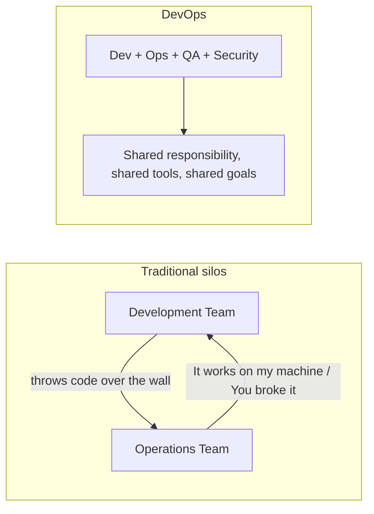

**DevOps is not:**
- Just a tool or a set of tools.
- Just automation.
- A single job role that replaces everyone.
- Only for large companies.

It is **culture first**, then process, then tools.

## 1.2 History of DevOps

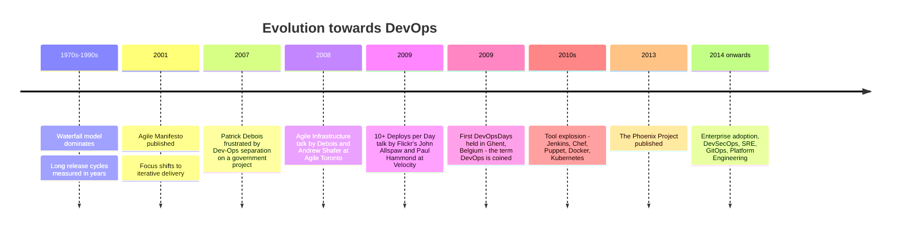

**Key milestones:**
1. **Waterfall era** — releases every 12–18 months, huge risk in each release.
2. **Agile (2001)** — solved the *development* side with short iterations, but operations was left out, so the code still queued up before release.
3. **Patrick Debois (2007–2009)** — a Belgian consultant frustrated by the Dev/Ops divide, organised the first **DevOpsDays** in Ghent in 2009. The hashtag `#devops` gave the movement its name.
4. **Flickr's talk "10+ Deploys Per Day" (2009)** — proved rapid, safe deployment was possible.
5. **The Phoenix Project (2013)** and **The DevOps Handbook (2016)** — codified the principles.
6. **Today** — extended into **DevSecOps** (security built in), **SRE** (Google's engineering approach to operations), **GitOps** and **Platform Engineering**.

## 1.3 DevOps Objectives

1. **Faster time to market** — release features in days or hours instead of months.
2. **Higher deployment frequency** — from a few releases a year to many per day.
3. **Lower change failure rate** — small, frequent changes are far less risky than big ones.
4. **Faster recovery (low MTTR)** — when something breaks, fix or roll back in minutes.
5. **Improved collaboration** — remove silos between Dev, Ops, QA and Security.
6. **Automation of repetitive work** — build, test, deploy, provision, monitor.
7. **Better quality and reliability** — continuous testing catches defects early.
8. **Continuous feedback** — monitoring feeds real production behaviour back to developers.
9. **Scalability and efficiency** — infrastructure as code makes environments reproducible.
10. **Reduced cost** — less rework, fewer outages, better resource use.

### The four DORA metrics
The industry-standard way to measure DevOps performance:

| Metric | Meaning | Elite performance |
|---|---|---|
| **Deployment Frequency** | How often code reaches production | On demand, multiple times a day |
| **Lead Time for Changes** | Commit to production time | Less than one hour |
| **Change Failure Rate** | Percentage of deployments causing a failure | 0–15% |
| **Mean Time to Restore (MTTR)** | Time to recover from a failure | Less than one hour |

## 1.4 DevOps Principles

The most common framework is **CALMS**:

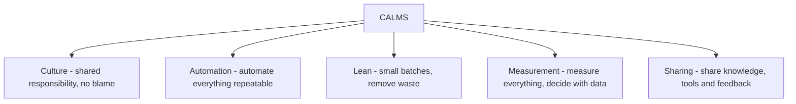

| Principle | Meaning |
|---|---|
| **Culture** | Collaboration and trust instead of blame. Blameless post-mortems. Everyone owns quality. |
| **Automation** | If a task is done more than twice, automate it: builds, tests, deployments, infrastructure. |
| **Lean** | Work in small batches, limit work in progress, eliminate waste and hand-offs. |
| **Measurement** | You cannot improve what you do not measure. Track the DORA metrics, performance and errors. |
| **Sharing** | Shared tools, shared dashboards, shared on-call, open documentation. |

**The Three Ways (from The Phoenix Project):**
1. **Flow** — optimise the flow of work from development to operations to the customer. Make work visible, reduce batch sizes.
2. **Feedback** — create fast, constant feedback loops from right to left, so problems are found and fixed immediately.
3. **Continual Learning and Experimentation** — build a culture that rewards experimentation and learns from failure.

**Other core principles:**
- **Everything as Code** — infrastructure, configuration, pipelines and policies live in version control.
- **Shift left** — move testing and security earlier in the lifecycle, where fixes are cheap.
- **Fail fast, recover fast** — expect failure and design for quick recovery.
- **Single source of truth** — one repository holds the definitive state.
- **Continuous improvement (Kaizen)**.

## 1.5 DevOps and the Software Development Life Cycle

The SDLC phases are: Requirements → Design → Development → Testing → Deployment → Maintenance. DevOps does not replace the SDLC; it **automates and connects** its phases into a continuous loop.

### Waterfall Model

A **linear, sequential** model where each phase must be fully completed before the next begins.

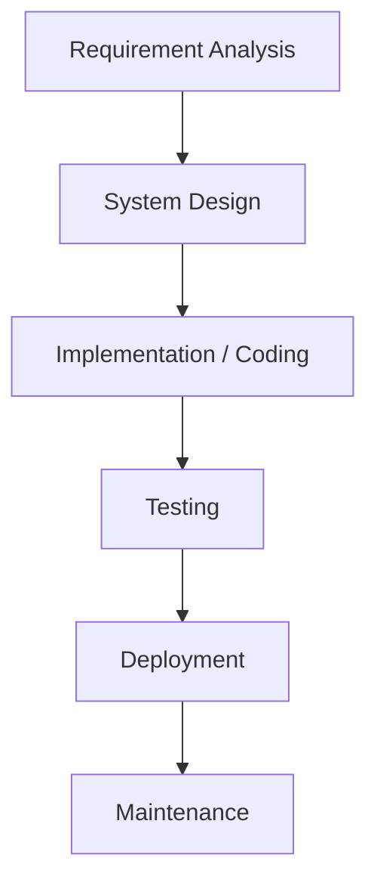

| Advantages | Disadvantages |
|---|---|
| Simple and easy to understand | No working software until very late |
| Clear structure, well documented | Cannot handle changing requirements |
| Works when requirements are fixed and well known | Testing happens only at the end, so defects are found late and cost more |
| Easy to manage due to rigid phases | High risk; a wrong assumption surfaces months later |
| Suits short, small projects | Customer feedback comes only at delivery |

**Suitable for:** short projects with stable, fully understood requirements, such as some government and defence contracts.

### Agile Model

An **iterative and incremental** model. The project is broken into short cycles (**sprints**, typically 2–4 weeks), each producing a working increment.

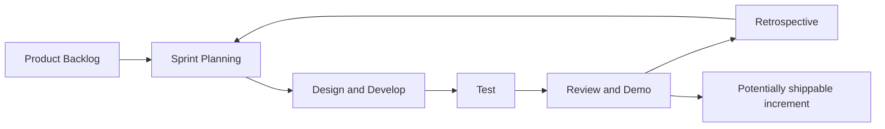

**Agile Manifesto values** — the items on the left are valued more than those on the right:
1. **Individuals and interactions** over processes and tools
2. **Working software** over comprehensive documentation
3. **Customer collaboration** over contract negotiation
4. **Responding to change** over following a plan

| Advantages | Disadvantages |
|---|---|
| Welcomes changing requirements | Needs experienced, self-organising teams |
| Working software delivered early and often | Less documentation can hurt long-term maintenance |
| Continuous customer involvement | Hard to predict total cost and schedule up front |
| Defects found early | Scope creep if the backlog is not managed |
| Higher customer satisfaction | Requires constant customer availability |

**Frameworks:** Scrum, Kanban, XP (Extreme Programming), SAFe.

### Waterfall vs Agile vs DevOps

| Aspect | Waterfall | Agile | DevOps |
|---|---|---|---|
| Approach | Sequential | Iterative | Continuous |
| Scope | Development only | Development only | Development **and** operations |
| Release cycle | Months to years | Weeks (per sprint) | Hours to days, continuous |
| Feedback | At the end | End of each sprint | Continuous, from production |
| Testing | A separate late phase | Within each sprint | Automated and continuous |
| Teams | Separate silos | Cross-functional dev team | Dev + Ops + QA + Sec together |
| Change | Resisted | Welcomed | Welcomed and automated |
| Goal | Deliver to spec | Deliver working software fast | Deliver **and operate** reliably fast |

**Relationship:** Agile made *development* fast. DevOps extends that speed all the way to **delivery and operation**. DevOps is usually built on top of Agile.

## 1.6 DevOps Delivery Pipeline

The DevOps lifecycle is often drawn as an **infinite loop**, showing that the process never stops.

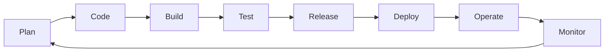

| Stage | Activity | Typical tools |
|---|---|---|
| **Plan** | Requirements, backlog, sprint planning | Jira, Azure Boards, Trello |
| **Code** | Write code, review, version control | Git, GitHub, GitLab, VS Code |
| **Build** | Compile, resolve dependencies, package | Maven, Gradle, npm, Jenkins |
| **Test** | Unit, integration, functional, security tests | JUnit, Selenium, TestNG, SonarQube |
| **Release** | Version, approve, stage the artifact | Jenkins, GitLab CI, Nexus, Artifactory |
| **Deploy** | Push to production | Docker, Kubernetes, Ansible, Argo CD |
| **Operate** | Run and manage infrastructure | Kubernetes, Terraform, cloud platforms |
| **Monitor** | Collect metrics, logs, traces, alerts | Prometheus, Grafana, ELK, Nagios, Datadog |

The **Monitor → Plan** link is the crucial feedback loop that makes it a cycle rather than a line.

## 1.7 Market Trend of DevOps

- **Strong market growth** — the global DevOps market has been growing at roughly 20% per year and is projected to cross USD 25 billion by the late 2020s.
- **Near-universal adoption** — the large majority of enterprises now report using DevOps practices in some form.
- **Cloud is the default** — DevOps and cloud adoption grew together; AWS, Azure and GCP all provide native DevOps services.
- **Kubernetes has become the standard** for container orchestration.
- **DevSecOps is mainstream** — security scanning is now part of the pipeline rather than a final gate.
- **Platform Engineering** — building an **Internal Developer Platform** so product teams can self-serve infrastructure.
- **GitOps** — Git as the single source of truth for infrastructure state, with tools like Argo CD and Flux.
- **AIOps / AI-assisted DevOps** — machine learning for anomaly detection, log analysis, incident prediction, and AI assistants generating pipeline and IaC code.
- **FinOps** — managing and optimising cloud spend as a shared engineering responsibility.
- **High demand for skills** — DevOps engineer and SRE roles are consistently among the best-paid and most-advertised IT roles.

## 1.8 DevOps Technical Challenges

1. **Cultural resistance** — the hardest challenge. People are used to silos and fear losing their role.
2. **Legacy systems** — monolithic and mainframe applications are hard to automate, test and deploy continuously.
3. **Tool sprawl and integration** — dozens of tools that must be made to work together; too many choices.
4. **Skill gap** — engineers need coding, infrastructure, cloud, networking and security knowledge at once.
5. **Security and compliance** — moving fast while satisfying auditors and regulations.
6. **Test automation** — building and, more importantly, **maintaining** a reliable automated test suite. Flaky tests destroy trust in the pipeline.
7. **Environment inconsistency** — the classic "it works on my machine" problem, addressed by containers and IaC.
8. **Monitoring complexity** — distributed microservices produce enormous volumes of logs, metrics and traces.
9. **Managing microservices** — service discovery, networking, versioning and data consistency across many services.
10. **Measuring success** — choosing meaningful metrics rather than vanity numbers.
11. **Cost control** — cloud and tooling costs can spiral.
12. **Database changes** — schema migrations are far harder to roll back than application code.

## 1.9 DevOps Ecosystem

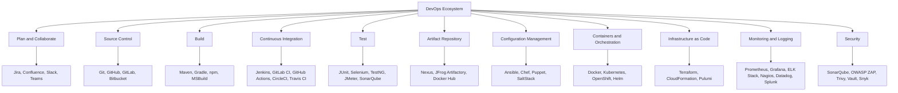

## 1.10 DevOps Engineer Skills in the Market

**Technical skills:**
1. **Linux administration** — the foundation; shell, permissions, processes, networking, systemd.
2. **Scripting and programming** — Bash, Python, Go; enough to automate anything.
3. **Version control** — Git at an advanced level: branching strategies, rebasing, conflict resolution.
4. **CI/CD tooling** — Jenkins, GitLab CI, GitHub Actions; writing and debugging pipelines.
5. **Containerization** — Docker: images, Dockerfiles, networking, volumes, multi-stage builds.
6. **Orchestration** — Kubernetes: pods, deployments, services, ingress, ConfigMaps, Helm.
7. **Configuration management** — Ansible, Chef or Puppet.
8. **Infrastructure as Code** — Terraform, CloudFormation.
9. **Cloud platforms** — AWS, Azure or GCP; compute, storage, networking, IAM.
10. **Monitoring and observability** — Prometheus, Grafana, ELK, distributed tracing.
11. **Networking fundamentals** — DNS, HTTP/HTTPS, load balancing, firewalls, TLS.
12. **Security (DevSecOps)** — secret management, vulnerability scanning, least privilege.
13. **Databases** — basic administration and migration handling.

**Soft skills:** collaboration and communication, problem solving under pressure, a continuous-learning mindset, ownership and accountability, and the ability to explain technical trade-offs to non-technical people.

**Common certifications:** AWS DevOps Engineer Professional, Certified Kubernetes Administrator (CKA), Azure DevOps Engineer Expert, Docker Certified Associate, HashiCorp Terraform Associate.

## 1.11 DevOps on the Cloud

The cloud and DevOps reinforce each other. The cloud provides **on-demand, programmable infrastructure**, which is exactly what DevOps automation needs.

**Why the cloud suits DevOps:**
1. **Elasticity** — spin up an entire test environment in minutes and destroy it afterwards.
2. **Pay-per-use** — no capital expenditure on idle hardware.
3. **API-driven** — everything can be scripted, which enables Infrastructure as Code.
4. **Managed services** — databases, queues, and Kubernetes clusters run for you.
5. **Global reach** — deploy close to users and test in multiple regions.
6. **Built-in resilience** — availability zones and automated backups.

**Cloud service models:**

| Model | You manage | Provider manages | Example |
|---|---|---|---|
| **IaaS** | OS, runtime, application, data | Hardware, virtualization, network | EC2, Azure VM, Compute Engine |
| **PaaS** | Application and data | Everything below | Elastic Beanstalk, App Engine, Heroku |
| **SaaS** | Nothing but usage | Everything | Gmail, Salesforce |
| **CaaS / FaaS** | Containers or functions | Runtime and scaling | ECS/EKS, AWS Lambda |

**Native DevOps services by provider:**

| Function | AWS | Azure | GCP |
|---|---|---|---|
| Source control | CodeCommit | Azure Repos | Cloud Source Repositories |
| Build | CodeBuild | Azure Pipelines | Cloud Build |
| Deploy | CodeDeploy | Azure Pipelines | Cloud Deploy |
| Pipeline orchestration | CodePipeline | Azure DevOps | Cloud Build triggers |
| Containers | ECS / EKS / Fargate | AKS / ACI | GKE / Cloud Run |
| IaC | CloudFormation / CDK | ARM / Bicep | Deployment Manager |
| Monitoring | CloudWatch / X-Ray | Azure Monitor | Cloud Monitoring |
| Secrets | Secrets Manager / KMS | Key Vault | Secret Manager |

**Deployment models:** Public cloud, Private cloud, **Hybrid cloud** (mixing on-premise with public), and **Multi-cloud** (using more than one provider to avoid lock-in).

---

# MODULE 2: DevOps and Automation

> **Automation is the engine of DevOps.** This module surveys the seven pillars of DevOps automation; later modules explore each in depth.

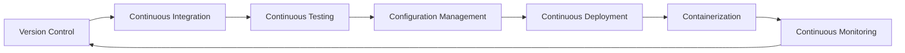

## 2.1 Version Control (overview)

**Version control** is a system that records changes to files over time so you can recall any earlier version, see who changed what and when, and work in parallel without overwriting each other.

**Why it is the foundation of DevOps:**
- It is the **single source of truth** for code, configuration, infrastructure and pipelines.
- Every automated step downstream is triggered by a **commit**.
- It provides **traceability** — every production change maps back to a commit, an author and a reason.
- It allows **rollback** — revert to the last good state instantly.
- It enables **collaboration** — many developers on one codebase.

Covered fully in Module 3.

## 2.2 Continuous Integration (overview)

**Continuous Integration (CI)** is the practice of developers merging their work into the shared main branch **frequently — at least daily** — with every merge automatically built and tested.

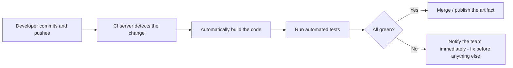

**Core practices:**
- Maintain a single source repository.
- Automate the build.
- Make the build self-testing.
- Everyone commits to the mainline every day.
- Keep the build fast (ideally under 10 minutes).
- Fix a broken build as the top priority.
- Everyone can see the build status.

**Benefit:** integration problems are found within minutes of being created, rather than during a painful "integration phase" weeks later.

## 2.3 Continuous Testing (overview)

**Continuous Testing** means executing automated tests at **every stage** of the pipeline, so quality feedback is immediate rather than saved for a testing phase at the end.

**The Test Pyramid:**

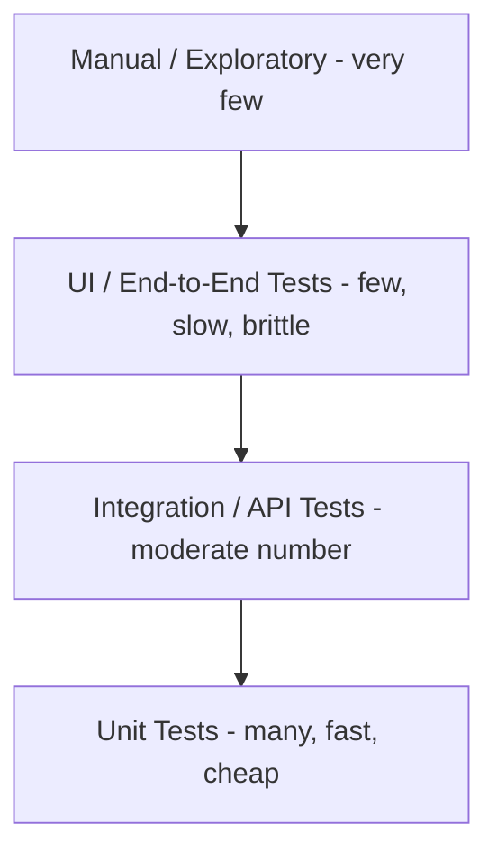

The pyramid says: have **many fast unit tests** at the base and **few slow UI tests** at the top. An inverted pyramid (mostly UI tests) gives slow, flaky pipelines.

**Types run in the pipeline:** unit, integration, API/contract, functional/regression, performance and load, security (SAST and DAST), and smoke tests after deployment.

Covered fully in Module 6.

## 2.4 Configuration Management (overview)

**Configuration Management (CM)** is the practice of defining and maintaining the desired state of servers and applications **as code**, so environments are consistent and reproducible.

**What it solves:** configuration drift, where servers that started identical slowly diverge through manual changes, producing the "works on server A but not server B" problem.

**Key ideas:**
- **Declarative definitions** — describe the desired end state, not the steps.
- **Idempotency** — running the same script ten times produces the same result as running it once.
- **Version-controlled infrastructure** — configuration lives in Git next to the code.

Tools: Ansible, Chef, Puppet, SaltStack. Covered fully in Module 6.

## 2.5 Continuous Deployment (overview)

Three related but distinct terms:

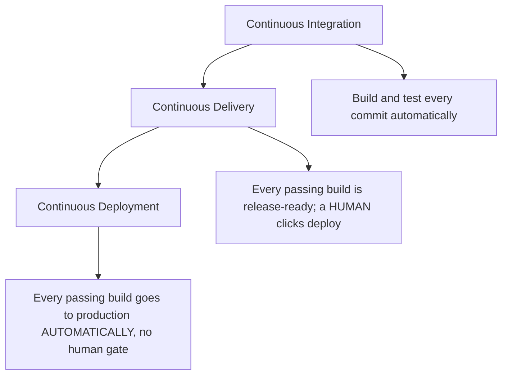

| | Continuous Integration | Continuous Delivery | Continuous Deployment |
|---|---|---|---|
| Automated build and test | Yes | Yes | Yes |
| Automated release to staging | No | Yes | Yes |
| Release to production | Manual, separate process | Manual approval, one click | Fully automatic |
| Requires | Test automation | + deployment automation | + very high confidence in tests |

Covered fully in Module 4.

## 2.6 Containerization (overview)

**Containerization** packages an application together with all its dependencies, libraries and configuration into a single portable unit called a **container**, which runs identically on any machine with a container runtime.

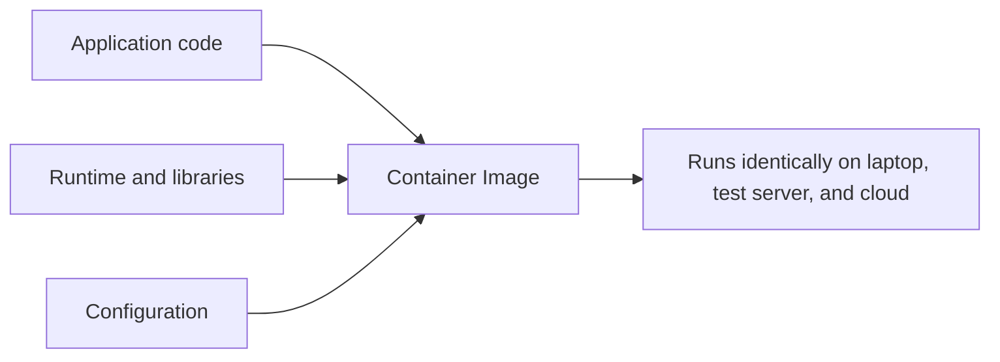

**Why DevOps needs it:**
- Eliminates environment inconsistency permanently.
- Starts in seconds, so pipelines run fast.
- Lightweight — many containers per host, unlike virtual machines.
- The natural unit for microservices, scaling and orchestration.

Covered fully in Module 5.

## 2.7 Continuous Monitoring (overview)

**Continuous Monitoring** is the automated observation of applications and infrastructure in production, so problems are detected and often fixed before users notice.

**The three pillars of observability:**

| Pillar | What it is | Tools |
|---|---|---|
| **Metrics** | Numeric time-series: CPU, memory, request rate, error rate, latency | Prometheus, Grafana, CloudWatch |
| **Logs** | Timestamped event records | ELK/EFK stack, Splunk, Loki |
| **Traces** | The path of a single request across services | Jaeger, Zipkin, OpenTelemetry |

**What is monitored:**
- **Infrastructure** — CPU, memory, disk, network.
- **Application** — response time, throughput, error rate, saturation (the "four golden signals").
- **Business** — sign-ups, orders, revenue per minute.
- **Security** — failed logins, unusual access patterns.
- **User experience** — real user monitoring, synthetic checks.

**Alerting:** thresholds trigger alerts through email, Slack or PagerDuty. Alerts must be **actionable**; too many alerts cause alert fatigue and get ignored.

**Feedback loop:** monitoring data flows back into planning, closing the DevOps loop.

## 2.8 Tool Pipelining

**Tool pipelining** (or **toolchain integration**) means connecting individual tools so that the output of one automatically triggers the next, creating one continuous automated flow from commit to production.

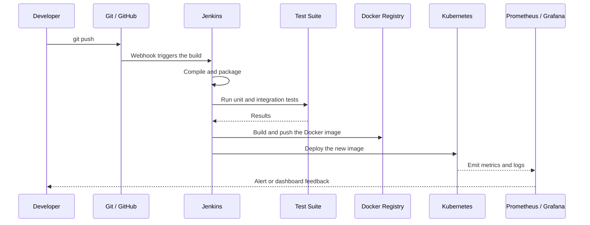

**How tools are connected:**
- **Webhooks** — Git notifies the CI server on push.
- **Plugins** — Jenkins has thousands of plugins for other tools.
- **REST APIs** — tools call each other programmatically.
- **CLI in pipeline steps** — a pipeline stage simply runs `docker build`, `kubectl apply`, etc.
- **Pipeline-as-code** — the whole flow is defined in a file (`Jenkinsfile`, `.gitlab-ci.yml`, `.github/workflows/*.yml`) stored in the repository.

**Benefits:** no manual hand-offs, fully repeatable, complete traceability, faster feedback, and fewer human errors.

**Considerations when choosing a toolchain:** integration support, learning curve, community and support, cost and licensing, scalability, and how well it fits the existing stack.

---

# MODULE 3: Version Control Systems

## 3.1 What is a Version Control System?

A **Version Control System (VCS)**, also called Source Control or Revision Control, records changes to a set of files over time so you can:
- retrieve any earlier version,
- see **who** changed **what**, **when** and **why**,
- work in parallel with other people without overwriting their work,
- experiment safely on a branch and merge back if it works.

**Why version control is essential:**
1. **History and traceability** — the full evolution of the codebase.
2. **Collaboration** — many people on the same files.
3. **Backup** — the repository exists on multiple machines.
4. **Rollback** — return to any known-good state.
5. **Branching** — develop features in isolation.
6. **Accountability** — `git blame` shows who wrote each line.
7. **CI/CD trigger** — every automated pipeline starts from a commit.
8. **Code review** — pull/merge requests are built on it.

## 3.2 Types of Version Control Systems

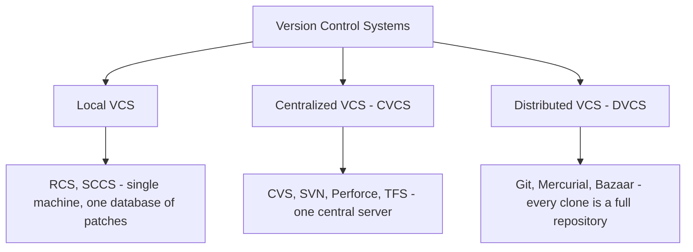

### A. Local Version Control
A simple database on one machine keeping patch sets between file versions. Example: **RCS**.
**Problem:** no collaboration and no protection against disk failure.

### B. Centralized Version Control System (CVCS)
A **single central server** holds all versioned files; clients check out only the current snapshot.

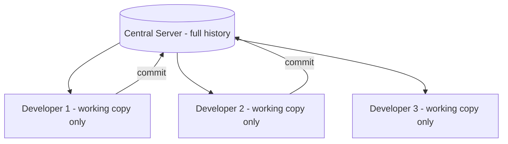

Examples: **CVS, Subversion (SVN), Perforce, Team Foundation Server**.

| Advantages | Disadvantages |
|---|---|
| Simple to understand and administer | **Single point of failure** — if the server dies, history is lost |
| Fine-grained access control per directory | **No offline work** — every operation needs the network |
| Everyone sees what others are doing | Slow operations, since each one is a network round trip |
| Handles very large binary files well | Branching and merging are painful and slow |

### C. Distributed Version Control System (DVCS)
**Every developer clones the entire repository**, including its full history. There is still usually a shared "central" repository by convention, but technically every clone is a complete backup.

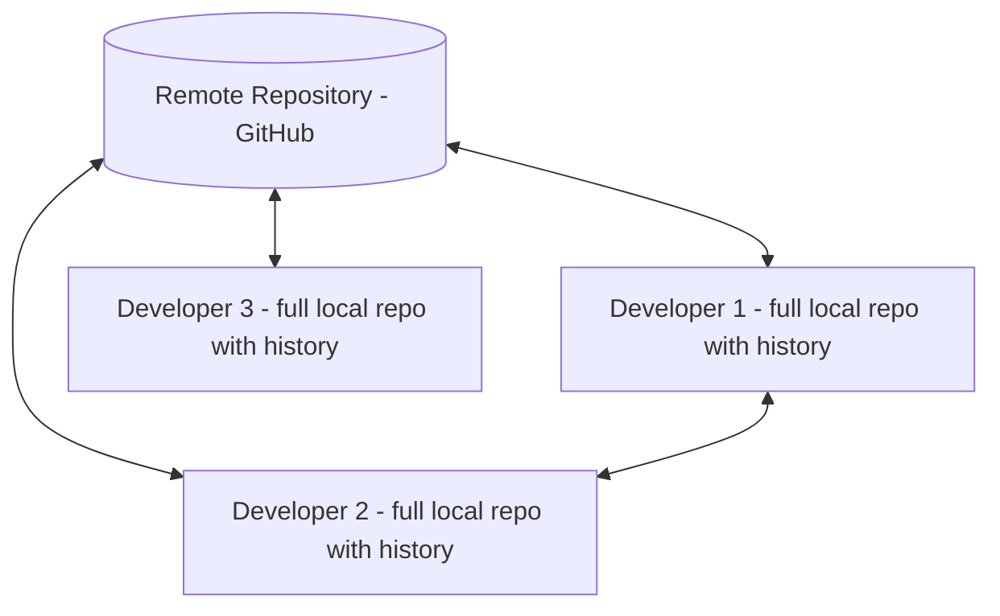

Examples: **Git, Mercurial, Bazaar, Darcs**.

| Advantages | Disadvantages |
|---|---|
| **Works offline** — commit, branch, view history without a network | Steeper learning curve |
| **No single point of failure** — every clone is a backup | Full clone can be large for old repositories |
| **Very fast** — almost all operations are local | Weaker per-directory access control |
| **Cheap branching and merging** | Poor with very large binary files (needs Git LFS) |
| Flexible workflows (fork, pull request) | |

### CVCS vs DVCS — the key differences

| Aspect | CVCS (SVN) | DVCS (Git) |
|---|---|---|
| Repository copies | One central repository; clients hold a working copy | Every client has a complete repository |
| History storage | On the server only | On the server **and** every client |
| Offline capability | Almost none | Full — commit, log, diff, branch offline |
| Speed | Network-bound | Local-disk speed |
| Single point of failure | Yes | No |
| Branching and merging | Expensive and discouraged | Cheap and encouraged |
| Commit meaning | Immediately shared with everyone | Local until you `push` |
| Conflict frequency | Higher, since branching is avoided | Handled routinely by merging |
| Best suited to | Strict access control, huge binary assets | Modern distributed teams, open source |

## 3.3 Introduction to Git

**Git** is a free, open-source **distributed version control system** created by **Linus Torvalds in 2005** for Linux kernel development, after the kernel team lost access to BitKeeper.

**Design goals:** speed, simple design, strong support for non-linear development (thousands of parallel branches), fully distributed, and able to handle very large projects efficiently.

### How Git thinks about data
Most systems store data as a **list of file-based changes (deltas)**. Git instead stores a series of **snapshots** of the entire project. If a file has not changed, Git just links to the previous identical file.

Every object is identified by a **SHA-1 hash** of its contents, which makes the history tamper-evident: change any historical byte and every subsequent hash changes.

### The three states and three areas

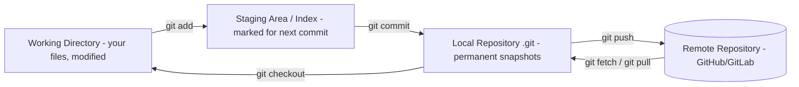

| State | Meaning |
|---|---|
| **Modified** | The file has changed but is not yet marked for commit |
| **Staged** | The change is marked to go into the next commit |
| **Committed** | The change is safely stored in the local database |

### Core Git objects
- **Blob** — the contents of a file.
- **Tree** — a directory listing pointing at blobs and other trees.
- **Commit** — a snapshot: a pointer to a tree, the parent commit(s), the author, and the message.
- **Tag** — a named pointer to a specific commit, typically for a release.
- **HEAD** — a pointer to the branch you currently have checked out.

## 3.4 Essentials of Git in Industry

1. **The single source of truth** — all code, IaC, pipeline definitions and documentation live in Git.
2. **CI/CD trigger** — a push fires the entire automated pipeline.
3. **Code review through pull/merge requests** — no code reaches main without review.
4. **Branch protection** — main cannot be pushed to directly; it requires review and green CI.
5. **Traceability and audit** — every production change traces to a commit, an author and a linked ticket.
6. **Blameless debugging** — `git bisect` finds the commit that introduced a bug automatically.
7. **Release management** — tags and release branches define exactly what shipped.
8. **GitOps** — the desired state of production infrastructure is stored in Git; an agent continuously reconciles the cluster to match it.
9. **Hooks** — pre-commit and pre-push hooks enforce linting, formatting and secret scanning.
10. **Ecosystem** — GitHub, GitLab and Bitbucket add issues, CI, registries, security scanning and project boards on top.

## 3.5 How to Set Up Git

**1. Install**

```bash
sudo apt-get install git
```

On Windows install **Git for Windows** (Git Bash); on macOS use `brew install git` or the Xcode command line tools.

**2. Verify the installation**

```bash
git --version
```

**3. Configure your identity** (required, it is stamped on every commit)

```bash
git config --global user.name "Your Name"
```

```bash
git config --global user.email "you@example.com"
```

**4. Useful settings**

```bash
git config --global core.editor "code --wait"
```

```bash
git config --global init.defaultBranch main
```

**5. Check the configuration**

```bash
git config --list
```

Configuration exists at three levels, each overriding the one above:
- **System** (`--system`) — all users on the machine.
- **Global** (`--global`) — the current user, stored in `~/.gitconfig`.
- **Local** (default) — the current repository, stored in `.git/config`.

**6. Set up SSH authentication for a remote**

```bash
ssh-keygen -t ed25519 -C "you@example.com"
```

Then add the contents of `~/.ssh/id_ed25519.pub` to your GitHub or GitLab account.

**7. Start a repository** — either create a new one or clone an existing one:

```bash
git init
```

```bash
git clone https://github.com/user/repo.git
```

## 3.6 Common Commands in Git

### Setup and configuration
| Command | Purpose |
|---|---|
| `git init` | Create a new repository in the current folder |
| `git clone <url>` | Copy a remote repository, including all history |
| `git config --global user.name "X"` | Set the commit author name |
| `git config --list` | Show all current settings |

### Basic snapshotting
| Command | Purpose |
|---|---|
| `git status` | Show which files are modified, staged or untracked |
| `git add <file>` | Stage a specific file |
| `git add .` | Stage everything in the current directory |
| `git commit -m "message"` | Commit the staged changes |
| `git commit -am "message"` | Stage tracked files and commit in one step |
| `git commit --amend` | Modify the most recent commit |
| `git diff` | Show unstaged changes |
| `git diff --staged` | Show staged changes |
| `git rm <file>` | Delete a file and stage the deletion |
| `git mv <old> <new>` | Rename a file and stage it |

### History
| Command | Purpose |
|---|---|
| `git log` | Show the commit history |
| `git log --oneline --graph --all` | Compact visual history of all branches |
| `git show <commit>` | Show the details of one commit |
| `git blame <file>` | Show who last changed each line |
| `git bisect start` | Binary-search the history to find a bug-introducing commit |

### Branching and merging
| Command | Purpose |
|---|---|
| `git branch` | List local branches |
| `git branch <name>` | Create a branch |
| `git checkout <name>` / `git switch <name>` | Move to a branch |
| `git checkout -b <name>` / `git switch -c <name>` | Create and switch in one step |
| `git merge <branch>` | Merge a branch into the current one |
| `git rebase <branch>` | Replay your commits on top of another branch |
| `git branch -d <name>` | Delete a merged branch |
| `git cherry-pick <commit>` | Apply one specific commit onto the current branch |

### Remote repositories
| Command | Purpose |
|---|---|
| `git remote -v` | List configured remotes |
| `git remote add origin <url>` | Add a remote named origin |
| `git fetch` | Download remote changes **without** merging |
| `git pull` | `fetch` + `merge` — download and integrate |
| `git push origin <branch>` | Upload local commits to the remote |
| `git push -u origin main` | Push and set the upstream tracking branch |

### Undoing things
| Command | Purpose |
|---|---|
| `git restore <file>` | Discard local changes to a file |
| `git reset <file>` | Unstage a file, keeping the change |
| `git reset --soft HEAD~1` | Undo the last commit, keep changes staged |
| `git reset --mixed HEAD~1` | Undo the last commit, keep changes unstaged |
| `git reset --hard HEAD~1` | Undo the last commit and **discard the changes** — destructive |
| `git revert <commit>` | Create a **new** commit that undoes an old one — safe for shared history |
| `git stash` | Temporarily shelve uncommitted changes |
| `git stash pop` | Reapply the shelved changes |
| `git reflog` | Show every position HEAD has held — the recovery lifeline |

> **Rule:** use `reset` only on commits you have **not** pushed. Use `revert` for anything already shared, because rewriting public history breaks everyone else's clone.

### Tagging
| Command | Purpose |
|---|---|
| `git tag v1.0` | Create a lightweight tag |
| `git tag -a v1.0 -m "Release 1.0"` | Create an annotated tag |
| `git push origin --tags` | Push tags to the remote |

## 3.7 Working with Remote Repositories

A **remote** is a version of the repository hosted elsewhere — typically on GitHub, GitLab or Bitbucket. `origin` is the conventional name for the main remote, and `upstream` is the convention for the original repository you forked from.

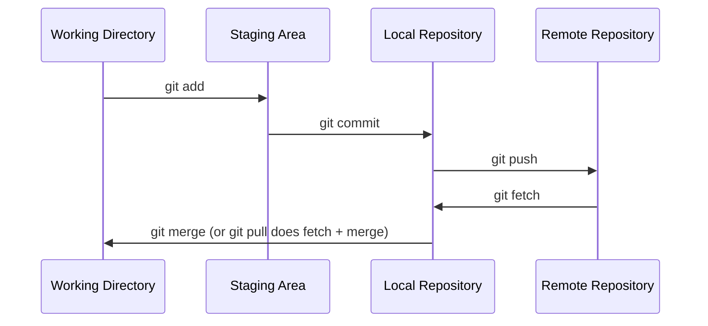

**Typical daily flow:**

```bash
git pull origin main
```

```bash
git checkout -b feature/login
```

```bash
git add . && git commit -m "Add login form validation"
```

```bash
git push -u origin feature/login
```

Then open a **Pull Request** (GitHub) or **Merge Request** (GitLab) so teammates can review before it enters `main`.

**Fork and Pull Request model (open source):**
1. **Fork** the project to your own account.
2. **Clone** your fork locally.
3. Add the original as `upstream` to keep in sync.
4. Create a feature branch, commit, push to your fork.
5. Open a **Pull Request** against the original repository.

## 3.8 Branching and Merging in Git

**A branch is simply a movable pointer to a commit.** Creating one writes a 41-byte file, which is why Git branching is essentially free.

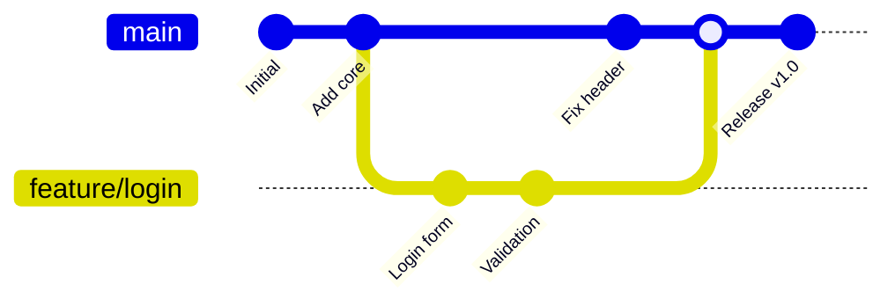

### Types of merge

**1. Fast-forward merge** — if `main` has not moved since the branch was created, Git simply advances the `main` pointer forward. No merge commit is created.

**2. Three-way merge** — if both branches have new commits, Git finds the common ancestor and combines both sets of changes, creating a **merge commit** with two parents.

**3. Squash merge** — combines all the branch's commits into a single commit on `main`, keeping history clean.

### Merge conflicts

A conflict happens when **the same lines of the same file** were changed differently in both branches. Git cannot decide which version is correct, so it stops and asks you.

Git marks the file like this:

```
<<<<<<< HEAD
the version currently on your branch
=======
the version coming from the other branch
>>>>>>> feature/login
```

**Resolving a conflict:**
1. Run `git status` to list conflicted files.
2. Open each file and edit it into the correct final version, deleting the marker lines.
3. `git add <file>` to mark it resolved.
4. `git commit` to complete the merge.

Use `git merge --abort` to cancel and return to the pre-merge state.

**Avoiding conflicts:** pull frequently, keep branches short-lived and small, and agree on file ownership within the team.

### Merge vs Rebase

| | `git merge` | `git rebase` |
|---|---|---|
| History shape | Preserves the true branching history | Creates a linear history |
| Creates a merge commit | Yes (unless fast-forward) | No |
| Rewrites commits | No | Yes — new commit hashes |
| Safe on shared branches | Yes | **No** — never rebase pushed commits others use |
| Best for | Integrating a completed feature into main | Tidying your own local branch before a PR |

**The golden rule of rebasing:** never rebase commits that exist outside your local repository.

## 3.9 Git Workflows

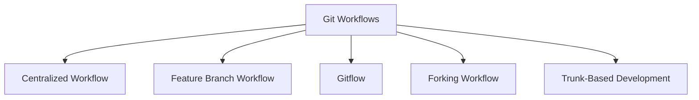

**1. Centralized Workflow**
Everyone commits directly to a single `main` branch, mimicking SVN. Simple, but conflicts are frequent and there is no isolation. Only suitable for very small teams.

**2. Feature Branch Workflow**
Every feature is developed on its own branch and merged into `main` via a pull request after review. `main` always stays deployable. This is the most common practical workflow.

**3. Gitflow** (Vincent Driessen)
A structured model with five branch types:

```mermaid
gitGraph
    commit id: "v1.0"
    branch develop
    checkout develop
    commit id: "dev work"
    branch feature/x
    checkout feature/x
    commit id: "feature work"
    checkout develop
    merge feature/x
    branch release/1.1
    checkout release/1.1
    commit id: "bugfix + version bump"
    checkout main
    merge release/1.1 tag: "v1.1"
    checkout develop
    merge release/1.1
```

| Branch | Purpose | Lifetime |
|---|---|---|
| `main` (master) | Production-ready code only; every commit is a release | Permanent |
| `develop` | Integration branch for the next release | Permanent |
| `feature/*` | One per new feature, branched from and merged to `develop` | Temporary |
| `release/*` | Stabilise a release: bug fixes and version bumps only | Temporary |
| `hotfix/*` | Urgent production fix, branched from `main`, merged to both `main` and `develop` | Temporary |

Gitflow suits products with **scheduled releases and multiple supported versions**, but it is considered heavy for continuous delivery.

**4. Forking Workflow**
Each contributor has a personal server-side fork; contributions arrive as pull requests. Standard for open source, since contributors need no write access to the main repository.

**5. Trunk-Based Development**
Everyone commits to a single trunk (`main`) at least daily, using **very short-lived branches** (under a day) and **feature flags** to hide unfinished work. This is the workflow that best supports true continuous deployment, and DORA research associates it with elite performance.

| Workflow | Team size | Release style | Complexity |
|---|---|---|---|
| Centralized | Very small | Occasional | Lowest |
| Feature Branch | Any | Regular | Low |
| Gitflow | Medium to large | Scheduled versions | High |
| Forking | Open source, large | Any | Medium |
| Trunk-Based | Any mature team | Continuous | Low process, high discipline |

## 3.10 Git Cheat Sheet

```
# --- Setup ---
git config --global user.name "Name"       Set author name
git config --global user.email "a@b.com"   Set author email
git init                                    Start a new repository
git clone <url>                             Copy a remote repository

# --- Daily work ---
git status                                  What has changed
git add <file> | git add .                  Stage changes
git commit -m "msg"                         Commit staged changes
git diff | git diff --staged                See changes
git log --oneline --graph --all             Visual history

# --- Branching ---
git branch                                  List branches
git switch -c <name>                        Create and switch
git switch <name>                           Switch branch
git merge <branch>                          Merge into current branch
git rebase <branch>                         Replay commits on top of another branch
git branch -d <name>                        Delete a merged branch

# --- Remotes ---
git remote -v                               List remotes
git remote add origin <url>                 Add a remote
git fetch                                   Download without merging
git pull                                    Fetch and merge
git push -u origin <branch>                 Push and track

# --- Undo ---
git restore <file>                          Discard local file changes
git reset <file>                            Unstage a file
git reset --hard HEAD~1                     Delete last commit and changes (danger)
git revert <commit>                         Safely undo a pushed commit
git stash / git stash pop                   Shelve and restore work
git reflog                                  Recover "lost" commits

# --- Tags ---
git tag -a v1.0 -m "Release 1.0"            Annotated tag
git push origin --tags                      Push tags
```

## 3.11 Other Version Control Systems

### CVS (Concurrent Versions System)
One of the earliest widely used systems, released in 1990 and built on RCS.
- **Centralized**, client-server.
- Tracks files **individually**, with a per-file version number — there is no repository-wide snapshot or atomic commit.
- **No atomic commits:** if a commit fails halfway, the repository is left inconsistent.
- Cannot version directories, renames or file moves properly.
- Poor binary file support and painful branching.
- **Largely obsolete**, but historically important — SVN was created specifically to fix its flaws ("CVS done right").

### Mercurial (Hg)
Released in 2005, the same month as Git, also as a BitKeeper replacement.
- **Distributed**, like Git.
- Written mostly in **Python**, so it is highly portable and extensible.
- **Simpler and more consistent command set** than Git, with a gentler learning curve.
- Fast on very large repositories; used at Facebook (now Meta) and Mozilla.
- History is **immutable by default**, which is safer but less flexible than Git's rewriting features.
- Branches are permanent named parts of history, unlike Git's lightweight movable pointers. Bookmarks provide Git-like branching.
- **Lost the popularity contest to Git**, largely due to GitHub's network effect.

### Subversion (SVN)
The dominant CVCS of the 2000s, created by CollabNet in 2000.
- **Atomic commits** — a commit either fully succeeds or fully fails.
- Versions **directories, renames and metadata**, unlike CVS.
- Global, repository-wide revision numbers that increment by 1.
- Excellent **fine-grained access control** per directory, which Git lacks.
- Handles **large binary files** well, so it survives in game development and media.
- Branching is a server-side directory copy — cheap to create but historically slow and awkward to merge.

### Perforce (Helix Core)
Commercial, centralized, built for **massive binary assets**. The standard in AAA game development and film, where repositories reach terabytes.

### Comparison

| Feature | CVS | SVN | Mercurial | Git |
|---|---|---|---|---|
| Type | Centralized | Centralized | Distributed | Distributed |
| Released | 1990 | 2000 | 2005 | 2005 |
| Atomic commits | No | Yes | Yes | Yes |
| Offline work | No | No | Yes | Yes |
| Branching cost | Expensive | Cheap to create, hard to merge | Cheap | Very cheap |
| Learning curve | Medium | Easy | Easy | Steeper |
| Directory versioning | No | Yes | Yes | Yes |
| Large binaries | Poor | Good | Fair | Poor without LFS |
| Current status | Obsolete | Legacy, still used | Niche | **Industry standard** |

---

# MODULE 4: Continuous Integration and Continuous Deployment (CI/CD)

## 4.1 Introduction to Continuous Integration

**Continuous Integration (CI)** is the development practice where developers **integrate their code into a shared repository frequently — ideally several times a day** — and each integration is verified by an **automated build and automated tests**.

**The problem it solves — "integration hell":**
Without CI, developers work in isolation for weeks. When everyone finally merges, hundreds of conflicts and incompatibilities surface at once, and nobody knows which change caused which failure. Integration becomes an unpredictable multi-week phase.

With CI, integration happens in tiny increments many times a day, so a problem is always caused by the small change made minutes ago.

```mermaid
flowchart LR
    A[Developer writes code] --> B[Commit and push to shared repo]
    B --> C[CI server detects the change via webhook]
    C --> D[Checkout the code]
    D --> E[Build / compile]
    E --> F[Run automated tests]
    F --> G[Static code analysis]
    G --> H{Everything passes?}
    H -- Yes --> I[Publish the build artifact - green build]
    H -- No --> J[Fail fast and notify the team]
    J --> A
```

### Core practices of CI
1. **Maintain a single source repository** — one place for everything needed to build.
2. **Automate the build** — one command builds the whole system.
3. **Make the build self-testing** — the build fails if the tests fail.
4. **Everyone commits to the mainline every day** — small, frequent integrations.
5. **Every commit builds the mainline** on an integration machine.
6. **Keep the build fast** — the widely cited target is under 10 minutes.
7. **Test in a clone of the production environment**.
8. **Make it easy for anyone to get the latest executable**.
9. **Everyone can see what is happening** — a visible build dashboard.
10. **Fix broken builds immediately** — a red build is the team's top priority.
11. **Automate deployment**.

## 4.2 Continuous Delivery and Continuous Deployment

**Continuous Delivery (CD)** extends CI: every change that passes the pipeline is **automatically prepared for release** to production. The software is always in a **releasable state**, but the actual push to production is a **business decision made by a human**.

**Continuous Deployment** goes one step further: every change that passes all automated checks is **released to production automatically, with no human intervention**.

```mermaid
flowchart TD
    subgraph CI[Continuous Integration]
    A[Commit] --> B[Build] --> C[Unit tests] --> D[Artifact]
    end
    subgraph CDel[Continuous Delivery]
    D --> E[Deploy to staging] --> F[Integration and acceptance tests] --> G[Ready for release]
    G --> H{Manual approval}
    end
    subgraph CDep[Continuous Deployment]
    H -.remove the human gate.-> I[Automatic deploy to production]
    end
    H -- approved --> I
    I --> J[Smoke tests and monitoring]
```

| | Continuous Integration | Continuous Delivery | Continuous Deployment |
|---|---|---|---|
| Automated build and test | Yes | Yes | Yes |
| Automated release to staging | No | Yes | Yes |
| Production release | Manual and separate | One click after approval | Fully automatic |
| Human gate before production | Yes | Yes | **No** |
| Prerequisite | Test automation | + deployment automation | + very high test confidence and monitoring |
| Risk per release | Medium | Low | Lowest, because batches are tiny |

**Note:** the abbreviation "CD" is used for both Delivery and Deployment, so the intended meaning must be read from context.

## 4.3 CI/CD Principles and Their Importance

1. **Everything in version control** — code, tests, configuration, infrastructure and the pipeline definition itself.
2. **Automate everything repeatable** — humans should never run a manual deployment checklist.
3. **Build the binary only once** — compile once and promote the **same artifact** through dev, test, staging and production. Rebuilding per environment risks shipping something different from what was tested.
4. **Deploy the same way to every environment** — the same script and process, differing only by configuration.
5. **Configuration is external to the artifact** — injected via environment variables or a config service.
6. **Fail fast** — put the quickest, cheapest checks first so feedback is immediate.
7. **Stop the line on failure** — a broken pipeline blocks new work until it is fixed.
8. **Make everything visible** — dashboards, notifications, and a shared understanding of the state.
9. **Small, frequent changes** — smaller batches mean less risk and easier diagnosis.
10. **Every build is potentially releasable**.
11. **Test in a production-like environment**.
12. **Continuous improvement** — regularly reduce pipeline time and flakiness.

### Why CI/CD is important

| Benefit | Explanation |
|---|---|
| **Early bug detection** | Defects are found minutes after they are written, when they are cheapest to fix |
| **Faster time to market** | Features reach users in days rather than months |
| **Reduced risk** | Small changes are easy to understand, test and roll back |
| **Higher quality** | Automated testing on every commit prevents regressions |
| **Less manual work** | Engineers spend time on features, not on deployment rituals |
| **Reliable, repeatable releases** | The same automated process every time removes human error |
| **Faster feedback** | From tests, from reviewers and from real users |
| **Better collaboration** | The pipeline is a shared, visible contract |
| **Easy rollback** | Every artifact is versioned and re-deployable |
| **Developer confidence** | People deploy on a Friday afternoon without fear |

## 4.4 Continuous Integration Tools

| Tool | Type | Key characteristics |
|---|---|---|
| **Jenkins** | Open source, self-hosted | The most widely used; 1800+ plugins; extremely flexible; needs maintenance |
| **GitLab CI/CD** | Built into GitLab | Configured with `.gitlab-ci.yml`; tightly integrated with the repository; container-native |
| **GitHub Actions** | Built into GitHub | YAML workflows in `.github/workflows`; huge marketplace of reusable actions |
| **CircleCI** | Cloud / self-hosted | Fast, strong Docker support, good caching, easy setup |
| **Travis CI** | Cloud | Very simple YAML; historically the open-source standard |
| **TeamCity** | JetBrains, commercial | Excellent UI, strong .NET and Java support, build chains |
| **Bamboo** | Atlassian, commercial | Deep Jira and Bitbucket integration |
| **Azure Pipelines** | Microsoft cloud | Multi-platform, generous free tier, YAML or classic editor |
| **Argo CD** | Kubernetes GitOps CD | Continuously reconciles a cluster to the Git-declared state |
| **Spinnaker** | Netflix, open source | Multi-cloud deployment with advanced release strategies |

**Choosing a tool:** consider where the code is hosted, cloud versus self-hosted, container support, plugin ecosystem, cost, and the team's existing skills.

## 4.5 Jenkins and its Architecture

**Jenkins** is a free, open-source **automation server** written in Java. It began as **Hudson** at Sun Microsystems in 2004 (created by Kohsuke Kawaguchi) and was forked as Jenkins in 2011 after the Oracle acquisition.

**Key features:**
- Free and open source, with a very large community.
- **Over 1,800 plugins** for integrating with almost any tool.
- Platform independent (runs anywhere Java runs).
- **Distributed builds** across many machines.
- **Pipeline as code** through the `Jenkinsfile`.
- Easy installation and a web-based UI.
- Extensible security and role-based access.

### Jenkins Architecture — Controller and Agents

Jenkins uses a **master-slave (now called controller-agent)** architecture.

```mermaid
flowchart TD
    A[Developers push code] --> B[(Source Repository - Git)]
    B -- webhook / poll --> C[Jenkins Controller]
    C --> C1[Schedules jobs]
    C --> C2[Stores configuration and build history]
    C --> C3[Serves the web UI]
    C --> C4[Dispatches work to agents]
    C --> D[Agent 1 - Linux]
    C --> E[Agent 2 - Windows]
    C --> F[Agent 3 - macOS / Docker]
    D --> G[Build, test, package]
    E --> G
    F --> G
    G --> H[Artifact repository / Deploy to servers]
    C --> I[Notifications: email, Slack]
```

**Jenkins Controller (master)** responsibilities:
- Scheduling build jobs and dispatching them to agents.
- Monitoring agents and taking them online or offline.
- Storing all job configuration and build results.
- Serving the web interface.
- Managing plugins and security.

**Jenkins Agent (node/slave)** responsibilities:
- Executing the build steps assigned by the controller.
- Reporting the result back.
- Agents can run on different operating systems, which allows cross-platform testing.
- Agents connect over SSH, JNLP, or run as dynamically created Docker/Kubernetes pods.

**Why distribute builds?**
- Run many builds in parallel, reducing queue time.
- Test on multiple platforms simultaneously.
- Keep the controller lightweight and stable (best practice: run **no builds** on the controller).
- Scale elastically by spinning up agents on demand.

**Executors:** each agent has a number of executors, which is the number of builds it can run at once.

### Jenkins Pipeline

A **Pipeline** is a suite of plugins that models the entire delivery process as code in a file named **`Jenkinsfile`**, checked into the repository alongside the application.

**Two syntaxes:**

**Declarative pipeline** (recommended, structured and easier):
```groovy
pipeline {
    agent any
    environment {
        APP_NAME = 'myapp'
    }
    stages {
        stage('Checkout') {
            steps { git 'https://github.com/user/repo.git' }
        }
        stage('Build') {
            steps { sh 'mvn clean package' }
        }
        stage('Test') {
            steps { sh 'mvn test' }
            post { always { junit 'target/surefire-reports/*.xml' } }
        }
        stage('Deploy') {
            when { branch 'main' }
            steps { sh './deploy.sh' }
        }
    }
    post {
        success { echo 'Pipeline succeeded' }
        failure { mail to: 'team@example.com', subject: 'Build failed' }
    }
}
```

**Scripted pipeline** — full Groovy, more powerful but harder to read.

**Pipeline concepts:**
- **Pipeline** — the whole delivery process definition.
- **Node / Agent** — the machine where the work runs.
- **Stage** — a logical block shown as a column in the visual view (Build, Test, Deploy).
- **Step** — a single task within a stage.
- **Post** — actions that run after a stage or the whole pipeline, based on the result.

**Types of Jenkins jobs:** Freestyle project, Pipeline, Multibranch Pipeline (auto-creates a pipeline for every branch with a Jenkinsfile), Folder, and Multi-configuration (matrix) project.

## 4.6 Jenkins Management

The **Manage Jenkins** section is the administrative hub.

| Area | What it does |
|---|---|
| **System Configuration** | Global settings: Jenkins URL, executors on the controller, environment variables, email/SMTP, global tool locations |
| **Global Tool Configuration** | Define installations of JDK, Maven, Gradle, Git, Docker and NodeJS, with optional automatic installation |
| **Manage Plugins** | Install, update and remove plugins; four tabs: Updates, Available, Installed, Advanced |
| **Manage Nodes and Clouds** | Add, configure, and take agents online/offline; configure cloud agent providers (Docker, Kubernetes, EC2) |
| **Manage Users** | Create users and manage accounts |
| **Configure Global Security** | Choose the security realm (Jenkins' own database, LDAP, SSO) and the authorization strategy (matrix-based, role-based, project-based) |
| **Credentials** | Store secrets — passwords, SSH keys, API tokens, certificates — scoped globally or per folder, and reference them in pipelines by ID rather than hard-coding them |
| **System Information / Log** | Diagnostics, environment details, and the Jenkins log |
| **Script Console** | Run Groovy scripts against the running instance — powerful and dangerous, so restrict access |
| **Manage Old Data** | Clean up data left behind by removed plugins |
| **Backup** | Back up `JENKINS_HOME`, which contains all configuration, jobs and history |

**Security best practices:**
- Never run builds on the controller.
- Enable authentication and use role-based authorization.
- Store all secrets in the **Credentials** store, never in the Jenkinsfile.
- Keep Jenkins and its plugins updated.
- Restrict Script Console access to administrators.
- Use HTTPS and back up `JENKINS_HOME` regularly.

## 4.7 Build Setup in Jenkins

**Creating a Freestyle job:**
1. **New Item** → enter a name → select **Freestyle project** → OK.
2. **General** — description, discard old builds, parameters if needed.
3. **Source Code Management** — select Git, enter the repository URL and credentials, specify the branch.
4. **Build Triggers** — choose when it runs (see below).
5. **Build Environment** — delete the workspace before build, inject credentials, set a timeout.
6. **Build Steps** — e.g. *Invoke top-level Maven targets* (`clean package`), or *Execute shell* / *Execute Windows batch command*.
7. **Post-build Actions** — archive artifacts, publish JUnit test results, publish coverage, send email or Slack notification, trigger a downstream job.
8. **Save** and click **Build Now**.

**Build results and outputs:**
- **Console Output** — the full log of the run; the first place to look at any failure.
- **Workspace** — the directory on the agent where the checkout and build happened.
- **Build status colours:** blue/green = success, red = failure, yellow = unstable (built, but tests failed), grey = aborted or not built.
- **Weather icon** — the trend of recent builds.

## 4.8 Git and Jenkins Integration

```mermaid
sequenceDiagram
    participant D as Developer
    participant G as GitHub
    participant J as Jenkins
    participant A as Agent
    participant N as Notification
    D->>G: git push
    G->>J: Webhook POST to /github-webhook/
    J->>A: Assign the build to an agent
    A->>G: Clone / fetch the repository
    A->>A: Build, test, package
    A->>J: Report the result
    J->>G: Update the commit status (green tick or red cross)
    J->>N: Email / Slack notification
```

**Setup steps:**
1. **Install plugins** — Git plugin, GitHub plugin (or GitLab plugin), Credentials plugin, Pipeline plugin.
2. **Add credentials** in Jenkins — a username/personal access token or an SSH private key.
3. **Configure the job** — under Source Code Management choose Git, paste the repository URL, select the credentials, and set the branch specifier (`*/main`).
4. **Configure the trigger** — enable *GitHub hook trigger for GITScm polling*.
5. **Add the webhook in GitHub** — Settings → Webhooks → Add webhook → Payload URL `http://<jenkins-url>/github-webhook/`, content type `application/json`, event: push.
6. **Test** — push a commit and confirm the build starts automatically.

**Webhook vs Polling:**

| | Webhook (push) | Poll SCM (pull) |
|---|---|---|
| How it works | Git server notifies Jenkins instantly | Jenkins checks the repo on a schedule |
| Latency | Immediate | Up to the polling interval |
| Load | Minimal | Constant requests even when nothing changed |
| Requirement | Jenkins must be reachable from the Git server | Works behind a firewall |
| Preferred | **Yes** | Only when webhooks are impossible |

**Multibranch Pipeline:** points Jenkins at a repository; it scans all branches, and automatically creates and removes a pipeline job for each branch that contains a `Jenkinsfile`. It also builds pull requests, making it the standard setup for feature-branch workflows.

## 4.9 Build and Test Applications with Continuous Integration

**A typical CI pipeline for a Java/Maven application:**

```mermaid
flowchart LR
    A[1. Checkout] --> B[2. Compile]
    B --> C[3. Unit tests]
    C --> D[4. Code coverage]
    D --> E[5. Static analysis - SonarQube]
    E --> F[6. Package - JAR/WAR]
    F --> G[7. Integration tests]
    G --> H[8. Security scan]
    H --> I[9. Publish artifact to Nexus]
    I --> J[10. Deploy to staging]
    J --> K[11. Smoke tests]
```

**Stage details:**

| Stage | Command / tool | Purpose |
|---|---|---|
| Checkout | `git clone` | Get the source at the triggering commit |
| Compile | `mvn compile` | Catch syntax and type errors |
| Unit tests | `mvn test` (JUnit, TestNG) | Verify individual components in isolation |
| Coverage | JaCoCo, Cobertura | Enforce a minimum coverage threshold |
| Static analysis | SonarQube, Checkstyle, PMD | Detect code smells, bugs and vulnerabilities without running the code |
| Package | `mvn package` | Produce the deployable JAR/WAR/Docker image |
| Integration tests | Failsafe, Testcontainers | Verify components working together with real dependencies |
| Security scan | OWASP Dependency-Check, Trivy, Snyk | Find vulnerable libraries |
| Publish | Nexus, Artifactory, Docker registry | Store the versioned, immutable artifact |
| Deploy | Ansible, Docker, kubectl | Push to the staging environment |
| Smoke tests | Selenium, curl health checks | Confirm the deployment actually works |

**Quality gates:** the pipeline fails automatically if coverage drops below a threshold, if SonarQube reports a blocker issue, or if a high-severity vulnerability is found.

**Publishing results in Jenkins:** use post-build actions such as *Publish JUnit test result report* (`**/target/surefire-reports/*.xml`), *Record coverage*, and *Archive the artifacts*.

## 4.10 Scheduling Build Jobs

Jenkins offers several **build triggers**:

| Trigger | Description |
|---|---|
| **Build periodically** | Run on a fixed cron schedule regardless of code changes. Used for nightly builds and reports |
| **Poll SCM** | Check the repository on a schedule; build only if something changed |
| **GitHub/GitLab hook trigger** | Build immediately when a push webhook arrives — the preferred method |
| **Build after other projects are built** | Chain jobs so one triggers the next |
| **Trigger builds remotely** | Call a URL with an authentication token, e.g. from an external script |
| **Build when a change is pushed to a PR** | Multibranch pipelines building pull requests |
| **Manual (Build Now)** | Started by a person, optionally with parameters |

### Jenkins cron syntax

Five fields: `MINUTE HOUR DAY_OF_MONTH MONTH DAY_OF_WEEK`

| Field | Range |
|---|---|
| MINUTE | 0–59 |
| HOUR | 0–23 |
| DAY_OF_MONTH | 1–31 |
| MONTH | 1–12 |
| DAY_OF_WEEK | 0–7 (0 and 7 are both Sunday) |

**Examples:**

| Expression | Meaning |
|---|---|
| `H * * * *` | Once an hour, at a Jenkins-chosen minute |
| `H/15 * * * *` | Every 15 minutes |
| `H 2 * * *` | Once a day around 2 AM |
| `H 22 * * 1-5` | At about 10 PM every weekday |
| `H H(0-7) * * *` | Once a day, some time between midnight and 8 AM |
| `0 0 1 * *` | At midnight on the 1st of every month |
| `H/5 * * * *` | Every 5 minutes (typical Poll SCM setting) |

**The `H` (hash) symbol** is a Jenkins-specific and very important feature. It tells Jenkins to pick a value **based on a hash of the job name**, spreading jobs evenly across the period. Without it, writing `0 2 * * *` on fifty jobs would start all fifty at exactly 2:00 AM and overload the server.

**Best practices for scheduling:**
- Use **webhooks** for CI builds and **cron** only for periodic maintenance jobs.
- Always prefer `H` over a fixed minute.
- Run heavy jobs (full regression, security scans) at night.
- Set a **build timeout** so a hung job does not occupy an executor forever.
- Use *Discard old builds* to control disk usage.

## 4.11 Deployment Strategies

| Strategy | How it works | Advantage | Trade-off |
|---|---|---|---|
| **Recreate (big bang)** | Stop the old version, start the new one | Simplest | Downtime |
| **Rolling update** | Replace instances a few at a time | No downtime, no extra infrastructure | Two versions run at once; slow rollback |
| **Blue-Green** | Two identical environments; switch the router from blue to green | Instant switch and instant rollback | Doubles infrastructure cost |
| **Canary** | Send a small percentage of traffic to the new version, then increase | Limits the blast radius; real-user validation | Needs good traffic routing and monitoring |
| **A/B testing** | Route by user attribute to compare versions | Measures business impact | Requires analytics infrastructure |
| **Feature flags** | Deploy the code disabled, enable it later at runtime | Decouples deploy from release; instant kill switch | Flag debt if not cleaned up |

```mermaid
flowchart LR
    subgraph BG[Blue-Green]
    LB[Load Balancer] --> B1[Blue - v1 live]
    LB -.switch after testing.-> G1[Green - v2 idle]
    end
    subgraph CA[Canary]
    LB2[Load Balancer] -- 95% --> O[v1]
    LB2 -- 5% --> N[v2]
    end
```

---

# MODULE 5: Virtualization and Containerization

## 5.1 Introduction to Containers

A **container** is a lightweight, standalone, executable package that includes **everything needed to run a piece of software**: the application code, its runtime, system libraries, tools and settings — everything except the operating system kernel, which it shares with the host.

**The problem containers solve:** "It works on my machine."
An application depends on a specific Python version, specific libraries and specific environment variables. If the test server has different versions, the application breaks. A container **freezes the entire environment** with the application, so it behaves identically everywhere.

```mermaid
flowchart LR
    A[App code] --> E[Container Image]
    B[Runtime - JRE, Python, Node] --> E
    C[System libraries] --> E
    D[Configuration and dependencies] --> E
    E --> F[Developer laptop]
    E --> G[Test server]
    E --> H[Production cloud]
```

## 5.2 Understanding Containerization and its Benefits

**Containerization** is the packaging of software into containers so it can run reliably in any computing environment.

It relies on two Linux kernel features:
- **Namespaces** — provide **isolation**. Each container gets its own view of process IDs, network stack, mount points, users and hostname, so it cannot see the others.
- **Control groups (cgroups)** — provide **resource limits**. They cap how much CPU, memory, disk and network I/O a container may use.
- **Union file systems (OverlayFS)** — provide **layering**, so images share common layers and take little disk space.

### Benefits

1. **Portability** — build once, run anywhere with a container runtime.
2. **Consistency** — the same image runs in dev, test and production, ending environment drift.
3. **Lightweight** — megabytes rather than gigabytes; no guest operating system.
4. **Fast startup** — seconds or less, versus minutes for a virtual machine.
5. **Higher density** — hundreds of containers per host versus a handful of VMs.
6. **Isolation** — a crash or a dependency conflict in one container does not affect others.
7. **Scalability** — spin up identical copies instantly to handle load.
8. **Microservices friendly** — one service per container, each independently deployable.
9. **Efficient CI/CD** — build the image once and promote the identical artifact through every stage.
10. **Version control for environments** — the `Dockerfile` is code, reviewed and versioned like everything else.
11. **Easy rollback** — redeploy the previous image tag.
12. **Cost saving** — better hardware utilisation.

**Limitations:** containers share the host kernel, so isolation is weaker than a VM's; you cannot run a Windows container on a Linux kernel (and vice versa) without a VM underneath; persistent data and stateful applications need extra care; and orchestration adds operational complexity.

## 5.3 Container Life Cycle

```mermaid
stateDiagram-v2
    [*] --> Created: docker create
    Created --> Running: docker start
    [*] --> Running: docker run
    Running --> Paused: docker pause
    Paused --> Running: docker unpause
    Running --> Stopped: docker stop (SIGTERM then SIGKILL)
    Running --> Stopped: docker kill (SIGKILL immediately)
    Running --> Stopped: process exits
    Stopped --> Running: docker start / docker restart
    Stopped --> Deleted: docker rm
    Deleted --> [*]
```

| State | Description | Command to enter it |
|---|---|---|
| **Created** | The container exists with its filesystem and configuration but no process is running | `docker create` |
| **Running** | The main process is executing | `docker run` or `docker start` |
| **Paused** | All processes are frozen using cgroups; memory state is retained | `docker pause` |
| **Stopped / Exited** | The main process has ended; the filesystem and configuration remain, so it can be restarted | `docker stop`, `docker kill`, or natural exit |
| **Deleted / Removed** | The container and its writable layer are destroyed permanently | `docker rm` |

**Important:** a container lives only as long as its **main process (PID 1)**. When that process exits, the container stops. This is why a container running only `bash` with no attached terminal exits immediately.

**Related image lifecycle:** `docker build` (Dockerfile → image) → `docker tag` → `docker push` (image → registry) → `docker pull` → `docker run` (image → container) → `docker commit` (container → new image, discouraged in practice).

## 5.4 Docker Essentials

**Docker** is the most popular containerization platform, released in **2013 by Solomon Hykes (dotCloud)**. It made Linux container technology usable by ordinary developers.

### Docker Architecture

```mermaid
flowchart LR
    A[Docker Client - docker CLI] -- REST API --> B[Docker Daemon - dockerd]
    B --> C[Images]
    B --> D[Containers]
    B --> E[Networks]
    B --> F[Volumes]
    B <--> G[(Docker Registry - Docker Hub)]
```

| Component | Role |
|---|---|
| **Docker Client** | The `docker` command you type; sends commands to the daemon over a REST API |
| **Docker Daemon (dockerd)** | The background service that builds, runs and manages images, containers, networks and volumes |
| **Docker Host** | The machine on which the daemon runs |
| **Docker Registry** | Stores and distributes images. Docker Hub is the public default; private options include AWS ECR, Harbor and Nexus |
| **Docker Objects** | Images, containers, networks, volumes, plugins |

Underneath, `dockerd` calls **containerd**, which calls **runc**, which actually creates the container using kernel namespaces and cgroups.

### Understanding Images and Containers

| | Image | Container |
|---|---|---|
| What it is | A **read-only template** — a blueprint | A **running instance** of an image |
| Analogy | A class in programming; a recipe; an ISO file | An object; the cooked dish; a running virtual machine |
| Mutability | Immutable | Has a thin **writable layer** on top |
| Storage | Layered, shared between images | Only the writable layer is unique |
| Count | One image | Can produce many containers |
| Created by | `docker build` | `docker run` |

**Image layers:** each instruction in a Dockerfile creates a **layer**. Layers are cached and shared, so pulling a second image based on the same Ubuntu base downloads only the differences. A container adds a thin writable layer on top; all changes go there, and they are lost when the container is removed — which is why **volumes** are needed for persistent data.

```mermaid
flowchart TD
    A[Writable container layer - ephemeral] --> B[Layer 3: COPY app code]
    B --> C[Layer 2: RUN pip install]
    C --> D[Layer 1: FROM python:3.11 base image]
```

### Essential Docker commands

**Images**
| Command | Purpose |
|---|---|
| `docker images` | List local images |
| `docker pull <image>` | Download an image from a registry |
| `docker build -t name:tag .` | Build an image from a Dockerfile |
| `docker rmi <image>` | Remove an image |
| `docker tag src target` | Give an image another name |
| `docker push <image>` | Upload an image to a registry |
| `docker history <image>` | Show the layers of an image |

**Containers**
| Command | Purpose |
|---|---|
| `docker run <image>` | Create and start a container |
| `docker run -d -p 8080:80 --name web nginx` | Run detached, map ports, name it |
| `docker ps` / `docker ps -a` | List running / all containers |
| `docker stop <id>` / `docker start <id>` | Stop / start a container |
| `docker restart <id>` | Restart |
| `docker rm <id>` | Remove a stopped container |
| `docker exec -it <id> bash` | Open a shell inside a running container |
| `docker logs -f <id>` | View and follow the container's output |
| `docker inspect <id>` | Full JSON details of the container |
| `docker stats` | Live resource usage |
| `docker cp <id>:/path ./local` | Copy files in or out |

**System**
| Command | Purpose |
|---|---|
| `docker system prune -a` | Remove unused containers, images, networks |
| `docker volume ls` / `docker network ls` | List volumes / networks |
| `docker login` | Authenticate to a registry |

**Common `docker run` flags:**
`-d` detached, `-it` interactive terminal, `-p host:container` port mapping, `-v host:container` volume mount, `-e KEY=value` environment variable, `--name` container name, `--rm` auto-remove on exit, `--network` attach to a network, `--restart=always` restart policy.

### Docker networking

| Network driver | Behaviour |
|---|---|
| **bridge** (default) | Private internal network on the host; containers reach each other by name on a user-defined bridge; external access requires port publishing |
| **host** | The container shares the host's network stack directly; no isolation, no port mapping needed |
| **none** | No networking at all |
| **overlay** | Spans multiple Docker hosts; used by Swarm and multi-host setups |
| **macvlan** | Gives the container its own MAC address on the physical network |

### Docker storage

| Type | Description | Use |
|---|---|---|
| **Volumes** | Managed by Docker in `/var/lib/docker/volumes`; the recommended way | Databases, persistent application data |
| **Bind mounts** | Map any host directory into the container | Local development, mounting source code |
| **tmpfs** | Stored in host memory only | Secrets and temporary files |

### Docker Compose

**Docker Compose** defines and runs **multi-container applications** from a single YAML file, so an entire stack starts with one command.

```yaml
version: '3.8'
services:
  web:
    build: .
    ports:
      - "8080:80"
    environment:
      - DB_HOST=db
    depends_on:
      - db
  db:
    image: postgres:15
    environment:
      - POSTGRES_PASSWORD=secret
    volumes:
      - dbdata:/var/lib/postgresql/data
volumes:
  dbdata:
```

Commands: `docker compose up -d`, `docker compose down`, `docker compose logs -f`, `docker compose ps`.

## 5.5 Use Cases of Docker

1. **Consistent development environments** — every developer runs the identical stack in minutes.
2. **CI/CD pipelines** — build in a clean container each time; promote the same image through environments.
3. **Microservices** — package each service independently with its own dependencies.
4. **Application isolation** — run two applications needing conflicting library versions on one host.
5. **Legacy application modernisation** — wrap an old application in a container without rewriting it.
6. **Rapid scaling** — launch more identical containers behind a load balancer under load.
7. **Testing and QA** — spin up a disposable database or message queue for integration tests, then throw it away.
8. **Multi-cloud portability** — the same image runs on AWS, Azure, GCP or on-premise.
9. **Simplified onboarding** — a new developer runs `docker compose up` instead of a two-day setup document.
10. **Batch and data processing** — package data pipeline jobs with all their dependencies.

## 5.6 Platforms for Docker

**Operating systems**
- **Linux** — the native home; Docker Engine runs directly on the kernel.
- **Windows** — **Docker Desktop for Windows** uses **WSL 2** (or Hyper-V) to run a lightweight Linux VM. Windows containers are also supported for .NET workloads.
- **macOS** — **Docker Desktop for Mac** runs a Linux VM through the hypervisor framework.

**Cloud container services**

| Provider | Services |
|---|---|
| **AWS** | ECS (Elastic Container Service), EKS (managed Kubernetes), Fargate (serverless containers), ECR (registry), App Runner |
| **Azure** | ACI (Container Instances), AKS (Kubernetes Service), ACR (registry), Container Apps |
| **GCP** | GKE (Kubernetes Engine), Cloud Run (serverless containers), Artifact Registry |
| **Others** | DigitalOcean App Platform, Heroku, Red Hat OpenShift, IBM Cloud |

**Orchestration platforms**
- **Kubernetes** — the industry-standard orchestrator: automatic scheduling, self-healing, horizontal scaling, service discovery, rolling updates and secret management.
- **Docker Swarm** — Docker's own simpler orchestrator, easy to learn but far less capable.
- **Apache Mesos / Marathon** — an older large-scale cluster manager.
- **Nomad** — HashiCorp's simpler scheduler.

**Registries:** Docker Hub, Amazon ECR, Google Artifact Registry, Azure Container Registry, GitHub Container Registry, Harbor, Nexus.

## 5.7 Docker vs Virtualization

### Virtual Machines
A **hypervisor** creates virtual hardware, and each VM runs a **complete guest operating system** with its own kernel.

- **Type 1 (bare metal)** — runs directly on hardware: VMware ESXi, Microsoft Hyper-V, Xen, KVM.
- **Type 2 (hosted)** — runs on top of a host OS: VirtualBox, VMware Workstation.

### Architectural comparison

```mermaid
flowchart TD
    subgraph VMs[Virtual Machines]
    H1[Physical Hardware] --> H2[Host OS]
    H2 --> H3[Hypervisor]
    H3 --> V1[Guest OS 1 + Libs + App A]
    H3 --> V2[Guest OS 2 + Libs + App B]
    H3 --> V3[Guest OS 3 + Libs + App C]
    end
    subgraph CN[Containers]
    C1[Physical Hardware] --> C2[Host OS with shared kernel]
    C2 --> C3[Container Engine - Docker]
    C3 --> K1[Libs + App A]
    C3 --> K2[Libs + App B]
    C3 --> K3[Libs + App C]
    end
```

The essential difference: **VMs virtualize the hardware; containers virtualize the operating system.**

| Aspect | Virtual Machine | Docker Container |
|---|---|---|
| Guest operating system | Full OS per VM | None — shares the host kernel |
| Size | Gigabytes | Megabytes |
| Startup time | Minutes | Seconds or less |
| Isolation | Strong — hardware-level | Process-level, weaker |
| Performance | Some hypervisor overhead | Near-native |
| Density per host | Tens | Hundreds |
| Portability | Large images, hypervisor dependent | Highly portable |
| Resource use | Heavy — duplicated OS per VM | Lightweight |
| OS flexibility | Can run any OS, including different kernels | Must match the host kernel type |
| Security | Better for untrusted or multi-tenant workloads | Kernel is a shared attack surface |
| Best for | Running different operating systems, strong isolation, legacy monoliths | Microservices, CI/CD, rapid scaling, cloud-native apps |

**They are complementary, not rivals.** In practice, cloud providers run containers **inside** VMs, gaining the strong isolation of a VM boundary between tenants and the speed and density of containers within it.

## 5.8 Installing and Configuring Docker

**On Ubuntu / Debian:**

```bash
sudo apt-get update && sudo apt-get install -y ca-certificates curl gnupg
```

```bash
curl -fsSL https://get.docker.com | sudo sh
```

```bash
sudo systemctl enable --now docker
```

Add your user to the `docker` group so you do not need `sudo` (log out and back in afterwards):

```bash
sudo usermod -aG docker $USER
```

**Verify the installation:**

```bash
docker --version && docker run hello-world
```

**On Windows / macOS:** install **Docker Desktop**. On Windows, enable **WSL 2** and virtualization in the BIOS first.

**Creating containers of operating systems:**

```bash
docker run -it --name myubuntu ubuntu:22.04 /bin/bash
```

```bash
docker run -it --name mycentos centos:7 /bin/bash
```

```bash
docker run -d --name myalpine alpine sleep 3600
```

Inside the Ubuntu container you can run `apt-get update`, install packages and behave as if on a real machine — but the changes vanish when the container is removed unless you commit an image or use a volume.

**Basic configuration** lives in `/etc/docker/daemon.json`, controlling the storage driver, log driver and rotation, registry mirrors, insecure registries and default address pools.

## 5.9 Dockerfile

A **Dockerfile** is a plain text file of instructions that Docker executes in order to build an image. It is the "source code" of an image.

### Key instructions

| Instruction | Purpose |
|---|---|
| `FROM` | The base image; must be the first instruction |
| `WORKDIR` | Set the working directory for later instructions |
| `COPY` | Copy files from the build context into the image |
| `ADD` | Like COPY, but also extracts archives and fetches URLs — prefer COPY |
| `RUN` | Execute a command **at build time**, creating a new layer |
| `CMD` | The **default command** when the container starts; overridable at `docker run` |
| `ENTRYPOINT` | The command that always runs; arguments from `docker run` are appended to it |
| `ENV` | Set an environment variable |
| `ARG` | A build-time variable, available only during build |
| `EXPOSE` | Document which port the application listens on (does not publish it) |
| `VOLUME` | Declare a mount point for persistent data |
| `USER` | Switch to a non-root user — an important security practice |
| `LABEL` | Add metadata such as the maintainer |
| `HEALTHCHECK` | Define how Docker tests that the container is healthy |

**CMD vs ENTRYPOINT:** use `ENTRYPOINT` for the fixed executable and `CMD` for its default arguments. For example `ENTRYPOINT ["python", "app.py"]` with `CMD ["--port", "8080"]`.

### Example 1 — Dockerfile for a Java web application

```dockerfile
# Build stage
FROM maven:3.9-eclipse-temurin-17 AS build
WORKDIR /app
COPY pom.xml .
RUN mvn dependency:go-offline
COPY src ./src
RUN mvn clean package -DskipTests

# Runtime stage
FROM eclipse-temurin:17-jre-alpine
WORKDIR /app
COPY --from=build /app/target/myapp.jar app.jar
RUN addgroup -S spring && adduser -S spring -G spring
USER spring
EXPOSE 8080
HEALTHCHECK CMD wget -q --spider http://localhost:8080/health || exit 1
ENTRYPOINT ["java", "-jar", "app.jar"]
```

This is a **multi-stage build**: the heavy Maven toolchain is used in the first stage, and only the finished JAR is copied into a tiny JRE image. The final image is a fraction of the size and contains no build tools for an attacker to use.

### Example 2 — Dockerfile for a Node.js web application

```dockerfile
FROM node:20-alpine
WORKDIR /usr/src/app
COPY package*.json ./
RUN npm ci --omit=dev
COPY . .
ENV NODE_ENV=production
EXPOSE 3000
USER node
CMD ["node", "server.js"]
```

Note that `package*.json` is copied and dependencies installed **before** the rest of the source. Because Docker caches layers, changing application code does not invalidate the expensive `npm ci` layer.

### Build, run and manage

```bash
docker build -t myapp:1.0 .
```

```bash
docker run -d -p 8080:8080 --name myapp-container myapp:1.0
```

```bash
docker logs -f myapp-container
```

```bash
docker exec -it myapp-container sh
```

```bash
docker tag myapp:1.0 username/myapp:1.0 && docker push username/myapp:1.0
```

### Dockerfile best practices
1. Use **small base images** (alpine, slim, distroless).
2. Use **multi-stage builds** to keep build tools out of the final image.
3. Order instructions from **least to most frequently changing** to maximise layer caching.
4. Combine related `RUN` commands with `&&` to reduce layers, and clean the package cache in the same layer.
5. Add a **`.dockerignore`** file so `node_modules`, `.git` and secrets never enter the build context.
6. **Never hard-code secrets** in a Dockerfile — they persist in the image layers forever.
7. Run as a **non-root user**.
8. Pin image versions (`node:20-alpine`, not `node:latest`) for reproducible builds.
9. Add a `HEALTHCHECK`.
10. Scan images for vulnerabilities with Trivy, Snyk or `docker scout`.

---

# MODULE 6: Continuous Testing and Configuration Management

## 6.1 Introduction to Continuous Testing

**Continuous Testing** is the practice of executing **automated tests as part of the delivery pipeline**, at every stage, to get immediate feedback on the business risk of a release candidate.

**How it differs from traditional testing:**

| Traditional testing | Continuous testing |
|---|---|
| A separate phase near the end | Runs continuously throughout the pipeline |
| Mostly manual | Almost entirely automated |
| Feedback in days or weeks | Feedback in minutes |
| Owned by a separate QA team | Shared responsibility of the whole team |
| Aims to find bugs | Aims to **prevent** bugs from progressing |
| A gate that blocks release | A safety net that enables frequent release |

**Why it is essential:** if you deploy several times a day, a two-week manual regression cycle is impossible. Only automation can keep up.

**The shift-left principle:** move testing as early as possible. The cost of fixing a defect rises sharply the later it is found — a bug caught by a unit test costs almost nothing, while the same bug found in production can cost a hundred times more.

```mermaid
flowchart LR
    A[Code commit] --> B[Static analysis + Unit tests<br/>seconds]
    B --> C[Integration and API tests<br/>minutes]
    C --> D[Functional / UI tests on staging<br/>tens of minutes]
    D --> E[Performance and security tests]
    E --> F[Deploy]
    F --> G[Smoke tests + Monitoring in production]
    G --> A
```

## 6.2 Agile Testing Techniques

**Agile testing** is testing performed *within* an Agile development process: continuous, collaborative, and driven by the whole team rather than a separate QA department.

### The Agile Testing Quadrants (Brian Marick / Lisa Crispin)

```mermaid
flowchart TD
    Q2["Q2 - Business facing, supports the team<br/>Functional tests, Story tests, Prototypes, Simulations<br/>(Automated and Manual)"]
    Q3["Q3 - Business facing, critiques the product<br/>Exploratory testing, Usability, UAT, Alpha/Beta<br/>(Manual)"]
    Q1["Q1 - Technology facing, supports the team<br/>Unit tests, Component tests<br/>(Automated)"]
    Q4["Q4 - Technology facing, critiques the product<br/>Performance, Load, Security, Scalability<br/>(Tools)"]
```

- **Q1** — technology-facing tests that guide development: unit and component tests, fully automated.
- **Q2** — business-facing tests that define what to build: acceptance and story tests, examples, prototypes.
- **Q3** — business-facing tests that evaluate the finished product: exploratory, usability, user acceptance testing. These need a human.
- **Q4** — technology-facing tests using tools: performance, load, stress, security, scalability.

### Key Agile testing techniques

**1. Test-Driven Development (TDD)**
```mermaid
flowchart LR
    A[RED - write a failing test] --> B[GREEN - write minimum code to pass]
    B --> C[REFACTOR - clean up the code]
    C --> A
```
Write the test before the code. Guarantees test coverage and drives simple, testable design.

**2. Behaviour-Driven Development (BDD)**
Extends TDD with a shared language. Scenarios are written in **Gherkin** so business people can read them:
```gherkin
Feature: User login
  Scenario: Successful login with valid credentials
    Given the user is on the login page
    When they enter a valid username and password
    And they click the login button
    Then they should be redirected to the dashboard
```
Tools: Cucumber, SpecFlow, Behave, JBehave.

**3. Acceptance Test-Driven Development (ATDD)** — the team defines acceptance criteria collaboratively before development starts.

**4. Exploratory Testing** — simultaneous learning, test design and execution by a skilled tester. Finds problems scripted tests never would.

**5. Session-Based Testing** — exploratory testing organised into time-boxed, chartered sessions with notes, making it manageable and reportable.

**6. Risk-Based Testing** — prioritise test effort where the probability and impact of failure are highest.

**7. Pair Testing** — a developer and tester work together at one machine.

**8. Regression Testing** — automated suites re-run on every commit to ensure old features still work.

**9. Continuous Feedback and the whole-team approach** — quality is everyone's responsibility, not a department's.

## 6.3 Testing Life Cycle

The **Software Testing Life Cycle (STLC)** in a continuous, Agile setting:

```mermaid
flowchart TD
    A[1. Requirement / Story Analysis] --> B[2. Test Planning]
    B --> C[3. Test Case Design and Development]
    C --> D[4. Test Environment Setup]
    D --> E[5. Test Execution - automated in the pipeline]
    E --> F[6. Defect Reporting and Tracking]
    F --> G[7. Test Cycle Closure and Reporting]
    G --> H[8. Continuous Feedback to Planning]
    H --> A
```

| Phase | Activities | Deliverables |
|---|---|---|
| **Requirement analysis** | Review stories and acceptance criteria; identify what is testable; clarify ambiguity | Requirement Traceability Matrix, list of testable items |
| **Test planning** | Define scope, approach, tools, environment, schedule, entry and exit criteria, risks | Test plan, effort estimate |
| **Test case design** | Write test cases and scripts; prepare test data; automate what is repeatable | Test cases, automation scripts, test data |
| **Environment setup** | Provision hardware, software, test databases and stubs — often containerised so it is disposable | Ready environment, smoke test results |
| **Test execution** | Run tests, mostly automatically in the CI/CD pipeline; log results | Test execution report, logs |
| **Defect reporting** | Raise, prioritise, track and retest defects | Defect reports, defect metrics |
| **Cycle closure** | Analyse coverage, quality and cost; hold a retrospective | Test summary report, lessons learned |

**Entry criteria** — what must be true before a phase starts (e.g. the build is deployed and stable).
**Exit criteria** — what must be true before it ends (e.g. 100% of critical tests passed, no open blocker defects).

**Types of testing across the cycle:**

| Level | Type | Purpose |
|---|---|---|
| Unit | White box | Test one function or class in isolation |
| Integration | Grey box | Test modules working together |
| System | Black box | Test the complete application against requirements |
| Acceptance | Black box | Confirm it meets business needs (UAT) |
| Regression | Any | Confirm existing features still work |
| Smoke / Sanity | Black box | A quick check that the build is stable enough to test further |
| Performance / Load / Stress | Non-functional | Speed, capacity and behaviour under strain |
| Security | Non-functional | Vulnerabilities and misuse |
| Usability / Accessibility | Non-functional | Ease of use for all users |

## 6.4 Testing Tools

| Category | Tools |
|---|---|
| **Unit testing** | JUnit, TestNG (Java); pytest, unittest (Python); Jest, Mocha (JavaScript); NUnit, xUnit (.NET) |
| **UI / functional automation** | **Selenium**, Cypress, Playwright, Puppeteer, TestComplete, Katalon |
| **Mobile testing** | Appium, Espresso, XCUITest, BrowserStack |
| **API testing** | Postman, REST Assured, SoapUI, Karate |
| **BDD** | Cucumber, SpecFlow, Behave, JBehave |
| **Performance and load** | Apache JMeter, Gatling, Locust, k6, LoadRunner |
| **Security** | OWASP ZAP, Burp Suite, SonarQube, Snyk, Trivy, Nessus |
| **Static code analysis** | SonarQube, Checkstyle, PMD, ESLint, SpotBugs |
| **Code coverage** | JaCoCo, Cobertura, Istanbul |
| **Test management** | TestRail, Zephyr, qTest, Xray |
| **Defect tracking** | Jira, Bugzilla, Azure Boards |
| **Cross-browser cloud** | BrowserStack, Sauce Labs, LambdaTest |
| **Contract testing** | Pact |
| **Containerised test dependencies** | Testcontainers |

## 6.5 Testing using Selenium

**Selenium** is the most widely used open-source framework for **automating web browsers**. It drives a real browser exactly as a user would — clicking, typing and navigating.

### The Selenium suite

| Component | Purpose |
|---|---|
| **Selenium WebDriver** | The core API; controls a browser natively through its own driver. This is what "Selenium" normally means today |
| **Selenium IDE** | A browser extension that records and plays back interactions; good for beginners and quick prototypes, not for production suites |
| **Selenium Grid** | Runs tests in **parallel** across many machines, browsers and operating systems |
| **Selenium RC** | The obsolete predecessor of WebDriver, removed in Selenium 3 |

### Selenium WebDriver architecture

```mermaid
flowchart LR
    A[Test script - Java, Python, C#, JS] --> B[Selenium WebDriver client library]
    B -- W3C WebDriver protocol over HTTP --> C[Browser driver: chromedriver, geckodriver, msedgedriver]
    C -- native browser automation --> D[Browser: Chrome, Firefox, Edge, Safari]
    D -- response --> C --> B --> A
```

**Key advantages:** free and open source; supports Java, Python, C#, Ruby and JavaScript; works on Chrome, Firefox, Edge, Safari and Opera; runs on Windows, Linux and macOS; integrates with JUnit/TestNG and with Jenkins.

**Limitations:** web applications only (no desktop apps); no built-in reporting (needs TestNG or Allure); cannot test images or CAPTCHAs; tests can be **flaky** if waits are handled poorly; requires programming skill.

### Locators — how Selenium finds elements

| Locator | Example | Notes |
|---|---|---|
| `id` | `By.id("username")` | Fastest and most reliable; use whenever available |
| `name` | `By.name("email")` | Good if unique |
| `className` | `By.className("btn-primary")` | Fails if the class has spaces |
| `tagName` | `By.tagName("input")` | Rarely unique |
| `linkText` / `partialLinkText` | `By.linkText("Sign in")` | For anchor tags only |
| `cssSelector` | `By.cssSelector("input#user.form-control")` | Fast and concise; preferred over XPath |
| `xpath` | `By.xpath("//div[@class='box']//input[1]")` | Most powerful, can traverse upward, but slower and brittle |

### Waits — the key to reliable tests

| Wait type | Behaviour |
|---|---|
| **Implicit wait** | A global setting; the driver polls for up to N seconds when locating any element |
| **Explicit wait** | Waits for a **specific condition** on a specific element (visible, clickable, present). The recommended approach |
| **Fluent wait** | An explicit wait with a custom polling interval and ignored exceptions |
| **Thread.sleep()** | A hard-coded pause. **Avoid it** — it either wastes time or fails intermittently |

### Example — a Selenium WebDriver test in Java

```java
import org.openqa.selenium.*;
import org.openqa.selenium.chrome.ChromeDriver;
import org.openqa.selenium.support.ui.*;
import java.time.Duration;

public class LoginTest {
    public static void main(String[] args) {
        WebDriver driver = new ChromeDriver();
        try {
            driver.manage().window().maximize();
            driver.get("https://example.com/login");

            WebDriverWait wait = new WebDriverWait(driver, Duration.ofSeconds(10));

            driver.findElement(By.id("username")).sendKeys("testuser");
            driver.findElement(By.id("password")).sendKeys("secret123");
            driver.findElement(By.cssSelector("button[type='submit']")).click();

            WebElement dashboard = wait.until(
                ExpectedConditions.visibilityOfElementLocated(By.id("dashboard")));

            if (dashboard.isDisplayed()) {
                System.out.println("PASS: Login successful");
            } else {
                System.out.println("FAIL: Dashboard not visible");
            }
        } finally {
            driver.quit();
        }
    }
}
```

### The Page Object Model (POM)

**POM** is the standard design pattern for maintainable Selenium suites. Each web page gets a class that holds its **locators** and its **actions**; the test scripts call those methods and contain no locators of their own.

```mermaid
flowchart LR
    A[Test Class - LoginTest] --> B[LoginPage object]
    A --> C[DashboardPage object]
    B --> B1[Locators + enterUsername, enterPassword, clickLogin]
    C --> C1[Locators + getWelcomeText, logout]
```

**Benefit:** when the UI changes, you update **one** page class instead of fifty test scripts. This is the single most important practice for keeping UI automation affordable.

### Selenium Grid

```mermaid
flowchart TD
    A[Test suite] --> B[Selenium Grid Hub]
    B --> C[Node 1: Windows + Chrome]
    B --> D[Node 2: Linux + Firefox]
    B --> E[Node 3: macOS + Safari]
```

The **hub** receives the test requests and routes each to a **node** matching the requested browser and platform. This gives cross-browser coverage and cuts total execution time through parallelism.

### Selenium in the CI/CD pipeline

```mermaid
flowchart LR
    A[Commit] --> B[Jenkins build]
    B --> C[Unit tests]
    C --> D[Deploy to test environment]
    D --> E[Run Selenium suite - headless or on Grid]
    E --> F{All pass?}
    F -- Yes --> G[Promote to staging]
    F -- No --> H[Fail the build and notify]
```

Practical tips: run browsers in **headless mode** on build agents, run Selenium nodes as **Docker containers** (the `selenium/standalone-chrome` image), publish results with **TestNG or Allure** reports, capture a **screenshot on failure**, and keep UI tests few and focused because they are the slowest and most fragile layer of the pyramid.

## 6.6 Software Configuration Management

**Software Configuration Management (SCM)** is the discipline of identifying, organising and controlling changes to the software and its environment throughout the lifecycle, so that the state of any system is known, reproducible and auditable.

**In a DevOps context** it most often means: **defining the desired state of servers and applications as code**, and having a tool enforce that state automatically.

### The problem: configuration drift

Servers start identical. Then someone patches one manually at 2 AM during an incident, someone else edits a config file on another, and over months they diverge invisibly. Eventually a deployment works on server A and fails on server B, and nobody knows why. This is **configuration drift**.

```mermaid
flowchart LR
    A[Manual server setup] --> B[Undocumented ad-hoc changes]
    B --> C[Configuration drift between servers]
    C --> D[Works on one server, fails on another]
    D --> E[Long, painful debugging]
    F[Configuration as code] --> G[Every server built from the same definition]
    G --> H[Consistent, reproducible, auditable]
```

### Core functions of SCM

1. **Configuration identification** — decide what items are under control: source code, binaries, configuration files, scripts, documentation, environment definitions. Each is a **Configuration Item (CI)** with a unique identifier and version.
2. **Version control** — track every version of every item.
3. **Change control** — a defined process for requesting, reviewing, approving and applying changes.
4. **Configuration status accounting** — record and report the current state of every item and every change.
5. **Configuration auditing** — verify that the actual system matches the documented configuration.
6. **Build and release management** — control how items are assembled into a release.

### Key concepts

| Concept | Meaning |
|---|---|
| **Desired state** | The declared target configuration |
| **Idempotency** | Applying the configuration repeatedly produces the same result; running it twice changes nothing the second time |
| **Declarative vs imperative** | Declarative describes *what* the end state should be; imperative describes *how* to get there step by step |
| **Convergence** | The tool repeatedly brings a drifted system back to the desired state |
| **Immutable infrastructure** | Instead of changing a server, replace it with a newly built one. Containers make this practical |
| **Push vs pull** | Push: a control machine connects to nodes and applies changes (Ansible). Pull: an agent on each node fetches its configuration periodically (Chef, Puppet) |
| **Baseline** | A formally reviewed configuration that serves as the basis for further work |

### Benefits
Consistency across environments, fast and repeatable provisioning, disaster recovery by rebuilding from code, full audit trail, easy scaling to hundreds of servers, self-documenting infrastructure, and reduced human error.

## 6.7 Provisioning

**Provisioning** is the act of **creating and preparing infrastructure** — servers, networks, storage, databases — so that it is ready to run applications.

**Provisioning vs Configuration Management:**

| | Provisioning | Configuration Management |
|---|---|---|
| Question answered | "Create the machines and network" | "Set up what is installed on them" |
| Scope | Infrastructure resources | Software and settings on existing resources |
| Typical tools | Terraform, CloudFormation, Pulumi, Vagrant | Ansible, Chef, Puppet, SaltStack |
| Style | Mostly declarative | Declarative or procedural |

In practice they are used together: **Terraform creates the servers, Ansible configures them.**

### Types of provisioning
- **Server provisioning** — create a VM or physical machine with an OS.
- **Network provisioning** — VPCs, subnets, routing, firewalls, load balancers.
- **Storage provisioning** — disks, volumes, object buckets.
- **User provisioning** — accounts, groups and permissions.
- **Service provisioning** — managed databases, queues, caches.
- **Cloud provisioning** — all of the above via a cloud API.

### Infrastructure as Code (IaC)

**IaC** is the practice of managing infrastructure through machine-readable definition files kept in version control, rather than through manual configuration or interactive tools.

```mermaid
flowchart LR
    A[Infrastructure defined in code - .tf files] --> B[Stored in Git]
    B --> C[Reviewed via pull request]
    C --> D[CI pipeline runs plan]
    D --> E[Apply - infrastructure created or updated]
    E --> F[State file records reality]
    F --> D
```

**Benefits:** speed, repeatability, version history for infrastructure, peer review of infrastructure changes, easy disaster recovery, identical environments, and cost control through automated teardown.

**Terraform example:**
```hcl
provider "aws" {
  region = "ap-south-1"
}

resource "aws_instance" "web" {
  ami           = "ami-0f5ee92e2d63afc18"
  instance_type = "t2.micro"
  tags = {
    Name = "web-server"
  }
}
```
Workflow: `terraform init` → `terraform plan` (preview changes) → `terraform apply` → `terraform destroy`.

**Other provisioning approaches:** golden images built with **Packer**, cloud-init scripts, and Kubernetes manifests for containerised workloads.

## 6.8 Configuration Management Tools

### Ansible

Created by Michael DeHaan in 2012, now owned by Red Hat. It is currently the most popular configuration management tool, mainly because it is the simplest.

**Key characteristics:**
- **Agentless** — needs nothing installed on the managed nodes; it connects over **SSH** (or WinRM for Windows). This is its biggest advantage.
- **Push-based** — the control node pushes configuration out to the targets.
- Written in **Python**; playbooks are written in **YAML**, which is easy to read.
- **Idempotent** modules.

**Core concepts:**

| Term | Meaning |
|---|---|
| **Control node** | The machine where Ansible is installed and from which commands are run |
| **Managed nodes** | The servers being configured |
| **Inventory** | A file listing the managed hosts, organised into groups |
| **Module** | A unit of work (`apt`, `yum`, `copy`, `service`, `user`, `template`) |
| **Task** | A single call to a module |
| **Playbook** | A YAML file describing a sequence of tasks against groups of hosts |
| **Role** | A reusable, structured bundle of tasks, handlers, templates, files and variables |
| **Handler** | A task that runs only when notified by a change (e.g. restart nginx) |
| **Ansible Galaxy** | A public repository of shared roles |

```mermaid
flowchart LR
    A[Control Node<br/>Ansible + Playbooks + Inventory] -- SSH --> B[Web Server 1]
    A -- SSH --> C[Web Server 2]
    A -- SSH --> D[Database Server]
```

**Example playbook:**
```yaml
---
- name: Install and configure Nginx
  hosts: webservers
  become: yes
  vars:
    http_port: 80
  tasks:
    - name: Install nginx
      apt:
        name: nginx
        state: present
        update_cache: yes

    - name: Copy configuration file
      template:
        src: nginx.conf.j2
        dest: /etc/nginx/nginx.conf
      notify: Restart nginx

    - name: Ensure nginx is running and enabled
      service:
        name: nginx
        state: started
        enabled: yes

  handlers:
    - name: Restart nginx
      service:
        name: nginx
        state: restarted
```

Run it with:

```bash
ansible-playbook -i inventory.ini nginx.yml
```

An **ad-hoc command** for one-off tasks:

```bash
ansible webservers -i inventory.ini -m ping
```

### Chef

Created by Adam Jacob in 2009, written in **Ruby**.

**Key characteristics:**
- **Agent-based and pull-based** — a `chef-client` agent on each node periodically fetches its configuration from the Chef Server and converges.
- Configuration is written in a **Ruby DSL**, so it is a real programming language — very powerful, but requires Ruby knowledge.
- Uses a **"cookbook and recipe"** metaphor.

**Architecture:**

```mermaid
flowchart LR
    A[Workstation<br/>knife CLI, cookbooks] -- upload --> B[(Chef Server<br/>cookbooks, node data, policies)]
    B <-- pull configuration --> C[Node 1 + chef-client]
    B <-- pull --> D[Node 2 + chef-client]
    B <-- pull --> E[Node 3 + chef-client]
```

| Term | Meaning |
|---|---|
| **Recipe** | A file of resource declarations, written in Ruby |
| **Cookbook** | A collection of recipes, templates, files and attributes |
| **Resource** | A declared piece of desired state (a package, a service, a file) |
| **Node** | A machine managed by Chef |
| **Run list** | The ordered list of recipes and roles applied to a node |
| **Knife** | The command-line tool used from the workstation |
| **Data bags** | Global JSON data available to all nodes |

**Example recipe:**
```ruby
package 'nginx' do
  action :install
end

template '/etc/nginx/nginx.conf' do
  source 'nginx.conf.erb'
  notifies :restart, 'service[nginx]'
end

service 'nginx' do
  action [:enable, :start]
end
```

### Puppet

Created by Luke Kanies in 2005 — the oldest of the three, written in Ruby with its own declarative DSL.

**Key characteristics:**
- **Agent-based and pull-based**, like Chef.
- **Purely declarative** DSL — you describe the desired state, and Puppet builds a dependency graph and decides the order.
- Very mature, strong reporting and compliance features; popular in large regulated enterprises.
- Steeper learning curve because of its custom language and the model-driven approach.

**Architecture and workflow:**

```mermaid
sequenceDiagram
    participant N as Puppet Agent (node)
    participant M as Puppet Master
    N->>M: Send facts (OS, memory, IP) via Facter
    M->>M: Compile a catalog for this node from the manifests
    M->>N: Send the catalog
    N->>N: Apply the catalog, converging to the desired state
    N->>M: Send a report
```

| Term | Meaning |
|---|---|
| **Manifest** | A `.pp` file containing Puppet code |
| **Resource** | The basic unit: package, file, service, user |
| **Class** | A named, reusable block of configuration |
| **Module** | A packaged, distributable collection of manifests and files |
| **Catalog** | The compiled, node-specific document describing the desired state |
| **Facter** | The tool that gathers system facts from the node |
| **Puppet Forge** | The public module repository |

**Example manifest:**
```puppet
package { 'nginx':
  ensure => installed,
}

file { '/etc/nginx/nginx.conf':
  ensure  => file,
  source  => 'puppet:///modules/nginx/nginx.conf',
  require => Package['nginx'],
  notify  => Service['nginx'],
}

service { 'nginx':
  ensure => running,
  enable => true,
}
```

### Comparison of Ansible, Chef and Puppet

| Feature | **Ansible** | **Chef** | **Puppet** |
|---|---|---|---|
| Released | 2012 | 2009 | 2005 |
| Architecture | Agentless | Agent-based | Agent-based |
| Mechanism | **Push** over SSH | **Pull** by agent | **Pull** by agent |
| Language | YAML (playbooks) | Ruby DSL (procedural) | Puppet DSL (declarative) |
| Learning curve | **Easiest** | Hardest (needs Ruby) | Medium to hard |
| Setup effort | Minimal — just SSH | Server + workstation + agents | Master + agents |
| Style | Procedural (ordered tasks) | Procedural | Declarative |
| Scalability | Good; slower for very large fleets | Excellent | Excellent |
| Terminology | Playbook, Role, Task | Cookbook, Recipe | Manifest, Module, Class |
| Best for | Quick automation, ad-hoc tasks, mixed environments, orchestration | Developer-heavy teams comfortable with Ruby, complex logic | Large regulated enterprises needing compliance reporting |
| Community hub | Ansible Galaxy | Chef Supermarket | Puppet Forge |

**SaltStack** is a fourth option: written in Python, it supports both agent and agentless modes and is known for very fast execution at large scale through its ZeroMQ message bus.

### Choosing a tool

```mermaid
flowchart TD
    A{What matters most?} --> B[Simplicity and fast start]
    A --> C[Full programming power]
    A --> D[Strict compliance and reporting at scale]
    A --> E[Cloud infrastructure creation]
    B --> B1[Ansible]
    C --> C1[Chef]
    D --> D1[Puppet]
    E --> E1[Terraform, then Ansible to configure]
```

**Modern note:** with immutable infrastructure and containers, some of this work has shifted. Instead of configuring a running server, teams build a new container image with the desired state baked in and replace the old one. Configuration management tools remain essential for the underlying hosts, networks, legacy systems and anything not containerised.

---

## Quick Revision Summary

| Module | Must-remember points |
|---|---|
| 1 | Definition of DevOps and the wall of confusion; history through Patrick Debois and DevOpsDays 2009; CALMS and the Three Ways; Waterfall vs Agile vs DevOps; the 8-stage delivery pipeline; DORA metrics; challenges; cloud service models |
| 2 | The seven automation pillars; CI vs Continuous Delivery vs Continuous Deployment; the test pyramid; configuration drift and idempotency; the three pillars of observability; tool pipelining with webhooks |
| 3 | Local vs CVCS vs DVCS; CVCS vs DVCS comparison; Git's three areas and three states; setup and configuration commands; the full command list; merge vs rebase; merge conflicts; Gitflow branches; CVS and Mercurial |
| 4 | CI practices; the CI/CD principle of building the binary once; Jenkins controller-agent architecture; Jenkinsfile stages; Manage Jenkins sections; Git-Jenkins webhook integration; cron syntax and the H symbol; deployment strategies |
| 5 | Namespaces and cgroups; container benefits; the five container lifecycle states; Docker architecture (client, daemon, registry); image vs container and layers; Dockerfile instructions and multi-stage builds; VM vs container comparison table |
| 6 | Shift left; the four Agile testing quadrants; TDD red-green-refactor and BDD Gherkin; the seven STLC phases; Selenium WebDriver architecture, locators, waits and the Page Object Model; SCM's six functions; provisioning vs configuration management; Ansible vs Chef vs Puppet |
