# German Language I (Deutsch I)
### Complete Notes — Levels A1 and A2 (OEC-70117)

> **Course:** B.E. / B.Tech. (All Branches), Semester VII
> **Scope:** Elementary use of language (A1 and A2)
> **Certification:** Goethe-Institut A1 and A2 — https://www.goethe.de/ins/in/en/spr/kon/stu.html

---

## Table of Contents

**LEVEL A1**
1. Pronunciation and the Alphabet
2. Nouns, Gender and Articles
3. Plural Forms
4. Pronouns and the Nominative Case
5. Regular Verb Conjugation
6. Irregular (Stem-Changing) Verbs
7. Separable and Inseparable Verbs
8. Modal Verbs
9. Negation
10. Forming Questions
11. Word Order in Main Clauses
12. Conjunctions
13. The Imperative
14. The Accusative Case
15. Numbers, Time and Date
16. A1 Vocabulary Sets
17. A1 Conversation Situations

**LEVEL A2**
18. The Perfect Tense
19. The Simple Past (Präteritum) and Modal Verbs in the Past
20. Verbs with Dative
21. Verbs with Accusative
22. Verbs with Prepositions
23. Prepositions of Time
24. Nouns and Indicators of Time
25. Main and Subordinate Clauses
26. The Future Tense
27. Subjunctive II (Konjunktiv II)
28. A2 Conversation Topics

---

# LEVEL A1

> **A1 learning objective:** understand and use familiar everyday expressions and very simple sentences; introduce yourself and others; ask and answer questions about where someone lives, who they know and what they own; communicate simply if the other person speaks slowly and clearly.

---

# 1. Pronunciation Rules and the Alphabet

## 1.1 The German Alphabet (das Alphabet)

| Letter | Pronounced | Letter | Pronounced |
|---|---|---|---|
| A a | ah | N n | en |
| B b | beh | O o | oh |
| C c | tseh | P p | peh |
| D d | deh | Q q | koo |
| E e | eh | R r | err |
| F f | eff | S s | ess |
| G g | geh | T t | teh |
| H h | hah | U u | oo |
| I i | ee | V v | fow |
| J j | yot | W w | veh |
| K k | kah | X x | iks |
| L l | ell | Y y | üpsilon |
| M m | em | Z z | tset |

**Extra letters:**
- **Ä ä** (a-Umlaut), **Ö ö** (o-Umlaut), **Ü ü** (u-Umlaut)
- **ß** (Eszett / scharfes S) — pronounced like a sharp "ss". Only lowercase; written "ss" in Switzerland.

**Spelling out a name:** *"Wie schreibt man das?"* (How do you write that?) → *"M-E-E-T-H"*.

## 1.2 Key Pronunciation Rules

German pronunciation is **highly consistent** — words are pronounced as written.

| Letter(s) | Sound | Example |
|---|---|---|
| **ei** | like English "eye" | **ei**n (one), n**ei**n (no), Arb**ei**t (work) |
| **ie** | long "ee" | S**ie** (you), v**ie**l (much), L**ie**be (love) |
| **eu / äu** | "oy" | n**eu** (new), H**äu**ser (houses) |
| **au** | "ow" | H**au**s (house), br**au**n (brown) |
| **ch** after a, o, u, au | harsh, from the throat | Bu**ch** (book), a**ch**t (eight) |
| **ch** after e, i, ä, ö, ü, l, n, r | soft, like a hissed "h" | i**ch** (I), ni**ch**t (not), Mil**ch** (milk) |
| **sch** | "sh" | **Sch**ule (school), **sch**ön (beautiful) |
| **sp** at word start | "shp" | **sp**rechen (to speak), **Sp**ort |
| **st** at word start | "sht" | **St**adt (city), **st**ehen (to stand) |
| **v** | usually "f" | **V**ater (father), **v**ier (four) |
| **w** | "v" | **W**asser (water), **w**as (what) |
| **z** | "ts" | **Z**eit (time), **z**wei (two) |
| **s** before a vowel | "z" | **S**onne (sun), **s**agen (to say) |
| **ß** | sharp "ss" | Stra**ß**e (street), hei**ß** (hot) |
| **j** | "y" | **J**a (yes), **J**ahr (year) |
| **r** | rolled or guttural | **R**ot (red), **R**aum (room) |
| **-er** at word end | soft "uh" | Vat**er**, Comput**er** |
| **b, d, g** at word end | harden to p, t, k | Kor**b** = "korp", Han**d** = "hant", Ta**g** = "tak" |

**Umlaut sounds:**
- **ä** — like "e" in *bed*: M**ä**dchen (girl)
- **ö** — round your lips as for "o" but say "e": sch**ö**n (beautiful)
- **ü** — round your lips as for "u" but say "ee": f**ü**nf (five), Т**ü**r (door)

**Vowel length:** a vowel is **long** before a single consonant or when doubled or followed by h (*Bahn, See, ihn*), and **short** before two or more consonants (*Bett, kommen*).

**Stress:** normally on the **first syllable** (*ÁRbeit, KÍNder*). Exceptions: words with unstressed prefixes (*verSTÉHen, beSÚchen*) and foreign loanwords (*StuDÉNT, TeleFÓN*).

---

# 2. Nouns, Gender and Articles

## 2.1 The Basic Rule

**All German nouns are capitalised**, always, everywhere in the sentence: *der **T**isch*, *die **L**ampe*, *das **B**uch*.

Every noun has one of **three genders**, and the gender is a property of the *word*, not of the object. Always learn the noun **together with its article**: not *Tisch* but ***der** Tisch*.

## 2.2 The Definite Article (der / die / das = "the")

| Gender | Article | Example |
|---|---|---|
| Masculine (maskulin) | **der** | der Mann (the man), der Tisch (the table) |
| Feminine (feminin) | **die** | die Frau (the woman), die Lampe (the lamp) |
| Neuter (neutral) | **das** | das Kind (the child), das Buch (the book) |
| Plural (all genders) | **die** | die Männer, die Frauen, die Kinder |

## 2.3 The Indefinite Article (ein / eine = "a, an")

| Gender | Article | Example |
|---|---|---|
| Masculine | **ein** | ein Mann |
| Feminine | **eine** | eine Frau |
| Neuter | **ein** | ein Kind |
| Plural | *(none)* | Männer, Frauen, Kinder |

**Negative article — kein / keine ("no, not a"):** used to negate a noun.
- *Ich habe **einen** Bruder.* → *Ich habe **keinen** Bruder.* (I have no brother.)
- *Das ist **keine** Lampe.* (That is not a lamp.)

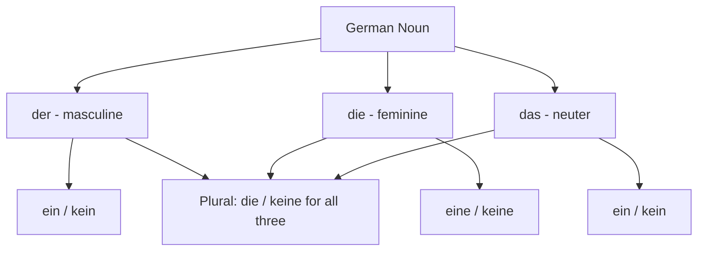

## 2.4 Gender Rules (helpful patterns)

Gender is largely arbitrary, but these patterns cover a large share of nouns.

### Usually MASCULINE (der)

| Rule | Examples |
|---|---|
| Male people and animals | der Vater, der Sohn, der Lehrer, der Hund |
| Days, months, seasons | der Montag, der Januar, der Sommer |
| Weather: points of compass, wind | der Regen, der Schnee, der Wind, der Norden |
| Ending **-er** (agent nouns) | der Computer, der Fahrer, der Kellner |
| Ending **-ling** | der Frühling, der Schmetterling |
| Ending **-ismus** | der Kapitalismus, der Tourismus |
| Ending **-or** | der Motor, der Professor |
| Most alcoholic drinks | der Wein, der Whisky *(exception: das Bier)* |
| Car makes | der BMW, der Mercedes |

### Usually FEMININE (die)

| Rule | Examples |
|---|---|
| Female people and animals | die Mutter, die Tochter, die Lehrerin, die Katze |
| Ending **-ung** | die Wohnung, die Zeitung, die Rechnung |
| Ending **-heit / -keit** | die Freiheit, die Möglichkeit |
| Ending **-schaft** | die Freundschaft, die Wissenschaft |
| Ending **-ion / -tion** | die Nation, die Information |
| Ending **-tät** | die Universität, die Qualität |
| Ending **-ie** | die Biologie, die Familie |
| Ending **-ik** | die Musik, die Politik |
| Ending **-e** (most) | die Lampe, die Blume, die Schule |
| Ending **-in** (female form) | die Studentin, die Ärztin |
| Numbers used as nouns | die Eins, die Zwei |
| Most trees and flowers | die Rose, die Tanne |

### Usually NEUTER (das)

| Rule | Examples |
|---|---|
| Ending **-chen / -lein** (diminutives) | das Mädchen, das Brötchen, das Fräulein |
| Ending **-um** | das Museum, das Zentrum, das Datum |
| Ending **-ment** | das Dokument, das Experiment |
| Ending **-ma** | das Thema, das Klima |
| Verbs used as nouns | das Essen (eating/food), das Lernen |
| Most metals and elements | das Gold, das Silber, das Wasser |
| Letters, colours, languages as nouns | das A, das Rot, das Deutsch |
| Ending **-nis** (many) | das Ergebnis, das Verhältnis |
| Young people and animals | das Kind, das Baby, das Kalb |

> **Important:** *das Mädchen* (the girl) is **neuter**, not feminine, because the ending **-chen** always wins. Grammatical gender is not biological gender.

## 2.5 Compound Nouns

German famously builds long compound nouns. **The gender always comes from the LAST word.**

- die Hand + der Schuh = **der** Handschuh (glove)
- der Haus + die Aufgabe = **die** Hausaufgabe (homework)
- die Sonne + die Brille = **die** Sonnenbrille (sunglasses)
- das Auto + die Bahn = **die** Autobahn (motorway)

---

# 3. Plural Forms (der Plural)

German has **no single plural rule** — there are five main patterns. The plural article is always **die**.

| Pattern | Ending | Typical for | Examples |
|---|---|---|---|
| **1** | **-e** (sometimes + umlaut) | Many masculine nouns | der Tisch → die Tisch**e**; der Stuhl → die St**ü**hl**e** |
| **2** | **-en / -n** | Most feminine nouns | die Frau → die Frau**en**; die Lampe → die Lampe**n** |
| **3** | **-er** (+ umlaut where possible) | Many neuter and some masculine | das Kind → die Kind**er**; das Buch → die B**ü**ch**er** |
| **4** | **-s** | Foreign words, abbreviations | das Auto → die Auto**s**; das Hotel → die Hotel**s** |
| **5** | **no change** (sometimes + umlaut) | Nouns ending in -er, -el, -en | der Lehrer → die Lehrer; der Apfel → die **Ä**pfel |

**Common and irregular plurals to memorise:**

| Singular | Plural | Meaning |
|---|---|---|
| der Mann | die Männer | man / men |
| die Frau | die Frauen | woman / women |
| das Kind | die Kinder | child / children |
| der Freund | die Freunde | friend(s) |
| die Stadt | die Städte | city / cities |
| das Land | die Länder | country / countries |
| das Haus | die Häuser | house(s) |
| der Baum | die Bäume | tree(s) |
| die Mutter | die Mütter | mother(s) |
| der Vater | die Väter | father(s) |
| die Tochter | die Töchter | daughter(s) |
| der Bruder | die Brüder | brother(s) |
| die Schwester | die Schwestern | sister(s) |
| der Student | die Studenten | student(s) |

> **Practical advice:** always learn a noun as a triple — **article + noun + plural**: *das Buch, die Bücher*.

**Note:** in the **dative plural**, an **-n** is added if the plural does not already end in -n or -s: *mit den Kinder**n***, *mit den Freunde**n***.

---

# 4. Pronouns and the Nominative Case

## 4.1 Personal Pronouns — Nominative (the subject)

| German | English | Notes |
|---|---|---|
| **ich** | I | never capitalised mid-sentence |
| **du** | you (singular, informal) | friends, family, students, children |
| **er** | he / it (masculine noun) | |
| **sie** | she / it (feminine noun) | |
| **es** | it (neuter noun) | |
| **wir** | we | |
| **ihr** | you (plural, informal) | a group of friends |
| **sie** | they | |
| **Sie** | you (formal, singular or plural) | **always capitalised** |

> **The three "sie" forms** are distinguished by capitalisation and by the verb ending:
> - *sie ist* = she is
> - *sie sind* = they are
> - *Sie sind* = you (formal) are

## 4.2 The Nominative Case (der Nominativ)

German has four cases. The **nominative** is the **subject** of the sentence — the person or thing performing the action. It is also the form used after the verbs **sein** (to be), **werden** (to become) and **bleiben** (to remain).

**Question words for the nominative:** **Wer?** (who?) for people, **Was?** (what?) for things.

| | Masculine | Feminine | Neuter | Plural |
|---|---|---|---|---|
| **Definite** | **der** | **die** | **das** | **die** |
| **Indefinite** | **ein** | **eine** | **ein** | — |
| **Negative** | **kein** | **keine** | **kein** | **keine** |

**Examples:**
- **Der Mann** liest ein Buch. → *Wer liest?* → **Der Mann.** (subject)
- **Die Lampe** ist neu. (The lamp is new.)
- **Das ist ein Auto.** (That is a car — *ein Auto* is nominative after *sein*.)
- **Meine Schwester** heißt Anna.

## 4.3 Formal and Informal Address (Sie vs du)

This is a genuinely important social rule in German.

| | **du / ihr** (informal) | **Sie** (formal) |
|---|---|---|
| Used with | Family, friends, children, fellow students, God, animals | Strangers, older people, colleagues, officials, customers, teachers |
| Verb form | 2nd person | 3rd person plural form |
| Greeting | Hallo, Hi, Tschüss | Guten Tag, Auf Wiedersehen |
| Question | *Wie heißt **du**?* | *Wie heißen **Sie**?* |
| Question | *Wo wohnst **du**?* | *Wo wohnen **Sie**?* |
| Question | *Wie geht es **dir**?* | *Wie geht es **Ihnen**?* |

**Rules of thumb:**
- **Always start with Sie** when addressing an adult stranger. Switching to *du* uninvited can be rude.
- The older person or the person of higher rank offers the *du*: *"Wollen wir uns duzen?"*
- University students use *du* with each other regardless of acquaintance.

## 4.4 Formal Salutations (Formelle Anrede)

| German | Use |
|---|---|
| **Guten Morgen** | Good morning (until about 10–11 a.m.) |
| **Guten Tag** | Good day (the standard daytime greeting) |
| **Guten Abend** | Good evening (from about 6 p.m.) |
| **Gute Nacht** | Good night (only when going to bed) |
| **Auf Wiedersehen** | Goodbye (formal, in person) |
| **Auf Wiederhören** | Goodbye (formal, on the telephone) |
| **Herr Schmidt** | Mr Schmidt |
| **Frau Müller** | Mrs / Ms Müller (used for all adult women) |
| **Sehr geehrte Damen und Herren,** | Dear Sir or Madam, (formal letter opening) |
| **Sehr geehrter Herr Schmidt,** | Dear Mr Schmidt, |
| **Sehr geehrte Frau Müller,** | Dear Ms Müller, |
| **Mit freundlichen Grüßen** | Yours sincerely (formal letter closing) |

**Informal greetings:** Hallo, Hi, Servus / Grüß Gott (southern Germany and Austria), Moin (northern Germany), Tschüss, Ciao, Bis bald (see you soon), Bis später (see you later), Liebe Grüße (informal letter closing).

> **Note:** *Fräulein* (Miss) is obsolete and considered impolite. Use **Frau** for every adult woman.

---

# 5. Conjugation of Regular Verbs

## 5.1 The Basic Pattern

German verbs end in **-en** in the infinitive (*wohnen*, *lernen*, *spielen*). To conjugate, remove **-en** to get the **stem**, then add the personal ending.

**Example: wohnen (to live) → stem: wohn-**

| Pronoun | Ending | Form | Meaning |
|---|---|---|---|
| ich | **-e** | wohn**e** | I live |
| du | **-st** | wohn**st** | you live |
| er / sie / es | **-t** | wohn**t** | he/she/it lives |
| wir | **-en** | wohn**en** | we live |
| ihr | **-t** | wohn**t** | you (pl.) live |
| sie / Sie | **-en** | wohn**en** | they / you (formal) live |

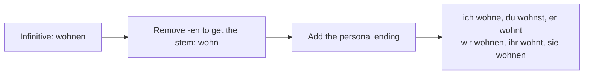

**Common regular verbs:** wohnen (live), lernen (learn), spielen (play), machen (do/make), kaufen (buy), sagen (say), fragen (ask), hören (hear), brauchen (need), suchen (search), kochen (cook), lachen (laugh), tanzen (dance), leben (live), glauben (believe), holen (fetch), zeigen (show), danken (thank).

## 5.2 Spelling Variations

**A. Stem ending in -d, -t, -m, -n** → insert an **-e-** before the ending for pronunciation.

**arbeiten (to work) → stem: arbeit-**

| ich arbeite | wir arbeiten |
|---|---|
| du arbeit**e**st | ihr arbeit**e**t |
| er arbeit**e**t | sie arbeiten |

Same pattern: finden (find), warten (wait), reden (talk), öffnen (open), rechnen (calculate), atmen (breathe), antworten (answer), baden (bathe), kosten (cost), mieten (rent).

**B. Stem ending in -s, -ß, -z, -x** → the **du** form takes only **-t** (the s of -st merges).

**heißen (to be called):** ich heiße, **du heißt**, er heißt, wir heißen, ihr heißt, sie heißen
Same: reisen (travel) → du reist; tanzen → du tanzt; sitzen → du sitzt.

**C. Verbs ending in -eln / -ern** — drop the **e** in the ich form.
**sammeln:** ich samm**le**, du sammelst... | **ändern:** ich änd**re**, du änderst...

## 5.3 The Two Essential Irregular Verbs

**sein (to be)** — completely irregular, must be memorised.

| Pronoun | Form | Meaning |
|---|---|---|
| ich | **bin** | I am |
| du | **bist** | you are |
| er/sie/es | **ist** | he/she/it is |
| wir | **sind** | we are |
| ihr | **seid** | you (pl.) are |
| sie/Sie | **sind** | they / you (formal) are |

**haben (to have)** — irregular only in du and er/sie/es.

| Pronoun | Form | Meaning |
|---|---|---|
| ich | **habe** | I have |
| du | **hast** | you have |
| er/sie/es | **hat** | he/she/it has |
| wir | **haben** | we have |
| ihr | **habt** | you (pl.) have |
| sie/Sie | **haben** | they / you have |

**werden (to become)** — also very common:
ich **werde**, du **wirst**, er **wird**, wir **werden**, ihr **werdet**, sie **werden**

---

# 6. Irregular (Stem-Changing) Verbs

Some verbs change their **stem vowel** in the **du** and **er/sie/es** forms only. The endings stay regular, and *wir, ihr, sie/Sie* are unaffected.

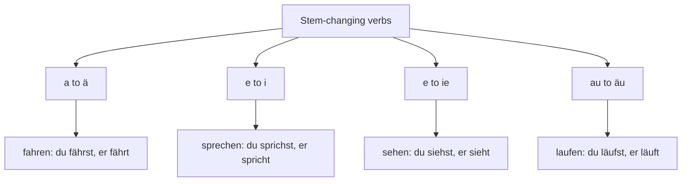

## 6.1 a → ä

**fahren (to drive/go):** ich fahre, **du fährst**, **er fährt**, wir fahren, ihr fahrt, sie fahren

Same pattern: schlafen (sleep) → du schläfst; tragen (carry/wear) → du trägst; fallen (fall) → du fällst; halten (hold/stop) → du hältst; waschen (wash) → du wäschst; einladen (invite) → du lädst ein; gefallen (please) → es gefällt.

## 6.2 e → i

**sprechen (to speak):** ich spreche, **du sprichst**, **er spricht**, wir sprechen, ihr sprecht, sie sprechen

Same pattern: helfen (help) → du hilfst; treffen (meet) → du triffst; essen (eat) → du isst; geben (give) → du gibst; nehmen (take) → **du nimmst, er nimmt** (double irregular); vergessen (forget) → du vergisst; werfen (throw) → du wirfst; brechen (break) → du brichst.

## 6.3 e → ie

**sehen (to see):** ich sehe, **du siehst**, **er sieht**, wir sehen, ihr seht, sie sehen

Same pattern: lesen (read) → **du liest**, er liest; empfehlen (recommend) → du empfiehlst; stehlen (steal) → du stiehlst.

## 6.4 au → äu

**laufen (to run/walk):** ich laufe, **du läufst**, **er läuft**, wir laufen, ihr lauft, sie laufen
Same: saufen, and **kaufen is NOT** in this group (it is regular).

## 6.5 Summary table of key irregular verbs

| Infinitive | Meaning | du | er/sie/es |
|---|---|---|---|
| fahren | to drive | fährst | fährt |
| schlafen | to sleep | schläfst | schläft |
| tragen | to wear/carry | trägst | trägt |
| sprechen | to speak | sprichst | spricht |
| essen | to eat | isst | isst |
| geben | to give | gibst | gibt |
| nehmen | to take | nimmst | nimmt |
| helfen | to help | hilfst | hilft |
| treffen | to meet | triffst | trifft |
| sehen | to see | siehst | sieht |
| lesen | to read | liest | liest |
| laufen | to run | läufst | läuft |
| wissen | to know (facts) | weißt | weiß |

**wissen** is fully irregular in the singular: ich **weiß**, du **weißt**, er **weiß**, wir wissen, ihr wisst, sie wissen.

---

# 7. Separable and Inseparable Verbs

## 7.1 Separable Verbs (trennbare Verben)

A **separable verb** consists of a **prefix + a base verb**. In a main clause in the present tense, the **prefix separates and goes to the very end of the sentence**.

**aufstehen** (to get up) = **auf** + **stehen**

- *Ich **stehe** um 7 Uhr **auf**.* (I get up at 7 o'clock.)
- *Wann **stehst** du **auf**?* (When do you get up?)

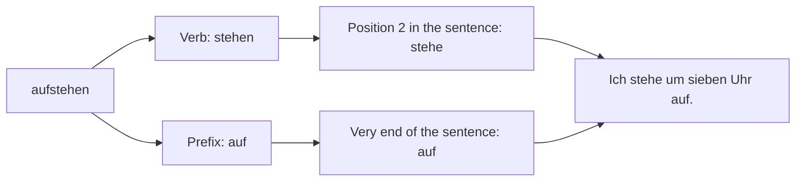

**Common separable prefixes:** **an-, auf-, aus-, ab-, ein-, mit-, nach-, vor-, zu-, zurück-, weg-, hin-, her-, fern-, statt-, teil-, zusammen-**

| Verb | Meaning | Example |
|---|---|---|
| **auf**stehen | to get up | Ich stehe früh **auf**. |
| **an**rufen | to phone | Ich rufe dich morgen **an**. |
| **ein**kaufen | to shop | Wir kaufen im Supermarkt **ein**. |
| **an**fangen | to begin | Der Film fängt um 8 Uhr **an**. |
| **auf**räumen | to tidy up | Räum dein Zimmer **auf**! |
| **ab**holen | to pick up | Ich hole dich vom Bahnhof **ab**. |
| **mit**kommen | to come along | Kommst du **mit**? |
| **fern**sehen | to watch TV | Abends sehe ich **fern**. |
| **ein**laden | to invite | Ich lade dich zur Party **ein**. |
| **aus**gehen | to go out | Wir gehen heute Abend **aus**. |
| **an**kommen | to arrive | Der Zug kommt um 9 Uhr **an**. |
| **zu**machen | to close | Machen Sie bitte die Tür **zu**. |
| **auf**machen | to open | Mach das Fenster **auf**! |
| **vor**bereiten | to prepare | Ich bereite das Essen **vor**. |
| **teil**nehmen | to participate | Er nimmt am Kurs **teil**. |

**Important:** in the **infinitive** (after a modal verb) and in a **subordinate clause**, the verb stays **together**:
- *Ich muss früh **aufstehen**.* (I must get up early.)
- *Ich weiß, dass er um 7 Uhr **aufsteht**.* (I know that he gets up at 7.)

## 7.2 Inseparable Verbs (untrennbare Verben)

These prefixes **never separate**, and they are **never stressed**.

**The inseparable prefixes:** **be-, emp-, ent-, er-, ge-, miss-, ver-, zer-**

A useful memory aid: **"Be-Ge-Er-Ver-Zer-Ent-Emp-Miss"**

| Verb | Meaning | Example |
|---|---|---|
| **be**suchen | to visit | Ich **besuche** meine Oma. |
| **be**zahlen | to pay | Er **bezahlt** die Rechnung. |
| **ver**stehen | to understand | Ich **verstehe** das nicht. |
| **ver**gessen | to forget | Sie **vergisst** immer alles. |
| **er**zählen | to tell | Er **erzählt** eine Geschichte. |
| **er**klären | to explain | Der Lehrer **erklärt** die Regel. |
| **ent**schuldigen | to excuse | **Entschuldigen** Sie bitte! |
| **emp**fehlen | to recommend | Ich **empfehle** dieses Restaurant. |
| **ge**hören | to belong to | Das Buch **gehört** mir. |
| **ge**fallen | to please | Das Bild **gefällt** mir. |
| **zer**stören | to destroy | Der Sturm **zerstört** das Haus. |
| **miss**verstehen | to misunderstand | Du **missverstehst** mich. |
| **be**kommen | to receive | Ich **bekomme** ein Geschenk. |

## 7.3 The Stress Test

| | Separable | Inseparable |
|---|---|---|
| Stress | On the **prefix**: **ÁN**rufen | On the **verb**: be**SÚ**chen |
| Present tense | Prefix moves to the end | Stays together |
| Perfect participle | **auf**ge**standen** (ge- goes in the middle) | **besucht** (no ge- at all) |

---

# 8. Modal Verbs (Modalverben)

**Modal verbs** express ability, permission, obligation, desire or possibility. They are used with a **second verb in the infinitive**, which goes to the **end of the sentence**.

## 8.1 The Six Modal Verbs

| Verb | Meaning | Expresses |
|---|---|---|
| **können** | can, to be able to | ability, possibility |
| **müssen** | must, to have to | necessity, obligation |
| **dürfen** | may, to be allowed to | permission |
| **sollen** | should, to be supposed to | duty, advice, another's wish |
| **wollen** | to want to | strong intention |
| **mögen** | to like | liking |
| **möchten** | would like to | polite wish (subjunctive of mögen) |

## 8.2 Conjugation

Modal verbs are irregular: **no ending in the ich and er/sie/es forms**, and the vowel changes in the singular.

| | können | müssen | dürfen | sollen | wollen | mögen | möchten |
|---|---|---|---|---|---|---|---|
| ich | **kann** | **muss** | **darf** | **soll** | **will** | **mag** | **möchte** |
| du | kannst | musst | darfst | sollst | willst | magst | möchtest |
| er/sie/es | **kann** | **muss** | **darf** | **soll** | **will** | **mag** | **möchte** |
| wir | können | müssen | dürfen | sollen | wollen | mögen | möchten |
| ihr | könnt | müsst | dürft | sollt | wollt | mögt | möchtet |
| sie/Sie | können | müssen | dürfen | sollen | wollen | mögen | möchten |

> **Key point:** *ich* and *er/sie/es* are **identical**, and neither takes an ending. *sollen* is the only one that does not change its vowel.

## 8.3 Sentence Structure with Modal Verbs

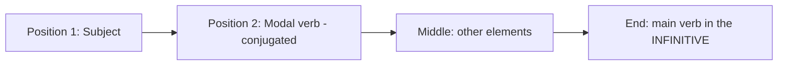

**Examples:**
- Ich **kann** gut Deutsch **sprechen**. (I can speak German well.)
- Du **musst** heute die Hausaufgaben **machen**. (You must do the homework today.)
- **Darf** ich hier **rauchen**? (May I smoke here?)
- Wir **wollen** nach Berlin **fahren**. (We want to go to Berlin.)
- Sie **soll** mehr **lernen**. (She should study more.)
- Ich **möchte** einen Kaffee **trinken**. (I would like to drink a coffee.)

**The infinitive can be dropped** when it is obvious, especially with movement and with *möchten*:
- *Ich muss nach Hause (gehen).* — I must go home.
- *Ich möchte einen Kaffee.* — I'd like a coffee.

## 8.4 Meaning Distinctions

| Pair | Difference |
|---|---|
| **wollen** vs **möchten** | *wollen* = want (direct, can sound demanding); *möchten* = would like (polite). In a shop or restaurant, always use **möchten**. |
| **müssen** vs **sollen** | *müssen* = an internal or absolute necessity; *sollen* = someone else expects it, or it is advice. |
| **nicht müssen** vs **nicht dürfen** | *Du musst nicht kommen* = you **don't have to** come. *Du darfst nicht kommen* = you are **not allowed** to come. **This is a common and serious error for English speakers.** |
| **können** vs **dürfen** | *können* = ability; *dürfen* = permission. In casual speech *können* is often used for permission too. |
| **mögen** vs **möchten** | *mögen* = to like something generally (*Ich mag Kaffee*); *möchten* = to want it right now (*Ich möchte einen Kaffee*). |

---

# 9. Negation (die Negation)

German has two main negation words: **nicht** and **kein**.

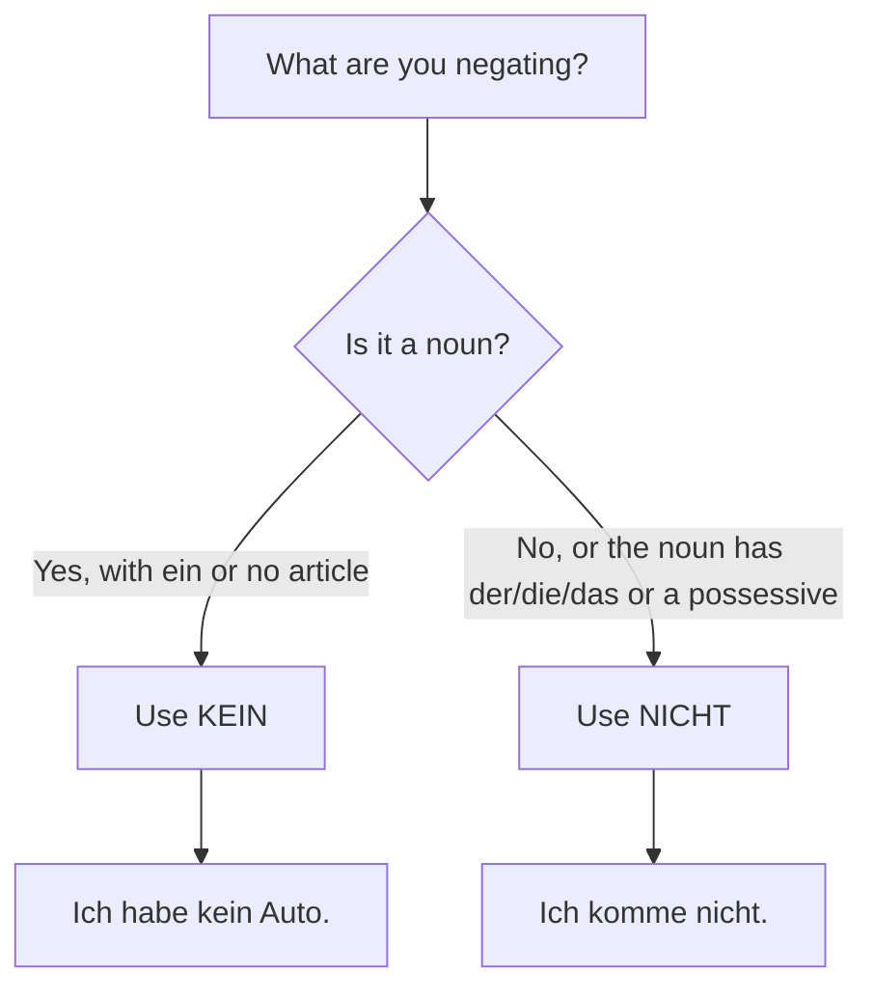

## 9.1 kein — negating a noun

Use **kein** when the noun has the indefinite article **ein/eine** or **no article at all**. It declines exactly like *ein*.

| | Masculine | Feminine | Neuter | Plural |
|---|---|---|---|---|
| **Nominative** | kein | keine | kein | keine |
| **Accusative** | kein**en** | keine | kein | keine |

- *Ich habe **ein** Auto.* → *Ich habe **kein** Auto.*
- *Das ist **eine** Lampe.* → *Das ist **keine** Lampe.*
- *Ich trinke Kaffee.* → *Ich trinke **keinen** Kaffee.*
- *Ich habe Zeit.* → *Ich habe **keine** Zeit.* (I have no time.)
- *Wir haben Kinder.* → *Wir haben **keine** Kinder.*

## 9.2 nicht — negating everything else

Use **nicht** for verbs, adjectives, adverbs, and nouns with a **definite article** or a **possessive**.

**Position rules for nicht:**

| Rule | Example |
|---|---|
| Negating the **whole sentence** → *nicht* goes at the **end** | *Ich verstehe das **nicht**.* |
| Before an **adjective** or **adverb** | *Das Buch ist **nicht** interessant.* |
| Before a **prepositional phrase** | *Ich gehe **nicht** ins Kino.* |
| Before the **second verb** (infinitive or participle) at the end | *Ich kann **nicht** kommen.* |
| Before a separable prefix | *Ich rufe dich **nicht** an.* |
| Negating a **specific element** → directly before that element | *Ich fahre **nicht** heute, sondern morgen.* |
| With definite article / possessive | *Ich kenne **den Mann nicht**.* / *Das ist **nicht** mein Auto.* |

## 9.3 Other negation words

| Word | Meaning | Example |
|---|---|---|
| **nein** | no (answering a question) | *Nein, danke.* |
| **nichts** | nothing | *Ich verstehe **nichts**.* |
| **niemand** | nobody | ***Niemand** ist hier.* |
| **nie / niemals** | never | *Ich rauche **nie**.* |
| **nirgendwo / nirgends** | nowhere | *Ich finde es **nirgends**.* |
| **noch nicht** | not yet | *Ich bin **noch nicht** fertig.* |
| **nicht mehr** | no longer, not any more | *Ich wohne **nicht mehr** hier.* |
| **kein ... mehr** | no more (with a noun) | *Ich habe **kein** Geld **mehr**.* |
| **doch** | yes (contradicting a negative question) | *Kommst du nicht? — **Doch**, ich komme!* |

> **doch** is a very German feature: it is the "yes" used to contradict a negative question or statement. English has no direct equivalent.

---

# 10. How to Form Questions (Fragen)

German has two question types.

## 10.1 W-Questions (W-Fragen) — open questions

Structure: **Question word — Verb — Subject — Rest?**

| Word | Meaning | Example |
|---|---|---|
| **Wer?** | Who? (nominative) | **Wer** ist das? |
| **Was?** | What? | **Was** machst du? |
| **Wo?** | Where? (location) | **Wo** wohnst du? |
| **Wohin?** | Where to? | **Wohin** gehst du? |
| **Woher?** | Where from? | **Woher** kommst du? |
| **Wann?** | When? | **Wann** kommst du? |
| **Wie?** | How? | **Wie** geht es dir? |
| **Warum? / Wieso? / Weshalb?** | Why? | **Warum** lernst du Deutsch? |
| **Wie viel?** | How much? | **Wie viel** kostet das? |
| **Wie viele?** | How many? | **Wie viele** Geschwister hast du? |
| **Wie alt?** | How old? | **Wie alt** bist du? |
| **Wie lange?** | How long? | **Wie lange** bleibst du? |
| **Wie oft?** | How often? | **Wie oft** gehst du ins Kino? |
| **Welcher/Welche/Welches?** | Which? | **Welches** Buch liest du? |
| **Wen?** | Whom? (accusative) | **Wen** siehst du? |
| **Wem?** | To whom? (dative) | **Wem** hilfst du? |
| **Wessen?** | Whose? (genitive) | **Wessen** Auto ist das? |
| **Was für ein...?** | What kind of? | **Was für ein** Auto hast du? |

## 10.2 Yes/No Questions (Ja/Nein-Fragen)

Structure: **Verb — Subject — Rest?** The verb moves to **first position**.

- *Du wohnst in Mumbai.* → ***Wohnst** du in Mumbai?*
- *Er ist Student.* → ***Ist** er Student?*
- *Sie haben Zeit.* → ***Haben** Sie Zeit?*
- *Kannst du mir helfen?*

**Answering:**
- **Ja** — yes.
- **Nein** — no.
- **Doch** — yes (contradicting a negative question): *Kommst du nicht mit? — **Doch**, ich komme mit!*

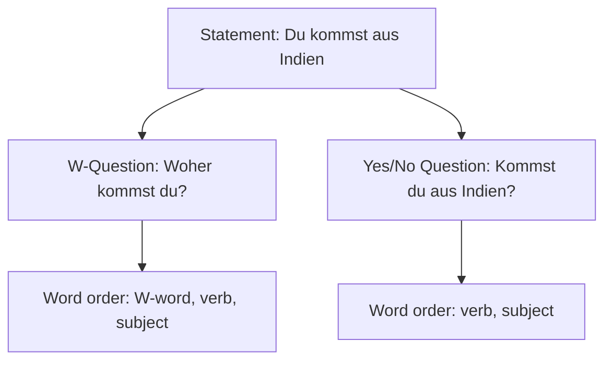

---

# 11. Word Order of Main Clauses (Hauptsätze)

## 11.1 The Golden Rule: the verb is ALWAYS in second position

In a German main clause, the **conjugated verb occupies position 2** — not necessarily the second *word*, but the second *element*.

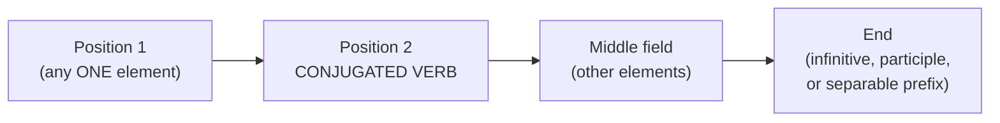

| Position 1 | Verb (2) | Middle | End |
|---|---|---|---|
| Ich | **fahre** | morgen nach Berlin. | |
| Morgen | **fahre** | ich nach Berlin. | |
| Nach Berlin | **fahre** | ich morgen. | |
| Ich | **muss** | morgen nach Berlin | **fahren**. |
| Morgen | **stehe** | ich früh | **auf**. |

**Note that when something other than the subject occupies position 1, the subject moves to position 3 — directly after the verb.** This is called **inversion**, and it is one of the most common mistakes for learners.

## 11.2 The Middle Field — the TeKaMoLo rule

When several elements sit in the middle, the standard order is:

| **Te** | **Ka** | **Mo** | **Lo** |
|---|---|---|---|
| **Temporal** | **Kausal** | **Modal** | **Lokal** |
| When? | Why? | How? | Where? |
| *heute* | *wegen des Wetters* | *mit dem Auto* | *nach Berlin* |

*Ich fahre **heute** **wegen der Arbeit** **mit dem Auto** **nach Berlin**.*

**Also useful:**
- **Dative before accusative** when both are nouns: *Ich gebe **dem Kind** **das Buch**.*
- **Pronouns come first**, and **accusative pronoun before dative**: *Ich gebe **es ihm**.*
- Time expressions generally precede place expressions.

## 11.3 The Verb Bracket (Satzklammer)

A defining feature of German: the conjugated verb sits at position 2 and the rest of the verb complex sits at the very end, **bracketing** the sentence content.

- *Ich **habe** gestern mit meinem Freund im Restaurant **gegessen**.*
- *Wir **wollen** nächstes Jahr nach Deutschland **fahren**.*
- *Er **ruft** seine Mutter jeden Sonntag **an**.*

This is why you often cannot know what a long German sentence means until you reach the end.

---

# 12. Conjunctions (Konjunktionen)

Conjunctions join words, phrases and clauses. They fall into two groups distinguished by their effect on word order.

## 12.1 Coordinating Conjunctions — position 0, NO change to word order

These join two main clauses and do **not** count as a position, so the verb stays in second position of its own clause.

**The seven to remember: aber, denn, oder, sondern, und, sowie, doch**

| Conjunction | Meaning | Example |
|---|---|---|
| **und** | and | Ich lerne Deutsch **und** ich arbeite. |
| **oder** | or | Trinkst du Tee **oder** trinkst du Kaffee? |
| **aber** | but | Ich möchte kommen, **aber** ich habe keine Zeit. |
| **denn** | because (giving a reason) | Ich bleibe zu Hause, **denn** ich bin krank. |
| **sondern** | but rather (after a negative) | Er ist nicht Arzt, **sondern** Lehrer. |
| **doch** | but, yet | Es ist kalt, **doch** die Sonne scheint. |

> **aber vs sondern:** use **sondern** only to correct a preceding **negative** statement: *Das ist nicht Tee, **sondern** Kaffee.*

## 12.2 Subordinating Conjunctions — verb goes to the END

These introduce a **subordinate clause (Nebensatz)** in which the conjugated verb is pushed to the **final position**.

| Conjunction | Meaning | Example |
|---|---|---|
| **weil** | because | Ich bleibe zu Hause, **weil** ich krank **bin**. |
| **dass** | that | Ich weiß, **dass** er in Berlin **wohnt**. |
| **wenn** | if / when (repeated) | **Wenn** ich Zeit **habe**, komme ich. |
| **als** | when (single past event) | **Als** ich klein **war**, wohnte ich in Delhi. |
| **ob** | whether / if | Ich weiß nicht, **ob** er **kommt**. |
| **obwohl** | although | Ich gehe raus, **obwohl** es **regnet**. |
| **damit** | so that | Ich lerne, **damit** ich die Prüfung **bestehe**. |
| **bevor** | before | **Bevor** ich **esse**, wasche ich die Hände. |
| **nachdem** | after | **Nachdem** ich gegessen **hatte**, ging ich. |
| **während** | while | **Während** er **arbeitet**, höre ich Musik. |
| **bis** | until | Ich warte, **bis** du **kommst**. |
| **seit / seitdem** | since | **Seitdem** ich hier **wohne**, bin ich glücklich. |
| **falls** | in case | **Falls** es **regnet**, bleiben wir zu Hause. |
| **solange** | as long as | **Solange** du **hier bist**, bin ich froh. |

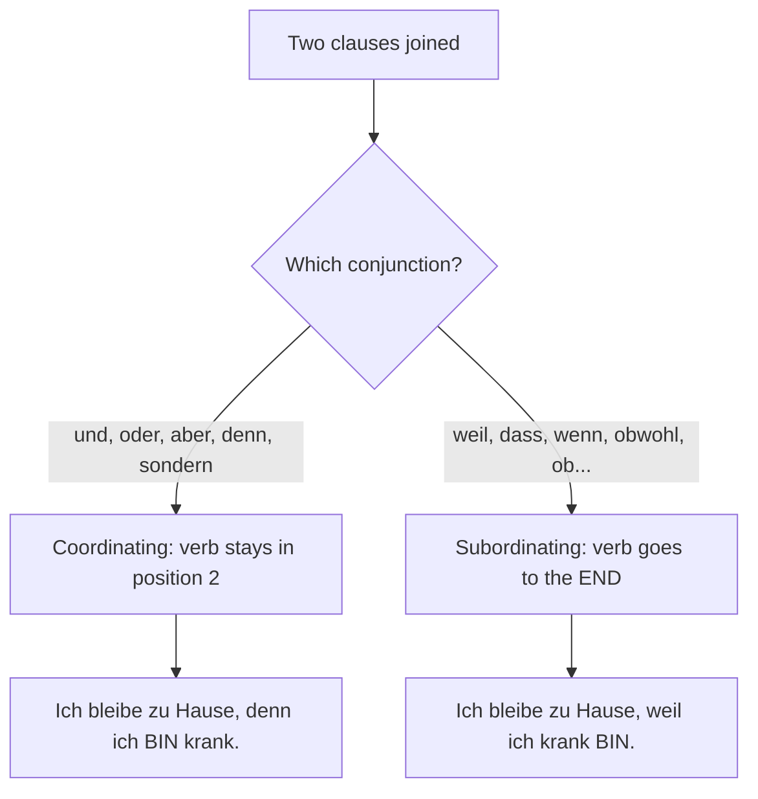

> **The classic contrast to memorise:**
> - *Ich lerne Deutsch, **denn** ich **will** in Deutschland studieren.* (verb 2nd)
> - *Ich lerne Deutsch, **weil** ich in Deutschland studieren **will**.* (verb last)

**If the subordinate clause comes first**, the whole clause counts as position 1, so the main verb comes immediately after the comma:
- ***Weil** ich krank **bin**, **bleibe** ich zu Hause.*

## 12.3 Two-part (correlative) conjunctions

| Pair | Meaning | Example |
|---|---|---|
| **sowohl ... als auch** | both ... and | Er spricht **sowohl** Deutsch **als auch** Englisch. |
| **entweder ... oder** | either ... or | **Entweder** wir gehen ins Kino **oder** wir bleiben hier. |
| **weder ... noch** | neither ... nor | Ich trinke **weder** Kaffee **noch** Tee. |
| **nicht nur ... sondern auch** | not only ... but also | Sie ist **nicht nur** klug, **sondern auch** nett. |
| **zwar ... aber** | admittedly ... but | Es ist **zwar** teuer, **aber** sehr gut. |

---

# 13. The Imperative (der Imperativ)

The imperative gives commands, instructions, requests and advice. It has **three forms**, matching *du*, *ihr* and *Sie*.

## 13.1 Formation

| Form | Rule | Example (kommen) |
|---|---|---|
| **du** | Take the du-form, drop *-st* and drop *du*. (An -e may be added, mainly in writing.) | du kommst → **Komm!** |
| **ihr** | Identical to the ihr-form, just drop *ihr*. | ihr kommt → **Kommt!** |
| **Sie** | Verb first, then *Sie* — inverted from the statement. | Sie kommen → **Kommen Sie!** |

**Examples across the three forms:**

| Verb | du | ihr | Sie |
|---|---|---|---|
| kommen | Komm! | Kommt! | Kommen Sie! |
| gehen | Geh! | Geht! | Gehen Sie! |
| warten | Warte! | Wartet! | Warten Sie! |
| sprechen (e→i) | **Sprich!** | Sprecht! | Sprechen Sie! |
| lesen (e→ie) | **Lies!** | Lest! | Lesen Sie! |
| nehmen | **Nimm!** | Nehmt! | Nehmen Sie! |
| helfen | **Hilf!** | Helft! | Helfen Sie! |
| fahren (a→ä) | **Fahr!** (no umlaut) | Fahrt! | Fahren Sie! |
| sein | **Sei!** | **Seid!** | **Seien Sie!** |
| haben | **Hab!** | Habt! | Haben Sie! |

> **Two crucial rules:**
> 1. Verbs with **e→i / e→ie** stem change **keep the change** in the du-imperative: *Sprich! Lies! Nimm! Iss! Gib! Hilf!*
> 2. Verbs with **a→ä** stem change **lose the umlaut**: fahren → **Fahr!** (not *Fähr!*), schlafen → **Schlaf!*

## 13.2 Separable verbs in the imperative
The prefix still goes to the end: *Steh **auf**!* / *Ruf mich **an**!* / *Mach die Tür **zu**!*

## 13.3 Making commands polite

| Technique | Example |
|---|---|
| Add **bitte** | *Komm **bitte** her!* / ***Bitte** warten Sie einen Moment.* |
| Add **mal** (softens) | *Komm **mal** her!* |
| Add **doch** (friendly urging) | *Setz dich **doch**!* |
| Use a question instead | *Könnten Sie mir bitte helfen?* (much more polite) |
| Use *wir*-form for suggestions | ***Gehen wir!*** (Let's go!) |

## 13.4 Common everyday imperatives

| German | English |
|---|---|
| Komm her! | Come here! |
| Warte mal! | Wait a moment! |
| Hör zu! | Listen! |
| Pass auf! | Watch out! / Pay attention! |
| Sei ruhig! | Be quiet! |
| Setzen Sie sich, bitte. | Please sit down. |
| Sprechen Sie bitte langsamer. | Please speak more slowly. |
| Entschuldigen Sie bitte! | Excuse me, please! |
| Wiederholen Sie bitte. | Please repeat. |
| Buchstabieren Sie bitte. | Please spell it. |
| Nehmen Sie Platz. | Take a seat. |
| Gehen Sie geradeaus. | Go straight ahead. |

---

# 14. The Accusative Case (der Akkusativ)

## 14.1 What it is

The **accusative** marks the **direct object** — the person or thing that directly receives the action of the verb.

**Question words:** **Wen?** (whom?) for people, **Was?** (what?) for things.

*Ich sehe **den Mann**.* → *Wen sehe ich?* → **den Mann** (direct object, accusative).

## 14.2 The article table

> **The single most important fact: only the MASCULINE changes.** Feminine, neuter and plural are identical to the nominative.

| | Masculine | Feminine | Neuter | Plural |
|---|---|---|---|---|
| **Nominative** | der / ein / kein | die / eine / keine | das / ein / kein | die / — / keine |
| **Accusative** | **den / einen / keinen** | die / eine / keine | das / ein / kein | die / — / keine |

**Examples:**
- *Ich habe **einen** Bruder.* (masculine — changes)
- *Ich habe **eine** Schwester.* (feminine — no change)
- *Ich habe **ein** Auto.* (neuter — no change)
- *Ich sehe **den** Film.* / *Ich lese **das** Buch.* / *Ich kaufe **die** Blumen.*

## 14.3 Personal pronouns in the accusative

| Nominative | Accusative | Meaning |
|---|---|---|
| ich | **mich** | me |
| du | **dich** | you |
| er | **ihn** | him / it |
| sie | **sie** | her / it |
| es | **es** | it |
| wir | **uns** | us |
| ihr | **euch** | you (pl.) |
| sie | **sie** | them |
| Sie | **Sie** | you (formal) |

- *Ich liebe **dich**.* (I love you.)
- *Er sieht **mich**.* (He sees me.)
- *Kennst du **ihn**?* (Do you know him?)
- *Wir besuchen **euch** morgen.*

## 14.4 Possessive articles in the accusative

| Owner | Possessive | Masc. Acc. | Fem./Plural | Neuter |
|---|---|---|---|---|
| ich | mein | mein**en** | meine | mein |
| du | dein | dein**en** | deine | dein |
| er/es | sein | sein**en** | seine | sein |
| sie | ihr | ihr**en** | ihre | ihr |
| wir | unser | unser**en** | unsere | unser |
| ihr | euer | eur**en** | eure | euer |
| sie/Sie | ihr / Ihr | ihr**en** / Ihr**en** | ihre / Ihre | ihr / Ihr |

*Ich rufe **meinen** Vater an.* / *Ich sehe **meine** Mutter.* / *Ich lese **mein** Buch.*

## 14.5 Prepositions that always take the accusative

**Memory aid: "DOGFU" — durch, ohne, gegen, für, um** (plus *bis* and *entlang*)

| Preposition | Meaning | Example |
|---|---|---|
| **durch** | through | Wir gehen **durch den** Park. |
| **für** | for | Das Geschenk ist **für dich**. |
| **gegen** | against, around (time) | Ich bin **gegen den** Plan. |
| **ohne** | without | Ich trinke Kaffee **ohne** Zucker. |
| **um** | around, at (clock time) | Wir sitzen **um den** Tisch. |
| **bis** | until | Ich bleibe **bis** nächsten Montag. |
| **entlang** | along | Gehen Sie **die Straße entlang**. |

## 14.6 Common verbs taking the accusative

haben, sehen, hören, kaufen, lesen, essen, trinken, brauchen, suchen, finden, machen, nehmen, besuchen, kennen, lieben, mögen, verstehen, fragen, rufen, tragen, öffnen, schließen, bezahlen.

## 14.7 Two-way prepositions (Wechselpräpositionen) — a preview

Nine prepositions take **accusative for movement/direction** and **dative for location**:

**an, auf, hinter, in, neben, über, unter, vor, zwischen**

- *Ich gehe **in die** Schule.* (Wohin? — movement → **accusative**)
- *Ich bin **in der** Schule.* (Wo? — location → **dative**)

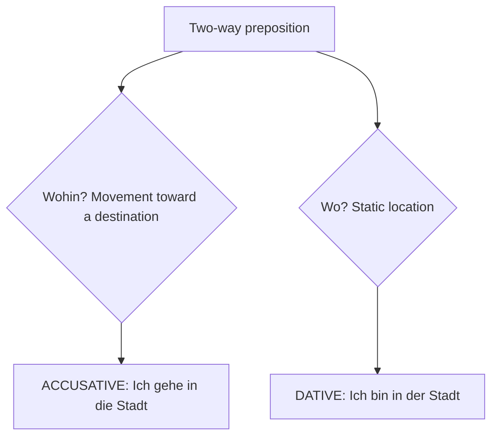

---

# 15. Numbers, Time and Date

## 15.1 Numbers (die Zahlen)

**0–20**

| # | German | # | German |
|---|---|---|---|
| 0 | null | 11 | elf |
| 1 | eins | 12 | zwölf |
| 2 | zwei | 13 | dreizehn |
| 3 | drei | 14 | vierzehn |
| 4 | vier | 15 | fünfzehn |
| 5 | fünf | 16 | **sechzehn** (no -s-) |
| 6 | sechs | 17 | **siebzehn** (no -en-) |
| 7 | sieben | 18 | achtzehn |
| 8 | acht | 19 | neunzehn |
| 9 | neun | 20 | zwanzig |
| 10 | zehn | | |

**Tens**

| # | German | # | German |
|---|---|---|---|
| 20 | zwanzig | 60 | **sechzig** |
| 30 | **dreißig** (ß, not -zig) | 70 | **siebzig** |
| 40 | vierzig | 80 | achtzig |
| 50 | fünfzig | 90 | neunzig |
| 100 | (ein)hundert | 1000 | (ein)tausend |

**Numbers 21–99 — the reversal rule**
German says the **units before the tens**, joined by **und**, written as **one word**:

- 21 = **einundzwanzig** (literally "one-and-twenty")
- 32 = zweiunddreißig
- 45 = fünfundvierzig
- 67 = siebenundsechzig
- 99 = neunundneunzig

**Larger numbers:**
- 101 = hunderteins
- 234 = zweihundertvierunddreißig
- 1,000 = tausend
- 1,500 = tausendfünfhundert
- 1,000,000 = **eine Million** | 1,000,000,000 = **eine Milliarde** (a billion)

**Years:** 1999 = *neunzehnhundertneunundneunzig*; 2026 = *zweitausendsechsundzwanzig*.

**Ordinal numbers** (1st, 2nd...): add **-te** up to 19, **-ste** from 20.
erste (1st), zweite, **dritte** (irregular), vierte, fünfte, **sechste**, **siebte** (irregular), achte, neunte, zehnte... zwanzigste (20th), einundzwanzigste (21st).

**Phone numbers** are read digit by digit, often in pairs: *0 1 7 6 – 3 4 5 6 7 8*.
- *Wie ist deine Telefonnummer?* — What is your phone number?
- *Meine Nummer ist ...*

## 15.2 Telling the Time (die Uhrzeit)

**Question:** *Wie spät ist es?* or *Wie viel Uhr ist es?*
**Answer:** *Es ist ...*

**Informal (12-hour) system:**

| Time | German |
|---|---|
| 3:00 | Es ist **drei Uhr**. |
| 3:05 | Es ist **fünf nach drei**. |
| 3:15 | Es ist **Viertel nach drei**. |
| 3:30 | Es ist **halb vier** ⚠️ |
| 3:45 | Es ist **Viertel vor vier**. |
| 3:50 | Es ist **zehn vor vier**. |
| 3:25 | Es ist **fünf vor halb vier**. |
| 3:35 | Es ist **fünf nach halb vier**. |

> ⚠️ **The half-hour trap:** German counts **toward** the next hour. **halb vier** = 3:30, NOT 4:30. Think of it as "half way to four".

**Formal (24-hour) system** — used for timetables, appointments and official announcements:
- 15:30 = *fünfzehn Uhr dreißig*
- 20:45 = *zwanzig Uhr fünfundvierzig*
- 09:05 = *neun Uhr fünf*

**Time expressions:**

| German | English |
|---|---|
| **um** acht Uhr | at eight o'clock |
| **gegen** acht | around eight |
| **von** 9 **bis** 17 Uhr | from 9 to 5 |
| **ab** 8 Uhr | from 8 onwards |
| **seit** zwei Stunden | for two hours (still ongoing) |
| morgens / vormittags | in the morning |
| mittags | at midday |
| nachmittags | in the afternoon |
| abends | in the evening |
| nachts | at night |
| heute / morgen / gestern | today / tomorrow / yesterday |
| heute Abend | this evening |
| morgen früh | tomorrow morning |
| übermorgen / vorgestern | day after tomorrow / day before yesterday |
| jetzt / gleich / später | now / right away / later |
| pünktlich | on time |

## 15.3 Days, Months, Seasons and Dates

**Days (die Wochentage)** — all masculine: **der**

Montag, Dienstag, Mittwoch, Donnerstag, Freitag, Samstag (or Sonnabend), Sonntag

- *am Montag* = on Monday | *montags* = on Mondays (habitually)
- *das Wochenende* = the weekend | *am Wochenende* = at the weekend

**Months (die Monate)** — all masculine: **der**

Januar, Februar, März, April, Mai, Juni, Juli, August, September, Oktober, November, Dezember

- *im Januar* = in January

**Seasons (die Jahreszeiten)** — all masculine: **der**

| German | English |
|---|---|
| der Frühling / das Frühjahr | spring |
| der Sommer | summer |
| der Herbst | autumn |
| der Winter | winter |

- *im Sommer* = in summer

**Dates (das Datum)**

- *Welches Datum ist heute?* / *Der Wievielte ist heute?*
- **Heute ist der 15. März.** — read as *der fünfzehnte März*.
- **Am 15. März** — read as *am fünfzehnten März*.
- Written format is **day.month.year**: 15.03.2026 (not month/day).
- *Wann hast du Geburtstag?* — *Ich habe **am** 3. Mai Geburtstag.*

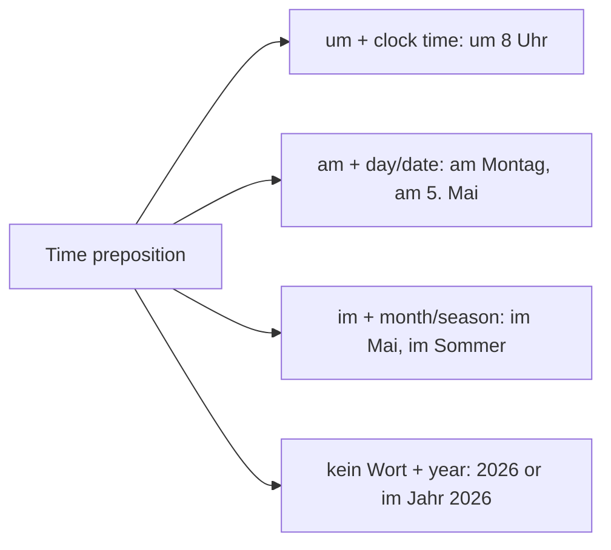

---

# 16. A1 Vocabulary Sets

## 16.1 Colours (die Farben)

| German | English | German | English |
|---|---|---|---|
| rot | red | braun | brown |
| blau | blue | grau | grey |
| gelb | yellow | rosa | pink |
| grün | green | orange | orange |
| schwarz | black | lila / violett | purple |
| weiß | white | bunt | colourful |
| hell- | light- (hellblau) | dunkel- | dark- (dunkelblau) |

## 16.2 Family (die Familie)

| German | English | German | English |
|---|---|---|---|
| die Familie | family | der Onkel | uncle |
| die Eltern | parents | die Tante | aunt |
| der Vater / Papa | father / dad | der Cousin | male cousin |
| die Mutter / Mama | mother / mum | die Cousine | female cousin |
| der Sohn | son | der Neffe | nephew |
| die Tochter | daughter | die Nichte | niece |
| der Bruder | brother | der Ehemann / Mann | husband |
| die Schwester | sister | die Ehefrau / Frau | wife |
| die Geschwister | siblings | der Freund | boyfriend / friend |
| die Großeltern | grandparents | die Freundin | girlfriend / friend |
| der Großvater / Opa | grandfather | ledig | single |
| die Großmutter / Oma | grandmother | verheiratet | married |
| das Kind | child | geschieden | divorced |
| das Enkelkind | grandchild | die Verwandten | relatives |

## 16.3 The Body (der Körper)

| German | English | German | English |
|---|---|---|---|
| der Kopf | head | die Hand, die Hände | hand(s) |
| das Haar | hair | der Finger | finger |
| das Gesicht | face | der Bauch | stomach |
| das Auge, die Augen | eye(s) | der Rücken | back |
| die Nase | nose | das Bein, die Beine | leg(s) |
| der Mund | mouth | das Knie | knee |
| das Ohr, die Ohren | ear(s) | der Fuß, die Füße | foot / feet |
| der Zahn, die Zähne | tooth / teeth | der Zeh | toe |
| der Hals | neck / throat | das Herz | heart |
| die Schulter | shoulder | die Haut | skin |
| der Arm, die Arme | arm(s) | das Blut | blood |

## 16.4 Clothing (die Kleidung)

| German | English | German | English |
|---|---|---|---|
| das Hemd | shirt | die Jacke | jacket |
| die Bluse | blouse | der Mantel | coat |
| das T-Shirt | t-shirt | der Schal | scarf |
| der Pullover / Pulli | sweater | die Mütze | cap |
| die Hose | trousers | der Hut | hat |
| die Jeans | jeans | die Handschuhe | gloves |
| der Rock | skirt | die Socken | socks |
| das Kleid | dress | die Schuhe | shoes |
| der Anzug | suit | die Stiefel | boots |
| die Krawatte | tie | die Brille | glasses |

Useful verbs: *tragen* (to wear), *anziehen* (to put on), *ausziehen* (to take off), *anprobieren* (to try on), *passen* (to fit), *stehen* (to suit).

## 16.5 At Home (zu Hause)

**Rooms (die Zimmer):** das Wohnzimmer (living room), das Schlafzimmer (bedroom), die Küche (kitchen), das Badezimmer / das Bad (bathroom), die Toilette, das Esszimmer (dining room), das Arbeitszimmer (study), der Flur (hallway), der Balkon, der Garten, der Keller (cellar), die Garage.

**Furniture (die Möbel):** der Tisch (table), der Stuhl (chair), das Sofa, der Sessel (armchair), das Bett (bed), der Schrank (cupboard), das Regal (shelf), die Lampe, der Teppich (carpet), der Spiegel (mirror), das Fenster (window), die Tür (door), die Wand (wall), der Boden (floor).

**Appliances:** der Kühlschrank (fridge), der Herd (stove), die Waschmaschine, der Fernseher (TV), die Mikrowelle, die Spülmaschine (dishwasher), die Heizung (heating).

**Housing vocabulary:** die Wohnung (flat), das Haus, das Zimmer, die Miete (rent), der Vermieter (landlord), der Mieter (tenant), die Nebenkosten (utilities), möbliert (furnished), die Quadratmeter (square metres).

## 16.6 Food and Beverages (Essen und Getränke)

**Meals:** das Frühstück (breakfast), das Mittagessen (lunch), das Abendessen (dinner), der Snack.

| Food | English | Food | English |
|---|---|---|---|
| das Brot | bread | das Fleisch | meat |
| das Brötchen | bread roll | das Hähnchen | chicken |
| die Butter | butter | das Rindfleisch | beef |
| der Käse | cheese | das Schweinefleisch | pork |
| das Ei, die Eier | egg(s) | der Fisch | fish |
| die Wurst | sausage | der Reis | rice |
| der Schinken | ham | die Nudeln | pasta |
| die Marmelade | jam | die Kartoffel | potato |
| der Zucker | sugar | das Gemüse | vegetables |
| das Salz | salt | das Obst | fruit |
| der Pfeffer | pepper | der Apfel | apple |
| das Öl | oil | die Banane | banana |
| die Suppe | soup | die Tomate | tomato |
| der Salat | salad | die Zwiebel | onion |
| der Kuchen | cake | die Karotte | carrot |

**Drinks:** das Wasser, das Mineralwasser, der Kaffee, der Tee, die Milch, der Saft (juice), der Orangensaft, das Bier, der Wein, die Cola, die Limonade.

**Useful:** *Ich habe Hunger* (I'm hungry), *Ich habe Durst* (I'm thirsty), *lecker* (tasty), *süß* (sweet), *salzig* (salty), *scharf* (spicy), *vegetarisch*, *Guten Appetit!*

## 16.7 Animals (die Tiere)

der Hund (dog), die Katze (cat), der Vogel (bird), der Fisch, das Pferd (horse), die Kuh (cow), das Schwein (pig), das Schaf (sheep), die Maus, der Elefant, der Löwe (lion), der Tiger, der Affe (monkey), der Bär (bear), die Schlange (snake), das Kaninchen (rabbit), die Ente (duck), das Huhn (chicken), der Wolf, der Fuchs (fox).

## 16.8 Professions (die Berufe)

| Male | Female | English |
|---|---|---|
| der Lehrer | die Lehrerin | teacher |
| der Arzt | die Ärztin | doctor |
| der Ingenieur | die Ingenieurin | engineer |
| der Informatiker | die Informatikerin | computer scientist |
| der Student | die Studentin | student |
| der Verkäufer | die Verkäuferin | salesperson |
| der Koch | die Köchin | cook |
| der Kellner | die Kellnerin | waiter |
| der Polizist | die Polizistin | police officer |
| der Anwalt | die Anwältin | lawyer |
| der Krankenpfleger | die Krankenschwester | nurse |
| der Fahrer | die Fahrerin | driver |
| der Bäcker | die Bäckerin | baker |
| der Architekt | die Architektin | architect |
| der Mechaniker | die Mechanikerin | mechanic |
| der Programmierer | die Programmiererin | programmer |

> **Rule:** the female form is normally made by adding **-in** (and an umlaut where applicable: Arzt → Ärztin).

**Talking about work:** *Was sind Sie von Beruf?* (What is your profession?) — *Ich bin Ingenieur.* Note: **no article** is used with professions after *sein*.
*Ich arbeite bei Siemens.* (I work at Siemens.) *Ich arbeite als Programmierer.* (I work as a programmer.)

## 16.9 Weather (das Wetter)

| German | English |
|---|---|
| Wie ist das Wetter? | What's the weather like? |
| Es ist sonnig. | It's sunny. |
| Es ist bewölkt / wolkig. | It's cloudy. |
| Es regnet. | It's raining. |
| Es schneit. | It's snowing. |
| Es ist windig. | It's windy. |
| Es ist neblig. | It's foggy. |
| Es ist warm / heiß. | It's warm / hot. |
| Es ist kalt / kühl. | It's cold / cool. |
| Es donnert und blitzt. | It's thundering and lightning. |
| Es sind 25 Grad. | It's 25 degrees. |
| die Sonne / der Regen / der Schnee | sun / rain / snow |
| das Gewitter / der Sturm | thunderstorm / storm |
| die Temperatur / die Vorhersage | temperature / forecast |

## 16.10 Leisure Activities (die Freizeit)

Fußball spielen (play football), Musik hören (listen to music), lesen (read), fernsehen (watch TV), ins Kino gehen (go to the cinema), schwimmen (swim), joggen / laufen (run), Rad fahren (cycle), reisen (travel), kochen (cook), tanzen (dance), singen, malen (paint), fotografieren, wandern (hike), Sport treiben (do sport), Freunde treffen (meet friends), spazieren gehen (go for a walk), Videospiele spielen, Gitarre spielen.

**Useful phrases:** *Was machst du gern in deiner Freizeit?* — *Ich spiele gern Fußball.* / *Mein Hobby ist Lesen.* / *Ich interessiere mich für Musik.*

> **gern** is essential: place it **after the verb** to say you like doing something. *Ich koche **gern**.* (I like cooking.) Negative: *Ich koche **nicht gern**.*

## 16.11 Emotions and Adjectives

| German | English | German | English |
|---|---|---|---|
| glücklich / froh | happy | groß / klein | big / small |
| traurig | sad | alt / jung | old / young |
| müde | tired | neu / alt | new / old |
| wütend / sauer | angry | gut / schlecht | good / bad |
| aufgeregt | excited | teuer / billig | expensive / cheap |
| nervös | nervous | schnell / langsam | fast / slow |
| langweilig | boring | einfach / schwierig | easy / difficult |
| interessant | interesting | schön / hässlich | beautiful / ugly |
| krank / gesund | ill / healthy | lang / kurz | long / short |
| hungrig / durstig | hungry / thirsty | laut / leise | loud / quiet |
| freundlich | friendly | warm / kalt | warm / cold |
| nett / sympathisch | nice / likeable | voll / leer | full / empty |
| ruhig | calm | richtig / falsch | right / wrong |
| stolz | proud | fleißig / faul | hard-working / lazy |

## 16.12 Countries and Nationalities

| Country | Nationality (m / f) | Language |
|---|---|---|
| Deutschland | Deutscher / Deutsche | Deutsch |
| Indien | Inder / Inderin | Hindi, Englisch |
| Österreich | Österreicher / Österreicherin | Deutsch |
| die Schweiz | Schweizer / Schweizerin | Deutsch, Französisch |
| England | Engländer / Engländerin | Englisch |
| Frankreich | Franzose / Französin | Französisch |
| Spanien | Spanier / Spanierin | Spanisch |
| Italien | Italiener / Italienerin | Italienisch |
| die USA | Amerikaner / Amerikanerin | Englisch |
| China | Chinese / Chinesin | Chinesisch |
| Japan | Japaner / Japanerin | Japanisch |
| Russland | Russe / Russin | Russisch |

**Key phrases:**
- *Woher kommen Sie?* — *Ich komme **aus** Indien.*
- *Wo wohnen Sie?* — *Ich wohne **in** Mumbai.*
- *Welche Sprachen sprechen Sie?* — *Ich spreche Hindi, Englisch und ein bisschen Deutsch.*
- **Note:** most countries take **no article** (*aus Indien*), but a few do: **die** Schweiz, **die** Türkei, **die** USA, **der** Iran, **die** Niederlande.

## 16.13 Means of Transport (die Verkehrsmittel)

| German | English |
|---|---|
| das Auto | car |
| der Bus | bus |
| die Bahn / der Zug | train |
| die S-Bahn | city rail |
| die U-Bahn | underground / metro |
| die Straßenbahn | tram |
| das Fahrrad / das Rad | bicycle |
| das Motorrad | motorcycle |
| das Flugzeug | aeroplane |
| das Schiff / die Fähre | ship / ferry |
| das Taxi | taxi |
| zu Fuß | on foot |

**Usage:** *Ich fahre **mit dem** Bus.* (I go by bus.) — **mit + dative**. But *Ich gehe **zu Fuß**.* and *Ich **fliege** nach Berlin.*

**Travel vocabulary:** der Bahnhof (station), der Flughafen (airport), die Haltestelle (stop), der Fahrplan (timetable), die Fahrkarte / das Ticket, der Fahrschein, einsteigen (get on), aussteigen (get off), umsteigen (change), abfahren (depart), ankommen (arrive), der Bahnsteig (platform), das Gleis (track), die Verspätung (delay), hin und zurück (return ticket), einfach (one way).

---

# 17. A1 Conversation Situations

## 17.1 How to Introduce Yourself (sich vorstellen)

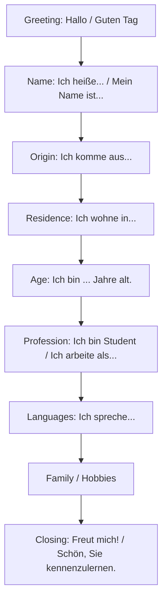

**A model self-introduction:**

> Guten Tag! Mein Name ist Meeth Sharma. Ich komme aus Indien und ich wohne in Mumbai. Ich bin 22 Jahre alt. Ich bin Student und studiere Informationstechnologie. Ich spreche Hindi, Englisch und ein bisschen Deutsch. Ich habe einen Bruder und eine Schwester. In meiner Freizeit spiele ich gern Fußball und höre Musik. Freut mich, Sie kennenzulernen!

**Key sentences:**

| German | English |
|---|---|
| Ich heiße ... / Mein Name ist ... | My name is ... |
| Ich komme aus ... | I come from ... |
| Ich wohne in ... | I live in ... |
| Ich bin ... Jahre alt. | I am ... years old. |
| Ich bin ledig / verheiratet. | I am single / married. |
| Ich bin Student / Ingenieur. | I am a student / engineer. |
| Ich studiere ... | I study ... |
| Ich arbeite bei / als ... | I work at / as ... |
| Ich spreche ... | I speak ... |
| Ich lerne Deutsch seit einem Jahr. | I have been learning German for a year. |
| Meine Hobbys sind ... | My hobbies are ... |
| Freut mich! / Sehr angenehm. | Pleased to meet you. |

## 17.2 Asking Others for Information

| Informal (du) | Formal (Sie) | English |
|---|---|---|
| Wie heißt du? | Wie heißen Sie? | What's your name? |
| Woher kommst du? | Woher kommen Sie? | Where are you from? |
| Wo wohnst du? | Wo wohnen Sie? | Where do you live? |
| Wie alt bist du? | Wie alt sind Sie? | How old are you? |
| Was machst du beruflich? | Was sind Sie von Beruf? | What do you do? |
| Welche Sprachen sprichst du? | Welche Sprachen sprechen Sie? | Which languages do you speak? |
| Hast du Geschwister? | Haben Sie Geschwister? | Do you have siblings? |
| Was sind deine Hobbys? | Was sind Ihre Hobbys? | What are your hobbies? |
| Wie ist deine Telefonnummer? | Wie ist Ihre Telefonnummer? | What's your phone number? |
| Wie geht es dir? | Wie geht es Ihnen? | How are you? |

**Answering "How are you?":**
*Danke, gut. Und dir/Ihnen?* | *Sehr gut!* | *Es geht.* (So-so) | *Nicht so gut.* | *Ganz gut, danke.*

## 17.3 Making Appointments (Termine vereinbaren)

| German | English |
|---|---|
| Hast du am Montag Zeit? | Do you have time on Monday? |
| Wann treffen wir uns? | When shall we meet? |
| Wollen wir uns um 8 Uhr treffen? | Shall we meet at 8? |
| Passt es dir am Freitag? | Does Friday suit you? |
| Ich möchte einen Termin vereinbaren. | I'd like to make an appointment. |
| Ich hätte gern einen Termin bei Dr. Müller. | I'd like an appointment with Dr Müller. |
| Geht es am Dienstag um 15 Uhr? | Is Tuesday at 3 p.m. possible? |
| Ja, das passt mir gut. | Yes, that suits me. |
| Tut mir leid, da kann ich nicht. | Sorry, I can't then. |
| Da habe ich leider keine Zeit. | Unfortunately I have no time then. |
| Können wir den Termin verschieben? | Can we postpone the appointment? |
| Ich muss den Termin absagen. | I have to cancel the appointment. |
| Bis Montag! | See you Monday! |
| Abgemacht! | Agreed! / Deal! |

## 17.4 Using Public Transport

| German | English |
|---|---|
| Entschuldigung, wo ist der Bahnhof? | Excuse me, where is the station? |
| Welcher Bus fährt zum Zentrum? | Which bus goes to the centre? |
| Wann fährt der nächste Zug nach Berlin? | When does the next train to Berlin leave? |
| Eine Fahrkarte nach München, bitte. | A ticket to Munich, please. |
| Einfach oder hin und zurück? | One way or return? |
| Was kostet eine Fahrkarte? | How much is a ticket? |
| Von welchem Gleis fährt der Zug ab? | Which platform does the train leave from? |
| Muss ich umsteigen? | Do I have to change? |
| Wo muss ich aussteigen? | Where do I have to get off? |
| Der Zug hat 10 Minuten Verspätung. | The train is 10 minutes late. |
| Ist dieser Platz frei? | Is this seat free? |
| Wie lange dauert die Fahrt? | How long does the journey take? |

## 17.5 Looking for an Apartment (Wohnungssuche)

| German | English |
|---|---|
| Ich suche eine Wohnung. | I'm looking for a flat. |
| Wie viele Zimmer hat die Wohnung? | How many rooms does it have? |
| Wie hoch ist die Miete? | How high is the rent? |
| Sind die Nebenkosten inklusive? | Are the utilities included? |
| Ist die Wohnung möbliert? | Is the flat furnished? |
| Wie groß ist die Wohnung? | How big is the flat? |
| Sie ist 60 Quadratmeter groß. | It's 60 square metres. |
| Wann kann ich die Wohnung besichtigen? | When can I view the flat? |
| Ab wann ist die Wohnung frei? | From when is the flat available? |
| Gibt es einen Balkon / einen Aufzug? | Is there a balcony / a lift? |
| Ich möchte die Wohnung mieten. | I'd like to rent the flat. |
| die Kaution | the deposit |
| der Mietvertrag | the rental contract |
| die Wohngemeinschaft (WG) | shared flat |

## 17.6 Asking For and Giving Directions

**Asking:**
- *Entschuldigung, wie komme ich zum Bahnhof?* (masculine/neuter → **zum**)
- *Wie komme ich zur Post?* (feminine → **zur**)
- *Wo ist die nächste Apotheke?*
- *Ist es weit von hier?*
- *Können Sie mir helfen?*
- *Ich habe mich verlaufen.* (I'm lost.)

**Giving directions:**

| German | English |
|---|---|
| Gehen Sie geradeaus. | Go straight ahead. |
| Gehen Sie nach links / nach rechts. | Go left / right. |
| Biegen Sie links ab. | Turn left. |
| an der Ampel | at the traffic light |
| an der Kreuzung | at the crossroads |
| die erste Straße rechts | the first street on the right |
| Gehen Sie über die Brücke. | Go over the bridge. |
| Es ist gegenüber der Bank. | It's opposite the bank. |
| Es ist neben dem Supermarkt. | It's next to the supermarket. |
| Es ist zwischen der Post und der Schule. | It's between the post office and the school. |
| Es ist etwa 10 Minuten zu Fuß. | It's about 10 minutes on foot. |
| Nehmen Sie die U-Bahn Linie 3. | Take metro line 3. |

**Places in a city:** der Bahnhof, der Flughafen, die Post, die Bank, das Krankenhaus (hospital), die Apotheke (pharmacy), der Supermarkt, das Restaurant, das Hotel, die Schule, die Universität, das Kino, das Theater, das Museum, die Kirche (church), der Park, der Markt, das Rathaus (town hall), die Bibliothek, das Geschäft / der Laden (shop), die Bäckerei, die Polizei.

**Landscapes around a city:** der Berg (mountain), der Fluss (river), der See (lake), das Meer (sea), der Wald (forest), das Feld (field), der Hügel (hill), die Insel (island), das Dorf (village), die Stadt (city), das Land (countryside).

## 17.7 Doctor's Visit (beim Arzt)

| German | English |
|---|---|
| Ich bin krank. | I am ill. |
| Ich habe Kopfschmerzen. | I have a headache. |
| Ich habe Bauchschmerzen / Halsschmerzen. | I have a stomach ache / sore throat. |
| Ich habe Fieber. | I have a fever. |
| Ich habe Husten / Schnupfen. | I have a cough / a cold. |
| Mir ist schlecht. | I feel sick. |
| Mein Bein tut weh. | My leg hurts. |
| Was fehlt Ihnen? | What's wrong with you? |
| Wo haben Sie Schmerzen? | Where does it hurt? |
| Seit wann haben Sie das? | Since when have you had this? |
| Sie müssen im Bett bleiben. | You must stay in bed. |
| Nehmen Sie diese Tabletten dreimal täglich. | Take these tablets three times a day. |
| Ich schreibe Ihnen ein Rezept. | I'll write you a prescription. |
| Gute Besserung! | Get well soon! |
| die Krankenversicherung | health insurance |
| die Praxis / das Wartezimmer | practice / waiting room |

> **Note the pattern:** *Ich habe ...schmerzen* (I have ...ache) and *Mein/e ... tut weh* (My ... hurts). Body part + *tut weh* (singular) / *tun weh* (plural).

## 17.8 Ordering Food in a Restaurant

| German | English |
|---|---|
| Einen Tisch für zwei Personen, bitte. | A table for two, please. |
| Die Speisekarte, bitte. | The menu, please. |
| Was können Sie empfehlen? | What can you recommend? |
| Ich hätte gern ... | I would like ... |
| Ich möchte ... | I would like ... |
| Ich nehme die Suppe. | I'll take the soup. |
| Als Vorspeise / Hauptgericht / Nachtisch | As a starter / main course / dessert |
| Zum Trinken hätte ich gern ein Wasser. | To drink I'd like a water. |
| Noch etwas? | Anything else? |
| Nein danke, das ist alles. | No thanks, that's all. |
| Guten Appetit! | Enjoy your meal! |
| Hat es geschmeckt? | Did you enjoy it? |
| Ja, es war sehr lecker. | Yes, it was delicious. |
| Die Rechnung, bitte. | The bill, please. |
| Zahlen, bitte! | I'd like to pay! |
| Zusammen oder getrennt? | Together or separately? |
| Stimmt so. | Keep the change. |
| Ich bin Vegetarier / Vegetarierin. | I'm a vegetarian. |
| Ich habe eine Allergie gegen Nüsse. | I'm allergic to nuts. |

> **Politeness:** always prefer *Ich hätte gern...* or *Ich möchte...* over *Ich will...*, which sounds blunt to the point of rudeness.

## 17.9 Shopping at a Supermarket / Store

| German | English |
|---|---|
| Kann ich Ihnen helfen? | Can I help you? |
| Ich suche ... | I'm looking for ... |
| Ich schaue nur, danke. | I'm just looking, thanks. |
| Wo finde ich Milch? | Where can I find milk? |
| Was kostet das? | How much does that cost? |
| Das ist zu teuer. | That's too expensive. |
| Haben Sie das in Größe M? | Do you have this in size M? |
| Kann ich das anprobieren? | Can I try this on? |
| Es passt mir nicht. | It doesn't fit me. |
| Ich nehme es. | I'll take it. |
| Zahlen Sie bar oder mit Karte? | Are you paying cash or by card? |
| Ich zahle mit Karte. | I'll pay by card. |
| Brauchen Sie eine Tüte? | Do you need a bag? |
| Haben Sie einen Kassenbon? | Do you have a receipt? |
| im Angebot / reduziert | on offer / reduced |
| Wo ist die Kasse? | Where is the checkout? |

**Where do you buy what?**

| Shop | What you buy |
|---|---|
| die Bäckerei | Brot, Brötchen, Kuchen |
| die Metzgerei / Fleischerei | Fleisch, Wurst |
| der Supermarkt | alles / everything |
| die Apotheke | Medikamente |
| die Drogerie | Shampoo, Kosmetik |
| das Kaufhaus | Kleidung, Elektronik |
| der Markt | Obst, Gemüse |
| die Buchhandlung | Bücher |

---

# LEVEL A2

> **A2 learning objective:** understand sentences and common expressions about immediate personal matters (family, shopping, work, local geography); communicate in simple routine tasks involving a direct exchange of information; describe your background, education and immediate environment in simple terms.

---

# 18. The Perfect Tense (das Perfekt)

The **Perfekt** is the standard **spoken past tense** in German. In conversation, Germans use it for almost everything that happened in the past.

## 18.1 Formation

**Perfekt = haben or sein (conjugated, position 2) + Partizip II (at the END)**

- *Ich **habe** Deutsch **gelernt**.* (I learned / have learned German.)
- *Er **ist** nach Berlin **gefahren**.* (He went to Berlin.)

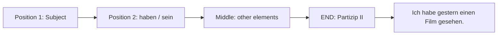

## 18.2 Forming the Partizip II (past participle)

### A. Regular (weak) verbs: **ge- + stem + -t**

| Infinitive | Partizip II | Meaning |
|---|---|---|
| machen | **ge**mach**t** | made / done |
| lernen | **ge**lern**t** | learned |
| spielen | **ge**spiel**t** | played |
| kaufen | **ge**kauf**t** | bought |
| sagen | **ge**sag**t** | said |
| arbeiten | **ge**arbeit**et** (extra -e-) | worked |
| warten | **ge**wart**et** | waited |

### B. Irregular (strong) verbs: **ge- + (often changed) stem + -en**

| Infinitive | Partizip II | Meaning |
|---|---|---|
| sehen | **ge**seh**en** | seen |
| lesen | **ge**les**en** | read |
| essen | **ge**gess**en** | eaten |
| trinken | **ge**trunk**en** | drunk |
| schreiben | **ge**schrieb**en** | written |
| sprechen | **ge**sproch**en** | spoken |
| nehmen | **ge**nomm**en** | taken |
| finden | **ge**fund**en** | found |
| gehen | **ge**gang**en** | gone |
| kommen | **ge**komm**en** | come |
| fahren | **ge**fahr**en** | driven |
| bleiben | **ge**blieb**en** | stayed |
| helfen | **ge**holf**en** | helped |
| geben | **ge**geb**en** | given |
| stehen | **ge**stand**en** | stood |
| sein | **ge**wes**en** | been |
| tun | **ge**t**an** | done |

### C. Mixed verbs: **ge- + changed stem + -t**

| Infinitive | Partizip II |
|---|---|
| bringen | **ge**brach**t** |
| denken | **ge**dach**t** |
| kennen | **ge**kann**t** |
| wissen | **ge**wuss**t** |
| nennen | **ge**nann**t** |

### D. Separable verbs: **ge- goes BETWEEN the prefix and the stem**

| Infinitive | Partizip II |
|---|---|
| aufstehen | auf**ge**standen |
| einkaufen | ein**ge**kauft |
| anrufen | an**ge**rufen |
| fernsehen | fern**ge**sehen |
| mitkommen | mit**ge**kommen |
| ankommen | an**ge**kommen |

### E. Inseparable verbs and verbs ending in **-ieren**: **NO ge- at all**

| Infinitive | Partizip II |
|---|---|
| besuchen | besucht |
| bezahlen | bezahlt |
| verstehen | verstanden |
| vergessen | vergessen |
| erzählen | erzählt |
| bekommen | bekommen |
| studieren | studiert |
| telefonieren | telefoniert |
| fotografieren | fotografiert |
| passieren | passiert |

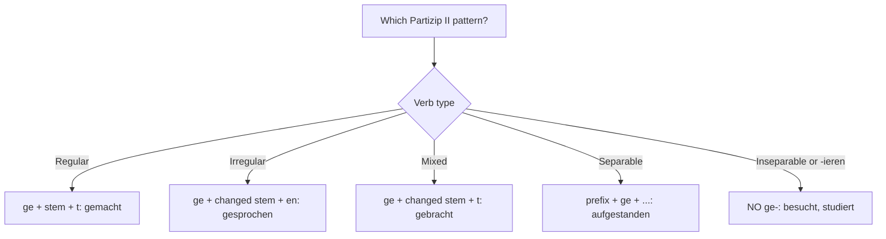

## 18.3 haben or sein? — the crucial choice

**Most verbs use haben.** Use **sein** in these three cases:

| Rule | Examples |
|---|---|
| **1. Verbs of MOVEMENT from A to B** | gehen, fahren, kommen, fliegen, laufen, reisen, schwimmen, steigen, fallen, wandern, umziehen |
| **2. Verbs of CHANGE OF STATE** | aufstehen, einschlafen, aufwachen, sterben (die), wachsen (grow), werden (become), passieren (happen) |
| **3. Three special verbs** | **sein** (gewesen), **bleiben** (geblieben), **werden** (geworden) |

**Examples:**
- *Ich **bin** nach Hause **gegangen**.* (movement)
- *Er **ist** früh **aufgestanden**.* (change of state)
- *Wir **sind** in Berlin **gewesen**.* (special)
- *Ich **habe** ein Buch **gelesen**.* (everything else)

> **Watch out:** *fahren* can take either. *Ich **bin** nach Berlin gefahren* (I travelled — no object) but *Ich **habe** das Auto gefahren* (I drove the car — has a direct object).

## 18.4 Complete example paradigm

**machen (haben)**

| | |
|---|---|
| ich **habe** gemacht | wir **haben** gemacht |
| du **hast** gemacht | ihr **habt** gemacht |
| er **hat** gemacht | sie/Sie **haben** gemacht |

**fahren (sein)**

| | |
|---|---|
| ich **bin** gefahren | wir **sind** gefahren |
| du **bist** gefahren | ihr **seid** gefahren |
| er **ist** gefahren | sie/Sie **sind** gefahren |

## 18.5 Telling about the past — sample text

> Letztes Wochenende **bin** ich nach Delhi **gefahren**. Ich **habe** meine Familie **besucht** und wir **haben** zusammen **gegessen**. Am Samstag **sind** wir ins Kino **gegangen** und **haben** einen tollen Film **gesehen**. Am Sonntag **bin** ich spät **aufgestanden**, **habe** Kaffee **getrunken** und ein Buch **gelesen**. Abends **bin** ich mit dem Zug nach Hause **gefahren**. Es **war** ein sehr schönes Wochenende.

*(Note that **sein** and the modal verbs are normally used in the simple past — *war*, *hatte*, *konnte* — even in speech.)*

---

# 19. The Simple Past (Präteritum) and Modal Verbs in the Past

## 19.1 When to use Präteritum

| Präteritum | Perfekt |
|---|---|
| **Written** narratives, news, literature, reports | **Spoken** German, conversation |
| **sein, haben** and **modal verbs** — even in speech | All other verbs in speech |
| Formal contexts | Everyday contexts |

## 19.2 sein and haben in the Präteritum

**These two are used constantly in speech and must be memorised.**

| | **sein** (war) | **haben** (hatte) |
|---|---|---|
| ich | **war** | **hatte** |
| du | warst | hattest |
| er/sie/es | **war** | **hatte** |
| wir | waren | hatten |
| ihr | wart | hattet |
| sie/Sie | waren | hatten |

- *Ich **war** gestern krank.* (I was ill yesterday.)
- *Wir **hatten** keine Zeit.* (We had no time.)

**werden:** ich **wurde**, du wurdest, er **wurde**, wir wurden, ihr wurdet, sie wurden.

## 19.3 Modal verbs in the past tense

Modal verbs are almost always used in the **Präteritum**, not the Perfekt. The rule is simple: **drop the umlaut and add the regular weak endings.**

| | können | müssen | dürfen | sollen | wollen | mögen |
|---|---|---|---|---|---|---|
| ich | **konnte** | **musste** | **durfte** | **sollte** | **wollte** | **mochte** |
| du | konntest | musstest | durftest | solltest | wolltest | mochtest |
| er/sie/es | **konnte** | **musste** | **durfte** | **sollte** | **wollte** | **mochte** |
| wir | konnten | mussten | durften | sollten | wollten | mochten |
| ihr | konntet | musstet | durftet | solltet | wolltet | mochtet |
| sie/Sie | konnten | mussten | durften | sollten | wollten | mochten |

**Examples:**
- *Ich **konnte** gestern nicht kommen.* (I couldn't come yesterday.)
- *Wir **mussten** viel arbeiten.* (We had to work a lot.)
- *Als Kind **durfte** ich nicht allein rausgehen.* (As a child I wasn't allowed to go out alone.)
- *Er **wollte** Arzt werden.* (He wanted to become a doctor.)
- *Sie **sollte** um 8 Uhr da sein.* (She was supposed to be there at 8.)

> **Note:** *mögen* → *mochte* is irregular (the g becomes ch).

## 19.4 Präteritum of other common verbs (for reading)

| Infinitive | Präteritum (ich/er) | Meaning |
|---|---|---|
| gehen | ging | went |
| kommen | kam | came |
| sehen | sah | saw |
| geben | gab | gave |
| finden | fand | found |
| sprechen | sprach | spoke |
| nehmen | nahm | took |
| fahren | fuhr | drove |
| essen | aß | ate |
| trinken | trank | drank |
| schreiben | schrieb | wrote |
| stehen | stand | stood |
| bleiben | blieb | stayed |
| denken | dachte | thought |
| bringen | brachte | brought |
| wissen | wusste | knew |
| machen (regular) | machte | did/made |

**Endings pattern:** strong verbs take **no ending** in *ich* and *er/sie/es*; weak verbs add **-te**.

## 19.5 The Plusquamperfekt (past perfect) — brief note

Used for an action that happened **before** another past action. Formed with **hatte / war + Partizip II**.

- *Nachdem ich gegessen **hatte**, **ging** ich schlafen.* (After I had eaten, I went to sleep.)
- *Er **war** schon **gegangen**, als ich ankam.* (He had already left when I arrived.)

It appears most often with the conjunction **nachdem**.

---

# 20. Verbs with Dative (Verben mit Dativ)

## 20.1 The Dative Case

The **dative** marks the **indirect object** — the person *to* or *for* whom something is done. It is also required by certain verbs and prepositions.

**Question word: Wem?** (to whom?)

*Ich gebe **dem Kind** das Buch.* → *Wem gebe ich das Buch?* → **dem Kind**.

## 20.2 Dative articles

| | Masculine | Feminine | Neuter | **Plural** |
|---|---|---|---|---|
| **Nominative** | der | die | das | die |
| **Accusative** | den | die | das | die |
| **Dative** | **dem** | **der** | **dem** | **den + -n** |

| | Masculine | Feminine | Neuter | Plural |
|---|---|---|---|---|
| **ein / kein** | ein**em** / kein**em** | ein**er** / kein**er** | ein**em** / kein**em** | — / kein**en** |
| **mein** | mein**em** | mein**er** | mein**em** | mein**en** |

> **The plural rule:** in the dative plural the article is **den** AND the noun adds **-n** if it does not already end in -n or -s.
> *mit **den** Kinder**n***, *mit **den** Freunde**n***, but *mit **den** Auto**s***.

## 20.3 Dative personal pronouns

| Nominative | Accusative | **Dative** |
|---|---|---|
| ich | mich | **mir** |
| du | dich | **dir** |
| er | ihn | **ihm** |
| sie | sie | **ihr** |
| es | es | **ihm** |
| wir | uns | **uns** |
| ihr | euch | **euch** |
| sie | sie | **ihnen** |
| Sie | Sie | **Ihnen** |

## 20.4 Verbs that take ONLY the dative

These must be memorised, because in English they take a direct object and there is no clue.

| Verb | Meaning | Example |
|---|---|---|
| **helfen** | to help | Ich helfe **dir**. |
| **danken** | to thank | Ich danke **Ihnen**. |
| **gefallen** | to please, to like | Das Buch gefällt **mir**. |
| **gehören** | to belong to | Das Auto gehört **meinem Bruder**. |
| **antworten** | to answer (a person) | Ich antworte **dem Lehrer**. |
| **glauben** | to believe (a person) | Ich glaube **dir**. |
| **folgen** | to follow | Folgen Sie **mir**! |
| **passen** | to fit / suit | Die Hose passt **mir** nicht. |
| **schmecken** | to taste good | Das Essen schmeckt **mir**. |
| **fehlen** | to be missing / to miss | Du fehlst **mir**. |
| **gratulieren** | to congratulate | Ich gratuliere **dir**! |
| **begegnen** | to meet by chance | Ich bin **ihm** begegnet. |
| **wehtun** | to hurt | Mein Kopf tut **mir** weh. |
| **zuhören** | to listen to | Hör **mir** zu! |
| **vertrauen** | to trust | Ich vertraue **dir**. |
| **raten** | to advise | Ich rate **dir**, zu gehen. |
| **verzeihen** | to forgive | Verzeih **mir**! |

> **Special sentence pattern with gefallen, schmecken, fehlen:** the German subject is the *thing*, and the person is dative.
> *Das Buch **gefällt** **mir**.* — literally "The book pleases me" = **I like the book**.
> *Die Bücher **gefallen** **mir**.* — plural subject, so plural verb.

## 20.5 Prepositions that always take the dative

**Memory aid: "aus, außer, bei, mit, nach, seit, von, zu"** (plus *gegenüber*)

| Preposition | Meaning | Example |
|---|---|---|
| **aus** | out of, from (origin) | Ich komme **aus der** Schweiz. |
| **außer** | except for | **Außer mir** war niemand da. |
| **bei** | at (a person/place), near | Ich wohne **bei meinen** Eltern. |
| **mit** | with, by (transport) | Ich fahre **mit dem** Bus. |
| **nach** | after; to (cities/countries) | **Nach der** Arbeit gehe ich nach Hause. |
| **seit** | since, for (duration) | Ich lerne Deutsch **seit einem** Jahr. |
| **von** | from, of | Das ist ein Geschenk **von meiner** Mutter. |
| **zu** | to (people/places) | Ich gehe **zum** Arzt. |
| **gegenüber** | opposite | Die Bank ist **dem Bahnhof** gegenüber. |

**Common contractions:** *bei dem = **beim***, *von dem = **vom***, *zu dem = **zum***, *zu der = **zur***.

## 20.6 Dative and accusative together

When a sentence has both objects, the standard order is:

| Rule | Example |
|---|---|
| Noun + Noun → **Dative before Accusative** | Ich gebe **dem Kind** **das Buch**. |
| Pronoun + Noun → **Pronoun first** | Ich gebe **es** **dem Kind**. |
| Pronoun + Pronoun → **Accusative before Dative** | Ich gebe **es** **ihm**. |

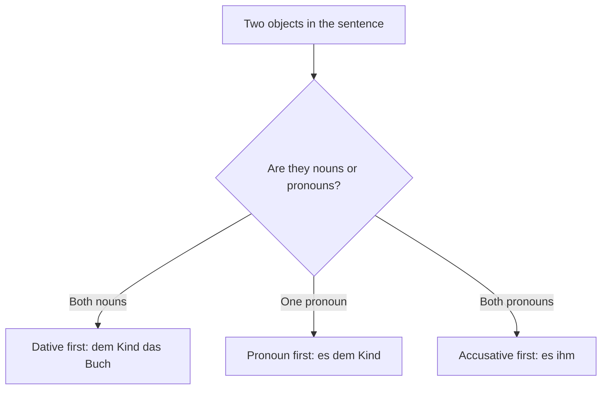

---

# 21. Verbs with Accusative (Verben mit Akkusativ)

## 21.1 The default case for objects

Most German verbs take an **accusative** direct object. The question is **Wen?** or **Was?**

**High-frequency accusative verbs:**

| Verb | Meaning | Example |
|---|---|---|
| haben | to have | Ich habe **einen** Hund. |
| sehen | to see | Ich sehe **den** Film. |
| hören | to hear | Ich höre **die** Musik. |
| kaufen | to buy | Er kauft **ein** Auto. |
| lesen | to read | Sie liest **das** Buch. |
| essen / trinken | to eat / drink | Ich esse **einen** Apfel. |
| brauchen | to need | Ich brauche **deine** Hilfe. |
| suchen / finden | to look for / find | Ich suche **meinen** Schlüssel. |
| machen | to make/do | Wir machen **die** Hausaufgaben. |
| nehmen | to take | Ich nehme **den** Bus. |
| besuchen | to visit | Ich besuche **meine** Oma. |
| kennen | to know (a person/place) | Ich kenne **ihn**. |
| lieben / mögen | to love / like | Ich liebe **dich**. |
| verstehen | to understand | Ich verstehe **die** Frage nicht. |
| bezahlen | to pay | Er bezahlt **die** Rechnung. |
| fragen | to ask (a person) | Ich frage **den** Lehrer. |
| tragen | to wear/carry | Sie trägt **ein** Kleid. |
| bekommen | to receive | Ich bekomme **ein** Geschenk. |
| treffen | to meet | Ich treffe **meinen** Freund. |
| anrufen | to call | Ich rufe **dich** an. |
| öffnen / schließen | to open / close | Öffne **das** Fenster! |

## 21.2 Verbs taking BOTH dative and accusative

These verbs take a **dative person** and an **accusative thing**.

| Verb | Meaning | Example |
|---|---|---|
| **geben** | to give | Ich gebe **dem Kind** (D) **einen Apfel** (A). |
| **zeigen** | to show | Er zeigt **mir** (D) **die Stadt** (A). |
| **schenken** | to give as a gift | Sie schenkt **ihm** (D) **ein Buch** (A). |
| **erklären** | to explain | Der Lehrer erklärt **uns** (D) **die Regel** (A). |
| **schicken / senden** | to send | Ich schicke **dir** (D) **eine E-Mail** (A). |
| **empfehlen** | to recommend | Ich empfehle **Ihnen** (D) **das Restaurant** (A). |
| **bringen** | to bring | Bring **mir** (D) **das Wasser** (A)! |
| **kaufen** | to buy (for someone) | Ich kaufe **dir** (D) **ein Eis** (A). |
| **erzählen** | to tell | Erzähl **mir** (D) **eine Geschichte** (A)! |
| **leihen** | to lend | Er leiht **mir** (D) **sein Auto** (A). |
| **antworten auf** | to answer | Ich antworte **dir** (D) **auf die Frage**. |
| **wünschen** | to wish | Ich wünsche **dir** (D) **alles Gute** (A). |

## 21.3 Full case comparison table

| | Masculine | Feminine | Neuter | Plural |
|---|---|---|---|---|
| **Nominative (Wer/Was?)** | der / ein | die / eine | das / ein | die / — |
| **Accusative (Wen/Was?)** | **den / einen** | die / eine | das / ein | die / — |
| **Dative (Wem?)** | **dem / einem** | **der / einer** | **dem / einem** | **den + n** |

**A sentence using all three:**
*Der Mann* (Nom) *gibt* *der Frau* (Dat) *den Schlüssel* (Akk).
— The man gives the woman the key.

---

# 22. Verbs with Prepositions (Verben mit Präpositionen)

Many German verbs are permanently linked to a specific preposition, and that preposition determines the case. **The combination must be learned as one unit**, because it rarely matches English.

## 22.1 Verbs + Accusative preposition

| Verb + preposition | Meaning | Example |
|---|---|---|
| **warten auf** (+A) | to wait for | Ich warte **auf den** Bus. |
| **sich freuen auf** (+A) | to look forward to | Ich freue mich **auf die** Ferien. |
| **sich freuen über** (+A) | to be happy about | Ich freue mich **über das** Geschenk. |
| **denken an** (+A) | to think of/about | Ich denke **an dich**. |
| **sich erinnern an** (+A) | to remember | Ich erinnere mich **an den** Tag. |
| **sich interessieren für** (+A) | to be interested in | Ich interessiere mich **für Musik**. |
| **sich ärgern über** (+A) | to be annoyed about | Er ärgert sich **über den** Lärm. |
| **sich kümmern um** (+A) | to take care of | Sie kümmert sich **um die** Kinder. |
| **sich bewerben um** (+A) | to apply for | Ich bewerbe mich **um die** Stelle. |
| **bitten um** (+A) | to ask for | Ich bitte **um Hilfe**. |
| **sprechen über** (+A) | to talk about | Wir sprechen **über die** Arbeit. |
| **sich vorbereiten auf** (+A) | to prepare for | Ich bereite mich **auf die** Prüfung vor. |
| **achten auf** (+A) | to pay attention to | Achte **auf den** Verkehr! |
| **glauben an** (+A) | to believe in | Ich glaube **an dich**. |

## 22.2 Verbs + Dative preposition

| Verb + preposition | Meaning | Example |
|---|---|---|
| **sprechen mit** (+D) | to speak with | Ich spreche **mit dem** Lehrer. |
| **telefonieren mit** (+D) | to phone | Ich telefoniere **mit meiner** Mutter. |
| **anfangen mit** (+D) | to begin with | Wir fangen **mit der** Arbeit an. |
| **aufhören mit** (+D) | to stop | Er hört **mit dem** Rauchen auf. |
| **helfen bei** (+D) | to help with | Ich helfe dir **bei den** Hausaufgaben. |
| **einladen zu** (+D) | to invite to | Ich lade dich **zur** Party ein. |
| **gehören zu** (+D) | to belong to | Das gehört **zu meiner** Familie. |
| **erzählen von** (+D) | to tell about | Er erzählt **von seiner** Reise. |
| **träumen von** (+D) | to dream of | Ich träume **von einem** Haus. |
| **Angst haben vor** (+D) | to be afraid of | Ich habe Angst **vor Hunden**. |
| **sich treffen mit** (+D) | to meet with | Ich treffe mich **mit Freunden**. |
| **sich beschäftigen mit** (+D) | to occupy oneself with | Er beschäftigt sich **mit Musik**. |
| **fragen nach** (+D) | to ask about | Sie fragt **nach dem** Weg. |
| **suchen nach** (+D) | to search for | Ich suche **nach meinem** Schlüssel. |
| **abhängen von** (+D) | to depend on | Das hängt **vom Wetter** ab. |

## 22.3 Question words and "da-" words

**Asking about a prepositional object:**

| Object | Question | Answer form |
|---|---|---|
| **A person** | **Preposition + wen/wem?** | *Auf **wen** wartest du?* — *Auf **meinen Freund**.* |
| **A thing** | **wo(r) + preposition** | *Wo**rauf** wartest du?* — *Auf **den Bus**.* |

**Referring back with da-words (Pronominaladverbien):**

| Preposition | da-word | Example |
|---|---|---|
| auf | **darauf** | *Ich warte **darauf**.* (I'm waiting for it.) |
| an | **daran** | *Ich denke **daran**.* |
| über | **darüber** | *Wir sprechen **darüber**.* |
| für | **dafür** | *Ich interessiere mich **dafür**.* |
| mit | **damit** | *Ich fange **damit** an.* |
| von | **davon** | *Er erzählt **davon**.* |
| vor | **davor** | *Ich habe Angst **davor**.* |
| zu | **dazu** | *Ich lade dich **dazu** ein.* |

> **Rule:** insert **-r-** when the preposition begins with a vowel: da**r**auf, da**r**an, da**r**über, da**r**um, wo**r**auf, wo**r**an, wo**r**über.
>
> **Important:** da-words are only used for **things and ideas**, never for people. For people, use the preposition plus a pronoun: *Ich warte **auf ihn***, not *darauf*.

## 22.4 Reflexive verbs (Reflexive Verben)

Many prepositional verbs are also **reflexive** — the action refers back to the subject, using a reflexive pronoun.

| Person | Accusative reflexive | Dative reflexive |
|---|---|---|
| ich | **mich** | **mir** |
| du | **dich** | **dir** |
| er/sie/es | **sich** | **sich** |
| wir | **uns** | **uns** |
| ihr | **euch** | **euch** |
| sie/Sie | **sich** | **sich** |

**Common reflexive verbs:**
- *sich freuen* (to be glad), *sich interessieren* (to be interested), *sich erinnern* (to remember), *sich ärgern* (to be annoyed), *sich setzen* (to sit down), *sich waschen* (to wash), *sich anziehen* (to get dressed), *sich fühlen* (to feel), *sich beeilen* (to hurry), *sich entschuldigen* (to apologise), *sich treffen* (to meet), *sich vorstellen* (to introduce oneself / to imagine).

*Ich wasche **mich**.* (I wash myself.) — accusative
*Ich wasche **mir** die Hände.* (I wash my hands.) — dative, because *die Hände* is the accusative object.

---

# 23. Prepositions of Time (Temporale Präpositionen)

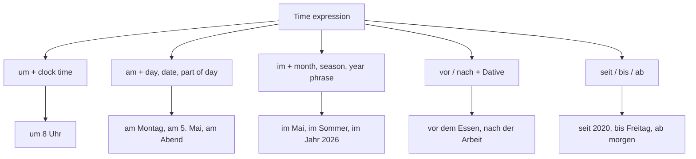

## 23.1 The main time prepositions

| Preposition | Case | Use | Example |
|---|---|---|---|
| **um** | Acc | Clock times | **um** 8 Uhr, **um** halb drei |
| **am** (an dem) | Dat | Days, dates, parts of day | **am** Montag, **am** 5. Mai, **am** Abend |
| **im** (in dem) | Dat | Months, seasons, years, centuries | **im** Juli, **im** Sommer, **im** Jahr 2026 |
| **vor** | Dat | Before; ago | **vor** dem Essen; **vor** zwei Jahren (two years ago) |
| **nach** | Dat | After | **nach** der Arbeit, **nach** dem Kurs |
| **seit** | Dat | Since / for (started in past, still going) | **seit** 2020, **seit** einem Jahr |
| **bis** | Acc | Until | **bis** morgen, **bis** Freitag |
| **von ... bis** | Dat / Acc | From ... to | **von** Montag **bis** Freitag |
| **ab** | Dat | From (a point onwards, future) | **ab** nächster Woche |
| **während** | Gen (Dat in speech) | During | **während** der Ferien |
| **in** | Dat | In (a future period) | **in** zwei Wochen |
| **zwischen** | Dat | Between | **zwischen** 8 und 10 Uhr |
| **gegen** | Acc | Around (approximate time) | **gegen** 8 Uhr |
| **über** | Acc | Over (a duration) | **über** das Wochenende |

## 23.2 No preposition at all

Some time expressions take **no preposition**:
- **Years:** *Ich bin 2004 geboren.* (or *im Jahr 2004* — but **never** *"in 2004"*, which is an English-influenced error.)
- **Adverbs:** heute, morgen, gestern, jetzt, bald, immer, oft, manchmal, nie.
- **Accusative time phrases:** *Ich bleibe **einen Monat**.* / *Jeden Tag lerne ich Deutsch.* / *Nächste Woche fahre ich nach Delhi.*

## 23.3 seit vs vor vs für — a classic confusion

| Word | Meaning | Example |
|---|---|---|
| **seit** | Since / for — began in the past and **is still true** | *Ich wohne **seit** drei Jahren hier.* (I've been living here for 3 years — still here.) |
| **vor** | Ago — a completed point in the past | *Ich bin **vor** drei Jahren hierher gezogen.* (I moved here 3 years ago.) |
| **für** | For — a planned or completed duration | *Ich fahre **für** zwei Wochen nach Indien.* (I'm going for two weeks.) |

> **Note:** with **seit**, German uses the **present tense** where English uses the present perfect: *Ich lerne seit einem Jahr Deutsch* = "I **have been** learning German for a year."

## 23.4 Useful time adverbs

| German | English | German | English |
|---|---|---|---|
| jetzt | now | zuerst | first |
| gleich / sofort | right away | dann / danach | then / afterwards |
| bald | soon | schließlich | finally |
| später | later | plötzlich | suddenly |
| früher | earlier / in the past | damals | back then |
| immer | always | neulich | recently |
| oft / häufig | often | vorhin | a moment ago |
| manchmal | sometimes | schon | already |
| selten | rarely | noch | still |
| nie | never | erst | only / not until |
| jeden Tag | every day | gerade | just now |
| meistens | mostly | endlich | at last |

---

# 24. Nouns and Indicators of Time (Zeitangaben)

## 24.1 Time nouns

| German | English | German | English |
|---|---|---|---|
| die Sekunde | second | die Woche | week |
| die Minute | minute | der Monat | month |
| die Stunde | hour | das Jahr | year |
| der Tag | day | das Jahrzehnt | decade |
| der Morgen | morning | das Jahrhundert | century |
| der Vormittag | late morning | die Zeit | time |
| der Mittag | midday | die Uhrzeit | clock time |
| der Nachmittag | afternoon | das Datum | date |
| der Abend | evening | die Vergangenheit | past |
| die Nacht | night | die Gegenwart | present |
| die Mitternacht | midnight | die Zukunft | future |
| das Wochenende | weekend | der Termin | appointment |
| der Feiertag | public holiday | der Urlaub / die Ferien | holiday(s) |

## 24.2 Building time expressions

**Parts of the day as adverbs** (add **-s**, lowercase):
morgens, vormittags, mittags, nachmittags, abends, nachts

*Ich stehe **morgens** um 6 Uhr auf.* (I get up at 6 in the mornings.)

**Combining day + part of day:**
Montagmorgen, Dienstagabend, Freitagnachmittag
*Ich habe **Montagabend** Zeit.*

**Frequency expressions:**

| German | English |
|---|---|
| einmal / zweimal / dreimal | once / twice / three times |
| einmal pro Woche | once a week |
| dreimal im Monat | three times a month |
| jeden Tag / jede Woche / jedes Jahr | every day / week / year |
| alle zwei Tage | every two days |
| täglich / wöchentlich / monatlich / jährlich | daily / weekly / monthly / yearly |
| stündlich | hourly |

**Relative time expressions:**

| German | English |
|---|---|
| vorgestern / gestern / heute / morgen / übermorgen | day before yesterday / yesterday / today / tomorrow / day after tomorrow |
| letzte Woche / diese Woche / nächste Woche | last / this / next week |
| letzten Monat / nächsten Monat | last / next month |
| letztes Jahr / nächstes Jahr | last / next year |
| am Anfang / in der Mitte / am Ende | at the beginning / in the middle / at the end |
| die ganze Zeit | the whole time |
| eine halbe Stunde | half an hour |
| anderthalb Stunden | one and a half hours |

## 24.3 Duration vs point in time

| Question | Answer type | Example |
|---|---|---|
| **Wann?** (When?) | Point in time | *Um 8 Uhr. / Am Montag. / Im Mai.* |
| **Wie lange?** (How long?) | Duration | *Zwei Stunden. / Eine Woche lang.* |
| **Seit wann?** (Since when?) | Starting point | *Seit gestern. / Seit 2020.* |
| **Bis wann?** (Until when?) | End point | *Bis morgen. / Bis Freitag.* |
| **Wie oft?** (How often?) | Frequency | *Jeden Tag. / Zweimal pro Woche.* |

---

# 25. Main and Subordinate Clauses (Haupt- und Nebensätze)

## 25.1 The two clause types

| | Hauptsatz (main clause) | Nebensatz (subordinate clause) |
|---|---|---|
| Can stand alone | **Yes** | **No** |
| Verb position | **Second** | **Last** |
| Introduced by | Nothing, or a coordinating conjunction | A subordinating conjunction, relative pronoun or question word |

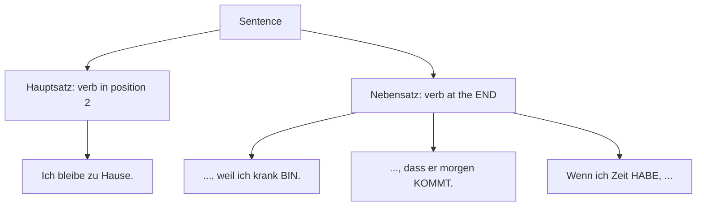

## 25.2 Verb-last rule in detail

In a Nebensatz, **the conjugated verb goes to the very end**.

| Situation | Example |
|---|---|
| Simple verb | *Ich weiß, dass er in Berlin **wohnt**.* |
| Separable verb — **stays together** | *Ich weiß, dass er um 7 Uhr **aufsteht**.* |
| Modal verb — modal goes last | *Ich weiß, dass er kommen **kann**.* |
| Perfect tense — auxiliary goes last | *Ich weiß, dass er gekommen **ist**.* |
| Modal in perfect — auxiliary before the two infinitives | *Ich weiß, dass er **hat** kommen können.* |

## 25.3 Subordinate clause first

If the Nebensatz comes first, the entire clause counts as **position 1**, so the main-clause verb comes immediately after the comma. This produces two verbs meeting in the middle.

- ***Weil** ich krank **bin**, **bleibe** ich zu Hause.*
- ***Wenn** das Wetter gut **ist**, **gehen** wir spazieren.*
- ***Als** ich in Berlin **war**, **habe** ich viel gesehen.*

## 25.4 The key subordinating conjunctions

| Conjunction | Meaning | Example |
|---|---|---|
| **dass** | that | Ich glaube, **dass** er recht **hat**. |
| **weil** | because | Ich lerne, **weil** ich eine Prüfung **habe**. |
| **da** | since, as (formal) | **Da** es **regnet**, bleiben wir hier. |
| **wenn** | if; when (repeated/future) | **Wenn** ich Zeit **habe**, rufe ich an. |
| **als** | when (one single past event) | **Als** ich 10 **war**, zog ich um. |
| **ob** | whether / if | Ich weiß nicht, **ob** er **kommt**. |
| **obwohl** | although | Er arbeitet, **obwohl** er krank **ist**. |
| **damit** | so that | Ich spare, **damit** ich reisen **kann**. |
| **bevor** | before | **Bevor** ich **gehe**, esse ich. |
| **nachdem** | after | **Nachdem** ich gegessen **hatte**, ging ich. |
| **während** | while | **Während** ich **koche**, hörst du Musik. |
| **bis** | until | Warte, **bis** ich fertig **bin**. |
| **seit / seitdem** | since | **Seitdem** ich hier **wohne**, bin ich glücklich. |
| **solange** | as long as | **Solange** es **regnet**, bleiben wir drinnen. |
| **falls** | in case | **Falls** du Hilfe **brauchst**, ruf mich an. |
| **sobald** | as soon as | **Sobald** er **kommt**, essen wir. |

## 25.5 wenn vs als — the classic distinction

| | **als** | **wenn** |
|---|---|---|
| Use | **One single event in the past** | Repeated events (any tense), or present/future "if" and "when" |
| Example | *Als ich 18 war, kaufte ich ein Auto.* | *Wenn ich Zeit habe, lese ich.* |
| Example | *Als wir in Paris waren, regnete es.* | *Immer wenn ich ihn sah, lachte er.* |

> **Rule of thumb:** if it happened **once** in the **past**, use **als**. Otherwise use **wenn**.

## 25.6 Indirect questions

A question embedded in a sentence becomes a Nebensatz, so the verb goes last.

| Direct question | Indirect question |
|---|---|
| *Wo wohnt er?* | *Ich weiß nicht, **wo** er **wohnt**.* |
| *Wann kommt der Zug?* | *Können Sie mir sagen, **wann** der Zug **kommt**?* |
| *Kommt er?* (yes/no) | *Ich weiß nicht, **ob** er **kommt**.* |

> A yes/no question becomes an indirect question with **ob**.

## 25.7 Relative clauses (Relativsätze) — introduction

A relative clause describes a noun. The relative pronoun matches the **gender and number of the noun** it refers to, but takes the **case required by its own clause**. The verb still goes last.

| | Masculine | Feminine | Neuter | Plural |
|---|---|---|---|---|
| **Nom** | der | die | das | die |
| **Akk** | den | die | das | die |
| **Dat** | dem | der | dem | denen |

- *Das ist der Mann, **der** in Berlin **wohnt**.* (Nom — he is the subject)
- *Das ist der Mann, **den** ich **kenne**.* (Akk — I know him)
- *Das ist der Mann, **dem** ich **geholfen habe**.* (Dat — I helped him)
- *Das ist die Frau, **die** Deutsch **spricht**.*
- *Das sind die Kinder, **denen** ich das Buch **gab**.*

---

# 26. The Future Tense (das Futur)

## 26.1 Futur I

**Formation: werden (conjugated) + Infinitive (at the end)**

| Pronoun | werden | Example |
|---|---|---|
| ich | **werde** | Ich **werde** morgen **arbeiten**. |
| du | **wirst** | Du **wirst** es **schaffen**. |
| er/sie/es | **wird** | Er **wird** nach Berlin **fahren**. |
| wir | **werden** | Wir **werden** ein Haus **kaufen**. |
| ihr | **werdet** | Ihr **werdet** viel **lernen**. |
| sie/Sie | **werden** | Sie **werden** kommen. |

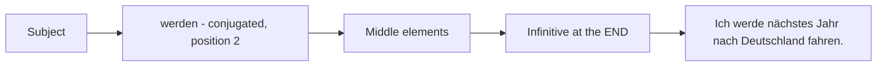

## 26.2 The important practical rule

**In everyday German, the future is usually expressed with the PRESENT TENSE plus a time expression.** This is far more common than Futur I.

- *Ich **fahre** **morgen** nach Berlin.* (I'm going to Berlin tomorrow.) ✅ most natural
- *Ich **werde** morgen nach Berlin **fahren**.* ✅ correct but more formal or emphatic
- ***Nächstes Jahr** **mache** ich mein Praktikum.* ✅ natural

## 26.3 When Futur I IS used

| Use | Example |
|---|---|
| **Prediction** about the future | *Es **wird** morgen **regnen**.* |
| **Promise or firm intention** | *Ich **werde** dir **helfen**!* |
| **Assumption about the present** (with *wohl*, *sicher*) | *Er **wird** wohl krank **sein**.* (He is probably ill.) |
| **Emphasis or warning** | *Du **wirst** jetzt dein Zimmer **aufräumen**!* |
| Formal writing and plans | *Die Firma **wird** 200 Stellen **schaffen**.* |

> **Caution:** *werden* also means "to become" as a full verb. *Ich **werde** Ingenieur* = "I am becoming / will become an engineer" — no second verb, so it is not Futur I.

## 26.4 Futur II (brief note)

Expresses something that **will have been completed** by a future point.
**Formation: werden + Partizip II + haben/sein**

- *Bis morgen **werde** ich die Arbeit **beendet haben**.* (By tomorrow I will have finished the work.)

Rarely used in speech; recognising it is enough at A2.

## 26.5 Talking about future plans — useful phrases

| German | English |
|---|---|
| Ich habe vor, ... zu ... | I plan to ... |
| Ich möchte ... | I would like to ... |
| Ich will ... | I want to ... |
| Ich hoffe, dass ... | I hope that ... |
| Ich plane, ... zu ... | I'm planning to ... |
| In Zukunft werde ich ... | In future I will ... |
| Nächstes Jahr fahre ich nach ... | Next year I'm going to ... |
| Mein Ziel ist es, ... zu ... | My goal is to ... |
| Wahrscheinlich werde ich ... | I'll probably ... |
| Vielleicht mache ich ... | Maybe I'll do ... |

---

# 27. Subjunctive II (Konjunktiv II)

The **Konjunktiv II** expresses things that are **not real**: wishes, hypothetical situations, polite requests and advice.

## 27.1 The most important forms (must be memorised)

| Verb | Konjunktiv II | Meaning |
|---|---|---|
| **sein** | **wäre** | would be |
| **haben** | **hätte** | would have |
| **werden** | **würde** | would |
| **können** | **könnte** | could |
| **müssen** | **müsste** | would have to |
| **dürfen** | **dürfte** | would be allowed to |
| **sollen** | **sollte** | should |
| **wollen** | **wollte** | would want |
| **mögen** | **möchte** | would like |
| **wissen** | **wüsste** | would know |

**Full conjugation of wäre and hätte:**

| | **wäre** | **hätte** | **würde** | **könnte** |
|---|---|---|---|---|
| ich | wäre | hätte | würde | könnte |
| du | wärst | hättest | würdest | könntest |
| er/sie/es | wäre | hätte | würde | könnte |
| wir | wären | hätten | würden | könnten |
| ihr | wärt | hättet | würdet | könntet |
| sie/Sie | wären | hätten | würden | könnten |

## 27.2 The würde + Infinitive construction

For **almost all other verbs**, the modern spoken form uses **würde + infinitive**, which is far more common than the old one-word forms.

- *Ich **würde** gern nach Deutschland **fahren**.* (I would like to go to Germany.)
- *Was **würdest** du **machen**?* (What would you do?)
- *Wir **würden** dir gern **helfen**.*

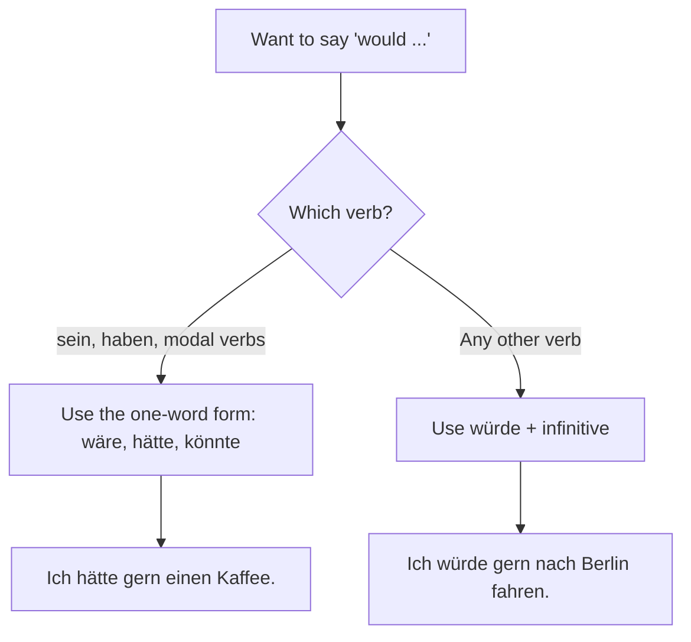

## 27.3 The four main uses

### A. Polite requests and offers — the most practical use at A2

| Less polite | Polite (Konjunktiv II) |
|---|---|
| Ich will einen Kaffee. | **Ich hätte gern** einen Kaffee. |
| Kannst du mir helfen? | **Könntest** du mir helfen? |
| Können Sie das wiederholen? | **Könnten** Sie das bitte wiederholen? |
| Ich will bezahlen. | **Ich möchte** bitte bezahlen. |
| Haben Sie Zeit? | **Hätten** Sie einen Moment Zeit? |
| Ist das möglich? | **Wäre** das möglich? |
| Ich will das Zimmer sehen. | **Ich würde** gern das Zimmer sehen. |

### B. Wishes (often with **gern** or **doch nur**)

- *Ich **hätte** gern mehr Zeit.* (I wish I had more time.)
- *Ich **wäre** gern reich.*
- *Wenn ich doch nur mehr Geld **hätte**!* (If only I had more money!)
- *Ich **würde** gern in Deutschland **studieren**.*

### C. Hypothetical (unreal) conditions — **wenn** clauses

Structure: **Wenn + Konjunktiv II (verb last), + Konjunktiv II in the main clause.**

- *Wenn ich Zeit **hätte**, **würde** ich dich **besuchen**.* (If I had time, I would visit you.)
- *Wenn ich reich **wäre**, **würde** ich ein Haus **kaufen**.*
- *Wenn ich du **wäre**, **würde** ich das nicht **machen**.* (If I were you, I wouldn't do that.)
- *Wenn das Wetter besser **wäre**, **könnten** wir spazieren gehen.*

### D. Advice and suggestions

- *Du **solltest** mehr schlafen.* (You should sleep more.)
- *Sie **sollten** einen Arzt aufsuchen.*
- *An deiner Stelle **würde** ich das anders **machen**.* (In your place I'd do it differently.)
- *Wir **könnten** ins Kino gehen.* (We could go to the cinema.)

## 27.4 Konjunktiv II in the past

**Formation: hätte / wäre + Partizip II**

- *Ich **hätte** das nicht **gesagt**.* (I wouldn't have said that.)
- *Wenn ich mehr Zeit **gehabt hätte**, **wäre** ich **gekommen**.* (If I'd had more time, I would have come.)
- *Du **hättest** mich **anrufen sollen**.* (You should have called me.)

## 27.5 Real vs unreal conditions

| Type | Form | Example |
|---|---|---|
| **Real** (it may well happen) | Indicative | *Wenn ich Zeit **habe**, **komme** ich.* (If I have time, I'll come.) |
| **Unreal** (contrary to fact) | Konjunktiv II | *Wenn ich Zeit **hätte**, **würde** ich **kommen**.* (If I had time, I would come — but I don't.) |
| **Unreal past** (impossible now) | hätte/wäre + Partizip II | *Wenn ich Zeit **gehabt hätte**, **wäre** ich **gekommen**.* |

---

# 28. A2 Conversation Topics

## 28.1 Professions and Activities

**Talking about your job:**

| German | English |
|---|---|
| Was machen Sie beruflich? | What do you do professionally? |
| Ich arbeite als Softwareentwickler. | I work as a software developer. |
| Ich bin bei einer IT-Firma angestellt. | I'm employed at an IT company. |
| Ich arbeite Vollzeit / Teilzeit. | I work full-time / part-time. |
| Ich verdiene ... Euro im Monat. | I earn ... euros a month. |
| Meine Arbeitszeiten sind von 9 bis 17 Uhr. | My working hours are 9 to 5. |
| Ich bin selbstständig. | I'm self-employed. |
| Ich bin arbeitslos / im Ruhestand. | I'm unemployed / retired. |
| Ich mache ein Praktikum. | I'm doing an internship. |
| Ich suche eine neue Stelle. | I'm looking for a new job. |
| Ich habe mich um die Stelle beworben. | I applied for the position. |
| das Vorstellungsgespräch | job interview |
| der Lebenslauf | CV |
| die Bewerbung | application |
| der Kollege / die Kollegin | colleague |
| der Chef / die Chefin | boss |
| die Abteilung | department |
| die Besprechung / das Meeting | meeting |
| der Urlaub | annual leave |
| die Überstunden | overtime |

**Describing what you do:** *Ich entwickle Software.* / *Ich betreue Kunden.* / *Ich bin für das Marketing zuständig.* (I'm responsible for marketing.) / *Ich arbeite im Team.*

## 28.2 Telling about the Past

Use the **Perfekt** in speech, and **war / hatte / konnte** for sein, haben and modals.

**Useful connectors:** zuerst (first), dann (then), danach (afterwards), später (later), schließlich (finally), plötzlich (suddenly), letztes Jahr, als ich klein war.

**Model text — my last holiday:**

> **Letzten Sommer bin** ich mit meiner Familie nach Goa **gefahren**. Wir **sind** mit dem Zug **gereist** und die Fahrt **hat** zwölf Stunden **gedauert**. Wir **haben** in einem kleinen Hotel am Strand **gewohnt**. Jeden Morgen **bin** ich schwimmen **gegangen** und danach **haben** wir **gefrühstückt**. Einmal **haben** wir eine Bootstour **gemacht** — das **war** fantastisch! Am Abend **sind** wir immer in ein Restaurant **gegangen** und **haben** Fisch **gegessen**. Leider **konnte** ich nicht länger bleiben, weil ich **arbeiten musste**. Es **war** ein wunderschöner Urlaub und ich **möchte** nächstes Jahr wieder dorthin fahren.

**Model text — my childhood:**

> **Als** ich ein Kind **war**, **wohnte** ich in einem kleinen Dorf. Wir **hatten** ein großes Haus mit einem Garten. Ich **bin** jeden Tag zu Fuß zur Schule **gegangen**. Nach der Schule **habe** ich mit meinen Freunden Fußball **gespielt**. Ich **durfte** nicht lange fernsehen, weil meine Eltern sehr streng **waren**. Am Wochenende **haben** wir oft meine Großeltern **besucht**.

## 28.3 Daily Schedule and Leisure Activities

**Describing a typical day (Tagesablauf):**

> Ich **stehe** normalerweise um halb sieben **auf**. Zuerst **dusche** ich und dann **frühstücke** ich. Um acht Uhr **fahre** ich mit dem Bus zur Universität. Der Unterricht **beginnt** um neun. Mittags **esse** ich in der Mensa mit meinen Freunden. Nachmittags **habe** ich Vorlesungen bis vier Uhr. Danach **gehe** ich ins Fitnessstudio oder **treffe** mich mit Freunden. Abends **mache** ich meine Hausaufgaben und **sehe** ein bisschen **fern**. Gegen elf Uhr **gehe** ich ins Bett.

**Useful daily-routine verbs:** aufstehen, aufwachen, duschen, sich anziehen, frühstücken, zur Arbeit fahren, arbeiten, Mittagspause machen, nach Hause kommen, kochen, zu Abend essen, fernsehen, sich ausruhen, ins Bett gehen, einschlafen.

**Talking about hobbies:**
- *In meiner Freizeit **spiele** ich gern Gitarre.*
- *Ich **interessiere mich für** Fotografie.*
- *Mein Lieblingshobby **ist** Lesen.*
- *Am Wochenende **treffe** ich mich mit Freunden.*
- *Ich **gehe** zweimal pro Woche ins Fitnessstudio.*
- *Ich **habe** vor drei Jahren **angefangen**, Deutsch zu lernen.*

## 28.4 In the Office, On the Phone

**Telephone phrases:**

| German | English |
|---|---|
| Guten Tag, hier spricht Meeth Sharma. | Hello, this is Meeth Sharma. |
| Kann ich bitte Herrn Müller sprechen? | May I speak to Mr Müller, please? |
| Einen Moment bitte, ich verbinde Sie. | One moment, I'll put you through. |
| Er ist gerade nicht am Platz. | He's not at his desk right now. |
| Möchten Sie eine Nachricht hinterlassen? | Would you like to leave a message? |
| Kann er Sie zurückrufen? | Can he call you back? |
| Können Sie das bitte wiederholen? | Could you repeat that, please? |
| Können Sie bitte langsamer sprechen? | Could you speak more slowly, please? |
| Ich habe Sie nicht verstanden. | I didn't understand you. |
| Die Verbindung ist schlecht. | The connection is bad. |
| Wie ist Ihre Nummer? | What is your number? |
| Vielen Dank für Ihren Anruf. | Thank you for your call. |
| Auf Wiederhören! | Goodbye (on the phone)! |

**Office phrases:**

| German | English |
|---|---|
| Ich schicke Ihnen eine E-Mail. | I'll send you an email. |
| Haben Sie meine Mail bekommen? | Did you get my email? |
| Wir haben morgen eine Besprechung. | We have a meeting tomorrow. |
| Ich bin für dieses Projekt zuständig. | I'm responsible for this project. |
| Können Sie mir dabei helfen? | Can you help me with this? |
| Ich brauche das bis Freitag. | I need this by Friday. |
| Die Frist ist am Montag. | The deadline is Monday. |
| Ich muss Überstunden machen. | I have to work overtime. |
| Ich nehme nächste Woche Urlaub. | I'm taking leave next week. |
| Ich bin krankgeschrieben. | I'm on sick leave. |

**Formal email structure:**
> Sehr geehrte Frau Müller,
>
> vielen Dank für Ihre E-Mail. Ich möchte Ihnen mitteilen, dass ...
>
> Mit freundlichen Grüßen
> Meeth Sharma

**Informal email:**
> Hallo Anna,
> wie geht es dir? Ich wollte dich fragen, ob ...
> Liebe Grüße
> Meeth

## 28.5 Vacation (der Urlaub)

| German | English |
|---|---|
| Wohin fahren Sie in Urlaub? | Where are you going on holiday? |
| Ich fahre ans Meer / in die Berge. | I'm going to the sea / mountains. |
| Ich habe ein Zimmer reserviert. | I've reserved a room. |
| Ich möchte ein Doppelzimmer buchen. | I'd like to book a double room. |
| Ist das Frühstück inklusive? | Is breakfast included? |
| Wie lange bleiben Sie? | How long are you staying? |
| Ich bleibe eine Woche. | I'm staying a week. |
| Wir haben eine Stadtrundfahrt gemacht. | We did a city tour. |
| Wir haben viele Sehenswürdigkeiten besichtigt. | We visited many sights. |
| Das Wetter war herrlich. | The weather was wonderful. |
| Es hat mir sehr gut gefallen. | I really liked it. |
| Ich habe viele Fotos gemacht. | I took a lot of photos. |
| die Reise / die Fahrt / der Flug | trip / journey / flight |
| der Koffer / das Gepäck | suitcase / luggage |
| der Reisepass / das Visum | passport / visa |
| die Unterkunft / die Jugendherberge | accommodation / youth hostel |
| die Sehenswürdigkeit | tourist attraction |

## 28.6 Living: Garden, City, etc.

| German | English |
|---|---|
| Ich wohne in einer Wohnung im dritten Stock. | I live in a flat on the third floor. |
| Wir haben einen kleinen Garten. | We have a small garden. |
| Die Wohnung ist hell und ruhig. | The flat is bright and quiet. |
| Ich wohne in der Innenstadt / am Stadtrand. | I live in the city centre / on the outskirts. |
| Die Gegend ist sehr grün. | The area is very green. |
| Es gibt viele Einkaufsmöglichkeiten. | There are many shopping options. |
| Die Verkehrsanbindung ist gut. | The transport connection is good. |
| Ich wohne auf dem Land / in der Stadt. | I live in the countryside / in the city. |
| Der Nachbar / die Nachbarin ist sehr nett. | The neighbour is very nice. |
| Ich bin letztes Jahr umgezogen. | I moved last year. |

**Comparing city and countryside:**
- *In der Stadt gibt es mehr Arbeitsplätze, aber auf dem Land ist die Luft besser.*
- *Das Leben in der Stadt ist teurer als auf dem Land.*
- *Ich würde lieber auf dem Land wohnen, weil es dort ruhiger ist.*

## 28.7 Technology (die Technik)

| German | English |
|---|---|
| der Computer / der Laptop | computer / laptop |
| das Handy / das Smartphone | mobile phone |
| das Internet / das WLAN | internet / wifi |
| die E-Mail / die Nachricht | email / message |
| die App / das Programm | app / program |
| die Datei / der Ordner | file / folder |
| speichern / löschen | to save / delete |
| herunterladen / hochladen | to download / upload |
| ausdrucken | to print |
| sich anmelden / abmelden | to log in / log out |
| das Passwort | password |
| die Webseite | website |
| die sozialen Netzwerke | social networks |
| online / offline | online / offline |
| Der Computer ist abgestürzt. | The computer crashed. |
| Das Internet funktioniert nicht. | The internet isn't working. |

**Discussion phrases:**
- *Ich benutze mein Handy jeden Tag.*
- *Ohne Internet könnte ich nicht arbeiten.*
- *Die Technik hat unser Leben verändert.*
- *Ich finde, dass soziale Netzwerke Vorteile und Nachteile haben.*

## 28.8 Environment (die Umwelt)

| German | English |
|---|---|
| die Umwelt / der Umweltschutz | environment / environmental protection |
| der Klimawandel | climate change |
| die Luftverschmutzung | air pollution |
| der Müll / der Abfall | rubbish / waste |
| Müll trennen / recyceln | to separate waste / recycle |
| die erneuerbaren Energien | renewable energy |
| die Solarenergie / die Windenergie | solar / wind energy |
| Energie sparen | to save energy |
| Wasser sparen | to save water |
| umweltfreundlich | environmentally friendly |
| die Verschmutzung | pollution |
| Ich fahre mit dem Rad, um die Umwelt zu schützen. | I cycle to protect the environment. |
| Wir sollten weniger Plastik benutzen. | We should use less plastic. |
| Man muss den Müll trennen. | You have to separate the rubbish. |

## 28.9 Health (die Gesundheit)

| German | English |
|---|---|
| Wie fühlen Sie sich? | How do you feel? |
| Ich fühle mich nicht gut. | I don't feel well. |
| Ich habe mich erkältet. | I've caught a cold. |
| Ich bin allergisch gegen ... | I'm allergic to ... |
| Ich muss zum Arzt gehen. | I have to go to the doctor. |
| Ich habe einen Termin beim Zahnarzt. | I have a dentist appointment. |
| Sie sollten mehr Sport treiben. | You should do more sport. |
| Ich ernähre mich gesund. | I eat healthily. |
| Ich rauche nicht mehr. | I don't smoke any more. |
| Ich gehe regelmäßig joggen. | I go jogging regularly. |
| Ich schlafe zu wenig. | I sleep too little. |
| die Krankheit / die Grippe | illness / flu |
| das Medikament / die Tablette | medicine / tablet |
| die Krankenkasse | health insurance fund |
| gesund / ungesund | healthy / unhealthy |
| sich erholen | to recover |

**Giving health advice (with sollte):**
- *Du **solltest** mehr Wasser trinken.*
- *Sie **sollten** weniger Zucker essen.*
- *An deiner Stelle **würde** ich zum Arzt gehen.*
- *Es **wäre** besser, wenn du früher schlafen gehen würdest.*

## 28.10 Making Appointments (A2 level)

| German | English |
|---|---|
| Ich hätte gern einen Termin. | I'd like an appointment. |
| Wann hätten Sie Zeit? | When would you have time? |
| Würde Ihnen Montag um 10 Uhr passen? | Would Monday at 10 suit you? |
| Das passt mir leider nicht. | Unfortunately that doesn't suit me. |
| Könnten wir den Termin verschieben? | Could we postpone the appointment? |
| Ich muss den Termin leider absagen. | Unfortunately I have to cancel. |
| Geht es auch früher / später? | Would earlier / later also work? |
| Ich bestätige den Termin. | I confirm the appointment. |
| Wir sehen uns dann am Dienstag. | See you on Tuesday, then. |
| Ich freue mich auf unser Treffen. | I look forward to our meeting. |

---

# Quick Revision Summary

## Grammar at a glance

| Topic | Core rule |
|---|---|
| **Nouns** | Always capitalised; always learn with **der/die/das** and the plural |
| **Verb position** | Main clause: verb **second**. Subordinate clause: verb **last**. Question: verb **first** (yes/no) or after the W-word |
| **Regular conjugation** | -e, -st, -t, -en, -t, -en |
| **sein** | bin, bist, ist, sind, seid, sind |
| **haben** | habe, hast, hat, haben, habt, haben |
| **Stem change** | Only in **du** and **er/sie/es**: a→ä, e→i, e→ie, au→äu |
| **Separable verbs** | Prefix goes to the **end** of the main clause |
| **Inseparable prefixes** | be-, emp-, ent-, er-, ge-, miss-, ver-, zer- — never separate, no *ge-* in the participle |
| **Modal verbs** | ich = er form, no ending; second verb in the **infinitive at the end** |
| **Negation** | **kein** for nouns with ein/no article; **nicht** for everything else |
| **Accusative** | Only the **masculine** changes: der→**den**, ein→**einen** |
| **Accusative prepositions** | **durch, für, gegen, ohne, um** (+ bis, entlang) |
| **Dative** | dem / der / dem / **den + n** |
| **Dative prepositions** | **aus, außer, bei, mit, nach, seit, von, zu** (+ gegenüber) |
| **Dative-only verbs** | helfen, danken, gefallen, gehören, antworten, passen, schmecken, gratulieren |
| **Perfekt** | **haben/sein** + **Partizip II** at the end; *sein* for movement, change of state, and sein/bleiben/werden |
| **Präteritum** | Used in writing, and always for **war, hatte** and modals |
| **Modals in past** | Drop the umlaut, add -te: konnte, musste, durfte, sollte, wollte, mochte |
| **Futur** | **werden + infinitive**, but the present tense with a time word is more common |
| **Konjunktiv II** | **wäre, hätte, könnte, sollte, möchte**; otherwise **würde + infinitive** |
| **wenn vs als** | **als** = one single past event; **wenn** = repeated, present or future |
| **Coordinating conjunctions** | und, oder, aber, denn, sondern — **no change** to word order |
| **Subordinating conjunctions** | weil, dass, wenn, obwohl, ob, damit... — verb goes to the **end** |

## The four cases at a glance

| Case | Question | Function | der | die | das | plural |
|---|---|---|---|---|---|---|
| **Nominativ** | Wer? Was? | Subject | der | die | das | die |
| **Akkusativ** | Wen? Was? | Direct object | **den** | die | das | die |
| **Dativ** | Wem? | Indirect object | **dem** | **der** | **dem** | **den + n** |
| **Genitiv** | Wessen? | Possession | des + s | der | des + s | der |

## Study advice for the Goethe A1/A2 exam

1. **Learn every noun with its article and plural** — this is non-negotiable and the single biggest determinant of your grammar accuracy.
2. **Memorise the Partizip II** of the 50 most common verbs together with *haben* or *sein*.
3. **Drill the four exam parts** separately: **Hören** (listening), **Lesen** (reading), **Schreiben** (writing), **Sprechen** (speaking).
4. **Speak from day one**, even badly. Fluency comes from use, not from reading rules.
5. **Learn whole chunks**, not isolated words: *Ich hätte gern...*, *Könnten Sie bitte...*, *Ich interessiere mich für...*
6. **Practise the speaking exam format** — self-introduction, asking and answering questions from prompt cards, and planning something together with a partner.
7. **Use spaced repetition** (Anki) for vocabulary; aim for roughly 650 words for A1 and 1,300 for A2.
8. **Listen to slow German daily** — *Langsam gesprochene Nachrichten* from Deutsche Welle, Nico's Weg, and Slow German podcasts.
