# Machine Learning for IT Application Development
### Complete Notes — Modules 1 to 6 (PCC-IT 701)

> **Course:** B.E. IT, Semester VII | **Total Hours:** 45
> **Prerequisites:** Linear Algebra, Calculus, Probability, Statistics

---

## Table of Contents

| Module | Topic | Hrs |
|---|---|---|
| 1 | Introduction to Machine Learning | 5 |
| 2 | Data Handling Techniques | 6 |
| 3 | Regression Techniques and Advanced Clustering | 10 |
| 4 | Classification Techniques | 10 |
| 5 | Optimization Techniques | 7 |
| 6 | Semi-Supervised and Reinforcement Learning | 7 |

---

# MODULE 1: Introduction to Machine Learning

## 1.1 What is Machine Learning?

Machine Learning (ML) is a branch of Artificial Intelligence. Instead of writing rules by hand, we give a computer data and let it find the rules itself.

**Classic definition (Tom Mitchell):**
> A program learns from experience **E** with respect to task **T** and performance measure **P**, if its performance at T, measured by P, improves with experience E.

*Example — spam filter:*
- **T** = classify email as spam / not spam
- **E** = a set of emails already marked spam or not
- **P** = percentage of emails classified correctly

### Traditional Programming vs Machine Learning

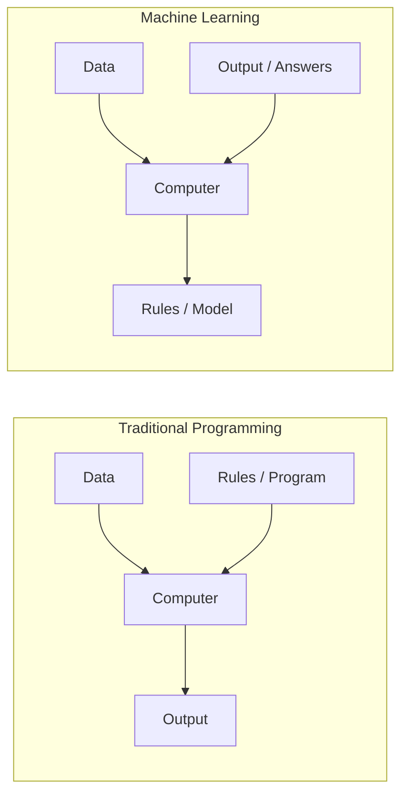

In traditional programming we supply rules and get answers. In ML we supply answers and the machine produces the rules.

---

## 1.2 Machine Learning Terminology

| Term | Meaning |
|---|---|
| **Dataset** | The full table of data used for learning. |
| **Instance / Sample** | One row of the dataset (one customer, one email). |
| **Feature (attribute)** | One column used as input, e.g. age, salary. |
| **Label / Target** | The column we want to predict. |
| **Model** | The mathematical function learned from data. |
| **Training set** | Data used to teach the model (usually 70-80%). |
| **Validation set** | Data used to tune settings and pick the best model. |
| **Test set** | Unseen data used only for the final score. |
| **Hyperparameter** | A setting we choose *before* training (e.g. k in kNN). |
| **Parameter** | A value the model *learns* (e.g. weights in regression). |
| **Loss function** | Measures how wrong one prediction is. |
| **Cost function** | Average loss over the whole dataset. |
| **Epoch** | One complete pass over the training data. |
| **Inference** | Using a trained model to predict on new data. |

### Bias, Variance, Overfitting and Underfitting

- **Bias** = error from over-simplified assumptions. High bias means the model misses the real pattern, which is **underfitting**.
- **Variance** = sensitivity to small changes in the training data. High variance means the model memorises noise, which is **overfitting**.
- **Bias-Variance trade-off**: reducing one usually raises the other. The goal is the balance point with minimum total error.

$$\text{Total Error} = \text{Bias}^2 + \text{Variance} + \text{Irreducible Error}$$

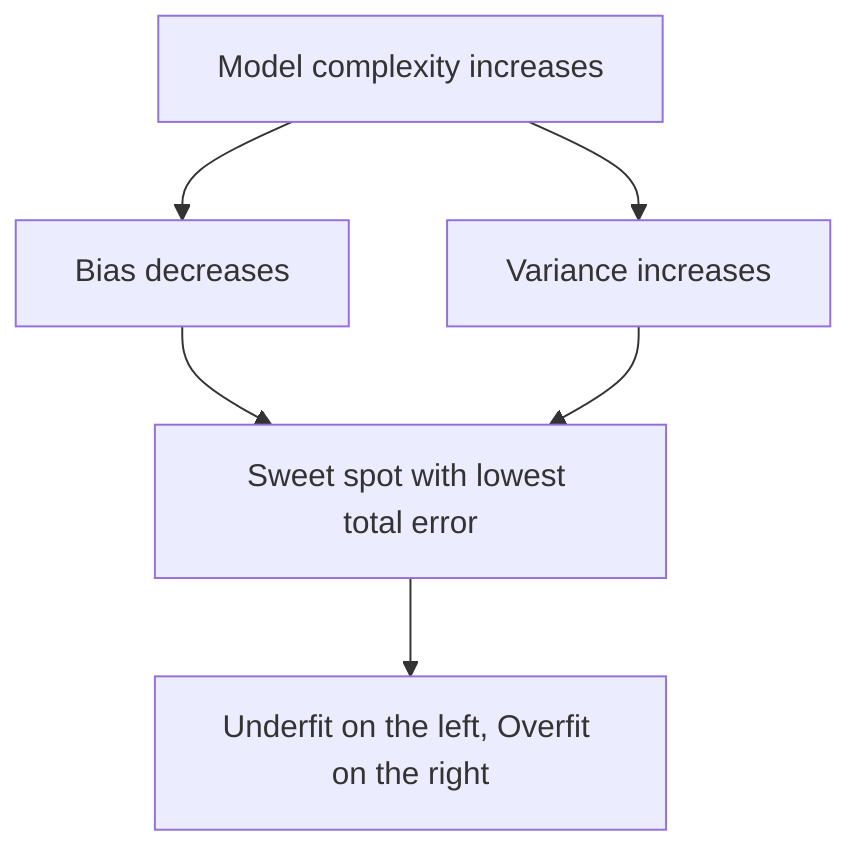

| Situation | Training error | Test error | Fix |
|---|---|---|---|
| Underfitting | High | High | More features, complex model, train longer |
| Good fit | Low | Low | Keep it |
| Overfitting | Very low | High | More data, regularization, simpler model |

---

## 1.3 Types of Machine Learning

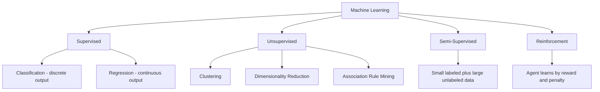

### A. Supervised Learning
Data comes with correct answers (labels). The model learns the mapping from input to output.
- **Classification** — output is a category. *Spam or not spam, disease or no disease.*
  Algorithms: kNN, Decision Tree, SVM, Naive Bayes, Logistic Regression, Random Forest.
- **Regression** — output is a number. *House price, temperature.*
  Algorithms: Linear Regression, Ridge, LASSO, SVR, Regression Trees.

### B. Unsupervised Learning
Data has **no labels**. The model finds structure by itself.
- **Clustering** — group similar points. *K-Means, Hierarchical, DBSCAN, BIRCH.*
- **Dimensionality reduction** — compress features. *PCA, LDA, t-SNE.*
- **Association rules** — find items that occur together. *Apriori, FP-Growth (market basket).*

### C. Semi-Supervised Learning
A few labeled samples plus lots of unlabeled samples. Useful when labelling is costly, such as medical images.

### D. Reinforcement Learning
An **agent** takes actions in an **environment**, gets **rewards**, and learns a policy that maximises long-term reward. *Game playing, robotics, self-driving.*

### Quick comparison

| Aspect | Supervised | Unsupervised | Semi-Supervised | Reinforcement |
|---|---|---|---|---|
| Data | Labeled | Unlabeled | Mostly unlabeled | Interaction and reward |
| Goal | Predict label | Find structure | Predict with less labelling | Maximise reward |
| Feedback | Direct, immediate | None | Partial | Delayed reward |
| Example | Spam filter | Customer segments | Web page classification | Chess engine |

---

## 1.4 Issues in Machine Learning

1. **Poor quality data** — missing values, noise, wrong entries.
2. **Insufficient data** — small datasets give unstable models.
3. **Non-representative data** — sampling bias makes the model fail in the real world.
4. **Irrelevant features** — garbage in, garbage out.
5. **Overfitting and underfitting** — the core modelling problem.
6. **Curse of dimensionality** — too many features makes all points look equally far apart.
7. **Imbalanced classes** — 99% "not fraud" makes accuracy meaningless.
8. **Interpretability** — deep models are black boxes; regulated industries need explanations.
9. **Concept drift** — the real-world pattern changes with time and the model goes stale.
10. **Cost** — computation, storage and skilled people are expensive.
11. **Ethics and bias** — models can reproduce social bias present in the data.

---

## 1.5 Applications of Machine Learning

| Domain | Application |
|---|---|
| Healthcare | Disease prediction, medical imaging, drug discovery |
| Finance | Credit scoring, fraud detection, algorithmic trading |
| Retail / E-commerce | Recommendation systems, demand forecasting, dynamic pricing |
| IT and Software | Bug prediction, log anomaly detection, code completion |
| Transport | Self-driving cars, route optimisation, ETA prediction |
| NLP | Translation, chatbots, sentiment analysis, summarisation |
| Computer Vision | Face recognition, OCR, quality inspection |
| Security | Intrusion detection, spam and phishing filters |
| Agriculture | Crop yield prediction, leaf disease detection |

---

## 1.6 Steps in Developing a Machine Learning Application

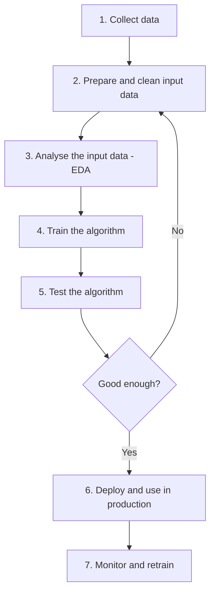

1. **Collect data** — databases, APIs, sensors, web scraping, public datasets.
2. **Prepare input data** — fix missing values, remove duplicates, encode categories, scale numbers. The data must be in the format the algorithm expects.
3. **Analyse the data (EDA)** — plot distributions, check correlations, spot outliers. This is a sanity check before modelling.
4. **Train the algorithm** — feed the training set; the algorithm extracts knowledge in the form of parameters.
5. **Test the algorithm** — evaluate on the held-out test set using proper metrics. If poor, go back to step 2 or change the algorithm.
6. **Use it** — deploy as a service or API and feed it real data.
7. **Monitor** — track drift and retrain periodically.

---

## 1.7 How to Choose the Right Algorithm

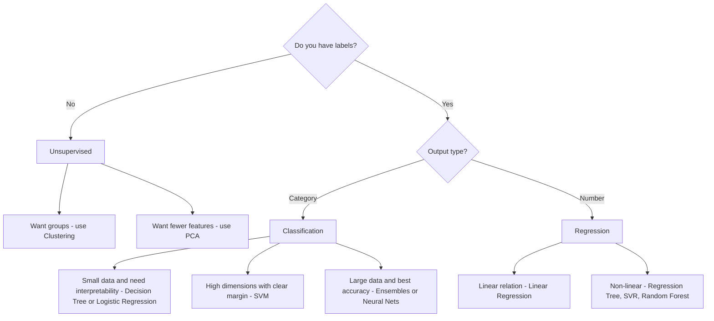

Other practical factors:
- **Size of data** — kNN is fine for small data, terrible for huge data.
- **Accuracy vs speed** — ensembles are accurate but slow to train.
- **Interpretability** — banks and hospitals often need explainable models.
- **Training time and memory** available.
- **Number of features** compared with number of samples.
- **Linearity** of the relationship between features and target.

---

## 1.8 Hypothesis Testing

A **hypothesis** is a claim about a population. Hypothesis testing is a statistical procedure that uses sample data to decide whether the claim is supported.

### Key terms
- **Null hypothesis (H0)** — the "no effect, no difference" default claim.
- **Alternative hypothesis (H1)** — what we want to prove.
- **Test statistic** — a number computed from the sample (z, t, F, chi-square).
- **Significance level (alpha)** — the risk we accept of rejecting a true H0, usually 0.05.
- **p-value** — probability of getting a result at least as extreme as observed, assuming H0 is true.
- **Decision rule** — if `p-value <= alpha` then **reject H0**, else **fail to reject H0**.
- **Critical region** — range of test-statistic values that lead to rejection.

### Types of error

| | H0 actually TRUE | H0 actually FALSE |
|---|---|---|
| **Reject H0** | Type I error (alpha) - false positive | Correct decision (power) |
| **Fail to reject H0** | Correct decision | Type II error (beta) - false negative |

### Steps in hypothesis testing

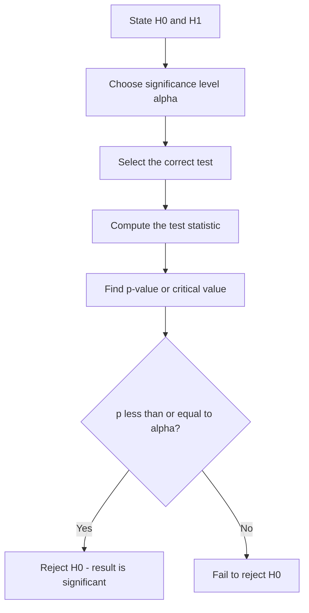

---

## 1.9 Types of Hypothesis Testing

### By direction
- **Two-tailed test** — H1 says the value is simply different (either direction).
- **Left-tailed test** — H1 says the value is less than the claim.
- **Right-tailed test** — H1 says the value is greater than the claim.

### By statistical test used

| Test | When to use | Example |
|---|---|---|
| **Z-test** | Population standard deviation known, n > 30 | Compare a sample mean with a known population mean |
| **t-test (one sample)** | Standard deviation unknown, small n | Is average marks of a class equal to 60? |
| **t-test (two sample)** | Compare means of two independent groups | Model A accuracy vs Model B accuracy |
| **Paired t-test** | Same subjects measured twice | Before and after training scores |
| **ANOVA (F-test)** | Compare means of three or more groups | Accuracy of 4 algorithms |
| **Chi-square test** | Categorical data - independence or goodness of fit | Is gender related to product choice? |

### Why it matters in ML
- To check whether a feature is **statistically related** to the target (feature selection).
- To decide whether **Model A is genuinely better** than Model B, or the gap is just noise.
- To validate **A/B tests** of a deployed model.

---

# MODULE 2: Data Handling Techniques

> Real data is dirty. Roughly 70-80% of an ML project's time goes into this module's topics.

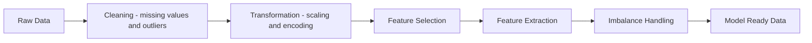

## 2.1 Missing Value Handling

Missing data appears as `NaN`, blank, `NULL`, `?` or a placeholder like `-999`.

### Why values go missing
- **MCAR (Missing Completely At Random)** — no pattern; a sensor randomly failed.
- **MAR (Missing At Random)** — missingness depends on another *observed* feature; older people skip the income field.
- **MNAR (Missing Not At Random)** — missingness depends on the missing value itself; high earners hide income. This is the hardest case.

### Techniques

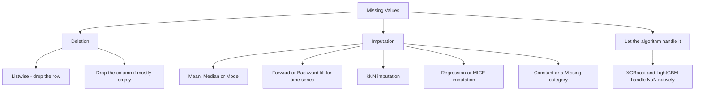

| Method | How it works | Pros | Cons |
|---|---|---|---|
| Drop rows | Delete records with NaN | Simple | Loses data, may bias |
| Drop column | Delete the feature | Good if mostly empty | Loses a possible signal |
| Mean imputation | Replace with column mean | Fast | Distorted if skewed, reduces variance |
| Median imputation | Replace with median | Robust to outliers | Same variance issue |
| Mode imputation | Most frequent value | Works for categories | Over-represents the mode |
| Forward / Backward fill | Copy previous or next value | Natural for time series | Wrong if data jumps |
| kNN imputation | Average of k most similar rows | Uses relationships | Slow on big data |
| Regression / MICE | Predict the missing column from other columns | Most accurate | Complex, can overfit |
| "Missing" as a category | Treat NaN as its own label | Keeps the fact that it was missing | Adds a level |

**Rule of thumb:** below 5% missing, impute simply. Between 5% and 30%, use model-based imputation. Above 50%, consider dropping the column.

---

## 2.2 Outlier Treatment

An **outlier** is a value far away from the rest of the data. It may be a genuine rare event or a data-entry error.

### Detection methods

**1. Z-score method** (for roughly normal data)
$$z = \frac{x - \mu}{\sigma}$$
If the absolute z-score is greater than 3, flag the point as an outlier.

**2. IQR method** (robust, works on skewed data)
$$IQR = Q_3 - Q_1$$
- Lower fence = `Q1 - 1.5 x IQR`
- Upper fence = `Q3 + 1.5 x IQR`

Anything outside the fences is an outlier. This is exactly what a box plot draws.

**3. Visual** — box plot, scatter plot, histogram.

**4. Model based** — DBSCAN (points in no cluster), Isolation Forest, Local Outlier Factor, One-Class SVM.

### Treatment methods

| Method | Description |
|---|---|
| **Remove** | Delete the row, only when it is clearly an error |
| **Capping / Winsorizing** | Clip to the 1st and 99th percentile, or to the IQR fences |
| **Transformation** | Log, square-root or Box-Cox to squash the long tail |
| **Imputation** | Treat as missing and impute |
| **Binning** | Convert to ranges so extremes fall in the top bin |
| **Keep and use a robust model** | Trees and median-based models tolerate outliers |

---

## 2.3 Scaling and Normalization

Many algorithms (kNN, SVM, K-Means, PCA, anything using gradient descent) use **distance** or **gradients**, so a feature measured in lakhs will dominate one measured in years. Scaling fixes this.
Tree-based models such as Decision Tree, Random Forest and XGBoost do **not** need scaling.

| Technique | Formula | Output range | Use when |
|---|---|---|---|
| **Min-Max Normalization** | $x' = \frac{x - x_{min}}{x_{max} - x_{min}}$ | 0 to 1 | Bounded data, neural nets, image pixels |
| **Standardization (Z-score)** | $x' = \frac{x - \mu}{\sigma}$ | mean 0, sd 1 | Roughly normal data; PCA, SVM, LR |
| **Robust Scaling** | $x' = \frac{x - median}{IQR}$ | centred at 0 | Data with many outliers |
| **MaxAbs Scaling** | $x' = \frac{x}{max(\lvert x \rvert)}$ | -1 to 1 | Sparse data, keeps zeros |
| **Unit Vector (L2 norm)** | $x' = \frac{x}{\lVert x \rVert}$ | length 1 | Text vectors, cosine similarity |
| **Log transform** | $x' = \log(1+x)$ | compressed | Highly skewed data such as income |

**Important:** fit the scaler on the **training set only**, then apply the same transform to test data. Otherwise information leaks from test to train.

---

## 2.4 Encoding Categorical Data

Algorithms need numbers, so text categories must be converted.

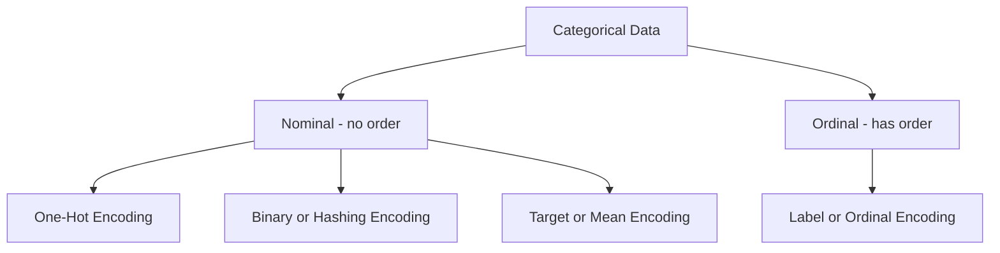

| Encoding | How | Example | Watch out |
|---|---|---|---|
| **Label Encoding** | Each category becomes an integer | Red=0, Green=1, Blue=2 | Creates a fake order, use only for ordinal or tree models |
| **Ordinal Encoding** | Integers following a known order | Low=1, Medium=2, High=3 | You must supply the order |
| **One-Hot Encoding** | One binary column per category | Red becomes 1,0,0 | Explodes columns if many categories |
| **Dummy Encoding** | One-hot with one column dropped | avoids the dummy-variable trap | Needed for linear regression |
| **Binary Encoding** | Category to integer to binary digits | 5 becomes 101 in 3 columns | Fewer columns than one-hot |
| **Frequency / Count Encoding** | Replace with how often it appears | Mumbai becomes 4500 | Collision when counts tie |
| **Target / Mean Encoding** | Replace with the mean target for that category | City becomes average purchase | Risk of leakage, use smoothing and CV |
| **Hashing Encoding** | Hash into a fixed number of buckets | huge vocabularies | Hash collisions |

---

## 2.5 Feature Selection

**Feature selection** picks a subset of the *original* features. It reduces overfitting, speeds up training, and makes models easier to read. Contrast this with feature *extraction*, which builds new features.

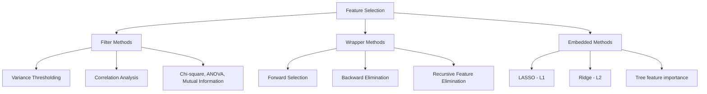

### A. Filter Methods
Use statistics on the data only, independent of any model. Fast, done once, before training.

**1. Variance Thresholding**
Remove features whose variance is below a threshold. A feature that is almost constant carries no information.
$$Var(X) = \frac{1}{n}\sum (x_i - \bar{x})^2$$
If the variance is below the threshold (e.g. 0.01), drop the column. A common use is removing near-constant binary flags.

**2. Correlation Analysis**
- **Feature vs Target**: keep features with high absolute correlation with the target.
- **Feature vs Feature**: if two features have correlation above about 0.85, they are redundant (**multicollinearity**), so keep only one.

$$r = \frac{\sum (x_i-\bar{x})(y_i-\bar{y})}{\sqrt{\sum (x_i-\bar{x})^2 \sum (y_i-\bar{y})^2}}$$

Also used: **VIF (Variance Inflation Factor)**. A VIF above 10 indicates severe multicollinearity.

**3. Statistical tests**
- **Chi-square** — categorical feature against categorical target.
- **ANOVA F-test** — numeric feature against categorical target.
- **Mutual Information** — captures non-linear dependence too.

| Pros | Cons |
|---|---|
| Very fast and scalable | Ignores feature interactions |
| Model independent | May keep features useless to the chosen model |

### B. Wrapper Methods
Train the model repeatedly on different feature subsets and keep the subset with the best score. Model-specific and accurate, but slow.

**1. Forward Selection** — start with zero features, add the feature that improves the score most, repeat until no improvement.

**2. Backward Elimination** — start with all features, remove the least useful one (for example the highest p-value) at each step, repeat until removing hurts.

**3. Recursive Feature Elimination (RFE)** — train the model, rank features by importance, drop the weakest, retrain. Repeat until the desired number of features remains. **RFECV** uses cross-validation to choose that number automatically.

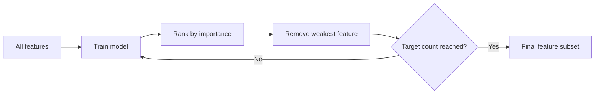

| Pros | Cons |
|---|---|
| Considers interactions | Computationally expensive |
| Tailored to the model | Risk of overfitting the selection |

### C. Embedded Methods
Feature selection happens *inside* model training. A good balance of speed and accuracy.

**1. LASSO (L1 regularization)**
$$J(\theta) = MSE + \lambda \sum_{j=1}^{n} |\theta_j|$$
The L1 penalty can shrink coefficients **exactly to zero**, so LASSO performs automatic feature selection.

**2. Ridge (L2 regularization)**
$$J(\theta) = MSE + \lambda \sum_{j=1}^{n} \theta_j^2$$
Shrinks coefficients toward zero but never exactly to zero. It *reduces* the influence of weak features instead of removing them, and is excellent against multicollinearity.

**3. Elastic Net** — a mix of L1 and L2, useful when features are correlated in groups.

**4. Tree-based importance** — Random Forest and XGBoost report how much each feature reduced impurity; keep the top k.

| Method type | Speed | Accounts for interactions | Model dependent |
|---|---|---|---|
| Filter | Fastest | No | No |
| Wrapper | Slowest | Yes | Yes |
| Embedded | Medium | Yes | Yes |

---

## 2.6 Feature Extraction

Feature extraction creates **new, fewer features** as combinations of the old ones. The originals are not preserved, but most of the information is.

### A. Principal Component Analysis (PCA)

PCA is an **unsupervised** technique. It rotates the data onto new axes called **principal components** that point in the directions of maximum variance. The components are mutually **orthogonal**, so they are uncorrelated.

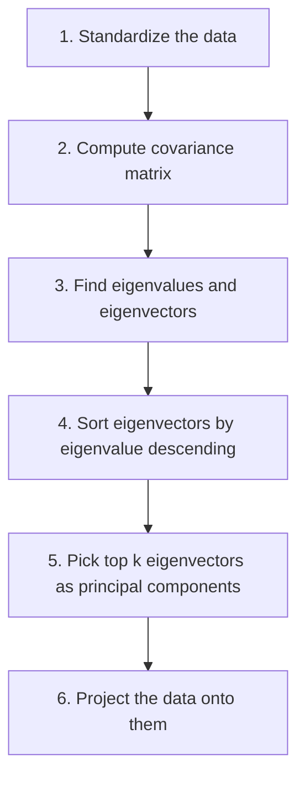

1. **Standardize** each feature to mean 0 and sd 1, because PCA is scale sensitive.
2. **Covariance matrix**: $C = \frac{1}{n-1}X^T X$
3. **Eigen decomposition**: solve $Cv = \lambda v$. The eigenvector `v` is a direction and the eigenvalue `lambda` is the variance captured along it.
4. **Sort** eigenvalues in decreasing order.
5. **Choose k** — usually enough components to keep 90-95% of the variance:
   $$\text{Explained variance ratio} = \frac{\lambda_i}{\sum \lambda_j}$$
   A **scree plot** (variance against component number) helps find the elbow.
6. **Transform**: $Z = X W_k$ where $W_k$ holds the top k eigenvectors.

**Uses:** visualisation in 2D or 3D, noise removal, faster training, fixing multicollinearity.
**Limits:** components lose real-world meaning, only linear structure is captured, and the target is ignored.

### B. Linear Discriminant Analysis (LDA)

LDA is **supervised**. Instead of maximising variance, it finds axes that best **separate the classes**.

Objective: maximise the ratio
$$J(w) = \frac{w^T S_B w}{w^T S_W w}$$

where $S_B$ is the **between-class scatter** (how far apart class means are, we want it large) and $S_W$ is the **within-class scatter** (how spread out each class is, we want it small).

**Steps:** compute class means, compute $S_W$ and $S_B$, solve $S_W^{-1}S_B$ for eigenvectors, keep the top ones, project the data.

**Limit:** produces at most `C - 1` components for `C` classes, so only one axis for a two-class problem.

### PCA vs LDA

| | PCA | LDA |
|---|---|---|
| Supervision | Unsupervised, ignores labels | Supervised, uses labels |
| Goal | Maximise variance | Maximise class separability |
| Max components | Number of features | C - 1 |
| Best for | Compression, noise removal, visualisation | Classification pre-processing |
| Assumption | Linear correlations | Normal classes with equal covariance |

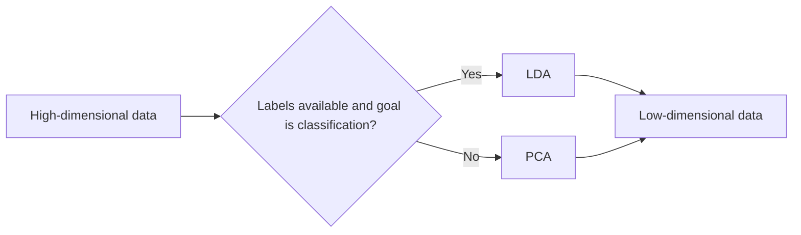

Other extraction methods worth knowing: **t-SNE and UMAP** (non-linear, for visualisation only), **Kernel PCA** (non-linear), **Autoencoders** (neural compression), and **ICA**.

---

## 2.7 Imbalanced Dataset Handling

An **imbalanced dataset** has very unequal class counts, for example 9,900 legitimate transactions against 100 frauds.

**Why it is a problem:** a model that always predicts "not fraud" scores 99% accuracy and is completely useless. This is the **accuracy paradox**. The minority class is usually the one we care about.

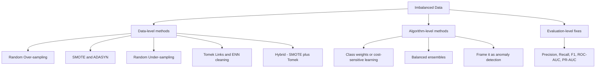

### Data-level techniques

| Technique | Idea | Pros | Cons |
|---|---|---|---|
| **Random Over-sampling** | Duplicate minority samples | Simple, no data loss | Overfits duplicates |
| **SMOTE** | Create *synthetic* minority points along the line joining a point and its nearest minority neighbours | Adds variety, no exact duplicates | Can create noise near class borders |
| **Borderline-SMOTE** | Oversample only points near the boundary | Focuses on the hard region | Sensitive to noise |
| **ADASYN** | Generate more points where the minority class is hardest to learn | Adaptive | Can amplify outliers |
| **Random Under-sampling** | Delete majority samples | Fast, smaller data | Throws away information |
| **Tomek Links** | Remove majority points sitting right next to a minority point | Cleans the boundary | Small change in ratio |
| **ENN (Edited Nearest Neighbours)** | Remove points misclassified by their neighbours | Cleans noise | May over-clean |
| **SMOTE + Tomek / SMOTE + ENN** | Oversample then clean | Best of both | More steps |

**SMOTE formula:** for a minority point $x$ and a random neighbour $x_{nn}$,
$$x_{new} = x + \delta \times (x_{nn} - x), \quad \delta \in [0,1]$$

> **Golden rule:** apply resampling **only to the training fold**, never to validation or test data. Otherwise synthetic copies leak into the test set and the score is fake.

### Algorithm-level techniques
- **Class weights** — set `class_weight='balanced'` so the loss penalises minority mistakes more.
- **Cost-sensitive learning** — attach an explicit cost matrix, since missing a fraud costs far more than a false alarm.
- **Balanced ensembles** — Balanced Random Forest, EasyEnsemble, RUSBoost.
- **Anomaly detection framing** — Isolation Forest or One-Class SVM when the minority is under 1%.

### Evaluation-level
Use **Precision, Recall, F1-score, ROC-AUC** and especially **PR-AUC**, along with the confusion matrix. Never judge an imbalanced problem by accuracy alone.

---

# MODULE 3: Regression Techniques and Advanced Clustering

## 3.1 What is Regression?

Regression is supervised learning where the **output is a continuous number**. The goal is to fit a function that maps features to that number.

## 3.2 Simple Linear Regression

One input feature, one output. It fits a straight line:

$$y = \beta_0 + \beta_1 x + \varepsilon$$

- $\beta_0$ = intercept, the value of y when x is 0.
- $\beta_1$ = slope, the change in y per unit change in x.
- $\varepsilon$ = error term.

### Finding the line: Ordinary Least Squares (OLS)
We choose the line that minimises the sum of squared errors:

$$SSE = \sum_{i=1}^{n}(y_i - \hat{y}_i)^2$$

Closed-form solutions:

$$\beta_1 = \frac{\sum (x_i - \bar{x})(y_i - \bar{y})}{\sum (x_i - \bar{x})^2}, \qquad \beta_0 = \bar{y} - \beta_1 \bar{x}$$

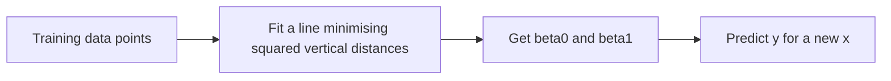

### Assumptions of linear regression
1. **Linearity** — the relation between x and y is linear.
2. **Independence** — observations are independent of each other.
3. **Homoscedasticity** — error variance is constant across all x.
4. **Normality of errors** — residuals are normally distributed.
5. **No multicollinearity** — inputs are not strongly correlated with each other (for multiple regression).

## 3.3 Multiple Linear Regression

More than one input feature:

$$y = \beta_0 + \beta_1 x_1 + \beta_2 x_2 + \dots + \beta_n x_n + \varepsilon$$

In matrix form the OLS solution is
$$\hat{\beta} = (X^T X)^{-1} X^T y$$

Each coefficient $\beta_j$ means: the expected change in y for a one-unit increase in $x_j$, **holding all other features constant**.

**Problems to watch:**
- **Multicollinearity** — correlated inputs make coefficients unstable. Detect with VIF, fix with Ridge or by dropping a feature.
- **Adding useless features always increases $R^2$**, so use **Adjusted $R^2$** instead.
- **Dummy variable trap** — when one-hot encoding, drop one column.

## 3.4 Polynomial Regression

Still a *linear model in the parameters*, but with powers of x as extra features:
$$y = \beta_0 + \beta_1 x + \beta_2 x^2 + \dots + \beta_d x^d$$
Higher degree fits curves but overfits quickly. Degree is a hyperparameter.

## 3.5 Logistic Regression

Despite the name, logistic regression is a **classification** algorithm. It predicts the *probability* that a sample belongs to the positive class.

### The sigmoid function
$$\sigma(z) = \frac{1}{1 + e^{-z}}, \qquad z = \beta_0 + \beta_1 x_1 + \dots + \beta_n x_n$$

The sigmoid squashes any real number into the range 0 to 1.

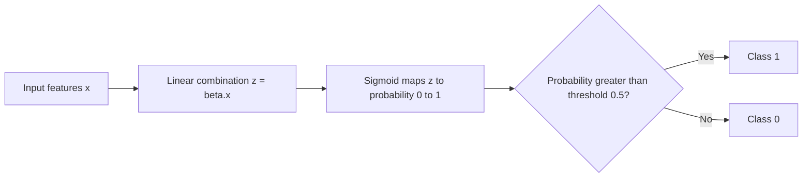

### Log-odds interpretation
$$\log\left(\frac{p}{1-p}\right) = \beta_0 + \beta_1 x_1 + \dots$$
The left side is the **logit** or log-odds. So a coefficient $\beta_j$ is the change in log-odds per unit of $x_j$; $e^{\beta_j}$ is the **odds ratio**.

### Cost function: Binary Cross-Entropy (Log Loss)
Squared error is non-convex for logistic regression, so we use:

$$J(\beta) = -\frac{1}{m}\sum_{i=1}^{m}\Big[ y_i \log(\hat{p}_i) + (1-y_i)\log(1-\hat{p}_i) \Big]$$

Minimised using **gradient descent** (no closed-form solution).

### Variants
- **Binary** — two classes.
- **Multinomial** — more than two unordered classes, uses the **softmax** function.
- **Ordinal** — more than two ordered classes.

## 3.6 Regularization

Regularization adds a penalty on large coefficients to control overfitting.

| Type | Penalty added to cost | Effect | Also called |
|---|---|---|---|
| **Ridge** | $\lambda \sum \beta_j^2$ | Shrinks coefficients smoothly, never to zero | L2 |
| **LASSO** | $\lambda \sum \lvert \beta_j \rvert$ | Can force coefficients to exactly zero, so it selects features | L1 |
| **Elastic Net** | $\lambda_1 \sum \lvert \beta_j \rvert + \lambda_2 \sum \beta_j^2$ | Mix of both, handles correlated groups | L1 + L2 |

- **lambda (alpha)** is the regularization strength. Large lambda means more shrinkage, higher bias, lower variance. Choose it with cross-validation.
- Always **scale features** before regularizing, since the penalty depends on coefficient size.

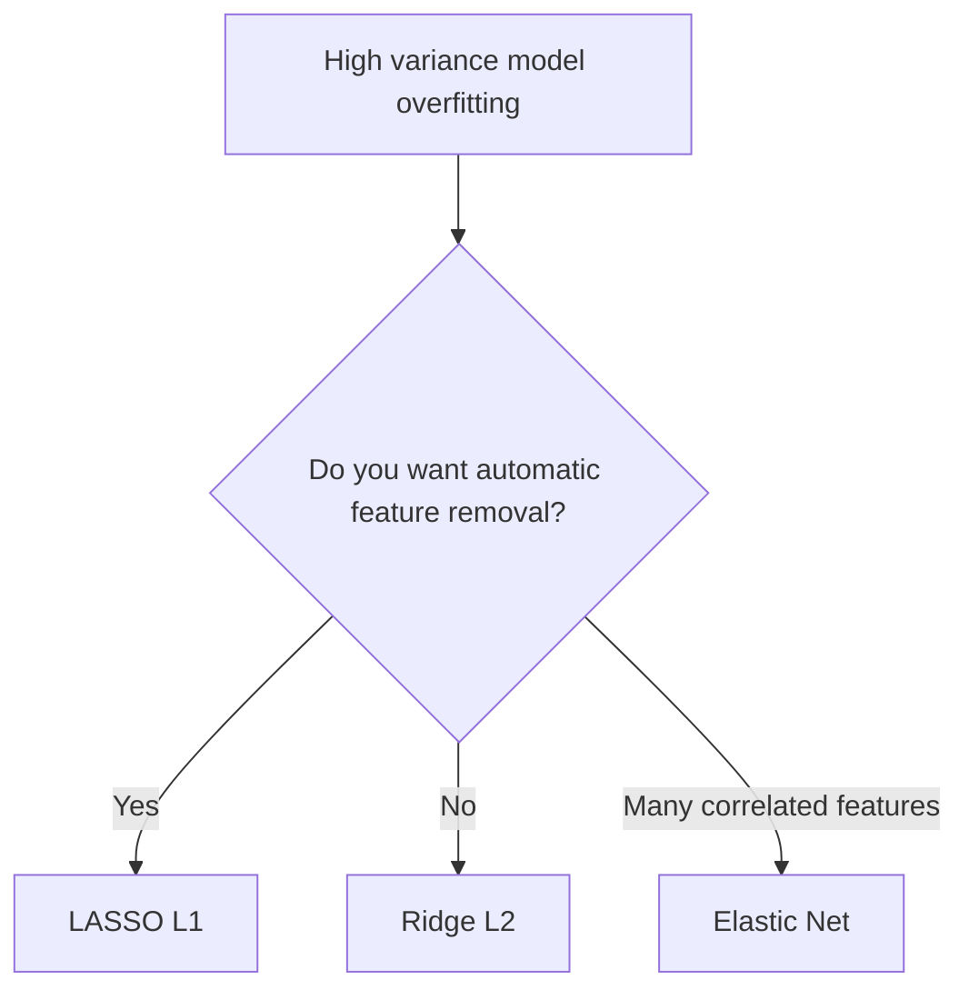

## 3.7 Regression Evaluation Metrics

| Metric | Formula | Meaning |
|---|---|---|
| **MAE** | $\frac{1}{n}\sum \lvert y_i - \hat{y}_i \rvert$ | Average absolute error, same units as y, robust to outliers |
| **MSE** | $\frac{1}{n}\sum (y_i - \hat{y}_i)^2$ | Penalises large errors heavily, units are squared |
| **RMSE** | $\sqrt{MSE}$ | Same units as y, still outlier sensitive |
| **R-squared** | $1 - \frac{SS_{res}}{SS_{tot}}$ | Proportion of variance explained, 0 to 1 |
| **Adjusted R-squared** | $1-\frac{(1-R^2)(n-1)}{n-k-1}$ | Penalises useless extra features |
| **MAPE** | $\frac{100}{n}\sum \left\lvert \frac{y_i-\hat{y}_i}{y_i} \right\rvert$ | Percentage error, fails when y is near zero |

Where $SS_{res} = \sum (y_i - \hat{y}_i)^2$ and $SS_{tot} = \sum (y_i - \bar{y})^2$.

## 3.8 Probabilistic Model-Based Clustering

Hard clustering such as K-Means assigns each point to exactly one cluster. **Probabilistic (soft) clustering** instead says a point belongs to cluster A with probability 0.7 and to cluster B with probability 0.3.

### Gaussian Mixture Model (GMM)
A GMM assumes the data was generated by a mixture of `K` Gaussian distributions:

$$p(x) = \sum_{k=1}^{K} \pi_k \, \mathcal{N}(x \mid \mu_k, \Sigma_k)$$

- $\pi_k$ = mixing weight of cluster k (all weights sum to 1)
- $\mu_k$ = mean vector, $\Sigma_k$ = covariance matrix

### Expectation-Maximization (EM) Algorithm

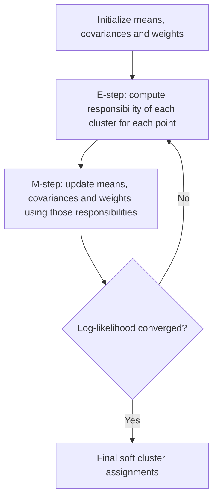

- **E-step (Expectation):** using current parameters, compute the probability (responsibility) $\gamma_{ik}$ that point i came from cluster k.
- **M-step (Maximization):** using those responsibilities as soft counts, recompute $\mu_k$, $\Sigma_k$ and $\pi_k$ to maximise likelihood.
- Repeat until the log-likelihood stops improving.

### GMM vs K-Means

| | K-Means | GMM |
|---|---|---|
| Assignment | Hard, one cluster only | Soft, probabilities |
| Cluster shape | Spherical, equal size | Elliptical, any orientation and size |
| Based on | Distance to centroid | Probability density |
| Extra output | None | Probability of membership |
| Speed | Faster | Slower |

Choosing K for GMM: use **AIC** or **BIC** (lower is better).

## 3.9 BIRCH Clustering

**BIRCH** = Balanced Iterative Reducing and Clustering using Hierarchies. It is built for **very large datasets** and needs only **one pass** over the data. It works incrementally, so it suits data that does not fit in memory.

### Clustering Feature (CF)
Each sub-cluster is summarised by a triple:

$$CF = (N, \vec{LS}, SS)$$

- **N** = number of points
- **LS** = linear sum of points (a vector)
- **SS** = sum of squared values (a scalar)

From these three numbers you can compute the centroid, radius and diameter without storing the raw points. CFs are also **additive**: merging two sub-clusters just adds their CF triples.

$$\text{Centroid} = \frac{\vec{LS}}{N}$$

### CF Tree
A height-balanced tree, similar to a B+ tree, with two parameters:
- **Branching factor B** — max children per non-leaf node.
- **Threshold T** — max radius/diameter of a leaf sub-cluster.

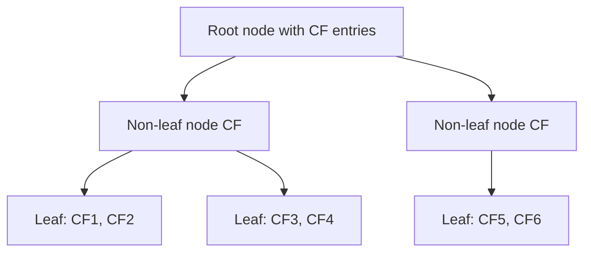

### The four phases of BIRCH

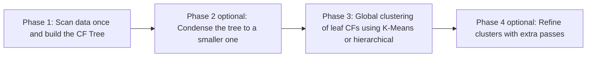

1. **Building** — insert each point into the closest leaf; if it fits within threshold T, absorb it, else create a new entry. Split nodes when they exceed B.
2. **Condensing** — rebuild a smaller CF tree with a larger T if memory runs short.
3. **Global clustering** — run a standard algorithm on the leaf entries only (there are far fewer of them than data points).
4. **Refinement** — optional extra passes to fix points assigned to the wrong cluster.

**Advantages:** single pass, memory efficient, handles outliers, works for very large data.
**Limitations:** only for numeric data, sensitive to the order of input, works best for spherical clusters, threshold T must be tuned.

## 3.10 Use Cases

| Technique | Use case |
|---|---|
| Linear Regression | House price prediction, sales forecasting, demand estimation |
| Multiple Regression | Marketing spend to revenue, crop yield from soil and rainfall |
| Logistic Regression | Credit default, disease diagnosis, click-through prediction |
| Ridge / LASSO | Genomics with thousands of features, finance with correlated indicators |
| GMM | Speaker identification, anomaly detection, image segmentation |
| BIRCH | Customer segmentation on millions of records, log clustering, IoT sensor grouping |

---

# MODULE 4: Classification Techniques

## 4.1 Difference between Regression and Classification

| Aspect | Regression | Classification |
|---|---|---|
| Output | Continuous number | Discrete class label |
| Example | Predict price = 45.2 lakh | Predict spam or not spam |
| Common algorithms | Linear, Ridge, SVR, Regression Tree | kNN, SVM, Decision Tree, Naive Bayes |
| Loss function | MSE, MAE | Cross-entropy, Hinge loss, Gini |
| Metrics | RMSE, MAE, R-squared | Accuracy, Precision, Recall, F1, AUC |
| Decision boundary | Not applicable, fits a curve | Separates the feature space into regions |

## 4.2 k-Nearest Neighbours (kNN)

kNN is a **lazy, instance-based, non-parametric** algorithm. There is no real training phase — it just stores the data. All the work happens at prediction time.

### Algorithm
```mermaid
flowchart TD
    A[New unlabeled point arrives] --> B[Compute distance to every training point]
    B --> C[Sort and pick the k nearest neighbours]
    C --> D{Task?}
    D -- Classification --> E[Majority vote of the k labels]
    D -- Regression --> F[Average of the k values]
```

### Distance measures

| Distance | Formula | Use |
|---|---|---|
| **Euclidean** | $\sqrt{\sum (x_i - y_i)^2}$ | Continuous features, default choice |
| **Manhattan** | $\sum \lvert x_i - y_i \rvert$ | Grid-like data, high dimensions |
| **Minkowski** | $(\sum \lvert x_i-y_i \rvert^p)^{1/p}$ | General form; p=1 Manhattan, p=2 Euclidean |
| **Hamming** | count of differing positions | Categorical or binary features |
| **Cosine** | $1 - \frac{A \cdot B}{\lVert A \rVert \lVert B \rVert}$ | Text and sparse vectors |

### Choosing k
- **Small k** (k=1) — very flexible, low bias, high variance, sensitive to noise.
- **Large k** — smoother boundary, high bias, low variance, may miss local structure.
- Use an **odd k** for binary classification to avoid ties.
- A common heuristic is $k \approx \sqrt{n}$; better to tune with cross-validation.

### Points to remember
- **Feature scaling is mandatory**, otherwise large-range features dominate the distance.
- Suffers badly from the **curse of dimensionality**.
- Prediction is slow: O(n·d) per query. Speed it up with KD-Tree or Ball-Tree.
- **Weighted kNN** gives closer neighbours more voting power ($w = 1/d$).

| Advantages | Disadvantages |
|---|---|
| Very simple, no training cost | Slow prediction on large data |
| Naturally handles multi-class | Needs a lot of memory |
| Adapts instantly to new data | Sensitive to irrelevant features and scaling |
| No assumption about data distribution | Poor with imbalanced data |

## 4.3 Support Vector Machine (SVM)

SVM finds the **hyperplane that separates classes with the maximum margin**.

- **Hyperplane**: $w^T x + b = 0$
- **Support vectors**: the training points closest to the hyperplane. They alone define the boundary.
- **Margin**: the gap between the two classes, equal to $\frac{2}{\lVert w \rVert}$. Maximising the margin means minimising $\lVert w \rVert$.

```mermaid
flowchart LR
    A[Training data] --> B[Find all possible separating hyperplanes]
    B --> C[Choose the one with the widest margin]
    C --> D[Only support vectors matter for the final model]
```

### Hard margin vs Soft margin
- **Hard margin** — requires perfectly separable data, no mistakes allowed. Fails with noise.
- **Soft margin** — allows some misclassification using **slack variables** $\xi_i$:

$$\min_{w,b} \; \frac{1}{2}\lVert w \rVert^2 + C\sum_{i=1}^{n} \xi_i$$

- **C** is the regularization parameter. Large C means few mistakes allowed, narrow margin, risk of overfitting. Small C means a wider margin and more tolerance, risk of underfitting.

### The Kernel Trick
When data is not linearly separable, we map it to a higher-dimensional space where it becomes separable. The kernel computes the dot product in that space **without actually computing the mapping**, which keeps it cheap.

| Kernel | Formula | When to use |
|---|---|---|
| **Linear** | $K(x,y) = x^T y$ | Linearly separable, text data, many features |
| **Polynomial** | $K(x,y) = (x^T y + c)^d$ | Curved boundaries |
| **RBF / Gaussian** | $K(x,y) = \exp(-\gamma \lVert x-y \rVert^2)$ | Default for non-linear data |
| **Sigmoid** | $K(x,y) = \tanh(\alpha x^T y + c)$ | Neural-net-like behaviour |

- **gamma** in RBF controls the reach of a single training point. High gamma means a tight, wiggly boundary and possible overfitting; low gamma means a smoother boundary.

| Advantages | Disadvantages |
|---|---|
| Works very well in high dimensions | Slow on large datasets, roughly O(n squared) to O(n cubed) |
| Effective when features exceed samples | Needs careful tuning of C, gamma and kernel |
| Memory efficient, stores only support vectors | No direct probability output |
| Robust to overfitting with the right C | Hard to interpret with non-linear kernels |

**Multi-class SVM:** SVM is binary by nature. Extended using One-vs-Rest (one classifier per class) or One-vs-One (one classifier per pair).

## 4.4 Decision Tree (CART)

A decision tree splits the data with a series of if-else questions until it reaches a decision.

**CART** = Classification And Regression Trees. It always produces a **binary tree** and uses **Gini impurity** for classification and **variance reduction (MSE)** for regression.

```mermaid
flowchart TD
    A[Root: Income greater than 50k?] -- Yes --> B[Age greater than 30?]
    A -- No --> C[Leaf: Reject]
    B -- Yes --> D[Leaf: Approve]
    B -- No --> E[Leaf: Reject]
```

### Splitting criteria

**1. Gini Impurity** (used by CART)
$$Gini = 1 - \sum_{i=1}^{c} p_i^2$$
0 means pure. The split with the lowest weighted Gini is chosen.

**2. Entropy and Information Gain** (used by ID3 and C4.5)
$$Entropy = -\sum_{i=1}^{c} p_i \log_2 p_i$$
$$\text{Information Gain} = Entropy(parent) - \sum \frac{N_{child}}{N_{parent}} Entropy(child)$$
Pick the split with the highest information gain.

**3. Gain Ratio** (C4.5) — information gain divided by split information, which corrects the bias toward features with many distinct values.

**4. Variance reduction / MSE** — for regression trees.

### Gini vs Entropy
Both give very similar trees. Gini is slightly faster because there is no logarithm. Entropy is more sensitive to changes in class probabilities.

### Issues in Decision Trees

1. **Overfitting** — a deep tree memorises the training data. This is the biggest problem.
2. **Instability / high variance** — a small change in data can produce a completely different tree.
3. **Bias towards multi-valued attributes** — information gain favours features with many distinct values (like an ID column). Gain ratio fixes this.
4. **Greedy splitting** — chooses the best split now, not the globally best tree.
5. **Axis-parallel boundaries** — struggles with diagonal decision boundaries.
6. **Poor with imbalanced data** — the majority class dominates leaves.
7. **Continuous features** need threshold search, which is expensive.

### Solutions: Pruning

| Type | How it works |
|---|---|
| **Pre-pruning (early stopping)** | Stop growing when a limit is hit: `max_depth`, `min_samples_split`, `min_samples_leaf`, `min_impurity_decrease`. Fast but may stop too early. |
| **Post-pruning** | Grow the full tree, then cut back branches that do not help on validation data. **Cost-complexity pruning (CCP)** minimises `Error + alpha x (number of leaves)`. More reliable. |

| Advantages | Disadvantages |
|---|---|
| Easy to understand and visualise | Overfits easily |
| No scaling needed | Unstable |
| Handles numeric and categorical data | Greedy, not globally optimal |
| Handles non-linear relationships | Biased toward dominant classes |

## 4.5 Ensemble Techniques

An **ensemble** combines many weak models into one strong model. The idea is that the errors of individual models cancel out.

```mermaid
flowchart TD
    A[Ensemble Methods] --> B[Bagging - parallel]
    A --> C[Boosting - sequential]
    A --> D[Stacking - meta learner]
    A --> E[Voting - simple combination]
    B --> B1[Random Forest]
    B --> B2[Extra Trees]
    C --> C1[AdaBoost]
    C --> C2[Gradient Boosting]
    C --> C3[XGBoost, LightGBM, CatBoost]
```

### A. Bagging (Bootstrap Aggregating)

Train many models **in parallel** on different bootstrap samples (random samples drawn with replacement), then average or vote.

```mermaid
flowchart LR
    A[Training Data] --> B1[Bootstrap sample 1] --> M1[Model 1]
    A --> B2[Bootstrap sample 2] --> M2[Model 2]
    A --> B3[Bootstrap sample n] --> M3[Model n]
    M1 --> V[Vote or Average]
    M2 --> V
    M3 --> V
    V --> R[Final prediction]
```

- Main goal: **reduce variance**. It works best with high-variance, low-bias models like deep decision trees.
- **Out-of-Bag (OOB) error**: each bootstrap sample leaves out about 37% of rows, which act as a free validation set.

**Random Forest** = bagging of decision trees **plus feature randomness**: at each split only a random subset of features is considered (typically $\sqrt{p}$ features for classification). This decorrelates the trees and improves the ensemble further. It also gives feature importance scores.

### B. Boosting

Train models **sequentially**, where each new model focuses on the mistakes of the previous ones.

```mermaid
flowchart LR
    A[Training Data] --> M1[Model 1]
    M1 --> W1[Increase weight of misclassified points]
    W1 --> M2[Model 2]
    M2 --> W2[Increase weight of remaining errors]
    W2 --> M3[Model 3]
    M3 --> S[Weighted sum of all models]
```

- Main goal: **reduce bias**. It works with weak learners such as decision stumps (depth-1 trees).

**AdaBoost (Adaptive Boosting)**
1. Start with equal weights on all samples.
2. Train a weak learner; compute its error rate.
3. Compute the learner's say: $\alpha = \frac{1}{2}\ln\frac{1-err}{err}$
4. Increase the weight of misclassified samples, decrease the weight of correct ones.
5. Repeat, and finally take a weighted vote.

**Gradient Boosting**
Each new tree is fitted on the **residual errors (negative gradient)** of the current ensemble. A **learning rate** shrinks each tree's contribution to prevent overfitting.

**XGBoost / LightGBM / CatBoost** — optimised gradient boosting libraries adding regularization, parallel split finding, missing-value handling and much better speed. These dominate tabular ML competitions.

### Bagging vs Boosting

| Aspect | Bagging | Boosting |
|---|---|---|
| Training | Parallel, independent | Sequential, dependent |
| Data sampling | Bootstrap samples | Reweighted full data |
| Primary goal | Reduce variance | Reduce bias |
| Base learner | Strong, deep trees | Weak, shallow trees |
| Overfitting risk | Low | Higher, needs tuning |
| Speed | Fast, parallelisable | Slower |
| Example | Random Forest | AdaBoost, XGBoost |

### C. Stacking and Voting
- **Voting** — combine different algorithm types. *Hard voting* takes the majority label; *soft voting* averages predicted probabilities.
- **Stacking** — the predictions of several base models become the input features of a **meta-model** that learns how to combine them best.

## 4.6 Classification Evaluation Metrics

### Confusion Matrix

|  | Predicted Positive | Predicted Negative |
|---|---|---|
| **Actual Positive** | TP (True Positive) | FN (False Negative) - Type II error |
| **Actual Negative** | FP (False Positive) - Type I error | TN (True Negative) |

### Metrics

| Metric | Formula | Meaning and when to use |
|---|---|---|
| **Accuracy** | $\frac{TP+TN}{TP+TN+FP+FN}$ | Overall correctness. Misleading on imbalanced data. |
| **Precision** | $\frac{TP}{TP+FP}$ | Of those predicted positive, how many really are. Use when false positives are costly (spam filter). |
| **Recall / Sensitivity / TPR** | $\frac{TP}{TP+FN}$ | Of all actual positives, how many we caught. Use when false negatives are costly (cancer, fraud). |
| **Specificity / TNR** | $\frac{TN}{TN+FP}$ | How well negatives are identified. |
| **F1-Score** | $2 \times \frac{P \times R}{P + R}$ | Harmonic mean of precision and recall. Good default for imbalanced data. |
| **F-beta** | $(1+\beta^2)\frac{P R}{\beta^2 P + R}$ | Weighs recall more when beta > 1. |
| **ROC Curve** | TPR vs FPR at all thresholds | Shows the threshold trade-off. |
| **AUC** | Area under the ROC curve | 1.0 perfect, 0.5 random guessing. |
| **PR-AUC** | Area under the precision-recall curve | Better than ROC-AUC for heavy imbalance. |
| **Log Loss** | $-\frac{1}{n}\sum[y\log \hat{p} + (1-y)\log(1-\hat{p})]$ | Penalises confident wrong predictions. |
| **Cohen's Kappa** | agreement corrected for chance | Useful for imbalanced multi-class. |
| **MCC** | correlation between predicted and actual | Balanced single-number score. |

**Precision-Recall trade-off:** lowering the decision threshold raises recall and lowers precision, and vice versa. Choose the threshold based on the business cost of each error type.

## 4.7 Use Cases

| Algorithm | Typical use case |
|---|---|
| kNN | Recommendation, handwriting recognition, imputation |
| SVM | Text classification, image classification, bioinformatics, face detection |
| Decision Tree | Loan approval, medical triage, churn rules, any case needing explanation |
| Random Forest | Credit scoring, feature importance analysis, general tabular tasks |
| XGBoost | Kaggle-style tabular problems, click prediction, risk models |
| Naive Bayes | Spam filtering, sentiment analysis, document classification |

---

# MODULE 5: Optimization Techniques

## 5.1 Model Selection

**Model selection** means choosing the best algorithm and the best hyperparameters for the problem. Two things must be separated:

- **Model selection** — which algorithm or which settings?
- **Model assessment** — how good is the final model on truly unseen data?

That is why we use a **three-way split**: train / validation / test.

```mermaid
flowchart LR
    A[Full Dataset] --> B[Training set 60%]
    A --> C[Validation set 20%]
    A --> D[Test set 20%]
    B --> E[Fit parameters]
    C --> F[Tune hyperparameters and compare models]
    D --> G[Final unbiased score, used once]
```

### Selection criteria
- **Cross-validation score** — the practical standard.
- **AIC** = $2k - 2\ln(L)$ — penalises the number of parameters k.
- **BIC** = $k\ln(n) - 2\ln(L)$ — penalises more heavily as n grows.
- **Adjusted R-squared** for regression.
- Lower AIC/BIC is better. These are useful when a separate validation set is not affordable.

## 5.2 Cross Validation

A single train-test split can be lucky or unlucky. **Cross-validation** rotates the validation set so every sample gets used for both training and validation, giving a more reliable estimate.

### k-Fold Cross Validation

```mermaid
flowchart TD
    A[Split data into k equal folds] --> B[Iteration 1: fold 1 is validation, rest train]
    B --> C[Iteration 2: fold 2 is validation, rest train]
    C --> D[... continue to iteration k]
    D --> E[Average the k scores to get the final estimate]
```

With k = 5, the data is split into 5 parts; each part serves as validation exactly once. The reported score is the mean, and the standard deviation shows stability.

### Types of cross validation

| Type | How it works | When to use |
|---|---|---|
| **Hold-out** | One single split, e.g. 80/20 | Very large data, quick check |
| **k-Fold** | k rotations, usually k = 5 or 10 | The general default |
| **Stratified k-Fold** | k-fold that preserves the class ratio in each fold | Classification, especially imbalanced data |
| **Leave-One-Out (LOOCV)** | k = n, one sample validates each time | Very small datasets. Nearly unbiased but very slow and high variance |
| **Leave-P-Out** | Leave p samples out each time | Rare, extremely expensive |
| **Repeated k-Fold** | Run k-fold several times with different shuffles | More stable estimate |
| **Time Series Split** | Train on past, validate on future only, growing window | Time-dependent data; never shuffle time series |
| **Group k-Fold** | Keeps all rows of one group in the same fold | Multiple rows per patient or user |
| **Nested CV** | Inner loop tunes hyperparameters, outer loop evaluates | Unbiased estimate when tuning too |

| Advantages | Disadvantages |
|---|---|
| Uses all data for both training and validation | k times more computation |
| Reliable, lower-variance estimate | Not valid for time series unless a time split is used |
| Detects overfitting early | Data leakage if preprocessing is done before splitting |

> **Avoid leakage:** scaling, imputation and SMOTE must be fitted **inside each fold**, on the training part only. Use a Pipeline.

## 5.3 Grid Search

**Grid Search** tries **every combination** of the hyperparameter values you list, evaluates each with cross-validation, and returns the best.

Example for SVM:
- C in {0.1, 1, 10, 100}
- gamma in {0.001, 0.01, 0.1, 1}
- kernel in {rbf, linear}

That is 4 x 4 x 2 = 32 combinations, and with 5-fold CV that is 160 model fits.

```mermaid
flowchart TD
    A[Define the parameter grid] --> B[Generate all combinations]
    B --> C[For each combination run k-fold CV]
    C --> D[Record the mean validation score]
    D --> E[Pick the combination with the best score]
    E --> F[Refit on the full training data]
```

### Alternatives

| Method | Idea | Pros | Cons |
|---|---|---|---|
| **Grid Search** | Exhaustive over a fixed grid | Guaranteed best point *within the grid*, easy to parallelise | Cost explodes with dimensions (curse of dimensionality) |
| **Random Search** | Sample random combinations | Often finds a good result far faster; better when only a few parameters matter | No guarantee |
| **Bayesian Optimization** | Build a probabilistic model of the score surface and sample where improvement is likely | Very sample efficient | More complex, sequential |
| **Successive Halving / Hyperband** | Give all candidates a small budget, keep only the best, repeat with more budget | Very fast | May discard slow starters |
| **Genetic algorithms** | Evolve populations of configurations | Handles odd search spaces | Slow, many evaluations |

## 5.4 Gradient Descent

**Gradient Descent** is the workhorse optimisation algorithm. It finds parameter values that minimise the cost function by repeatedly stepping in the direction of steepest descent.

### Update rule
$$\theta_{new} = \theta_{old} - \alpha \frac{\partial J(\theta)}{\partial \theta}$$

- $\theta$ = parameters (weights)
- $\alpha$ = **learning rate**, the step size
- $\frac{\partial J}{\partial \theta}$ = gradient, the direction of steepest increase, so we move opposite to it

```mermaid
flowchart TD
    A[Initialize weights randomly] --> B[Compute prediction and cost]
    B --> C[Compute the gradient of the cost]
    C --> D[Update weights against the gradient]
    D --> E{Converged or max iterations reached?}
    E -- No --> B
    E -- Yes --> F[Final optimal weights]
```

### The learning rate

| Learning rate | Effect |
|---|---|
| Too small | Very slow convergence, may stall |
| Just right | Smooth, steady descent to the minimum |
| Too large | Overshoots, oscillates or diverges |

Common fixes: **learning rate decay**, **step/exponential schedules**, **warm restarts**, or adaptive optimisers.

### Problems
- **Local minima and saddle points** in non-convex problems.
- **Plateaus** where the gradient is nearly zero.
- **Vanishing / exploding gradients** in deep networks.
- **Feature scaling matters** — unscaled features make the cost surface elongated and convergence zig-zags.

## 5.5 Types of Gradient Descent

| Type | Samples used per update | Speed per update | Stability | Notes |
|---|---|---|---|---|
| **Batch GD** | Entire dataset | Slow | Very stable, smooth path | Needs all data in memory; guaranteed to reach the global minimum for convex costs |
| **Stochastic GD (SGD)** | One sample | Very fast | Noisy, zig-zag path | Noise can help escape local minima; supports online learning |
| **Mini-Batch GD** | A batch of 32-256 samples | Fast | Good balance | The practical default; exploits vectorised hardware |

```mermaid
flowchart LR
    A[Gradient Descent Variants] --> B[Batch GD - all n samples per step]
    A --> C[Stochastic GD - 1 sample per step]
    A --> D[Mini-Batch GD - b samples per step]
    B --> B1[Smooth but slow]
    C --> C1[Fast but noisy]
    D --> D1[Best trade-off in practice]
```

### Advanced optimisers

| Optimiser | Key idea |
|---|---|
| **Momentum** | Adds a fraction of the previous update, so it accelerates along consistent directions and damps oscillation |
| **Nesterov Accelerated Gradient** | Momentum that looks ahead before computing the gradient |
| **AdaGrad** | Per-parameter learning rate that shrinks for frequently updated parameters; good for sparse data but the rate can decay to zero |
| **RMSProp** | Like AdaGrad but uses a moving average, so the learning rate does not vanish |
| **Adam** | Combines Momentum and RMSProp. The most widely used default |
| **AdamW** | Adam with decoupled weight decay, standard for transformers |

## 5.6 Hyperparameter Tuning

**Parameters** are learned from data. **Hyperparameters** are set by us before training.

| Model | Important hyperparameters |
|---|---|
| kNN | k, distance metric, weighting |
| SVM | C, kernel, gamma, degree |
| Decision Tree | max_depth, min_samples_split, min_samples_leaf, criterion, ccp_alpha |
| Random Forest | n_estimators, max_features, max_depth, bootstrap |
| XGBoost | learning_rate, n_estimators, max_depth, subsample, colsample_bytree, lambda, alpha |
| Logistic / Ridge / LASSO | C or alpha, penalty, solver |
| Neural network | learning rate, batch size, epochs, layers, units, dropout, optimiser |

### Tuning workflow

```mermaid
flowchart TD
    A[Split into train and test] --> B[Choose the search method]
    B --> C[Define a search space]
    C --> D[Run cross-validated search on training data only]
    D --> E[Select the best hyperparameters]
    E --> F[Refit on the whole training set]
    F --> G[Evaluate once on the untouched test set]
```

### Practical tips
- Tune the **most influential** parameters first (learning rate, max_depth, C).
- Search on a **log scale** for parameters like C, gamma and learning rate.
- Start with a **coarse random search**, then a **fine grid** around the best region.
- Always use a **Pipeline** so preprocessing is refit inside each CV fold.
- Use **early stopping** for boosting and neural networks to avoid tuning epoch count by hand.
- Watch for **overfitting the validation set** when you try hundreds of configurations; nested CV is the safe answer.

---

# MODULE 6: Semi-Supervised and Reinforcement Learning

## 6.1 Semi-Supervised Learning (SSL)

**Semi-supervised learning** uses a **small amount of labeled data** together with a **large amount of unlabeled data**.

**Why we need it:** labels are expensive. A radiologist labelling 10,000 scans is costly and slow, but collecting 10,000 unlabeled scans is easy.

```mermaid
flowchart LR
    A[Small labeled set] --> C[Semi-Supervised Model]
    B[Large unlabeled set] --> C
    C --> D[Better model than labeled data alone]
```

### The three core assumptions
Semi-supervised learning only works when the unlabeled data actually tells us something about the structure:

1. **Smoothness assumption** — points close to each other are likely to share a label.
2. **Cluster assumption** — data forms clusters, and points in one cluster share a label. The decision boundary should pass through low-density regions.
3. **Manifold assumption** — high-dimensional data lies on a lower-dimensional manifold, and labels vary smoothly along it.

### Benefits

- Much **lower labelling cost**.
- **Better accuracy** than using the small labeled set alone.
- Makes use of data that is otherwise wasted.
- Practical in domains where labelling requires an expert (medicine, law, speech).
- Often improves **generalisation**, since the model sees the true data distribution.

### Limitations

- If the assumptions do not hold, the unlabeled data can **hurt** performance.
- **Error propagation / confirmation bias** — a wrong pseudo-label gets reinforced in later rounds.
- **More complex** to implement and tune than plain supervised learning.
- Sensitive to the quality of the initial small labeled set.
- Hard to validate, because validation data is also scarce.
- Higher computational cost.

### Semi-Supervised Learning Techniques

```mermaid
flowchart TD
    A[Semi-Supervised Techniques] --> B[Self-Training / Pseudo-labelling]
    A --> C[Co-Training]
    A --> D[Graph-Based Label Propagation]
    A --> E[Generative Models - EM with GMM]
    A --> F[Semi-Supervised SVM - S3VM / TSVM]
    A --> G[Consistency Regularization]
```

**1. Self-Training (Pseudo-labelling)**
```mermaid
flowchart TD
    A[Train a model on the labeled data] --> B[Predict labels for the unlabeled data]
    B --> C[Keep only high-confidence predictions as pseudo-labels]
    C --> D[Add them to the labeled set]
    D --> E{Stopping condition reached?}
    E -- No --> A
    E -- Yes --> F[Final model]
```
Simple and works with any base classifier. The danger is confirmation bias: early mistakes become permanent.

**2. Co-Training**
Requires two different **views** of the data, for example the text of a web page and the anchor text of links pointing to it. Two classifiers are trained on the two views. Each one labels the examples it is most confident about, and those become training data for the *other* classifier. Works when the views are conditionally independent and each is sufficient on its own.

**3. Graph-Based Methods (Label Propagation / Label Spreading)**
Build a graph where every sample is a node and edges connect similar samples with a similarity weight. Labels then "flow" from labeled nodes to unlabeled neighbours until the assignment stabilises. Very effective under the smoothness assumption; the cost is building and storing the graph.

**4. Generative Models with EM**
Assume the data comes from a mixture model. Use labeled data to initialise, then run EM over all data (labeled plus unlabeled) to refine parameters. The unlabeled points sharpen the estimate of each cluster.

**5. Semi-Supervised SVM (S3VM / Transductive SVM)**
Places the decision boundary so that it passes through a **low-density region**, keeping as far as possible from unlabeled points as well. Directly encodes the cluster assumption. The optimisation is non-convex and hard.

**6. Consistency Regularization** (modern deep SSL)
The model should give the **same prediction for a slightly perturbed input**. Methods: Pi-Model, Mean Teacher, Virtual Adversarial Training, MixMatch, FixMatch. The extra loss term forces stable predictions on unlabeled data.

### Applications
Web page classification, speech recognition, medical image analysis, text classification, protein sequence classification, and fraud detection.

---

## 6.2 Reinforcement Learning (RL)

### Basics

**Reinforcement Learning** is learning by **trial and error**. An **agent** interacts with an **environment**, takes **actions**, receives **rewards**, and learns a strategy that maximises total reward over time.

Unlike supervised learning, nobody tells the agent the correct action. It only gets a **reward signal**, and that reward may arrive long after the action that caused it (**delayed reward** / **credit assignment problem**).

```mermaid
flowchart LR
    A[Agent] -- Action a_t --> B[Environment]
    B -- Reward r_t+1 --> A
    B -- New State s_t+1 --> A
```

### Elements of Reinforcement Learning

| Element | Meaning |
|---|---|
| **Agent** | The learner and decision maker |
| **Environment** | Everything the agent interacts with |
| **State (s)** | The current situation the agent observes |
| **Action (a)** | A choice the agent can make |
| **Reward (r)** | Immediate numeric feedback after an action |
| **Policy (pi)** | The strategy mapping states to actions; this is what we want to learn |
| **Value function V(s)** | Expected total future reward starting from state s |
| **Action-value function Q(s,a)** | Expected total future reward from taking action a in state s |
| **Model of environment** | Optional prediction of the next state and reward. Model-based RL uses one; model-free RL does not |
| **Discount factor (gamma)** | Between 0 and 1, decides how much future rewards matter. Near 0 is short-sighted, near 1 is far-sighted |
| **Episode** | One complete run from start state to terminal state |

### The Markov Decision Process (MDP)
RL problems are formalised as an MDP defined by the tuple $(S, A, P, R, \gamma)$:
- **S** — set of states, **A** — set of actions
- **P(s'|s,a)** — transition probability
- **R(s,a)** — reward function
- **gamma** — discount factor

**Markov property:** the next state depends only on the current state and action, not on the whole history.

**Return** (total discounted reward):
$$G_t = r_{t+1} + \gamma r_{t+2} + \gamma^2 r_{t+3} + \dots = \sum_{k=0}^{\infty}\gamma^k r_{t+k+1}$$

**Bellman equation for Q:**
$$Q^*(s,a) = \mathbb{E}\big[r + \gamma \max_{a'} Q^*(s',a')\big]$$

### Exploration vs Exploitation
- **Exploitation** — take the action currently believed to be best.
- **Exploration** — try something new to discover a possibly better action.

Too much exploitation gets stuck in a mediocre strategy; too much exploration never cashes in. Balanced using:
- **epsilon-greedy** — with probability epsilon act randomly, otherwise greedily. Usually epsilon decays over time.
- **Softmax / Boltzmann** — pick actions with probability proportional to their value.
- **Upper Confidence Bound (UCB)** — prefer actions that are either good or uncertain.

### Reinforcement Learning Algorithms

```mermaid
flowchart TD
    A[RL Algorithms] --> B[Model-Based]
    A --> C[Model-Free]
    B --> B1[Dynamic Programming: Value Iteration, Policy Iteration]
    C --> D[Value-Based]
    C --> E[Policy-Based]
    C --> F[Actor-Critic]
    D --> D1[Q-Learning - off-policy]
    D --> D2[SARSA - on-policy]
    D --> D3[Deep Q-Network DQN]
    E --> E1[REINFORCE, Policy Gradient]
    E --> E2[PPO, TRPO]
    F --> F1[A2C, A3C, DDPG, SAC]
```

**1. Dynamic Programming (model-based)**
Requires knowing the full transition and reward model.
- **Policy Iteration** — alternate policy evaluation and policy improvement until stable.
- **Value Iteration** — repeatedly apply the Bellman optimality update until values converge, then read off the greedy policy.

**2. Monte Carlo methods**
Learn from **complete episodes** by averaging the actual returns observed. No model needed, but you must wait until the episode ends.

**3. Temporal Difference (TD) learning**
Learns from **each step** using bootstrapping, combining Monte Carlo sampling with DP-style updates.
$$V(s) \leftarrow V(s) + \alpha\big[r + \gamma V(s') - V(s)\big]$$

**4. Q-Learning (off-policy TD control)**
The most important classical RL algorithm. It learns the optimal action-value function regardless of the policy actually followed.

$$Q(s,a) \leftarrow Q(s,a) + \alpha\Big[r + \gamma \max_{a'}Q(s',a') - Q(s,a)\Big]$$

- $\alpha$ = learning rate, $\gamma$ = discount factor
- $\max_{a'}Q(s',a')$ = best value obtainable from the next state, which is why it is **off-policy**

```mermaid
flowchart TD
    A[Initialize Q table with zeros] --> B[Observe current state s]
    B --> C[Choose action a using epsilon-greedy]
    C --> D[Take action, observe reward r and next state s']
    D --> E[Update Q of s,a using the Q-learning rule]
    E --> F[Set s = s']
    F --> G{Episode finished?}
    G -- No --> C
    G -- Yes --> H{More episodes?}
    H -- Yes --> B
    H -- No --> I[Q table gives the optimal policy]
```

**5. SARSA (on-policy TD control)**
$$Q(s,a) \leftarrow Q(s,a) + \alpha\big[r + \gamma Q(s',a') - Q(s,a)\big]$$
It uses the action **actually taken** next, not the best one. SARSA therefore learns a safer policy that accounts for its own exploration.

| | Q-Learning | SARSA |
|---|---|---|
| Policy type | Off-policy | On-policy |
| Update uses | max over next actions | the actual next action |
| Behaviour | Learns the optimal, sometimes risky path | Learns a safer, more conservative path |
| Classic example | Cliff walking: takes the edge path | Cliff walking: keeps a safe distance |

**6. Deep Q-Network (DQN)**
When the state space is too large for a table (for example raw game pixels), a neural network approximates Q(s,a). Key tricks: **experience replay** (store transitions and sample randomly to break correlation) and a **target network** (a delayed copy for stable targets).

**7. Policy Gradient methods**
Directly learn the policy $\pi_\theta(a|s)$ by gradient ascent on expected reward. These handle **continuous action spaces**, which value-based methods cannot. Examples: REINFORCE, PPO, TRPO.

**8. Actor-Critic**
Combines both worlds: the **actor** chooses actions (policy-based) and the **critic** evaluates them (value-based), reducing the variance of policy gradients. Examples: A2C, A3C, DDPG, SAC.

### Use Cases of Reinforcement Learning

| Domain | Application |
|---|---|
| Games | AlphaGo, Atari, Chess, Dota 2 |
| Robotics | Grasping, walking, manipulation |
| Autonomous vehicles | Lane keeping, overtaking, parking |
| Recommendation | Sequential recommendations that optimise long-term engagement |
| Finance | Portfolio allocation, optimal trade execution |
| Energy | Data centre cooling, smart grid control |
| Healthcare | Adaptive treatment plans, drug dosing |
| Operations | Traffic signal control, inventory management, dynamic pricing |
| NLP / LLMs | RLHF - Reinforcement Learning from Human Feedback for aligning language models |

### Comparison: Supervised vs Unsupervised vs Reinforcement

| Aspect | Supervised | Unsupervised | Reinforcement |
|---|---|---|---|
| Input | Labeled data | Unlabeled data | State from environment |
| Feedback | Correct answer given | None | Reward signal |
| Timing of feedback | Immediate | None | Often delayed |
| Goal | Minimise prediction error | Discover structure | Maximise cumulative reward |
| Data | Fixed dataset | Fixed dataset | Generated by interaction |
| Example | Image classification | Customer segmentation | Game-playing agent |

---

## Quick Revision Summary

| Module | Must-remember points |
|---|---|
| 1 | Mitchell's definition; 4 types of ML; bias-variance; 7 development steps; hypothesis testing with Type I and Type II errors |
| 2 | Missing values (MCAR/MAR/MNAR); IQR and Z-score outliers; Min-Max vs Standardization; one-hot vs label encoding; filter, wrapper and embedded selection; PCA vs LDA; SMOTE |
| 3 | OLS formulas; regression assumptions; sigmoid and log loss; Ridge vs LASSO; R-squared vs Adjusted R-squared; GMM with EM; BIRCH CF triple and its four phases |
| 4 | kNN with distance metrics and choice of k; SVM margin, C, gamma and kernels; Gini vs Entropy; decision tree issues and pruning; bagging vs boosting; confusion matrix and all metrics |
| 5 | Three-way split; types of cross validation; grid vs random search; gradient descent update rule and the learning rate; batch, stochastic and mini-batch; Adam |
| 6 | SSL assumptions, self-training, co-training, label propagation; RL elements; MDP and Bellman; exploration vs exploitation; Q-learning update; Q-learning vs SARSA |
