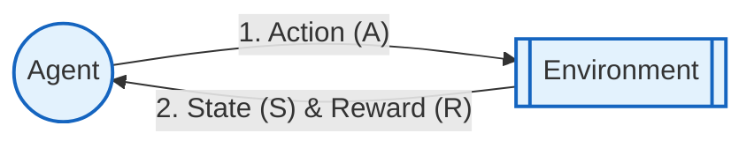

# Machine Learning for IT Application Development
## Study Notes: Modules 1, 2 & 3 - EXTRAS

---

## MODULE 1 EXTRAS: Advanced Concepts & ML Algorithms

### 1.1 AI vs. ML vs. DL
It is common to confuse Artificial Intelligence, Machine Learning, and Deep Learning. They are actually nested subsets of one another:

```
+---------------------------------------------------------------+
| ARTIFICIAL INTELLIGENCE (AI)                                  |
| Any technique that enables computers to mimic human behavior. |
| Includes rules, heuristics, and logic.                        |
|                                                               |
|   +-------------------------------------------------------+   |
|   | MACHINE LEARNING (ML)                                 |   |
|   | Subset of AI. Algorithms that learn patterns from     |   |
|   | data without being explicitly programmed.             |   |
|   |                                                       |   |
|   |   +-----------------------------------------------+   |   |
|   |   | DEEP LEARNING (DL)                            |   |   |
|   |   | Subset of ML. Uses multi-layered artificial   |   |   |
|   |   | neural networks (deep networks) to learn complex| |   |
|   |   | representations from raw data.                |   |   |
|   |   +-----------------------------------------------+   |   |
|   +-------------------------------------------------------+   |
+---------------------------------------------------------------+
```

*   **Artificial Intelligence (AI)**: The broadest term. It represents the goal of making machines intelligent. It includes early rule-based systems (e.g., Chess programs that check all possible moves using hardcoded rules) that do not "learn" from experience.
*   **Machine Learning (ML)**: A paradigm shift where instead of writing rules, we feed data and labels into an algorithm to let it *learn* the rules.
*   **Deep Learning (DL)**: A specialized subset of ML inspired by the structure of the human brain. It uses Artificial Neural Networks with many hidden layers. It eliminates the need for manual feature engineering (e.g., directly feeding raw image pixels instead of manually extracting edges).

---

### 1.2 Traditional Programming vs. Machine Learning
In **Traditional Programming**, humans write the rules (code) and provide input data. The computer runs the rules on the data to generate outputs.
In **Machine Learning**, humans provide input data and the corresponding outputs. The computer analyzes them to generate the rules (model).

```
Traditional Programming:
[ Data ]  +  [ Rules (Code) ]  ----->  [ Computer ]  ----->  [ Output ]

Machine Learning:
[ Data ]  +  [ Output (Labels) ]  ----->  [ Computer ]  ----->  [ Rules (Model) ]
```

---

### 1.3 Detailed Classification Types
Classification can be split into different paradigms based on the number and nature of labels:

| Paradigm | Description | Classes | Example |
| :--- | :--- | :---: | :--- |
| **Binary Classification** | Classifying samples into one of two possible outcomes. | 2 | Spam vs. Not Spam |
| **Multi-class Classification** | Classifying samples into one of three or more mutually exclusive classes. (Single label per sample). | $>2$ | Classifying an image as either Cat, Dog, or Bird. |
| **Multi-label Classification** | Assigning multiple non-exclusive labels to a single sample. | $>2$ | Tagging a movie as both [Action] and [Sci-Fi]. |
| **Imbalanced Classification** | Classification where class distribution is highly unequal. | $\ge 2$ | Fraud Detection ($99.9\%$ Legit, $0.1\%$ Fraud). |

---

### 1.4 Core Machine Learning Algorithms (Deep Dive)

#### A. Decision Trees
A flowchart-like structure where internal nodes represent tests on features, branches represent outcomes, and leaf nodes represent final decisions (classes or values).
*   **Splitting Criteria**: How the tree decides where to split:
    *   *Entropy*: A measure of impurity/disorder in a group:
        $$H(S) = -\sum_{i=1}^c p_i \log_2 p_i$$
    *   *Information Gain*: The reduction in entropy after a split:
        $$IG(S, A) = H(S) - \sum_{v \in Values(A)} \frac{|S_v|}{|S|} H(S_v)$$
    *   *Gini Impurity*: The probability of misclassifying a randomly chosen element from the set (used by CART algorithm):
        $$Gini = 1 - \sum_{i=1}^c p_i^2$$
*   **Pros**: Highly interpretable, requires minimal preprocessing (no scaling needed), handles categorical data.
*   **Cons**: Prone to overfitting (grows too deep), unstable (small changes in data change the tree structure completely).

#### B. Random Forest
An ensemble learning method that builds a "forest" of multiple Decision Trees and merges their predictions (voting for classification, averaging for regression) to get a more accurate and stable model.
*   **Bagging (Bootstrap Aggregating)**: Each tree is trained on a random bootstrap sample of the dataset (sampling with replacement).
*   **Feature Randomness**: At each split in a tree, only a random subset of features is considered, ensuring the trees are not highly correlated.
*   **Out-of-Bag (OOB) Error**: The error calculated on samples that were not selected in the bootstrap sample of a tree, acting as an internal validation check.

#### C. K-Nearest Neighbors (KNN)
An instance-based (or lazy) learning algorithm. It does not learn a model during training; instead, it stores the training data and classifies new points based on the majority class of their $K$ nearest neighbors.
*   **Distance Metrics**:
    *   *Euclidean Distance*: Straight-line distance:
        $$d(x, y) = \sqrt{\sum (x_i - y_i)^2}$$
    *   *Manhattan Distance*: City block distance:
        $$d(x, y) = \sum |x_i - y_i|$$
    *   *Minkowski Distance*: Generalization of Euclidean and Manhattan:
        $$d(x, y) = \left( \sum |x_i - y_i|^p \right)^{1/p}$$

#### D. Support Vector Machine (SVM)
Finds the optimal hyperplane in an $N$-dimensional space that maximizes the margin (distance) between two classes.
*   **Support Vectors**: Data points closest to the hyperplane that define its position and margin.
*   **Kernel Trick**: Projects non-linearly separable data into a higher-dimensional space where it becomes linearly separable (e.g., using Polynomial or RBF kernels).

#### E. Naive Bayes
A probabilistic classifier based on **Bayes' Theorem** with the "naive" assumption of conditional independence among features.
*   **Bayes' Theorem**:
    $$P(A|B) = \frac{P(B|A)P(A)}{P(B)}$$
*   **Naive Assumption**: Assumes that the presence of a particular feature in a class is completely unrelated to the presence of any other feature.

#### F. Gradient Boosting
An ensemble technique that builds trees sequentially. Each new tree corrects the errors (residuals) made by the previous trees:
$$\text{Model}_{\text{new}}(x) = \text{Model}_{\text{old}}(x) + \eta \cdot \text{Tree}_{\text{residual}}(x)$$
*(where $\eta$ is the learning rate)*
*   *Examples*: XGBoost, LightGBM, CatBoost.

---

### 1.5 Reinforcement Learning Components & Cycle
Reinforcement learning relies on an interaction loop between an agent and its environment.

#### Core Components:
*   **Agent**: The AI decision-maker we are training.
*   **Environment**: The world in which the agent operates (e.g., a maze, a game screen).
*   **State ($S$)**: The current situation/position of the agent in the environment.
*   **Action ($A$)**: The choices available to the agent in a given state.
*   **Reward ($R$)**: The feedback (positive or negative) returned by the environment after an action.
*   **Policy ($\pi$)**: The strategy or mapping that the agent uses to decide the next action based on the current state.
*   **Value Function ($V$)**: The estimated total long-term reward the agent can expect to gather starting from a state.

#### Interaction Cycle:


---

### 1.6 Modern Machine Learning Paradigms
1.  **Transfer Learning**: Taking a model trained on a large dataset (e.g., ImageNet) and repurposing it for a new, related task. This saves huge amounts of training time and requires much less data.
2.  **Few-shot & Zero-shot Learning**:
    *   *Few-shot*: Training a model to recognize new classes using only a handful of examples (e.g., 2 or 3 images).
    *   *Zero-shot*: Testing a model on classes it has never seen during training, relying on auxiliary information like text descriptions to make classifications (e.g., CLIP model).
3.  **Continual Learning (Lifelong Learning)**: Training a model continuously on a stream of new data over time without forgetting previously learned tasks (avoiding the problem of *catastrophic forgetting*).
4.  **Multi-modal Learning**: Training models that can process and combine different modalities of inputs simultaneously, such as text, images, video, and audio (e.g., modern GPT models, Gemini).

---

### 1.7 Bias-Variance Tradeoff: Math & Under-overfitting
The total expected test error of any machine learning model can be mathematically decomposed into three components:
$$\text{Total Expected Error} = \text{Bias}^2 + \text{Variance} + \sigma^2$$
Where:
*   **$\text{Bias}^2$**: Error due to incorrect assumptions in the algorithm. High bias models are too simple and underfit (e.g., fitting a linear model to quadratic data).
*   **$\text{Variance}$**: Error due to the model's sensitivity to small fluctuations in the training set. High variance models are overly complex and overfit (e.g., a high-degree polynomial).
*   **$\sigma^2$ (Irreducible Error)**: Noise inherent in the data itself. It cannot be reduced by any model.

```
Error / Loss
  ^
  |      \                 /  <-- Total Expected Error
  |       \   .-------.   /
  |        \ /         \ / 
  |---------*-----------*-------------------> Model Complexity
  |        /             \    <-- Bias^2 (Decreases with complexity)
  |       /               \
  |      /                 \  <-- Variance (Increases with complexity)
  +-----------------------------------------
         [Underfitting]   [Overfitting]
         (High Bias)      (High Variance)
```

#### Methods to Reduce Overfitting:
1.  **Regularization**: Adding penalties (L1/L2) to keep weights small.
2.  **Cross-Validation**: Using K-Fold verification to ensure generalization.
3.  **Early Stopping**: Stopping training as soon as validation loss begins to rise.
4.  **Data Augmentation**: Generating synthetic training samples (e.g., rotating or scaling images).
5.  **Dropout**: Randomly disabling neurons during training in deep networks.
6.  **Pruning**: Cutting off weak branches in Decision Trees.

---

### 1.8 Research Challenges in ML
*   **Explainable AI (XAI)**: Demystifying "black box" models (like deep neural networks) to understand *why* they make specific decisions.
*   **Concept Drift**: Occurs when the statistical properties of the target variable change over time, rendering older models inaccurate (e.g., user purchasing trends changing post-pandemic).
*   **Adversarial Robustness**: Protecting models against adversarial attacks—subtle, engineered perturbations to input data designed to trick the model (e.g., adding imperceptible noise to stop signs so self-driving cars misidentify them).
*   **Ethics and Bias Propagation**: Preventing models from learning and amplifying societal biases present in historical training data.

---

## MODULE 2 EXTRAS: Advanced Data Preprocessing & Dimensionality Reduction

### 2.1 Detailed Preprocessing Objectives & Algorithmic Sensitivity
Preprocessing steps are not universally required; different algorithms have varying levels of sensitivity:
*   **Distance-Based Models (KNN, SVM, K-Means)**: Extremely sensitive to scale. Scaling is mandatory.
*   **Gradient Descent Models (Linear/Logistic Regression, Neural Networks)**: Scaling is highly recommended. It shapes the loss surface symmetrically, allowing gradient descent to converge much faster.
*   **Tree-Based Models (Decision Trees, Random Forests, Gradient Boosting)**: Scale-invariant. They split nodes based on ordering, not absolute distances. Scaling has zero impact on their performance.

---

### 2.2 Singular Value Decomposition (SVD)
SVD is a linear algebra theorem stating that any real matrix $A$ of size $m \times n$ can be factored into three matrices:
$$A = U \Sigma V^T$$
Where:
*   $U$: An $m \times m$ orthogonal matrix (Left singular vectors, representing row relationships).
*   $\Sigma$: An $m \times n$ diagonal matrix containing singular values sorted in descending order (representing the strength/importance of each component).
*   $V^T$: An $n \times n$ transpose orthogonal matrix (Right singular vectors, representing column relationships).

#### Python Walkthrough: Image Compression using SVD
Images can be treated as matrices of pixel values. By keeping only the top $k$ singular values from $\Sigma$, we can compress the image while retaining most of its structural information.

```python
import numpy as np
import matplotlib.pyplot as plt
from PIL import Image

# 1. Load image and convert to grayscale (matrix format)
img = Image.open('sample.jpg').convert('L')
A = np.array(img)

# 2. Perform Singular Value Decomposition
U, S, Vt = np.linalg.svd(A, full_matrices=False)

# 3. Reconstruct image using top k singular values
k = 30 # Keep only top 30 singular components
Sigma_k = np.diag(S[:k])
U_k = U[:, :k]
Vt_k = Vt[:k, :]

A_compressed = np.dot(U_k, np.dot(Sigma_k, Vt_k))

# 4. Display comparison
plt.subplot(1, 2, 1)
plt.title("Original Image")
plt.imshow(A, cmap='gray')

plt.subplot(1, 2, 2)
plt.title(f"Compressed (k={k})")
plt.imshow(A_compressed, cmap='gray')
plt.show()
```

---

### 2.3 Backward Elimination Walkthrough
Backward Elimination is a step-by-step feature selection technique based on statistical significance.

#### Algorithm Steps:
1.  Select a significance level (e.g., $\alpha = 0.05$).
2.  Fit the model with all available features using Ordinary Least Squares (OLS) regression.
3.  Analyze the p-value of each predictor coefficient.
4.  If the highest p-value is greater than $\alpha$ ($p > \alpha$), remove that feature.
5.  Refit the model with the remaining features and return to Step 3.
6.  Stop when all remaining features have a p-value less than or equal to $\alpha$ ($p \le \alpha$).

##### Python Implementation using `statsmodels`:
```python
import numpy as np
import pandas as pd
import statsmodels.api as sm

# Create dummy data
np.random.seed(42)
X = np.random.rand(100, 4)
# Target y is dependent only on features 0 and 1
y = 3 * X[:, 0] + 5 * X[:, 1] + np.random.normal(0, 0.1, 100)

# Add constant column (intercept) required by statsmodels
X_df = pd.DataFrame(X, columns=['F0', 'F1', 'F2', 'F3'])
X_with_const = sm.add_constant(X_df)

# Backward Elimination Loop
cols = list(X_with_const.columns)
pmax = 1
alpha = 0.05

while len(cols) > 0:
    p_values = []
    model = sm.OLS(y, X_with_const[cols]).fit()
    p_values = model.pvalues
    pmax = max(p_values)
    feature_with_pmax = p_values.idxmax()
    
    if pmax > alpha:
        cols.remove(feature_with_pmax)
        print(f"Removed {feature_with_pmax} (p-value: {pmax:.4f})")
    else:
        break

print("\nFinal Selected Features:", cols)
```

---

## MODULE 3 EXTRAS: Advanced Regression, Fuzzy Clustering & Math Derivations

### 3.1 Polynomial & Elastic Net Regression

#### Polynomial Regression
Models non-linear relationships by raising independent variables to powers (e.g., $y = \beta_0 + \beta_1 x + \beta_2 x^2$). It is implemented by transforming features and then fitting standard linear regression.

```python
from sklearn.preprocessing import PolynomialFeatures
from sklearn.linear_model import LinearRegression
import numpy as np

X = np.array([[1], [2], [3], [4]])
y = np.array([2.1, 3.9, 9.2, 16.1]) # Quadratic relation

# Transform X to include x^2
poly = PolynomialFeatures(degree=2)
X_poly = poly.fit_transform(X)

# Fit linear model on transformed features
model = LinearRegression()
model.fit(X_poly, y)
print("Coefficients (bias, x, x^2):", model.coef_)
```

#### Elastic Net Regression
A regularized regression method that combines both L1 (Lasso) and L2 (Ridge) penalties:
$$\text{Loss} + \lambda_1 \sum_{j=1}^p |\beta_j| + \lambda_2 \sum_{j=1}^p \beta_j^2$$
This is useful when there are multiple correlated features. Lasso tends to select just one arbitrarily, while Ridge keeps all of them; Elastic Net balances both behaviors.

```python
from sklearn.linear_model import ElasticNet
model = ElasticNet(alpha=0.1, l1_ratio=0.5) # l1_ratio=0.5 means equal L1 and L2 weight
model.fit(X, y)
```

---

### 3.2 Fuzzy C-Means (FCM) Clustering
Unlike K-Means (which does hard clustering), Fuzzy C-Means allows data points to belong to multiple clusters with varying degrees of membership between $0$ and $1$.

#### Objective Function:
Minimize:
$$J_m = \sum_{i=1}^N \sum_{j=1}^C u_{ij}^m \|x_i - c_j\|^2$$
Where:
*   $u_{ij}$ is the membership degree of point $x_i$ to cluster center $c_j$.
*   $m$ is the fuzzifier exponent ($m > 1$; typically $m = 2$). Higher $m$ leads to fuzzier clusters.
*   $c_j$ is the centroid of cluster $j$:
    $$c_j = \frac{\sum_{i=1}^N u_{ij}^m x_i}{\sum_{i=1}^N u_{ij}^m}$$

#### Membership Update Rule:
$$u_{ij} = \frac{1}{\sum_{k=1}^C \left( \frac{\|x_i - c_j\|}{\|x_i - c_k\|} \right)^{\frac{2}{m-1}}}$$

#### Comparison:
| Feature | K-Means | Fuzzy C-Means |
| :--- | :--- | :--- |
| **Membership** | Hard (either $0$ or $1$) | Soft (degree between $[0, 1]$) |
| **Constraint** | Point belongs to 1 cluster | Sum of memberships for a point across all clusters = 1 |
| **Sensitivity** | Highly sensitive to outliers | Less sensitive because outliers get low membership weights |

##### Python Implementation:
```python
# To run this code, you need: pip install scikit-fuzzy
import numpy as np
import skfuzzy as fuzz

# Generate dummy data (2 features, 100 points)
data = np.random.rand(2, 100)

# Apply Fuzzy C-Means (C=3 clusters)
cntr, u, u0, d, jm, p, fpc = fuzz.cmeans(
    data, c=3, m=2, error=0.005, maxiter=1000, init=None
)

# cntr stores centroids coordinates (3, 2)
# u stores membership matrix (3, 100)
print("Membership of first point in all 3 clusters:", u[:, 0])
```

---

### 3.3 Mathematical Derivations (Crucial for Exams)

#### A. Derivation of the Derivative of the Sigmoid Function
The Sigmoid function is defined as:
$$\sigma(z) = \frac{1}{1 + e^{-z}} = (1 + e^{-z})^{-1}$$

We find its derivative with respect to $z$ using the power rule and chain rule:
$$\frac{d}{dz} \sigma(z) = -1 \cdot (1 + e^{-z})^{-2} \cdot \frac{d}{dz}(1 + e^{-z})$$
$$\frac{d}{dz} \sigma(z) = -(1 + e^{-z})^{-2} \cdot (-e^{-z})$$
$$\frac{d}{dz} \sigma(z) = \frac{e^{-z}}{(1 + e^{-z})^2}$$

Now, rewrite the numerator to express the result in terms of $\sigma(z)$:
$$\frac{d}{dz} \sigma(z) = \frac{1}{1 + e^{-z}} \cdot \frac{e^{-z}}{1 + e^{-z}}$$
$$\frac{d}{dz} \sigma(z) = \sigma(z) \cdot \left( \frac{1 + e^{-z} - 1}{1 + e^{-z}} \right)$$
$$\frac{d}{dz} \sigma(z) = \sigma(z) \cdot \left( \frac{1 + e^{-z}}{1 + e^{-z}} - \frac{1}{1 + e^{-z}} \right)$$
$$\frac{d}{dz} \sigma(z) = \sigma(z) \cdot (1 - \sigma(z))$$

$$\text{Result: } \frac{d}{dz}\sigma(z) = \sigma(z)(1 - \sigma(z))$$

---

#### B. Derivation of the Gradient of Logistic Regression (Log Loss)
For a single training sample, let:
*   $z = w^T x + b$ (linear combinations)
*   $a = \sigma(z)$ (activation prediction)
*   $L = -[y \ln(a) + (1-y)\ln(1-a)]$ (Binary Cross-Entropy Loss)

We wish to find the gradient of the loss with respect to weight $w_j$ using the chain rule:
$$\frac{\partial L}{\partial w_j} = \frac{\partial L}{\partial a} \cdot \frac{\partial a}{\partial z} \cdot \frac{\partial z}{\partial w_j}$$

Let's compute each partial derivative individually:

1.  **Compute $\frac{\partial L}{\partial a}$**:
    $$\frac{\partial L}{\partial a} = -\left[ \frac{y}{a} - \frac{1-y}{1-a} \right] = -\left[ \frac{y(1-a) - a(1-y)}{a(1-a)} \right]$$
    $$\frac{\partial L}{\partial a} = -\left[ \frac{y - ya - a + ya}{a(1-a)} \right] = -\left[ \frac{y - a}{a(1-a)} \right] = \frac{a - y}{a(1-a)}$$

2.  **Compute $\frac{\partial a}{\partial z}$**:
    Since $a = \sigma(z)$, from our previous derivation:
    $$\frac{\partial a}{\partial z} = a(1-a)$$

3.  **Compute $\frac{\partial z}{\partial w_j}$**:
    Since $z = w_0 + w_1 x_1 + \dots + w_j x_j + \dots$:
    $$\frac{\partial z}{\partial w_j} = x_j$$

Now, multiply all three components together:
$$\frac{\partial L}{\partial w_j} = \left( \frac{a - y}{a(1-a)} \right) \cdot \Big( a(1-a) \Big) \cdot x_j$$
$$\frac{\partial L}{\partial w_j} = (a - y)x_j$$

Substituting $a = \hat{y}$:
$$\frac{\partial L}{\partial w_j} = (\hat{y} - y)x_j$$

In vector notation for $m$ samples, the average gradient of the cost function $J(w)$ is:
$$\nabla_w J(w) = \frac{1}{m} X^T (\hat{Y} - Y)$$

---

### 3.4 Solved Regression Problem: Multiple Linear Regression (OLS Matrix Method)
**Problem**: Calculate the regression parameters $\beta = [\beta_0, \beta_1, \beta_2]^T$ for the model $y = \beta_0 + \beta_1 x_1 + \beta_2 x_2$ using the Ordinary Least Squares (OLS) matrix equations for the following dataset:

| Sample | $x_1$ | $x_2$ | $y$ |
| :---: | :---: | :---: | :---: |
| 1 | 1 | 1 | 4 |
| 2 | 2 | 1 | 6 |
| 3 | 1 | 2 | 5 |

**Solution**:
1.  **Set up the matrices**:
    Add a column of ones to $X$ to represent the intercept term $\beta_0$:
    $$X = \begin{bmatrix} 1 & 1 & 1 \\ 1 & 2 & 1 \\ 1 & 1 & 2 \end{bmatrix}, \quad Y = \begin{bmatrix} 4 \\ 6 \\ 5 \end{bmatrix}$$

2.  **Calculate $X^T X$**:
    $$X^T X = \begin{bmatrix} 1 & 1 & 1 \\ 1 & 2 & 1 \\ 1 & 1 & 2 \end{bmatrix} \begin{bmatrix} 1 & 1 & 1 \\ 1 & 2 & 1 \\ 1 & 1 & 2 \end{bmatrix} = \begin{bmatrix} 3 & 4 & 4 \\ 4 & 6 & 5 \\ 4 & 5 & 6 \end{bmatrix}$$

3.  **Compute the Inverse of $X^T X$**:
    *   **Find the Determinant**:
        $$\det(X^T X) = 3(6\cdot6 - 5\cdot5) - 4(4\cdot6 - 5\cdot4) + 4(4\cdot5 - 6\cdot4)$$
        $$\det(X^T X) = 3(36 - 25) - 4(24 - 20) + 4(20 - 24)$$
        $$\det(X^T X) = 3(11) - 4(4) + 4(-4) = 33 - 16 - 16 = 1$$
    *   **Calculate Cofactors**:
        $$C_{11} = +(36-25)=11, \quad C_{12} = -(24-20)=-4, \quad C_{13} = +(20-24)=-4$$
        $$C_{21} = -(24-20)=-4, \quad C_{22} = +(18-16)=2, \quad C_{23} = -(15-16)=1$$
        $$C_{31} = +(20-24)=-4, \quad C_{32} = -(15-16)=1, \quad C_{33} = +(18-16)=2$$
    *   **Construct $(X^T X)^{-1}$**:
        Since the matrix is symmetric and the determinant is $1$:
        $$(X^T X)^{-1} = \text{adj}(X^T X) = \begin{bmatrix} 11 & -4 & -4 \\ -4 & 2 & 1 \\ -4 & 1 & 2 \end{bmatrix}$$

4.  **Calculate $X^T Y$**:
    $$X^T Y = \begin{bmatrix} 1 & 1 & 1 \\ 1 & 2 & 1 \\ 1 & 1 & 2 \end{bmatrix} \begin{bmatrix} 4 \\ 6 \\ 5 \end{bmatrix} = \begin{bmatrix} 4+6+5 \\ 4+12+5 \\ 4+6+10 \end{bmatrix} = \begin{bmatrix} 15 \\ 21 \\ 20 \end{bmatrix}$$

5.  **Compute Parameters $\beta = (X^T X)^{-1} X^T Y$**:
    $$\beta = \begin{bmatrix} 11 & -4 & -4 \\ -4 & 2 & 1 \\ -4 & 1 & 2 \end{bmatrix} \begin{bmatrix} 15 \\ 21 \\ 20 \end{bmatrix} = \begin{bmatrix} 11(15) - 4(21) - 4(20) \\ -4(15) + 2(21) + 1(20) \\ -4(15) + 1(21) + 2(20) \end{bmatrix}$$
    $$\beta = \begin{bmatrix} 165 - 84 - 80 \\ -60 + 42 + 20 \\ -60 + 21 + 40 \end{bmatrix} = \begin{bmatrix} 1 \\ 2 \\ 1 \end{bmatrix}$$

*Answer*: The OLS parameters are **$\beta_0 = 1$**, **$\beta_1 = 2$**, and **$\beta_2 = 1$**. The resulting regression equation is:
$$y = 1 + 2 x_1 + x_2$$

---

### 3.5 Ridge vs. LASSO: Direct Comparison

| Feature | LASSO Regression (L1) | Ridge Regression (L2) |
| :--- | :--- | :--- |
| **Penalty Term** | Absolute value: $\lambda \sum |\beta_j|$ | Squared value: $\lambda \sum \beta_j^2$ |
| **Feature Selection** | Yes (forces coefficients to exactly $0$) | No (keeps all features, shrinks values close to $0$) |
| **Solution Type** | No closed-form solution (numerical optimization) | Closed-form solution exists: $\beta = (X^Tx + \lambda I)^{-1}X^Ty$ |
| **Geometry** | diamond-shaped constraint boundaries (vertices hit axes) | circular constraint boundaries (no sharp vertices) |
| **Best Used For** | Sparse models with few highly predictive features | Dense models with many moderately predictive features |
| **Correlated Features** | Selects one feature randomly, drops others | Keeps all correlated features, dividing credit among them |
