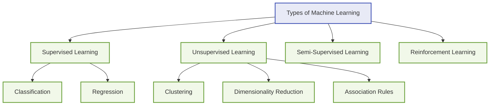
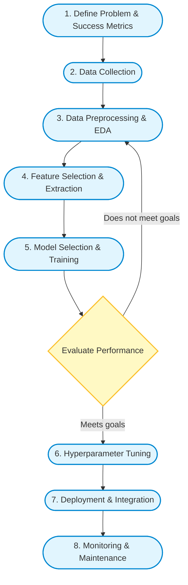
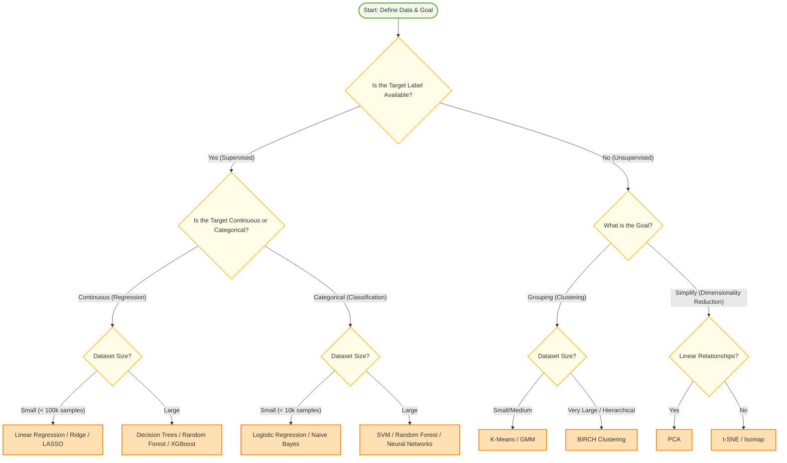
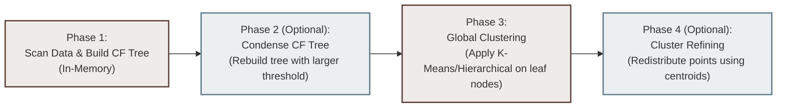

# Machine Learning for IT Application Development
## Study Notes: Modules 1, 2 & 3 (ISE 1)

---

## MODULE 1: Introduction to Machine Learning

### 1.1 Machine Learning Terminology
To understand Machine Learning (ML), we must first learn its basic vocabulary. Here are the key terms defined in simple language:
*   **Dataset**: The collection of data used to train and test the model. It is usually structured as a table of rows and columns.
*   **Instance / Sample / Observation**: A single row in a dataset, representing one individual data point (e.g., one customer, one patient, or one house).
*   **Feature (Independent Variable / Input)**: An individual measurable property or characteristic of a sample. These are the columns used to make predictions (e.g., size of a house, age of a person).
*   **Label / Target (Dependent Variable / Output)**: The column that the model is trying to predict. In a housing dataset, this would be the "price". In a medical dataset, it could be "has disease (Yes/No)".
*   **Model**: The mathematical representation of a real-world process, created by running a machine learning algorithm over training data. The model accepts features as input and outputs predictions.
*   **Training Set**: The subset of the dataset used to train (teach) the model.
*   **Test Set**: The subset of the dataset used to evaluate the model's performance on unseen data.
*   **Validation Set**: A separate subset of data used during training to tune hyperparameters (settings of the model) and prevent overfitting.
*   **Overfitting**: A situation where a model learns the training data *too well*—including its noise and random details—making it perform poorly on new, unseen data. (High variance, low bias).
*   **Underfitting**: A situation where a model is too simple to learn the underlying patterns in the training data, leading to poor performance on both training and test data. (Low variance, high bias).
*   **Bias-Variance Tradeoff**: 
    *   **Bias** is the error introduced by simplifying assumptions made by the model (high bias $\rightarrow$ underfitting).
    *   **Variance** is the model's sensitivity to small fluctuations in the training dataset (high variance $\rightarrow$ overfitting).
    *   We aim to find a balance that minimizes total error.

---

### 1.2 Types of Machine Learning
Machine learning algorithms are generally grouped into four main types based on how they learn:



#### A. Supervised Learning
The model is trained on **labeled data**, meaning we give the algorithm both the input features and the correct answers (labels). The goal is to learn a mapping rule from inputs to outputs.
*   **Classification**: The target variable is categorical (discrete classes).
    *   *Examples*: Spam vs. Not Spam, identifying whether an image contains a cat or a dog.
*   **Regression**: The target variable is continuous (numerical values).
    *   *Examples*: Predicting stock prices, predicting tomorrow's temperature.

#### B. Unsupervised Learning
The model is trained on **unlabeled data**. The algorithm must find hidden patterns, structures, or relationships in the data on its own.
*   **Clustering**: Grouping similar data points together.
    *   *Example*: Customer segmentation for marketing.
*   **Dimensionality Reduction**: Simplifying data by reducing the number of features while keeping the most important information.
    *   *Example*: Principal Component Analysis (PCA).
*   **Association Rule Mining**: Finding relationships between variables in large databases.
    *   *Example*: Market Basket Analysis (e.g., discovering that customers who buy bread also buy butter).

#### C. Semi-Supervised Learning
Uses a small amount of labeled data combined with a large amount of unlabeled data. This is useful because labeling data manually is expensive and time-consuming, but obtaining raw unlabeled data is easy.
*   *Example*: Photo apps that group faces together (unsupervised) and ask you to label one face with a name (supervised), automatically naming the rest of the group.

#### D. Reinforcement Learning
The model (called an **agent**) learns how to behave in an **environment** by performing **actions** and receiving feedback in the form of **rewards** (for good actions) or **penalties** (for bad actions). The goal is to maximize the cumulative reward over time.
*   *Example*: Training an AI to play video games or navigate a self-driving car.

---

### 1.3 Issues in Machine Learning
Building ML applications involves solving several common problems:
1.  **Insufficient Quantity of Training Data**: Deep learning and complex ML models require thousands or millions of examples to perform well.
2.  **Non-Representative Training Data**: If the training data does not accurately represent the real-world scenarios the model will encounter, the model's predictions will be biased (known as *sampling bias*).
3.  **Poor Data Quality**: Data full of errors, outliers, noise, and missing values makes it hard for the model to detect true patterns.
4.  **Irrelevant Features (Garbage In, Garbage Out)**: Including columns that have nothing to do with the target makes training slower and leads to worse predictions.
5.  **Overfitting**: The model fits the training data too tightly and fails to generalize to new data.
6.  **Underfitting**: The model is too simple (like using a straight line to fit a curved pattern) and fails to capture the true trend.

---

### 1.4 Applications of Machine Learning
ML has become essential across many fields:
*   **Healthcare**: Predicting disease onset, reading medical scans (X-Rays, MRIs) to identify tumors, and discovering new drugs.
*   **Finance**: Detecting credit card fraud, automated stock trading, and assessing credit risk for bank loans.
*   **E-Commerce**: Recommendation engines (like Amazon or Netflix), dynamic pricing systems, and predicting customer churn.
*   **Natural Language Processing (NLP)**: Virtual assistants (Siri, Alexa), machine translation (Google Translate), sentiment analysis, and email spam filters.
*   **Computer Vision**: Autonomous vehicles (self-driving cars), facial recognition security, and manufacturing defect inspection.

---

### 1.5 Steps in Developing a Machine Learning Application
Developing an ML application is an iterative lifecycle:



1.  **Define the Problem**: Understand what you want to predict and how you will measure success (e.g., Accuracy, Revenue).
2.  **Data Collection**: Gather relevant data from databases, APIs, sensors, or web scraping.
3.  **Data Preprocessing & Exploratory Data Analysis (EDA)**: Clean the data, handle missing values, visualize distributions, and check for anomalies.
4.  **Feature Engineering**: Clean and transform columns, select the best inputs, and extract new columns to help the model learn better.
5.  **Model Selection & Training**: Choose candidate algorithms (e.g., Logistic Regression, Random Forest) and train them on the training data.
6.  **Model Evaluation**: Test the model's accuracy on unseen test data to see if it generalizes well.
7.  **Hyperparameter Tuning**: Optimize the settings of the selected model to get the best possible performance.
8.  **Deployment & Monitoring**: Release the model to a production environment (like a web API) and continuously monitor it to ensure its predictions stay accurate over time.

---

### 1.6 How to Choose the Right Algorithm
Choosing the right algorithm depends on several factors: the size and type of data, the goal of the application, and requirements around speed and interpretability.



---

### 1.7 Hypothesis Testing
**Hypothesis Testing** is a statistical tool used to make decisions and test assumptions about populations using sample data. In ML, it is commonly used to compare different models' performances to check if a model's improvement is statistically significant or just a result of random luck.

*   **Null Hypothesis ($H_0$)**: The baseline assumption that there is no real change, no effect, or no difference between groups. 
    *   *Example*: "Model A and Model B have the exact same prediction accuracy."
*   **Alternative Hypothesis ($H_1$ or $H_a$)**: The claim we want to prove. It states that there is a real difference or effect.
    *   *Example*: "Model B is significantly more accurate than Model A."
*   **Significance Level ($\alpha$)**: The probability threshold for rejecting the null hypothesis when it is actually true (usually set at $0.05$ or $5\%$). It represents the maximum risk we are willing to take of making a false positive mistake (Type I error).
*   **p-value (Probability Value)**: The probability of observing our sample data (or something more extreme) assuming that the null hypothesis is true.
    *   If $p\text{-value} \le \alpha$: We **reject $H_0$** (the result is statistically significant).
    *   If $p\text{-value} > \alpha$: We **fail to reject $H_0$** (we do not have enough evidence to support the change).

#### Error Types in Hypothesis Testing:
*   **Type I Error (False Positive)**: Rejecting the Null Hypothesis ($H_0$) when it is actually true. (Finding an effect when none exists).
*   **Type II Error (False Negative)**: Failing to reject the Null Hypothesis ($H_0$) when it is actually false. (Missing a real effect).

---

### 1.8 Types of Hypothesis Testing
Hypothesis tests are broadly split into parametric and non-parametric tests:

#### A. Parametric Tests
These tests make assumptions about the underlying distribution of the data (usually that the data follows a normal distribution) and require continuous numerical data.
1.  **Z-Test**: Compares a sample mean to a known population mean. Used when the population variance is known and the sample size is large ($n \ge 30$).
2.  **T-Test**: Compares means when the population variance is unknown and the sample size is small ($n < 30$).
    *   *One-Sample T-Test*: Compares the mean of a single sample group against a known population mean.
    *   *Two-Sample (Independent) T-Test*: Compares the means of two independent groups (e.g., testing if Group A's average test score is different from Group B's).
    *   *Paired T-Test*: Compares the means of the same group at two different times (e.g., testing students' scores before and after a training program).
3.  **ANOVA (Analysis of Variance)**: Extends the t-test to compare the means of three or more independent groups to see if at least one group mean is different.

#### B. Non-Parametric Tests
These tests do not assume a normal distribution and can be used on ordinal (ranked) or nominal (categorical) data.
1.  **Chi-Square ($\chi^2$) Test**:
    *   *Goodness-of-Fit Test*: Checks if an observed sample distribution matches an expected distribution.
    *   *Test of Independence*: Checks if two categorical variables are independent of each other (e.g., checking if gender is related to product preference).
2.  **Mann-Whitney U Test**: A non-parametric alternative to the independent two-sample t-test. It compares the distributions of two independent groups based on ranks instead of means.
3.  **Wilcoxon Signed-Rank Test**: A non-parametric alternative to the paired t-test. It compares the differences between paired observations.

---

## MODULE 2: Data Handling Techniques

### 2.1 Data Preprocessing Techniques

#### A. Missing Value Handling
Missing data is a common issue caused by survey non-responses, system failures, or data corruption.
*   **Deletion**: Removing rows or columns containing missing values.
    *   *Listwise Deletion*: Drop the entire row if *any* value is missing. (Best when missing data is minimal).
    *   *Pairwise Deletion*: Keep rows but ignore the missing fields during specific statistical calculations.
*   **Imputation**: Filling in missing values with estimated values.
    *   *Statistical Imputation*: Replace missing numbers with the column's mean, median, or mode.
    *   *KNN Imputation*: Find the $k$ most similar rows (nearest neighbors) and use their average value to fill in the missing cell.
    *   *Iterative Imputer (MICE)*: Models each feature with missing values as a function of other features in a round-robin fashion.

##### Python Code Example:
```python
import numpy as np
import pandas as pd
from sklearn.impute import SimpleImputer, KNNImputer

# Create a sample dataset with missing values (NaN)
data = {'Age': [25, np.nan, 30, 35, 40],
        'Salary': [50000, 60000, np.nan, 80000, 95000]}
df = pd.DataFrame(data)

# Method 1: Drop missing rows
df_dropped = df.dropna()

# Method 2: Mean Imputation using pandas
df_mean = df.fillna(df.mean())

# Method 3: Median Imputation using scikit-learn
imputer = SimpleImputer(strategy='median')
df_imputed = pd.DataFrame(imputer.fit_transform(df), columns=df.columns)

# Method 4: KNN Imputation
knn_imputer = KNNImputer(n_neighbors=2)
df_knn = pd.DataFrame(knn_imputer.fit_transform(df), columns=df.columns)

print("Original Data:\n", df)
print("\nKNN Imputed Data:\n", df_knn)
```

---

#### B. Outlier Treatment
An outlier is a data point that is significantly different from the rest of the dataset. Outliers can distort model training, especially for distance-based models (like KNN) and regression models.
*   **Detection**:
    *   **IQR Method**: Points lying outside the range $[Q1 - 1.5 \times \text{IQR}, Q3 + 1.5 \times \text{IQR}]$, where $\text{IQR} = Q3 - Q1$.
    *   **Z-Score Method**: Points with a Z-score greater than $+3$ or less than $-3$ (lying more than 3 standard deviations away from the mean).
*   **Treatment**:
    *   **Trimming**: Deleting the outlier rows.
    *   **Winsorization**: Capping the outliers at a specific percentile (e.g., setting values above the 99th percentile to the 99th percentile value, and values below the 1st percentile to the 1st percentile value).
    *   **Transformation**: Applying a log or square root transformation to reduce the variation in scale.

##### Python Code Example:
```python
import pandas as pd
import numpy as np

# Sample data with outliers
prices = pd.Series([100, 105, 95, 110, 1000, 90, 85, 5]) # 1000 and 5 are outliers

# IQR Method Detection
Q1 = prices.quantile(0.25)
Q3 = prices.quantile(0.75)
IQR = Q3 - Q1
lower_bound = Q1 - 1.5 * IQR
upper_bound = Q3 + 1.5 * IQR

# Filter out outliers (Trimming)
cleaned_prices = prices[(prices >= lower_bound) & (prices <= upper_bound)]

# Winsorization (Capping)
capped_prices = np.clip(prices, lower_bound, upper_bound)

print(f"Original: {prices.tolist()}")
print(f"Cleaned (Trimming): {cleaned_prices.tolist()}")
print(f"Capped (Winsorization): {capped_prices.tolist()}")
```

---

#### C. Scaling & Normalization
Features often have different units and scales (e.g., Age: 0–100, Salary: 20,000–200,000). Models that calculate distances (like KNN, SVM, K-Means) or use gradient descent will give too much weight to features with larger numbers. Scaling fixes this.
*   **Standardization (StandardScaler)**: Re-scales data to have a mean of 0 and a standard deviation of 1.
    $$z = \frac{x - \mu}{\sigma}$$
*   **Min-Max Scaling / Normalization (MinMaxScaler)**: Re-scales data to fit within a bounded range, usually $[0, 1]$.
    $$x_{\text{scaled}} = \frac{x - x_{\text{min}}}{x_{\text{max}} - x_{\text{min}}}$$
*   **Robust Scaling (RobustScaler)**: Re-scales data using the median and Interquartile Range (IQR). It is not affected by outliers.
    $$x_{\text{scaled}} = \frac{x - \text{median}}{\text{IQR}}$$

##### Python Code Example:
```python
from sklearn.preprocessing import StandardScaler, MinMaxScaler, RobustScaler
import pandas as pd

df = pd.DataFrame({'Feature': [10, 20, 15, 30, 1000]}) # 1000 is an outlier

# Standardization
scaler_std = StandardScaler()
df['Standardized'] = scaler_std.fit_transform(df[['Feature']])

# Min-Max Scaling
scaler_minmax = MinMaxScaler()
df['MinMax'] = scaler_minmax.fit_transform(df[['Feature']])

# Robust Scaling
scaler_robust = RobustScaler()
df['Robust'] = scaler_robust.fit_transform(df[['Feature']])

print(df)
```

---

#### D. Encoding Categorical Variables
Machine learning models only understand numbers, so text data must be converted into numerical values.
*   **One-Hot Encoding**: Used for **nominal** variables (where there is no natural order, e.g., Color: Red, Blue, Green). It creates a new binary column ($0$ or $1$) for each unique category.
    *   *Dummy Variable Trap*: When we create $N$ columns for $N$ classes, they are perfectly correlated (e.g., if Red=0 and Blue=0, then Green must be 1). This multicollinearity can break linear models. To fix this, we always drop one column, creating $N-1$ columns.
*   **Ordinal Encoding**: Used for **ordinal** variables (where order matters, e.g., Education: High School, Bachelor's, PhD). We assign sequential integers (0, 1, 2).
*   **Label Encoding**: Used to convert categorical target labels into numerical formats (e.g., Yes/No $\rightarrow$ 1/0).

##### Python Code Example:
```python
import pandas as pd
from sklearn.preprocessing import OneHotEncoder, OrdinalEncoder, LabelEncoder

df = pd.DataFrame({
    'Color': ['Red', 'Blue', 'Green', 'Red'],
    'Size': ['Medium', 'Small', 'Large', 'Medium'],
    'Target': ['Yes', 'No', 'No', 'Yes']
})

# 1. One-Hot Encoding (Dropping first to avoid dummy variable trap)
ohe = OneHotEncoder(drop='first', sparse_output=False)
color_encoded = ohe.fit_transform(df[['Color']])
color_df = pd.DataFrame(color_encoded, columns=ohe.get_feature_names_out(['Color']))

# 2. Ordinal Encoding
oe = OrdinalEncoder(categories=[['Small', 'Medium', 'Large']])
df['Size_Encoded'] = oe.fit_transform(df[['Size']])

# 3. Label Encoding for target
le = LabelEncoder()
df['Target_Encoded'] = le.fit_transform(df['Target'])

# Combine features
final_df = pd.concat([df.drop(columns=['Color', 'Size', 'Target']), color_df], axis=1)
print(final_df)
```

---

### 2.2 Feature Selection
Feature selection involves choosing a subset of the most relevant features to build a model, making the model faster, simpler, and less prone to overfitting.

#### A. Filter Methods
Filter methods rank features based on statistical properties independent of the ML model. They are fast and computationally cheap.
*   **Variance Thresholding**: Removes all features whose variance is below a set threshold. Features with near-zero variance contain the same value across almost all rows and provide no predictive power.
*   **Correlation Analysis**: Checks the relationship between features. If two features are highly correlated (e.g., $>0.90$), we drop one of them because they provide redundant information.

##### Python Code Example:
```python
import pandas as pd
from sklearn.feature_selection import VarianceThreshold

# Sample dataset
df = pd.DataFrame({
    'Constant': [1, 1, 1, 1, 1],       # Zero variance (should be dropped)
    'LowVar': [0.1, 0.1, 0.1, 0.1, 0.2], # Low variance (should be dropped)
    'HighVar': [10, 40, 20, 80, 50],
    'Target': [1, 0, 1, 0, 1]
})

X = df.drop(columns=['Target'])

# Variance Threshold Filter (Threshold = 0.05)
selector = VarianceThreshold(threshold=0.05)
X_filtered = selector.fit_transform(X)

# Get kept columns
kept_cols = X.columns[selector.get_support()]
print("Selected Columns:", list(kept_cols))
```

---

#### B. Wrapper Methods
Wrapper methods use a predictive model to evaluate combinations of features. They add or remove features iteratively and measure changes in model accuracy. They are highly accurate but computationally expensive.
*   **Recursive Feature Elimination (RFE)**: Fits a model (e.g., Decision Tree), ranks features by importance, drops the least important features, and repeats the process until the desired number of features is reached.
*   **Forward Selection**: Starts with zero features. In each step, it tests every single feature and permanently adds the one that improves model performance the most. This repeats until no significant improvement is observed.
*   **Backward Elimination**: Starts with all features and removes the least significant feature in each step until removing any more features hurts performance.

##### Python Code Example:
```python
from sklearn.feature_selection import RFE
from sklearn.linear_model import LogisticRegression
from sklearn.datasets import make_classification

# Generate synthetic dataset
X, y = make_classification(n_samples=100, n_features=6, n_informative=3, random_state=42)

# Use Logistic Regression as the estimator
estimator = LogisticRegression()

# Select top 3 features
selector = RFE(estimator, n_features_to_select=3, step=1)
selector.fit(X, y)

print("Feature Ranking:", selector.ranking_)
print("Selected Features Mask:", selector.support_)
```

---

#### C. Embedded Methods
Embedded methods perform feature selection internally during model training.
*   **LASSO Regression (L1 Regularization)**: Adds a penalty equal to the absolute value of the coefficients. It shrinks less important feature coefficients to exactly zero, naturally selecting features.
*   **Ridge Regression (L2 Regularization)**: Adds a penalty equal to the square of the coefficients. It shrinks feature coefficients close to zero but keeps all features.

##### Python Code Example:
```python
from sklearn.linear_model import Lasso
import numpy as np

# Sample data
X = np.array([[1, 20], [2, 21], [3, 19], [4, 80]]) # Col 2 has an outlier/noise
y = np.array([2, 4, 6, 8]) # Target is exactly 2 * Col 1

# Apply LASSO (L1 Regularization)
lasso = Lasso(alpha=0.1)
lasso.fit(X, y)

print("Lasso Coefficients:", lasso.coef_) # Second feature coefficient should be 0
```

---

### 2.3 Feature Extraction Methods
While Feature Selection keeps a subset of the original features, **Feature Extraction** projects the original feature space into a brand new, lower-dimensional space.

*   **Principal Component Analysis (PCA)**: An **unsupervised** method. It finds new, orthogonal axes (called Principal Components) that capture the maximum variance in the data, ignoring labels.
*   **Linear Discriminant Analysis (LDA)**: A **supervised** method. It projects data onto new axes that maximize the distance between different classes while minimizing the spread within each class.

##### Python Code Example:
```python
from sklearn.decomposition import PCA
from sklearn.discriminant_analysis import LinearDiscriminantAnalysis as LDA
from sklearn.datasets import load_iris

# Load sample classification dataset (Iris)
data = load_iris()
X, y = data.data, data.target

# PCA: Unsupervised
pca = PCA(n_components=2)
X_pca = pca.fit_transform(X)

# LDA: Supervised (requires target labels y)
lda = LDA(n_components=2)
X_lda = lda.fit(X, y)

print(f"Original Shape: {X.shape}")
print(f"PCA Reduced Shape: {X_pca.shape}")
print(f"LDA Reduced Shape: {X_lda.shape}")
```

---

### 2.4 Imbalanced Dataset Handling Techniques
Class imbalance occurs when one class (e.g., Fraud = 1) is extremely rare compared to the other class (e.g., Legit = 0). Standard classifiers will simply predict the majority class for every row to achieve high accuracy, making the model useless.

#### Strategies:
1.  **Oversampling (SMOTE)**: Synthetic Minority Over-sampling Technique. Instead of duplicating rows, SMOTE looks at the minority class samples, finds their nearest neighbors, and draws lines between them to create brand new, synthetic data points.
2.  **Undersampling**: Randomly deleting rows from the majority class to balance the dataset (can cause loss of valuable information).
3.  **Class Weights**: Adjusting the loss function of the algorithm to penalize errors on the minority class much more heavily than on the majority class.

##### Python Code Example:
```python
# To run this code, you need: pip install imbalanced-learn
from imblearn.over_sampling import SMOTE
from sklearn.datasets import make_classification
from collections import Counter

# Create an imbalanced dataset (90% class 0, 10% class 1)
X, y = make_classification(n_samples=1000, n_classes=2, weights=[0.9, 0.1], random_state=42)
print("Before SMOTE:", Counter(y))

# Apply SMOTE
smote = SMOTE(random_state=42)
X_res, y_res = smote.fit_resample(X, y)
print("After SMOTE:", Counter(y_res))
```

---

## MODULE 3: Regression Techniques and Advanced Clustering

### 3.1 Linear Regression
Linear Regression assumes a linear relationship between the input features and the output target.

#### Simple Linear Regression
Has one input variable $x$ and one output variable $y$:
$$y = \beta_0 + \beta_1 x + \epsilon$$
Where:
*   $\beta_0$ is the y-intercept (the value of $y$ when $x=0$).
*   $\beta_1$ is the slope (the change in $y$ for a one-unit change in $x$).
*   $\epsilon$ is the random error term.

The coefficients are computed using the **Ordinary Least Squares (OLS)** method, which minimizes the sum of squared differences between actual and predicted values:
$$\beta_1 = \frac{\sum_{i=1}^n (x_i - \bar{x})(y_i - \bar{y})}{\sum_{i=1}^n (x_i - \bar{x})^2}$$
$$\beta_0 = \bar{y} - \beta_1 \bar{x}$$

#### Multiple Linear Regression
Has multiple input variables:
$$y = \beta_0 + \beta_1 x_1 + \beta_2 x_2 + \dots + \beta_p x_p + \epsilon$$

#### Critical Assumptions of Linear Regression:
1.  **Linearity**: The relationship between inputs and outputs must be linear.
2.  **Independence**: Residuals (errors) must be independent of each other (no autocorrelation).
3.  **Homoscedasticity**: The variance of the error terms must be constant across all levels of the predictor variables.
4.  **Normality**: The error terms must follow a normal distribution.

---

### 3.2 Logistic Regression
Despite its name, Logistic Regression is used for **binary classification** tasks. It predicts the probability that an input belongs to a default class (class $1$).

Instead of fitting a straight line, it passes the linear equation output through the **Sigmoid function** to output a probability between $0$ and $1$:
$$h_\theta(x) = \sigma(\theta^T x) = \frac{1}{1 + e^{-(\beta_0 + \beta_1 x_1 + \dots)}}$$

```
Probability (y-axis)
  1.0 |         .---''''
      |       .
  0.5 |     /  <-- Sigmoid S-Curve
      |   .
  0.0 |___'____________
     -5   0   5  (Linear Output x-axis)
```

#### Cost Function: Log Loss (Cross-Entropy Loss)
Because the output is a probability, we cannot use MSE (which would result in a non-convex function with many local minima). Instead, we use Log Loss:
$$J(\theta) = -\frac{1}{m} \sum_{i=1}^m \left[ y^{(i)} \log(h_\theta(x^{(i)})) + (1 - y^{(i)}) \log(1 - h_\theta(x^{(i)})) \right]$$

---

### 3.3 Regularization
Regularization prevents overfitting by adding a penalty term for large coefficients to the loss function.

*   **L1 Regularization (LASSO)**:
    $$\text{Cost} = \text{Loss} + \lambda \sum_{j=1}^p |\beta_j|$$
    *Penalizes the absolute value of coefficients. It can force coefficients to exactly 0, serving as automatic feature selection.*
*   **L2 Regularization (Ridge)**:
    $$\text{Cost} = \text{Loss} + \lambda \sum_{j=1}^p \beta_j^2$$
    *Penalizes the squared value of coefficients. It shrinks coefficients close to 0 but keeps all features. Best when most features are useful.*
*   **ElasticNet**:
    $$\text{Cost} = \text{Loss} + r \lambda \sum_{j=1}^p |\beta_j| + \frac{1-r}{2} \lambda \sum_{j=1}^p \beta_j^2$$
    *Combines both L1 and L2 penalties using a ratio parameter $r$.*

---

### 3.4 Evaluation Metrics

#### Regression Metrics
*   **Mean Absolute Error (MAE)**: Average of absolute errors. Easy to understand and robust to outliers.
    $$\text{MAE} = \frac{1}{n} \sum_{i=1}^n |y_i - \hat{y}_i|$$
*   **Mean Squared Error (MSE)**: Average of squared errors. Penalizes larger errors heavily.
    $$\text{MSE} = \frac{1}{n} \sum_{i=1}^n (y_i - \hat{y}_i)^2$$
*   **Root Mean Squared Error (RMSE)**: Square root of MSE, returning the error to the original unit scale.
    $$\text{RMSE} = \sqrt{\text{MSE}}$$
*   **R-Squared ($R^2$)**: Tells what percentage of the variance in the target is explained by the model features (ranges from $-\infty$ to $1$).
    $$R^2 = 1 - \frac{SS_{\text{residuals}}}{SS_{\text{total}}} = 1 - \frac{\sum(y_i - \hat{y}_i)^2}{\sum(y_i - \bar{y})^2}$$
*   **Adjusted R-Squared**: Standard $R^2$ always increases when you add new features, even if they are useless. Adjusted $R^2$ penalizes you for adding features that do not improve the model.
    $$\text{Adjusted } R^2 = 1 - \left[ \frac{(1 - R^2)(n - 1)}{n - p - 1} \right]$$
    *(where $n = \text{sample size}$, $p = \text{number of features}$)*

#### Classification Metrics
*   **Confusion Matrix**: A table showing True Positives (TP), False Positives (FP), True Negatives (TN), and False Negatives (FN).
*   **Accuracy**: Overall proportion of correct predictions.
    $$\text{Accuracy} = \frac{TP + TN}{TP + TN + FP + FN}$$
*   **Precision**: Out of all predicted positive cases, how many were actually positive? (Focuses on minimizing False Positives).
    $$\text{Precision} = \frac{TP}{TP + FP}$$
*   **Recall (Sensitivity)**: Out of all actual positive cases, how many did we find? (Focuses on minimizing False Negatives).
    $$\text{Recall} = \frac{TP}{TP + FN}$$
*   **F1-Score**: The harmonic mean of Precision and Recall, providing a balanced metric for imbalanced classes.
    $$\text{F1-Score} = 2 \times \frac{\text{Precision} \times \text{Recall}}{\text{Precision} + \text{Recall}}$$

---

### 3.5 Sample Solved Numericals

#### Numerical 1: Simple Linear Regression Fit
**Problem**: Fit a linear regression line $y = \beta_0 + \beta_1 x$ for the following dataset using the Least Squares method. Then, predict the value of $y$ for $x = 6$.

| $x$ | $y$ |
|---|---|
| 1 | 2 |
| 2 | 3 |
| 3 | 5 |
| 4 | 4 |
| 5 | 6 |

**Solution**:
1.  **Calculate the means of $x$ and $y$**:
    $$\bar{x} = \frac{1+2+3+4+5}{5} = \frac{15}{5} = 3$$
    $$\bar{y} = \frac{2+3+5+4+6}{5} = \frac{20}{5} = 4$$

2.  **Set up the calculation table**:

| $x_i$ | $y_i$ | $x_i - \bar{x}$ | $y_i - \bar{y}$ | $(x_i - \bar{x})^2$ | $(x_i - \bar{x})(y_i - \bar{y})$ |
| :---: | :---: | :---: | :---: | :---: | :---: |
| 1 | 2 | -2 | -2 | 4 | 4 |
| 2 | 3 | -1 | -1 | 1 | 1 |
| 3 | 5 | 0 | 1 | 0 | 0 |
| 4 | 4 | 1 | 0 | 1 | 0 |
| 5 | 6 | 2 | 2 | 4 | 4 |
| **Sum** | | | | **10** | **9** |

3.  **Compute Slope ($\beta_1$)**:
    $$\beta_1 = \frac{\sum (x_i - \bar{x})(y_i - \bar{y})}{\sum (x_i - \bar{x})^2} = \frac{9}{10} = 0.9$$

4.  **Compute Intercept ($\beta_0$)**:
    $$\beta_0 = \bar{y} - \beta_1 \bar{x} = 4 - (0.9 \times 3) = 4 - 2.7 = 1.3$$

5.  **Write the Regression Equation**:
    $$y = 0.9 x + 1.3$$

6.  **Predict for $x = 6$**:
    $$y = (0.9 \times 6) + 1.3 = 5.4 + 1.3 = 6.7$$

*Answer*: The regression line is $y = 0.9x + 1.3$, and the predicted value for $x=6$ is **6.7**.

---

#### Numerical 2: Confusion Matrix Classification Metrics
**Problem**: A machine learning model is tested for cancer detection on 200 patients. The model outputs the following results. Calculate: Accuracy, Precision, Recall, and F1-Score.

*   Actual Cancer patients correctly identified (True Positives, TP) = 40
*   Healthy patients correctly identified (True Negatives, TN) = 135
*   Healthy patients incorrectly flagged as having cancer (False Positives, FP) = 15
*   Actual Cancer patients missed by the model (False Negatives, FN) = 10

**Solution**:
1.  **Accuracy**:
    $$\text{Accuracy} = \frac{TP + TN}{\text{Total}} = \frac{40 + 135}{200} = \frac{175}{200} = 0.875 \text{ or } 87.5\%$$

2.  **Precision**:
    $$\text{Precision} = \frac{TP}{TP + FP} = \frac{40}{40 + 15} = \frac{40}{55} \approx 0.7273 \text{ or } 72.73\%$$

3.  **Recall**:
    $$\text{Recall} = \frac{TP}{TP + FN} = \frac{40}{40 + 10} = \frac{40}{50} = 0.8000 \text{ or } 80.00\%$$

4.  **F1-Score**:
    $$\text{F1-Score} = 2 \times \frac{\text{Precision} \times \text{Recall}}{\text{Precision} + \text{Recall}} = 2 \times \frac{0.7273 \times 0.80}{0.7273 + 0.80} = 2 \times \frac{0.5818}{1.5273} \approx 0.7619 \text{ or } 76.19\%$$

*Answer*: The model has an Accuracy of **87.5%**, Precision of **72.73%**, Recall of **80.0%**, and an F1-Score of **76.19%**.

---

### 3.6 Probabilistic Model-Based Clustering
Unlike standard hard clustering algorithms (like K-Means, where a point belongs to exactly one cluster), **probabilistic model-based clustering** assumes that the data is generated from a mixture of underlying probability distributions and estimates the probability of each point belonging to each cluster.

#### Gaussian Mixture Models (GMM)
*   GMM assumes that all data points are generated from a mixture of a finite number of Gaussian (normal) distributions with unknown parameters.
*   Each cluster is characterized by:
    1.  A mean vector $\mu_k$ (center of the cluster).
    2.  A covariance matrix $\Sigma_k$ (width, shape, and orientation of the cluster).
    3.  A mixing weight $\pi_k$ (size/fraction of data belonging to that cluster).
*   GMM provides **soft assignments**: rather than assigning a point strictly to one cluster, it outputs probabilities (e.g., Point A is 90% likely to be in Cluster 1, and 10% likely to be in Cluster 2).
*   *Advantage over K-Means*: K-Means assumes clusters are spherical and equal in size. GMM can handle clusters of different shapes (ellipsoidal), sizes, and orientations.

#### Expectation-Maximization (EM) Algorithm
Since we do not know which data points came from which Gaussian component, we cannot directly calculate the parameters. We use the EM algorithm to estimate them iteratively:

```
[Start: Initialize Gaussian parameters randomly]
                   |
                   v
          +--> [E-Step] (Expectation)
          |    Calculate the probability (responsibility) that 
          |    each component generated each data point.
          |        |
          |        v
          |    [M-Step] (Maximization)
          |    Update Gaussian parameters (mean, covariance, weight) 
          |    to maximize the likelihood of the data.
          |        |
          +--------+ (Repeat until parameters stop changing)
```

1.  **E-Step (Expectation)**: Estimate the probability (responsibility) that each Gaussian component $k$ generated each data point $x_i$, using the current parameter values.
2.  **M-Step (Maximization)**: Update the parameters (means, covariances, and mixing weights) of the Gaussian components to maximize the probability of the data, using the responsibilities calculated in the E-Step.
3.  **Repeat** the E-step and M-step until the parameters converge (stop changing significantly).

---

### 3.7 BIRCH Clustering
**BIRCH** stands for **B**alanced **I**terative **R**educing and **C**lustering using **H**ierarchies. It is designed specifically for clustering very large datasets that cannot fit in a computer's RAM.

#### Key Concept 1: Clustering Feature (CF)
BIRCH compresses data into small summaries called Clustering Features (CF). A CF is a 3-tuple summarizing information about a cluster:
$$CF = (N, LS, SS)$$
Where:
*   $N$: Number of data points in the cluster.
*   $LS$: Linear Sum of the data points ($\sum_{i=1}^N x_i$).
*   $SS$: Squared Sum of the data points ($\sum_{i=1}^N x_i^2$).

##### The Additivity Theorem:
If we merge two disjoint clusters $C_1$ and $C_2$ with CF vectors $CF_1 = (N_1, LS_1, SS_1)$ and $CF_2 = (N_2, LS_2, SS_2)$, the CF vector of the merged cluster is simply:
$$CF_3 = CF_1 + CF_2 = (N_1 + N_2, LS_1 + LS_2, SS_1 + SS_2)$$
This means BIRCH can compute distances and merge clusters without reading the raw data points again!

#### Key Concept 2: CF Tree
The CF Tree is a height-balanced search tree:
*   **Non-leaf nodes** store summaries of their child nodes.
*   **Leaf nodes** store the actual CF vectors of subclusters.
*   It has two main parameters:
    *   **Branching Factor ($B$)**: Maximum number of children a non-leaf node can have.
    *   **Threshold ($T$)**: Maximum diameter/radius of subclusters stored in leaf nodes.

#### BIRCH Phases of Clustering
The BIRCH algorithm operates in four distinct phases:



1.  **Phase 1: Load Data into CF Tree (In-Memory)**: BIRCH reads the dataset sequentially and inserts points into the CF Tree. If a point is close to an existing leaf subcluster (within threshold $T$), it is absorbed. Otherwise, a new subcluster is created. If the tree runs out of memory, the threshold $T$ is increased, and the tree is rebuilt.
2.  **Phase 2: Condense Tree (Optional)**: Rebuilds a smaller, more condensed CF tree by removing outliers and grouping small subclusters together.
3.  **Phase 3: Global Clustering**: The leaf subclusters of the CF tree are clustered using an existing clustering algorithm (like K-Means or Agglomerative Hierarchical Clustering) instead of clustering the millions of raw data points directly.
4.  **Phase 4: Cluster Refining (Optional)**: Performs a final pass over the dataset to redistribute individual data points to their closest cluster centroids, fixing any minor errors made in Phase 3.

---

### 3.8 Use Cases of Regression and Clustering

#### Regression Use Cases:
*   **Real Estate Pricing**: Predicting the market value of houses based on square footage, location, age, and number of bedrooms.
*   **Sales Forecasting**: Predicting retail store sales for the upcoming holiday season based on historical sales data and promotional schedules.
*   **Risk Modeling**: Credit scoring models that predict a borrower's likelihood of defaulting on a loan based on debt, income, and payment history.

#### Clustering Use Cases:
*   **Customer Segmentation (K-Means/GMM)**: Categorizing customers based on purchasing frequency, spending behavior, and age to run targeted marketing campaigns.
*   **Document Classification**: Grouping news articles into topics (e.g., sports, technology, politics) based on word frequencies without manual labeling.
*   **Anomaly Detection (GMM)**: Identifying suspicious credit card transactions or manufacturing defects (normal patterns form dense clusters; anomalies fall far away from any cluster distribution).
*   **Large-scale Data Summarization (BIRCH)**: Pre-clustering huge databases of customer profiles or web logs to run expensive downstream algorithms on small, compressed summaries.
