# Web Analytics and Information Retrieval
### Complete Notes — Modules 1 to 6 (PEC-IT 7023)

> **Course:** B.E. IT, Semester VII | **Total Hours:** 45

---

## Table of Contents

| Module | Topic | Hrs |
|---|---|---|
| 1 | Introduction to Web Analytics and Information Retrieval | 6 |
| 2 | Web Analytics Techniques and Tools | 8 |
| 3 | SEO and User Behaviour Analysis | 7 |
| 4 | Information Retrieval and Search Engine Analytics | 8 |
| 5 | Web Analytics and Optimization Strategies | 8 |
| 6 | Real-Time Web Analytics and Intelligent Systems | 8 |

---

# MODULE 1: Introduction to Web Analytics and Information Retrieval

## 1.1 What is Web Analytics?

**Web Analytics** is the measurement, collection, analysis and reporting of web data to understand and optimise web usage.

It answers questions such as:
- How many people visited the site, and where did they come from?
- What did they do once they arrived?
- Where did they give up and leave?
- Which changes actually increased sales?

**Two broad kinds:**
- **Off-site analytics** — measuring your presence on the wider web: potential audience, share of voice, buzz. Done without owning the sites being measured.
- **On-site analytics** — measuring behaviour *on your own* site: which pages are visited, conversion paths, drop-off points. This is what most people mean by web analytics.

**The analytics process:**

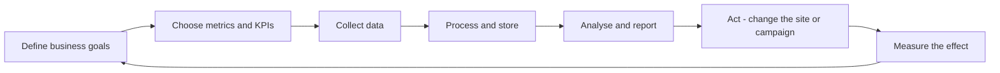

## 1.2 Metrics

A **metric** is a quantitative measurement of some aspect of site behaviour. Metrics are neutral numbers; on their own they do not say whether things are going well.

### Core web metrics

| Metric | Definition |
|---|---|
| **Hit** | One request to the server for any file. A single page can generate dozens of hits, so hits are a **useless** business measure |
| **Page View** | One page successfully loaded by a browser |
| **Unique Page View** | Page views grouped per session, so refreshing the same page counts once |
| **Visit / Session** | A group of interactions by one user within a time frame; ends after 30 minutes of inactivity by convention |
| **Visitor / User** | A unique individual, identified by a cookie or user ID |
| **New vs Returning Visitor** | Whether that identifier has been seen before |
| **Bounce Rate** | Percentage of sessions with only one interaction |
| **Exit Rate** | Percentage of views of a page that were the last page in the session |
| **Time on Page** | Time between loading a page and moving to the next |
| **Average Session Duration** | Average length of a visit |
| **Pages per Session** | Average pages viewed per visit |
| **Conversion Rate** | Percentage of sessions that completed a defined goal |
| **Click-Through Rate (CTR)** | Clicks divided by impressions |
| **Traffic Sources** | Where visitors came from: organic, direct, referral, social, paid, email |

**Metric types:**
- **Count** — a raw total (5,000 page views).
- **Ratio** — a count divided by a count (pages per session).
- **Percentage / Rate** — a proportion (bounce rate).
- **Average** — a mean (average order value).
- **Dimension vs Metric** — a **dimension** is an attribute (country, browser, page URL); a **metric** is a number measured against it. A report is always "metrics broken down by dimensions".

## 1.3 KPIs (Key Performance Indicators)

A **KPI** is a metric that is **tied directly to a business objective**. Every KPI is a metric; very few metrics are KPIs.

**Characteristics of a good KPI** (the SMART test): Specific, Measurable, Achievable, Relevant, Time-bound. It must also be **actionable** — if the number moves and nobody can do anything about it, it is not a KPI.

| Business type | Typical KPIs |
|---|---|
| **E-commerce** | Conversion rate, average order value, cart abandonment rate, revenue per visitor, customer acquisition cost, return on ad spend |
| **Content / Media** | Pages per session, time on page, scroll depth, returning visitor rate, subscription rate |
| **Lead generation (B2B)** | Form completion rate, cost per lead, lead-to-customer rate, demo requests |
| **SaaS** | Sign-up rate, activation rate, churn rate, monthly recurring revenue, lifetime value |
| **Support site** | Self-service success rate, search exit rate, ticket deflection |

**Metric vs KPI example:** "Page views = 100,000" is a metric. "Conversion rate = 3.2% against a target of 4%" is a KPI, because it is measured against a goal and drives a decision.

## 1.4 User Behaviour

**User behaviour analysis** studies *how* people actually use a site, rather than how the designers expected them to.

**What is observed:**
- **Navigation paths** — the sequence of pages, and where users backtrack.
- **Clicks and taps** — what they click, and what they click that is not clickable.
- **Scroll depth** — how far down the page they read.
- **Dwell time** — how long they stay before returning to the search results. Short dwell time signals a bad match.
- **Form interaction** — which field causes abandonment.
- **Search within the site** — what visitors could not find in the navigation.
- **Rage clicks and dead clicks** — repeated frustrated clicking, a strong usability signal.

**Behavioural tools:** heatmaps (click, move, scroll), session recordings, funnel reports, path/flow reports, form analytics and user surveys.

## 1.5 Basics of Information Retrieval

**Information Retrieval (IR)** is finding material — usually documents of an unstructured nature — that satisfies an information need, from within large collections.

**IR versus database querying:**

| | Database (SQL) | Information Retrieval |
|---|---|---|
| Data | Structured, in tables | Unstructured text |
| Query | Exact, formal (SQL) | Free text, ambiguous |
| Matching | Exact match | Partial, similarity-based |
| Result | A set of rows, unordered | A **ranked list** by relevance |
| Correctness | Deterministic and exact | Best effort; relevance is subjective |

### The three pillars of IR

**1. Indexing** — building a data structure that allows fast lookup of which documents contain which terms. Done offline, before any query arrives.

**2. Querying** — accepting the user's information need, processing it the same way documents were processed, and retrieving candidate documents.

**3. Ranking** — ordering the retrieved documents so the most relevant appear first. This is what separates a good search engine from a bad one.

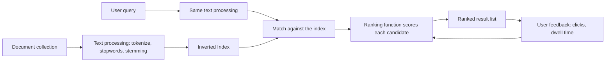

### The Inverted Index

The central data structure of IR. Instead of mapping *document → words*, it maps **word → list of documents**.

| Term | Postings list (document IDs) |
|---|---|
| analytics | 1, 4, 7, 12 |
| retrieval | 2, 4, 9 |
| web | 1, 2, 3, 4, 7 |

To answer "web AND retrieval", intersect the two lists: documents 2 and 4. This is enormously faster than scanning every document.

The postings list usually also stores the **term frequency** and sometimes the **positions** of the term (a **positional index**), which is what makes phrase search possible.

## 1.6 Web Data Sources

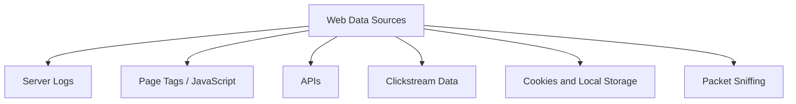

### A. Server Logs
Every web server records each request in a log file, in a format such as the **Common Log Format** or **Combined Log Format**.

A typical entry contains: client IP, timestamp, HTTP method and URL, status code, bytes served, referrer and user agent.

```
192.168.1.10 - - [15/Mar/2026:10:32:11 +0530] "GET /products/shoes HTTP/1.1" 200 5421 "https://google.com/" "Mozilla/5.0..."
```

| Advantages | Disadvantages |
|---|---|
| Captures **every** request, including bots and files | Misses cached page views entirely |
| Data is owned entirely by you, no third party | Cannot see client-side events (clicks, scrolls) |
| Works even if the visitor blocks JavaScript | Bot traffic inflates the numbers |
| Historical logs can be re-processed with new logic | IP-based visitor identification is unreliable |
| Records failed requests and errors | Large volume, needs parsing infrastructure |

### B. APIs
Programmatic access to data held by a platform: the Google Analytics Data API, Search Console API, social media APIs, advertising platform APIs, CRM and payment systems. APIs let you pull analytics data into your own warehouse and combine it with business data.

### C. Clickstream Data
The recorded sequence of pages and actions a user performs, in order, with timestamps. It is the raw material for path analysis, funnel analysis and sessionisation.

### D. Cookies and identifiers
Small pieces of data stored in the browser used to recognise a returning visitor and stitch page views into sessions. First-party cookies are set by the site itself; third-party cookies (set by other domains) are being phased out by browsers.

### E. Other sources
CRM and transaction databases, email platforms, customer support systems, A/B testing tools, and offline sales data — all of which become valuable when joined to web behaviour.

## 1.7 Components of IR Systems

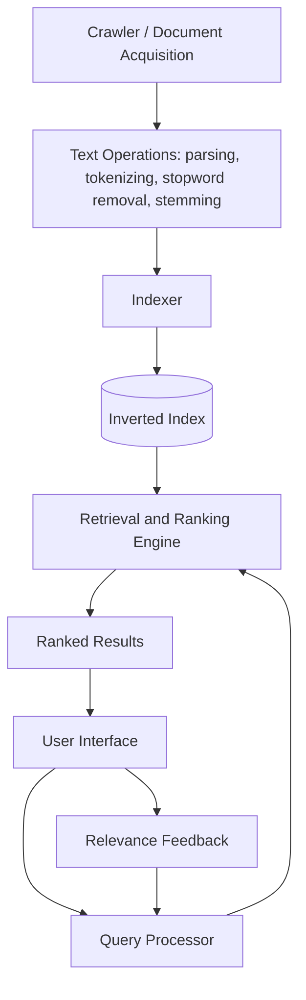

| Component | Function |
|---|---|
| **Crawler / Spider** | Discovers and fetches documents by following links |
| **Document processor** | Parses files, extracts text, removes markup |
| **Text operations** | Tokenisation, case folding, stopword removal, stemming or lemmatisation |
| **Indexer** | Builds and maintains the inverted index |
| **Query processor** | Applies the same text operations to the query; may expand or correct it |
| **Retrieval model** | Decides which documents match and how well |
| **Ranking module** | Scores and orders the results |
| **User interface** | Accepts the query and presents results with snippets |
| **Feedback module** | Learns from clicks and explicit relevance judgements |

### Document Representation

Documents must be converted into a form a computer can compare.

**Text preprocessing steps:**
1. **Tokenisation** — split text into terms. "Web-analytics isn't easy" → `web`, `analytics`, `isn't`, `easy`.
2. **Case folding** — convert to lowercase so "Web" and "web" match.
3. **Stopword removal** — drop very common words (the, is, at, and) that carry little meaning. Reduces index size but breaks phrases like "to be or not to be".
4. **Stemming** — crude suffix stripping to a root form. The **Porter stemmer** maps `connection`, `connected`, `connecting` → `connect`. Fast, but the stem may not be a real word.
5. **Lemmatisation** — dictionary-based reduction to the proper base form: `better` → `good`, `ran` → `run`. More accurate, slower.
6. **Normalisation** — handle accents, hyphens, numbers, dates, acronyms (U.S.A. → USA).
7. **N-grams** — sequences of n consecutive words, used to capture phrases.

**The Bag of Words model:** a document is represented as an unordered set of terms with weights, ignoring word order and grammar. It is a crude simplification but works remarkably well and is the basis of the Vector Space Model.

### Retrieval Models

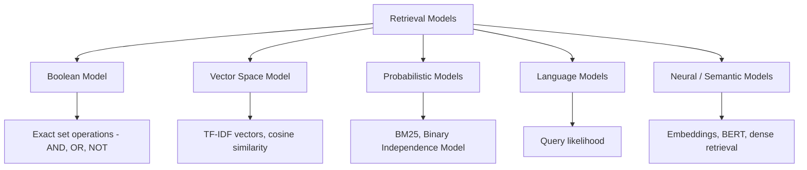

**1. Boolean Model** — documents either match or do not. Query: `web AND analytics NOT beginner`.
*Advantages:* precise, predictable, easy to implement.
*Disadvantages:* no ranking (every result is "equally relevant"), users find boolean syntax hard, results are all-or-nothing — too many or too few.

**2. Vector Space Model** — documents and queries become vectors in term space; similarity is the cosine of the angle between them. Gives a **ranked** list. Covered fully in Module 4.

**3. Probabilistic Model** — estimates the probability that a document is relevant to the query. **BM25** is the practical descendant and remains a very strong baseline.

**4. Language Model** — estimates the probability that the query would be generated from the document's language model.

**5. Neural / semantic models** — represent text as dense **embeddings** so that "car" and "automobile" are close in vector space, capturing meaning rather than exact words. Covered in Module 6.

## 1.8 Applications in IT

| Application | How it uses web analytics and IR |
|---|---|
| **Search engines** | Crawling, indexing, ranking, query understanding, click feedback |
| **Digital marketing** | Campaign attribution, ROI measurement, audience targeting, SEO |
| **E-commerce** | Product search, recommendations, funnel optimisation, personalisation |
| **User behaviour analysis** | Heatmaps, session replay, journey mapping, UX improvement |
| **Enterprise search** | Searching internal documents, wikis, email and code |
| **Digital libraries** | Cataloguing and retrieving academic papers |
| **Question answering and chatbots** | Retrieving passages to answer a question |
| **Recommendation systems** | Retrieving similar items and predicting preference |
| **Fraud and bot detection** | Anomalous traffic pattern detection in logs |
| **Content management** | Deciding what content to write, keep or retire |
| **Product analytics** | Feature adoption, retention cohorts, churn signals |

---

# MODULE 2: Web Analytics Techniques and Tools

## 2.1 Web Metrics in Detail

### Page Views
The number of times a page was loaded. Useful for content popularity, but easy to inflate (a paginated article of 10 pages generates 10 views for one read).

- **Page views per session** indicates engagement depth — although on a support site, *fewer* pages may mean the user found the answer faster, which is better.

### Bounce Rate

$$\text{Bounce Rate} = \frac{\text{Sessions with a single interaction}}{\text{Total sessions}} \times 100$$

A **bounce** is a session where the visitor viewed one page and left without any further interaction.

**Interpreting it correctly:**
- A high bounce rate on a **product or checkout page** is bad — the user was expected to continue.
- A high bounce rate on a **blog article or contact page** may be perfectly fine — the visitor got exactly what they needed and left satisfied.

**Common causes of a high bounce rate:** slow page load, misleading title or ad, poor mobile layout, intrusive pop-ups, no clear next step, wrong traffic targeting.

**Bounce rate vs Exit rate:**

| | Bounce Rate | Exit Rate |
|---|---|---|
| Denominator | Sessions that **started** on the page | All views of the page |
| Meaning | Left immediately, one page only | Was the last page of the session |
| Every bounce is an exit? | Yes | Not every exit is a bounce |

### Conversion Rate

$$\text{Conversion Rate} = \frac{\text{Number of conversions}}{\text{Total sessions (or visitors)}} \times 100$$

A **conversion** is any completed goal: a purchase, a sign-up, a download, a form submission, a video watched.

- **Macro conversion** — the primary goal (a purchase).
- **Micro conversion** — a step towards it (adding to cart, creating an account, subscribing to a newsletter).

Typical e-commerce conversion rates sit around 1–3%, so small improvements are financially significant.

### Dwell Time

**Dwell time** is the period between a user clicking a search result and returning to the search results page.

- **Long dwell time** — the page satisfied the need.
- **Short dwell time followed by a return to results ("pogo-sticking")** — a strong signal the page was a poor answer. Search engines use this behaviour as a quality signal.

Related but distinct measures:
- **Time on Page** — measured only when the user navigates to another page on the same site, so the *last* page of a session records zero.
- **Session Duration** — total time from first to last interaction of the session.

### Other important metrics

| Metric | Formula / meaning |
|---|---|
| **Click-Through Rate** | clicks / impressions × 100 |
| **Cost Per Click (CPC)** | ad spend / clicks |
| **Cost Per Acquisition (CPA)** | ad spend / conversions |
| **Return on Ad Spend (ROAS)** | revenue from ads / ad spend |
| **Average Order Value (AOV)** | total revenue / number of orders |
| **Revenue per Visitor (RPV)** | total revenue / total visitors |
| **Cart Abandonment Rate** | 1 − (transactions / carts created) |
| **Scroll depth** | how far down the page the user reached |
| **Page load time** | a direct driver of bounce rate and conversion |
| **Core Web Vitals** | LCP (loading), INP (interactivity), CLS (visual stability) |

## 2.2 Data Collection Methods

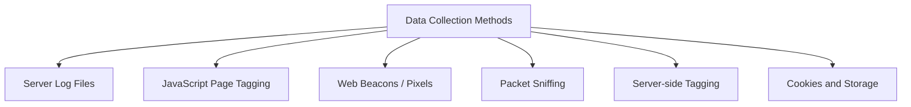

### A. Server Logs
Already described in Module 1. The server writes every request to a file, which is later parsed.

**Best used for:** technical analysis, bot detection, error monitoring, security auditing, and situations where no third-party script is permitted.

### B. JavaScript Page Tagging
A small script is placed on every page. When the page loads, the script executes in the browser, collects information and sends it to the analytics server as an HTTP request.

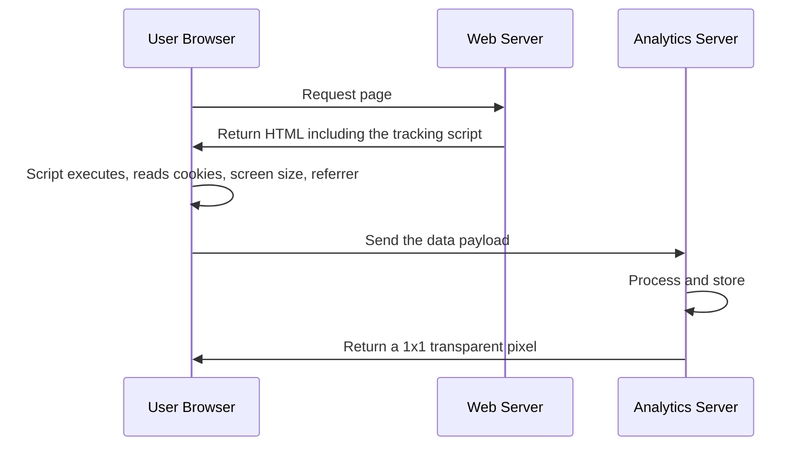

**What the tag can capture that logs cannot:** screen resolution, browser viewport, JavaScript events (clicks, scrolls, video plays), form interactions, single-page-application route changes, and accurate cookie-based visitor identification.

| Advantages | Disadvantages |
|---|---|
| Captures cached page views | Misses users who block JavaScript or use ad blockers |
| Captures client-side interactions | Does not record bots, files, or failed requests |
| Cookie-based identification is far more reliable | Adds a small page-weight and privacy footprint |
| No server access needed; vendor manages processing | Data is held by a third party |
| Real-time processing | Tag must be correctly placed on **every** page |

### C. Web Beacons (tracking pixels)
A 1×1 transparent image whose URL carries the tracking parameters. Requesting the image transmits the data. Used mainly in **emails** (where JavaScript is not allowed) and for cross-site advertising conversion tracking.

### D. Packet Sniffing
A device or software sits between the visitor and the web server and inspects the network traffic. It captures everything without touching the site, but it is complex, expensive, raises serious privacy concerns and is defeated by encryption. Rare today.

### E. Server-side tagging
The tracking payload is sent to a server you control, which then forwards it to the analytics vendors. This improves data accuracy against ad blockers, keeps sensitive data on your infrastructure, reduces client-side page weight and helps with privacy compliance. Implemented with **server-side Google Tag Manager** or a custom endpoint.

### F. Cookies

| Type | Description |
|---|---|
| **First-party cookie** | Set by the site the user is visiting; used for sessions and returning-visitor identification. Broadly accepted |
| **Third-party cookie** | Set by another domain (an ad network) to track users across sites. Being blocked by all major browsers |
| **Session cookie** | Deleted when the browser closes |
| **Persistent cookie** | Has an expiry date, survives browser restarts |

**Consequences of losing third-party cookies:** cross-site attribution becomes hard, so the industry is moving to first-party data, server-side tracking, contextual advertising and privacy-preserving APIs.

### Comparison: Logs vs Tags

| Aspect | Server Logs | JavaScript Tags |
|---|---|---|
| Data ownership | Yours entirely | Usually a third party |
| Cached pages | Missed | Captured |
| Bots and spiders | Captured | Mostly excluded |
| Client-side events | Not possible | Fully supported |
| Blocked by ad blockers | No | Yes |
| Historical reprocessing | Possible | Not possible |
| Setup | No page changes needed | Tag on every page |
| Accuracy of visitor ID | Poor (IP based) | Good (cookie based) |

**In practice:** most organisations use tagging as the primary method and logs as a technical supplement.

## 2.3 Web Analytics Tools

### Google Analytics (GA4)

The most widely used web analytics platform, free at ordinary volumes.

**GA4 is fundamentally different from the older Universal Analytics:**

| | Universal Analytics (retired) | Google Analytics 4 |
|---|---|---|
| Data model | Sessions and page views | **Events** — everything is an event |
| Platforms | Web only | Web **and** app in one property |
| Bounce rate | Primary metric | Replaced by **engagement rate** |
| Identity | Cookie/session based | User, device and modelled identity |
| Reporting | Fixed reports | Exploration reports, more flexible |
| Machine learning | Minimal | Predictive metrics built in |
| Data export | Paid tier only | Free BigQuery export |

**Key GA4 concepts:**
- **Event** — the single unit of data. Automatically collected events include `page_view`, `scroll`, `click`, `session_start`, `first_visit`.
- **Enhanced measurement** — automatically tracks scrolls, outbound clicks, site search, video engagement and file downloads.
- **Parameters** — attributes attached to an event.
- **Conversions (key events)** — events marked as important.
- **Engaged session** — a session lasting over 10 seconds, with a conversion, or with 2+ page views.
- **Engagement rate** = engaged sessions / total sessions. **Bounce rate** in GA4 is simply its inverse.
- **Audiences** — user segments that can be exported to Google Ads.
- **Explorations** — free-form, funnel, path, segment overlap and cohort analysis.
- **Attribution models** — how conversion credit is split across touchpoints.

**Report categories:** Realtime, Acquisition (how users arrive), Engagement (what they do), Monetisation (what they buy), Retention (do they return), User (who they are), Tech (what they use).

**Google Tag Manager (GTM)** is the companion tool: a container placed once on the site that lets marketers deploy and change tags without editing site code. Its three building blocks are **Tags** (what to fire), **Triggers** (when to fire) and **Variables** (values used by tags).

### Adobe Analytics

The leading enterprise analytics platform, part of Adobe Experience Cloud. Paid and expensive.

**Strengths:**
- **Highly customisable** — up to hundreds of eVars (conversion variables), props (traffic variables) and success events per report suite.
- **Analysis Workspace** — a powerful drag-and-drop analysis canvas.
- **Segmentation** — extremely granular, applied retroactively to historical data.
- **Data feeds** — raw hit-level data export.
- **Attribution IQ** — multiple attribution models compared side by side.
- **Integration** with Adobe Target (testing), Audience Manager and Campaign.
- **Real-time reporting** and **Customer Journey Analytics** for cross-channel stitching.

**Trade-offs:** high cost, steep learning curve, and it usually requires a dedicated implementation specialist.

### Matomo (formerly Piwik)

An **open-source, self-hostable** web analytics platform.

**Key characteristics:**
- **You own 100% of the data** — it sits on your own server, never shared with a third party.
- **Privacy-focused** — supports cookie-less tracking, IP anonymisation, respects Do Not Track, and can be configured to run **without consent banners** in many jurisdictions.
- **GDPR-friendly by design**, which is why many European and government sites use it.
- **No data sampling** — reports use the full dataset, unlike free tiers of some competitors.
- Includes heatmaps, session recordings, A/B testing, funnels and form analytics as features or plugins.
- Available as self-hosted (free) or Matomo Cloud (paid).

**Trade-offs:** self-hosting means you carry the infrastructure, storage and maintenance burden, and the ecosystem is smaller than Google's.

### Comparison of the three

| Feature | Google Analytics 4 | Adobe Analytics | Matomo |
|---|---|---|---|
| Cost | Free (GA360 is paid) | High, enterprise licence | Free self-hosted, paid cloud |
| Hosting | Google's cloud | Adobe's cloud | **Your own server** or cloud |
| Data ownership | Google processes it | Adobe processes it | **Fully yours** |
| Ease of use | Moderate | Steep learning curve | Easy, familiar interface |
| Customisation | Moderate | **Very high** | High |
| Sampling | Yes on large free datasets | Minimal | **None** |
| Privacy / GDPR | Requires care and consent | Requires care | **Strongest position** |
| Best for | Most businesses, small to large | Large enterprises with complex needs | Privacy-sensitive, public sector, EU |

### Other tools worth knowing

| Tool | Purpose |
|---|---|
| **Hotjar / Microsoft Clarity** | Heatmaps, session recordings, feedback polls (Clarity is free) |
| **Mixpanel / Amplitude** | Product analytics: events, funnels, retention cohorts |
| **Plausible / Fathom** | Lightweight, privacy-first, cookie-free analytics |
| **Google Search Console** | Organic search performance and technical SEO health |
| **Looker Studio / Power BI / Tableau** | Dashboards combining analytics with business data |
| **Optimizely / VWO** | A/B testing and experimentation |
| **Segment** | Customer data platform routing events to many destinations |

## 2.4 Data Visualization and Dashboard Reporting

### Purpose of a dashboard
A dashboard turns raw metrics into a **single screen that supports a decision**. If a viewer cannot say what to do differently after looking at it, the dashboard has failed.

### Types of dashboard

| Type | Audience | Content | Update frequency |
|---|---|---|---|
| **Strategic** | Executives | A few high-level KPIs against targets, long trends | Weekly / monthly |
| **Operational** | Managers, ops teams | Live status, alerts, current performance | Real-time / hourly |
| **Analytical** | Analysts | Deep, interactive, drill-down and comparison | On demand |
| **Tactical** | Department heads | Campaign and project progress | Daily / weekly |

### Choosing the right chart

| Question | Chart |
|---|---|
| How has it changed over time? | Line chart, area chart |
| How do categories compare? | Bar chart (horizontal if labels are long) |
| What is the composition? | Stacked bar, treemap (avoid pie charts with many slices) |
| Where do users drop off? | Funnel chart |
| How do two variables relate? | Scatter plot |
| Where is activity concentrated? | Heatmap |
| Where are users located? | Geographic map |
| How do users move through the site? | Sankey / flow diagram |
| What is the single headline number? | Scorecard with a comparison against the previous period |

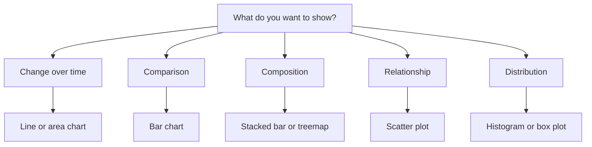

### Dashboard design principles

1. **Start with the question**, not the data. Design for the decision the viewer must make.
2. **Know the audience** — an executive needs five numbers; an analyst needs filters.
3. **Most important information top-left**, where the eye lands first.
4. **Always give context** — a number alone is meaningless. Show the target, the previous period, or the trend.
5. **Limit to 5–9 elements** per screen; more causes cognitive overload.
6. **High data-ink ratio** — remove gridlines, 3D effects, shadows and decoration.
7. **Consistent colour meaning** — pick one colour per metric and keep it everywhere; use red and green only for bad and good.
8. **Accessible colours** — do not rely on red/green alone, since roughly 8% of men have colour-vision deficiency.
9. **Never truncate a bar chart axis** — it exaggerates differences dishonestly.
10. **Label units and time ranges** explicitly.
11. **Enable interaction** — date range selectors, segment filters, drill-down.
12. **Automate the refresh** so nobody rebuilds the report by hand.

### Reporting cadence
- **Real-time dashboards** for operations and live campaigns.
- **Daily reports** for active campaign management.
- **Weekly reports** for team review.
- **Monthly / quarterly reports** for strategy and executive review.

Every report should end with **insight and recommended action**, not just numbers: *"Mobile conversion fell 18% after the checkout redesign; the payment button is below the fold on iPhone. Recommend moving it up and re-measuring."*

## 2.5 Applications

### A. User Tracking
Following an individual or a segment through the site to understand behaviour.

- **Session tracking** — stitching page views into visits.
- **Cross-device tracking** — recognising the same person on phone and laptop, usually via a logged-in user ID.
- **Event tracking** — recording specific interactions (button clicks, video plays, downloads).
- **User journey mapping** — reconstructing the full path from first touch to conversion.
- **Cohort tracking** — grouping users by when they joined and following their behaviour over time.

**Ethical limits:** track behaviour to improve the product, obtain consent, anonymise where possible, and never combine data in ways users would find surprising.

### B. Campaign Analysis
Measuring which marketing activities actually generate value.

**UTM parameters** are tags appended to a URL so the analytics tool knows where a visit came from:

```
https://example.com/sale?utm_source=facebook&utm_medium=cpc&utm_campaign=diwali2026&utm_content=video_ad_a&utm_term=running+shoes
```

| Parameter | Meaning |
|---|---|
| `utm_source` | Where the traffic came from (google, facebook, newsletter) |
| `utm_medium` | The channel type (cpc, email, social, referral) |
| `utm_campaign` | The campaign name |
| `utm_content` | Which creative or link variant |
| `utm_term` | The paid keyword |

**Attribution models** — how credit for a conversion is divided across touchpoints:

| Model | Credit assignment |
|---|---|
| **Last click** | 100% to the final touchpoint. Simple but ignores discovery |
| **First click** | 100% to the first touchpoint. Overvalues awareness |
| **Linear** | Split equally across all touchpoints |
| **Time decay** | More credit to touchpoints closer to the conversion |
| **Position based (U-shaped)** | 40% first, 40% last, 20% spread across the middle |
| **Data-driven** | Algorithmically assigns credit based on observed contribution |

**Campaign metrics:** impressions, clicks, CTR, CPC, conversions, CPA, ROAS, and incremental revenue.

### C. Performance Monitoring
Watching the technical health of the site, because speed directly affects business outcomes.

**Core Web Vitals:**

| Metric | Measures | Good threshold |
|---|---|---|
| **LCP** (Largest Contentful Paint) | Loading speed of the main content | under 2.5 s |
| **INP** (Interaction to Next Paint) | Responsiveness to user input | under 200 ms |
| **CLS** (Cumulative Layout Shift) | Visual stability, elements jumping around | under 0.1 |

**Also monitored:** Time to First Byte, page weight, error rates (4xx and 5xx), uptime, API latency, and performance broken down by device, browser and country.

**Why it matters:** studies consistently show that each additional second of load time measurably reduces conversion rate, and Core Web Vitals are a confirmed Google ranking signal.

---

# MODULE 3: SEO and User Behaviour Analysis

## 3.1 SEO Fundamentals

**Search Engine Optimisation (SEO)** is the practice of improving a website so that it ranks higher in the **organic (unpaid)** results of search engines, thereby attracting more relevant traffic.

**SEO vs SEM vs PPC:**
- **SEO** — earning organic visibility. Slow to build, but traffic is free and compounding.
- **PPC / Paid search** — buying ads. Instant, but stops the moment you stop paying.
- **SEM** — the umbrella covering both.

### How a search engine works

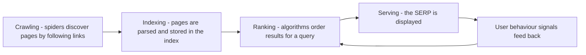

1. **Crawling** — bots (Googlebot) follow links and fetch pages. Controlled by `robots.txt` and the XML sitemap.
2. **Indexing** — the content is processed, understood and stored. A crawled page is not necessarily indexed.
3. **Ranking** — hundreds of signals determine the order.
4. **Serving** — results are displayed, often with rich features.

### The three pillars of SEO

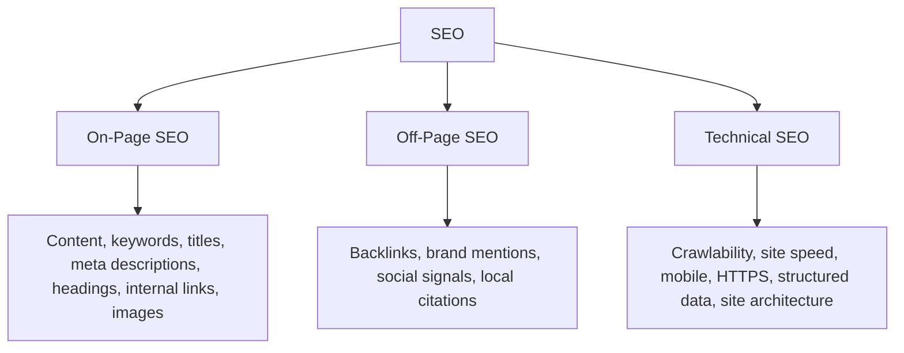

### A. On-Page SEO
Everything you control **on the page itself**.

| Element | Best practice |
|---|---|
| **Title tag** | The single most important on-page element. 50–60 characters, include the primary keyword near the front, make it compelling since it is the clickable headline |
| **Meta description** | 150–160 characters. Not a direct ranking factor, but it heavily influences **click-through rate** |
| **URL structure** | Short, readable, keyword-containing, hyphen-separated: `/web-analytics-guide` not `/p?id=8842` |
| **Heading tags** | One `<h1>` per page stating the topic; `<h2>`/`<h3>` for a logical hierarchy |
| **Content quality** | Original, comprehensive, satisfies the search intent, well-structured, kept up to date |
| **Keyword usage** | Natural placement in the title, first paragraph, headings and body. **Keyword stuffing is penalised** |
| **Image optimisation** | Descriptive filenames, **alt text** (also an accessibility requirement), compressed files, modern formats, lazy loading |
| **Internal linking** | Links between related pages using descriptive anchor text; spreads authority and helps crawling |
| **Freshness** | Regularly updated content performs better in many niches |
| **E-E-A-T** | Experience, Expertise, Authoritativeness, Trustworthiness — especially critical for health and finance topics |

### B. Off-Page SEO
Signals from **outside** your website, dominated by backlinks.

- **Backlinks** — links from other sites, treated as votes of confidence. **Quality far outweighs quantity**: one link from a major university or news site beats a thousand from spam directories.
- **Anchor text** — the visible text of the incoming link tells the engine what the target page is about.
- **`nofollow` / `sponsored` / `ugc` attributes** — tell engines not to pass authority; used for paid and user-generated links.
- **Link building tactics:** creating genuinely linkable content, digital PR, guest posting, broken-link building, industry directories, and earning citations.
- **What to avoid:** buying links, link farms, private blog networks, and excessive reciprocal linking. These trigger manual penalties.
- **Brand mentions, reviews and social signals** contribute indirectly by driving awareness and traffic.
- **Local SEO** — Google Business Profile, consistent Name/Address/Phone citations, and local reviews.

### C. Technical SEO
Making sure engines can crawl, render, index and trust the site.

| Area | Requirements |
|---|---|
| **Crawlability** | Correct `robots.txt`, an up-to-date XML sitemap, no orphan pages, a sensible crawl budget |
| **Indexability** | Correct use of `noindex`, canonical tags to resolve duplicate content, avoid thin pages |
| **Site speed** | Core Web Vitals, image compression, caching, CDN, minified assets |
| **Mobile-friendliness** | Responsive design; Google uses **mobile-first indexing** |
| **HTTPS** | TLS everywhere; a confirmed ranking signal |
| **Site architecture** | Flat structure — any page reachable within about three clicks from the home page |
| **Structured data** | Schema.org markup in JSON-LD, enabling rich results (star ratings, FAQs, recipes, breadcrumbs) |
| **Canonical tags** | Point duplicate URLs at the preferred version |
| **Redirects** | Use 301 for permanent moves; avoid long redirect chains |
| **404 and error handling** | A helpful 404 page; fix broken internal links |
| **Hreflang** | Signals language and regional targeting for international sites |
| **JavaScript rendering** | Ensure content is visible to crawlers; use server-side rendering when necessary |
| **Log file analysis** | Check how the crawler actually spends its budget on your site |

## 3.2 SEO Metrics

| Metric | What it tells you | Where to find it |
|---|---|---|
| **Organic traffic** | Sessions from unpaid search — the headline SEO measure | GA4, Search Console |
| **Keyword rankings** | Position for target queries | Search Console, Ahrefs, SEMrush |
| **Impressions** | How often your pages appeared in results | Search Console |
| **Organic CTR** | clicks / impressions; reveals weak titles and descriptions | Search Console |
| **Bounce rate / engagement rate** | Whether the page satisfied the searcher | GA4 |
| **Backlinks** | Number of incoming links | Ahrefs, SEMrush, Search Console |
| **Referring domains** | Number of **unique** linking sites; more meaningful than raw link count | Ahrefs |
| **Domain Authority / Domain Rating** | A third-party 0–100 estimate of a site's link strength. **Not a Google metric** | Moz (DA), Ahrefs (DR) |
| **Page Authority** | The same idea at page level | Moz |
| **Indexed pages** | How many pages are actually in the index | Search Console |
| **Core Web Vitals** | Technical page experience | Search Console, PageSpeed Insights |
| **Organic conversions** | Business value produced by SEO | GA4 |
| **Share of voice** | Your visibility versus competitors for a keyword set | SEMrush, Ahrefs |

**On authority scores:** DA and DR are useful for *comparison* between sites but are estimates produced by third-party crawlers. Google has repeatedly stated it does not use a single "domain authority" score.

## 3.3 Keyword Research and Content Optimization

**Keyword research** is finding the words and phrases real people type when looking for what you offer.

### The process

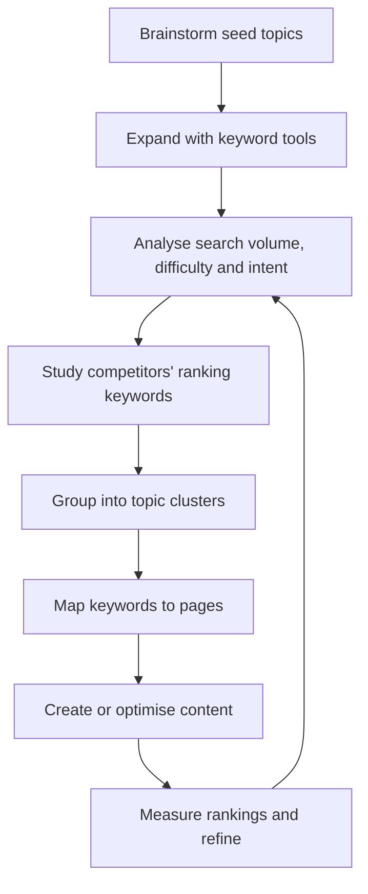

### Key concepts

| Term | Meaning |
|---|---|
| **Search volume** | Average monthly searches for the term |
| **Keyword difficulty** | How hard it will be to rank, based on the strength of current results |
| **Head keywords** | Short, high-volume, very competitive, vague intent ("shoes") |
| **Long-tail keywords** | Longer, lower-volume, less competitive, **specific intent** and higher conversion ("waterproof running shoes for flat feet") |
| **LSI / semantic terms** | Related terms that signal genuine topical depth |
| **Keyword cannibalisation** | Two of your own pages competing for the same query, splitting the signal. Fix by consolidating |
| **Topic cluster** | A comprehensive **pillar page** on a broad topic, surrounded by detailed **cluster pages** that all link back to it |
| **SERP features** | Featured snippets, People Also Ask, image packs, local packs — these change how much traffic position 1 actually receives |

**The long-tail principle:** the majority of all searches are long-tail. Individually tiny, collectively enormous, and far easier to win.

### Search intent

Matching intent matters more than matching the exact keyword.

| Intent | The user wants | Content that wins |
|---|---|---|
| **Informational** | To learn ("what is web analytics") | Guides, tutorials, definitions |
| **Navigational** | A specific site ("gmail login") | The brand's own page |
| **Commercial investigation** | To compare before buying ("best analytics tool") | Comparisons, reviews, listicles |
| **Transactional** | To act now ("buy GA4 course") | Product and checkout pages |

**Practical test:** search the keyword yourself and look at what already ranks. Google has already decided what intent it serves — match that format or you will not rank.

### Content optimization checklist

1. **Match the intent** first.
2. **Cover the topic completely** — answer the related questions in "People Also Ask".
3. **Place the primary keyword** in the title, H1, first 100 words, and one subheading — naturally.
4. **Use semantic variations**, not repetition of the exact phrase.
5. **Structure for scanning** — short paragraphs, descriptive subheadings, bullet lists, tables.
6. **Optimise for featured snippets** — give a direct 40–60 word answer immediately under the relevant heading.
7. **Add internal links** to and from related pages.
8. **Include original value** — data, examples, images, expert quotes.
9. **Add structured data** where a rich result is available.
10. **Refresh regularly** — update statistics and re-publish.
11. **Optimise the title and meta description for clicks**, not just for keywords.

### SEO Tools

| Tool | Type | Main use |
|---|---|---|
| **Google Search Console** | Free, official | Real impressions, clicks, positions, index coverage, Core Web Vitals, manual actions. **The only source of true Google data** |
| **Google Keyword Planner** | Free (with Ads account) | Search volume and keyword ideas |
| **Ahrefs** | Paid | Best-in-class **backlink index**, keyword research, content gap analysis, rank tracking, site audit |
| **SEMrush** | Paid | Broad marketing suite: keywords, competitor research, position tracking, paid-search intelligence, site audit |
| **Moz Pro** | Paid | Domain Authority, keyword explorer, link research |
| **Screaming Frog** | Freemium desktop crawler | Deep technical audits: broken links, duplicate titles, redirect chains |
| **PageSpeed Insights / Lighthouse** | Free | Performance and Core Web Vitals diagnosis |
| **Google Trends** | Free | Relative interest over time, seasonality, regional demand |
| **AnswerThePublic / AlsoAsked** | Freemium | Question-based keyword discovery |

**Google Search Console in detail** — the essential reports:
- **Performance** — queries, pages, countries, devices, with clicks, impressions, CTR and average position.
- **Index Coverage / Pages** — which pages are indexed and why others are excluded.
- **URL Inspection** — how Google sees a specific URL; request indexing.
- **Sitemaps** — submit and monitor.
- **Core Web Vitals and Mobile Usability** — page experience issues.
- **Links** — top linking sites and most-linked pages.
- **Manual Actions and Security Issues** — penalties and hacking alerts.

## 3.4 User Segmentation

**Segmentation** is dividing the audience into groups that behave similarly, so that analysis and messaging can be tailored. Site-wide averages hide almost everything important; segmentation is how you find it.

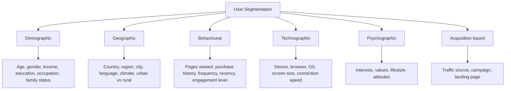

### A. Demographic Segmentation
Grouping by *who the user is*: age band, gender, income, education, occupation, family status.
*Use:* tailoring product ranges, tone of voice and ad targeting.
*Caution:* inferred demographics from analytics tools are modelled estimates, not facts, and are unavailable for users who opt out.

### B. Geographic Segmentation
Grouping by *where the user is*: country, state, city, language, time zone.
*Use:* localising content and currency, planning delivery zones, scheduling campaigns for local peak hours, discovering unexpectedly strong regions.

### C. Behavioural Segmentation
Grouping by *what the user does* — usually the most actionable dimension.

| Segment basis | Example segments |
|---|---|
| Engagement level | Bounced, browsers, engaged readers, power users |
| Purchase behaviour | First-time buyers, repeat buyers, high spenders, lapsed |
| Journey stage | Awareness, consideration, decision, retention |
| Feature usage | Used search, used filters, watched a video |
| Loyalty | New, returning, subscriber, advocate |
| Recency, Frequency, Monetary (**RFM**) | A classic scoring model for customer value |

### D. Technographic Segmentation
By device, browser, operating system, screen size and connection speed.
*Use:* discovering that conversion is fine on desktop but broken on Safari mobile — one of the highest-value findings in practical analytics.

### E. Psychographic Segmentation
By interests, values, lifestyle and motivations. Usually gathered through surveys, on-site behaviour or third-party interest data rather than analytics alone.

### Applying segments
Compare each segment's **conversion rate, revenue per visitor, engagement and drop-off points**. The goal is to find a segment that behaves markedly differently and then act — fix a broken experience, change messaging, or shift budget.

## 3.5 Funnel Analysis

A **funnel** is a defined sequence of steps a user must complete to reach a goal. Funnel analysis shows how many users reach each step and, crucially, **where they leave**.

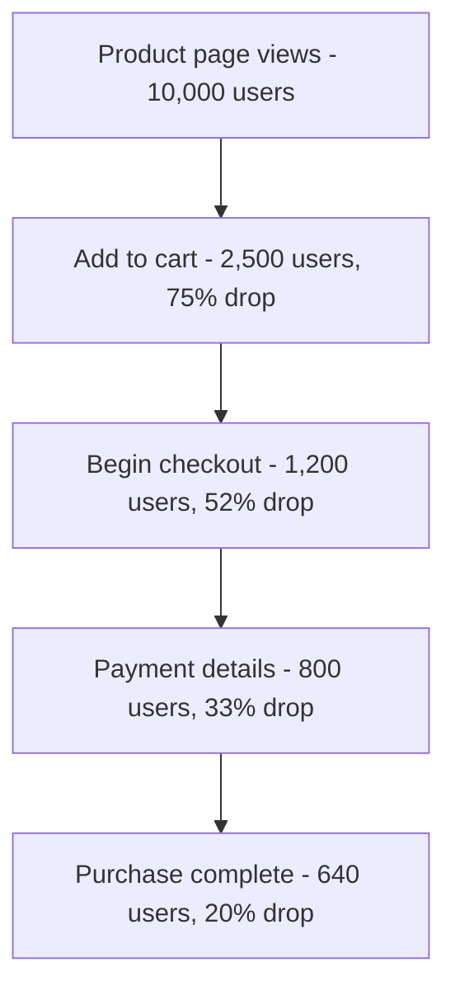

**Reading the funnel:** the overall conversion rate here is 6.4%, but the single largest loss (52%) is between adding to cart and starting checkout. That step is where investigation and testing should focus — not the final payment step, which is already performing reasonably.

**Types of funnel:**

| Type | Description |
|---|---|
| **Closed funnel** | Users must enter at step 1 and follow the exact sequence |
| **Open funnel** | Users may enter at any step; reflects reality better |
| **Trended funnel** | Shows how each step's conversion changes over time |
| **Segmented funnel** | The same funnel compared across device, source or user type — this is where the insight usually lives |

**Common causes of drop-off:**
- Unexpected shipping cost or fees revealed late.
- Forced account creation before checkout.
- Too many form fields.
- No trusted payment option.
- Slow or broken pages, especially on mobile.
- Missing trust signals (security badges, reviews, return policy).
- Confusing next step or a hidden call to action.

**Complementary techniques:** session recordings of users who dropped, heatmaps of the failing step, form-field analytics to find the abandoning field, and exit surveys.

## 3.6 User Journey Mapping

A **user journey map** is a visualisation of the complete experience a person has with a product or brand, across every touchpoint and over time — not just one website session.

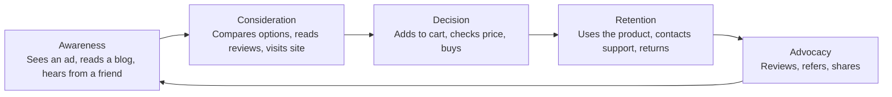

**What a map records at each stage:**

| Layer | Content |
|---|---|
| **Stage** | Awareness, consideration, decision, retention, advocacy |
| **User actions** | What they actually do |
| **Touchpoints** | Ad, search result, website, email, app, store, support call |
| **Thoughts and questions** | "Is this trustworthy?", "How much is shipping?" |
| **Emotions** | Curious, confused, frustrated, satisfied — plotted as a line |
| **Pain points** | Where the experience breaks down |
| **Opportunities** | What could be improved |
| **Metrics** | The measurable indicator for that stage |

**Journey mapping vs funnel analysis:**

| | Funnel Analysis | Journey Mapping |
|---|---|---|
| Nature | Quantitative | Qualitative and quantitative combined |
| Scope | One defined path on one property | The whole cross-channel experience |
| Shows | **Where** users drop off | **Why** they drop off, and how they feel |
| Data | Analytics events | Analytics, interviews, surveys, support tickets, recordings |
| Output | Conversion percentages per step | A narrative map with pain points and opportunities |

They are complementary: the funnel tells you *where* the problem is, and journey mapping tells you *why*.

**Path analysis** is the analytics feature that supports this: it shows the actual sequences users follow, which frequently reveals that real behaviour looks nothing like the designed flow.

## 3.7 Applications

### A. Website Visibility
Everything in SEO serves one purpose: appearing where the audience is searching.

- **Improving rankings** for commercially valuable keywords.
- **Increasing impressions** by covering more of the topic space.
- **Winning SERP features** — featured snippets, People Also Ask, image and video results.
- **Local visibility** through Google Business Profile and local citations.
- **Brand visibility** — being the recognised answer in the category.
- **Reducing dependence on paid traffic**, which lowers customer acquisition cost over time.

### B. Engagement Optimization
Using behavioural data to make the site work better for the people already on it.

| Finding | Typical action |
|---|---|
| High bounce on a key landing page | Match the content to the ad promise; improve load speed and the above-the-fold message |
| Low scroll depth | Move the key message higher; break up long text |
| Heatmap shows users clicking non-clickable elements | Make those elements interactive, or remove the misleading styling |
| Users searching the site for a product that exists | Fix the navigation and internal search |
| Large drop at one funnel step | Simplify that step, remove fields, add reassurance |
| Mobile conversion far below desktop | Audit mobile layout, tap targets and page speed |
| Short dwell time from organic search | The content does not satisfy the intent; rewrite it |
| High exit on a support article | The article does not actually answer the question |

**The improvement loop:** measure → find the biggest loss → form a hypothesis → test the change (A/B test) → measure again → keep or discard. This is covered in Module 5.

---

# MODULE 4: Information Retrieval and Search Engine Analytics

## 4.1 Introduction to Information Retrieval Systems

**Information Retrieval** deals with the representation, storage, organisation and access to information items so that users can find what they need.

### The IR process

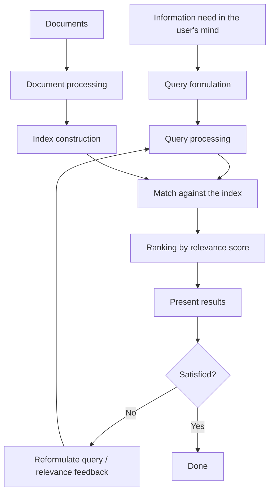

**Central problem:** the user's *information need* is not the same as the *query* they type. The query is a lossy, ambiguous expression of the need. Most of modern IR is about bridging that gap.

### Evaluation of IR systems

| Measure | Formula | Meaning |
|---|---|---|
| **Precision** | relevant retrieved / total retrieved | Of what we returned, how much was useful |
| **Recall** | relevant retrieved / total relevant | Of everything useful, how much we found |
| **F1-score** | 2PR / (P + R) | Harmonic mean of the two |
| **Precision@k** | precision among the top k results | What matters on page 1 of a search engine |
| **MAP** | Mean Average Precision across queries | Overall ranked-retrieval quality |
| **NDCG** | Discounted cumulative gain, normalised | Rewards highly relevant items placed near the top; supports graded relevance |
| **MRR** | 1 / rank of the first relevant result | Good for known-item and question answering |

**The precision–recall trade-off:** broadening a query raises recall and lowers precision; narrowing it does the reverse. Web search optimises heavily for **precision in the top few results**, because users rarely go past the first page. Legal and medical search optimises for **recall**, because missing a relevant document is unacceptable.

## 4.2 Document Representation and Preprocessing

Before indexing, raw documents are transformed into a normalised list of terms.

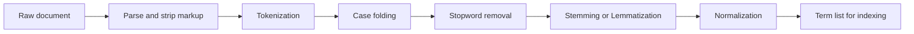

| Step | Description | Example |
|---|---|---|
| **Parsing** | Extract text from HTML, PDF, DOCX; drop tags and scripts | `<p>Web Analytics</p>` → `Web Analytics` |
| **Tokenization** | Split into terms, deciding how to treat punctuation and hyphens | "state-of-the-art" → one token or four? |
| **Case folding** | Lowercase everything | `Analytics` → `analytics` |
| **Stopword removal** | Remove very frequent, low-information words | remove `the`, `is`, `of`, `and` |
| **Stemming** | Rule-based suffix stripping (Porter, Snowball) | `retrieval`, `retrieving`, `retrieved` → `retriev` |
| **Lemmatization** | Dictionary-based reduction to a valid base word | `mice` → `mouse`, `better` → `good` |
| **Normalization** | Handle accents, acronyms, numbers, dates | `U.S.A.` → `usa`, `colour` → `color` |
| **N-gram generation** | Capture short phrases | `web analytics` as a bigram |

**Stemming vs Lemmatization:**

| | Stemming | Lemmatization |
|---|---|---|
| Method | Rule-based suffix stripping | Dictionary and morphological analysis |
| Output | May not be a real word (`studi`) | Always a valid word (`study`) |
| Speed | Fast | Slower |
| Accuracy | Lower; over-stemming and under-stemming occur | Higher |
| Needs part-of-speech | No | Often yes |

**Trade-off of removing stopwords:** it shrinks the index considerably, but destroys phrase queries such as "to be or not to be" and "The Who". Modern engines usually keep stopwords in a positional index and handle them at query time.

## 4.3 The Vector Space Model (VSM)

The **Vector Space Model** represents both documents and the query as **vectors in a high-dimensional space**, where each dimension corresponds to a term in the vocabulary.

- Document $d_j = (w_{1j}, w_{2j}, \dots, w_{nj})$
- Query $q = (w_{1q}, w_{2q}, \dots, w_{nq})$

where $w_{ij}$ is the weight of term i in document j.

**Relevance** is then measured by the **similarity between vectors** — specifically the **cosine of the angle** between them.

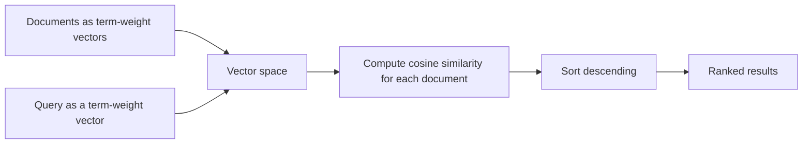

### Cosine Similarity

$$\cos(\theta) = \frac{\vec{d} \cdot \vec{q}}{\lVert \vec{d} \rVert \times \lVert \vec{q} \rVert} = \frac{\sum_{i=1}^{n} w_{id} \times w_{iq}}{\sqrt{\sum_{i=1}^{n} w_{id}^2} \times \sqrt{\sum_{i=1}^{n} w_{iq}^2}}$$

**Why cosine and not Euclidean distance?** Cosine measures the **angle**, ignoring vector length. A long document repeating a term many times would be far away in Euclidean distance but points in the same direction, so cosine correctly identifies it as similar. Cosine similarity ranges from 0 (nothing in common) to 1 (identical direction).

| Advantages of VSM | Disadvantages of VSM |
|---|---|
| Produces a **ranked** list, not just a match set | Assumes terms are **independent** — ignores word order and grammar |
| Allows **partial matching** | Cannot handle **synonymy** — "car" and "automobile" are different dimensions |
| Simple, intuitive and effective | Cannot handle **polysemy** — "bank" has one dimension for two meanings |
| Weighting schemes are flexible | Very high-dimensional and sparse |
| Basis of most classical search systems | Long documents can be unfairly penalised or favoured without normalisation |

## 4.4 Term Frequency–Inverse Document Frequency (TF-IDF)

TF-IDF is the standard way to compute the weight $w_{ij}$. Its logic is:

> A term is important to a document if it appears **often in that document** but **rarely across the whole collection**.

### Term Frequency (TF)
How often term t appears in document d.

$$tf(t,d) = \frac{\text{count of } t \text{ in } d}{\text{total terms in } d}$$

Common variants:
- **Raw count** — simply the number of occurrences.
- **Log normalisation** — $1 + \log(count)$, used because relevance does not grow linearly with repetition.
- **Augmented (max) normalisation** — $0.5 + 0.5 \times \frac{count}{max\,count}$, which prevents bias toward long documents.

### Inverse Document Frequency (IDF)
How rare the term is across the collection.

$$idf(t) = \log\frac{N}{df(t)}$$

where **N** is the total number of documents and **df(t)** is the number of documents containing t.

A smoothed version avoids division by zero:
$$idf(t) = \log\frac{N}{1 + df(t)} + 1$$

**Effect:** a word appearing in every document (like "the") has $df = N$, so $idf = \log 1 = 0$ and its weight vanishes. A rare technical term has high IDF and dominates the score. **IDF automatically does the job of stopword removal.**

### The combined weight

$$w_{t,d} = tf(t,d) \times idf(t)$$

### Worked example

Collection of **N = 1,000** documents. Document D contains 200 words.

| Term | Count in D | tf | df | idf = log(1000/df) | tf-idf |
|---|---|---|---|---|---|
| `the` | 20 | 0.100 | 1000 | log(1) = 0 | **0.000** |
| `analytics` | 10 | 0.050 | 100 | log(10) = 1 | **0.050** |
| `clickstream` | 4 | 0.020 | 10 | log(100) = 2 | **0.040** |
| `heteroscedastic` | 1 | 0.005 | 2 | log(500) ≈ 2.7 | **0.0135** |

(Using log base 10.) Notice that `the` is correctly given zero weight despite appearing most often, and `clickstream` scores nearly as high as `analytics` despite appearing less often, because it is far rarer.

**Applications of TF-IDF beyond search:** document similarity, text classification, clustering, keyword extraction, summarisation, and as a feature representation for machine learning on text.

**Limitations:** it is still bag-of-words, so it ignores word order and meaning; it cannot match synonyms; and it does not handle document length as well as BM25 does.

## 4.5 Introduction to Link Analysis

**Link analysis** uses the **hyperlink structure** of the web, rather than page content, to judge importance. Two pages may have identical text, but the one that thousands of reputable sites link to is far more likely to be authoritative.

**The core assumptions:**
1. A hyperlink from page A to page B is an implicit **endorsement** of B.
2. Endorsements from **important** pages are worth more than endorsements from unimportant ones.

This was the insight that made Google dramatically better than the purely content-based search engines of the mid-1990s, which were trivially manipulated by keyword stuffing.

## 4.6 PageRank Algorithm (conceptual understanding)

**PageRank**, developed by Larry Page and Sergey Brin at Stanford in 1996, assigns every page a single numeric importance score.

### The intuition: the random surfer
Imagine someone browsing the web forever, at each step clicking a link at random. **PageRank is the long-run probability of finding that surfer on a given page.** Pages that many paths lead to have high probability, and therefore high PageRank.

### The basic formula

$$PR(p) = \sum_{q \rightarrow p} \frac{PR(q)}{L(q)}$$

Each page **distributes its rank equally among the pages it links to**. A page with 100 outgoing links passes only 1/100 of its rank down each link, which is why a link from a page with few, carefully chosen outbound links is worth more.

### With damping (teleportation)

$$PR(p) = \frac{1-d}{N} + d \sum_{q \rightarrow p} \frac{PR(q)}{L(q)}$$

- **d** is the **damping factor**, conventionally **0.85**. It represents the probability that the surfer follows a link.
- With probability **1 − d = 0.15**, the surfer gets bored and **jumps to a random page**.

**Why damping is essential:** it solves two structural problems.
- **Dead ends (dangling nodes)** — pages with no outgoing links. Rank flows in and never leaves, so without teleportation all rank drains away to zero.
- **Spider traps** — clusters of pages linking only to each other. The surfer enters and can never escape, so the trap absorbs all the rank in the web.

Teleportation guarantees the surfer can always escape, which makes the computation converge to a unique, meaningful solution.

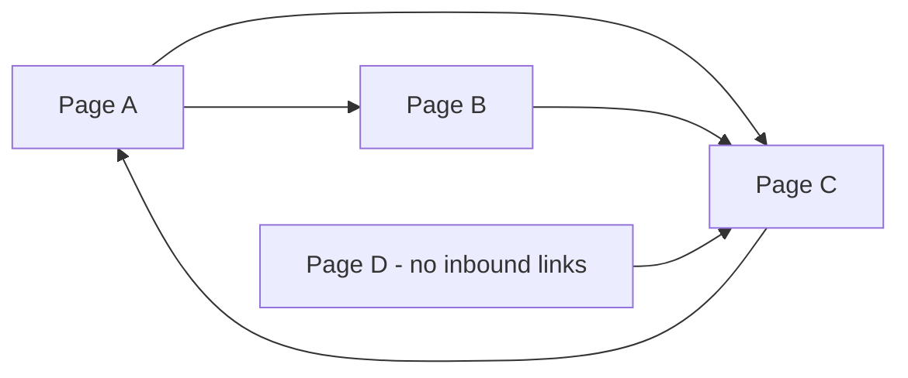

In this small web, C receives links from A, B and D, so it accumulates the highest rank; A receives only from C but C is strong, so A is also high; D has no inbound links and keeps only the teleport minimum.

### Computation
PageRank is computed by **iteration**: start every page at 1/N, apply the formula to every page, repeat. The values converge, typically within 50–100 iterations even for a web of billions of pages. Mathematically, the PageRank vector is the **principal eigenvector** of the link transition matrix.

### Properties and practical notes
- **Query independent** — computed offline once for the whole web, then looked up at query time.
- **Recursive** — a page's rank depends on the ranks of its linkers, which is why iteration is needed.
- **A logarithmic-style scale** — moving from a toolbar PageRank of 4 to 5 was far harder than 3 to 4.
- **Link equity ("link juice")** flows through links; `nofollow` blocks it.
- Google **stopped publishing** the toolbar PageRank score in 2016, but the underlying principle remains part of the ranking system.
- It is now **one of hundreds of signals**, not the dominant one.

**Vulnerability — link spam:** because rank comes from links, spammers built **link farms** and spam pages pointing at a target. Google's countermeasure is **TrustRank**: run a PageRank-style computation that teleports only to a small hand-vetted set of trusted seed sites, so trust propagates outward and pages far from any trusted source get little.

## 4.7 HITS Algorithm (conceptual overview)

**HITS** (Hyperlink-Induced Topic Search), developed by **Jon Kleinberg** at around the same time as PageRank, assigns **two scores** to every page instead of one.

| Score | Definition | Example |
|---|---|---|
| **Authority** | A page with valuable content on the topic | The official Python documentation |
| **Hub** | A page that links to many good authorities | A curated "best Python resources" list |

### The mutual reinforcement

> A good **hub** points to many good **authorities**. A good **authority** is pointed to by many good **hubs**.

$$Authority(p) = \sum_{q \rightarrow p} Hub(q) \qquad Hub(p) = \sum_{p \rightarrow q} Authority(q)$$

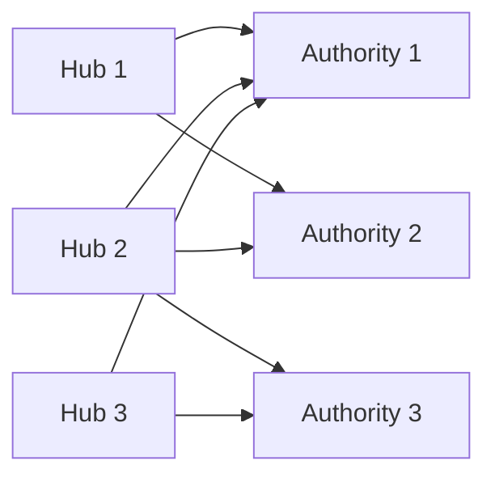

### The procedure

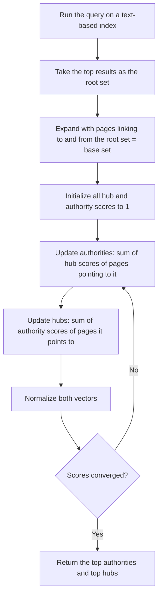

### PageRank vs HITS

| Aspect | PageRank | HITS |
|---|---|---|
| Scores per page | One | Two — hub and authority |
| When computed | Offline, once for the whole web | **At query time**, on a small subgraph |
| Query dependent | No | **Yes** |
| Speed at query time | Instant lookup | Slower, needs iteration per query |
| Coverage | Entire web | Only the base set of a few thousand pages |
| Spam resistance | Higher, especially with TrustRank | Lower — creating a hub page is easy |
| Problem | Cannot adapt to query context alone | **Topic drift** — the base set can wander off topic |
| Used by | Google | Ask.com (Teoma), research systems |

**Topic drift** is HITS's characteristic weakness: expanding the root set can pull in a very popular but off-topic site (a general portal linked by everyone), which then dominates the authority scores.

## 4.8 Search Intent Analysis

**Search intent** (or user intent) is the *reason* behind a query — what the user is actually trying to accomplish. Modern search engines optimise for intent, not keywords, and so must anyone doing SEO or building a search system.

```mermaid
flowchart TD
    A[Search Intent] --> B[Informational]
    A --> C[Navigational]
    A --> D[Transactional]
    A --> E[Commercial Investigation]
    B --> B1["how does pagerank work"<br/>Wants knowledge]
    C --> C1["youtube"<br/>Wants a specific site]
    D --> D1["buy running shoes online"<br/>Wants to complete an action]
    E --> E1["best laptop under 60000"<br/>Comparing before buying]
```

| Intent | Share of queries | Signals in the query | What ranks |
|---|---|---|---|
| **Informational** | The large majority | how, what, why, guide, tutorial, meaning | Articles, guides, videos, Wikipedia, featured snippets |
| **Navigational** | Common | Brand or product names, "login", "official" | The brand's own site; other results get almost no clicks |
| **Transactional** | Smaller but highest value | buy, order, price, discount, coupon, "near me" | Product pages, shopping results, ads |
| **Commercial investigation** | Growing | best, top, review, vs, comparison, alternatives | Listicles, comparison pages, review sites |

**Why intent matters:**
- **Ranking** — a product page will never rank for an informational query, no matter how well optimised.
- **Content format** — if the top 10 results are all listicles, the engine has decided that is what users want.
- **Conversion** — transactional traffic converts far better; informational traffic builds the audience.
- **Query understanding** — search systems infer intent to decide which **SERP features** to show (a map for local intent, a shopping carousel for transactional).

**How intent is inferred by search engines:** the words themselves, the historical click behaviour of users on that query, the location and device, the time of day, session context (the previous query), and language models that understand the phrasing.

**Practical method for an SEO:** search the target keyword and analyse the top results. Their **content type, format and angle** reveal the intent Google has already validated.

## 4.9 Ranking Signals in Modern Search Engines

Modern engines combine **hundreds of signals**. They fall into broad families:

```mermaid
flowchart TD
    A[Ranking Signals] --> B[Content relevance]
    A --> C[Link and authority]
    A --> D[User behaviour]
    A --> E[Page experience]
    A --> F[Context and personalization]
    A --> G[Trust and quality]
    B --> B1[Term matching, TF-IDF/BM25, semantic match, topical depth, freshness, entity coverage]
    C --> C1[PageRank, number and quality of referring domains, anchor text, internal links]
    D --> D1[CTR, dwell time, pogo-sticking, return visits]
    E --> E1[Core Web Vitals, mobile-friendliness, HTTPS, no intrusive interstitials]
    F --> F1[Location, language, device, search history, time]
    G --> G1[E-E-A-T, spam penalties, site reputation, original reporting]
```

| Signal family | Examples |
|---|---|
| **Content relevance** | Keyword and semantic match, comprehensiveness, content freshness, matching the search intent, entity understanding via the Knowledge Graph |
| **Authority / links** | PageRank-style link importance, number of unique referring domains, quality of those domains, anchor text |
| **User behaviour** | Click-through rate on the result, dwell time, pogo-sticking back to results, repeat visits to the site |
| **Page experience** | Core Web Vitals (LCP, INP, CLS), mobile usability, HTTPS, absence of intrusive pop-ups |
| **Technical** | Crawlability, correct indexing directives, structured data, site architecture, no duplicate content |
| **Personalisation and context** | User location, language, device type, search history, time and seasonality |
| **Trust and quality** | E-E-A-T signals, especially for "Your Money or Your Life" topics; original reporting; author credentials |
| **Query-level modifiers** | Freshness boost for news-like queries; local pack for "near me"; the query deserves diversity |
| **AI models** | RankBrain (interpreting novel queries), BERT and MUM (understanding language and context), spam-detection models |

**Important nuance:** these signals are not a fixed weighted sum. Their relative importance **changes by query type** — freshness dominates for news, authority dominates for medical topics, and proximity dominates for local searches.

## 4.10 Query Expansion Techniques

**Query expansion** reformulates the user's query by adding related terms, in order to **increase recall** and bridge the **vocabulary mismatch problem** — the fact that the words in a document often differ from the words the user typed.

```mermaid
flowchart TD
    A[Original query: 'car insurance'] --> B[Query Expansion]
    B --> C[Synonyms: automobile, vehicle, motor]
    B --> D[Morphological variants: cars, insured, insurer]
    B --> E[Related concepts: premium, policy, coverage]
    B --> F[Spelling correction: 'car insurence' -> 'car insurance']
    C --> G[Expanded query]
    D --> G
    E --> G
    F --> G
    G --> H[Retrieve more relevant documents]
```

### Techniques

**1. Relevance Feedback (Rocchio algorithm)**
The user marks some results as relevant and others as not. The query vector is then moved **towards** the relevant documents and **away** from the non-relevant ones:

$$q_{new} = \alpha q_{orig} + \beta \frac{1}{|D_r|}\sum_{d \in D_r} d - \gamma \frac{1}{|D_{nr}|}\sum_{d \in D_{nr}} d$$

Highly effective, but users rarely bother to give explicit feedback.

**2. Pseudo-Relevance Feedback (blind feedback)**
Assume the **top k retrieved documents are relevant**, extract their most distinctive terms, and add those to the query. Fully automatic and usually helpful, but if the initial results are poor it causes **query drift**, making things worse.

**3. Thesaurus-based expansion**
Add synonyms and related terms from a manually built thesaurus or **WordNet**. Precise and controllable, but expensive to build and domain-specific.

**4. Statistical / co-occurrence expansion**
Analyse the corpus for terms that frequently appear together and add the strongest associates. Automatically adapts to the domain.

**5. Query log mining**
Use what other users actually did: past query reformulations, queries that led to clicks on the same documents, and session sequences. This is the most powerful method for a large search engine because it captures real language use.

**6. Word embeddings / semantic expansion**
Use Word2Vec, GloVe or contextual embeddings to add terms that are close in vector space. This captures relationships a thesaurus would miss.

**7. Spelling correction and normalisation** — a large fraction of real queries contain typos.

**8. Query rewriting for intent** — appending "recipe" or "buy" based on detected intent.

### The trade-off

| | Effect |
|---|---|
| **Recall** | Increases — more relevant documents are found |
| **Precision** | Often decreases — irrelevant documents creep in |
| **Query drift** | The expanded query may end up meaning something different |
| **Cost** | Longer queries are slower to process |

Expansion must therefore be applied carefully, usually with **weights** so that the original terms remain dominant.

## 4.11 BM25 Ranking Model (conceptual overview)

**BM25** (Best Matching 25), from the Okapi project, is a **probabilistic ranking function**. It is the practical successor to TF-IDF and remains the **default ranking function in Elasticsearch, Lucene and Solr**, and a strong baseline that neural models are still measured against.

### The formula

$$score(D,Q) = \sum_{i=1}^{n} IDF(q_i) \cdot \frac{f(q_i, D) \cdot (k_1 + 1)}{f(q_i,D) + k_1 \cdot \left(1 - b + b \cdot \frac{|D|}{avgdl}\right)}$$

where:
- $f(q_i, D)$ = frequency of term $q_i$ in document D
- $|D|$ = length of document D in words
- $avgdl$ = average document length in the collection
- $k_1$ = term-frequency saturation parameter, typically **1.2 to 2.0**
- $b$ = length-normalisation parameter, typically **0.75**

and the IDF component is
$$IDF(q_i) = \ln\left(\frac{N - n(q_i) + 0.5}{n(q_i) + 0.5} + 1\right)$$

### The two ideas that make BM25 better than TF-IDF

**1. Term frequency saturation (controlled by $k_1$).**
In plain TF-IDF, a term appearing 100 times scores 10 times higher than one appearing 10 times. That is unrealistic — after a point, more repetition adds no additional evidence of relevance. BM25's TF component **saturates**, approaching an upper limit as frequency grows.

```mermaid
flowchart LR
    A[Term frequency rises] --> B[TF-IDF: score keeps growing linearly]
    A --> C[BM25: score rises then flattens - saturation]
    C --> D[Prevents keyword stuffing from dominating]
```

- $k_1 = 0$ makes term frequency irrelevant (binary matching).
- Larger $k_1$ means slower saturation, closer to raw TF.

**2. Document length normalisation (controlled by $b$).**
A long document naturally contains more occurrences of any term, which would unfairly advantage it. BM25 penalises documents longer than average and rewards shorter ones.

- $b = 0$ means no length normalisation at all.
- $b = 1$ means full normalisation by relative length.
- $b = 0.75$ is the well-tested default.

### BM25 vs TF-IDF

| Aspect | TF-IDF | BM25 |
|---|---|---|
| Theoretical basis | Heuristic vector-space weighting | Probabilistic relevance framework |
| Term frequency | Grows without bound (or is log-damped) | **Saturates** toward a ceiling |
| Document length | Handled crudely by normalisation | **Explicitly modelled** with the b parameter |
| Tunable parameters | Essentially none | $k_1$ and $b$ |
| Performance | Good baseline | **Consistently better**; the standard baseline |
| Used in | Teaching, simple systems, feature engineering | Elasticsearch, Lucene, Solr, most production search |

**Variants:** **BM25F** weights different document fields separately (title matches count more than body matches) and **BM25+** fixes a minor bias against very long documents.

**Where BM25 falls short:** it is still **lexical** — it matches words, not meaning. It cannot connect "laptop" with "notebook computer". That gap is what dense retrieval with embeddings (Module 6) addresses, and modern systems commonly use **hybrid retrieval**: BM25 for exact term matching plus a vector model for semantics, with the two result lists fused.

## 4.12 Role of SEO in Information Retrieval

SEO and IR are two sides of the same system: **IR is how the engine decides; SEO is how the publisher responds.**

```mermaid
flowchart LR
    A[IR System: crawling, indexing, ranking] --> B[Search results]
    B --> C[Users click, dwell, return]
    C --> D[Behaviour signals feed the ranking model]
    D --> A
    E[SEO: makes pages crawlable, indexable and relevant] --> A
    B --> E
```

| IR concept | The corresponding SEO practice |
|---|---|
| **Crawling** | Clean `robots.txt`, XML sitemap, good internal linking, no crawl traps |
| **Indexing** | Correct canonical tags, avoid `noindex` mistakes, remove duplicate and thin content |
| **Document representation** | Clear titles, headings, semantic HTML, structured data so the engine parses the page correctly |
| **TF-IDF / BM25** | Natural keyword usage and topical depth — but **not** stuffing, which BM25's saturation neutralises anyway |
| **Link analysis (PageRank)** | Earning quality backlinks; internal link architecture to distribute authority |
| **Query expansion and semantics** | Using synonyms and related concepts so the page matches how people actually phrase things |
| **Search intent** | Matching content type and format to the intent the engine has validated |
| **User behaviour signals** | Compelling titles for CTR; genuinely useful content for dwell time |
| **Ranking signals** | Core Web Vitals, mobile-friendliness, HTTPS, E-E-A-T |
| **Spam detection** | Avoiding manipulative tactics that trigger algorithmic or manual penalties |

**The key insight for a student:** you cannot do SEO well without understanding IR. Every SEO best practice is a direct consequence of how retrieval systems represent, score and rank documents. Conversely, an IR system designer must anticipate that publishers will optimise against the ranking function — which is why saturation, length normalisation and trust propagation exist in the first place.

---

# MODULE 5: Web Analytics and Optimization Strategies

## 5.1 Web Data Collection Techniques (recap and extension)

Module 2 covered the mechanisms. This module focuses on **collecting the right data well**.

### The measurement plan
Before writing a single tracking tag, define:

```mermaid
flowchart TD
    A[Business objective] --> B[Goals]
    B --> C[KPIs]
    C --> D[Segments to compare]
    D --> E[Targets]
    E --> F[Events and dimensions to collect]
    F --> G[Implementation and QA]
```

| Layer | Example |
|---|---|
| **Objective** | Grow online revenue |
| **Goal** | Increase completed purchases |
| **KPI** | Conversion rate, average order value |
| **Segment** | Mobile vs desktop, new vs returning, paid vs organic |
| **Target** | Conversion rate from 2.1% to 2.8% this quarter |
| **Data needed** | `add_to_cart`, `begin_checkout`, `purchase` events with value and item details |

### Event tracking design
In an event-based model (GA4, Mixpanel, Amplitude), think in terms of a consistent schema:
- **Event name** — a verb-object in a fixed convention: `add_to_cart`, `video_start`, `form_submit`.
- **Parameters** — `item_id`, `value`, `currency`, `method`, `page_location`.
- **User properties** — plan type, account age, loyalty tier.

**Naming discipline matters enormously.** Inconsistent event names (`AddToCart`, `add-to-cart`, `cart_add`) make the data unusable within months.

### Data quality issues to guard against

| Issue | Cause | Fix |
|---|---|---|
| **Missing tags** | A page or a new template lacks the tracking code | Automated tag auditing, tag management |
| **Duplicate tracking** | Two tags on the same page | Tag audit; check for doubled page views |
| **Bot traffic** | Crawlers and scripts inflating numbers | Bot filtering, exclude known agents |
| **Self-referral / internal traffic** | Staff and developers | IP exclusion filters |
| **Cross-domain tracking loss** | Session breaks when moving between domains | Configure cross-domain linking |
| **Ad blockers / consent refusal** | Data simply missing | Server-side tagging, modelled data, acknowledge the gap |
| **Sampling** | The tool estimates from a subset on large datasets | Reduce the date range, use the raw export |
| **Untagged campaigns** | Traffic misattributed to "direct" | Enforce UTM conventions |

**Always keep an unfiltered raw view** so mistakes in filters do not destroy data permanently.

## 5.2 Key Performance Indicators (recap and application)

**Setting good KPIs — the practical rules:**
1. Every KPI must map to a business objective.
2. Every KPI needs a **target** and a **time frame**.
3. Every KPI needs an **owner** who can act on it.
4. Prefer **rates and ratios** over raw counts — they are comparable over time.
5. Keep the set small: 3–5 per team.
6. Always segment: a flat overall KPI can hide a collapse in one segment offset by a rise in another.

**Leading vs lagging indicators:**
- **Lagging** — revenue, conversions. They confirm what happened but are too late to change.
- **Leading** — add-to-cart rate, sign-up starts, engagement rate. They predict the lagging outcome and can be acted upon now.

A good dashboard contains both.

## 5.3 User Behaviour Analysis (applied)

The analytical toolkit for understanding behaviour:

| Technique | What it reveals |
|---|---|
| **Funnel analysis** | Where users drop out of a defined process |
| **Path / flow analysis** | The actual routes users take, versus the designed route |
| **Cohort analysis** | How behaviour of a group changes over time since acquisition |
| **Segmentation comparison** | Which groups behave differently and why |
| **Heatmaps** | Where attention and clicks concentrate |
| **Session recordings** | Exactly what an individual struggling user experienced |
| **Form analytics** | Which field causes abandonment |
| **Site search analysis** | What users could not find in the navigation |
| **Scroll depth** | Whether content below the fold is ever seen |
| **RFM analysis** | Segmenting customers by Recency, Frequency and Monetary value |

**Cohort analysis example:** group users by the week they first visited, then measure what percentage return in week 2, 3, 4. A falling retention curve for newer cohorts is an early warning that something changed for the worse.

## 5.4 Introduction to Recommendation Systems

A **recommendation system** predicts what a user will like and presents it proactively, without the user having to search.

**Business impact:** a large share of consumption on Netflix, YouTube and Amazon comes from recommendations rather than search. They solve **choice overload** and monetise the **long tail** of items too obscure to be found any other way.

### The utility matrix
The central abstraction: rows are users, columns are items, cells are ratings or interactions. It is **extremely sparse**, and the task is to predict the empty cells.

|  | Item A | Item B | Item C | Item D |
|---|---|---|---|---|
| **User 1** | 5 | ? | 3 | ? |
| **User 2** | ? | 4 | ? | 2 |
| **User 3** | 4 | ? | ? | 5 |

**Explicit feedback** — ratings and reviews. Accurate but rare.
**Implicit feedback** — clicks, views, watch time, purchases, dwell. Abundant but noisy.

```mermaid
flowchart TD
    A[Recommendation Approaches] --> B[Content-Based Filtering]
    A --> C[Collaborative Filtering]
    A --> D[Hybrid]
    A --> E[Knowledge-Based]
    A --> F[Popularity / Trending]
    C --> C1[User-User]
    C --> C2[Item-Item]
    C --> C3[Matrix Factorization]
```

## 5.5 Content-Based Filtering

**Principle:** recommend items **similar to what this user liked before**, judged by the items' own attributes.

```mermaid
flowchart LR
    A[Item attributes: genre, brand, keywords, price] --> B[Item profile vector]
    C[Items the user liked] --> D[User profile vector = aggregate of liked item profiles]
    B --> E[Cosine similarity between user profile and each item]
    D --> E
    E --> F[Recommend the closest unseen items]
```

**How it is built:**
1. **Item profile** — represent each item as a feature vector. For text-heavy items, use **TF-IDF** of the description.
2. **User profile** — average the profiles of items the user rated highly, often weighted by rating and with the user's mean rating subtracted.
3. **Score** — cosine similarity between the user vector and each candidate item vector.

Alternatively, train a small **per-user classifier** predicting like/dislike from item features.

| Advantages | Disadvantages |
|---|---|
| Works with **no data about other users** | Needs good item metadata; hard for images, audio, video |
| Handles **new items** instantly — no item cold start | **New user cold start** remains |
| Recommendations are **easy to explain** | **Over-specialisation / filter bubble** — never suggests anything genuinely new |
| Serves users with unusual taste well | Cannot use quality signals from the crowd |
| No privacy issue from using others' data | Limited to features you have encoded |

## 5.6 Collaborative Filtering

**Principle:** ignore item content entirely. Use the **behaviour of similar users**. "People who agreed with you before will agree with you again."

### Similarity measures

**Jaccard similarity** — ignores ratings, uses only which items were interacted with:
$$J(A,B) = \frac{|A \cap B|}{|A \cup B|}$$

**Cosine similarity** — treats missing values as 0, which wrongly implies dislike.

**Pearson / centred cosine** — the standard. Subtract each user's mean rating first so that a generous rater and a harsh rater become comparable:
$$sim(x,y) = \frac{\sum_{i}(r_{xi}-\bar{r}_x)(r_{yi}-\bar{r}_y)}{\sqrt{\sum_i (r_{xi}-\bar{r}_x)^2}\sqrt{\sum_i (r_{yi}-\bar{r}_y)^2}}$$

### A. User-User Collaborative Filtering
Find the k users most similar to the target user, then predict the target's rating as a similarity-weighted average of theirs:

$$\hat{r}_{xi} = \bar{r}_x + \frac{\sum_{y \in N} sim(x,y)(r_{yi}-\bar{r}_y)}{\sum_{y \in N}|sim(x,y)|}$$

### B. Item-Item Collaborative Filtering
Find items similar to item i **based on who rated them** (not on their content), then predict from the target user's own ratings of those similar items.

**Item-item is generally preferred in production because:**
- Item similarities are **more stable** over time than user tastes, so they can be **precomputed offline**.
- There are usually **fewer items than users**.
- It gives naturally explainable recommendations ("because you bought X").

Amazon's well-known engine is item-item collaborative filtering.

### C. Matrix Factorization (model-based)
Decompose the sparse utility matrix into two dense low-rank matrices:

$$R \approx P \times Q^T$$

where P holds **user latent factors** and Q holds **item latent factors**, each of dimension k. The latent factors are automatically discovered hidden dimensions such as "amount of action" or "artistic seriousness".

Prediction with bias terms:
$$\hat{r}_{ui} = \mu + b_u + b_i + p_u \cdot q_i$$

Learned by minimising the regularised squared error over known ratings only, using SGD or **ALS**. This family of methods won the Netflix Prize.

| Advantages of CF | Disadvantages of CF |
|---|---|
| Requires **no item features** | **Cold start** for new users and new items |
| Finds **serendipitous** items outside the user's usual content | **Sparsity** — most users rate very few items |
| Works for any item type | **Popularity bias** toward blockbusters |
| Improves as the user base grows | **Scalability** cost of similarity over millions of users |
| Captures quality signals from the crowd | Vulnerable to **shilling attacks** with fake ratings |

### Content-based vs Collaborative

| Aspect | Content-Based | Collaborative |
|---|---|---|
| Uses | Item attributes | User-item interactions |
| New item | Handled fine | Cold start problem |
| New user | Cold start problem | Cold start problem |
| Serendipity | Low | High |
| Explainability | High | Moderate |
| Data needed | Item metadata | Lots of user behaviour |

**Hybrid systems** combine them — using content-based for new users and switching to collaborative once enough behaviour accumulates, or blending both scores.

## 5.7 A/B Testing

**A/B testing** (split testing) is a **controlled experiment** in which two versions of a page or feature are shown to randomly assigned groups of users at the same time, to determine which performs better on a defined metric.

```mermaid
flowchart TD
    A[Incoming traffic] --> B{Random assignment}
    B -- 50% --> C[Variant A - Control, existing version]
    B -- 50% --> D[Variant B - Treatment, new version]
    C --> E[Measure the conversion metric]
    D --> E
    E --> F[Statistical significance test]
    F --> G{Is the difference significant?}
    G -- Yes --> H[Implement the winner]
    G -- No --> I[Keep the control; test something bolder]
```

### The process

1. **Observe and identify a problem** using analytics — e.g. 60% drop-off at the checkout page.
2. **Form a hypothesis** — a testable statement with a reason and an expected outcome:
   > *"Because users abandon at the shipping-cost reveal, showing shipping cost on the product page will increase checkout completion by 10%."*
3. **Decide the primary metric** in advance — exactly one, plus guardrail metrics.
4. **Calculate the required sample size** before starting, from the baseline rate, the minimum detectable effect, the significance level (α = 0.05) and the desired power (80%).
5. **Build the variant** and randomly assign users; keep assignment sticky per user.
6. **Run for full business cycles** — at least 1–2 weeks, always including weekends.
7. **Analyse** — compare with a statistical test; check the p-value and confidence interval.
8. **Decide and document** — implement, discard, or iterate. Record the result either way.

### Statistical concepts

| Term | Meaning |
|---|---|
| **Null hypothesis (H₀)** | There is no difference between A and B |
| **p-value** | Probability of seeing a difference this large if H₀ were true |
| **Significance level (α)** | Usually 0.05; reject H₀ when p ≤ α |
| **Statistical power** | Probability of detecting a real effect; target 80% |
| **Minimum Detectable Effect** | The smallest improvement worth detecting; smaller MDE needs much more traffic |
| **Confidence interval** | The plausible range of the true effect |
| **Type I error** | Declaring a winner that is not real (false positive) |
| **Type II error** | Missing a real improvement (false negative) |

### Common mistakes

1. **Peeking and stopping early** — checking daily and stopping the moment it looks significant massively inflates false positives. Fix the sample size in advance, or use a sequential testing method designed for it.
2. **Too small a sample** — underpowered tests cannot detect realistic effects.
3. **Testing too many things at once** in an A/B test — you learn *that* it changed, not *why*.
4. **Ignoring segments** — a change can help desktop and hurt mobile, netting to zero.
5. **Running for less than a full week** — day-of-week effects are large.
6. **Not accounting for novelty effects** — returning users react to *any* change at first.
7. **Multiple comparisons** — testing 20 metrics guarantees one looks significant by chance.
8. **Ignoring practical significance** — a statistically significant 0.05% lift may not be worth the engineering cost.

### Variants of testing

| Type | Description |
|---|---|
| **A/B test** | Two versions, one variable |
| **A/B/n test** | Several variants against one control; needs more traffic |
| **Multivariate test (MVT)** | Multiple elements varied simultaneously to find interactions; needs a lot of traffic |
| **Split URL test** | Two entirely different pages on different URLs |
| **Multi-armed bandit** | Dynamically shifts traffic to the better-performing variant while still exploring; better for short campaigns, worse for clean learning |

## 5.8 Conversion Rate Optimization (CRO)

**CRO** is the systematic process of increasing the percentage of visitors who complete a desired action.

$$\text{Conversion Rate} = \frac{\text{Conversions}}{\text{Visitors}} \times 100$$

**Why CRO matters:** doubling traffic doubles cost. Doubling conversion rate on existing traffic costs almost nothing in comparison and improves the return on every other marketing rupee.

### The CRO process

```mermaid
flowchart TD
    A[1. Research - quantitative analytics + qualitative feedback] --> B[2. Identify problem areas]
    B --> C[3. Form prioritised hypotheses]
    C --> D[4. Design the variant]
    D --> E[5. A/B test]
    E --> F[6. Analyse results]
    F --> G{Winner?}
    G -- Yes --> H[Implement]
    G -- No --> I[Learn and iterate]
    H --> A
    I --> A
```

**Research methods:**
- **Quantitative** — analytics funnels, segment comparison, page performance, form analytics.
- **Qualitative** — heatmaps, session recordings, on-site surveys, user testing, support ticket themes, sales team feedback.

**Prioritisation frameworks:**
- **ICE** — Impact, Confidence, Ease. Score each 1–10 and rank by the average.
- **PIE** — Potential, Importance, Ease.
- **PXL** — a more structured checklist-based score.

### Common CRO levers

| Area | Optimisation |
|---|---|
| **Value proposition** | Make the benefit clear within 5 seconds of landing |
| **Call to action** | Specific action-oriented text, strong contrast, visible without scrolling |
| **Page speed** | Every second of delay measurably reduces conversion |
| **Forms** | Remove every non-essential field; use inline validation; show progress |
| **Trust signals** | Reviews, security badges, return policy, real contact details |
| **Friction removal** | Guest checkout, autofill, fewer steps, saved carts |
| **Cost transparency** | Show shipping and taxes early — hidden costs are the top cause of cart abandonment |
| **Mobile experience** | Large tap targets, simplified layout, mobile payment methods |
| **Social proof** | Ratings, testimonials, "X people bought this today" |
| **Urgency and scarcity** | Genuine stock and deadline information — false urgency destroys trust |
| **Personalisation** | Relevant content by segment |
| **Error handling** | Clear, specific, recoverable error messages |

**Guardrail:** never optimise a single metric in isolation. Aggressive pop-ups may raise email sign-ups while destroying engagement and SEO. Always monitor secondary metrics.

## 5.9 Personalization Strategies

**Personalization** means adapting the experience — content, offers, layout, recommendations — to the individual or their segment.

```mermaid
flowchart TD
    A[Personalization Levels] --> B[Segment-based]
    A --> C[Rule-based]
    A --> D[Behaviour-based]
    A --> E[Algorithmic / ML-based]
    A --> F[Real-time contextual]
    B --> B1[Different homepage for new vs returning]
    C --> C1[If from Mumbai, show Mumbai delivery banner]
    D --> D1[Recommend based on browsing history]
    E --> E1[ML-predicted next-best content or offer]
    F --> F1[Adapt within the session as intent becomes clear]
```

| Strategy | Description | Example |
|---|---|---|
| **Geographic** | Adapt by location | Local currency, language, store locator, weather-based products |
| **Behavioural** | Based on past actions | "Continue watching", recently viewed, abandoned cart reminder |
| **Demographic** | Based on user attributes | Age-appropriate content |
| **Contextual** | Based on the current situation | Device type, time of day, referring campaign |
| **Predictive** | ML predicts likely interest or churn | Next-best-offer, propensity-to-buy scoring |
| **Collaborative** | Based on similar users | "Customers like you also viewed" |
| **Lifecycle** | Based on the customer's stage | Onboarding tips for new users; loyalty offers for regulars |

**Where personalization is applied:** homepage hero, product listings and sort order, search result ranking, email content and send time, on-site messaging, pricing and promotions, and navigation.

| Benefits | Risks |
|---|---|
| Higher relevance, engagement and conversion | **Privacy concerns** and the "creepy" factor |
| Better retention and lifetime value | **Filter bubble** — the user never discovers anything new |
| Efficient use of marketing spend | **Cold start** — nothing known about a new visitor |
| Improved customer satisfaction | **Technical complexity** and caching difficulties |
| | **Wrong personalization is worse than none** |
| | Regulatory constraints under GDPR and similar laws |

**Good practice:** be transparent about why something is shown, allow the user to correct or reset their profile, always keep a discovery path outside the personalised bubble, and personalise on the basis of consented first-party data.

## 5.10 Session-Based Recommendations

**Session-based recommendation** predicts the next item a user will interact with using **only the current session's sequence of actions**, with little or no long-term user history.

**Why it is needed:**
- Most e-commerce visitors are **anonymous or first-time**, so there is no profile.
- **Intent changes between sessions.** A user who bought a laptop last month may be shopping for a gift today; their long-term profile is actively misleading.
- Privacy rules and cookie restrictions reduce access to long-term histories.

```mermaid
flowchart LR
    A[Session: viewed phone case] --> B[viewed screen protector]
    B --> C[viewed charging cable]
    C --> D[Model predicts the next likely item]
    D --> E[Recommend: wireless charger, power bank]
```

### Approaches

| Approach | How it works |
|---|---|
| **Item-to-item co-occurrence** | "Users who viewed X in a session also viewed Y". Simple, fast, surprisingly strong |
| **Markov chains** | Model the probability of the next item given the previous one |
| **Session-based kNN** | Find past sessions similar to the current one and recommend what they contained next. A very strong, simple baseline |
| **RNN / GRU4Rec** | A recurrent neural network over the sequence of clicks |
| **Transformer / attention models** | SASRec, BERT4Rec — model long-range dependencies within the session |
| **Graph neural networks** | Build a graph of the session's item transitions |

### Session-based vs traditional recommendation

| | Traditional (user-based) | Session-based |
|---|---|---|
| Input | Long-term user profile | Current session sequence only |
| Requires login / history | Yes | No |
| Captures | Stable long-term taste | **Immediate intent** |
| Order matters | Usually ignored | **Central** |
| Cold start | A serious problem | Naturally handled |
| Best for | Media streaming, subscriptions | E-commerce, news, anonymous browsing |

## 5.11 Evaluation Metrics (Precision and Recall)

For recommendation and retrieval systems, evaluation is done both **offline** (on historical data) and **online** (through live tests).

### Offline metrics

$$Precision@k = \frac{\text{relevant items in the top } k}{k}$$

$$Recall@k = \frac{\text{relevant items in the top } k}{\text{total relevant items}}$$

$$F1 = \frac{2 \times Precision \times Recall}{Precision + Recall}$$

| Metric | Best used when |
|---|---|
| **Precision@k** | Screen space is limited — only 5 recommendations fit, so they must all be good |
| **Recall@k** | The user must not miss anything relevant |
| **MAP** | Overall quality of a ranked list across many users |
| **NDCG@k** | Relevance is **graded** rather than binary, and position matters |
| **MRR** | The single first correct answer matters most |
| **Hit Rate** | Did at least one recommendation get clicked |
| **RMSE / MAE** | Accuracy of explicit rating prediction |
| **Coverage** | What fraction of the catalogue ever gets recommended |
| **Diversity** | How different the recommended items are from each other |
| **Novelty** | Are recommendations non-obvious rather than just popular items |
| **Serendipity** | Are they surprising **and** relevant |

**The critical caveat:** offline accuracy metrics reward recommending what the user would have found anyway. A system that only recommends bestsellers scores well on precision and is commercially useless. This is why **coverage, diversity and novelty** must be reported alongside accuracy.

### Online metrics
The metrics that actually decide whether a system ships:
- **Click-through rate** on recommendations.
- **Conversion rate** and **revenue attributable to recommendations**.
- **Engagement** — watch time, items viewed per session.
- **Retention** — do users come back.
- Measured through **A/B tests**, because only a controlled experiment shows causal impact.

## 5.12 Churn Prediction and Customer Retention Analytics

**Churn** is when a customer stops using the product or service.

- **Contractual churn** — an explicit cancellation (subscriptions). Easy to observe.
- **Non-contractual churn** — the customer simply stops coming back (retail). Must be **defined**, e.g. "no purchase in 90 days".

**Why retention matters:** acquiring a new customer costs several times more than retaining an existing one, and existing customers spend more over time. A small reduction in churn compounds into a large increase in lifetime value.

```mermaid
flowchart TD
    A[Collect behavioural and transactional data] --> B[Define churn precisely with a time window]
    B --> C[Engineer features: recency, frequency, monetary, engagement trend, support tickets]
    C --> D[Train a classification model]
    D --> E[Score every active customer with a churn probability]
    E --> F[Segment by risk and value]
    F --> G[Targeted retention action]
    G --> H[Measure whether the intervention worked - A/B test]
    H --> C
```

### Predictive features

| Category | Examples |
|---|---|
| **Recency** | Days since last visit, last purchase, last login |
| **Frequency** | Sessions per month, purchases per quarter — and the **trend**, which matters more than the level |
| **Monetary** | Total spend, average order value, spend trend |
| **Engagement** | Feature usage depth, email open rate, time in app |
| **Support** | Number of tickets, unresolved complaints, negative sentiment |
| **Demographic / firmographic** | Plan type, tenure, company size |
| **Product experience** | Errors encountered, failed payments, slow load times |

**Models used:** logistic regression (interpretable, a common baseline), decision trees and random forests, gradient boosting (XGBoost/LightGBM — usually the best performer on tabular data), and survival analysis (Cox proportional hazards) when *when* they will churn matters as much as *whether*.

**Evaluation:** churn data is **imbalanced**, so accuracy is misleading. Use **precision, recall, F1 and PR-AUC**. The right operating point depends on cost: if a retention offer is cheap, favour recall; if it is expensive, favour precision.

### Retention strategies

| Risk segment | Action |
|---|---|
| High value, high risk | Personal outreach, dedicated support, targeted discount |
| High value, low risk | Loyalty rewards, upsell, advocacy programmes |
| Low value, high risk | Automated email campaign, low-cost incentive |
| Low value, low risk | Standard lifecycle communication |

**Other retention levers:** improving onboarding (the biggest driver of early churn), fixing the specific product friction the data points to, proactive support before the customer complains, win-back campaigns, and simply making cancellation reasons visible so they can be addressed.

**Important caution:** never blanket-discount everyone flagged as at-risk. Many of them would have stayed anyway, and you have simply given away margin. **Uplift modelling** targets the customers whose behaviour the intervention will actually change.

## 5.13 Marketing ROI Analysis

**Return on Investment** measures the financial return generated per unit spent.

$$ROI = \frac{\text{Revenue} - \text{Cost}}{\text{Cost}} \times 100\%$$

$$ROAS = \frac{\text{Revenue from ads}}{\text{Ad spend}}$$

**ROI vs ROAS:** ROAS uses gross revenue and is a channel-level efficiency number; ROI accounts for costs and reflects actual profitability. A ROAS of 3.0 can still be loss-making if the gross margin is only 25%.

### Key financial metrics

| Metric | Formula | Meaning |
|---|---|---|
| **CAC** (Customer Acquisition Cost) | total sales and marketing spend / new customers | What it costs to win a customer |
| **CLV / LTV** (Customer Lifetime Value) | average order value × purchase frequency × customer lifespan × margin | Total profit a customer generates |
| **LTV:CAC ratio** | LTV / CAC | The health metric. **3:1 or better** is the widely used benchmark; below 1:1 the business loses money on every customer |
| **Payback period** | CAC / monthly gross profit per customer | How long to recover the acquisition cost |
| **CPA** | spend / conversions | Cost of one conversion |
| **Marginal ROI** | change in revenue / change in spend | Whether the *next* rupee is still profitable |

### Attribution — the central difficulty
Most conversions involve several touchpoints. Deciding which one gets the credit determines which channel appears profitable, and therefore where budget goes. The models (last click, first click, linear, time decay, position-based, data-driven) were covered in Module 2.

**Beyond attribution:**
- **Marketing Mix Modelling (MMM)** — a regression at aggregate level relating spend across channels (including offline) to sales. It is privacy-safe and captures channels that cannot be tracked individually, but it is slow and needs years of data.
- **Incrementality testing** — the most rigorous method. Hold out a random region or audience from a campaign and measure the difference. This measures **causal lift**, answering the question attribution cannot: *would this conversion have happened anyway?*

### Practical ROI analysis workflow

```mermaid
flowchart TD
    A[Tag every campaign consistently with UTMs] --> B[Connect ad platform cost data to analytics]
    B --> C[Join web conversions to actual revenue from the CRM or order system]
    C --> D[Choose and document an attribution model]
    D --> E[Compute CAC, ROAS, LTV per channel and campaign]
    E --> F[Compare against target LTV:CAC]
    F --> G[Reallocate budget; run an incrementality test on the biggest channel]
    G --> A
```

**Common pitfalls:** measuring only last-click and therefore under-crediting awareness channels; ignoring organic and brand traffic that paid campaigns generated; using revenue instead of margin; ignoring the payback period; and forgetting returns and refunds.

## 5.14 Applications

| Application | Techniques used |
|---|---|
| **Web personalization** | Segmentation, behavioural targeting, recommendation engines, real-time rules |
| **Targeted advertising** | Audience segments, lookalike modelling, retargeting, attribution, frequency capping |
| **Churn prediction** | Classification models, RFM, engagement trend features, uplift modelling |
| **Recommendation systems** | Content-based, collaborative filtering, matrix factorization, session-based models |
| **Conversion optimization** | Funnel analysis, A/B testing, heatmaps, form analytics |
| **Customer retention** | Cohort analysis, lifecycle campaigns, LTV modelling, win-back programmes |
| **Budget allocation** | ROAS, CAC, LTV:CAC, marketing mix modelling, incrementality tests |

---

# MODULE 6: Real-Time Web Analytics and Intelligent Systems

## 6.1 Real-Time Analytics and Stream Processing

**Real-time analytics** means processing and acting on data **as it arrives**, with latency measured in milliseconds to seconds, rather than waiting for a nightly batch job.

### Batch vs Stream Processing

| Aspect | Batch Processing | Stream Processing |
|---|---|---|
| Data scope | A bounded, complete dataset | An unbounded, continuous flow |
| Latency | Minutes to hours | Milliseconds to seconds |
| Processing trigger | Scheduled | Event arrival |
| Data access | Full dataset available | One pass, limited memory |
| Result | Complete and exact | Incremental and often approximate |
| Typical use | Monthly reports, model training | Fraud detection, live dashboards, alerts |
| Tools | Hadoop MapReduce, Spark batch | Kafka Streams, Flink, Spark Structured Streaming |

```mermaid
flowchart LR
    A[User actions on the website] --> B[Event collector / SDK]
    B --> C[(Message broker: Kafka)]
    C --> D[Stream processor: Flink / Spark Streaming]
    D --> E[(Serving store: Redis, Druid)]
    D --> F[(Data lake / warehouse for batch)]
    E --> G[Live dashboard]
    E --> H[Real-time personalization API]
    D --> I[Alerting]
```

### The Lambda and Kappa architectures

- **Lambda architecture** — runs a **speed layer** (streaming, approximate, fast) alongside a **batch layer** (accurate, slow), and merges them in a serving layer. It is accurate and fault tolerant, but requires maintaining the same logic twice.
- **Kappa architecture** — a single streaming pipeline handles everything; historical reprocessing is done by replaying the event log from the beginning. Simpler to maintain and now the more common choice.

## 6.2 Web Data Streams and Clickstream Data

**Clickstream data** is the ordered record of every action a user takes on a site, with timestamps. It is the raw material of web analytics.

**A typical clickstream event:**
```json
{
  "event_id": "e-88213",
  "timestamp": "2026-03-15T10:32:11.482Z",
  "session_id": "s-4471",
  "user_id": "u-9032",
  "event_name": "add_to_cart",
  "page_url": "/products/running-shoes",
  "referrer": "https://google.com/",
  "device": "mobile",
  "browser": "Chrome",
  "geo": {"country": "IN", "city": "Mumbai"},
  "item": {"id": "SKU-4412", "price": 4299, "category": "footwear"}
}
```

**Characteristics of web data streams:**
- **High volume** — a large site produces billions of events per day.
- **High velocity** — bursty, with sharp peaks during campaigns or events.
- **Semi-structured** — JSON with evolving schemas.
- **Ordered but unreliable** — events can arrive **late or out of order** due to network delays and mobile devices going offline.
- **Sessionised** — events must be grouped into visits.

**Uses of clickstream data:** path and funnel analysis, sessionisation, real-time personalization, anomaly and fraud detection, A/B test measurement, recommendation model training, and behavioural segmentation.

## 6.3 Stream Processing Concepts

### Windows
Since a stream never ends, aggregations must be computed over **windows** of time.

```mermaid
flowchart TD
    A[Window Types] --> B[Tumbling - fixed size, no overlap]
    A --> C[Sliding / Hopping - fixed size, advances by a smaller step, overlaps]
    A --> D[Session - grouped by activity, closed after a gap of inactivity]
    A --> E[Global - the entire stream, needs a custom trigger]
```

| Window | Description | Example |
|---|---|---|
| **Tumbling** | Fixed, non-overlapping blocks | Page views per 1-minute block |
| **Sliding / Hopping** | Fixed size, advancing by a smaller step, so windows overlap | 5-minute average updated every 30 seconds |
| **Session** | Grouped by user activity, closed after a gap | A user session ending after 30 minutes idle |
| **Global** | All data, with a custom trigger | Running total since the start |

### Event time vs Processing time
- **Event time** — when the action actually happened on the user's device.
- **Processing time** — when the system received it.

A mobile user in a tunnel generates events at 10:00 that arrive at 10:07. Aggregating by processing time would put them in the wrong minute.

**Watermarks** solve this: a watermark is the system's assertion that "no events older than time T are expected any more". It lets the engine decide when to close a window, trading latency against completeness. Events arriving after the watermark are **late data**, handled by dropping them, sending them to a side output, or updating the already-emitted result.

### Delivery guarantees

| Guarantee | Meaning |
|---|---|
| **At most once** | Events may be lost, never duplicated. Fastest, least reliable |
| **At least once** | No loss, but duplicates possible. Requires idempotent consumers |
| **Exactly once** | Each event affects the result exactly once. Most expensive; provided by Flink and Kafka transactions |

### Other core concepts
- **Backpressure** — when a downstream stage cannot keep up, the system must slow ingestion rather than crash.
- **Stateful processing** — maintaining counters, sessions and joins across events; state must be checkpointed for recovery.
- **Stream joins** — joining two streams within a time window, or a stream against a slowly changing reference table.
- **Sketches and approximations** — HyperLogLog for unique counts, Bloom filters for membership, Count-Min Sketch for frequencies. These give near-exact answers in tiny memory.

### Stream processing tools

| Tool | Role |
|---|---|
| **Apache Kafka** | Distributed, durable publish-subscribe log; the backbone of most streaming systems |
| **Apache Flink** | True event-at-a-time stream processor with strong event-time and exactly-once support |
| **Spark Structured Streaming** | Micro-batch (and continuous) streaming with the familiar Spark API |
| **Kafka Streams** | A lightweight library for stream processing inside a Java application |
| **Apache Storm / Samza** | Older stream processors |
| **Apache Druid / Pinot / ClickHouse** | Real-time analytical databases for sub-second queries on fresh data |
| **Redis** | In-memory store for real-time counters and feature serving |
| **AWS Kinesis / Google Dataflow / Azure Stream Analytics** | Managed cloud streaming services |

## 6.4 Real-Time KPI Monitoring and Performance Analysis

**Real-time monitoring** displays live KPIs so that teams can react within minutes instead of discovering a problem the next day.

**KPIs commonly monitored live:**
- Active users on the site right now.
- Page views and events per minute.
- Conversions and revenue per minute.
- Cart additions and checkout starts.
- Error rate (4xx and 5xx) and API latency.
- Traffic by source, campaign, geography and device.
- Server health: CPU, memory, queue depth.
- Core Web Vitals from real users.

### Anomaly detection

```mermaid
flowchart TD
    A[Live metric stream] --> B[Compare against the expected baseline]
    B --> C{Deviation beyond the threshold?}
    C -- No --> A
    C -- Yes --> D[Raise an alert]
    D --> E[Notify via Slack, PagerDuty, email]
    E --> F[Investigate: which segment, which page, which change?]
    F --> G[Act: roll back, fix, or scale up]
```

**Detection methods:**
- **Static thresholds** — simple, but they generate false alarms during normal peaks.
- **Statistical methods** — flag values beyond 3 standard deviations from a rolling mean; robust versions use the median and MAD.
- **Seasonal decomposition** — model the daily and weekly pattern and alert on the residual. Essential for web traffic, which is strongly seasonal.
- **Forecast-based** — predict the expected value (with Prophet or ARIMA) and alert on large deviations from the prediction interval.
- **Machine learning** — Isolation Forest, autoencoders for multivariate anomalies.

**Alerting best practice:** every alert must be **actionable** and have an owner; set sensible thresholds to avoid alert fatigue; group related alerts; and always include enough context in the alert to start diagnosis.

### Real-time performance analysis
- **Real User Monitoring (RUM)** — collects performance data from actual visitors' browsers, showing real-world experience across devices and networks.
- **Synthetic monitoring** — scripted checks run from fixed locations at regular intervals, giving a consistent baseline and catching outages even when there is no traffic.
- Both are needed: RUM shows what users experience; synthetic shows whether the site is up and gives comparable trend data.

## 6.5 Funnel Analysis and User Journey Tracking (real-time)

Real-time funnels let teams see conversion problems **while they are happening** — during a flash sale, a product launch, or immediately after a deployment.

**What real-time funnel tracking enables:**
- Detecting that checkout broke five minutes after a release rather than the next morning.
- Watching a campaign's funnel live and pausing spend if the landing page fails.
- Triggering an intervention **within the session** — for example, showing a help chat to a user stuck on the payment step.

**Real-time journey tracking** stitches events into a live session state per user, enabling:
- **In-session personalization** — adapting the experience as intent becomes clear.
- **Real-time triggers** — an exit-intent offer, an abandoned-cart email sent within minutes.
- **Live segmentation** — assigning the user to a segment as they browse.

**Technical requirement:** a low-latency **user state store** (usually Redis or a similar in-memory store) holding the current session's events, queried in a few milliseconds by the personalization service.

## 6.6 Social Media and Mobile Analytics

### Social Media Analytics

Measuring performance and audience behaviour across social platforms.

| Category | Metrics |
|---|---|
| **Reach** | Impressions, reach, follower growth, share of voice |
| **Engagement** | Likes, comments, shares, saves, engagement rate, video watch time |
| **Traffic** | Clicks to site, referral sessions, conversions from social |
| **Sentiment** | Positive, negative and neutral mentions; emotion analysis |
| **Influence** | Influencer reach, amplification rate, earned media value |
| **Conversion** | Social-attributed sign-ups, purchases, cost per result on paid social |

**Techniques:**
- **Social listening** — monitoring mentions of the brand, competitors and topics across public posts.
- **Sentiment analysis** — NLP classification of text as positive, negative or neutral. Challenges include sarcasm, mixed sentiment, emoji, code-switching and multilingual content.
- **Trend and hashtag analysis** — detecting emerging topics early.
- **Network analysis** — identifying communities and influential accounts in the follower graph.
- **Crisis detection** — real-time alerts on a sudden spike in negative mentions.

**Tools:** Hootsuite, Sprout Social, Brandwatch, Talkwalker, Meltwater, plus the native analytics of each platform.

**Challenges:** API restrictions and cost, platform algorithm changes, bot and fake engagement, and the difficulty of attributing offline impact to social exposure.

### Mobile Analytics

Mobile apps require a different measurement model from websites.

| Metric | Meaning |
|---|---|
| **Installs / Downloads** | New installations |
| **DAU / MAU** | Daily and Monthly Active Users |
| **Stickiness** | DAU / MAU — how often monthly users return daily |
| **Retention (D1, D7, D30)** | Percentage returning 1, 7 and 30 days after install. **The most important app metric** |
| **Churn rate** | Users who stopped using the app |
| **Session length and frequency** | Depth of engagement |
| **Screen flow** | Navigation paths within the app |
| **Crash rate / ANR rate** | Stability |
| **Time to interactive / cold start time** | App performance |
| **ARPU / ARPPU** | Average revenue per user / per paying user |
| **Conversion to paid** | Free-to-paid upgrade rate |
| **Uninstall rate** | Users removing the app |

**Mobile-specific concerns:**
- **Attribution** — mobile install attribution uses SDKs and platform frameworks rather than cookies. **Apple's App Tracking Transparency (ATT)** and **SKAdNetwork** have made precise attribution far harder, pushing the industry towards aggregated and modelled measurement.
- **Offline events** — the SDK must buffer events and send them when connectivity returns, which produces late-arriving data.
- **Deep links and deferred deep links** — routing a user to the right in-app screen after install.
- **Push notifications** — measuring opt-in rate, open rate and their effect on retention.
- **App store optimisation (ASO)** — the app-store equivalent of SEO: title, keywords, screenshots, ratings and reviews.
- **Battery and data usage** — analytics SDKs must be lightweight.

**Tools:** Firebase Analytics, GA4 for apps, Mixpanel, Amplitude, AppsFlyer and Adjust (attribution), Crashlytics (stability).

## 6.7 Introduction to Semantic Search and Embeddings

### The problem with lexical search
Keyword-based retrieval (TF-IDF, BM25) matches **strings, not meaning**. It fails on:
- **Synonymy** — "car" vs "automobile" vs "vehicle".
- **Polysemy** — "apple" the fruit vs the company.
- **Paraphrase** — "how do I reset my password" vs "forgot login credentials".
- **Conceptual queries** — "movies like Inception".

**Semantic search** solves this by comparing **meaning** rather than words.

### Embeddings

An **embedding** is a dense numeric vector (typically 100–1,536 dimensions) that represents the meaning of a word, sentence or document. Items with similar meaning have vectors that are close together.

```mermaid
flowchart LR
    A[Text: 'running shoes'] --> B[Embedding model]
    B --> C[Dense vector: 0.21, -0.44, 0.87, ...]
    D[Text: 'jogging sneakers'] --> B
    B --> E[Dense vector: 0.19, -0.41, 0.85, ...]
    C --> F[Cosine similarity is high, so they are semantically close]
    E --> F
```

**Sparse vs dense representation:**

| | TF-IDF / one-hot (sparse) | Embedding (dense) |
|---|---|---|
| Dimensions | Size of the vocabulary (100,000+) | 100–1,536 |
| Values | Mostly zero | All non-zero real numbers |
| Meaning captured | None — every word is orthogonal | Semantic relationships |
| Synonyms | Unrelated dimensions | Nearby vectors |
| Interpretability | Each dimension is a word | Dimensions are not individually meaningful |

### Word2Vec

Introduced by Mikolov at Google in 2013, Word2Vec learns word embeddings from raw text based on the **distributional hypothesis**: *words that occur in similar contexts have similar meanings*.

**Two architectures:**

```mermaid
flowchart TD
    subgraph CBOW
    A[Context words: the, sat, on, the] --> B[Predict the target word: cat]
    end
    subgraph SkipGram
    C[Target word: cat] --> D[Predict the context words: the, sat, on, the]
    end
```

- **CBOW (Continuous Bag of Words)** — predicts the target word from its surrounding context. Faster, works better for frequent words.
- **Skip-gram** — predicts the context from the target word. Slower, but better for rare words and small datasets.

**The famous property:** the resulting vector space supports arithmetic on meaning.
$$\vec{king} - \vec{man} + \vec{woman} \approx \vec{queen}$$

**Limitation:** Word2Vec produces **one static vector per word**. The word "bank" gets a single vector blending the river bank and the financial institution, so context is lost.

**Related static embedding models:** **GloVe** (based on global co-occurrence statistics) and **FastText** (uses sub-word character n-grams, so it can embed unseen and misspelled words).

### BERT

**BERT** (Bidirectional Encoder Representations from Transformers), released by Google in 2018, produces **contextual embeddings** — the vector for a word depends on the sentence it appears in.

**Key ideas:**
- Built on the **Transformer** architecture, using **self-attention** so every token attends to every other token.
- **Bidirectional** — it reads the entire sentence at once, using both left and right context, unlike earlier left-to-right models.
- **Pre-trained** on huge text corpora with two objectives:
  - **Masked Language Modelling** — randomly hide 15% of tokens and predict them.
  - **Next Sentence Prediction** — decide whether sentence B follows sentence A.
- **Fine-tuned** on a specific downstream task with relatively little labelled data.

**Word2Vec vs BERT:**

| Aspect | Word2Vec | BERT |
|---|---|---|
| Embedding type | Static — one vector per word | **Contextual** — vector depends on the sentence |
| "bank" | One blended vector | Different vectors in "river bank" and "bank loan" |
| Architecture | Shallow neural network | Deep Transformer with self-attention |
| Context window | A few surrounding words | The whole sentence, bidirectionally |
| Training cost | Low | Very high |
| Word order | Ignored | Fully modelled |
| Best for | Fast lookups, simple similarity, limited resources | Understanding, classification, question answering, ranking |

### BERT in search
Google announced in 2019 that BERT was being applied to search queries — described at the time as one of the biggest advances in years. It particularly improved understanding of **prepositions and function words** that change a query's meaning entirely, such as the "to" in "brazil traveler to usa need a visa", where dropping the small word inverts the intent.

**MUM (Multitask Unified Model)** is Google's successor: multilingual, multimodal and far larger.

### Semantic / dense retrieval

```mermaid
flowchart TD
    A[Documents] --> B[Embedding model]
    B --> C[(Vector database: FAISS, Pinecone, Milvus, Weaviate)]
    D[User query] --> E[Same embedding model]
    E --> F[Approximate nearest neighbour search]
    C --> F
    F --> G[Semantically similar documents]
    G --> H[Optional re-ranking with a cross-encoder]
    H --> I[Final ranked results]
```

- **Bi-encoder** — the query and documents are embedded **independently**, so document vectors are precomputed and search is a fast nearest-neighbour lookup. Scalable but less precise.
- **Cross-encoder** — the query and document are processed **together**, giving a much more accurate relevance score, but it must run per candidate document, so it is used only to **re-rank** the top 50–100 results.
- **ANN indexes** — HNSW, IVF and product quantisation make nearest-neighbour search over millions of vectors feasible in milliseconds.

**Hybrid search** is the current best practice: run **BM25** (exact term matching, unbeatable for product codes, names and rare terms) alongside **dense retrieval** (semantics), and fuse the two ranked lists, commonly with Reciprocal Rank Fusion.

**Applications of embeddings in web analytics and IR:** semantic site search, question answering, **RAG (Retrieval-Augmented Generation)** for chatbots grounded in company documents, document clustering, duplicate detection, content-based recommendation, and semantic keyword grouping for SEO.

## 6.8 Ethical and Privacy Issues in Web Analytics

Web analytics collects data about real people. Doing it responsibly is both a legal requirement and a matter of trust.

```mermaid
flowchart TD
    A[Privacy in Web Analytics] --> B[Data minimization]
    A --> C[Informed consent]
    A --> D[Transparency]
    A --> E[Security]
    A --> F[User rights]
    A --> G[Purpose limitation]
    A --> H[Retention limits]
```

### Data Privacy

**Personal data** is any information relating to an identifiable person: name, email, phone, IP address, device ID, cookie ID, precise location. Many people incorrectly assume an IP address or cookie ID is anonymous — under GDPR it is **personal data**.

**Core principles:**
1. **Data minimisation** — collect only what is needed for a stated purpose.
2. **Purpose limitation** — do not reuse data for something the user did not agree to.
3. **Storage limitation** — delete data when it is no longer needed.
4. **Anonymisation and pseudonymisation** — IP truncation, hashing identifiers, aggregation.
5. **Security** — encryption in transit and at rest, access control, audit logs.
6. **Accountability** — document what is collected, why, where it goes and who can see it.

**Never collect in analytics:** passwords, full payment card numbers, health information, government ID numbers. A classic real-world failure is a form field's value being captured into the page URL and therefore into the analytics tool.

### User Consent

**Consent must be:**
- **Freely given** — no "accept or leave" for non-essential cookies.
- **Specific** — separate consent per purpose (analytics, advertising, personalization).
- **Informed** — plain language explaining what happens.
- **Unambiguous** — an active action; pre-ticked boxes are invalid.
- **Withdrawable** — as easy to withdraw as to give.

**Dark patterns to avoid:** a huge "Accept All" button with a hidden "Reject" link, cookie walls, confusing double negatives, and repeatedly re-asking after refusal. These are increasingly being fined by regulators.

### Cookie Policies

A **cookie policy** must list every cookie, its purpose, its duration and whether it is first- or third-party.

**Cookie categories:**

| Category | Consent required | Examples |
|---|---|---|
| **Strictly necessary** | No | Session, security, load balancing, consent record |
| **Functional / preferences** | Yes | Language, region, saved settings |
| **Analytics / performance** | Yes in the EU | Google Analytics, Matomo |
| **Advertising / targeting** | Yes | Ad network and retargeting cookies |

**The end of third-party cookies:** all major browsers now block or restrict them. The industry response includes first-party data strategies, server-side tagging, contextual advertising, data clean rooms, and modelled conversions.

### GDPR (General Data Protection Regulation)

The EU regulation in force since **May 2018**, applying to any organisation processing the data of people in the EU, **regardless of where the organisation is located**.

**Key requirements:**
- A **lawful basis** for every processing activity (consent, contract, legitimate interest, and others).
- **Consent before** setting non-essential cookies or trackers.
- **Privacy by design and by default**.
- **Records of processing activities**.
- A **Data Protection Officer** for large-scale or sensitive processing.
- **Data Protection Impact Assessments** for high-risk processing.
- **Breach notification** to the regulator within **72 hours**.
- Restrictions on **international data transfers**.

**Data subject rights:** access, rectification, **erasure ("right to be forgotten")**, restriction of processing, **data portability**, objection to processing, and the right not to be subject to solely automated decisions with legal effects.

**Penalties:** up to **€20 million or 4% of global annual turnover**, whichever is higher.

### CCPA / CPRA (California)

The California Consumer Privacy Act, effective **January 2020**, strengthened by the CPRA from 2023.

**Consumer rights:** to know what is collected and why, to delete it, to **opt out of the sale or sharing** of personal information, to correct inaccurate data, to limit use of sensitive personal information, and to non-discrimination for exercising these rights.

**Key requirement:** a clear **"Do Not Sell or Share My Personal Information"** link on the homepage.

### GDPR vs CCPA

| Aspect | GDPR | CCPA / CPRA |
|---|---|---|
| Region | European Union / EEA | California, USA |
| Consent model | **Opt-in** — consent required *before* processing | **Opt-out** — processing allowed until the user objects |
| Scope | All processing of personal data | Focused on the sale and sharing of personal information |
| Applies to | Any organisation handling EU residents' data | Businesses meeting revenue or data-volume thresholds |
| Right to delete | Yes | Yes |
| Data portability | Yes | Yes |
| Maximum penalty | €20 M or 4% of global turnover | Per-violation fines, higher for minors |

**Other laws to be aware of:** India's **Digital Personal Data Protection Act (DPDP) 2023**, Brazil's LGPD, Canada's PIPEDA, and the EU's ePrivacy Directive (the specific source of the cookie consent requirement).

### Practical compliance checklist for a web analytics setup

1. Deploy a **Consent Management Platform** and block non-essential tags until consent is given.
2. Enable **IP anonymisation** and disable the collection of unnecessary identifiers.
3. Set the **shortest workable data retention** period.
4. Publish a **clear privacy policy and cookie policy**.
5. Sign **Data Processing Agreements** with every analytics and advertising vendor.
6. Provide a working process for **access and deletion requests**.
7. Never send **personally identifiable information** into analytics URLs or event parameters.
8. **Audit** regularly — what tags are actually firing, and what data are they sending?
9. Consider **server-side tagging** or a **self-hosted tool like Matomo** for stronger control.
10. Train the marketing and engineering teams; most breaches are accidental.

### Broader ethical considerations

Beyond legal compliance:
- **Algorithmic bias** — recommendation and churn models can systematically disadvantage groups present in the training data.
- **Filter bubbles and echo chambers** — over-personalisation narrows what people see.
- **Manipulative design** — false urgency, hidden costs and dark patterns exploit behavioural biases.
- **Surveillance concerns** — session recordings can capture far more than users expect; sensitive fields must be masked.
- **Transparency** — people should be able to understand why they are seeing what they see.
- **The reasonable expectation test** — a useful ethical check: *would the user be comfortable if they knew exactly what we were collecting and why?* If not, do not do it.

## 6.9 Applications

| Application | Description | Techniques and tools |
|---|---|---|
| **Real-time web analytics** | Live dashboards of traffic, conversions and errors | Kafka, Flink, Druid, Grafana |
| **Clickstream analysis** | Sessionisation, path analysis, funnel measurement at scale | Stream processing, data lake, Spark |
| **Social media monitoring** | Live brand mentions, sentiment, crisis detection | Streaming APIs, NLP sentiment models |
| **Real-time decision support** | In-session personalization, dynamic pricing, fraud blocking | Feature store, Redis, ML inference services |
| **Live anomaly alerting** | Detecting a broken checkout minutes after deployment | Seasonal decomposition, forecasting models |
| **Semantic site search** | Search that understands meaning, not just keywords | Embeddings, vector database, hybrid retrieval |
| **Conversational assistants** | Answering user questions from company content | RAG: embeddings + vector search + LLM |
| **Real-time recommendations** | Next-item suggestions within the session | Session-based models, in-memory state |
| **Privacy-compliant measurement** | Analytics that respects consent and regulation | Consent platforms, server-side tagging, Matomo |

---

## Quick Revision Summary

| Module | Must-remember points |
|---|---|
| 1 | Web analytics definition; metric vs KPI; bounce rate and conversion rate; server logs vs page tags; IR = indexing + querying + ranking; the inverted index; IR system components; document preprocessing; retrieval models |
| 2 | Page views, bounce vs exit rate, conversion rate, dwell time; logs vs JavaScript tagging comparison; GA4 event model and engagement rate; Adobe Analytics and Matomo; dashboard types and design principles; UTM parameters and attribution models; Core Web Vitals |
| 3 | On-page, off-page and technical SEO; title tags and meta descriptions; backlinks and referring domains; keyword research and the long tail; the four search intents; Search Console and Ahrefs/SEMrush; five segmentation types; funnel drop-off analysis; journey mapping vs funnel analysis |
| 4 | Precision, recall and NDCG; preprocessing pipeline; stemming vs lemmatization; Vector Space Model and cosine similarity; TF-IDF formula and worked example; PageRank with damping factor 0.85, dead ends and spider traps; HITS hubs and authorities; PageRank vs HITS; four search intents; ranking signal families; query expansion and pseudo-relevance feedback; BM25 with k1 saturation and b length normalisation |
| 5 | Measurement plan and data quality; leading vs lagging KPIs; utility matrix; content-based vs collaborative filtering; matrix factorization; A/B testing process, sample size and the peeking problem; CRO process and ICE prioritisation; personalization strategies and risks; session-based recommendation; precision@k, recall@k, NDCG, and why diversity matters; churn prediction features and models; ROI, ROAS, CAC, LTV and the 3:1 ratio |
| 6 | Batch vs stream processing; Lambda vs Kappa; clickstream event structure; window types; event time vs processing time and watermarks; delivery guarantees; real-time KPI monitoring and anomaly detection; social and mobile analytics metrics; sparse vs dense vectors; Word2Vec CBOW vs Skip-gram; Word2Vec vs BERT; bi-encoder vs cross-encoder and hybrid search; GDPR vs CCPA; cookie categories and consent requirements |
